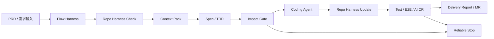
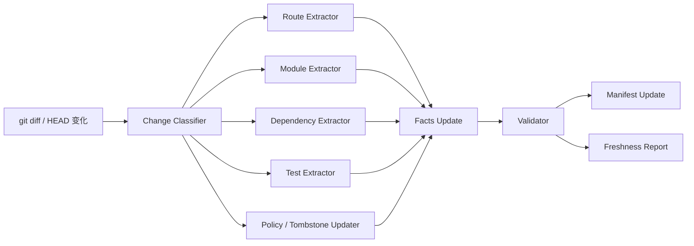

# Repo Harness 设计与可行性分析

> 本文说明 Repo Harness 在前端存量需求 Harness 中的定位、数据模型、目录协议、使用流程、风险控制和可行性。范围聚焦前端存量逻辑迭代，不讨论从零生成新页面。
>

## 1. 定位
前端存量需求的核心难点不是“生成代码”，而是让 AI 在真实、长期演进的仓库中做到：

+ 知道应该看哪里。
+ 知道应该怎么改。
+ 知道不能改哪里。
+ 知道如何验证改动没有越界。
+ 在不确定或高风险时可靠停止。

Repo Harness 是这套能力中的仓库理解层。

在完整 Harness 中，各部分职责如下：

+ **Flow / Overall Harness**：流程 owner，负责 PRD 到交付的状态机、阶段产物、门禁、恢复和交付报告。
+ **Repo Harness**：上下文 owner，负责把仓库事实、模块边界、局部规则、风险边界和验证入口沉淀成可验证上下文。
+ **Context Pack**：任务级上下文包，从 Repo Harness 中裁剪与当前需求相关的最小有效上下文。
+ **Coding Agent**：受控执行器，在 Context Pack、Policy 和 Impact Gate 约束下修改代码。
+ **Validator / Gate**：可信交付守门人，检查 facts 新鲜度、修改范围、测试结果和交付产物。

Repo Harness 不是 README，不是一次性全仓总结，也不是把代码复制给模型。它应被设计成：

> 面向 AI 协作的 repo facts 索引、导航、约束和验证系统。
>

## 2. 要解决的问题
### 2.1 避免全仓盲读
存量需求通常从 PRD、页面、菜单、路由、字段、接口或截图进入。Agent 如果每次都从 repo root 全量探索，会带来三个问题：

+ 上下文过大，噪声过多。
+ 老旧实现和新实现混杂，容易选错模式。
+ 时间不可控，难以稳定复现。

Repo Harness 需要先把需求线索映射到候选 app、route、module、page entry 和 owned paths，让 Agent 只读与任务相关的代码。

### 2.2 固化仓库事实
前端仓库中对存量修改有价值的信息包括：

+ app 列表和技术栈。
+ 路由结构和页面入口。
+ module 边界和目录结构。
+ shared package 和跨模块依赖。
+ API、store、hook、permission、feature flag、i18n、tracking。
+ 测试入口和验证命令。
+ 高风险目录、不可修改范围、历史废弃路径。

这些信息如果只靠自然语言文档维护，很容易过期。Repo Harness 必须以可验证 facts 为主，Markdown 只作为阅读层。

### 2.3 固化修改规范
不同仓库、不同模块存在大量局部约定，例如：

+ 时间戳如何展示。
+ 金额、小数、百分比如何处理。
+ 空值是否传参，如何展示占位。
+ 权限、灰度、地区差异从哪里取。
+ loading、empty、error、toast 使用哪套封装。
+ 表格、筛选、表单、弹窗应该复用哪些组件。
+ 哪些全局 hook / store / context 已经存在，不允许重复请求或重复实现。

Repo Harness 需要把这些约定拆成可执行的 policy，并在 coding 前进入 Context Pack。

### 2.4 支撑影响面分析
存量修改的风险往往不在目标页面本身，而在共享依赖：

+ 修改 shared package 会影响多个 app。
+ 修改公共 hook / util 会影响多个页面。
+ 修改路由或权限会影响菜单、面包屑、入口可见性和 E2E。
+ 修改接口字段会影响类型、mock、测试和兼容逻辑。

Repo Harness 需要提供依赖图和风险边界，让 Impact Analyzer 能判断是否允许自动进入 coding。

## 3. 设计原则
### 3.1 Facts Before Summary
Repo Harness 中的重要结论必须先有结构化 facts，再有 Markdown summary。

每条关键事实至少需要：

+ source file。
+ source range 或可定位引用。
+ last seen commit。
+ extractor 来源。
+ confidence。
+ active / tombstone 状态。

Markdown 中的模块说明、规则说明和上下文摘要，都必须能反查到 facts 或人工规则来源。

### 3.2 Route First
前端存量需求通常从页面入口切入。第一阶段应优先建立 route-first 索引：

```latex
app -> route -> page entry -> module dir -> local dependencies -> tests
```

route-first 能快速解决“这个需求应该看哪个页面和目录”的问题，是 Repo Harness 的最低可用层。

### 3.3 Boundary Before Coding
Coding 前必须明确：

+ allowed files。
+ blocked files。
+ notice required files。
+ 预计修改点。
+ 必须验证的命令和场景。
+ 不确定事项。

没有边界就不应进入自动 coding。

### 3.4 Freshness Is Trust
Repo Harness 是否可信，取决于它是否覆盖当前 `HEAD`，以及 facts 是否仍能从源码验证。

每次使用前应检查：

+ `manifest.last_indexed_commit` 是否覆盖当前 `HEAD`。
+ 目标 route/module facts 是否仍有效。
+ validator 是否通过。
+ 当前 git diff 是否触碰索引相关文件。

### 3.5 Reliable Stop
可靠停止是交付能力的一部分。

当目标模块冲突、facts 过期、影响面过大、验证环境不可用或必须触碰公共基础设施时，Repo Harness 应输出清晰的停止原因和人工接手建议，而不是鼓励 Agent 继续猜。

## 4. 总体关系


Repo Harness 在整体流程中的参与点：

| 阶段 | Repo Harness 作用 |
| --- | --- |
| PRD Intake | 提供 app、route、module、业务关键词等定位候选。 |
| Repo Harness Check | 检查 manifest、facts schema、source refs 和 stale 状态。 |
| Context Pack | 输出当前任务的最小有效上下文。 |
| Spec / TRD | 支撑 spec 引用真实 route/module，而不是抽象描述。 |
| Impact Analysis | 提供依赖图、共享包消费者、测试入口和风险边界。 |
| Implementation | 通过 policy、allowed files、blocked files 约束 diff。 |
| Verification | 提供相关验证命令、测试入口和 E2E 入口。 |
| Review / Delivery | 提供 source refs、风险说明和交付证据。 |
| Coding 后 | 根据 diff 增量更新 facts、tombstones 和 manifest。 |


## 5. 推荐目录协议
Repo Harness 建议放在 `.harness/repo`，每个需求运行产物放在 `.harness/runs/<task-id>`。

```latex
.harness/
  repo/
    AI_ENTRY.md
    manifest.json

    catalog/
      apps.md
      routes.md
      modules.md
      shared-packages.md
      tech-stack.md
      test-entrypoints.md
      commands.md

    inventory/
      frontend-scope.md
      ownership.md
      risk-boundaries.md
      tombstones.md

    rules/
      global-policy.md
      frontend-change-policy.md
      module-local-rules.md
      validation-policy.md

    data/
      apps.json
      routes.json
      modules.json
      dependencies.json
      shared-packages.json
      api.json
      state.json
      permissions.json
      tech-stack.json
      tests.json
      commands.json
      policies.json
      tombstones.json
      facts.schema.json

    context/
      packs/
        <task-id>.md
        <task-id>.json

    agent/
      update-plan.md
      extractor-registry.md
      validation-report.md
      freshness-report.md

    experience/
      bug-lessons.md
      mr-lessons.md
      blame-notes.md
      golden-set.md

  runs/
    <task-id>/
      input/
      context/
      phases/
      logs/
      state.json
```

### 5.1 文件职责
| 文件或目录 | 职责 |
| --- | --- |
| `AI_ENTRY.md` | Agent 进入仓库后的第一阅读入口，说明 repo 概况、索引入口、风险边界和使用顺序。 |
| `manifest.json` | Repo Harness 的信任入口，记录索引版本、commit、extractor 状态和 validator 结果。 |
| `catalog/` | 给人和 AI 阅读的索引摘要，例如 app、route、module、shared package。 |
| `inventory/` | 仓库范围、owner、风险边界、废弃路径等治理信息。 |
| `rules/` | 全局规则、前端存量修改规则、模块局部规则、验证策略。 |
| `data/` | 机器可读 facts，供 Context Builder、Impact Analyzer、Validator 使用。 |
| `context/packs/` | 按任务裁剪出的 Context Pack。 |
| `agent/` | extractor、validator、freshness 的运行报告和维护计划。 |
| `experience/` | bug、MR、blame、Golden Set 等经验型知识。 |


## 6. Manifest
`manifest.json` 是 Repo Harness 是否可信的入口。

示例：

```json
{
  "repo": "fms-ops",
  "harness_version": "0.1.0",
  "last_indexed_commit": "abc123",
  "last_full_rebuild_commit": "abc123",
  "last_updated_at": "2026-05-13T20:00:00+08:00",
  "extractors": {
    "apps": {
      "version": "0.1.0",
      "status": "ok",
      "record_count": 5
    },
    "routes": {
      "version": "0.1.0",
      "status": "ok",
      "record_count": 319
    },
    "modules": {
      "version": "0.1.0",
      "status": "ok",
      "record_count": 57
    }
  },
  "validation": {
    "status": "passed",
    "report": "agent/validation-report.md"
  }
}
```

使用规则：

+ `last_indexed_commit` 不覆盖当前 `HEAD` 时，需要执行 freshness check。
+ validator 未通过时，不允许直接使用 Markdown summary 进入 coding。
+ 目标模块相关 facts 过期时，需要局部重建或可靠停止。

## 7. Facts 数据模型
所有 facts 建议遵循统一最小结构。

```json
{
  "id": "string",
  "type": "app | route | module | package | api | state | permission | test | command | rule",
  "source_file": "string",
  "source_range": "optional",
  "value": {},
  "active": true,
  "last_seen_commit": "string",
  "confidence": "high | medium | low",
  "extractor": "string"
}
```

关键字段说明：

| 字段 | 说明 |
| --- | --- |
| `id` | 稳定 ID，不能依赖展示名。 |
| `type` | fact 类型，用于 validator 和 Context Builder 分类。 |
| `source_file` | 事实来源文件。 |
| `source_range` | 可选，记录行号或 AST path。 |
| `value` | 类型相关的结构化内容。 |
| `active` | 是否仍然有效。 |
| `last_seen_commit` | 最后一次从源码确认该事实的 commit。 |
| `confidence` | high / medium / low；低置信度不得直接作为唯一依据。 |
| `extractor` | 产生该 fact 的 extractor 名称和版本。 |


## 8. 核心索引内容
### 8.1 App Index
记录 repo 中的应用、技术栈、入口、脚本和验证命令。

示例：

```json
{
  "id": "app:fms-ops-agency",
  "type": "app",
  "source_file": "apps/fms-ops-agency/package.json",
  "value": {
    "app_id": "fms-ops-agency",
    "package_name": "@spx-workforceops/vue-agency",
    "root": "apps/fms-ops-agency",
    "framework": "vue2",
    "route_roots": ["src/router"],
    "dev_command": "pnpm serve:agency",
    "build_command": "pnpm build:agency"
  },
  "active": true,
  "last_seen_commit": "abc123",
  "confidence": "high",
  "extractor": "apps-extractor@0.1.0"
}
```

### 8.2 Route Index
记录 route 到 app、page entry、module、权限、菜单的映射。

示例：

```json
{
  "id": "route:fms-ops-agency:workforce-management.verification-record",
  "type": "route",
  "source_file": "apps/fms-ops-agency/src/router/verificationRecord.js",
  "value": {
    "app_id": "fms-ops-agency",
    "path": "/workforce-management/verification-record",
    "name": "VerificationRecord",
    "module_id": "workforce-management.verification-record",
    "entry_file": "apps/fms-ops-agency/src/views/workforceManagement/verification-record/index.vue",
    "permission_keys": [],
    "menu_refs": []
  },
  "active": true,
  "last_seen_commit": "abc123",
  "confidence": "medium",
  "extractor": "route-extractor@0.1.0"
}
```

Route Index 的目标不是一次性理解所有业务，而是先稳定回答：

+ 这个 URL / 菜单 / 页面属于哪个 app。
+ 页面入口文件在哪里。
+ 所属 module 目录在哪里。
+ 是否有 route-level permission 或 menu 绑定。

### 8.3 Module Index
Module Index 是 Repo Harness 的核心。它定义业务模块的代码范围、阅读顺序、关联资源和修改规则。

推荐字段：

```json
{
  "id": "module:fms-ops-agency:workforce-management.verification-record",
  "type": "module",
  "source_file": "apps/fms-ops-agency/src/views/workforceManagement/verification-record/index.vue",
  "value": {
    "module_id": "workforce-management.verification-record",
    "app_id": "fms-ops-agency",
    "business_terms": [
      "verification record",
      "workforce management",
      "agency verification"
    ],
    "owned_paths": [
      "apps/fms-ops-agency/src/views/workforceManagement/verification-record"
    ],
    "entry_files": [
      "apps/fms-ops-agency/src/views/workforceManagement/verification-record/index.vue"
    ],
    "api_files": [],
    "state_files": [],
    "local_components": [],
    "shared_dependencies": [],
    "test_files": [],
    "read_order": [
      "entry_files",
      "api_files",
      "local_components",
      "state_files",
      "tests"
    ],
    "allowed_edit_paths": [
      "apps/fms-ops-agency/src/views/workforceManagement/verification-record/**"
    ],
    "notice_required_before_editing": [
      "packages/**",
      "apps/fms-ops-agency/src/router/**",
      "global request wrapper",
      "permission config"
    ]
  },
  "active": true,
  "last_seen_commit": "abc123",
  "confidence": "medium",
  "extractor": "module-extractor@0.1.0"
}
```

Module Index 需要表达三类信息：

+ **定位信息**：模块在哪里，入口文件是什么。
+ **修改信息**：默认允许改哪里，改哪些地方前需要确认。
+ **验证信息**：相关测试和验证命令是什么。

### 8.4 Dependency Index
Dependency Index 记录跨模块影响面。

需要覆盖：

+ app 对 shared package 的依赖。
+ page / component 对 shared component、hook、util 的引用。
+ shared package 的消费者列表。
+ API client、request wrapper、i18n、permission、tracking 等横切依赖。

风险规则：

+ 修改 `packages/**` 前必须列出消费者。
+ 修改公共 hook / util 前必须做调用点分析。
+ 修改组件 props、返回值、请求参数或响应适配前必须检查所有调用点。
+ 修改 shared package 后，验证范围不能只覆盖单个目标页面。

### 8.5 API Index
API Index 记录模块使用的接口和接口契约来源。

建议字段：

+ API 方法名。
+ 请求路径。
+ 请求参数。
+ 响应结构。
+ 调用页面和调用位置。
+ mock 文件。
+ YAPI / OpenAPI / 后端 TD / OpenSpec 来源。
+ 分页、导出、权限、地区差异。

API Index 的价值在于，当 PRD 提到接口、字段或数据状态时，可以快速反向定位到页面和模块。

### 8.6 State / Hook / Context Index
记录全局状态和通用 hook，避免重复造轮子。

需要覆盖：

+ 全局 store。
+ app context。
+ user / region / station / role / permission / feature flag 获取方式。
+ mobile JSBridge 初始化。
+ copy、toast、loading、modal、tracking、request hook。

规则示例：

+ 已有全局 context 能提供的信息，不允许在页面内重复请求。
+ 已有统一 hook 的能力，不允许复制局部实现。
+ 修改初始化链路、全局 store 或 app context 前必须说明影响范围。

### 8.7 Permission / Menu / Feature Flag Index
记录页面可见性、按钮权限、地区差异和灰度控制。

需要覆盖：

+ route permission。
+ menu permission。
+ button / action permission。
+ feature flag 来源和默认值。
+ region / CID / portal / role 差异。
+ 验证方式。

这部分属于中高风险索引，第一阶段可以只记录 route-level 信息，后续再深入到 action-level。

### 8.8 Test / E2E Index
记录每个模块应该如何验证。

需要覆盖：

+ lint、typecheck、build、unit test 命令。
+ 模块对应测试文件。
+ mock 数据位置。
+ E2E 入口、前置条件、测试账号或 mock 策略。
+ 常见回归点。
+ 无法自动验证的人工验收项。

Repo Harness 不是只服务 coding，也要服务 verification 和 delivery。

### 8.9 Policy Index
Policy Index 记录全局规则和模块局部规则。

建议分为：

+ hard rule：违反后阻塞，例如 forbidden path、不得跳过测试、不得弱化断言。
+ notice rule：触发后需要人工确认，例如 shared package、路由、权限、构建配置。
+ soft guidance：建议遵循，例如优先复用模块内组件、保持命名风格。

人工规则也要有元信息：

```json
{
  "id": "rule:frontend:no-lockfile-change",
  "type": "rule",
  "source_file": ".harness/repo/rules/frontend-change-policy.md",
  "value": {
    "severity": "error",
    "scope": ["**/pnpm-lock.yaml", "**/package-lock.json", "**/yarn.lock"],
    "description": "存量小需求默认不允许修改 lockfile。"
  },
  "active": true,
  "last_seen_commit": "abc123",
  "confidence": "high",
  "extractor": "manual-rule@0.1.0"
}
```

## 9. Coding Policy
### 9.1 默认禁止
前端存量小需求默认禁止：

+ 修改 `package.json`。
+ 修改 `pnpm-lock.yaml`、`package-lock.json`、`yarn.lock`。
+ 修改构建、发布、CI、lint、prettier、tsconfig 配置。
+ 引入新依赖。
+ 做无关重构、文件搬迁、命名统一。
+ 对无关文件做格式化。
+ 修改公共组件、公共 hook、公共 util、全局样式。
+ 删除、跳过或弱化已有测试。
+ 修改自动生成文件、快照文件、构建产物。
+ 使用与当前 app 技术栈不一致的组件库或状态管理方式。

### 9.2 修改前必须告知
以下内容不是绝对禁止，但进入 coding 前必须在 Impact Report 中说明原因、影响面和替代方案：

+ `packages/**` 共享包。
+ route、menu、permission、feature flag 配置。
+ 全局 request、i18n、tracking、store 初始化。
+ workspace、build、deploy、env 配置。
+ 跨 app 共享组件。
+ 会影响地区、角色、portal、灰度策略的配置。
+ E2E 基础设施、测试框架和 mock 框架。

### 9.3 代码实现规范
Repo Harness 应记录仓库级和模块级实现规范，包括：

| 类别 | 需要沉淀的规则 |
| --- | --- |
| 请求 | 统一 request 封装、错误处理、loading、取消请求、分页参数、导出任务。 |
| 时间 | timestamp 单位、时区、展示格式、空值展示、range picker 提交格式。 |
| 数值 | 金额、小数、百分比、重量、距离、精度处理。 |
| i18n | key 命名、默认文案、禁止硬编码范围、缺失文案处理。 |
| 权限 | route、menu、button、action、接口权限和灰度开关。 |
| UI | 表格、筛选、表单、弹窗、空态、错误态、toast、loading。 |
| 路由 | route name、path、lazy load、菜单挂载、面包屑。 |
| 测试 | 单测、组件测试、E2E、mock、回归范围。 |
| Mobile | viewport height、fixed、px-to-vw、JSBridge、软键盘兼容。 |
| Shared | 消费者分析、版本影响、回归范围。 |


## 10. Context Pack
Context Pack 是 Repo Harness 融入 Flow Harness 的核心产物。它不是全仓文档，而是当前任务的最小有效上下文。

### 10.1 输入
+ PRD analysis。
+ Repo Harness facts。
+ 当前 git diff。
+ manifest 和 freshness report。
+ policy 和 risk boundaries。

### 10.2 输出结构
```latex
Context Pack
  1. Task summary
  2. Target app / route / module candidates
  3. Match confidence and reasons
  4. Confirmed entry files
  5. Read first files
  6. Related components / hooks / API / state
  7. Similar implementations
  8. Local rules
  9. Shared package dependencies
  10. Existing tests / E2E entrypoints
  11. Allowed files
  12. Blocked files
  13. Notice required files
  14. Suggested validation commands
  15. Unknowns / needs-human-confirmation
```

### 10.3 设计要求
+ 上下文围绕任务裁剪，不能追求越多越好。
+ 每条关键事实都必须有 source path。
+ 相似实现要说明相似原因。
+ 低置信度候选不能伪装成确定结论。
+ blocked files 和 notice required files 必须显式进入 coding prompt。
+ unknowns 必须保留，不能用 AI 总结抹平。

## 11. Validator 与 Gate
### 11.1 Validator 检查项
Repo Harness validator 至少检查：

+ facts schema 是否通过。
+ source file 是否存在。
+ route 是否仍可从源码解析。
+ entry file 是否存在。
+ module dir 是否存在。
+ shared package 引用是否来自 package manager 或 import graph。
+ test entry 是否存在。
+ Markdown summary 是否能反查到 facts。
+ tombstones 是否覆盖删除内容。
+ 当前 commit 是否被索引覆盖。

### 11.2 Gate 类型
| Gate | 阻塞条件 |
| --- | --- |
| Freshness Gate | manifest 过期，且命中模块相关文件发生变化。 |
| Source Ref Gate | 关键 summary 没有 source path 或 facts 支撑。 |
| Confidence Gate | 目标模块匹配置信度低于阈值。 |
| Forbidden Path Gate | 计划修改 forbidden path。 |
| Shared Impact Gate | 修改 shared package 但没有消费者分析。 |
| Route / Permission Gate | 修改路由或权限但没有影响说明。 |
| Test Mapping Gate | 用户行为变更找不到任何验证方式。 |
| Tombstone Gate | 引用了已废弃路径、模块或 API。 |
| Diff Scope Gate | 实际 diff 超出 impact report 的 allowed files。 |


Gate 可以分为：

+ `error`：必须停止。
+ `warning`：需要在 Context Pack 和 Delivery Report 中显式暴露。
+ `info`：记录证据，不阻塞。

## 12. 更新闭环
Repo Harness 不能是一次性文档，必须随代码演进持续更新。



### 12.1 触发时机
+ 每次 Harness Run 开始前。
+ Coding 阶段完成后。
+ MR 创建前。
+ CI 校验时。
+ extractor 升级后。
+ 定时全量重建时。

### 12.2 增量更新规则
| 变化 | 更新策略 |
| --- | --- |
| route 配置变化 | 重建 route facts 和受影响 module facts。 |
| page entry 变化 | 更新 module facts、local rules、test entry。 |
| package 依赖变化 | 更新 dependency facts，并触发人工确认。 |
| shared package 变化 | 更新消费者影响面。 |
| API 文件变化 | 更新 API index 和相关 module。 |
| store / hook 变化 | 更新 state / hook index 和消费者。 |
| 测试文件变化 | 更新 tests facts。 |
| 删除文件 | 写入 tombstones，并检查 stale references。 |


### 12.3 Tombstones
删除内容不能只从文档中移除，需要记录 tombstone：

+ 被删除的 route/module/package/API。
+ 删除 commit。
+ 删除来源。
+ 是否有替代模块。
+ 是否还有 stale references。

Tombstone 可以防止 Agent 遇到旧 PRD、旧截图、旧 issue 时继续引用已废弃路径。

## 13. 索引分级
Repo Harness 不需要第一阶段覆盖所有对象，建议分层落地。

### P0：App / Route / Command Index
最低可用层。

包含：

+ app 列表。
+ app root、技术栈、启动命令、构建命令。
+ route root。
+ route -> page entry。

目标：

+ 从 PRD 中的页面、URL、菜单、文案线索定位到 app 和入口文件。

### P1：Module Index
进入 coding 前的核心层。

包含：

+ route -> module -> page entry -> owned folder。
+ 模块业务关键词。
+ allowed paths、blocked paths、read order。
+ 模块级验证入口。

目标：

+ 把全仓阅读变成模块阅读。

### P2：Dependency / Shared Index
影响面分析层。

包含：

+ shared package 消费者。
+ shared component / hook / util 调用关系。
+ app 依赖图。
+ local import graph。

目标：

+ 避免修改公共能力后只验证单个页面。

### P3：State / API / Permission / Test Index
行为正确性层。

包含：

+ API 调用图。
+ store/context/hook 使用关系。
+ permission、menu、feature flag。
+ tests、mock、E2E。

目标：

+ 支撑复杂业务状态和测试映射。

### P4：Experience / Behavioral Index
深度行为层。

包含：

+ 关键业务流程。
+ MR lessons。
+ bug lessons。
+ blame notes。
+ Golden Set。
+ module-level local rules。
+ similar implementation index。

目标：

+ 面向复杂重构、跨模块需求、自动评估和持续学习。

## 14. 可行性分析
### 14.1 结论
Repo Harness 方案在当前前端存量需求场景下具备较高可行性，但应按 P0-P4 分层建设。

第一阶段不建议追求“全仓深度理解”或“所有需求自动闭环”。更可行的目标是：

+ 稳定定位 app、route、module、page entry。
+ 输出可信 Context Pack。
+ 建立 forbidden / notice / allowed 修改边界。
+ 支撑小需求和部分中风险需求的自动或半自动 coding。
+ 在高风险场景可靠停止，并输出可接手报告。

### 14.2 当前仓库支撑条件
以当前 monorepo 结构观察，Repo Harness 具备落地基础：

+ 仓库使用 pnpm workspace / Lerna / Nx，app 和 package 边界相对明确。
+ 主要 app 位于 `apps/*`，共享包位于 `packages/*`。
+ 根 `package.json` 已提供 `serve:*`、`build:*`、`lint:*` 等脚本入口。
+ `openspec/` 已存在需求规格化文档和变更目录。
+ 多个 app 已有 README 或模块文档，可作为初始人工规则来源。
+ 路由配置在各 app 内有相对固定入口，例如 Vue app 的 `src/router/**`、mobile 的 `src/pages/**`。

这些条件足以支撑 P0/P1 的 deterministic extractor。

### 14.3 能力可行性拆解
| 能力 | 可行性 | 原因 | 主要风险 |
| --- | --- | --- | --- |
| App Index | 高 | app package 和 workspace 结构明确。 | app 元信息可能散落在 README、脚本和构建配置中。 |
| Command Index | 高 | 根 `package.json` 已有明确脚本。 | 不同 app 的参数和环境变量需要补充说明。 |
| Route Index | 中高 | route 配置和 page 目录存在固定模式。 | 动态 import、条件路由、菜单配置可能需要 AST parser 和人工规则补充。 |
| Module Index | 中高 | page entry 和目录可从 route 推导。 | module 边界不总是等于目录边界，需要 owner 和人工修正。 |
| Dependency Index | 中 | import graph 可自动提取。 | JS/Vue 动态引用、alias、barrel export 会降低准确率。 |
| API Index | 中 | API 调用可通过 request wrapper 和命名约定抽取。 | 接口路径可能动态拼接，YAPI/OpenAPI 关联需要额外来源。 |
| State / Hook Index | 中 | store、hook、context 可通过文件约定和 import graph 提取。 | Vue/React/Mobile 多技术栈并存，规则需要分 app 维护。 |
| Permission / Feature Flag Index | 中 | route/menu/permission 配置可提取一部分。 | action-level 权限和地区差异常散落在业务代码中。 |
| Test / E2E Index | 中 | 测试文件和脚本可索引。 | 历史测试覆盖不足或 E2E 环境不稳定会限制自动闭环。 |
| Local Rules | 中 | 可从相邻代码、MR、bug、人工规则沉淀。 | AI 总结必须有 source refs，否则容易变成不可信经验。 |
| Golden Set | 中 | 可以从典型需求和历史 MR 构建。 | 需要持续维护，且评估标准要稳定。 |


### 14.4 适合自动闭环的需求
Repo Harness 第一阶段更适合支撑以下需求：

+ 表格字段展示调整。
+ 筛选项新增或调整。
+ 表单字段和校验的局部调整。
+ 简单按钮状态和文案调整。
+ 简单权限展示逻辑。
+ 接口字段映射调整。
+ 单页面内的 loading、empty、error 状态补齐。

前提条件：

+ 目标 route/module 明确。
+ 相似实现明确。
+ 不需要修改 shared package 或工程配置。
+ 验收条件可以映射到测试或人工检查。

### 14.5 适合半自动的需求
以下需求可以由 Repo Harness 支撑分析和部分实现，但需要人工确认：

+ 跨组件状态流转。
+ 多页面联动。
+ 接口请求/响应结构变化。
+ 权限逻辑变更。
+ 复杂表单校验。
+ 涉及 feature flag、region、role 的行为差异。
+ 需要补充测试或 mock 基础设施。

这类需求需要：

+ 完整 Impact Report。
+ allowed / blocked / notice files。
+ 人工确认高风险点。
+ 更强 AI CR 和验证闭环。

### 14.6 不建议自动闭环的需求
以下需求应由 Repo Harness 输出分析报告和人工实施建议，不建议直接自动 coding：

+ 改构建体系。
+ 改权限体系。
+ 改公共组件语义。
+ 改 shared package API。
+ 大范围架构迁移。
+ 多端联动且无法稳定验证。
+ 需求和代码现状冲突。
+ 后端接口语义不明确。
+ E2E 或替代验证完全不可用。

### 14.7 主要风险
1. **索引过期**
    - 风险：Agent 使用旧 route、旧模块、旧规则。
    - 缓解：manifest、last_seen_commit、freshness check、CI validator、定时全量重建。
2. **AI summary 失真**
    - 风险：Markdown 看起来合理，但没有源码依据。
    - 缓解：facts-first、source refs、markdown back-reference check。
3. **模块边界误判**
    - 风险：目录边界不等于业务边界，导致漏改或误改。
    - 缓解：confidence、多个候选、owner review、Context Pack unknowns。
4. **共享依赖影响面不足**
    - 风险：修改公共 hook/util 后只测目标页面。
    - 缓解：Dependency Index、Shared Impact Gate、消费者测试建议。
5. **多技术栈复杂度**
    - 风险：Vue、React、Mobile H5 的路由、状态、样式、测试方式不同。
    - 缓解：extractor 按 app/framework 分层，policy 按 app scope 生效。
6. **测试环境限制**
    - 风险：验证不足导致无法证明改动安全。
    - 缓解：Test Index、替代验证、Delivery Report 中记录未覆盖项。
7. **PRD 线索不足**
    - 风险：无法定位模块却继续猜。
    - 缓解：Eligibility Gate、Reliable Stop、人工确认问题列表。

### 14.8 成本评估
落地成本主要分为四类：

+ **Extractor 成本**：解析 package、route、module、import graph、tests。
+ **Validator 成本**：schema、source refs、freshness、diff scope、tombstone。
+ **规则治理成本**：人工规则、owner、review cycle、过期规则清理。
+ **评估成本**：Golden Set、典型需求样本、成功率和失败拦截率统计。

其中 P0/P1 成本可控，且收益直接；P3/P4 需要持续运营，不适合作为第一阶段阻塞项。

## 15. 推荐落地路径
### Phase 0：协议和样例
目标：

+ 固定 `.harness/repo` 目录协议。
+ 定义 facts schema。
+ 定义 manifest。
+ 手工维护 1-2 个典型模块样例。

交付物：

+ `AI_ENTRY.md`
+ `manifest.json`
+ `data/facts.schema.json`
+ `catalog/apps.md`
+ `catalog/routes.md`
+ `catalog/modules.md`
+ `rules/frontend-change-policy.md`

### Phase 1：Route-first MVP
目标：

+ 自动生成 App Index、Command Index、Route Index、Module Index。
+ 能从 PRD 线索生成 Context Pack。
+ 能输出 allowed / blocked / notice files。

交付物：

+ `repo-harness init`
+ `repo-harness check`
+ `repo-harness context --task <task-id>`
+ `data/apps.json`
+ `data/routes.json`
+ `data/modules.json`
+ `data/commands.json`
+ `agent/freshness-report.md`

成功标准：

+ 常见页面需求能定位到正确 app 和 page entry。
+ Context Pack 能把阅读范围收敛到模块级。
+ 修改前能明确 forbidden 和 notice 范围。

### Phase 2：Impact MVP
目标：

+ 增加 dependency、shared package、tests、API 基础索引。
+ 支撑 Impact Gate。
+ 支撑 coding 后增量更新。

交付物：

+ `repo-harness update`
+ `repo-harness validate`
+ `data/dependencies.json`
+ `data/shared-packages.json`
+ `data/api.json`
+ `data/tests.json`
+ `inventory/risk-boundaries.md`
+ `inventory/tombstones.md`

成功标准：

+ 修改 shared package 前能列出消费者。
+ 修改 route/module 后能更新 facts。
+ validator 能发现 stale facts 和 deleted path。

### Phase 3：Rules & Verification
目标：

+ 沉淀仓库级和模块级 coding policy。
+ 增加 state、permission、feature flag、E2E 索引。
+ 将验证计划与验收条件关联。

交付物：

+ `data/state.json`
+ `data/permissions.json`
+ `rules/module-local-rules.md`
+ `rules/validation-policy.md`
+ `catalog/test-entrypoints.md`

成功标准：

+ Context Pack 能提供局部实现规则。
+ Test Plan 能覆盖验收条件和风险点。
+ Delivery Report 能说明已验证和未覆盖内容。

### Phase 4：Experience & Evaluation
目标：

+ 从 MR、bug、blame、历史测试失败中沉淀经验。
+ 建立 Golden Set。
+ 评估 Repo Harness 对定位准确率、自动闭环率、失败拦截率的提升。

交付物：

+ `experience/bug-lessons.md`
+ `experience/mr-lessons.md`
+ `experience/blame-notes.md`
+ `experience/golden-set.md`
+ 评估报告。

成功标准：

+ 能量化通用层和业务层知识的收益。
+ 能发现高频失败原因并反向改进 extractor、policy 和 validator。

## 16. 成功指标
Repo Harness 的效果不应只看“能生成多少代码”，更应看：

| 指标 | 说明 |
| --- | --- |
| 代码定位准确率 | PRD 是否定位到正确 app、route、module、entry file。 |
| 上下文压缩率 | Context Pack 是否显著减少需要阅读的文件数量。 |
| 规则遵循率 | 是否遵守 forbidden / notice / allowed 修改边界。 |
| 影响面召回率 | 是否发现 shared、API、permission、test 等相关影响面。 |
| 自动闭环率 | 低风险需求是否能完成 coding、验证和交付报告。 |
| 失败拦截率 | 高风险或不确定需求是否可靠停止。 |
| MR 首轮通过率 | 产物是否更容易被 reviewer 接受。 |
| 返工率 | 是否减少人工大幅重写。 |


## 17. 设计边界
Repo Harness 不承担以下职责：

+ 不替代 FE review。
+ 不保证所有需求自动闭环。
+ 不把 Markdown summary 作为唯一事实源。
+ 不在没有验证的情况下鼓励修改公共基础设施。
+ 不替代源码阅读；它负责缩小阅读范围和给出规则。
+ 不用向量检索替代结构化 facts。

Repo Harness 的合理目标是让低风险需求更稳定自动化，让中风险需求更容易半自动化，让高风险需求更早停止并更容易人工接手。

## 18. 总结
Repo Harness 是前端存量需求 AI 交付体系的上下文底座。

它将 repo 中分散的路由、模块、依赖、API、状态、权限、测试、规则和历史经验，整理成可验证、可更新、可裁剪的 facts 系统，并通过 Context Pack 提供给 Flow Harness、Impact Analyzer、Coding Agent、Test Agent 和 Review Agent。

可行的建设方式不是一次性追求全仓深度智能，而是从 route-first 的 P0/P1 索引开始，逐步扩展到依赖影响面、行为验证、局部规则和历史经验。

当 Repo Harness 能做到 facts 可追溯、上下文可裁剪、边界可检查、风险可停止、结果可评估时，AI 才能在前端存量仓库里从“会写代码”进化为“可控交付”。
