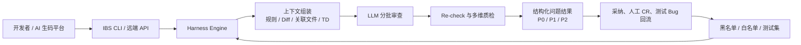

# IBS AI CR：从本地智能审查到公司级质量能力

> 基于《IBS_AI_CR.pptx》重构。数据口径截至 2026 Q1；本文件用于清晰说明方案、能力边界与演进方向。

## 一句话总结

IBS AI CR（AICR）不是让大模型独立完成一次代码审查，而是用 **规则、上下文、工程化编排、质量校验和数据回流** 约束并增强模型，让 AI 审查在研发本地和远端流水线中稳定发现真实缺陷，并逐步沉淀为 Skynet AICR 的业务能力。

## 为什么要做

- **人工 CR 覆盖和效率不足**：25-Q2 的人工 MR Review 发现问题较少，平均每个 MR 的有效评论约为 **0.1**。
- **质量要求与现实存在差距**：前端 Non-Live Bug 仍有明显改善空间。PPT 中的趋势图显示，月均线下 Bug 从 **25Q2 的 343**、**25Q3 的 334**，下降到 **25Q4 的 231**、**26Q1 的 196**；IBS AICR 的前端规模化引入点位于 25Q3 之后。
- **AI 生码需要质量门禁**：IBS、FeatureFlow、SCTP Coding Bot 等工具正在扩大 AI 生码范围，代码生成之后仍需要可靠的缺陷发现与修复闭环。

## 已取得的进展

截至 2026 Q1，IBS AICR 累计发现 **1,497** 个有效问题：

| 阶段 | 有效问题数 |
| --- | ---: |
| 25Q3 | 265 |
| 25Q4 | 580 |
| 26Q1 | 652 |

- **整体采纳率：63.82%**
- **整体召回率：41%**

这里的“有效问题”指会引发线上/线下 Bug，或可能导致边界场景出错的隐性缺陷；不包含代码格式、缩进、变量命名等中低风险问题。

## 演进路线

| 阶段 | 定位 | 关键工作 | 主要结果 |
| --- | --- | --- | --- |
| 25Q2–25Q3 | 标杆场景 POC | 在 Cursor 本地审查中结合工程代码上下文；支持直接给出建议并辅助修复 | 验证本地 AICR 能力，采纳率约 10% |
| 25Q4 | 业务线规模化 | 规则库、链式提示词、重检、质量卡点、指标采集与数据回流 | 采纳率约 60%，召回率约 40%；SSC FE 覆盖 100%，SSC BE 覆盖 30%；接入 IBS Agent、FeatureFlow、SCTP Coding Bot |
| 26Q1 起 | 与 Skynet 共建 | 远端 AICR、成本优化、平台与业务分层 | 已实现 Token 消耗降低 40%；目标帮助 Skynet 的采纳率、召回率各提升 10% |

## 核心设计：Prompt + Harness

IBS AICR 的关键区别，是将 LLM 的职责收敛为“审查”，并用服务端 Harness 驱动流程、组织上下文、校验产物和处理回流数据。

与之相比，纯提示词驱动的方式要求 LLM 自行执行计划、拉取上下文、逐批审查、检查、去重和收尾等十余步。在大型任务中，这种方式更容易发生跳步、敷衍处理、遗漏上下文或幻觉。Harness 将会话与状态、调度与并发、上下文供给、结果收敛分别工程化，LLM 只需要专注审查任务。

## 如何提升采纳率：让每一条建议更可信

采纳率解决的是“问题找得准不准”。IBS AICR 主要处理三类根因。

### 1. 从通用规则到团队规则

- 使用 SSC 通用规则，覆盖安全、规范、可维护性、可扩展性、性能、健壮性六类问题。
- 使用四级严重度（5–2 分）描述严重问题、潜在风险、建议型问题和适当关注项。
- 引入仓库级 Cursor Rules，让团队将自身的审查规范纳入模型上下文。
- 沉淀前端 40+、后端 20+ 条经典坑点规则，覆盖 JS、Java、Go 三类技术栈。

### 2. 从 Diff 到完整工程上下文

- 将语义接近的改动文件分组，避免同一模块被割裂审查。
- 用 Cursor CodeBase 获取改动文件的未改动关联代码。
- 后续引入 Context Engine，进一步分析并补充影响文件、接口和业务资料。

### 3. 从一次输出到持续纠偏

- 审查结束后由 Re-check Agent 二次过滤，排除误判、错误建议与重复建议。
- 用户未采纳的问题按“用户 + 仓库”维度蒸馏为黑名单记忆，降低同类误报再次出现的概率。

## 如何提升召回率：让 AI 审查过程可控、可验证

召回率解决的是“真实缺陷找得全不全”。大型 MR 中，模型受上下文窗口和任务长度影响，可能加速处理或跳过步骤。AICR 通过以下机制降低漏检。

### 工程化编排

- 将大型 MR 按语义分组，通常每批处理 **800–1200 行**代码。
- 用状态机驱动 `init → ready → reviewing → completed`，失败任务进入可控恢复路径。
- 用链式提示词约束单批任务按“审查 → 验证 → 输出 → 下一批”循环执行。

### 外部质量卡点

- **耗时校验**：依据代码行数、单行审查耗时与可配置系数判断审查是否过快。
- **问题密度校验**：依据代码行数与预期问题数量判断是否需要复审。
- **结果结构校验**：核对问题分类、评分、描述与代码定位是否完整、合理。

### 白名单和测试集回流

- 收集人工 CR 与测试发现的问题，以需求为维度识别“原本可由 AICR 召回”的缺陷。
- 将高频漏报沉淀为 CR 白名单、Bug 白名单；同时建设基准与业务测试集。

## 指标口径

| 指标 | 含义 | 计算方式 |
| --- | --- | --- |
| 采纳率 | AI 找得是否准确 | 被研发采纳的 AI 问题数 ÷ AI 发现问题数 |
| Bug 召回率 | AI 找得是否全面 | 被采纳的 AI Bug ÷（被采纳的 AI Bug + 人类 CR Bug + Test Bug） |
| F1 Score | 准确与全面的综合表现 | `2 × 采纳率 × 召回率 ÷ (采纳率 + 召回率)` |

## 总体架构与能力地图

### 触发与审查链路

1. 开发者通过 IBS CLI 提交 commit、branch 或 MR；外部平台通过远端 API 接入。
2. 服务端收集 Diff、仓库规则、关联文件、YAPI、PRD/TD、知识库等上下文。
3. Harness 对任务分批、调度并发、发起审查、回收结果并执行 Re-check/LLM-as-Judge。
4. 输出结构化审查结果，供本地对话、平台质量报告、看板和后续质量门禁消费。
5. 将 Bad Case、人工 CR 和测试 Bug 经过分析/类聚，沉淀为黑名单、白名单与测试集，进入下一轮审查。

### 平台与业务分层

- **Skynet ACR 平台层**：审查规则、上下文接入、批次规划、会话中断/恢复、执行审查与上报、误报过滤、TD 缺失识别、工程化编排/验证、进阶审查、指标采集与回召，以及 CLI、MCP、Portal、Server、数据中心和外部服务集成。
- **SSC 业务层**：前后端最佳实践规则、YAPI、FE/BE TD、业务知识库、FeatureFlow/IBSFlow/CodeFlow 等生码场景，以及接口定义和 Bug 数据对接。
- **原则**：平台提供可复用的通用能力；业务侧提供领域规则、上下文和反馈闭环。这样既避免每个业务重复搭建 AICR，也保留业务定制空间。

## 远端 CR：把审查变成质量门禁能力

远端 AICR 面向 FeatureFlow、IBS 生码 Agent、SCTP Coding Bot 等自动化生码平台。标准流程为：

1. 业务方或 CI 通过统一协议发起调用。
2. AICR 远端 API 完成鉴权、白名单和任务入队。
3. 服务端克隆远程 Git 代码，在 MCP + CLI 配合下进行分批多轮审查。
4. 将 P0/P1/P2 结构化结果、质量报告和看板回传给调用方，作为后续动作或发布质量门禁。

远端服务的演进重点包括：并发控制与分布式调度、Git/LLM 外部调用熔断、重试与限流恢复、进程/队列/I/O/业务四维监控、Grafana 与 SeaTalk 告警，以及把非 CR 模块剥离、以 Go 重构专用服务。

## 与 Skynet 的共建方向

IBS AICR 将聚焦成本降低、召回率提升、远端 AICR 及 SSC 业务层能力，并与 Skynet AICR 合并共建。

| 工作项 | 现状与痛点 | 行动 | 目标 / 预期 | 状态 |
| --- | --- | --- | --- | --- |
| 成本降低 | 中大型需求单次审查约 20–30 美元；Cursor 2026 Q2 定价变化后成本压力增加 | 服务端管理流程；废弃 resume Agent；将单批工具调用从约 15 轮降至约 5 轮；全链路 Token 监控与压缩 | 平均 Token 成本降低 40% | Doing |
| 召回率提升 | 复杂任务中容易遗漏上下文 | 用问题密度等质检机制引导补审 | 从约 40% 提升至 50% | Doing |
| 采纳率提升 | IBS/Skynet 仍有噪音空间 | 分批验收、代码上下文增强、黑名单回流 | 从 60%+ 提升至 65%+ | Waiting |
| 平台与业务分层 | 平台难覆盖各业务的 YAPI、TD、知识库与反馈需求 | 接入业务资料并沉淀通用接入方案 | 在供应链形成标杆，并支持更多部门接入 | Doing |
| 远端 CR 服务 | 当前并发约 5，难承接更多自动化场景 | 拆分专用服务、Go 重写、迁移至 Skynet | SSC 支持 20+ 个大型审查任务并发 | Doing |

## 结论

IBS AICR 已从本地 POC 演进为具备可量化效果、可复用工程底座和远端接入能力的质量保障体系。下一阶段的关键不只是“调用更强的模型”，而是继续把业务知识、质量规则、工程编排、可观测性和缺陷反馈闭环接入 Skynet 平台，使 AI 生码的质量保障成为可规模化交付的基础能力。
