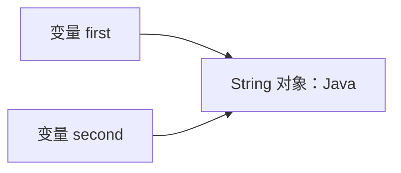
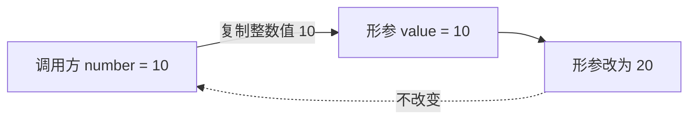
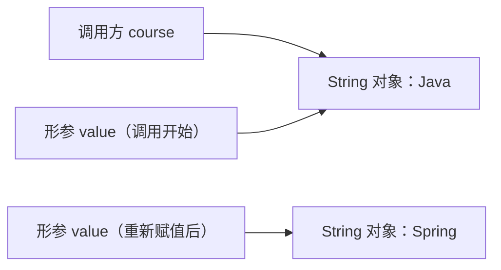

# 第 6 章　引用、值传递和相等性

> 学习提示：从变量和赋值开始逐节运行示例；本章会先补足方法传参所需的最小语法，不限制完成时间  
> 一句话总结：Java 的变量保存值，赋值和方法调用都会复制值；引用类型复制的是引用值，`==` 与 `equals` 回答的则是两类不同的相等问题。

## 一、变量和值

### 1.1 变量是一个有类型的名字

先看一行最普通的 Java 代码：

```java
int quantity = 2;
```

这行代码做了三件事：

1. `int` 规定变量能保存哪一类值。
2. `quantity` 是变量名。
3. `= 2` 把整数值 `2` 赋给这个变量。

可以把声明变量的基本格式写成：

```text
数据类型 变量名 = 初始值;
```

变量不是值本身。它是程序中用来保存和读取值的位置，并且有确定的类型。后续再次赋值时，变量保存的值会被替换：

```java
int quantity = 2;
quantity = 3;

System.out.println(quantity); // 输出 3
```

### 1.2 基本类型变量直接保存基本值

Java 有八种基本类型。第 5 章已经介绍了它们，这里只看与本章有关的共同点：基本类型变量保存数值、字符或布尔值。

```java
int age = 20;          // 整数值
double price = 19.9;   // 浮点值
char level = 'A';      // 字符值
boolean paid = false;  // 布尔值
```

把一个基本类型变量赋给另一个变量时，值会被复制：

```java
int first = 10;
int second = first;

second = 20;

System.out.println(first);  // 10
System.out.println(second); // 20
```

执行 `int second = first;` 后，`first` 和 `second` 各自保存一个整数值 `10`。修改 `second` 不会影响 `first`。

## 二、对象与引用

### 2.1 引用类型变量保存引用值

String、数组以及后面要学习的自定义类都属于引用类型。引用类型变量保存的不是对象本体，而是一个能够指向对象的[[引用]]值。

```java
String course = new String("Java");
```

这行代码可以分成两部分理解：

- `new String("Java")` 创建一个 String 对象。
- `course` 保存指向这个对象的引用值。

Java 语言规范没有要求这个引用值必须是程序员可以直接读取的内存地址。现阶段把它理解成“可以找到某个对象的值”就够了。引用不是对象本身，也不是 C 语言中可以做地址运算的指针。

### 2.2 引用赋值也会复制值

引用类型仍然遵守普通赋值规则：右侧的值被复制给左侧变量。

```java
String first = new String("Java");
String second = first;
```

`second = first` 没有复制 String 对象。它复制的是 `first` 保存的引用值。结果是两个变量指向同一个对象：



此时有两个变量，但只有一个 String 对象。像这种多个变量指向同一个对象的关系，有时也称为别名关系。

可以用引用类型的 `==` 验证它们是否指向同一对象：

```java
System.out.println(first == second); // true
```

### 2.3 `null` 表示当前没有指向对象

引用类型变量还可以保存特殊值 `null`：

```java
String name = null;
```

它表示 `name` 当前没有指向任何 String 对象。`null` 不是空字符串，也不是一个内容为空的对象。

```java
String empty = "";

System.out.println(name == null);  // true
System.out.println(empty == null); // false
```

对 `null` 调用实例方法会抛出 `NullPointerException`：

```java
String name = null;
System.out.println(name.length()); // 运行时抛出 NullPointerException
```

本章先记住检查方式 `name == null`。第 11 章会系统讲异常，第 15 章会继续讨论如何表达“可能没有结果”。

## 三、方法传参所需的最小语法

值传递发生在方法调用时。为了不使用尚未解释的代码，这一节先把本章需要的方法语法讲清楚。

### 3.1 方法把一段操作命名

下面是一个最小方法：

```java
static void printCourse(String name) {
    System.out.println(name);
}
```

逐项看这段代码：

| 代码 | 本章需要理解的含义 |
| --- | --- |
| `static` | 这个方法可以直接从 `main` 方法调用。完整含义在第 8 章讲解 |
| `void` | 方法执行后不返回结果 |
| `printCourse` | 方法名 |
| `String name` | 方法接收一个 String 类型的参数，方法内部用 `name` 访问它 |
| `{ ... }` | 方法体，也就是调用时执行的语句 |

调用方法时这样写：

```java
printCourse("Java");
```

调用处写入的 `"Java"` 叫[[实参]]。方法声明中的 `String name` 叫[[形参]]。调用发生时，实参的值会交给形参使用。

### 3.2 方法在类中的位置

方法不能定义在 `main` 方法内部。一个可以直接运行的完整结构如下：

```java
public class MethodDemo {
    public static void main(String[] args) {
        printCourse("Java"); // 调用方法
    }

    static void printCourse(String name) {
        System.out.println(name);
    }
}
```

这段代码只用于确认方法的定义位置和调用方式。`public`、`class`、`main` 是第 4 章已经出现过的程序结构；这里新增的是形参与实参两个词。

## 四、Java 的值传递

### 4.1 值传递的含义

Java 调用方法时，会把每个实参的值复制给对应形参。这种规则叫[[值传递]]。

形参是方法自己的局部变量。方法修改形参，首先改变的是这份复制得到的值，不会直接替换调用方变量保存的值。

### 4.2 基本类型传递的是基本值副本

先看基本类型：

```java
static void changeNumber(int value) {
    value = 20;
}
```

调用它：

```java
int number = 10;
changeNumber(number);

System.out.println(number); // 10
```

调用过程可以拆成四步：

1. 读取 `number` 保存的整数值 `10`。
2. 把 `10` 复制给形参 `value`。
3. 方法把自己的 `value` 改成 `20`。
4. 方法结束，调用方的 `number` 仍保存 `10`。



### 4.3 引用类型传递的是引用值副本

引用类型没有换一套传参规则。方法复制的仍然是值，只是这次复制的是引用值。

```java
static void changeText(String value) {
    value = "Spring";
}
```

调用它：

```java
String course = "Java";
changeText(course);

System.out.println(course); // Java
```

调用开始时，`course` 保存的引用值被复制给形参 `value`，两者起初指向同一个 String 对象。`value = "Spring"` 只让形参改为指向另一个对象，没有改写调用方变量 `course`。



因此，“基本类型是值传递，引用类型是引用传递”这句话不准确。两类参数都是值传递，区别只在于被复制的值是什么。

### 4.4 修改共同对象与替换形参是两件事

前面的 String 对象不可变。为了观察可变对象，先认识一个只用于演示的 JDK 类 `StringBuilder`。它是可修改的文本容器：`new StringBuilder("Java")` 创建对象，`append` 在原对象后追加内容。

```java
StringBuilder text = new StringBuilder("Java");
text.append(" 17");

System.out.println(text); // Java 17
```

把它传给方法：

```java
static void addVersion(StringBuilder value) {
    value.append(" 17");
}
```

```java
StringBuilder course = new StringBuilder("Java");
addVersion(course);

System.out.println(course); // Java 17
```

形参仍然只是引用值副本，但两个引用值指向同一个可变对象。方法通过形参找到该对象并修改了对象内部的内容，所以调用方能够观察到变化。

对比下面两类动作：

| 方法内部的动作 | 调用方是否能观察到 | 原因 |
| --- | --- | --- |
| `value.append(" 17")` | 能 | 形参与调用方变量指向同一个可变对象 |
| `value = new StringBuilder("Spring")` | 不能 | 只替换形参自己保存的引用值 |
| 返回新对象，并由调用方重新赋值 | 能 | 调用方主动保存了返回的引用值 |

需要让调用方改用新对象时，使用返回值会更清楚：

```java
static String replaceCourse(String ignored) {
    return "Spring";
}

String course = "Java";
course = replaceCourse(course);
```

## 五、`==` 的比较规则

### 5.1 基本类型的 `==` 比较值

对数值、字符和布尔值，`==` 比较两边的基本值是否相等：

```java
int first = 10;
int second = 10;

System.out.println(first == second); // true
```

数值比较时还可能发生类型提升。例如 `10 == 10L` 的结果是 `true`，因为比较前 `int` 值会转换为 `long`。类型转换的规则已经在第 5 章讲过。

### 5.2 引用类型的 `==` 比较对象身份

对引用类型，`==` 判断两个引用值是否指向同一个对象，或者是否同时为 `null`。它回答的是[[对象身份]]问题。

```java
String first = new String("Java");
String second = first;
String third = new String("Java");

System.out.println(first == second); // true
System.out.println(first == third);  // false
```

`first` 与 `second` 指向同一个对象，所以结果是 `true`。`first` 与 `third` 指向两个分别创建的对象，即使字符内容一样，结果仍是 `false`。

## 六、`equals` 的相等规则

### 6.1 `equals` 通常用于比较内容或业务值

很多引用类型会通过 `equals` 定义“内容相同”或“业务值相同”。这种规则在本课程中称为[[业务相等性]]。

String 的 `equals` 按字符序列比较：

```java
String first = new String("Java");
String second = new String("Java");

System.out.println(first == second);      // false
System.out.println(first.equals(second)); // true
```

两行结果并不矛盾：

- `first == second` 问的是“是不是同一个 String 对象”。
- `first.equals(second)` 问的是“字符内容是否相同”。

### 6.2 String 内容比较不使用 `==`

字符串字面量可能被 JVM 复用：

```java
String first = "Java";
String second = "Java";

System.out.println(first == second); // 在这个例子中是 true
```

这个结果来自字符串常量的复用，不代表 `==` 可以比较字符串内容。字符串来自 `new`、文件、数据库、HTTP 请求或运行时拼接时，身份可能不同。

业务代码比较 String 内容时使用 `equals`：

```java
String status = new String("PAID");

if (status.equals("PAID")) {
    System.out.println("订单已支付");
}
```

如果变量可能为 `null`，可以把已知不会为 `null` 的常量放在前面：

```java
if ("PAID".equals(status)) {
    System.out.println("订单已支付");
}
```

`"PAID"` 一定是 String 对象，因此不会因为 `status` 为 `null` 而抛出 `NullPointerException`。

### 6.3 自定义类型不会自动获得业务相等规则

所有类都从 Object 继承 `equals`。如果自定义类没有重写它，默认行为与对象身份密切相关，通常不会按字段内容比较。

第 8 章会完整学习自定义类，第 9 章会看到 record 如何自动生成基于组件值的 `equals`。本章先记住一个设计问题：两个对象在业务上相等，需要由类型明确说明“哪些数据参与相等判断”。

## 七、`equals` 与 `hashCode`

### 7.1 哈希值是查找时使用的辅助值

Object 还定义了 `hashCode` 方法，它返回一个整数哈希值。HashSet 和 HashMap 等哈希集合会先借助哈希值缩小查找范围，再使用 `equals` 判断是否真的相等。

集合会在第 13 章系统讲解。现在只需要掌握契约：

- 如果两个对象的 `equals` 结果为 `true`，它们的 `hashCode` 必须相同。
- 两个对象的哈希值相同，不代表 `equals` 一定为 `true`。

因此，自定义类重写 `equals` 时通常也要重写 `hashCode`。只改其中一个，会让对象放入哈希集合后出现查找、去重或删除异常。

### 7.2 参与哈希的字段应保持稳定

对象进入 HashSet 或作为 HashMap 的 key 后，如果参与 `equals` 和 `hashCode` 的字段发生变化，集合可能仍在旧哈希位置寻找它。代码手里明明有这个对象，集合查找却可能失败。

这是后续设计值对象时偏好不可变数据的一个原因。此处先建立风险意识，不需要提前实现完整的 `equals`/`hashCode`。

## 八、`final` 引用与不可变对象

`final` 修饰引用变量时，限制的是变量不能再次保存另一个引用值：

```java
final StringBuilder text = new StringBuilder("Java");
text.append(" 17"); // 可以：修改的是对象
```

下面的重新赋值不能编译：

```java
final StringBuilder text = new StringBuilder("Java");
text = new StringBuilder("Spring"); // 编译错误
```

所以，“引用不能重新赋值”和“对象不能修改”不是同一件事。String 自身不可变；StringBuilder 可变，即使保存它的变量带有 `final`，对象仍然可以变化。

## 九、后端代码中的简单应用

基础规则掌握后，再看一个接近 Web 后端的场景。HTTP 请求中的状态值通常会被解析为 String。下面的判断存在风险：

```java
String status = new String("PAID"); // 模拟从外部得到的新字符串对象

if (status == "PAID") {
    System.out.println("执行已支付逻辑");
}
```

字符内容相同，但两个引用不一定指向同一个对象，这段分支可能不执行。改为内容比较：

```java
if ("PAID".equals(status)) {
    System.out.println("执行已支付逻辑");
}
```

状态集合固定时，后续还会学习用 enum 表达状态。当前要解决的只有一件事：看到引用类型比较，先确认需要比较对象身份还是内容。

## 十、本章练习

### 10.1 预测输出

下面的程序只使用本章已经解释过的 String、赋值、`==`、`equals` 和方法传参：

```java
public class ReferencePractice {
    public static void main(String[] args) {
        String course = new String("Java");
        String alias = course;
        String sameText = new String("Java");

        System.out.println(course == alias);          // 1
        System.out.println(course == sameText);       // 2
        System.out.println(course.equals(sameText));  // 3

        change(course);
        System.out.println(course);                   // 4
    }

    static void change(String value) {
        value = "Spring";
    }
}
```

先不要运行。写出四行输出，并为每一行说明比较或传递的对象是什么。然后再编译运行，对照实际结果。

### 10.2 参考答案与判分

1. `true`：`alias = course` 复制了引用值，两者指向同一个 String 对象。
2. `false`：两次 `new String("Java")` 分别创建对象，对象身份不同。
3. `true`：String 的 `equals` 按字符内容比较。
4. `Java`：方法得到引用值副本，给形参 `value` 重新赋值不会替换调用方变量 `course`。

四行输出各 1 分，四条解释各 1 分。解释中必须区分“变量”“引用值”“对象”和“内容相等”；只写“这是引用传递”不得分。

### 10.3 引用图练习

为程序执行到 `change(course)` 之前的状态画图。图中应有三个变量和两个 String 对象：

- `course` 与 `alias` 指向同一个对象。
- `sameText` 指向另一个内容同为 `Java` 的对象。

能正确画出变量到对象的三条引用线，并标明两个对象内容相同但身份不同，即完成本题。

## 十一、常见误区

### 11.1 “引用变量里保存的是对象”

引用变量保存的是引用值。对象独立存在，多个变量可以指向同一个对象，一个变量也可以改为指向另一个对象。

### 11.2 “Java 的对象参数是引用传递”

Java 只有值传递。引用类型实参传入方法时，复制的是引用值。方法能通过副本找到共同对象，但不能靠给形参重新赋值来替换调用方变量。

### 11.3 “`==` 不能用于引用类型”

`==` 可以用于兼容的引用类型，它准确回答“是否为同一对象”。错误发生在代码本来想比较内容，却使用了身份比较。

### 11.4 “`equals` 一定按字段内容比较”

具体类型必须自己定义相等规则。String 已经按字符内容实现；未重写 `equals` 的普通类不会自动按所有字段比较。

### 11.5 “把变量设为 `null`，对象就会立刻被回收”

设为 `null` 只移除这一条引用。如果还有其他变量或对象能够到达目标对象，它仍然可达。即使已经不可达，垃圾回收的执行时机也不由这行代码保证。第 35 章会继续讲对象可达性。

## 十二、本章小结

Java 变量始终保存值。基本类型变量保存基本值，引用类型变量保存能指向对象的引用值。赋值会复制值，所以引用赋值可能形成“两个变量、一个对象”的关系。

方法调用同样复制值。基本类型形参得到基本值副本，引用类型形参得到引用值副本。通过引用修改共同的可变对象，调用方可以看到变化；给形参重新赋值，调用方变量不变。

`==` 用在基本类型上比较基本值，用在引用类型上比较对象身份。`equals` 由类型定义内容或业务相等规则，`hashCode` 则要与 `equals` 保持契约。写比较代码前，先说明自己要判断的是同一个对象、相同内容，还是没有对象。

## 十三、快速自测

1. `String second = first;` 会不会复制一个新的 String 对象？
2. 为什么方法可以修改共同的 StringBuilder，却不能靠给形参赋新对象来替换调用方变量？
3. 两个 String 的 `equals` 为 `true`，它们的 `==` 是否一定为 `true`？
4. 两个对象的 `equals` 为 `true` 时，`hashCode` 必须满足什么条件？
5. `final StringBuilder` 表示对象完全不可修改吗？

参考答案：不会，只复制引用值；两者分别是修改共同对象与替换形参副本；不一定；哈希值必须相同；不是，`final` 只阻止变量重新赋值。

## 参考文献

- Oracle. [The Java Language Specification, Java SE 17: Types, Values, and Variables](https://docs.oracle.com/javase/specs/jls/se17/html/jls-4.html).
- Oracle. [The Java Language Specification, Java SE 17: Method Invocation Expressions](https://docs.oracle.com/javase/specs/jls/se17/html/jls-15.html#jls-15.12).
- Oracle. [The Java Language Specification, Java SE 17: Equality Operators](https://docs.oracle.com/javase/specs/jls/se17/html/jls-15.html#jls-15.21).
- Oracle. [Object API, Java SE 17](https://docs.oracle.com/en/java/javase/17/docs/api/java.base/java/lang/Object.html).
- Oracle. [String API, Java SE 17](https://docs.oracle.com/en/java/javase/17/docs/api/java.base/java/lang/String.html).
