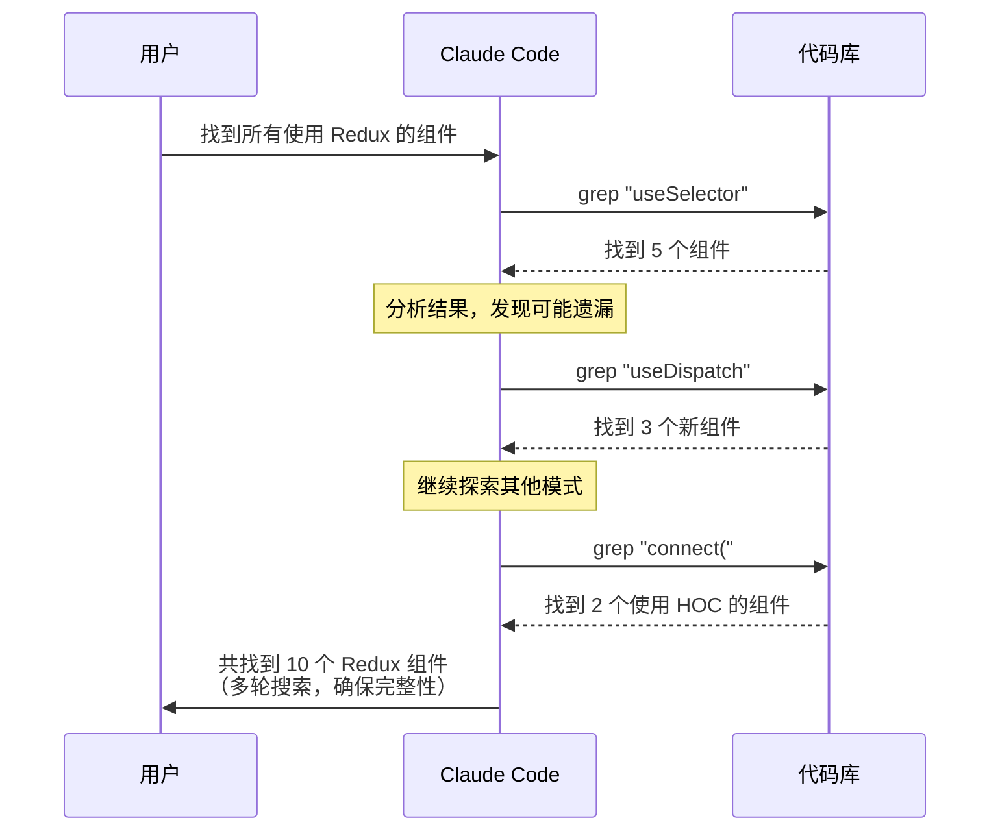
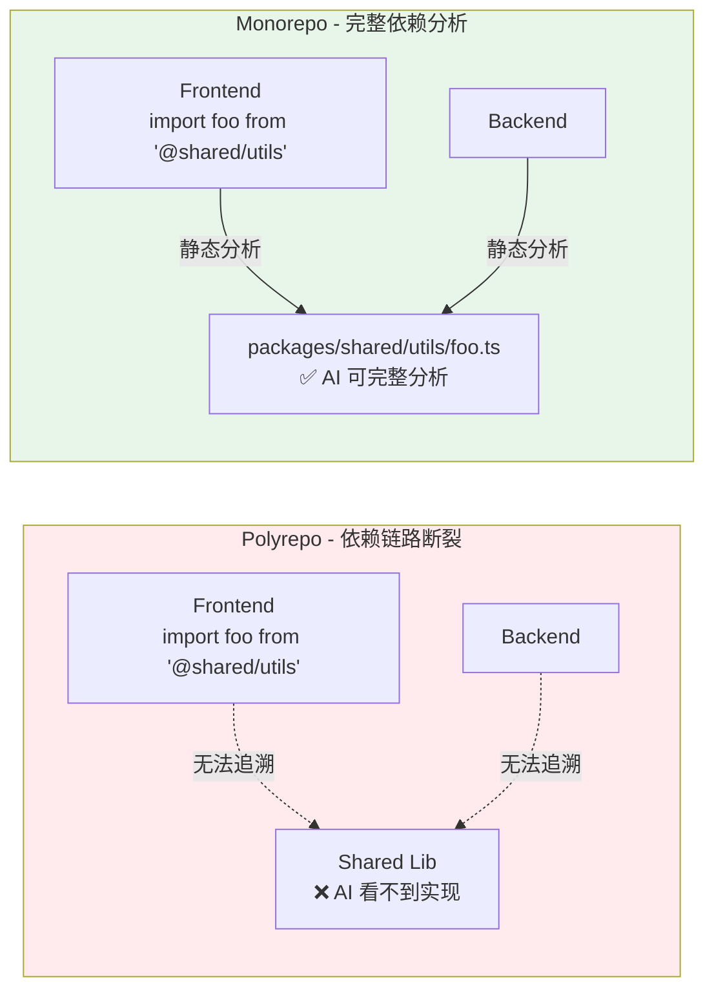
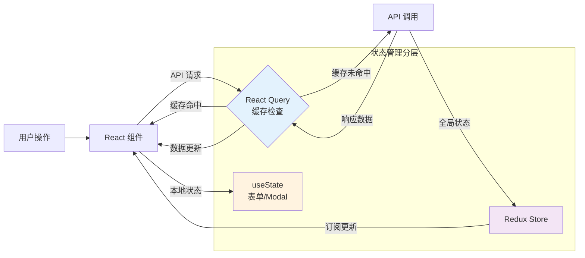
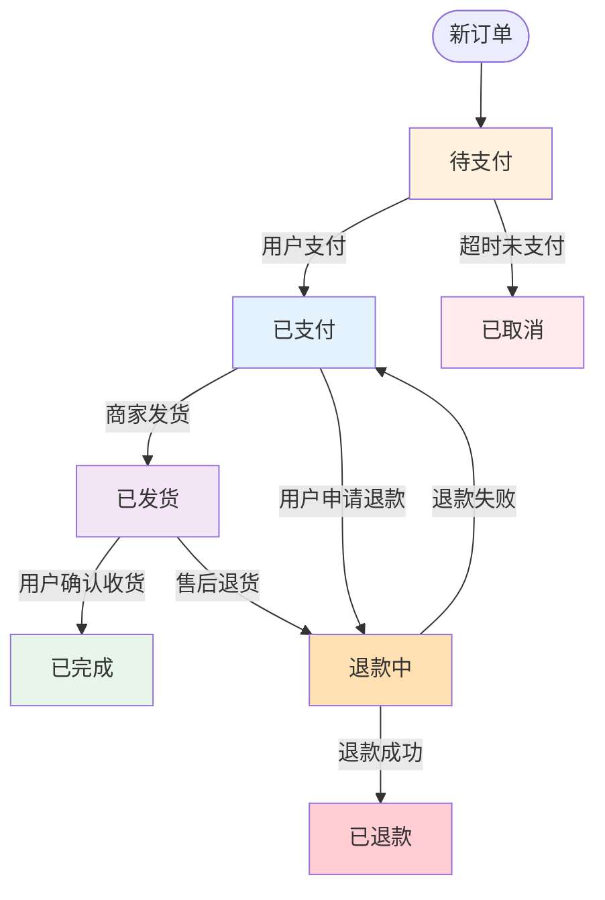
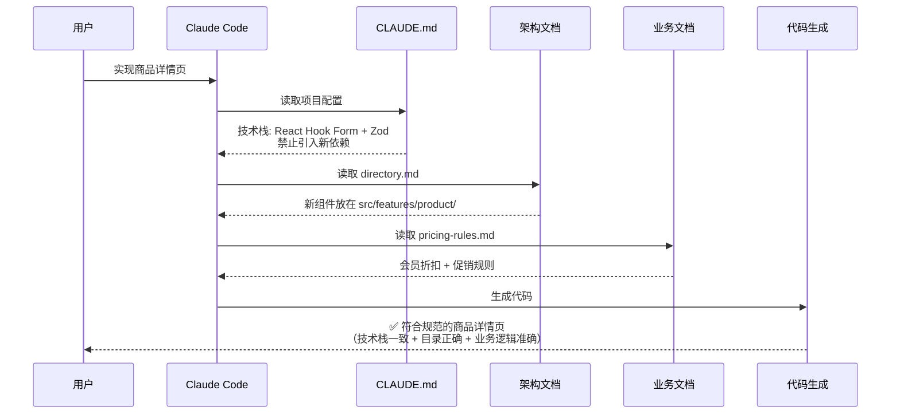
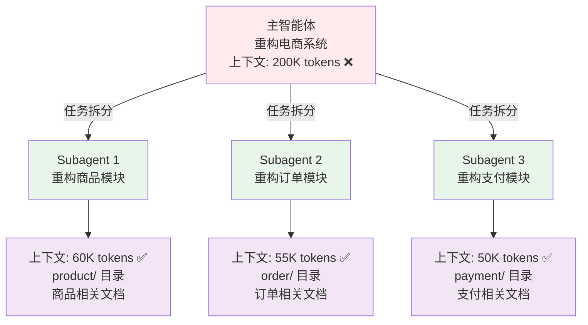

记住，**AI Agent 不是万能的。**

如果没有提供足够的信息，或者信息存在谬误，AI 生成的代码质量会急剧下降，甚至变得不可用。这个问题在实际开发中非常普遍：

**项目规模越大，AI 效果越差**。在几十个文件的小项目中，AI 能快速理解代码结构，生成符合预期的代码。但当项目扩展到数百个组件、上万行代码时，AI 开始迷失方向：状态管理方式在 Redux、Context API、props drilling 之间摇摆不定；API 调用路径有时带 `/api/v1/` 前缀，有时直接写相对路径；新文件有时放在 `features/` 目录，有时又创建全新的 `pages/` 目录。项目越大，这种不一致性越严重。

**即使小型项目，不给编码规范，输出也会偏离预期**。你的团队约定使用 4 空格缩进、函数式组件、camelCase 命名，但 AI 生成的代码混用 2 空格和 Tab、类组件和函数组件并存、命名风格在 camelCase 和 snake_case 之间随意切换。每次 Code Review 都要花大量时间统一风格，AI 带来的效率提升被代码返工抵消。

**AI 无法自动理解隐性知识和业务规则**。团队的很多约定是"不成文的规矩"：所有表单必须用 React Hook Form + Zod 校验、订单金额超过 1000 元需要二次确认、API 调用必须经过统一的请求拦截器。这些约定没有写在代码中，AI 自然无法理解，生成的代码往往违反这些规则。

**重复性任务中，AI 缺乏一致性**。你要求 AI 生成 10 个类似的 CRUD 页面，结果每个页面的实现方式都不一样：有的用 React Query，有的用 SWR，有的直接 useEffect；有的用 Modal 弹窗，有的用独立页面；有的有 loading 状态，有的没有。这种不一致性导致维护成本飙升。

这些问题的根源不是模型能力不足，而是**上下文失败**——AI 没有看到项目的架构设计、编码规范、技术栈约束和业务规则。换句话说，你给 AI 喂了错误或不完整的信息，它自然无法产出高质量代码。

## 上下文工程：为 AI 构建记忆系统
2026 年，Andrej Karpathy（现任 Tesla 神经网络主管）在社交媒体上指出："Context Engineering（上下文工程）正在取代 Prompt Engineering，成为 AI 开发的核心技能。" 这不是炒作，而是 AI Coding 实践演进的必然结果。

### Prompt 工程 vs 上下文工程
很多人误以为"写好 Prompt"就能让 AI 产出高质量代码，但这只是冰山一角。

Prompt 工程和上下文工程解决的是不同层次的问题。Prompt 工程着眼于"怎么说"，包括如何写清楚任务指令、如何提供示例格式、如何引导 AI 输出特定风格的代码。上下文工程则聚焦于"AI 能看到什么"，比如能访问哪些代码文件、知道什么架构设计约束、理解什么业务规则和领域知识，以及如何动态获取相关信息。

用一个类比来理解：Prompt 工程是教练的战术指导（"这样跑"、"那样传球"），而上下文工程是整个比赛环境的设计（球场规则、队员配置、历史数据、实时状况）。仅有战术指导，但队员不了解比赛环境，结果必然混乱。

观察一个实际案例：

```markdown
❌ 仅有 Prompt 工程：
请重构这个 Python 模块，提高代码质量

✅ 加入上下文工程：
系统指令：你是资深 Python 架构师
历史对话：模块拆分原则已确定（按业务功能而非技术类型）
项目规范：PEP 8 编码规范 + Black 格式化
相关代码：依赖关系图和调用方列表
测试用例：现有单元测试必须保持通过
技术约束：必须兼容 Python 3.10+，不得引入新依赖
```

第二种方式下，AI 不仅知道"重构"这个任务，更重要的是知道**重构的边界和约束**。

### 为什么需要上下文工程？
AI 模型失败通常不是推理能力不足，而是**缺少正确判断所需的上下文**。上下文工程要解决三个核心矛盾：

#### 1. 上下文有限 vs 信息无限
以重构电商系统的用户模块为例，可能相关的信息包括：

```plain
- 用户相关的 25 个组件代码 (80K tokens)
- 数据库表结构和关系 (15K tokens)
- API 接口文档 (20K tokens)
- 历史需求文档和变更记录 (35K tokens)
- 相关的 100 个测试用例 (40K tokens)
- 业务流程图和状态机 (25K tokens)
- 已知 bug 和解决方案 (30K tokens)
- 性能监控数据和瓶颈分析 (20K tokens)
- 第三方服务集成文档 (15K tokens)

总需求：280K tokens
Claude 最大窗口：200K tokens ❌
```

即使 Claude Code 拥有 200K 上下文窗口，但现实信息量往往超过这个限制。如果强行塞入所有信息，关键内容可能被强制删除，而不相关的信息却被错误保留。

#### 2. "Lost in the Middle" 现象
模型在处理大量上下文时会出现"注意力衰减"：

+ **开头信息**：权重高，理解好 ✅
+ **中间信息**：容易被忽略，遗漏关键细节 ⚠️
+ **结尾信息**：权重高，但可能不是最重要的 ✅

假设你在上下文的第 50K-100K tokens 位置放置了核心业务逻辑（比如订单状态机的关键约束），AI 很可能忽略这部分内容，导致生成的代码违反业务规则。

#### 3. 性能 vs 成本的指数增长
Token 数量增长会导致计算成本指数增长：

```plain
1K tokens: 1x 成本
2K tokens: 4x 成本
4K tokens: 16x 成本
```

大量无关信息进入上下文，不仅拖慢响应速度，还造成巨额计算浪费。正确的策略应该是：精准管理上下文内容，只放入当前任务真正需要的信息。

### 上下文工程的技术原理
本质上，上下文工程是为 AI 构建**多层记忆系统**：

1. **外部记忆** — 文档、数据库、历史记录（通过工具调用动态获取）
2. **注意力引导** — 信息优先级排序、相关性过滤（通过上下文布局策略）
3. **工具增强** — 搜索、计算、验证能力（通过 MCP 连接外部系统）
4. **状态管理** — 任务进度、中间结果（通过 Subagents 隔离不同任务的上下文）


好消息是：Claude Code 等主流 AI Coding Agent 已经内置了上下文工程能力。我们只需要**理解并正确使用**这些接口即可。

---

## Claude Code 上下文管理能力
Claude Code 提供了六种核心的上下文管理接口：

### 1. 动态工具调用
AI 可以主动执行 `glob`、`grep`、`read` 等工具来获取所需信息，而不是一次性加载所有代码。

以优化 React 组件为例，AI 会执行以下操作：

1. 使用 `read` 读取目标组件代码
2. 使用 `grep` 搜索相关的 hooks 和工具函数
3. 使用 `glob` 找到类似组件，了解既有模式
4. 使用 `bash` 运行测试，验证修改是否破坏功能

这种"按需获取"的策略避免了上下文爆炸，同时确保 AI 看到相关信息。

更进一步，Claude Code 支持 **Agentic Search（智能体搜索）**：AI 会根据初步搜索结果主动调整搜索策略，进行多轮探索。比如，当你要求"找到所有使用了 Redux 的组件"时，AI 会先用 `grep` 搜索 `useSelector`，发现还有组件用了 `useDispatch`，于是再次搜索；发现有些组件通过 `connect` HOC 连接，再次调整搜索关键词。这种自主探索能力让 AI 能够更完整地理解代码库。



### 2. CLAUDE.md：项目级上下文配置
`CLAUDE.md` 是 Claude Code 的"项目说明书"，类似于给 AI 的持久化记忆。每次启动对话时，Claude Code 会自动读取这个文件，了解项目的基本情况。

一个典型的 `CLAUDE.md` 通常包含以下内容：

```markdown
# 项目名称

## 技术栈
- React 18 + TypeScript 5.0
- 状态管理：Redux Toolkit（禁止引入 Zustand/Jotai）
- 样式：Tailwind CSS + shadcn/ui
- API：基于 OpenAPI 规范，使用 orval 生成类型

## 目录结构
- `src/features/` - 业务功能模块（按业务划分，不是按技术类型）
- `src/components/` - 通用 UI 组件
- `src/lib/` - 工具函数和 hooks

## 编码规范
- 组件文件名使用 PascalCase
- 所有 API 调用必须经过 `src/lib/api.ts` 统一封装
- 禁止在组件中直接写 `fetch`
```

除了通过 CLAUDE.md 告诉 AI 需要关注什么，还需要明确排除无关文件，避免噪音干扰。

### 3. permissions.deny：排除无关文件
Claude Code 会尝试索引项目中的所有文件，但并不是所有文件都有用。通过 `~/.claude/permissions.deny` 可以排除：

```plain
# 排除构建产物和依赖
**/node_modules/**
**/dist/**
**/.next/**

# 排除敏感信息
**/.env*
**/secrets/**

# 排除测试快照和覆盖率报告
**/__snapshots__/**
**/coverage/**
```

这样做有两个好处：

1. **减少噪音**：避免 AI 读取无关文件浪费 token
2. **保护隐私**：敏感信息不会进入 AI 上下文

### 4. Subagents：上下文隔离
当你需要处理多个独立任务时（比如同时重构 A 模块和 B 模块），可以使用 Subagents 创建独立的上下文环境。每个 Subagent 只看到与自己任务相关的信息，互不干扰。

以并行优化前端和后端性能为例：

```bash
# 主智能体启动两个 Subagents
Subagent 1：负责前端性能优化
- 上下文：Lighthouse 报告 + React 组件代码
- 任务：优化 Core Web Vitals

Subagent 2：负责后端性能优化
- 上下文：数据库慢查询日志 + API 代码
- 任务：优化数据库查询

# 两个 Subagents 独立工作，上下文互不污染
```

### 5. MCP (Model Context Protocol)：动态上下文获取
MCP 允许 Claude Code 连接外部数据源，动态获取上下文。常见场景包括：

+ **Figma MCP**：直接读取设计稿的颜色、间距等设计规范
+ **GitHub MCP**：获取 Issue、PR 评论、代码审查历史
+ **Postgres MCP**：查询数据库表结构、索引信息

以从 Figma 设计稿生成 UI 代码为例：

```typescript
// Claude Code 通过 Figma MCP 读取设计稿
设计稿信息：
- 主色调：#3B82F6
- 圆角：8px
- 间距系统：4px 基准（spacing-1 = 4px, spacing-2 = 8px）
- 按钮高度：40px

// AI 生成的代码自动符合设计规范
<Button
  className="h-10 rounded-lg bg-blue-500 px-4"
  // ✅ 自动使用设计稿中的主色调和圆角
>
```

### 6. Hooks：事件驱动的上下文补充
Hooks 允许你在特定事件（如提交消息、工具调用）前后自动执行脚本，补充上下文信息。

以在提交代码前自动注入 Git 规范为例：

```bash
# ~/.claude/hooks/user-prompt-submit-hook
#!/bin/bash

# 检查是否是 Git 提交相关任务
if echo "$USER_INPUT" | grep -iq "commit"; then
  # 注入 Commit Message 规范
  echo "请遵循 Conventional Commits 规范：
  - feat: 新功能
  - fix: 修复 bug
  - chore: 构建/工具变动
  示例: feat(auth): add OAuth login"
fi
```

**PS**: Hooks 是一个很实用的特性，除了补充上下文，还可以用来做数据统计。比如，你可以在 `tool-result-hook` 中记录每次 `write` 和 `edit` 工具的调用，统计 AI 生成代码的行数，计算团队的 AI 代码占比。这对评估 AI 提效效果、向管理层汇报 ROI 非常有用。

---

## 构建完善的上下文内容体系
工具提供了接口，但**「喂什么内容」**才是关键。高质量的上下文内容决定 AI 输出质量。我们需要体系化地构建六类内容：

### 1. 代码本身
某种程度上，代码以及代码汇总的文档就是**最靠谱最完整**的信息源。这再次证明了 Monorepo 的优势：

```bash
❌ Polyrepo（多个分散的仓库）
frontend-repo/
backend-repo/
shared-lib-repo/

问题：
- AI 无法关联代码
- 依赖关系不清晰
- 遗漏关联代码

✅ Monorepo（统一管理）
monorepo/
├── apps/
│   ├── frontend/
│   └── backend/
└── packages/
    └── shared/

优势：
- AI 可以完整索引
- 依赖关系清晰
- 理解成本低
```

这个优势背后的技术原因值得深入理解。AI 需要通过**静态代码分析**来理解项目结构和依赖关系。在 Polyrepo 架构中，frontend 调用 shared-lib 的某个函数时，AI 只能看到 `import { foo } from '@shared/utils'`，但看不到 `foo` 函数的实现细节（因为它在另一个仓库）。这导致 AI 只能基于函数签名和类型定义进行推测，容易产生错误假设。

而在 Monorepo 中，AI 可以直接追溯到 `packages/shared/utils/foo.ts`，完整理解函数的实现逻辑、边界条件和异常处理方式。此外，Monorepo 通常有统一的工程化配置（ESLint、TypeScript、Prettier），AI 生成的代码自然符合项目规范，无需额外调整。

更重要的是，当你要求 AI "优化订单支付流程"时，它需要同时理解前端的支付表单、后端的支付接口、共享库的金额计算工具。在 Monorepo 中，这些代码都在一个仓库内，AI 可以完整分析调用链路；而在 Polyrepo 中，AI 很可能遗漏某个关键环节，导致修改不完整。



### 2. 架构逻辑
代码本身提供了"What"（有哪些功能），但 AI 还需要理解"Why"（为什么这样设计）和"How"（如何组织）。如果缺少架构逻辑的说明，AI 很容易"看山是山"——它能读懂单个文件的代码，但很难准确理解文件之间的协作关系、设计意图和约束边界。结果就是，AI 生成的代码虽然局部可用，但整体上破坏了项目的一致性。

架构逻辑文档应该回答四个核心问题：代码应该放在哪里（目录结构）、数据如何流转（数据流设计）、职责如何划分（代码分层）、技术栈有什么约束（技术栈清单）。下面逐一展开。

首先是目录结构规范，它让 AI 知道代码该放在哪里。假设你的项目结构如下：

```plain
app/
├── api/              # API 路由
│   ├── v1/
│   │   ├── auth.py
│   └── deps.py       # 依赖注入
├── features/         # 业务功能模块
│   ├── auth/         # 登录认证
│   │   ├── schemas.py
│   │   └── repositories.py
│   └── product/      # 商品模块
├── core/             # 核心配置
│   ├── config.py
│   └── security.py
├── common/           # 共享资源
│   └── utils/
└── models/           # 数据模型
```

你可以在 `CLAUDE.md` 或 `docs/architecture/directory.md` 中写明：

```markdown
## 目录结构规范

按业务功能组织：不是按技术类型（models/services/utils），而是按业务模块（auth/product/order）

Feature 自包含：每个 feature 包含自己的 schemas、services、models，减少跨模块依赖

共享资源统一管理：通用工具放 common/，避免重复代码
```

重点不在于规范本身有多完美，而在于**有明确的规则**。AI 知道什么代码该放哪里，就不会随意创建新目录。你可以让 AI 帮你生成这份文档：`仔细阅读项目的目录结构，总结一下各层级目录都是干啥的，然后整理成一份目录规范文档，写到 docs/architecture/directory.md 里，重点说清楚什么代码该放哪，有什么组织原则。`

有了目录结构，AI 知道代码放在哪里，但还需要理解数据如何在不同模块间流转。数据流设计文档要解决的就是这个问题。例如，在一个 React 项目中：

```markdown
## 数据流向

### API 请求处理流程
请求接收 → React Query 缓存检查 → API 调用 → Redux Store 更新 → 组件重新渲染

### 状态管理分层
1. **服务端状态 (React Query)**
   - API 数据缓存
   - 自动重新验证

2. **全局客户端状态 (Redux)**
   - 用户认证信息
   - 全局 UI 状态（侧边栏展开/收起）

3. **本地组件状态 (useState)**
   - 表单输入
   - Modal 开关状态
```



这份文档的价值在于，当 AI 需要添加新功能时（比如用户收藏商品），它知道应该用 React Query 缓存服务端的收藏列表数据，用 Redux 存储当前用户的收藏数量（用于显示在顶部导航栏），用 useState 管理收藏按钮的 loading 状态。同样可以让 AI 帮你生成：`仔细阅读代码，理解代码中的状态管理逻辑：用了哪些状态管理方案，分别用在什么场景，把数据流转的路径梳理清楚，写个文档说明什么数据该用什么方案，存到 docs/architecture/data-flow.md`

除了目录结构和数据流，AI 还需要理解代码的职责边界。代码分层的核心目的是让 AI 区分通用工具与业务逻辑。最常见的混淆是：把业务逻辑写进了通用工具函数。比如：

```markdown
## 代码分层原则

### 通用工具层 (common/utils)
- 纯工具函数，无业务逻辑
- 只处理数据转换/验证
- 可在任何项目复用

示例：date_utils, string_validator, crypto_helper

### 业务服务层 (features/*/services)
- 封装业务规则和领域逻辑
- 依赖 Repository/外部服务
- 在当前项目内复用

示例：UserService, OrderService, PaymentProcessor
```

为了更清楚地说明这个问题，看一个常见的反例：

```typescript
❌ 通用工具类混入业务逻辑
function formatPrice(amount: number): string {
  // ❌ 业务逻辑不该在工具函数
  if (user.isVIP) {
    amount *= 0.9;
  }
  // ❌ 依赖外部服务
  logPricingEvent(amount);
  return `¥${amount.toFixed(2)}`;
}

✅ 工具函数只做格式化
function formatPrice(amount: number): string {
  return `¥${amount.toFixed(2)}`;
}

// 业务逻辑在 Service 层
class PriceService {
  calculateUserPrice(user: User, amount: number): number {
    const discount = user.isVIP ? 0.9 : 1.0;
    const finalPrice = amount * discount;
    this.logger.logPricingEvent(finalPrice);
    return finalPrice;
  }
}
```

通过明确的代码分层原则，AI 知道 `formatPrice` 只负责格式化，所有业务规则（VIP 折扣、日志记录）都应该在 Service 层处理。

最后一个常见问题是 AI 会根据自己的"经验"随意引入新依赖。你的项目明明用 Redux Toolkit 管理状态，但 AI 看到某个功能后，觉得 Zustand 更适合，就直接在代码中引入了。这种不一致性会破坏技术栈的统一性。技术栈清单文档就是为了防止这个问题：

```markdown
## 技术栈约束

### 已选技术栈
- UI 组件库：shadcn/ui（禁止引入 Ant Design/Material UI）
- 状态管理：Redux Toolkit（禁止引入 Zustand/Jotai/MobX）
- 表单管理：React Hook Form + Zod
- 数据请求：React Query

### 新增依赖流程
1. 先检查现有技术栈是否能满足需求
2. 若需新增，必须在 GitHub Issue 中说明理由
3. 经过团队评审后才能引入
```

### 3. 需求说明
需求文档应该只写 **What & Why**，不要写 How（如何实现由 AI 决定）。

需要注意的是，需求说明不是一次性写完就不管了。每次开发新功能时，都应该先创建对应的需求文档，明确功能背景、核心需求和业务约束。这些文档可以放在 `docs/requirements/` 目录下，按功能模块组织。当业务规则发生变化时（比如登录失败锁定时间从 15 分钟调整为 30 分钟），也要及时更新需求文档，确保 AI 始终基于最新的业务规则生成代码。

```markdown
## 需求：用户登录功能

### 背景
用户需要通过邮箱 + 密码登录系统，登录成功后跳转到 Dashboard

### 核心功能
1. 登录表单：邮箱、密码输入框
2. 表单验证：邮箱格式校验、密码非空校验
3. 错误提示：登录失败时显示明确的错误信息
4. 会话管理：登录成功后保存 JWT Token

### 业务约束
- 连续登录失败 5 次后锁定账号 15 分钟
- 密码不得明文传输，需在前端加密后再发送
- Token 有效期 7 天，过期后需重新登录

❌ 不要写：使用 React Hook Form + Zod 实现表单验证
✅ 应该写：需要对邮箱格式和密码非空进行校验
```

除了手写 Markdown 文档，你也可以通过 **MCP (Model Context Protocol)** 连接外部系统，直接从飞书文档、Notion、Jira 等工具中获取需求说明。比如通过飞书 MCP，AI 可以实时读取飞书文档中的需求描述、业务规则和验收标准，无需手动复制到本地文档。这种方式的优势是需求变更时，AI 能自动获取最新版本，避免本地文档和实际需求不同步的问题。关于 MCP 的详细使用方式，我们会在后续章节展开讨论。

### 4. 接口规格
强类型定义优于文档描述。如果你使用 TypeScript + OpenAPI 规范，可以通过类型定义提供精确的接口约束。

```typescript
// 使用 Pydantic（Python）或 Zod（TypeScript）定义接口
import { z } from 'zod';

export const LoginRequestSchema = z.object({
  email: z.string().email(),
  password: z.string().min(8),
  rememberMe: z.boolean().optional(),
});

export const LoginResponseSchema = z.object({
  token: z.string(),
  user: z.object({
    id: z.string(),
    email: z.string(),
    name: z.string(),
  }),
});

export type LoginRequest = z.infer<typeof LoginRequestSchema>;
export type LoginResponse = z.infer<typeof LoginResponseSchema>;
```

AI 读取这些类型定义后，会自动：

+ 生成符合规范的请求/响应处理代码
+ 进行类型检查，避免运行时错误
+ 理解字段含义（email 必须是邮箱格式，password 至少 8 位）

### 5. 领域知识
业务术语和领域规则需要明确说明，避免 AI 误解。

```markdown
## 电商业务术语

- **SKU (Stock Keeping Unit)**：库存单位，表示商品的具体规格
  - 示例：iPhone 15 Pro 256GB 黑色 = 1 个 SKU

- **SPU (Standard Product Unit)**：标准产品单位，表示商品种类
  - 示例：iPhone 15 Pro = 1 个 SPU，包含多个 SKU（不同颜色/容量）

- **订单状态机**：
```

  待支付 → 已支付 → 已发货 → 已完成  
           ↓  
         已取消

```plain
- 规则：已支付状态的订单不可直接取消，需走退款流程

完整的订单状态流转如下图所示：



```plain

### 6. 编码规范

编码规范决定了代码的风格一致性。如果没有明确的编码规范，AI 生成的代码风格会非常混乱：有时用 2 空格缩进，有时用 4 空格；有时用单引号，有时用双引号；有时用函数式组件，有时用类组件。这种不一致性不仅影响代码可读性，还会在 Code Review 时浪费大量时间。

更重要的是，编码规范应该尽可能**自动化**。通过 ESLint、Prettier、TypeScript 等工具的配置文件，AI 能够自动理解并遵守规范，而不需要在文档中详细描述"如何格式化代码"。

```markdown
## 编码规范

### 自动化工具
- ESLint + Prettier：自动格式化代码，统一缩进、引号、分号等风格
- TypeScript：强类型检查，禁止使用 `any` 类型
- Husky + lint-staged：提交前自动运行格式化和检查

### 组件规范
- 组件文件名使用 PascalCase（如 `UserProfile.tsx`）
- 组件 Props 必须定义 TypeScript 接口
- 优先使用函数式组件，避免类组件
- 自定义 hooks 命名以 `use` 开头（如 `useAuth`）

### 命名规范
- 变量和函数：camelCase（如 `getUserData`）
- 常量：UPPER_SNAKE_CASE（如 `API_BASE_URL`）
- 类型和接口：PascalCase（如 `UserProfile`）
- 文件名：kebab-case（如 `user-profile.utils.ts`）

### 代码组织
- 每个文件不超过 300 行
- 复杂组件拆分为多个子组件
- 工具函数单独抽离到 `utils/` 目录
```

通过这些规范，AI 知道应该生成什么风格的代码。而且，由于有 ESLint 和 Prettier 的自动检查，即使 AI 生成的代码不符合规范，也会在保存时自动修正。

### 7. UI 规范
UI 规范确保 AI 生成的界面符合设计系统。如果没有明确的 UI 规范，AI 会根据"常见做法"生成界面，但这些界面往往与你的设计系统不一致：颜色、间距、圆角、字体都可能与设计稿有偏差。

最有效的方式是将 UI 规范固化为 **Tailwind CSS 配置** 或 **CSS Variables**，让 AI 直接使用预定义的设计 token，而不是硬编码具体数值。

```typescript
// tailwind.config.ts
export default {
  theme: {
    extend: {
      colors: {
        primary: '#3B82F6',
        secondary: '#8B5CF6',
        danger: '#EF4444',
        success: '#10B981',
      },
      borderRadius: {
        DEFAULT: '8px',
        lg: '12px',
        xl: '16px',
      },
      spacing: {
        // 基于 4px 网格
        '1': '4px',
        '2': '8px',
        '3': '12px',
        '4': '16px',
        '5': '20px',
        '6': '24px',
      },
    },
  },
};
```

有了这个配置，AI 生成的代码会自动使用 `bg-primary`、`rounded-lg`、`p-4` 这样的类名，而不是写死 `#3B82F6`、`12px`、`16px`。当设计规范调整时（比如主色调改为 `#2563EB`），只需要修改配置文件，所有使用 `bg-primary` 的地方都会自动更新。

此外，如果你使用 Figma，可以通过 **Figma MCP** 让 AI 直接读取设计稿的颜色、间距、字体等信息，进一步减少手动维护 UI 规范的工作量。

### 8. 历史问题记录
团队在开发过程中会遇到各种坑，这些坑往往不会体现在代码中，但却是宝贵的经验。如果不记录下来，AI 很可能重复踩坑。

历史问题记录应该包含三个要素：**问题描述**、**根本原因**、**解决方案**。这样 AI 在遇到类似场景时，能够避免错误的实现方式。

```markdown
## 历史问题记录

### 问题 1：用户登录后 Token 丢失
- **现象**：部分用户登录成功后，刷新页面显示未登录状态
- **原因**：localStorage 在浏览器无痕模式下不可用，Token 无法持久化
- **解决方案**：改用 sessionStorage + Cookie 双重存储，优先读取 Cookie
- **相关代码**：`src/lib/auth.ts` 中的 `saveToken` 函数

### 问题 2：上传大文件时请求超时
- **现象**：上传超过 10MB 的文件时，请求超时失败
- **原因**：Nginx 默认 `client_max_body_size` 为 1MB
- **解决方案**：
  - 前端：使用分片上传，单片不超过 5MB
  - 后端：调整 Nginx 配置 `client_max_body_size 100m`
- **相关代码**：`src/features/upload/useFileUpload.ts`

### 问题 3：React Query 缓存导致数据不更新
- **现象**：用户修改个人信息后，页面显示的仍是旧数据
- **原因**：React Query 的 `staleTime` 设置为 5 分钟，缓存未失效
- **解决方案**：在更新操作成功后，手动调用 `queryClient.invalidateQueries(['user'])`
- **相关代码**：`src/features/user/useUpdateProfile.ts`
```

这些记录不仅能避免 AI 重复踩坑，还能帮助新团队成员快速了解项目中的"隐藏规则"。当 AI 要实现用户登录功能时，它会读取到"localStorage 在无痕模式下不可用"这个历史问题，从而直接使用 Cookie 存储 Token，而不是等到上线后才发现问题。

**重要提示**：历史问题记录不应该一次性手写完成，而应该在开发过程中**有意识地逐步沉淀**。每次遇到坑点、解决棘手问题后，主动让 AI 帮你总结并更新文档。这样能让仓库的上下文具备**成长性**，随着项目演进变得越来越完善。

举个例子，当你花了两小时调试 React Query 缓存问题并最终解决后，可以这样请求 AI：

```plain
根据我们前面的交互记录，总结一下刚才遇到的 React Query 缓存问题，
补充到 docs/knowledge/历史问题记录.md 中，格式参考已有的问题记录。
重点说清楚：问题现象、根本原因、解决方案、相关代码位置。
这样下次遇到类似问题时，AI 能直接避开这个坑。
```

AI 会自动分析对话历史，提取关键信息，生成结构化的问题记录。久而久之，你的项目文档会包含大量真实踩过的坑和解决方案，这些知识不仅对 AI 有用，对团队新成员也极具价值。

---

## 实战案例：构建电商项目的上下文体系
假设你正在开发一个电商系统，如何为 Claude Code 构建完善的上下文？

### Step 1: 创建 CLAUDE.md
```markdown
# 电商系统

## 技术栈
- React 18 + TypeScript 5.0
- 状态管理：Redux Toolkit
- 样式：Tailwind CSS + shadcn/ui
- API：基于 OpenAPI 规范，使用 orval 生成类型
- 表单：React Hook Form + Zod

## 目录结构
- `src/features/` - 业务功能模块（auth, product, order, cart）
- `src/components/` - 通用 UI 组件
- `src/lib/` - 工具函数和 hooks
- `src/types/` - TypeScript 类型定义

## 架构文档
详细设计见：
- 目录结构规范：`docs/architecture/directory.md`
- 数据流设计：`docs/architecture/data-flow.md`
- 代码分层原则：`docs/architecture/layering.md`

## 业务术语
- SKU: 库存单位（如 iPhone 15 Pro 256GB 黑色）
- SPU: 标准产品单位（如 iPhone 15 Pro）
- 订单状态机：见 `docs/business/order-status.md`

## 编码规范
详细规范见：`docs/standards/coding-style.md`
```

### Step 2: 编写架构文档
在 `docs/architecture/` 目录下创建详细的架构文档：

**directory.md**：目录结构规范  
**data-flow.md**：数据流设计  
**layering.md**：代码分层原则

### Step 3: 定义业务规则
在 `docs/business/` 目录下创建业务规则文档：

**order-status.md**：订单状态机  
**pricing-rules.md**：价格计算规则  
**inventory-rules.md**：库存管理规则

### Step 5: 使用时的体验
当你要求 AI "实现商品详情页"时，它会：

1. 读取 `CLAUDE.md`，了解技术栈约束（必须用 React Hook Form + Zod）
2. 读取 `docs/architecture/directory.md`，知道新组件应该放在 `src/features/product/`
3. 读取 `docs/business/pricing-rules.md`，理解价格计算逻辑（会员折扣、促销活动）
4. 生成符合项目规范的代码，不会引入新的技术栈



---

## 常见问题与解决方案
### 问题 1：上下文太多，超过 200K 限制怎么办？
**解决方案 1：使用 Subagents 拆分任务**

将复杂任务拆分为多个独立子任务，每个 Subagent 只加载相关上下文。

```bash
主任务：重构电商系统
├── Subagent 1：重构商品模块
│   └── 上下文：product/ 目录 + 商品相关文档
├── Subagent 2：重构订单模块
│   └── 上下文：order/ 目录 + 订单相关文档
└── Subagent 3：重构支付模块
    └── 上下文：payment/ 目录 + 支付相关文档
```



**解决方案 2：采用小文档 + 索引文档组织**

单个大文档容易超出上下文限制，更重要的是，AI 难以在长文档中快速定位关键信息。更好的做法是将文档拆分为多个小文档，然后用一个索引文档串联起来。

索引文档就像一本书的目录，AI 可以先读索引了解整体结构，再根据任务需要读取具体的子文档。这样既控制了上下文大小，又保持了信息的完整性。

```markdown
# docs/architecture/README.md（索引文档）

## 系统架构概览
本项目采用前后端分离架构，以下是各模块的详细文档：

- [认证与授权](./auth.md) - JWT 认证、权限控制、Session 管理
- [数据库设计](./database.md) - 表结构、索引策略、迁移规范
- [API 网关](./api-gateway.md) - 路由规则、限流策略、日志记录
- [缓存策略](./caching.md) - Redis 配置、缓存失效、数据一致性
- [消息队列](./message-queue.md) - RabbitMQ 使用、任务调度、错误重试

## 核心约束
- 所有 API 必须经过网关，直接调用后端服务会被拒绝
- 数据库迁移必须可回滚，禁止直接修改生产环境表结构
- 缓存失效时间不得超过 1 小时，防止数据过期

（每个子文档独立维护，单个文档控制在 200 行以内）
```

这样组织后，AI 可以先读 `README.md` 了解全貌，需要修改认证逻辑时再读 `auth.md`，避免一次性加载所有架构文档。

**解决方案 3：精简文档内容**

架构文档不要写得过于详细，重点写**决策和约束**，而非实现细节。

```markdown
❌ 过于详细：
## 用户认证流程
1. 用户在登录页面输入邮箱和密码
2. 前端对邮箱格式进行校验，正则表达式为 /^[^\s@]+@[^\s@]+\.[^\s@]+$/
3. 校验通过后，使用 bcrypt 对密码加密...
（500 行详细步骤）

✅ 精简版本：
## 用户认证流程
- 前端：邮箱格式校验 + 密码非空校验
- 后端：JWT Token 生成，有效期 7 天
- 约束：连续失败 5 次锁定账号 15 分钟
```

### 问题 2：如何让 AI 优先关注重要信息？
**解决方案：利用"注意力衰减"规律**

模型对**开头**和**结尾**的信息权重更高，中间容易被忽略。因此：

+ 将最重要的约束放在 `CLAUDE.md` 开头
+ 在任务描述的开头明确核心要求

```markdown
# CLAUDE.md 开头就写核心约束

## ⚠️ 核心约束（必须遵守）
1. 禁止引入新依赖，除非经过审批
2. 所有 API 调用必须经过 src/lib/api.ts
3. 状态管理只能用 Redux Toolkit

（其他内容...）
```

### 问题 3：如何验证上下文配置是否生效？
**方法 1：直接询问 AI**

```plain
请列出你当前了解的项目技术栈和编码规范
```

AI 会告诉你它读取到了哪些信息，你可以检查是否符合预期。

**方法 2：故意测试违规场景**

```plain
帮我实现一个用户登录功能，使用 Zustand 管理状态
```

如果上下文配置正确，AI 应该拒绝使用 Zustand，并建议使用项目既定的 Redux Toolkit。

---

## 失败案例：上下文工程的常见陷阱
### 陷阱 1：文档和代码不一致
你在 `CLAUDE.md` 中写明"使用 Redux Toolkit"，但实际代码中已经引入了 Zustand。AI 读取文档后会按 Redux 生成代码，导致与现有代码冲突。

**教训**：上下文内容必须与实际代码保持同步。如果技术栈变更，第一时间更新 `CLAUDE.md`。

### 陷阱 2：过度依赖自然语言描述
```markdown
❌ 不好的接口文档：
用户登录接口需要传入邮箱和密码，返回 Token

✅ 好的接口文档：
import { z } from 'zod';

export const LoginRequestSchema = z.object({
  email: z.string().email(),
  password: z.string().min(8),
});
```

强类型定义比自然语言描述更精确，AI 理解起来也更准确。

### 陷阱 3：忽略 Lost in the Middle 现象
你把核心业务规则放在一个 5000 行的长文档中间，AI 很可能忽略这部分内容。

**解决方案**：

+ 将关键规则单独成文件，放在 `CLAUDE.md` 中引用
+ 使用 Markdown 标题结构，方便 AI 快速定位

---

## 总结：上下文工程的最佳实践
1. **Monorepo 优先**：统一管理代码，降低 AI 理解成本
2. **强类型约束**：用 TypeScript/Zod/Pydantic 定义接口，优于自然语言描述
3. **架构文档精简**：重点写决策和约束，不要写过多实现细节
4. **动态获取 + 静态配置结合**：通过工具调用动态获取信息，通过 `CLAUDE.md` 提供静态约束
5. **定期验证同步**：确保文档与代码一致，技术栈变更后及时更新上下文

上下文工程不是一次性任务，而是伴随项目演进持续迭代的过程。随着项目规模扩大，你会发现投入在上下文工程上的时间会带来**指数级的回报**——AI 生成的代码质量越来越高，需要人工修正的次数越来越少。

下一节，我们将介绍 Claude Code 的另一个高级特性：**Skill 技能系统**，了解如何将重复性任务固化为可复用的技能。
