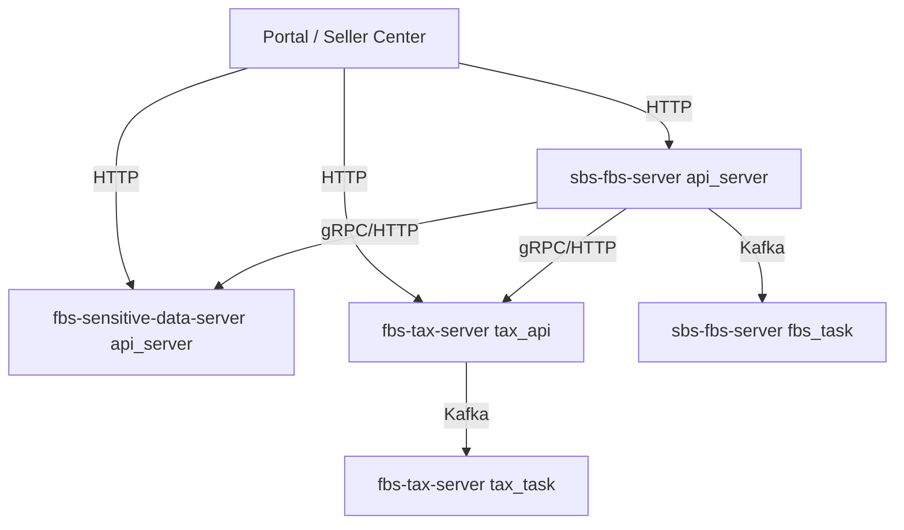

# 启动三类 FBS 后端进程并建立仓库地图

> 预计学习时间：150–200 分钟
> 一句话总结：识别主服务、敏感数据服务和 Tax 服务的职责与进程入口，选择正确 Go 版本、配置和启动命令，并用一条最小构建/测试路径验证进程地图。

## 这一章解决什么问题

前端项目常用一个开发命令启动浏览器应用。FBS 后端的入口更分散：三个仓库一共有七个明确的 `main.go` 进程，主服务和敏感数据服务各有 API、task 两类进程，Tax 有 API、core、task 三类进程。第一次进入仓库时，先要回答“我正在构建哪个可执行程序”，而不是直接寻找一个统一的启动按钮。

三个仓库还使用不同的 Go 与 Chassis 版本。它们都包含公司环境中的内部依赖，完整运行通常还需要配置和依赖服务。本章因此把“能编译一个目标包、能运行一组局部测试、能说明未启动的外部依赖”作为最小路径，不假装一条命令能在任意电脑上还原公司环境。

## 先认识仓库、进程、框架、配置与构建

这些词在前端也有近似对象，但不能直接画等号。

| 概念 | 在后端工程中表示什么 | 它解决的问题 | 前端可借用的类比 |
| --- | --- | --- | --- |
| 仓库 | 一组共同版本管理的源码、配置和构建文件 | 划定代码协作与版本边界 | 一个 Git 前端仓库或 monorepo |
| 进程 | 操作系统正在运行的一个可执行程序实例 | 承接 HTTP、计算或后台任务 | dev server、SSR server、worker |
| 框架 | 规定启动、路由、中间件等公共流程的代码库 | 避免每个业务模块重复搭服务骨架 | Express、NestJS；只作概念类比 |
| 配置 | 随环境变化、但不应硬编码进业务逻辑的参数 | 让同一份程序适配不同运行环境 | `.env` 与构建配置 |
| 构建 | 把源码与依赖检查、编译成目标产物 | 提前发现类型和依赖问题 | TypeScript/Webpack 构建 |

一个仓库可以生成多个可执行程序；一个可执行程序上线后又可能运行多个实例。`cmd/api_server/main.go` 是源码入口，不是“某台服务器”；`go build ./cmd/api_server` 生成的是二进制文件，也不等于服务已经连接好数据库并可接受真实请求。

### Chassis 是什么，为什么现在就要知道

Chassis 是三个仓库当前使用的 Go 服务框架。它承接进程初始化、HTTP/gRPC schema 注册、中间件、配置和公司基础设施接入。业务模块在框架规定的入口注册 route 与 handler。下一章会逐层读一条 Chassis HTTP 请求，本章只需要知道：`main.go` 启动的不是一段孤立业务函数，而是由 Chassis 组织起来的一整个服务进程。

社区里常见的同类选择有标准库 `net/http`、Gin、Echo、Go kit 等。标准库依赖少、控制直接，但团队需要自行组合参数绑定、错误包装、监控和服务治理；Gin/Echo 提供较轻的 HTTP 开发体验，却仍需接入公司的配置、鉴权与监控；Chassis 对内部基础设施集成更深，代价是 API 与版本行为必须以当前仓库源码为准，不能直接套公开框架教程。本课程不会把现有服务迁移到另一套框架。

### API、core 与 task 为什么拆成不同进程

API 进程接收同步请求并返回响应；task 进程处理定时或异步工作；Tax 的 core 进程承接该仓库当前定义的核心服务能力。拆进程后可以分别构建、配置和观察，但进程之间的调用会引入网络、超时与兼容问题。不能仅凭名称推断部署规模、机器位置或资源模型，实际运行形态要以环境配置和平台事实为准。

**Situation**：一个前端开发者第一次面对三个仓库和七个进程入口，不确定先构建哪个目标、使用哪个 Go 版本，也分不清编译与启动证据。

**Task**：选择主服务作为切入点，完成一条最小启动路径（编译+测试），并为另外两个仓库绘制准确的进程地图和版本矩阵。

**Action**：比较三个仓库的 go.mod → 追踪 cmd/ 目录下的各个 main.go → 理解每个进程的职责 → 运行 go build 和 go test → 记录版本、端口、启动方式。

**Result**：你得到一张可核对的进程地图：能找到入口文件，知道该用哪条编译和测试命令，也能区分“源码可构建”与“完整环境可运行”。

> 本章基于三个后端仓库的 release 分支（2026-07-20）。Go 版本以各仓库 go.mod 中的声明为准。

## 三个仓库的职责全景

### 为什么需要三个仓库

三个后端仓库按当前代码职责划分了主业务、敏感数据和 Tax 边界。课程只依据仓库中的入口、模块和调用关系解释这些边界，不推断组织或发布原因：

| 仓库 | 核心职责 | 为什么独立 |
| --- | --- | --- |
| `sbs-fbs-server` | 入库、商品、库存、店铺管理等核心业务 | 主业务逻辑，改动频繁、团队主要维护 |
| `fbs-sensitive-data-server` | 卖家敏感信息（姓名、电话、证件） | PII 数据安全合规，独立部署、独立审计、独立权限 |
| `fbs-tax-server` | 税务计算、发票生成、计费结算 | 财务相关业务，维护周期长、合规要求高、发布节奏慢 |

**前端类比**：三个仓库 ≈ 前端的三个微前端应用或 npm monorepo 中的 packages。拆分的原因不是技术限制，而是组织结构（不同团队）、安全合规（敏感数据隔离）、发布节奏（财务慢、业务快）。你可以把 `sbs-fbs-server` 理解为前端的"主应用"，`fbs-sensitive-data-server` 是"安全隔离的 PII 模块"，`fbs-tax-server` 是"稳定少变的财务模块"。

### 每个仓库的进程矩阵

| 仓库 | 进程 | main.go 位置 | 职责 | 部署数量 |
| --- | --- | --- | --- | --- |
| `sbs-fbs-server` | api_server | `cmd/api_server/main.go` | 面向同步调用的主 API 入口 | 由运行环境决定 |
| `sbs-fbs-server` | fbs_task | `cmd/fbs_task/main.go` | 定时、异步与消息类任务入口 | 由运行环境决定 |
| `fbs-sensitive-data-server` | api_server | `cmd/api_server/main.go` | 敏感数据服务 API 入口 | 由运行环境决定 |
| `fbs-sensitive-data-server` | task | `cmd/task/main.go` | 敏感数据相关任务入口 | 由运行环境决定 |
| `fbs-tax-server` | tax_api | `cmd/tax_api/main.go` | Tax API 入口 | 由运行环境决定 |
| `fbs-tax-server` | tax_core | `cmd/tax_core/main.go` | Tax core 入口 | 由运行环境决定 |
| `fbs-tax-server` | tax_task | `cmd/tax_task/main.go` | Tax 任务入口 | 由运行环境决定 |

**前端类比**：多进程架构接近 monorepo 中的多个 app。`cmd/api_server` 是同步服务的源码入口；`cmd/fbs_task` 接近独立 worker，承接任务与消费入口。类比只用于定位，不表示前后端运行模型相同。

### 进程之间的关系



本课程以主服务 API 作为 ASN 同步请求主线。主服务代码中存在敏感数据与 Tax 的 client 边界，task 入口中存在定时、异步和消息处理代码。某个具体需求实际经过哪些服务，必须从 route、client 与任务注册逐条确认，不能把全景图当成每次请求的固定时序。

**前端类比**：这个架构 ≈ 前端的主应用（主服务 API）+ 独立的微服务（敏感数据 / Tax）+ 后台 Worker（task 进程）。前端同学可以把它想象成 Vercel/Netlify 的部署模型：API Routes 处理请求、Background Functions 处理异步任务、第三方 API 处理专项能力。

## 主服务：sbs-fbs-server

### 进程入口

```go
// cmd/api_server/main.go（简化）
func main() {
	// 1. 初始化 Chassis 框架（注册 HTTP 路由、gRPC 服务）
	// 2. 初始化 Wire 依赖注入（创建 handler、service、repository）
	// 3. 启动 HTTP 服务器
}
```

```go
// cmd/fbs_task/main.go（简化）
func main() {
	// 1. 初始化 Chassis + Saturn 任务框架
	// 2. 注册定时任务和消息消费者
	// 3. 启动任务调度器
}
```

### 目录结构回顾

```
sbs-fbs-server/
├── cmd/                  # 进程入口
│   ├── api_server/       # HTTP/gRPC API 服务
│   └── fbs_task/         # 定时任务 + 消息消费
├── app/                  # 旧模块（逐步迁移到 apps/）
├── apps/                 # 新模块（inbound、rts、product 等）
├── middleware/            # HTTP 中间件
├── sbs_agent/            # 基础设施适配层
├── errcode/              # 错误码定义
├── libs/                 # 内部工具库
├── conf/                 # Chassis 配置文件
└── go.mod                # Go 1.20
```

**前端类比**：`cmd/` 接近多个应用入口，`apps/` 按业务域组织模块，`middleware/` 接近服务端的请求拦截链，`sbs_agent/` 封装数据库、缓存和任务等设施。React route guard 只能帮助理解“入口前检查”，不能替代服务端中间件的安全语义。

### 编译和测试

```bash
cd sbs-fbs-server

# 编译 API 服务
go build -o bin/api_server ./cmd/api_server

# 编译任务服务
go build -o bin/fbs_task ./cmd/fbs_task

# 运行所有测试
go test ./... -count=1

# 只测试某个模块
go test ./apps/inbound/... -v

# 带 race detector 的测试
go test -race ./...
```

**前端类比**：`go build -o bin/api_server ./cmd/api_server` 与前端 build 都会检查源码与依赖，但 Go 产出本机可执行程序，前端通常产出浏览器资源。`go test ./...` 与 Jest/Vitest 都是测试入口，包选择和运行环境不同。

### Star 案例：启动主服务 API

**Situation**：你需要验证主服务的代码能否正常编译和运行测试，以便开始开发一个入库功能。

**Task**：编译主服务的两个进程，运行核心模块的测试，记录版本和依赖信息。

**Action**：
```bash
cd sbs-fbs-server
go version  # go1.20.x
go build -o bin/api_server ./cmd/api_server
go build -o bin/fbs_task ./cmd/fbs_task
go test ./apps/inbound/... -v -count=1
go test ./middleware/... -v -count=1
```

**Result**：若命令退出码为 0，两个二进制文件会生成在 `bin/`，目标测试形成改动前基线。课程生成环境没有执行公司内网依赖下的真实构建，学员需保存自己的命令、退出码和阻塞信息，不能复制一段“全部通过”的结论。

## 敏感数据服务：fbs-sensitive-data-server

### 职责边界

敏感数据服务的 module path 与主服务相同（`git.garena.com/shopee/bg-logistics/b2c/sbs-fbs-server`），但仓库与进程入口是分开的。课程只把相同 module path 当作当前工具链和 IDE 排错事实，不猜测形成原因，也不据此推断数据库或部署拓扑。

它集中承接联系人、地址等敏感数据相关能力，并通过自己的 API、鉴权和数据访问层控制边界。主服务需要相关信息时应沿现有 client 调用，不直接复制敏感数据存储逻辑。具体接口返回完整值、掩码值还是最小视图，要逐接口查代码与权限，不能用“敏感服务会自动脱敏”概括全部行为。

**前端类比**：前端 `piiRequest` 与后端敏感数据 client 都是在边界访问敏感能力。它们的协议、鉴权和返回字段并不对称，必须分别沿 wrapper/client 与服务端 route 核验。

### 编译和测试（敏感数据服务）

```bash
cd fbs-sensitive-data-server
go build -o bin/api_server ./cmd/api_server
go build -o bin/task ./cmd/task
go test ./... -count=1
```

### Star 案例：从主服务追踪 PII 调用

**Situation**：主服务的 handler 需要展示卖家联系人姓名。这个字段来自敏感数据服务。

**Task**：理解主服务如何调用敏感数据服务，以及敏感数据服务如何确保数据安全。

**Action**：
1. 在主服务的 `thirdpart/` 或 `agent/` 目录中找到调用敏感数据服务的 gRPC client。
2. 追踪 client 的创建过程，确认连接、context 与鉴权信息由哪一层提供。
3. 在敏感数据服务的 `apps/client/access/http/sc/` 中找到对应的 handler。
4. 检查 handler、application 与 mapper 实际返回哪些字段，以及鉴权发生在哪一层。

**Result**：你能够画出一条经过代码核对的敏感数据调用链，并明确哪些字段和鉴权行为仍需在受控环境验证。

## Tax 服务：fbs-tax-server

### 职责和特殊性

Tax 服务承接税务、发票与计费相关能力。仓库提供 `tax_api`、`tax_core`、`tax_task` 三个入口；为什么某段逻辑属于哪一个进程，要看调用与注册代码，不能从“core”名称继续推导 CPU 模型或部署策略。

Tax 的 `go.mod` 声明 Go 1.15。为该仓库编写声称可用的代码时，不使用泛型和更高版本才加入的标准库 API，并按仓库当前构建线验证。新版本 Go 工具链可能具备向后兼容能力，但“能被新工具链编译”不代表可以抬高项目的语言基线。

### 编译和测试（Tax 服务）

```bash
cd fbs-tax-server
go build -o bin/tax_api ./cmd/tax_api
go build -o bin/tax_core ./cmd/tax_core
go build -o bin/tax_task ./cmd/tax_task
go test ./... -count=1
```

### Star 案例：为什么 Tax 服务独立

**Situation**：ASN 需求评审中出现 Tax 字段，开发者需要判断是否真的修改 Tax，并注意其 Go 1.15 基线。

**Task**：理解 Tax 服务独立的原因。

**Action**：查看 Tax 的进程入口、领域目录、协议和当前依赖，确认它与主服务之间通过明确边界协作。再记录 Go 1.15 对新代码语法与标准库选择的限制。仓库为什么形成、多久发布一次、升级为何尚未发生，如果没有正式资料就不写成结论。

**Result**：你能根据职责与代码调用判断一个 ASN 需求是否涉及 Tax，并能在不涉及时给出“不修改 Tax”的证据。

## 配置文件与环境

### Chassis 配置

三个仓库都使用 Chassis 框架，配置文件在 `conf/` 目录下：

```yaml
# 从主服务 conf/chassis.yaml 缩减，只保留本章要识别的结构。
sbs_fbs_server:
  initial:
    config:
      apolloDisabled: false
      appId: sbs-fbs-server
      namespaceList: sbs_fbs_server
  application:
    name: ${APPLICATION_NAME||FBSServer}
    environment: ${ENV||test}
  service:
    rest:
      listenAddress: "${POD_IP||0.0.0.0}:${PORT||8080}"
```

配置值的实际来源要沿当前 Chassis 配置和环境约定核验。DSN、口令和密钥不能写进课程或提交到仓库；本章只记录键名、读取位置与缺失时的可观察错误。

**前端类比**：Chassis 配置 ≈ 前端的 `.env` + webpack config。`conf/chassis.yaml` ≈ `.env.local`（本地配置），Apollo ≈ 远程配置中心（类似前端的 LaunchDarkly 或 Firebase Remote Config）。

### Makefile 是仓库命令索引，不是统一标准

主服务 Makefile 当前包含 `gen_wire`、`build_prepare`、`run_api_server`、`run_task_server` 与若干构建 target；Tax Makefile 另有 `test`、`lint`、`wire_*`、`build` 等 target。三个仓库没有一套完全相同的 `make build/test/run/lint` 接口。

本地操作前先阅读目标 target。某些 target 会安装工具、访问内网、启动代理或读取环境配置，不应因为名称像 `run` 就直接执行。只需要验证编译时，优先使用明确的 `go build ./cmd/...`；需要生成 Wire 时再按仓库现有脚本和版本执行。

**前端类比**：Makefile 与 `package.json` scripts 都给复杂命令命名，但 target 名称没有跨仓统一语义，最终仍要读脚本内容。

## 版本矩阵与环境要求

| 项目 | sbs-fbs-server | fbs-sensitive-data-server | fbs-tax-server |
| --- | --- | --- | --- |
| Go 版本 | 1.20 | 1.20 | 1.15 |
| Chassis | v0.4.3-r.13 | v0.4.3-r.13 | v0.4.3-r.22 |
| GORM/Scorm | internal gorm v0.0.7、scorm v0.2.3-r.4、scormv2 v0.0.2-r.3、GORM 1.23.8 | scormv2 v0.0.2-r.3；旧 scorm/GORM 为间接依赖 | scormv2 v0.0.2-r.5、GORM 1.23.8 |
| Redis client | go-redis v0.0.1-r.4 | go-redis v0.0.1-a2 | go-redis v0.0.1-r.9 |
| Saturn adapter | chassis-saturn-server v1.0.8-r.17 | chassis-saturn-server v1.0.8-r.9 | chassis-saturn-server v1.0.8-r.18 |

`r.13`、`r.22` 等修订号属于当前内部依赖版本标识，不能用公开教程的相近版本替代当前源码行为。

## 从启动一个进程到理解整个架构

### 推荐的学习路径

最低要求是在 `sbs-fbs-server` 中构建并测试一条局部路径。随后按以下顺序扩大范围：

1. 先在主服务中完成一次完整的功能开发（handler → service → repository → 测试）。
2. 在授权环境用受控请求核对一个跨服务协议；没有账号时只提交 client/route 链路和 fixture。
3. 阅读 Tax 的入口与对外协议，判断当前 ASN 需求是否与它有关。

### 学习检查清单

- [ ] 能画出三个仓库的进程图
- [ ] 能在主服务中完成编译和测试
- [ ] 能说明 Tax 当前声明 Go 1.15，并据此限制示例语法
- [ ] 能在本地用 curl 调用主服务的健康检查接口
- [ ] 能从仓库、进程和 client 边界说明敏感服务为何是独立修改范围

## 常见错误

### 用错 Go 版本

Tax 的 `go.mod` 声明 1.15。较新工具链是否可用于当前构建要按仓库约定验证；无论使用哪版工具链，提交的源码都不能悄悄采用高于项目基线的语法和标准库 API。

### 混淆三个仓库的 import 路径

敏感数据服务与主服务 module path 相同。IDE 索引或跨仓跳转异常时，先检查当前 workspace、module root 和打开的仓库，不把同名 import 当作另一个工作树的代码。

### 在生产环境中手动启动进程

本章只验证本地构建、测试和授权环境中的启动证据，不教授生产部署或发布操作。不要在生产环境手动执行课程命令。

## 练习

### 进程地图绘制

画出三个仓库的全部进程及其通信关系。标注每个进程的 main.go 位置和职责。

### 版本兼容判断

以下代码使用了 `go 1.21` 的 `slices.Contains` 函数。它能在哪个仓库的代码中使用？（答案：都不能。主服务和敏感数据服务是 1.20，Tax 是 1.15。这个函数需要 Go 1.21+。）

### 编译和测试实战

在 `sbs-fbs-server` 中运行 `go build ./cmd/api_server` 和 `go test ./apps/inbound/... -v`。记录输出和耗时。

## 把构建、启动和联调分成三种证据

`go build` 只证明目标包及其编译期依赖可以生成产物。`go test` 证明被执行的测试在当前环境通过。进程真正启动还要经过配置加载、端口监听与依赖初始化；接口可用则继续需要路由、身份、数据库或下游服务。三种结论不能互相替代。

| 证据 | 可以下什么结论 | 不能下什么结论 |
| --- | --- | --- |
| 目标进程构建退出码为 0 | 当前源码与编译依赖相容 | 配置正确、接口可访问 |
| 局部测试通过 | 对应测试覆盖的行为通过 | 全仓、真实数据库和下游均正常 |
| 进程日志显示监听成功 | 框架已走到监听阶段 | 每条业务 route 和权限都正确 |
| 授权环境中的请求记录 | 该请求在该环境形成响应 | 其他身份、错误路径和 task 均正常 |

如果构建被内部模块下载阻塞，记录 Go 版本、命令、退出码和第一条有意义的错误，再判断是代码错误还是环境依赖。不要把本机缺少凭据改写成“仓库无法编译”，也不要为让命令通过而把敏感配置写进课程。

Makefile 与前端 `package.json` scripts 都是命令入口，但文件中实际 target 才是事实。先运行 `make help` 或阅读 Makefile，再决定使用 `make build`、`go build` 还是仓库定义的其他目标。Go 模块通常使用共享下载缓存；首次构建仍可能访问内部模块代理，因此“无需安装依赖”不等于“离线必然可构建”。

## 独立练习：交付一张可复核进程地图

选择主服务 API 作为最小路径：

1. 从 `go.mod` 记录语言版本，并说明本机工具链是否匹配；
2. 从 `cmd/api_server/main.go` 沿初始化调用找到 Chassis 与应用装配入口；
3. 运行目标构建和一组 inbound 局部测试，保存命令、退出码和未验证项；
4. 为另外两仓只读检查 `go.mod`、`cmd/` 与 Makefile，不要求连接真实依赖；
5. 画出七个进程，箭头只保留能由当前代码或配置证明的调用；
6. 给每个进程写出“面向同步请求、核心服务或任务”的入口类型；
7. 标出完整运行仍需要的配置、内网依赖和授权环境。

通过标准：没有把仓库、进程、实例混为一谈；没有把 build 成功写成接口启动成功；Tax 示例保持 Go 1.15 基线；敏感服务相同 module path 被记录为工具链边界；图中没有凭空添加数据库、部署数量或调用方向。

## 章末自检与下一步

- 三个仓库共有几个明确进程入口？分别是什么？
- `go.mod` 的 Go 版本、当前安装的工具链版本与代码可用语法是什么关系？
- Chassis 解决哪类公共问题？标准库、Gin/Echo 与它的主要取舍是什么？
- 为什么 `go build`、进程监听成功和接口联调成功是三种证据？
- 敏感数据服务与主服务 module path 相同会怎样影响 IDE 和依赖排查？
- 一个 ASN 列表需求为什么通常先从主服务 API 开始，又怎样证明暂不修改 Tax？

下一章从主服务 API 的一条真实 Network 记录进入 Chassis route。届时会把 route、middleware、DTO、handler 与统一响应逐个解释，并验证请求究竟在哪一层失败。


## 参考文献

- [Go Modules Reference](https://go.dev/doc/modules/gomod-ref)
- [Go 1.15 Release Notes](https://go.dev/doc/go1.15)
- [Go 1.20 Release Notes](https://go.dev/doc/go1.20)
