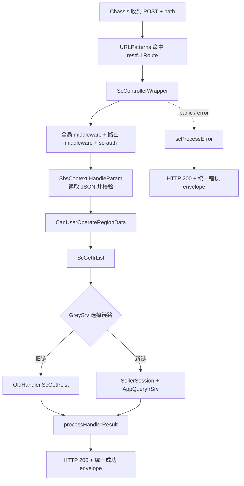
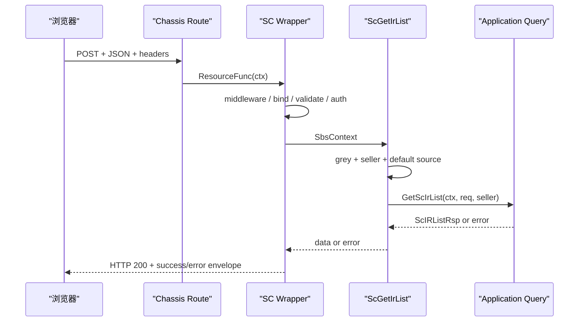

# Chassis HTTP 接口：从路由到请求与响应

> 预计学习时间：130–180 分钟  
> 一句话总结：沿同一入库列表接口追踪 Chassis 路由、SC wrapper、参数绑定、灰度分支、handler 与统一响应，建立可验证的后端改动方法。

## 从前端 Network 记录进入 Go 服务

上一章停在浏览器发出的请求：

```text
POST /api/fbs/sc/inbound/request/list/
Content-Type: application/json
Body: { "page_no": 1, "count": 20, ... }
```

前端同学第一次接触后端仓库，容易拿着 URL 全仓搜索，找到一个同名函数就开始改。可是真实请求在到达业务查询前，还要经过 Chassis 路由、中间件链、参数绑定、校验、区域权限、Seller 会话、旧/新链路选择和统一响应。任何一层都可能让“我的 handler 为什么没执行”成为合理现象。

本章以 `sbs-fbs-server` 当前 release 工作树为基线，只追 Seller Center 入库列表。你将读到这些真实文件：

- `apps/inbound/inbound/access/http/sc/urls.go`
- `apps/inbound/inbound/access/http/sc/handle.go`
- `apps/inbound/inbound/application/fbs_ir_entity.go`
- `middleware/sc_controller_handle.go`
- `middleware/controller_handle.go`
- `middleware/sbsctx/context.go`
- `apps/inbound/inbound/access/http/sc/handle_test.go`

目标不是记住目录，而是能从 method/path 推导运行顺序，知道请求对象为何能在 handler 中被取出，判断错误由谁转成前端看到的 envelope，并为一个兼容字段改动设计测试。

## 先把 HTTP 接口里的名词拆开

HTTP 是浏览器、服务与代理之间传输请求/响应的应用层协议。一个请求至少包含 method、path、header 和可选 body；响应包含状态、header 和可选 body。API 是调用方可依赖的行为契约，不等于某个 Go 函数。只要 method、path、字段、错误语义或权限要求变化，接口契约就可能变化。

route（路由）是一条匹配规则：什么 method 和 path 交给哪个处理入口。handler 是命中路由后执行的业务入口函数。middleware（中间件）包在 handler 外面，统一完成认证、日志、限流、参数处理或错误恢复。DTO（Data Transfer Object，数据传输对象）描述跨边界传递的数据形状。response envelope 是包住业务 data、业务码和提示信息的统一响应外壳。

这几个对象解决的问题不同：route 决定“去哪里”，middleware 决定“进入前需要经过什么”，DTO 决定“传什么”，handler 决定“入口如何编排”。把它们全称为“接口代码”，排错时就会从 404 直接跳到数据库。

### Chassis 与常见 HTTP 技术栈怎样比较

Go 社区可直接使用 `net/http`，也常见 Gin、Echo、Fiber 等 Web 框架；大型系统还会在它们外面组合鉴权、配置、监控与服务治理。`net/http` 稳定、透明、依赖少，但许多团队能力要自行组织。Gin/Echo 路由和绑定更轻便，社区资料多；接入公司统一基础设施仍需额外适配。Chassis 已与当前仓库的 schema、中间件、错误码和服务调用方式结合，开发者能复用一致入口，代价是内部版本差异明显，公开同类框架的示例不能直接复制。

本章学习的是当前 Chassis r.13 代码的真实链路，不做框架选型，也不把 Chassis route 写法推广为 Go HTTP 的唯一做法。

> 本章代码来自 `sbs-fbs-server` 的 release 分支（2026-07-20）。当前 Chassis 版本为 v0.4.3-r.13（比课程参考的 r.8 文档更新）；框架文档只帮助理解概念，实际类型、函数和行为一律以当前 `go.mod`、源码及测试为准。

## 一条请求的完整骨架

先不展开业务查询，把控制流画出来：



这张图解释了四个常见现象。第一，route 不匹配时 wrapper 和 handler 都不会执行。第二，鉴权或参数绑定失败时 handler 也不会执行。第三，handler 执行了不代表一定走新 application service，当前代码可能转给旧 handler。第四，前端看到 HTTP 200 不等于业务成功，因为 SC 错误也会被统一包装成 200 响应。

后续每读一段代码，都把它放回这张图，确认它的输入、输出和失败出口。否则很容易被 middleware 中大量外部错误类型淹没，忘记本次请求真正经过哪些关键节点。

## 路由是 method、path、请求原型与 handler 的汇合点

`apps/inbound/inbound/access/http/sc/urls.go` 中的核心条目是：

```go
func (s *FbsScInboundSchema) URLPatterns() []restful.Route {
    return []restful.Route{
        {
            Method: http.MethodPost,
            Path:   "/api/fbs/sc/inbound/request/list/",
            ResourceFunc: middleware.ScControllerWrapper(
                s.ScGetIrList,
                inbound.ScIrListReq{},
            ),
        },
    }
}
```

这是为教学换行后的等价片段。真实文件还注册了许多入库接口。对单条 route，先读四项：

| 项 | 当前值 | 它决定什么 |
| --- | --- | --- |
| Method | `POST` | 浏览器 method 必须匹配，也影响参数读取位置 |
| Path | `/api/fbs/sc/inbound/request/list/` | 完整路径及尾部斜杠 |
| 请求原型 | `inbound.ScIrListReq{}` | wrapper 要创建、绑定和校验的具体类型 |
| 业务函数 | `s.ScGetIrList` | 参数准备完成后调用的 controller handle |

`restful.Route` 属于当前 Chassis REST server API。课程不要求你掌握 Chassis 的全部注册机制，但要认识 `URLPatterns() []restful.Route` 是该 schema 暴露路由的入口。若新增接口只写 handler、不把 route 纳入实际 schema 聚合，代码可以编译，运行时却没有入口。

请求原型容易被忽略。这里传入的是值 `ScIrListReq{}`，wrapper 后续使用反射创建同类型的新值。它不是实际请求数据，也不是默认全局对象；它告诉统一绑定层“本路由期待什么 DTO”。因此修改 DTO 会同时影响绑定、校验、handler 的类型断言和接口契约。

排查 404 时先对照 route 的 method 与完整 path，再确认当前进程是否注册了这个 schema。不要因为仓库里搜索得到字符串就断言运行中的服务一定加载它。主服务同时存在 `app/` 与 `apps/`，旧新模块并存；同一 path 也可能在旧目录出现。运行时聚合和灰度选择比词面搜索更重要。

## `ScControllerWrapper` 为 handler 建立共同运行环境

`middleware/sc_controller_handle.go` 中，`ScControllerWrapper` 接收业务函数、请求原型和可选 handler 名称，返回 Chassis 需要的 `func(ctx *restful.Context)`。它做的事情可以分为外圈与内圈。

外圈负责一次 HTTP 调用的基础保护：登记 latency defer，初始化 log ID 并在结束时清理；用 `recover` 捕获 panic、打印运行栈，并把它转换为 `ErrPanic`；取得全局预设中间件链；组合当前路由的中间件，且默认加入 API block handler 与 `sc-auth`；最后让两条链包住真正的 REST 处理函数。

缩减后可以这样理解：

```go
func ScControllerWrapper(handle FbsControllerHandle, req any, names ...string) restfulHandler {
    names = AppendFirstHandler(APIBlockHandler, names...)
    return func(ctx *restful.Context) {
        defer recoverAsScError(ctx)
        global := GetFbsManager().GetPresetChain(ctx)
        current := fbsManager.use(append(names, "sc-auth")...)
        rest := func(ctx *restful.Context) {
            scRestfulFunc(ctx, handle, req)
        }
        global(current(rest))(ctx)
    }
}
```

这只是职责示意，不是可替换生产代码。真实实现还处理 latency 与 log ID。关键点是业务 handler 并非 Chassis 直接调用；它被多层函数包装。若认证中间件拒绝请求，`ScGetIrList` 没有日志是正常的。若 panic，被外圈 recover 后，客户端看到统一错误而不是连接直接断开。

中间件顺序也有语义。外层先执行前置逻辑，内层运行 handler，再按调用栈返回执行后置逻辑。调整组合顺序可能改变鉴权、日志、限流与错误捕获行为。业务需求通常不应修改这层；如果确实要加横切能力，必须列出所有消费者并做跨路由验证。

## `scRestfulFunc` 把框架 context 转成业务可用 context

wrapper 的内圈 `scRestfulFunc` 创建 `sbsctx.NewSbsContextImpl(ctx)`，然后依次执行参数处理、区域数据权限检查和业务 handler。成功时调用 `processHandlerResult`；失败时延迟调用 `scProcessError`。

其主线可以概括为：

```go
sbsCtx := sbsctx.NewSbsContextImpl(ctx)

finalErr = sbsCtx.HandleParam(reqParams)
if finalErr != nil {
    return
}

finalErr = userUtil.CanUserOperateRegionData(sbsCtx)
if finalErr != nil {
    return
}

handlerData, finalErr = handle(sbsCtx)
if finalErr != nil {
    return
}

processHandlerResult(ctx, handlerData)
```

真实代码还检查响应 header `Proxy-Response`。当它为 `YES` 时，说明代理路径已经处理响应，wrapper 不再重复写结果。这是又一个“handler 返回后页面为什么不是统一 envelope”的排查分支。

`SbsContext` 把三类对象放在一起：标准 `context.Context` 用于超时、取消和跨层元数据；原始 `*restful.Context` 用于读写 HTTP；已绑定的请求 struct 供 handler 获取。应用与领域层应优先接收标准 context，而不是让 Chassis HTTP 类型一路渗透到 repository。

这里还执行 `CanUserOperateRegionData`。因此 region 相关失败不一定来自 handler 查询条件，也可能在统一权限检查阶段发生。前端 wrapper 注入的 region/shop 上下文与后端中间件、会话、权限必须共同核验，不能只盯 body。

## 参数绑定：为什么 POST JSON 能变成 `ScIrListReq`

`middleware/sbsctx/context.go` 的 `HandleParam` 先检查请求原型是否为空，再通过 `reflect.TypeOf(reqParam)` 获得类型，创建新值并调用 `ReadParam`。读取成功后，根据是否跳过参数解析决定是否执行自定义 validator。

对当前 POST 路由，`ReadParam` 检查 Content-Type。如果包含 `application/json`，就用 `json.Decoder` 从 request body 解码；如果是 XML，则走 Chassis 的 `ReadEntity`；GET 请求则用 `ReadQueryEntity`。读取结束后，它把指针解引用，将值保存到 `s.reqStruct`。

这解释了 handler 中为什么可以写：

```go
req := ctx.GetReqStruct().(inbound.ScIrListReq)
```

类型断言在这里依赖 wrapper 的保证：route 传入 `inbound.ScIrListReq{}`，`HandleParam` 按这个具体类型创建和保存值，只有绑定与校验成功才调用 handler。若绕过 wrapper 直接在测试中构造 fake context，就必须提供同一具体类型；传 `*ScIrListReq` 或别的 struct 都会触发 panic。

还要注意当前兼容逻辑：非 GET 且 Content-Type 不是 JSON/XML 时，读取可能被标记为 skip，validator 也会跳过。此时请求 struct 仍可能是零值。不要把“body 看起来是 JSON”当作已绑定；浏览器必须发送正确 Content-Type。对新接口，是否接受其他内容类型要沿用当前路由同类模式，不能由 handler 靠猜测补救。

JSON 解码失败，例如数字字段收到不可转换字符串，会在 handler 前返回错误。`scProcessError` 对 `*json.UnmarshalTypeError` 有专门分支，转成 invalid param；validator 的 `ValidationErrors` 会翻译并标注错误分类。当前 `ScIrListReq` 的许多字段只有 JSON tag，没有 validation tag，所以“会运行 validator”不等于“分页、长度和枚举已被校验”。具体约束必须检查 DTO tag、application service 和领域逻辑，不能凭框架能力推断。

## DTO 是运行时契约，不只是字段集合

`apps/inbound/inbound/application/fbs_ir_entity.go` 的 `ScIrListReq` 包含分页、IR ID、状态、时间、仓库、SKU、运输方式、发票状态、来源等字段。节选如下：

```go
type ScIrListReq struct {
    PageNo        int      `json:"page_no"`
    Count         int      `json:"count"`
    IrID          string   `json:"ir_id"`
    StatusList    []int8   `json:"status_list"`
    WhsList       []string `json:"whs_list"`
    SellerSku     *string  `json:"seller_sku"`
    MtSkuIdList   []string `json:"-"`
    RequestSource *domainmodel.RequestSource `json:"request_source"`
}
```

这段代码展示四种契约语义。普通 `int`/`string` 无法区分“调用方没传”和“明确传零值”；指针字段可区分缺失与具体值；slice 要考虑 nil、空数组和非空数组；`json:"-"` 表示字段不接受前端直接注入，通常由服务内部补充。

以 `SellerSku *string` 为例，不传时是 nil，可以表示“不启用此过滤”；传空字符串则是非 nil 指针，是否等同不筛选要看后续 normalize/query 逻辑。前端上一章选择 trim 后为空就不发送，是为了减少含糊状态，但后端仍应考虑已有调用方可能发送空字符串。

`RequestSource` 也是指针，却由 handler 在缺失时补默认值。这说明默认值放置位置是契约设计的一部分：wrapper 只负责通用绑定，handler 负责当前入口的来源默认值，application service 收到的是已补齐的请求。若把默认值改到 DTO 构造或 repository，旧/新入口可能出现不一致。

修改 DTO 前要搜索三类消费者：同一类型被哪些 route 当作请求原型，哪些 handler/application 方法接收它，哪些 copier/映射与测试依赖字段。只改 JSON tag 可能破坏前端；只改 Go 字段名但保留 tag 可能不影响 wire format，却会影响所有 Go 调用点。

## handler 做入口编排，不承担所有业务

`ScGetIrList` 的真实顺序是：默认假设不用新链；如果 `GreySrv` 存在，调用 `GreyToNewByApiPath`；未选择新链时直接交给 `OldHandler.ScGetIrList`；选择新链后读取 Seller 信息；从 context 取 `ScIrListReq`；复制为 service request；缺失 `RequestSource` 时补 FBS 默认值；最后调用 `AppQueryIrSrv.GetScIrList`。

```go
func (s *FbsScInboundSchema) ScGetIrList(ctx sbsctx.SbsContext) (interface{}, error) {
    useNewChain := false
    if s.GreySrv != nil {
        var err error
        useNewChain, err = s.GreySrv.GreyToNewByApiPath(ctx, &oldinbound.ScIrListReq{})
        if err != nil {
            return nil, err
        }
    }
    if !useNewChain {
        return s.OldHandler.ScGetIrList(ctx)
    }

    sellerInfo, err := s.SellerSessionSrv.GetSellerInfo(ctx.GetRestfulContext())
    if err != nil {
        return nil, err
    }

    req := ctx.GetReqStruct().(inbound.ScIrListReq)
    var srvReq inbound.ScIrListReq
    if err := copier.Copy(&srvReq, &req); err != nil {
        return nil, err
    }
    if srvReq.RequestSource == nil {
        source := appdomainmodel.RequestSourceFBS
        srvReq.RequestSource = &source
    }
    return s.AppQueryIrSrv.GetScIrList(ctx.GetContext(), &srvReq, sellerInfo)
}
```

这段接近真实实现，只调整了局部变量展示。它体现 controller 的合理职责：选择入口链路、获取会话、把 HTTP DTO 转成 application request、补入口默认值、调用应用服务并透传结果/错误。真正的列表过滤、数据访问和领域规则不应继续堆在 handler。

`copier.Copy` 看起来像“自己复制给自己”，但它保留了入口 DTO 与 service request 可独立演进的空间；当前类型相同不代表永远相同。修改字段后，应验证 copier 是否能正确复制指针、嵌套结构与新类型。对关键字段，测试中直接断言传给 fake service 的值，比相信反射库更可靠。

## 旧链与新链并存意味着什么

当前代码事实不是“`apps/` 已完全替换 `app/`”，而是同一路由可通过 GreySrv 选择旧 handler 或新 application service。课程不讲发版操作，但开发者必须理解这种运行时分支，因为它直接影响需求正确性。

如果新增请求字段只在新 DTO/新 service 生效，而灰度规则仍可能走旧链，那么部分请求会忽略筛选或行为不同。你需要检查 GreySrv 使用的旧请求原型、旧 handler 的 DTO 与转换、两条链的响应结构，以及测试是否覆盖 `useNew=true/false`。不能用“我改的是新目录”作为忽略旧链的理由。

反过来，也不应为了兼容把所有新逻辑复制两份。先确认需求范围、当前链路策略和旧实现维护边界，再选择：两边都支持字段；入口统一 normalize 后两边消费；只在新链启用但给旧链明确兼容行为；或等待架构决策。课程练习只要求你发现分支并写出验证矩阵，不替团队做迁移决策。

用下面的四格表避免漏测：

| 链路 | 字段缺失 | 字段有值 |
| --- | --- | --- |
| 旧链 | 行为与改动前一致 | 明确支持、忽略或受控拒绝，不能未知 |
| 新链 | 行为与改动前一致 | application/query 正确消费并可验证 |

“字段缺失”是兼容性基线；“字段有值”是新能力。只有测新链有值，无法证明真实流量一致。

## 成功响应由统一层包装

handler 返回 `(data, nil)` 后，`processHandlerResult` 先记录 latency，再按 data 类型分支。文件与 PDF 有专门写法；普通数据调用 `response.OkResponse(data)` 并以 HTTP 200 写 JSON。前端因此通常看到 envelope，而不是裸 `ScIRListRsp`。

application 中的 `ScIRListRsp` 真实结构包含：

```go
type ScIRListRsp struct {
    Total  int64          `json:"total"`
    IrList []ScIrListInfo `json:"ir_list"`
}
```

它会作为统一响应中的 data。前端类型和解包逻辑必须区分 envelope 字段与业务数据字段。若 wrapper 已经返回 `data`，页面再访问一次 `.data` 会得到 undefined；若某个实例返回完整 response，页面直接读 `ir_list` 又会失败。联调时同时看 Network 原始 JSON 与 request wrapper 返回约定。

不要在每个 handler 手写 `ctx.JSON`。那会绕过统一格式、错误分类、监控和文件分支，还可能造成重复写响应。只有仓库已有明确特殊响应类型或代理路径时，才沿现有模式处理。

## 错误如何变成前端看到的 `retcode`

`scRestfulFunc` 保存 `finalErr`，延迟调用 `scProcessError`。后者先记录 path 与 error，再按具体错误类型转换。WMS、DATA、ISC、Retail、OMS、SCBS、SellerServices、SLS、FeatureToggle 等下游错误会映射为面向 Seller Center 的稳定错误；validator 错误会翻译；`HTTPError` 保留；JSON 类型错误变为 invalid param；未知错误报告监控事件并兜底为 `ErrUnknownType`。

最终写回：

```go
ctx.JSON(
    http.StatusOK,
    errcode.ErrorFormat(ctx.Ctx, returnErr, data, langID),
)
```

这就是前端必须区分 HTTP 成功与业务成功的直接代码证据。统一返回 HTTP 200 是当前 SC 接口约定，不应在单个 handler 私自改成另一种风格。若设计全新外部 API，需要按其所属边界和现有 wrapper 决定，不把 SC 约定推广到所有服务。

错误处理还有两个安全目的。第一，未知内部 error 不应原样暴露给 Seller；`ScControllerWrapper` 会用稳定未知错误兜底。第二，下游错误映射同时记录监控事件，服务端保留诊断证据，客户端获得可翻译信息。开发时不要为了“方便排错”把数据库错误、堆栈或请求凭据塞进 response。

panic 由 wrapper 最外层 recover，打印 stack 后也走 `scProcessError(..., ErrPanic)`。单元测试通过不代表没有 panic；对类型断言、nil service 和边界输入仍应设计测试，recover 是最后防线，不是正常控制流。

## 从一次失败反推所在层

下面四个症状看起来都像“接口失败”，检查路径完全不同。

### 404，handler 无日志

先核对 method、完整 path、尾部 `/`、代理目标和运行进程的 route 注册。不要先改 `ScGetIrList`，因为请求可能没有进入 wrapper。

### HTTP 200，`retcode` 表示参数错误

查看 Content-Type 与 request payload，确认数字、数组和枚举形态。JSON 类型错误发生在 handler 前；validator 错误也发生在 handler 前。用 request ID 查日志，区分 decode 与 validation。

### HTTP 200，未知业务错误，只在部分 Seller 出现

先确认是旧链还是新链，再查 Seller session、region 权限和下游错误映射。不要假设所有用户执行相同 application service。

### HTTP 200，服务端返回列表，页面仍为空

后端主链可能已经成功。检查 envelope、字段名 `ir_list`、前端 wrapper 解包、Store 写入和渲染条件。不要为了迁就页面把后端字段临时改成 `list`，除非契约正式变更并兼容所有消费者。



时序图里的每个箭头都能找到证据：Network 记录、route 条目、wrapper 日志、handler test、fake service 收到的 request、最终 response。诊断的目标是找到第一条不符合契约的箭头。

## 用现有 handler test 学会隔离入口编排

`apps/inbound/inbound/access/http/sc/handle_test.go` 已有 `TestScGetIrListUsesQueryServiceWhenGreyEnabled`。测试构造 `ScIrListReq`、Seller 信息、fake query service 和 `useNew=true` 的 fake GreySrv，然后直接调用 handler。它断言返回值、传给 query service 的分页/IR ID，以及缺失 `RequestSource` 时补上的 FBS 默认值。

这个测试没有启动 HTTP server，也没有执行真正的 wrapper。它验证的是 controller 编排：新链选择、Seller 传递、请求复制与默认值。速度快、失败定位清楚。对应地，参数绑定、Content-Type、middleware 顺序和统一 envelope 需要 wrapper/集成层测试或受控接口验证，不能声称一个 handler unit test 覆盖整条 HTTP 链。

测试 double 的类型也揭示接口边界。fake context 的 `GetReqStruct()` 必须返回值类型 `ScIrListReq`，fake query service 保存收到的指针，测试随后断言字段。新增字段时，最小可靠测试是把字段放进 input，调用 handler，再检查 fake service 收到同值；同时保留字段缺失用例，证明默认行为不变。

还应补旧链测试：`useNew=false` 时 query service 不应被调用，OldHandler 应接收请求。若旧 handler 很难替换，至少在影响分析中记录未覆盖项，不能把 new-chain test 写成“接口全链通过”。

## 受控练习：验证 `seller_sku` 契约穿过新链

前端练习准备发送可选 `seller_sku`。当前新链 DTO 已经有 `SellerSku *string`，所以后端任务不是盲目新增字段，而是证明它能从已绑定请求传给 application query，并识别旧链兼容风险。

### 第一步：做存在性审计

搜索 `SellerSku` 与 `seller_sku`，列出 DTO、转换、application request、query 条件和测试。区分 `json:"seller_sku"` 与仅 Go 内部字段。若 repository 已消费它，记录过滤方式；若没有，不要在报告中声称后端已经支持完整筛选。

### 第二步：补 handler 编排断言

在现有 new-chain test 的请求中加入：

```go
sellerSKU := "SKU-001"
req := inbound.ScIrListReq{
    PageNo:    3,
    Count:     30,
    SellerSku: &sellerSKU,
}
```

调用后断言 `query.scListReq.SellerSku` 非 nil 且值相等。再写一个 nil 用例，确认 handler 不会擅自创建空字符串指针。这里验证的是复制与传递，不要把测试名写成“filters database by seller sku”。

### 第三步：验证 HTTP 绑定

若仓库已有同类 route 测试设施，构造 `Content-Type: application/json` 的 POST body，执行 wrapper，验证 handler/fake service 收到指针值。再用错误类型，例如把 `seller_sku` 传成对象，确认 handler 不执行且返回统一参数错误。若当前测试环境无法低成本启动 Chassis，保留一条受控 test 环境联调记录，并明确 unit test 未覆盖绑定层。

### 第四步：检查旧链

打开 `app/inbound/inbound/access/schttp` 对应 DTO 和 handler，确认同名 JSON 字段及其 query 逻辑。若旧链不支持，写出实际行为和决策点，不自行删除灰度分支。至少保留“旧链 + 字段缺失”回归证据。

### 第五步：形成证据包

完成标准包括：method/path 契约卡；DTO 空值语义；new-chain handler test；绑定层验证或明确未覆盖；旧链影响说明；一条脱敏 request/response 记录；相关 Go test 命令与退出码。开发交接后遵循团队通用发版流程，本章不讲平台操作。

## 新增 Chassis HTTP 接口的最小工作顺序

真实需求未必只是改列表字段。需要新增同类 SC 接口时，可以按以下顺序工作。

1. 找一个同侧、同响应形态、同鉴权要求的近邻接口，读 route、DTO、handler、application 方法和测试，避免从空白复制过时样板。
2. 先写 method/path、请求字段、空值语义、响应 data 与错误语义；确认是否 JSON、文件或 PII。
3. 在 application/access 边界定义 DTO，使用明确 JSON tag；只有证据支持时才加 validation tag。
4. 在 `URLPatterns` 注册 route，选对 SC/FBS/OpenAPI wrapper 与请求原型。
5. handler 只做入口编排、会话/上下文获取、DTO 转换和应用服务调用，不把 SQL 与复杂规则写进去。
6. 为正常、绑定错误、业务错误和关键 nil/zero 边界准备测试；存在旧/新链时分别覆盖。
7. 用受控环境核对实际 request、统一 response、request ID 与日志，不把 handler unit test 当成 HTTP 全链证据。
8. 运行目标 package test，再按影响面选择更大范围的 test/build；记录未验证的下游与环境条件。

顺序的核心是先契约、后接线，再逐层验证。直接复制一个旧接口然后改到能编译，往往会带入错误 wrapper、旧 DTO 或不适用的权限链。

## 常见误区与修正方法

### 只搜索 URL，不看 method

同一路径在不同 method 下可以是不同 route。修正方法是把 method/path 作为不可分割的键，并核对前端 `params/data`。

### 在 handler 里重新解析 body

wrapper 已经绑定并校验，再读 body 可能得到 EOF，还会形成两套规则。修正方法是从 `SbsContext.GetReqStruct()` 获取 DTO；需要特殊内容类型时使用仓库已有专用模式。

### 认为 validation 一定检查了分页和枚举

只有 DTO tag 或显式逻辑存在才有约束。修正方法是逐字段查看 validation tag 和下游校验，给出实际反例测试。

### 把 type assertion panic 当作框架不稳定

route 与 wrapper 正常执行时具体类型有保证；直接单测 fake context 时最容易传错指针/值。修正方法是让 fake 与 route 原型一致，并保留 panic recover 只是最后防线的认识。

### 修改新链后宣称接口完成

GreySrv 可能仍选旧链。修正方法是至少覆盖四格兼容矩阵，明确字段在两条链的行为。

### 每个 handler 自己格式化错误

这会泄露内部 error、破坏翻译与前端统一处理。修正方法是返回稳定 error，让 SC wrapper 转换；只在已有边界明确要求时使用特殊响应。

### 用 Chassis r.8 文档覆盖 r.13 源码

文档能解释模块名，不能证明当前函数签名和兼容逻辑。修正方法是以 `go.mod`、当前 wrapper 源码和测试为事实，再用相近版本文档补概念。

### 把发布灰度与代码中的 GreySrv 混为一谈

本章只讨论请求运行时选择旧/新实现对开发正确性的影响，不教授发版 SOP。修正方法是在契约和测试中覆盖分支，不延伸到平台操作。

## 章末故障演练

为下面每个现象写出“第一证据、第二检查点、不要先做什么”。

1. 前端 POST 正确 URL，却返回 404，服务端 handler 没日志。
2. HTTP 200，业务码为 invalid param，payload 中 `count` 是字符串。
3. 同一 payload 对部分 Seller 生效、部分不生效。
4. new-chain unit test 通过，线上记录显示请求走 OldHandler。
5. handler 返回 `ScIRListRsp`，Network 有 `ir_list`，页面读取 `list`。
6. 新字段在 DTO 中存在，fake query service 收到 nil。
7. 测试直接传 `*ScIrListReq`，handler 在类型断言处 panic。
8. 文件导出接口被普通 JSON wrapper 包装，浏览器无法下载。

一个合格答案应把问题分别定位到 route 注册/进程、JSON 绑定、灰度分支、测试覆盖、响应契约、copier/映射、fake 类型和特殊响应分流。若八题都回答“查日志”，说明还没有把日志放回控制流。

## STAR 案例：接口返回成功，筛选却没有生效

### Situation

前端发送了新的 `seller_sku` 字段，HTTP 状态与 retcode 都表示成功，列表却与未筛选时相同。

### Task

在不同时修改前后端和数据库的前提下，确定字段丢在绑定、handler 转换还是 application 之后。

### Action

先保存 Network 请求，确认 method、path、Content-Type 与字段值。随后在 handler test 中使用同一 DTO，捕获 fake service 收到的参数。测试显示绑定对象已有字段，但传给 service 的条件缺失，于是把范围锁定在 handler 转换。补上映射后，增加“未传字段保持旧行为”和“传字段进入 service”的两组断言，再重跑错误响应测试。

### Result

筛选参数能够穿过 HTTP 入口，旧请求不受影响。修复没有触碰 repository，也没有用日志猜测数据库行为。

### Reflection

HTTP 200 只证明请求走完响应包装，不能证明每个字段都穿过调用链。分层测试的价值是把证据停在最近的交接点。

## 章末自检

不看源码先回答，再用当前仓库验证：

1. `URLPatterns` 中为什么既要写请求原型又要写 handler？
2. `ScControllerWrapper` 的外圈与 `scRestfulFunc` 各负责什么？
3. POST JSON 在什么条件下被解析，何时可能跳过 validator？
4. handler 中的值类型断言为什么在正常 route 下成立，测试中又为什么容易失败？
5. `ScIrListReq` 的 `string`、`*string`、slice 和 `json:"-"` 分别表达什么边界？
6. `ScGetIrList` 为什么先判断 GreySrv，再取 Seller、复制 DTO 和补 RequestSource？
7. 成功和失败为什么都可能返回 HTTP 200，前端应怎样判断？
8. 一个 handler unit test 能证明什么，不能证明什么？
9. 新增可选筛选字段时，如何验证旧链、新链、缺失和值四种组合？
10. Chassis 文档与当前代码不一致时，你按什么顺序取证？

达到本章目标的标准不是能默写 wrapper，而是拿到一条 Network 记录后，能在十分钟内画出实际控制流，指出最可能的失败层，并设计最小验证，不跨层猜测。

## 本章小结

Chassis HTTP 接口的可读单位不是单个 handler，而是 route、controller wrapper、SbsContext、DTO、handler、application service 和统一 response 的组合。route 把 method/path、请求原型与业务函数连接起来；SC wrapper 建立中间件、日志、panic 保护、参数绑定、权限和错误转换；handler 负责入口编排；application 与下层实现业务查询。

当前入库列表还有旧/新链并存。任何契约改动都要证明缺失字段保持旧行为，并核对字段在两条链的消费方式。成功与错误都可能使用 HTTP 200 envelope，因此后端测试既要看 data，也要看错误格式；前端则必须检查业务码。

把本章与 FE-W05 合起来，你已经有了一条连续的开发地图：页面组织筛选 → API 函数确定 POST/body → request wrapper 拼前缀并注入上下文 → Chassis route 命中 → wrapper 绑定 DTO → handler 选择链路 → application 返回列表 → 统一 envelope → 前端解包和展示。后续学习分层、数据库和跨服务时，都应保留这条主线。

## 参考文献

- Go Documentation. [The Go Programming Language Specification: Struct types](https://go.dev/ref/spec#Struct_types). 访问于 2026-07-16。
- Go Packages. [`encoding/json`](https://pkg.go.dev/encoding/json). 访问于 2026-07-16。
- Go Packages. [`context`](https://pkg.go.dev/context). 访问于 2026-07-16。
- Go Blog. [The Go Blog: Defer, Panic, and Recover](https://go.dev/blog/defer-panic-and-recover). 2010-08-04。
- RFC Editor. [RFC 9110: HTTP Semantics](https://www.rfc-editor.org/rfc/rfc9110). 2022-06。
