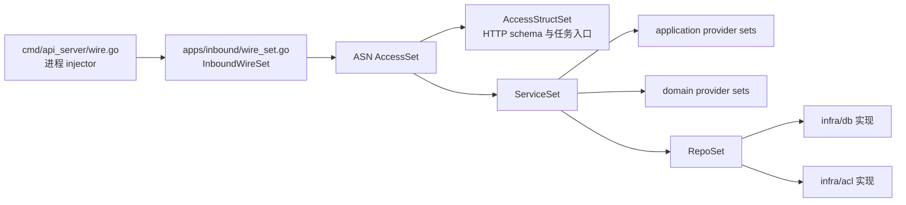
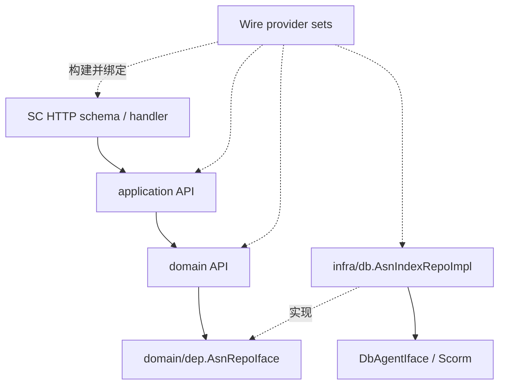

# Wire 与分层：把 handler 接到应用、领域和基础设施

> 预计学习时间：160–220 分钟
> 一句话总结：沿 ASN 接口手工还原 access、application、domain、infra 的依赖图，再用 Wire 的 provider set 与生成代码核对，让一次新增依赖既能编译，也能被测试隔离。

## 先完成一件具体的事

上一章停在 HTTP handler：请求已经绑定成 Go 对象，handler 也知道要调用哪个业务接口。现在继续往下追。目标不是背诵 Wire API，而是回答四个能直接影响改动的问题：handler 实际拿到的 service 从哪里来；service 为什么只依赖接口；数据库实现在哪一层接入；增加一个依赖后，哪些文件应改、哪些生成文件不能手改。

本章以主服务当前 release 工作树中的 ASN 新目录为主线。真实聚合入口是 `apps/inbound/asn/wire/wire_set.go`。它没有定义一个虚构的 `NewInboundHandler → NewInboundService → NewInboundRepository` 三节点链，而是把 access struct、application、domain、数据库和 ACL 的多个 provider set 汇合起来。大型存量工程就是这样：心智模型可以简化，证据不能简化成另一套代码。

前端同学可以先把 provider set 理解为“构建期的依赖清单”。React 组件树在运行时通过 props、Context 或 Provider 传递对象；Wire 在生成阶段解出构造关系，输出普通 Go 调用。这个类比只帮助找到入口。Wire 没有浏览器运行时容器，也不会在请求到来时按名称查找实例。

## 先认识依赖、依赖注入、Wire 与分层

依赖是一个对象完成工作时需要的另一个能力。application 查询 ASN 时需要 repository，这就是依赖；它不应在每次调用时自行创建数据库连接。依赖注入（Dependency Injection，DI）是由对象外部把所需能力交给它。这样构造关系集中、替换 fake 更容易，业务代码也不必知道具体初始化细节。

Wire 是 Go 的编译期依赖注入代码生成器。provider 告诉 Wire 怎样得到一个类型，provider set 组合若干提供方式，injector 描述最终需要什么，生成文件则把这些信息展开成普通 Go 构造调用。Wire 不负责路由、事务或数据库查询；它只解决“启动进程时，哪些对象怎样被创建并连接”。

分层是按职责和变化原因划边界。access 处理 HTTP/任务协议，application 编排用例，domain 表达业务规则和所需接口，infra 适配数据库与外部服务。分层解决的是业务与技术细节互相牵连的问题，不是为了让目录看起来对称。

### 同类做法及其取舍

| 做法 | 优点 | 代价与风险 | 当前课程结论 |
| --- | --- | --- | --- |
| `main` 中手写构造 | 直接、无生成步骤、容易单步阅读 | 对象图大后重复且易漏，跨进程差异难维护 | 小程序常用，当前大型对象图不统一改回手写 |
| Wire 编译期生成 | 类型错误较早暴露，产物是普通 Go，运行时无容器查找 | 需要维护 set 和生成流程，作用域放错仍会过度注入 | 按仓库现状使用并审查生成 diff |
| 运行时 DI 容器 | 注册灵活，可按配置选择实现 | 错误更可能推迟到启动/运行时，依赖关系更隐式 | 当前主线不采用 |
| service locator / 全局单例 | 调用点写起来短 | 隐藏依赖、难隔离测试、初始化顺序脆弱 | 不作为绕过 Wire 的修复 |

Wire 的优点不能替代架构判断。它能证明类型图可解，却不知道一个 client 应只进入 API 还是也进入 task；分层也不能靠 Wire 自动生成。后文每次看 set，都要同时问“类型能否提供”和“职责是否放在这里”。

## 从 HTTP schema 画第一版依赖图

打开 `apps/inbound/asn/wire/wire_set.go`，先不跳进每个文件。当前文件有三组值得分别读的集合：

- `AccessStructSet` 使用 `wire.Struct(..., "*")` 组装 HTTP schema、任务集合、consumer 和 cron task。
- `ServiceSet` 引入 application、domain 的 provider set，并继续依赖 `RepoSet`。
- `RepoSet` 汇合 ASN、SKU、carton、remark、shipment 等数据库实现，以及 ToB ACL 实现。

它们最后被 `AccessSet = wire.NewSet(AccessStructSet, ServiceSet)` 导出，再由上一级 `apps/inbound/wire_set.go` 合入 `InboundWireSet`。进程级 injector 位于 `cmd/api_server/wire.go`；`wire.Build(...)` 把 inbound 与其他业务模块、中间件和 agent 一起装配为 API 进程需要的对象图。



这张图表达依赖供应关系，不等于一次请求的调用时序。一次 SC 请求会从 schema/handler 进入 application，再进入 domain 或 repository；Wire 图回答的是“这些对象如何在进程启动前被创建并连在一起”。不要把构建关系和运行关系混成一张箭头图。

### 手工追踪时记录三类节点

第一类是消费者：struct 字段或构造函数参数表明“我需要某个类型”。第二类是 provider：普通 Go 函数、`wire.Struct` 或 `wire.Value` 说明“我能提供某个类型”。第三类是绑定：`wire.Bind` 说明“这个具体类型可满足那个接口”。

例如 ASN repository 的依赖接口位于 `apps/inbound/asn/domain/dep`，实现位于 `apps/inbound/asn/infra/db`。`AsnIndexRepoImplSet` 同时提供 `AsnIndexRepoImpl` 的构造方式，并把 `api.AsnRepoIface` 绑定到 `*AsnIndexRepoImpl`。domain 看到的是接口，Wire 看得到具体实现，两边因此可以同时成立。

前端的近似关系是：页面依赖 `InboundApi` 类型，应用入口把真实 HTTP adapter 放进 Context，单测则放 fake。差别在于 TypeScript 类型会被擦除，Context 选择发生在运行时；Go 接口由编译器检查，Wire 生成的构造代码也参加编译。

## 四层不是四个固定目录名

课程使用 access、application、domain、infra 作为阅读坐标，但不能据此断言三个后端仓库目录完全一致。主服务同时有 `app/` 和 `apps/`；敏感服务也存在不同成熟度的模块；Tax 更常见 controller、service、model/dao 与 third_party 的组织。分层要从职责和依赖方向判断，而不是看文件夹拼写。

| 阅读坐标 | 本次 ASN 主线中的职责 | 不应放入的工作 |
| --- | --- | --- |
| access | 协议入口、参数绑定、调用 application、响应转换 | 直接拼复杂 SQL；把跨服务重试写进 handler |
| application | 用例编排、事务入口、跨 domain 协作、结果转换 | 暴露 HTTP context 类型给 domain；复制 repository 查询细节 |
| domain | 实体、业务规则、依赖接口和领域服务 | 依赖具体 MySQL 表模型；读取 Chassis 请求对象 |
| infra | 实现 repository/client，适配数据库或下游 | 决定页面权限；把底层错误原样作为 HTTP 契约 |

这不是“每层都必须有一个同名 struct”的格式要求。有的用例很薄，application 只做转换与委派；有的业务规则集中在 domain intern；旧模块可能把若干职责放在相邻包里。判断标准始终是：上层需要什么契约，具体设施是否能在测试中替换，业务规则是否被协议与数据库细节绑住。

## Wire 到底生成了什么

`cmd/api_server/wire.go` 带有 `wireinject` build tag。它声明 injector 并调用 `wire.Build`，函数体是给生成器读取的描述。生成后的 `cmd/api_server/wire_gen.go` 是普通 Go 文件：逐项调用 provider，得到 repository、domain service、application service、schema 和最终 App。

生成代码有三个实际用途。第一，编译器能检查缺少 provider、重复绑定和类型不匹配。第二，开发者可以沿局部变量阅读真实构造顺序。第三，代码评审时能看出一次 provider 变更扩大了哪些进程对象图。

它不是运行时反射容器。请求进入后不会再次执行 `wire.Build`；运行时使用的是已经创建好的对象。也不能说 Wire “零成本”，因为对象本身的初始化仍有时间与资源开销。准确说法是：依赖图解析在生成/编译阶段完成，没有额外的运行时按类型查找容器。

### `wire.NewSet`、`wire.Struct` 与 `wire.Bind`

`wire.NewSet` 组合 provider。被组合的项可以是构造函数，也可以是另一个 set。大型模块用小 set 表达局部边界，再由进程 injector 汇总。

`wire.Struct(new(T), "*")` 表示用可供给的字段类型组装 `T` 的所有字段。它适合字段本身已经清楚表达依赖的 schema/task set。新增字段会改变构造要求，因此不是“无需维护”。如果字段不应自动注入，应收窄字段列表或改用显式构造函数，而不是依赖偶然可用的同类型对象。

`wire.Bind(new(Interface), new(*Implementation))` 只声明接口满足关系，不负责创建 implementation。相同 set 中仍需要一个能提供 `*Implementation` 的 provider。`new(Interface)` 和 `new(*Implementation)` 是 Wire 用来取得类型信息的写法，不是在业务运行时分配最终对象。

### 生成失败比运行时失败更有价值

假设给 application 实现增加 `AuditWriter` 字段，却没有把 provider 加入对象图。重新生成时 Wire 会报告缺少该类型的 provider；若没有重新生成，现有 `wire_gen.go` 仍按旧构造签名调用，通常会在编译阶段因参数或 struct 变化而失败。不能把它描述成“编译通过但运行时必然 nil panic”。是否能编译取决于具体改法，可靠动作是同时检查生成 diff 和构建结果。

另一个常见失败是同一目标类型有多个来源。比如两个 set 都提供同一个具体 client，Wire 无法凭业务意图猜选哪个。修复方式是明确类型边界、封装为不同 adapter，或缩小 set；不要为了让生成器通过而随意删除其中一个 provider。

## 沿 ASN repository 看依赖倒置

`apps/inbound/asn/domain/dep/asn_repo.go` 定义 domain 需要的 repository 能力。`apps/inbound/asn/infra/db/fbs_asn_repo_impl.go` 的 `AsnIndexRepoImpl` 实现这些方法，并依赖 `db.DbAgentIface`。domain 包不需要 import Scorm 表模型；infra 才把 domain 条件转换成查询条件，再把表记录转换回 domain entity。

依赖方向因此不是“handler → service → MySQL 文件”的物理箭头，而是两组关系：运行时调用从上往下；源代码接口由内层或消费者侧定义，具体实现从外层指向接口。Wire 负责在最外侧把两者接上。



这种边界直接改善测试。application 或 domain 单测可以提供 fake repository，控制“查到记录”“无记录”“数据库错误”等结果，而不需要真正连接 MySQL。infra 测试再单独验证查询条件与表映射。一个测试同时启动 HTTP、Wire 和数据库看似更完整，却很难指出失败属于哪一层。

## 受控改动：增加一个只读审计依赖

练习需求是：ASN 列表查询完成后记录一条不含请求 body、不含 PII 的结构化审计事件。它只用于教学依赖接入，不代表生产需求，也不要求修改业务仓库。先定义边界：审计失败是否影响查询结果必须由真实需求决定；本练习采用“失败返回错误”，便于观察依赖传播，不能把这个选择推广为所有日志场景。

### 第一步：把接口放在消费者能拥有的位置

如果 application 用例需要写审计，就在该用例可依赖的包定义最小接口，而不是把完整 logger SDK 暴露进去：

```go
// 教学缩减示例：名称与字段需按目标模块现有约定调整。
type AuditWriter interface {
	Write(ctx context.Context, event AuditEvent) error
}

type AuditEvent struct {
	Action string
	Count  int
}
```

最小接口让 fake 很容易实现，也防止 application 开始依赖日志格式化、传输协议或凭据配置。不要为了“以后可能需要”预先加入十几个方法。

### 第二步：修改构造依赖或 struct provider 所需字段

目标实现增加 `AuditWriter`。若该类型通过显式 `NewXxx(a, b)` 构造，就修改构造函数；若由 `wire.Struct(..., "*")` 组装，就增加字段并确认 provider set 能提供唯一的 `AuditWriter`。两种方式不能在没有读源码前混写成一条固定命令。

### 第三步：在 infra 或 adapter 层提供实现

实现可以包住仓库已有的结构化记录能力。代码评审要确认事件中只有 action、数量、请求标识等允许字段，不记录联系人、地址、原始 token 或整个 DTO。安全边界会在 BE-W06 继续展开。

### 第四步：更新 provider set

provider set 需要同时包含具体实现 provider 与接口绑定。缩减形态如下：

```go
var AuditSet = wire.NewSet(
	NewAuditWriter,
	wire.Bind(new(AuditWriter), new(*auditWriter)),
)
```

然后把 `AuditSet` 合入恰当的模块 set。应放在能够服务该依赖的最小范围，避免仅一个 ASN 用例所需的 adapter 被塞进全局基础集合。范围越大，重复 provider 和意外耦合越难诊断。

### 第五步：生成、读 diff、再测试

仓库 injector 文件已有 `//go:generate` 约定时，按对应目录的现有 Makefile 或 `go generate` 入口执行。不要凭课程猜一条全仓生成命令。完成后按以下顺序核对：

1. `wire_gen.go` 的文件头仍说明 generated；
2. 新 provider 只进入预期进程，例如 API 而非无关 task；
3. 生成代码先取得具体实现，再把它传入目标 application；
4. 没有出现第二套同类型 provider；
5. 目标包单测和进程构建通过。

生成 diff 很大时先检查是否使用了与仓库锁定版本不一致的 Wire，或是否在错误目录执行。不要把无关重排和业务改动一起提交。

## 循环依赖要从包和职责两层诊断

Go 首先禁止 package import cycle。A 包 import B，B 又 import A，即使还没运行 Wire，编译器也会拒绝。Wire 还会诊断 provider 图中的依赖环：构造 A 需要 B，构造 B 又需要 A。两种错误症状相似，修法不同。

遇到 import cycle，查看包依赖。常见原因是 infra 为复用一个 DTO 反向 import access，或 domain import application。把共享的稳定类型移到合适的内层包，或在边界做转换；不能新建一个 `common` 包把所有东西扔进去。

遇到 provider cycle，写出构造关系。可能是两个 service 彼此持有完整接口。先问它们是否真的属于两个职责；也可以抽出更小的只读能力、用事件/回调打断同步所有权，或把共同规则下沉到无外部依赖的 domain service。不要用全局变量和 service locator 绕过 Wire，那只会把编译期错误换成运行时隐式依赖。

| 现象 | 第一项检查 | 有效修复方向 | 无效捷径 |
| --- | --- | --- | --- |
| `import cycle not allowed` | package import 图 | 调整类型归属与转换边界 | 把文件随意移动到 `utils` |
| no provider found | 目标类型及 set 作用域 | 增加 provider/bind 或纳入正确 set | 手改 `wire_gen.go` |
| multiple bindings | 同类型 provider 来源 | 缩小 set、明确 adapter 类型 | 随机删掉一个 provider |
| cycle for X | 构造函数/字段依赖图 | 拆小接口或重划职责 | 全局单例、运行时查找 |

## 三个仓库怎样对照，而不强求同构

主服务的 ASN provider set 是模块化聚合案例。敏感服务的 `apps/client/wire_set.go` 当前大量旧业务组装被注释，实际可见的 `InitializeMiddleware` 聚合中间件和 agent。这说明阅读者必须同时看 injector、生成文件与进程注册，不能看见一个 `wire_set.go` 就假设全部业务已经接入。

Tax 的 `apps/tax_api/api/wire.go` 和 `apps/tax_core/wire.go` 直接聚合 controller、service、DAO 和 third-party provider sets，生成文件会展开一条很长的构造链。Tax 的目录词汇与主服务不同，但依赖原则相同：controller 不应自己创建 DAO；service 通过接口依赖外部能力；最外层 injector 决定使用哪个实现。

这三种形态提供一个实用阅读顺序：先找进程调用的 `Init...` 或 `Initialize...`；再找对应 injector 的 `wire.Build`；沿 provider set 缩小到目标模块；最后才进具体构造函数。直接全文搜索 `wire.NewSet` 会得到几百个结果，信息很多，路线却没有建立。

## STAR 案例：生成成功，API 进程却多了不该有的依赖

### Situation

开发者为一个 ASN 查询用例增加 client adapter。Wire 可以生成，目标包测试也通过，但 `wire_gen.go` 显示该 adapter 被全局 set 引入多个进程对象图。它的初始化还需要一项只在 API 环境存在的配置。

### Task

确认问题是业务调用错误、provider 缺失，还是 provider 作用域过大，并让 API 使用该 adapter 而不影响 task 进程。

### Action

先比较改动前后的生成文件，不启动服务猜配置。diff 显示新 provider 从共享 `ServiceSet` 进入 API 与 task。随后画出 set 包含关系，确认只有 HTTP application 需要它。把 adapter provider 从共享集合移到 access/API 对应的更小 set，保留接口绑定；重新生成 API 与 task 的 Wire 文件。最后用 fake adapter 跑 application 失败路径测试，并分别构建两个进程入口。

### Result

API 生成链保留新 adapter，task 生成链不再创建它。配置缺失不再阻塞 task 构建，application 测试仍能验证远端失败的错误转换。

### Reflection

Wire 通过不等于依赖边界正确。生成器验证的是类型图可解，不会判断一个 provider 是否被放得太高。有效证据来自 set 作用域、生成 diff、进程构建与隔离测试的组合。

## 独立练习：提交一份可复核的依赖变更说明

选择 ASN 的一个 SC HTTP schema，完成只读分析，不修改业务仓库：

1. 从 schema 字段或 handler 调用找到 application 接口；
2. 找到 application 的具体实现 provider；
3. 继续找到一个 domain 依赖接口及 infra 实现；
4. 标出 `wire.Bind` 或等价的接口满足证据；
5. 在 `cmd/api_server/wire_gen.go` 找到至少两个对应的构造局部变量；
6. 写一个“增加 fake AuditWriter”的最小改动计划；
7. 说明 API 与 task 哪些进程应受影响，并给出判断依据。

通过标准不是列出最多文件，而是每条箭头能回答“谁消费什么类型、谁提供它、由哪个 set 汇合”。如果某条关系只靠目录名猜测，标为待核对并回到构造函数或生成代码。

## 章末自检

- 能否用一句话区分 provider 图与请求调用图？
- 能否解释 `wire.Bind` 为什么不能单独创建实现？
- 能否说明 `wire.Struct(..., "*")` 增加字段后为什么会改变对象图？
- 能否分别诊断 package import cycle 和 provider cycle？
- 能否指出生成文件可阅读、可纳入 diff，但不应手改？
- 能否用主服务、敏感服务和 Tax 的不同 injector 说明“职责相似不等于目录同构”？

下一章会沿本章的 repository 接口进入 MySQL、GORM/Scorm 和事务。到那里，Wire 只负责把数据库实现接上；查询条件、表模型、锁与回滚仍由 repository 和事务抽象负责。

## 参考文献

- [Go Blog: Wire](https://go.dev/blog/wire)
- [Wire v0.5.0 README](https://github.com/google/wire/blob/v0.5.0/README.md)
- [Go 语言规范：接口类型](https://go.dev/ref/spec#Interface_types)
