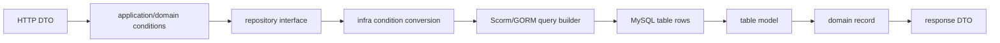
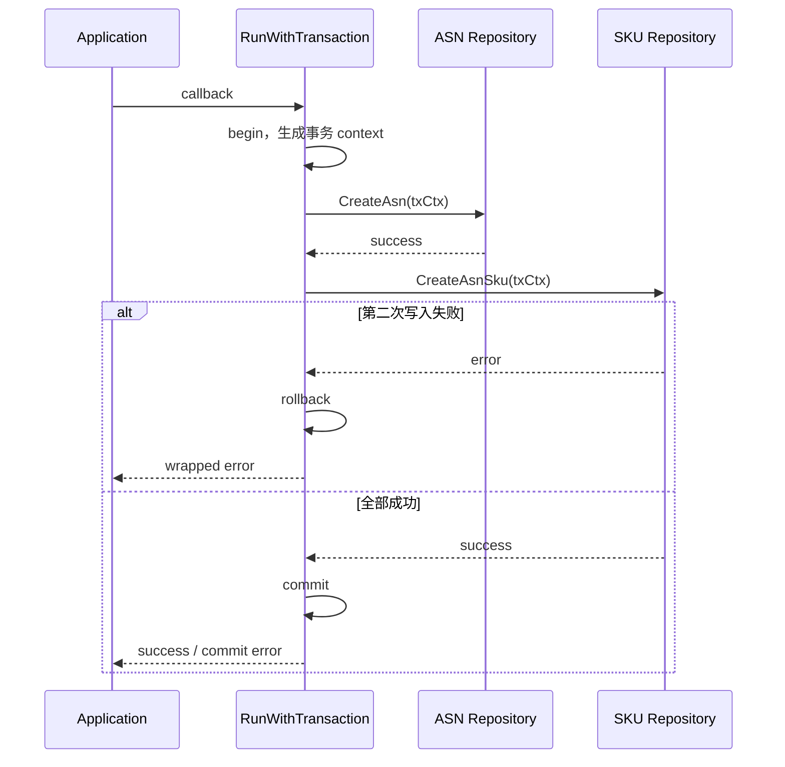

# MySQL、GORM/Scorm、仓储与事务

> 预计学习时间：180–240 分钟
> 一句话总结：沿 ASN 列表条件进入 repository，区分 domain 条件、表模型与 ORM 查询，并用失败实验确定事务、锁和测试的边界。

## 从一个筛选条件开始

本章的任务很小：给 ASN 列表查询增加一个向后兼容的筛选条件，并说明它是否需要索引、是否改变分页、是否应进入事务。小任务能暴露数据层最常见的误判。前端传来一个字段，不等于在 handler 里直接拼 SQL；repository 多加一个 `Where`，也不等于数据库设计已经完成。

主线使用 `apps/inbound/asn/infra/db/fbs_asn_repo_impl.go`。`QueryAsnListByCondition` 先把 domain 的 `AsnConditions` 转成 repository 条件，再取得 `DbAgentIface` 提供的 Scorm 查询对象。条件通过 `Scopes`、`Where`、子查询逐步叠加，随后排序、分页并 `Find` 到表模型，最后转换为 domain record。



每次转换都有职责。HTTP DTO 处理协议字段名和可选性；domain 条件表达业务查询意图；表模型表达列名和存储类型；response DTO 只返回调用方需要的数据。把四者合成一个 struct 看似省代码，后续任何列变化、接口兼容或领域规则都会互相牵连。

## 先解释标题里的五个概念

MySQL 是关系型数据库管理系统。它把数据组织成表、行、列，用 SQL 查询和修改，并通过索引、约束与事务维护数据正确性。在本章的后端架构里，MySQL 是持久化设施：进程退出后 ASN 数据仍要存在，多次请求还要看到受控的一致结果。

ORM 是 Object-Relational Mapping（对象关系映射）的缩写。它把 Go struct、字段和方法调用转换为表、列和 SQL，减少重复扫描与拼接代码。GORM 是 Go 社区常用 ORM；Scorm 是当前公司代码中出现的数据库封装/ORM 体系，并存在不同版本和 adapter。ORM 没有消除 SQL。开发者仍要理解 filter、join、排序、索引和事务，才能判断链式调用实际做了什么。

repository（仓储）是业务层依赖的数据访问契约，例如“按条件查询 ASN”或“保存一组 SKU”。它把业务需要的能力与 MySQL、Scorm 的具体 API 隔开。DAO（Data Access Object）通常更贴近表和 SQL；不同仓库对名称的使用并不完全一致，因此看职责和参数，不只看目录名。

事务把一组数据库操作放进一个提交/回滚边界。全部成功才提交；中途失败则回滚，目的是维护事先定义的业务不变量。锁用于协调并发访问，索引用于缩小扫描与支持排序。它们解决的问题不同：事务不是性能工具，索引也不能保证多步写入原子性。

### 社区常见选择与当前技术栈的取舍

| 方式 | 优点 | 代价 | 本课程怎样使用 |
| --- | --- | --- | --- |
| `database/sql` + 手写 SQL | 控制直接、SQL 明确、依赖少 | 扫描、映射和重复样板较多 | 用于理解底层契约，不替换现有 repository |
| GORM | CRUD/query builder 完整，社区资料多 | 抽象可能掩盖 SQL，版本 API 有差异 | 只借稳定概念，具体调用以仓库为准 |
| sqlx | 保留 SQL，同时简化绑定与扫描 | 仍需手写 SQL 与组织 repository | 当前主线没有据此改造 |
| sqlc | 从 SQL 生成类型安全代码 | 需要维护 SQL 与生成流程，迁移成本存在 | 当前仓库未采用，不作为练习答案 |
| Scorm/内部 DB adapter | 接入当前 context、路由、错误与公司环境 | 公开资料少，多版本并存，迁移复制易出错 | 先读 adapter 类型、版本和相邻实现 |

当前方案的优势是已经接入三仓既有基础设施，改动可沿相邻模式完成。缺点是 GORM/Scorm 多版本共存，公开示例常常只能解释概念，不能证明方法签名、错误读取和 context 行为。零基础学习者应先把 ORM 翻译成 SQL 意图，再回到 wrapper 检查仓库特有语义。

## 三个数据对象不要混用

以“是否跨仓”为例。HTTP 可能用可选字段区分“未传”与明确 `false`；domain 继续保留这个语义；repository 才把布尔值转换成当前表列需要的整数。主服务的 ASN repository 对 `IsCrossDock` 做了这一步转换。若 handler 直接写 `0`，就失去了未传条件；若 domain 直接依赖表列的 int32，业务层又被存储格式绑住。

| 对象 | 主要问题 | 常见字段形态 | 变化来源 |
| --- | --- | --- | --- |
| 请求 DTO | 调用方传了什么，格式是否合法 | JSON/form tag、指针、枚举字符串 | HTTP 契约 |
| domain 条件/实体 | 业务想查询或修改什么 | 值对象、可选条件、业务状态 | 业务规则 |
| DO/表模型 | 如何存储与扫描 | gorm tag、列类型、ctime/mtime | 数据库 schema |
| 响应 DTO | 调用方允许看到什么 | 展示字段、兼容默认值 | API 契约与安全边界 |

前端类比很直接：表模型不是组件 Props，就像后端返回的原始 DTO 不应直接成为整个 Redux store 的永久形状。两边都需要边界转换，才能让上游界面不跟着底层表结构摇摆。

## 当前仓库并非只用一种 ORM

主服务 `go.mod` 同时包含内部 gorm fork、Scorm、Scorm v2、`gorm.io/gorm` 1.23.8 与 MySQL driver。敏感服务直接依赖 Scorm v2，同时保留若干间接旧依赖。Tax 使用 Scorm v2 和 GORM 1.23.8。课程因此不能写“FBS 后端统一使用 GORM v2 API”，也不能把公开 GORM 文档里的每个方法当成内部 wrapper 一定支持。

ASN 代码本身就能看到并存。`AsnIndexRepoImpl` 通过 `DbAgentIface.GetDb(ctx)` 使用 Scorm 风格的 `SQLCommon`；`AsnSkuRepoImpl` 同时持有 `DbAgentIface` 与 `FBSScormV2`，不同方法走不同 adapter。选择不是靠文件新旧猜测，而是看依赖类型、返回对象和错误语义。

公开 GORM 文档只帮助理解 query builder、transaction、model 等稳定概念。具体的 `GetError()`、`RunWithTransaction`、`SearchOptions`、context 绑定和路由规则，以仓库 adapter 为准。

## 阅读查询：把链式调用翻译成 SQL 意图

`QueryAsnListByCondition` 的读取顺序不是从上到下背 API，而是分六步提问。

第一，主表是什么。代码用 `Table(FbsAsnTabName)` 建立查询。第二，哪些条件需要其他表。vendor/shop 条件会对子表选择 `asn_id`，再用 `id IN (subquery)` 限定主表。第三，哪些是简单字段条件，交给 `WithFieldOption` scopes。第四，哪些条件有特殊语义，例如异常 carton 的 OR 条件、跨仓布尔转换、存在 ToB order id。第五，count 与 list 是否共享完全相同的 filter。第六，排序与分页何时加入。

```sql
-- 教学等价形态，不是可直接替换仓库代码的生产 SQL。
SELECT *
FROM fbs_asn_tab
WHERE whs_region = ?
  AND inbound_status IN (?)
  AND id IN (
    SELECT asn_id FROM fbs_asn_sku_index_tab WHERE shop_id = ?
  )
ORDER BY ctime DESC
LIMIT ? OFFSET ?;
```

翻译后容易发现风险。子查询字段是否有索引；`ORDER BY ctime` 与过滤条件能否共同利用索引；大 offset 是否变慢；count 查询是否误带 limit；空 slice 传给 `IN (?)` 会生成什么行为。这些问题不能凭 ORM 链看起来流畅而忽略。

### nil、zero 与“没有条件”

`0` 可能是合法状态，也可能是未传默认值。repository 条件使用 `*SearchOptions` 和 `*bool`，就是为了保留三态：没有筛选、筛选 true、筛选 false。增加新字段时先写请求矩阵：未传、零值、有效非零、非法值。然后逐层确认哪一种会构造 scope。

如果把可选整数从指针改为值，未传和 `0` 会合并。前端可能因此看到默认列表突然只剩状态 0。数据库没有报错，HTTP 也是成功，这类错误只能由契约测试和查询条件测试发现。

### 分页不是最后随手加两行

当前代码在 `IsNeedPage` 时计算 `(PageNo - 1) * Count`。调用前要保证 PageNo、Count 已归一化；否则负 offset、超大 page size 会把入口问题带到数据库。列表与总数也要来自同一过滤条件。若先查询列表、再用另一套条件 count，页面会出现“当前空列表但 total 非零”这类难联调问题。

稳定排序同样重要。只按非唯一 `ctime desc` 排序时，同一时间值的记录在翻页间可能漂移。是否要追加主键排序必须结合现有契约与索引评估，不能在课程里直接宣布修改生产查询；但 code review 至少要提出这个问题。

### 查询 diff 应怎样做 code review

拿到查询改动时，依次检查数据语义、SQL 正确性、性能证据、并发边界和测试。先看指针、空 slice、枚举与时间区间怎样从 domain 映射到列；再把 ORM 翻译成 SQL，确认 AND/OR 括号、子查询、count、排序和分页。随后检查访问模式与索引证据，最后判断读取是否参与写入不变量，测试能否观察真实结果。

例如 `HasAbnormalCarton` 的两个状态若用 OR，外层还要与其他 scopes 用 AND，测试应准备只命中第二个状态的记录。shop 条件若通过 SKU index 子查询过滤 ASN，同一 ASN 多个 SKU 不能让主列表重复。`OnlyTotal` 分支若在排序/分页前返回，新增条件必须进入 count/list 的共同查询链。update map 自动补 `mtime` 时，还要判断原地修改调用方 map 是否符合契约。

“建议优化 SQL”不是可执行评论。把意见写成“给定什么输入，预期形成什么 SQL 意图，应观察什么结果”，reviewer 才能复核。

## 受控修改：增加 `transit_whs_id` 条件

当前 ASN 条件链已经包含 `TransitWhsId`，因此它适合做存在性审计，而不是重复实现。假设需求要求支持该条件，先核对四处：HTTP DTO 是否有字段；转换是否进入 domain `AsnConditions`；`toAsnConditions` 是否生成 repository option；repository 的 `Scopes` 是否使用正确列名。

如果四处都存在，开发任务可能已经完成，真正缺的是测试或前端契约。不要因为任务单写“后端加筛选”就机械增加第二个 `Where`。重复条件可能语义相同，也可能因类型转换不同造成冲突。

测试采用 table-driven 形式，输入至少覆盖：未传时不限制；单值命中；合法但无记录；非法值在入口被拒绝；与 shop 子查询组合。repository 单测若难以直接检查生成 SQL，可以通过受控测试数据库或 adapter fake 检查结果；不要 mock 到只断言“方法被调用”，那无法证明条件正确。

```go
// 教学测试骨架，需使用目标仓现有测试设施。
tests := []struct {
	name       string
	condition  *AsnConditions
	wantIDs    []uint64
	wantErr    bool
}{
	{name: "condition absent", condition: &AsnConditions{}},
	{name: "warehouse matched", condition: conditionWithTransitWhs(100)},
	{name: "warehouse not found", condition: conditionWithTransitWhs(999)},
}
```

## 写入前先定义业务不变量

事务不是“多个 SQL 就包起来”的装饰。先写不变量。例如创建 ASN 时，主记录与 SKU 记录要么都可被后续流程识别，要么都不可见；状态更新与操作记录是否必须原子成功，也要由用例决定。只有定义了失败后不允许出现的状态，才能画出事务边界。

主服务通过 `RunWithTransaction(ctx, func(ctx context.Context) error {...})` 暴露事务。关键点是 callback 收到新的 context，repository 从这个 context 取得事务连接。若在 callback 内误用外层 context，某次写入可能落到非事务连接，外层回滚也撤不掉它。

`sbs_agent/db/db_extend.go` 的实现还处理 panic、callback error、commit error 与 rollback。开发者不应在每个用例重新复制一份 `Begin/Commit/Rollback`。重复实现很容易漏掉 panic 或 commit 失败，并产生“双重 rollback 是否安全”的争论。



### 事务里不宜放什么

远端 HTTP/gRPC 调用通常无法随 MySQL rollback。把慢调用放进事务还会延长锁持有时间。若流程必须先调用下游再写库，要分析下游副作用；若先写库再发布消息，要面对事务提交与消息发布之间的缺口。这些组合会在模块六的可靠性章节展开。本章只要求识别：数据库事务能保证同一数据资源内的原子性，不会自动撤销邮件、文件、缓存或远端服务。

读操作也不因为“重要”就需要事务。只有需要一致快照、锁定记录或与写入组成不变量时才考虑。无条件给查询加事务会增加连接与锁负担。

## 失败实验：第二次写入报错

实验目标是区分三种实现：两次写入没有事务；两次写入使用同一 tx context；外层开事务但第二次误用原 context。

准备 fake repository，记录接收到的 context 标识，并让第二次写入返回固定错误。断言不只看最终 error，还要看第一条数据是否可见、rollback 是否被调用、错误是否保留操作语义。若使用仓库现有 transaction fake，应让它真实执行 callback，不要直接返回 nil 跳过用例代码。

| 场景 | 预期数据状态 | 预期错误 | 能证明什么 |
| --- | --- | --- | --- |
| 两次均成功 | 两组数据可见 | nil | 正常提交路径 |
| 第二次失败 | 两组数据都不可见 | 保留第二次操作语义 | rollback 覆盖同一事务 |
| callback panic | 两组数据都不可见 | panic 按 adapter 约定传播/转换 | 资源清理路径 |
| commit 失败 | 不报告业务成功 | commit error | 不能只检查 callback |

不要用“单测返回了 error”替代数据状态证据。事务的学习成果是证明部分写入没有泄漏。

### 事务反例：连接在 callback 外取得

下面的代码表面上进入了事务，第一条写入却可能使用外层连接：

```go
// 错误示意：dbCtx 在事务开始前由外层 ctx 取得。
dbCtx := repo.DB.GetDb(ctx)
err := repo.DB.RunWithTransaction(ctx, func(txCtx context.Context) error {
	if err := dbCtx.Create(&main).GetError(); err != nil {
		return err
	}
	return repo.CreateChildren(txCtx, children)
})
```

第二次写入失败时，rollback 无法证明撤回第一条。修复方法是在 callback 内让所有 repository 都从 `txCtx` 取得连接，并用失败实验检查最终数据状态。

另一个反例是捕获错误后返回 nil。事务 manager 只根据 callback 返回值决定是否提交；写日志不会触发回滚。若业务允许部分成功，就重新定义不变量和响应语义，不能悄悄吞错。

## 锁：`FOR UPDATE` 依赖事务才有意义

ASN repository 的 `LockAsn` 使用 query option `FOR UPDATE`。它表达的是悲观锁读取。锁的生命周期跟事务连接绑定；在事务外执行后连接立即结束，随后再更新并不能依赖这把锁保护不变量。

正确推理顺序是：要保护什么并发不变量；按哪个唯一条件锁定；所有竞争路径是否以相同顺序拿锁；锁内工作是否足够短；找不到记录和死锁如何处理。只看到状态更新就加 `FOR UPDATE`，可能制造热点和死锁，仍未覆盖另一条不拿锁的写路径。

前端类比是保存按钮的 loading 状态。它只能减少同一页面的重复点击，无法阻止两个浏览器或任务同时更新同一 ASN。数据库唯一约束、条件更新、事务锁或幂等键解决的是服务端竞争，不能由 UI 状态替代。

## 索引意识：从访问模式而不是字段名出发

新筛选字段是否建索引，需要结合基数、过滤组合、排序、数据量和写入成本。`transit_whs_id` 可能单独过滤，也可能总与 region/status 组合；单列索引和联合索引的选择不同。课程环境不应凭字段名给出生产 DDL。

可复核流程是：写出代表性 SQL；记录预计返回比例；确认现有索引；在允许环境用 `EXPLAIN` 观察访问类型、候选索引与估算行数；用接近真实分布的数据比较；同时评估写放大。没有环境证据时，把索引结论标为待 DBA/owner 核验，不伪造执行计划。

## 三个仓库的数据层对照

敏感服务的 `apps/*/infra/db` 同样把 PII 领域对象与表模型隔开，并通过 `libs/db`/Scorm v2 获取连接。安全上还要检查查询结果是否超出最小返回范围。数据存在敏感库，不等于普通服务可以任意透传。

Tax 的 `internal/common/dbhelper` 提供带事务状态的 context，service/DAO 以自己的错误类型返回。Tax 仍使用 GORM/Scorm 相关依赖，但调用形态与主服务 `GetError()` 不完全一致。跨仓复制 repository 代码前必须先看 context、错误和分库规则，不能只替换表名。

### 时间、批量和数据路由也是 repository 边界

数据库时间字段可能保存 Unix 秒，筛选输入却来自毫秒或带时区字符串。单位转换应在明确边界完成并有上下界测试。毫秒直接查询秒字段通常只会稳定返回空，不会产生 SQL error，因此跨端联调要同时保存原始单位与转换后条件。

批量写入要检查单批大小、顺序、重复键和部分失败。ASN SKU repository 在批量插入前按 SKU ID 排序；课程不猜测历史动机，但修改时要保留可观察行为，并测试 nil、重复项和失败路径。

数据库还可能依据 region、seller 或业务键选择连接。repository 应通过现有 DB agent/context 路由，不自行拼物理库名。逻辑单测没有连接真实环境时，只能证明条件与转换，不能宣称 shard routing 已验证。跨 region 查询若与当前模型冲突，应升级为设计问题。

## STAR 案例：筛选能用，翻到第二页却重复

### Situation

开发者给 ASN 列表加入组合条件，接口与第一页验证均正常。测试发现数据持续写入时，第二页出现重复记录，偶尔又漏掉一条。

### Task

判断问题来自前端重复请求、过滤条件、count，还是分页排序不稳定，并提出不改变接口字段的最小修复。

### Action

先保存两次请求参数和数据库查询条件，排除前端 pageNo 错误。检查 SQL 后确认两页都按 `ctime desc`，而多条记录 ctime 相同。用固定数据重复查询复现顺序漂移，再评估现有索引与兼容性，提出追加唯一键作为次级排序的方案。测试断言按复合顺序分页，并重新核对 count 不带 limit/offset。

### Result

固定数据下翻页集合稳定且无重复。修改只影响排序确定性，没有把分页问题错误归因于事务。

### Reflection

ORM 没有报错不代表查询契约正确。列表接口还包含过滤一致性、确定顺序、分页边界与数据变化条件；测试必须覆盖这些可观察行为。

## 独立练习与交付证据

围绕一个已存在的 ASN 条件完成审计：

1. 画出 DTO → domain condition → repo condition → SQL 列的映射；
2. 给出未传、零值、命中、无结果、非法输入五组样例；
3. 判断 count/list 是否共享条件；
4. 写出分页与稳定排序风险；
5. 判断该变更是否需要事务并说明不变量；
6. 如果涉及多写入，设计第二次写入失败实验；
7. 记录索引结论所需证据，不虚构 DDL。

通过标准：条件不会因零值误收窄；repository 不依赖 HTTP DTO；事务 callback 内所有数据库调用使用事务 context；失败路径能证明没有部分写入；测试能判定行为而不只检查函数调用次数。

交付说明应包含：missing/zero 矩阵、domain 与表列映射、等价 SQL、list/count/pagination 测试、索引核验状态、事务不变量、失败注入后的数据状态，以及 context/数据路由说明。无法在授权数据库执行 `EXPLAIN` 时明确标为未验证，不用“ORM 会处理”替代。

## 章末自检

- 能否说明主服务同时出现 Scorm、Scorm v2 和 GORM 依赖时，为什么不能混写 API？
- 能否区分请求 DTO、domain entity 与表模型？
- 能否从一条 ORM chain 还原表、join/subquery、filter、sort 和 page？
- 能否解释 `RunWithTransaction` callback 为什么传入新 context？
- 能否说明远端调用为何不能被 MySQL rollback？
- 能否设计一个真正验证回滚的数据状态测试？

下一章进入跨服务 client。数据库事务在那里会成为一个重要边界：本地回滚不能撤回已发生的 HTTP/gRPC 副作用，超时与错误也需要在 adapter 层转换成本服务语义。

## 参考文献

- [Go 官方文档：访问关系型数据库](https://go.dev/doc/database/)
- [GORM 文档](https://gorm.io/docs/)
- [MySQL 8.0 Reference Manual](https://dev.mysql.com/doc/refman/8.0/en/)
