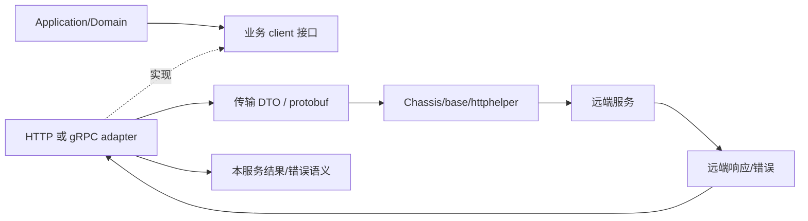
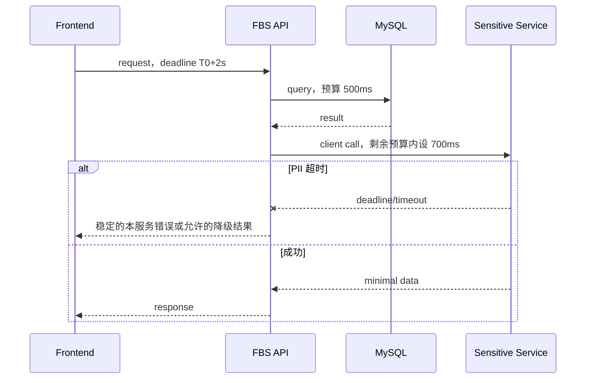

# 服务调用、HTTP/gRPC 契约与超时

> 预计学习时间：180–240 分钟
> 一句话总结：把一次下游调用拆成业务接口、client adapter、协议对象、超时与错误转换，并用 fake 验证慢响应、空响应和远端错误。

## 先划清本章边界

一个 Go 函数调用可能停留在当前进程，也可能穿过 HTTP 或 gRPC 到另一服务。调用代码都长得像 `client.Query(ctx, req)`，运行性质却完全不同。远端调用会遇到网络延迟、服务发现、序列化、部分响应、超时和对端版本演进；本地函数调用不会自动拥有这些失败模式。

本章不选择“HTTP 还是 gRPC”的通用最佳方案。FBS 当前仓库已经有既定协议：主服务 `thirdpart` 和 agent 中有 HTTP/服务调用 adapter，敏感服务 `agent/*`、`thirdpart/*` 连接 FBS、SCBS、SPEX 等边界，Tax 的 `third_party/*` 大量使用 protobuf 与 Chassis gRPC invoke。开发任务应先沿现有 client，再判断契约和超时是否正确。

目标是交付一份跨服务契约：调用者输入什么，adapter 发出什么，超时由谁控制，远端错误怎样转成本服务错误，fake 如何让失败路径可重复。

## 先解释服务调用、HTTP、gRPC、protobuf 和超时

服务调用是一个进程请求另一个进程提供能力。调用跨过网络后，就不再是普通函数：请求可能根本没送达，也可能已经执行但响应丢失，还可能收到一个协议成功、业务失败的结果。

HTTP 是通用请求/响应协议，常用 method、path、header 与 JSON 表达接口。gRPC 是远程过程调用框架，通常基于 HTTP/2，并用 protobuf 定义消息与 service/method。protobuf 是接口描述和二进制序列化体系，字段编号承担长期兼容身份；生成的 Go 代码只是协议源的产物。

client adapter 把上层业务接口适配为具体 HTTP/gRPC 调用，再把远端结果转回本服务语义。timeout 是调用方愿意等待某阶段的时长；deadline 是整条 context 链的绝对截止时间。重试会重新发起一次尝试，不等于延长原请求，也不保证没有重复副作用。

### 常见技术选择与当前仓库的取舍

| 选择 | 优点 | 代价 | 适用判断 |
| --- | --- | --- | --- |
| HTTP/JSON | 通用、易抓包、浏览器和工具支持好 | 文本体积较大，契约常靠文档/测试约束 | 已有 HTTP client 时沿现有契约演进 |
| gRPC/protobuf | 强类型 schema、生成 client、字段编号便于兼容演进 | 生成链和调试门槛更高，网关/工具要适配 | 已有 gRPC 边界时维护 proto 与生成产物 |
| 同进程 Go 接口 | 无网络序列化，编译器直接检查类型 | 不能跨进程独立伸缩或隔离 | 能留在同一进程时不伪装成远端调用 |
| 消息/异步任务 | 可把调用方与处理时机解耦 | 结果不是同步返回，要处理重复、延迟和最终一致性 | 模块六再按真实需求判断 |

HTTP 和 gRPC 没有脱离上下文的胜负。当前技术栈的优势是协议、监控与 client 封装已经存在；代价是三仓 wrapper、错误类型和 timeout 单位并不完全相同。普通字段改动不应顺便迁移协议。

## 从业务接口反查到传输层

不要从 `grpc` 或 `http` 全仓搜索开始。先在 application/domain 找业务含义明确的接口，例如“查询联系人”“取得外部订单”“查询 seller 信息”。接着找它的实现与 provider set，最后进入调用库。这个顺序能把下游内部实现留在边界外。



业务层不应拼 URL、schema ID 或 protobuf operation ID。adapter 负责这些传输细节，也负责把远端空值、retcode、transport error 转换为上层能处理的结果。这样单测可替换 adapter，而不是启动远端服务。

前端对应 request wrapper：组件调用 `getInboundList(filter)`，wrapper 才决定 base URL、header、超时与错误 envelope。后端 client adapter 是同一类边界，只是它运行在服务端，并继续携带 request context。

### 先写一张调用契约卡

阅读 client 前先记录六项：业务 operation、调用方、远端依赖、输入/输出、deadline 来源、失败语义。再补“是否有副作用”和“是否允许部分结果”。这张卡能阻止开发者从某个 `Invoke` 调用反推全部业务。

例如“按 ASN 查询最小联系人视图”可能是只读，但仍不能直接标成“可安全无限重试”：它可能受入口 deadline、远端限流和数据权限约束。相反，一个命名为 `Get` 的接口也可能在远端触发审计或缓存回填。副作用判断必须来自协议与实现证据。

调用前还要确认请求是否已经归一化，调用后确认 mapper 是否丢失 missing/zero 语义。远端返回成功但缺少必要字段时，adapter 应产生可识别的协议错误或安全默认，不让 nil 一路流到 handler。契约卡最终与 fake case 一一对应，缺少的失败语义会立刻暴露。

## 三种调用先分清

本地调用由编译器检查 Go 类型，错误通常同步返回。HTTP 调用通过 method/path/header/body 建立契约，JSON 字段名与可选性决定兼容。gRPC 调用通过 protobuf message、service/method 和 metadata 建立契约，字段编号是长期兼容标识。

| 维度 | 本地接口 | HTTP/JSON | gRPC/protobuf |
| --- | --- | --- | --- |
| 边界 | 同一进程 | 网络 | 网络 |
| 契约 | Go 类型 | method/path/header/JSON/状态或 retcode | service/method/message/field number |
| 常见失败 | 业务 error、panic | DNS/连接/超时/非预期状态/坏 JSON | dial/invoke/timeout/status/坏 message |
| 演进重点 | 调用方一起编译 | 字段可选、默认值、错误 envelope | 字段编号保留、optional/默认值、生成代码 |
| 测试替身 | fake interface | fake adapter/受控 HTTP server | fake adapter/受控 server |

现有协议决定继续使用哪一列。为了“性能”把一个成熟 HTTP client 改成 gRPC，已经超出普通字段改动；它会影响服务注册、schema、监控、生成代码和消费者。

## HTTP adapter：成功不只看网络 error

主服务 `thirdpart/data/datahttp/intern/data_impl.go` 使用 `HTTPRequestWithResponse` 并传入配置超时；`thirdpart/charging` 也显式构造 request timeout。真实 adapter 往往需要检查三层结果：传输是否成功；HTTP/框架响应是否能解析；业务 retcode/data 是否表示成功。

`err == nil` 只说明调用库没有返回传输错误，不能证明业务成功。反过来，HTTP 非 2xx 与业务 retcode 的处理要遵循当前 wrapper，不能在每个 client 发明一套分类。

缩减 adapter 可以这样组织：

```go
// 教学缩减示例，不可直接替换仓库 client。
func (c *contactClient) Query(ctx context.Context, req QueryReq) (Contact, error) {
	var remote remoteResponse
	if err := c.transport.Call(ctx, req, &remote); err != nil {
		return Contact{}, fmt.Errorf("query contact transport: %w", err)
	}
	if remote.RetCode != 0 {
		return Contact{}, mapRemoteError(remote.RetCode, remote.Info)
	}
	if remote.Data == nil {
		return Contact{}, ErrEmptyRemoteData
	}
	return toDomainContact(*remote.Data), nil
}
```

错误包装要保留操作语义，但不能把远端原始响应、token 或 PII 全部塞进 error。日志也遵循相同限制。

## gRPC/protobuf：生成代码是契约产物

Tax 的 third-party client 可看到 `base.GRPCInvoke`、`GRPCEndPointInvoke`、protobuf request/response 与 `base.SetTimeout`。敏感服务也包含生成的 protobuf Go 文件。阅读时要区分手写 adapter 与 generated message；修改契约源后重新生成，不直接手改 `*.pb.go`。

protobuf 演进最重要的不是 Go 字段顺序，而是字段编号。已发布字段编号不能换给另一含义。删除字段应保留编号/名称，避免旧消息被新代码误读。新增字段通常应是旧消费者可以忽略、旧生产者不提供时新消费者有安全默认的字段。

默认值会制造“未传还是零值”的歧义。当前生成代码若使用 pointer/optional 语义，应保留；若没有 presence，需要在协议层用明确枚举或额外字段表达。不能因为 Go 端拿到 `0` 就断言远端明确发送了 0。

### metadata 不是业务参数垃圾箱

request ID、region、身份等跨调用信息可能通过 context/metadata 传播，具体键由当前框架约定。业务筛选字段应进入 request message，不要塞入 context。context 适合取消、deadline 和 request-scoped 元数据，不适合绕开函数签名传递任意业务状态。

### 协议变更评审不只看新增字段

先列出生产者和消费者，再判断它们是否可能运行不同版本。向后兼容至少要回答“新消费者能否读旧消息”和“旧消费者如何处理新消息”。新增字段若被新业务立即当成必填，而旧生产者无法提供，就不是安全的兼容新增；需要默认行为、分阶段开关或调整升级顺序。

HTTP 的 method、path、header、body 位置和错误 envelope 都是契约。gRPC 的 service/method、field number、oneof、枚举 0 值和 unknown field 也要检查。枚举增加新值时，旧消费者的 default 分支尤其重要。生成文件 diff 必须能追溯到 proto 源和生成命令；直接编辑 `*.pb.go` 的修复会在下次生成时消失。

## 超时预算从入口往下分配

若入口请求最多允许 2 秒，client 不能给每个下游都设置 2 秒并串行调用三次。预算包含入口处理、数据库、多个下游、序列化和返回余量。上游 deadline 应沿 context 传播，下游 adapter 的自身 timeout 取两者较短值或遵循框架当前规则。



数字只是教学样例，不是生产配置。真正预算要由接口 SLO、当前监控和依赖延迟校准。本章要求写出分配方法，不凭感觉复制别的 client 的 timeout。

### 连接超时、调用超时和总 deadline

gRPC client 可能分别有 dial timeout、keepalive、invoke timeout；HTTP transport 也有连接、TLS、response header 与整体 request timeout。它们不是同一个旋钮。仓库 wrapper 已封装的部分优先复用。随意在外层再套一个更短 context，可能导致调用频繁取消；设置更长则无法突破上游已到期 deadline。

超时返回后，远端是否仍可能完成副作用取决于协议和实现。客户端看到 timeout 不能断言“对端没执行”。对于写操作，重试前必须有幂等键或可查询结果；不能把所有 timeout 当成安全重试。

### timeout 故障按证据定位

先记录入口 deadline、client 配置、实际耗时和可识别错误类型，再判断耗时发生在连接、服务发现、请求传输、远端执行还是响应解析。只有总耗时而没有阶段证据时，不直接提高 timeout。

常见假设包括：上游 deadline 更短、单位换算错误、下游变慢、连接资源不足、多个层级重复重试。配置写 `5000` 并不自动等于 5 秒；要看它怎样转换成 `time.Duration`。提高 timeout 还会占用更多 goroutine、连接和入口预算，可能把快速失败变成级联拥塞。

### 并行调用仍共享总预算

两个独立只读下游可以并行，但所有 goroutine 要共享可取消 context，调用方要收集退出结果并定义部分失败语义。不能在第一个结果返回时直接离开，让另一个调用继续泄漏；也不能让两个 client 各自重试，使最大调用次数失控。

例如入口只剩 900ms，而 A、B 分别需要约 200ms、500ms，设计仍要说明各自 timeout、整体等待方式、一个失败是否取消另一个，以及部分结果能否返回。延迟数字不能替代业务语义，所以没有上下文时不存在唯一答案。

## 错误转换：调用者只应依赖本服务语义

adapter 至少分类 transport/timeout、远端明确拒绝、远端业务错误、协议/解析错误、空或不完整响应。上层可能需要决定重试、降级、转换为用户错误或报警。若 adapter 只返回 `errors.New(remote.Info)`，分类信息丢失；若把所有远端 code 原样透到前端，本服务契约又被下游绑住。

| 下游结果 | adapter 建议语义 | 上层可做的决定 |
| --- | --- | --- |
| deadline exceeded | 可识别的 timeout cause | 只读请求可有限重试/降级；写请求先查幂等 |
| 连接失败 | dependency unavailable | 快速失败、熔断由现有设施决定 |
| 明确 invalid argument | 映射为本服务可支持的参数错误 | 返回稳定 retcode，不泄露下游细节 |
| 未授权 | dependency auth/config error | 报警，不能伪装成用户无数据 |
| nil/缺字段 | invalid remote response | 阻止 nil panic，记录脱敏证据 |

错误映射表应有测试。只测试 happy path 会把线上最难定位的行为留给真实网络。

## fake 驱动的四组失败测试

在 application 层定义最小业务 client 接口，然后用 fake 控制结果：成功、超时、远端业务错误、空响应。fake 不需要知道 URL 或 protobuf；它只模拟 adapter 已转换后的业务语义。adapter 自身再用受控 transport 测传输映射。

```go
type fakeContactClient struct {
	contact Contact
	err     error
}

func (f fakeContactClient) Query(ctx context.Context, req QueryReq) (Contact, error) {
	select {
	case <-ctx.Done():
		return Contact{}, ctx.Err()
	default:
		return f.contact, f.err
	}
}
```

测试断言包括：context 是否传入；超时能否被 `errors.Is` 或当前错误体系识别；空响应不会 panic；远端错误不泄露原始 payload；正常结果经过字段转换而不是直接透传。

如果要验证 deadline，使用可控 channel 或短而有余量的 timer，避免靠长 `Sleep`。测试失败时应指出是未传播取消还是错误映射不对。

## 受控字段演进

练习需求：下游联系人响应新增一个“是否允许展示”的可选标志。先定义兼容矩阵：旧远端不返回字段；新远端返回 true；新远端返回 false；响应缺少联系人；远端返回错误。adapter 必须为旧响应选择安全默认，安全章节会进一步判断默认应否展示。

HTTP JSON 需要确认 `omitempty` 与 pointer；protobuf 需要确认字段编号和 presence。application 只接收 domain 结果，如 `ContactView{Allowed bool}`，不接触 `*wrappers.BoolValue` 或 JSON raw message。

契约变更的证据包应包含：协议 diff；生成文件 diff；adapter 转换测试；旧响应 fixture；超时/空响应测试；消费者影响说明。没有真实环境时明确标为未联调，不伪报远端已经发布。

## 三仓对照

主服务的 thirdpart 有多种 HTTP helper 与 Chassis client，超时来自各自配置；新增调用应先找相邻 adapter。敏感服务同时是 PII 服务与其他服务的 client，`agent/fbs`、`agent/scbs`、`thirdpart/spex` 显示边界并不统一为一种协议。Tax 的 third_party gRPC 使用更明确的 protobuf、schema/operation 与 timeout option，部分 client 还配置 endpoint invoke。

相同概念的实现差异如下：context 类型可能是标准 `context.Context`，也可能是 Tax 的 `dbhelper.LLSContext`；错误可能是 Go error、SSC error pointer 或远端 retcode；timeout 单位有毫秒和 duration。跨仓复制最危险的正是单位和错误判断。

## client adapter 的 code review 顺序

先确认 context 从入口传入，没有换成 `context.Background()`；再核对 timeout 来源、单位、默认值和上游 deadline。然后检查 request/response 是否通过明确 mapper 转换，transport error、远端业务错误、协议错误与空响应是否分开。最后审查 retry owner、日志字段、生成文件来源和 fake 的失败能力。

一份可执行的 review 记录应落到具体 operation：旧 response fixture 是否继续通过，timeout 能否被识别，空 response 是否避免 panic，写操作 timeout 后是否存在幂等证据，指标能否按 dependency/operation/error class 观察。若 wrapper 已统一处理某项，就引用该实现，不在 adapter 再做第二套。

可观测字段也属于 adapter 契约。至少要能关联 request、dependency、operation、duration 与 error class；不能用完整 request/response 换取可观测性。一次 timeout 若只能看到“调用失败”，开发者无法区分连接、远端业务或 deadline；若日志包含整个联系人对象，排错能力则以数据泄露为代价。选择少量结构化字段，并通过测试确认 mapper 与 logger 都没有绕过 allowlist。

## STAR 案例：超时后重试造成重复副作用

### Situation

一个 client 写操作偶发 timeout。开发者在 application 里立即重试，错误率下降，但下游出现重复记录。

### Task

确认 timeout 是未执行、执行失败还是响应丢失，并在不假设下游可回滚的前提下修复。

### Action

保留 request ID 与脱敏调用证据，检查 client timeout 和上游 deadline。确认 timeout 只能说明调用者未按时收到结果，不能证明远端未执行。随后查找下游是否支持幂等 key 或结果查询；把重试改为携带稳定业务键，并为“首次已成功、响应超时、第二次调用”增加 fake 测试。对不可幂等的路径停止自动重试，返回可识别错误并进入人工/任务补偿流程。

### Result

重复副作用测试通过，调用超时仍能被监控识别。正常请求延迟没有因为无限重试而扩大。

### Reflection

重试不是 timeout 的默认答案。先识别操作是否幂等，再决定重试归属、次数和预算；client、application 与任务层不能各自重试一次。

## 独立练习

选择一个仓库中现有 third-party client，交付：

1. 业务接口到 transport 的调用图；
2. HTTP 或 gRPC 契约表；
3. timeout 来源、单位、上游 deadline 与剩余预算；
4. transport、远端业务、空响应三类错误映射；
5. fake 的成功/超时/空响应/远端错误测试；
6. 一个新增可选字段的向后兼容矩阵；
7. 日志中允许与禁止记录的字段。

通过标准是失败路径可重复、上层不依赖远端原始错误、timeout 不超过入口预算、旧响应仍可被读取。下一章会把身份、权限和 PII 纳入同一调用链。

## 参考文献

- [RFC 9110: HTTP Semantics](https://datatracker.ietf.org/doc/html/rfc9110)
- [Go context package](https://pkg.go.dev/context)
- [gRPC Go documentation](https://grpc.io/docs/languages/go/)
- [Protocol Buffers: Proto3](https://protobuf.dev/programming-guides/proto3/)
