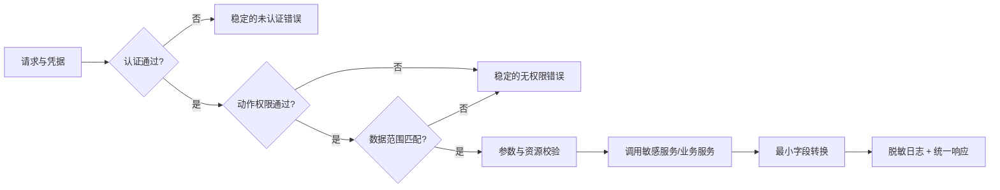

# 鉴权、错误码、PII 与接口安全边界

> 预计学习时间：180–240 分钟
> 一句话总结：对“展示联系人”需求做数据分类，沿 SC 身份、中间件与敏感服务追踪信任边界，并用无权限、非法参数和日志扫描验证最小返回。

## 需求看起来只是多一个字段

ASN 页面希望展示联系人信息。若把它当成普通 DTO 字段，开发者可能直接从下游取回姓名、电话和地址，写日志排错，再塞进列表响应。功能会很快“完成”，安全边界也同时被绕开。

本章先问四个问题：请求者是谁；请求者能否操作当前 seller/shop/region；数据是否属于 PII；调用方真正需要返回多少。答案分别落在身份认证、授权、敏感服务边界与响应最小化。它们不能由一个 `if user != nil` 代替。

主服务的中间件目录包含 Seller Center auth、FBS session auth、OpenAPI auth、CSRF、权限检查与统一 controller wrapper。敏感服务有 session/remote auth interceptor 和 SC HTTP 接口。Tax 另有 JWT、限流、恢复与响应 middleware。三仓概念相通，handler 名称和上下文结构并不相同。

## 先认识认证、授权、PII、错误码与安全边界

认证（authentication）验证调用方是谁或持有什么可信凭据。授权（authorization）判断这个身份能否执行某个动作。数据范围继续限制它能访问哪些 seller、shop、region、记录与字段。三者缺一不可。

PII 是可以直接或间接识别个人的信息。姓名、电话和详细地址是常见例子，但实际分类以团队规范和字段用途为准。安全边界是数据或信任跨层、跨进程时必须重新检查的地方，例如浏览器进入主服务、主服务调用敏感服务、完整对象映射成响应。

错误码是给机器稳定判断的契约标识，错误消息服务于受控的人类提示，内部 cause 则用于工程诊断。把三者混在一个字符串里，会同时破坏调用方兼容和信息保护。middleware/interceptor 是执行这些横切控制的常见位置，但业务资源归属仍需 application/domain 判断。

### 常见身份与权限方案的取舍

| 方案 | 适合解决什么 | 优点 | 不能替代什么 |
| --- | --- | --- | --- |
| Session/Cookie | 浏览器登录态 | 注销和服务端控制直观 | 资源归属、CSRF、服务间身份 |
| JWT/签名 token | 无状态身份声明、API 调用 | 可携带声明，跨服务验证方便 | token 吊销策略、数据范围、最小返回 |
| API key/服务凭据 | 标识服务或集成方 | 接入简单 | 终端用户授权、细粒度资源权限 |
| RBAC | 角色到动作权限 | 规则易集中管理 | seller/shop/region 级数据范围 |
| ABAC/策略判断 | 根据属性与上下文授权 | 表达细粒度条件 | 凭据真实性和安全数据处理 |

当前仓库已经有 SC session、OpenAPI、远程鉴权、JWT 与不同 middleware 链。优势是各入口可沿现有控制接入；代价是不能把一套入口的 principal/context 假设复制给另一套入口。本章不新建统一身份平台，只训练读懂边界并写出负例证据。

## 认证、授权与数据范围是三次判断

认证回答“凭据对应谁”。授权回答“这个身份能做哪个动作”。数据范围回答“即使能做此动作，能访问哪些 seller、region、记录和字段”。



“已登录”不等于能读任意 shop。URL/body 中的 seller ID 也不能因来自前端就可信。主服务 wrapper 中可见 region 操作与 API permission 检查；SC auth 还会从请求和会话建立身份。业务层仍要检查资源归属，尤其是按 ID 查询单条记录时。

前端权限控制只负责体验，例如隐藏按钮。攻击者可以直接发 HTTP 请求，所以后端必须独立鉴权。这个规则与前端课程的权限章衔接：菜单不可见不是 API 安全证据。

### 批量接口会放大数据范围错误

批量 ASN 查询不能只检查“用户有查看权限”，再按请求中的 ID list 查询。可信 seller/shop/region 应与 ID list 一起进入 repository 条件。先查出全部记录再在 Go 内存中过滤，意味着未授权数据已经越过数据库边界，也可能进入日志或 metrics。

批量输入还需要数量上限、去重和明确的部分失败策略。100 个 ID 中一个越权，是整体拒绝、只返回允许项，还是逐项状态，必须由契约决定。测试应准备两个 shop 的合成数据，断言查询条件包含可信范围，并确认另一组数据没有进入结果和日志。

## 中间件链的顺序会改变结果

认证应在业务 handler 前建立可信 context。CSRF 保护针对会改变状态的方法，主服务当前保护 POST、PUT、PATCH、DELETE，并读取 `X-CSRFToken` 与 session。限流可能在高成本业务之前拒绝。recovery 负责把 panic 转为受控失败，不负责把鉴权错误当成功响应。

顺序不应靠课程臆测，必须从 route/schema 注册和 wrapper 读取。新增 endpoint 时复制相邻 route 的 handler chain，再逐项说明每个中间件服务的威胁。漏一个名称可能让接口绕开 session；多加错误的 auth 又可能让合法调用方全部 401。

| 控制 | 保护对象 | 不能替代 |
| --- | --- | --- |
| authentication | 伪造/缺失身份 | resource ownership |
| authorization | 未获准动作 | 参数校验、PII 最小化 |
| CSRF | 已登录浏览器被诱导发状态变更 | XSS、防重放、业务幂等 |
| rate limit | 资源耗尽与滥用频率 | 权限和输入大小上限 |
| validation | 非法格式与范围 | 数据归属和业务状态机 |
| recovery | 未处理 panic 的进程影响 | 正确错误处理 |

### 多种入口不能共享同一身份假设

Portal、SC、OpenAPI 和内部 gRPC 的身份来源不同。SC session 中的 seller/shop 语义不能直接套到 OpenAPI；OpenAPI 的 JWT 或签名也不等于浏览器会话。application 被多个入口复用时，应接收归一化的可信 principal 与 scope，而不是在 domain 内读取某个 HTTP header。

服务间认证也不等于终端用户授权。主服务调用敏感服务时，敏感服务需要确认调用服务身份；是否还传递用户、店铺与用途上下文，要看当前协议。服务凭据不能成为读取任意 PII 的通行证。

### 写接口还要区分 CSRF、幂等与重放

CSRF 保护持有浏览器 session 的状态变更请求，防止第三方页面诱导发送；它不保证请求只执行一次。双击、网络重试或合法请求重放仍需业务幂等和状态检查。敏感查询也不应把 PII 放在 URL query，因为浏览器历史、代理和 access log 都可能记录 URL。

## PII 分类从字段和用途开始

姓名、电话、详细地址、证件、银行信息通常需要更严格处理；是否属于 PII 还要遵循团队数据分类规范。本课不列真实数据。练习使用合成值，并把字段按用途分为：页面必要展示；仅服务端处理；仅审计系统可见；完全不应进入当前链路。

“存在敏感服务”不是普通服务自由读取的许可证。敏感服务把存储与访问控制集中到更窄边界，调用方仍需证明用途、身份与最小字段。列表页若只需显示掩码电话后四位，就不应先取完整地址再在前端截断。

```text
错误路径：PII 服务 → 返回完整对象 → 主服务日志完整对象 → 前端取一个字段
受控路径：主服务提交身份/资源语义 → PII 服务鉴权并返回最小视图 → 主服务只映射允许字段
```

敏感服务生成的 protobuf 文件中能看到 contact/address 等字段，这只能证明协议存在，不能证明每个调用方都有权使用全部字段。

### 按数据生命周期检查，而不是只看 response

一项联系人数据会经历收集、传输、处理、存储、缓存、日志/监控与删除或过期。当前接口可能只负责其中几段，但安全评审要标出每次复制：HTTP body 到 DTO、DTO 到 client request、远端 response 到 domain、domain 到 response、错误与日志。每多一次完整对象复制，就多一个可能泄露或超范围复用的位置。

字段 allowlist 比“先复制完整对象再删字段”更可靠。前者默认拒绝未来新增字段，后者可能在 protobuf/struct 增加字段后自动把它带入日志或响应。mapper 测试因此应构造一个包含额外敏感字段的远端对象，并证明输出仍只有允许字段。

缓存也不能绕过授权。若最小联系人视图将来被缓存，key 必须包含足以区分数据范围的维度，缓存值仍遵循最小化与过期策略；这些设计属于模块六的缓存章节。本章先把“是否发生缓存、谁能读取”列为边界问题，不自行加入 Redis。

## 错误码是接口契约的一部分

主服务 `errcode` 把错误登记为稳定 code、消息、类型与来源，controller wrapper 转成前端熟悉的 envelope。错误需要同时服务机器判断与人类定位。稳定 retcode 用于调用方分支；日志中的 cause 用于工程诊断。不能把数据库 error、JWT 内容或远端 PII 直接当响应 info。

新增错误前先搜索是否已有同语义 code。重复注册“no permission”会让前端不知道处理哪一个。参数错误、未认证、无权限、资源不存在、依赖失败和系统错误不能全映射成一个通用失败，否则监控与用户反馈都失去分类。

另一方面，错误差异不能泄露资源是否存在。未授权调用者查询一个 ASN ID 时，如果“存在但无权限”与“不存在”返回可区分细节，可能形成枚举通道。具体策略应按接口现有约定与安全审查决定。

### 错误信息的安全回归矩阵

| 场景 | 调用方看到什么 | 日志/监控保留什么 | 禁止行为 |
| --- | --- | --- | --- |
| 无凭据或失效 | 稳定未认证错误 | route、request ID、失效分类 | 回显 token 或签名细节 |
| 无动作权限 | 稳定权限错误 | principal 类型、action、scope 摘要 | 返回资源内容 |
| 跨数据范围 | 按防枚举策略处理 | 脱敏资源键、权限分类 | 暴露存在性细节 |
| 参数非法 | 稳定参数错误 | 字段名与规则 | 返回 parser/SQL 原文 |
| PII 下游失败 | 依赖错误或允许的降级 | dependency、operation、retcode | 记录完整响应 |

错误码测试要与日志捕获测试配合。只看数字发现不了 info 泄露；只扫禁词也证明不了授权正确。

### 错误转换的四层

infra 保留数据库/下游 cause；domain/application 转成业务语义；handler/wrapper 映射稳定 retcode；日志记录脱敏上下文。每层只做自己的转换。handler 不应通过字符串匹配 SQL error 决定权限。

```go
// 教学缩减示例。
contact, err := piiClient.GetMinimalContact(ctx, resource)
if err != nil {
	if errors.Is(err, ErrRemoteUnauthenticated) {
		return Response{}, ErrDependencyAuth
	}
	return Response{}, fmt.Errorf("load contact view: %w", err)
}
return toSafeResponse(contact), nil
```

## 参数校验要在昂贵调用前完成

格式、长度、枚举、分页上限在协议入口尽早拒绝。资源归属和业务状态可能需要 application/domain 查询后判断。不要把所有校验挤进 struct tag，也不要等到 SQL 报错。

联系人需求的输入矩阵至少包括：缺少 ASN ID；ID 格式非法；合法但不存在；存在但不属于当前 shop；有查看 ASN 权限但无查看联系人权限；全部通过。每组都应有确定的 retcode/HTTP 语义与“敏感 client 是否被调用”断言。前四组若不需要 PII，应断言 client 没有调用。

## 日志：能关联问题，但不能复制数据

安全日志保留 request ID、操作名、受控资源标识、结果 code、耗时与依赖名称。禁止记录 Authorization、cookie、CSRF token、完整请求/响应、联系人、地址或未脱敏凭据。资源 ID 是否敏感也要按规范判断；必要时 hash 或截断。

字符串 `%+v` 打印整个 req/resp 是高频风险。第三方 client 的现存日志不能自动成为新代码可复制的范本；课程生成也不展示其中可能包含的数据。code review 应搜索结构体打印、header dump、protobuf JSON 与 panic stack 附带的对象。

| 目的 | 可记录示例 | 不应记录 |
| --- | --- | --- |
| 关联调用 | request ID、operation | token、cookie |
| 判断范围 | region、脱敏资源键 | 完整地址、电话 |
| 判断结果 | retcode、错误分类 | 完整 remote response |
| 性能 | duration、dependency name | 带 PII 的 URL query |

错误日志也不能成为数据出口。返回给用户的信息收窄了，但日志若保留原文，风险仍在。

### 凭据与配置也属于披露边界

token、secret、private key 和数据库口令不进入代码、课程示例或测试 fixture。配置只引用键名与加载边界，实际值通过安全渠道取得。排错记录保存“header 是否存在、凭据类型、过期分类和 request ID”，不要求复制 header/cookie。截图也可能包含凭据，交付前要做视觉检查。

## 受控接口改动：返回最小联系人视图

定义合成契约：列表默认不返回联系人；只有显式请求 detail 且权限通过时，返回 `display_name` 与 `masked_phone`；完整电话和地址不进入响应。旧调用方未传开关时行为不变。

第一步在 DTO 使用可选字段保留未传语义。第二步在 application 做 resource ownership 与 action permission 检查。第三步调用敏感服务的最小 client 接口。第四步在 adapter/mapper 只选择允许字段。第五步统一错误映射。第六步做披露扫描。

不要把 mask 只留给前端。Network、浏览器插件和前端日志都能看到原始响应。最小化应在离数据源尽可能近且能执行业务授权的服务端边界完成。

### 三类强制失败验证

无权限：使用合成身份，断言稳定权限错误、PII client 未调用、日志无敏感字段。非法参数：断言在入口或 application 早期拒绝，无数据库/PII 访问。日志检查：成功与远端失败各跑一次，扫描 token、phone、address、完整 DTO 等模式。

再补两个边界：旧调用方未传新字段；敏感服务返回字段缺失。前者验证兼容，后者验证 mapper 不 panic 且采用安全默认。

### 安全测试按边界分层

中间件单测验证缺 header、无效 session、CSRF mismatch 和 handler 是否被阻止。handler 测试验证 principal/context 传给 application。application 测试验证 action 与 ownership，失败时 PII client 未调用。adapter 测试验证最小字段 mapper 与远端 auth error。端到端测试再确认 route chain 真实注册。

安全测试尤其关注“某动作没有发生”：repository/client 没被调用，response 没带字段，logger 没收到完整对象。每层模拟全系统会让测试脆弱；只做端到端 happy path 又无法定位失败。

## 威胁检查：从数据流而不是术语清单出发

| 数据流节点 | 主要威胁 | 证据/控制 |
| --- | --- | --- |
| 浏览器到主服务 | 伪造 ID、CSRF、越权 | auth chain、CSRF、permission test |
| 主服务 resource lookup | 跨 shop/region 访问 | ownership 条件、negative test |
| 主服务到敏感服务 | 伪造调用方、过量字段 | remote auth、最小 request/response |
| response mapping | 完整对象透传 | allowlist mapper、contract test |
| logging/metrics | PII 或凭据泄漏 | structured fields、披露扫描 |
| error handling | 资源枚举、内部细节泄漏 | stable error map、unauthorized test |

这张表不是一次性合规勾选。接口字段、调用方或日志变化后需要回归对应节点。

## Tax 为什么只能做边界对照

Tax middleware 中有 JWT、限流、日志、recovery 与 gRPC interceptor，但联系人 ASN 需求不经过 Tax。为了“覆盖三个仓库”把 Tax 接入主案例会制造错误架构。正确用法是比较：Tax 的 controller 如何取得可信 context、错误如何转成 SSC 语义、第三方 client 怎样处理敏感发票数据。然后回到本需求说明为什么不改 Tax。

这也是全栈影响分析能力：知道某服务有安全能力，不等于每个需求都要修改它。

## 常见安全误判怎样修正

“接口在内网”不能替代应用身份与数据范围；“数据已经 mask”也不能允许无限批量枚举。网络位置和掩码是控制的一部分，不是授权结论。

“返回 404 就不会泄露资源”只处理响应文案。授权失败和不存在若在耗时、大小、日志或下游调用上差异明显，仍可能泄露线索。课程不要求自行实现常量时间响应，但要按现有安全策略检查可观察差异。

“只在 debug 日志打印”也不安全。故障时可能开启 debug，数据在进入日志调用参数时已经暴露。logger 应从源头选择 allowlist 字段。测试使用合成电话也不能证明完整 payload 打印是安全模式。

## STAR 案例：接口权限正确，日志仍泄露电话

### Situation

联系人接口只对有权限用户返回掩码电话，功能测试和越权测试都通过。一次远端错误时，client 用 `%+v` 记录了完整响应，日志出现原始电话。

### Task

堵住日志出口，同时保留排错所需的请求关联、远端错误分类和耗时。

### Action

沿失败路径找到结构体打印，列出实际需要的字段。改成结构化日志，只记录 request ID、operation、远端 retcode 与 duration；错误 cause 保留分类，不附 response body。增加成功/失败日志捕获测试，并对课程与生成 HTML 执行敏感关键词和凭据模式扫描。检查相邻 retry 日志，避免第二处再次打印。

### Result

权限与接口响应行为不变，日志仍可按 request ID 定位依赖失败，扫描不再命中联系人数据。

### Reflection

安全边界覆盖数据的整个生命周期。入口鉴权通过、响应脱敏都不能补偿日志复制原始对象。

## 安全评审口述题

给出一个新 OpenAPI：调用方凭 JWT 传 seller ID，查询联系人。学员需指出 JWT 认证后仍要验证 seller scope；联系人应由敏感服务最小返回；请求参数不应记录；错误不应泄露 seller 是否存在；批量查询需要上限和逐项策略。每个判断至少映射到一个代码层和一个负例测试；若接口包含写操作，还要补 CSRF 适用性、幂等与重放判断。

## 独立练习：联系人字段安全评审

提交以下材料：

1. 字段分类与使用目的；
2. SC 请求从 auth 到 resource ownership 的链路；
3. 主服务到敏感服务的最小契约；
4. 权限、参数、远端错误到稳定 retcode 的映射；
5. 无权限、非法参数、旧调用方、空响应测试；
6. 允许日志字段清单与披露扫描结果；
7. 说明为什么 Tax 不在本次修改范围。

通过标准：前端隐藏按钮不作为授权证据；非法/越权请求不会调用敏感 client；响应采用字段 allowlist；日志不含真实或合成的完整 PII；错误不会泄露资源细节；旧调用方行为不变。

交付包还应包含 principal/scope 模型、route middleware 顺序、字段分类、最小 response schema、错误矩阵、负例测试、client 未调用断言、日志捕获与凭据/PII 披露扫描。真实环境证据无法安全保存时，只记录检查结论与执行者，不复制原始数据。

## 章末自检

- 能否区分认证、动作授权和数据范围？
- 能否说明 CSRF、限流和参数校验各自不能替代什么？
- 能否从 PII 用途推出最小返回字段？
- 能否解释为什么错误响应与日志需要不同信息密度？
- 能否设计断言“无权限时 client 未被调用”的测试？
- 能否判断一个不经过 Tax 的 ASN 需求为何不应修改 Tax？

下一章把 HTTP、Wire、repository、client 与安全边界合成一个后端纵向切片。课程不会真的写入共享环境；学员以受控 diff、单测、接口样例和兼容清单作为完成证据。

## 参考文献

- [RFC 9110: HTTP Semantics](https://datatracker.ietf.org/doc/html/rfc9110)
- [gRPC Go documentation](https://grpc.io/docs/languages/go/)
