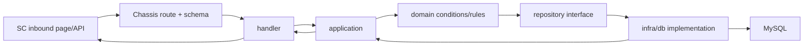

# 后端纵向切片：为入库请求增加一个受控能力

> 预计学习时间：220–300 分钟
> 一句话总结：以 ASN 列表新增一个向后兼容筛选为主线，完成契约、route/DTO、application/domain、repository、Wire、安全与测试的最小闭环。

## 项目契约

本章整合模块五，不首次讲授新框架。起始系统是主服务现有 ASN 列表链路；目标是增加一个可选的只读筛选条件，并把结果字段返回给前端。最终字段必须从真实需求选择。课程用 `transit_whs_id` 作为结构示例，因为当前 repository 条件中已有对应证据；学员实施前先做存在性审计，不能重复实现已有能力。

完成条件有六项：旧请求不变；新条件能命中和返回空列表；非法输入得到稳定错误；repository 条件有测试；Wire/构建没有无关变化；前端得到可联调的契约样例。敏感服务和 Tax 默认不修改，只有影响分析证明涉及其职责时才进入范围。

不做共享环境写操作，不讲发布平台。产物是受控 diff 或设计补丁、测试结果、接口样例和开发交接清单。

## 先解释纵向切片、里程碑、兼容与交接

纵向切片是围绕一个可观察用户行为，贯穿必要技术层的最小交付单元。本章的切片从请求字段开始，经过 handler、application/domain、repository，再回到响应与前端联调。它不是把整个系统每层都改一遍；某层已有能力时，正确结果可能只是补测试或证明无需修改。

横向分层开发则按技术层分批完成，例如先做完所有数据库，再做所有 API。它便于专业分工，但小需求容易在最后才发现契约不通。大爆炸式改造一次调整目录、框架和业务，短期看似统一，回归与回退成本很高。当前 Landing 练习选择纵向切片，是为了让每个里程碑都保留可编译、可测试的证据，并限制范围。

里程碑是可以单独复核的中间状态；兼容是新旧调用方在版本交错时仍有明确行为；开发交接是把需求、改动、验证、风险与未验证项交给 reviewer。交接不等于发布，本课程也不教授发布平台。

| 交付方式 | 优点 | 风险 | 本章选择 |
| --- | --- | --- | --- |
| 纵向切片 | 很早得到端到端反馈，范围与完成证据清楚 | 需要跨层理解，切片过大仍会失控 | 主路径 |
| 横向分层 | 同类技术改动集中 | 契约问题可能延后暴露 | 只用于团队内部协作，不作为验收单位 |
| 大规模重构后再加功能 | 有机会统一架构 | diff 大、回归面广、难判断业务影响 | 不夹带在本练习 |
| 只改能跑的最少行 | diff 小 | 容易漏权限、兼容、测试和进程影响 | 不以行数判断完成 |

## 先建立切片台账

动代码前创建一张台账，每一行是一个可观察行为，不是一份文件。建议至少包含旧请求、新条件命中、新条件无结果、非法输入、无权限、repository 失败和 context 取消。列则记录契约、执行层、测试证据与状态。

| 行为 | 第一责任边界 | 最小证据 | 进入下一里程碑前的状态 |
| --- | --- | --- | --- |
| 旧请求不含字段 | DTO/application | 旧 fixture + handler test | 必须保持基线 |
| 新条件命中 | application/repository | captured condition + result test | 条件只映射一次 |
| 合法但无结果 | repository/response | list 空、total 0 | 不能误报系统错误 |
| 非法输入 | binding/application | 稳定参数错误、repo 未调用 | 失败尽早发生 |
| 越权请求 | application/repository | 权限错误、可信 scope、repo/client 未越界 | 不靠前端隐藏 |
| 数据访问失败 | repository/error mapping | cause 保留、稳定 retcode | 不泄露 SQL |
| context 取消 | application/repository | 可识别取消、后续调用停止 | 不换 Background |

台账的作用是保持纵向。若某一行只有“改了四个文件”而没有可观察结果，它还不是完成证据；若一个新技术改动无法服务任何台账行为，就应重新检查范围。

每个里程碑更新三种状态：`planned` 表示只有设计，`verified_locally` 表示局部 fixture/fake 已通过，`verified_in_authorized_env` 表示已在授权环境核对真实边界。不能用局部测试冒充第三种状态，也不能因为缺少账号就放弃前两种证据。

## 里程碑一：建立基线，而不是立即改代码

从 BE-W02 的 SC URL 进入 handler，记录 method、path、request/response DTO 和 wrapper。沿 BE-W03 的依赖图进入 application/domain，再沿 BE-W04 到 ASN repository。保存目标包当前测试结果；若因内网依赖无法执行，记录命令、完整错误与未验证范围。

每个节点写出真实文件与类型。若某箭头只凭目录猜测，先回到构造函数、接口或生成代码。基线还要包含旧请求的 JSON 和预期响应，后续回归才能证明兼容。

提交点：一张可追溯链路图、测试基线、范围外说明。此时不应有业务代码 diff。

## 里程碑二：契约先行

把需求写成样例：未传条件返回原列表；传合法 ID 只返回匹配记录；传合法但无记录的 ID 返回空 list 与 total 0；传非法值返回参数错误；调用方无当前 seller/shop 数据权限时返回权限错误。

请求字段用可选形态保留 missing 与 zero 的差异。响应是否增加字段要由页面用途决定；筛选条件并不必然要求列表 item 回显同一列。避免“既然数据库有，就都返回”。

兼容矩阵：

| 调用方 | 请求 | 新服务行为 | 兼容判断 |
| --- | --- | --- | --- |
| 旧前端 | 不含新字段 | 与基线一致 | 必须通过 |
| 新前端 | 合法字段 | 过滤生效 | 新能力 |
| 新前端 | 非法字段 | 稳定参数错误 | 失败契约 |
| 未授权调用方 | 任意字段 | 权限错误，不查越权数据 | 安全契约 |

提交点：DTO 草案、正常/空/错误样例、非目标。不要等后端完成后让前端从代码猜字段名。

### 用范围控制表拦住两类“顺便”

第一类是顺便返回更多字段。表里已有 warehouse 名称、联系人或税务状态，不表示它们都应进入 response；每个字段会带来权限、PII、翻译、时区或下游依赖。第二类是顺便统一 `app/` 与 `apps/`。目录迁移会扩大 Wire、任务和测试影响，不再是这个筛选切片。

把候选项标成 proposed、accepted、deferred、rejected，并写理由。兼容回退只讨论代码与 schema 的先后约束：可选请求字段通常允许旧前端继续调用；若后端回退时新前端已经发送字段，还要核对旧 binder 对未知字段的行为。数据库列/索引变化需要独立迁移评审，不能当作普通代码回退。

## 里程碑三：route 与 DTO 的最小改动

若 endpoint 已存在，不新增第二条 route。修改对应 request define，保留现有 tag/validation 风格；handler 只负责把输入转成 application 参数。新字段的默认值归一化应有唯一位置，避免 handler 和 domain 各做一次不同转换。

handler test 至少断言字段被正确传给 fake application；非法格式若由 binder/validator 处理，增加绑定层测试；旧 request fixture 继续通过。不要在 handler 单测 mock repository，那会跨过 application 边界并让测试难维护。

提交点：route 不变的说明、DTO diff、handler/绑定测试。恢复路径是移除可选字段和转换，不影响旧字段。

## 里程碑四：application 与 domain 保留业务语义

application 把 DTO 转成 domain `AsnConditions`，并从可信 context 补充 seller/shop/region，不能接受前端自报的归属信息。domain 判断条件是否允许组合，必要时限制 page size 或状态组合。

本次只读筛选通常不需要事务。若发现为了加条件要写多张表，说明需求已越过项目契约，应停下来拆分，而不是顺手塞进列表接口。

为 application 使用 fake repository，覆盖条件缺失、命中、空结果、repository error、context canceled。错误映射要保留 cause，最终由 wrapper 输出稳定 retcode。

提交点：domain 条件、application 转换与 fake 测试。此阶段系统仍可编译，repository 可暂时用 fake 支撑。

## 里程碑五：repository 条件与数据验证

先检查 `AsnConditions`、`toAsnConditions` 与 `QueryAsnListByCondition` 是否已经支持字段。若支持，本里程碑的正确产物可能只有测试。若缺失，按 DTO → domain → repo option → column 的链路增加一次，不在多个层重复拼 `Where`。

验证 list 与 count 使用相同 filter，排序稳定，分页边界不变。索引结论依据现有 schema 与允许环境的 explain；无证据时记录待核验。只读筛选不添加事务，也不为“安全”加入 `FOR UPDATE`。

测试数据用合成 ID，覆盖两个 warehouse、相同状态与相同时间排序边界。断言返回集合和 total，而不只断言 ORM 方法被调用。

提交点：repository diff/存在性审计、table-driven test、SQL/索引说明。恢复路径是移除 scope，同时保持 DTO 暂时被忽略会造成错误，因此回退必须跨层一致。

### 如果中途发现必须调用下游

若筛选条件不是本地列，而要实时查询 warehouse mapping，范围已经改变：列表请求新增远端延迟、timeout、批量能力和部分失败语义。此时停止 repository 方案，回到契约与架构里程碑。先比较下游是否有批量接口、映射是否已有本地数据、能否在写入时同步，以及失败时是否允许缺字段。

没有证据时不把远端调用藏进 repository loop。需要下游就重新执行 W05 的超时预算、错误转换和 fake 失败测试；涉及 PII 就引入 W06 的身份传播与最小返回；需要缓存或异步同步则进入模块六设计。

## 里程碑六：Wire 与进程影响

纯条件字段通常不新增依赖，`wire_gen.go` 应无变化。这本身是有价值的验收：如果生成文件出现大量 diff，说明误动 provider 或生成环境不一致。

若需求确实新增 validator/client，按 BE-W03 在最小 provider set 注册，重新生成并分别判断 API、task 进程影响。不得手改生成文件，也不得把 API 专用 client 放进全局 set。

提交点：Wire diff（理想情况为空）与 API 构建结果。敏感服务、Tax 和 task 不变的理由写入影响清单。

## 里程碑七：安全与错误回归

新筛选字段可能成为越权入口。测试使用当前身份的 shop/region 与请求条件组合，确保 repository 最终条件包含可信数据范围。不能先按请求 ID 查出任意记录，再在响应阶段过滤。

日志只记录 operation、request ID、受控条件是否存在与结果数量；不记录 token、完整 DTO 或敏感字段。无权限和非法参数应在无需下游/数据库时尽早拒绝。返回空列表与权限错误不能随意互换，具体遵循现有防枚举策略。

提交点：权限负例、非法参数负例、日志披露扫描、错误映射表。

## 里程碑八：前后端联调契约

后端向前端提供 method/path、request JSON、success/empty/error 样例、字段是否可选、retcode 与超时说明。前端反向确认 request wrapper、类型定义、筛选控件空值清理和分页重置。

新增筛选时前端通常要把 pageNo 重置为 1，否则用户在第十页修改条件会得到空结果并误以为后端失败。后端不依赖这个体验行为，但联调清单应指出。

没有公司测试账号时，用 handler/application test 与 JSON fixture 作为生成阶段证据，把真实 Network 验证列为受控环境待完成项。不要伪造 curl 成功输出。

提交点：联调表、旧/新请求 fixture、前端待办与未验证项。

## 一次完整的验证顺序

1. 运行改动包的单测；
2. 运行 DTO/handler 绑定测试；
3. 运行 application fake 测试；
4. 运行 repository 条件测试；
5. 检查 Wire diff 并构建 API 入口；
6. 用受控 fixture 验证旧、新、空、非法、无权限；
7. 检查日志与课程产物披露；
8. 在授权环境完成前端 Network 联调。

顺序从便宜、局部的证据走向跨层证据。失败时回到对应层，不同时改 handler、SQL 和前端。

### 从干净工作树复现

交接人不能依赖本机未提交的生成文件或环境变量。复现步骤写明目标 commit、Go 版本、安全配置键名、生成命令、测试和构建命令；敏感值通过安全渠道取得。复现者依次验证旧 fixture、新条件命中/空、非法与无权限、repository 测试、Wire diff 和 API build。真实 HTTP 联调需要账号/代理时，单列环境步骤。

### 四轮 reviewer 验证

契约 reviewer 检查 missing/zero、旧前端、empty/error 与 retcode。数据 reviewer 追 DTO 到列，检查 count/list、分页和索引证据。工程 reviewer 看 provider set、生成 diff、task/敏感服务/Tax 的不修改依据。失败 reviewer 注入 repository error、context cancel、非法 ID 与另一 shop 身份。

把四轮结论做成 evidence table，每项指向测试名、文件或命令结果。没有证据的项标 `not_verified` 并注明需要的环境，不写“应该没问题”。

验证还要包含变更前后对比。旧 fixture、旧测试与 Wire 生成 diff 是基线证据；新测试只证明新增行为。若新条件测试通过但旧请求 total、排序或错误 envelope 改了，切片仍未完成。回归范围应由调用方、共享 DTO、provider set 和查询条件的消费者反推，不能只跑新增测试文件。

## 故障演练：新条件一直不生效

保留原始请求和响应，建立四个假设：前端没发字段；binder 没绑定；application 转换丢失；repository 没加入 scope。每个假设只做一个检查：Network/fixture、handler 参数断言、fake repository 捕获条件、repository SQL/结果测试。

若 fake repository 已收到字段，而数据测试没过滤，范围缩到 infra。若 handler 没收到，先看 JSON/form tag，不去调索引。这个证据链复用了前后端课程的四层失败模型。

修复后重跑旧请求，避免新字段默认值意外收窄全部调用方。

测试失败时回到最近里程碑。handler test 失败就查 DTO/tag/转换；application fake 失败查条件和错误映射；repository 结果不对就固定输入并还原 SQL；API build 报 Wire 问题就比较生成 diff 与 provider scope；Network 联调失败按 URL、binding、application、repository 四站定位。不要在一个失败上同时改前端请求、handler 与 SQL。

## STAR 案例：代码只改三行，影响清单却有两页

### Situation

repository 已支持目标条件，开发者只需把 DTO 字段映射到 domain，实际 diff 很小。评审担心是否漏了权限、分页、旧调用方和 task 消费者。

### Task

用证据证明“小 diff”覆盖完整纵向行为，并说明哪些仓库/进程无需修改。

### Action

先做存在性审计，引用 repository 当前 scope。增加 DTO/application 映射与 handler fake 测试；保留旧 JSON fixture；增加无权限和 page reset 联调项。检查 Wire 无 diff，确认没有新依赖；搜索字段消费者，确认 task 不读取 HTTP DTO；检查敏感服务和 Tax 职责，记录不涉及 PII/税务。最后运行目标测试与 API 构建。

### Result

实现 diff 很小，但证据覆盖契约、数据、安全、进程与前端。评审可以逐项复核，无需用代码行数猜影响。

### Reflection

纵向切片的价值不是制造更多改动，而是让一个用户行为跨层闭环。已有能力应复用，范围外服务应有“不修改”的证据。

## 独立迁移题

把筛选从 `transit_whs_id` 迁移为另一个真实 ASN 条件。没有逐行答案。要求重新完成存在性审计、可选性矩阵、权限数据范围、repository 测试和前端分页行为。若字段涉及 PII，项目立即转入 BE-W06 的最小返回流程；若涉及 Tax，只在真实业务链证明需要时扩展。

再做一次自主演练：筛选条件与一个非敏感 warehouse label 同时变化。先判断 label 来自现有表、配置还是下游。本地表需要 DO→domain→response mapper 及旧记录空值测试；配置需要默认值与环境说明；下游则重新执行 W05。后端不应自行返回翻译文案，除非现有契约已有这一职责。

## 模块五跨章回归

W01 的进程图决定本次只构建 API；W02 证明字段绑定和统一错误 envelope；W03 判断无新依赖时 Wire 应无 diff；W04 验证条件、count 与分页；W05 只在真实下游出现时启用；W06 约束可信数据范围和日志。W07 不重新复制这些知识，而是让每项完成证据能反向指到对应边界。

术语也要回归：handler/schema 不称为 application，repository 接口与 infra 实现分开，timeout 不代表远端未执行，认证不等于授权，MySQL transaction 不覆盖远端副作用。术语混乱通常意味着代码职责也混在一起。

## 开发交接清单

| 类别 | 必交证据 |
| --- | --- |
| 需求 | 正常/空/非法/无权限样例与非目标 |
| 链路 | URL 到 repository 的真实文件/类型图 |
| 实现 | DTO、转换、条件和必要测试 diff |
| 兼容 | 旧 fixture、missing/zero 行为、稳定排序/分页 |
| 安全 | 可信数据范围、错误映射、日志扫描 |
| 工程 | Wire diff、目标测试、API 构建、未验证项 |
| 联调 | 前端 request/类型/page reset 与 Network 待办 |

完成开发交接后遵循团队通用发版流程，本课程不展开发布操作。

交接会议的十分钟版本按行为组织：先讲正常/空/错误样例和非目标，再用链路图指出改动节点；随后展示旧 fixture、新条件 repository test、无权限/非法参数三类证据；最后说明 Wire/进程影响、前端 page reset 和真实环境未验证项。如果只能逐文件朗读 diff，交接材料还没有形成可复核的用户行为闭环。

## 模块完成记录

最终提交一页记录：选择的真实字段、锁定 commit、链路节点、测试/构建命令与结果、reviewer 风险、公司环境联调待办与范围外服务。记录不含账号、cookie、token、真实 PII、本机绝对路径或课程制作信息。字符数、文件数量和代码行数都不能替代这页证据。

## 章末自检

- 能否在改代码前交付可追溯基线？
- 能否识别 repository 已支持字段，从而避免重复实现？
- 能否让每个里程碑保持可编译、可测试？
- 能否说明只读筛选为何通常不需要事务与锁？
- 能否用可信身份范围防止把筛选变成越权查询？
- 能否证明敏感服务、Tax 与 task 为什么不改？
- 能否把前端分页重置纳入联调，而不塞进后端逻辑？

完成本章后，你已经能独立交付模块五范围内的小型同步后端需求。模块六会继续处理配置、缓存、Saturn、Kafka、幂等与系统化诊断；只有这些设施真正进入需求时，才把它们加入纵向切片。

## 参考文献

- [RFC 9110: HTTP Semantics](https://datatracker.ietf.org/doc/html/rfc9110)
- [Go context package](https://pkg.go.dev/context)
- [GORM 文档](https://gorm.io/docs/)
