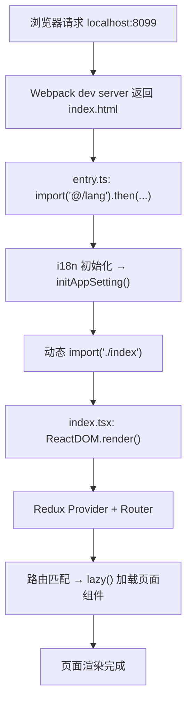
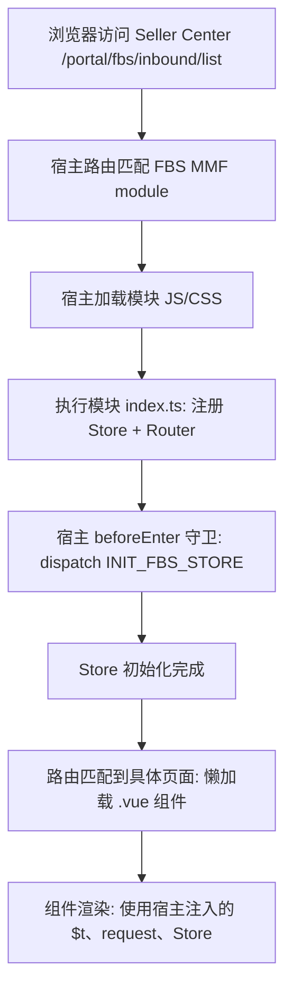

# 三种应用生命周期与宿主边界

> 预计学习时间：120–160 分钟
> 一句话总结：能区分 Portal SPA、Vue MMF module、React 18 MMF module 三种 FBS 前端形态的加载链路——从入口文件到页面渲染，解释关键对象、宿主交接信息、失败点和观测方法。

## 这一章解决什么问题

模块二教你分别在三个仓库里写组件、加路由、调接口。但还有一个根本问题没回答：当你打开浏览器访问 FBS 页面时，从 URL 输入到页面渲染，中间到底发生了什么？

Portal 的 `localhost:8099`、SC Vue 的 `localhost:4200`、SC React 的动态端口——三者的启动方式你已经会了，但它们背后的初始化流程完全不同。Portal 是自己渲染自己的 SPA，SC 两个仓库是 MMF 模块，依赖 Seller Center 宿主注入路由、Store、请求实例和全局依赖。不理解这些差异，你在排查白屏、路由 404、Store 未初始化等问题时只能靠猜。

本章以一条真实的 FBS 页面 URL 为线索，分别在三个仓库中追踪它的加载链路。你会逐站定位 entry 文件、宿主注入点、路由注册、状态初始化和页面组件渲染，然后对比三种形态的关键差异。学完后，你能画出一张"给定 URL → 哪个仓库 → 哪些初始化步骤 → 哪个组件渲染"的排查地图。

> 本章基于三个前端仓库的 release 分支（2026-07-20）。

## 三种形态速览

在深入代码之前，先用一个表建立三种形态的直觉：

| 维度 | Portal (`fbs-frontend`) | SC Vue (`fbs-sc-vue`) | SC React (`fbs-sc-react`) |
| --- | --- | --- | --- |
| **形态** | 独立 SPA | MMF module | MMF module + 远端组件 |
| **入口加载** | `entry.ts` → 动态 import `index.tsx` | `index.ts` → 注册 Store → 注册 Router | `index.ts` → 初始化远端组件 → 注册全局依赖 → 注册路由 |
| **宿主依赖** | 无——自己管理一切 | 依赖 Seller Center 宿主 | 依赖宿主 + 远端组件宿主 |
| **渲染方式** | `ReactDOM.render()` | MMF 框架调用模块组件 | MMF 框架调用 + 远端组件生命周期 |
| **路由注册** | React Router 5 文件定义 | `routers` 数组导出 | `registerRouterModule(routes)` |
| **Store 来源** | 自建 Redux + Recoil | `app.registerVue3StoreModule` | 宿主 Vuex + 自建 Redux Toolkit |
| **全局依赖** | 无需注入 | `initRemoteDepsForMMF()` | `initGlobalDepsForMMF()` + `DepsProvider` |

三种形态的差异不是"技术选型随意"，而是历史演进的结果。Portal 最早建设，是独立 SPA；后来 Seller Center 推行 MMF 多模块架构，FBS 的 SC 功能拆成了 Vue MMF 模块；再后来团队启动 Vue 向 React 迁移，新增了 React 18 MMF 模块和远端组件。理解这段历史对读懂代码有帮助，但本章不展开——聚焦当前代码中的三种加载链路。

## Portal：自给自足的 SPA 生命周期

### 从 URL 到首屏渲染

Portal 的加载链路是最接近传统 Web 应用的：



关键文件及职责：

| 步骤 | 文件 | 职责 |
| --- | --- | --- |
| 1 | `src/entry.ts` | 异步加载 i18n 和应用设置，然后动态加载主入口 |
| 2 | `src/index.tsx` | 创建 Redux Store、挂载 React Router、`ReactDOM.render()` |
| 3 | `src/routes/*.ts` | 定义路由树，每个路由指向 `lazy()` 加载的页面组件 |
| 4 | 页面组件 | 实际渲染的 React 组件 |

### entry.ts 的异步启动模式

```typescript
// src/entry.ts（简化）
import('@/lang').then(async ({ run }) => {
  await run();                              // i18n 初始化
  const { initAppSetting } = await import('@/bridge/init-app-setting');
  await initAppSetting();                   // 应用全局设置
  import('./index');                        // 加载主入口
});
```

这个文件做了三件事，全部是异步的：

1. **i18n 初始化**：`run()` 加载翻译文件、设置语言。如果 i18n 未初始化就渲染页面，所有 `$t()` 调用都会失败——这就是 Portal 白屏最常见的原因。
2. **应用设置**：`initAppSetting()` 从后端拉取全局配置（如功能开关、环境变量）。
3. **主入口加载**：`import('./index')` 是动态导入，此时 i18n 和配置已就绪。

如果 Portal 白屏，第一件事是打开浏览器 Console，看 i18n 初始化是否报错。`src/lang/` 目录下缺少 JSON 文件是最常见的原因。

### 渲染入口：Redux + Router + Render

Portal 的渲染层次：`Redux Provider` 提供全局 Store → `RecoilRoot` 提供原子化状态 → `Router` 匹配 URL → `App` 根组件（侧边栏、导航、主内容区）。全部由 Portal 自己创建和管理，没有宿主参与。这意味着 Portal 需要自己处理所有基础设施，但也意味着你不会遇到"宿主版本不兼容"的问题。

### 失败点地图

| 现象 | 可能原因 | 排查方法 |
| --- | --- | --- |
| 白屏 + Console 无报错 | i18n 初始化失败 | 检查 `src/lang/` 目录下的 JSON 文件 |
| 白屏 + `Cannot read property` | Store 未正确初始化 | 检查 `generateStore()` 和 reducer |
| 页面 404 | 路由未注册或懒加载失败 | 检查 `src/routes/` 中对应路由定义 |
| API 请求 401 | 未登录 Portal test 环境 | 在 test 环境 Portal 登录后再访问 localhost |
| 页面加载但数据为空 | API 代理未配置 | 检查 Network 面板中 API 请求 URL 和状态码 |

## SC Vue：MMF 模块的宿主依赖生命周期

### 模块初始化：Store → Router → 全局依赖

SC Vue 不能独立启动。它的 `src/index.ts` 不是渲染入口——它是**模块注册入口**：

```typescript
// src/index.ts（简化）
import './store';                          // 1. 注册 Vuex module
import './router';                         // 2. 注册路由
import { initRemoteDepsForMMF } from './global-deps-register';
initRemoteDepsForMMF();                    // 3. 注册全局依赖（远端组件用）
```

这三步不渲染任何东西。它们的作用是**向 MMF 框架声明"我提供了这些能力"**。`./store` 执行 `app.registerVue3StoreModule('FBS_STORE', FBS_STORE)` 将 Vuex module 挂载到宿主 Store。`./router` 导出一个 `routers` 数组，MMF 框架将其合并到宿主路由表中。`initRemoteDepsForMMF()` 注册全局依赖供远端组件使用。

### 宿主注入的完整链路

SC Vue 页面的完整渲染需要宿主参与：



关键宿主注入对象：

| 注入对象 | 来源 | 访问方式 | 作用 |
| --- | --- | --- | --- |
| `app` | 宿主 `framework` | `import { app } from 'framework'` | 全局应用实例 |
| `app.request` | 宿主 Axios 实例 | `app.request.clone({ baseURL })` | 携带宿主会话的请求实例 |
| `app.vue3VuexStore` | 宿主 Vuex Store | `getters['FBS_STORE/...']` | 跨模块共享状态 |
| `app.i18n` | 宿主 i18n 实例 | `app.i18n.t(key)` | 翻译函数 |
| `app.router` | 宿主 Vue Router | 路由守卫中访问 | 路由导航 |

### beforeEnter：路由守卫中的初始化契约

```typescript
// src/router/index.ts（简化）
beforeEnter: async (to, from) => {
  const data = await app.vue3VuexStore.dispatch('FBS_STORE/INIT_FBS_STORE');
  if (data.systemUpgrading?.toggle) return { path: '/portal/fbs/systemUpdating' };
  // 检查税务锁定、入驻状态、权限等
}
```

`beforeEnter` 是模块与宿主的"初始化契约"。它在首次进入 FBS 模块时执行，获取卖家/店铺信息并检查系统状态。如果 `INIT_FBS_STORE` 失败，整个 FBS 模块无法使用。排查"SC FBS 页面打不开"时的第一个检查点：打开 Vue DevTools 或 Console，确认 `FBS_STORE` 的 state 是否已填充。

### 失败点地图（SC Vue）

| 现象 | 可能原因 | 排查方法 |
| --- | --- | --- |
| SC FBS 模块入口不可见 | `authCodes` 不满足 | 检查宿主的权限配置 |
| 进入模块后白屏 | `INIT_FBS_STORE` 失败 | Console 查看 dispatch 错误 |
| 页面组件不渲染 | 路由未注册或懒加载失败 | 检查 `routers` 数组 |
| MMF Dev Tools 不生效 | 模块 key 或端口错误 | 检查 `mmc.config.js` 和 Dev Tools 面板 |
| 请求失败 401/403 | 宿主会话过期 | 刷新 Seller Center 页面 |

## SC React：MMF + 远端组件的双重生命周期

### 模块初始化：三步注册

SC React 的初始化比 SC Vue 多了一层——远端组件运行时：

```typescript
// projects/react-frontend/src/index.ts（简化）
import { init as initRemoteComponent } from '@shopee/remote-component-react';

initRemoteComponent({
  environment: app.environment.environment,
  region: app.environment.region,
});

initGlobalDepsForMMF();        // 注册全局依赖
app.registerRouterModule(routes); // 注册路由
```

`initRemoteComponent` 初始化远端组件框架——环境配置错误会导致远端组件加载线上版本而非本地开发版本。`initGlobalDepsForMMF()` 准备 `$gt`、`request`、`router`、`reporter` 等全局依赖。`app.registerRouterModule(routes)` 向 MMF 框架注册路由。

### DepsProvider：React 侧依赖注入

SC React 的核心设计是 `DepsProvider`——一个 React Context，为所有组件提供全局依赖：

```tsx
// 简化版
<DepsProvider value={{ $gt, request, router, reporter }}>
  <App />
</DepsProvider>
```

这与 SC Vue 的 `app.xxx` 全局访问有本质区别：Vue 中任何地方都可以 `import { app } from 'framework'`；React 中全局依赖通过 Context 显式传递，只有包裹在 `DepsProvider` 内的组件才能访问。如果你在一个独立测试中渲染 SC React 组件但没有包裹 `DepsProvider`，`useContext(DepsContext)` 返回 `undefined`。

### 远端组件的双宿主兼容

SC React 的远端组件目录 `projects/fbs-sc-remote-component/` 中的组件需要同时被 Portal（Module Federation）和 MMF 宿主消费。`createRemoteComponent` 工厂函数在运行时检测宿主类型并返回对应格式：

```tsx
// createRemoteComponent.tsx（简化）
export function createRemoteComponent(Component) {
  const hostType = getHostType();
  if (hostType === 'portal') {
    return { mount, update, unmount };  // Portal 期望生命周期对象
  }
  return WrappedComponent;  // MMF 期望 React 组件
}
```

### 三种形态加载时序对比

| 阶段 | Portal | SC Vue | SC React |
| --- | --- | --- | --- |
| 1. 入口加载 | `entry.ts` 异步链 | `index.ts` 同步注册 | `index.ts` 同步注册 |
| 2. 依赖初始化 | i18n → AppSetting → index | Store → Router → Deps | RemoteComponent → Deps → Router |
| 3. 宿主注入 | 无 | `app` 全局对象 | `app` + `DepsProvider` Context |
| 4. 页面渲染 | `ReactDOM.render()` | 宿主调用 `Vue3Mount()` | 宿主调用 `React18Mount()` |
| 5. 懒加载 | `React.lazy()` | `() => import()` | `React.lazy()` + SSCConfigProvider |

## 跨形态排错：用同一套问题定位

无论哪种形态，页面打不开时按以下顺序排查：

### 第一步：确定故障层

```text
浏览器能看到页面吗？
├─ 完全白屏 → 入口层问题（entry/index 加载失败）
├─ 有壳但内容空白 → 路由/Store 层问题
├─ 有内容但数据为空 → API/数据层问题
└─ 页面能看但交互不工作 → 事件/状态层问题
```

### 第二步：检查最薄弱的环节

| 形态 | 最薄弱环节 | 检查方法 |
| --- | --- | --- |
| Portal | i18n 初始化 | Console 是否有 i18n 错误 |
| SC Vue | `INIT_FBS_STORE` | Vue DevTools 中 FBS_STORE state 是否为空 |
| SC React | `DepsProvider` | React DevTools 中 DepsContext 是否有值 |

### 第三步：用 DevTools 逐层核验

1. **Network 面板**：页面和 JS/CSS 资源是否成功加载（200）。
2. **Console 面板**：是否有未捕获错误。
3. **框架 DevTools**：组件树是否完整，Store 是否有数据。
4. **MMF Dev Tools**（SC 仓库）：模块是否成功注入宿主。

### 跨形态故障对照表

| 故障现象 | Portal 定位 | SC Vue 定位 | SC React 定位 |
| --- | --- | --- | --- |
| 白屏 | i18n 未初始化 | INIT_FBS_STORE 失败 | DepsProvider 未包裹 |
| 页面 404 | 路由文件未注册 | routers 数组缺失 | registerRouterModule 未调用 |
| 请求 401 | 未登录 test Portal | 宿主会话过期 | 宿主会话过期 |
| 组件报 undefined | Store state 未填充 | Store state 未填充 | DepsContext 未提供 |

## 从生命周期理解开发约束

### 为什么 SC Vue 不能在 beforeEnter 之前访问 Store

Store 在模块加载时注册（`import './store'`），但数据在 `beforeEnter` 中的 `dispatch('INIT_FBS_STORE')` 后才填充。提前访问会得到初始空值。

### 为什么 SC React 组件必须包裹在 DepsProvider 中

因为 `request`、`$gt`、`router` 等通过 React Context 传递，不是全局变量。任何脱离 `DepsProvider` 子树的组件访问这些依赖都会得到 `undefined`。

### 为什么 Portal 改路由不需要注册步骤

Portal 使用 React Router 5 的文件式路由——`src/routes/*.ts` 在构建时收集并生成路由树，不需要向宿主注册。SC 仓库需要注册是因为路由必须合并到宿主全局路由表中。

### 为什么远端组件需要 createRemoteComponent 工厂

远端组件的消费者有两种——Portal（Module Federation）和 MMF 宿主。它们对导出格式有不同要求。工厂在运行时检测宿主类型并适配。

### 三种形态对"新页面开发"的影响

| 操作 | Portal | SC Vue | SC React |
| --- | --- | --- | --- |
| 新增路由 | 在 `src/routes/` 加文件 | 在 `routers` 数组加条目 | 在 `routes` 数组加条目 |
| 新增 Store 模块 | 在 `src/store/` 加 reducer | 在 `src/store/modules/` 加 module | 在 `store/modules/` 加 slice |
| 新增依赖注入 | 不需要 | `initRemoteDepsForMMF()` 中注册 | `initGlobalDepsForMMF()` 中注册 |
| 启动验证 | 浏览器打开 localhost 即可 | MMF Dev Tools 注入后验证 | MMF Dev Tools 注入后验证 |

## 宿主边界对测试和调试的影响

### Portal：可独立测试

Portal 不依赖外部宿主，你可以在不启动 Seller Center 的情况下做绝大多数前端测试和调试。`ReactDOM.render()` 是标准的 React 入口，Jest 单元测试可以直接渲染组件并验证行为，不需要 mock 宿主对象。这使得 Portal 的开发反馈循环最短——改代码、刷新浏览器、看结果。

### SC Vue：需要宿主上下文

SC Vue 的几乎所有能力（路由、Store、请求、i18n）都来自宿主 `app` 对象。这意味着：
- 单元测试需要 mock `framework` 模块中的 `app`。
- 本地开发必须通过 MMF Dev Tools 连接 Seller Center 测试环境。
- 如果测试环境挂了，SC Vue 的本地开发也受影响（因为 INIT_FBS_STORE 需要调用测试环境 API）。

这不是 SC Vue 的设计缺陷——这是 MMF 多模块架构的固有特征：模块复用宿主的基础设施，换取更小的模块体积和更一致的跨模块体验。代价是模块不能脱离宿主独立运行。

### SC React：双重依赖

SC React 不仅依赖 MMF 宿主，还依赖远端组件运行时。这意味着：
- 本地开发可能需要同时启动主模块和远端组件两个 dev server。
- 远端组件的调试需要确认它被哪个宿主加载（Portal 还是 MMF），因为两者的生命周期不同。
- 测试远端组件时，需要 mock 两个宿主的环境变量、全局依赖和生命周期方法。

一个实用的开发策略：先在主模块内完成组件开发和测试（此时不涉及远端组件的生命周期），确认功能正确后再将组件抽取到远端组件目录并适配两种宿主。

### 三种形态的开发体验对比

| 维度 | Portal | SC Vue | SC React |
| --- | --- | --- | --- |
| 本地启动复杂度 | 低（`yarn start`） | 中（`yarn dev` + MMF Dev Tools） | 高（`pnpm dev:host` + 可能 `pnpm dev:remote`） |
| 独立测试能力 | 强 | 弱（需 mock 宿主） | 弱（需 mock 双宿主） |
| 开发反馈速度 | 快 | 中 | 中 |
| 对测试环境依赖 | 仅 API 代理 | API + Store 初始化 | API + Store 初始化 + 远端组件 |

这张表不是让你选择"哪个仓库最好"——每个仓库的约束由它的架构角色决定。但了解这些差异能帮助你在不同仓库之间切换时，调整对开发速度的预期和调试策略。

## 练习

### 时序图绘制

为 SC Vue 仓库画一张完整的页面加载时序图，包含以下参与方：浏览器、Seller Center 宿主、模块 `index.ts`、`store/index.ts`、`router/index.ts`、`beforeEnter` 守卫、页面组件。标注每个步骤的输入和输出。

### 故障定位

以下场景分别发生在哪种形态中？定位到具体文件：

a) 用户访问 `/portal/fbs/inbound/list`，页面显示"系统升级中"。
b) Portal 本地 `localhost:8099` 能打开但所有文字显示为 key 名（如 `inboundProblemId` 而非"入库问题 ID"）。
c) SC React 中 `useContext(DepsContext)` 返回 `undefined`。

### 跨形态对比

用一句话描述 Portal、SC Vue、SC React 在"路由注册方式"上的核心差异。

### 参考答案

**7.2a**：SC Vue。`src/router/index.ts` 的 `beforeEnter` 中 `systemUpgrading.toggle` 检查 → 跳转 `/portal/fbs/systemUpdating`。

**7.2b**：Portal。`src/entry.ts` 的 i18n 初始化未完成或 `src/lang/` 下缺少翻译 JSON 文件。

**7.2c**：SC React。组件不在 `DepsProvider` 子树内，或 `initGlobalDepsForMMF()` 未被调用。

**7.3**：Portal 通过文件定义路由树自动收集；SC Vue 导出数组由 MMF 框架注册；SC React 显式调用 `registerRouterModule` 注册。

## 自检

1. Portal SPA、Vue MMF、React 18 MMF 三种应用从加载到页面渲染的关键对象分别是什么？它们的宿主交接信息有什么不同？

2. 为什么 MMF 模块不能直接 `yarn dev` 启动，而需要通过 MMC Dev Tools 或宿主启动？失败点通常出在哪一层？

3. 三种形态的错误排查中，"页面白屏"和"路由 404"分别对应哪些最可能的原因？

4. 宿主边界对前端开发的三个直接影响是什么？为什么不能把 MMF 模块当成独立 SPA 开发？

5. 如果你需要在三个仓库中同时修改一个组件，每种仓库的验证流程有什么不同？

## 参考文献

- [React 16.14.0 Official Release](https://github.com/facebook/react/releases/tag/v16.14.0)
- [React 18 Upgrade Guide](https://react.dev/blog/2022/03/08/react-18-upgrade-guide)
- [Vue 3 Guide](https://vuejs.org/guide/introduction.html)
- [Webpack Module Federation](https://webpack.js.org/concepts/module-federation/)
- [qiankun Guide](https://qiankun.umijs.org/guide)
- [React Router v5.2](https://github.com/remix-run/react-router/tree/v5.2.0)