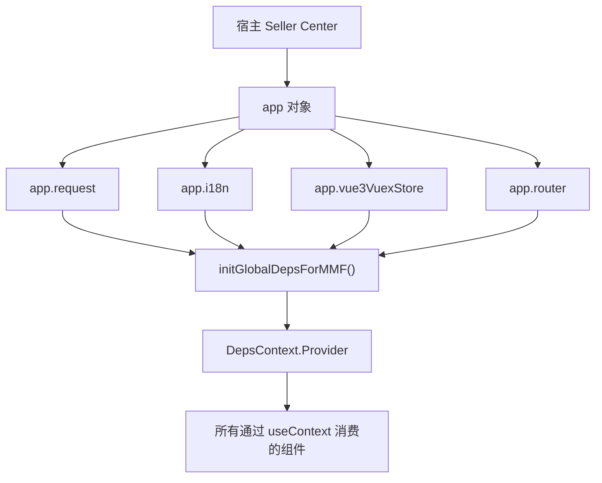

# Vue/React 共存、共享依赖与版本迁移

> 预计学习时间：120–160 分钟
> 一句话总结：能处理 FBS 中 React 16/18、Vue 3 三种框架在同一页面中共存的情况——理解宿主 Vuex 注入、axios external 共享、全局依赖注入机制，能够定位依赖缺失故障并提出兼容改法。

## 这一章解决什么问题

大多数前端项目只有一个框架——React 或 Vue，选一个用到老。但 FBS 的三个前端仓库打破了这条规则：Portal 运行 React 16，SC Vue 运行 Vue 3，SC React 运行 React 18——更关键的是，SC React 作为一个 React 应用，需要从宿主的 Vuex Store 读取卖家信息和店铺数据。React 和 Vue 不是"选一个"的关系，它们在同一页面中共存。

这种跨框架共存带来了三类问题：一是 React 组件如何读取 Vuex Store（答案：不是通过"桥接库"，而是直接访问宿主的 getter）；二是多个框架的共享依赖（如 axios）如何避免重复打包（答案：通过 webpack external 声明"运行时由宿主提供"）；三是全局依赖（翻译函数、请求实例、监控上报）如何注入到不同框架的组件中。

本章从三个真实场景出发：React 组件读取 Vuex Store、SC React 的 `DepsProvider` 依赖注入机制、以及依赖共享与版本迁移策略。学会这些后，你不会再对"为什么这个 React 组件里能访问 `app.vue3VuexStore`"感到困惑，也不会在改了共享依赖后导致另一个框架爆炸。

> 本章基于三个前端仓库的 release 分支（2026-07-20）。

## 跨框架共存的现实

### FBS 中三种框架的共存地图

在当前 FBS 代码中，以下场景涉及跨框架交互：

| 场景 | 消费者框架 | 提供者框架 | 交互方式 |
| --- | --- | --- | --- |
| SC React 读取卖家/店铺信息 | React 18 | Vue 3（宿主 Vuex） | `app.vue3VuexStore.getters` |
| SC React 使用宿主请求实例 | React 18 | Vue 3（宿主 `app.request`） | `app.request.clone()` |
| SC React 使用宿主翻译 | React 18 | Vue 3（宿主 `app.i18n`） | `$gt` 函数通过 DepsProvider 注入 |
| 远端组件被 Portal 消费 | React 18 | React 16（Portal） | Module Federation + createRemoteComponent |
| Portal 微应用（qiankun） | 各种框架 | React 16（Portal） | qiankun 沙箱隔离 |

### 跨框架不是"桥接"——是"共享宿主基础设施"

理解 FBS 跨框架的关键洞察：这些框架不是通过某个"桥接库"互相调用的。它们共享的是**同一个宿主基础设施**——`app` 对象。`app.vue3VuexStore` 本质上就是一个 JavaScript 对象，React 组件访问它不需要通过 Vue——直接读取 `getters` 属性即可。

这解释了为什么你在 SC React 中看到这样的代码：

```typescript
const currentShop = app?.vue3VuexStore?.getters?.['FBS_STORE/Shop/currentShop'];
```

这不是 React 调用了 Vue 的某个 API。这是普通的 JavaScript 对象属性访问——`getters` 是一个对象，`'FBS_STORE/Shop/currentShop'` 是它的一个 key。Vuex 的响应式系统（`getters` 是计算属性的代理）对 React 是透明的——React 拿到的是计算后的值。

## SC React 读取宿主的 Vuex Store

### 直接访问 getters

在 SC React 中，获取当前店铺信息的标准写法：

```typescript
import { app } from 'framework';

// 在组件或工具函数中
const shop = app?.vue3VuexStore?.getters?.['FBS_STORE/Shop/currentShop'] || {
  fbsWhsRegion: '',
  fbsShopId: '',
};
```

注意几个细节：

- **可选链**：`app?.vue3VuexStore?.getters`——这三层的每一层都可能为 `undefined`。`app` 在模块加载早期可能还未完全初始化。
- **命名空间路径**：`'FBS_STORE/Shop/currentShop'` 是完整的命名空间路径。不能省略 `FBS_STORE/` 前缀。
- **默认值**：`|| { fbsWhsRegion: '', fbsShopId: '' }` 确保即使 getter 返回 `undefined`，后续代码也不会崩溃。

### 为什么不用 react-vuex-bridge

你可能会问：为什么不用一个现成的 React-Vuex 桥接库？答案是：不需要。FBS 代码中读取 Vuex Store 的场景很有限——主要是初始化时读取一次基础信息（shop、seller、region）。这种低频、少字段的访问模式，直接读对象属性比引入一个桥接库更简单、更可控。引入桥接库会带来额外的依赖维护成本、版本兼容问题和学习曲线——而对于 FBS 的实际使用场景来说收益极小。

### 访问宿主 Vuex 的边界

不所有数据都应该从宿主 Vuex 读取。判断标准：

| 数据类型 | 存储位置 | 理由 |
| --- | --- | --- |
| 跨模块基础信息（shop、seller） | 宿主 Vuex | 多个 MMF 模块共享 |
| SC React 模块业务数据 | 自建 Redux Toolkit Store | 只有本模块使用 |
| 组件临时状态（表单、筛选） | 组件局部 state | 不需要持久化 |

如果 SC React 中需要频繁访问某个 Vuex 数据，考虑在模块初始化时从 Vuex 读取一次，存入本模块的 Redux Store，而不是每次使用都跨越框架边界读取。这样减少了与宿主的耦合，也方便单元测试时 mock。

## 共享依赖的 webpack external 机制

### 为什么要 external

FBS 前端多个框架共享一些基础库——axios、lodash、moment 等。如果每个模块都把 axios 打包进自己的 bundle，会有三个问题：

1. **体积膨胀**：页面加载三个 axios 副本，浪费带宽和解析时间。
2. **版本冲突**：不同模块的 axios 版本可能不一致，拦截器行为可能互相干扰。
3. **实例隔离**：每个模块创建自己的 axios 实例，但共享宿主 Cookie 和 CSRF token 的能力需要通过宿主的 `app.request` 获得。

webpack external 的解决方案：在构建时声明"这个库不要打包，运行时由外部提供"。

### MMF 模块中的 external 实践

SC 两个仓库在 `mmc.config.js` 中配置了 external。例如：

```javascript
module.exports = {
  externals: {
    'axios': 'axios',       // 不打包 axios
    'react': 'React',       // 不打包 React
    'react-dom': 'ReactDOM',
  },
};
```

运行时，这些库由宿主（Seller Center Portal）提供。宿主在页面中已经加载了这些库的 `<script>` 标签，模块代码运行时直接从 `window.axios` 等全局变量获取。

### external 失效的排查

常见症状：模块构建成功，但浏览器中报 `axios is not defined` 或 `React is not defined`。

排查步骤：
1. 确认宿主的 HTML 中是否加载了对应的库的 `<script>` 标签。
2. 确认 external 配置中的全局变量名是否与宿主提供的变量名一致（区分大小写）。
3. 如果本地 dev server 独立启动（没有宿主），需要手动在 HTML 模板中添加这些依赖的 `<script>`。

## 全局依赖注入：DepsProvider 与 initGlobalDepsForMMF

### 依赖注入的动机

SC React 的组件依赖一些全局能力：翻译函数 `$gt`、请求实例 `request`、路由实例 `router`、监控上报 `reporter`。这些不是 React 组件自己创建的对象——它们来自宿主。如何把这些宿主提供的对象传递给组件树的每个节点？

直接 `import { app } from 'framework'` 在每个组件中是可行的（SC Vue 就是这么做的），但 SC React 选择了一条不同的路——React Context。原因：

- **可测试性**：通过 Context 注入的依赖在测试中可以轻松替换为 mock，而直接 import `app` 需要在模块级别做 mock。
- **显式依赖**：组件通过 `useContext(DepsContext)` 声明自己需要哪些全局能力，而不是隐式依赖全局变量。
- **类型安全**：DepsContext 的值可以定义完整的 TypeScript 类型。

### initGlobalDepsForMMF 的执行时机

```typescript
// global-deps-register.ts（简化）
export function initGlobalDepsForMMF() {
  globalDeps = {
    $gt: app.i18n.t,          // 翻译函数
    request: app.request.clone({ baseURL: '/api/fbs/sc' }),
    router: app.router,
    reporter: createReporter(),
  };
}
```

这个函数在 `index.ts` 中、路由注册之前执行。它必须在任何组件渲染之前完成——否则组件首次渲染时 `DepsContext` 的值还是空的。

### 缺失依赖的故障模式

如果 `initGlobalDepsForMMF()` 未被调用，组件中 `useContext(DepsContext)` 返回 `undefined`。根据组件内部的防御性代码编写程度，可能的症状：

- 组件不渲染（因为 `deps.request` 为 `undefined`，访问 `.get()` 报错）。
- 翻译不生效（所有文案显示为 key 名）。
- 路由跳转不工作（`deps.router` 为 `undefined`）。

排查方法：在浏览器 React DevTools 中找到组件树，检查 `DepsProvider` 的 value 是否正确。

## 版本迁移的兼容策略

### FBS 当前版本矩阵

| 依赖 | Portal | SC Vue | SC React |
| --- | --- | --- | --- |
| React | 16.14 | - | 18.x |
| Vue | - | 3.x | -（通过宿主） |
| TypeScript | 4.4 | 4.7 | 4.7 |
| Axios | 0.18 | 宿主提供 | 宿主提供 |
| Node | 16 | 20 | 20 |

### Vue → React 迁移的渐进策略

FBS 团队正在将 SC 功能从 Vue 逐步迁移到 React。这不是"大爆炸"式的一刀切——而是渐进迁移：

- 新功能优先在 SC React 中开发。
- SC Vue 的存量功能逐步被 SC React 的同功能页面替换。
- 远端组件使 Portal 和 SC React 可以共享同一套组件代码，减少重复开发。

迁移过程中的关键约束：

1. **API 契约不变**：后端接口对 Vue 和 React 是一样的。前端改框架不能改接口。
2. **用户体验一致**：迁移后的 React 页面在交互、样式、错误处理上应与 Vue 页面保持一致。
3. **渐进替换**：先替换较少依赖的独立页面（如列表页），再替换复杂页面（如多步骤表单）。

### 共享依赖升级的风险评估

如果要升级某个共享依赖（如 axios 从 0.18 到 1.x）：

| 风险项 | 评估方法 | Portal 影响 | SC Vue 影响 | SC React 影响 |
| --- | --- | :---: | :---: | :---: |
| API 变化 | 对比 changelog | 中 | 低（通过宿主） | 低（通过宿主） |
| 拦截器行为 | 测试现有拦截器 | 高 | 中 | 中 |
| 类型定义 | TypeScript 编译 | 有 | 有 | 有 |
| 包体积 | 对比 bundle 大小 | 无关（external） | 无关 | 无关 |

关键结论：Portal 对 axios 版本升级最敏感，因为它直接依赖 axios；SC 两个仓库通过宿主使用 axios，宿主升级后它们自动获得新版本，但需要确认拦截器行为是否兼容。

## 常见错误

### 在 SC React 中直接 import Vuex 的 mutation

```typescript
// 错误：绕过 action 直接 commit
app.vue3VuexStore.commit('FBS_STORE/SET_SHOP_INFO', data);

// 正确：通过 dispatch 触发 action（action 内部会做校验和附加逻辑）
app.vue3VuexStore.dispatch('FBS_STORE/SET_SHOP_INFO', data);
```

### 在多个地方初始化全局依赖

```typescript
// 错误：重复初始化可能导致版本不一致
import { initGlobalDepsForMMF } from './global-deps-register';
initGlobalDepsForMMF();  // index.ts 中已执行
initGlobalDepsForMMF();  // 某个组件中又执行了一次
```

全局依赖只应在模块入口初始化一次。如果组件需要特定的依赖配置，通过 Props 传入或使用自己的 Context，不要修改全局 deps。

### 跨框架共享对象时忘记不可变性

Vue 的响应式系统会包装对象。如果将一个 Vue 响应式对象直接传给 React 的 state：

```typescript
// 风险：Vue 响应式代理可能与 React 的不可变更新冲突
const [shop, setShop] = useState(app.vue3VuexStore.getters['FBS_STORE/Shop/currentShop']);
```

安全做法：读取需要的字段值，而非整个代理对象：

```typescript
const rawShop = app.vue3VuexStore.getters['FBS_STORE/Shop/currentShop'];
const [shop, setShop] = useState({
  id: rawShop?.fbsShopId,
  region: rawShop?.fbsWhsRegion,
});
```

## 宿主请求实例的跨框架共享

### app.request 的多重身份

在 FBS 前端代码中，`app.request` 不只是一种 Axios 实例。它同时承载了：

- **会话管理**：自动附带宿主 Cookie 和 CSRF token。
- **请求拦截**：统一注入请求 ID、语言、区域等 header。
- **响应拦截**：统一处理 retcode、错误提示、监控上报。
- **实例克隆**：通过 `.clone()` 创建不同配置的子实例（普通/PII/Blob）。

SC Vue 和 SC React 都通过 `app.request.clone()` 创建自己的请求实例，而不是直接使用 `app.request`。这样每个仓库可以配置自己的 `baseURL`、`responseType`、错误处理逻辑，但仍然继承宿主的会话和拦截器。

### 为什么不能自己创建 Axios 实例

```typescript
// 错误：自己创建的 Axios 实例没有宿主 Cookie 和 CSRF token
import axios from 'axios';
const myRequest = axios.create({ baseURL: '/api/fbs/sc' });

// 正确：从宿主克隆
const myRequest = app.request.clone({ baseURL: '/api/fbs/sc', unpackData: false });
```

自己创建的 Axios 实例缺少宿主的请求拦截器——没有 Cookie、没有 CSRF token、没有请求 ID、没有监控上报。请求看起来发出了，但后端会因为缺少鉴权信息而返回 401。这个问题在本地开发时尤其容易混淆——因为本地可能配置了代理绕过鉴权。

### clone 的配置继承

`app.request.clone(options)` 创建的新实例继承原实例的所有拦截器，但可以覆盖特定配置。常见的覆盖项：

```typescript
// 普通 FBS 请求
export const request = app.request.clone({ baseURL: '/api/fbs/sc', unpackData: false });

// PII 请求——baseURL 指向敏感数据服务
export const piiRequest = app.request.clone({ baseURL: '/api/fbs/pii/sc', unpackData: false });

// Blob 请求——响应不解析为 JSON
export const blobRequest = app.request.clone({ baseURL: '/api/fbs/sc', responseType: 'blob' });
```

注意 `unpackData: false` 的含义：它告诉 Axios 不要自动解包响应数据（不要做 `response.data.data` 这种嵌套解构）。FBS 后端返回的响应结构为 `{ retcode, data, message }`，前端需要完整访问这个结构来判断业务成功与否——自动解包会让 `retcode` 字段丢失。


## 跨框架组件的实战开发策略

### 先在一个框架中完整开发，再考虑跨框架

FBS 当前不是所有组件都需要跨框架。大多数组件只在一个仓库中使用。只有以下情况才需要跨框架考虑：

1. 组件在 Portal 和 SC 中都需要（如入库管理的某些共享视图）。
2. 组件被标记为"后续可能跨框架"（团队规划中的迁移项）。
3. 组件是基础设施级别的（如权限检查、翻译封装）。

如果你不确定一个组件是否需要跨框架，默认**不需要**。先在一个仓库中完成开发和验证，将来如果真的需要跨框架，再执行抽取和适配——避免过早抽象。

### 从单框架组件到跨框架组件的迁移步骤

1. **识别共享部分**：哪些逻辑是框架无关的（纯数据转换、业务规则、API 调用）？哪些是框架相关的（渲染、事件处理、状态管理）？
2. **抽取框架无关逻辑**：将框架无关的逻辑抽取为纯函数或自定义 hook / composable，放在 `basic/` 或 `domains/` 目录下。
3. **创建适配层**：为每个目标框架创建适配组件，负责将框架无关逻辑桥接到框架的渲染和事件系统。
4. **测试双框架**：在两种框架中各验证一次功能、样式和交互。

### 跨框架组件的状态管理

跨框架组件不应该是"万能"的——它需要明确自己在每个框架中如何管理工作：

- **数据获取**：跨框架组件可以接收数据作为 Props，由消费方负责调用 API。或者，如果数据获取逻辑与框架无关，可以抽取为独立的数据 service。
- **用户交互**：跨框架组件通过回调函数（`onChange`、`onSubmit`）通知消费方用户操作，由消费方的框架状态管理来处理。
- **样式**：使用 CSS Modules 确保样式隔离——不会与消费方的样式系统冲突。


## 从 SC React 依赖图看全局注入的设计

### 绘制 SC React 的依赖注入图



### 关键设计决策

为什么 `app.vue3VuexStore` 没有通过 `DepsProvider` 注入，而是直接 import？因为 Vuex Store 的访问模式是"一次读取、多处使用"——shop、seller 等信息在 Store 初始化后很少变化。通过 Context 注入会触发不必要的重新渲染（Context 值变化会导致所有消费者重新渲染），而直接读取 `getters` 是惰性的——只在读取时获取当前值，不触发渲染。

这个设计选择反映了 FBS 团队的实际权衡：Context 适合注入相对稳定的服务对象（如 `request`、`$gt`），不适合注入频繁变化的数据对象（如 Store state）。对于后者，直接访问 getter 是更轻量的方案。


## 跨框架开发的测试策略

跨框架组件的测试面临一个核心挑战：组件在一个框架中渲染，但依赖另一个框架提供的对象。以下是 FBS 中常用的测试策略：

1. **单元测试框架无关逻辑**：纯函数（数据转换、校验规则）不需要框架上下文，直接测试输入输出。
2. **集成测试用 mock context**：测试 DepsProvider 包裹的组件时，手动创建一个包含 mock deps 的 Context value。
3. **E2E 测试验证跨框架行为**：通过浏览器自动化工具（Playwright/Cypress）在真实宿主中测试，而不是在单元测试中模拟宿主行为。

对于 SC React 组件的单元测试，标准的 mock 模式：

```typescript
const mockDeps = {
  $gt: (key: string) => key,
  request: { get: jest.fn(), post: jest.fn() },
  router: { push: jest.fn() },
  reporter: { report: jest.fn() },
};

function renderWithDeps(ui: React.ReactElement) {
  return render(
    <DepsContext.Provider value={mockDeps}>
      {ui}
    </DepsContext.Provider>
  );
}
```

这个模式让你的组件测试不依赖真实的宿主环境，运行速度快且可靠。

## 练习

### 依赖追踪

在 SC React 仓库中追踪 `$gt` 函数从宿主到组件的完整路径：宿主提供 → `initGlobalDepsForMMF()` → `DepsContext.Provider` → 组件 `useContext(DepsContext).$gt`。

### 故障定位

SC React 页面中所有文案显示为 key 名而非翻译后文案。列出三个最可能的原因。

### 跨框架兼容

你在 SC React 中新增了一个组件，它依赖 `app.vue3VuexStore.getters['FBS_STORE/System/maintenanceMode']`。这个组件将来可能被抽取到远端组件，被 Portal 消费。写出在这种架构迁移中需要考虑的三个兼容问题。

### 参考答案

**7.2**：1) `initGlobalDepsForMMF()` 中 `$gt` 未正确赋值；2) `DepsProvider` 未包裹到这个组件的祖先链中；3) 组件在 `DepsProvider` 渲染之前就尝试访问了 deps。

**7.3**：1) Portal 没有 `app.vue3VuexStore`——远端组件不能直接依赖 Vuex getter，需要通过 Props 或 Context 传入；2) `maintenanceMode` 的语义在两个宿主中是否一致；3) 如果从 Vuex 改为 Props 传入，需要协调两个消费者的调用方式。

## 自检

1. SC React 模块中，React 组件如何读取宿主注入的 Vuex Store？这种跨框架状态共享的边界在哪里？

2. `initGlobalDepsForMMF` 和 `DepsProvider` 各自解决了什么问题？如果宿主依赖注入失败，前端会出现什么现象？

3. Webpack external 机制在 FBS 中的作用是什么？如果 external 配置错误（如 axios 版本不匹配），会有什么后果？

4. 版本迁移时，为什么不能同时修改三个仓库？安全的迁移顺序是什么？

5. 跨框架组件的测试中，如何在不启动完整宿主的情况下验证组件的依赖注入？

## 参考文献

- [React Context](https://react.dev/learn/passing-data-deeply-with-context)
- [Vuex 4 Documentation](https://vuex.vuejs.org/)
- [React 18 Upgrade Guide](https://react.dev/blog/2022/03/08/react-18-upgrade-guide)
- [Webpack externals](https://webpack.js.org/configuration/externals/)