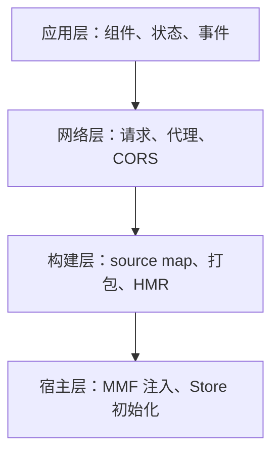

# 前端观测与系统化排错

> 预计学习时间：130–170 分钟
> 一句话总结：能用浏览器 DevTools、Network 面板、Console、Source Map、API SLA 监控埋点与构建日志分层定位白屏、路由 404、权限拒绝、请求失败和 MMF 宿主注入异常五类高频问题——完成两份故障诊断记录，其中一份来自 MMF 宿主边界。

## 这一章解决什么问题

模块一到模块三的前七章，你学会了怎么在 FBS 前端仓库中写正确的代码。但现实是：代码不会一次写对。白屏、接口报错、路由不匹配、权限被拒——这些不是你学得不够好，它们是前端开发的日常。

区别在于你怎么应对。没有章法的人会逐行改代码、反复刷新浏览器、猜原因。有章法的人会先保存现象证据，然后分层假设、逐个验证、最小修复、回归验证。本章教你后一种方法。

FBS 前端的错误来源跨越四层：宿主层（MMF 注入失败）、构建层（source map 不匹配）、网络层（代理配置错误、超时、HTTP 错误码）和应用层（组件状态异常、路由守卫逻辑）。每层的排查方式不同——你不能用看 Console 的方法排查宿主注入问题，也不能用看 Network 面板的方法排查构建错误。本章为每一层建立一套标准的排查流程，然后通过两个真实场景（MMF 模块白屏和 API 监控异常）带你实操整个诊断过程。

> 本章基于三个前端仓库的 release 分支（2026-07-20）。

## 错误分层与排查策略

### FBS 前端的四层错误模型



| 层 | 典型症状 | 首选工具 | 排查难度 |
| --- | --- | --- | --- |
| **宿主层** | 模块入口不可见、全局对象 undefined | MMF Dev Tools + Console | 高（需理解宿主架构） |
| **构建层** | HMR 不生效、生产环境白屏但本地正常 | Terminal + Network | 中 |
| **网络层** | 请求 401/403/404/500、CORS 错误 | Network 面板 | 低 |
| **应用层** | 组件报错、状态异常、渲染空白 | Console + React/Vue DevTools | 低 |

排查原则：**从外到内**——先排除宿主层，再排构建层，再排网络层，最后排应用层。如果宿主层的问题（如 MMF 未注入）都没解决，排查应用层代码是浪费时间。

### 保存现象证据

在开始排查之前，先收集以下信息——不要凭记忆描述问题：

1. **截图**：页面的当前状态（白屏？部分渲染？错误提示？）。
2. **Console 完整输出**：不仅是红色的 Error，还包括黄色的 Warning。
3. **Network 面板**：筛选失败请求（红色或 4xx/5xx），展开查看 Request Headers 和 Response。
4. **当前环境**：Node 版本、哪个仓库、哪个分支、是否通过 MMF Dev Tools 注入。

## 分层排查方法

### 宿主层：MMF 注入失败的排查

MMF 模块不渲染的最常见原因按概率排序：

**1. MMF Dev Tools 未配置或未启用**

症状：`localhost:4200` 正常启动，但 Seller Center 页面中 FBS 模块不出现。检查 Chrome 扩展图标是否亮起，点击图标查看填写的模块 key 和本地端口是否正确。模块 key 应与 `mmc.config.js` 中的 `id` 字段一致。

**2. 模块 index.ts 执行时报错**

症状：Console 中可能看到模块 JS 文件加载失败或执行错误。打开 Network 面板，搜索对应仓库的 JS 文件（通常以模块名命名的 chunk），确认 HTTP 状态为 200。如果不是 200，检查 dev server 是否正常监听在预期端口。

**3. INIT_FBS_STORE 失败**

症状：FBS 模块可见但内容区域空白。打开 Vue DevTools，查看 `FBS_STORE` 的 state 是否包含数据。如果 state 为空对象或全为 null，说明 API 请求失败。在 Network 面板中查找 INIT_FBS_STORE 触发的 API 请求，检查请求 URL（是否指向正确的测试环境）和响应状态码。

### 构建层：白屏与 Source Map 问题

**场景一：本地 dev server 正常，生产构建后白屏**

排查步骤：
1. `yarn build` 或 `pnpm build:host` 是否成功。
2. 打开生成的 `index.html` 或 MMF 产物，检查 `<script>` 标签的 `src` 路径是否正确。
3. 如果使用了 Module Federation，检查 `remoteEntry.js` 是否生成且可访问。
4. 检查 `publicPath` 或 `base` 配置——如果构建产物部署在子路径下而 publicPath 配置为 `/`，JS 和 CSS 文件将 404。

**场景二：HMR 不生效**

排查步骤：
1. 确认 dev server 的终端输出中是否有"compiled successfully"或类似信息。
2. 确认浏览器的 Network 面板中是否有 WebSocket 连接（HMR 依赖 WebSocket 推送更新）。
3. 如果修改了路由配置或 webpack/MMC 配置，HMR 可能不会自动生效——需要手动刷新浏览器或重启 dev server。

### 网络层：代理、超时与 HTTP 错误

**401/403：鉴权问题**

排查步骤：
1. 检查浏览器是否已登录 Seller Center（SC 仓库）或 Portal（Portal 仓库）的测试环境。
2. 如果是本地 dev server 代理了 API 请求，确认代理配置正确——Webpack devServer.proxy 或 MMC 代理设置。
3. 如果是 PII 请求，确认是否使用了 `piiRequest` 而非普通的 `request`，以及 baseURL 是否正确指向 `/api/fbs/pii/sc`。

**404：接口不存在**

排查步骤：
1. 确认 API 函数中的 `url` 拼写正确（注意尾部斜杠 `/` 的有无）。
2. 确认 request wrapper 的 `baseURL` 拼出的完整路径与后端路由一致。
3. 如果是代理配置问题，在 Network 面板中查看请求的完整 URL——是否被代理正确转发到了后端。

**CORS 错误**

排查步骤：
1. 确认 Access-Control-Allow-Origin 响应头是否包含当前前端域名。
2. 本地开发时，确认 dev server 的代理配置正确（所有 API 请求应通过代理转发，避免跨域）。
3. 如果是直连后端（未走代理），需要后端配置 CORS 允许本地域名。

**超时**

排查步骤：
1. 确认后端服务是否正常运行（ping 或 curl 测试环境的健康检查接口）。
2. 确认请求的 timeout 设置是否合理——FBS 的默认超时通常较长（10-30 秒），如果请求的数据量大或后端处理慢，可能超时。
3. 如果频繁超时，考虑在前端增加加载超时提示和重试按钮。

### 应用层：组件状态与路由异常

**组件报错：Cannot read properties of undefined**

这是最常见的应用层错误。排查步骤：
1. 根据错误堆栈定位报错的文件和行。
2. 确认那个位置访问的对象是否可能为 `null` 或 `undefined`。
3. 检查对象的数据来源——是从 API 响应解析的？从 Store 读取的？从 Props 传入的？
4. 如果数据可能为空，增加 `?.` 或 `??` 防御。

**路由守卫异常：重定向循环**

症状：浏览器地址栏不断变化，页面不断重新加载。

排查步骤：
1. 检查 `beforeEnter` 或路由守卫的跳转逻辑。
2. 确认跳转的目标路由是否会再次触发同一个守卫——形成 `A → B → A` 的死循环。
3. 通常的解决方案是在守卫中检查当前路由是否已经是目标路由，如果是则不跳转。

## 真实排错案例一：MMF 模块白屏

### 现象收集

用户报告："SC FBS 模块点了没反应，页面是白的，什么都没有。"

我们收集到的证据：
- 浏览器地址栏 URL 正常（`/portal/fbs/home`）。
- Console 有一条错误：`TypeError: Cannot read properties of undefined (reading 'fbsTag')`。
- Network 面板显示 FBS 模块的 JS 文件正常加载（200）。
- 展开错误堆栈，定位到 `src/router/index.ts` 的 `beforeEnter` 函数。

### 假设建立与验证

**假设 1**：`INIT_FBS_STORE` 的 API 请求失败，返回的数据中缺少 `shopInfo`。

验证：在 Network 面板中搜索 INIT_FBS_STORE 触发的 API 请求。发现该请求返回了数据，但 `shopInfo` 字段为 `null`。

**假设 2**：后端接口异常。

验证：用 curl 或 Postman 直接调用同一个 API，确认数据确实缺少 `shopInfo`——原来是测试环境的该卖家账号未完成入驻，后端返回的 `shopInfo` 为 null。

### 修复与回归

修复方案：在 `beforeEnter` 中增加 `shopInfo` 为空时的降级处理：

```typescript
const data = await app.vue3VuexStore.dispatch('FBS_STORE/INIT_FBS_STORE');
if (!data?.shopInfo) {
  // 降级：跳转到入驻页或引导页
  return { path: '/portal/fbs/onboarding' };
}
```

回归验证：模拟一个未入驻的卖家账号访问 FBS 模块——确认跳转到入驻页而非白屏。

## 真实排错案例二：API 监控异常

### 现象

SC Vue 仓库的 API 监控面板显示某个接口的失败率突然升高。但业务方没有收到用户投诉。

排查发现：该接口的"失败"是指 API SLA 上报的失败次数增加，不是用户看到的错误提示增加了。深入排查后发现，某个 retcode 被错误地归类为"失败"——它在业务上是正常状态（表示"数据为空"），但监控配置把它当成了错误码。

### 排查过程

1. 在 SC Vue 的 `src/report/api.ts` 中找到 SLA 监控的注册逻辑。
2. 找到 `registerQMSAPIWatcher` 函数，检查它的 retcode 分类规则。
3. 确认 `customCode` 数组中是否缺少这个"正常但非零"的 retcode。
4. 补充该 retcode 到 `customCode` 数组——监控恢复正常。

这个案例的关键教训：前端监控信号不等于用户可见的错误。在根据监控报警修改代码之前，要先确认监控的分类规则是否正确。

## 排错工具箱

### 每个仓库的排错入口

| 仓库 | 排错文档位置 | 常见问题的快速索引 |
| --- | --- | --- |
| Portal | `.agents/skills/fullstack/SKILL.md` | 启动失败、代理不通、i18n 缺失 |
| SC Vue | `.agents/skills/fullstack/SKILL.md` | MMC 安装、模块注册、MMF Dev Tools |
| SC React | `TROUBLESHOOTING.md` | pnpm workspace、远端组件、依赖安装 |

### 浏览器 DevTools 的高效用法

- **Console 过滤器**：在 Console 中使用 `Ctrl+F` 搜索特定错误关键词（如 `TypeError`、`401`、`net::ERR`）。
- **Network 过滤器**：输入 `method:POST` 只看 POST 请求；输入 `-status-code:200` 只看非 200 的请求。
- **Conditional Breakpoint**：在 Sources 面板中对怀疑的代码行右键 → 添加条件断点，输入 `data === undefined`——只在数据为空时才中断。
- **Performance 面板**：如果怀疑性能问题（如页面加载慢），录制一段 Performance trace，查看是哪个阶段耗时最长（网络请求？脚本解析？渲染？）。

### 排错记录模板

每次排错后，用以下模板记录以便团队积累知识：

```markdown
### 问题：[一句话描述]
- 现象：[截图 + 错误信息]
- 环境：[仓库 / Node 版本 / 分支 / 是否 MMF Dev Tools]
- 排查过程：
  1. [假设 A] → [验证方法] → [结果]
  2. [假设 B] → [验证方法] → [结果]
- 根因：[用一句话解释为什么会出现这个问题]
- 修复：[具体的代码或配置改动]
- 预防：[以后如何避免或更快地发现]
```

## 常见错误

### 同时改多个变量

排错时每次只改一处——如果同时改了组件代码、路由配置和 API 调用，修好了也不知道是哪步修好的，修坏了也不知道是哪步搞坏的。

### 忽略 Warning

Console 中的黄色 Warning 往往是问题的前兆。`[Vue warn]`、`Warning: Each child in a list should have a unique key` 这类 warning 现在不致命，但可能在特定条件下升级为 error。

### 用猜测代替证据

"我觉得可能是 API 的问题"——这不是排查。排查是：打开 Network 面板，找到那次请求，确认它发到了哪个 URL、返回了什么状态码、响应体是什么。用证据说话。

## API SLA 监控与前端可观测性

### FBS 的监控体系

SC Vue 通过 `src/report/api.ts` 中的 `registerQMSAPIWatcher` 和 `registerQMSSLAAPIWatcher` 为每个请求实例注册监控。这个监控不是"出了问题才看"的日志——它持续采集三个维度的数据：

**1. API 成功率**：哪些接口的失败率上升了？监控中的 retcode 分类规则决定了一个接口调用算"成功"还是"失败"。`transifyCode` 和 `customCode` 两个数组定义了哪些非零 retcode 属于正常业务状态。

**2. 请求耗时**：哪些接口变慢了？SLA（Service Level Agreement）监控对比实际耗时与预设阈值，超时的接口会被标记。

**3. 请求量**：哪些接口的调用量异常（突然激增或骤降）？

### retcode 分类机制

```javascript
// src/report/api.ts（简化）
const transifyCode = Object.keys(RetcodeKeyMap).map(Number); // 有翻译的 retcode
const customCode = [9004, 9005, 9103, ...];                  // 没有翻译但属于正常业务的 retcode
const filterCode = [19999, 10001, ...];                      // 应忽略的 retcode（非业务错误）
const codes = [...transifyCode, ...customCode].filter(code => !filterCode.includes(code));
```

这段代码的含义：

- `transifyCode` 中的 retcode 是已对接翻译的——前端会展示翻译后的错误文案。
- `customCode` 中的 retcode 是没有翻译的——但仍属于"业务正常返回"（如表示"没有更多数据"的状态码）。
- `filterCode` 中的 retcode 应该被忽略——它们不是业务错误，可能只是框架层面的状态码。

如果前端新增了一个业务状态码但忘记加入 `customCode` 数组，它会被监控归类为"失败"——这就是案例二中的问题。

### 如何查看监控数据

FBS 前端通常对接公司内部的 Cat 监控平台或 Grafana 面板。具体访问方式以团队内部文档为准。作为前端开发者，你不需要搭建监控平台——但你需要会用它：

1. 当有人报"接口有问题"时，先去监控平台确认是"真的接口成功率下降"还是"监控分类配置错误"。
2. 当有新接口上线时，确认它的 retcode 是否被正确分类。
3. 定期查看 API 请求耗时的 P95/P99——如果某个接口突然变慢，可能是后端性能退化或数据库查询变慢。


## 构建错误排查

### Webpack 构建失败

Webpack 构建失败的可能原因非常多，但按优先级排查最常见的三类：

1. **模块解析失败**：`Can't resolve 'xxx'`。路径拼写错误、忘记安装依赖、alias 配置不对。
2. **Loader 配置问题**：`You may need an appropriate loader`。这个文件类型没有配置对应的 webpack loader——通常是新增了非标准文件类型（如 `.graphql`、`.wasm` 等）。
3. **TypeScript 错误**：如果 webpack 配置了 `fork-ts-checker-webpack-plugin`，TypeScript 错误也会导致构建失败。先跑 `npx tsc --noEmit` 定位错误。

### MMC 构建失败

MMC 构建失败通常与以下因素相关：

1. **模块配置缺失**：`mmc: command not found`——MMC 未安装或未在 PATH 中。
2. **远程配置拉取失败**：`yarn run getModule` 失败。检查内网连接和 Seller Portal 平台的模块配置。
3. **i18n 拉取失败**：`yarn run i18n:pull` 失败。检查 Transify 平台的权限和网络连接。
4. **依赖版本冲突**：pnpm workspace 的依赖版本不一致。尝试 `pnpm install --force`。

### 构建产物问题

**场景：构建成功但部署后 404**

- 检查 `publicPath` 或 `base` 配置——如果应用部署在子路径下（如 `/fbs/`），而构建时的 publicPath 是 `/`，JS 文件会请求 `/static/js/xxx.js` 而非 `/fbs/static/js/xxx.js`。
- 检查 Nginx 或 CDN 配置——静态文件的路径规则是否正确。

**场景：懒加载的页面 404**

- 检查 `React.lazy(() => import('./path'))` 中的路径是否正确。
- 检查 webpack 的 `output.chunkFilename` 配置——懒加载的 chunk 文件命名规则是否导致文件找不到。


## 跨仓库问题的系统化排错

### Portal 消费远端组件失败

如果 Portal 中远端组件不渲染，排查顺序：

1. SC React 中远端组件的构建产物是否正确生成。
2. SC React 远端组件的 dev server 是否启动且监听预期端口。
3. Portal 的 Module Federation 配置中 remotes 是否指向正确的地址（本地 dev server vs CDN）。
4. Portal 的浏览器 Console 中是否有模块加载错误。
5. Portal 的 Network 面板中远端组件的 JS 文件是否正常加载（200）。

### 三仓联动问题的排查模板

当一个问题涉及多个仓库时，先在每个仓库单独验证，再串起来验证：

1. **后端**：接口是否正常（curl 或 Postman 确认）。
2. **SC Vue/React（MMF 模块）**：Network 面板确认模块是否收到正确的接口响应。
3. **Portal**：如果消费者是 Portal，确认 Module Federation 加载的远端组件版本是否匹配。
4. **宿主**：如果 MMF 模块在宿主中表现异常但本地 dev server 正常，问题在宿主配置或 MMF Dev Tools。


## 缓存导致的排查陷阱

### 浏览器缓存

改了代码但浏览器显示旧版本——最常见的排查失误之一。解决：

- 打开 DevTools → Network 面板 → 勾选"Disable cache"。
- 硬刷新：Cmd+Shift+R（Mac）或 Ctrl+Shift+R（Windows）。
- 如果仍然不行，清除浏览器缓存或使用无痕模式。

### Service Worker 缓存

如果 FBS 使用了 Service Worker，SW 可能会缓存旧版本的 HTML 和 JS。排查：

- 在 Application 面板 → Service Workers → 点击"Unregister"注销 SW。
- 然后在 Cache Storage 中清除所有缓存。
- 刷新页面。

### CDN 缓存

生产环境的前端产物通常部署在 CDN 上。如果 CDN 缓存了旧版本，本地清除缓存没用——需要等 CDN 刷新或手动触发 CDN 的缓存更新。FBS 的构建产物文件名包含 content hash，理论上内容变化时文件名会变化，CDN 应该返回新文件。如果旧文件名仍被访问，检查 HTML 文件是否被 CDN 缓存。


## 排错习惯的养成

### 先保存证据，再改代码

改代码之前，先把当前的错误信息、页面截图、Network 的请求列表保存下来。改了代码才发现忘了原来的错误是什么——这种情况非常常见。

### 每次只改变一个变量

不管多着急，一次只改一处。改了组件 → 刷新 → 看结果。不行就改回去，再改另一处。不要同时改三处然后不知道是哪处修好的。

### 记下排错过程

排完一次耗时超过 15 分钟的问题后，花 2 分钟记录：现象、假设、验证过程、根因、修复。下次遇到类似问题时，先查笔记而不是从头排。

### 遇到无法解释的现象时

如果所有合理假设都被排除，考虑以下可能：

- 浏览器扩展干扰（用无痕模式测试）。
- Node 版本不匹配（`node -v` 确认）。
- 缓存（硬刷新 + 清除 Service Worker）。
- 环境变量（`.env.local` 可能覆盖了预期配置）。
- 多个 dev server 实例残留（`ps aux | grep node` 检查）。


## 从监控信号到代码定位

当收到监控告警（如某接口失败率突增）时，标准的响应流程：

1. 确认告警是否真实——先去监控面板看实际数据趋势，排除误报。
2. 确定影响范围——是所有用户在影响还是特定地区/特定 seller？
3. 找最近的变更——是前端改了请求参数格式还是后端改了接口逻辑？
4. 用最小复现验证——尽量在不影响线上用户的情况下复现问题。
5. 修复后验证监控数据恢复——确认修复生效，不只是"代码改了"。

对于前端开发者来说，第 3 步是关键。如果你确认前端最近没有上线改动但监控告警了，大概率是后端接口行为变化——带着"没有改前端"这个证据去找后端同事，比"感觉是后端的问题"有效得多。

## 练习

### 分层诊断

以下错误应该从哪一层开始排查？

a) 页面可以访问但某个列表数据为空。
b) `localhost:4200` 启动正常但 SC 页面不显示 FBS 模块。
c) `yarn dev` 报 `Error: listen EADDRINUSE :::4200`。
d) 组件报 `Cannot read properties of null (reading 'filter')`。

### 完整排错记录

从你自己的开发经历中找一个曾经遇到的前端问题，按照本章的排错记录模板写一份完整的诊断报告。

### 参考答案

**7.1**：a) 网络层（API 请求）→ 应用层（组件数据绑定）。b) 宿主层（MMF Dev Tools 配置）。c) 构建层（端口占用）。d) 应用层（组件空值处理）。

## 自检

1. FBS 前端常见的五类高频问题（白屏、路由 404、权限拒绝、请求失败、宿主异常）分别应该从哪一层开始排查？

2. 分层排查模型中，"确认范围 → 建立假设 → 逐层验证 → 最小修复 → 回归"五步各自的作用是什么？

3. Network 面板、Console、Vue/React DevTools 和 source map 各自最适合排查哪类问题？

4. API SLA 监控异常时，如何区分是前端问题还是后端问题？需要看哪些证据？

5. 为什么排查 MMF 宿主问题时不能只看自己模块的日志？需要额外查看哪些宿主层面的信息？

## 参考文献

- [MDN Browser Developer Tools](https://developer.mozilla.org/en-US/docs/Learn/Common_questions/Tools_and_setup/What_are_browser_developer_tools)
- [Chrome DevTools Network](https://developer.chrome.com/docs/devtools/network)
- [Chrome DevTools Console](https://developer.chrome.com/docs/devtools/console)
- [React Developer Tools](https://react.dev/learn/react-developer-tools)