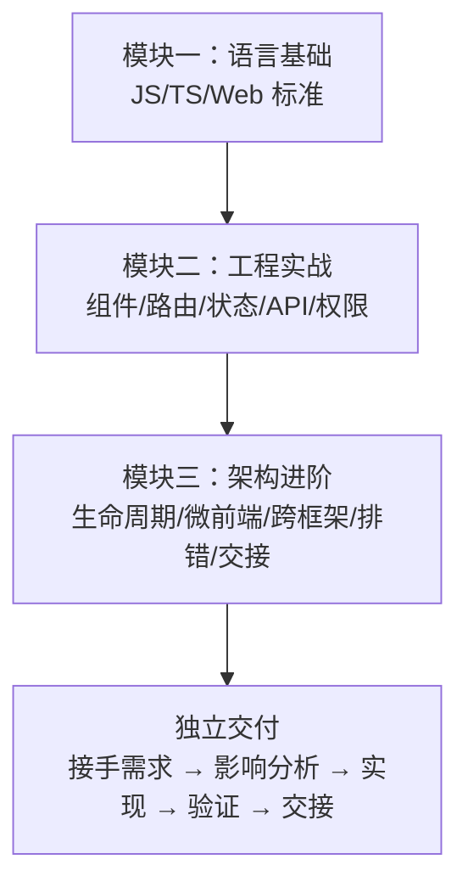

# 前端改动影响分析与开发交接

> 预计学习时间：120–160 分钟
> 一句话总结：能从 FBS 前端需求和 diff 判断影响的仓库、路由、组件、权限、翻译和构建配置——整理一份 reviewer 可复核的跨仓影响摘要、测试结果和开发交接清单。

## 这一章解决什么问题

模块二的最后一章（FE-W07）教你完成了一个完整的前端切片。但那是单仓库改动——你只需要考虑 SC Vue 一个仓库中的文件。真实的 FBS 前端需求很少只涉及一个仓库。改了一个 API 类型定义，Portal 和 SC React 都可能受影响；增了一个远端组件的 Props，两个宿主都要验证。

本章教你从需求出发，系统化地评估改动的影响范围。你会学会建立仓库地图、判断影响面、加载仓库规则、分析实际 diff、选择准出检查，最后整理一份 reviewer 可以直接复核的开发交接材料。这套流程不只适用于大型改动——每个 MR 都可以用它来确保在提交之前已经想清楚了影响面。

> 本章基于三个前端仓库的 release 分支（2026-07-20）。

## 影响分析的思维框架

### 从需求出发的五问

接到一个 FBS 前端需求时，先问自己五个问题：

| 问题 | 目的 | 去哪里找答案 |
| --- | --- | --- |
| 这个功能在哪个页面上？ | 确定涉及哪个仓库 | 需求文档 + 浏览器 URL 反查路由 |
| 涉及哪些前端能力？ | 确定影响的代码模块 | 需求拆解 + 仓库代码搜索 |
| 影响哪些消费者？ | 确定跨仓影响 | 搜索组件的 import/require 引用 |
| 需要什么前置依赖？ | 确定阻塞项 | 后端接口、权限码、翻译 key |
| 怎么验证改对了？ | 建立验收标准 | 用例定义 + 自动化检查 |

### 影响分析的三个层次

| 层次 | 范围 | 典型改动 |
| --- | --- | --- |
| **本文件** | 修改的单个文件 | 组件内部状态调整、样式修改 |
| **本仓** | 修改文件所在仓库的其他文件 | 组件 Props 变化影响的消费者、路由变化影响的导航 |
| **跨仓** | 其他前端仓库 | API 类型共享、远端组件 Props、翻译 key 共享 |

大多数改动只到"本仓"层。当改动涉及以下几类时，才需要做跨仓影响分析：

- 修改了 `src/api/*.js` 中的接口类型定义（Portal 和 SC 仓库可能共享接口定义或接口契约）。
- 修改了 SC React 远端组件的 Props（影响 Portal 的消费代码）。
- 新增或修改了共享常量（如权限码、枚举值）。
- 修改了 i18n key 的命名规则（影响所有仓库的翻译文件）。

## 仓库地图与影响定位

### 以入库功能为例的影响地图

假设需求是"为入库列表增加一个新的筛选字段"，以 SC Vue 为主仓库的影响分析：

| 影响级别 | 具体文件/仓库 | 改动类型 |
| --- | --- | --- |
| 本文件 | `src/views/inbound/IBT/list/searchForm.vue` | 新增筛选字段 |
| 本仓 | `src/api/inbound.js` | 确认参数传递方式（可能不需要修改） |
| 本仓 | `src/views/inbound/IBT/list/list.vue` | 如果需要新增列展示 |
| 跨仓 | Portal `src/views/InboundManagement/` | Portal 也有入库列表，可能需要同步改动 |
| 跨仓 | SC React 远端 InboundComponent | 如果远端组件提供了入库列表，需要同步 Props |
| 依赖 | 后端 API | 确认后端是否支持新筛选参数 |
| 依赖 | Transify 平台 | 新增翻译 key |

### 三种需求类型的典型影响面

**页面级改动**（新增页面、修改页面布局）：
- 影响面：路由、菜单、组件、权限、i18n。
- 跨仓：通常不影响——每个仓库的页面独立。

**能力级改动**（新增 API 函数、修改共享组件）：
- 影响面：API 类型定义、组件 Props、消费者代码。
- 跨仓：可能影响——通过搜索引用确定。

**基础设施级改动**（升级依赖、修改构建配置、调整 ESLint 规则）：
- 影响面：所有使用该依赖/配置的仓库。
- 跨仓：大概率影响——需要逐仓验证。

## 加载仓库规则

### 每个仓库的编码规则

在开始改代码之前，先读对应仓库的编码规则。三个仓库都有 `.agents/skills/coding/` 目录，包含以下主题的规则文件：

| 规则文件 | 作用 | 何时必读 |
| --- | --- | --- |
| `repo-guide-route-rule` | 路由注册约定 | 新增路由时 |
| `repo-guide-api-rule` | API 函数写法 | 新增 API 函数时 |
| `repo-guide-permission-rule` | 权限控制约定 | 新增权限控制时 |
| `repo-guide-i18n-rule` | 翻译 key 命名 | 新增文案时 |
| `repo-guide-store-rule` | Store 使用约定 | 新增状态时 |
| `repo-guide-component-library-rule` | 组件库使用约定 | 使用 EDS/SSC UI 时 |
| `repo-guide-pii-rule` | PII 数据处理 | 处理敏感数据时 |
| `repo-guide-time-rule` | 时间处理约定 | 处理日期时间时 |
| `repo-guide-file-operation-rule` | 文件操作约定 | 上传下载时 |

不要求全部读完——只读与当前改动相关的规则。如果改动涉及多个主题，读对应的规则文件即可。

### 仓库编码规则的优先级

当规则与直觉冲突时，**规则优先**。例如，你可能习惯用 `fetch` 发请求，但规则要求使用 `app.request.clone()`——遵守规则。仓库规则是团队经验的结晶，违反规则通常会导致隐蔽的 bug（如跨域问题、Cookie 缺失、监控断点）。

## 分析实际 diff

### 生成影响清单

在提交 MR 之前，用 `git diff` 生成改动文件列表，然后逐文件标注影响级别：

```bash
git diff --stat origin/release
```

对于每个修改的文件，回答三个问题：
1. 这个文件被谁 import/require？（用 `rg "import.*from.*文件名"` 反查）
2. 这个文件的修改改变了什么接口/类型/行为？
3. 这个改变是否向后兼容？

### 向后兼容性检查清单

| 改变 | 向后兼容？ | 如果不兼容，需要协调什么 |
| --- | :---: | --- |
| 新增可选 Props | 是 | 无需协调 |
| 新增必填 Props | 否 | 所有消费者都需要传入新 Props |
| 修改 Props 类型 | 否 | 所有消费者都需要更新类型 |
| 删除 Props | 否 | 所有消费者都需要移除该 Props |
| 修改 API URL | 否 | 后端路由同步调整 |
| 修改 API 响应字段名 | 否 | 所有消费者需要更新字段名 |
| 新增 export | 是 | 无需协调 |
| 修改 export 签名 | 否 | 所有 import 方需要更新 |

如果不兼容，在 MR 描述中明确标注为 **破坏性变更**，并列出受影响方。

## 准出检查与测试矩阵

### 按改动类型选择检查

| 改动类型 | lint | type-check | test | build |
| --- | :---: | :---: | :---: | :---: |
| 组件样式修改 | 必须 | — | — | — |
| 新增组件 | 必须 | 必须 | 建议 | — |
| 修改 API 类型 | 必须 | 必须 | 建议 | — |
| 新增路由 | 必须 | 必须 | — | 建议 |
| 新增依赖 | 必须 | 必须 | — | 必须 |
| 修改构建配置 | 必须 | 必须 | — | 必须 |

### 跨仓验证矩阵

当改动涉及跨仓影响时：

| 验证项 | Portal | SC Vue | SC React |
| --- | :---: | :---: | :---: |
| 页面正常渲染 | 如果影响 | 如果影响 | 如果影响 |
| API 请求正常 | 验证 | 验证 | 验证 |
| console 无新增 error | 验证 | 验证 | 验证 |
| 远端组件兼容 | 验证 | — | 验证 |
| i18n 正确 | 验证 | 验证 | 验证 |

## 开发交接材料

### MR 描述模板

每次提交 MR 时，按以下结构填写描述：

```markdown
## 改动目的
[一句话说明这个 MR 要解决什么问题]

## 改动范围
- [仓库名]：[修改的文件和原因]
- [如果是跨仓]：[列出受影响的仓库和改动类型]

## 影响分析
- [ ] 本仓影响：[列出影响的本仓文件]
- [ ] 跨仓影响：[列出影响的其他仓库] 或 [无]
- [ ] 破坏性变更：[是/否，如果是，列出详情]
- [ ] 权限变更：[是/否]
- [ ] i18n 变更：[是/否]
- [ ] API 契约变更：[是/否]

## 验证结果
- [ ] lint 通过
- [ ] type-check 通过
- [ ] 页面正常渲染
- [ ] console 无新增 error
- [ ] [如有跨仓] 受影响仓库验证通过

## 截图/录屏
[附上功能变更前后的截图对比]
```

### 给 reviewer 的信息

除了 MR 描述，以下信息也应在 MR 中提供：

1. **自测记录**：你在本地验证了什么、怎么验证的。
2. **已知限制**：哪些场景你没法测试（如特定地区、特定权限）。
3. **阻塞项**：如果 MR 依赖尚未上线的后端接口或 i18n 审批。

Reviewer 最怕的是"看起来没问题但我不确定你有没有测过"。越详细的自测记录，reviewer 越有信心 approve。

## 常见错误

### 在 MR 中贴完整 diff 但不说明影响

Reviewer 需要的是"这些改动影响了谁"，不是"这些文件改了"。如果 diff 超过 200 行，必须附影响分析。

### 跨仓改动只测了主仓库

改了远端组件后，只在 SC React 中测了，Portal 没测——这是最常见的跨仓遗漏。如果时间不够同时测两个宿主，至少在 MR 中标注"Portal 未验证，请 reviewer 关注"，而不是悄悄合并。

### 验收只验了正常路径

少了一个必填字段的校验、网络失败的降级、空列表的展示——这些边界情况才是 bug 的来源。至少验证：正常、空态、错误态、无权限态。

### MR 描述太简略

`"fix: update component"` 这样的 MR 描述对 reviewer 毫无帮助。描述应该回答：为什么改、改了什么、影响了谁、怎么验证的。

## 实际案例分析：跨仓需求的完整影响评估

### 案例场景

假设需求为"在入库列表（IR List）中增加一个'优先仓类型'筛选字段和对应列展示，字段名为 `priority_whs_type`"。这个功能需要在 SC Vue 实现，但 Portal 和 SC React 也有入库列表页面。

### 第一步：确定涉及页面和仓库

通过搜索三个仓库中的入库列表页面：

- SC Vue：`src/views/inbound/IBT/list/`
- Portal：`src/views/InboundManagement/InboundRequest/List`
- SC React：远端 `InboundComponent`

这三个页面都可能需要展示这个新字段，但本次需求可能只要求在 SC Vue 实现。分析时应明确标注"Portal 和 SC React 当前不做改动，但需确认未来如果同步时的影响"。

### 第二步：逐仓列出改动清单

**SC Vue（主仓库）**：

| 文件 | 改动 | 影响级别 |
| --- | --- | --- |
| `src/views/inbound/IBT/list/searchForm.vue` | 新增下拉选择组件 | 本文件 |
| `src/views/inbound/IBT/list/list.vue` | 新增表格列定义 | 本文件 |
| `src/api/inbound.js` | 确认参数传递（可能无需改动） | 本仓 |

**Portal（暂不改动）**：

| 文件 | 未来如需同步的改动 |
| --- | --- |
| `src/views/InboundManagement/InboundRequest/List/index.tsx` | 新增筛选字段和列 |
| `src/apis/inbound.ts` | 新增参数类型 |

**SC React（暂不改动）**：

| 文件 | 未来如需同步的改动 |
| --- | --- |
| `projects/fbs-sc-remote-component/src/InboundComponent/` | 新增 Props 和筛选字段 |

### 第三步：评估依赖项

| 依赖项 | 状态 | 应对 |
| --- | --- | --- |
| 后端 API 支持 `priority_whs_type` 参数 | 需确认 | 与后端对齐 API 文档，确认字段名和值类型 |
| 后端 API 响应包含 `priority_whs_type` 字段 | 需确认 | 确认响应结构 |
| Transify 翻译 key | 需新增 | `priorityWhsType`、选项 label 等 |
| 权限码 | 无需新增 | 复用现有入库列表查看权限 |

### 第四步：准出检查计划

| 检查 | SC Vue 验证结果 |
| --- | :---: |
| lint | 待验证 |
| type-check | 待验证 |
| 正常筛选 | 待验证 |
| 清除筛选 | 待验证 |
| 空结果 | 待验证 |
| console 无 error | 待验证 |
| Portal 不受影响 | 确认（未改动 Portal） |
| SC React 不受影响 | 确认（未改动 SC React） |


## 团队协作中的开发交接

### 何时需要正式交接

以下情况建议做正式的开发交接（不只是提交 MR）：

1. 跨仓库的大型需求——修改影响到两个以上仓库。
2. 新增了共享组件或修改了共享依赖。
3. 引入了新的技术方案（如新的状态管理方式、新的构建配置）。
4. 有破坏性变更——需要通知所有消费者同步更新。

### 交接材料清单

一套完整的开发交接材料应包括：

1. **需求文档链接**：PRD 或 TD 的原始需求。
2. **架构决策记录**：为什么选择这个技术方案而不是其他方案。
3. **MR 链接**：所有相关仓库的 MR。
4. **影响分析报告**：本章第六节的 MR 描述模板。
5. **自测记录**：验证了什么、怎么验证的、结果如何。
6. **已知问题**：有哪些场景未验证、有哪些暂时无法解决的问题。
7. **后续建议**：未来需要关注的技术债、即将废弃的旧代码、计划中的迁移步骤。

### 从"完成开发"到"完成交接"

很多前端开发者认为自己"完成了开发"就是"写完了代码 + 本地跑通了"。但在 FBS 的多仓库环境中，真正的"完成"包括：

1. 代码写完了。
2. 本仓验证过了（正常路径 + 边界路径）。
3. 跨仓影响分析过了。
4. MR 描述写清楚了。
5. 阻塞项标注了。
6. Reviewer 能够根据你的描述独立判断是否可以合并。

缺少最后两步的 MR 会增加 reviewer 的负担——他们需要自己推断影响面、自己猜测验证范围、自己判断遗留风险。这不是"懒得写"，这是把本属于开发者的分析工作转嫁给了 reviewer。


## 测试策略与验证矩阵

### 按风险等级分配测试工作量

| 风险等级 | 特征 | 测试深度 |
| --- | --- | --- |
| 低 | 样式微调、文案修改 | 目视检查 + lint |
| 中 | 组件逻辑修改、新增 API 调用 | 手动测试 + lint + type-check |
| 高 | 跨仓影响、破坏性变更、权限变更 | 手动测试 + lint + type-check + 双宿主验证 |
| 极高 | 基础设施变更（构建、依赖、路由框架） | 手动测试 + lint + type-check + 三仓全量回归 |

### 无法自动化的测试项

以下测试项目前无法自动化（或自动化成本很高），需要手动验证：

- MMF Dev Tools 注入后的页面行为。
- 不同权限账号下的页面变化。
- 不同语言下的翻译文案正确性。
- 不同时区下的时间显示。
- 远端组件在 Portal 和 MMF 中的渲染一致性。

在 MR 描述中明确标注哪些场景未自动化测试——让 reviewer 知道需要重点人工检查什么。


## 持续改进：从每次 MR 中积累

### 建立个人的影响分析模板

经过几次跨仓需求后，你会形成自己的影响分析直觉。把常用的检查项整理成模板：

```markdown
### 我的影响分析模板
- [ ] 搜索改动的函数/组件在三个仓库中的引用
- [ ] 检查 API 类型是否有消费者
- [ ] 检查 i18n key 是否需要同步
- [ ] 检查权限码是否需要新增
- [ ] 确认远端组件的 Props 兼容性
- [ ] 运行 lint + type-check
- [ ] 至少验证正常、空态、错误态三种路径
```

### 从 MR review 的反向反馈学习

当 reviewer 指出你漏掉了某项影响时，把它加入你的模板。几次 MR 之后，你的模板会逐渐覆盖所有常见的影响面——这比背任何"最佳实践"都有效。

### 影响分析不是一次性的

随着 FBS 代码库的演进，仓库之间的关系、组件的消费者、共享依赖的版本都可能变化。半年前某个改动的安全范围，今天可能不再安全。关键基础设施变更后，重新审视之前的影响分析假设。


## 从模块三结业到独立交付

### 模块三的能力总结

学完模块三的 6 章后，你应该获得了以下能力：

1. **架构理解**：能画出一张从 URL 到页面渲染的三仓加载链路图，标注每一层的关键对象和失败点。
2. **微前端判断**：能区分 Module Federation、qiankun、MMF 三种机制，知道什么时候用哪种。
3. **跨框架开发**：能在 React 组件中安全访问宿主 Vuex Store，理解依赖注入的原理和限制。
4. **质量保障**：能按 diff 范围选择正确的 lint/type-check/test/build 组合。
5. **系统化排错**：能用四层模型分层定位问题，先排除宿主再排网络最后排应用。
6. **影响分析**：能从需求出发评估跨仓影响，整理 reviewer 可复核的交接材料。

这六项能力合在一起，意味着你不再是一个"能在 Vue 中写组件"的前端开发者——你是能独立接手一个 FBS 前端需求、评估影响、完成实现、验证交付的全栈前端工程师。

### 从模块三到实际工作的过渡

模块一到模块三覆盖了从 JavaScript 语法到跨仓架构的完整前端知识链。但知识不等于经验。真正让你从"学会了"到"会做了"的，是在真实仓库中完成 5-10 个实际需求。每做一个需求，回顾本章的影响分析模板，检查自己是否漏掉了影响面。每次 MR 被 reviewer 发现遗漏时，把遗漏项加入你的个人模板。

### 模块一至模块三的核心知识链路



这三个模块不是各自独立的课程——它们是一条连贯的学习路径。模块一让你能读懂代码，模块二让你能写对代码，模块三让你能独立交付代码。三者缺一不可。


## 从全栈视角看影响分析

### 前后端联动的典型场景

作为全栈开发者，你需要同时考虑前端和后端的影响面。以下场景需要跨端协调：

1. **API 契约变更**：后端修改了接口的请求参数或响应字段 → 前端所有消费方需要同步。
2. **权限模型变更**：后端新增或调整了权限码 → 前端权限检查代码需要更新。
3. **业务流程变更**：入库流程的某个步骤被移除 → 前端该步骤的页面/组件需要下线。

### 前后端交接的沟通要点

与后端同事交接时，带上以下信息能让沟通更高效：

1. 前端目前使用的接口列表（从 `src/api/` 目录中提取）。
2. 前端消费的字段清单（从组件中的数据绑定提取）。
3. 前端期望的响应格式（retcode 约定、分页格式、时间格式）。

"后端改了接口，前端崩了"通常是沟通问题，不是技术问题。在接口设计阶段就对齐契约，比上线后发现不兼容再修要好得多。


## 练习答案与自测

### 本章自测题

1. 修改了 SC Vue 的 API 函数 `getRequestList` 的参数类型。影响范围包括哪些？
2. 远端组件的 Props 新增了一个必填字段。Portal 侧需要做什么？
3. 一个 MR 的 diff 包含 15 个文件，其中 3 个是构建配置文件的修改。MR 描述中至少应该包含哪些信息？
4. 跨仓改动的验证至少应该在几个宿主中完成？

### 参考答案

1. 本仓影响：所有调用 `getRequestList` 的页面需要更新参数。跨仓影响：如果后端接口是同一个，Portal 的对应 API 函数也需要同步。
2. Portal 消费该远端组件的代码需要传入新的必填 Props，否则 TypeScript 会报编译错误。
3. 改动目的、修改的文件和原因、影响分析（本仓/跨仓/破坏性变更）、验证结果（lint/type-check/页面行为）、截图对比。
4. Portal 和 MMF 两个宿主都需要验证（如果远端组件被两个宿主消费）。


## 回顾与展望

模块三的六章构成了 FBS 前端学习的最高台阶。从理解三种应用的生命周期，到驾驭微前端和跨框架开发，再到系统化排错和规范化交付——你现在具备了独立接手一个完整 FBS 前端需求的能力。下一阶段，你将把视角从前端延伸到后端：Go 语言的语法和标准库、Chassis 框架的 HTTP 开发模型、数据库操作、异步任务和消息系统。前端积累的思维框架——分层排查、影响分析、契约先行——在后端学习中同样适用。区别只是换了语言、换了工具，底层的工程思维一脉相承。

影响分析不是负担——它是让你在合并之前就发现问题的习惯，而不是在合并之后修 bug 的代价。每一次 MR 都认真做完这五步，你会发现自己踩坑的次数越来越少的。

总结：影响分析不是让你多写文档——是让你在写完代码之后、提交 MR 之前，停下来想一想：我改的这几行代码，会影响谁？每次 MR 都问自己这个问题，长期下来你会发现自己写的代码越来越安全——不是因为变得畏手畏脚，而是因为你对 FBS 代码库的理解更深入了。
影响分析是习惯，不是负担。

## 练习

### 影响分析

假设需求：为 Portal 的入库列表增加"批量导出 Excel"功能。写出完整的影响分析报告，包括本仓影响、跨仓影响、依赖项和验证计划。

### 向后兼容判断

以下改动哪些是向后兼容的？

a) 给 API 函数的参数类型新增一个可选字段。
b) 将组件的 Props `size: string` 改为 `size: 'small' | 'medium' | 'large'`。
c) 删除了一个已 export 的工具函数。
d) 修改了 request wrapper 的 `baseURL`。

### 填写 MR 描述

为你最近一次 FBS 前端改动（或假设一次改动）填写完整的 MR 描述模板。

### 综合练习参考答案

**8.2**：a) 兼容（新增可选字段不影响现有调用）。b) 不兼容（限制了允许的值范围，现有传入超出范围的值会报错）。c) 不兼容（import 方会报模块找不到）。d) 不兼容（所有 API 请求的 URL 都会变化）。

## 自检

1. 影响分析的三个层次（本仓、跨仓、破坏性变更）分别覆盖什么范围？为什么不能只分析本仓？

2. MR 描述中必须包含哪些信息？为什么 reviewer 需要这些信息而不只是看 diff？

3. 准出检查的选择依据是什么？一个只改了样式的改动和一个新增了路由的改动，各自的检查策略有什么不同？

4. 跨仓改动的验收矩阵应该覆盖哪些仓库和哪些宿主？为什么 Portal 和 MMF 两个宿主都需要验证？

5. 从"完成开发"到"完成交接"的差异是什么？交接材料中最容易被遗漏的是哪类信息？

## 参考文献
- 模块二 FE-W07（前端纵向切片）
- Portal `.agents/skills/coding/`
- SC Vue `.agents/skills/coding/`
- SC React `.agents/skills/coding/`