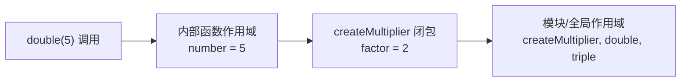
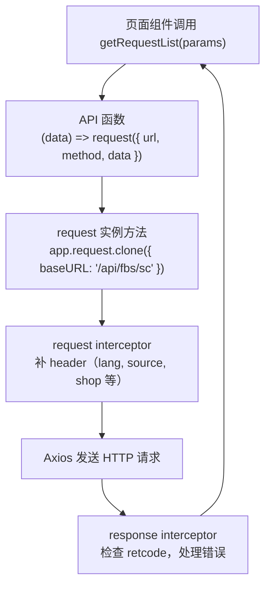

# 函数、作用域、闭包与模块：跟上组件外的调用链

> 预计学习时间：100–140 分钟
> 一句话总结：理解 JavaScript 函数是一等值、词法作用域决定变量可见性、闭包捕获外部变量、ES Module 组织代码边界——从 FBS 的 API 工厂函数、Vuex action 和 React hook 中读懂组件外的调用链。

## 这一章解决什么问题

后端同学看前端代码时，经常低估函数本身的复杂度。在 Java 或 Go 中，函数（方法）有固定签名、不支持嵌套定义、没有闭包概念。但在 JavaScript 中，函数是一等值——可以赋值给变量、作为参数传递、从函数中返回、在任何地方创建。更关键的是，FBS 前端代码广泛使用函数来"制造"其他函数：`createApi` 接收 method 和 url，返回一个能发请求的函数；Vuex action 是一个函数，内部通过 `dispatch` 调用另一个 action；React hook 用闭包捕获组件的状态引用。

这一章不教你怎么用 React hooks 写完整组件，而是帮你建立读懂这一类代码的语言基础。学完后你会拿到三把钥匙：能拆解箭头函数和普通函数的差异，能画出闭包捕获外部变量的作用域图，能理解 `import/export` 如何把代码组织成模块边界。

> 示例来自三个前端仓库的 release 分支（2026-07-20）。实际开发时以当前工作树为准。

## 函数的三种写法：声明、表达式与箭头

### 函数声明：有名字，会提升

```javascript
function getRequestList(data) {
  return request({ url: '/inbound/request/list/', method: 'POST', data });
}
```

这是 FBS 代码中最传统的形式。`function` 关键字声明的函数会被"提升"：在当前作用域的任何位置都可以调用它，即使调用写在声明之前。但依赖提升会使代码阅读顺序混乱，现代 FBS 代码较少使用。

### 函数表达式：函数是值

```javascript
const handleErrorMsg = function(response) {
  const { error } = response;
  if (!error) {
    const { data = {} } = response;
    if (data?.retcode !== 0) {
      commonHandleAPIError(data);
    }
  }
  return response;
};
```

函数表达式把函数当作值赋给变量。它不会提升——必须先定义再使用。在 FBS 的 `request.js` 中，response interceptor 的回调就是典型的函数表达式。

### 箭头函数：简洁，没有自己的 `this`

```javascript
export const getRequestList = (data = {}) => request({
  url: '/inbound/request/list/',
  method: 'POST',
  data,
});
```

箭头函数在 FBS 代码中占绝大多数。它的几个特点：

- 省略 `function` 关键字，`=>` 左边是参数，右边是函数体。
- 如果函数体只有一条表达式，可以省略 `{}` 和 `return`（隐式返回）。
- 如果只有一个参数，可以省略参数括号。
- **没有自己的 `this`**——箭头函数里的 `this` 来自定义它的外层作用域。在 FBS 的 Vue 组件和 React 类组件中，这一点决定了很多回调的写法。

对比以下两种写法：

```javascript
// 普通函数：this 取决于调用方式
const obj = {
  name: 'FBS',
  sayName: function() { console.log(this.name); }
};
obj.sayName(); // 'FBS'

// 箭头函数：this 来自外层作用域（此处为全局/模块作用域）
const obj2 = {
  name: 'FBS',
  sayName: () => { console.log(this.name); }
};
obj2.sayName(); // undefined —— this 指向外层，不是 obj2
```

在 FBS 代码中，Vue 组件的 `methods` 和 React 类组件的实例方法不能用箭头函数定义，因为需要 `this` 指向当前组件实例。但作为回调传给 `map`、`filter`、`some` 等数组方法时，箭头函数因其简洁和词法 `this` 而成为标准写法。

## 参数：默认值、解构与 rest

### 默认参数

```javascript
function getRequestList(data = {}) {
  // 如果调用时不传 data 或传 undefined，data 的值为 {}
}
```

默认参数在 FBS 的 API 函数中几乎无处不在。`(data = {})` 确保即使调用方忘记传参数，函数内部也不会因为访问 `data.xxx` 而崩溃。

默认参数只在实参为 `undefined` 时生效。传入 `null` 不会触发默认值：

```javascript
getRequestList(null);  // data 是 null，不是 {}
```

### 解构参数

```javascript
// 从对象参数中提取特定字段
const handleErrorMsg = (response) => {
  const { error, data = {}, config = {} } = response;
  // 等价于：
  // const error = response.error;
  // const data = response.data !== undefined ? response.data : {};
};
```

解构配合默认值是 FBS 代码的常见模式。它比逐行 `.` 访问更紧凑，并且可以在一行内为缺失的属性提供默认值。

更深层的解构也常见：

```javascript
const getCurrentShop = () => {
  return app.vue3VuexStore.getters['FBS_STORE/Shop/currentShop'];
};
const { fbsWhsRegion, fbsShopId } = getCurrentShop();
```

### Rest 参数 `...`

```javascript
function logAll(prefix, ...args) {
  console.log(prefix, ...args);  // args 是真正的数组，包含剩余所有参数
}
```

`...` 在函数参数位置收集剩余参数为一个真正的数组。FBS 代码中常用于包装函数的参数转发。

注意区分 `...` 的三种用法：在参数位置是 rest（收集），在数组/对象字面量中是 spread（展开），在函数调用中是 spread（展开参数）。

## 函数是一等值：回调、高阶函数与工厂

### 函数可以作为参数传递

这是 FBS 代码中最常见的函数使用模式之一——回调：

```javascript
[request, piiRequest, blobRequest].forEach(itemRequest => {
  itemRequest.interceptors.request.use(function(config) {
    config.headers['lang-id'] = app.user.language;
    return config;
  });
});
```

`forEach` 接收一个函数作为参数，用它处理数组中的每个元素。`interceptors.request.use` 同样接收一个函数——这里就是回调模式。理解回调的关键是：调用它的代码（Axios 拦截器）决定何时调用以及传什么参数；你只需要定义被调用时的行为。

### 高阶函数：返回函数的函数

Portal 仓库的 `createApi` 是 FBS 代码中最高阶的函数模式之一：

```javascript
export const createApi = (method, url, configs) => {
  return (params, configParams = {}) => {
    const requestFn = request[lowerCase(method)];
    const requestParams = getRequestParams(method, params);
    // ...返回 requestFn(url, ...)
  };
};
```

`createApi` 接收 method、url 和 configs，返回一个新的函数。这个返回的函数"记住"了 method 和 url——这就是闭包（下一节详解）。调用方只需要传入 params 就能发起请求：

```javascript
const apiGetConfigInfo = createApi('GET', '/portal/inbound/config/get');
// apiGetConfigInfo 现在是 (params) => request.get('/portal/inbound/config/get', { params })
```

高阶函数在 FBS 中的价值是消除重复。不用在每个 API 定义里重复写 method 判断、参数位置选择、请求实例选择等逻辑。`createApi` 把"如何创建 API 调用"封装为函数工厂，每个具体的 API 定义只需传入差异化的三个参数。

### 箭头函数的隐式返回

```javascript
// 有花括号：需要显式 return
const fn1 = (x) => { return x * 2; };

// 无花括号：隐式返回表达式结果
const fn2 = (x) => x * 2;

// 返回对象字面量时需要加括号，否则花括号被解析为函数体
const fn3 = (x) => ({ value: x });  // 正确
const fn4 = (x) => { value: x };    // 错误：value 被当作 label 语句
```

## 词法作用域与闭包

### 作用域决定变量在哪里可见

JavaScript 使用词法（静态）作用域：变量的可见性由代码写在哪里决定，不由运行时调用栈决定。

```javascript
const baseURL = '/api/fbs/sc';  // 模块作用域

export const request = app.request.clone({ baseURL });

[request, piiRequest].forEach(itemRequest => {
  itemRequest.interceptors.request.use(function(config) {
    config.headers['fbs-sc-source'] = getFbsScSource(); // getFbsScSource 来自模块作用域
    return config;
  });
});
```

变量查找顺序：当前函数作用域 → 外层函数作用域 → ... → 模块作用域 → 全局作用域。`request.js` 中的拦截器函数内部可以访问 `app`、`getFbsScSource`、`utils` 等所有模块顶层的变量——不是因为有特殊语法，而是因为它们都在外层作用域中声明。

### 闭包：函数记住它被创建时的作用域

闭包是 JavaScript 中最强大的特性之一。简单来说：一个函数内部定义的函数，可以访问外部函数的变量，即使外部函数已经返回。

从 Portal 的 `createApi` 中提取一个最小模型：

```javascript
function createMultiplier(factor) {
  return function(number) {
    return number * factor;  // factor 被"捕获"了
  };
}

const double = createMultiplier(2);
const triple = createMultiplier(3);
console.log(double(5));  // 10 —— factor=2 的闭包仍在工作
console.log(triple(5));  // 15 —— factor=3 的闭包独立存在
```

`createMultiplier(2)` 返回了一个新函数。当这个返回的函数在别处被调用时，它仍然能访问 `factor`——尽管 `createMultiplier` 的调用早已结束。这是因为 JavaScript 函数在创建时会捕获整个外层作用域链，不是捕获那一刻的变量值。

以下图表示 `double` 被调用时的作用域链：



### 闭包在 FBS 中的实际应用

**API 工厂**：`createApi('GET', url)` 返回的函数闭包捕获了 `method` 和 `url`。这就是为什么 `apiGetConfigInfo(params)` 不用每次都传 method 和 url——它们已经"封存"在闭包里了。

**Vuex action**：action 函数通过闭包访问 `commit`、`dispatch`、`state` 等参数，不需要每次调用都传入：

```javascript
// 简化自 FBS Vuex action 模式
async function fetchInboundList({ commit, state }, params) {
  commit('SET_LOADING', true);
  const data = await getRequestList({ ...state.filter, ...params });
  commit('SET_LIST', data);
  commit('SET_LOADING', false);
}
```

**React hook**：`useState` 和 `useEffect` 依赖闭包保持对组件状态的引用：

```javascript
function InboundPage() {
  const [list, setList] = useState([]);
  useEffect(() => {
    getRequestList({ status: 'PENDING' }).then(data => setList(data));
  }, []); // 空依赖数组意味着只在组件挂载时执行一次
  // useEffect 的回调闭包捕获了 setList
}
```

### 闭包常见陷阱：循环中的 `var`

FBS 代码中使用 `const`/`let`，已经避免了经典闭包陷阱。但如果看到旧的 ES5 代码用 `var` 在循环中创建函数，要注意：

```javascript
// 陷阱（旧代码中可能出现）
for (var i = 0; i < 3; i++) {
  setTimeout(function() { console.log(i); }, 100);
}
// 输出：3, 3, 3 —— 所有回调共享同一个 i

// 现代修复：用 let
for (let i = 0; i < 3; i++) {
  setTimeout(() => console.log(i), 100);
}
// 输出：0, 1, 2 —— 每次迭代有独立的 i
```

`let` 在 `for` 循环头中会为每次迭代创建新的绑定，所以每个回调捕获的是各自的 `i` 值。这是 `let` 与 `var` 在作用域上的关键差异。

## ES Module：导出与导入

### 默认导出与具名导出

三个 FBS 前端仓库统一使用 ES Module（`import`/`export`）组织代码。一个模块可以有两种导出：

```javascript
// fbs-sc-vue/src/api/inbound.js
import { request } from '../utils/request'; // 具名导入

export function getRequestList(data = {}) {   // 具名导出
  return request({ url: '/inbound/request/list/', method: 'POST', data });
}

export default function setupInbound() {       // 默认导出（每个模块最多一个）
  // ...
}
```

对应的导入：

```javascript
import setupInbound, { getRequestList } from './inbound';
//     ↑ 默认导入       ↑ 具名导入（解构语法）
```

### 模块的"静态"特性

ES Module 的导入导出在代码执行前就已经确定。这带来了两个重要后果：

第一，`import` 语句不能放在条件分支或函数内部。`import()` 动态导入可以，但返回的是 Promise。

第二，导出的是"活绑定"——导入方看到的是导出方的最新值，不是快照。这个特性在 FBS 中主要用于 Vuex Store 模块和常量导出。

```javascript
// constants.js
export let count = 0;
export function increment() { count++; }

// main.js
import { count, increment } from './constants.js';
console.log(count); // 0
increment();
console.log(count); // 1 —— 看到了最新值
```

### 重命名导入

```javascript
import { request as scRequest } from './sc-request';
import { request as portalRequest } from './portal-request';
```

FBS 代码中重命名主要用于避免命名冲突。如 `utils/request.js` 导出的 `request` 与组件内部定义的 `request` 不同时。

### 聚合导出（barrel export）

FBS 代码常用 barrel export 简化导入路径：

```javascript
// src/api/index.js
export { getRequestList, getPickupInfo } from './inbound';
export { getProductList } from './product';
```

使用方只需：

```javascript
import { getRequestList, getProductList } from '../api';
```

这在 Portal 的 `src/apis/` 和 Vue 的 `src/api/` 中很常见。

## 在仓库中阅读函数调用链

### 六.1 从 `getRequestList` 向外追踪

以 SC Vue 入库列表为例，函数调用链如下：



每一步的"函数作为值被传递"：

- 步骤 A→B：页面把 params 传给 API 函数。
- 步骤 B→C：API 函数内部调用了 `request({...})`——这里 `request` 是一个被宿主包装过的 Axios 实例，本质上也源自函数调用。
- 步骤 C→D：request interceptor 是在 `forEach` 循环中注册的回调函数，它通过闭包访问 `app`、`getFbsScSource` 等模块级变量。
- 步骤 E→F：response interceptor 同样是注册的回调，处理 Axios 返回的 response 对象。

### 六.2 Portal 的 `createApi` 工厂链

从 Portal 的 `src/apis/inbound.ts` 阅读：

```javascript
export const apiGetConfigInfo = createApi('GET', '/portal/inbound/config/get');
```

理解这一行需要拆解两次闭包：

1. `createApi('GET', '/portal/inbound/config/get')` 在模块加载时执行，返回 `(params) => request.get('/portal/inbound/config/get', { params })`。
2. 页面调用 `apiGetConfigInfo({ region: 'br' })` 时，这个返回的函数执行，method 和 url 来自闭包。

这就是为什么一个两行的 API 定义能包含 method 选择、参数位置适配、请求实例选择等全套逻辑——工厂函数通过闭包把复杂逻辑封装了一次，每个 API 定义只暴露差异。

## 常见错误与修正

### 箭头函数的隐式返回导致对象字面量语法错误

```javascript
// 错误：花括号被解析为函数体
const createConfig = (base) => { baseURL: base };
// createConfig('/api') 返回 undefined

// 正确：用括号包裹对象字面量
const createConfig = (base) => ({ baseURL: base });
```

### 忘记闭包捕获的是变量引用而非快照

```javascript
function createCounters() {
  const result = [];
  for (var i = 0; i < 3; i++) {
    result.push(() => i);
  }
  return result;
}
const counters = createCounters();
console.log(counters[0]()); // 3，不是 0！
```

现代写法用 `let` 或 `forEach` 替代 `var` + `for` 循环可以避免。

### `this` 在回调中丢失

```javascript
class RequestManager {
  constructor() { this.baseURL = '/api'; }
  setup() {
    // 错误：普通函数中 this 取决于调用方式
    setTimeout(function() { console.log(this.baseURL); }, 100);
    // 正确：箭头函数保持 this
    setTimeout(() => { console.log(this.baseURL); }, 100);
  }
}
```

FBS 的 React 类组件中如果使用了传统类写法，需要特别注意这一点。好消息是三个 FBS 前端仓库都在向函数组件 + hooks 迁移。

### 模块导入未使用的变量

ES Module 的静态特性意味着构建工具（Webpack、Rspack）可以做 tree-shaking——移除未被使用的导出。但要注意副作用导入：

```javascript
import './init';  // 只执行模块的顶层代码，不导入任何值
```

这种写法在 FBS 代码中用于注册全局拦截器、初始化监控等场景。删除这类导入时要确认模块的副作用确实是需要的。

## 练习

### 作用域图

画出以下代码执行到 `console.log(url)` 时，所有变量的作用域链和可见性：

```javascript
// request.js
const baseURL = '/api/fbs/sc';
function createRequest() {
  const instanceId = Math.random();
  return function(config) {
    const fullURL = baseURL + config.url;
    console.log(fullURL, instanceId);
  };
}
const request = createRequest();
request({ url: '/inbound/list/' });
```

### 闭包改写

将以下重复代码改写为一个工厂函数，用闭包消除重复：

```javascript
const getInboundList = (params) => request({ url: '/inbound/list/', method: 'GET', params });
const getProductList = (params) => request({ url: '/product/list/', method: 'GET', params });
const getShopList = (params) => request({ url: '/shop/list/', method: 'GET', params });
```

### 预测 `this`

```javascript
const handler = {
  name: 'inbound',
  fetch: function() { console.log(this.name); },
  fetchArrow: () => { console.log(this.name); }
};

handler.fetch();          // ?
const f = handler.fetch;
f();                      // ?
handler.fetchArrow();     // ?
```

### 参考答案

**8.1** `fullURL` 在当前匿名函数作用域，`baseURL` 来自模块作用域（闭包捕获），`instanceId` 来自 `createRequest` 函数作用域（闭包捕获），`config.url` 来自参数。所有闭包变量在 `createRequest()` 返回后仍可访问。

**8.2** 参考实现：
```javascript
const createGetApi = (url) => (params) => request({ url, method: 'GET', params });
const getInboundList = createGetApi('/inbound/list/');
const getProductList = createGetApi('/product/list/');
const getShopList = createGetApi('/shop/list/');
```

**8.3** `handler.fetch()` 输出 `'inbound'`（方法调用，`this` 指向 `handler`）。`f()` 输出 `undefined`（普通函数调用，`this` 在非严格模式下指向全局对象，在严格模式和模块中为 `undefined`）。`handler.fetchArrow()` 输出 `undefined`（箭头函数的 `this` 来自定义时的外层作用域，即模块作用域）。

## 参考文献

- [MDN Functions Guide](https://developer.mozilla.org/en-US/docs/Web/JavaScript/Guide/Functions) — 函数声明、表达式、参数与闭包
- [MDN Arrow function expressions](https://developer.mozilla.org/en-US/docs/Web/JavaScript/Reference/Functions/Arrow_functions) — 箭头函数的语法与 `this` 行为
- [MDN import](https://developer.mozilla.org/en-US/docs/Web/JavaScript/Reference/Statements/import) — ES Module 导入语法
- [MDN export](https://developer.mozilla.org/en-US/docs/Web/JavaScript/Reference/Statements/export) — ES Module 导出语法
- [MDN Closures](https://developer.mozilla.org/en-US/docs/Web/JavaScript/Closures) — 闭包概念与示例
- [ECMAScript Specification — Function Objects](https://tc39.es/ecma262/#sec-terms-and-definitions-function) — 函数的规范定义
