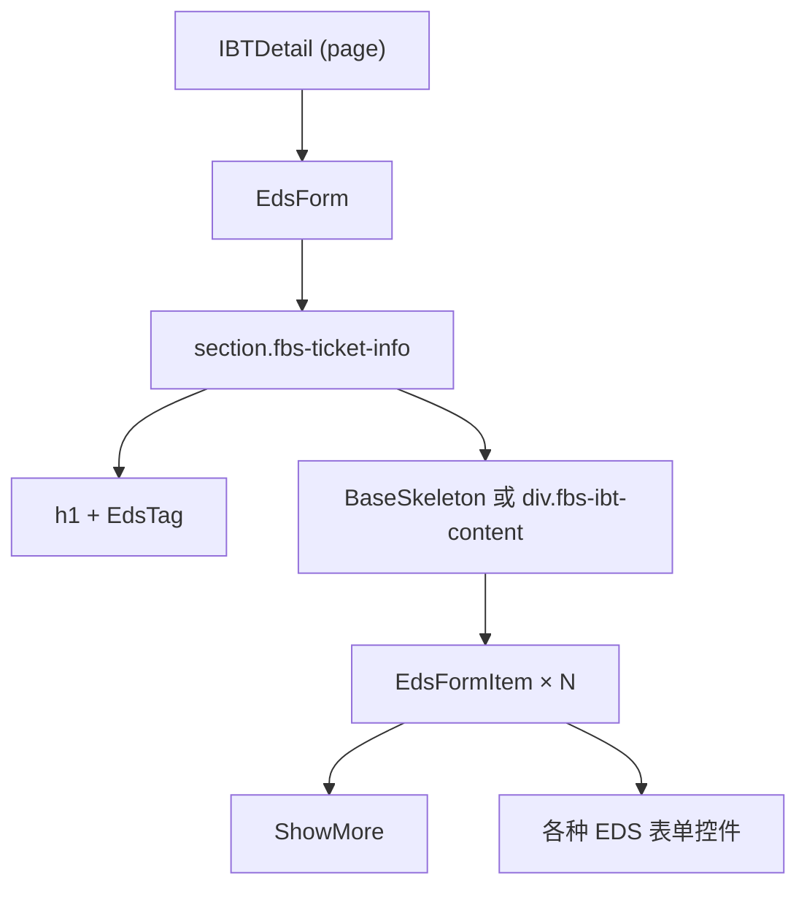

# 组件、样式、表单与表格：按现有组件库做页面

> 预计学习时间：110–150 分钟
> 一句话总结：能在 FBS 的 React 16、Vue 3 或 React 18 项目中拆解组件树、传递 Props/Emits、处理表单事件，并优先复用 EDS/SSC UI 组件库——交付一个符合仓库模式的带校验字段小组件。

## 这一章解决什么问题

后端研发看前端页面时，常把整个页面当成一个巨大的"模板文件"。但实际上，FBS 的前端页面由多层组件嵌套组成：最外层是布局容器、中间是业务区块、最内层是表单控件和表格单元格。每一层都有自己接收的数据（Props）、自己的状态、自己发出的事件。

本章的核心不是讲 React 或 Vue 的组件原理，而是帮你上手 FBS 仓库中实际出现的模式：怎么把一个需求拆成组件，怎么复用仓库里已有的 EDS Button、SSC Table 而不是从零写 `<div>`，怎么在 Vue template 的 `v-model` 和 React 的 `useState` 之间切换，以及样式该放在 `scoped` 还是 `CSS Modules` 里。

学完本章后，你不会成为组件设计专家，但你会在看到入库列表页面时，能说出哪个部分是哪个组件，数据从哪里进来，事件从哪里出去，并且能照现有模式增加一个带校验的表单字段。

> 本章基于三个前端仓库的 release 分支（2026-07-20）。组件库版本、API 和样式约定以仓库当前代码为准。

## 识别现有页面中的组件树

以 SC Vue 的 IBT（Inbound Problem Ticket）详情页为例。打开 `fbs-sc-vue/src/views/inbound/IBT/detail/index.vue`，你会看到如下结构（已做精简标注）：

```vue
<template>
  <div class="fbs-ibt-detail">
    <EdsForm :model="form" :rules="formRules">
      <section class="fbs-ticket-info">
        <h1 class="fbs-ibt-title">
          <span>{{ $t('inboundProblemId') }}: {{ id }}</span>
          <EdsTag v-if="urgentStatus" status="error">
            {{ $t('commonUrgent') }}
          </EdsTag>
        </h1>
        <div class="fbs-ibt-content">
          <BaseSkeleton v-if="dataLoading" :line="3" />
          <template v-else>
            <EdsFormItem :label="$t('commonRequestId')">
              <ShowMore :list="requestIds" @jump="jumpToRequest" />
            </EdsFormItem>
          </template>
        </div>
      </section>
    </EdsForm>
  </div>
</template>
```

它的组件树可以画成：



你需要学会的阅读方式：**不要从上往下按行读，而是按缩进识别组件边界**。`<EdsForm>` 开始到 `</EdsForm>` 结束是一个组件实例。它的子节点中的 `EdsTag`、`EdsFormItem`、`BaseSkeleton` 是子组件。`ShowMore` 是业务组件（来自本仓库 `src/views/` 而非组件库）。

### 区分三种组件来源

FBS 页面中出现的标签通常来自三类来源，学会区分它们是对页面做出改动的第一步：

| 来源 | 前缀/特征 | 示例 | 修改方式 |
| --- | --- | --- | --- |
| EDS/SSC UI 组件库 | `Eds` 或 `Ssc` 前缀 | `<EdsButton>`、`<EdsForm>`、`<SscTable>` | 查组件库文档，不修改组件源码 |
| 业务组件 | 无前缀，来自 `@/components` 或 `../` | `<ShowMore>`、`<InboundRow>` | 可以修改，但需确认影响范围 |
| HTML 原生元素 | 纯小写标签 | `<div>`、`<span>`、`<section>` | 按标准 HTML 处理 |

写新页面时，优先使用 EDS/SSC UI 组件库中的控件，而不是从零搭建 `<div>` + CSS。组件库提供了统一的交互、无障碍和主题适配。FBS Portal 和 SC Vue/React 使用同一套 EDS 组件库（各自版本可能略有差异），但 Portal 有独立的上层封装（`@/components/` 下）。

## Props 与 Emits：组件之间的数据契约

### Vue：Props 向下，Emits 向上

Vue 组件的数据流是单向的。父组件通过 Props 向子组件传递数据，子组件通过 Emits 向父组件发送事件：

```vue
<!-- 父组件 -->
<EdsTag :status="status.type" />
<ShowMore :list="requestIds" @jump="jumpToRequest" />
```

- `:status="status.type"`：冒号前缀是 `v-bind` 的简写，表示把 JavaScript 表达式 `status.type` 的值绑定到 Props `status`。
- `@jump="jumpToRequest"`：`@` 是 `v-on` 的简写，表示监听子组件发出的 `jump` 事件，并用父组件的 `jumpToRequest` 方法处理。

### React：Props 向下，回调函数向上

React 没有 Emits 机制，子组件通过 Props 接收的回调函数通知父组件：

```jsx
// 父组件
<InboundRow data={item} onStatusChange={handleStatusChange} />

// 子组件内部
function InboundRow({ data, onStatusChange }) {
  return (
    <tr onClick={() => onStatusChange(data.id)}>
      <td>{data.status}</td>
    </tr>
  );
}
```

`onStatusChange` 是一等公民的函数，当作 Props 传入。这和 Vue 的 `@jump` 在语义上等价，但 React 中它没有特殊的语法——就是一个普通的 Props。

### 不要在子组件中修改 Props

无论是 Vue 还是 React，Props 是只读的。如果你需要在子组件中编辑数据，把数据复制到子组件的局部状态中（`data()` 或 `useState`），修改完成后通过 Emit 或回调通知父组件更新原始数据。

```vue
<!-- Vue：v-model 是修改 Props 的常见错误 -->
<!-- 错误 -->
<InboundRow v-model="props.item.status" />
<!-- 正确 -->
<InboundRow :status="props.item.status" @update:status="handleStatusChange" />
```

## 表单、校验与双向绑定

### Vue 表单：`v-model` + EDS 组件

FBS Vue 仓库中，表单使用 `EdsForm` + `EdsFormItem` + `v-model`：

```vue
<template>
  <EdsForm :model="form" :rules="formRules" ref="formRef">
    <EdsFormItem label="IR ID" prop="irId">
      <EdsInput v-model="form.irId" />
    </EdsFormItem>
    <EdsFormItem label="状态" prop="status">
      <EdsSelect v-model="form.status" :options="statusOptions" />
    </EdsFormItem>
  </EdsForm>
</template>

<script lang="ts">
export default defineComponent({
  data() {
    return {
      form: { irId: '', status: '' },
      formRules: {
        irId: [{ required: true, message: '请输入 IR ID' }],
        status: [{ required: true, message: '请选择状态' }],
      },
    };
  },
});
</script>
```

`v-model` 的双向绑定意味着：修改输入框 → `form.irId` 自动更新。但要注意，`v-model` 不能直接绑定 Props——它本质上会尝试修改绑定的值。如果 Props 来自父组件，使用 `:value` + `@input` 模式代替。

### React 表单：受控组件

React 中没有 `v-model`，表单值完全由 state 管理：

```jsx
function FilterForm({ onSearch }) {
  const [irId, setIrId] = useState('');
  const [status, setStatus] = useState('');

  const handleSubmit = () => {
    onSearch({ irId, status });
  };

  return (
    <div>
      <Input value={irId} onChange={e => setIrId(e.target.value)} placeholder="IR ID" />
      <Select value={status} onChange={setStatus} options={statusOptions} />
      <Button onClick={handleSubmit}>搜索</Button>
    </div>
  );
}
```

受控组件的模式是：`value={state}` + `onChange={setState}`。每个表单字段都需要独立的 state 和事件处理函数。这在字段多的表单中会产生大量重复代码，FBS Portal 中通常封装了 `useForm` 类 hook 来管理复杂表单状态。

### 校验时机

FBS 表单校验通常在两个时机触发：
- `blur`：字段失去焦点时校验单个字段。适合实时反馈。
- `submit`：提交时校验全部字段。适合最终把关。

EDS 组件库的 `EdsForm` 默认在 submit 时校验全部规则，可以在 Props 中配置校验时机。

## 组件库边界：只讲用得到的 API

FBS 前端统一使用 EDS（Enterprise Design System）作为基础组件库。SC 仓库在此基础上封装了 SSC UI。你不必通读组件库文档——以下是你在 FBS 页面中实际会高频遇到的组件：

| 组件 | 用途 | 在 FBS 页面中的典型位置 |
| --- | --- | --- |
| `EdsButton` | 操作按钮 | 表单提交、弹窗确认、列表操作列 |
| `EdsForm` / `EdsFormItem` | 表单容器和表单项 | 筛选栏、详情编辑、创建页面 |
| `EdsInput` / `EdsSelect` | 文本输入和下拉选择 | 筛选表单、编辑表单 |
| `EdsTag` | 状态标签 | 列表中的状态列、详情页状态标识 |
| `EdsTable` / `SscTable` | 数据表格 | 列表页、详情页的关联数据 |
| `EdsPagination` | 分页 | 列表页底部分页栏 |
| `EdsDialog` | 弹窗 | 确认操作、创建/编辑表单弹窗 |
| `EdsToast` / `message` | 消息提示 | 操作成功/失败反馈 |

每当你需要增加一个交互元素，先确认组件库是否已有对应组件，再确认仓库中是否已有使用样例（搜索组件名即可）。遵守这两步，能帮你避开绝大多数"写得能跑但不符合团队规范"的问题。

## 样式组织：Less、Scoped 与 CSS Modules

### Vue Scoped Style（SC Vue）

```vue
<style scoped lang="less">
.fbs-ibt-detail {
  padding: 16px;
  .fbs-ibt-title {
    display: flex;
    justify-content: space-between;
  }
}
</style>
```

`scoped` 确保这些 CSS 只作用于当前组件，不会泄漏到其他组件。Vue 通过为元素添加 `data-v-xxx` 属性实现隔离。`.fbs-ibt-title` 是 Less 的嵌套语法——编译后变成 `.fbs-ibt-detail .fbs-ibt-title`。

### CSS Modules（Portal、SC React）

```less
// InboundManagement.module.less
.filterBar {
  display: flex;
  gap: 16px;
}
```

```tsx
// 组件中引用
import styles from './InboundManagement.module.less';
<div className={styles.filterBar}>...</div>
```

CSS Modules 自动将类名编译为唯一标识（如 `filterBar_abc123`），实现样式隔离。和 Vue scoped 一样，你不必手动管理命名冲突。

### 什么时候用内联样式

React 中可以通过 `style` 属性设置内联样式（Vue 也有 `:style` 绑定），但在 FBS 仓库中这通常只用于动态值（如根据数据计算的颜色、宽度）。静态样式一律放在 `.less` 文件中：

```jsx
// 动态值用内联
<div style={{ width: `${progress}%` }} />

// 静态样式用 class
<div className={styles.progressBar} />
```

## 表格：数据展示的核心模式

FBS 的列表页大量使用 EDS Table 或 SSC Table。核心模式是：**列定义 + 数据源 = 表格**。

```vue
<!-- Vue 示例（简化） -->
<EdsTable :data="list" :columns="columns">
  <template #status="{ row }">
    <EdsTag :status="getStatusType(row.status)">
      {{ $t(row.status) }}
    </EdsTag>
  </template>
</EdsTable>

<script>
columns: [
  { prop: 'ir_id', label: 'IR ID', width: 120 },
  { prop: 'status', label: '状态', slot: 'status' },
  { prop: 'mtime', label: '更新时间', formatter: (row) => formatTime(row.mtime) },
]
</script>
```

表格中的自定义列通过 slot 实现（Vue）或 `render` 函数（React）。EDS Table 暴露的 slot/column API 在不同版本之间可能有差异——以仓库当前使用的版本为准，不依赖组件库最新文档。

## 空态、加载态与错误态

一个完整的组件不只是"正常数据时的展示"。FBS 页面中，每个列表和详情都必须处理三种状态：

| 状态 | 触发条件 | FBS 处理方式 |
| --- | --- | --- |
| 加载中 | API 请求未完成 | `v-if="loading"` 渲染 Skeleton 或 Spin |
| 空数据 | API 返回 `total: 0` 或 `list: []` | Empty 组件 + 引导文案 |
| 错误 | API 返回 `retcode !== 0` 或 HTTP 错误 | 错误提示 + 重试按钮 |

```vue
<BaseSkeleton v-if="dataLoading" :line="3" />
<EdsEmpty v-else-if="!list.length" :description="$t('noData')" />
<EdsTable v-else :data="list" />
```

三种状态缺一不可。后端的错误处理通常返回空列表或错误信息——前端需要在页面上把这两种情况区分开：空列表表示"没有符合条件的数据"，错误表示"数据获取失败"。它们对应的用户操作也不同（前者引导修改筛选条件，后者引导重试）。

## 在仓库中增加一个组件字段

现在把以上知识整合成一个实际任务。假设需求是：在入库问题列表（IBT List）的筛选栏中增加一个"紧急程度"下拉筛选。

### 找到目标页面

```bash
fbs-sc-vue/src/views/inbound/IBT/list/searchForm.vue
```

### 找到组件库中的下拉组件

搜索仓库中的 `EdsSelect` 使用样例：

```bash
rg "EdsSelect" fbs-sc-vue/src/views/inbound/ --context 3
```

### 增加字段

```vue
<!-- searchForm.vue 中新增 -->
<EdsFormItem :label="$t('ibtUrgency')" prop="urgency">
  <EdsSelect
    v-model="form.urgency"
    :options="urgencyOptions"
    :placeholder="$t('commonAll')"
    clearable
  />
</EdsFormItem>

<script>
// data 中新增
urgencyOptions: [
  { label: '紧急', value: 'URGENT' },
  { label: '普通', value: 'NORMAL' },
],
</script>
```

### 传递到列表请求

```javascript
// list.vue 中，筛选条件合并 urgency
const params = {
  ...searchForm,
  urgency: searchForm.urgency || undefined, // 不选时不传
};
this.fetchList(params);
```

### 验证

- 选择一个紧急程度，确认列表 API 请求中携带了 `urgency` 参数。
- 清除选择，确认 `urgency` 参数不再出现在请求中。
- 刷新页面，确认筛选条件保持（如果路由层做了 query 同步的话）。


### 组件组合模式：如何避免"上帝组件"

在 FBS 仓库中，你经常会看到一个页面组件承载了大量逻辑。但随着需求增长，一个组件超过 300 行后就会变得难以维护。FBS 推荐的拆分方式是：

1. **按区域拆分**：页面中的 header、filter bar、table、pagination 各自成组件。
2. **按职责拆分**：展示组件只接收 Props 并渲染，容器组件管理数据和逻辑。
3. **按复用拆分**：如果两个页面有相似的表单或列表，抽成共享组件。

如果你要在已有页面中新增功能，不一定需要马上拆分组件。但如果新增的代码让组件超过了 300 行，或者新增的功能与原有逻辑概念上独立（如新增一个弹窗、新增一个 tab），就应该考虑拆出独立组件。

### EDS 组件库版本差异

EDS 组件库在三个仓库中的版本可能不同。Portal 使用较早版本的 EDS（匹配 React 16），SC Vue 使用较新版本（匹配 Vue 3），SC React 使用最新版本（匹配 React 18）。同一组件在不同版本中的 API、Props 和 slot 名可能有差异。

以 `EdsTable` 为例：旧版本可能用 `columns` prop + `slot` 自定义列，新版本可能用 `columns` prop + `render` 函数。查组件库文档时注意选择与仓库实际版本匹配的文档，不要混用不同版本的 API。

验证方式：在仓库中搜索组件的实际使用样例，比看文档更可靠。`rg "EdsTable" --context 5` 能给出最准确的用法。

### 样式调优的实用技巧

在 FBS 仓库中做样式修改时：

- 先用浏览器 DevTools 的 Elements 面板定位目标元素的 class 和最终计算样式。
- 在 `.vue` 文件的 `<style scoped>` 或 `.module.less` 中修改，不要写全局样式（除非你明确需要影响多个组件）。
- 如果发现 EDS 组件的默认样式不满足需求，优先查看组件库是否暴露了样式相关的 Props（如 `size`、`type`、`theme`），而不是写 CSS 覆盖。
- 如果必须覆盖组件库样式，使用 `:deep()`（Vue scoped）或提高 CSS 选择器优先级，而不是 `!important`。

### 理解 Vue 的响应式限制

Vue 3 的响应式系统基于 Proxy，比 Vue 2 的 `Object.defineProperty` 更强大，但仍有一些边界需要注意：

- 直接给对象添加新属性不会触发响应式更新——使用 `reactive` 或确保属性在初始化时存在。
- 直接通过索引修改数组或修改 `length` 会触发更新（Vue 3 已修复 Vue 2 的这一问题）。
- `ref` 包装的值需要通过 `.value` 访问（在 `<script>` 中），但在 `<template>` 中自动解包。

FBS 仓库中使用 `data()` 选项 API 居多（而非 `setup()` + `ref`），所以响应式边界通常自动处理。如果看到使用了 Composition API（`setup()` 或 `<script setup>`），要注意 `ref` 的 `.value` 访问问题。

## 常见错误

### 直接 `<div>` 代替组件库控件

```html
<!-- 不推荐 -->
<div class="my-button" @click="handleClick">提交</div>
<!-- 推荐 -->
<EdsButton type="primary" @click="handleClick">提交</EdsButton>
```

EDS 组件库提供了统一的主题、加载态、禁用态、无障碍支持。手写 `<div>` 可能省了几秒钟，但会引入不一致的交互行为。

### 忘记空态和加载态

```vue
<!-- 不完整 -->
<EdsTable :data="list" />
<!-- 完整 -->
<BaseSkeleton v-if="loading" />
<EdsEmpty v-else-if="!list.length" />
<EdsTable v-else :data="list" />
```

### 修改 Props 而不是通知父组件

```vue
<!-- 错误 -->
props.item.status = 'DONE';
<!-- 正确 -->
emit('update:status', 'DONE');
```

### `v-for` 没有 `:key`

```vue
<!-- 错误 -->
<div v-for="item in list">{{ item.name }}</div>
<!-- 正确 -->
<div v-for="item in list" :key="item.id">{{ item.name }}</div>
```

## 练习

### 组件树识别

打开 `fbs-sc-vue/src/views/inbound/IBT/list/searchForm.vue`，画出组件树。标注每个组件来自 EDS/SSC UI 还是业务组件。

### 增加筛选字段

在不查看上面示例的情况下，在 searchForm 中增加一个"仓库区域"下拉筛选（字段名 `whsRegion`）。完成以下步骤：找到 EdsSelect 的用法样例 → 增加表单项 → 增加数据选项 → 合并到请求参数。

### Props 修复

以下代码存在 Props 修改问题，修复它：

```vue
<!-- 子组件 ProductItem.vue -->
<template>
  <EdsInput v-model="product.stock" />
</template>
<script>
export default {
  props: { product: Object },
};
</script>
```

### 参考答案

**10.3**：需要用 `:value` + `@input` 模式，或通过 emit 通知父组件修改。修正：

```vue
<template>
  <EdsInput :value="product.stock" @input="value => $emit('update:stock', value)" />
</template>
```

## 参考文献

- [React Learn — Your First Component](https://react.dev/learn/your-first-component)
- [React Learn — Passing Props to a Component](https://react.dev/learn/passing-props-to-a-component)
- [Vue 3 Guide — Components Basics](https://vuejs.org/guide/essentials/component-basics.html)
- [Vue 3 Guide — Props](https://vuejs.org/guide/components/props.html)
- [Vue 3 Guide — Component Events](https://vuejs.org/guide/components/events.html)
- [MDN CSS Modules](https://developer.mozilla.org/en-US/docs/Web/CSS/CSS_modules) — CSS Modules 概述
