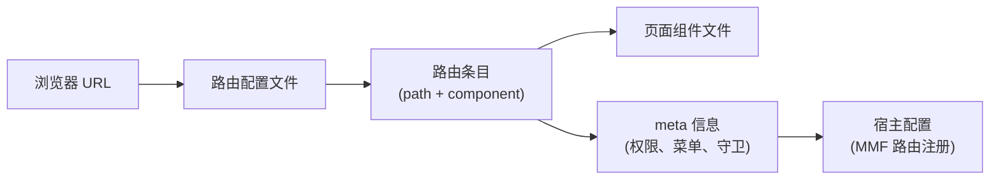

# 路由、菜单与页面入口：让页面真正可访问

> 预计学习时间：110–150 分钟
> 一句话总结：能在 FBS 三个前端仓库中从浏览器 URL 反查路由定义、找到页面入口、理解菜单与权限的关系——完成一个不破坏宿主的新路由注册并验证直达、刷新和无权限三种路径。

## 这一章解决什么问题

后端同学第一次在 FBS 前端新增页面时，最常见的困惑是："我写了一个 `.vue` 文件，但在浏览器里打不开。"这是因为页面不是自动可访问的——它需要在路由配置中注册，路由又需要关联菜单项或权限码，而权限码又可能受宿主（Seller Center）控制。

FBS 的三个前端仓库各自有不同的路由机制：Portal 用 React Router 5 的文件式路由定义，SC Vue 用 MMF 路由数组 + `beforeEnter` 守卫，SC React 用 `registerRouterModule` + `RouteConfig`。三者的共同点是：**URL → 路由定义 → 页面组件**这条链路在三个仓库中都存在，只是注册方式和前置条件不同。

本章的目标不是让你背下三个路由库的 API，而是帮你建立一套可复用的排查和新增流程：拿到一个浏览器 URL → 倒推它对应哪个路由定义 → 找到这个路由的页面组件入口 → 理解它的菜单、权限、懒加载和重定向行为 → 仿照现有模式新增一个受控子路由。

> 本章基于三个前端仓库的 release 分支（2026-07-20）。路由注册方式、守卫逻辑和权限码以仓库当前代码为准。

## URL 到路由定义：反向追踪的通用流程

无论哪个仓库，排查"为什么这个 URL 打不开"的流程是相同的：



以 SC Vue 的 FBS 首页为例。浏览器 URL 是 `/portal/fbs/home`：

1. 打开 `src/router/index.ts`，搜索 `fbsHome` 或 `home`。
2. 找到对应路由定义，看到它的 `component` 是 `Vue3Mount(() => import('../views/home/index.vue'))`。
3. 路由的 `meta.authCodes` 是 `['access_to_sbs', 'access_to_sbs_service_by_shopee']`——这是进入 FBS 模块的基础权限。
4. 路由的父级 `/portal/fbs` 有 `beforeEnter` 守卫，在首次进入时初始化 Store（`INIT_FBS_STORE`）。

### 三个仓库的路由配置文件定位

| 仓库 | 路由配置位置 | 路由类型 |
| --- | --- | --- |
| Portal (`fbs-frontend`) | `src/routes/*.ts`（多文件，按业务域拆分） | React Router 5，`RouteNode[]` |
| SC Vue (`fbs-sc-vue`) | `src/router/index.ts`（单文件主路由数组） | MMF route config，`routers` 数组 |
| SC React (`fbs-sc-react`) | `projects/react-frontend/src/router/index.ts` | MMF `RouteConfig[]`，通过 `registerRouterModule` 注册 |

### 懒加载：`() => import(...)` 的含义

在三个仓库的路由定义中，你都会看到类似写法：

```javascript
// SC Vue
component: Vue3Mount(() => import('../views/home/index.vue'))

// Portal
component: lazy(() => import('../views/InboundManagement/InboundRequest/List'))

// SC React
component: commonLazyLoader(() => import('../views/Home'))
```

`() => import(...)` 是动态导入。它的作用是：**页面组件的代码不会打包进主 bundle，而是在用户第一次导航到该路由时才加载**。这对后端同学来说可能有些陌生——在 Go 或 Java 中，代码在编译时就确定了；在前端，路由懒加载是一种优化策略，减少首屏加载体积。

当你新增一个路由时，保持和周围路由相同的懒加载模式即可。不要改成静态 `import`——这会破坏构建产物的拆分策略。

## SC Vue 路由：从 `/portal/fbs` 到每个子页面

### 路由数组结构

SC Vue 的路由定义在 `src/router/index.ts` 中是一棵嵌套树：

```typescript
export const routers = [
  {
    path: '/portal/fbs',        // 模块根路径
    name: 'fbs',
    redirect: '/portal/fbs/home', // 默认跳转到首页
    meta: {
      authCodes: ['access_to_sbs', 'access_to_sbs_service_by_shopee'],
    },
    beforeEnter: async (to, from) => {
      // 首次进入时初始化 Store
      const data = await app.vue3VuexStore.dispatch('FBS_STORE/INIT_FBS_STORE');
      // 检查系统升级、税务锁定、入驻状态等
    },
    children: [
      {
        path: 'home',
        name: 'fbsHome',
        component: Vue3Mount(() => import('../views/home/index.vue')),
      },
      // ...更多子路由
    ],
  },
];
```

`children` 中的子路由会自动继承父路由的 path 前缀。`'home'` 实际匹配的是 `/portal/fbs/home`。父路由的 `beforeEnter` 只执行一次——后续在子路由之间切换时不会重复初始化 Store。

### 路由守卫中的关键逻辑

`beforeEnter` 守卫不是"权限检查"那么简单。它承担了多个职责：

1. **Store 初始化**：`dispatch('FBS_STORE/INIT_FBS_STORE')` 获取卖家信息、店铺信息、系统配置。
2. **系统升级检测**：如果 `systemUpgrading.toggle` 为 true，跳转到升级提示页。
3. **税务锁定**：巴西地区（`region === 'br'`）且 `lockByTax` 时，跳转到税务错误页。
4. **入驻状态**：如果卖家未完成入驻（`!fbsTag`），跳转到入驻落地页。
5. **VPI 管理限制**：如果卖家没有 VPI 管理权限，尝试访问 VPI 页面时重定向到商品列表。

后端同学需要注意：这些逻辑不是分散在各个页面的——它们集中在路由守卫中。这意味着如果你新增一个页面，不需要在每个页面里重复写权限和状态检查，只需确保路由定义中的 `authCodes` 和 `meta` 正确即可。

### 新增一个子路由

仿照现有模式，新增一个"入库统计"页面：

```typescript
// 在 routers[0].children 中新增
{
  path: 'inbound/statistics',       // 完整路径：/portal/fbs/inbound/statistics
  name: 'fbsInboundStatistics',
  component: Vue3Mount(() => import('../views/inbound/statistics/index.vue')),
  meta: {
    authCodes: ['access_to_sbs', 'access_to_sbs_service_by_shopee'],
    // 如果需要额外的操作权限：
    // permissions: ['VIEW_INBOUND_STATISTICS'],
  },
}
```

新增后验证：

1. 在浏览器中手动输入 `/portal/fbs/inbound/statistics` → 确认页面能正常加载。
2. 刷新页面（Cmd+R）→ 确认路由守卫正常执行，Store 正确初始化。
3. 模拟无权限场景 → 确认页面显示无权限提示或被重定向。

## Portal 路由：React Router 5 的分文件定义

### 路由文件结构

Portal 的路由按业务域拆分到多个文件中：

```
src/routes/
  inbound.ts          → 入库管理路由
  product.ts          → 商品管理路由
  inventory.ts        → 库存管理路由
  sellerManagement.ts → 入驻管理路由
  charging.ts         → 计费管理路由
  types.ts            → RouteNode 类型定义
```

每个文件导出一个 `RouteNode[]`。以入库路由为例：

```typescript
// src/routes/inbound.ts
const inboundRoutes: RouteNode[] = [
  {
    name: $t('Inbound Management'),
    meta: { isParentNode: true, icon: InboundIcon },
    children: [
      {
        path: '/inbound/request/list',
        component: lazy(() => import('../views/InboundManagement/InboundRequest/List')),
        name: $t('Inbound Request List'),
        meta: { permissions: ['VIEW_INBOUND_REQUEST'] },
        children: [
          {
            path: '/inbound/request/detail/:id',
            component: lazy(() => import('../views/InboundManagement/InboundRequest/Detail')),
            meta: { permissions: ['VIEW_INBOUND_REQUEST'] },
          },
        ],
      },
    ],
  },
];
```

`RouteNode` 的类型定义：

```typescript
// src/routes/types.ts
interface RouteNode {
  path?: string;
  name?: string;
  component?: React.LazyExoticComponent<any>;
  meta?: { permissions?: string[]; isParentNode?: boolean; icon?: any; };
  children?: RouteNode[];
}
```

### Portal 的路由特点

与 SC Vue 不同，Portal 的路由有以下特点：

- **绝对路径**：path 以 `/` 开头（如 `/inbound/request/list`），不依赖父路由前缀。
- **`lazy()` 包装**：React Router 5 使用 `React.lazy()` 实现代码拆分，`lazy()` 是 Portal 的封装。
- **`meta.permissions`**：权限码数组，Portal 的权限系统在渲染前检查用户是否拥有对应权限。
- **`meta.isParentNode`**：标记父节点（菜单分组），不渲染页面，只用于侧边栏菜单结构。

### Portal 的路由渲染流程

Portal 的路由注册和渲染与 SC Vue 有本质区别。SC Vue 依赖 MMF 框架接管路由注册，Portal 则通过 React Router 5 的 `<Route>` 组件直接渲染：

```
src/index.tsx → 读取 routes/*.ts → 生成 <Route> 树 → ReactDOM.render()
```

因此 Portal 不需要 MMF Dev Tools 就能独立访问。如果你在 Portal 中新增路由后页面 404，通常是因为：路由未在对应 `routes/*.ts` 文件中注册，或 `path` 与其他路由冲突。

## SC React 路由：`registerRouterModule` 模式

### 路由配置格式

SC React 的路由配置是一个 `RouteConfig[]`，使用 `registerRouterModule` 注册：

```typescript
// projects/react-frontend/src/router/index.ts
export const routes: RouteConfig[] = [
  {
    parent: "fbs",
    name: "fbsHome",
    path: "home",
    component: commonLazyLoader(() => import('../views/Home')),
  },
  {
    parent: "fbs",
    name: "fbsInboundList",
    path: "inbound/list",
    component: commonLazyLoader(() => import('../views/InboundList')),
    meta: {
      shopSwitcherEnabled: true,
    },
    beforeEnter: async (to, from) => {
      // 路由守卫逻辑
    },
  },
];
```

和 SC Vue 的区别：

- `parent` 字段指定父路由名称（如 `"fbs"`），path 只需要写相对路径。
- `commonLazyLoader` 封装了 `React.lazy` + `Suspense` + `SSCConfigProvider`，确保每个懒加载的组件都包裹在必要的 Context 中。
- `registerRouterModule` 将路由数组注册到 MMF 框架中，由框架负责与宿主（Seller Center）的路由系统对接。

### SC React 的路由特点

SC React 和 SC Vue 一样是 MMF 模块，路由最终由 Seller Center 宿主管理。`registerRouterModule` 告诉宿主"我提供了这些路由"，宿主负责把它们挂载到正确的位置。因此：

- 路由的完整 URL 由宿主前缀 + `parent` 路径 + 当前 `path` 组成。
- 路由守卫中的 `to.route` 和 `from.route` 对象由 MMF 框架提供。
- 菜单配置由宿主统一管理，模块只负责声明自己能处理哪些路由。

## 菜单与路由的关系（三仓共同模式）

FBS 前端使用**路由驱动菜单**的设计：菜单项由路由配置生成，而不是手动维护两份数据。

- Portal：`src/routes/*.ts` 中的 `meta.isParentNode` + `name` → 侧边栏菜单。
- SC Vue：`src/router/index.ts` 中的路由树 → MMF 框架生成导航。
- SC React：`RouteConfig[]` 中的 `parent` + `name` → MMF 框架生成导航。

这意味着新增一个路由后，菜单项通常会自动出现（如果它符合菜单生成规则）。但要注意：
- 如果路由的 `meta` 中缺少必要的权限码，菜单项可能显示但点击后无法访问。
- 如果路由是某个业务模块的详情页（如 `/inbound/request/detail/:id`），它通常不会出现在菜单中——详情页是通过列表页的链接进入的。

## 新增路由的完整检查清单

无论哪个仓库，新增一个页面路由后，逐项确认：

1. **路由定义**：在对应的路由文件中添加了路由条目，path 不与现有路由冲突。
2. **权限**：如果页面需要权限控制，`authCodes` 或 `permissions` 正确配置。
3. **懒加载**：使用 `() => import(...)` 或对应仓库的懒加载封装（`Vue3Mount`、`lazy()`、`commonLazyLoader`）。
4. **直达**：浏览器手动输入完整 URL 能正常加载页面（不经过导航菜单）。
5. **刷新**：在页面上按 Cmd+R 刷新，页面不白屏、路由守卫正常执行。
6. **无权限**：模拟无权限用户，确认页面被重定向或显示无权限提示。
7. **菜单（如适用）**：确认新增路由在侧边栏菜单或导航中正确显示。
8. **旧路由不受影响**：确认修改没有破坏已有页面的路由。

## 常见错误

### 忘记路由守卫的初始化逻辑

在 SC Vue 中，路由守卫 `beforeEnter` 负责 Store 初始化。如果你新增的页面在 `beforeEnter` 执行之前就需要访问 Store 数据（如在组件外读取 `app.vue3VuexStore`），可能会拿到未初始化的状态。确保页面的数据获取逻辑在 `beforeEnter` 完成之后执行。

### path 冲突

```typescript
// 这两个 path 会冲突——`detail` 可能被当作 `:id` 的匹配
{ path: '/inbound/detail' }
{ path: '/inbound/:id' }
```

Router 按注册顺序匹配，先注册的优先。如果 `/inbound/detail` 注册在 `/inbound/:id` 之后，它永远不会被匹配——`:id` 会先捕获 `detail` 作为参数值。

### SC React 中忘记 `parent` 字段

SC React 的路由依赖 `parent` 字段挂载到正确的路由树上。如果 `parent` 填写错误或引用了不存在的父路由，页面不会被注册到宿主中，浏览器访问会 404。

### 在 SC Vue/React 中直接写绝对路径

```typescript
// 不推荐在 MMF 模块中写绝对路径
{ path: '/portal/fbs/my-page', component: ... }
// 推荐：用 parent + 相对路径
{ parent: 'fbs', path: 'my-page', component: ... }
```

## 练习

### URL 反向追踪

浏览器地址栏显示 `https://seller-portal.test.shopee.io/portal/fbs/inbound/request/list`。在 SC Vue 仓库中追踪：这个 URL 对应哪个路由定义？它的页面组件文件在哪里？它的权限要求是什么？

### 新增路由

在 SC Vue 仓库中，为"入库统计"页面新增一个路由，要求：

- path 为 `inbound/statistics`，完整路径 `/portal/fbs/inbound/statistics`
- 组件指向一个新建的 `views/inbound/statistics/index.vue`（只需创建一个包含 `<h1>Inbound Statistics</h1>` 的最小页面）
- 不需要额外的操作权限（复用父路由的 `authCodes`）

### 权限对比

Portal 的权限检查使用 `meta.permissions` 数组，SC Vue 使用 `meta.authCodes` 数组。两者的区别是什么？为什么 SC Vue 的 `authCodes` 是"进入模块的基础权限"而 `permissions` 是"操作权限"？

### 参考答案

**8.1**：路由定义在 `src/router/index.ts` 的 `routers[0].children` 中，对应 `name: 'fbsInboundRequestList'`（或类似命名），页面组件通过 `Vue3Mount(() => import(...))` 懒加载到 `views/inbound/` 下的 `.vue` 文件。父路由的 `authCodes` 要求 `['access_to_sbs', 'access_to_sbs_service_by_shopee']`。

**8.3**：Portal 是独立 SPA，自己管理权限——`permissions` 是 Portal 侧定义的权限码，由 Portal 的权限系统检查。SC Vue 是 MMF 模块，`authCodes` 是 Seller Center 宿主层面的权限码（控制用户是否能进入 FBS 模块），而操作级别的权限（如"能不能创建入库单"）在代码中通过 `permissions` 或 `hasPermission` 函数单独检查。`authCodes` 控制准入，`permissions` 控制能力。

## 参考文献

- [React Router v5.2 Official Tag](https://github.com/remix-run/react-router/tree/v5.2.0) — Portal 的路由库基线
- [React Router v6 Documentation](https://reactrouter.com/6.30.3/start/overview) — SC React 路由概念参考
- [Vue: Routing](https://vuejs.org/guide/scaling-up/routing.html) — Vue 路由基础概念
