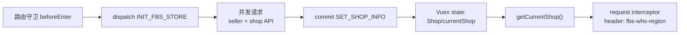

# 状态管理：Redux/Recoil、Vuex 与宿主状态

> 预计学习时间：110–150 分钟
> 一句话总结：能追踪"当前 seller/shop"从初始化到页面的完整数据流，读懂 Redux/Thunk、Vuex module、Recoil atom 和 Redux Toolkit 的读法与不可变更新规则——画出一个状态的来源、写入、派生与消费链。

## 这一章解决什么问题

后端同学看前端状态管理代码时，最常见的误判是：把 Store 当作一个"全局变量池"——需要什么就从里面取，想改就直接改。但在 FBS 前端中，状态有严格的生命周期和所有权：组件自己管理的、本仓 Store 管理的、宿主提供的、远端组件共享的——每一层都有不同的读写规则。

更复杂的是，三个 FBS 前端仓库使用了完全不同的状态管理方案：Portal 同时用 Redux（带 Thunk 中间件）和 Recoil，SC Vue 用 Vuex（由 Seller Center 宿主注入），SC React 用 Redux Toolkit 但依赖宿主 Vuex 提供基础信息。这不是"选型混乱"，而是不同时期的技术决策和宿主约束共同作用的结果。

本章的目标不是让你成为 Redux 或 Vuex 专家，而是帮你建立一套状态追踪能力：看到一个页面上的数据（如当前 seller 的 shop ID），你能从页面一路追溯到 Store 中的定义、初始化 action、写入点、派生逻辑和消费方。

> 本章基于三个前端仓库的 release 分支（2026-07-20）。

## 先建立状态分层的概念

在 FBS 的任一前端页面中，一个"当前 shop 信息"可能来自以下四层之一：

| 层级 | 示例 | 特点 |
| --- | --- | --- |
| 组件局部状态 | `data() { return { form: {} } }` 或 `useState` | 只有当前组件可见，组件销毁即消失 |
| 本仓 Store | Redux store、Vuex module、RTK slice | 跨页面共享，浏览器刷新后可能丢失 |
| 宿主 Store | Seller Center 提供的全局状态 | 跨模块共享，由宿主管理生命周期 |
| 远端组件状态 | 通过 Props/Context 从远端组件传入 | 跨仓共享，但契约严格限制 |

一个实用的判断规则：如果数据只在一个组件中使用，用局部状态；如果在多个页面中需要（如用户信息、当前 shop），放 Store；如果其他 MMF 模块或宿主也需要，放宿主 Store。FBS 的"当前 seller/shop"就是最典型的跨页面、跨模块共享数据，所以它在宿主 Store 中管理。

## SC Vue：Vuex 模块化的宿主注入模式

### FBS Store 的注册

SC Vue 中的 Store 不是在本仓创建的，而是注册到 Seller Center 宿主提供的 Vuex Store 中：

```typescript
// src/store/index.ts
import { app } from 'framework';
import FBS_STORE from './modules/index';

export const fbsStoreName = 'FBS_STORE';
app.registerVue3StoreModule(fbsStoreName, FBS_STORE);
```

`app.registerVue3StoreModule` 是 MMF 框架提供的能力，它将 FBS 的 Vuex 模块挂载到宿主 Vuex Store 的 `FBS_STORE` 命名空间下。此后，任何代码（包括宿主的其他模块）都可以通过 `app.vue3VuexStore.getters['FBS_STORE/Shop/currentShop']` 访问 FBS 的状态。

### 模块结构

`src/store/modules/` 下有四个子模块：

| 模块 | 路径 | 管理的数据 |
| --- | --- | --- |
| `Seller` | `modules/seller/index.ts` | 卖家信息、入驻状态、一键注册配置 |
| `Shop` | `modules/shop/index.ts` | 当前选中的店铺、店铺列表、店铺标签 |
| `System` | `modules/system/index.ts` | 系统升级状态、全局开关 |
| `Temporal` | `modules/temporal/index.ts` | 临时数据缓存 |

### 读法：从页面追到 Store

在 IBT 详情页中，`dataLoading` 是从组件 `data()` 中读取的局部状态，而 `basicInfo.urgentStatus` 可能来自 Store。追踪过程：

1. 页面模板中使用 `basicInfo` → 在 `<script>` 中找它的来源。
2. 如果来自 `mapState` 或 `this.$store.state.FBS_STORE.xxx` → 找到对应 module 的 state 定义。
3. 如果来自 computed 属性 → 看它是从 state 派生的还是从 API 响应赋值的。

### 写操作：`dispatch` 和 `commit`

```javascript
// 触发异步 action
await app.vue3VuexStore.dispatch('FBS_STORE/INIT_FBS_STORE');
// 同步修改 state
app.vue3VuexStore.commit('FBS_STORE/SET_SHOP_INFO', shopInfo);
```

- `dispatch` 用于触发 action（可以包含异步操作），action 内部通过 `commit` 修改 state。
- `commit` 用于直接提交 mutation（必须是同步操作），mutation 是唯一能改变 state 的途径。

FBS 仓库中，路由守卫的 `beforeEnter` 里 `dispatch('FBS_STORE/INIT_FBS_STORE')` 是 Store 初始化的入口——它内部会并发请求卖家信息和店铺信息，然后将结果 commit 到对应 module 的 state 中。

### 命名空间规则

Vuex module 通过 `namespaced: true` 启用命名空间。访问时必须带完整路径：

```javascript
// 正确
app.vue3VuexStore.getters['FBS_STORE/Shop/currentShop']
// 错误
app.vue3VuexStore.getters.currentShop  // 找不到
```

## Portal：Redux + Thunk + Recoil

### Redux 基础结构

Portal 的 Redux Store 创建于 `src/store/index.ts`：

```typescript
import { createStore, applyMiddleware } from 'redux';
import thunk from 'redux-thunk';

export const store = createStore(reducer, applyMiddleware(thunk));
```

Redux 的三个核心概念对应 FBS Portal 的实际角色：

| 概念 | 定义 | FBS Portal 中的位置 |
| --- | --- | --- |
| **State** | 单一数据源，一个大的对象树 | `store.getState()` 返回的整个 state |
| **Action** | 描述"发生了什么"的普通对象 | `src/store/actions/` 下的 action creator |
| **Reducer** | 根据 action 计算新 state 的纯函数 | `src/store/reducers/` 下的 reducer 文件 |

### Thunk：让 action 可以异步

Redux 原生的 action 是同步的——dispatch 一个 action 对象，reducer 立即处理。但在 FBS Portal 中，大量操作需要先发 API 请求再更新 state。Thunk 中间件让 action creator 可以返回一个函数而不是对象：

```javascript
// 同步 action creator
const setUser = (user) => ({ type: 'SET_USER', payload: user });

// 异步 action creator（Thunk）
const fetchUser = () => async (dispatch, getState) => {
  dispatch({ type: 'FETCH_USER_START' });
  try {
    const user = await api.getUser();
    dispatch({ type: 'FETCH_USER_SUCCESS', payload: user });
  } catch (error) {
    dispatch({ type: 'FETCH_USER_ERROR', payload: error });
  }
};
```

FBS Portal 中，几乎所有的 API 调用都通过 Thunk 包装。页面上 `dispatch(fetchInboundList(params))` 会触发请求 → 更新 loading 状态 → 请求完成后更新列表数据。

### Recoil：Portal 的原子化状态

Portal 同时使用了 Recoil 管理部分状态。Recoil 的核心是 **atom**（状态单元）和 **selector**（派生状态）：

```javascript
// atom：定义一个状态单元
const currentUserAtom = atom({
  key: 'currentUser',
  default: null,
});

// selector：从 atom 派生数据
const permissionListSelector = selector({
  key: 'permissionList',
  get: ({ get }) => {
    const user = get(currentUserAtom);
    return user?.permission_code_list ?? [];
  },
});
```

在 Portal 中，`src/recoil/` 目录下定义了 Recoil atom 和 selector。与 Redux 的区别：Recoil 的状态单元更细粒度，且自带派生能力（selector），不需要像 Redux 那样通过 `mapStateToProps` 或 `useSelector` 手动订阅整个 state 树。

Portal 中 Redux 和 Recoil 并存是历史原因。简单判断：Redux 管理业务数据（入库列表、商品列表），Recoil 管理全局上下文（当前用户、权限列表）。

### Portal 页面读取 Store 的方式

```javascript
// React-Redux hooks
import { useSelector, useDispatch } from 'react-redux';

function InboundList() {
  const list = useSelector(state => state.inbound.list);
  const loading = useSelector(state => state.inbound.loading);
  const dispatch = useDispatch();

  useEffect(() => {
    dispatch(fetchInboundList(params));
  }, [params]);

  // 读取 Recoil 状态
  const permissions = useRecoilValue(permissionListSelector);
}
```

## SC React：Redux Toolkit + 宿主 Vuex

### 双 Store 并存

SC React 面临一个特殊挑战：作为 MMF 模块，它需要与宿主的 Vuex Store 交互（获取 seller 信息、shop 信息等基础数据），但模块内部的业务状态使用 Redux Toolkit 管理。

```typescript
// 从宿主 Vuex 读取当前 shop
const currentShop = app?.vue3VuexStore?.getters?.['FBS_STORE/Shop/currentShop'];

// 从模块自己的 Redux Store 读取业务状态
import { useSelector } from 'react-redux';
const inboundList = useSelector(state => state.inbound.list);
```

### Redux Toolkit：slice 模式

SC React 使用 Redux Toolkit 的 `createSlice` 替代传统 Redux 的分散 action/reducer 文件：

```typescript
// store/modules/shop.ts
import { createSlice } from '@reduxjs/toolkit';

const shopSlice = createSlice({
  name: 'shop',
  initialState: { currentSelectedShop: null, fbsStatus: 0 },
  reducers: {
    setCurrentShop(state, action) {
      state.currentSelectedShop = action.payload;
    },
    setFbsStatus(state, action) {
      state.fbsStatus = action.payload;
    },
  },
});

export const { setCurrentShop, setFbsStatus } = shopSlice.actions;
export default shopSlice.reducer;
```

Redux Toolkit 的 `createSlice` 自动生成 action creator 和 reducer，并内置 Immer——你可以在 reducer 中"直接修改"state（实际上 Immer 在背后做了不可变更新）。这对习惯 Redux 传统写法的人可能有些反直觉：`state.currentSelectedShop = action.payload` 看起来像直接修改，但它是安全且正确的。

### Selector：从 state 中提取数据

```typescript
// 基础 selector
const selectCurrentShop = (state) => state.shop.currentSelectedShop;

// 带派生逻辑的 selector
const selectFbsTag = (state) => state.shop.fbsTag !== 0;
```

Selector 是纯函数，可以组合。复杂项目中使用 `createSelector`（reselect）创建带缓存的 selector，避免不必要的重新计算。

## 状态流转：一次完整的追踪练习

以"当前 shop 的仓库区域 `fbsWhsRegion`"为例，追踪它在 SC Vue 仓库中的完整生命周期：

1. **初始化**：路由守卫 `beforeEnter` → `dispatch('FBS_STORE/INIT_FBS_STORE')` → action 中并发请求 seller 和 shop 信息 → `commit('SET_SHOP_INFO', data)`。
2. **存储**：`state.FBS_STORE.Shop.currentShop.fbsWhsRegion`。
3. **消费**：request interceptor 中通过 `getCurrentShop().fbsWhsRegion.toUpperCase()` 注入到请求 header 的 `fbs-whs-region` 中。
4. **派生**：如果 CBSC 条件下，`fbsWhsRegion` 影响请求来源标记 `req-source: 'CNSC'`。



如果你需要新增一个跨页面的状态（如"用户选择的默认仓库"），你需要决定它放哪一层。判断标准：如果只有本仓页面需要，放入本仓 Store 的对应 module；如果其他 MMF 模块也需要，考虑放入宿主 Store（需要协调宿主侧改动）；如果只有一个组件需要，用局部状态。

## 不可变更新：React 和 Redux 的共同约束

React 和 Redux 都依赖引用比较来判断是否需要重新渲染。修改状态时必须创建新对象/新数组：

```javascript
// 错误：直接修改
state.list.push(newItem);

// 正确：创建新引用
return { ...state, list: [...state.list, newItem] };

// Redux Toolkit 中 Immer 让你可以"直接修改"（实际做了不可变代理）
state.list.push(newItem); // createSlice reducer 中合法
```

Vue 3 使用 Proxy 实现响应式，所以 Vuex/组件 data 中可以直接赋值。但跨框架传递数据时（如 SC React 从宿主 Vuex 读取），仍需注意不可变性的约束。

## 常见错误

### 在 action 外直接修改 state

```javascript
// 错误：绕过 mutation 直接修改
this.$store.state.FBS_STORE.Shop.currentShop = newShop;

// 正确：通过 commit
this.$store.commit('FBS_STORE/SET_SHOP_INFO', newShop);
```

### 忘记 Redux reducer 是纯函数

```javascript
// 错误：reducer 中有副作用（API 调用、随机数）
function inboundReducer(state, action) {
  const data = await fetchData();  // 不允许！
  return { ...state, data };
}

// 正确：副作用放在 Thunk 中
```

### 从宿主 Vuex 读取时未处理可选链

```javascript
// 可能抛出 TypeError
const shopId = state.shop.currentSelectedShop.fbsShopId;

// 正确
const shopId = state.shop.currentSelectedShop?.fbsShopId;
```

### 把大量不需要跨页面的数据放入 Store

组件的表单临时数据、搜索关键词、展开/折叠状态通常不需要入 Store。Store 中只放真正需要跨页面共享的状态。

## 练习

### 追踪练习

在 SC Vue 仓库中追踪 `fbsTag` 的完整生命周期：它在哪个 API 中获取、存入哪个 module、在哪些文件中被读取和使用。

### 新增状态

在 SC Vue 的 System module 中新增一个 `maintenanceMode` 状态（布尔值，默认 `false`）。在路由守卫 `beforeEnter` 中检查这个状态，如果为 `true`，重定向到一个维护提示页。

### 派生状态

Portal 仓库中，`permissions.includes(permission)` 被多次使用。创建一个 selector，封装这个判断逻辑，使调用方只需 `const hasPermission = useSelector(selectHasPermission(code))`。

### 参考答案

**8.2** 关键步骤：`modules/system/index.ts` 的 state 中新增 `maintenanceMode: false`；mutation 中新增 `SET_MAINTENANCE_MODE`；`beforeEnter` 中读取 `getters['FBS_STORE/System/maintenanceMode']`；维护提示页可以是简单的 `MaintenanceNotice.vue`。

## 参考文献

- [Redux Essentials Tutorial](https://redux.js.org/tutorials/essentials/part-1-overview-concepts) — store/action/reducer 概念
- [Redux Toolkit Tutorials](https://redux-toolkit.js.org/tutorials/overview) — createSlice 和 createAsyncThunk
- [Vuex 4 Documentation](https://vuex.vuejs.org/) — state/getter/mutation/action/module
- [Recoil Documentation](https://recoiljs.org/docs/introduction/getting-started/) — atom/selector 概念
- [React Learn — Managing State](https://react.dev/learn/managing-state) — React 状态管理概述
