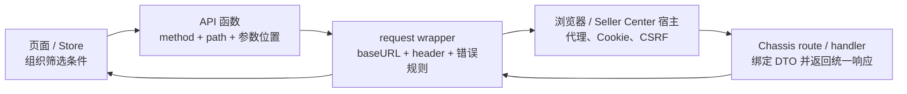
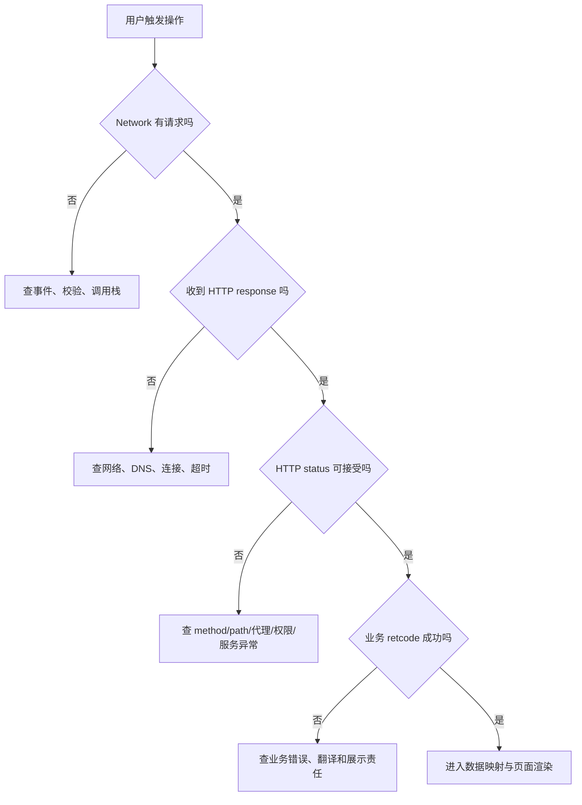

# API、代理、错误与前后端契约

> 预计学习时间：120–160 分钟  
> 一句话总结：沿入库列表请求拆开 API 函数、请求实例、宿主代理、业务错误与联调证据，能够独立定位一次前后端契约问题。

## 这一章解决什么问题

后端同学第一次改前端接口，常会把“调用 API”理解成在组件里写一次 `axios.post`。这段代码也许能发出请求，却绕过了 FBS 前端已经建立的请求约定：路径前缀由谁补、会话由谁携带、请求标识怎么生成、语言和仓区信息从哪里来、业务错误由谁翻译、PII 和导出为什么要走另一套实例。结果通常不是语法错误，而是本地看似成功、接到宿主后失败，或者一次错误弹出两遍。

本章只追一条真实链路：Seller Center 入库请求列表。我们从 Vue 仓库的 `src/api/inbound.js` 出发，经过 `src/utils/request.js`，到达后端路由 `/api/fbs/sc/inbound/request/list/`。随后用 React 16 Portal 和 React 18 MMF 的实现做对照。学完后，你不需要背完 Axios；你要能回答七个工程问题：请求从哪里发出，method 和 path 在哪里决定，参数放在 query 还是 body，baseURL 与宿主代理如何组合，哪些 header 由统一封装注入，失败属于哪一层，以及契约变更需要同时检查哪些文件。

> 本章观察各仓库 release 分支（2026-07-20）中的代码。路径、依赖版本和封装行为可能随仓库演进；做实际需求时，应重新打开当前工作树核验，不能把本章片段当成永久 API。

## 先建立一张请求地图

浏览器请求不是从按钮一步跳到 Go handler。一次列表刷新通常穿过五层：组件或 Store 组织查询条件；API 函数选择业务端点；request wrapper 补公共规则；浏览器和宿主代理发送请求；后端返回统一响应。把它们混在一个文件里，短期少写几行，长期会让每个页面各自处理鉴权、错误与环境差异。



这张图有两个容易被忽略的方向。第一，请求向右走时，每层只补自己负责的信息；页面不该猜 CSRF header，request wrapper 也不该理解“入库状态筛选”的业务含义。第二，响应向左走时也分层：HTTP 客户端先判断有没有可用响应，再判断 HTTP 状态与业务 `retcode`，页面最后只处理本业务的空态、重试入口或成功数据。

遇到问题时先标出故障位于哪条边，而不是立刻改代码。例如 Network 面板里根本没有请求，检查页面事件和 API 函数；有请求但 URL 多了一段前缀，检查 API path 与 baseURL；HTTP 200 但页面提示失败，检查业务 `retcode`；只有某个地区或宿主失败，检查统一注入的 region/shop/source 信息和宿主配置。

## 从 Vue 入库列表读懂最小 API 函数

打开 `fbs-sc-vue/src/api/inbound.js`，入库列表函数的核心形态可以缩减为：

```javascript
export function getRequestList(data) {
  return request({
    url: '/inbound/request/list/',
    method: 'post',
    data,
  })
}
```

这层很薄，但它承担了清楚的业务契约。函数名说明调用意图；`url` 是相对业务路径；`method` 明确后端路由；`data` 表示 JSON 请求体。调用者只需传入列表筛选条件，不必知道 Seller Center 的完整 API 前缀，也不必每次创建 Axios 实例。

如果同一文件里的查询接口使用 GET，你会看到参数通常放在 `params`：

```javascript
export function getPickupInfo(params) {
  return request({
    url: '/inbound/request/pickup/info/',
    method: 'get',
    params,
  })
}
```

`params` 与 `data` 不是风格偏好。Axios 会把 `params` 序列化到 URL query，把 `data` 放入请求体。后端的参数绑定也会按 HTTP method 与 Content-Type 选择读取位置。把 GET 的筛选条件错放进 `data`，浏览器可能仍发出请求，但服务端读不到；把 POST JSON 错放进 `params`，敏感字段还可能出现在 URL、浏览器历史或代理日志中。

读 API 文件时，先做一张四列表，而不是顺着几百行函数逐个看：

| 问题 | 在哪里看 | 入库列表示例 | 判断结果 |
| --- | --- | --- | --- |
| 业务动作是什么 | 函数名与调用点 | `getRequestList` | 查询列表 |
| 请求到哪个端点 | `url` | `/inbound/request/list/` | 相对 SC FBS 前缀 |
| 使用什么 method | `method` | `post` | 与 Chassis route 对齐 |
| 参数放在哪里 | `data` / `params` | `data` | JSON body |

这四项是联调的第一份契约证据。不要从页面字段名直接猜后端字段，也不要因为函数名叫 `get...` 就推断 HTTP method 是 GET；这里的 `get` 表示读取业务数据，实际路由是 POST。

## baseURL 如何把相对路径变成真实请求

Vue 仓库的 `src/utils/request.js` 不是从裸 Axios 随意创建实例，而是基于宿主提供的请求能力 clone，并给普通 FBS SC 请求配置 `baseURL: '/api/fbs/sc'`。因此前一节的相对 path 会组合成：

```text
/api/fbs/sc + /inbound/request/list/
= /api/fbs/sc/inbound/request/list/
```

这个最终 path 与 `sbs-fbs-server/apps/inbound/inbound/access/http/sc/urls.go` 中的 POST 路由完全对应。前端函数保留业务段，统一实例保留应用前缀，两边各自变化时更容易控制影响面。

所谓“代理”至少可能指三件事，排错时不要混用：开发服务器把某个前缀转发到测试后端；Seller Center 宿主为子模块提供统一请求、会话或网关能力；服务端自身又可能按规则把请求交给旧实现或新实现。本章前端部分关心前两种。Network 面板显示的浏览器 URL 是证据起点，开发配置和宿主注入决定它最终由谁接收。

如果你把 API 函数改成完整域名，会同时破坏多项假设：本地、PFB 和不同环境无法复用相同相对路径；浏览器跨域、Cookie 与 CSRF 行为改变；宿主的请求拦截、监控与统一 header 可能被绕过。除非仓库现有模式和任务契约明确要求，不要用硬编码域名“修复”代理问题。

排查 404 时按组合顺序逐项打印或查看：API 函数中的 `url`，所用 request 实例的 `baseURL`，浏览器最终 Request URL，请求是否经过正确宿主或 dev proxy，后端 route 是否包含尾部 `/`。尾部斜杠看似细节，却是契约的一部分；本接口前后端当前都保留尾部 `/`，不要在没有验证路由行为时自行统一格式。

## request wrapper 注入了哪些上下文

`fbs-sc-vue/src/utils/request.js` 的请求拦截器会为请求补充多类 header。当前代码可见的关键项包括 `Fbs-Request-Id`、`lang-id`、`fbs-sc-source`；在 CBSC 条件下还会补 `fbs-whs-region`、`fbs-shop-id` 和 `req-source`。这些字段不是页面筛选条件，而是请求运行上下文。

request ID 用于跨层关联一次请求。遇到“页面报错但服务端说没看到”时，应从浏览器请求 header 取出标识，再查网关与服务日志，而不是只给一张 toast 截图。语言 header 影响后端错误翻译。source、warehouse region 与 shop 信息会影响身份、数据边界或链路选择。具体语义应以当前后端中间件和业务代码为准，但前端开发至少要知道它们由统一层提供，不能在某个页面里随意覆盖。

这里有一个重要边界：业务请求字段与运行上下文要分开。比如列表筛选的 `status_list` 属于 JSON body；当前 Seller、Shop、语言、请求标识通常来自宿主状态和 wrapper。若把后者复制进每个 API 的 body，会出现重复事实源：页面传一个 shop，header 又表示另一个 shop，后端必须猜信哪个。

检查 wrapper 时不要只看 request interceptor。还要找实例是如何 clone 的、实例是否针对普通/Blob/PII 分流、response interceptor 返回的是完整 Axios response 还是已经解包的 `data`。调用页面对返回值的写法必须与这一行为一致。

## 普通、Blob、PII 为什么不能合并成一个万能请求

Vue 仓库当前区分普通请求、Blob 请求、PII 请求和 PII Blob 请求，还保留 remote request 场景。React 18 MMF 的 `basic/src/utils/MMF/request/request.ts` 也有相似的 `commonRequest`、`blobRequest`、`piiRequest`、`piiBlobRequest`。这不是重复代码，而是数据与响应语义不同。

普通 JSON 请求期望结构化响应，wrapper 可以直接检查 `retcode` 并取 `data`。Blob 请求通常用于 Excel、PDF 或批量导出，成功体是二进制；但失败时服务端仍可能返回 JSON 错误。如果一看到 `responseType: 'blob'` 就无条件创建下载文件，用户会下载一个内容为错误 JSON 的“xlsx”。正确封装要根据 Content-Type、业务约定或 Blob 文本解析结果区分成功文件与失败信息。

PII 请求的差别更严肃。个人敏感信息需要走仓库规定的请求实例和服务边界，可能涉及不同前缀、header、加解密或审计能力。页面开发者不能因为普通 request 已经能访问某个 URL，就用它读取敏感字段。判断标准不是“代码能不能跑”，而是该字段是否属于受控数据、现有同类 API 使用哪种封装、后端是否位于敏感数据服务边界。

因此新增 API 前先回答：响应是 JSON 还是文件，数据是否含 PII，是否由 remote component 跨宿主使用，错误体是什么形态。答案决定你复用哪个实例，而不是决定给万能实例再加一个布尔参数。

## 把失败拆成四层

前端最危险的错误处理方式是 `catch` 之后统一弹“请求失败”。它让网络故障、404、业务校验失败和页面渲染异常看起来一样。FBS request wrapper 已经承担一部分统一处理，页面层更需要先分层。

### 第一层：请求没有发出

按钮未绑定、校验提前 return、组件已卸载、Promise 没有执行，都会让 Network 面板没有记录。这时后端与代理都还没参与。检查事件回调、条件分支、调用栈和控制台异常。

### 第二层：传输失败

断网、DNS、连接中断、客户端超时等情况下，Axios error 可能没有可用的 `response`。此时不要读取 `error.response.data.retcode`，否则错误处理本身又抛异常。证据是 Network 状态、error 的 request/response 字段和耗时。

### 第三层：HTTP 失败

浏览器收到了 4xx 或 5xx。404 优先核对 method、完整 path、代理和后端 route；401/403 优先核对会话、CSRF、权限和宿主；500 需要 request ID 与服务端日志。注意当前 SC 业务错误常通过 HTTP 200 加业务 `retcode` 返回，所以 HTTP 200 只证明传输层成功，不能证明业务成功。

### 第四层：业务失败

响应 JSON 可被解析，但 `retcode` 非成功值。Vue wrapper 会检查业务码，并按当前代码中的翻译优先顺序选择消息；`hiddenErrorMessage` 可控制是否由统一层展示。页面若再无条件 toast，就会出现双弹窗。页面需要自定义交互时，应明确让统一层静默，再根据业务错误提供字段提示、保留用户输入或给出重试入口。



这个判断树的价值是让证据先于猜测。它不会替你定位所有问题，但会阻止你在“没有请求”的时候修改 Go handler，也会阻止你在业务错误时反复调整 dev proxy。

## React 16 Portal：类型契约与请求封装如何配合

`fbs-frontend/src/apis/inbound.ts` 为 Portal 入库列表定义请求与响应类型，并通过 `createApi<Params, Data>` 生成调用函数。`src/common/utils/createApi.ts` 会根据 HTTP method 决定参数位置：GET 使用 `params`，DELETE 使用 `data`，POST 等方法把参数作为 body；Blob 场景还有不同返回处理。

与 Vue JavaScript API 相比，TypeScript 类型让调用者在编译期更早看到字段名和可选性。例如请求类型没有 `seller_sku`，页面直接传入时可能触发类型检查；响应类型声明 `ir_list`，组件访问不存在的 `list` 会被发现。但这并不保证运行时契约正确。后端可以返回旧字段，代理可以给出 HTML 错误页，类型断言也可以绕过检查。

Portal 的 `src/utils/request.ts` 还体现了另一组运行约束：Axios 0.18、`withCredentials`、CSRF cookie/header、region/request-id/lang header，HTTP 错误与业务 `retcode` 分开处理，Blob 失败体可能是 JSON。课程不能拿 Axios 1.x 文档中的所有默认行为直接套到这个仓库；做具体改动时，应先读 lockfile/manifest 与当前封装，再使用对应版本文档解释公共 API。

所以 TypeScript contract 的正确定位是“编译期协作工具”，不是服务端真相。可信联调仍需对照浏览器实际 request/response、Go DTO 的 JSON tag、路由 method/path 和错误格式。

## React 18 MMF：相似封装不等于可以跨仓复制

`fbs-sc-react/basic/src/utils/MMF/request/request.ts` 也把普通、Blob、PII 与 PII Blob 分开，注入请求 header，检查 `retcode` 并调用 toast。它与 Vue wrapper 的职责相近，说明两个 Seller Center 模块共享相似宿主约束；但当前依赖是 Axios 1.12.2，类型、拦截器签名和部分行为与 Portal 的 Axios 0.18 不同。

跨仓改需求时可以迁移“意图”，不能直接迁移实现。你可以说三个仓都需要 request ID、语言、业务错误处理；不能把 React 18 的实例代码复制进 React 16 Portal，再期待旧 TypeScript 与 Axios 类型通过。也不能把 Vue wrapper 的 `hiddenErrorMessage` 用法想当然地写进 React 18，必须确认对应实例是否支持同名选项。

建议用职责矩阵比较，而不是做代码 diff：

| 职责 | SC Vue | Portal React 16 | SC React 18 |
| --- | --- | --- | --- |
| 应用前缀 | 普通实例配置 SC FBS baseURL | Portal wrapper 配置对应 baseURL | MMF request 实例配置 SC FBS 前缀 |
| 请求上下文 | request ID、语言、source，特定场景含 region/shop | region、request ID、语言、Cookie/CSRF | request ID、语言、source 等 |
| 业务错误 | response interceptor 检查 `retcode` | HTTP 与业务错误分层 | interceptor 检查 `retcode` 并 toast |
| 文件响应 | 独立 Blob 实例 | Blob 分支，失败可能解析 JSON | 独立 Blob 实例 |
| PII | 独立 PII/PII Blob 实例 | 按 Portal 现有边界核验 | 独立 PII/PII Blob 实例 |

矩阵帮助 reviewer 检查职责是否遗漏；具体字段和值仍回到当前代码。

## 前后端契约到底包含什么

很多接口文档只列 request/response JSON，这对真实联调不够。完整契约至少包括：HTTP method、最终 path、Content-Type、必要 header、鉴权/会话来源、请求字段及空值语义、响应 envelope、业务错误语义、文件/PII 分流、兼容策略和可观测标识。

以入库列表为例，当前可从代码确认：前端 POST 到 `/api/fbs/sc/inbound/request/list/`；请求 body 对应 Go `ScIrListReq` 的 JSON tag；wrapper 会补公共 header；后端成功响应由统一 wrapper 包装，业务失败也可能以 HTTP 200 返回错误 envelope。handler 当前还存在旧/新链路选择，因此新增可选筛选字段必须保证两条链路都能接受，或者明确新字段只在某条链路生效并给出兼容行为。

字段契约要特别关注三组区别。第一，缺失、`null`、空字符串、零和空数组不是同一个值。Go 的 `string`、`*string`、`[]string` 各自表达不同；TypeScript 的可选属性、`null` 联合类型也应与之对应。第二，字段名转换由 JSON tag 决定，不由 Go 字段名的大小写自动猜。例如 `SellerSku *string` 对外是 `seller_sku`。第三，列表排序、分页和时间字段需要明确单位与边界，否则双方都“类型正确”仍可能语义错误。

新增筛选字段时，先写契约卡：

```text
名称：seller_sku
位置：POST JSON body
前端类型：sellerSku?: string（提交前 trim；空值不发送）
后端字段：SellerSku *string `json:"seller_sku"`
缺失语义：不按 Seller SKU 过滤
空字符串语义：前端归一化为缺失；后端保持兼容
响应：不新增字段
错误：非法长度在字段附近提示；未知错误由统一层展示
兼容：旧调用方不传字段时行为完全不变
```

这张卡不是替代代码，而是让前后端在改动前对齐零值与兼容性。最终仍需用 request payload、handler 测试和接口响应证明。

## 用 Network 面板完成一次可复现联调

联调前先清空 Network，打开 Preserve log 只在需要跨页面保留请求时使用，并按接口路径过滤。触发一次列表查询后，不要只看 Preview；按以下顺序记录证据。

第一，确认 Request URL 与 Request Method。它们应对应 baseURL 拼接结果和 Chassis route。第二，看 Request Headers，确认 Content-Type、request ID、语言与当前场景需要的上下文，不要复制 Cookie 或凭据到工单。第三，看 Payload，区分 Query String Parameters 与 Request Payload，检查字段名、类型和空值是否符合契约。第四，看 Status、Response Headers 与 Response，区分 HTTP 层和业务层。第五，看 Timing，判断耗时主要在排队、连接还是等待响应；慢请求不等于前端渲染慢。

一份可复现记录至少包含：页面与操作、环境、时间、method/path、已脱敏 payload、HTTP status、业务 `retcode`、request ID、期望与实际、是否稳定复现。不要贴整段 Cookie、授权 header、真实 PII 或无关响应。

如果页面 toast 已消失，可用 Network 的 response 继续定位。如果 response 成功但页面仍空，问题已经越过请求层，转查数据解包、状态写入、computed/selector 与渲染条件。把责任边界说清，比在 request interceptor 里加日志更重要。

## 受控练习：给入库列表增加一个兼容筛选字段

练习目标不是提交业务仓，而是在独立练习分支或草稿中完成影响分析和最小 diff。假设需求是“入库列表可按 Seller SKU 精确筛选”，产品已确认空输入表示不筛选，旧调用行为不变。

### 第一步：定位调用链

在 Vue 入库页面搜索 `getRequestList` 的调用点，找出筛选表单到请求对象的映射。记录页面状态字段、提交函数、API 函数和 request 实例。再到后端 route 与 `ScIrListReq` 验证现有 `seller_sku` 是否已经存在。当前新链 DTO 已有 `SellerSku *string`，这意味着需求可能只缺前端接线，不能看到需求就先新增后端字段。

### 第二步：定义归一化规则

页面输入在提交前 trim。trim 后为空则不发送 `seller_sku`，避免把空字符串解释成真实过滤条件。不要把展示用的 `sellerSku` 直接改名为 snake_case 并污染组件状态；在 API 参数组装边界完成字段映射即可。

```javascript
const sellerSku = filters.sellerSku.trim()
const payload = {
  ...buildExistingFilters(filters),
  ...(sellerSku ? { seller_sku: sellerSku } : {}),
}
await getRequestList(payload)
```

这段是缩减示例，不保证可直接替换页面现有函数。实际改动必须复用当前页面已有的参数构造、分页重置和加载状态处理。

### 第三步：检查错误责任

列表查询失败时，统一 wrapper 已处理普通业务错误，页面不应无条件再 toast。若需求要求把“SKU 格式非法”显示在输入框旁，调用时应使用仓库支持的静默选项，并只对已确认的业务码设置字段错误；未知错误仍交回统一机制。不要按错误 message 文本做稳定分支，翻译和后端文案都可能变化。

### 第四步：准备验证矩阵

| 用例 | 前端 payload | 预期 |
| --- | --- | --- |
| 未输入 | 不含 `seller_sku` | 行为与改动前一致 |
| 只输入空格 | trim 后不含字段 | 不触发空字符串过滤 |
| 合法 SKU | `seller_sku: "SKU-001"` | 请求成功，列表按契约过滤 |
| 不存在 SKU | 发送合法值 | 成功空列表，不当作系统错误 |
| 网络中断 | 请求无可用 response | 只出现一次通用网络提示，可重试 |
| 业务错误 | HTTP 200、非成功 `retcode` | 按统一翻译规则展示一次 |

### 第五步：留下交接证据

提交给 reviewer 的不是一句“自测通过”，而是受影响文件、契约卡、两组 payload 截图或文本记录、类型/lint 结果、空值与错误用例，以及未验证项。完成开发交接后，后续发版遵循团队通用流程，本课程不展开。

## 常见误区与修正方法

### 在组件里创建新的 Axios 实例

它绕过宿主请求能力、baseURL、header、业务错误和监控。修正方法是先找同域 API 文件与同数据类型实例，只有现有封装确实无法表达需求时才在统一层扩展。

### 把所有字段都放进 query

这会让 POST DTO 绑定失败，还可能把敏感信息暴露在 URL。修正方法是同时对照 HTTP method、API 函数的 `params/data` 和后端 `HandleParam` 行为。

### HTTP 200 就当成功

SC 接口的业务错误可以使用 HTTP 200 envelope。修正方法是看 `retcode` 与 wrapper 的成功判断，不让页面直接消费未经检查的 response。

### 页面和 wrapper 都弹错误

用户看到两次提示，测试也难稳定。修正方法是明确展示责任：默认由统一层处理；字段级或可恢复交互才由页面接管，并使用封装已有的静默能力。

### 用 TypeScript 类型代替联调

类型不会读取真实响应。修正方法是把 TS、Go JSON tag、Network payload 和 handler 测试放在同一契约检查中。

### 直接复制另一仓的 request.ts

三仓 Axios 版本、宿主能力和错误策略不同。修正方法是迁移职责和测试用例，重新按目标仓当前封装实现。

### 先怪代理

没有 Network 请求时代理根本未参与；业务 `retcode` 失败时代理通常已经完成工作。修正方法是按四层失败模型先分类，再检查对应证据。

## 章末自检

完成本章后，请不用翻代码回答下面问题，再回仓库核对：

1. `getRequestList` 为什么用 POST 和 `data`，最终 path 如何由相对 URL 与 baseURL 组成？
2. request ID、语言和 shop/region 信息为什么不应由每个页面自行维护？
3. 传输失败、HTTP 失败和业务失败分别在 Network 与 Axios error 中留下什么证据？
4. Blob 成功体和 Blob 错误体为什么需要分流？
5. PII API 为什么不能复用普通 request，只换一个 URL？
6. TypeScript 请求类型与 Go DTO 不一致时，你会用哪些运行证据确认真相？
7. 同一需求落到 React 16、Vue 3 和 React 18 时，哪些职责可复用，哪些实现必须重新核验？
8. 新增可选筛选字段时，如何证明“不传字段时旧行为不变”？

如果只能背出文件名，还没有达到本章目标。你应能从页面行为出发，画出链路，指出每层输入输出，并用一条实际 Network 记录判断问题属于哪一层。

## 本章小结

FBS 前端的 API 调用是一条分层契约，不是一次裸 HTTP 调用。业务 API 函数确定 method、相对 path 和参数位置；request wrapper 统一补 baseURL、请求上下文、错误、Blob 与 PII 规则；宿主和代理负责把浏览器请求送到正确服务；页面只处理本业务状态和被明确接管的错误。

可靠联调从分类开始：没有请求、传输失败、HTTP 失败、业务失败和渲染失败分别查不同证据。TypeScript 能提前发现一部分字段问题，却不能替代 Network payload、Go DTO 和真实响应。下一章沿同一个 `/api/fbs/sc/inbound/request/list/` 进入后端，看看 Chassis route、SC wrapper、参数绑定、灰度分支与统一响应怎样兑现这份契约。

## 参考文献

- MDN Web Docs. [HTTP overview](https://developer.mozilla.org/en-US/docs/Web/HTTP/Guides/Overview). 访问于 2026-07-16。
- RFC Editor. [RFC 9110: HTTP Semantics](https://www.rfc-editor.org/rfc/rfc9110). 2022-06。
- TypeScript. [Handbook: Object Types](https://www.typescriptlang.org/docs/handbook/2/objects.html). 访问于 2026-07-16。
- Axios. [Request Config](https://axios-http.com/docs/req_config). 访问于 2026-07-16；具体行为须按各仓依赖版本与封装核验。
- Axios. [Handling Errors](https://axios-http.com/docs/handling_errors). 访问于 2026-07-16；具体行为须按各仓依赖版本与封装核验。
