# JavaScript 数据、类型与相等性：先读懂仓库判断分支

> 预计学习时间：90–130 分钟
> 一句话总结：从 FBS 前端的真实条件分支入手，理解 JavaScript 的数据类型、引用、空值、隐式转换与相等性规则，能够独立解释并修改仓库中的权限判断、路由守卫和状态筛选逻辑。

## 这一章解决什么问题

打开 FBS 任一前端仓库，你会看到大量条件判断：路由守卫里的 `to.route.name === 'fbsNoPermissions'`，权限检查中的 `permission.some(item => permissions.includes(item))`，错误处理中的 `if (data?.retcode !== 0)`。每一行都依赖 JavaScript 特有的类型规则和相等性行为。

后端同学转前端时，最常见的两类问题都与这些规则有关。第一，把 JavaScript 当成"去掉类型的 Java/C#"，忽略了隐式转换、`undefined` vs `null`、引用相等这些微妙但频繁出现的规则；第二，知道语法但读不懂代码为什么这样写，比如为什么用 `===` 而不是 `==`，为什么 `?.` 和 `??` 几乎出现在每一个页面组件里。

本章从 FBS 三个前端仓库的真实片段出发，先建立类型系统，再解释相等性规则，最后回到仓库阅读和修改条件分支。目标不是让你背完 ECMAScript 规范——而是让你在看到 `if (data?.retcode !== 0)` 时，能拆解出：`data` 可能是什么、`?.` 在什么情况下返回 `undefined`、`!==` 与 `!=` 的区别、`0` 在这里代表什么语义。

学完后你能做到三件事：解释四个真实判断片段的类型和结果；修复一个故意引入的空值边界问题；在看任何 FBS 页面代码时，不用猜一个表达式的结果会是什么。

> 本章示例来自 `fbs-sc-vue`、`fbs-frontend` 和 `fbs-sc-react` 三个仓库的 release 分支（2026-07-20）。代码行为可能随仓库演进；做实际需求时应重新打开当前工作树核验。

## 一、变量与基本类型：从权限判断片段出发

先看 `fbs-frontend/src/business/utils/permission.ts` 里的权限判断：

```javascript
export function hasPermission(permission) {
  const permissions = get(store.getState(), 'context.currentUser.permission_code_list', []);
  if (Array.isArray(permission)) {
    return permission.some(item => permissions.includes(item));
  }
  return permissions.includes(permission);
}
```

这段代码看起来简单，但后端同学要想明白每一层，至少需要理解：`const` 声明、数组、`Array.isArray` 返回值、`some` 和 `includes` 的布尔语义、以及函数没有写返回类型这件事本身的含义。我们逐层拆开。

### 1.1 `const` 与 `let`：变量声明不携带运行时类型

JavaScript 用 `const` 和 `let` 声明变量。核心规则只有两条：`const` 声明的变量不能重新赋值；`let` 可以。两者都不限制修改变量指向的对象内部。

```javascript
const list = [];      // 不能再写 list = somethingElse
list.push('item');    // 但可以修改数组内容

let count = 0;
count = 1;            // let 允许重新赋值
```

在 FBS 代码中你几乎看不到 `var`。`var` 有函数作用域和变量提升等历史行为，三个 FBS 前端仓库通过 ESLint 或团队约定已经统一使用 `const`/`let`。作为惯例：默认用 `const`，只有确实需要重新赋值时改用 `let`。

`const` 不意味着"不可变"。`const permissions = []; permissions.push('code')` 完全合法。它限制的是变量名与值的绑定关系，而不是值本身。这个区别在后面讲到对象和数组时还会反复出现。

### 1.2 基本类型：值本身直接存储

JavaScript 有七种基本类型：`number`、`string`、`boolean`、`null`、`undefined`、`symbol`、`bigint`。后面两种在 FBS 前端仓库中极少出现，本章聚焦前五种。

基本类型变量直接保存值本身。赋值给另一个变量时，值被复制：

```javascript
let first = 10;
let second = first;
second = 20;
console.log(first);   // 10，不受 second 修改影响
```

`number` 是 IEEE 754 双精度浮点数。没有 int/float/double 的区分。`1` 和 `1.0` 是同一个值。

`string` 可以用单引号、双引号或反引号（模板字面量）。FBS 仓库中，JSX 属性习惯用双引号，普通字符串三种都有出现，模板字面量用于拼接变量：

```javascript
const path = `/portal/fbs/${module}`;  // 模板字面量嵌入变量
```

`boolean` 只有 `true` 和 `false`。注意 `'false'`（字符串）的布尔值是 `true`——这是一个高频陷阱，后面在 truthy/falsy 部分会详细讲。

### 1.3 `typeof`：运行时类型检查

`typeof` 操作符返回类型的字符串表示。它有一些"反直觉"的结果，但记住核心几条就够用：

```javascript
typeof 42;           // 'number'
typeof 'hello';      // 'string'
typeof true;         // 'boolean'
typeof undefined;    // 'undefined'
typeof null;         // 'object' ← 历史遗留，记住即可
typeof [];           // 'object'
typeof {};           // 'object'
typeof (() => {});   // 'function'
```

`typeof null === 'object'` 是 JavaScript 最早版本的一个 bug，因为兼容性原因一直保留至今。判断 `null` 不能依赖 `typeof`，应该用 `value === null`。

对于数组，更可靠的方式是 `Array.isArray(value)`，正如上面权限代码中使用的那样。

## 二、对象、数组与引用：值被复制，引用也是

### 2.1 对象是引用类型

JavaScript 中，对象（包括普通对象 `{}`、数组 `[]`、函数、日期、正则等）都是引用类型。变量保存的是指向对象的**引用值**，而不是对象本身。

```javascript
const obj1 = { name: 'FBS' };
const obj2 = obj1;
obj2.name = 'Portal';
console.log(obj1.name);   // 'Portal' —— 两个变量指向同一个对象
```

赋值的规则没有变——`obj2 = obj1` 复制的仍然是值，只是这个值是引用值。结果就是两个变量指向同一个对象。这和 Java 中引用类型的行为类似，但 JavaScript 没有基本类型包装类的自动装箱/拆箱，对象字面量就是直接的对象值。

### 2.2 数组也是对象

```javascript
const list = ['a', 'b'];
const alias = list;
alias.push('c');
console.log(list);    // ['a', 'b', 'c']
console.log(list.length); // 3
```

数组在 JavaScript 中是一种特殊的对象。`typeof []` 返回 `'object'`，`Array.isArray` 专门用来区分数组和普通对象。数组有 `length` 属性、支持索引访问、有一组自己的方法（`push`、`filter`、`map`、`includes` 等），但这些都是在对象基础上的扩展。

### 2.3 不可变更新：为什么 React 要用展开运算符

三个 FBS 前端仓库都大量使用不可变更新模式。当你看到这样的代码：

```javascript
const nextState = { ...prevState, key: newValue };
const nextList = [...prevList, newItem];
```

它的作用是创建一个新对象或新数组，而不是修改原来的。React 依赖引用变化来判断是否需要重新渲染；Vue 3 虽然使用 Proxy 代理实现响应式，但展开运算符仍然是创建浅拷贝的标准方式。

注意是**浅**拷贝：

```javascript
const obj = { nested: { value: 1 } };
const copy = { ...obj };
copy.nested.value = 2;
console.log(obj.nested.value); // 2 —— 嵌套对象没有被复制
```

不可变更新的完整模式会在后续工程章节展开。这一章你只需要知道：`...` 创建的是浅拷贝，修改嵌套属性时仍然会影响原对象。

## 三、空值：`null`、`undefined` 与它们带来的防御性编程

### 3.1 两种空值的语义差异

JavaScript 有两种"空"值，它们的语义不同，但经常被混用：

- `undefined` 表示"不存在"或"未赋值"。变量声明但未初始化时是 `undefined`，对象访问不存在的属性时返回 `undefined`，函数没有 `return` 语句时返回 `undefined`。
- `null` 表示"有意为空"或"没有对象"。它通常由开发者显式赋值，表示一个变量目前不指向任何对象。

```javascript
let x;
console.log(x);              // undefined —— 声明但未赋值

const obj = {};
console.log(obj.nonexist);  // undefined —— 属性不存在

function noReturn() {}
console.log(noReturn());    // undefined —— 没有返回值

const manual = null;        // null —— 显式设置为空
```

在 FBS 代码中，两者通常不严格区分。API 返回数据中缺失的字段可能是 `null` 也可能是 `undefined`。重要的是统一使用安全的访问方式。

### 3.2 可选链 `?.`：不要在有 `null`/`undefined` 的地方深入访问

`?.` 是 FBS 前端代码中出现频率最高的操作符之一。它会在左值为 `null` 或 `undefined` 时短路并返回 `undefined`，而不是抛出 `TypeError`：

```javascript
const shopId = data?.shopInfo?.fbsShopId;
// 等价于：
// let temp = data === null || data === undefined ? undefined : data.shopInfo;
// temp = temp === null || temp === undefined ? undefined : temp.fbsShopId;
```

在之前看到的权限代码中，`permission.some(...)` 之所以能安全执行，是因为前面有 `Array.isArray(permission)` 的守卫。如果那段代码没有守卫而直接写 `permission?.some(item => ...)`，就能在 `permission` 为 `null`/`undefined` 时安全返回 `undefined` 而不是崩溃。

但 `?.` 返回 `undefined` 这件事本身值得注意。`undefined` 出现在条件判断中会被当作 `false`（见下一节 truthy/falsy），所以 `if (data?.retcode !== 0)` 中如果 `data` 是 `null`，表达式变成 `undefined !== 0`，结果是 `true`，会触发错误分支——这可能就是期望的行为（数据都没回来当然应该当作失败）。

### 3.3 空值合并 `??`：只在 `null`/`undefined` 时提供默认值

`??` 也称为 nullish coalescing。它和 `||` 的关键区别是：`??` 只在左值为 `null` 或 `undefined` 时取右值；`||` 在所有 falsy 值（`0`、`''`、`false`、`null`、`undefined`、`NaN`）上都取右值。

```javascript
const count = 0 || 10;       // 10 —— 0 是 falsy
const count2 = 0 ?? 10;      // 0 —— 0 不是 null/undefined

const name = '' || 'default';    // 'default'
const name2 = '' ?? 'default';   // ''
```

在 FBS 的分页和计数逻辑中，`??` 的正确使用很重要。如果一段代码写了 `pageSize || 20` 而有效的 `pageSize` 确实可能为 `0`，这个写法就会出错，必须改为 `pageSize ?? 20`。

## 四、Truthy 与 Falsy：布尔上下文中的隐式转换

### 4.1 哪些值是 falsy

当 JavaScript 期望一个布尔值（如在 `if`、`while`、`&&`、`||`、`!` 中），非布尔值会被隐式转换为布尔。以下八个值是 falsy，其他所有值都是 truthy：

| Falsy 值 | 常见场景 |
| --- | --- |
| `false` | 布尔假 |
| `0`、`-0`、`0n` | 数值零 |
| `''`、`""`、` `` ` | 空字符串 |
| `null` | 显式空 |
| `undefined` | 未定义 |
| `NaN` | 非数值 |

### 4.2 在 FBS 页面判断中识别转换

回到 FBS 的路由守卫片段 `fbs-sc-vue/src/router/index.ts`：

```javascript
if (data.shopInfo.fbsTag) {
  // 卖家标签存在，进入正常流程
  if (!isCBSC && region === 'br' && data.shopInfo.lockByTax && to.route.name !== 'fbsTaxError') {
    return { path: '/portal/fbs/taxError' };
  }
}
```

`data.shopInfo.fbsTag` 本身是一个值。如果 `fbsTag` 不存在（`undefined`），条件分支的 `if (undefined)` 等同于 `if (false)`，不会进入。如果 `fbsTag` 是 `0` 或空字符串，也不会进入——但后端同学需要确认这个字段的实际类型：它是布尔值还是数字标签？如果是数字标签且可能为 `0`，那么 `0` 是 falsy 会导致逻辑错误，需要用更精确的判断如 `fbsTag !== undefined`。

再看权限判断中的 `Array.isArray(permission)`：如果 `permission` 是 `null` 或 `undefined`，`Array.isArray` 返回 `false`，条件分支不进入，函数走到最后的 `permissions.includes(permission)`——这行可能会因为 `permission` 为 `null`/`undefined` 而返回 `false`（`includes` 用 `SameValueZero` 比较，`null` 和 `undefined` 与普通值永不相等），不会崩溃。

### 4.3 显式转换：不要依赖隐式规则

虽然 JavaScript 允许隐式转换，FBS 代码中优先使用显式方式：

```javascript
// 推荐：显式判断
if (list && list.length > 0) { }
if (value !== null && value !== undefined) { }

// 避免：依赖隐式转换（虽然能跑，但意图不明确）
if (list.length) { }    // 0 是 falsy，意图是“非空列表”
if (!value) { }         // 太宽泛，0 和 '' 也会命中
```

## 五、相等性：`==`、`===` 与 `Object.is`

### 5.1 `===` 是默认选择

`===`（严格相等）不进行类型转换。类型不同直接返回 `false`；类型相同再比较值或引用。

```javascript
1 === 1;         // true
'1' === 1;       // false —— 类型不同
null === null;   // true
undefined === undefined; // true
null === undefined;      // false
[] === [];       // false —— 两个不同的数组对象
```

在 FBS 三个前端仓库中，ESLint 配置禁止 `==`、强制使用 `===`。仓库中所有条件判断都用 `===` 和 `!==`。

### 5.2 对象和数组的比较是比较引用

这一点和 Java 的 `==` 行为一致：

```javascript
const a = [1, 2];
const b = [1, 2];
a === b;           // false —— 不同引用

const c = a;
a === c;           // true —— 同一引用
```

想要比较数组"内容是否相同"，通常需要逐个元素比较，或使用 `lodash.isEqual`。FBS 代码中如需要深度相等比较，会使用 lodash 的工具函数，不会直接用 `===` 比较两个数组或对象。

### 5.3 `==` 的隐式转换规则（知道它会"努力让两边相同类型"即可）

你不需要背下 `==` 的全部转换规则。要知道的是：`null == undefined` 返回 `true`（这是 `==` 唯一被偶尔使用的场景）；其他情况一律使用 `===`。FBS 仓库的 ESLint 已经禁止 `==`，如果某处代码仍然使用了它，要么是故意的（需要团队 review），要么是历史遗留。

### 5.4 `NaN` 的特殊性

`NaN` 是唯一一个不等于自身的值：

```javascript
NaN === NaN;       // false
Number.isNaN(NaN); // true —— 正确的 NaN 判断方式
```

在 FBS 的数值处理和表单校验中，如果后端接口可能返回非数值，前端通常会用 `isNaN` 或 `Number.isNaN` 做防御：

```javascript
if (Number.isNaN(parsedValue)) {
  // 处理非数值输入
}
```

## 六、在仓库中阅读条件判断：逐行拆解四个真实片段

### 片段一：权限检查

来源：`fbs-frontend/src/business/utils/permission.ts`

```javascript
export function hasPermission(permission) {
  const permissions = get(store.getState(), 'context.currentUser.permission_code_list', []);
  if (Array.isArray(permission)) {
    return permission.some(item => permissions.includes(item));
  }
  return permissions.includes(permission);
}
```

拆解：
- `const permissions` —— 从 Redux Store 中取出用户的权限码列表，`get`（lodash 的 `get`）的安全之处在于第三个参数 `[]`：如果路径中任何一层不存在，返回空数组而不是 `undefined`。
- `Array.isArray(permission)` —— 判断传入参数是单个权限码（字符串）还是多个权限码（数组）。这里不能依赖 truthy/falsy，因为字符串也可能是空字符串。
- `permission.some(item => permissions.includes(item))` —— 数组版本的逻辑：只要传入的任一权限码在用户权限列表中存在，就返回 `true`。`some` 找到一个匹配项就短路返回 `true`；全不匹配返回 `false`。
- `permissions.includes(permission)` —— 单权限码版本的逻辑：检查这个具体的权限码是否在用户列表中。

如果 `permission` 是 `null` 或 `undefined`，第一行 `Array.isArray` 返回 `false`，进入第二条路。`includes` 对 `null`/`undefined` 与权限码列表的比较不会匹配（权限码是字符串），所以返回 `false`。不会崩溃，但也不会有权限。

### 片段二：路由守卫中的条件链

来源：`fbs-sc-vue/src/router/index.ts`

```javascript
if (data.shopInfo.fbsTag) {
  if (!isCBSC && region === 'br' && data.shopInfo.lockByTax && to.route.name !== 'fbsTaxError') {
    return { path: '/portal/fbs/taxError' };
  }
}
```

拆解：
- `data.shopInfo.fbsTag` —— 隐式布尔转换。`undefined` 时为 `false`，不会进入。但如果 `fbsTag` 是数字 `0`，也会导致不进入——但根据上下文，`fbsTag` 在这里应为布尔值或非零数值，表示"卖家已打标"。
- `!isCBSC && region === 'br' && ...` —— 三个条件用 `&&` 串联。`&&` 是短路求值：只要左边为 `false`，右边不会执行。这里在 CBSC 条件下整个表达式不会进入锁税逻辑。
- `to.route.name !== 'fbsTaxError'` —— 如果当前已经在税务错误页，不重复跳转（避免死循环）。`!==` 是严格不等，没有类型转换。

### 片段三：API 响应错误判断

来源：`fbs-sc-vue/src/utils/request.js`

```javascript
if (notBlob && data?.retcode !== 0 && !config.__hiddenErrorMessage) {
  commonHandleAPIError(data);
}
```

拆解：
- `data?.retcode` —— 可选链。如果 `data` 为 `null` 或 `undefined`，整个表达式求值为 `undefined`。
- `data?.retcode !== 0` —— 注意这里：如果 `data` 是 `null`/`undefined`，`undefined !== 0` 是 `true`。这意味着数据完全缺失时也会触发错误处理——这通常是期望的行为。
- `!config.__hiddenErrorMessage` —— 逻辑非。某些场景下（比如静默预加载数据）前端不希望弹出 toast，会传入 `hiddenErrorMessage: false`。

假设 `data` 正常返回，`retcode` 为 `0` 表示业务成功。不为 `0` 就进入错误处理。这段逻辑的前提是 HTTP 状态码层面已经成功（200），只是业务返回码表示失败——这正是 `unpackData: false` 配置的设计意图。如果 HTTP 层就已经失败（如 500），会被 response interceptor 的 `error` 回调捕获，不会走到这里。

### 片段四：路由守卫中判断 VPI 管理权限

来源：`fbs-sc-vue/src/router/index.ts`

```javascript
if (vpiRouteNames.includes(to.route.name) && !data?.shopInfo?.allowVpiManagement) {
  return { path: '/portal/fbs/product/approved' };
}
```

拆解：
- `vpiRouteNames.includes(to.route.name)` —— `vpiRouteNames` 是预定义的数组：`['fbsVirtualBundlesList', 'fbsVirtualBundlesCreate', 'fbsVirtualBundlesEdit']`。`includes` 检查当前路由是否属于这三个 VPI 管理页面。
- `!data?.shopInfo?.allowVpiManagement` —— 双重可选链。如果 `data` 或 `shopInfo` 为 `null`/`undefined`，表达式结果为 `undefined`，`!undefined` 为 `true`，意味着"没有权限信息就当作没权限"，重定向到商品列表页。这是一种安全的默认拒绝策略。

## 七、常见错误与修正

### 7.1 把 `0` 或空字符串当作"没有值"

```javascript
// 错误：0 是合法的库存数，但 0 || default 会忽略它
const stock = response.stock || 999;
// 正确：
const stock = response.stock ?? 999;
```

### 7.2 忘记 `?.` 只短路 `null`/`undefined`

```javascript
// data 是空字符串 '' 时，data?.length 返回 0 而不是 undefined
// 如果后续依赖 undefined 来判断"数据不存在"，就会出错
const length = data?.length; // ''?.length = 0！
```

### 7.3 `===` 比较数组和对象

```javascript
const permissions = ['a', 'b'];
permissions === ['a', 'b']; // false —— 不同引用
// 应使用：
permissions[0] === 'a' && permissions[1] === 'b'; // 或 .every()
```

### 7.4 `typeof null === 'object'`

```javascript
// 错误：这个判断无法区分 null 和普通对象
if (typeof value === 'object') { /* ... */ }
// 正确：
if (value !== null && typeof value === 'object') { /* ... */ }
```

## 八、练习

### 8.1 预测输出

不运行代码，写出每一行的输出并解释原因。

```javascript
// 练习 A：基本类型与引用
const a = { count: 1 };
const b = a;
b.count = 2;
const c = 1;
let d = c;
d = 3;
console.log(a.count);  // ?
console.log(c);        // ?

// 练习 B：空值与相等性
const x = undefined;
const y = null;
console.log(x == y);   // ?
console.log(x === y);  // ?
console.log(x ?? 'fallback');   // ?
console.log(y ?? 'fallback');   // ?

// 练习 C：可选链与 truthy
const data = { shopInfo: { fbsTag: 0 } };
console.log(data?.shopInfo?.fbsTag !== undefined);  // ?
if (data?.shopInfo?.fbsTag) {
  console.log('进入分支');
} else {
  console.log('不进入');  // ?
}
```

### 8.2 修复空值边界

以下代码来自一个假想的 FBS 商品列表筛选组件。找出所有可能因空值而崩溃或行为不符合预期的地方，并修复：

```javascript
function getFilteredProducts(products, filter) {
  const result = [];
  for (let i = 0; i < products.length; i++) {
    const product = products[i];
    if (filter.status === product.status) {
      if (product.name.includes(filter.keyword)) {
        result.push(product);
      }
    }
  }
  return result;
}
```

修复提示：`products` 可能为 `null`，`filter` 可能为 `null`，`filter.status` 可能为 `undefined`，`filter.keyword` 可能为空字符串，`product.name` 可能为 `null`。

### 8.3 判断仓库片段

打开你本地 `fbs-sc-vue` 仓库，找到 `src/views/inbound/IBT/detail/index.vue` 中 `v-if` 或 `v-show` 指令。选一个包含 `?.`、`!==` 或 `&&` 的判断表达式，解释：
- 这个表达式在什么条件下渲染对应元素
- 如果数据的每一层都为 `null`，最终行为是什么
- 如果修改一个条件（如把 `!==` 改成 `!=`），行为会有什么变化

### 8.4 参考答案

**8.1 A**: `a.count` 输出 `2`（`a` 和 `b` 指向同一个对象）。`c` 输出 `1`（基本类型赋值是复制，`d` 的修改不影响 `c`）。

**8.1 B**: `x == y` 为 `true`（宽松相等中 `null == undefined`）。`x === y` 为 `false`（严格相等中类型不同）。`x ?? 'fallback'` 为 `'fallback'`（`undefined` 触发 `??`）。`y ?? 'fallback'` 也为 `'fallback'`（`null` 同样触发 `??`）。

**8.1 C**: `data?.shopInfo?.fbsTag !== undefined` 为 `true`（`fbsTag` 是 `0`，不等于 `undefined`）。`if (data?.shopInfo?.fbsTag)` 中 `0` 是 falsy，不进入分支，输出 `'不进入'`。这正是前面提到的：数字型标签为 `0` 时不能用 truthy 判断，需要用 `!== undefined` 或明确的值比较。

## 参考文献

- [ECMAScript Language Specification — Types](https://tc39.es/ecma262/#sec-ecmascript-data-types-and-values) — JavaScript 类型系统的规范定义
- [MDN JavaScript Guide — Grammar and types](https://developer.mozilla.org/en-US/docs/Web/JavaScript/Guide/Grammar_and_types) — 变量声明、类型与字面量
- [MDN Equality comparisons and sameness](https://developer.mozilla.org/en-US/docs/Web/JavaScript/Equality_comparisons_and_sameness) — `==`、`===` 与 `Object.is` 的完整对比
- [MDN Optional chaining](https://developer.mozilla.org/en-US/docs/Web/JavaScript/Reference/Operators/Optional_chaining) — `?.` 操作符
- [MDN Nullish coalescing operator](https://developer.mozilla.org/en-US/docs/Web/JavaScript/Reference/Operators/Nullish_coalescing) — `??` 操作符
- [MDN Truthy](https://developer.mozilla.org/en-US/docs/Glossary/Truthy) — truthy 与 falsy 的完整列表


---

# 函数、作用域、闭包与模块：跟上组件外的调用链

> 预计学习时间：100–140 分钟
> 一句话总结：理解 JavaScript 函数是一等值、词法作用域决定变量可见性、闭包捕获外部变量、ES Module 组织代码边界——从 FBS 的 API 工厂函数、Vuex action 和 React hook 中读懂组件外的调用链。

## 这一章解决什么问题

后端同学看前端代码时，经常低估函数本身的复杂度。在 Java 或 Go 中，函数（方法）有固定签名、不支持嵌套定义、没有闭包概念。但在 JavaScript 中，函数是一等值——可以赋值给变量、作为参数传递、从函数中返回、在任何地方创建。更关键的是，FBS 前端代码广泛使用函数来"制造"其他函数：`createApi` 接收 method 和 url，返回一个能发请求的函数；Vuex action 是一个函数，内部通过 `dispatch` 调用另一个 action；React hook 用闭包捕获组件的状态引用。

这一章不教你怎么用 React hooks 写完整组件，而是帮你建立读懂这一类代码的语言基础。学完后你会拿到三把钥匙：能拆解箭头函数和普通函数的差异，能画出闭包捕获外部变量的作用域图，能理解 `import/export` 如何把代码组织成模块边界。

> 示例来自三个前端仓库的 release 分支（2026-07-20）。实际开发时以当前工作树为准。

## 一、函数的三种写法：声明、表达式与箭头

### 1.1 函数声明：有名字，会提升

```javascript
function getRequestList(data) {
  return request({ url: '/inbound/request/list/', method: 'POST', data });
}
```

这是 FBS 代码中最传统的形式。`function` 关键字声明的函数会被"提升"：在当前作用域的任何位置都可以调用它，即使调用写在声明之前。但依赖提升会使代码阅读顺序混乱，现代 FBS 代码较少使用。

### 1.2 函数表达式：函数是值

```javascript
const handleErrorMsg = function(response) {
  const { error } = response;
  if (!error) {
    const { data = {} } = response;
    if (data?.retcode !== 0) {
      commonHandleAPIError(data);
    }
  }
  return response;
};
```

函数表达式把函数当作值赋给变量。它不会提升——必须先定义再使用。在 FBS 的 `request.js` 中，response interceptor 的回调就是典型的函数表达式。

### 1.3 箭头函数：简洁，没有自己的 `this`

```javascript
export const getRequestList = (data = {}) => request({
  url: '/inbound/request/list/',
  method: 'POST',
  data,
});
```

箭头函数在 FBS 代码中占绝大多数。它的几个特点：

- 省略 `function` 关键字，`=>` 左边是参数，右边是函数体。
- 如果函数体只有一条表达式，可以省略 `{}` 和 `return`（隐式返回）。
- 如果只有一个参数，可以省略参数括号。
- **没有自己的 `this`**——箭头函数里的 `this` 来自定义它的外层作用域。在 FBS 的 Vue 组件和 React 类组件中，这一点决定了很多回调的写法。

对比以下两种写法：

```javascript
// 普通函数：this 取决于调用方式
const obj = {
  name: 'FBS',
  sayName: function() { console.log(this.name); }
};
obj.sayName(); // 'FBS'

// 箭头函数：this 来自外层作用域（此处为全局/模块作用域）
const obj2 = {
  name: 'FBS',
  sayName: () => { console.log(this.name); }
};
obj2.sayName(); // undefined —— this 指向外层，不是 obj2
```

在 FBS 代码中，Vue 组件的 `methods` 和 React 类组件的实例方法不能用箭头函数定义，因为需要 `this` 指向当前组件实例。但作为回调传给 `map`、`filter`、`some` 等数组方法时，箭头函数因其简洁和词法 `this` 而成为标准写法。

## 二、参数：默认值、解构与 rest

### 2.1 默认参数

```javascript
function getRequestList(data = {}) {
  // 如果调用时不传 data 或传 undefined，data 的值为 {}
}
```

默认参数在 FBS 的 API 函数中几乎无处不在。`(data = {})` 确保即使调用方忘记传参数，函数内部也不会因为访问 `data.xxx` 而崩溃。

默认参数只在实参为 `undefined` 时生效。传入 `null` 不会触发默认值：

```javascript
getRequestList(null);  // data 是 null，不是 {}
```

### 2.2 解构参数

```javascript
// 从对象参数中提取特定字段
const handleErrorMsg = (response) => {
  const { error, data = {}, config = {} } = response;
  // 等价于：
  // const error = response.error;
  // const data = response.data !== undefined ? response.data : {};
};
```

解构配合默认值是 FBS 代码的常见模式。它比逐行 `.` 访问更紧凑，并且可以在一行内为缺失的属性提供默认值。

更深层的解构也常见：

```javascript
const getCurrentShop = () => {
  return app.vue3VuexStore.getters['FBS_STORE/Shop/currentShop'];
};
const { fbsWhsRegion, fbsShopId } = getCurrentShop();
```

### 2.3 Rest 参数 `...`

```javascript
function logAll(prefix, ...args) {
  console.log(prefix, ...args);  // args 是真正的数组，包含剩余所有参数
}
```

`...` 在函数参数位置收集剩余参数为一个真正的数组。FBS 代码中常用于包装函数的参数转发。

注意区分 `...` 的三种用法：在参数位置是 rest（收集），在数组/对象字面量中是 spread（展开），在函数调用中是 spread（展开参数）。

## 三、函数是一等值：回调、高阶函数与工厂

### 3.1 函数可以作为参数传递

这是 FBS 代码中最常见的函数使用模式之一——回调：

```javascript
[request, piiRequest, blobRequest].forEach(itemRequest => {
  itemRequest.interceptors.request.use(function(config) {
    config.headers['lang-id'] = app.user.language;
    return config;
  });
});
```

`forEach` 接收一个函数作为参数，用它处理数组中的每个元素。`interceptors.request.use` 同样接收一个函数——这里就是回调模式。理解回调的关键是：调用它的代码（Axios 拦截器）决定何时调用以及传什么参数；你只需要定义被调用时的行为。

### 3.2 高阶函数：返回函数的函数

Portal 仓库的 `createApi` 是 FBS 代码中最高阶的函数模式之一：

```javascript
export const createApi = (method, url, configs) => {
  return (params, configParams = {}) => {
    const requestFn = request[lowerCase(method)];
    const requestParams = getRequestParams(method, params);
    // ...返回 requestFn(url, ...)
  };
};
```

`createApi` 接收 method、url 和 configs，返回一个新的函数。这个返回的函数"记住"了 method 和 url——这就是闭包（下一节详解）。调用方只需要传入 params 就能发起请求：

```javascript
const apiGetConfigInfo = createApi('GET', '/portal/inbound/config/get');
// apiGetConfigInfo 现在是 (params) => request.get('/portal/inbound/config/get', { params })
```

高阶函数在 FBS 中的价值是消除重复。不用在每个 API 定义里重复写 method 判断、参数位置选择、请求实例选择等逻辑。`createApi` 把"如何创建 API 调用"封装为函数工厂，每个具体的 API 定义只需传入差异化的三个参数。

### 3.3 箭头函数的隐式返回

```javascript
// 有花括号：需要显式 return
const fn1 = (x) => { return x * 2; };

// 无花括号：隐式返回表达式结果
const fn2 = (x) => x * 2;

// 返回对象字面量时需要加括号，否则花括号被解析为函数体
const fn3 = (x) => ({ value: x });  // 正确
const fn4 = (x) => { value: x };    // 错误：value 被当作 label 语句
```

## 四、词法作用域与闭包

### 4.1 作用域决定变量在哪里可见

JavaScript 使用词法（静态）作用域：变量的可见性由代码写在哪里决定，不由运行时调用栈决定。

```javascript
const baseURL = '/api/fbs/sc';  // 模块作用域

export const request = app.request.clone({ baseURL });

[request, piiRequest].forEach(itemRequest => {
  itemRequest.interceptors.request.use(function(config) {
    config.headers['fbs-sc-source'] = getFbsScSource(); // getFbsScSource 来自模块作用域
    return config;
  });
});
```

变量查找顺序：当前函数作用域 → 外层函数作用域 → ... → 模块作用域 → 全局作用域。`request.js` 中的拦截器函数内部可以访问 `app`、`getFbsScSource`、`utils` 等所有模块顶层的变量——不是因为有特殊语法，而是因为它们都在外层作用域中声明。

### 4.2 闭包：函数记住它被创建时的作用域

闭包是 JavaScript 中最强大的特性之一。简单来说：一个函数内部定义的函数，可以访问外部函数的变量，即使外部函数已经返回。

从 Portal 的 `createApi` 中提取一个最小模型：

```javascript
function createMultiplier(factor) {
  return function(number) {
    return number * factor;  // factor 被"捕获"了
  };
}

const double = createMultiplier(2);
const triple = createMultiplier(3);
console.log(double(5));  // 10 —— factor=2 的闭包仍在工作
console.log(triple(5));  // 15 —— factor=3 的闭包独立存在
```

`createMultiplier(2)` 返回了一个新函数。当这个返回的函数在别处被调用时，它仍然能访问 `factor`——尽管 `createMultiplier` 的调用早已结束。这是因为 JavaScript 函数在创建时会捕获整个外层作用域链，不是捕获那一刻的变量值。

以下图表示 `double` 被调用时的作用域链：


### 4.3 闭包在 FBS 中的实际应用

**API 工厂**：`createApi('GET', url)` 返回的函数闭包捕获了 `method` 和 `url`。这就是为什么 `apiGetConfigInfo(params)` 不用每次都传 method 和 url——它们已经"封存"在闭包里了。

**Vuex action**：action 函数通过闭包访问 `commit`、`dispatch`、`state` 等参数，不需要每次调用都传入：

```javascript
// 简化自 FBS Vuex action 模式
async function fetchInboundList({ commit, state }, params) {
  commit('SET_LOADING', true);
  const data = await getRequestList({ ...state.filter, ...params });
  commit('SET_LIST', data);
  commit('SET_LOADING', false);
}
```

**React hook**：`useState` 和 `useEffect` 依赖闭包保持对组件状态的引用：

```javascript
function InboundPage() {
  const [list, setList] = useState([]);
  useEffect(() => {
    getRequestList({ status: 'PENDING' }).then(data => setList(data));
  }, []); // 空依赖数组意味着只在组件挂载时执行一次
  // useEffect 的回调闭包捕获了 setList
}
```

### 4.4 闭包常见陷阱：循环中的 `var`

FBS 代码中使用 `const`/`let`，已经避免了经典闭包陷阱。但如果看到旧的 ES5 代码用 `var` 在循环中创建函数，要注意：

```javascript
// 陷阱（旧代码中可能出现）
for (var i = 0; i < 3; i++) {
  setTimeout(function() { console.log(i); }, 100);
}
// 输出：3, 3, 3 —— 所有回调共享同一个 i

// 现代修复：用 let
for (let i = 0; i < 3; i++) {
  setTimeout(() => console.log(i), 100);
}
// 输出：0, 1, 2 —— 每次迭代有独立的 i
```

`let` 在 `for` 循环头中会为每次迭代创建新的绑定，所以每个回调捕获的是各自的 `i` 值。这是 `let` 与 `var` 在作用域上的关键差异。

## 五、ES Module：导出与导入

### 5.1 默认导出与具名导出

三个 FBS 前端仓库统一使用 ES Module（`import`/`export`）组织代码。一个模块可以有两种导出：

```javascript
// fbs-sc-vue/src/api/inbound.js
import { request } from '../utils/request'; // 具名导入

export function getRequestList(data = {}) {   // 具名导出
  return request({ url: '/inbound/request/list/', method: 'POST', data });
}

export default function setupInbound() {       // 默认导出（每个模块最多一个）
  // ...
}
```

对应的导入：

```javascript
import setupInbound, { getRequestList } from './inbound';
//     ↑ 默认导入       ↑ 具名导入（解构语法）
```

### 5.2 模块的"静态"特性

ES Module 的导入导出在代码执行前就已经确定。这带来了两个重要后果：

第一，`import` 语句不能放在条件分支或函数内部。`import()` 动态导入可以，但返回的是 Promise。

第二，导出的是"活绑定"——导入方看到的是导出方的最新值，不是快照。这个特性在 FBS 中主要用于 Vuex Store 模块和常量导出。

```javascript
// constants.js
export let count = 0;
export function increment() { count++; }

// main.js
import { count, increment } from './constants.js';
console.log(count); // 0
increment();
console.log(count); // 1 —— 看到了最新值
```

### 5.3 重命名导入

```javascript
import { request as scRequest } from './sc-request';
import { request as portalRequest } from './portal-request';
```

FBS 代码中重命名主要用于避免命名冲突。如 `utils/request.js` 导出的 `request` 与组件内部定义的 `request` 不同时。

### 5.4 聚合导出（barrel export）

FBS 代码常用 barrel export 简化导入路径：

```javascript
// src/api/index.js
export { getRequestList, getPickupInfo } from './inbound';
export { getProductList } from './product';
```

使用方只需：

```javascript
import { getRequestList, getProductList } from '../api';
```

这在 Portal 的 `src/apis/` 和 Vue 的 `src/api/` 中很常见。

## 六、在仓库中阅读函数调用链

### 六.1 从 `getRequestList` 向外追踪

以 SC Vue 入库列表为例，函数调用链如下：

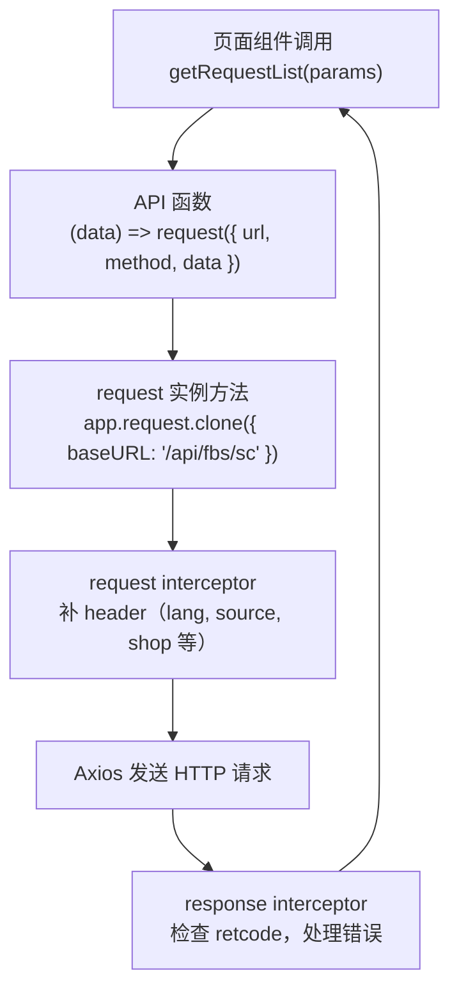

每一步的"函数作为值被传递"：

- 步骤 A→B：页面把 params 传给 API 函数。
- 步骤 B→C：API 函数内部调用了 `request({...})`——这里 `request` 是一个被宿主包装过的 Axios 实例，本质上也源自函数调用。
- 步骤 C→D：request interceptor 是在 `forEach` 循环中注册的回调函数，它通过闭包访问 `app`、`getFbsScSource` 等模块级变量。
- 步骤 E→F：response interceptor 同样是注册的回调，处理 Axios 返回的 response 对象。

### 六.2 Portal 的 `createApi` 工厂链

从 Portal 的 `src/apis/inbound.ts` 阅读：

```javascript
export const apiGetConfigInfo = createApi('GET', '/portal/inbound/config/get');
```

理解这一行需要拆解两次闭包：

1. `createApi('GET', '/portal/inbound/config/get')` 在模块加载时执行，返回 `(params) => request.get('/portal/inbound/config/get', { params })`。
2. 页面调用 `apiGetConfigInfo({ region: 'br' })` 时，这个返回的函数执行，method 和 url 来自闭包。

这就是为什么一个两行的 API 定义能包含 method 选择、参数位置适配、请求实例选择等全套逻辑——工厂函数通过闭包把复杂逻辑封装了一次，每个 API 定义只暴露差异。

## 七、常见错误与修正

### 7.1 箭头函数的隐式返回导致对象字面量语法错误

```javascript
// 错误：花括号被解析为函数体
const createConfig = (base) => { baseURL: base };
// createConfig('/api') 返回 undefined

// 正确：用括号包裹对象字面量
const createConfig = (base) => ({ baseURL: base });
```

### 7.2 忘记闭包捕获的是变量引用而非快照

```javascript
function createCounters() {
  const result = [];
  for (var i = 0; i < 3; i++) {
    result.push(() => i);
  }
  return result;
}
const counters = createCounters();
console.log(counters[0]()); // 3，不是 0！
```

现代写法用 `let` 或 `forEach` 替代 `var` + `for` 循环可以避免。

### 7.3 `this` 在回调中丢失

```javascript
class RequestManager {
  constructor() { this.baseURL = '/api'; }
  setup() {
    // 错误：普通函数中 this 取决于调用方式
    setTimeout(function() { console.log(this.baseURL); }, 100);
    // 正确：箭头函数保持 this
    setTimeout(() => { console.log(this.baseURL); }, 100);
  }
}
```

FBS 的 React 类组件中如果使用了传统类写法，需要特别注意这一点。好消息是三个 FBS 前端仓库都在向函数组件 + hooks 迁移。

### 7.4 模块导入未使用的变量

ES Module 的静态特性意味着构建工具（Webpack、Rspack）可以做 tree-shaking——移除未被使用的导出。但要注意副作用导入：

```javascript
import './init';  // 只执行模块的顶层代码，不导入任何值
```

这种写法在 FBS 代码中用于注册全局拦截器、初始化监控等场景。删除这类导入时要确认模块的副作用确实是需要的。

## 八、练习

### 8.1 作用域图

画出以下代码执行到 `console.log(url)` 时，所有变量的作用域链和可见性：

```javascript
// request.js
const baseURL = '/api/fbs/sc';
function createRequest() {
  const instanceId = Math.random();
  return function(config) {
    const fullURL = baseURL + config.url;
    console.log(fullURL, instanceId);
  };
}
const request = createRequest();
request({ url: '/inbound/list/' });
```

### 8.2 闭包改写

将以下重复代码改写为一个工厂函数，用闭包消除重复：

```javascript
const getInboundList = (params) => request({ url: '/inbound/list/', method: 'GET', params });
const getProductList = (params) => request({ url: '/product/list/', method: 'GET', params });
const getShopList = (params) => request({ url: '/shop/list/', method: 'GET', params });
```

### 8.3 预测 `this`

```javascript
const handler = {
  name: 'inbound',
  fetch: function() { console.log(this.name); },
  fetchArrow: () => { console.log(this.name); }
};

handler.fetch();          // ?
const f = handler.fetch;
f();                      // ?
handler.fetchArrow();     // ?
```

### 8.4 参考答案

**8.1** `fullURL` 在当前匿名函数作用域，`baseURL` 来自模块作用域（闭包捕获），`instanceId` 来自 `createRequest` 函数作用域（闭包捕获），`config.url` 来自参数。所有闭包变量在 `createRequest()` 返回后仍可访问。

**8.2** 参考实现：
```javascript
const createGetApi = (url) => (params) => request({ url, method: 'GET', params });
const getInboundList = createGetApi('/inbound/list/');
const getProductList = createGetApi('/product/list/');
const getShopList = createGetApi('/shop/list/');
```

**8.3** `handler.fetch()` 输出 `'inbound'`（方法调用，`this` 指向 `handler`）。`f()` 输出 `undefined`（普通函数调用，`this` 在非严格模式下指向全局对象，在严格模式和模块中为 `undefined`）。`handler.fetchArrow()` 输出 `undefined`（箭头函数的 `this` 来自定义时的外层作用域，即模块作用域）。

## 参考文献

- [MDN Functions Guide](https://developer.mozilla.org/en-US/docs/Web/JavaScript/Guide/Functions) — 函数声明、表达式、参数与闭包
- [MDN Arrow function expressions](https://developer.mozilla.org/en-US/docs/Web/JavaScript/Reference/Functions/Arrow_functions) — 箭头函数的语法与 `this` 行为
- [MDN import](https://developer.mozilla.org/en-US/docs/Web/JavaScript/Reference/Statements/import) — ES Module 导入语法
- [MDN export](https://developer.mozilla.org/en-US/docs/Web/JavaScript/Reference/Statements/export) — ES Module 导出语法
- [MDN Closures](https://developer.mozilla.org/en-US/docs/Web/JavaScript/Closures) — 闭包概念与示例
- [ECMAScript Specification — Function Objects](https://tc39.es/ecma262/#sec-terms-and-definitions-function) — 函数的规范定义


---

# Promise、async/await 与事件循环：读懂请求和页面副作用

> 预计学习时间：110–150 分钟
> 一句话总结：理解 Promise 的状态、`await` 的暂停语义、微任务执行顺序和错误传播——能读懂 FBS 页面中任何异步请求、数据初始化和并发组合，并能修复常见的漏 `await` 和漏错误处理问题。

## 这一章解决什么问题

后端同学对"异步"并不陌生。Go 有 goroutine + channel，Java 有线程池 + Future。但 JavaScript 的异步模型和他们都不一样：单线程、事件循环、Promise 链、`async`/`await` 只是语法糖、`Promise.all` 的失败即停行为……这些规则组合在一起，常常让第一次读到 FBS 页面代码的后端研发掉进同一个坑——以为 `await` 后面一定能拿到值，以为代码顺序就是执行顺序，忘了 `.catch` 或 `try/catch`。

本章从 FBS 的真实异步调用出发：API 请求、页面初始化 action、远端组件加载、并发导出等。你会先看懂一个请求从发起到 UI 更新的完整链路，然后理解事件循环如何调度"网络回来的数据"和"用户点击的按钮"之间的先后顺序。学完后你会发现，之前觉得"神秘"的 loading 状态切换、错误 toast 弹出时机、同时发多个请求的最佳写法，背后全是同一套规则在工作。

> 示例来自三个前端仓库的 release 分支（2026-07-20）。实际开发时以当前工作树为准。

## 一、Promise：一个可能还未完成的值

### 1.1 Promise 有三种状态

JavaScript 的 Promise 表示一个异步操作的最终结果。它只能是三种状态之一：

- **pending**：操作还在进行中，结果未知。
- **fulfilled**：操作成功，有一个值。
- **rejected**：操作失败，有一个原因（错误）。

状态一旦从 pending 变为 fulfilled 或 rejected，就永久固定，不能再次改变。

```javascript
const promise = getRequestList({ status: 'PENDING' });
console.log(promise); // Promise { <pending> } —— 请求还没返回
```

`getRequestList` 返回的不是数据，而是 Promise。这一点和后端同学习惯的同步 API 完全不同。你不能：

```javascript
// 错误示范——这样永远拿不到数据
const data = getRequestList({ status: 'PENDING' });
console.log(data); // Promise 对象，不是列表数据
```

### 1.2 `.then` 和 `.catch`：在 Promise 完成后执行

```javascript
getRequestList({ status: 'PENDING' })
  .then(response => {
    console.log(response.data); // 请求成功后的数据
  })
  .catch(error => {
    console.error('请求失败', error);
  })
  .finally(() => {
    console.log('无论成功还是失败都会执行');
  });
```

`.then` 的第一个参数是 fulfilled 回调，第二个参数（可选）是 rejected 回调。但在 FBS 代码中，几乎总是用 `.catch` 单独处理错误，保持清晰的成功/失败分离。

### 1.3 `.then` 返回新 Promise，可以链式调用

这是 Promise 最强大的特性之一：每个 `.then` 返回一个新的 Promise，可以继续链式调用：

```javascript
getRequestList({ status: 'PENDING' })
  .then(response => response.data)          // 提取 data
  .then(data => data.list)                  // 提取 list
  .then(list => list.filter(item => item.urgent))  // 过滤
  .catch(error => console.error(error));
```

每一步的返回值都会自动包装成 Promise。即使 `.then` 的回调返回了一个普通值，链上的下一个 `.then` 也能拿到它。

注意：`.catch` 放在链的末尾可以捕获前面任何一步的错误。但如果 `.catch` 之后还有 `.then`，后面的 `.then` 仍会执行——`.catch` 返回的也是 Promise。

### 1.4 Promise 构造函数：包装回调风格的 API

在 FBS 代码中不常见（Axios 已经返回 Promise），但了解它对理解旧代码很有帮助：

```javascript
function delay(ms) {
  return new Promise((resolve, reject) => {
    setTimeout(() => {
      resolve('done');
    }, ms);
  });
}
```

`resolve` 将 Promise 转为 fulfilled，`reject` 将其转为 rejected。Promise 构造函数是同步执行的，但 `resolve`/`reject` 通常是异步调用的。

## 二、`async`/`await`：让异步代码读起来像同步

### 2.1 基础语法

`async` 函数自动返回 Promise。`await` 暂停函数执行直到 Promise 完成：

```javascript
async function loadInboundPage() {
  const response = await getRequestList({ status: 'PENDING' });
  // 这行在请求完成后才执行
  console.log(response.data);
  return response.data;
}
```

这是 `getRequestList().then(response => { ... })` 的等价写法。但 `await` 让代码从上到下读起来像同步流程，不需要嵌套回调。

### 2.2 关键误区：`await` 不会阻塞主线程

"暂停执行"是指暂停**当前 async 函数**，不是暂停整个 JavaScript 线程。在 `await` 等待网络请求的几百毫秒里，用户的点击、滚动、定时器、其他 async 函数全都正常运作。

```javascript
async function loadA() {
  const data = await slowRequest(); // 等了 2 秒
  console.log('A done');
}
async function loadB() {
  console.log('B done instantly');
}
loadA(); // 开始等待
loadB(); // 立即执行，不会等 loadA 完成
// 输出顺序：B done instantly  →  (2 秒后)  A done
```

### 2.3 错误处理：`try/catch`

```javascript
async function loadPage() {
  try {
    const response = await getRequestList({ status: 'PENDING' });
    return response.data;
  } catch (error) {
    console.error('加载失败', error);
    return []; // 返回空列表作为降级
  }
}
```

`catch` 可以捕获 `await` 后面 Promise 的 rejected 状态。如果 `async` 函数内部抛出的错误没有被 `catch`，它会作为函数返回 Promise 的 rejection 向外传播。

```javascript
async function faultyLoad() {
  const data = await getRequestList({});
  data.nonexistent.method(); // 同步抛出 TypeError
  return data;
}
// faultyLoad() 返回的 Promise 是 rejected，可以 .catch 捕获
```

### 2.4 忘记 `await` 的后果

这是后端同学最常踩的坑：

```javascript
// 错误：忘记 await
const response = getRequestList({ status: 'PENDING' });
console.log(response.data); // undefined —— response 是 Promise 对象
response.list.filter(...);  // TypeError: Cannot read properties of undefined

// 正确：
const response = await getRequestList({ status: 'PENDING' });
```

如何发现这类问题？如果变量出现在 `response.data` 这类访问模式中，但你在 `response` 上找不到 `.data`，它很可能是一个未 `await` 的 Promise。

## 三、并发：`Promise.all`、`Promise.allSettled` 与串行

### 3.1 `Promise.all`：全部成功或任意失败

当多个请求互不依赖时，用 `Promise.all` 同时发起，等待全部完成：

```javascript
const [inboundList, productList, shopInfo] = await Promise.all([
  getRequestList({ status: 'PENDING' }),
  getProductList({ status: 'ACTIVE' }),
  getShopInfo(),
]);
```

关键行为：**只要任何一个 Promise rejected，`Promise.all` 立即 rejected**，其余 Promise 的结果被丢弃（但它们请求仍在进行）。这意味着如果你用 `Promise.all` 处理三个独立请求，一个失败就会丢掉另外两个成功的结果。这在表单初始化和数据看板中可能是严重问题。

### 3.2 `Promise.allSettled`：等待全部完成，不管成败

```javascript
const results = await Promise.allSettled([
  getRequestList({ status: 'PENDING' }),
  getProductList({ status: 'ACTIVE' }),
  getShopInfo(),
]);

// results = [
//   { status: 'fulfilled', value: {...} },
//   { status: 'rejected', reason: Error(...) },
//   { status: 'fulfilled', value: {...} },
// ]

results.forEach((result, index) => {
  if (result.status === 'fulfilled') {
    console.log(`请求 ${index} 成功`, result.value);
  } else {
    console.error(`请求 ${index} 失败`, result.reason);
  }
});
```

当每个请求有自己的降级策略（如缓存、默认值、空列表），不需要因为一个失败就放弃全部结果时，用 `Promise.allSettled` 更合适。FBS 的数据看板和多模块首页通常会倾向于这种模式。

### 3.3 `Promise.race`：谁先完成用谁

`Promise.race` 返回第一个 settled 的 Promise 的结果。FBS 代码中常用于超时控制：

```javascript
const result = await Promise.race([
  getRequestList({ status: 'PENDING' }),
  new Promise((_, reject) => setTimeout(() => reject(new Error('请求超时')), 10000)),
]);
```

### 3.4 串行 vs 并行的选择

```javascript
// 串行：第二个请求依赖第一个的结果
const user = await getUserInfo();
const permissions = await getUserPermissions(user.id);

// 并行：两个请求互不依赖
const [config, list] = await Promise.all([
  getConfig(),
  getRequestList({ status: 'PENDING' }),
]);
```

判断标准只有一条：第二个请求的参数是否来自第一个请求的结果。不要因为"看起来更安全"就写成串行——两个独立请求串行会浪费一倍以上的等待时间。

## 四、事件循环：为什么 `await` 后面不一定是下一行

### 4.1 宏任务与微任务

JavaScript 的事件循环是单线程的，但通过任务队列管理异步操作。两类任务：

- **宏任务**（task）：`setTimeout`、`setInterval`、I/O、UI 渲染、事件监听。
- **微任务**（microtask）：Promise 的 `.then`/`.catch`/`.finally`、`await` 后面的代码（本质是 `.then`）、`queueMicrotask`、`MutationObserver`。

执行规则：先执行一个宏任务，然后清空所有微任务队列，再取下一个宏任务。

### 4.2 经典执行顺序示例

```javascript
console.log('1');

setTimeout(() => console.log('2'), 0);

Promise.resolve().then(() => console.log('3'));

console.log('4');

// 输出：1 → 4 → 3 → 2
```

为什么？`console.log('1')` 和 `console.log('4')` 是同步代码，在当前宏任务中立即执行。`setTimeout` 的回调放入宏任务队列。`Promise.resolve().then(...)` 的回调放入微任务队列。

当前宏任务执行完后，事件循环先检查微任务队列——`console.log('3')` 被执行。然后才从宏任务队列取出 `console.log('2')`。

### 4.3 `await` 的微观行为

```javascript
async function demo() {
  console.log('A');
  await Promise.resolve();
  console.log('B');
}
console.log('C');
demo();
console.log('D');
// 输出：C → A → D → B
```

`console.log('C')` 和 `demo()` 都是同步。`demo` 内部先 `console.log('A')`，然后遇到 `await`——这里很关键：`await` 把它**后面的代码**（`console.log('B')`）放入微任务队列，然后 `demo` 函数暂停，控制权交回调用方。于是 `console.log('D')` 在同步代码中继续执行。同步代码执行完后，微任务队列中的 `console.log('B')` 被执行。

### 4.4 在 FBS 代码中的应用

理解事件循环对阅读 FBS 页面初始化代码非常重要：

```javascript
async function initPage() {
  this.loading = true;          // 1. 同步：设置 loading 状态
  try {
    const data = await getRequestList(params); // 2. 发起请求，后续代码进入微任务
    this.list = data.list;      // 3. 在微任务中更新列表
  } finally {
    this.loading = false;       // 4. 在微任务中清除 loading
  }
}
```

1→2→3→4 的顺序看似自然，但要注意：第 1 步设置 `loading = true` 后，到第 3 步更新列表之间有网络请求的延迟。在这期间，UI 已经渲染了 loading 状态，用户可以正常交互。如果代码在 `await` 之前漏掉了 `loading = true`，用户会在请求期间看到旧数据或无反馈状态。

另外，如果你想在数据加载完后"确保 UI 已经更新"，直接在 `this.list = data.list` 之后访问 DOM 可能拿不到新渲染——UI 渲染也是一个宏任务，在微任务清空后才会执行。

## 五、异步遍历与初始化模式

### 5.1 串行遍历中的 `await`

```javascript
// 如果需要顺序执行（每个请求依赖前一个的结果）
async function processItems(items) {
  for (const item of items) {
    const result = await processItem(item.id);
    console.log(result);
  }
}

// 不要用 forEach + async——forEach 不等待回调返回的 Promise
items.forEach(async (item) => {
  await processItem(item.id); // 这个 await 没有用！
});
```

`forEach` 的签名是 `(callback) => void`，它不会等待回调返回的 Promise。用 `for...of` 替代。

### 5.2 页面初始化中的异步 pattern

FBS 页面的典型初始化模式：

```javascript
async mounted() {
  try {
    await Promise.all([
      this.fetchInboundList(),
      this.fetchProductList(),
    ]);
  } catch (error) {
    this.error = error.message;
  } finally {
    this.loading = false;
  }
}
```

或者 React 函数组件中的等效写法：

```javascript
useEffect(() => {
  let cancelled = false;
  async function load() {
    setLoading(true);
    try {
      const [list, config] = await Promise.all([
        getRequestList(filter),
        getConfig(),
      ]);
      if (!cancelled) {
        setList(list);
        setConfig(config);
      }
    } catch (error) {
      if (!cancelled) setError(error.message);
    } finally {
      if (!cancelled) setLoading(false);
    }
  }
  load();
  return () => { cancelled = true; };
}, [filter]);
```

`cancelled` 标志位解决的是组件卸载后的 setState 警告——当 `await` 期间用户导航到其他页面，Promise 仍然会 resolve，但组件已经不存在了。

## 六、在仓库中阅读异步代码

### 六.1 Vuex action 的异步链

FBS SC Vue 仓库中，Vuex action 是典型的异步函数：

```javascript
// 简化自 FBS_STORE 的初始化 action
async function initFBSStore({ commit, dispatch, state }) {
  commit('SET_INIT_LOADING', true);
  try {
    const [sellerInfo, shopInfo] = await Promise.all([
      dispatch('fetchSellerInfo'),
      dispatch('fetchShopInfo'),
    ]);
    commit('SET_SELLER_INFO', sellerInfo);
    commit('SET_SHOP_INFO', shopInfo);
    if (sellerInfo.enableOneClickRegistration) {
      await dispatch('fetchClientRequestStatus');
    }
  } finally {
    commit('SET_INIT_LOADING', false);
  }
}
```

注意这里用了两层 `dispatch`：外层 action 通过 `dispatch` 调用内层 action。每个 `dispatch` 返回一个 Promise，所以可以用 `await`。`Promise.all` 确保两个不互依赖的请求同时发出。如果 `enableOneClickRegistration` 为 true，再串行发起第三个请求。

### 六.2 请求拦截器中的异步

```javascript
itemRequest.interceptors.response.use(
  (response) => {           // 同步回调
    response = handleErrorMsg(response);
    return response;
  },
  (error) => {              // 同步回调
    return Promise.reject(error);
  },
);
```

Axios 的 response interceptor 回调是同步的。如果需要在拦截器中做异步操作（如刷新 token 后重试），必须返回一个 Promise：

```javascript
itemRequest.interceptors.response.use(
  undefined,
  async (error) => {
    if (error.response?.status === 401) {
      await refreshToken();
      return itemRequest(error.config); // 用新 token 重试
    }
    return Promise.reject(error);
  }
);
```

### 六.3 并发导出任务

FBS 的导出功能经常涉及多个异步任务的并发：

```javascript
// 简化自批量导出逻辑
async function batchExport(ids) {
  const tasks = ids.map(id => exportForPdf({ id }));
  const results = await Promise.allSettled(tasks);

  const succeeded = results
    .filter(r => r.status === 'fulfilled')
    .map(r => r.value);

  const failed = results
    .filter(r => r.status === 'rejected')
    .map(r => r.reason.message);

  return { succeeded, failed };
}
```

这里用 `Promise.allSettled` 而非 `Promise.all`，因为一个导出失败不应该阻止其他导出任务。

## 七、常见错误与修正

### 7.1 漏 `await`

```javascript
// 错误
const data = fetchData();
processData(data); // data 是 Promise

// 正确
const data = await fetchData();
processData(data);
```

### 7.2 `Promise.all` 中一个失败全部丢弃

```javascript
// 可能不好：仪表盘某个模块失败就让整个页面崩溃
const [sales, inventory, alerts] = await Promise.all([
  getSalesData(),
  getInventory(),
  getAlerts(),
]);

// 更好：每个模块有自己的降级
const [sales, inventory, alerts] = await Promise.allSettled([
  getSalesData(),
  getInventory(),
  getAlerts(),
]).then(results => results.map(r =>
  r.status === 'fulfilled' ? r.value : null
));
```

### 7.3 `forEach` + `async` 不生效

```javascript
// 错误：forEach 不等待
items.forEach(async item => { await processItem(item); });

// 正确：
for (const item of items) { await processItem(item); }
// 或并发：
await Promise.all(items.map(item => processItem(item)));
```

### 7.4 `await` 后组件已卸载

React 中组件卸载后的异步更新是经典 bug：

```javascript
useEffect(() => {
  let cancelled = false;
  async function load() {
    const data = await getRequestList({});
    if (cancelled) return;  // 组件已卸载，不更新状态
    setList(data.list);
  }
  load();
  return () => { cancelled = true; };  // 清理函数
}, []);
```

### 7.5 错误被静默吞掉

```javascript
// 错误：错误被吞掉，页面永远 loading
async function load() {
  const data = await getRequestList({}).catch(() => {}); // data 是 undefined
  setLoading(false);
  setList(data.list); // TypeError
}

// 正确：至少记录错误或设置错误状态
async function load() {
  try {
    const data = await getRequestList({});
    setList(data.list);
  } catch (error) {
    setError(error.message);
  } finally {
    setLoading(false);
  }
}
```

## 八、练习

### 8.1 预测执行顺序

```javascript
console.log('start');

setTimeout(() => console.log('timeout'), 0);

Promise.resolve()
  .then(() => console.log('then 1'))
  .then(() => console.log('then 2'));

async function run() {
  console.log('async start');
  await Promise.resolve();
  console.log('async after await');
}
run();

console.log('end');
```

### 8.2 修复漏 `await`

以下代码意图是获取列表并过滤：

```javascript
function getUrgentList(params) {
  const response = getRequestList(params);
  const list = response.data.list;
  return list.filter(item => item.urgentStatus);
}
```

找出问题并修复。如果有多个修复方式，说明各自适用场景。

### 8.3 并发改造

以下代码中，三个请求互相独立，但目前的写法是串行的。改写为并行版本，并为每个请求提供独立的错误处理（任一请求失败不影响其他请求的结果展示）：

```javascript
async function loadDashboard() {
  const stats = await getStats();
  const recentActivity = await getRecentActivity();
  const alerts = await getAlerts();
  return { stats, recentActivity, alerts };
}
```

### 8.4 参考答案

**8.1** 输出顺序：`start` → `async start` → `end` → `then 1` → `then 2` → `async after await` → `timeout`。关键理解点：`async after await` 需要在微任务队列中排队，排在 `then 1` 的微任务之后、`then 2` 之后，因为 `await Promise.resolve()` 等价于 `Promise.resolve().then(() => { ... })`。而 `timeout` 是宏任务，在所有微任务之后。

**8.2** 修复：把函数声明为 `async`，加 `await`。`const response = await getRequestList(params);`。另一个方式是用 `.then`：`return getRequestList(params).then(response => response.data.list.filter(...))`。前者更可读，适合有多个异步操作的场景；后者更紧凑，适合简单的链式处理。

**8.3** 并行版本参考：
```javascript
async function loadDashboard() {
  const [statsR, activityR, alertsR] = await Promise.allSettled([
    getStats(),
    getRecentActivity(),
    getAlerts(),
  ]);
  return {
    stats: statsR.status === 'fulfilled' ? statsR.value : null,
    recentActivity: activityR.status === 'fulfilled' ? activityR.value : [],
    alerts: alertsR.status === 'fulfilled' ? alertsR.value : [],
  };
}
```

## 参考文献

- [MDN Promise](https://developer.mozilla.org/en-US/docs/Web/JavaScript/Reference/Global_Objects/Promise) — Promise API 完整文档
- [MDN async function](https://developer.mozilla.org/en-US/docs/Web/JavaScript/Reference/Statements/async_function) — `async`/`await` 语法
- [MDN Using promises](https://developer.mozilla.org/en-US/docs/Web/JavaScript/Guide/Using_promises) — Promise 使用指南
- [WHATWG Event loops](https://html.spec.whatwg.org/multipage/webappapis.html#event-loops) — 事件循环的规范定义
- [Jake Archibald: In The Loop](https://www.youtube.com/watch?v=cCOL7MC4Pl0) — JSConf.Asia 事件循环可视化演讲


---

# JavaScript 常用对象与 Web 数据处理

> 预计学习时间：100–140 分钟
> 一句话总结：掌握 FBS 前端仓库中高频使用的 Array、Object、String、Date、URL/URLSearchParams 和 JSON 方法——能独立完成列表筛选、查询参数构造、接口数据转换和时间处理，并理解可变性、时区和精度边界。

## 这一章解决什么问题

前端代码有一半是在处理数据。从接口拿到 JSON 响应，转成表格能渲染的字段；从表单收集用户输入，转成接口需要的查询参数；从日期选择器拿到 Date 对象，格式化成后端期望的时间字符串——每一步都在调用 JavaScript 内建对象的方法。

后端同学看这部分代码时，最常遇到的问题是：不知道哪些方法修改原对象、哪些返回新对象（可变性陷阱）；不知道 `Date` 的时区行为在不同浏览器和 Node 环境中可能不一致；不知道 `URLSearchParams` 的存在，于是手写了复杂的字符串拼接。

本章不穷举 JavaScript 所有内建对象。我们从 FBS 仓库的实际用法出发，只讲三个前端仓库中真正出现频率高的那些方法和对象。学完后，你读 FBS 的列表筛选、导出参数构造、时间格式化代码时，不需要逐个查 MDN。

> 示例来自三个前端仓库的 release 分支（2026-07-20）。

## 一、Array：列表操作的核心

### 1.1 是否修改原数组——最重要的第一课

JavaScript 的数组方法分为两类：修改原数组的（mutating）和返回新数组的（non-mutating）。FBS 代码遵循 React/Vue 的不可变更新原则，所以**返回新数组的方法占绝对主流**。但如果你不知道哪些方法会修改原数组，就可能在不该改的地方改了。

| 返回新数组（常用） | 修改原数组（注意） |
| --- | --- |
| `map`、`filter`、`concat`、`slice`、`flatMap` | `push`、`pop`、`shift`、`unshift`、`splice`、`sort`、`reverse` |
| 不会影响原数据，适合 React/Vue | 会改变原数组，React 中要避免直接用 |

```javascript
const list = [3, 1, 2];

// 返回新数组：原数组不变
const sorted = [...list].sort((a, b) => a - b); // sorted = [1,2,3], list = [3,1,2]

// 修改原数组：list 被改变了
list.sort((a, b) => a - b); // list = [1,2,3]
```

FBS 代码中如果需要排序，通常会在排序前用 `[...list]` 或 `list.slice()` 创建浅拷贝：

```javascript
const sortedList = [...requestList].sort((a, b) => a.ir_id - b.ir_id);
```

### 1.2 `map`：转换每个元素

`map` 是 FBS 代码中出现频率最高的数组方法。它遍历数组，对每个元素应用回调函数，返回一个新数组：

```javascript
// 从 FBS 导出逻辑中抽象
const exportIds = inboundList.map(item => item.ir_id);
// [1001, 1002, 1003, ...]

// 构造下拉选项
const options = warehouseList.map(wh => ({
  label: wh.warehouseName,
  value: wh.warehouseId,
}));
```

`map` 的回调签名：`(element, index, array) => newValue`。FBS 代码中绝大多数只用第一个参数。

### 1.3 `filter`：保留符合条件的元素

```javascript
// 从入库列表中筛选 urgent 状态的
const urgentList = inboundList.filter(item => item.urgentStatus);

// 筛选特定区域的
const regionList = inboundList.filter(item =>
  item.fbsWhsRegion === region
);
```

`filter` 始终返回新数组，即使只筛选出一个元素。没有匹配项时返回空数组 `[]`。

### 1.4 `find` 与 `findIndex`：找第一个满足条件的

```javascript
// 找到指定 IR ID 的详情
const detail = inboundList.find(item => item.ir_id === selectedId);
if (detail) {
  // 找到了
}
```

`find` 返回第一个匹配的元素，如果找不到返回 `undefined`。`findIndex` 返回索引，找不到返回 `-1`。

### 1.5 `some` 与 `every`：判断条件

```javascript
// 至少有一个是紧急的？
const hasUrgent = inboundList.some(item => item.urgentStatus);

// 全部都是已完成？
const allDone = inboundList.every(item => item.status === 'DONE');
```

这两个在权限检查、表单校验和条件渲染中频繁出现。`some` 找到第一个匹配就返回 `true`（短路），`every` 找到第一个不匹配就返回 `false`（短路）。空数组上 `some` 返回 `false`，`every` 返回 `true`（vacuous truth）。

### 1.6 `includes`：是否包含某个值

```javascript
if (vpiRouteNames.includes(to.route.name)) {
  // 当前路由是 VPI 管理页面
}
```

`includes` 使用 `SameValueZero` 算法比较，对基本类型按值比较，对对象按引用比较。

### 1.7 `reduce`：归约为单一值

```javascript
// 计算总费用
const totalFee = vasList.reduce((sum, item) => sum + item.estimatedFee, 0);

// 按状态分组
const grouped = inboundList.reduce((acc, item) => {
  const key = item.status;
  if (!acc[key]) acc[key] = [];
  acc[key].push(item);
  return acc;
}, {});
```

`reduce` 在 FBS 代码中用于汇总数值、分组和构建映射表。初始值参数（第二个参数）建议始终提供，否则空数组上的 `reduce` 会抛 TypeError。

### 1.8 `flat` 与 `flatMap`

`flatMap` 在 FBS 代码中用于"一对多"的映射：

```javascript
// 把每个入库单的 SKU 列表合并成一个平铺列表
const allSkus = inboundList.flatMap(item => item.skuList);
```

等价于 `map` + `flat(1)`。

## 二、Object：键值操作与属性遍历

### 2.1 属性访问：点号与方括号

```javascript
const config = { 'base-url': '/api', timeout: 5000 };
config['base-url']; // 方括号用于包含特殊字符的键
config.timeout;     // 点号用于标准标识符键
```

FBS 代码中绝大多数属性用点号访问。Vuex Store 的 getter 调用因为路径包含 `/`，必须用方括号：

```javascript
app.vue3VuexStore.getters['FBS_STORE/Shop/currentShop']
```

### 2.2 `Object.keys`、`Object.values`、`Object.entries`

```javascript
const filter = { status: 'PENDING', region: 'br' };
Object.keys(filter);   // ['status', 'region']
Object.values(filter); // ['PENDING', 'br']
Object.entries(filter); // [['status', 'PENDING'], ['region', 'br']]
```

`Object.entries` 在需要同时处理键和值的循环中最有用：

```javascript
for (const [key, value] of Object.entries(filter)) {
  if (value !== undefined && value !== '') {
    queryParams.append(key, value);
  }
}
```

### 2.3 属性存在性检查

```javascript
// 检查属性是否存在（包括继承的属性）
if ('toString' in obj) { /* ... */ }

// 检查是否是对象自身（非继承）的属性
if (Object.hasOwn(obj, 'fbsTag')) { /* ... */ }

// 检查属性值是否为 undefined
if (obj.fbsTag !== undefined) { /* ... */ }
```

FBS 代码中大多数情况下用 `!== undefined` 就够了。当属性的存在本身就有意义（如区分 `{ key: undefined }` 和 `{}`）时用 `in` 或 `Object.hasOwn`。

### 2.4 `Object.assign` 与展开运算符

```javascript
// 合并配置
const merged = Object.assign({}, defaultConfig, userConfig);

// 更常见的写法：展开运算符
const merged = { ...defaultConfig, ...userConfig };
// 后面的属性覆盖前面的同名属性
```

展开运算符在 FBS 代码中是默认的对象合并方式。

## 三、String：API 字段、路径与显示文本

### 3.1 基本方法速查

| 方法 | 作用 | 返回新字符串？ | FBS 典型场景 |
| --- | --- | :---: | --- |
| `includes(sub)` | 是否包含子串 | - | 路由判断、权限码检查 |
| `startsWith(prefix)` | 是否以 prefix 开头 | - | URL 前缀检查 |
| `endsWith(suffix)` | 是否以 suffix 结尾 | - | 文件扩展名检查 |
| `indexOf(sub)` | 子串首次出现的位置 | - | 查找路径分隔符 |
| `slice(start, end)` | 截取子串 | 是 | 截取路径、截取 ID |
| `split(separator)` | 按分隔符拆成数组 | 是 | 解析逗号分隔的 ID 列表 |
| `replace(pattern, replacement)` | 替换匹配项 | 是 | URL 替换 |
| `trim()` | 去除首尾空白 | 是 | 表单输入清理 |
| `toLowerCase()` | 转小写 | 是 | 比较忽略大小写 |
| `toUpperCase()` | 转大写 | 是 | 区域码标准化 |

### 3.2 模板字面量

```javascript
const message = `入库单 ${irId} 已${status === 'DONE' ? '完成' : '处理中'}`;
const url = `/portal/fbs/inbound/detail?ir_id=${irId}&region=${region}`;
```

模板字面量用反引号 `` ` `` 包裹，`${expression}` 嵌入表达式。相比 `+` 拼接，模板字面量更易读，且支持多行字符串。

FBS 代码中 URL 构造几乎全部使用模板字面量。

## 四、Number 与 Math：分页、库存与费用计算

### 4.1 `parseInt` 与 `parseFloat`

```javascript
const page = parseInt(params.page, 10); // 第二个参数是进制，建议始终提供
const fee = parseFloat(response.estimatedFee); // 字符串 '12.50' → 数字 12.5
```

从 URL 查询参数或 API 响应中提取数值时，这两个函数是最常用的。`Number()` 也可以做类型转换，但对非数字字符串行为不同：`Number('10abc')` 返回 `NaN`，`parseInt('10abc', 10)` 返回 `10`。

### 4.2 `toFixed` 与精度

```javascript
const displayFee = estimatedFee.toFixed(2); // '12.50'
```

`toFixed` 返回字符串，不是数字。用于展示，不用于继续计算。

### 4.3 数学运算与 `Math`

```javascript
Math.max(...list);    // 最大值
Math.min(...list);    // 最小值
Math.round(value);    // 四舍五入
Math.ceil(value);     // 向上取整
Math.abs(value);      // 绝对值
Math.random();        // 0 到 1 之间的随机数（不用于安全场景）
```

### 4.4 `NaN` 与 `Infinity`

```javascript
const bad = parseInt('abc', 10); // NaN
const div = 1 / 0;               // Infinity

// 检查 NaN 的正确方式（NaN !== NaN）
Number.isNaN(bad);               // true
// 检查有限数值
Number.isFinite(value);          // false for NaN, Infinity, -Infinity
```

## 五、Date：入库时间、截止日期与秒毫秒

### 5.1 Date 对象的基础

```javascript
const now = new Date();              // 当前时刻
const specific = new Date('2026-07-20T10:30:00Z'); // ISO 8601 UTC 时间
const fromTimestamp = new Date(1720000000000);     // 毫秒时间戳
```

Date 在 JavaScript 中表示一个时刻（时间线上的一个点），内部存储为自 1970-01-01 UTC 以来的毫秒数。

### 5.2 时区陷阱

`new Date()` 和 `Date` 的方法行为取决于运行环境（浏览器/Node.js）的时区设置。这是跨地区 FBS 业务中最重要的边界问题：

```javascript
const date = new Date('2026-07-20T00:00:00'); // 无时区后缀 = 本地时区解释
const dateUTC = new Date('2026-07-20T00:00:00Z'); // Z = UTC

// 在巴西时区 (UTC-3) 的浏览器中：
date.getTime() === dateUTC.getTime(); // false！相差 3 小时
```

FBS 的最佳实践：API 通信统一使用 UTC 时间戳（毫秒或秒），或带时区的 ISO 8601 字符串。展示层用 `toLocaleString` 或 `Intl.DateTimeFormat` 按用户时区格式化。

### 5.3 秒与毫秒

```javascript
const timestampMs = Date.now();              // 毫秒
const timestampSeconds = Math.floor(Date.now() / 1000); // 秒
const fromSeconds = new Date(timestampSeconds * 1000);  // 秒转 Date
```

不同后端接口可能返回秒级或毫秒级时间戳。检查 API 文档或看字段名后缀（`_at` 还是 `_ts`，`mtime` 还是 `mtime_ms`）。在 FBS 的 Go 后端中 `time.Unix()` 返回秒，前端接收后需要 `* 1000`。

### 5.4 格式化方法

```javascript
const date = new Date();
date.toISOString();            // '2026-07-20T03:15:30.000Z' —— API 请求体常用
date.toLocaleDateString('zh-CN'); // '2026/7/20' —— 页面展示
date.getFullYear();            // 2026
date.getMonth();               // 6 ← 注意：0-based，7 月 = 6
date.getDate();                // 20
```

`getMonth()` 返回 0-11 是最常见的坑。`date.toISOString().slice(0, 10)` 是取 YYYY-MM-DD 字符串的可靠方式。

## 六、JSON：前后端数据交换的通用语言

### 6.1 `JSON.stringify`：序列化

```javascript
const payload = {
  ir_id: 12345,
  status_list: ['PENDING', 'PROCESSING'],
};
const body = JSON.stringify(payload);
// '{"ir_id":12345,"status_list":["PENDING","PROCESSING"]}'
// Axios 会自动做这一步，API 函数中不需要手动调用
```

需要注意的值：
- `undefined`、`Function`、`Symbol` 在序列化时会被忽略（对象属性）或转为 `null`（数组元素）。
- `Date` 会调用 `toISOString()` 转为 UTC 字符串。
- 循环引用会导致 `TypeError`。

### 6.2 `JSON.parse`：反序列化

```javascript
const response = '{"retcode":0,"data":{"list":[],"total":0}}';
const parsed = JSON.parse(response);
console.log(parsed.data.list); // []
```

Axios 默认会调用 `JSON.parse` 解析响应体，但 FBS 的 request instance 配置了 `unpackData: false`，所以 `.then` 回调中拿到的 `response.data` 仍然是字符串（或已经被 Axios 解析后的对象，取决于 `responseType`）。实际行为以 request wrapper 配置为准。

### 6.3 `JSON.parse` 的 `reviver` 参数

```javascript
// 将 ISO 日期字符串自动转为 Date 对象
const data = JSON.parse(text, (key, value) => {
  if (typeof value === 'string' && /^\d{4}-\d{2}-\d{2}T/.test(value)) {
    return new Date(value);
  }
  return value;
});
```

这在需要将 API 返回的时间字符串转为 Date 对象时很有用，但 FBS 代码中更常见的做法是在拿到数据后手动转换。

## 七、URL 与 URLSearchParams：查询参数的正确打开方式

### 7.1 构造查询字符串

```javascript
const params = new URLSearchParams();
params.append('page', '1');
params.append('count', '20');
params.append('status', 'PENDING');
params.toString(); // 'page=1&count=20&status=PENDING'
```

对比手动拼接：

```javascript
// 不推荐：手动处理编码和边界
`page=${page}&count=${count}&status=${status}`

// 推荐：URLSearchParams 自动编码
const params = new URLSearchParams({ page, count, status });
```

FBS 代码中如果出现手动 URL 拼接，通常是因为 `URLSearchParams` 在某些旧版运行环境不可用（但 FBS 的 Node 16/20 和现代浏览器都支持）。

### 7.2 解析 URL 查询参数

```javascript
const url = new URL('https://example.com/page?ir_id=12345&region=br');
const irId = url.searchParams.get('ir_id'); // '12345'
```

### 7.3 从当前页面 URL 获取参数

```javascript
const params = new URLSearchParams(window.location.search);
const irId = params.get('ir_id');
```

FBS 的页面详情和列表筛选经常从 URL 中读取初始参数。

### 7.4 注意点

`URLSearchParams` 的值始终是字符串。需要数值或布尔值时要手动转换：

```javascript
const page = parseInt(params.get('page'), 10) || 1;
const urgent = params.get('urgent') === 'true';
```

## 八、Map 与 Set：特殊场景工具

### 8.1 Map：任意键类型的键值对

```javascript
const cache = new Map();
cache.set(irId, { data: inboundDetail, timestamp: Date.now() });
const cached = cache.get(irId);
cache.has(irId);    // true/false
cache.delete(irId);
```

相比普通 Object，Map 的优势是键可以是任意类型（包括对象）且有明确的 `.size` 属性。FBS 代码中 Map 用于缓存、ID 映射和去重。

### 8.2 Set：唯一值集合

```javascript
const selectedIds = new Set();
selectedIds.add(irId);
selectedIds.has(irId);  // true
selectedIds.delete(irId);
// 数组去重
const uniqueRegions = [...new Set(inboundList.map(item => item.region))];
```

Set 在 FBS 中用于选中项管理、去重和存在性检查。

## 九、综合：完成一个列表筛选数据转换

结合本章学到的所有方法，完成一个从接口数据到页面展示数据的完整转换：

```javascript
// 原始响应
const response = {
  retcode: 0,
  data: {
    list: [
      { ir_id: 1001, status: 'PENDING', mtime: 1720000000, whs_region: 'br', urgent: 1 },
      { ir_id: 1002, status: 'DONE', mtime: 1719900000, whs_region: 'sg', urgent: 0 },
      { ir_id: null, status: 'CANCELLED', mtime: 1719800000, whs_region: 'br', urgent: 1 },
    ],
    total: 3,
  }
};

// 转换：过滤无效数据 → 字段映射 → 时间格式化 → 排序
function transformInboundList(response) {
  const list = response?.data?.list ?? [];
  
  return list
    .filter(item => item.ir_id !== null)              // 移除异常记录
    .map(item => ({
      id: item.ir_id,
      status: item.status,
      // 秒级时间戳转毫秒再格式化
      updatedAt: new Date(item.mtime * 1000).toLocaleDateString('zh-CN'),
      region: item.whs_region.toUpperCase(),
      isUrgent: item.urgent === 1,                    // 数字转布尔
    }))
    .sort((a, b) => b.id - a.id);                     // 按 ID 降序
}

console.log(transformInboundList(response));
// [
//   { id: 1002, status: 'DONE', updatedAt: '2026/7/18', region: 'SG', isUrgent: false },
//   { id: 1001, status: 'PENDING', updatedAt: '2026/7/19', region: 'BR', isUrgent: true },
// ]
```

这个转换链条体现了 FBS 前端数据处理的核心模式：链式调用，不修改输入，每一步做一件事。

## 十、练习

### 10.1 不修改输入的列表转换

给定以下输入，编写一个函数，返回按 `estimatedFee` 降序排列、且只包含费用大于 0 的 SKU 列表。每个元素只保留 `sku_id`、`fee_display`（格式化为 `$XX.XX`）、`is_free`（布尔值）。

```javascript
const input = [
  { sku_id: 'A001', estimated_fee: '12.5', fee_currency: 'USD' },
  { sku_id: 'A002', estimated_fee: '0', fee_currency: 'USD' },
  { sku_id: 'A003', estimated_fee: '8.0', fee_currency: 'USD' },
  { sku_id: 'A004', estimated_fee: null, fee_currency: 'USD' },
];
```

要求：不能修改 `input` 数组和其中的任何对象。

### 10.2 时间处理

FBS 后端返回的时间戳为秒级 `1720000000`。编写一个函数 `formatTime(timestampInSeconds, locale)`，返回适合在页面上展示的时间字符串。如果 `timestampInSeconds` 为 `null` 或 `undefined`，返回 `'--'`。如果 `locale` 为 `'zh-CN'`，格式为 `2026/7/20`；如果为 `'en-US'`，格式为 `7/20/2026`。

### 10.3 URL 参数构造

编写函数 `buildFilterUrl(basePath, params)`：
- `basePath` 如 `/portal/fbs/inbound/list`
- `params` 如 `{ page: 1, status: 'PENDING', region: 'br' }`
- 如果 `params` 中某个值为 `null`、`undefined` 或空字符串，不包含在 URL 中
- 返回完整 URL 字符串

### 10.4 参考答案

**10.1** 参考实现：
```javascript
function transform(input) {
  return input
    .filter(item => parseFloat(item.estimated_fee) > 0)
    .map(item => ({
      sku_id: item.sku_id,
      fee_display: `$${parseFloat(item.estimated_fee).toFixed(2)}`,
      is_free: false,
    }))
    .sort((a, b) => parseFloat(b.fee_display.slice(1)) - parseFloat(a.fee_display.slice(1)));
}
```

**10.2** 参考实现：
```javascript
function formatTime(timestampInSeconds, locale = 'zh-CN') {
  if (timestampInSeconds == null) return '--';
  const date = new Date(timestampInSeconds * 1000);
  return date.toLocaleDateString(locale);
}
```

**10.3** 参考实现：
```javascript
function buildFilterUrl(basePath, params) {
  const search = new URLSearchParams();
  for (const [key, value] of Object.entries(params)) {
    if (value !== null && value !== undefined && value !== '') {
      search.append(key, value);
    }
  }
  const query = search.toString();
  return query ? `${basePath}?${query}` : basePath;
}
```

## 参考文献

- [MDN Array](https://developer.mozilla.org/en-US/docs/Web/JavaScript/Reference/Global_Objects/Array) — Array 全部方法
- [MDN Object](https://developer.mozilla.org/en-US/docs/Web/JavaScript/Reference/Global_Objects/Object) — Object 静态方法
- [MDN String](https://developer.mozilla.org/en-US/docs/Web/JavaScript/Reference/Global_Objects/String) — String 方法
- [MDN Date](https://developer.mozilla.org/en-US/docs/Web/JavaScript/Reference/Global_Objects/Date) — Date 对象
- [MDN JSON](https://developer.mozilla.org/en-US/docs/Web/JavaScript/Reference/Global_Objects/JSON) — JSON 方法
- [MDN URLSearchParams](https://developer.mozilla.org/en-US/docs/Web/API/URLSearchParams) — 查询参数构建
- [MDN Map](https://developer.mozilla.org/en-US/docs/Web/JavaScript/Reference/Global_Objects/Map) — Map 对象
- [MDN Set](https://developer.mozilla.org/en-US/docs/Web/JavaScript/Reference/Global_Objects/Set) — Set 对象


---

# TypeScript：从接口数据到组件 Props 的类型链

> 预计学习时间：110–150 分钟
> 一句话总结：读懂并编写 FBS 仓库中的 TypeScript 类型——接口、联合类型、泛型、类型收窄和工具类型——能为一个未类型化的 API 加最小类型并通过 type-check，理解类型只在编译期存在。

## 这一章解决什么问题

打开 FBS Portal 的 `src/apis/inbound.ts` 或 SC Vue 的任意 `.ts` 文件，首先看到的就是类型声明。后端同学对类型并不陌生——Go 的 `struct` 和 `interface`、Java 的 `class` 和泛型。但 TypeScript 的类型系统和它们有本质差异：TypeScript 是**结构类型**而非名义类型，类型在**运行时完全消失**（擦除），泛型比 Java 更灵活但也更"宽松"。

本章的核心目标是帮你建立一套读码习惯：看到 `interface InboundRequestShopSearchQuery` 时，知道这不是 Java 的 interface（不强制 implements），而是对对象形状的描述；看到 `Partial<ConfigParams>` 时，知道它把所有属性变成可选；看到 `(params: Params, configParams: RequestConfig = {}): ApiPromise<Data>` 时，能拆解泛型参数链。

学完后，你不需要手写复杂的类型体操。但你需要能在 FBS 仓库中：指出一个接口类型在编译时和运行时的区别，为未标注类型的 API 响应添加最小类型，以及读懂 `createApi` 这样的高阶泛型工厂函数。

> 本章示例来自三个前端仓库的 release 分支（2026-07-20）。TypeScript 版本以 SC 两仓的 4.7 和 Portal 的 4.4 为基线，不使用高版本语法。

## 一、核心概念：类型声明与类型擦除

### 1.1 类型注解 vs 运行时值

TypeScript 的 `interface`、`type`、`:` 类型注解只在编译时存在。编译成 JavaScript 后，它们完全被擦除：

```typescript
// TypeScript 源码
interface InboundItem {
  ir_id: number;
  status: string;
}

const item: InboundItem = { ir_id: 1001, status: 'PENDING' };

// 编译为 JavaScript 后：
// interface InboundItem 消失了
const item = { ir_id: 1001, status: 'PENDING' };
```

这意味着你不能在运行时做 `item instanceof InboundItem` 或反射获取接口的字段列表。TypeScript 提供的是**编译期**安全网，不是运行时类型信息。

### 1.2 结构类型系统

TypeScript 判断两个类型是否兼容，依据的是**形状**（有哪些属性、属性类型是什么），而不是名称或继承关系：

```typescript
interface Point {
  x: number;
  y: number;
}

interface Coordinate {
  x: number;
  y: number;
}

const p: Point = { x: 1, y: 2 };
const c: Coordinate = p; // 合法！形状兼容，不管名字
```

这和 Java/C# 的名义类型系统完全不同。在 FBS 代码中，这意味着两个不同文件里定义了相同形状的接口，它们可以互相赋值，不需要显式的类型转换或继承关系。

结构类型的实用价值：API 的响应类型不需要从某个基类继承，只要形状匹配就行。

### 1.3 类型推断

类型注解是可选的，TypeScript 会根据赋值推断类型：

```typescript
let count = 0;      // 推断为 number
const list = [];    // 推断为 never[] —— 空数组没有类型线索

const list2 = getRequestList(data); // 如果函数有返回类型注解，list2 自动获得类型
```

FBS 代码中，函数返回值和简单变量通常依赖推断，但 API 函数参数、组件 Props 和 Store state 会显式注解。

## 二、`interface` 与 `type`：描述对象形状

### 2.1 `interface`：描述对象的结构

FBS Portal 的 API 类型主要使用 `interface`：

```typescript
export interface ConfigParams {
  region: string;
  cb_option: number;
  shipping_method?: number;    // ? 表示可选属性
  pickup_method?: number;
  migrate_cal_available_date?: boolean;
  display_remaining_quota_sc?: boolean;
}
```

`interface` 可以描述对象形状。`?` 表示可选属性——该属性可以不存在，但不能是错误类型。

```typescript
const valid: ConfigParams = { region: 'br', cb_option: 1 };
const missing: ConfigParams = {};                       // 错误：region 和 cb_option 是必需的
const wrong: ConfigParams = { region: 'br', cb_option: '1' }; // 错误：cb_option 应该是 number
```

### 2.2 `type`：类型别名

`type` 可以为任意类型起别名：

```typescript
type Method = 'GET' | 'POST' | 'PUT' | 'PATCH' | 'DELETE';
type PermissionCode = string;  // 语义别名
type Callback<T> = (value: T) => void;
```

FBS 代码中，简单别名和联合类型通常用 `type`，复杂对象形状用 `interface`。两者大部分场景可以互换，但 `interface` 支持声明合并（同名 interface 自动合并），`type` 支持联合类型和映射类型。

### 2.3 `interface` 的声明合并

```typescript
interface Window {
  app: AppInstance;
}
// 在另一个文件中
interface Window {
  REPORT: ReportInstance;
}
// 现在 Window 同时有 app 和 REPORT 属性
```

FBS 代码中常利用声明合并为全局对象（如 `window`、宿主提供的 `app`）补充类型。这解释了为什么你可以在 `.ts` 文件中直接访问 `app.request` 而编辑器没有报错。

## 三、联合类型与类型收窄

### 3.1 联合类型：值可以是几种类型之一

```typescript
type Status = 'PENDING' | 'PROCESSING' | 'DONE' | 'CANCELLED';

function handleStatus(status: Status) {
  // status 只能是这四个字符串之一
}
```

FBS 代码中，字面量联合类型用于状态枚举、方法名（`'GET' | 'POST'`）、组件尺寸等取值有限的场景。

### 3.2 类型收窄：在分支中缩小类型范围

当 TypeScript 知道你检查了某个条件后，它会自动缩小变量的类型：

```typescript
function process(value: string | number) {
  if (typeof value === 'string') {
    // 这里 value 的类型被收窄为 string
    console.log(value.toUpperCase());
  } else {
    // 这里 value 的类型被收窄为 number
    console.log(value.toFixed(2));
  }
}
```

在 FBS 的权限判断代码中，类型收窄自然发生：

```typescript
export function hasPermission(permission: Permission | Permission[]) {
  const permissions = get(store.getState(), 'context.currentUser.permission_code_list', []);
  if (Array.isArray(permission)) {
    // permission 被收窄为 Permission[]
    return permission.some(item => permissions.includes(item));
  }
  // permission 被收窄为 Permission（单个字符串）
  return permissions.includes(permission);
}
```

`Array.isArray` 检查是 TypeScript 能自动识别的类型收窄方式之一。类似的还有 `typeof`、`instanceof`、`in`、`value !== null` 等。

### 3.3 可辨识联合（Discriminated Union）

在 FBS 的 API 响应类型中，一种常见的模式是用一个字段区分变体：

```typescript
interface SuccessResponse {
  retcode: 0;
  data: { list: InboundItem[] };
}

interface ErrorResponse {
  retcode: number;  // 非 0
  message: string;
}

type ApiResponse = SuccessResponse | ErrorResponse;

function handleResponse(response: ApiResponse) {
  if (response.retcode === 0) {
    // response 被收窄为 SuccessResponse
    console.log(response.data.list);
  } else {
    // response 被收窄为 ErrorResponse
    console.error(response.message);
  }
}
```

## 四、泛型：把类型当作参数

### 4.1 基础泛型

泛型在 FBS 代码中无处不在。Portal 的 `createApi` 就是一个泛型函数：

```typescript
export const createApi = <Params = any, Data = any>(
  method: Method,
  url: string,
  configs?: RequestConfig
) => {
  return (params: Params, configParams: RequestConfig = {}): ApiPromise<Data> => {
    // ...
  };
};
```

`<Params = any, Data = any>` 声明了两个类型参数，`= any` 是默认值（不传时默认为 `any`）。

调用时：

```typescript
// 显式提供类型参数
const apiGetConfigInfo = createApi<ConfigParams, any>('GET', '/portal/inbound/config/get');

// 也可以让 TypeScript 推断
export const apiGetConfigInfo = createApi<ConfigParams, any>(
  'GET',
  '/portal/inbound/config/get'
);
```

泛型让 `createApi` 能够"记住"不同 API 的参数类型：`apiGetConfigInfo` 的参数类型是 `ConfigParams`，`apiGetItemTagBlacklist` 的参数类型是 `Record<string, never>`（空对象）。

### 4.2 泛型约束

```typescript
interface HasId {
  id: number;
}

function findById<T extends HasId>(list: T[], id: number): T | undefined {
  return list.find(item => item.id === id);
}
```

`T extends HasId` 约束 T 必须满足 `{ id: number }` 的形状。这在 FBS 代码中的通用工具函数里出现。

### 4.3 读懂 `Record`、`Partial`、`Pick`、`Omit`

这些是 TypeScript 内建的泛型工具类型，FBS 代码中频繁使用：

```typescript
// Record<K, V>：键为 K、值为 V 的对象类型
type StatusMap = Record<string, string>; // { [key: string]: string }
// FBS 中用于 API 参数：Record<string, never> 代表空对象 {}

// Partial<T>：T 的所有属性变为可选
interface ConfigParams { region: string; cb_option: number; }
type PartialConfig = Partial<ConfigParams>;
// { region?: string; cb_option?: number; }
// FBS 中用于更新接口的参数类型

// Pick<T, K>：从 T 中挑选 K 属性
type InboundSummary = Pick<InboundItem, 'ir_id' | 'status'>;
// { ir_id: number; status: string; }
// FBS 中用于列表项展示类型

// Omit<T, K>：从 T 中排除 K 属性
type InboundWithoutInternal = Omit<InboundItem, 'internal_id'>;
// FBS 中用于排除前端不应使用的内部字段
```

### 4.4 条件类型简述

Portal 的 `createApi.ts` 中有条件类型的实际应用：

```typescript
type CheckNever<T> = T extends never ? true : false;
type CheckAny<T> = CheckNever<T> extends false ? false : CheckNever<T> extends true ? false : true;

export type ApiPromise<T = any> = T extends Blob
  ? CheckAny<T> extends true
    ? Promise<ApiResponse<T>>
    : Promise<Blob>
  : Promise<ApiResponse<T>>;
```

这段代码的作用是：如果 Data 类型参数是 `Blob`，返回类型根据泛型推断结果区分 `Promise<ApiResponse<Blob>>` 和 `Promise<Blob>`；如果不是 `Blob`，始终返回 `Promise<ApiResponse<T>>`。

读代码时不需要完全理解条件类型的实现细节。需要知道的是：当你写 `createApi<Params, Blob>(...)` 时，返回的是一个能处理二进制响应的函数；当你写 `createApi<Params, ListData>(...)` 时，返回的函数包含 `retcode` 检查逻辑。

## 五、类型断言与 `as`

### 5.1 类型断言：告诉 TypeScript "相信我"

```typescript
const element = document.getElementById('inbound-form') as HTMLFormElement;
element.submit(); // TypeScript 相信你的断言
```

类型断言是开发者覆盖 TypeScript 推断的方式。它不做任何运行时检查，用错了会在运行时出错。

### 5.2 `const` 断言

```typescript
const METHODS = ['GET', 'POST', 'PUT'] as const;
// 类型被推断为 readonly ['GET', 'POST', 'PUT']，而非 string[]
```

`as const` 让 TypeScript 推断最窄的类型（字面量类型、`readonly` 元组），而不是宽泛的类型。在 FBS 中用于常量定义和枚举替代。

### 5.3 非空断言 `!`

```typescript
const config = getConfig()!; // 告诉 TS：这不会是 null/undefined
```

应谨慎使用。FBS 代码中在确认值一定存在时偶尔出现。如果值确实可能是 `null`，用 `?.` 或 `??` 比 `!` 更安全。

## 六、在仓库中阅读 TypeScript 代码

### 六.1 Portal API 类型链

以 `fbs-frontend/src/apis/inbound.ts` 为例：

```typescript
// 1. 接口定义：描述 API 请求和响应形状
export interface InboundRequestShopSearchQuery {
  shop_id_or_name: string;
}

export interface InboundRequestShopSearchResponse {
  message: string;
  data: {
    shop_list: {
      creator: string;
      sync_status: number;
      shop_id: number;
      mtime: number;
      operator: string;
      // ...
    }[];
  };
}

// 2. 用 createApi<Params, Data> 创建类型安全的 API 函数
export const apiSearchShop = createApi<InboundRequestShopSearchQuery, InboundRequestShopSearchResponse>(
  'GET',
  '/portal/inbound/shop_search'
);

// 3. 页面中使用时，TypeScript 自动推断参数和返回值类型
apiSearchShop({ shop_id_or_name: '12345' })
  .then(response => {
    // response 类型被自动推断为 ApiPromise<InboundRequestShopSearchResponse> 的 resolved 值
    console.log(response.data.shop_list);
  });
```

整个类型链：`interface` → `createApi<Params, Data>` → 调用时自动推断。不需要在任何地方手动标注 `apiSearchShop` 的参数或返回值类型。

### 六.2 Vue SFC 中的 Props 类型

Vue 3 组件中，Props 可以用 TypeScript 类型声明：

```vue
<script setup lang="ts">
interface InboundDetailProps {
  irId: number;
  readonly?: boolean;
}

const props = defineProps<InboundDetailProps>();
// props.irId 的类型是 number
// props.readonly 的类型是 boolean | undefined
</script>
```

`defineProps` 是 Vue 3 的编译宏，不是运行时的函数。TypeScript 类型在编译时用于生成运行时的 Props 声明。

### 六.3 Store 类型

FBS 的 Vuex Store 使用 TypeScript 声明模块类型：

```typescript
interface ShopState {
  currentShop: Shop | null;
  shopList: Shop[];
}

// Vuex 模块中使用
const module: Module<ShopState, RootState> = {
  state: (): ShopState => ({
    currentShop: null,
    shopList: [],
  }),
  // ...
};
```

这确保了 `store.state.Shop.currentShop` 的类型是 `Shop | null`，从而在页面上访问 `currentShop.fbsWhsRegion` 时 TypeScript 会提示你可能为 `null`。

## 七、TS 版本边界：4.4 vs 4.7

FBS 三个前端仓库的 TypeScript 版本不一致：

- Portal (`fbs-frontend`)：TS 4.4.x
- SC Vue (`fbs-sc-vue`)：TS 4.7.x
- SC React (`fbs-sc-react`)：TS 4.7.x

关键差异：

| 特性 | TS 4.4 | TS 4.7（SC 两仓） |
| --- | :---: | :---: |
| 可选链 `?.` | ✓ | ✓ |
| 空值合并 `??` | ✓ | ✓ |
| `as const` | ✓ | ✓ |
| 模板字面量类型 | ✓ | ✓ |
| 控制流分析增强 | 有限 | 改进（属性访问收窄更好） |
| ESM Node.js 支持 | ✗ | ✓（但仓库不直接依赖此特性） |
| `satisfies` 关键字 | ✗ | ✗（4.9+ 才有） |

在写涉及 Portal 的类型代码时，不要使用 4.7+ 的语法。课程中的示例以 4.4 为最低公共基线，不依赖 4.7 独占特性。

## 八、常见错误与修正

### 8.1 混淆 `interface` 与运行时类型检查

```typescript
// 错误：TypeScript 类型在运行时不存在
function isConfigParams(obj: unknown): obj is ConfigParams {
  return obj instanceof ConfigParams; // 编译错误！
}

// 正确：手动检查形状
function isConfigParams(obj: unknown): obj is ConfigParams {
  return typeof obj === 'object' && obj !== null
    && 'region' in obj && 'cb_option' in obj;
}
```

### 8.2 过度使用 `any`

```typescript
// 不推荐
function process(data: any): any { return data.list; }

// 推荐：至少定义最小接口
function process(data: { list: unknown[] }): unknown[] { return data.list; }
```

`any` 会关闭类型检查，等于回到纯 JavaScript。FBS 代码中 `any` 主要出现在历史遗留代码和确实无法确定类型的边界（如 Axios response interceptor 的 error 参数）。新增代码优先用 `unknown` + 类型收窄。

### 8.3 可选属性未处理 `undefined`

```typescript
interface Shop {
  fbsShopId?: number;
}

const shop: Shop = {};
console.log(shop.fbsShopId.toFixed(2)); // 编译错误或运行时 TypeError
// 正确：
console.log(shop.fbsShopId?.toFixed(2) ?? 'N/A');
```

### 8.4 `as` 断言过多

```typescript
// 危险：掩盖了真正的类型问题
const data = response as unknown as MyType;

// 更好：定义类型守卫或使用 assertion function
function assertIsMyType(obj: unknown): asserts obj is MyType {
  if (!obj || typeof obj !== 'object') throw new Error('Invalid data');
}
```

## 九、练习

### 9.1 为未类型化 API 添加类型

以下是 FBS 中一个简化版 API 函数，目前没有类型注解。为请求参数和响应数据添加完整的类型定义：

```javascript
// 当前代码（无类型）
export function getInboundList(params) {
  return request({ url: '/inbound/list', method: 'GET', params });
}

// 已知：
// params: { page: number, count: number, status?: string, region?: string }
// 响应: { retcode: number, data: { list: Array<{ ir_id: number, status: string, mtime: number }>, total: number } }
```

### 9.2 类型收窄

对于以下类型，编写 `formatValue` 函数，接收 `string | number | boolean`，返回格式化字符串（数字保留两位小数，布尔转为 `'Yes'`/`'No'`，字符串原样返回）。必须在函数体内正确使用类型收窄，不能使用 `as` 或 `any`。

### 9.3 工具类型选择

根据场景选择最合适的工具类型：`Partial`、`Pick`、`Omit`、`Record` 或 `Required`。

a) 从 `InboundItem`（有 15 个字段）创建只含 `ir_id` 和 `status` 的列表展示类型。
b) 从 `ConfigParams` 创建所有字段都可选的更新参数类型。
c) 创建一个 key 为 `region` 字符串、value 为 `Warehouse[]` 的映射类型。
d) 从 `UserData` 排除 `password` 和 `token` 字段。

### 9.4 参考答案

**9.1** 参考：
```typescript
interface GetInboundListParams {
  page: number;
  count: number;
  status?: string;
  region?: string;
}

interface InboundItem {
  ir_id: number;
  status: string;
  mtime: number;
}

interface GetInboundListResponse {
  retcode: number;
  data: {
    list: InboundItem[];
    total: number;
  };
}

export function getInboundList(
  params: GetInboundListParams
): Promise<GetInboundListResponse> {
  return request({ url: '/inbound/list', method: 'GET', params });
}
```

**9.2** 参考：
```typescript
function formatValue(value: string | number | boolean): string {
  if (typeof value === 'string') return value;
  if (typeof value === 'number') return value.toFixed(2);
  return value ? 'Yes' : 'No';
}
```

**9.3** a) `Pick<InboundItem, 'ir_id' | 'status'>`；b) `Partial<ConfigParams>`；c) `Record<string, Warehouse[]>`；d) `Omit<UserData, 'password' | 'token'>`。

## 参考文献

- [TypeScript Handbook — Everyday Types](https://www.typescriptlang.org/docs/handbook/2/everyday-types.html) — 基础类型
- [TypeScript Handbook — Narrowing](https://www.typescriptlang.org/docs/handbook/2/narrowing.html) — 类型收窄
- [TypeScript Handbook — Generics](https://www.typescriptlang.org/docs/handbook/2/generics.html) — 泛型
- [TypeScript Handbook — Utility Types](https://www.typescriptlang.org/docs/handbook/utility-types.html) — 工具类型
- [TypeScript 4.7 Release Notes](https://www.typescriptlang.org/docs/handbook/release-notes/typescript-4-7.html) — SC 两仓 TS 基线
- [TypeScript 4.4 Release Notes](https://devblogs.microsoft.com/typescript/announcing-typescript-4-4/) — Portal TS 基线


---

# 浏览器与框架语法桥：DOM、事件、JSX、Vue SFC

> 预计学习时间：110–150 分钟
> 一句话总结：区分 JavaScript 语言、浏览器 Web API、React JSX 和 Vue SFC 四种不同的语法层——能读懂表单、事件、条件渲染、列表渲染和组件 Props/Emits，并将同一交互在 React 和 Vue 片段中逐项对应。

## 这一章解决什么问题

后端同学第一次看到 Vue SFC（`.vue` 文件）或 React JSX 时，最大的困惑不是语法本身，而是分不清哪些属于 JavaScript 语言、哪些是浏览器能力、哪些是框架的"魔法"。一个 `.vue` 文件里有 `<template>`、`<script>` 和 `<style>` 三个区域；一段 React 代码里 `onClick={() => handleClick(id)}` 看起来像 HTML 但又不一样。

本章不教你怎么从零搭建一个 React 或 Vue 项目——那是模块二的事。本章的目标是：当你打开 FBS 任一页面的 `.vue` 或 `.tsx` 文件时，你能说出每一段代码属于哪一层，理解数据从用户操作到页面更新的路径，以及 React 和 Vue 在同等功能上各自是怎么写的。

> 示例来自三个前端仓库的 release 分支（2026-07-20）。本节不展开状态管理、路由和构建配置。

## 一、理解四层语法边界

### 1.1 JavaScript 语言本身

这是你截至 FE-L05 已经学过的内容：变量、函数、Promise、Array 方法、TypeScript 类型。`const x = 1`、`array.map(fn)`、`await fetchData()` 都属于这一层。无论在什么框架中，这些规则都不变。

### 1.2 浏览器 Web API

浏览器提供了 JavaScript 运行时之外的全局对象：`document`（DOM 树）、`window`（全局上下文）、`fetch`（网络请求）、`localStorage`、`console` 等。这些不是 JavaScript 语言规范的一部分，而是浏览器宿主环境提供的。

```javascript
// 浏览器 API，不是 JavaScript 语言
document.getElementById('app');
window.location.href;
localStorage.setItem('key', 'value');
```

FBS 代码中直接使用浏览器 API 的场景相对少，因为 React 和 Vue 代替了直接的 DOM 操作。但你仍然会在初始化代码、工具函数和基础库中见到 `window`、`document` 和 `location`。

### 1.3 React JSX

JSX 不是 HTML，也不是 JavaScript 的正式一部分。它是 JavaScript 的**语法扩展**，看起来像 HTML 写在 JS 里，但编译后变成 `React.createElement()` 调用：

```jsx
// JSX 源码
const title = <h1 className="fbs-title">{name}</h1>;

// 编译后近似等价于：
const title = React.createElement('h1', { className: 'fbs-title' }, name);
```

关键区别：
- JSX 用 `className` 而非 HTML 的 `class`（因为 `class` 是 JavaScript 的保留字）。
- JSX 用 `{}` 嵌入 JavaScript 表达式（`{name}`），HTML 没有这个能力。
- JSX 的属性名使用 camelCase（`onClick` 而非 `onclick`）。
- JSX 的 `{}` 中可以放任何 JavaScript 表达式：变量、函数调用、三元运算符、`.map()` 等。

### 1.4 Vue SFC 与模板语法

Vue 的 `.vue` 文件是**单文件组件**（Single File Component），包含三个区域：

```vue
<template>
  <!-- Vue 模板语法：增强版 HTML -->
  <div class="fbs-ibt-detail" ref="ibtDetail">
    <h1>{{ $t('inboundProblemId') }}: {{ id }}</h1>
    <EdsTag v-if="!dataLoading" :status="status.type">
      {{ $t(status.label) }}
    </EdsTag>
  </div>
</template>

<script lang="ts">
// 标准 TypeScript/JavaScript
import { defineComponent, ref } from 'vue';
export default defineComponent({
  // ...
});
</script>

<style scoped>
/* CSS，scoped 确保样式只在当前组件生效 */
.fbs-ibt-detail { padding: 16px; }
</style>
```

Vue 模板语法是**增强版 HTML**，支持：
- `{{ }}`（Mustache 插值）：嵌入 JavaScript 表达式
- `v-` 指令：`v-if`（条件渲染）、`v-for`（列表渲染）、`v-model`（双向绑定）、`v-show`
- `:` 前缀（`v-bind` 简写）：动态绑定属性 `:status="status.type"`
- `@` 前缀（`v-on` 简写）：事件监听 `@click="handleClick"`

## 二、最小 DOM 与事件模型

在 FBS 代码中你很少直接操作 DOM，但理解 DOM 的基本模型能帮助你明白框架在做什么。

### 2.1 DOM 是一棵树

```javascript
const div = document.getElementById('app');
const children = div.children;      // HTMLCollection
const firstChild = div.firstElementChild;
const parent = div.parentElement;
```

### 2.2 事件监听

```javascript
// 原生事件监听
button.addEventListener('click', (event) => {
  console.log('clicked', event.target);
  event.preventDefault(); // 阻止默认行为
});
```

`addEventListener` 是浏览器提供的事件订阅机制。React 和 Vue 各自封装了这个机制，但你看到 `onClick` 或 `@click` 时，要知道它们的底层就是浏览器事件。

### 2.3 表单受控值

原生表单元素的值由 DOM 自身管理：

```html
<input type="text" id="keyword" />
```
```javascript
const value = document.getElementById('keyword').value;
```

React 和 Vue 通常采用"受控组件"模式：表单值由 JavaScript 状态管理，DOM 只是状态的反映。这意味着你改表单值时，不是改 DOM，而是改 JavaScript 状态。

## 三、React JSX 语法精要

### 3.1 组件：返回 JSX 的函数

```jsx
function InboundFilter({ onFilter, regions }) {
  return (
    <div className="filter-bar">
      <select onChange={(e) => onFilter({ region: e.target.value })}>
        {regions.map(r => (
          <option key={r} value={r}>{r}</option>
        ))}
      </select>
    </div>
  );
}
```

- 函数名首字母大写（这是 React 判断"组件" vs "普通 HTML" 的依据）。
- 返回 JSX。`()` 包裹多行 JSX 是约定，避免自动分号插入问题。
- 参数中的 `{ onFilter, regions }` 是解构 Props——父组件传入的数据。

### 3.2 条件渲染

React 中没有 `v-if`。条件渲染使用 JavaScript 表达式：

```jsx
// 三元运算符
{loading ? <Spinner /> : <Table data={list} />}

// 逻辑与短路
{error && <Alert type="error" message={error} />}

// 提前 return（整个组件级别）
if (!data) return <Empty />;
```

### 3.3 列表渲染

```jsx
{inboundList.map(item => (
  <InboundRow key={item.ir_id} data={item} />
))}
```

`key` 是 React 用于追踪列表项变化的标识。它必须是稳定且唯一的——通常是数据 ID，不能用数组索引（除非列表顺序永远不变）。

### 3.4 事件处理

```jsx
<button onClick={() => handleSubmit(formData)}>提交</button>
<button onClick={handleSubmit}>提交</button>  {/* 不需要传参时 */}
<input onChange={(e) => setKeyword(e.target.value)} />
```

React 事件名使用 camelCase（`onClick`、`onChange`），不是 HTML 的小写（`onclick`）。合成事件对象 `e` 是 React 包装过的，但行为和原生事件对象基本一致。

注意 `onClick={handleSubmit(formData)}` 是错误写法——这会在渲染时就调用函数。正确写法是用箭头函数包裹：`onClick={() => handleSubmit(formData)}`。

### 3.5 Props：数据向下流动

```jsx
// 父组件
<InboundDetail irId={selectedId} readonly={true} />

// 子组件
function InboundDetail({ irId, readonly }) {
  // irId 的类型是 number，readonly 是 boolean
}
```

Props 是只读的。子组件不能修改 Props，只能通过回调函数通知父组件修改。

## 四、Vue 模板语法精要

### 4.1 组件：template + script

```vue
<template>
  <div class="filter-bar">
    <EdsSelect v-model="selectedRegion" :options="regionOptions" @change="handleRegionChange" />
  </div>
</template>

<script lang="ts">
import { defineComponent, ref } from 'vue';

export default defineComponent({
  props: {
    regions: { type: Array, required: true },
  },
  emits: ['filter'],
  setup(props, { emit }) {
    const selectedRegion = ref('');

    const handleRegionChange = (value) => {
      emit('filter', { region: value });
    };

    return { selectedRegion, handleRegionChange };
  },
});
</script>
```

Vue 3 支持两种 API：Options API（`data`、`methods`、`computed` 等选项）和 Composition API（`setup` 函数或 `<script setup>`）。FBS 仓库中两种都存在，但新代码倾向 Composition API。

### 4.2 条件渲染

```vue
<EdsTag v-if="!dataLoading && basicInfo.urgentStatus">
  {{ $t('commonUrgent') }}
</EdsTag>
<BaseSkeleton v-else-if="dataLoading" :line="3" />
<template v-else>
  <div>默认内容</div>
</template>
```

`v-if` 真正从 DOM 中移除元素。`v-show` 只是切换 `display: none`，元素仍在 DOM 中。FBS 中切换频繁的元素用 `v-show`，条件很少变化的用 `v-if`。

### 4.3 列表渲染

```vue
<div v-for="item in inboundList" :key="item.ir_id">
  {{ item.status }}
</div>
```

`:key` 和 React 的 `key` 作用相同。

### 4.4 事件处理与双向绑定

```vue
<EdsButton @click="handleModify">{{ $t('commonModify') }}</EdsButton>
<EdsInput v-model="searchKeyword" />
```

`@` 是 `v-on` 的简写。`v-model` 是双向绑定的语法糖——它同时处理了 `:value`（数据到视图）和 `@input`（视图到数据）。

Vue 模板中的方法名不需要像 React 那样用箭头函数包裹，可以直接写方法引用。

### 4.5 Props 与 Emits

```vue
<!-- 父组件 -->
<InboundFilter :regions="regionList" @filter="handleFilter" />

<!-- 子组件 -->
<script setup lang="ts">
const props = defineProps<{ regions: string[] }>();
const emit = defineEmits<{ filter: [params: { region: string }] }>();
</script>
```

Vue 中数据向下流（Props），事件向上流（Emits）。这和 React 的 Props + 回调函数是同一个模式，只是语法不同。

## 五、React vs Vue：同一交互的两种写法

以"一个筛选下拉框，选择后触发列表刷新"为例，对比三种形态的写法：

### 5.1 React 16（Portal）

```jsx
function InboundPage() {
  const [region, setRegion] = useState('');
  const [list, setList] = useState([]);

  const handleRegionChange = (e) => {
    const newRegion = e.target.value;
    setRegion(newRegion);
    getRequestList({ region: newRegion }).then(res => setList(res.data.list));
  };

  return (
    <div>
      <select value={region} onChange={handleRegionChange}>
        <option value="">全部</option>
        {regions.map(r => <option key={r} value={r}>{r}</option>)}
      </select>
      {list.map(item => <InboundRow key={item.ir_id} data={item} />)}
    </div>
  );
}
```

### 5.2 Vue 3（SC Vue）

```vue
<template>
  <div>
    <EdsSelect v-model="region" :options="regionOptions" @change="handleRegionChange" />
    <InboundRow v-for="item in list" :key="item.ir_id" :data="item" />
  </div>
</template>

<script lang="ts">
export default defineComponent({
  setup() {
    const region = ref('');
    const list = ref([]);

    const handleRegionChange = async (value) => {
      const res = await getRequestList({ region: value });
      list.value = res.data.list;
    };

    return { region, list, handleRegionChange };
  },
});
</script>
```

### 5.3 React 18（SC React）

```jsx
function InboundPage() {
  const [region, setRegion] = useState('');
  const [list, setList] = useState([]);

  useEffect(() => {
    getRequestList({ region }).then(res => setList(res.data.list));
  }, [region]);

  return (
    <div>
      <select value={region} onChange={(e) => setRegion(e.target.value)}>
        <option value="">全部</option>
        {regions.map(r => <option key={r} value={r}>{r}</option>)}
      </select>
      {list.map(item => <InboundRow key={item.ir_id} data={item} />)}
    </div>
  );
}
```

三种写法的共同点：
- 用户操作 → 更新状态变量 → 框架自动重新渲染 UI。
- 列表用数组的 `.map()` 生成元素，每个元素需要唯一 `key`。
- 事件处理函数中执行异步请求，请求结果更新状态。

主要差异：
- React 16 的异步请求在事件处理函数中直接完成。
- Vue 3 用 `v-model` 简化双向绑定，响应式系统自动追踪依赖。
- React 18 用 `useEffect` 将"region 变化 → 请求列表"的逻辑分离，符合声明式编程风格。

## 六、SFC 的 template/script/style 边界

回到 FBS 的真实 `.vue` 文件，理解三个区域的职责和交互：

### 6.1 `<template>`：定义 DOM 结构

这是框架管理的 DOM 片段。`template` 中的 HTML 不是直接插入页面的 HTML——Vue 编译它为一个渲染函数：

```vue
<template>
  <div class="fbs-ibt-detail">
    <EdsForm :model="form" ref="fbsIbtRef" :rules="formRules">
      <EdsFormItem :label="$t('commonRequestId') + ':'">
        <ShowMore :list="requestIds" canClick @jump="jumpToRequest" />
      </EdsFormItem>
    </EdsForm>
  </div>
</template>
```

这里 `EdsForm`、`EdsFormItem`、`ShowMore` 是其他 Vue 组件，`form`、`fbsIbtRef`、`formRules`、`requestIds` 是在 `<script>` 中定义的 JavaScript 值。

### 6.2 `<script>`：定义数据和行为

```vue
<script lang="ts">
export default defineComponent({
  data() {
    return {
      form: { /* ... */ },
      id: '',
      dataLoading: true,
    };
  },
  computed: {
    canModify() {
      return this.basicInfo.editStatus !== 'NONE';
    },
  },
  methods: {
    async handleModify() {
      // ...
    },
  },
});
</script>
```

`data` 返回的数据是响应式的：修改时模板自动更新。`computed` 是计算属性——依赖变化时自动重新计算。`methods` 是普通函数，在模板中通过事件绑定调用。

### 6.3 `<style scoped>`：定义组件私有样式

```vue
<style scoped lang="less">
.fbs-ibt-detail {
  padding: 16px;
  .fbs-ibt-title {
    display: flex;
    justify-content: space-between;
  }
}
</style>
```

`scoped` 属性让这些 CSS 只作用于当前组件的元素。Vue 通过为组件的每个元素添加唯一属性（如 `data-v-xxx`）来实现隔离。FBS SC Vue 使用 Less 预处理器（`lang="less"`），FBS Portal 使用 CSS Modules，FBS SC React 使用 Less + CSS Modules。

## 七、在仓库中逐项对应

### 7.1 条件渲染对照

| 意图 | React JSX | Vue Template |
| --- | --- | --- |
| 满足条件才渲染 | `{condition && <Comp />}` | `<Comp v-if="condition" />` |
| if/else | `{cond ? <A /> : <B />}` | `<A v-if="cond" /><B v-else />` |
| 条件控制显示 | `style={{ display: cond ? '' : 'none' }}` | `<Comp v-show="cond" />` |

### 7.2 列表渲染对照

| 意图 | React JSX | Vue Template |
| --- | --- | --- |
| 遍历数组渲染 | `{list.map(item => <Row key={item.id} />)}` | `<Row v-for="item in list" :key="item.id" />` |

### 7.3 事件处理对照

| 意图 | React JSX | Vue Template |
| --- | --- | --- |
| 点击事件 | `onClick={handler}` | `@click="handler"` |
| 传参 | `onClick={() => handler(id)}` | `@click="handler(id)"` |
| 输入变化 | `onChange={e => set(e.target.value)}` | `v-model="value"` 或 `@change="handler"` |
| 阻止默认行为 | `e.preventDefault()` | `@click.prevent="handler"` |

### 7.4 数据传递对照

| 意图 | React JSX | Vue Template |
| --- | --- | --- |
| 父→子传数据 | `<Child prop={value} />` | `<Child :prop="value" />` |
| 子→父通信 | `<Child onChange={handler} />` | `<Child @change="handler" />` |
| 跨层级注入 | Context | Provide/Inject |

## 八、常见错误与修正

### 8.1 忘记 JSX 的表达式语法

```jsx
// 错误：把 JSX 当成 HTML 写
<div class="active"></div>

// 正确：JSX 用 className
<div className="active"></div>
```

### 8.2 Vue 模板中的 `v-for` 和 `v-if` 同级

```vue
<!-- 不推荐：两者在同一个元素上，v-if 优先级更高 -->
<div v-for="item in list" v-if="item.active" :key="item.id">

<!-- 推荐：用 computed 先过滤，或在外层包裹 -->
<template v-for="item in activeList" :key="item.id">
  <div>{{ item.name }}</div>
</template>
```

### 8.3 直接在 JSX `{}` 中写对象

```jsx
// 错误：对象不是合法的 React 子元素
<div>{ { name: 'FBS' } }</div>

// 正确：
<div>{ JSON.stringify({ name: 'FBS' }) }</div>
```

### 8.4 `v-model` 与单向数据流的冲突

```vue
<!-- 错误：同时在 Props 上使用 v-model 会尝试修改父组件数据 -->
<InboundRow v-model="props.item.status" />

<!-- 正确：通过 emit 通知父组件修改 -->
<InboundRow :status="props.item.status" @update:status="handleStatusChange" />
```

## 九、练习

### 9.1 框架语法对应

将以下 React JSX 代码改写为 Vue Template 语法，保持功能等价：

```jsx
function FilterBar({ regions, selectedRegion, onSelect }) {
  return (
    <div className="filter-bar">
      {regions.length > 0 ? (
        <select value={selectedRegion} onChange={(e) => onSelect(e.target.value)}>
          <option value="">全部</option>
          {regions.map(r => <option key={r} value={r}>{r}</option>)}
        </select>
      ) : (
        <span>暂无可用区域</span>
      )}
    </div>
  );
}
```

### 9.2 条件渲染判断

FBS 代码片段中：

```vue
<EdsTag status="error" v-if="!dataLoading && basicInfo.urgentStatus">
  {{ $t('commonUrgent') }}
</EdsTag>
```

回答：
- 在什么条件下这个标签会渲染？
- `dataLoading` 是 `true` 时会怎样？
- `basicInfo.urgentStatus` 是 `undefined` 时会怎样？
- 如果把 `v-if` 改成 `v-show`，行为会有什么差异？

### 9.3 找出 SFC 的各层代码

打开你本地的 `fbs-sc-vue/src/views/inbound/IBT/detail/index.vue`，找出并标记：
- 一处 JavaScript 语言本身的代码（不属于 Vue 也不属于浏览器 API）
- 一处 Vue 特有的模板语法
- 一处浏览器 API 调用（如果有的话）
- 一处组件 Props 传递

### 9.4 参考答案

**9.1** 参考：
```vue
<template>
  <div class="filter-bar">
    <select v-if="regions.length > 0" :value="selectedRegion" @change="(e) => onSelect(e.target.value)">
      <option value="">全部</option>
      <option v-for="r in regions" :key="r" :value="r">{{ r }}</option>
    </select>
    <span v-else>暂无可用区域</span>
  </div>
</template>
```

**9.2** 标签在 `dataLoading` 不为 `true`（即数据加载完成后）且 `basicInfo.urgentStatus` 是 truthy 值时渲染。`dataLoading` 为 `true` 时不渲染。`urgentStatus` 是 `undefined` 时不渲染（falsy）。`v-if` 切换会销毁/创建 DOM 元素，`v-show` 只是切换 `display` CSS——标签始终存在于 DOM 中。

## 参考文献

- [React Learn — Your First Component](https://react.dev/learn/your-first-component) — React 组件基础
- [React Learn — Writing Markup with JSX](https://react.dev/learn/writing-markup-with-jsx) — JSX 语法规则
- [React Learn — Conditional Rendering](https://react.dev/learn/conditional-rendering) — 条件渲染
- [React Learn — Rendering Lists](https://react.dev/learn/rendering-lists) — 列表渲染
- [Vue 3 Guide — Template Syntax](https://vuejs.org/guide/essentials/template-syntax.html) — Vue 模板语法
- [Vue 3 Guide — Components Basics](https://vuejs.org/guide/essentials/component-basics.html) — 组件基础
- [MDN Introduction to events](https://developer.mozilla.org/en-US/docs/Learn/JavaScript/Building_blocks/Events) — 浏览器事件
- [MDN Document Object Model](https://developer.mozilla.org/en-US/docs/Web/API/Document_Object_Model) — DOM 概述


---

# 启动三类 FBS 前端工程并建立仓库地图

> 预计学习时间：130–180 分钟
> 一句话总结：掌握 FBS 三个前端仓库的 Node 版本、包管理器、MMC/Webpack 构建工具和 dev server 的启动方式，能选择一仓完成完整启动并获得可核验的页面结果，另两仓能解释命令与运行边界。

## 这一章解决什么问题

后端研发最初接触 FBS 前端时，遇到的不是"看不懂 JSX"或"不会写组件"，而是更基础的问题：我应该用 Node 14 还是 Node 20？这三个仓库分别用 Yarn、pnpm 还是 npm？为什么 Portal 跑在 `localhost:8099`，Seller Center Vue 跑在 `localhost:4200`，而 React 模块又是另一个端口？`yarn install` 执行到一半报 registry 错误应该怎么排查？

本章从"能跑起来"这个最基本的目标出发，逐一核验三个仓库的环境要求，给出最小启动命令，然后帮你建立一张仓库职责地图。完成本章后，你至少能让一个前端仓库在本地成功启动并看到页面，另外两个仓库能说出它们的 Node 版本和启动命令。

学完本章不代表你能开始写前端代码——那是后续工程章节的事。但你会获得一个最重要的起点：知道在开始改代码之前，需要确认哪些工具版本，以及每个仓库的 `package.json` 里的 scripts 分别做什么。

> 本章基于三个前端仓库的 release 分支（2026-07-20）。环境要求、端口和命令可能随仓库演进变化，操作前以当前工作树的 `package.json` 和 `AGENTS.md`/fullstack Skill 为准。本章只支持 macOS + 公司开发环境。

## 一、先看完成后的结果

完成本章后，你应该能够：

1. 按顺序列出三个仓库使用的 Node 版本、包管理器和主要构建工具。
2. 在至少一个仓库中完成 `install → dev server → 浏览器打开页面` 的完整流程。
3. 在另外两个仓库中，能说出为什么它们的启动方式不同（而不是"因为没有试过"）。
4. 保存一张"仓库版本身份证"表格，包含 Node 版本、包管理器、构建工具、dev server 端口和启动命令。

## 二、工具与关系

FBS 三个前端仓库的技术栈不是一套统一配置。在开始安装之前，先建立它们的分工：

| 仓库 | 代号 | 框架 | Node | 包管理器 | 构建工具 | 定位 |
| --- | --- | --- | --- | --- | --- | --- |
| `fbs-frontend` | Portal | React 16 | `>=16 <17` | Yarn Classic | Webpack 5 | FBS Portal 管理后台、OPS 平台 |
| `fbs-sc-vue` | SC Vue | Vue 3 | 20.x（已验证） | Yarn Classic | MMC v3 / Rsbuild | Seller Center FBS 模块（Vue 版） |
| `fbs-sc-react` | SC React | React 18 | 20.x | pnpm 8 | MMC / Rsbuild | Seller Center FBS 模块（React 版）+ 远端组件 |

三者的角色分工：

- **Portal** 是独立运行的 SPA（Single Page Application）。它有自己的 Webpack dev server，直接访问 `http://localhost:8099`。不需要 MMC，不需要 Seller Center 宿主。
- **SC Vue** 是一个 MMF（Multi Module Framework）模块。它不能独立运行——本地 dev server 需要代理到 Seller Center 测试环境，通过 MMF Dev Tools（一个 Chrome 扩展）注入本地模块覆盖线上版本。
- **SC React** 也是一个 MMF 模块，但它是 pnpm monorepo 结构，包含 `projects/react-frontend`（主模块）和 `projects/fbs-sc-remote-component`（远端组件）。

对后端研发学习前端来说，推荐优先级：**SC Vue > Portal > SC React**。SC Vue 的 start 流程最简洁（`yarn dev`），且 Vue 3 + TypeScript 的模板语法比 React JSX 更接近后端同学习惯的声明式编码。Portal 则是最接近传统 Web 应用的开发体验，不需要 MMF 和宿主概念。

## 三、安装前核验

在尝试启动任何仓库之前，先确认你本机的 Node.js 环境。

### 3.1 检查和切换 Node 版本

```bash
# 查看当前 Node 版本
node -v
# 查看已安装的 Node 版本（如果使用 nvm）
nvm ls
```

FBS 仓库需要两个 Node 版本并存：Portal 需要 Node 16，两个 SC 仓库需要 Node 20。如果你使用 nvm，可以在不同终端窗口中分别设置：

```bash
# 终端 A（Portal）
nvm use 16
node -v  # 应该显示 v16.x.x

# 终端 B（SC Vue / SC React）
nvm use 20
node -v  # 应该显示 v20.x.x
```

如果未安装对应版本：

```bash
nvm install 16
nvm install 20
```

### 3.2 确认包管理器

```bash
# Yarn Classic（Portal 和 SC Vue）
yarn --version  # 应该显示 1.x.x，推荐 1.22.x

# pnpm（SC React）
pnpm --version  # 应该显示 8.x.x
```

如果缺少对应工具：

```bash
npm install -g yarn   # Yarn Classic
npm install -g pnpm@8 # pnpm 8
```

### 3.3 确认网络与 npm registry

FBS 仓库依赖公司内部 npm registry。启动前确认：

```bash
# 查看当前 registry
npm config get registry
# 应该返回公司内部 registry 地址

# 如果没有配置，按团队文档设置
# npm config set registry <内部地址>
```

如果你能看到 `package.json` 中的 `@scfe-common`、`@shopee` 等 scope 包成功下载，说明 registry 配置正确。如果 `yarn install` 或 `pnpm install` 在下载阶段卡住或报 404/401，通常是因为 registry 不通或未登录。

## 四、分仓库启动

### 4.1 SC Vue：最简洁的启动路径

SC Vue 是目前三个仓库中最容易完整的启动体验。进入仓库目录后，三步就能看到页面：

```bash
cd Work/FBS/fbs-sc-vue

# 1. 确保 Node 20
node -v  # v20.x.x

# 2. 初始化（安装依赖 + MMC + 拉取 i18n + 获取模块信息）
yarn run init
# 这一步会依次执行：
#   - yarn install（安装 npm 依赖）
#   - 安装 MMC v3 全局工具
#   - 拉取远程 i18n 翻译文件
#   - 获取模块在 Seller Portal 中的配置信息

# 3. 启动 dev server
yarn dev
# 默认在 http://localhost:4200 启动
```

`yarn run init` 是一个聚合命令。排查失败时，逐条执行子步骤：

```bash
yarn install          # 依赖安装失败 → 检查 registry 和网络
yarn run getKey       # 获取模块 key
yarn run getModule    # 获取模块远程配置
yarn run i18n:pull    # 拉取翻译文件
```

本地 dev server 启动后，`localhost:4200` 本身不会显示 FBS 页面。你需要在 Chrome 中安装 **MMF Dev Tools** 扩展，然后：

1. 访问 Seller Center 测试环境的任意页面。
2. 点击 MMF Dev Tools 图标，在弹出面板中填入模块 key 和 `localhost:4200`。
3. 刷新 Seller Center 页面，导航到 FBS 模块——此时页面渲染将由本地 dev server 提供。

完整 MMF 本地调试流程超出了语言基础的范围，但你现在需要知道的关键点是：SC Vue 和 SC React 都不能脱离宿主独立访问，它们依赖 MMF Dev Tools 注入本地构建产物。如果浏览器打开 `localhost:4200` 只看到空白页或默认页面，这是正常的——模块需要宿主环境。

### 4.2 Portal：独立 SPA 的启动路径

Portal 是最接近传统 Web 开发的体验，不依赖任何宿主或浏览器扩展：

```bash
cd Work/FBS/fbs-frontend

# 1. 确保 Node 16
node -v  # v16.x.x

# 2. 安装依赖
yarn install

# 3. 拉取 i18n 翻译文件
yarn i18n:pull

# 4. 启动 dev server
yarn start
# 默认在 http://localhost:8099 启动
```

启动成功后，直接在浏览器打开 `http://localhost:8099`，你应该能看到 FBS Portal 的登录页或首页。Portal 是独立 SPA，不依赖 Seller Center 宿主——这是它和两个 SC 仓库最根本的区别。

Portal 默认代理 API 请求到测试环境后端。如果你发现页面加载但数据为空，检查 Network 面板中的 API 请求是否返回了数据。如果 API 返回 401 或 CORS 错误，可能是因为 cookie/鉴权问题——Portal 需要你先在浏览器中登录过 test 环境的 Seller Center 或 Portal。

### 4.3 SC React：pnpm monorepo 的启动路径

SC React 使用 pnpm workspace 管理多个子项目，启动流程比 SC Vue 稍多一步：

```bash
cd Work/FBS/fbs-sc-react

# 1. 确保 Node 20 + pnpm 8
node -v  # v20.x.x
pnpm --version  # 8.x.x

# 2. 安装所有 workspace 的依赖
pnpm install

# 3. 初始化宿主（拉取模块信息、i18n 等）
pnpm run init:host

# 4. 启动主模块 dev server
pnpm run dev:host
# 项目入口为 projects/react-frontend
```

SC React 的 `pnpm-workspace.yaml` 定义了 workspaces：`projects/*`、`domains`、`basic`。`pnpm install` 会安装所有这些目录下的依赖。

如果你需要同时开发远端组件，另开一个终端窗口：

```bash
cd Work/FBS/fbs-sc-react
pnpm run init:remote   # 初始化远端组件
pnpm run dev:remote    # 启动远端组件 dev server
```

和 SC Vue 一样，本地 dev server 启动后也需要通过 MMF Dev Tools 注入。差异在于 SC React 的模块 ID 和端口配置可能不同——具体以 `mmc.config.js` 中的 `id` 字段和启动时的终端输出为准。

## 五、三种工程形态的差异地图

现在三仓的启动命令已在手边，更重要的是理解它们为什么不同。以下是横向对比：

| 维度 | Portal | SC Vue | SC React |
| --- | --- | --- | --- |
| **运行形态** | 独立 SPA | MMF 模块 | MMF 模块 + 远端组件 |
| **宿主** | 无 | Seller Center | Seller Center |
| **dev server 端口** | 8099 | 4200 | MMC 动态分配 |
| **本地调试方式** | 浏览器直连 | MMF Dev Tools 注入 | MMF Dev Tools 注入 |
| **路由注册** | React Router 5 文件定义 | MMF route config 数组 | `registerRouterModule` |
| **状态管理** | Redux + Recoil | Vuex（宿主注入） | Redux Toolkit + 宿主 Vuex |
| **请求库** | Axios 0.18 + Portal proxy | Axios（宿主 clone） | Axios 1.12（宿主 clone） |
| **样式方案** | Less + CSS Modules | Less + Vue scoped style | Less + CSS Modules |
| **i18n** | i18next + Transify | Transify（宿主提供） | Transify（宿主提供） |
| **权限** | 路由 + 操作权限码 | 路由 authCodes + 操作权限 | 路由 authCodes + 操作权限 |

这张表不是用来背的。它的作用是在你以后遇到问题时提供排查方向。如果 Portal 页面可以独立访问，两个 SC 仓库不能，因为它们缺少 Seller Center 宿主提供的基础设施（会话、Store、i18n、请求实例）。

### 5.1 MMC 的角色

MMC（Multi Module CLI）是 Seller Center 多模块框架的命令行工具。在两个 SC 仓库中，它承担了 Webpack/Rspack 配置、模块注册、产物打包和 dev server 管理。你不必深入理解 MMC 的内部实现，但需要知道：

- `mmc.config.js` 声明模块 ID、类型（module/portal/remote-component）、技术栈（vue3/react18）。
- dev server 启动时，MMC 读取 `mmc.config.js`，生成合适的 Webpack/Rsbuild 配置。
- 构建产物会包含模块元信息，Seller Center 宿主通过它加载模块。

### 5.2 为什么三个仓库的 Node 版本不一致

Portal 使用 Node 16 是因为它的依赖链中存在对 Node 17+ 不兼容的包（且 Portal 的 React 16 和 Webpack 5 组合在当前阶段不需要升级 Node）。两个 SC 仓库使用 Node 20 是因为 MMC v3 和 Rsbuild 对 Node 18+ 有要求。这不是"历史遗留问题"——这是正常的多项目并存状况，每个项目在自己的依赖兼容范围内选择最合适的 Node 版本。

你在不同仓库之间切换时，记得先切 Node 版本。最常见的问题是：在 SC Vue 目录下执行 `yarn dev`，但用的是 Node 16，导致 MMC 或某些依赖失败。

## 六、常见失败与排错路径

### 6.1 `yarn install` 卡在某个 scope 包

```text
error An unexpected error occurred: "...@scfe-common/xxx: Not found"
```

**排查顺序**：确认 registry 配置 → 检查内网连接 → 确认是否需要登录 → 检查是否在 VPN 环境中。如果你在公司内网但也有部分包报 401，尝试 `npm login --registry=<内部地址>`。

### 6.2 `mmc: command not found`

MMC 由 `yarn run init` 全局安装。如果 `init` 步骤执行了但 MMC 仍不可用，检查：

```bash
which mmc
# 如果找不到：
npm list -g @scfe/mmc
# 或全局重装
npm install -g @scfe/mmc
```

### 6.3 dev server 启动但浏览器访问空白

- **Portal (`localhost:8099`)**：确认 `yarn i18n:pull` 已执行。i18n 翻译文件缺失是 Portal 空白最常见的原因。检查浏览器 Console 是否有 `Cannot read properties of undefined (reading 'xxx')` 类似的错误。
- **SC Vue / SC React**：确认 MMF Dev Tools 已配置并启用。本地 dev server 的页面本身就是空白（或只有框架基础壳）——页面内容由宿主注入。

### 6.4 `yarn dev` 报端口占用

```bash
# 查看占用端口的进程
lsof -i :4200
# SC Vue 默认端口 4200
# Portal 默认端口 8099
```

如果需要修改端口， SC Vue 可以在 `mmc.config.js` 或启动命令中指定（取决于 MMC 版本），Portal 通过环境变量或 webpack devServer 配置修改。

### 6.5 切换仓库后忘记切 Node 版本

这是最简单也最高频的错误。养成习惯：进入任何 FBS 前端仓库后，第一个命令永远是 `node -v`，确认当前版本与仓库要求的范围一致。

## 七、验收记录

保存以下表格作为你完成本章的证据：

| 仓库 | Node 版本（实际） | 包管理器（版本） | `install` 成功 | dev server 成功 | 页面可访问 |
| --- | --- | --- | :---: | :---: | :---: |
| Portal (`fbs-frontend`) | | | | | |
| SC Vue (`fbs-sc-vue`) | | | | | |
| SC React (`fbs-sc-react`) | | | | | |

至少完成一行的全部勾选。另外两行至少完成前两列（版本信息）。这样做不是为了收集数据，而是为了建立一个习惯：在改代码之前，先确认自己站对了环境。

如果你在某一仓卡住了 20 分钟以上，不要继续硬排——先在剩下的仓库中完成一次完整启动，获得正向反馈和经验，再回头处理问题仓库。


### 6.6 启动顺序与依赖关系

三个仓库的启动有隐含的依赖顺序。如果你要完整验证一条从前端到后端的请求链路，启动顺序是：

1. **后端先启动**：`sbs-fbs-server` 的 API server 在测试环境已运行，本地通常不需要启动（除非你在做后端开发）。
2. **前端后启动**：任一前端仓库的 dev server。
3. **对于 SC 仓库**：还需要 MMF Dev Tools 注入 → 访问 Seller Center 测试环境。

如果你在本地同时启动了前端和后端，注意端口不要冲突。Portal 的 Webpack dev server 默认会代理 `/api` 请求到后端——检查 `webpack.config.js` 中的 devServer proxy 配置，确认代理目标指向正确的后端地址。

### 6.7 i18n 文件缺失导致的一系列问题

三个仓库在 `yarn install` 之后、`yarn dev` 之前都可能需要 i18n 文件。Portal 的 i18n 文件在 `yarn i18n:pull` 后生成到 `src/lang/`；SC Vue 的 i18n 由 `yarn run init` 步骤中的 `yarn i18n:pull` 生成。如果 i18n 文件缺失，常见症状是：

- 页面所有文字显示为 key 名（如 `inboundProblemId` 而非"入库问题 ID"）。
- Console 报 `Cannot read properties of undefined`——因为 `$t` 函数依赖的 i18n 实例未正确初始化。
- 某些组件（依赖翻译文件的）完全不渲染。

修复方式：确认 `src/lang/` 目录下有对应语言的 JSON 文件（如 `zh-CN.json`、`en.json`），如果没有，重新执行 `yarn i18n:pull`。

### 6.8 理解 dev server 的热更新机制

三个仓库的 dev server 都支持热更新（HMR——Hot Module Replacement）：你修改源码并保存后，浏览器中的页面自动刷新或局部更新，不需要手动重启 dev server。但 HMR 有边界：

- 修改 `.vue` 或 `.tsx` 组件文件：通常自动热更新。
- 修改 `mmc.config.js` 或 `webpack.config.js`：需要重启 dev server。
- 修改 `package.json` 或新增依赖：需要重新 `yarn install` 后重启。
- 修改路由配置：Vue Router 和 React Router 的配置变更通常需要手动刷新浏览器（不一定要重启 dev server）。

如果你改了代码但页面没变化，先确认文件是否正确保存，再确认 dev server 的终端输出是否有编译错误。HMR 失败时终端通常有明确的错误信息。

## 八、练习

### 8.1 三选一完整启动

选择 SC Vue 或 Portal 完成完整启动流程。保存以下证据：

- 终端中执行 `node -v` 和 `yarn --version` 的输出截图。
- `yarn dev`（或 `yarn start`）的启动日志中显示 "Compiled successfully" 或类似成功信息的截图。
- 浏览器中打开对应页面（Portal 直接打开，SC Vue 通过 MMF Dev Tools 注入）的截图。

### 8.2 建立仓库地图

在不查看上面表格的情况下，默写三个仓库的 Node 版本、包管理器和 dev server 默认端口。

### 8.3 解释差异

用一两句话解释：为什么 Portal 可以独立访问 `localhost:8099` 看到页面，而 SC Vue 访问 `localhost:4200` 不能直接看到 FBS 页面？

### 8.4 参考答案

**8.3**：Portal 是独立 SPA，它的 Webpack dev server 会渲染完整的 React 应用，因此浏览器直连即可看到页面。SC Vue 是 MMF 模块，它的 dev server 只提供模块的 JavaScript/CSS 产物，页面结构（HTML、宿主框架、导航栏、全局状态）由 Seller Center 宿主提供，模块只在宿主请求时才被加载。

## 参考文献

- [Node.js 16 API](https://nodejs.org/docs/latest-v16.x/api/) — Portal 运行线
- [Node.js 20 API](https://nodejs.org/docs/latest-v20.x/api/) — SC 两仓运行线
- [Yarn Classic Documentation](https://classic.yarnpkg.com/lang/en/docs/) — Portal 和 SC Vue 的包管理器
- [pnpm Documentation](https://pnpm.io/) — SC React 的包管理器
- [Webpack Concepts](https://webpack.js.org/concepts/) — Portal 构建工具
- [Rspack Introduction](https://rspack.rs/guide/start/introduction) — SC Vue 构建工具底层
- [Rsbuild Guide](https://rsbuild.rs/guide/start/) — SC Vue 构建工具配置层


---

# 组件、样式、表单与表格：按现有组件库做页面

> 预计学习时间：110–150 分钟
> 一句话总结：能在 FBS 的 React 16、Vue 3 或 React 18 项目中拆解组件树、传递 Props/Emits、处理表单事件，并优先复用 EDS/SSC UI 组件库——交付一个符合仓库模式的带校验字段小组件。

## 这一章解决什么问题

后端研发看前端页面时，常把整个页面当成一个巨大的"模板文件"。但实际上，FBS 的前端页面由多层组件嵌套组成：最外层是布局容器、中间是业务区块、最内层是表单控件和表格单元格。每一层都有自己接收的数据（Props）、自己的状态、自己发出的事件。

本章的核心不是讲 React 或 Vue 的组件原理，而是帮你上手 FBS 仓库中实际出现的模式：怎么把一个需求拆成组件，怎么复用仓库里已有的 EDS Button、SSC Table 而不是从零写 `<div>`，怎么在 Vue template 的 `v-model` 和 React 的 `useState` 之间切换，以及样式该放在 `scoped` 还是 `CSS Modules` 里。

学完本章后，你不会成为组件设计专家，但你会在看到入库列表页面时，能说出哪个部分是哪个组件，数据从哪里进来，事件从哪里出去，并且能照现有模式增加一个带校验的表单字段。

> 本章基于三个前端仓库的 release 分支（2026-07-20）。组件库版本、API 和样式约定以仓库当前代码为准。

## 一、识别现有页面中的组件树

以 SC Vue 的 IBT（Inbound Problem Ticket）详情页为例。打开 `fbs-sc-vue/src/views/inbound/IBT/detail/index.vue`，你会看到如下结构（已做精简标注）：

```vue
<template>
  <div class="fbs-ibt-detail">
    <EdsForm :model="form" :rules="formRules">
      <section class="fbs-ticket-info">
        <h1 class="fbs-ibt-title">
          <span>{{ $t('inboundProblemId') }}: {{ id }}</span>
          <EdsTag v-if="urgentStatus" status="error">
            {{ $t('commonUrgent') }}
          </EdsTag>
        </h1>
        <div class="fbs-ibt-content">
          <BaseSkeleton v-if="dataLoading" :line="3" />
          <template v-else>
            <EdsFormItem :label="$t('commonRequestId')">
              <ShowMore :list="requestIds" @jump="jumpToRequest" />
            </EdsFormItem>
          </template>
        </div>
      </section>
    </EdsForm>
  </div>
</template>
```

它的组件树可以画成：

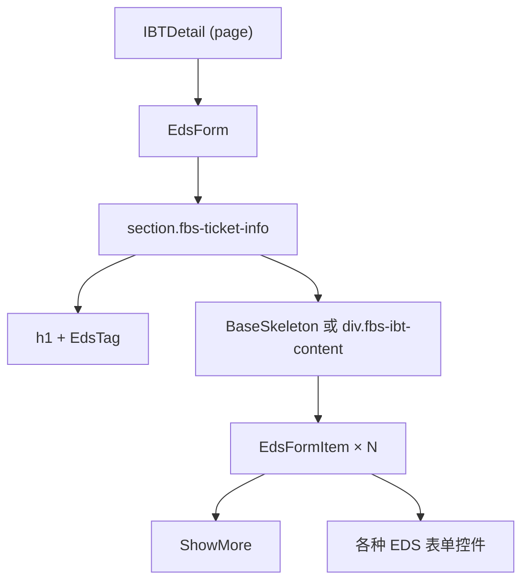

你需要学会的阅读方式：**不要从上往下按行读，而是按缩进识别组件边界**。`<EdsForm>` 开始到 `</EdsForm>` 结束是一个组件实例。它的子节点中的 `EdsTag`、`EdsFormItem`、`BaseSkeleton` 是子组件。`ShowMore` 是业务组件（来自本仓库 `src/views/` 而非组件库）。

### 1.1 区分三种组件来源

FBS 页面中出现的标签通常来自三类来源，学会区分它们是对页面做出改动的第一步：

| 来源 | 前缀/特征 | 示例 | 修改方式 |
| --- | --- | --- | --- |
| EDS/SSC UI 组件库 | `Eds` 或 `Ssc` 前缀 | `<EdsButton>`、`<EdsForm>`、`<SscTable>` | 查组件库文档，不修改组件源码 |
| 业务组件 | 无前缀，来自 `@/components` 或 `../` | `<ShowMore>`、`<InboundRow>` | 可以修改，但需确认影响范围 |
| HTML 原生元素 | 纯小写标签 | `<div>`、`<span>`、`<section>` | 按标准 HTML 处理 |

写新页面时，优先使用 EDS/SSC UI 组件库中的控件，而不是从零搭建 `<div>` + CSS。组件库提供了统一的交互、无障碍和主题适配。FBS Portal 和 SC Vue/React 使用同一套 EDS 组件库（各自版本可能略有差异），但 Portal 有独立的上层封装（`@/components/` 下）。

## 二、Props 与 Emits：组件之间的数据契约

### 2.1 Vue：Props 向下，Emits 向上

Vue 组件的数据流是单向的。父组件通过 Props 向子组件传递数据，子组件通过 Emits 向父组件发送事件：

```vue
<!-- 父组件 -->
<EdsTag :status="status.type" />
<ShowMore :list="requestIds" @jump="jumpToRequest" />
```

- `:status="status.type"`：冒号前缀是 `v-bind` 的简写，表示把 JavaScript 表达式 `status.type` 的值绑定到 Props `status`。
- `@jump="jumpToRequest"`：`@` 是 `v-on` 的简写，表示监听子组件发出的 `jump` 事件，并用父组件的 `jumpToRequest` 方法处理。

### 2.2 React：Props 向下，回调函数向上

React 没有 Emits 机制，子组件通过 Props 接收的回调函数通知父组件：

```jsx
// 父组件
<InboundRow data={item} onStatusChange={handleStatusChange} />

// 子组件内部
function InboundRow({ data, onStatusChange }) {
  return (
    <tr onClick={() => onStatusChange(data.id)}>
      <td>{data.status}</td>
    </tr>
  );
}
```

`onStatusChange` 是一等公民的函数，当作 Props 传入。这和 Vue 的 `@jump` 在语义上等价，但 React 中它没有特殊的语法——就是一个普通的 Props。

### 2.3 不要在子组件中修改 Props

无论是 Vue 还是 React，Props 是只读的。如果你需要在子组件中编辑数据，把数据复制到子组件的局部状态中（`data()` 或 `useState`），修改完成后通过 Emit 或回调通知父组件更新原始数据。

```vue
<!-- Vue：v-model 是修改 Props 的常见错误 -->
<!-- 错误 -->
<InboundRow v-model="props.item.status" />
<!-- 正确 -->
<InboundRow :status="props.item.status" @update:status="handleStatusChange" />
```

## 三、表单、校验与双向绑定

### 3.1 Vue 表单：`v-model` + EDS 组件

FBS Vue 仓库中，表单使用 `EdsForm` + `EdsFormItem` + `v-model`：

```vue
<template>
  <EdsForm :model="form" :rules="formRules" ref="formRef">
    <EdsFormItem label="IR ID" prop="irId">
      <EdsInput v-model="form.irId" />
    </EdsFormItem>
    <EdsFormItem label="状态" prop="status">
      <EdsSelect v-model="form.status" :options="statusOptions" />
    </EdsFormItem>
  </EdsForm>
</template>

<script lang="ts">
export default defineComponent({
  data() {
    return {
      form: { irId: '', status: '' },
      formRules: {
        irId: [{ required: true, message: '请输入 IR ID' }],
        status: [{ required: true, message: '请选择状态' }],
      },
    };
  },
});
</script>
```

`v-model` 的双向绑定意味着：修改输入框 → `form.irId` 自动更新。但要注意，`v-model` 不能直接绑定 Props——它本质上会尝试修改绑定的值。如果 Props 来自父组件，使用 `:value` + `@input` 模式代替。

### 3.2 React 表单：受控组件

React 中没有 `v-model`，表单值完全由 state 管理：

```jsx
function FilterForm({ onSearch }) {
  const [irId, setIrId] = useState('');
  const [status, setStatus] = useState('');

  const handleSubmit = () => {
    onSearch({ irId, status });
  };

  return (
    <div>
      <Input value={irId} onChange={e => setIrId(e.target.value)} placeholder="IR ID" />
      <Select value={status} onChange={setStatus} options={statusOptions} />
      <Button onClick={handleSubmit}>搜索</Button>
    </div>
  );
}
```

受控组件的模式是：`value={state}` + `onChange={setState}`。每个表单字段都需要独立的 state 和事件处理函数。这在字段多的表单中会产生大量重复代码，FBS Portal 中通常封装了 `useForm` 类 hook 来管理复杂表单状态。

### 3.3 校验时机

FBS 表单校验通常在两个时机触发：
- `blur`：字段失去焦点时校验单个字段。适合实时反馈。
- `submit`：提交时校验全部字段。适合最终把关。

EDS 组件库的 `EdsForm` 默认在 submit 时校验全部规则，可以在 Props 中配置校验时机。

## 四、组件库边界：只讲用得到的 API

FBS 前端统一使用 EDS（Enterprise Design System）作为基础组件库。SC 仓库在此基础上封装了 SSC UI。你不必通读组件库文档——以下是你在 FBS 页面中实际会高频遇到的组件：

| 组件 | 用途 | 在 FBS 页面中的典型位置 |
| --- | --- | --- |
| `EdsButton` | 操作按钮 | 表单提交、弹窗确认、列表操作列 |
| `EdsForm` / `EdsFormItem` | 表单容器和表单项 | 筛选栏、详情编辑、创建页面 |
| `EdsInput` / `EdsSelect` | 文本输入和下拉选择 | 筛选表单、编辑表单 |
| `EdsTag` | 状态标签 | 列表中的状态列、详情页状态标识 |
| `EdsTable` / `SscTable` | 数据表格 | 列表页、详情页的关联数据 |
| `EdsPagination` | 分页 | 列表页底部分页栏 |
| `EdsDialog` | 弹窗 | 确认操作、创建/编辑表单弹窗 |
| `EdsToast` / `message` | 消息提示 | 操作成功/失败反馈 |

每当你需要增加一个交互元素，先确认组件库是否已有对应组件，再确认仓库中是否已有使用样例（搜索组件名即可）。遵守这两步，能帮你避开绝大多数"写得能跑但不符合团队规范"的问题。

## 五、样式组织：Less、Scoped 与 CSS Modules

### 5.1 Vue Scoped Style（SC Vue）

```vue
<style scoped lang="less">
.fbs-ibt-detail {
  padding: 16px;
  .fbs-ibt-title {
    display: flex;
    justify-content: space-between;
  }
}
</style>
```

`scoped` 确保这些 CSS 只作用于当前组件，不会泄漏到其他组件。Vue 通过为元素添加 `data-v-xxx` 属性实现隔离。`.fbs-ibt-title` 是 Less 的嵌套语法——编译后变成 `.fbs-ibt-detail .fbs-ibt-title`。

### 5.2 CSS Modules（Portal、SC React）

```less
// InboundManagement.module.less
.filterBar {
  display: flex;
  gap: 16px;
}
```

```tsx
// 组件中引用
import styles from './InboundManagement.module.less';
<div className={styles.filterBar}>...</div>
```

CSS Modules 自动将类名编译为唯一标识（如 `filterBar_abc123`），实现样式隔离。和 Vue scoped 一样，你不必手动管理命名冲突。

### 5.3 什么时候用内联样式

React 中可以通过 `style` 属性设置内联样式（Vue 也有 `:style` 绑定），但在 FBS 仓库中这通常只用于动态值（如根据数据计算的颜色、宽度）。静态样式一律放在 `.less` 文件中：

```jsx
// 动态值用内联
<div style={{ width: `${progress}%` }} />

// 静态样式用 class
<div className={styles.progressBar} />
```

## 六、表格：数据展示的核心模式

FBS 的列表页大量使用 EDS Table 或 SSC Table。核心模式是：**列定义 + 数据源 = 表格**。

```vue
<!-- Vue 示例（简化） -->
<EdsTable :data="list" :columns="columns">
  <template #status="{ row }">
    <EdsTag :status="getStatusType(row.status)">
      {{ $t(row.status) }}
    </EdsTag>
  </template>
</EdsTable>

<script>
columns: [
  { prop: 'ir_id', label: 'IR ID', width: 120 },
  { prop: 'status', label: '状态', slot: 'status' },
  { prop: 'mtime', label: '更新时间', formatter: (row) => formatTime(row.mtime) },
]
</script>
```

表格中的自定义列通过 slot 实现（Vue）或 `render` 函数（React）。EDS Table 暴露的 slot/column API 在不同版本之间可能有差异——以仓库当前使用的版本为准，不依赖组件库最新文档。

## 七、空态、加载态与错误态

一个完整的组件不只是"正常数据时的展示"。FBS 页面中，每个列表和详情都必须处理三种状态：

| 状态 | 触发条件 | FBS 处理方式 |
| --- | --- | --- |
| 加载中 | API 请求未完成 | `v-if="loading"` 渲染 Skeleton 或 Spin |
| 空数据 | API 返回 `total: 0` 或 `list: []` | Empty 组件 + 引导文案 |
| 错误 | API 返回 `retcode !== 0` 或 HTTP 错误 | 错误提示 + 重试按钮 |

```vue
<BaseSkeleton v-if="dataLoading" :line="3" />
<EdsEmpty v-else-if="!list.length" :description="$t('noData')" />
<EdsTable v-else :data="list" />
```

三种状态缺一不可。后端的错误处理通常返回空列表或错误信息——前端需要在页面上把这两种情况区分开：空列表表示"没有符合条件的数据"，错误表示"数据获取失败"。它们对应的用户操作也不同（前者引导修改筛选条件，后者引导重试）。

## 八、在仓库中增加一个组件字段

现在把以上知识整合成一个实际任务。假设需求是：在入库问题列表（IBT List）的筛选栏中增加一个"紧急程度"下拉筛选。

### 8.1 找到目标页面

```bash
fbs-sc-vue/src/views/inbound/IBT/list/searchForm.vue
```

### 8.2 找到组件库中的下拉组件

搜索仓库中的 `EdsSelect` 使用样例：

```bash
rg "EdsSelect" fbs-sc-vue/src/views/inbound/ --context 3
```

### 8.3 增加字段

```vue
<!-- searchForm.vue 中新增 -->
<EdsFormItem :label="$t('ibtUrgency')" prop="urgency">
  <EdsSelect
    v-model="form.urgency"
    :options="urgencyOptions"
    :placeholder="$t('commonAll')"
    clearable
  />
</EdsFormItem>

<script>
// data 中新增
urgencyOptions: [
  { label: '紧急', value: 'URGENT' },
  { label: '普通', value: 'NORMAL' },
],
</script>
```

### 8.4 传递到列表请求

```javascript
// list.vue 中，筛选条件合并 urgency
const params = {
  ...searchForm,
  urgency: searchForm.urgency || undefined, // 不选时不传
};
this.fetchList(params);
```

### 8.5 验证

- 选择一个紧急程度，确认列表 API 请求中携带了 `urgency` 参数。
- 清除选择，确认 `urgency` 参数不再出现在请求中。
- 刷新页面，确认筛选条件保持（如果路由层做了 query 同步的话）。


### 8.1 组件组合模式：如何避免"上帝组件"

在 FBS 仓库中，你经常会看到一个页面组件承载了大量逻辑。但随着需求增长，一个组件超过 300 行后就会变得难以维护。FBS 推荐的拆分方式是：

1. **按区域拆分**：页面中的 header、filter bar、table、pagination 各自成组件。
2. **按职责拆分**：展示组件只接收 Props 并渲染，容器组件管理数据和逻辑。
3. **按复用拆分**：如果两个页面有相似的表单或列表，抽成共享组件。

如果你要在已有页面中新增功能，不一定需要马上拆分组件。但如果新增的代码让组件超过了 300 行，或者新增的功能与原有逻辑概念上独立（如新增一个弹窗、新增一个 tab），就应该考虑拆出独立组件。

### 8.2 EDS 组件库版本差异

EDS 组件库在三个仓库中的版本可能不同。Portal 使用较早版本的 EDS（匹配 React 16），SC Vue 使用较新版本（匹配 Vue 3），SC React 使用最新版本（匹配 React 18）。同一组件在不同版本中的 API、Props 和 slot 名可能有差异。

以 `EdsTable` 为例：旧版本可能用 `columns` prop + `slot` 自定义列，新版本可能用 `columns` prop + `render` 函数。查组件库文档时注意选择与仓库实际版本匹配的文档，不要混用不同版本的 API。

验证方式：在仓库中搜索组件的实际使用样例，比看文档更可靠。`rg "EdsTable" --context 5` 能给出最准确的用法。

### 8.3 样式调优的实用技巧

在 FBS 仓库中做样式修改时：

- 先用浏览器 DevTools 的 Elements 面板定位目标元素的 class 和最终计算样式。
- 在 `.vue` 文件的 `<style scoped>` 或 `.module.less` 中修改，不要写全局样式（除非你明确需要影响多个组件）。
- 如果发现 EDS 组件的默认样式不满足需求，优先查看组件库是否暴露了样式相关的 Props（如 `size`、`type`、`theme`），而不是写 CSS 覆盖。
- 如果必须覆盖组件库样式，使用 `:deep()`（Vue scoped）或提高 CSS 选择器优先级，而不是 `!important`。

### 8.4 理解 Vue 的响应式限制

Vue 3 的响应式系统基于 Proxy，比 Vue 2 的 `Object.defineProperty` 更强大，但仍有一些边界需要注意：

- 直接给对象添加新属性不会触发响应式更新——使用 `reactive` 或确保属性在初始化时存在。
- 直接通过索引修改数组或修改 `length` 会触发更新（Vue 3 已修复 Vue 2 的这一问题）。
- `ref` 包装的值需要通过 `.value` 访问（在 `<script>` 中），但在 `<template>` 中自动解包。

FBS 仓库中使用 `data()` 选项 API 居多（而非 `setup()` + `ref`），所以响应式边界通常自动处理。如果看到使用了 Composition API（`setup()` 或 `<script setup>`），要注意 `ref` 的 `.value` 访问问题。

## 九、常见错误

### 9.1 直接 `<div>` 代替组件库控件

```html
<!-- 不推荐 -->
<div class="my-button" @click="handleClick">提交</div>
<!-- 推荐 -->
<EdsButton type="primary" @click="handleClick">提交</EdsButton>
```

EDS 组件库提供了统一的主题、加载态、禁用态、无障碍支持。手写 `<div>` 可能省了几秒钟，但会引入不一致的交互行为。

### 9.2 忘记空态和加载态

```vue
<!-- 不完整 -->
<EdsTable :data="list" />
<!-- 完整 -->
<BaseSkeleton v-if="loading" />
<EdsEmpty v-else-if="!list.length" />
<EdsTable v-else :data="list" />
```

### 9.3 修改 Props 而不是通知父组件

```vue
<!-- 错误 -->
props.item.status = 'DONE';
<!-- 正确 -->
emit('update:status', 'DONE');
```

### 9.4 `v-for` 没有 `:key`

```vue
<!-- 错误 -->
<div v-for="item in list">{{ item.name }}</div>
<!-- 正确 -->
<div v-for="item in list" :key="item.id">{{ item.name }}</div>
```

## 十、练习

### 10.1 组件树识别

打开 `fbs-sc-vue/src/views/inbound/IBT/list/searchForm.vue`，画出组件树。标注每个组件来自 EDS/SSC UI 还是业务组件。

### 10.2 增加筛选字段

在不查看上面示例的情况下，在 searchForm 中增加一个"仓库区域"下拉筛选（字段名 `whsRegion`）。完成以下步骤：找到 EdsSelect 的用法样例 → 增加表单项 → 增加数据选项 → 合并到请求参数。

### 10.3 Props 修复

以下代码存在 Props 修改问题，修复它：

```vue
<!-- 子组件 ProductItem.vue -->
<template>
  <EdsInput v-model="product.stock" />
</template>
<script>
export default {
  props: { product: Object },
};
</script>
```

### 10.4 参考答案

**10.3**：需要用 `:value` + `@input` 模式，或通过 emit 通知父组件修改。修正：

```vue
<template>
  <EdsInput :value="product.stock" @input="value => $emit('update:stock', value)" />
</template>
```

## 参考文献

- [React Learn — Your First Component](https://react.dev/learn/your-first-component)
- [React Learn — Passing Props to a Component](https://react.dev/learn/passing-props-to-a-component)
- [Vue 3 Guide — Components Basics](https://vuejs.org/guide/essentials/component-basics.html)
- [Vue 3 Guide — Props](https://vuejs.org/guide/components/props.html)
- [Vue 3 Guide — Component Events](https://vuejs.org/guide/components/events.html)
- [MDN CSS Modules](https://developer.mozilla.org/en-US/docs/Web/CSS/CSS_modules) — CSS Modules 概述


---

# 路由、菜单与页面入口：让页面真正可访问

> 预计学习时间：110–150 分钟
> 一句话总结：能在 FBS 三个前端仓库中从浏览器 URL 反查路由定义、找到页面入口、理解菜单与权限的关系——完成一个不破坏宿主的新路由注册并验证直达、刷新和无权限三种路径。

## 这一章解决什么问题

后端同学第一次在 FBS 前端新增页面时，最常见的困惑是："我写了一个 `.vue` 文件，但在浏览器里打不开。"这是因为页面不是自动可访问的——它需要在路由配置中注册，路由又需要关联菜单项或权限码，而权限码又可能受宿主（Seller Center）控制。

FBS 的三个前端仓库各自有不同的路由机制：Portal 用 React Router 5 的文件式路由定义，SC Vue 用 MMF 路由数组 + `beforeEnter` 守卫，SC React 用 `registerRouterModule` + `RouteConfig`。三者的共同点是：**URL → 路由定义 → 页面组件**这条链路在三个仓库中都存在，只是注册方式和前置条件不同。

本章的目标不是让你背下三个路由库的 API，而是帮你建立一套可复用的排查和新增流程：拿到一个浏览器 URL → 倒推它对应哪个路由定义 → 找到这个路由的页面组件入口 → 理解它的菜单、权限、懒加载和重定向行为 → 仿照现有模式新增一个受控子路由。

> 本章基于三个前端仓库的 release 分支（2026-07-20）。路由注册方式、守卫逻辑和权限码以仓库当前代码为准。

## 一、URL 到路由定义：反向追踪的通用流程

无论哪个仓库，排查"为什么这个 URL 打不开"的流程是相同的：

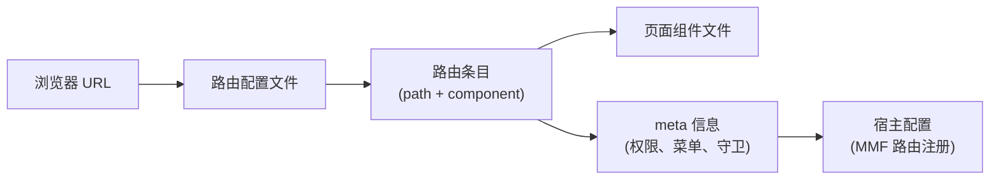

以 SC Vue 的 FBS 首页为例。浏览器 URL 是 `/portal/fbs/home`：

1. 打开 `src/router/index.ts`，搜索 `fbsHome` 或 `home`。
2. 找到对应路由定义，看到它的 `component` 是 `Vue3Mount(() => import('../views/home/index.vue'))`。
3. 路由的 `meta.authCodes` 是 `['access_to_sbs', 'access_to_sbs_service_by_shopee']`——这是进入 FBS 模块的基础权限。
4. 路由的父级 `/portal/fbs` 有 `beforeEnter` 守卫，在首次进入时初始化 Store（`INIT_FBS_STORE`）。

### 1.1 三个仓库的路由配置文件定位

| 仓库 | 路由配置位置 | 路由类型 |
| --- | --- | --- |
| Portal (`fbs-frontend`) | `src/routes/*.ts`（多文件，按业务域拆分） | React Router 5，`RouteNode[]` |
| SC Vue (`fbs-sc-vue`) | `src/router/index.ts`（单文件主路由数组） | MMF route config，`routers` 数组 |
| SC React (`fbs-sc-react`) | `projects/react-frontend/src/router/index.ts` | MMF `RouteConfig[]`，通过 `registerRouterModule` 注册 |

### 1.2 懒加载：`() => import(...)` 的含义

在三个仓库的路由定义中，你都会看到类似写法：

```javascript
// SC Vue
component: Vue3Mount(() => import('../views/home/index.vue'))

// Portal
component: lazy(() => import('../views/InboundManagement/InboundRequest/List'))

// SC React
component: commonLazyLoader(() => import('../views/Home'))
```

`() => import(...)` 是动态导入。它的作用是：**页面组件的代码不会打包进主 bundle，而是在用户第一次导航到该路由时才加载**。这对后端同学来说可能有些陌生——在 Go 或 Java 中，代码在编译时就确定了；在前端，路由懒加载是一种优化策略，减少首屏加载体积。

当你新增一个路由时，保持和周围路由相同的懒加载模式即可。不要改成静态 `import`——这会破坏构建产物的拆分策略。

## 二、SC Vue 路由：从 `/portal/fbs` 到每个子页面

### 2.1 路由数组结构

SC Vue 的路由定义在 `src/router/index.ts` 中是一棵嵌套树：

```typescript
export const routers = [
  {
    path: '/portal/fbs',        // 模块根路径
    name: 'fbs',
    redirect: '/portal/fbs/home', // 默认跳转到首页
    meta: {
      authCodes: ['access_to_sbs', 'access_to_sbs_service_by_shopee'],
    },
    beforeEnter: async (to, from) => {
      // 首次进入时初始化 Store
      const data = await app.vue3VuexStore.dispatch('FBS_STORE/INIT_FBS_STORE');
      // 检查系统升级、税务锁定、入驻状态等
    },
    children: [
      {
        path: 'home',
        name: 'fbsHome',
        component: Vue3Mount(() => import('../views/home/index.vue')),
      },
      // ...更多子路由
    ],
  },
];
```

`children` 中的子路由会自动继承父路由的 path 前缀。`'home'` 实际匹配的是 `/portal/fbs/home`。父路由的 `beforeEnter` 只执行一次——后续在子路由之间切换时不会重复初始化 Store。

### 2.2 路由守卫中的关键逻辑

`beforeEnter` 守卫不是"权限检查"那么简单。它承担了多个职责：

1. **Store 初始化**：`dispatch('FBS_STORE/INIT_FBS_STORE')` 获取卖家信息、店铺信息、系统配置。
2. **系统升级检测**：如果 `systemUpgrading.toggle` 为 true，跳转到升级提示页。
3. **税务锁定**：巴西地区（`region === 'br'`）且 `lockByTax` 时，跳转到税务错误页。
4. **入驻状态**：如果卖家未完成入驻（`!fbsTag`），跳转到入驻落地页。
5. **VPI 管理限制**：如果卖家没有 VPI 管理权限，尝试访问 VPI 页面时重定向到商品列表。

后端同学需要注意：这些逻辑不是分散在各个页面的——它们集中在路由守卫中。这意味着如果你新增一个页面，不需要在每个页面里重复写权限和状态检查，只需确保路由定义中的 `authCodes` 和 `meta` 正确即可。

### 2.3 新增一个子路由

仿照现有模式，新增一个"入库统计"页面：

```typescript
// 在 routers[0].children 中新增
{
  path: 'inbound/statistics',       // 完整路径：/portal/fbs/inbound/statistics
  name: 'fbsInboundStatistics',
  component: Vue3Mount(() => import('../views/inbound/statistics/index.vue')),
  meta: {
    authCodes: ['access_to_sbs', 'access_to_sbs_service_by_shopee'],
    // 如果需要额外的操作权限：
    // permissions: ['VIEW_INBOUND_STATISTICS'],
  },
}
```

新增后验证：

1. 在浏览器中手动输入 `/portal/fbs/inbound/statistics` → 确认页面能正常加载。
2. 刷新页面（Cmd+R）→ 确认路由守卫正常执行，Store 正确初始化。
3. 模拟无权限场景 → 确认页面显示无权限提示或被重定向。

## 三、Portal 路由：React Router 5 的分文件定义

### 3.1 路由文件结构

Portal 的路由按业务域拆分到多个文件中：

```
src/routes/
  inbound.ts          → 入库管理路由
  product.ts          → 商品管理路由
  inventory.ts        → 库存管理路由
  sellerManagement.ts → 入驻管理路由
  charging.ts         → 计费管理路由
  types.ts            → RouteNode 类型定义
```

每个文件导出一个 `RouteNode[]`。以入库路由为例：

```typescript
// src/routes/inbound.ts
const inboundRoutes: RouteNode[] = [
  {
    name: $t('Inbound Management'),
    meta: { isParentNode: true, icon: InboundIcon },
    children: [
      {
        path: '/inbound/request/list',
        component: lazy(() => import('../views/InboundManagement/InboundRequest/List')),
        name: $t('Inbound Request List'),
        meta: { permissions: ['VIEW_INBOUND_REQUEST'] },
        children: [
          {
            path: '/inbound/request/detail/:id',
            component: lazy(() => import('../views/InboundManagement/InboundRequest/Detail')),
            meta: { permissions: ['VIEW_INBOUND_REQUEST'] },
          },
        ],
      },
    ],
  },
];
```

`RouteNode` 的类型定义：

```typescript
// src/routes/types.ts
interface RouteNode {
  path?: string;
  name?: string;
  component?: React.LazyExoticComponent<any>;
  meta?: { permissions?: string[]; isParentNode?: boolean; icon?: any; };
  children?: RouteNode[];
}
```

### 3.2 Portal 的路由特点

与 SC Vue 不同，Portal 的路由有以下特点：

- **绝对路径**：path 以 `/` 开头（如 `/inbound/request/list`），不依赖父路由前缀。
- **`lazy()` 包装**：React Router 5 使用 `React.lazy()` 实现代码拆分，`lazy()` 是 Portal 的封装。
- **`meta.permissions`**：权限码数组，Portal 的权限系统在渲染前检查用户是否拥有对应权限。
- **`meta.isParentNode`**：标记父节点（菜单分组），不渲染页面，只用于侧边栏菜单结构。

### 3.3 Portal 的路由渲染流程

Portal 的路由注册和渲染与 SC Vue 有本质区别。SC Vue 依赖 MMF 框架接管路由注册，Portal 则通过 React Router 5 的 `<Route>` 组件直接渲染：

```
src/index.tsx → 读取 routes/*.ts → 生成 <Route> 树 → ReactDOM.render()
```

因此 Portal 不需要 MMF Dev Tools 就能独立访问。如果你在 Portal 中新增路由后页面 404，通常是因为：路由未在对应 `routes/*.ts` 文件中注册，或 `path` 与其他路由冲突。

## 四、SC React 路由：`registerRouterModule` 模式

### 4.1 路由配置格式

SC React 的路由配置是一个 `RouteConfig[]`，使用 `registerRouterModule` 注册：

```typescript
// projects/react-frontend/src/router/index.ts
export const routes: RouteConfig[] = [
  {
    parent: "fbs",
    name: "fbsHome",
    path: "home",
    component: commonLazyLoader(() => import('../views/Home')),
  },
  {
    parent: "fbs",
    name: "fbsInboundList",
    path: "inbound/list",
    component: commonLazyLoader(() => import('../views/InboundList')),
    meta: {
      shopSwitcherEnabled: true,
    },
    beforeEnter: async (to, from) => {
      // 路由守卫逻辑
    },
  },
];
```

和 SC Vue 的区别：

- `parent` 字段指定父路由名称（如 `"fbs"`），path 只需要写相对路径。
- `commonLazyLoader` 封装了 `React.lazy` + `Suspense` + `SSCConfigProvider`，确保每个懒加载的组件都包裹在必要的 Context 中。
- `registerRouterModule` 将路由数组注册到 MMF 框架中，由框架负责与宿主（Seller Center）的路由系统对接。

### 4.2 SC React 的路由特点

SC React 和 SC Vue 一样是 MMF 模块，路由最终由 Seller Center 宿主管理。`registerRouterModule` 告诉宿主"我提供了这些路由"，宿主负责把它们挂载到正确的位置。因此：

- 路由的完整 URL 由宿主前缀 + `parent` 路径 + 当前 `path` 组成。
- 路由守卫中的 `to.route` 和 `from.route` 对象由 MMF 框架提供。
- 菜单配置由宿主统一管理，模块只负责声明自己能处理哪些路由。

## 五、菜单与路由的关系（三仓共同模式）

FBS 前端使用**路由驱动菜单**的设计：菜单项由路由配置生成，而不是手动维护两份数据。

- Portal：`src/routes/*.ts` 中的 `meta.isParentNode` + `name` → 侧边栏菜单。
- SC Vue：`src/router/index.ts` 中的路由树 → MMF 框架生成导航。
- SC React：`RouteConfig[]` 中的 `parent` + `name` → MMF 框架生成导航。

这意味着新增一个路由后，菜单项通常会自动出现（如果它符合菜单生成规则）。但要注意：
- 如果路由的 `meta` 中缺少必要的权限码，菜单项可能显示但点击后无法访问。
- 如果路由是某个业务模块的详情页（如 `/inbound/request/detail/:id`），它通常不会出现在菜单中——详情页是通过列表页的链接进入的。

## 六、新增路由的完整检查清单

无论哪个仓库，新增一个页面路由后，逐项确认：

1. **路由定义**：在对应的路由文件中添加了路由条目，path 不与现有路由冲突。
2. **权限**：如果页面需要权限控制，`authCodes` 或 `permissions` 正确配置。
3. **懒加载**：使用 `() => import(...)` 或对应仓库的懒加载封装（`Vue3Mount`、`lazy()`、`commonLazyLoader`）。
4. **直达**：浏览器手动输入完整 URL 能正常加载页面（不经过导航菜单）。
5. **刷新**：在页面上按 Cmd+R 刷新，页面不白屏、路由守卫正常执行。
6. **无权限**：模拟无权限用户，确认页面被重定向或显示无权限提示。
7. **菜单（如适用）**：确认新增路由在侧边栏菜单或导航中正确显示。
8. **旧路由不受影响**：确认修改没有破坏已有页面的路由。

## 七、常见错误

### 7.1 忘记路由守卫的初始化逻辑

在 SC Vue 中，路由守卫 `beforeEnter` 负责 Store 初始化。如果你新增的页面在 `beforeEnter` 执行之前就需要访问 Store 数据（如在组件外读取 `app.vue3VuexStore`），可能会拿到未初始化的状态。确保页面的数据获取逻辑在 `beforeEnter` 完成之后执行。

### 7.2 path 冲突

```typescript
// 这两个 path 会冲突——`detail` 可能被当作 `:id` 的匹配
{ path: '/inbound/detail' }
{ path: '/inbound/:id' }
```

Router 按注册顺序匹配，先注册的优先。如果 `/inbound/detail` 注册在 `/inbound/:id` 之后，它永远不会被匹配——`:id` 会先捕获 `detail` 作为参数值。

### 7.3 SC React 中忘记 `parent` 字段

SC React 的路由依赖 `parent` 字段挂载到正确的路由树上。如果 `parent` 填写错误或引用了不存在的父路由，页面不会被注册到宿主中，浏览器访问会 404。

### 7.4 在 SC Vue/React 中直接写绝对路径

```typescript
// 不推荐在 MMF 模块中写绝对路径
{ path: '/portal/fbs/my-page', component: ... }
// 推荐：用 parent + 相对路径
{ parent: 'fbs', path: 'my-page', component: ... }
```

## 八、练习

### 8.1 URL 反向追踪

浏览器地址栏显示 `https://seller-portal.test.shopee.io/portal/fbs/inbound/request/list`。在 SC Vue 仓库中追踪：这个 URL 对应哪个路由定义？它的页面组件文件在哪里？它的权限要求是什么？

### 8.2 新增路由

在 SC Vue 仓库中，为"入库统计"页面新增一个路由，要求：

- path 为 `inbound/statistics`，完整路径 `/portal/fbs/inbound/statistics`
- 组件指向一个新建的 `views/inbound/statistics/index.vue`（只需创建一个包含 `<h1>Inbound Statistics</h1>` 的最小页面）
- 不需要额外的操作权限（复用父路由的 `authCodes`）

### 8.3 权限对比

Portal 的权限检查使用 `meta.permissions` 数组，SC Vue 使用 `meta.authCodes` 数组。两者的区别是什么？为什么 SC Vue 的 `authCodes` 是"进入模块的基础权限"而 `permissions` 是"操作权限"？

### 8.4 参考答案

**8.1**：路由定义在 `src/router/index.ts` 的 `routers[0].children` 中，对应 `name: 'fbsInboundRequestList'`（或类似命名），页面组件通过 `Vue3Mount(() => import(...))` 懒加载到 `views/inbound/` 下的 `.vue` 文件。父路由的 `authCodes` 要求 `['access_to_sbs', 'access_to_sbs_service_by_shopee']`。

**8.3**：Portal 是独立 SPA，自己管理权限——`permissions` 是 Portal 侧定义的权限码，由 Portal 的权限系统检查。SC Vue 是 MMF 模块，`authCodes` 是 Seller Center 宿主层面的权限码（控制用户是否能进入 FBS 模块），而操作级别的权限（如"能不能创建入库单"）在代码中通过 `permissions` 或 `hasPermission` 函数单独检查。`authCodes` 控制准入，`permissions` 控制能力。

## 参考文献

- [React Router v5.2 Official Tag](https://github.com/remix-run/react-router/tree/v5.2.0) — Portal 的路由库基线
- [React Router v6 Documentation](https://reactrouter.com/6.30.3/start/overview) — SC React 路由概念参考
- [Vue: Routing](https://vuejs.org/guide/scaling-up/routing.html) — Vue 路由基础概念


---

# 状态管理：Redux/Recoil、Vuex 与宿主状态

> 预计学习时间：110–150 分钟
> 一句话总结：能追踪"当前 seller/shop"从初始化到页面的完整数据流，读懂 Redux/Thunk、Vuex module、Recoil atom 和 Redux Toolkit 的读法与不可变更新规则——画出一个状态的来源、写入、派生与消费链。

## 这一章解决什么问题

后端同学看前端状态管理代码时，最常见的误判是：把 Store 当作一个"全局变量池"——需要什么就从里面取，想改就直接改。但在 FBS 前端中，状态有严格的生命周期和所有权：组件自己管理的、本仓 Store 管理的、宿主提供的、远端组件共享的——每一层都有不同的读写规则。

更复杂的是，三个 FBS 前端仓库使用了完全不同的状态管理方案：Portal 同时用 Redux（带 Thunk 中间件）和 Recoil，SC Vue 用 Vuex（由 Seller Center 宿主注入），SC React 用 Redux Toolkit 但依赖宿主 Vuex 提供基础信息。这不是"选型混乱"，而是不同时期的技术决策和宿主约束共同作用的结果。

本章的目标不是让你成为 Redux 或 Vuex 专家，而是帮你建立一套状态追踪能力：看到一个页面上的数据（如当前 seller 的 shop ID），你能从页面一路追溯到 Store 中的定义、初始化 action、写入点、派生逻辑和消费方。

> 本章基于三个前端仓库的 release 分支（2026-07-20）。

## 一、先建立状态分层的概念

在 FBS 的任一前端页面中，一个"当前 shop 信息"可能来自以下四层之一：

| 层级 | 示例 | 特点 |
| --- | --- | --- |
| 组件局部状态 | `data() { return { form: {} } }` 或 `useState` | 只有当前组件可见，组件销毁即消失 |
| 本仓 Store | Redux store、Vuex module、RTK slice | 跨页面共享，浏览器刷新后可能丢失 |
| 宿主 Store | Seller Center 提供的全局状态 | 跨模块共享，由宿主管理生命周期 |
| 远端组件状态 | 通过 Props/Context 从远端组件传入 | 跨仓共享，但契约严格限制 |

一个实用的判断规则：如果数据只在一个组件中使用，用局部状态；如果在多个页面中需要（如用户信息、当前 shop），放 Store；如果其他 MMF 模块或宿主也需要，放宿主 Store。FBS 的"当前 seller/shop"就是最典型的跨页面、跨模块共享数据，所以它在宿主 Store 中管理。

## 二、SC Vue：Vuex 模块化的宿主注入模式

### 2.1 FBS Store 的注册

SC Vue 中的 Store 不是在本仓创建的，而是注册到 Seller Center 宿主提供的 Vuex Store 中：

```typescript
// src/store/index.ts
import { app } from 'framework';
import FBS_STORE from './modules/index';

export const fbsStoreName = 'FBS_STORE';
app.registerVue3StoreModule(fbsStoreName, FBS_STORE);
```

`app.registerVue3StoreModule` 是 MMF 框架提供的能力，它将 FBS 的 Vuex 模块挂载到宿主 Vuex Store 的 `FBS_STORE` 命名空间下。此后，任何代码（包括宿主的其他模块）都可以通过 `app.vue3VuexStore.getters['FBS_STORE/Shop/currentShop']` 访问 FBS 的状态。

### 2.2 模块结构

`src/store/modules/` 下有四个子模块：

| 模块 | 路径 | 管理的数据 |
| --- | --- | --- |
| `Seller` | `modules/seller/index.ts` | 卖家信息、入驻状态、一键注册配置 |
| `Shop` | `modules/shop/index.ts` | 当前选中的店铺、店铺列表、店铺标签 |
| `System` | `modules/system/index.ts` | 系统升级状态、全局开关 |
| `Temporal` | `modules/temporal/index.ts` | 临时数据缓存 |

### 2.3 读法：从页面追到 Store

在 IBT 详情页中，`dataLoading` 是从组件 `data()` 中读取的局部状态，而 `basicInfo.urgentStatus` 可能来自 Store。追踪过程：

1. 页面模板中使用 `basicInfo` → 在 `<script>` 中找它的来源。
2. 如果来自 `mapState` 或 `this.$store.state.FBS_STORE.xxx` → 找到对应 module 的 state 定义。
3. 如果来自 computed 属性 → 看它是从 state 派生的还是从 API 响应赋值的。

### 2.4 写操作：`dispatch` 和 `commit`

```javascript
// 触发异步 action
await app.vue3VuexStore.dispatch('FBS_STORE/INIT_FBS_STORE');
// 同步修改 state
app.vue3VuexStore.commit('FBS_STORE/SET_SHOP_INFO', shopInfo);
```

- `dispatch` 用于触发 action（可以包含异步操作），action 内部通过 `commit` 修改 state。
- `commit` 用于直接提交 mutation（必须是同步操作），mutation 是唯一能改变 state 的途径。

FBS 仓库中，路由守卫的 `beforeEnter` 里 `dispatch('FBS_STORE/INIT_FBS_STORE')` 是 Store 初始化的入口——它内部会并发请求卖家信息和店铺信息，然后将结果 commit 到对应 module 的 state 中。

### 2.5 命名空间规则

Vuex module 通过 `namespaced: true` 启用命名空间。访问时必须带完整路径：

```javascript
// 正确
app.vue3VuexStore.getters['FBS_STORE/Shop/currentShop']
// 错误
app.vue3VuexStore.getters.currentShop  // 找不到
```

## 三、Portal：Redux + Thunk + Recoil

### 3.1 Redux 基础结构

Portal 的 Redux Store 创建于 `src/store/index.ts`：

```typescript
import { createStore, applyMiddleware } from 'redux';
import thunk from 'redux-thunk';

export const store = createStore(reducer, applyMiddleware(thunk));
```

Redux 的三个核心概念对应 FBS Portal 的实际角色：

| 概念 | 定义 | FBS Portal 中的位置 |
| --- | --- | --- |
| **State** | 单一数据源，一个大的对象树 | `store.getState()` 返回的整个 state |
| **Action** | 描述"发生了什么"的普通对象 | `src/store/actions/` 下的 action creator |
| **Reducer** | 根据 action 计算新 state 的纯函数 | `src/store/reducers/` 下的 reducer 文件 |

### 3.2 Thunk：让 action 可以异步

Redux 原生的 action 是同步的——dispatch 一个 action 对象，reducer 立即处理。但在 FBS Portal 中，大量操作需要先发 API 请求再更新 state。Thunk 中间件让 action creator 可以返回一个函数而不是对象：

```javascript
// 同步 action creator
const setUser = (user) => ({ type: 'SET_USER', payload: user });

// 异步 action creator（Thunk）
const fetchUser = () => async (dispatch, getState) => {
  dispatch({ type: 'FETCH_USER_START' });
  try {
    const user = await api.getUser();
    dispatch({ type: 'FETCH_USER_SUCCESS', payload: user });
  } catch (error) {
    dispatch({ type: 'FETCH_USER_ERROR', payload: error });
  }
};
```

FBS Portal 中，几乎所有的 API 调用都通过 Thunk 包装。页面上 `dispatch(fetchInboundList(params))` 会触发请求 → 更新 loading 状态 → 请求完成后更新列表数据。

### 3.3 Recoil：Portal 的原子化状态

Portal 同时使用了 Recoil 管理部分状态。Recoil 的核心是 **atom**（状态单元）和 **selector**（派生状态）：

```javascript
// atom：定义一个状态单元
const currentUserAtom = atom({
  key: 'currentUser',
  default: null,
});

// selector：从 atom 派生数据
const permissionListSelector = selector({
  key: 'permissionList',
  get: ({ get }) => {
    const user = get(currentUserAtom);
    return user?.permission_code_list ?? [];
  },
});
```

在 Portal 中，`src/recoil/` 目录下定义了 Recoil atom 和 selector。与 Redux 的区别：Recoil 的状态单元更细粒度，且自带派生能力（selector），不需要像 Redux 那样通过 `mapStateToProps` 或 `useSelector` 手动订阅整个 state 树。

Portal 中 Redux 和 Recoil 并存是历史原因。简单判断：Redux 管理业务数据（入库列表、商品列表），Recoil 管理全局上下文（当前用户、权限列表）。

### 3.4 Portal 页面读取 Store 的方式

```javascript
// React-Redux hooks
import { useSelector, useDispatch } from 'react-redux';

function InboundList() {
  const list = useSelector(state => state.inbound.list);
  const loading = useSelector(state => state.inbound.loading);
  const dispatch = useDispatch();

  useEffect(() => {
    dispatch(fetchInboundList(params));
  }, [params]);

  // 读取 Recoil 状态
  const permissions = useRecoilValue(permissionListSelector);
}
```

## 四、SC React：Redux Toolkit + 宿主 Vuex

### 4.1 双 Store 并存

SC React 面临一个特殊挑战：作为 MMF 模块，它需要与宿主的 Vuex Store 交互（获取 seller 信息、shop 信息等基础数据），但模块内部的业务状态使用 Redux Toolkit 管理。

```typescript
// 从宿主 Vuex 读取当前 shop
const currentShop = app?.vue3VuexStore?.getters?.['FBS_STORE/Shop/currentShop'];

// 从模块自己的 Redux Store 读取业务状态
import { useSelector } from 'react-redux';
const inboundList = useSelector(state => state.inbound.list);
```

### 4.2 Redux Toolkit：slice 模式

SC React 使用 Redux Toolkit 的 `createSlice` 替代传统 Redux 的分散 action/reducer 文件：

```typescript
// store/modules/shop.ts
import { createSlice } from '@reduxjs/toolkit';

const shopSlice = createSlice({
  name: 'shop',
  initialState: { currentSelectedShop: null, fbsStatus: 0 },
  reducers: {
    setCurrentShop(state, action) {
      state.currentSelectedShop = action.payload;
    },
    setFbsStatus(state, action) {
      state.fbsStatus = action.payload;
    },
  },
});

export const { setCurrentShop, setFbsStatus } = shopSlice.actions;
export default shopSlice.reducer;
```

Redux Toolkit 的 `createSlice` 自动生成 action creator 和 reducer，并内置 Immer——你可以在 reducer 中"直接修改"state（实际上 Immer 在背后做了不可变更新）。这对习惯 Redux 传统写法的人可能有些反直觉：`state.currentSelectedShop = action.payload` 看起来像直接修改，但它是安全且正确的。

### 4.3 Selector：从 state 中提取数据

```typescript
// 基础 selector
const selectCurrentShop = (state) => state.shop.currentSelectedShop;

// 带派生逻辑的 selector
const selectFbsTag = (state) => state.shop.fbsTag !== 0;
```

Selector 是纯函数，可以组合。复杂项目中使用 `createSelector`（reselect）创建带缓存的 selector，避免不必要的重新计算。

## 五、状态流转：一次完整的追踪练习

以"当前 shop 的仓库区域 `fbsWhsRegion`"为例，追踪它在 SC Vue 仓库中的完整生命周期：

1. **初始化**：路由守卫 `beforeEnter` → `dispatch('FBS_STORE/INIT_FBS_STORE')` → action 中并发请求 seller 和 shop 信息 → `commit('SET_SHOP_INFO', data)`。
2. **存储**：`state.FBS_STORE.Shop.currentShop.fbsWhsRegion`。
3. **消费**：request interceptor 中通过 `getCurrentShop().fbsWhsRegion.toUpperCase()` 注入到请求 header 的 `fbs-whs-region` 中。
4. **派生**：如果 CBSC 条件下，`fbsWhsRegion` 影响请求来源标记 `req-source: 'CNSC'`。


如果你需要新增一个跨页面的状态（如"用户选择的默认仓库"），你需要决定它放哪一层。判断标准：如果只有本仓页面需要，放入本仓 Store 的对应 module；如果其他 MMF 模块也需要，考虑放入宿主 Store（需要协调宿主侧改动）；如果只有一个组件需要，用局部状态。

## 六、不可变更新：React 和 Redux 的共同约束

React 和 Redux 都依赖引用比较来判断是否需要重新渲染。修改状态时必须创建新对象/新数组：

```javascript
// 错误：直接修改
state.list.push(newItem);

// 正确：创建新引用
return { ...state, list: [...state.list, newItem] };

// Redux Toolkit 中 Immer 让你可以"直接修改"（实际做了不可变代理）
state.list.push(newItem); // createSlice reducer 中合法
```

Vue 3 使用 Proxy 实现响应式，所以 Vuex/组件 data 中可以直接赋值。但跨框架传递数据时（如 SC React 从宿主 Vuex 读取），仍需注意不可变性的约束。

## 七、常见错误

### 7.1 在 action 外直接修改 state

```javascript
// 错误：绕过 mutation 直接修改
this.$store.state.FBS_STORE.Shop.currentShop = newShop;

// 正确：通过 commit
this.$store.commit('FBS_STORE/SET_SHOP_INFO', newShop);
```

### 7.2 忘记 Redux reducer 是纯函数

```javascript
// 错误：reducer 中有副作用（API 调用、随机数）
function inboundReducer(state, action) {
  const data = await fetchData();  // 不允许！
  return { ...state, data };
}

// 正确：副作用放在 Thunk 中
```

### 7.3 从宿主 Vuex 读取时未处理可选链

```javascript
// 可能抛出 TypeError
const shopId = state.shop.currentSelectedShop.fbsShopId;

// 正确
const shopId = state.shop.currentSelectedShop?.fbsShopId;
```

### 7.4 把大量不需要跨页面的数据放入 Store

组件的表单临时数据、搜索关键词、展开/折叠状态通常不需要入 Store。Store 中只放真正需要跨页面共享的状态。

## 八、练习

### 8.1 追踪练习

在 SC Vue 仓库中追踪 `fbsTag` 的完整生命周期：它在哪个 API 中获取、存入哪个 module、在哪些文件中被读取和使用。

### 8.2 新增状态

在 SC Vue 的 System module 中新增一个 `maintenanceMode` 状态（布尔值，默认 `false`）。在路由守卫 `beforeEnter` 中检查这个状态，如果为 `true`，重定向到一个维护提示页。

### 8.3 派生状态

Portal 仓库中，`permissions.includes(permission)` 被多次使用。创建一个 selector，封装这个判断逻辑，使调用方只需 `const hasPermission = useSelector(selectHasPermission(code))`。

### 8.4 参考答案

**8.2** 关键步骤：`modules/system/index.ts` 的 state 中新增 `maintenanceMode: false`；mutation 中新增 `SET_MAINTENANCE_MODE`；`beforeEnter` 中读取 `getters['FBS_STORE/System/maintenanceMode']`；维护提示页可以是简单的 `MaintenanceNotice.vue`。

## 参考文献

- [Redux Essentials Tutorial](https://redux.js.org/tutorials/essentials/part-1-overview-concepts) — store/action/reducer 概念
- [Redux Toolkit Tutorials](https://redux-toolkit.js.org/tutorials/overview) — createSlice 和 createAsyncThunk
- [Vuex 4 Documentation](https://vuex.vuejs.org/) — state/getter/mutation/action/module
- [Recoil Documentation](https://recoiljs.org/docs/introduction/getting-started/) — atom/selector 概念
- [React Learn — Managing State](https://react.dev/learn/managing-state) — React 状态管理概述


---

# API、代理、错误与前后端契约

> 预计学习时间：120–160 分钟  
> 一句话总结：沿入库列表请求拆开 API 函数、请求实例、宿主代理、业务错误与联调证据，能够独立定位一次前后端契约问题。

## 这一章解决什么问题

后端同学第一次改前端接口，常会把“调用 API”理解成在组件里写一次 `axios.post`。这段代码也许能发出请求，却绕过了 FBS 前端已经建立的请求约定：路径前缀由谁补、会话由谁携带、请求标识怎么生成、语言和仓区信息从哪里来、业务错误由谁翻译、PII 和导出为什么要走另一套实例。结果通常不是语法错误，而是本地看似成功、接到宿主后失败，或者一次错误弹出两遍。

本章只追一条真实链路：Seller Center 入库请求列表。我们从 Vue 仓库的 `src/api/inbound.js` 出发，经过 `src/utils/request.js`，到达后端路由 `/api/fbs/sc/inbound/request/list/`。随后用 React 16 Portal 和 React 18 MMF 的实现做对照。学完后，你不需要背完 Axios；你要能回答七个工程问题：请求从哪里发出，method 和 path 在哪里决定，参数放在 query 还是 body，baseURL 与宿主代理如何组合，哪些 header 由统一封装注入，失败属于哪一层，以及契约变更需要同时检查哪些文件。

> 本章观察各仓库 release 分支（2026-07-20）中的代码。路径、依赖版本和封装行为可能随仓库演进；做实际需求时，应重新打开当前工作树核验，不能把本章片段当成永久 API。

## 先建立一张请求地图

浏览器请求不是从按钮一步跳到 Go handler。一次列表刷新通常穿过五层：组件或 Store 组织查询条件；API 函数选择业务端点；request wrapper 补公共规则；浏览器和宿主代理发送请求；后端返回统一响应。把它们混在一个文件里，短期少写几行，长期会让每个页面各自处理鉴权、错误与环境差异。

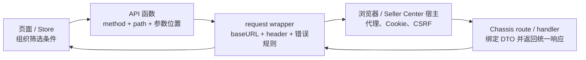

这张图有两个容易被忽略的方向。第一，请求向右走时，每层只补自己负责的信息；页面不该猜 CSRF header，request wrapper 也不该理解“入库状态筛选”的业务含义。第二，响应向左走时也分层：HTTP 客户端先判断有没有可用响应，再判断 HTTP 状态与业务 `retcode`，页面最后只处理本业务的空态、重试入口或成功数据。

遇到问题时先标出故障位于哪条边，而不是立刻改代码。例如 Network 面板里根本没有请求，检查页面事件和 API 函数；有请求但 URL 多了一段前缀，检查 API path 与 baseURL；HTTP 200 但页面提示失败，检查业务 `retcode`；只有某个地区或宿主失败，检查统一注入的 region/shop/source 信息和宿主配置。

## 从 Vue 入库列表读懂最小 API 函数

打开 `fbs-sc-vue/src/api/inbound.js`，入库列表函数的核心形态可以缩减为：

```javascript
export function getRequestList(data) {
  return request({
    url: '/inbound/request/list/',
    method: 'post',
    data,
  })
}
```

这层很薄，但它承担了清楚的业务契约。函数名说明调用意图；`url` 是相对业务路径；`method` 明确后端路由；`data` 表示 JSON 请求体。调用者只需传入列表筛选条件，不必知道 Seller Center 的完整 API 前缀，也不必每次创建 Axios 实例。

如果同一文件里的查询接口使用 GET，你会看到参数通常放在 `params`：

```javascript
export function getPickupInfo(params) {
  return request({
    url: '/inbound/request/pickup/info/',
    method: 'get',
    params,
  })
}
```

`params` 与 `data` 不是风格偏好。Axios 会把 `params` 序列化到 URL query，把 `data` 放入请求体。后端的参数绑定也会按 HTTP method 与 Content-Type 选择读取位置。把 GET 的筛选条件错放进 `data`，浏览器可能仍发出请求，但服务端读不到；把 POST JSON 错放进 `params`，敏感字段还可能出现在 URL、浏览器历史或代理日志中。

读 API 文件时，先做一张四列表，而不是顺着几百行函数逐个看：

| 问题 | 在哪里看 | 入库列表示例 | 判断结果 |
| --- | --- | --- | --- |
| 业务动作是什么 | 函数名与调用点 | `getRequestList` | 查询列表 |
| 请求到哪个端点 | `url` | `/inbound/request/list/` | 相对 SC FBS 前缀 |
| 使用什么 method | `method` | `post` | 与 Chassis route 对齐 |
| 参数放在哪里 | `data` / `params` | `data` | JSON body |

这四项是联调的第一份契约证据。不要从页面字段名直接猜后端字段，也不要因为函数名叫 `get...` 就推断 HTTP method 是 GET；这里的 `get` 表示读取业务数据，实际路由是 POST。

## baseURL 如何把相对路径变成真实请求

Vue 仓库的 `src/utils/request.js` 不是从裸 Axios 随意创建实例，而是基于宿主提供的请求能力 clone，并给普通 FBS SC 请求配置 `baseURL: '/api/fbs/sc'`。因此前一节的相对 path 会组合成：

```text
/api/fbs/sc + /inbound/request/list/
= /api/fbs/sc/inbound/request/list/
```

这个最终 path 与 `sbs-fbs-server/apps/inbound/inbound/access/http/sc/urls.go` 中的 POST 路由完全对应。前端函数保留业务段，统一实例保留应用前缀，两边各自变化时更容易控制影响面。

所谓“代理”至少可能指三件事，排错时不要混用：开发服务器把某个前缀转发到测试后端；Seller Center 宿主为子模块提供统一请求、会话或网关能力；服务端自身又可能按规则把请求交给旧实现或新实现。本章前端部分关心前两种。Network 面板显示的浏览器 URL 是证据起点，开发配置和宿主注入决定它最终由谁接收。

如果你把 API 函数改成完整域名，会同时破坏多项假设：本地、PFB 和不同环境无法复用相同相对路径；浏览器跨域、Cookie 与 CSRF 行为改变；宿主的请求拦截、监控与统一 header 可能被绕过。除非仓库现有模式和任务契约明确要求，不要用硬编码域名“修复”代理问题。

排查 404 时按组合顺序逐项打印或查看：API 函数中的 `url`，所用 request 实例的 `baseURL`，浏览器最终 Request URL，请求是否经过正确宿主或 dev proxy，后端 route 是否包含尾部 `/`。尾部斜杠看似细节，却是契约的一部分；本接口前后端当前都保留尾部 `/`，不要在没有验证路由行为时自行统一格式。

## request wrapper 注入了哪些上下文

`fbs-sc-vue/src/utils/request.js` 的请求拦截器会为请求补充多类 header。当前代码可见的关键项包括 `Fbs-Request-Id`、`lang-id`、`fbs-sc-source`；在 CBSC 条件下还会补 `fbs-whs-region`、`fbs-shop-id` 和 `req-source`。这些字段不是页面筛选条件，而是请求运行上下文。

request ID 用于跨层关联一次请求。遇到“页面报错但服务端说没看到”时，应从浏览器请求 header 取出标识，再查网关与服务日志，而不是只给一张 toast 截图。语言 header 影响后端错误翻译。source、warehouse region 与 shop 信息会影响身份、数据边界或链路选择。具体语义应以当前后端中间件和业务代码为准，但前端开发至少要知道它们由统一层提供，不能在某个页面里随意覆盖。

这里有一个重要边界：业务请求字段与运行上下文要分开。比如列表筛选的 `status_list` 属于 JSON body；当前 Seller、Shop、语言、请求标识通常来自宿主状态和 wrapper。若把后者复制进每个 API 的 body，会出现重复事实源：页面传一个 shop，header 又表示另一个 shop，后端必须猜信哪个。

检查 wrapper 时不要只看 request interceptor。还要找实例是如何 clone 的、实例是否针对普通/Blob/PII 分流、response interceptor 返回的是完整 Axios response 还是已经解包的 `data`。调用页面对返回值的写法必须与这一行为一致。

## 普通、Blob、PII 为什么不能合并成一个万能请求

Vue 仓库当前区分普通请求、Blob 请求、PII 请求和 PII Blob 请求，还保留 remote request 场景。React 18 MMF 的 `basic/src/utils/MMF/request/request.ts` 也有相似的 `commonRequest`、`blobRequest`、`piiRequest`、`piiBlobRequest`。这不是重复代码，而是数据与响应语义不同。

普通 JSON 请求期望结构化响应，wrapper 可以直接检查 `retcode` 并取 `data`。Blob 请求通常用于 Excel、PDF 或批量导出，成功体是二进制；但失败时服务端仍可能返回 JSON 错误。如果一看到 `responseType: 'blob'` 就无条件创建下载文件，用户会下载一个内容为错误 JSON 的“xlsx”。正确封装要根据 Content-Type、业务约定或 Blob 文本解析结果区分成功文件与失败信息。

PII 请求的差别更严肃。个人敏感信息需要走仓库规定的请求实例和服务边界，可能涉及不同前缀、header、加解密或审计能力。页面开发者不能因为普通 request 已经能访问某个 URL，就用它读取敏感字段。判断标准不是“代码能不能跑”，而是该字段是否属于受控数据、现有同类 API 使用哪种封装、后端是否位于敏感数据服务边界。

因此新增 API 前先回答：响应是 JSON 还是文件，数据是否含 PII，是否由 remote component 跨宿主使用，错误体是什么形态。答案决定你复用哪个实例，而不是决定给万能实例再加一个布尔参数。

## 把失败拆成四层

前端最危险的错误处理方式是 `catch` 之后统一弹“请求失败”。它让网络故障、404、业务校验失败和页面渲染异常看起来一样。FBS request wrapper 已经承担一部分统一处理，页面层更需要先分层。

### 第一层：请求没有发出

按钮未绑定、校验提前 return、组件已卸载、Promise 没有执行，都会让 Network 面板没有记录。这时后端与代理都还没参与。检查事件回调、条件分支、调用栈和控制台异常。

### 第二层：传输失败

断网、DNS、连接中断、客户端超时等情况下，Axios error 可能没有可用的 `response`。此时不要读取 `error.response.data.retcode`，否则错误处理本身又抛异常。证据是 Network 状态、error 的 request/response 字段和耗时。

### 第三层：HTTP 失败

浏览器收到了 4xx 或 5xx。404 优先核对 method、完整 path、代理和后端 route；401/403 优先核对会话、CSRF、权限和宿主；500 需要 request ID 与服务端日志。注意当前 SC 业务错误常通过 HTTP 200 加业务 `retcode` 返回，所以 HTTP 200 只证明传输层成功，不能证明业务成功。

### 第四层：业务失败

响应 JSON 可被解析，但 `retcode` 非成功值。Vue wrapper 会检查业务码，并按当前代码中的翻译优先顺序选择消息；`hiddenErrorMessage` 可控制是否由统一层展示。页面若再无条件 toast，就会出现双弹窗。页面需要自定义交互时，应明确让统一层静默，再根据业务错误提供字段提示、保留用户输入或给出重试入口。

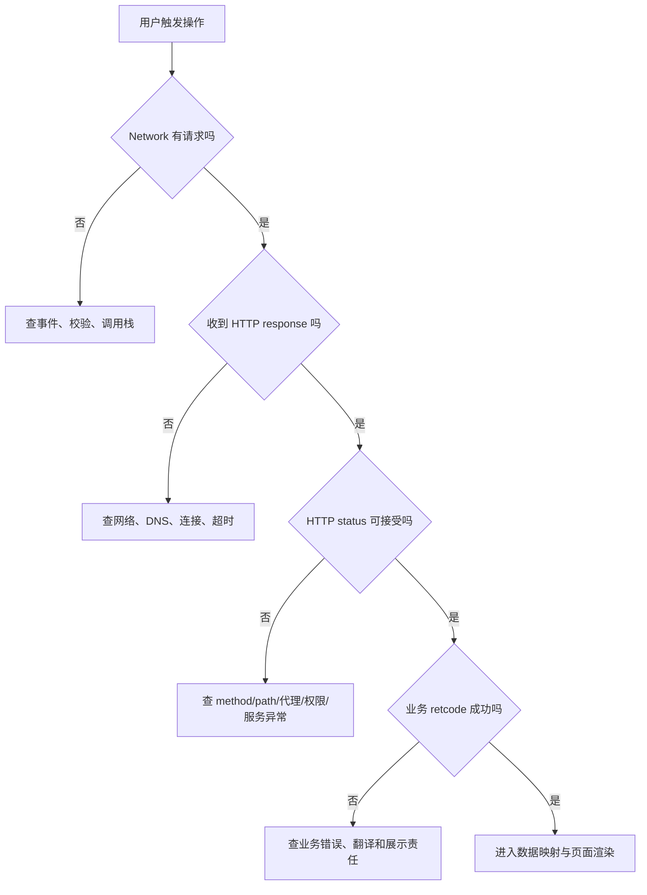

这个判断树的价值是让证据先于猜测。它不会替你定位所有问题，但会阻止你在“没有请求”的时候修改 Go handler，也会阻止你在业务错误时反复调整 dev proxy。

## React 16 Portal：类型契约与请求封装如何配合

`fbs-frontend/src/apis/inbound.ts` 为 Portal 入库列表定义请求与响应类型，并通过 `createApi<Params, Data>` 生成调用函数。`src/common/utils/createApi.ts` 会根据 HTTP method 决定参数位置：GET 使用 `params`，DELETE 使用 `data`，POST 等方法把参数作为 body；Blob 场景还有不同返回处理。

与 Vue JavaScript API 相比，TypeScript 类型让调用者在编译期更早看到字段名和可选性。例如请求类型没有 `seller_sku`，页面直接传入时可能触发类型检查；响应类型声明 `ir_list`，组件访问不存在的 `list` 会被发现。但这并不保证运行时契约正确。后端可以返回旧字段，代理可以给出 HTML 错误页，类型断言也可以绕过检查。

Portal 的 `src/utils/request.ts` 还体现了另一组运行约束：Axios 0.18、`withCredentials`、CSRF cookie/header、region/request-id/lang header，HTTP 错误与业务 `retcode` 分开处理，Blob 失败体可能是 JSON。课程不能拿 Axios 1.x 文档中的所有默认行为直接套到这个仓库；做具体改动时，应先读 lockfile/manifest 与当前封装，再使用对应版本文档解释公共 API。

所以 TypeScript contract 的正确定位是“编译期协作工具”，不是服务端真相。可信联调仍需对照浏览器实际 request/response、Go DTO 的 JSON tag、路由 method/path 和错误格式。

## React 18 MMF：相似封装不等于可以跨仓复制

`fbs-sc-react/basic/src/utils/MMF/request/request.ts` 也把普通、Blob、PII 与 PII Blob 分开，注入请求 header，检查 `retcode` 并调用 toast。它与 Vue wrapper 的职责相近，说明两个 Seller Center 模块共享相似宿主约束；但当前依赖是 Axios 1.12.2，类型、拦截器签名和部分行为与 Portal 的 Axios 0.18 不同。

跨仓改需求时可以迁移“意图”，不能直接迁移实现。你可以说三个仓都需要 request ID、语言、业务错误处理；不能把 React 18 的实例代码复制进 React 16 Portal，再期待旧 TypeScript 与 Axios 类型通过。也不能把 Vue wrapper 的 `hiddenErrorMessage` 用法想当然地写进 React 18，必须确认对应实例是否支持同名选项。

建议用职责矩阵比较，而不是做代码 diff：

| 职责 | SC Vue | Portal React 16 | SC React 18 |
| --- | --- | --- | --- |
| 应用前缀 | 普通实例配置 SC FBS baseURL | Portal wrapper 配置对应 baseURL | MMF request 实例配置 SC FBS 前缀 |
| 请求上下文 | request ID、语言、source，特定场景含 region/shop | region、request ID、语言、Cookie/CSRF | request ID、语言、source 等 |
| 业务错误 | response interceptor 检查 `retcode` | HTTP 与业务错误分层 | interceptor 检查 `retcode` 并 toast |
| 文件响应 | 独立 Blob 实例 | Blob 分支，失败可能解析 JSON | 独立 Blob 实例 |
| PII | 独立 PII/PII Blob 实例 | 按 Portal 现有边界核验 | 独立 PII/PII Blob 实例 |

矩阵帮助 reviewer 检查职责是否遗漏；具体字段和值仍回到当前代码。

## 前后端契约到底包含什么

很多接口文档只列 request/response JSON，这对真实联调不够。完整契约至少包括：HTTP method、最终 path、Content-Type、必要 header、鉴权/会话来源、请求字段及空值语义、响应 envelope、业务错误语义、文件/PII 分流、兼容策略和可观测标识。

以入库列表为例，当前可从代码确认：前端 POST 到 `/api/fbs/sc/inbound/request/list/`；请求 body 对应 Go `ScIrListReq` 的 JSON tag；wrapper 会补公共 header；后端成功响应由统一 wrapper 包装，业务失败也可能以 HTTP 200 返回错误 envelope。handler 当前还存在旧/新链路选择，因此新增可选筛选字段必须保证两条链路都能接受，或者明确新字段只在某条链路生效并给出兼容行为。

字段契约要特别关注三组区别。第一，缺失、`null`、空字符串、零和空数组不是同一个值。Go 的 `string`、`*string`、`[]string` 各自表达不同；TypeScript 的可选属性、`null` 联合类型也应与之对应。第二，字段名转换由 JSON tag 决定，不由 Go 字段名的大小写自动猜。例如 `SellerSku *string` 对外是 `seller_sku`。第三，列表排序、分页和时间字段需要明确单位与边界，否则双方都“类型正确”仍可能语义错误。

新增筛选字段时，先写契约卡：

```text
名称：seller_sku
位置：POST JSON body
前端类型：sellerSku?: string（提交前 trim；空值不发送）
后端字段：SellerSku *string `json:"seller_sku"`
缺失语义：不按 Seller SKU 过滤
空字符串语义：前端归一化为缺失；后端保持兼容
响应：不新增字段
错误：非法长度在字段附近提示；未知错误由统一层展示
兼容：旧调用方不传字段时行为完全不变
```

这张卡不是替代代码，而是让前后端在改动前对齐零值与兼容性。最终仍需用 request payload、handler 测试和接口响应证明。

## 用 Network 面板完成一次可复现联调

联调前先清空 Network，打开 Preserve log 只在需要跨页面保留请求时使用，并按接口路径过滤。触发一次列表查询后，不要只看 Preview；按以下顺序记录证据。

第一，确认 Request URL 与 Request Method。它们应对应 baseURL 拼接结果和 Chassis route。第二，看 Request Headers，确认 Content-Type、request ID、语言与当前场景需要的上下文，不要复制 Cookie 或凭据到工单。第三，看 Payload，区分 Query String Parameters 与 Request Payload，检查字段名、类型和空值是否符合契约。第四，看 Status、Response Headers 与 Response，区分 HTTP 层和业务层。第五，看 Timing，判断耗时主要在排队、连接还是等待响应；慢请求不等于前端渲染慢。

一份可复现记录至少包含：页面与操作、环境、时间、method/path、已脱敏 payload、HTTP status、业务 `retcode`、request ID、期望与实际、是否稳定复现。不要贴整段 Cookie、授权 header、真实 PII 或无关响应。

如果页面 toast 已消失，可用 Network 的 response 继续定位。如果 response 成功但页面仍空，问题已经越过请求层，转查数据解包、状态写入、computed/selector 与渲染条件。把责任边界说清，比在 request interceptor 里加日志更重要。

## 受控练习：给入库列表增加一个兼容筛选字段

练习目标不是提交业务仓，而是在独立练习分支或草稿中完成影响分析和最小 diff。假设需求是“入库列表可按 Seller SKU 精确筛选”，产品已确认空输入表示不筛选，旧调用行为不变。

### 第一步：定位调用链

在 Vue 入库页面搜索 `getRequestList` 的调用点，找出筛选表单到请求对象的映射。记录页面状态字段、提交函数、API 函数和 request 实例。再到后端 route 与 `ScIrListReq` 验证现有 `seller_sku` 是否已经存在。当前新链 DTO 已有 `SellerSku *string`，这意味着需求可能只缺前端接线，不能看到需求就先新增后端字段。

### 第二步：定义归一化规则

页面输入在提交前 trim。trim 后为空则不发送 `seller_sku`，避免把空字符串解释成真实过滤条件。不要把展示用的 `sellerSku` 直接改名为 snake_case 并污染组件状态；在 API 参数组装边界完成字段映射即可。

```javascript
const sellerSku = filters.sellerSku.trim()
const payload = {
  ...buildExistingFilters(filters),
  ...(sellerSku ? { seller_sku: sellerSku } : {}),
}
await getRequestList(payload)
```

这段是缩减示例，不保证可直接替换页面现有函数。实际改动必须复用当前页面已有的参数构造、分页重置和加载状态处理。

### 第三步：检查错误责任

列表查询失败时，统一 wrapper 已处理普通业务错误，页面不应无条件再 toast。若需求要求把“SKU 格式非法”显示在输入框旁，调用时应使用仓库支持的静默选项，并只对已确认的业务码设置字段错误；未知错误仍交回统一机制。不要按错误 message 文本做稳定分支，翻译和后端文案都可能变化。

### 第四步：准备验证矩阵

| 用例 | 前端 payload | 预期 |
| --- | --- | --- |
| 未输入 | 不含 `seller_sku` | 行为与改动前一致 |
| 只输入空格 | trim 后不含字段 | 不触发空字符串过滤 |
| 合法 SKU | `seller_sku: "SKU-001"` | 请求成功，列表按契约过滤 |
| 不存在 SKU | 发送合法值 | 成功空列表，不当作系统错误 |
| 网络中断 | 请求无可用 response | 只出现一次通用网络提示，可重试 |
| 业务错误 | HTTP 200、非成功 `retcode` | 按统一翻译规则展示一次 |

### 第五步：留下交接证据

提交给 reviewer 的不是一句“自测通过”，而是受影响文件、契约卡、两组 payload 截图或文本记录、类型/lint 结果、空值与错误用例，以及未验证项。完成开发交接后，后续发版遵循团队通用流程，本课程不展开。

## 常见误区与修正方法

### 在组件里创建新的 Axios 实例

它绕过宿主请求能力、baseURL、header、业务错误和监控。修正方法是先找同域 API 文件与同数据类型实例，只有现有封装确实无法表达需求时才在统一层扩展。

### 把所有字段都放进 query

这会让 POST DTO 绑定失败，还可能把敏感信息暴露在 URL。修正方法是同时对照 HTTP method、API 函数的 `params/data` 和后端 `HandleParam` 行为。

### HTTP 200 就当成功

SC 接口的业务错误可以使用 HTTP 200 envelope。修正方法是看 `retcode` 与 wrapper 的成功判断，不让页面直接消费未经检查的 response。

### 页面和 wrapper 都弹错误

用户看到两次提示，测试也难稳定。修正方法是明确展示责任：默认由统一层处理；字段级或可恢复交互才由页面接管，并使用封装已有的静默能力。

### 用 TypeScript 类型代替联调

类型不会读取真实响应。修正方法是把 TS、Go JSON tag、Network payload 和 handler 测试放在同一契约检查中。

### 直接复制另一仓的 request.ts

三仓 Axios 版本、宿主能力和错误策略不同。修正方法是迁移职责和测试用例，重新按目标仓当前封装实现。

### 先怪代理

没有 Network 请求时代理根本未参与；业务 `retcode` 失败时代理通常已经完成工作。修正方法是按四层失败模型先分类，再检查对应证据。

## 章末自检

完成本章后，请不用翻代码回答下面问题，再回仓库核对：

1. `getRequestList` 为什么用 POST 和 `data`，最终 path 如何由相对 URL 与 baseURL 组成？
2. request ID、语言和 shop/region 信息为什么不应由每个页面自行维护？
3. 传输失败、HTTP 失败和业务失败分别在 Network 与 Axios error 中留下什么证据？
4. Blob 成功体和 Blob 错误体为什么需要分流？
5. PII API 为什么不能复用普通 request，只换一个 URL？
6. TypeScript 请求类型与 Go DTO 不一致时，你会用哪些运行证据确认真相？
7. 同一需求落到 React 16、Vue 3 和 React 18 时，哪些职责可复用，哪些实现必须重新核验？
8. 新增可选筛选字段时，如何证明“不传字段时旧行为不变”？

如果只能背出文件名，还没有达到本章目标。你应能从页面行为出发，画出链路，指出每层输入输出，并用一条实际 Network 记录判断问题属于哪一层。

## 本章小结

FBS 前端的 API 调用是一条分层契约，不是一次裸 HTTP 调用。业务 API 函数确定 method、相对 path 和参数位置；request wrapper 统一补 baseURL、请求上下文、错误、Blob 与 PII 规则；宿主和代理负责把浏览器请求送到正确服务；页面只处理本业务状态和被明确接管的错误。

可靠联调从分类开始：没有请求、传输失败、HTTP 失败、业务失败和渲染失败分别查不同证据。TypeScript 能提前发现一部分字段问题，却不能替代 Network payload、Go DTO 和真实响应。下一章沿同一个 `/api/fbs/sc/inbound/request/list/` 进入后端，看看 Chassis route、SC wrapper、参数绑定、灰度分支与统一响应怎样兑现这份契约。

## 参考文献

- MDN Web Docs. [HTTP overview](https://developer.mozilla.org/en-US/docs/Web/HTTP/Guides/Overview). 访问于 2026-07-16。
- RFC Editor. [RFC 9110: HTTP Semantics](https://www.rfc-editor.org/rfc/rfc9110). 2022-06。
- TypeScript. [Handbook: Object Types](https://www.typescriptlang.org/docs/handbook/2/objects.html). 访问于 2026-07-16。
- Axios. [Request Config](https://axios-http.com/docs/req_config). 访问于 2026-07-16；具体行为须按各仓依赖版本与封装核验。
- Axios. [Handling Errors](https://axios-http.com/docs/handling_errors). 访问于 2026-07-16；具体行为须按各仓依赖版本与封装核验。


---

# 权限、i18n、时间、文件与 PII：页面功能的准入项

> 预计学习时间：120–160 分钟
> 一句话总结：能在写 FBS 页面时同步处理权限检查、多语言翻译、时区转换、文件上传下载和 PII 敏感信息边界——以"新增字段 + 导出"需求为主线，逐项加载仓库规则，用缺权限/不同时区/错误文件做反例验证。

## 这一章解决什么问题

后端同学写前端页面时，往往聚焦在"把数据正确显示出来"。但在 FBS 的前端仓库中，一个功能完整上线还需要通过五道准入检查：这个用户能看到这个页面/按钮吗？页面上的文字在不同语言下正确吗？时间是用 UTC 还是本地时区？导出文件是 Excel 还是 PDF，文件名怎么定？涉及 PII 的数据经过了敏感服务吗？

这些检查不是"最后加一下就行"——它们分布在路由、请求、组件、Store 的不同层面。本章用一个统一的需求主线"在入库列表增加一个联系人字段 + 导出功能"串联这五道检查，每道检查都给出仓库中现有的实现位置和代码样例。

学完本章后，你不会背完所有权限码和 i18n key，但你会在写任何新功能时自动问自己这五个问题，并且知道去哪里找答案。

> 本章基于三个前端仓库的 release 分支（2026-07-20）。权限码、i18n key、时区约定和 PII 规则以仓库当前代码为准。

## 一、权限：路由级和操作级两层控制

### 1.1 路由级权限（authCodes）

在 SC Vue 和 SC React 中，路由级权限由 `meta.authCodes` 控制：

```typescript
// SC Vue src/router/index.ts
meta: {
  authCodes: ['access_to_sbs', 'access_to_sbs_service_by_shopee'],
}
```

`authCodes` 由 Seller Center 宿主在用户进入模块前校验。如果用户不满足任一个 authCode，整个 FBS 模块不可见。这不是 FBS 自己能控制的——它是宿主层面的准入。

### 1.2 操作级权限（permissions）

进入模块后，具体页面和操作按钮由操作权限控制。Portal 和 SC 仓库使用类似模式：

```typescript
// Portal: 路由定义中的权限
meta: { permissions: ['VIEW_INBOUND_REQUEST'] }

// Portal: 页面中的按钮级权限
{hasPermission('PROCESS_INBOUND_REQUEST') && (
  <Button>创建入库单</Button>
)}

// SC Vue: 操作权限检查
const canModify = computed(() => {
  return hasPermission('INBOUND_MODIFY');
});
```

Portal 的权限码定义在 `src/constants/permissions.ts` 中，是一个数字到权限名的映射：

```typescript
export const PERMISSIONS = {
  VIEW_INBOUND_REQUEST: 1111,
  PROCESS_INBOUND_REQUEST: 1112,
  // ...
};
```

SC Vue 和 SC React 的权限检查依赖宿主提供的权限列表。`hasPermission` 函数在 `fbs-frontend/src/business/utils/permission.ts` 中定义（FE-L01 已讲过），核心逻辑是从 Redux Store 中读取 `permission_code_list`，然后 `includes` 判断。

### 1.3 新增功能时的权限步骤

当你需要新增一个受权限控制的功能时：

1. 确认权限码是否已在 `PERMISSIONS` 常量或权限管理平台中定义。如果没有，先在权限管理平台注册，再添加到代码中。
2. 在路由定义中配置 `permissions`（控制页面准入）或 `authCodes`（控制模块准入）。
3. 在页面中需要权限控制的操作按钮处加上 `hasPermission` 判断。
4. 测试无权限用户的体验：页面是否显示无权限提示（而不是白屏或报错），受限按钮是否正确隐藏。

## 二、i18n：Transify、i18next 与翻译 key

### 2.1 翻译函数的正确调用方式

FBS 三个前端仓库使用 Transify 作为翻译管理平台。页面中所有用户可见的文案都必须通过 `$t()` 包裹：

```vue
<!-- Vue -->
<h1>{{ $t('inboundProblemId') }}: {{ id }}</h1>
<EdsTag>{{ $t('commonUrgent') }}</EdsTag>
```

```tsx
// React (Portal)
<h1>{$t('Inbound Request List')}</h1>
```

`$t` 接收一个翻译 key，返回当前语言对应的翻译文案。翻译 key 由 Transify 平台管理，前端通过 `yarn i18n:pull` 从远程拉取到本地 `src/lang/` 目录下的 JSON 文件。

### 2.2 翻译 key 的命名惯例

FBS 的翻译 key 没有强制的层级命名规则，但常见的模式是：

| 类型 | 示例 key | 含义 |
| --- | --- | --- |
| 通用文案 | `commonUrgent`、`commonModify`、`commonError` | 跨页面复用的按钮/提示文案 |
| 页面特化 | `inboundProblemId`、`ibtDefaultTreatment` | 只在特定页面使用的文案 |
| 状态值 | 状态 key 直接对应后端返回的枚举值 | 状态枚举的翻译 |

### 2.3 新增文案的流程

1. 在 Transify 平台创建新的翻译 key，填写各语言（中文、英文、泰文等）的翻译。
2. 在本地仓库执行 `yarn i18n:pull` 拉取最新翻译文件。
3. 在代码中使用 `$t('yourNewKey')`。

不要在代码中硬编码文案，也不要通过拼接字符串来"省 key"：

```javascript
// 错误：硬编码中文
<Button>创建入库单</Button>

// 错误：拼接——不同语言的语序可能不同
const msg = $t('create') + ' ' + $t('inbound') + ' ' + $t('request');

// 正确：使用完整的翻译 key
<Button>{$t('createInboundRequest')}</Button>
```

### 2.4 Portal 的 $t 封装

Portal 在 `src/business/utils/i18n.ts` 中封装了 `$t`：

```typescript
export const $t: IntlT = generateTransifyCommon({
  project: 'fbs',
  t: (key, options) => {
    handleTranslateReport(key);
    return i18n.t(key, options);
  },
  isShowKey: false,
});
```

`isShowKey: false` 表示如果找不到翻译，不显示原始 key（而是显示空字符串或其他降级方案）。`handleTranslateReport` 用于翻译覆盖率上报——如果某个 key 缺失翻译，Transify 平台会收到报告。

SC React 中远端组件使用 `$gtForRemoteComponent`，它使用单花括号插值 `{var}` 而非双花括号 `{{var}}`——这是远端组件的宿主兼容约束，不要混用。

## 三、时间：秒/毫秒、UTC/本地时区与格式化

### 3.1 FBS 的时间契约

FBS 后端（Go）返回的时间戳通常是**秒级 Unix 时间戳**。前端接收到后需要 `* 1000` 转为毫秒才能传给 `new Date()`：

```javascript
// 后端返回：mtime: 1720000000（秒）
const date = new Date(item.mtime * 1000);
```

不同接口可能有不同的时间格式（秒级时间戳、毫秒级时间戳、ISO 8601 字符串）。读 API 文档或响应样例时先确认时间格式，不要假设所有接口都返回相同的格式。

### 3.2 时区边界

FBS 是跨国业务，卖家可能分布在巴西（UTC-3）、新加坡（UTC+8）、泰国（UTC+7）等不同时区。前端的时间处理规则：

- **存储和传输**：统一使用 UTC。API 的请求和响应中的时间戳/ISO 字符串都应该是 UTC。
- **展示**：按用户所在时区格式化。使用 `toLocaleDateString` 或 `Intl.DateTimeFormat`。
- **日期选择器**：选择的日期通常按当天 00:00 本地时间处理，需要转成 UTC 时间戳发给后端。

```javascript
// 展示：按用户时区格式化
const displayDate = new Date(timestamp * 1000).toLocaleDateString('zh-CN');
// 输出：2026/7/20

// 发给后端：日期选择器选中的日期转 UTC 时间戳
const selectedDate = new Date('2026-07-20'); // 本地时间 00:00
const utcTimestamp = Math.floor(selectedDate.getTime() / 1000);
```

关键边界：`new Date('2026-07-20')` 在不同时区的浏览器中行为不同。在 UTC+8 的浏览器中它是 `2026-07-20 00:00:00 +0800`，在 UTC-3 中是 `2026-07-20 00:00:00 -0300`。如果你需要精确的 UTC 午夜，使用 `new Date('2026-07-20T00:00:00Z')`。

### 3.3 FBS 仓库中的时间工具

三个仓库各自封装了时间处理工具函数。写新功能时，优先搜索仓库中已有的时间格式化函数而不是手写 `new Date().getXxx()`：

```bash
# 在仓库中搜索时间相关工具函数
rg "formatTime|formatDate|toLocale" --include='*.ts' --include='*.js'
```

## 四、文件：下载、上传与 Blob 处理

### 4.1 文件下载：区分普通请求和 Blob 请求

FBS 的文件导出（Excel、PDF）使用专门的 Blob 请求实例。以 SC Vue 为例：

```javascript
// 普通请求——返回 JSON，自动解包
export const exportForExcel = (data) => request({
  url: '/inbound/request/export/excel',
  method: 'POST',
  data,
});

// Blob 请求——返回二进制，不解包
export const exportSyncPdf = (data) => blobRequest({
  url: '/inbound/request/export/pdf',
  method: 'POST',
  data,
});
```

`blobRequest` 是 `app.request.clone({ responseType: 'blob' })`，配置了 `responseType: 'blob'` 告诉 Axios 不要将响应解析为 JSON。收到 Blob 后，需要通过临时 URL 触发浏览器下载：

```javascript
const blob = await exportSyncPdf({ ir_id: id });
const url = URL.createObjectURL(blob);
const a = document.createElement('a');
a.href = url;
a.download = `inbound_${id}.pdf`;
a.click();
URL.revokeObjectURL(url);
```

### 4.2 文件上传

FBS 的上传功能通常使用 FormData + POST：

```javascript
const formData = new FormData();
formData.append('file', file);
formData.append('ir_id', id);

await request({
  url: '/inbound/request/upload',
  method: 'POST',
  data: formData,
  headers: { 'Content-Type': 'multipart/form-data' },
});
```

上传前通常需要前端校验文件类型和大小：

```javascript
const MAX_SIZE = 10 * 1024 * 1024; // 10MB
const ALLOWED_TYPES = ['.xlsx', '.xls', '.csv'];

if (file.size > MAX_SIZE) {
  EdsToastInstance.error($t('fileTooLarge'));
  return;
}
if (!ALLOWED_TYPES.some(ext => file.name.endsWith(ext))) {
  EdsToastInstance.error($t('fileTypeNotAllowed'));
  return;
}
```

### 4.3 导出文件命名

文件名通常包含业务标识、时间戳和文件类型：

```javascript
// 命名模式
const fileName = `Inbound_Request_${ir_id}_${Date.now()}.pdf`;
```

`Date.now()` 用于生成唯一文件名，避免浏览器缓存问题。

## 五、PII：敏感信息的处理边界

### 5.1 PII 请求使用独立的 request 实例

FBS 中涉及敏感信息（姓名、电话、邮箱、证件号等）的请求，必须使用 `piiRequest` 而非普通的 `request`：

```javascript
// SC Vue src/utils/request.js
export const piiRequest = app.request.clone({
  baseURL: '/api/fbs/pii/sc',  // 指向敏感数据服务
  unpackData: false,
});
```

PII 请求指向 `/api/fbs/pii/sc` 而非普通业务请求的 `/api/fbs/sc`。后端 `fbs-sensitive-data-server` 专门处理敏感数据，提供独立的鉴权、审计和脱敏能力。

### 5.2 PII 的展示边界

即使通过 PII 接口获取了敏感数据，前端展示时仍然要遵循最小展示原则：

- 姓名：可能需要部分脱敏（如"张**"）。
- 电话：通常需要脱敏（如"138****1234"）。
- 证件号：绝不在页面上完整展示，仅展示部分或完全隐藏。
- 邮箱：视业务需求决定是否脱敏。

脱敏通常在服务端完成（`fbs-sensitive-data-server` 的响应中已经脱敏），但前端不能假设服务端一定会脱敏——展示前应做二次检查。FBS 仓库中有对应的脱敏工具函数，在展示 PII 数据时优先使用。

### 5.3 PII 数据的日志与存储

PII 数据绝不能出现在以下位置：

- `console.log()` 或任何前端日志。
- 浏览器 localStorage/sessionStorage。
- URL 查询参数（除非已脱敏）。
- 错误上报的 payload 中。

如果必须在前端临时持有 PII 数据（如编辑表单），使用后应立即清理。不要将 PII 数据存入 Redux/Vuex Store 的持久化部分。

### 5.4 PII 的权限检查

访问 PII 数据通常需要更高的权限级别。在 FBS Portal 中，查看卖家详情的 PII 字段需要 `CLIENT_DETAIL_ALL` 权限码；SC 仓库中 PII 相关操作需要宿主层面的额外授权。

```javascript
// Portal: 只有特定权限才能看完整信息
{hasPermission('CLIENT_DETAIL_ALL') ? (
  <FullDetail data={piiData} />
) : (
  <MaskedDetail data={piiData} />
)}
```

## 六、综合任务：新增字段 + 导出

将以上五道检查串联为一个实际任务。假设需求是：在入库列表中新增"紧急联系人"字段和导出 Excel 功能。

### 6.1 需求拆解

| 关注点 | 需要做什么 | 仓库位置 |
| --- | --- | --- |
| 权限 | 确认是否需要新权限码 | `constants/permissions.ts` |
| i18n | 新增翻译 key：`inboundUrgentContact`、`exportInboundList` | Transify 平台 → `yarn i18n:pull` |
| 时间 | 确认导出文件名中的时间格式 | 现有导出函数参考 |
| 文件 | 新增 Excel 导出 API（blobRequest） | `src/api/inbound.js` |
| PII | 判断"紧急联系人"是否属于 PII，如果是走 piiRequest | `src/utils/request.js` |

### 6.2 实现检查清单

1. **权限**：如果导出功能需要特定权限，在操作按钮上添加 `hasPermission` 判断。
2. **i18n**：列表列头和导出按钮文案使用 `$t('inboundUrgentContact')`。
3. **时间**：导出文件名包含 `YYYYMMDD` 格式的当前日期。
4. **文件**：使用 `blobRequest` 发送导出请求，接收 Blob 后触发浏览器下载。
5. **PII**：如果"紧急联系人"是 PII，展示时脱敏；导出时确认权限和审计。

### 6.3 反例验证

| 反例 | 预期行为 |
| --- | --- |
| 无导出权限用户访问页面 | 导出按钮隐藏 |
| 英文语言下的页面 | 列头显示"Urgent Contact" |
| 巴西时区用户导出 | 文件名中的日期是巴西当地时间 |
| 导出请求网络错误 | Toast 提示 + 不下载破损文件 |
| PII 数据出现在 console.log | ESLint/代码审查应拦截 |

## 七、常见错误

### 7.1 硬编码文案

```vue
<!-- 错误 -->
<Button>Create Inbound Request</Button>
<!-- 正确 -->
<Button>{{ $t('createInboundRequest') }}</Button>
```

### 7.2 时间戳未区分秒/毫秒

```javascript
// 错误：后端返回秒级时间戳，前端直接当毫秒用
new Date(item.mtime);  // 日期是 1970 年！

// 正确：
new Date(item.mtime * 1000);
```

### 7.3 PII 走普通请求

```javascript
// 错误：敏感数据走普通 request
const data = await request({ url: '/some/pii/endpoint' });
// 正确：
const data = await piiRequest({ url: '/some/pii/endpoint' });
```

### 7.4 导出文件名含特殊字符

```javascript
// 可能在某些浏览器/OS 中失败
const fileName = `入库单_${irId}_${name}.pdf`;
// 更安全：使用 ASCII 字符
const fileName = `Inbound_${irId}_${Date.now()}.pdf`;
```

## 八、练习

### 8.1 i18n 缺失排查

在 SC Vue 仓库中，找一个未在 Transify 注册但页面中直接写了中文的地方（提示：搜索非 `$t()` 包裹的中文字符）。评估它是否需要改为 `$t()`。

### 8.2 时间处理审查

在 `fbs-sc-vue/src/views/inbound/` 目录下搜索 `new Date(` 或 `mtime` 的使用。检查所有时间处理是否正确处理了秒/毫秒转换。

### 8.3 PII 数据流追踪

在 SC Vue 仓库中追踪 `piiRequest` 的一个用例。从页面调用开始，经过 API 函数、request wrapper、到后端路由。标注在每一层中 PII 数据是否被正确保护。

### 8.4 参考答案

**8.3**：`piiRequest` 的 `baseURL: '/api/fbs/pii/sc'` 将请求路由到 `fbs-sensitive-data-server` 而非主服务。请求 header 中注入的 `lang-id`、`fbs-sc-source` 等信息同样由 wrapper 注入。后端敏感服务返回的数据已经脱敏，前端不应做额外的日志输出。

## 参考文献

- [MDN Intl.DateTimeFormat](https://developer.mozilla.org/en-US/docs/Web/JavaScript/Reference/Global_Objects/Intl/DateTimeFormat) — 时区感知的日期格式化
- [MDN Blob](https://developer.mozilla.org/en-US/docs/Web/API/Blob) — 二进制数据对象
- [MDN URL.createObjectURL](https://developer.mozilla.org/en-US/docs/Web/API/URL/createObjectURL) — Blob 下载
- [Axios v0.18 Response Type](https://github.com/axios/axios/tree/v0.18.0) — Portal 的 Blob 请求配置
- [RFC 9110 HTTP Semantics](https://www.rfc-editor.org/rfc/rfc9110) — HTTP 请求/响应语义


---

# 前端纵向切片：为入库列表增加一个受控能力

> 预计学习时间：150–200 分钟
> 一句话总结：整合模块二的组件、路由、状态、API、权限、i18n 和文件处理能力，在真实仓库中完成一个从需求分析到可运行验证的小型前端切片——新增一个筛选能力并验证全链路。

## 这一章解决什么问题

前面六章分别讲了前端工程的不同方面：启动环境、组件写法、路由注册、状态管理、API 请求、权限与 i18n。它们加起来大约 12 小时的阅读量和 40 个小练习，但你还缺少一种体验：把所有东西串起来，在一个真实仓库中完成一个完整的改动。

本章不会讲任何新概念。它把模块二已覆盖的七个维度整合成一条练习路径，带你从需求出发，逐层定位正确的文件、仿照现有模式完成修改、用最小验证确认每步正确、最后记录跨仓影响。完成本章后，你就能用同样的流程独立处理 FBS 前端的小型需求。

本章以 **SC Vue 仓库的入库列表**为主练习场。"为入库请求列表增加一个优先仓（priority warehouse）筛选项"是一个足够小、足够真实的改动：它涉及一个筛选表单字段、一个 API 参数传递、一个列表列调整。另外两个仓库（Portal 和 SC React）的变化留作迁移题——你不需要实际改代码，但要能说出在三仓中各自需要动哪些文件。

> 本章基于 SC Vue 仓库的 release 分支（2026-07-20）。

## 一、确认验收样例

在动手之前，先定义"做完"是什么样子：

| 用例 | 操作 | 预期结果 |
| --- | --- | --- |
| 正常筛选 | 筛选栏选择"优先仓 = A"，点击搜索 | 列表只显示对应优先仓的入库单 |
| 清除筛选 | 清除"优先仓"选择，点击搜索 | 列表显示所有入库单，请求中不含 `priority_whs` 参数 |
| 空结果 | 选择一个没有入库单的优先仓 | 列表显示空态提示 |
| 刷新保持 | 筛选后刷新页面 | 筛选条件保持（如果有 query 同步） |
| 回归 | 其他筛选条件仍正常工作 | 无回归问题 |

验收标准明确了"改到什么程度算完"。不要一边写代码一边扩展范围。

## 二、影响分析

### 2.1 确定涉及的仓库

本章主案例选择 SC Vue 仓库。另外两仓只做迁移分析。

### 2.2 SC Vue 仓库中的目标文件

| 改动类型 | 目标文件 | 改动内容 |
| --- | --- | --- |
| 筛选表单 | `src/views/inbound/IBT/list/searchForm.vue` | 新增下拉选择 |
| 列表组件 | 对应列表组件 | 可能新增列或筛选逻辑调用 |
| API 函数 | `src/api/inbound.js` | 确认参数传递 |
| i18n | Transify 平台 | 新增翻译 key |
| 权限 | 无需新增 | 已有 `authCodes` 覆盖 |

### 2.3 改动边界

本章不涉及：后端接口开发、创建/编辑流程、详情页改动、批量操作、权限码注册。如果确实需要这些改动，记录为跨仓待办项，另起任务处理。

## 三、第一步：定位现有入库列表的筛选逻辑

打开 `src/views/inbound/IBT/list/searchForm.vue`（或对应入库列表的搜索表单组件），找到现有筛选字段的模式。

你通常会看到类似结构：

```vue
<template>
  <EdsForm :model="form">
    <EdsFormItem :label="$t('inboundStatus')" prop="status">
      <EdsSelect v-model="form.status" :options="statusOptions" clearable />
    </EdsFormItem>
  </EdsForm>
</template>

<script>
export default {
  data() {
    return { form: { status: '' } };
  },
};
</script>
```

筛选表单的数据流是：`EdsSelect` → `v-model` 到 `form` 对象 → 搜索按钮点击时传给列表请求函数。

**阅读要点**：注意组件间的 Props 传递。`searchForm` 组件通常通过 `$emit` 或 `.sync` 将表单数据传给父组件 `list`。找到这个传递链路，确认新增字段能正确向上传递。

## 四、第二步：新增筛选字段

仿照现有字段，添加下拉筛选：

```vue
<EdsFormItem :label="$t('priorityWarehouse')" prop="priorityWhs">
  <EdsSelect
    v-model="form.priorityWhs"
    :options="priorityWhsOptions"
    :placeholder="$t('commonAll')"
    clearable
  />
</EdsFormItem>
```

在 `<script>` 中增加选项数据：

```javascript
data() {
  return {
    form: { status: '', irId: '', priorityWhs: '' },
    priorityWhsOptions: [
      { label: this.$t('priorityWarehouseA'), value: 'A' },
      { label: this.$t('priorityWarehouseB'), value: 'B' },
    ],
  };
},
```

如果选项来自后端 API（而非硬编码），找到对应的枚举常量或配置接口。FBS 仓库中，下拉选项通常从 `constants/` 目录或 Store 的初始化数据中获取。

### 4.1 确认 Props 传递链

如果 `searchForm` 通过 Props 接收表单初始值，并在父组件中管理搜索状态，你需要：

1. 在父组件 `list.vue` 中确认 `searchForm` 的值如何传递给列表 API。
2. 确认新增字段是否通过 `$emit('update:form', form)` 或类似方式传递。
3. 确认 `watch` 或搜索事件触发时参数完整。

## 五、第三步：确认 API 参数传递

打开列表请求函数确认参数组装模式：

```javascript
// 页面中调用
async fetchList() {
  const params = { page, count, ...this.form };
  Object.keys(params).forEach(key => {
    if (params[key] === '' || params[key] === undefined) delete params[key];
  });
  const response = await getRequestList(params);
  this.list = response.data.list;
}
```

清除空值的逻辑确保不选时不传参数，这是 FBS 列表筛选的标准模式。

**验证步骤**：
1. 打开 DevTools Network 面板。
2. 选择"优先仓 = A"并搜索。
3. 确认请求 body 中包含对应参数。
4. 清除选择并搜索。
5. 确认请求 body 中不包含该字段。

**类型注意**：筛选字段的值类型需要和后端接口一致。字符串 `'A'` 和数字 `1` 在后端的处理可能不同——确认 API 文档或后端 DTO 定义后再决定前端传参格式。

## 六、第四步：调整列表展示

如果需求要求新增列，找到列表的列定义位置：

```javascript
columns: [
  // ...现有列
  {
    prop: 'priority_whs',
    label: this.$t('priorityWarehouse'),
    width: 100,
    formatter: (row) => row.priority_whs || '--',
  },
],
```

`formatter` 处理空值展示——如果后端返回的字段可能为空，用 `|| '--'` 或 `?? '--'` 提供降级显示。FBS 仓库中通常用 `'--'` 或翻译后的 `$t('none')`。

**slot 方式**：如果列需要复杂渲染（如带颜色的标签），使用 slot 而非 formatter：

```vue
<template #priorityWhs="{ row }">
  <EdsTag :status="getPriorityStatus(row.priority_whs)">
    {{ row.priority_whs || '--' }}
  </EdsTag>
</template>
```

## 七、第五步：i18n、空态与错误处理

i18n 步骤：
1. 在 Transify 平台创建翻译 key（`priorityWarehouse`、`priorityWarehouseA` 等）。
2. 执行 `yarn i18n:pull`。
3. 确保所有用户可见文案使用 `$t()`。

空态处理：
- 没有匹配数据时，列表应显示空态组件而非空白区域。
- 空态文案应为"暂无符合条件的数据"而非"暂无数据"——前者在筛选无结果时更有帮助。

错误处理：
- API 失败时，FBS 的 request wrapper 会统一处理 toast 提示，不需要在页面额外添加。
- 如果需要更精细的错误处理（如区分"网络错误"和"无权限"），在 catch 分支中检查 error 类型。

## 八、第六步：验证与回归

逐项执行验收用例，每步保留证据：

**正常路径**：
1. 选择优先仓 → 搜索 → Network 面板确认参数传递 → 列表数据正确。

**清除路径**：
2. 清除选择 → 搜索 → 参数中不含该字段 → 列表恢复全部数据。

**空结果路径**：
3. 选一个无数据的值 → 搜索 → 列表显示空态而非报错。

**回归**：
4. 其他筛选条件（状态、IR ID、时间范围）仍然正常工作。
5. 切换页面再切回，筛选条件保持或正确重置。
6. 在不同语言下切换，翻译文案正确显示。

**代码质量**：
7. `yarn lint` 通过，无新增错误。
8. 浏览器 Console 无 warning 或 error。
9. Vue DevTools 中无组件渲染警告。

## 九、常见问题与排错

### 9.1 选了筛选但请求中没有参数

检查 `form.priorityWhs` 的值是否正确绑定到 `v-model`。检查空值清除逻辑是否错误地删除了合法值。检查 Props 传递链——子组件的 `form` 是否正确传递到父组件的搜索逻辑中。

### 9.2 筛选项不显示

检查 EdsSelect 是否正确导入（`import { EdsSelect } from 'eds-ui'` 或仓库中的实际导入路径）。检查选项数据是否在 `data()` 中定义且返回正确。

### 9.3 i18n 翻译不生效

检查 `yarn i18n:pull` 是否成功执行。检查 `src/lang/` 目录下是否有新 key 的翻译。确认 key 的拼写与 Transify 平台完全一致。

### 9.4 列表数据没变化但 Network 显示请求成功

可能是前端做了本地筛选缓存。检查列表组件中是否有 `computed` 属性对原始数据做了二次过滤。如果列表数据来自 Store，确认 `commit` 或 `dispatch` 是否正确触发了数据更新。

### 9.5 刷新后筛选条件丢失

如果仓库使用路由 query 同步筛选条件，确认新增字段加入了 query 的读写逻辑。如果筛选条件存储在组件局部状态中且未持久化，刷新后丢失是预期行为——与产品确认是否需要 URL 持久化。

## 十、跨仓影响记录

即使不在本章实际操作，也要能回答：

| 问题 | Portal | SC React |
| --- | --- | --- |
| 入库列表页面在哪里？ | `src/views/InboundManagement/` | 远端 `InboundComponent` |
| 筛选表单改动涉及哪些文件？ | 列表页组件 + API 函数 | 远端组件 props + API 函数 |
| 是否需要改路由？ | 不需要 | 不需要 |
| API 参数是否需要同步？ | 需要——后端接口是一个 | 需要 |
| i18n 是否需要同步？ | 需要——Portal 有自己的翻译文件 | 需要 |
| 权限是否需要变更？ | 视具体功能而定 | 视具体功能而定 |

## 十一、练习

### 11.1 完成主仓库切片

在 SC Vue 仓库中完成以下步骤并保存证据：

1. 新增筛选字段和选项数据。
2. 确认参数正确传递到 API 请求。
3. 验证正常筛选、清除筛选、空结果三种路径。
4. 保存 `git diff` 输出。
5. 保存 Network 面板中两次请求（带参数和不带参数）的对比截图。

### 11.2 迁移分析

写出 Portal 和 SC React 仓库中实现相同改动需要修改的具体文件路径。

### 11.3 边界扩展

如果后端接口尚未支持 `priority_whs` 参数，前端在等待后端就绪期间可以采取什么策略？提出了两种方案并说明各自的适用场景和风险。

### 11.4 权限评估

如果"优先仓筛选"功能需要对无权限用户隐藏，应该在哪一层做权限控制？为什么选这层而不是其他层？

### 11.5 参考答案

**11.2**：Portal 需要修改列表组件 + `src/apis/inbound.ts`（参数类型）+ `src/lang/`。SC React 需要修改远端 `InboundComponent` 的 Props 和渲染逻辑 + API 函数。

**11.3**：方案一：前端本地筛选（用已获取的列表数据在前端过滤），优点是不依赖后端，缺点是分页可能不准确。方案二：先写好后端接口契约（字段名、值类型），前端按契约传参但不生效，等后端就绪后自然对接。方案二更稳妥。

**11.4**：在操作按钮层（组件内）做权限控制最合适——路由层控制的是页面准入（能不能进列表页），操作层控制的是功能能力（能不能使用筛选）。如果权限粒度是页面级的，可以放路由 meta；如果是字段级的，放组件内判断。

## 参考文献

- 模块二 FE-W01 ~ FE-W06 各章内容
- SC Vue 仓库 `src/api/inbound.js`
- SC Vue 仓库 `src/views/inbound/`
- SC Vue 仓库 `.agents/skills/coding/`

## 十二、完整改动的交付清单

当你完成改动并通过验收后，整理以下交付物以便 Code Review 和后续联调：

### 12.1 Git diff 摘要

```text
修改的文件：
  src/views/inbound/IBT/list/searchForm.vue       (+15 -0)  新增 priorityWhs 筛选字段
  src/views/inbound/IBT/list/list.vue             (+8  -0)  列表新增 priority_whs 列
  src/api/inbound.js                               (+0  -0)  确认 getRequestList 参数传递（无需修改）

新增的文件：
  （无）
```

### 12.2 影响范围说明

| 影响范围 | 说明 |
| --- | --- |
| 本仓影响 | 入库列表页筛选栏 + 列表列展示 |
| 跨仓影响 | Portal 和 SC React 需要同步改动 |
| 后端依赖 | 需要 `priority_whs` 字段在入库列表 API 响应中返回 |
| i18n 依赖 | 需要 Transify 平台新增 3-5 个翻译 key |
| 测试影响 | 需要更新列表页的 E2E/集成测试用例 |
| 权限影响 | 无——使用现有的入库列表查看权限 |

### 12.3 自测记录

保存一份自测记录：

```text
日期：2026-07-20
测试环境：本地 dev server，通过 MMF Dev Tools 连接到 test 环境
Node 版本：v20.x.x

测试结果：
  [PASS] 正常筛选：priority_whs=A 时列表显示正确
  [PASS] 清除筛选：参数中不含 priority_whs
  [PASS] 空结果：列表显示空态
  [PASS] 回归：status/ir_id 筛选不受影响
  [PASS] lint：yarn lint 通过
  [PASS] console：无新增 warning/error
```

## 十三、将这套流程用于真实需求

本章的"优先仓筛选"是一个教学案例。当你面对真实 FBS 前端需求时，同样遵循下面的流程，只是具体文件和字段不同：

### 13.1 需求评估模板

| 问题 | 去哪里找答案 |
| --- | --- |
| 这个功能在哪些页面出现？ | 从需求文档中确认涉及的页面路径 |
| 涉及哪个前端仓库？ | 根据页面路径判断：SC 路径 → SC Vue/React；Portal 路径 → Portal |
| 需要新增路由吗？ | 如果是新页面 → 需要；如果是已有页面增加功能 → 不需要 |
| 数据从哪里来？ | 现有 API 是否已返回所需字段？需要新增 API 吗？ |
| 需要权限控制吗？ | 与产品和后端确认是否需要新增权限码 |
| 翻译 key 怎么处理？ | 新文案一律走 Transify |
| 改完怎么验证？ | 按本章第六步的七项验收逐项执行 |

### 13.2 改代码前的"三看"

在任何 FBS 前端仓库中做改动之前，先看三处：

1. **看同级文件**：同一目录下其他文件/组件是怎么写的？仿照它们的模式，不要另起炉灶。
2. **看 coding skill**：`.agents/skills/coding/` 下的规则文件描述了当前仓库的编码约定。如果某个模式（如 API 函数写法、组件命名）看起来"奇怪"，可能是因为仓库有明确的规则。
3. **看 git log**：如果相关文件最近有改动，看看改了什么、为什么改。`git log --oneline -5 <file>` 能快速给出上下文。

### 13.3 改动后的"三验"

1. **验功能**：按验收用例逐条执行，不只是"看起来正常"。
2. **验边界**：空数据、error、超长文本、极值——边界情况是 Bug 的主要来源。
3. **验回归**：确认没有破坏已有功能。如果仓库有自动化测试，`yarn test` 或 `yarn test:onlyChanged` 至少跑一次。

### 13.4 遇到阻塞怎么办

如果改到一半发现需要后端改接口、需要新增权限码、需要等待 i18n 审批，不要搁置。记录阻塞项，先完成不依赖阻塞部分的改动和验证，然后在 MR 描述中明确标注：

```text
阻塞项：
- [ ] 后端接口 `priority_whs` 字段待上线（预计 7/22）
- [ ] Transify 翻译 key `priorityWarehouse` 待审批

不受阻塞的可交付部分：
- [x] 筛选 UI 组件
- [x] 参数传递逻辑
- [x] 列表列展示
- [x] 空态处理
- [x] lint 通过
```

这种"部分交付"的方式让你能在等待外部依赖的同时完成前端可以独立完成的部分，避免"因为等后端所以前端还没开始"的情况。

## 十四、本章总结

你把模块二的七个知识点——环境启动、组件、路由、状态、API、权限/i18n/PII、文件处理——在 SC Vue 仓库中串成了一条完整的改动链。这个流程不只适用于教学案例：它就是你以后在 FBS 做前端开发的日常操作。

记住本章建立的三个习惯：
- 动手前先看同级文件、coding skill 和 git log。
- 改动后验功能、验边界、验回归。
- 有阻塞就拆分交付，不要全部等待。

下一模块「Web 前端进阶」将不再逐项讲解基础操作，而是深入 MMF 宿主边界、微前端接入、跨框架共存和系统化排错——那些让你从"能改代码"跨到"能独立接手一个需求"的能力。


## 十五、从纵向切片到全栈路径

完成本章后，你手上已经有了一条前端改动的完整经验。结合模块一中已掌握的语言基础，你现在应该能够：

1. 打开任一 SC Vue 页面，识别组件树和数据流。
2. 新增路由并验证直达、刷新和权限三种路径。
3. 追踪一个状态从 Store 初始化到页面消费的完整链路。
4. 写一个 API 函数并按仓库规则处理参数、响应和错误。
5. 同步处理权限、i18n、时区和文件边界问题。

这些能力加在一起，构成了"前端开发 Landing"的核心——不是每项技术的精通，而是面对一个真实需求时，知道每一步该去哪里找答案、该按什么模式写代码。

在后续的进阶模块中，你会遇到更复杂的场景：MMF 宿主如何注入全局依赖、React 16 和 Vue 3 如何在同一个页面中共存、远端组件如何跨仓共享。那些场景会要求你对本章建立的流程做更精细的判断——但底层的思维框架（影响分析 → 最小改动 → 逐层验证 → 交付清单）贯穿始终、不会改变。


## 十六、常见陷阱与进阶技巧

### 16.1 筛选条件的防抖处理

当筛选字段包含文本输入时，每次按键都触发 API 请求会浪费资源并增加后端压力。FBS 仓库中通常在搜索按钮点击时才触发请求，而非输入变化时。如果你需要实现输入实时筛选，使用 debounce：

```javascript
import { debounce } from 'lodash';

created() {
  this.debouncedSearch = debounce(this.fetchList, 300);
},
methods: {
  onInputChange() {
    this.debouncedSearch();
  },
},
```

### 16.2 路由 query 同步筛选条件

FBS 部分页面会将筛选条件同步到 URL query 中，使分享链接和浏览器前进/后退保持筛选状态：

```javascript
// 搜索时将筛选条件写入 query
this.$router.replace({ query: { ...this.$route.query, ...this.form } });

// 页面初始化时从 query 读取筛选条件
created() {
  const { status, priorityWhs } = this.$route.query;
  if (status) this.form.status = status;
  if (priorityWhs) this.form.priorityWhs = priorityWhs;
}
```

不是所有 FBS 页面都做了 query 同步——以当前仓库的实际行为为准。

### 16.3 与后端联调时的契约对齐

前端新增筛选字段后与后端联调时，最容易出现的问题：

1. **字段名不一致**：前端传 `priority_whs`，后端期望 `priority_warehouse`。对齐方式：读后端 API 文档或 DTO 定义，而不是靠"猜"。
2. **值类型不一致**：前端传字符串 `"A"`，后端期望数字 `1`。对齐后端枚举定义。
3. **空值语义**：前端不传字段 vs 传空字符串 vs 传 `null`，后端处理方式可能不同。确认后端期望的"不筛选"语义。

建议：在联调前先与后端确认 DTO 定义，然后前端的参数名和值类型严格按 DTO 来。

### 16.4 使用 git stash 安全实验

在不确定改动是否正确的阶段，使用 `git stash` 保存当前工作状态：

```bash
# 实验性改动前保存
git stash

# 做实验性改动...

# 如果改动方向不对，恢复
git stash pop

# 如果改动方向正确，丢弃 stash
git stash drop
```

这个习惯能让你在探索仓库代码时不担心"改坏了回不去"。


- 模块二 FE-W01 ~ FE-W06 各章内容
- SC Vue 仓库 `src/api/inbound.js` 与 `src/views/inbound/`


---

# 三种应用生命周期与宿主边界

> 预计学习时间：120–160 分钟
> 一句话总结：能区分 Portal SPA、Vue MMF module、React 18 MMF module 三种 FBS 前端形态的加载链路——从入口文件到页面渲染，解释关键对象、宿主交接信息、失败点和观测方法。

## 这一章解决什么问题

模块二教你分别在三个仓库里写组件、加路由、调接口。但还有一个根本问题没回答：当你打开浏览器访问 FBS 页面时，从 URL 输入到页面渲染，中间到底发生了什么？

Portal 的 `localhost:8099`、SC Vue 的 `localhost:4200`、SC React 的动态端口——三者的启动方式你已经会了，但它们背后的初始化流程完全不同。Portal 是自己渲染自己的 SPA，SC 两个仓库是 MMF 模块，依赖 Seller Center 宿主注入路由、Store、请求实例和全局依赖。不理解这些差异，你在排查白屏、路由 404、Store 未初始化等问题时只能靠猜。

本章以一条真实的 FBS 页面 URL 为线索，分别在三个仓库中追踪它的加载链路。你会逐站定位 entry 文件、宿主注入点、路由注册、状态初始化和页面组件渲染，然后对比三种形态的关键差异。学完后，你能画出一张"给定 URL → 哪个仓库 → 哪些初始化步骤 → 哪个组件渲染"的排查地图。

> 本章基于三个前端仓库的 release 分支（2026-07-20）。

## 一、三种形态速览

在深入代码之前，先用一个表建立三种形态的直觉：

| 维度 | Portal (`fbs-frontend`) | SC Vue (`fbs-sc-vue`) | SC React (`fbs-sc-react`) |
| --- | --- | --- | --- |
| **形态** | 独立 SPA | MMF module | MMF module + 远端组件 |
| **入口加载** | `entry.ts` → 动态 import `index.tsx` | `index.ts` → 注册 Store → 注册 Router | `index.ts` → 初始化远端组件 → 注册全局依赖 → 注册路由 |
| **宿主依赖** | 无——自己管理一切 | 依赖 Seller Center 宿主 | 依赖宿主 + 远端组件宿主 |
| **渲染方式** | `ReactDOM.render()` | MMF 框架调用模块组件 | MMF 框架调用 + 远端组件生命周期 |
| **路由注册** | React Router 5 文件定义 | `routers` 数组导出 | `registerRouterModule(routes)` |
| **Store 来源** | 自建 Redux + Recoil | `app.registerVue3StoreModule` | 宿主 Vuex + 自建 Redux Toolkit |
| **全局依赖** | 无需注入 | `initRemoteDepsForMMF()` | `initGlobalDepsForMMF()` + `DepsProvider` |

三种形态的差异不是"技术选型随意"，而是历史演进的结果。Portal 最早建设，是独立 SPA；后来 Seller Center 推行 MMF 多模块架构，FBS 的 SC 功能拆成了 Vue MMF 模块；再后来团队启动 Vue 向 React 迁移，新增了 React 18 MMF 模块和远端组件。理解这段历史对读懂代码有帮助，但本章不展开——聚焦当前代码中的三种加载链路。

## 二、Portal：自给自足的 SPA 生命周期

### 2.1 从 URL 到首屏渲染

Portal 的加载链路是最接近传统 Web 应用的：

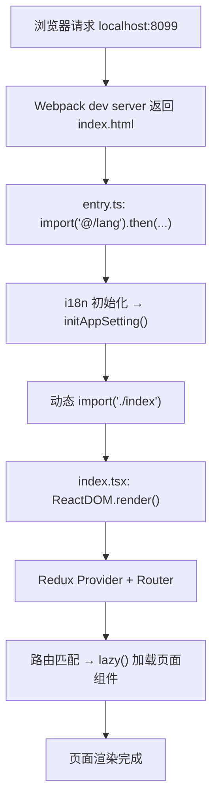

关键文件及职责：

| 步骤 | 文件 | 职责 |
| --- | --- | --- |
| 1 | `src/entry.ts` | 异步加载 i18n 和应用设置，然后动态加载主入口 |
| 2 | `src/index.tsx` | 创建 Redux Store、挂载 React Router、`ReactDOM.render()` |
| 3 | `src/routes/*.ts` | 定义路由树，每个路由指向 `lazy()` 加载的页面组件 |
| 4 | 页面组件 | 实际渲染的 React 组件 |

### 2.2 entry.ts 的异步启动模式

```typescript
// src/entry.ts（简化）
import('@/lang').then(async ({ run }) => {
  await run();                              // i18n 初始化
  const { initAppSetting } = await import('@/bridge/init-app-setting');
  await initAppSetting();                   // 应用全局设置
  import('./index');                        // 加载主入口
});
```

这个文件做了三件事，全部是异步的：

1. **i18n 初始化**：`run()` 加载翻译文件、设置语言。如果 i18n 未初始化就渲染页面，所有 `$t()` 调用都会失败——这就是 Portal 白屏最常见的原因。
2. **应用设置**：`initAppSetting()` 从后端拉取全局配置（如功能开关、环境变量）。
3. **主入口加载**：`import('./index')` 是动态导入，此时 i18n 和配置已就绪。

如果 Portal 白屏，第一件事是打开浏览器 Console，看 i18n 初始化是否报错。`src/lang/` 目录下缺少 JSON 文件是最常见的原因。

### 2.3 渲染入口：Redux + Router + Render

Portal 的渲染层次：`Redux Provider` 提供全局 Store → `RecoilRoot` 提供原子化状态 → `Router` 匹配 URL → `App` 根组件（侧边栏、导航、主内容区）。全部由 Portal 自己创建和管理，没有宿主参与。这意味着 Portal 需要自己处理所有基础设施，但也意味着你不会遇到"宿主版本不兼容"的问题。

### 2.4 失败点地图

| 现象 | 可能原因 | 排查方法 |
| --- | --- | --- |
| 白屏 + Console 无报错 | i18n 初始化失败 | 检查 `src/lang/` 目录下的 JSON 文件 |
| 白屏 + `Cannot read property` | Store 未正确初始化 | 检查 `generateStore()` 和 reducer |
| 页面 404 | 路由未注册或懒加载失败 | 检查 `src/routes/` 中对应路由定义 |
| API 请求 401 | 未登录 Portal test 环境 | 在 test 环境 Portal 登录后再访问 localhost |
| 页面加载但数据为空 | API 代理未配置 | 检查 Network 面板中 API 请求 URL 和状态码 |

## 三、SC Vue：MMF 模块的宿主依赖生命周期

### 3.1 模块初始化：Store → Router → 全局依赖

SC Vue 不能独立启动。它的 `src/index.ts` 不是渲染入口——它是**模块注册入口**：

```typescript
// src/index.ts（简化）
import './store';                          // 1. 注册 Vuex module
import './router';                         // 2. 注册路由
import { initRemoteDepsForMMF } from './global-deps-register';
initRemoteDepsForMMF();                    // 3. 注册全局依赖（远端组件用）
```

这三步不渲染任何东西。它们的作用是**向 MMF 框架声明"我提供了这些能力"**。`./store` 执行 `app.registerVue3StoreModule('FBS_STORE', FBS_STORE)` 将 Vuex module 挂载到宿主 Store。`./router` 导出一个 `routers` 数组，MMF 框架将其合并到宿主路由表中。`initRemoteDepsForMMF()` 注册全局依赖供远端组件使用。

### 3.2 宿主注入的完整链路

SC Vue 页面的完整渲染需要宿主参与：

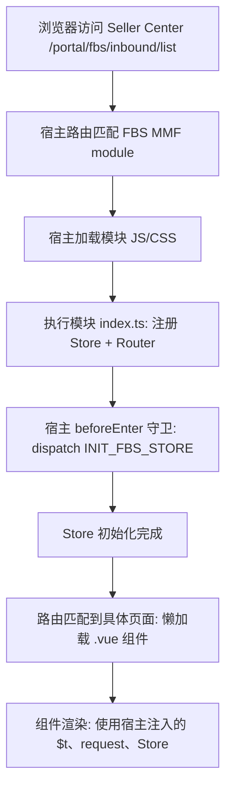

关键宿主注入对象：

| 注入对象 | 来源 | 访问方式 | 作用 |
| --- | --- | --- | --- |
| `app` | 宿主 `framework` | `import { app } from 'framework'` | 全局应用实例 |
| `app.request` | 宿主 Axios 实例 | `app.request.clone({ baseURL })` | 携带宿主会话的请求实例 |
| `app.vue3VuexStore` | 宿主 Vuex Store | `getters['FBS_STORE/...']` | 跨模块共享状态 |
| `app.i18n` | 宿主 i18n 实例 | `app.i18n.t(key)` | 翻译函数 |
| `app.router` | 宿主 Vue Router | 路由守卫中访问 | 路由导航 |

### 3.3 beforeEnter：路由守卫中的初始化契约

```typescript
// src/router/index.ts（简化）
beforeEnter: async (to, from) => {
  const data = await app.vue3VuexStore.dispatch('FBS_STORE/INIT_FBS_STORE');
  if (data.systemUpgrading?.toggle) return { path: '/portal/fbs/systemUpdating' };
  // 检查税务锁定、入驻状态、权限等
}
```

`beforeEnter` 是模块与宿主的"初始化契约"。它在首次进入 FBS 模块时执行，获取卖家/店铺信息并检查系统状态。如果 `INIT_FBS_STORE` 失败，整个 FBS 模块无法使用。排查"SC FBS 页面打不开"时的第一个检查点：打开 Vue DevTools 或 Console，确认 `FBS_STORE` 的 state 是否已填充。

### 3.4 失败点地图

| 现象 | 可能原因 | 排查方法 |
| --- | --- | --- |
| SC FBS 模块入口不可见 | `authCodes` 不满足 | 检查宿主的权限配置 |
| 进入模块后白屏 | `INIT_FBS_STORE` 失败 | Console 查看 dispatch 错误 |
| 页面组件不渲染 | 路由未注册或懒加载失败 | 检查 `routers` 数组 |
| MMF Dev Tools 不生效 | 模块 key 或端口错误 | 检查 `mmc.config.js` 和 Dev Tools 面板 |
| 请求失败 401/403 | 宿主会话过期 | 刷新 Seller Center 页面 |

## 四、SC React：MMF + 远端组件的双重生命周期

### 4.1 模块初始化：三步注册

SC React 的初始化比 SC Vue 多了一层——远端组件运行时：

```typescript
// projects/react-frontend/src/index.ts（简化）
import { init as initRemoteComponent } from '@shopee/remote-component-react';

initRemoteComponent({
  environment: app.environment.environment,
  region: app.environment.region,
});

initGlobalDepsForMMF();        // 注册全局依赖
app.registerRouterModule(routes); // 注册路由
```

`initRemoteComponent` 初始化远端组件框架——环境配置错误会导致远端组件加载线上版本而非本地开发版本。`initGlobalDepsForMMF()` 准备 `$gt`、`request`、`router`、`reporter` 等全局依赖。`app.registerRouterModule(routes)` 向 MMF 框架注册路由。

### 4.2 DepsProvider：React 侧依赖注入

SC React 的核心设计是 `DepsProvider`——一个 React Context，为所有组件提供全局依赖：

```tsx
// 简化版
<DepsProvider value={{ $gt, request, router, reporter }}>
  <App />
</DepsProvider>
```

这与 SC Vue 的 `app.xxx` 全局访问有本质区别：Vue 中任何地方都可以 `import { app } from 'framework'`；React 中全局依赖通过 Context 显式传递，只有包裹在 `DepsProvider` 内的组件才能访问。如果你在一个独立测试中渲染 SC React 组件但没有包裹 `DepsProvider`，`useContext(DepsContext)` 返回 `undefined`。

### 4.3 远端组件的双宿主兼容

SC React 的远端组件目录 `projects/fbs-sc-remote-component/` 中的组件需要同时被 Portal（Module Federation）和 MMF 宿主消费。`createRemoteComponent` 工厂函数在运行时检测宿主类型并返回对应格式：

```tsx
// createRemoteComponent.tsx（简化）
export function createRemoteComponent(Component) {
  const hostType = getHostType();
  if (hostType === 'portal') {
    return { mount, update, unmount };  // Portal 期望生命周期对象
  }
  return WrappedComponent;  // MMF 期望 React 组件
}
```

### 4.4 三种形态加载时序对比

| 阶段 | Portal | SC Vue | SC React |
| --- | --- | --- | --- |
| 1. 入口加载 | `entry.ts` 异步链 | `index.ts` 同步注册 | `index.ts` 同步注册 |
| 2. 依赖初始化 | i18n → AppSetting → index | Store → Router → Deps | RemoteComponent → Deps → Router |
| 3. 宿主注入 | 无 | `app` 全局对象 | `app` + `DepsProvider` Context |
| 4. 页面渲染 | `ReactDOM.render()` | 宿主调用 `Vue3Mount()` | 宿主调用 `React18Mount()` |
| 5. 懒加载 | `React.lazy()` | `() => import()` | `React.lazy()` + SSCConfigProvider |

## 五、跨形态排错：用同一套问题定位

无论哪种形态，页面打不开时按以下顺序排查：

### 5.1 第一步：确定故障层

```text
浏览器能看到页面吗？
├─ 完全白屏 → 入口层问题（entry/index 加载失败）
├─ 有壳但内容空白 → 路由/Store 层问题
├─ 有内容但数据为空 → API/数据层问题
└─ 页面能看但交互不工作 → 事件/状态层问题
```

### 5.2 第二步：检查最薄弱的环节

| 形态 | 最薄弱环节 | 检查方法 |
| --- | --- | --- |
| Portal | i18n 初始化 | Console 是否有 i18n 错误 |
| SC Vue | `INIT_FBS_STORE` | Vue DevTools 中 FBS_STORE state 是否为空 |
| SC React | `DepsProvider` | React DevTools 中 DepsContext 是否有值 |

### 5.3 第三步：用 DevTools 逐层核验

1. **Network 面板**：页面和 JS/CSS 资源是否成功加载（200）。
2. **Console 面板**：是否有未捕获错误。
3. **框架 DevTools**：组件树是否完整，Store 是否有数据。
4. **MMF Dev Tools**（SC 仓库）：模块是否成功注入宿主。

### 5.4 跨形态故障对照表

| 故障现象 | Portal 定位 | SC Vue 定位 | SC React 定位 |
| --- | --- | --- | --- |
| 白屏 | i18n 未初始化 | INIT_FBS_STORE 失败 | DepsProvider 未包裹 |
| 页面 404 | 路由文件未注册 | routers 数组缺失 | registerRouterModule 未调用 |
| 请求 401 | 未登录 test Portal | 宿主会话过期 | 宿主会话过期 |
| 组件报 undefined | Store state 未填充 | Store state 未填充 | DepsContext 未提供 |

## 六、从生命周期理解开发约束

### 6.1 为什么 SC Vue 不能在 beforeEnter 之前访问 Store

Store 在模块加载时注册（`import './store'`），但数据在 `beforeEnter` 中的 `dispatch('INIT_FBS_STORE')` 后才填充。提前访问会得到初始空值。

### 6.2 为什么 SC React 组件必须包裹在 DepsProvider 中

因为 `request`、`$gt`、`router` 等通过 React Context 传递，不是全局变量。任何脱离 `DepsProvider` 子树的组件访问这些依赖都会得到 `undefined`。

### 6.3 为什么 Portal 改路由不需要注册步骤

Portal 使用 React Router 5 的文件式路由——`src/routes/*.ts` 在构建时收集并生成路由树，不需要向宿主注册。SC 仓库需要注册是因为路由必须合并到宿主全局路由表中。

### 6.4 为什么远端组件需要 createRemoteComponent 工厂

远端组件的消费者有两种——Portal（Module Federation）和 MMF 宿主。它们对导出格式有不同要求。工厂在运行时检测宿主类型并适配。

### 6.5 三种形态对"新页面开发"的影响

| 操作 | Portal | SC Vue | SC React |
| --- | --- | --- | --- |
| 新增路由 | 在 `src/routes/` 加文件 | 在 `routers` 数组加条目 | 在 `routes` 数组加条目 |
| 新增 Store 模块 | 在 `src/store/` 加 reducer | 在 `src/store/modules/` 加 module | 在 `store/modules/` 加 slice |
| 新增依赖注入 | 不需要 | `initRemoteDepsForMMF()` 中注册 | `initGlobalDepsForMMF()` 中注册 |
| 启动验证 | 浏览器打开 localhost 即可 | MMF Dev Tools 注入后验证 | MMF Dev Tools 注入后验证 |

## 七、练习

### 7.1 时序图绘制

为 SC Vue 仓库画一张完整的页面加载时序图，包含以下参与方：浏览器、Seller Center 宿主、模块 `index.ts`、`store/index.ts`、`router/index.ts`、`beforeEnter` 守卫、页面组件。标注每个步骤的输入和输出。

### 7.2 故障定位

以下场景分别发生在哪种形态中？定位到具体文件：

a) 用户访问 `/portal/fbs/inbound/list`，页面显示"系统升级中"。
b) Portal 本地 `localhost:8099` 能打开但所有文字显示为 key 名（如 `inboundProblemId` 而非"入库问题 ID"）。
c) SC React 中 `useContext(DepsContext)` 返回 `undefined`。

### 7.3 跨形态对比

用一句话描述 Portal、SC Vue、SC React 在"路由注册方式"上的核心差异。

### 7.4 参考答案

**7.2a**：SC Vue。`src/router/index.ts` 的 `beforeEnter` 中 `systemUpgrading.toggle` 检查 → 跳转 `/portal/fbs/systemUpdating`。

**7.2b**：Portal。`src/entry.ts` 的 i18n 初始化未完成或 `src/lang/` 下缺少翻译 JSON 文件。

**7.2c**：SC React。组件不在 `DepsProvider` 子树内，或 `initGlobalDepsForMMF()` 未被调用。

**7.3**：Portal 通过文件定义路由树自动收集；SC Vue 导出数组由 MMF 框架注册；SC React 显式调用 `registerRouterModule` 注册。


## 八、宿主边界对测试和调试的影响

### 8.1 Portal：可独立测试

Portal 不依赖外部宿主，你可以在不启动 Seller Center 的情况下做绝大多数前端测试和调试。`ReactDOM.render()` 是标准的 React 入口，Jest 单元测试可以直接渲染组件并验证行为，不需要 mock 宿主对象。这使得 Portal 的开发反馈循环最短——改代码、刷新浏览器、看结果。

### 8.2 SC Vue：需要宿主上下文

SC Vue 的几乎所有能力（路由、Store、请求、i18n）都来自宿主 `app` 对象。这意味着：
- 单元测试需要 mock `framework` 模块中的 `app`。
- 本地开发必须通过 MMF Dev Tools 连接 Seller Center 测试环境。
- 如果测试环境挂了，SC Vue 的本地开发也受影响（因为 INIT_FBS_STORE 需要调用测试环境 API）。

这不是 SC Vue 的设计缺陷——这是 MMF 多模块架构的固有特征：模块复用宿主的基础设施，换取更小的模块体积和更一致的跨模块体验。代价是模块不能脱离宿主独立运行。

### 8.3 SC React：双重依赖

SC React 不仅依赖 MMF 宿主，还依赖远端组件运行时。这意味着：
- 本地开发可能需要同时启动主模块和远端组件两个 dev server。
- 远端组件的调试需要确认它被哪个宿主加载（Portal 还是 MMF），因为两者的生命周期不同。
- 测试远端组件时，需要 mock 两个宿主的环境变量、全局依赖和生命周期方法。

一个实用的开发策略：先在主模块内完成组件开发和测试（此时不涉及远端组件的生命周期），确认功能正确后再将组件抽取到远端组件目录并适配两种宿主。

### 8.4 三种形态的开发体验对比

| 维度 | Portal | SC Vue | SC React |
| --- | --- | --- | --- |
| 本地启动复杂度 | 低（`yarn start`） | 中（`yarn dev` + MMF Dev Tools） | 高（`pnpm dev:host` + 可能 `pnpm dev:remote`） |
| 独立测试能力 | 强 | 弱（需 mock 宿主） | 弱（需 mock 双宿主） |
| 开发反馈速度 | 快 | 中 | 中 |
| 对测试环境依赖 | 仅 API 代理 | API + Store 初始化 | API + Store 初始化 + 远端组件 |

这张表不是让你选择"哪个仓库最好"——每个仓库的约束由它的架构角色决定。但了解这些差异能帮助你在不同仓库之间切换时，调整对开发速度的预期和调试策略。

## 参考文献

- [React 16.14.0 Official Release](https://github.com/facebook/react/releases/tag/v16.14.0)
- [React 18 Upgrade Guide](https://react.dev/blog/2022/03/08/react-18-upgrade-guide)
- [Vue 3 Guide](https://vuejs.org/guide/introduction.html)
- [Webpack Module Federation](https://webpack.js.org/concepts/module-federation/)
- [qiankun Guide](https://qiankun.umijs.org/guide)
- [React Router v5.2](https://github.com/remix-run/react-router/tree/v5.2.0)


---

# 微前端与远端组件：Module Federation、qiankun、MMF

> 预计学习时间：120–160 分钟
> 一句话总结：能区分 FBS 中 Module Federation、qiankun、MMF 三种微前端/远端组件接入机制的用途与边界——从现有远端 InboundComponent 追踪产物与消费链，评估修改公共组件时对各消费者的影响。

## 这一章解决什么问题

FBS 前端不是由单一应用构成的。Portal 通过 Module Federation 和 qiankun 加载来自其他团队的微应用和远端组件；两个 SC 仓库通过 MMF 框架被 Seller Center 宿主加载；SC React 的远端组件同时被 Portal 和 MMF 宿主消费。这三种机制——Module Federation、qiankun、MMF——名字听起来类似，但解决的问题和运作方式完全不同。

混用这些概念会导致两类典型错误：一是在 MMF 模块里试图用 Module Federation 的方式暴露组件（MMF 的宿主不认这种格式）；二是在修改远端组件的 Props 时只考虑了一个消费者的兼容性，忽略了另一个宿主。

本章不会让你成为微前端架构师，但会让你在遇到"这个组件改了之后 Portal 会不会挂"或"为什么远端组件在 MMF 中能渲染但 Portal 中不行"这类问题时，知道去哪里找答案。

> 本章基于三个前端仓库的 release 分支（2026-07-20）。

## 一、三种机制速览

| 机制 | 出现位置 | 作用 | 关键配置 |
| --- | --- | --- | --- |
| **Module Federation** | Portal `webpack.config.js` → `remotes.js` | 从其他应用加载 JS 模块，共享依赖 | `remotes.js` + `ModuleFederationPlugin` |
| **qiankun** | Portal 微应用注册 | 加载独立的子应用（独立的 HTML/JS/CSS） | 微应用注册配置 |
| **MMF** | SC Vue / SC React | 多模块框架，模块被 Seller Center 宿主加载 | `mmc.config.js` + 宿主路由配置 |

核心区分：Module Federation 共享的是**JavaScript 模块**（构建时确定共享范围）；qiankun 加载的是**独立子应用**（运行时沙箱隔离）；MMF 管理的是**同一宿主内的多模块**（模块间共享宿主基础设施）。

## 二、Module Federation：Portal 的远端模块机制

### 2.1 基本原理

Webpack 5 的 Module Federation 允许一个应用在运行时加载另一个应用的模块。Portal 的 `webpack.config.js` 中配置了 `ModuleFederationPlugin`：

```javascript
// webpack.config.js（简化）
new ModuleFederationPlugin({
  name: 'fbs_portal',
  remotes: {
    // 远端模块的入口配置
  },
  shared: {
    react: { singleton: true },
    'react-dom': { singleton: true },
    // 共享依赖列表
  },
});
```

`remotes` 定义了哪些远端模块可以被加载。`shared` 定义了哪些依赖在宿主和远端模块之间共享（避免重复打包 React 等大型库）。

### 2.2 Portal 的 remotes.js

Portal 的 `remotes.js` 定义了远端模块的加载方式：

```javascript
// remotes.js（简化逻辑）
const getRemoteModule = (moduleName, entry) =>
  `promise new Promise((resolve) => {
    if (window[module]) { resolve(window[module]); return; }
    const script = document.createElement('script');
    script.src = getEntryUrl(module, entry);
    script.onload = () => resolve(window[module]);
    document.head.appendChild(script);
  })`;
```

远端模块的加载过程是：检查 `window` 上是否已有该模块 → 如果没有，创建 `<script>` 标签加载远端 JS → 加载完成后获取 `window[module]` → 返回模块。这个过程中有几个关键点：

- 模块的入口 URL 可能来自 `sessionStorage` 或默认地址。
- `window[module]` 的 `get()` 和 `init()` 方法提供了异步获取模块和初始化的能力。
- 如果远端模块的 JS 文件加载失败（CDN 不可达、网络问题），整个 Promise reject，Portal 中对应区域不渲染。

### 2.3 共享依赖的版本约束

`shared: { react: { singleton: true } }` 意味着整个页面中只有一个 React 实例。如果远端模块打包了自己的 React，Module Federation 会让它使用 Portal 提供的那个。这避免了"页面上有两个 React 导致 hooks 报错"的问题，但也意味着：

- 远端模块的 React 版本不能高于 Portal 的 React 16。
- 如果远端模块使用了 React 17+ 的特性，在 Portal 中会报错。
- 共享依赖的版本升级需要协调所有消费者。

### 2.4 远端组件的消费方式

Portal 消费远端组件的典型代码：

```tsx
const RemoteInboundComponent = React.lazy(() => import('remote_inbound/InboundComponent'));

// 使用
<Suspense fallback={<Spin />}>
  <RemoteInboundComponent irId={id} />
</Suspense>
```

`import('remote_inbound/InboundComponent')` 的路径由 Module Federation 配置中的 `remotes` 解析。`React.lazy()` 配合 `Suspense` 处理加载中的状态。

## 三、qiankun：Portal 的微应用框架

### 3.1 qiankun 的基本模型

qiankun 是一个微前端框架，基于 single-spa。它将每个子应用作为一个独立的"微应用"加载，每个微应用有自己完整的生命周期：

```typescript
// 微应用注册（简化）
registerMicroApps([
  {
    name: 'sub-app-1',
    entry: '//host/sub-app-1/',
    container: '#sub-app-container',
    activeRule: '/sub-app-1',
  },
]);
```

每个微应用有自己的 HTML、JS、CSS 和路由系统。qiankun 通过 JS 沙箱和样式隔离确保微应用之间互不影响。

### 3.2 Portal 中 qiankun 的实际使用

Portal 在 `src/index.tsx` 中通过 qiankun 加载部分微应用。具体的子应用列表和路由映射在仓库中有对应的注册配置。qiankun 的微应用与 Portal 本身的页面通过路由区分——特定路径前缀由 qiankun 接管，渲染对应的微应用；其余路径由 Portal 自己的 React Router 处理。

### 3.3 qiankun 与 Module Federation 的选择

| 场景 | 使用机制 | 原因 |
| --- | --- | --- |
| 加载另一个团队的独立应用 | qiankun | 独立 HTML/JS/CSS，完全隔离 |
| 共享一个 React 组件 | Module Federation | 轻量，共享依赖 |
| FBS 内部模块在 Seller Center 中 | MMF | 共享宿主基础设施 |

简单判断：需要加载一个独立应用（有自己的路由、Store）→ qiankun；只需要共享一个或几个组件 → Module Federation；在 Seller Center 内的 FBS 功能模块 → MMF。

## 四、MMF：Seller Center 的多模块框架

### 4.1 MMF 的模块注册模型

MMF 是 Seller Center 的多模块框架。FBS 的两个 SC 仓库都是 MMF 模块。模块通过 `mmc.config.js` 声明自己的身份：

```javascript
// mmc.config.js（简化）
module.exports = {
  id: 435,           // 模块在 Seller Portal 中的唯一 ID
  type: "module",    // 类型：module / portal / remote-component
  tech: "react18",   // 技术栈：vue3 / react18
};
```

宿主编译时读取所有已注册模块的 `mmc.config.js`，根据 `id` 和 `type` 决定如何加载、何时加载。

### 4.2 模块的路由注册

SC Vue 通过导出数组注册路由（MMF 自动识别）；SC React 通过显式调用：

```typescript
app.registerRouterModule(routes);
```

两种方式的最终效果相同：模块的路由被合并到宿主路由表中。模块不需要知道宿主路由的全貌——它只需要声明自己负责哪些路径。

### 4.3 MMF 的宿主注入

MMF 模块从宿主获得的能力已在 FE-A01 详述。从本章的角度看，关键是：模块的"独立开发体验"是 MMF Dev Tools 模拟的，不是真实的独立运行。模块在本地 dev server 中运行时，MMF Dev Tools 在浏览器中注入宿主环境。这解释了为什么没有 MMF Dev Tools 就无法看到 SC 页面。

## 五、远端组件：跨宿主的共享组件

### 5.1 SC React 的远端组件架构

SC React 仓库中的 `projects/fbs-sc-remote-component/` 是远端组件目录。它包含可以被 Portal（Module Federation）和 MMF 宿主共同消费的组件。`InboundComponent` 是其中的典型——入库相关的共享组件，在 Portal 和 SC 中都会出现。

### 5.2 createRemoteComponent 的适配逻辑

```tsx
// createRemoteComponent.tsx（简化）
export function createRemoteComponent(Component) {
  const hostType = getHostType(); // 'portal' 或 'mmf'

  const WrappedComponent = (props) => (
    <DepsProvider>
      <SSCProvider>
        <Component {...props} />
      </SSCProvider>
    </DepsProvider>
  );

  if (hostType === 'portal') {
    // Portal: 返回 { mount, update, unmount }
    return {
      mount: (el, props, context) => { /* ReactDOM.render */ },
      update: (instance, props, context) => { /* re-render */ },
      unmount: (instance) => { /* ReactDOM.unmountComponentAtNode */ },
    };
  }
  // MMF: 返回带生命周期方法的 React 组件
  return Object.assign(WrappedComponent, {
    mount: (el, props) => { /* ReactDOM.render */ },
    update: (instance, props) => { /* re-render */ },
    unmount: (instance) => { /* unmount */ },
  });
}
```

Portal 的 `@shopee/remote-component-react` 检查 `typeof module`：如果是 `'function'`，当 React 组件渲染（但缺少 `DepsProvider` 上下文）；如果是 `'object'`，检测 `.mount` 并调用生命周期方法。MMF 的 `RemoteComponent` 则相反：`'function'` 正常渲染，`'object'` 会报 `Element type is invalid`。`createRemoteComponent` 的职责就是根据宿主返回正确格式，并确保两种路径都包裹了必要的 `DepsProvider`。

### 5.3 修改远端组件的兼容清单

当你需要修改远端组件的 Props 或行为时：

1. **确认消费者**：哪些宿主消费了这个组件？查看 `mmc.config.js` 中的 `type: "remote-component"` 和相关 Confluence 工程梳理。
2. **Props 兼容**：新增可选 Props 通常是安全的（消费者不传时使用默认值）；修改必填 Props、删除 Props、改变 Props 类型是破坏性变更，需要协调所有消费者。
3. **依赖兼容**：远端组件使用的 React/框架版本必须与所有消费者兼容。Portal 使用 React 16，如果远端组件使用了 React 18 hooks（如 `useId`），在 Portal 中会报错。
4. **样式隔离**：远端组件的样式是否会泄漏到宿主页面或与其他远端组件冲突？CSS Modules 提供了基本隔离，但全局样式（如 `body`、`.fbs-` 前缀）仍有风险。
5. **测试覆盖**：至少在 Portal 和 MMF 两种宿主中各验证一次。

## 六、三种机制对开发的约束

### 6.1 公共组件应该放在哪里

| 组件的消费范围 | 放置位置 | 发布方式 |
| --- | --- | --- |
| 仅在 Portal 中使用 | Portal `src/components/` | 随 Portal 构建 |
| Portal + SC React 都需要 | SC React 远端组件 | 构建为远端组件产物 |
| 仅在 SC Vue 中使用 | SC Vue `src/views/` 内 | 随 Vue MMF 模块构建 |
| 所有前端仓库都需要 | 考虑提取到独立 npm 包 | npm publish（需团队评估） |

### 6.2 跨宿主调试的实用技巧

当你需要在 Portal 中调试远端组件时：

1. 在 SC React 中修改远端组件代码。
2. 运行 `pnpm dev:remote` 启动远端组件 dev server。
3. Portal 的 Module Federation 配置中指向远端组件 dev server 的地址（而非生产 CDN 地址）。
4. Portal 的 webpack dev server 会从远端组件 dev server 拉取最新代码。

如果远端组件在 Portal 中渲染异常，第一件事是确认 Module Federation 加载的 JS 文件是本地 dev server 版本还是 CDN 版本——打开 Network 面板，查找远端组件的 JS 请求 URL。

## 七、常见错误

### 7.1 远端组件在 Portal 中不渲染

可能原因：`typeof module` 判断错误 → Portal 的 `@shopee/remote-component-react` 无法正确识别组件格式。检查远端组件的导出是否正确使用了 `createRemoteComponent` 工厂。

### 7.2 共享依赖版本冲突

Portal 使用 React 16，远端组件使用了 React 18 hooks → Portal 中报 `TypeError: (0, React.useId) is not a function`。解决方案：远端组件降级使用 React 16 兼容的 API，或将 Portal 升级到 React 18（需要更大范围的评估）。

### 7.3 MMF Dev Tools 不注入

确认模块 key 与 `mmc.config.js` 中的 `id` 一致。确认 dev server 端口正确且在运行。确认 Chrome 扩展已启用并选择了正确的环境。

### 7.4 微应用样式污染

qiankun 的样式隔离不是绝对的——某些全局选择器可能穿透。微应用内部应使用 CSS Modules 或 scoped style。如果必须使用全局样式，加上微应用特有的前缀（如 `.fbs-portal-`）。

## 八、练习

### 8.1 机制区分

以下场景分别应该使用哪种机制？

a) Portal 需要加载 SC React 仓库的入库列表组件。
b) Portal 需要加载另一个团队提供的独立数据看板子应用。
c) SC Vue 需要在 Seller Center 中提供新的功能模块。

### 8.2 兼容性评估

远端组件的 `InboundComponent` 需要新增一个必填 Props `region`（字符串）。评估这个改动对 Portal 和 MMF 两个消费者的影响，写出需要检查和修改的文件列表。

### 8.3 跨宿主调试

你在 SC React 远端组件中修改了 `InboundComponent` 的渲染逻辑，但 Portal 中看到的仍是旧版本。列出三个最可能的原因和对应的检查步骤。

### 8.4 参考答案

**8.1**：a) Module Federation（共享组件）。b) qiankun（独立子应用）。c) MMF（Seller Center 多模块框架）。

**8.2**：Portal 侧的消费代码需要传入 `region` Props；MMF 侧的消费代码同理。如果 `region` 可以从宿主上下文推导（如 `app.environment.region`），考虑在 `createRemoteComponent` 的 wrapper 中注入而非要求消费者传入——这样对消费者更友好。

**8.3**：1) 远端组件 dev server 未启动或 Portal 的 Module Federation 配置未指向本地 dev server URL → 检查 Network 面板；2) 浏览器缓存了旧版本 JS → 硬刷新（Cmd+Shift+R）；3) `createRemoteComponent` 的格式不匹配导致 Portal 使用了 fallback → 检查 Console 是否有模块加载错误。


## 九、远端组件的完整生命周期追踪

### 9.1 从源码到两个宿主的渲染路径

以 InboundComponent 为例，追踪它在 Portal 和 MMF 中的完整加载路径：

**Portal 路径**：
1. Portal webpack 构建时，`ModuleFederationPlugin` 配置的 `remotes` 指向远端组件产物地址。
2. Portal 页面代码 `React.lazy(() => import('remote_inbound/InboundComponent'))` 触发动态加载。
3. webpack 运行时通过 `remotes.js` 的逻辑加载远端组件 JS 文件。
4. 远端组件 JS 文件执行，`window[moduleName]` 被赋值。
5. `window[moduleName].get()` 返回 `{ mount, update, unmount }` 对象。
6. Portal 调用 `.mount(el, props, context)` 渲染组件。

**MMF 路径**：
1. SC React 构建时，`mmc.config.js` 声明 `type: "remote-component"`。
2. MMF 宿主加载模块时，检测到远端组件类型，通过 `RemoteComponent` wrapper 加载。
3. `RemoteComponent` 调用 `createRemoteComponent` 返回的 React 组件。
4. React 组件内部通过 `DepsProvider` 获取全局依赖，正常渲染。

### 9.2 两条路径的差异来源

为什么同一个远端组件需要两条不同的路径？根本原因是 Portal 和 MMF 使用了不同的组件加载机制：

- Portal 使用 `@shopee/remote-component-react`，它期望模块导出一个**对象**（有 mount/update/unmount 方法），因为 Portal 的微前端架构中，非 React 子应用也需要被加载——生命周期方法是通用接口。
- MMF 的 `RemoteComponent` 是 React 专用加载器，它期望模块导出一个**React 组件**，直接用 `React.createElement` 渲染。

`createRemoteComponent` 在运行时通过 `getHostType()` 检测宿主类型，然后返回对应的格式。这个检测不是黑魔法——它通常通过检查 `window` 上的特定全局变量或宿主注入的标识来完成。

### 9.3 远端组件的依赖注入链

远端组件依赖的全局对象（`$gt`、`request`、`reporter` 等）在两种宿主中的注入路径也不同：

- **Portal**：`mount(el, props, context)` 的 `context` 参数包含全局依赖。`createRemoteComponent` 的 wrapper 从 `context` 中提取依赖并注入 `DepsProvider`。
- **MMF**：全局依赖由 `initGlobalDepsForMMF()` 在模块加载时准备，存储在模块作用域的变量中。`DepsProvider` 从这些变量中读取。

如果远端组件在 Portal 中能渲染但功能不正常（如请求失败、翻译不生效），第一件事是检查 `mount()` 的 `context` 参数是否正确传递了全局依赖。在 MMF 中出现同样的问题，检查 `initGlobalDepsForMMF()` 是否在远端组件加载前执行。

## 十、跨宿主共享组件的版本管理

### 10.1 远端组件的版本策略

SC React 的远端组件没有独立的 npm 版本号——它的"版本"由 SC React 仓库的 git commit 决定。当远端组件代码变更后，需要：

1. 在 SC React 中构建远端组件产物。
2. 将产物部署到 CDN 或静态资源服务器。
3. Portal 的 `remotes.js` 中更新远端组件的入口 URL（或通过配置中心动态切换）。

如果远端组件有破坏性变更（如删除了某个 Props、改变了 mount 签名），需要确保所有消费者同步更新。建议在 MR 描述中明确标注破坏性变更，并在合并前协调消费方。

### 10.2 Portal 侧消费远端组件的降级策略

如果远端组件加载失败（CDN 不可达、JS 解析错误），Portal 不应白屏。标准的处理方式：

```tsx
const RemoteInboundComponent = React.lazy(() =>
  import('remote_inbound/InboundComponent').catch(() => ({
    default: () => <ErrorFallback message="组件加载失败" />
  }))
);
```

`.catch()` 捕获加载失败，返回一个降级组件而不是抛出错误导致整个页面崩溃。

## 十一、三种机制的未来演进

理解当前的三种机制后，有一个实际的问题：未来新增的功能应该选择哪种机制？

当前趋势：
- qiankun 微应用在逐步收敛——新功能优先考虑 MMF 模块（SC 仓库）或 Module Federation 远端组件，而非新增独立微应用。
- Module Federation 适合跨团队的组件级共享——共享的是"能力单元"而非"整个应用"。
- MMF 是 Seller Center 内的标准模块化方案——所有 SC 侧的新功能都应走 MMF 模块。

对于 FBS 前端开发来说，大部分新功能属于以下两种情况：
1. SC 侧的 FBS 功能 → SC Vue 或 SC React（MMF 模块）。
2. Portal 侧需要消费的共享组件 → SC React 远端组件（Module Federation 提供给 Portal）。


## 参考文献

- [Webpack Module Federation](https://webpack.js.org/concepts/module-federation/)
- [qiankun Guide](https://qiankun.umijs.org/guide)
- [React 16.14.0 Release](https://github.com/facebook/react/releases/tag/v16.14.0)
- [React 18 Upgrade Guide](https://react.dev/blog/2022/03/08/react-18-upgrade-guide)


---

# Vue/React 共存、共享依赖与版本迁移

> 预计学习时间：120–160 分钟
> 一句话总结：能处理 FBS 中 React 16/18、Vue 3 三种框架在同一页面中共存的情况——理解宿主 Vuex 注入、axios external 共享、全局依赖注入机制，能够定位依赖缺失故障并提出兼容改法。

## 这一章解决什么问题

大多数前端项目只有一个框架——React 或 Vue，选一个用到老。但 FBS 的三个前端仓库打破了这条规则：Portal 运行 React 16，SC Vue 运行 Vue 3，SC React 运行 React 18——更关键的是，SC React 作为一个 React 应用，需要从宿主的 Vuex Store 读取卖家信息和店铺数据。React 和 Vue 不是"选一个"的关系，它们在同一页面中共存。

这种跨框架共存带来了三类问题：一是 React 组件如何读取 Vuex Store（答案：不是通过"桥接库"，而是直接访问宿主的 getter）；二是多个框架的共享依赖（如 axios）如何避免重复打包（答案：通过 webpack external 声明"运行时由宿主提供"）；三是全局依赖（翻译函数、请求实例、监控上报）如何注入到不同框架的组件中。

本章从三个真实场景出发：React 组件读取 Vuex Store、SC React 的 `DepsProvider` 依赖注入机制、以及依赖共享与版本迁移策略。学会这些后，你不会再对"为什么这个 React 组件里能访问 `app.vue3VuexStore`"感到困惑，也不会在改了共享依赖后导致另一个框架爆炸。

> 本章基于三个前端仓库的 release 分支（2026-07-20）。

## 一、跨框架共存的现实

### 1.1 FBS 中三种框架的共存地图

在当前 FBS 代码中，以下场景涉及跨框架交互：

| 场景 | 消费者框架 | 提供者框架 | 交互方式 |
| --- | --- | --- | --- |
| SC React 读取卖家/店铺信息 | React 18 | Vue 3（宿主 Vuex） | `app.vue3VuexStore.getters` |
| SC React 使用宿主请求实例 | React 18 | Vue 3（宿主 `app.request`） | `app.request.clone()` |
| SC React 使用宿主翻译 | React 18 | Vue 3（宿主 `app.i18n`） | `$gt` 函数通过 DepsProvider 注入 |
| 远端组件被 Portal 消费 | React 18 | React 16（Portal） | Module Federation + createRemoteComponent |
| Portal 微应用（qiankun） | 各种框架 | React 16（Portal） | qiankun 沙箱隔离 |

### 1.2 跨框架不是"桥接"——是"共享宿主基础设施"

理解 FBS 跨框架的关键洞察：这些框架不是通过某个"桥接库"互相调用的。它们共享的是**同一个宿主基础设施**——`app` 对象。`app.vue3VuexStore` 本质上就是一个 JavaScript 对象，React 组件访问它不需要通过 Vue——直接读取 `getters` 属性即可。

这解释了为什么你在 SC React 中看到这样的代码：

```typescript
const currentShop = app?.vue3VuexStore?.getters?.['FBS_STORE/Shop/currentShop'];
```

这不是 React 调用了 Vue 的某个 API。这是普通的 JavaScript 对象属性访问——`getters` 是一个对象，`'FBS_STORE/Shop/currentShop'` 是它的一个 key。Vuex 的响应式系统（`getters` 是计算属性的代理）对 React 是透明的——React 拿到的是计算后的值。

## 二、SC React 读取宿主的 Vuex Store

### 2.1 直接访问 getters

在 SC React 中，获取当前店铺信息的标准写法：

```typescript
import { app } from 'framework';

// 在组件或工具函数中
const shop = app?.vue3VuexStore?.getters?.['FBS_STORE/Shop/currentShop'] || {
  fbsWhsRegion: '',
  fbsShopId: '',
};
```

注意几个细节：

- **可选链**：`app?.vue3VuexStore?.getters`——这三层的每一层都可能为 `undefined`。`app` 在模块加载早期可能还未完全初始化。
- **命名空间路径**：`'FBS_STORE/Shop/currentShop'` 是完整的命名空间路径。不能省略 `FBS_STORE/` 前缀。
- **默认值**：`|| { fbsWhsRegion: '', fbsShopId: '' }` 确保即使 getter 返回 `undefined`，后续代码也不会崩溃。

### 2.2 为什么不用 react-vuex-bridge

你可能会问：为什么不用一个现成的 React-Vuex 桥接库？答案是：不需要。FBS 代码中读取 Vuex Store 的场景很有限——主要是初始化时读取一次基础信息（shop、seller、region）。这种低频、少字段的访问模式，直接读对象属性比引入一个桥接库更简单、更可控。引入桥接库会带来额外的依赖维护成本、版本兼容问题和学习曲线——而对于 FBS 的实际使用场景来说收益极小。

### 2.3 访问宿主 Vuex 的边界

不所有数据都应该从宿主 Vuex 读取。判断标准：

| 数据类型 | 存储位置 | 理由 |
| --- | --- | --- |
| 跨模块基础信息（shop、seller） | 宿主 Vuex | 多个 MMF 模块共享 |
| SC React 模块业务数据 | 自建 Redux Toolkit Store | 只有本模块使用 |
| 组件临时状态（表单、筛选） | 组件局部 state | 不需要持久化 |

如果 SC React 中需要频繁访问某个 Vuex 数据，考虑在模块初始化时从 Vuex 读取一次，存入本模块的 Redux Store，而不是每次使用都跨越框架边界读取。这样减少了与宿主的耦合，也方便单元测试时 mock。

## 三、共享依赖的 webpack external 机制

### 3.1 为什么要 external

FBS 前端多个框架共享一些基础库——axios、lodash、moment 等。如果每个模块都把 axios 打包进自己的 bundle，会有三个问题：

1. **体积膨胀**：页面加载三个 axios 副本，浪费带宽和解析时间。
2. **版本冲突**：不同模块的 axios 版本可能不一致，拦截器行为可能互相干扰。
3. **实例隔离**：每个模块创建自己的 axios 实例，但共享宿主 Cookie 和 CSRF token 的能力需要通过宿主的 `app.request` 获得。

webpack external 的解决方案：在构建时声明"这个库不要打包，运行时由外部提供"。

### 3.2 MMF 模块中的 external 实践

SC 两个仓库在 `mmc.config.js` 中配置了 external。例如：

```javascript
module.exports = {
  externals: {
    'axios': 'axios',       // 不打包 axios
    'react': 'React',       // 不打包 React
    'react-dom': 'ReactDOM',
  },
};
```

运行时，这些库由宿主（Seller Center Portal）提供。宿主在页面中已经加载了这些库的 `<script>` 标签，模块代码运行时直接从 `window.axios` 等全局变量获取。

### 3.3 external 失效的排查

常见症状：模块构建成功，但浏览器中报 `axios is not defined` 或 `React is not defined`。

排查步骤：
1. 确认宿主的 HTML 中是否加载了对应的库的 `<script>` 标签。
2. 确认 external 配置中的全局变量名是否与宿主提供的变量名一致（区分大小写）。
3. 如果本地 dev server 独立启动（没有宿主），需要手动在 HTML 模板中添加这些依赖的 `<script>`。

## 四、全局依赖注入：DepsProvider 与 initGlobalDepsForMMF

### 4.1 依赖注入的动机

SC React 的组件依赖一些全局能力：翻译函数 `$gt`、请求实例 `request`、路由实例 `router`、监控上报 `reporter`。这些不是 React 组件自己创建的对象——它们来自宿主。如何把这些宿主提供的对象传递给组件树的每个节点？

直接 `import { app } from 'framework'` 在每个组件中是可行的（SC Vue 就是这么做的），但 SC React 选择了一条不同的路——React Context。原因：

- **可测试性**：通过 Context 注入的依赖在测试中可以轻松替换为 mock，而直接 import `app` 需要在模块级别做 mock。
- **显式依赖**：组件通过 `useContext(DepsContext)` 声明自己需要哪些全局能力，而不是隐式依赖全局变量。
- **类型安全**：DepsContext 的值可以定义完整的 TypeScript 类型。

### 4.2 initGlobalDepsForMMF 的执行时机

```typescript
// global-deps-register.ts（简化）
export function initGlobalDepsForMMF() {
  globalDeps = {
    $gt: app.i18n.t,          // 翻译函数
    request: app.request.clone({ baseURL: '/api/fbs/sc' }),
    router: app.router,
    reporter: createReporter(),
  };
}
```

这个函数在 `index.ts` 中、路由注册之前执行。它必须在任何组件渲染之前完成——否则组件首次渲染时 `DepsContext` 的值还是空的。

### 4.3 缺失依赖的故障模式

如果 `initGlobalDepsForMMF()` 未被调用，组件中 `useContext(DepsContext)` 返回 `undefined`。根据组件内部的防御性代码编写程度，可能的症状：

- 组件不渲染（因为 `deps.request` 为 `undefined`，访问 `.get()` 报错）。
- 翻译不生效（所有文案显示为 key 名）。
- 路由跳转不工作（`deps.router` 为 `undefined`）。

排查方法：在浏览器 React DevTools 中找到组件树，检查 `DepsProvider` 的 value 是否正确。

## 五、版本迁移的兼容策略

### 5.1 FBS 当前版本矩阵

| 依赖 | Portal | SC Vue | SC React |
| --- | --- | --- | --- |
| React | 16.14 | - | 18.x |
| Vue | - | 3.x | -（通过宿主） |
| TypeScript | 4.4 | 4.7 | 4.7 |
| Axios | 0.18 | 宿主提供 | 宿主提供 |
| Node | 16 | 20 | 20 |

### 5.2 Vue → React 迁移的渐进策略

FBS 团队正在将 SC 功能从 Vue 逐步迁移到 React。这不是"大爆炸"式的一刀切——而是渐进迁移：

- 新功能优先在 SC React 中开发。
- SC Vue 的存量功能逐步被 SC React 的同功能页面替换。
- 远端组件使 Portal 和 SC React 可以共享同一套组件代码，减少重复开发。

迁移过程中的关键约束：

1. **API 契约不变**：后端接口对 Vue 和 React 是一样的。前端改框架不能改接口。
2. **用户体验一致**：迁移后的 React 页面在交互、样式、错误处理上应与 Vue 页面保持一致。
3. **渐进替换**：先替换较少依赖的独立页面（如列表页），再替换复杂页面（如多步骤表单）。

### 5.3 共享依赖升级的风险评估

如果要升级某个共享依赖（如 axios 从 0.18 到 1.x）：

| 风险项 | 评估方法 | Portal 影响 | SC Vue 影响 | SC React 影响 |
| --- | --- | :---: | :---: | :---: |
| API 变化 | 对比 changelog | 中 | 低（通过宿主） | 低（通过宿主） |
| 拦截器行为 | 测试现有拦截器 | 高 | 中 | 中 |
| 类型定义 | TypeScript 编译 | 有 | 有 | 有 |
| 包体积 | 对比 bundle 大小 | 无关（external） | 无关 | 无关 |

关键结论：Portal 对 axios 版本升级最敏感，因为它直接依赖 axios；SC 两个仓库通过宿主使用 axios，宿主升级后它们自动获得新版本，但需要确认拦截器行为是否兼容。

## 六、常见错误

### 6.1 在 SC React 中直接 import Vuex 的 mutation

```typescript
// 错误：绕过 action 直接 commit
app.vue3VuexStore.commit('FBS_STORE/SET_SHOP_INFO', data);

// 正确：通过 dispatch 触发 action（action 内部会做校验和附加逻辑）
app.vue3VuexStore.dispatch('FBS_STORE/SET_SHOP_INFO', data);
```

### 6.2 在多个地方初始化全局依赖

```typescript
// 错误：重复初始化可能导致版本不一致
import { initGlobalDepsForMMF } from './global-deps-register';
initGlobalDepsForMMF();  // index.ts 中已执行
initGlobalDepsForMMF();  // 某个组件中又执行了一次
```

全局依赖只应在模块入口初始化一次。如果组件需要特定的依赖配置，通过 Props 传入或使用自己的 Context，不要修改全局 deps。

### 6.3 跨框架共享对象时忘记不可变性

Vue 的响应式系统会包装对象。如果将一个 Vue 响应式对象直接传给 React 的 state：

```typescript
// 风险：Vue 响应式代理可能与 React 的不可变更新冲突
const [shop, setShop] = useState(app.vue3VuexStore.getters['FBS_STORE/Shop/currentShop']);
```

安全做法：读取需要的字段值，而非整个代理对象：

```typescript
const rawShop = app.vue3VuexStore.getters['FBS_STORE/Shop/currentShop'];
const [shop, setShop] = useState({
  id: rawShop?.fbsShopId,
  region: rawShop?.fbsWhsRegion,
});
```

## 七、练习

### 7.1 依赖追踪

在 SC React 仓库中追踪 `$gt` 函数从宿主到组件的完整路径：宿主提供 → `initGlobalDepsForMMF()` → `DepsContext.Provider` → 组件 `useContext(DepsContext).$gt`。

### 7.2 故障定位

SC React 页面中所有文案显示为 key 名而非翻译后文案。列出三个最可能的原因。

### 7.3 跨框架兼容

你在 SC React 中新增了一个组件，它依赖 `app.vue3VuexStore.getters['FBS_STORE/System/maintenanceMode']`。这个组件将来可能被抽取到远端组件，被 Portal 消费。写出在这种架构迁移中需要考虑的三个兼容问题。

### 7.4 参考答案

**7.2**：1) `initGlobalDepsForMMF()` 中 `$gt` 未正确赋值；2) `DepsProvider` 未包裹到这个组件的祖先链中；3) 组件在 `DepsProvider` 渲染之前就尝试访问了 deps。

**7.3**：1) Portal 没有 `app.vue3VuexStore`——远端组件不能直接依赖 Vuex getter，需要通过 Props 或 Context 传入；2) `maintenanceMode` 的语义在两个宿主中是否一致；3) 如果从 Vuex 改为 Props 传入，需要协调两个消费者的调用方式。


## 八、宿主请求实例的跨框架共享

### 8.1 app.request 的多重身份

在 FBS 前端代码中，`app.request` 不只是一种 Axios 实例。它同时承载了：

- **会话管理**：自动附带宿主 Cookie 和 CSRF token。
- **请求拦截**：统一注入请求 ID、语言、区域等 header。
- **响应拦截**：统一处理 retcode、错误提示、监控上报。
- **实例克隆**：通过 `.clone()` 创建不同配置的子实例（普通/PII/Blob）。

SC Vue 和 SC React 都通过 `app.request.clone()` 创建自己的请求实例，而不是直接使用 `app.request`。这样每个仓库可以配置自己的 `baseURL`、`responseType`、错误处理逻辑，但仍然继承宿主的会话和拦截器。

### 8.2 为什么不能自己创建 Axios 实例

```typescript
// 错误：自己创建的 Axios 实例没有宿主 Cookie 和 CSRF token
import axios from 'axios';
const myRequest = axios.create({ baseURL: '/api/fbs/sc' });

// 正确：从宿主克隆
const myRequest = app.request.clone({ baseURL: '/api/fbs/sc', unpackData: false });
```

自己创建的 Axios 实例缺少宿主的请求拦截器——没有 Cookie、没有 CSRF token、没有请求 ID、没有监控上报。请求看起来发出了，但后端会因为缺少鉴权信息而返回 401。这个问题在本地开发时尤其容易混淆——因为本地可能配置了代理绕过鉴权。

### 8.3 clone 的配置继承

`app.request.clone(options)` 创建的新实例继承原实例的所有拦截器，但可以覆盖特定配置。常见的覆盖项：

```typescript
// 普通 FBS 请求
export const request = app.request.clone({ baseURL: '/api/fbs/sc', unpackData: false });

// PII 请求——baseURL 指向敏感数据服务
export const piiRequest = app.request.clone({ baseURL: '/api/fbs/pii/sc', unpackData: false });

// Blob 请求——响应不解析为 JSON
export const blobRequest = app.request.clone({ baseURL: '/api/fbs/sc', responseType: 'blob' });
```

注意 `unpackData: false` 的含义：它告诉 Axios 不要自动解包响应数据（不要做 `response.data.data` 这种嵌套解构）。FBS 后端返回的响应结构为 `{ retcode, data, message }`，前端需要完整访问这个结构来判断业务成功与否——自动解包会让 `retcode` 字段丢失。

## 九、跨框架组件的实战开发策略

### 9.1 先在一个框架中完整开发，再考虑跨框架

FBS 当前不是所有组件都需要跨框架。大多数组件只在一个仓库中使用。只有以下情况才需要跨框架考虑：

1. 组件在 Portal 和 SC 中都需要（如入库管理的某些共享视图）。
2. 组件被标记为"后续可能跨框架"（团队规划中的迁移项）。
3. 组件是基础设施级别的（如权限检查、翻译封装）。

如果你不确定一个组件是否需要跨框架，默认**不需要**。先在一个仓库中完成开发和验证，将来如果真的需要跨框架，再执行抽取和适配——避免过早抽象。

### 9.2 从单框架组件到跨框架组件的迁移步骤

1. **识别共享部分**：哪些逻辑是框架无关的（纯数据转换、业务规则、API 调用）？哪些是框架相关的（渲染、事件处理、状态管理）？
2. **抽取框架无关逻辑**：将框架无关的逻辑抽取为纯函数或自定义 hook / composable，放在 `basic/` 或 `domains/` 目录下。
3. **创建适配层**：为每个目标框架创建适配组件，负责将框架无关逻辑桥接到框架的渲染和事件系统。
4. **测试双框架**：在两种框架中各验证一次功能、样式和交互。

### 9.3 跨框架组件的状态管理

跨框架组件不应该是"万能"的——它需要明确自己在每个框架中如何管理工作：

- **数据获取**：跨框架组件可以接收数据作为 Props，由消费方负责调用 API。或者，如果数据获取逻辑与框架无关，可以抽取为独立的数据 service。
- **用户交互**：跨框架组件通过回调函数（`onChange`、`onSubmit`）通知消费方用户操作，由消费方的框架状态管理来处理。
- **样式**：使用 CSS Modules 确保样式隔离——不会与消费方的样式系统冲突。

## 十、从 SC React 依赖图看全局注入的设计

### 10.1 绘制 SC React 的依赖注入图

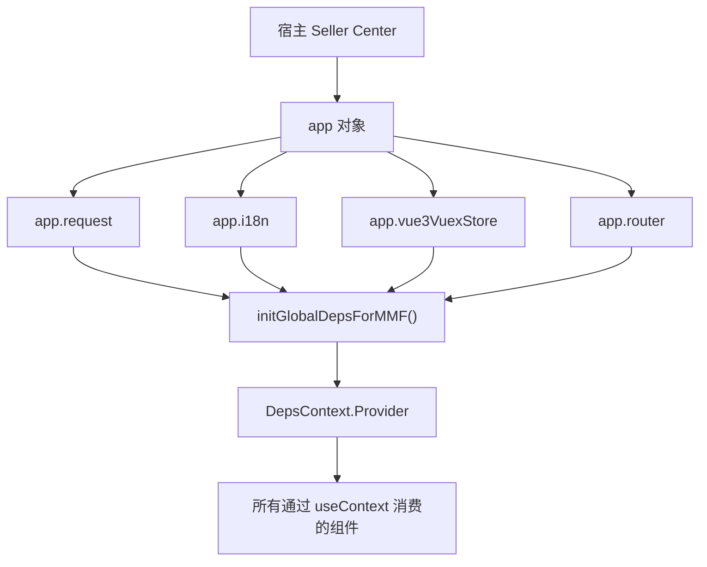

### 10.2 关键设计决策

为什么 `app.vue3VuexStore` 没有通过 `DepsProvider` 注入，而是直接 import？因为 Vuex Store 的访问模式是"一次读取、多处使用"——shop、seller 等信息在 Store 初始化后很少变化。通过 Context 注入会触发不必要的重新渲染（Context 值变化会导致所有消费者重新渲染），而直接读取 `getters` 是惰性的——只在读取时获取当前值，不触发渲染。

这个设计选择反映了 FBS 团队的实际权衡：Context 适合注入相对稳定的服务对象（如 `request`、`$gt`），不适合注入频繁变化的数据对象（如 Store state）。对于后者，直接访问 getter 是更轻量的方案。


## 十一、跨框架开发的测试策略

跨框架组件的测试面临一个核心挑战：组件在一个框架中渲染，但依赖另一个框架提供的对象。以下是 FBS 中常用的测试策略：

1. **单元测试框架无关逻辑**：纯函数（数据转换、校验规则）不需要框架上下文，直接测试输入输出。
2. **集成测试用 mock context**：测试 DepsProvider 包裹的组件时，手动创建一个包含 mock deps 的 Context value。
3. **E2E 测试验证跨框架行为**：通过浏览器自动化工具（Playwright/Cypress）在真实宿主中测试，而不是在单元测试中模拟宿主行为。

对于 SC React 组件的单元测试，标准的 mock 模式：

```typescript
const mockDeps = {
  $gt: (key: string) => key,
  request: { get: jest.fn(), post: jest.fn() },
  router: { push: jest.fn() },
  reporter: { report: jest.fn() },
};

function renderWithDeps(ui: React.ReactElement) {
  return render(
    <DepsContext.Provider value={mockDeps}>
      {ui}
    </DepsContext.Provider>
  );
}
```

这个模式让你的组件测试不依赖真实的宿主环境，运行速度快且可靠。


## 参考文献

- [React Context](https://react.dev/learn/passing-data-deeply-with-context)
- [Vuex 4 Documentation](https://vuex.vuejs.org/)
- [React 18 Upgrade Guide](https://react.dev/blog/2022/03/08/react-18-upgrade-guide)
- [Webpack externals](https://webpack.js.org/configuration/externals/)


---

# 测试、静态检查、构建与产物边界

> 预计学习时间：120–160 分钟
> 一句话总结：能按 FBS 仓库选择正确的 lint、type-check、test 与 build 命令，理解三个仓库的构建配置、产物目录和 Portal/MMF 的消费边界——为一个 diff 输出可复核的开发准出清单。

## 这一章解决什么问题

写代码只是开发的一半。在 FBS 前端仓库中，从写完代码到"可以提交 MR"，中间还有四道工序：lint（代码风格和潜在错误检查）、type-check（TypeScript 类型检查）、test（单元测试和集成测试）、build（构建可部署的产物）。每道工序在不同仓库中的命令、配置、耗时都不同。

更重要的是，三个仓库的构建产物形式完全不同。Portal 构建出一个完整的 SPA bundle，部署后独立运行；SC Vue 和 SC React 构建出 MMF 模块产物，由 Seller Center 宿主加载。理解这些差异，你才能判断一个改动是否应该触发构建验证，以及出问题时应该从哪里排查。

本章不罗列每个仓库的全部配置项——那是文档做的事情。本章帮你建立一套判断流程：根据 diff 范围判断需要跑哪些检查，知道每个仓库的检查命令是什么，理解构建产物的消费者是谁，以及如何为自己的改动整理一份 reviewer 可复核的开发准出清单。

> 本章基于三个前端仓库的 release 分支（2026-07-20）。

## 一、四道检查的职责与触发时机

### 1.1 lint：代码风格和潜在错误

| 仓库 | 命令 | 工具 | 典型耗时 |
| --- | --- | --- | --- |
| Portal | `yarn lint` | ESLint + Stylelint | 1-2 分钟 |
| SC Vue | `yarn lint` | ESLint | 30-60 秒 |
| SC React | `pnpm lint`（如配置） | ESLint | 30-60 秒 |

lint 检查的是代码**怎么写**的问题：缩进、引号风格、未使用变量、禁止的 API 等。ESLint 规则由仓库根目录的 `.eslintrc` 定义——三个仓库的规则略有差异，但核心原则一致。

lint 应该在每次提交前运行。如果 lint 失败，优先按规则建议修改，不要试图绕过规则（`// eslint-disable` 只在极其特殊的情况下使用，且需要注释说明原因）。

### 1.2 type-check：TypeScript 类型检查

| 仓库 | 命令 | 工具 | 典型耗时 |
| --- | --- | --- | --- |
| Portal | `npx tsc --noEmit` | TypeScript 4.4 | 1-3 分钟 |
| SC Vue | `npx tsc --noEmit` | TypeScript 4.7 | 30-60 秒 |
| SC React | `npx tsc --noEmit`（按 project） | TypeScript 4.7 | 30-60 秒 |

type-check 检查的是代码**类型是否正确**：Props 类型是否匹配、函数参数和返回值、null/undefined 处理等。`--noEmit` 只检查不输出编译产物。

type-check 的常见失败模式：

- `Property 'xxx' does not exist on type 'Y'`：对象类型不匹配，检查 API 响应的类型定义。
- `Type 'string | undefined' is not assignable to type 'string'`：可选属性未处理 undefined 情况。
- `Cannot find module 'xxx'`：导入路径错误或依赖未安装。

Portal 的 `tsconfig.json` 中 `"noImplicitAny": false`——这意味着 Portal 不强制要求所有变量都有显式类型。这是历史原因，新代码应尽量提供类型。

### 1.3 test：单元测试和集成测试

| 仓库 | 命令 | 工具 | 配置位置 |
| --- | --- | --- | --- |
| Portal | `yarn test` | Jest 24 | `configs/jest.config.js` |
| SC Vue | 按需配置 | Vitest / Jest | 仓库 scripts |
| SC React | `pnpm test`（按 workspace） | Vitest / Jest | 各 project 配置 |

Portal 的 Jest 配置要点：

```javascript
// configs/jest.config.js（简化）
module.exports = {
  rootDir: '../',
  modulePaths: ['<rootDir>/src/'],
  moduleNameMapper: {
    '^@/(.*)$': '<rootDir>/src/$1',          // 路径别名
    '\\.(css|less|scss)$': 'identity-obj-proxy', // 样式 mock
  },
};
```

`moduleNameMapper` 中的 `'^@/(.*)$'` 让你在测试中也能使用 `@/` 路径别名。`identity-obj-proxy` 让 CSS/Less 导入在测试中返回空对象（不关心样式，只测试逻辑）。

### 1.4 build：构建可部署产物

| 仓库 | 命令 | 构建工具 | 产物位置 | 消费者 |
| --- | --- | --- | --- | --- |
| Portal | `yarn build` | Webpack 5 | `dist/` 目录 | 独立部署 |
| SC Vue | `yarn build` | MMC / Rsbuild | MMC 产物目录 | Seller Center 宿主 |
| SC React | `pnpm build:host` / `pnpm build:remote` | MMC / Rsbuild | MMC 产物目录 | Seller Center 宿主 / Portal |

build 是四道检查中最耗时的一步（2-10 分钟不等），不应该在每次代码修改后都运行。触发 build 的场景：
- 修改了构建配置（`webpack.config.js`、`mmc.config.js`）。
- 新增了路由、依赖或入口文件（可能影响产物结构）。
- 准备提交 MR 前做最终验证。
- 日常开发中通常只需要 lint + type-check。

## 二、按 diff 范围选择检查

### 2.1 最小检查组合

| 改动范围 | 必须运行 | 建议运行 |
| --- | --- | --- |
| 只改了一个组件的样式或文案 | lint | — |
| 改了组件逻辑或新增组件 | lint + type-check | test |
| 改了 API 函数或 Store | lint + type-check + test | — |
| 改了路由配置 | lint + type-check | build（确认产物结构） |
| 改了构建配置或入口文件 | lint + type-check + build | test |

### 2.2 跨仓库改动的检查顺序

如果你的改动涉及多个仓库（如 SC React 远端组件 + Portal 消费），检查顺序：

1. 先在被修改的仓库中完成 lint + type-check + test。
2. 在消费仓库中确认改动的影响（不需要重新构建被修改仓库，只需要在消费仓库中运行自己的 lint + type-check）。
3. 如果涉及远端组件，在 Portal 和 MMF 两种宿主中各验证一次页面行为。

## 三、Portal 构建与产物

### 3.1 Webpack 构建的关键配置

Portal 使用 Webpack 5 + Module Federation。`webpack.config.js` 的核心配置项：

- `entry`：入口文件，通常是 `src/entry.ts`。
- `output`：产物输出目录 `dist/` 和 publicPath。
- `resolve.alias`：`@` → `src/` 路径别名。
- `ModuleFederationPlugin`：远端模块声明。
- `devServer.proxy`：本地开发时的 API 代理。

### 3.2 产物结构

构建后的 `dist/` 目录包含：
- `index.html`：SPA 入口。
- `static/js/`：按路由拆分的 JS chunk（通过 React.lazy 实现）。
- `static/css/`：CSS 文件。
- `remoteEntry.js`：Module Federation 的远端入口（供其他应用消费）。

### 3.3 构建失败的常见原因

| 错误 | 原因 | 解决 |
| --- | --- | --- |
| `Module not found` | 导入路径错误或依赖未安装 | 检查路径，重新 `yarn install` |
| `TypeScript errors` | 类型不匹配 | 先跑 `npx tsc --noEmit` 定位 |
| `Can't resolve 'xxx'` | webpack alias 或 resolve 配置问题 | 检查 `webpack.config.js` 的 resolve 配置 |
| `Memory limit exceeded` | 构建内存不足 | 增加 Node 内存限制 `NODE_OPTIONS=--max-old-space-size=4096` |

## 四、MMC 构建与 MMF 产物

### 4.1 MMC 构建的工作流程

两个 SC 仓库使用 MMC 作为构建工具。MMC 内部包装了 Webpack 或 Rsbuild，提供一系列与 Seller Center 模块相关的专有能力：

1. 读取 `mmc.config.js` 获取模块 ID、类型和技术栈。
2. 从 Seller Portal 平台拉取模块的远程配置（`yarn run getModule`）。
3. 从 Transify 平台拉取翻译文件（`yarn run i18n:pull`）。
4. 根据 `tech` 字段（`vue3` / `react18`）选择合适的构建器配置。
5. 生成包含模块元信息的构建产物。

### 4.2 MMF 产物的消费者

MMF 构建产物有两个消费者：

- **Seller Center 宿主**：在用户访问对应路径时，宿主从 CDN 加载模块的 JS/CSS，注入路由、Store 等宿主能力后渲染。
- **Module Federation（仅远端组件）**：SC React 的远端组件产物同时被 Portal 通过 Module Federation 消费。

### 4.3 本地开发 vs 生产构建

本地开发时，MMC 启动 dev server，产物在内存中（不输出到磁盘）。生产构建时，产物输出到 `dist/` 或 MMC 配置的 output 目录。两者的关键区别：

- 本地 dev server 的产物未压缩、包含 source map，方便调试。
- 生产构建的产物经过压缩、tree-shaking、code splitting 优化。
- MMF Dev Tools 在本地开发时注入的是 dev server 的产物。

## 五、开发准出清单

每次准备提交 MR 时，整理以下核查项并附上证据：

### 5.1 代码质量核查

```markdown
- [ ] lint 通过：`yarn lint`（或对应命令）无新增错误
- [ ] type-check 通过：`npx tsc --noEmit` 无新增类型错误
- [ ] 无硬编码文案：所有用户可见文字使用 `$t()` 包裹
- [ ] 无 PII 泄露：敏感数据不出现在日志、URL 或 Store 持久化中
- [ ] 无 console.log 残留：生产代码中的调试日志已清理
```

### 5.2 功能验证核查

```markdown
- [ ] 正常路径：至少一种输入下功能正常
- [ ] 空态：无数据时页面不白屏、不报错
- [ ] 加载态：数据加载中有 loading 指示
- [ ] 错误态：API 失败时有错误提示（如果由 wrapper 统一处理则标注）
- [ ] 权限控制：无权限用户不能看到受限功能和数据
- [ ] i18n：至少中英文下文案正确（如果你有权限切换语言）
```

### 5.3 跨仓影响核查

```markdown
- [ ] 本仓影响：列出所有修改的文件和原因
- [ ] 跨仓影响：判断是否影响 Portal / SC Vue / SC React 的另一仓
- [ ] 远端组件影响：如果修改了远端组件，确认 Portal 和 MMF 两个消费者的兼容性
- [ ] API 契约变化：如果请求参数或响应字段有变化，与后端对齐
```

### 5.4 构建验证核查

```markdown
- [ ] 本地 dev server 正常启动：能访问对应页面
- [ ] build 通过（如适用）：`yarn build` 或对应命令无错误
- [ ] 产物结构正常：关键 chunk 文件存在
```

## 六、常见错误

### 6.1 忽略 lint 直接提交

lint 错误不阻断构建，所以很容易被忽略。但 lint 规则通常对应着团队约定的编码规范——绕过 lint 等于绕过 Code Review 的第一道防线。

### 6.2 type-check 只跑了 IDE 的实时检查

IDE 的 TypeScript 检查可能只检查当前打开的文件。`npx tsc --noEmit` 检查整个项目，可能发现 IDE 中未显示的跨文件类型问题。

### 6.3 build 只在本地跑，没验证产物正确性

构建成功后，浏览器的 `yarn start` / `yarn dev` 可能正常运行，但这不代表生产构建产物也正常。如果改了构建配置，至少验证一次生产构建的产物。

### 6.4 跳过测试因为"没写新增测试"

如果改动的代码已有测试，修改后应确保已有测试仍通过。如果没有已有测试，至少手动验证改动功能。

## 七、练习

### 7.1 检查选择

以下改动分别需要运行哪些检查？（只需回答 lint / type-check / test / build 四个选项的组合）

a) 修改了一个 Vue 组件的 `v-if` 条件
b) 在 Portal 的 `webpack.config.js` 中新增了一个 alias
c) 修改了 SC React 远端组件的 Props 接口
d) 新增了一个 API 函数并在页面中调用了它

### 7.2 准出清单填写

选择一个你最近在 FBS 前端仓库中做过的改动（或假设一个），填写完整的开发准出清单。

### 7.3 构建排查

SC Vue 的 `yarn build` 失败，错误信息为 `Module not found: Error: Can't resolve '@/components/InboundRow'`。列出三个排查步骤。

### 7.4 参考答案

**7.1**：a) lint + type-check（v-if 的条件涉及类型判断）。b) lint + type-check + build（修改构建配置必须验证产物）。c) lint + type-check + test（Props 接口变化可能影响消费者）。d) lint + type-check + test。

**7.3**：1) 确认 `@/components/InboundRow` 文件是否存在——路径拼写是否正确、文件扩展名是否正确。2) 检查 `tsconfig.json` 或 webpack alias 中 `@` 的映射是否正确指向 `src/`。3) 确认 `InboundRow` 的导出方式（`export default` vs `export const`）与导入方式匹配。


## 八、Jest 单元测试实战

### 8.1 Portal 的测试目录结构

Portal 的测试文件分布有两种模式：

- `__test__/` 目录：与源码同级或模块级，存放该模块的测试文件。
- `.test.ts` / `.spec.ts` 文件：与被测文件同级，命名约定明确。

查找已有测试的方法：

```bash
# 找 Portal 中与 inbound 相关的测试
find src/ -path "*inbound*" -name "*.test.*" -o -path "*inbound*" -path "*__test__*"
```

### 8.2 一个典型的 Portal 单元测试

以权限检查函数为例：

```javascript
// __test__/permission.test.js
import { hasPermission } from '@/business/utils/permission';
import { store } from '@/store';

jest.mock('@/store', () => ({
  store: {
    getState: jest.fn(),
  },
}));

describe('hasPermission', () => {
  it('returns true when user has the permission', () => {
    store.getState.mockReturnValue({
      context: { currentUser: { permission_code_list: ['VIEW_INBOUND'] } },
    });
    expect(hasPermission('VIEW_INBOUND')).toBe(true);
  });

  it('returns false when user does not have the permission', () => {
    store.getState.mockReturnValue({
      context: { currentUser: { permission_code_list: [] } },
    });
    expect(hasPermission('VIEW_INBOUND')).toBe(false);
  });

  it('handles array input', () => {
    store.getState.mockReturnValue({
      context: { currentUser: { permission_code_list: ['VIEW_INBOUND', 'EDIT_INBOUND'] } },
    });
    expect(hasPermission(['VIEW_INBOUND', 'ADMIN'])).toBe(true);
  });
});
```

关键测试模式：

- **mock 外部依赖**：`jest.mock('@/store')` 替换真实的 Redux Store。
- **控制测试数据**：`store.getState.mockReturnValue(...)` 设置 Store 的返回值。
- **多场景覆盖**：正常有权限、无权限、数组输入等。

### 8.3 测试 React 组件的模式

测试 React 组件通常需要渲染库（如 `@testing-library/react`）：

```javascript
import { render, screen, fireEvent } from '@testing-library/react';
import { Provider } from 'react-redux';
import FilterBar from './FilterBar';

const renderWithStore = (component, initialState) => {
  const store = createStore(rootReducer, initialState);
  return render(<Provider store={store}>{component}</Provider>);
};

it('calls onSearch when search button is clicked', () => {
  const onSearch = jest.fn();
  renderWithStore(<FilterBar onSearch={onSearch} />);
  fireEvent.click(screen.getByText('搜索'));
  expect(onSearch).toHaveBeenCalled();
});
```

### 8.4 测试命令的效率技巧

```bash
# 只运行改动的测试文件
yarn test:onlyChanged

# 只运行特定文件的测试
yarn test -- path/to/component.test.js

# 监听模式——文件改动后自动运行
yarn test:watch

# 运行测试并生成覆盖率报告
yarn test --coverage
```

## 九、构建产物的消费边界详解

### 9.1 Portal 产物的独立部署路径

Portal 是独立 SPA，它的产物部署到 CDN 后，用户直接通过 URL 访问。构建产物中的 `index.html` 通过 `<script>` 标签加载 JS bundle。Portal 不需要任何宿主环境——这是它和两个 SC 仓库最根本的产物差异。

Portal 构建后需要验证的关键点：
- `index.html` 中的 `<script>` 标签路径是否正确（publicPath 配置）。
- 懒加载的 chunk 文件是否正确分拆（Network 面板中按路由导航时是否加载了额外的 JS）。
- Module Federation 的 `remoteEntry.js` 是否正确生成（如果 Portal 提供了远端入口）。

### 9.2 MMF 产物的宿主加载流程

SC 仓库的构建产物包含模块元信息（模块 ID、版本、路由映射等），由 MMC 打包为特定格式。宿主加载流程：

1. Seller Center 宿主从配置中心获取模块列表和版本信息。
2. 用户访问某路径时，宿主匹配到负责该路径的模块。
3. 宿主从 CDN 加载模块的 JS 和 CSS。
4. 执行模块的注册代码（Store、Router）。
5. 宿主触发路由守卫，初始化模块状态。
6. 渲染对应页面组件。

### 9.3 构建产物的缓存策略

前端资源的缓存策略对用户体验影响很大。FBS 构建产物通常使用以下缓存策略：

- **HTML 文件**：不缓存或短期缓存（因为 HTML 中引用的 JS/CSS 文件名带有 content hash，更新时文件名会变）。
- **JS/CSS 文件**：长期缓存（文件名中的 content hash 确保内容变化时文件名变化）。
- **MMC module metadata**：短期缓存或按版本号缓存。

如果在本地测试时发现"改了代码但浏览器显示旧版本"，首先尝试硬刷新（Cmd+Shift+R），如果仍无效，检查 dev server 是否正确触发了 HMR 或重新编译。

## 十、CI/CD 中的质量闸门

### 10.1 典型的 CI 流程

FBS 前端仓库在 MR 合并前通常会经过以下 CI 检查：

1. **依赖安装**：`yarn install` / `pnpm install`
2. **lint**：ESLint 检查
3. **type-check**：TypeScript 编译检查
4. **test**：单元测试
5. **build**：构建验证（确认产物可生成）

任何一步失败都会阻止 MR 合并。这就是为什么"本地 lint 通过了但 CI 上失败了"需要重视——CI 环境和本地环境可能有差异（Node 版本、缓存状态等）。

### 10.2 本地环境与 CI 环境的差异排查

常见差异和解决方案：

| 差异 | 现象 | 解决 |
| --- | --- | --- |
| Node 版本不同 | CI 上某些包安装失败 | 用 nvm 切换到 CI 使用的 Node 版本重试 |
| 缓存差异 | 本地 OK 但 CI 报错 | `rm -rf node_modules && yarn install` 清理重装 |
| 操作系统差异 | 路径分隔符或换行符问题 | 使用 `path.join()` 而非字符串拼接；统一 LF 换行 |
| 环境变量 | 本地有 `.env.local` 但 CI 没有 | 确认 CI 配置中环境变量是否设置 |

## 十一、为不同仓库选择合适的开发工具链

### 11.1 推荐的 IDE 和插件

| 需求 | 推荐工具 |
| --- | --- |
| Vue 3 开发 | VS Code + Volar（Vue 官方插件）+ TypeScript |
| React 开发 | VS Code + ESLint + Prettier |
| 跨仓库工作 | VS Code workspace 配置多个仓库路径 |
| 调试 Node 脚本 | VS Code 内置 debugger + `--inspect-brk` |

### 11.2 提高开发效率的命令别名

```bash
# 在 ~/.zshrc 中设置别名
alias fbsp="cd ~/Work/FBS/fbs-frontend && yarn start"
alias fbscv="cd ~/Work/FBS/fbs-sc-vue && yarn dev"
alias fbscr="cd ~/Work/FBS/fbs-sc-react && pnpm dev:host"

# 快速 lint
alias fblint="cd ~/Work/FBS/fbs-frontend && yarn lint"
```

这些别名不是必需品，但它们能减少你在三个仓库之间切换时的重复输入，让你更快进入开发状态。


## 参考文献

- [Webpack Concepts](https://webpack.js.org/concepts/)
- [Jest Documentation](https://jestjs.io/docs/getting-started)
- [TypeScript 4.7 Release Notes](https://www.typescriptlang.org/docs/handbook/release-notes/typescript-4-7.html)
- [Rspack Introduction](https://rspack.rs/guide/start/introduction)
- [Rsbuild Guide](https://rsbuild.rs/guide/start/)


---

# 前端观测与系统化排错

> 预计学习时间：130–170 分钟
> 一句话总结：能用浏览器 DevTools、Network 面板、Console、Source Map、API SLA 监控埋点与构建日志分层定位白屏、路由 404、权限拒绝、请求失败和 MMF 宿主注入异常五类高频问题——完成两份故障诊断记录，其中一份来自 MMF 宿主边界。

## 这一章解决什么问题

模块一到模块三的前七章，你学会了怎么在 FBS 前端仓库中写正确的代码。但现实是：代码不会一次写对。白屏、接口报错、路由不匹配、权限被拒——这些不是你学得不够好，它们是前端开发的日常。

区别在于你怎么应对。没有章法的人会逐行改代码、反复刷新浏览器、猜原因。有章法的人会先保存现象证据，然后分层假设、逐个验证、最小修复、回归验证。本章教你后一种方法。

FBS 前端的错误来源跨越四层：宿主层（MMF 注入失败）、构建层（source map 不匹配）、网络层（代理配置错误、超时、HTTP 错误码）和应用层（组件状态异常、路由守卫逻辑）。每层的排查方式不同——你不能用看 Console 的方法排查宿主注入问题，也不能用看 Network 面板的方法排查构建错误。本章为每一层建立一套标准的排查流程，然后通过两个真实场景（MMF 模块白屏和 API 监控异常）带你实操整个诊断过程。

> 本章基于三个前端仓库的 release 分支（2026-07-20）。

## 一、错误分层与排查策略

### 1.1 FBS 前端的四层错误模型

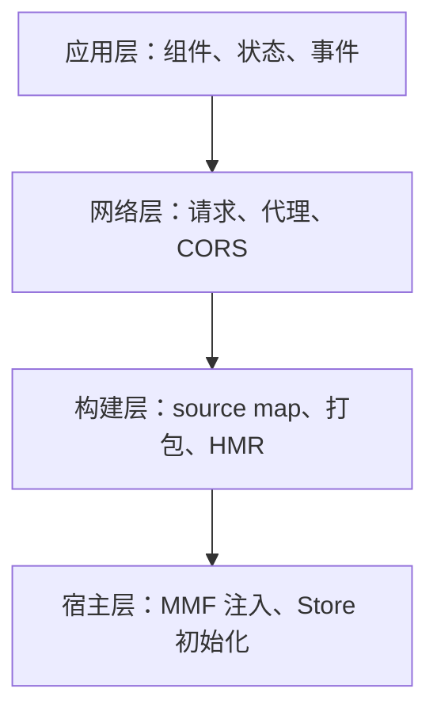

| 层 | 典型症状 | 首选工具 | 排查难度 |
| --- | --- | --- | --- |
| **宿主层** | 模块入口不可见、全局对象 undefined | MMF Dev Tools + Console | 高（需理解宿主架构） |
| **构建层** | HMR 不生效、生产环境白屏但本地正常 | Terminal + Network | 中 |
| **网络层** | 请求 401/403/404/500、CORS 错误 | Network 面板 | 低 |
| **应用层** | 组件报错、状态异常、渲染空白 | Console + React/Vue DevTools | 低 |

排查原则：**从外到内**——先排除宿主层，再排构建层，再排网络层，最后排应用层。如果宿主层的问题（如 MMF 未注入）都没解决，排查应用层代码是浪费时间。

### 1.2 保存现象证据

在开始排查之前，先收集以下信息——不要凭记忆描述问题：

1. **截图**：页面的当前状态（白屏？部分渲染？错误提示？）。
2. **Console 完整输出**：不仅是红色的 Error，还包括黄色的 Warning。
3. **Network 面板**：筛选失败请求（红色或 4xx/5xx），展开查看 Request Headers 和 Response。
4. **当前环境**：Node 版本、哪个仓库、哪个分支、是否通过 MMF Dev Tools 注入。

## 二、分层排查方法

### 2.1 宿主层：MMF 注入失败的排查

MMF 模块不渲染的最常见原因按概率排序：

**1. MMF Dev Tools 未配置或未启用**

症状：`localhost:4200` 正常启动，但 Seller Center 页面中 FBS 模块不出现。检查 Chrome 扩展图标是否亮起，点击图标查看填写的模块 key 和本地端口是否正确。模块 key 应与 `mmc.config.js` 中的 `id` 字段一致。

**2. 模块 index.ts 执行时报错**

症状：Console 中可能看到模块 JS 文件加载失败或执行错误。打开 Network 面板，搜索对应仓库的 JS 文件（通常以模块名命名的 chunk），确认 HTTP 状态为 200。如果不是 200，检查 dev server 是否正常监听在预期端口。

**3. INIT_FBS_STORE 失败**

症状：FBS 模块可见但内容区域空白。打开 Vue DevTools，查看 `FBS_STORE` 的 state 是否包含数据。如果 state 为空对象或全为 null，说明 API 请求失败。在 Network 面板中查找 INIT_FBS_STORE 触发的 API 请求，检查请求 URL（是否指向正确的测试环境）和响应状态码。

### 2.2 构建层：白屏与 Source Map 问题

**场景一：本地 dev server 正常，生产构建后白屏**

排查步骤：
1. `yarn build` 或 `pnpm build:host` 是否成功。
2. 打开生成的 `index.html` 或 MMF 产物，检查 `<script>` 标签的 `src` 路径是否正确。
3. 如果使用了 Module Federation，检查 `remoteEntry.js` 是否生成且可访问。
4. 检查 `publicPath` 或 `base` 配置——如果构建产物部署在子路径下而 publicPath 配置为 `/`，JS 和 CSS 文件将 404。

**场景二：HMR 不生效**

排查步骤：
1. 确认 dev server 的终端输出中是否有"compiled successfully"或类似信息。
2. 确认浏览器的 Network 面板中是否有 WebSocket 连接（HMR 依赖 WebSocket 推送更新）。
3. 如果修改了路由配置或 webpack/MMC 配置，HMR 可能不会自动生效——需要手动刷新浏览器或重启 dev server。

### 2.3 网络层：代理、超时与 HTTP 错误

**401/403：鉴权问题**

排查步骤：
1. 检查浏览器是否已登录 Seller Center（SC 仓库）或 Portal（Portal 仓库）的测试环境。
2. 如果是本地 dev server 代理了 API 请求，确认代理配置正确——Webpack devServer.proxy 或 MMC 代理设置。
3. 如果是 PII 请求，确认是否使用了 `piiRequest` 而非普通的 `request`，以及 baseURL 是否正确指向 `/api/fbs/pii/sc`。

**404：接口不存在**

排查步骤：
1. 确认 API 函数中的 `url` 拼写正确（注意尾部斜杠 `/` 的有无）。
2. 确认 request wrapper 的 `baseURL` 拼出的完整路径与后端路由一致。
3. 如果是代理配置问题，在 Network 面板中查看请求的完整 URL——是否被代理正确转发到了后端。

**CORS 错误**

排查步骤：
1. 确认 Access-Control-Allow-Origin 响应头是否包含当前前端域名。
2. 本地开发时，确认 dev server 的代理配置正确（所有 API 请求应通过代理转发，避免跨域）。
3. 如果是直连后端（未走代理），需要后端配置 CORS 允许本地域名。

**超时**

排查步骤：
1. 确认后端服务是否正常运行（ping 或 curl 测试环境的健康检查接口）。
2. 确认请求的 timeout 设置是否合理——FBS 的默认超时通常较长（10-30 秒），如果请求的数据量大或后端处理慢，可能超时。
3. 如果频繁超时，考虑在前端增加加载超时提示和重试按钮。

### 2.4 应用层：组件状态与路由异常

**组件报错：Cannot read properties of undefined**

这是最常见的应用层错误。排查步骤：
1. 根据错误堆栈定位报错的文件和行。
2. 确认那个位置访问的对象是否可能为 `null` 或 `undefined`。
3. 检查对象的数据来源——是从 API 响应解析的？从 Store 读取的？从 Props 传入的？
4. 如果数据可能为空，增加 `?.` 或 `??` 防御。

**路由守卫异常：重定向循环**

症状：浏览器地址栏不断变化，页面不断重新加载。

排查步骤：
1. 检查 `beforeEnter` 或路由守卫的跳转逻辑。
2. 确认跳转的目标路由是否会再次触发同一个守卫——形成 `A → B → A` 的死循环。
3. 通常的解决方案是在守卫中检查当前路由是否已经是目标路由，如果是则不跳转。

## 三、真实排错案例一：MMF 模块白屏

### 3.1 现象收集

用户报告："SC FBS 模块点了没反应，页面是白的，什么都没有。"

我们收集到的证据：
- 浏览器地址栏 URL 正常（`/portal/fbs/home`）。
- Console 有一条错误：`TypeError: Cannot read properties of undefined (reading 'fbsTag')`。
- Network 面板显示 FBS 模块的 JS 文件正常加载（200）。
- 展开错误堆栈，定位到 `src/router/index.ts` 的 `beforeEnter` 函数。

### 3.2 假设建立与验证

**假设 1**：`INIT_FBS_STORE` 的 API 请求失败，返回的数据中缺少 `shopInfo`。

验证：在 Network 面板中搜索 INIT_FBS_STORE 触发的 API 请求。发现该请求返回了数据，但 `shopInfo` 字段为 `null`。

**假设 2**：后端接口异常。

验证：用 curl 或 Postman 直接调用同一个 API，确认数据确实缺少 `shopInfo`——原来是测试环境的该卖家账号未完成入驻，后端返回的 `shopInfo` 为 null。

### 3.3 修复与回归

修复方案：在 `beforeEnter` 中增加 `shopInfo` 为空时的降级处理：

```typescript
const data = await app.vue3VuexStore.dispatch('FBS_STORE/INIT_FBS_STORE');
if (!data?.shopInfo) {
  // 降级：跳转到入驻页或引导页
  return { path: '/portal/fbs/onboarding' };
}
```

回归验证：模拟一个未入驻的卖家账号访问 FBS 模块——确认跳转到入驻页而非白屏。

## 四、真实排错案例二：API 监控异常

### 4.1 现象

SC Vue 仓库的 API 监控面板显示某个接口的失败率突然升高。但业务方没有收到用户投诉。

排查发现：该接口的"失败"是指 API SLA 上报的失败次数增加，不是用户看到的错误提示增加了。深入排查后发现，某个 retcode 被错误地归类为"失败"——它在业务上是正常状态（表示"数据为空"），但监控配置把它当成了错误码。

### 4.2 排查过程

1. 在 SC Vue 的 `src/report/api.ts` 中找到 SLA 监控的注册逻辑。
2. 找到 `registerQMSAPIWatcher` 函数，检查它的 retcode 分类规则。
3. 确认 `customCode` 数组中是否缺少这个"正常但非零"的 retcode。
4. 补充该 retcode 到 `customCode` 数组——监控恢复正常。

这个案例的关键教训：前端监控信号不等于用户可见的错误。在根据监控报警修改代码之前，要先确认监控的分类规则是否正确。

## 五、排错工具箱

### 5.1 每个仓库的排错入口

| 仓库 | 排错文档位置 | 常见问题的快速索引 |
| --- | --- | --- |
| Portal | `.agents/skills/fullstack/SKILL.md` | 启动失败、代理不通、i18n 缺失 |
| SC Vue | `.agents/skills/fullstack/SKILL.md` | MMC 安装、模块注册、MMF Dev Tools |
| SC React | `TROUBLESHOOTING.md` | pnpm workspace、远端组件、依赖安装 |

### 5.2 浏览器 DevTools 的高效用法

- **Console 过滤器**：在 Console 中使用 `Ctrl+F` 搜索特定错误关键词（如 `TypeError`、`401`、`net::ERR`）。
- **Network 过滤器**：输入 `method:POST` 只看 POST 请求；输入 `-status-code:200` 只看非 200 的请求。
- **Conditional Breakpoint**：在 Sources 面板中对怀疑的代码行右键 → 添加条件断点，输入 `data === undefined`——只在数据为空时才中断。
- **Performance 面板**：如果怀疑性能问题（如页面加载慢），录制一段 Performance trace，查看是哪个阶段耗时最长（网络请求？脚本解析？渲染？）。

### 5.3 排错记录模板

每次排错后，用以下模板记录以便团队积累知识：

```markdown
### 问题：[一句话描述]
- 现象：[截图 + 错误信息]
- 环境：[仓库 / Node 版本 / 分支 / 是否 MMF Dev Tools]
- 排查过程：
  1. [假设 A] → [验证方法] → [结果]
  2. [假设 B] → [验证方法] → [结果]
- 根因：[用一句话解释为什么会出现这个问题]
- 修复：[具体的代码或配置改动]
- 预防：[以后如何避免或更快地发现]
```

## 六、常见错误

### 6.1 同时改多个变量

排错时每次只改一处——如果同时改了组件代码、路由配置和 API 调用，修好了也不知道是哪步修好的，修坏了也不知道是哪步搞坏的。

### 6.2 忽略 Warning

Console 中的黄色 Warning 往往是问题的前兆。`[Vue warn]`、`Warning: Each child in a list should have a unique key` 这类 warning 现在不致命，但可能在特定条件下升级为 error。

### 6.3 用猜测代替证据

"我觉得可能是 API 的问题"——这不是排查。排查是：打开 Network 面板，找到那次请求，确认它发到了哪个 URL、返回了什么状态码、响应体是什么。用证据说话。

## 七、练习

### 7.1 分层诊断

以下错误应该从哪一层开始排查？

a) 页面可以访问但某个列表数据为空。
b) `localhost:4200` 启动正常但 SC 页面不显示 FBS 模块。
c) `yarn dev` 报 `Error: listen EADDRINUSE :::4200`。
d) 组件报 `Cannot read properties of null (reading 'filter')`。

### 7.2 完整排错记录

从你自己的开发经历中找一个曾经遇到的前端问题，按照本章的排错记录模板写一份完整的诊断报告。

### 7.3 参考答案

**7.1**：a) 网络层（API 请求）→ 应用层（组件数据绑定）。b) 宿主层（MMF Dev Tools 配置）。c) 构建层（端口占用）。d) 应用层（组件空值处理）。


## 八、API SLA 监控与前端可观测性

### 8.1 FBS 的监控体系

SC Vue 通过 `src/report/api.ts` 中的 `registerQMSAPIWatcher` 和 `registerQMSSLAAPIWatcher` 为每个请求实例注册监控。这个监控不是"出了问题才看"的日志——它持续采集三个维度的数据：

**1. API 成功率**：哪些接口的失败率上升了？监控中的 retcode 分类规则决定了一个接口调用算"成功"还是"失败"。`transifyCode` 和 `customCode` 两个数组定义了哪些非零 retcode 属于正常业务状态。

**2. 请求耗时**：哪些接口变慢了？SLA（Service Level Agreement）监控对比实际耗时与预设阈值，超时的接口会被标记。

**3. 请求量**：哪些接口的调用量异常（突然激增或骤降）？

### 8.2 retcode 分类机制

```javascript
// src/report/api.ts（简化）
const transifyCode = Object.keys(RetcodeKeyMap).map(Number); // 有翻译的 retcode
const customCode = [9004, 9005, 9103, ...];                  // 没有翻译但属于正常业务的 retcode
const filterCode = [19999, 10001, ...];                      // 应忽略的 retcode（非业务错误）
const codes = [...transifyCode, ...customCode].filter(code => !filterCode.includes(code));
```

这段代码的含义：

- `transifyCode` 中的 retcode 是已对接翻译的——前端会展示翻译后的错误文案。
- `customCode` 中的 retcode 是没有翻译的——但仍属于"业务正常返回"（如表示"没有更多数据"的状态码）。
- `filterCode` 中的 retcode 应该被忽略——它们不是业务错误，可能只是框架层面的状态码。

如果前端新增了一个业务状态码但忘记加入 `customCode` 数组，它会被监控归类为"失败"——这就是案例二中的问题。

### 8.3 如何查看监控数据

FBS 前端通常对接公司内部的 Cat 监控平台或 Grafana 面板。具体访问方式以团队内部文档为准。作为前端开发者，你不需要搭建监控平台——但你需要会用它：

1. 当有人报"接口有问题"时，先去监控平台确认是"真的接口成功率下降"还是"监控分类配置错误"。
2. 当有新接口上线时，确认它的 retcode 是否被正确分类。
3. 定期查看 API 请求耗时的 P95/P99——如果某个接口突然变慢，可能是后端性能退化或数据库查询变慢。

## 九、构建错误排查

### 9.1 Webpack 构建失败

Webpack 构建失败的可能原因非常多，但按优先级排查最常见的三类：

1. **模块解析失败**：`Can't resolve 'xxx'`。路径拼写错误、忘记安装依赖、alias 配置不对。
2. **Loader 配置问题**：`You may need an appropriate loader`。这个文件类型没有配置对应的 webpack loader——通常是新增了非标准文件类型（如 `.graphql`、`.wasm` 等）。
3. **TypeScript 错误**：如果 webpack 配置了 `fork-ts-checker-webpack-plugin`，TypeScript 错误也会导致构建失败。先跑 `npx tsc --noEmit` 定位错误。

### 9.2 MMC 构建失败

MMC 构建失败通常与以下因素相关：

1. **模块配置缺失**：`mmc: command not found`——MMC 未安装或未在 PATH 中。
2. **远程配置拉取失败**：`yarn run getModule` 失败。检查内网连接和 Seller Portal 平台的模块配置。
3. **i18n 拉取失败**：`yarn run i18n:pull` 失败。检查 Transify 平台的权限和网络连接。
4. **依赖版本冲突**：pnpm workspace 的依赖版本不一致。尝试 `pnpm install --force`。

### 9.3 构建产物问题

**场景：构建成功但部署后 404**

- 检查 `publicPath` 或 `base` 配置——如果应用部署在子路径下（如 `/fbs/`），而构建时的 publicPath 是 `/`，JS 文件会请求 `/static/js/xxx.js` 而非 `/fbs/static/js/xxx.js`。
- 检查 Nginx 或 CDN 配置——静态文件的路径规则是否正确。

**场景：懒加载的页面 404**

- 检查 `React.lazy(() => import('./path'))` 中的路径是否正确。
- 检查 webpack 的 `output.chunkFilename` 配置——懒加载的 chunk 文件命名规则是否导致文件找不到。

## 十、跨仓库问题的系统化排错

### 10.1 Portal 消费远端组件失败

如果 Portal 中远端组件不渲染，排查顺序：

1. SC React 中远端组件的构建产物是否正确生成。
2. SC React 远端组件的 dev server 是否启动且监听预期端口。
3. Portal 的 Module Federation 配置中 remotes 是否指向正确的地址（本地 dev server vs CDN）。
4. Portal 的浏览器 Console 中是否有模块加载错误。
5. Portal 的 Network 面板中远端组件的 JS 文件是否正常加载（200）。

### 10.2 三仓联动问题的排查模板

当一个问题涉及多个仓库时，先在每个仓库单独验证，再串起来验证：

1. **后端**：接口是否正常（curl 或 Postman 确认）。
2. **SC Vue/React（MMF 模块）**：Network 面板确认模块是否收到正确的接口响应。
3. **Portal**：如果消费者是 Portal，确认 Module Federation 加载的远端组件版本是否匹配。
4. **宿主**：如果 MMF 模块在宿主中表现异常但本地 dev server 正常，问题在宿主配置或 MMF Dev Tools。

## 十一、缓存导致的排查陷阱

### 11.1 浏览器缓存

改了代码但浏览器显示旧版本——最常见的排查失误之一。解决：

- 打开 DevTools → Network 面板 → 勾选"Disable cache"。
- 硬刷新：Cmd+Shift+R（Mac）或 Ctrl+Shift+R（Windows）。
- 如果仍然不行，清除浏览器缓存或使用无痕模式。

### 11.2 Service Worker 缓存

如果 FBS 使用了 Service Worker，SW 可能会缓存旧版本的 HTML 和 JS。排查：

- 在 Application 面板 → Service Workers → 点击"Unregister"注销 SW。
- 然后在 Cache Storage 中清除所有缓存。
- 刷新页面。

### 11.3 CDN 缓存

生产环境的前端产物通常部署在 CDN 上。如果 CDN 缓存了旧版本，本地清除缓存没用——需要等 CDN 刷新或手动触发 CDN 的缓存更新。FBS 的构建产物文件名包含 content hash，理论上内容变化时文件名会变化，CDN 应该返回新文件。如果旧文件名仍被访问，检查 HTML 文件是否被 CDN 缓存。

## 十二、排错习惯的养成

### 12.1 先保存证据，再改代码

改代码之前，先把当前的错误信息、页面截图、Network 的请求列表保存下来。改了代码才发现忘了原来的错误是什么——这种情况非常常见。

### 12.2 每次只改变一个变量

不管多着急，一次只改一处。改了组件 → 刷新 → 看结果。不行就改回去，再改另一处。不要同时改三处然后不知道是哪处修好的。

### 12.3 记下排错过程

排完一次耗时超过 15 分钟的问题后，花 2 分钟记录：现象、假设、验证过程、根因、修复。下次遇到类似问题时，先查笔记而不是从头排。

### 12.4 遇到无法解释的现象时

如果所有合理假设都被排除，考虑以下可能：

- 浏览器扩展干扰（用无痕模式测试）。
- Node 版本不匹配（`node -v` 确认）。
- 缓存（硬刷新 + 清除 Service Worker）。
- 环境变量（`.env.local` 可能覆盖了预期配置）。
- 多个 dev server 实例残留（`ps aux | grep node` 检查）。


## 十三、从监控信号到代码定位

当收到监控告警（如某接口失败率突增）时，标准的响应流程：

1. 确认告警是否真实——先去监控面板看实际数据趋势，排除误报。
2. 确定影响范围——是所有用户在影响还是特定地区/特定 seller？
3. 找最近的变更——是前端改了请求参数格式还是后端改了接口逻辑？
4. 用最小复现验证——尽量在不影响线上用户的情况下复现问题。
5. 修复后验证监控数据恢复——确认修复生效，不只是"代码改了"。

对于前端开发者来说，第 3 步是关键。如果你确认前端最近没有上线改动但监控告警了，大概率是后端接口行为变化——带着"没有改前端"这个证据去找后端同事，比"感觉是后端的问题"有效得多。

## 参考文献

- [MDN Browser Developer Tools](https://developer.mozilla.org/en-US/docs/Learn/Common_questions/Tools_and_setup/What_are_browser_developer_tools)
- [Chrome DevTools Network](https://developer.chrome.com/docs/devtools/network)
- [Chrome DevTools Console](https://developer.chrome.com/docs/devtools/console)
- [React Developer Tools](https://react.dev/learn/react-developer-tools)


---

# 前端改动影响分析与开发交接

> 预计学习时间：120–160 分钟
> 一句话总结：能从 FBS 前端需求和 diff 判断影响的仓库、路由、组件、权限、翻译和构建配置——整理一份 reviewer 可复核的跨仓影响摘要、测试结果和开发交接清单。

## 这一章解决什么问题

模块二的最后一章（FE-W07）教你完成了一个完整的前端切片。但那是单仓库改动——你只需要考虑 SC Vue 一个仓库中的文件。真实的 FBS 前端需求很少只涉及一个仓库。改了一个 API 类型定义，Portal 和 SC React 都可能受影响；增了一个远端组件的 Props，两个宿主都要验证。

本章教你从需求出发，系统化地评估改动的影响范围。你会学会建立仓库地图、判断影响面、加载仓库规则、分析实际 diff、选择准出检查，最后整理一份 reviewer 可以直接复核的开发交接材料。这套流程不只适用于大型改动——每个 MR 都可以用它来确保在提交之前已经想清楚了影响面。

> 本章基于三个前端仓库的 release 分支（2026-07-20）。

## 一、影响分析的思维框架

### 1.1 从需求出发的五问

接到一个 FBS 前端需求时，先问自己五个问题：

| 问题 | 目的 | 去哪里找答案 |
| --- | --- | --- |
| 这个功能在哪个页面上？ | 确定涉及哪个仓库 | 需求文档 + 浏览器 URL 反查路由 |
| 涉及哪些前端能力？ | 确定影响的代码模块 | 需求拆解 + 仓库代码搜索 |
| 影响哪些消费者？ | 确定跨仓影响 | 搜索组件的 import/require 引用 |
| 需要什么前置依赖？ | 确定阻塞项 | 后端接口、权限码、翻译 key |
| 怎么验证改对了？ | 建立验收标准 | 用例定义 + 自动化检查 |

### 1.2 影响分析的三个层次

| 层次 | 范围 | 典型改动 |
| --- | --- | --- |
| **本文件** | 修改的单个文件 | 组件内部状态调整、样式修改 |
| **本仓** | 修改文件所在仓库的其他文件 | 组件 Props 变化影响的消费者、路由变化影响的导航 |
| **跨仓** | 其他前端仓库 | API 类型共享、远端组件 Props、翻译 key 共享 |

大多数改动只到"本仓"层。当改动涉及以下几类时，才需要做跨仓影响分析：

- 修改了 `src/api/*.js` 中的接口类型定义（Portal 和 SC 仓库可能共享接口定义或接口契约）。
- 修改了 SC React 远端组件的 Props（影响 Portal 的消费代码）。
- 新增或修改了共享常量（如权限码、枚举值）。
- 修改了 i18n key 的命名规则（影响所有仓库的翻译文件）。

## 二、仓库地图与影响定位

### 2.1 以入库功能为例的影响地图

假设需求是"为入库列表增加一个新的筛选字段"，以 SC Vue 为主仓库的影响分析：

| 影响级别 | 具体文件/仓库 | 改动类型 |
| --- | --- | --- |
| 本文件 | `src/views/inbound/IBT/list/searchForm.vue` | 新增筛选字段 |
| 本仓 | `src/api/inbound.js` | 确认参数传递方式（可能不需要修改） |
| 本仓 | `src/views/inbound/IBT/list/list.vue` | 如果需要新增列展示 |
| 跨仓 | Portal `src/views/InboundManagement/` | Portal 也有入库列表，可能需要同步改动 |
| 跨仓 | SC React 远端 InboundComponent | 如果远端组件提供了入库列表，需要同步 Props |
| 依赖 | 后端 API | 确认后端是否支持新筛选参数 |
| 依赖 | Transify 平台 | 新增翻译 key |

### 2.2 三种需求类型的典型影响面

**页面级改动**（新增页面、修改页面布局）：
- 影响面：路由、菜单、组件、权限、i18n。
- 跨仓：通常不影响——每个仓库的页面独立。

**能力级改动**（新增 API 函数、修改共享组件）：
- 影响面：API 类型定义、组件 Props、消费者代码。
- 跨仓：可能影响——通过搜索引用确定。

**基础设施级改动**（升级依赖、修改构建配置、调整 ESLint 规则）：
- 影响面：所有使用该依赖/配置的仓库。
- 跨仓：大概率影响——需要逐仓验证。

## 三、加载仓库规则

### 3.1 每个仓库的编码规则

在开始改代码之前，先读对应仓库的编码规则。三个仓库都有 `.agents/skills/coding/` 目录，包含以下主题的规则文件：

| 规则文件 | 作用 | 何时必读 |
| --- | --- | --- |
| `repo-guide-route-rule` | 路由注册约定 | 新增路由时 |
| `repo-guide-api-rule` | API 函数写法 | 新增 API 函数时 |
| `repo-guide-permission-rule` | 权限控制约定 | 新增权限控制时 |
| `repo-guide-i18n-rule` | 翻译 key 命名 | 新增文案时 |
| `repo-guide-store-rule` | Store 使用约定 | 新增状态时 |
| `repo-guide-component-library-rule` | 组件库使用约定 | 使用 EDS/SSC UI 时 |
| `repo-guide-pii-rule` | PII 数据处理 | 处理敏感数据时 |
| `repo-guide-time-rule` | 时间处理约定 | 处理日期时间时 |
| `repo-guide-file-operation-rule` | 文件操作约定 | 上传下载时 |

不要求全部读完——只读与当前改动相关的规则。如果改动涉及多个主题，读对应的规则文件即可。

### 3.2 仓库编码规则的优先级

当规则与直觉冲突时，**规则优先**。例如，你可能习惯用 `fetch` 发请求，但规则要求使用 `app.request.clone()`——遵守规则。仓库规则是团队经验的结晶，违反规则通常会导致隐蔽的 bug（如跨域问题、Cookie 缺失、监控断点）。

## 四、分析实际 diff

### 4.1 生成影响清单

在提交 MR 之前，用 `git diff` 生成改动文件列表，然后逐文件标注影响级别：

```bash
git diff --stat origin/release
```

对于每个修改的文件，回答三个问题：
1. 这个文件被谁 import/require？（用 `rg "import.*from.*文件名"` 反查）
2. 这个文件的修改改变了什么接口/类型/行为？
3. 这个改变是否向后兼容？

### 4.2 向后兼容性检查清单

| 改变 | 向后兼容？ | 如果不兼容，需要协调什么 |
| --- | :---: | --- |
| 新增可选 Props | 是 | 无需协调 |
| 新增必填 Props | 否 | 所有消费者都需要传入新 Props |
| 修改 Props 类型 | 否 | 所有消费者都需要更新类型 |
| 删除 Props | 否 | 所有消费者都需要移除该 Props |
| 修改 API URL | 否 | 后端路由同步调整 |
| 修改 API 响应字段名 | 否 | 所有消费者需要更新字段名 |
| 新增 export | 是 | 无需协调 |
| 修改 export 签名 | 否 | 所有 import 方需要更新 |

如果不兼容，在 MR 描述中明确标注为 **破坏性变更**，并列出受影响方。

## 五、准出检查与测试矩阵

### 5.1 按改动类型选择检查

| 改动类型 | lint | type-check | test | build |
| --- | :---: | :---: | :---: | :---: |
| 组件样式修改 | 必须 | — | — | — |
| 新增组件 | 必须 | 必须 | 建议 | — |
| 修改 API 类型 | 必须 | 必须 | 建议 | — |
| 新增路由 | 必须 | 必须 | — | 建议 |
| 新增依赖 | 必须 | 必须 | — | 必须 |
| 修改构建配置 | 必须 | 必须 | — | 必须 |

### 5.2 跨仓验证矩阵

当改动涉及跨仓影响时：

| 验证项 | Portal | SC Vue | SC React |
| --- | :---: | :---: | :---: |
| 页面正常渲染 | 如果影响 | 如果影响 | 如果影响 |
| API 请求正常 | 验证 | 验证 | 验证 |
| console 无新增 error | 验证 | 验证 | 验证 |
| 远端组件兼容 | 验证 | — | 验证 |
| i18n 正确 | 验证 | 验证 | 验证 |

## 六、开发交接材料

### 6.1 MR 描述模板

每次提交 MR 时，按以下结构填写描述：

```markdown
## 改动目的
[一句话说明这个 MR 要解决什么问题]

## 改动范围
- [仓库名]：[修改的文件和原因]
- [如果是跨仓]：[列出受影响的仓库和改动类型]

## 影响分析
- [ ] 本仓影响：[列出影响的本仓文件]
- [ ] 跨仓影响：[列出影响的其他仓库] 或 [无]
- [ ] 破坏性变更：[是/否，如果是，列出详情]
- [ ] 权限变更：[是/否]
- [ ] i18n 变更：[是/否]
- [ ] API 契约变更：[是/否]

## 验证结果
- [ ] lint 通过
- [ ] type-check 通过
- [ ] 页面正常渲染
- [ ] console 无新增 error
- [ ] [如有跨仓] 受影响仓库验证通过

## 截图/录屏
[附上功能变更前后的截图对比]
```

### 6.2 给 reviewer 的信息

除了 MR 描述，以下信息也应在 MR 中提供：

1. **自测记录**：你在本地验证了什么、怎么验证的。
2. **已知限制**：哪些场景你没法测试（如特定地区、特定权限）。
3. **阻塞项**：如果 MR 依赖尚未上线的后端接口或 i18n 审批。

Reviewer 最怕的是"看起来没问题但我不确定你有没有测过"。越详细的自测记录，reviewer 越有信心 approve。

## 七、常见错误

### 7.1 在 MR 中贴完整 diff 但不说明影响

Reviewer 需要的是"这些改动影响了谁"，不是"这些文件改了"。如果 diff 超过 200 行，必须附影响分析。

### 7.2 跨仓改动只测了主仓库

改了远端组件后，只在 SC React 中测了，Portal 没测——这是最常见的跨仓遗漏。如果时间不够同时测两个宿主，至少在 MR 中标注"Portal 未验证，请 reviewer 关注"，而不是悄悄合并。

### 7.3 验收只验了正常路径

少了一个必填字段的校验、网络失败的降级、空列表的展示——这些边界情况才是 bug 的来源。至少验证：正常、空态、错误态、无权限态。

### 7.4 MR 描述太简略

`"fix: update component"` 这样的 MR 描述对 reviewer 毫无帮助。描述应该回答：为什么改、改了什么、影响了谁、怎么验证的。

## 八、练习

### 8.1 影响分析

假设需求：为 Portal 的入库列表增加"批量导出 Excel"功能。写出完整的影响分析报告，包括本仓影响、跨仓影响、依赖项和验证计划。

### 8.2 向后兼容判断

以下改动哪些是向后兼容的？

a) 给 API 函数的参数类型新增一个可选字段。
b) 将组件的 Props `size: string` 改为 `size: 'small' | 'medium' | 'large'`。
c) 删除了一个已 export 的工具函数。
d) 修改了 request wrapper 的 `baseURL`。

### 8.3 填写 MR 描述

为你最近一次 FBS 前端改动（或假设一次改动）填写完整的 MR 描述模板。

### 8.4 参考答案

**8.2**：a) 兼容（新增可选字段不影响现有调用）。b) 不兼容（限制了允许的值范围，现有传入超出范围的值会报错）。c) 不兼容（import 方会报模块找不到）。d) 不兼容（所有 API 请求的 URL 都会变化）。


## 九、实际案例分析：跨仓需求的完整影响评估

### 9.1 案例场景

假设需求为"在入库列表（IR List）中增加一个'优先仓类型'筛选字段和对应列展示，字段名为 `priority_whs_type`"。这个功能需要在 SC Vue 实现，但 Portal 和 SC React 也有入库列表页面。

### 9.2 第一步：确定涉及页面和仓库

通过搜索三个仓库中的入库列表页面：

- SC Vue：`src/views/inbound/IBT/list/`
- Portal：`src/views/InboundManagement/InboundRequest/List`
- SC React：远端 `InboundComponent`

这三个页面都可能需要展示这个新字段，但本次需求可能只要求在 SC Vue 实现。分析时应明确标注"Portal 和 SC React 当前不做改动，但需确认未来如果同步时的影响"。

### 9.3 第二步：逐仓列出改动清单

**SC Vue（主仓库）**：

| 文件 | 改动 | 影响级别 |
| --- | --- | --- |
| `src/views/inbound/IBT/list/searchForm.vue` | 新增下拉选择组件 | 本文件 |
| `src/views/inbound/IBT/list/list.vue` | 新增表格列定义 | 本文件 |
| `src/api/inbound.js` | 确认参数传递（可能无需改动） | 本仓 |

**Portal（暂不改动）**：

| 文件 | 未来如需同步的改动 |
| --- | --- |
| `src/views/InboundManagement/InboundRequest/List/index.tsx` | 新增筛选字段和列 |
| `src/apis/inbound.ts` | 新增参数类型 |

**SC React（暂不改动）**：

| 文件 | 未来如需同步的改动 |
| --- | --- |
| `projects/fbs-sc-remote-component/src/InboundComponent/` | 新增 Props 和筛选字段 |

### 9.4 第三步：评估依赖项

| 依赖项 | 状态 | 应对 |
| --- | --- | --- |
| 后端 API 支持 `priority_whs_type` 参数 | 需确认 | 与后端对齐 API 文档，确认字段名和值类型 |
| 后端 API 响应包含 `priority_whs_type` 字段 | 需确认 | 确认响应结构 |
| Transify 翻译 key | 需新增 | `priorityWhsType`、选项 label 等 |
| 权限码 | 无需新增 | 复用现有入库列表查看权限 |

### 9.5 第四步：准出检查计划

| 检查 | SC Vue 验证结果 |
| --- | :---: |
| lint | 待验证 |
| type-check | 待验证 |
| 正常筛选 | 待验证 |
| 清除筛选 | 待验证 |
| 空结果 | 待验证 |
| console 无 error | 待验证 |
| Portal 不受影响 | 确认（未改动 Portal） |
| SC React 不受影响 | 确认（未改动 SC React） |

## 十、团队协作中的开发交接

### 10.1 何时需要正式交接

以下情况建议做正式的开发交接（不只是提交 MR）：

1. 跨仓库的大型需求——修改影响到两个以上仓库。
2. 新增了共享组件或修改了共享依赖。
3. 引入了新的技术方案（如新的状态管理方式、新的构建配置）。
4. 有破坏性变更——需要通知所有消费者同步更新。

### 10.2 交接材料清单

一套完整的开发交接材料应包括：

1. **需求文档链接**：PRD 或 TD 的原始需求。
2. **架构决策记录**：为什么选择这个技术方案而不是其他方案。
3. **MR 链接**：所有相关仓库的 MR。
4. **影响分析报告**：本章第六节的 MR 描述模板。
5. **自测记录**：验证了什么、怎么验证的、结果如何。
6. **已知问题**：有哪些场景未验证、有哪些暂时无法解决的问题。
7. **后续建议**：未来需要关注的技术债、即将废弃的旧代码、计划中的迁移步骤。

### 10.3 从"完成开发"到"完成交接"

很多前端开发者认为自己"完成了开发"就是"写完了代码 + 本地跑通了"。但在 FBS 的多仓库环境中，真正的"完成"包括：

1. 代码写完了。
2. 本仓验证过了（正常路径 + 边界路径）。
3. 跨仓影响分析过了。
4. MR 描述写清楚了。
5. 阻塞项标注了。
6. Reviewer 能够根据你的描述独立判断是否可以合并。

缺少最后两步的 MR 会增加 reviewer 的负担——他们需要自己推断影响面、自己猜测验证范围、自己判断遗留风险。这不是"懒得写"，这是把本属于开发者的分析工作转嫁给了 reviewer。

## 十一、测试策略与验证矩阵

### 11.1 按风险等级分配测试工作量

| 风险等级 | 特征 | 测试深度 |
| --- | --- | --- |
| 低 | 样式微调、文案修改 | 目视检查 + lint |
| 中 | 组件逻辑修改、新增 API 调用 | 手动测试 + lint + type-check |
| 高 | 跨仓影响、破坏性变更、权限变更 | 手动测试 + lint + type-check + 双宿主验证 |
| 极高 | 基础设施变更（构建、依赖、路由框架） | 手动测试 + lint + type-check + 三仓全量回归 |

### 11.2 无法自动化的测试项

以下测试项目前无法自动化（或自动化成本很高），需要手动验证：

- MMF Dev Tools 注入后的页面行为。
- 不同权限账号下的页面变化。
- 不同语言下的翻译文案正确性。
- 不同时区下的时间显示。
- 远端组件在 Portal 和 MMF 中的渲染一致性。

在 MR 描述中明确标注哪些场景未自动化测试——让 reviewer 知道需要重点人工检查什么。

## 十二、持续改进：从每次 MR 中积累

### 12.1 建立个人的影响分析模板

经过几次跨仓需求后，你会形成自己的影响分析直觉。把常用的检查项整理成模板：

```markdown
### 我的影响分析模板
- [ ] 搜索改动的函数/组件在三个仓库中的引用
- [ ] 检查 API 类型是否有消费者
- [ ] 检查 i18n key 是否需要同步
- [ ] 检查权限码是否需要新增
- [ ] 确认远端组件的 Props 兼容性
- [ ] 运行 lint + type-check
- [ ] 至少验证正常、空态、错误态三种路径
```

### 12.2 从 MR review 的反向反馈学习

当 reviewer 指出你漏掉了某项影响时，把它加入你的模板。几次 MR 之后，你的模板会逐渐覆盖所有常见的影响面——这比背任何"最佳实践"都有效。

### 12.3 影响分析不是一次性的

随着 FBS 代码库的演进，仓库之间的关系、组件的消费者、共享依赖的版本都可能变化。半年前某个改动的安全范围，今天可能不再安全。关键基础设施变更后，重新审视之前的影响分析假设。


## 十三、从模块三结业到独立交付

### 13.1 模块三的能力总结

学完模块三的 6 章后，你应该获得了以下能力：

1. **架构理解**：能画出一张从 URL 到页面渲染的三仓加载链路图，标注每一层的关键对象和失败点。
2. **微前端判断**：能区分 Module Federation、qiankun、MMF 三种机制，知道什么时候用哪种。
3. **跨框架开发**：能在 React 组件中安全访问宿主 Vuex Store，理解依赖注入的原理和限制。
4. **质量保障**：能按 diff 范围选择正确的 lint/type-check/test/build 组合。
5. **系统化排错**：能用四层模型分层定位问题，先排除宿主再排网络最后排应用。
6. **影响分析**：能从需求出发评估跨仓影响，整理 reviewer 可复核的交接材料。

这六项能力合在一起，意味着你不再是一个"能在 Vue 中写组件"的前端开发者——你是能独立接手一个 FBS 前端需求、评估影响、完成实现、验证交付的全栈前端工程师。

### 13.2 从模块三到实际工作的过渡

模块一到模块三覆盖了从 JavaScript 语法到跨仓架构的完整前端知识链。但知识不等于经验。真正让你从"学会了"到"会做了"的，是在真实仓库中完成 5-10 个实际需求。每做一个需求，回顾本章的影响分析模板，检查自己是否漏掉了影响面。每次 MR 被 reviewer 发现遗漏时，把遗漏项加入你的个人模板。

### 13.3 模块一至模块三的核心知识链路

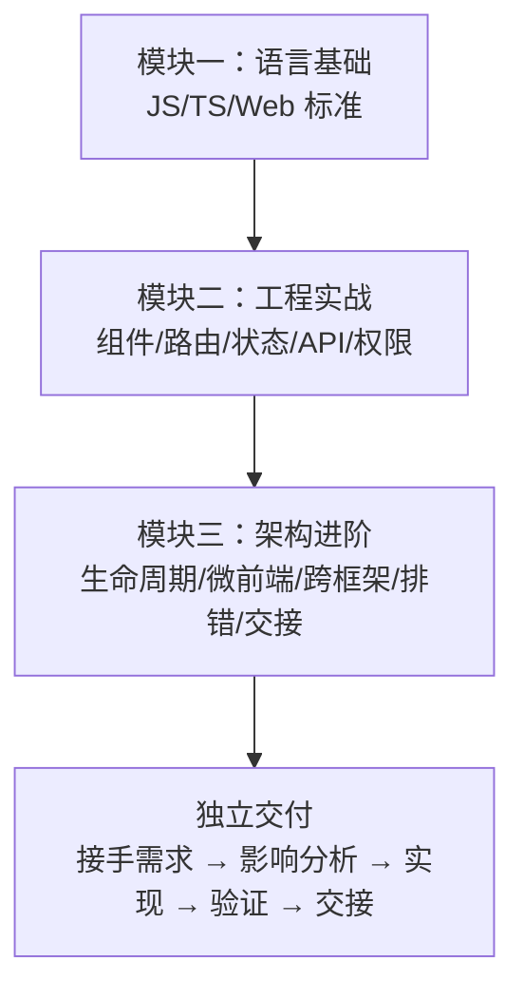

这三个模块不是各自独立的课程——它们是一条连贯的学习路径。模块一让你能读懂代码，模块二让你能写对代码，模块三让你能独立交付代码。三者缺一不可。

## 十四、从全栈视角看影响分析

### 14.1 前后端联动的典型场景

作为全栈开发者，你需要同时考虑前端和后端的影响面。以下场景需要跨端协调：

1. **API 契约变更**：后端修改了接口的请求参数或响应字段 → 前端所有消费方需要同步。
2. **权限模型变更**：后端新增或调整了权限码 → 前端权限检查代码需要更新。
3. **业务流程变更**：入库流程的某个步骤被移除 → 前端该步骤的页面/组件需要下线。

### 14.2 前后端交接的沟通要点

与后端同事交接时，带上以下信息能让沟通更高效：

1. 前端目前使用的接口列表（从 `src/api/` 目录中提取）。
2. 前端消费的字段清单（从组件中的数据绑定提取）。
3. 前端期望的响应格式（retcode 约定、分页格式、时间格式）。

"后端改了接口，前端崩了"通常是沟通问题，不是技术问题。在接口设计阶段就对齐契约，比上线后发现不兼容再修要好得多。

## 十五、练习答案与自测

### 15.1 本章自测题

1. 修改了 SC Vue 的 API 函数 `getRequestList` 的参数类型。影响范围包括哪些？
2. 远端组件的 Props 新增了一个必填字段。Portal 侧需要做什么？
3. 一个 MR 的 diff 包含 15 个文件，其中 3 个是构建配置文件的修改。MR 描述中至少应该包含哪些信息？
4. 跨仓改动的验证至少应该在几个宿主中完成？

### 15.2 参考答案

1. 本仓影响：所有调用 `getRequestList` 的页面需要更新参数。跨仓影响：如果后端接口是同一个，Portal 的对应 API 函数也需要同步。
2. Portal 消费该远端组件的代码需要传入新的必填 Props，否则 TypeScript 会报编译错误。
3. 改动目的、修改的文件和原因、影响分析（本仓/跨仓/破坏性变更）、验证结果（lint/type-check/页面行为）、截图对比。
4. Portal 和 MMF 两个宿主都需要验证（如果远端组件被两个宿主消费）。


## 十六、回顾与展望

模块三的六章构成了 FBS 前端学习的最高台阶。从理解三种应用的生命周期，到驾驭微前端和跨框架开发，再到系统化排错和规范化交付——你现在具备了独立接手一个完整 FBS 前端需求的能力。下一阶段，你将把视角从前端延伸到后端：Go 语言的语法和标准库、Chassis 框架的 HTTP 开发模型、数据库操作、异步任务和消息系统。前端积累的思维框架——分层排查、影响分析、契约先行——在后端学习中同样适用。区别只是换了语言、换了工具，底层的工程思维一脉相承。

## 参考文献

- 模块二 FE-W07（前端纵向切片）
- Portal `.agents/skills/coding/`
- SC Vue `.agents/skills/coding/`
- SC React `.agents/skills/coding/`

影响分析不是负担——它是让你在合并之前就发现问题的习惯，而不是在合并之后修 bug 的代价。每一次 MR 都认真做完这五步，你会发现自己踩坑的次数越来越少的。

总结：影响分析不是让你多写文档——是让你在写完代码之后、提交 MR 之前，停下来想一想：我改的这几行代码，会影响谁？每次 MR 都问自己这个问题，长期下来你会发现自己写的代码越来越安全——不是因为变得畏手畏脚，而是因为你对 FBS 代码库的理解更深入了。
影响分析是习惯，不是负担。


---

# Go 工具链、模块与版本边界

> 预计学习时间：120–160 分钟
> 一句话总结：能读懂 FBS 三个后端仓库的 `go.mod`、理解 Go 的模块/包组织方式、掌握编译和测试的最小命令，并知道 Go 1.15 与 1.20 版本差异对课程示例的限制。

## 这一章解决什么问题

前端同学第一次打开 FBS 后端仓库时，第一个困惑往往不是 Go 语法本身，而是工程组织方式。`go.mod` 文件做什么用？`git.garena.com/shopee/...` 这样的 import 路径是什么意思？为什么三个后端仓库使用了不同的 Go 版本？为什么有些文件叫 `xxx_test.go`？为什么有些文件开头带 `// +build` 注释？

这些问题的答案和 JavaScript 的 `package.json`、`node_modules`、`import` 路径有对应关系——但又不完全一样。本章帮你建立 Go 工程的心智模型，用前端工程的类比来解释 Go 的模块系统、编译过程和测试命令。学完后，你能看懂任何一个 FBS 后端仓库的 `go.mod`，知道怎样在各个仓库间判断代码的版本兼容性，以及为什么 Tax 仓库还在用 Go 1.15 而另外两个仓库已经升级到 Go 1.20。

> 本章基于三个后端仓库的 release 分支（2026-07-20）。

## 一、Go 模块：前端的 `package.json` 但更严格

### 1.1 go.mod 是声明文件但不执行

在 JavaScript/TypeScript 项目中，`package.json` 既声明依赖，又通过 `scripts` 字段定义可执行命令。Go 的 `go.mod` 只做两件事：声明当前模块的**路径**（module path）和**依赖约束**（require）。它没有 scripts，没有 devDependencies 与 dependencies 的区分。

以 `sbs-fbs-server` 的 `go.mod` 为例：

```go
module git.garena.com/shopee/bg-logistics/b2c/sbs-fbs-server

go 1.20

require (
	git.garena.com/shopee/bg-logistics/go/chassis v0.4.3-r.13
	git.garena.com/shopee/bg-logistics/go/gorm v0.0.7
	git.garena.com/shopee/bg-logistics/go/scorm v0.2.3-r.4
	// ...更多依赖
)
```

- **`module` 行**：声明这个仓库的"名字"。当你从别的仓库 import 这个仓库的代码时，用的就是这个路径。类比前端的 npm 包名，但 Go 的 module path 是完整路径而非短名。
- **`go 1.20`**：声明这个模块编写时使用的 Go 版本。编译器根据这个版本决定启用哪些语言特性。Go 1.20 的代码可以 import Go 1.15 的模块，但反过来不行——低版本编译器不认识高版本语法。
- **`require` 块**：声明依赖的模块和版本。和 `package.json` 的 dependencies 非常类似，版本号格式为 `v主版本.次版本.补丁版本-r.内部修订号`。

**前端类比**：`go.mod` ≈ `package.json`（但更精简）。Go 没有 `package-lock.json` 或 `yarn.lock` 的等价物——`go.sum` 文件记录了依赖的哈希校验和，用于安全性验证，而不是锁定版本。

### 1.2 import 路径就是 module path + 子目录

在 JavaScript 中，`import` 可以使用相对路径（`'./utils'`）、别名路径（`'@/utils'`）或包名（`'lodash'`）。Go 的 import 只有一种形式：**以 module path 或标准库名为前缀的完整路径**：

```go
import (
	"git.garena.com/shopee/bg-logistics/b2c/sbs-fbs-server/apps/inbound"   // 本仓库的子包
	"git.garena.com/shopee/bg-logistics/go/chassis"                         // 外部依赖
	"context"                                                               // 标准库
	"fmt"                                                                   // 标准库
)
```

- `"context"` 和 `"fmt"` 是 Go 标准库的包——不用声明在 go.mod 中，编译器自动识别。
- `"git.garena.com/shopee/..."` 开头的路径都是内部依赖。路径的前缀和 go.mod 中 require 的模块名对应。
- import 路径不是 URL——虽然看起来像。它是模块的命名空间。Go 编译器通过内部代理（GOPROXY）或公司内部 Git 服务器解析这些路径并下载代码。

**前端类比**：Go 的 import path ≈ npm 的 `"lodash/fp"`——包名（`lodash`）+ 子路径（`/fp`）。区别是 Go 没有"路径别名"机制（没有 `@/`）；每次 import 必须写完整路径。不过 FBS 的后端仓库中可以通过 `go.mod` 的 `replace` 指令做路径重定向。

### 1.3 包的组织：目录即包边界

在 JavaScript 项目中，一个目录下可以有多个文件，通过 `export`/`import` 按文件自由引用。Go 中一个目录下的所有 `.go` 文件（除 `_test.go`）属于同一个包，共享同一个命名空间。包名通常和目录名一致，但不强制：

```
apps/inbound/
├── inbound.go          // package inbound
├── handle.go           // package inbound
├── wire_set.go         // package inbound
└── handle_test.go      // package inbound_test（或 package inbound）
```

一个目录下所有非测试文件的 `package` 声明必须一致。你可以 import 一个包，但不能 import 包内的单个文件。所以 Go 代码中的 import 粒度是**包**，文件的拆分纯粹是为了可读性。

**前端类比**：Go 的包 ≈ JavaScript 中一个目录下的 `index.js` 加上所有通过它 re-export 的模块。区别是 Go 强制一个目录只属于一个包，且包内所有导出都是全局可见的（不需要在每个文件里 import 同包的其他文件）。

## 二、Go 多版本并存的现实：1.15 与 1.20

### 2.1 FBS 三个后端仓库的版本

| 仓库 | Go 版本 | Chassis 版本 | 主要影响 |
| --- | --- | --- | --- |
| `sbs-fbs-server` | 1.20 | v0.4.3-r.13 | 主服务和敏感服务的 Go 基线 |
| `fbs-sensitive-data-server` | 1.20 | v0.4.3-r.13 | 与主服务同基线 |
| `fbs-tax-server` | 1.15 | v0.4.3-r.22 | 税务服务的旧版本基线 |

Tax 仓库使用 Go 1.15，这意味着它不能使用 Go 1.18 引入的泛型、Go 1.13 的数字字面量改进、Go 1.20 的多项性能优化。这不是"懒得升级"——税务服务的稳定性要求很高，升级 Go 版本需要大量的回归测试和合规审查。在 FBS 的日常开发中，写 Tax 相关代码时必须记住这个版本限制。

**前端类比**：这就像 FBS 前端中 Portal 还在用 Node 16 而 SC 仓库已升级到 Node 20。你不能在 Portal 代码里用 Node 18+ 的 API（如原生 `fetch`），同理不能在 Tax 代码里用 Go 1.18+ 的泛型。两个生态的"技术债"来自同一个原因——稳定优先。

### 2.2 Go 1.15 不能用的关键特性

| 特性 | Go 版本要求 | 在 FBS Tax 仓库中 |
| --- | :---: | --- |
| 泛型（`func F[T any](x T)`） | 1.18+ | **不能用** |
| `any` 关键字（`interface{}` 的别名） | 1.18+ | **不能用**，继续用 `interface{}` |
| `os.ReadFile`（简化文件读取） | 1.16+ | **不能用**，继续用 `ioutil.ReadFile` |
| 内嵌 `embed`（打包静态资源） | 1.16+ | **不能用** |
| 切片转数组指针 | 1.17+ | **不能用** |

我们的课程示例以 Go 1.20 为主，方便展示现代 Go 的最佳实践。但对于 Tax 仓相关的练习，会标注哪些写法在 Tax 中不兼容。

### 2.3 版本选择对课程的意义

FBS 三个后端仓库的 Go 版本不一致，决定了本章后续所有代码示例必须兼容 Go 1.20，并在必要时标注 Tax 的差异。课程不会因为 Tax 用旧版本就把所有示例写成 Go 1.15 风格——那样会丢失现代 Go 的最佳实践。但涉及 Tax 的章节会明确说明差异。

**前端类比**：这门课程不会因为 Portal 用 TypeScript 4.4 就放弃讲 4.7 的改进——但会标注哪些写法在 Portal 中不能用。生产环境的多样性是现实约束，课程的职责是帮你认清这些约束，而不是为了"统一起见"把所有内容降到最低公共版本。

## 三、仓库结构与入口点

### 3.1 three 后端仓库的结构概览

```
sbs-fbs-server/
├── cmd/                  # 程序入口（main 包）
│   ├── api_server/       # HTTP/gRPC API 服务
│   └── fbs_task/         # 定时任务和异步任务服务
├── app/                  # 旧模块目录
├── apps/                 # 新模块目录
├── middleware/           # HTTP 中间件
├── sbs_agent/            # 基础设施适配层（DB、Redis、Saturn 等）
├── errcode/              # 错误码定义
├── go.mod                # 模块声明
└── Makefile              # 编译和运行命令
```

`cmd/` 下的每个子目录对应一个独立的可执行程序。`cmd/api_server/main.go` 是 API 服务的入口，`cmd/fbs_task/main.go` 是任务服务的入口。它们可以共用 `apps/` 下的业务代码，但编译成两个独立的二进制文件。

**前端类比**：`cmd/` ≈ monorepo 中的 `packages/app-a` 和 `packages/app-b`。它们共享 `apps/`（domains）中的业务逻辑，但各自有各自的 `index.js`（main.go）。Go 的 main package 是唯一可以编译成可执行文件的包——其他所有包都只能产生库文件，不能被"运行"。

### 3.2 Makefile：后端的 scripts

Go 没有 `npm scripts` 的概念。FBS 后端仓库使用 `Makefile` 来定义常用命令。与 `package.json` 的 scripts 不同，Makefile 更底层——它直接在 shell 中执行命令：

```makefile
# 简化示例
.PHONY: build test run

build:
	go build -o bin/api_server ./cmd/api_server

test:
	go test ./... -count=1

run:
	go run ./cmd/api_server
```

- `make build` 编译出二进制文件。
- `make test` 运行全项目的测试。
- `make run` 编译并运行。

**前端类比**：`Makefile` ≈ `"scripts"` in `package.json`。`make build` 相当于 `yarn build`，`make test` 相当于 `yarn test`。区别是 Go 的编译是"真编译"——产出的是平台相关的二进制文件，而不是前端那样的 JS bundle。

## 四、从零开始：编译和运行一个最小 Go 程序

### 4.1 Hello World 与编译过程

创建一个最小 Go 文件 `main.go`：

```go
package main

import "fmt"

func main() {
	fmt.Println("hello fbs")
}
```

运行它有两种方式：

```bash
# 方式一：编译并立即运行（不保留二进制文件）
go run main.go
# 输出：hello fbs

# 方式二：编译出二进制文件再运行
go build -o hello main.go
./hello
# 输出：hello fbs
```

`go run` 相当于前端的 `node main.js`或 `ts-node main.ts`——编译并执行，不保留编译产物。`go build` 相当于 `webpack build` 或 `tsc`——产生可部署的产物。区别是 Go 编译出的产物是原生的二进制文件，不依赖 Node.js 运行时。

**前端类比**：`go run` ≈ `node index.js`（解释执行），`go build` ≈ `npx webpack --mode production`（产生可部署产物）。Go 的二进制文件可以直接在目标服务器上运行，不需要安装 Go 运行时——这和后端 Node.js 应用需要在服务器上安装 Node 完全不同。

### 4.2 编译是跨平台的

Go 编译支持交叉编译——在 macOS 上可以编译出 Linux 的二进制文件：

```bash
GOOS=linux GOARCH=amd64 go build -o hello-linux main.go
```

这在 CI/CD 中非常实用：开发者在 macOS 上写代码和测试，CI 服务器编译 Linux 二进制部署。前端同学熟悉的"本地开发是 macOS，服务器是 Linux，但 Node.js 抹平了差异"的经验，在 Go 中体现为"交叉编译"能力。

### 4.3 go test 的基础用法

Go 的测试文件和源码在同一目录下，以 `_test.go` 结尾。创建一个简单测试 `main_test.go`：

```go
package main

import "testing"

func TestHello(t *testing.T) {
	got := "hello fbs"
	want := "hello fbs"
	if got != want {
		t.Errorf("got %q, want %q", got, want)
	}
}
```

运行测试：

```bash
go test        # 当前目录
go test ./...  # 当前目录及所有子目录
go test -v     # 显示详细输出
go test -run TestHello  # 只运行匹配名称的测试
```

**前端类比**：`go test` ≈ `yarn test` 或 `npm test`。`_test.go` ≈ `.test.ts` 或 `.spec.ts`。`t.Errorf()` ≈ `expect(x).toBe(y)`。Go 的测试框架非常简洁——没有 describe/it/beforeEach 等 DSL，只有 `testing.T` 提供的基本断言。FBS 后端代码中如果使用了 test suite，那是自定义的扩展，不是标准库的一部分。

### 4.4 Go 没有 node_modules

前端项目的 `node_modules` 通常有几个 GB，每个项目一份。Go 使用全局模块缓存——`$GOPATH/pkg/mod/`——所有项目共享一份下载的依赖。你不需要在每个项目里 `npm install`，Go 在编译时自动从缓存（或网络）取用依赖。

**前端类比**：Go 的依赖管理 ≈ 全局的 `pnpm store`，所有项目共享同一份缓存。`go mod tidy` ≈ `npm prune`——清理不再使用的依赖。

## 五、内网依赖与私有模块

### 5.1 FBS 使用的私有 Go 模块

FBS 后端仓库依赖大量公司内部的 Go 模块，所有路径以 `git.garena.com/shopee/bg-logistics/` 开头。这些模块托管在公司内部的 Git 服务器上，不对外公开。你的本地 Go 环境需要配置正确的 GOPROXY（指向内部 Go 模块代理）或 `.gitconfig`（允许通过 SSH 访问内部仓库）。

如果你在本地 `go build` 时报错 `cannot find module providing package`，通常是因为 Go 无法解析内部模块路径——确认网络和 GOPROXY/GOPRIVATE 配置。

### 5.2 replace 指令

`go.mod` 中的 `replace` 指令允许将依赖重定向到本地路径或其他版本：

```go
replace git.garena.com/shopee/bg-logistics/go/chassis => ../chassis
```

这在本地调试共享库时非常有用。你不需要发布新版本才能测试改动——直接用本地路径替换。在 FBS 的开发中，如果你同时改了 chassis 和 sbs-fbs-server，可以用 replace 指向本地的 chassis。

**前端类比**：Go 的 `replace` ≈ npm 的 `"file:../local-pkg"` 或 Yarn 的 `yarn link`。都是让本地依赖覆盖远程版本，方便联调。

### 5.3 生成代码：`//go:generate`

FBS 后端仓库中大量使用代码生成——Wire 的依赖注入代码、protobuf 的 gRPC 桩代码、错误码的字符串映射等。这些生成代码通常通过 `//go:generate` 注释声明：

```go
//go:generate wire
//go:generate protoc --go_out=. --go-grpc_out=. proto/*.proto
```

运行 `go generate ./...` 会扫描所有包含 `//go:generate` 注释的文件并执行对应命令。生成代码不应该手动修改——它会在每次 `go generate` 时被覆盖。

**前端类比**：`//go:generate` + `go generate` ≈ `"prebuild"` 或 `"codegen"` scripts in `package.json`。Protobuf 代码生成 ≈ GraphQL Codegen。Wire 代码生成在功能上类似于 Angular 或 NestJS 的依赖注入代码生成。

## 六、版本兼容性判断

### 6.1 一段代码能否用在 Tax 仓库中的判断流程

以后你看到一段 Go 代码，需要判断它能否在 Tax 仓库中使用时：

1. 打开 Tax 的 `go.mod`，看 `go` 指令——它决定可用的语言特性。
2. 确认代码中使用的语法是否是 1.15 支持的（无泛型、无 `any`、无 `os.ReadFile` 等）。
3. 确认代码中 import 的包在 Tax 的 `go.mod` 中是否有对应依赖（版本可能不同）。
4. 如果代码使用了 `go.mod` 中未声明的依赖，需要 `go get` 添加。但如果这个新依赖的内部版本与 Tax 已有的其他依赖冲突（同一个模块的不同版本），可能无法直接添加。

**前端类比**：判断一段 TypeScript 代码能否在 Portal（TypeScript 4.4）中运行，等同于判断一段 Go 代码能否在 Tax（Go 1.15）中运行。两边的限制都是"语言版本限定了可用语法"。

## 七、常见错误

### 7.1 `package xxx is not in GOROOT`

```text
package git.garena.com/.../chassis is not in GOROOT
```

翻译：Go 找不到这个包。可能原因：
- 模块未下载到缓存（运行 `go mod download` 或直接 `go build`，Go 会自动下载）。
- GOPROXY 配置不正确（检查 `go env GOPROXY`）。
- 内网依赖需要特定认证（确认 Git 可以 clone 对应的内部仓库）。

### 7.2 用错了 Go 版本

```text
go: go.mod file indicates go 1.20, but maximum version supported by tidy is 1.15
```

你的系统 Go 版本太低。Tax 仓库需要 Go 1.15，主服务仓库需要 Go 1.20。确认 `go version` 输出匹配当前仓库的要求。

### 7.3 试图 import 单个文件

```go
import "git.garena.com/.../apps/inbound/handle.go"  // 错误！
```

Go 不能 import 文件——只能 import 包。正确的写法是 import 目录对应的包路径。

### 7.4 生成代码被手动修改

FBS 仓库中的 `wire_gen.go`、protobuf 生成的 `.pb.go` 文件如果被手动修改，下次 `go generate` 时会覆盖掉修改。发现问题时先确认代码是手写的还是生成的——检查文件头部是否有 `// Code generated by... DO NOT EDIT.` 注释。

## 八、练习

### 8.1 依赖分析

下面的 Go 代码使用了 `os.ReadFile`。这段代码能在 `fbs-tax-server` 中编译吗？如果不能，应该怎么改？

```go
package main

import "os"

func main() {
	data, err := os.ReadFile("config.yaml")
	if err != nil {
		panic(err)
	}
	println(string(data))
}
```

### 8.2 版本判断

以下代码段中哪些不能在 Tax 仓库中使用？

a) `var x interface{} = "hello"`  
b) `var x any = "hello"`  
c) `func Max[T Ordered](a, b T) T { if a > b { return a }; return b }`  
d) `import "context"`  
e) `import "git.garena.com/shopee/bg-logistics/go/scormv2"`

### 8.3 模块路径练习

以下是 `sbs-fbs-server` 代码中的一行 import。请说明它的每个组成部分分别对应 go.mod 中的什么信息：

```go
import "git.garena.com/shopee/bg-logistics/go/chassis"
```

### 8.4 参考答案

**8.1**：不能。`os.ReadFile` 是 Go 1.16 加入的，Tax 仓库使用的 Go 1.15 不支持。应改为 `ioutil.ReadFile`。

**8.2**：b）`any` 是 Go 1.18 语法糖，c）泛型是 Go 1.18 特性。a、d、e 在 Go 1.15 中都可以使用（前提是 scormv2 的版本与 Tax 的 go.mod 兼容）。

**8.3**：`git.garena.com/shopee/bg-logistics/go/chassis` 对应 go.mod 中 `require` 块的 `git.garena.com/shopee/bg-logistics/go/chassis v0.4.3-r.13`。前缀 `git.garena.com/shopee/bg-logistics/go/` 是该内部模块的组织命名空间，`chassis` 是具体模块名。


## 九、从 npm 到 Go：一个前端开发者的工具链对照表

为了让前端同学更快地上手 Go 开发环境，下面是一张工具链对照表：

| 前端概念 | Go 对应 | 说明 |
| --- | --- | --- |
| `package.json` | `go.mod` | 声明模块名和依赖 |
| `node_modules/` | `$GOPATH/pkg/mod/` | 依赖存储位置（Go 全局共享） |
| `npm install` | `go mod download` | 下载依赖到缓存 |
| `npm run build` | `go build` | 编译项目 |
| `npm test` | `go test` | 运行测试 |
| `npm run dev` | `go run` | 编译并运行（开发模式） |
| `npx tsc --noEmit` | `go vet` 或 IDE | 静态检查（Go 编译器自带） |
| `ESLint` | `gofmt` + `go vet` | 格式化和静态分析 |
| `.eslintrc` | 无需配置文件 | Go 的格式化和大部分检查是强制性的 |
| `"scripts"` | `Makefile` | 可执行命令的定义文件 |
| TypeScript `any` | `interface{}` | 任意类型（Go 1.18+ 有 `any` 别名） |
| `"exports"` 字段 | 公开名首字母大写 | Go 通过命名规则控制可见性 |
| `"private": true` | module path 不以公开仓库命名 | Go 没有显式的 private 标记 |
| `import x from 'y'` | `import "y"` | 导入一个包 |
| `import { x } from 'y'` | `import "y"` 并通过 `y.X` 使用 | Go 没有具名导入 |

核心差异总结：

1. **Go 没有包管理器命令**：npm/yarn/pnpm 是独立的 CLI 工具。Go 的工具链（`go build`、`go test`、`go mod`）全部打包在 `go` 这个二进制文件中。
2. **Go 的编译是强制性的**：你没法"保存代码就直接在浏览器里看效果"——必须先编译（或 `go run` 编译+运行）。但这个编译非常快——Go 1.20 的编译速度通常以秒计，不会像前端大型项目的 Webpack 编译那样等几分钟。
3. **Go 没有热更新**：前端开发中有 HMR（Hot Module Replacement），Go 没有等价物。修改代码后必须重新编译和重启服务。不过 FBS 后端使用了内部框架，部分场景下可能有热重载能力——具体取决于 Chassis 配置。
4. **Go 的类型系统是不可商量的**：TypeScript 允许 `any` 绕过类型检查，`// @ts-ignore` 可以跳过某一行。Go 没有等价物——类型错误就是编译错误，必须修。这对从 JavaScript 转过来的前端同学来说可能需要适应，但它也意味着很多前端常见的运行时类型错误在 Go 中根本不会发生。

## 十、小结

本章建立了 Go 工程的心智模型：`go.mod` 声明依赖，import 路径对应模块路径+子目录，`go build` 编译出原生二进制，`go test` 运行测试。你学会了识别三个 FBS 后端仓库的 Go 版本差异（1.15 vs 1.20），以及这个版本差异对代码可移植性的限制。接下来，你将深入 Go 的类型系统——从 struct、指针和 tag 开始。

## 参考文献

- [The Go Programming Language Specification](https://go.dev/ref/spec)
- [Effective Go](https://go.dev/doc/effective_go)
- [Go Modules Reference](https://go.dev/doc/modules/gomod-ref)
- [Go 1.15 Release Notes](https://go.dev/doc/go1.15)
- [Go 1.20 Release Notes](https://go.dev/doc/go1.20)


---

# 值、指针、struct、tag 与数据边界

> 预计学习时间：120–160 分钟
> 一句话总结：能阅读 Go 的零值、指针、struct 定义、组合和 tag，理解 HTTP 请求 DTO 与数据库对象为何不同——从 FBS 主服务的 HTTP define 出发，修复一个字段的 tag 或零值语义问题。

## 这一章解决什么问题

前端同学习惯了 JavaScript 的对象模型：`const obj = { name: 'FBS', count: 0 }`——字段可以随时增删，`undefined` 表示"没有值"，`null` 表示"故意为空"。Go 的世界完全不同：struct 的字段在编译时确定，不能动态添加；变量一定有值（零值）；"没有值"这个概念不存在——你需要通过指针或特定标记来表达"可选"。

这种差异导致两类高频错误。一是将 JavaScript 的对象直觉带入 Go：以为 `== nil` 能判断空字符串、以为结构体字段可以为 `undefined`。二是忽略了指针和值在序列化、比较和方法调用中的行为差异——同样的 struct 传值和传指针可能产生完全不同的结果。

本章从 FBS 主服务的 HTTP DTO（`apps/inbound/inbound/application/fbs_ir_entity.go` 等文件）出发，逐步建立 Go 的值、指针、struct 和 tag 的心智模型。学完后，你能读懂 FBS 代码中任何 struct 定义、理解每个字段后面的 `` `json:xxx` `` 是什么意思、并修复一个实际的 tag 或零值语义问题。

> 本章基于 `sbs-fbs-server` 的 release 分支（2026-07-20），示例兼容 Go 1.20。Tax 仓的 Go 1.15 限制在本章无影响——本章内容均为 Go 1.0 就已存在的基础语法。

## 一、Go 的值：没有 undefined 的世界

### 1.1 每个变量都有值

在 JavaScript 中，声明变量但不赋值会得到 `undefined`：

```javascript
let x;           // undefined
const obj = {};
obj.missing;     // undefined
```

Go 没有 `undefined`。**任何类型的变量在声明后都立即拥有一个明确定义的零值**：

```go
var i int        // 0
var s string     // ""（空字符串）
var b bool       // false
var p *int       // nil（指针的零值）
var m map[string]int  // nil（map 的零值）
```

零值不是"没有值"——它是该类型的默认值，在运行时有明确的语义。`0` 是合法的 int，`""` 是合法的 string。Go 不区分"不存在"和"为空"。

**前端类比**：Go 的零值 ≈ JavaScript 中 TypeScript 强制所有字段必须有初始值的严格模式——但这个"初始值"不是 `undefined`，而是该类型的自然起点。JavaScript 中 `let count = 0` 需要手动赋值，Go 中 `var count int` 自动得到 `0`。

### 1.2 零值的实际影响

在 FBS 后端代码中，零值是一个需要谨慎对待的设计选择。以下 struct 展示了一个常见的陷阱：

```go
type InboundFilter struct {
	Status   string
	Region   string
	PageNo   int
	PageSize int
}
```

如果调用方不传 `Status` 和 `Region`，它们会是空字符串 `""`——你可能期望"没传就不筛选"，但空字符串是一种合法的筛选值（在 HTTP query 中 `?status=` 和完全没有 `status` 参数是不同的）。如果调用方不传 `PageNo`，它会是 `0`——你可能期望"默认第 1 页"，但 `0` 页对数据库分页来说是无效值。

这就是为什么 FBS 的 HTTP DTO 中经常使用指针来表示可选字段：

```go
type ScIrListReq struct {
	Status     *string  `json:"status"`     // nil = 不筛选，非 nil = 筛选
	Region     *string  `json:"region"`
	PageNo     int      `json:"page_no"`    // 有默认值逻辑
	PageSize   int      `json:"page_size"`
}
```

`*string`（字符串指针）的零值是 `nil`，可以用 `nil` 明确区分"调用方没传"和"调用方传了空字符串"。`int` 无法用 `nil` 表示"没传"——Go 中 int 没有 nil 值。如果 `PageNo` 需要区分"没传"和"传了 0"，也需要改成 `*int`。

**前端类比**：Go 的指针表达"可选" ≈ TypeScript 的 `?:`（可选属性）。`*string` ≈ `string | undefined`，`string` ≈ 必填的 `string`。区别是 Go 的零值是隐式的——你不需要显式赋值 `= nil`，未赋值的指针自动为 `nil`。

## 二、指针：值传递的解决方案

### 2.1 指针做什么

Go 的指针和 C 语言的指针类似——它存储的是另一个变量的**内存地址**。声明和使用的语法：

```go
var x int = 42
var p *int = &x    // p 指向 x 的地址
fmt.Println(*p)    // 42——通过指针读取 x 的值
*p = 100           // 通过指针修改 x 的值
fmt.Println(x)     // 100——x 被修改了
```

`&` 取地址，`*` 解引用。Go 没有指针运算——你不能 `p++` 来访问相邻内存。这比 C 安全得多。

**前端类比**：Go 的指针 ≈ JavaScript 的对象引用。`const b = a` 不会复制对象，`b.name = 'new'` 会影响 `a`——因为 `a` 和 `b` 指向同一个对象。Go 的 `p := &x` 也是类似：`p` 和 `&x` 指向同一块内存。区别是 Go 的指针可以指向基本类型（如 int、string 的指针），JavaScript 的基本类型总是按值传递。

### 2.2 为什么需要指针

Go 的函数参数总是**按值传递**——函数得到的是实参的副本。这意味着：

```go
func addOne(x int) {
	x = x + 1
}

n := 10
addOne(n)
fmt.Println(n)  // 10——n 没有变化！
```

如果要让函数修改外部变量，必须传递指针：

```go
func addOne(x *int) {
	*x = *x + 1
}

n := 10
addOne(&n)
fmt.Println(n)  // 11
```

在 FBS 代码中，HTTP handler 接收到的请求参数经常是指针类型——框架在反序列化 JSON 后需要修改 struct 的字段，用指针才能确保修改反映到原始对象上。

**前端类比**：Go 的值传递 ≈ JavaScript 传递基本类型（`number`、`string`）。Go 的指针传递 ≈ JavaScript 传递对象——函数可以修改对象内部的属性，但 Go 中即使修改"对象"（struct）也需要显式传指针，因为 Go 的 struct 也是值类型。

### 2.3 指针 vs 值的正确使用

| 场景 | 使用值 | 使用指针 |
| --- | :---: | :---: |
| 字段是否可选 | ✗ | ✓——nil 表示"未设置" |
| 需要修改入参 | ✗ | ✓ |
| struct 非常大 | ✗ | ✓——避免复制开销 |
| 并发安全的数据 | ✓——或使用同步机制 | 需要特别注意数据竞争 |
| 小且不可变的值 | ✓ | ✗——增加不必要的间接访问 |

在 FBS 代码中，HTTP DTO 的可选字段几乎总是指针；领域实体通常使用值类型；数据库模型则混合使用——要看字段在数据库中是否允许 NULL。

## 三、struct：Go 的"对象"

### 3.1 struct 的定义和创建

Go 没有 class——struct 是唯一的复合类型定义方式：

```go
type InboundItem struct {
	IrID    int    `json:"ir_id"`
	Status  string `json:"status"`
	Creator string `json:"creator"`
}

// 创建实例
item := InboundItem{
	IrID:   1001,
	Status: "PENDING",
}
fmt.Println(item.IrID)  // 1001
```

struct 字段的可见性由**首字母大小写**控制：大写字母开头的字段是公开的（可以被其他包访问），小写字母开头的字段是私有的（仅本包可访问）。Go 没有 `public`/`private`/`protected` 关键字。

### 3.2 struct 是值类型

在 JavaScript 中，对象总是引用类型。在 Go 中，struct 是值类型——赋值会复制整个 struct：

```go
item1 := InboundItem{IrID: 1001}
item2 := item1          // 完整复制
item2.IrID = 1002
fmt.Println(item1.IrID) // 1001——不受影响
fmt.Println(item2.IrID) // 1002
```

**前端类比**：Go 的 struct 赋值 ≈ JavaScript 的 `{ ...obj }`（展开运算符创建浅拷贝），而不是 `const b = a`（引用赋值）。这个差异非常重要：在 Go 中你不会意外地通过"引用"修改了不该修改的数据——每个 struct 赋值都是隔离的。

### 3.3 struct 嵌入：Go 的"继承"

Go 没有继承，但可以通过 struct 嵌入实现组合：

```go
type BaseEntity struct {
	CreatedAt time.Time
	UpdatedAt time.Time
}

type InboundItem struct {
	BaseEntity               // 嵌入——InboundItem 自动拥有 CreatedAt 和 UpdatedAt
	IrID   int    `json:"ir_id"`
	Status string `json:"status"`
}

item := InboundItem{}
item.CreatedAt = time.Now()  // 直接访问嵌入字段
```

在 FBS 后端代码中，这种模式大量出现——很多业务实体都嵌入了一个包含 `CreatedAt`、`UpdatedAt`、`Creator` 等公共字段的基础 struct。

**前端类比**：Go 的 struct 嵌入 ≈ JavaScript 的 `...spread` + 接口。`type InboundItem struct { BaseEntity; IrID int }` ≈ 在 TypeScript 中写 `interface InboundItem extends BaseEntity { irId: number }`。区别是 Go 的嵌入是真正的"字段提升"——嵌入的字段可以直接通过外层对象访问，不需要像 `item.BaseEntity.CreatedAt` 这样逐层访问。

## 四、tag：struct 的元数据

### 4.1 tag 是 struct 字段的"注释标签"

Go 的 tag 写在 struct 字段后面，用反引号包裹：

```go
type ScIrListReq struct {
	Status   *string `json:"status" form:"status" binding:"omitempty"`
	PageNo   int     `json:"page_no" form:"page_no"`
	PageSize int     `json:"page_size" form:"page_size"`
}
```

tag 本身不影响编译——Go 编译器不会"理解"tag 的含义。tag 是给库和框架看的：`encoding/json` 用 `json:"..."` tag 决定序列化时的字段名，Chassis 用 `form:"..."` 和 `binding:"..."` 处理 HTTP 请求参数绑定和校验。

**前端类比**：Go 的 tag ≈ TypeScript 的 decorator（装饰器）或多框架注解。`@JsonProperty("ir_id")` 在 Java/TypeScript 中指定 JSON 字段名，`json:"ir_id"` 在 Go 中做同样的事。区别是 Go 的 tag 是语言级特性（虽然编译器不处理），而前端需要通过 Babel/TypeScript 编译器插件来实现类似功能。

### 4.2 FBS 代码中常见的 tag

| tag | 用途 | FBS 使用场景 |
| --- | --- | --- |
| `json:"field_name"` | JSON 序列化/反序列化的字段名 | 所有 HTTP 请求/响应 DTO |
| `json:"field_name,omitempty"` | 零值时不序列化该字段 | 可选字段 |
| `form:"field_name"` | HTTP form/query 参数名 | Chassis 参数绑定 |
| `binding:"required"` | 参数必填校验 | 请求参数校验 |
| `gorm:"column:xxx"` | 数据库列名 | GORM/Scorm 数据模型 |
| `xlsx:"column_name"` | Excel 导出列名 | 文件导出 DTO |

### 4.3 tag 与零值的交互

`omitempty` 的行为取决于类型的零值。对于 string，零值是 `""`，所以 `omitempty` 会跳过空字符串字段。对于 bool，零值是 `false`，所以 `omitempty` 会跳过 `false` 字段。这意味着如果你用 `bool` + `omitempty` 表示"是否紧急"，当 `isUrgent` 为 `false` 时它不会出现在 JSON 中——接收方看到"没有这个字段"可能误解为"字段缺失"。这种情况应该去掉 `omitempty` 或改用 `*bool`。

在 FBS 的入库 DTO 中，`SellerSku *string json:"seller_sku"` 使用指针+omitempty 的缺省行为：当 `seller_sku` 为 nil 时不出现在 JSON 中，有值时正常序列化。

## 五、FBS 仓库中的 struct 与 DTO

### 5.1 HTTP 请求 DTO

打开 `sbs-fbs-server/apps/inbound/inbound/access/http/sc/` 下的文件，你会看到大量类似这样的 DTO：

```go
type ScIrListReq struct {
	PageNo       int    `json:"page_no" form:"page_no"`
	PageSize     int    `json:"page_size" form:"page_size"`
	Status       *int   `json:"status" form:"status"`
}
```

这个 struct 定义了"Seller Center 入库列表请求"的数据结构。`form` tag 用于 Chassis 的请求参数绑定——框架从 HTTP query 或 body 中提取对应字段并填充到 struct 中。`json` tag 在序列化/反序列化时生效。

### 5.2 数据库模型 vs 请求 DTO

FBS 严格区分 HTTP DTO 和数据库模型：

- **HTTP DTO**（`application/` 目录下）：面向外部接口的数据结构，使用 `json`/`form`/`binding` tag。
- **数据库模型**（`infra/` 目录下）：面向数据库的数据结构，使用 `gorm`/`scorm` tag。
- **领域实体**（`domain/` 目录下）：纯业务逻辑的数据结构，使用值类型居多，tag 较少。

这三种 struct 不能互换使用——它们的职责不同、tag 不同、字段集也不同。HTTP DTO 可能有一些仅供前端使用的计算字段，数据库模型有仅供持久化使用的内部字段。在 handler 和 repository 之间，代码负责 DTO ↔ 实体 ↔ DO（Data Object）的转换。

**前端类比**：Go 的三层 struct ≈ 前端的 API response type（DTO）、domain model（实体）、database entity（DO）。三者的分离不是因为架构教条，而是因为"给前端看的数据"和"存数据库的数据"往往结构不同——字段名、可选性、嵌套层级都可能有差异。

## 六、常见错误与修正

### 6.1 把指针零值 nil 和空值混淆

```go
var s *string    // s == nil——"没有值"
var t string     // t == ""——"有空字符串值"
```

`nil` 和 `""` 在业务语义上是完全不同的。如果代码中用 `== nil` 判断字符串是否未设置但变量类型是 `string`（不是 `*string`），条件永远不会成立——`string` 类型不可能为 nil。

### 6.2 忘记指针解引用

```go
var p *int
*p = 42  // panic: nil pointer dereference
```

在使用指针之前，先判断它是否为 nil：

```go
if p != nil {
	*p = 42
}
```

### 6.3 tag 拼写错误

```go
type Req struct {
	IrID int `jsom:"ir_id"`  // 拼写错误：json 写成了 jsom
}
```

这个错误不会在编译时报错——tag 只是字符串。运行时序列化会静默使用字段名的默认规则（首字母大写→`"IrID"` 而非 `"ir_id"`），导致前端解析失败。

### 6.4 混淆值方法和指针方法

```go
func (item InboundItem) SetStatus(s string) {  // 值接收者
	item.Status = s  // 只修改副本
}

func (item *InboundItem) SetStatusPtr(s string) {  // 指针接收者
	item.Status = s  // 修改原始对象
}
```

`SetStatus` 不会影响调用方的变量（因为传值），`SetStatusPtr` 会。如果不注意这个差异，会写出"看起来修改了但实际没有"的代码。

## 七、练习

### 7.1 零值判断

以下每个变量的零值是什么？

a) `var x int`  
b) `var s string`  
c) `var p *InboundItem`  
d) `var m map[string]int`  
e) `var sl []string`

### 7.2 tag 修复

以下 struct 用于 JSON API 响应。存在什么问题？如何修复？

```go
type InboundResponse struct {
	IrID     int    `json:"ir_id"`
	TotalQty int    `json:"total_qty,omitempty"`
	Remark   *string `json:"remark"`
	IsUrgent bool   `json:"is_urgent,omitempty"`
}
```

### 7.3 指针语义

写出以下代码的输出：

```go
type Item struct { Count int }
func setCount(v Item) { v.Count = 10 }
func setCountPtr(v *Item) { v.Count = 20 }

i := Item{Count: 1}
setCount(i)
fmt.Println(i.Count)
setCountPtr(&i)
fmt.Println(i.Count)
```

### 7.4 参考答案

**7.1**：a) 0, b) ""，c) nil，d) nil，e) nil。

**7.2**：`TotalQty` 使用 `omitempty`，当 `TotalQty` 为 0 时不会出现在 JSON 中。如果 0 在业务上是合法值，应去掉 `omitempty`。`IsUrgent` 同理——`false` 会被省略，接收方看到缺失字段可能误解。如果需要在 JSON 中总是包含 `is_urgent`，去掉 `omitempty`。

**7.3**：输出 `1` 然后 `20`。`setCount` 修改了副本，不影响原始值；`setCountPtr` 通过指针修改了原始值。


## 八、深入 FBS 仓库：请求 DTO 与数据库模型的分离

### 8.1 为什么需要三层结构

在 FBS 的 `sbs-fbs-server` 中，一个"入库单"至少有三个不同的 struct 定义：

**1. HTTP DTO**（`application/` 层）——给前端看的数据：
```go
type IrDetailResponse struct {
	IrID     int     `json:"ir_id"`
	Status   string  `json:"status"`
	SkuCount *int    `json:"sku_count,omitempty"`  // 可能不存在
}
```

**2. 领域实体**（`domain/` 层）——业务逻辑用的数据：
```go
type InboundRequest struct {
	ID        int
	Status    InboundStatus  // 自定义类型，不是原始 string
	Warehouse string
	CreatedAt time.Time
}
```

**3. 数据库模型**（`infra/` 层）——持久化用的数据：
```go
type InboundRequestDO struct {
	ID             int64  `gorm:"column:id;primaryKey"`
	Status         string `gorm:"column:status"`
	WarehouseID    string `gorm:"column:warehouse_id"`
	CreatedAt      time.Time `gorm:"column:created_at"`
	UpdatedAt      time.Time `gorm:"column:updated_at"`
	InternalNote   string `gorm:"column:internal_note"`  // 不对外暴露的字段
}
```

三者的区别：

- **字段名不同**：HTTP DTO 用 snake_case JSON（`ir_id`），数据库用数据库列名（`warehouse_id`），领域实体用 Go 内部命名（`Warehouse`）。
- **字段集不同**：HTTP DTO 可能有计算字段（如 `SkuCount`），数据库 DO 有内部字段（如 `InternalNote`），领域实体有业务逻辑相关的自定义类型。
- **tag 不同**：各有各的 tag 体系。

**前端类比**：三层 struct ≈ 前端的 API Response Type + Domain Model + Database Entity。TypeScript 项目中用 Prisma 或 TypeORM 也会有类似的分离——`UserResponseDto`（返回给前端）、`User`（业务逻辑）、`UserEntity`（数据库映射）。Go 的区别是这三层不是通过"装饰器"或"配置文件"关联的——你需要手动写转换代码（或者用代码生成工具）。

### 8.2 FBS 中的转换模式

在 handler 中，代码负责将 HTTP DTO 转换为领域实体，在 repository 中将领域实体转为 DO。例如：

```go
// handler 层：将请求 DTO 转为领域对象
func toDomain(req *ScIrListReq) inbound.SearchCriteria {
	return inbound.SearchCriteria{
		Status:   req.Status,
		PageNo:   req.PageNo,
		PageSize: req.PageSize,
	}
}

// repository 层：将领域对象转为查询条件
func toQuery(criteria inbound.SearchCriteria) map[string]interface{} {
	query := map[string]interface{}{}
	if criteria.Status != nil {
		query["status"] = *criteria.Status
	}
	return query
}
```

这个转换链是"显式样板代码"——不依赖任何框架或反射。它的优点是类型安全（编译时能发现字段不匹配）、容易追踪（顺着调用链就能找到所有字段转换点）。代价是代码量大——当一个 DTO 有 20 个字段时，转换代码也很长。FBS 的部分模块使用了代码生成来减少这种重复。

### 8.3 tag 在数据流中的完整作用

以一次入库列表请求为例，tag 在各个环节的作用：

1. **前端发送请求**：`{ "page_no": 1, "page_size": 20 }`
2. **Chassis 参数绑定**：读取 `form:"page_no"` → 设置 `ScIrListReq.PageNo = 1`
3. **handler 中使用**：代码直接用 `req.PageNo` 而非 `req.ir_page_no`
4. **数据库查询**：通过 `gorm:"column:page_no"` 映射到数据库列
5. **返回响应**：`json:"page_no"` 将 Go 字段 `PageNo` 序列化为 JSON `"page_no"`

如果任何一个 tag 写错了，数据就会在某一层断裂。最常见的是 JSON tag 拼写错误——前端发送了 `ir_id`，后端 tag 写成了 `json:"irId"`，导致 `ir_id` 字段始终为零值。这类问题不会在编译时发现（tag 只是字符串），需要集成测试或联调时暴露。

## 九、从 JavaScript 到 Go 的类型思维转变

本章的核心信息可以浓缩为一句话：**Go 没有 undefined，没有 null（在值类型上），没有隐式类型转换，赋值就是复制。** 这是从 JavaScript/TypeScript 转向 Go 时最大的思维转变。

在 JavaScript 中，你习惯了 `undefined` 和 `null` 的双重空值、对象引用的共享修改、以及 `==` 和 `===` 的隐式转换。在 Go 中，这些概念要么不存在，要么有完全不同的实现方式。适应这个变化不需要变成"类型系统专家"——只需要在每次定义 struct 时问自己三个问题：这个字段可以不设置吗？（用指针）这个字段会被修改吗？（传指针给函数）这个字段在 JSON/数据库中的名字是什么？（写 tag）。

掌握了这三个问题，你就掌握了 Go 的数据建模。接下来，你将学习 Go 的接口和方法——如何定义行为，以及如何通过接口实现依赖倒置。

## 参考文献

- [Go Spec: Struct types](https://go.dev/ref/spec#Struct_types)
- [Go Spec: Pointer types](https://go.dev/ref/spec#Pointer_types)
- [Go Blog: JSON and Go](https://go.dev/blog/json)
- [Effective Go: Pointers vs Values](https://go.dev/doc/effective_go#pointers_vs_values)


---

# 方法、接口、嵌入与依赖倒置

> 预计学习时间：120–160 分钟
> 一句话总结：能阅读 Go 的方法集、接口满足、struct 嵌入和构造函数——从 FBS 的 handler/service interface 出发，沿接口找到运行时实现，写一个最小 fake，并理解 Wire 在其中的角色。

## 这一章解决什么问题

前端同学对"接口"并不陌生——TypeScript 的 `interface` 用于描述对象形状，组件 Props、API 响应类型都是接口。但 Go 的接口和 TypeScript 的接口有本质差异：Go 的接口不需要显式声明"我实现了你"。只要一个类型的方法集包含接口要求的所有方法，它就自动满足接口——不需要 `implements` 关键字。这种"隐式满足"机制让 Go 的接口成为依赖倒置的天然载体。

在 FBS 后端代码中，几乎每个业务模块都遵循相同的模式：handler 依赖 service 接口 → service 接口有具体实现 → Wire 在编译时把具体实现注入到 handler 中。理解这个模式，你就能读懂 FBS 代码中最核心的架构约定。

> 本章基于 `sbs-fbs-server` 的 release 分支（2026-07-20）。

## 一、方法：附属于类型的函数

### 1.1 Go 的方法定义

JavaScript 中，方法是对象上的函数属性。Go 的方法通过"接收者"（receiver）绑定到类型：

```go
type InboundRequest struct {
	ID     int
	Status string
}

// 值接收者——操作的是副本
func (r InboundRequest) IsPending() bool {
	return r.Status == "PENDING"
}

// 指针接收者——操作的是原始对象
func (r *InboundRequest) Approve() {
	r.Status = "APPROVED"
}

req := InboundRequest{ID: 1001, Status: "PENDING"}
fmt.Println(req.IsPending())  // true
req.Approve()
fmt.Println(req.Status)       // "APPROVED"
```

**前端类比**：Go 的 `func (r *InboundRequest) Approve()` ≈ JavaScript 的 `class InboundRequest { approve() { this.status = 'APPROVED' } }`。区别是 Go 没有 class，方法定义在类型外部——这更像给类型"附加"函数。值接收者和指针接收者的区别在 JavaScript 中不存在等价物——JavaScript 的对象方法总是操作原始对象。

### 1.2 选择值接收者还是指针接收者

| 判断条件 | 使用值接收者 | 使用指针接收者 |
| --- | :---: | :---: |
| 方法需要修改接收者自身 | ✗ | ✓ |
| 接收者是大型 struct（复制成本高） | ✗ | ✓ |
| 方法只读取数据不修改 | ✓ | ✗ |
| 需要实现接口（见后文） | 视接口要求 | 视接口要求 |
| 并发场景 | ✓——值接收者天然线程安全 | 需要同步机制 |

FBS 代码中的经验法则：**默认使用指针接收者**。即使方法不修改数据，大型 struct 的复制成本也足够高。只有非常小的、不可变的值（如 `InboundStatus` 这样的自定义类型）才用值接收者。

## 二、接口：Go 的类型约束

### 2.1 接口定义

```go
type InboundRepository interface {
	FindByID(ctx context.Context, id int) (*InboundRequest, error)
	Save(ctx context.Context, req *InboundRequest) error
	List(ctx context.Context, filter SearchCriteria) ([]InboundRequest, int, error)
}
```

这个接口定义了三个方法。任何拥有这三个方法的类型都自动满足这个接口——不需要 `implements InboundRepository` 这样的声明。

### 2.2 隐式满足

```go
// 类型定义
type mysqlInboundRepo struct {
	db *gorm.DB
}

// 实现三个方法
func (r *mysqlInboundRepo) FindByID(ctx context.Context, id int) (*InboundRequest, error) { ... }
func (r *mysqlInboundRepo) Save(ctx context.Context, req *InboundRequest) error { ... }
func (r *mysqlInboundRepo) List(ctx context.Context, filter SearchCriteria) ([]InboundRequest, int, error) { ... }

// 自动满足 InboundRepository 接口
var _ InboundRepository = (*mysqlInboundRepo)(nil)  // 编译时验证
```

最后一行 `var _ InboundRepository = (*mysqlInboundRepo)(nil)` 不是必需的运行时代码——它纯粹是编译时断言。如果 `*mysqlInboundRepo` 没有完全实现接口，这行代码会导致编译错误。FBS 代码中常见这种模式，用来确保实现类不会意外偏离接口。

**前端类比**：Go 的隐式接口满足 ≈ TypeScript 的结构类型。TypeScript 中 `{ name: string }` 自动满足 `{ name: string }` 类型——不需要声明 `implements`。Go 把这个概念从"结构匹配"扩展到了"方法集匹配"。

### 2.3 接口放在哪里

Go 的接口定义通常放在**使用者**所在的包，而不是实现者所在的包。这是 Go 和 Java/C# 的关键差异：

```go
// service/ 包——定义接口（使用者）
type InboundRepository interface { ... }

// infra/ 包——提供实现（实现者）
type mysqlInboundRepo struct { ... }
```

这意味着如果你写了一个 mock 实现来测试，不需要修改 `infra/` 包——直接在测试文件中定义一个实现了相同接口的 mock struct 即可。这就是依赖倒置：上层定义需要什么，下层提供实现。

**前端类比**：Go 的接口放在使用者侧 ≈ React 组件的 Props 由组件自己定义，而不是由数据源定义。组件的 Props 接口说"我需要 name: string"，任何能提供 name 的地方就可以用——无论是 API 响应还是 mock 数据。

## 三、FBS 中的接口与实现

### 3.1 Handler → Service → Repository 链路

在 FBS 主服务的 inbound 模块中，典型的三层接口关系：

```go
// handler 层：依赖 service 接口
type InboundHandler struct {
	svc InboundService
}

// service 层：定义接口并依赖 repository 接口
type InboundService interface {
	GetIrList(ctx context.Context, req *SearchCriteria) ([]InboundItem, int, error)
}

// repository 层：定义接口，由 infra 层实现
type InboundRepository interface {
	FindByFilter(ctx context.Context, filter map[string]interface{}) ([]InboundRequestDO, error)
}
```

每层只依赖下一层的接口，不依赖具体实现。这带来的好处：

- handler 的单元测试可以用 mock service，不需要真实数据库。
- service 的单元测试可以用 mock repository，不需要启动 MySQL。
- 修改 repository 的实现（如从 GORM 切换到 Scorm）不影响上层代码。

### 3.2 Wire 的角色

FBS 使用 Google Wire 实现编译期依赖注入。`wire.Bind` 将接口和具体实现绑定：

```go
// 声明接口和实现的绑定关系
var InboundSet = wire.NewSet(
	NewInboundHandler,
	NewInboundService,
	wire.Bind(new(InboundService), new(*inboundServiceImpl)),
	NewInboundRepository,
	wire.Bind(new(InboundRepository), new(*mysqlInboundRepo)),
)
```

Wire 在编译时扫描这些绑定关系，生成 `wire_gen.go`——一个包含了所有对象创建和连接代码的文件。Wire 不是运行时框架——它只是一个代码生成工具。生成完成后，所有的依赖连接都变成了普通的 Go 代码，没有反射、没有运行时开销。

**前端类比**：Go 的 Wire ≈ Angular 的 DI 容器或 NestJS 的 `@Injectable()`。区别是 Wire 在编译时生成所有代码——生产环境运行的代码中没有 DI 容器、没有装饰器、没有反射，只有普通的函数调用和赋值。这相当于前端的"编译时依赖注入"——类似于使用构建工具在编译期解析所有 import 并将其展开为内联代码。

## 四、接口的测试价值

### 4.1 用 mock 实现替代真实依赖

```go
// 测试中的 mock 实现
type mockInboundRepo struct {
	findByIDFunc func(ctx context.Context, id int) (*InboundRequest, error)
}

func (m *mockInboundRepo) FindByID(ctx context.Context, id int) (*InboundRequest, error) {
	return m.findByIDFunc(ctx, id)
}

func TestGetIrDetail(t *testing.T) {
	repo := &mockInboundRepo{
		findByIDFunc: func(ctx context.Context, id int) (*InboundRequest, error) {
			return &InboundRequest{ID: id, Status: "PENDING"}, nil
		},
	}
	svc := NewInboundService(repo)
	detail, err := svc.GetIrDetail(context.Background(), 1001)
	if err != nil || detail.Status != "PENDING" {
		t.Errorf("unexpected result")
	}
}
```

**前端类比**：Go 的 mock 实现 ≈ Jest 的 `jest.fn()` + mock 返回值。`mockInboundRepo.findByIDFunc` ≈ `jest.fn().mockReturnValue(...)`。区别是 Go 需要手动写 mock struct，而 JavaScript 可以直接用 `jest.mock('./module')` 自动生成。FBS 项目中通常使用 `testify/mock` 或手写简单 mock。

### 4.2 接口不是越多越好

不是每个 struct 都需要一个对应的 interface。FBS 的接口通常只出现在"有多个可能实现"或"上层需要测试"的地方。如果一个类型只有一个实现、且不参与单元测试 mock，它可能根本没有接口——直接使用具体类型。Go 社区的经验是"接口应该小而精"——大多数接口只有 1-3 个方法。这和 Java/C# 中动辄 10+ 个方法的"大接口"不同。

## 五、常见错误

### 5.1 混淆值接收者和指针接收者的接口满足

```go
type Greeter interface { Greet() string }
type Foo struct {}
func (f Foo) Greet() string { return "hello" }    // 值接收者

var g Greeter = Foo{}   // OK
var g Greeter = &Foo{}  // 也 OK——指针包含值的方法集
```

如果方法是用指针接收者定义的：

```go
func (f *Foo) Greet() string { return "hello" }   // 指针接收者

var g Greeter = &Foo{}  // OK
var g Greeter = Foo{}   // 编译错误！Foo 没有实现 Greet
```

指针类型的方法集包含值接收者和指针接收者的所有方法。值类型的方法集只包含值接收者的方法。这是 Go 接口中最容易出错的地方。

### 5.2 接口定义在错误的位置

在 FBS 代码中，如果你需要 mock `InboundRepository`，应该在 `service` 包（使用者）中定义接口，而不是在 `infra` 包（实现者）中。把接口放在实现者旁边违反了依赖倒置原则——使用者被迫依赖实现者的包，测试时仍然需要引入真实实现所在的包。

## 六、练习

### 6.1 接口实现

以下接口 `Validator` 需要哪些类型满足它？

```go
type Validator interface {
	Validate() error
}

type Email string
func (e Email) Validate() error { ... }

type User struct { Name string }
func (u *User) Validate() error { ... }
```

a) `var v Validator = Email("test@test.com")`——能编译吗？  
b) `var v Validator = User{Name: "test"}`——能编译吗？  
c) `var v Validator = &User{Name: "test"}`——能编译吗？

### 6.2 Mock 编写

为 `InboundService` 接口编写一个 mock，用于测试 handler。假设 handler 调用 `GetIrList` 获取列表数据并检查返回数量。

### 6.3 参考答案

**6.1**：a) 能——Email 的方法使用值接收者，值类型满足接口。b) 不能——`*User` 的 `Validate()` 是指针接收者，值类型 `User` 不满足接口。c) 能——指针类型包含指针接收者的方法。

**6.2**：参考模式见第四节代码。


## 七、Go 的接口与 TypeScript 的接口：本质差异

### 7.1 结构型 vs 名义型

TypeScript 的接口是**结构型**——只要形状匹配就兼容。Go 的接口也是**结构型**——只要方法集匹配就满足。但 TypeScript 通常通过 `implements` 关键字显式声明来实现接口（虽然可以用类型断言绕过），Go 完全不需要声明。

这导致了不同的编程风格：

```typescript
// TypeScript：通常显式声明
class MySQLRepo implements InboundRepository {
  findById(id: number): InboundRequest { ... }
}

// Go：不需要声明，方法签名匹配即可
type mysqlInboundRepo struct { db *gorm.DB }
func (r *mysqlInboundRepo) FindByID(...) { ... }
// 自动满足 InboundRepository 接口
```

### 7.2 接口的"零值"和空接口

Go 的 `interface{}`（或 Go 1.18+ 的 `any`）可以保存任何类型的值——类似 TypeScript 的 `unknown`（不是 `any`，因为 `any` 会关闭类型检查而 `interface{}` 不会）。空接口在前端类比中是"泛型容器"——`let x: unknown = 42` 可以用 `typeof` 检查后安全使用，`var x interface{} = 42` 需要用类型断言 `x.(int)` 取回原类型。

在 FBS 代码中，你很少看到 `interface{}`——大多数场景都有明确的接口定义。如果出现 `interface{}`，通常是在"确实无法预知类型"的边界（如 JSON 通用解析、中间件通用处理）。

### 7.3 接口组合

Go 的接口可以通过嵌入组合成更大的接口：

```go
type Reader interface { Read(p []byte) (n int, err error) }
type Writer interface { Write(p []byte) (n int, err error) }
type ReadWriter interface {
	Reader
	Writer
}
```

FBS 代码中这个模式常见于标准库级别的组合，业务代码中较少——因为 FBS 倾向于小接口（1-3 个方法），不需要组合。

## 八、FBS 中的依赖注入全景

### 8.1 Wire 的完整工作流

在 FBS 的每个模块中，Wire 的工作流是：

1. 在 `wire.go` 中定义 provider set：
```go
// +build wireinject
//go:generate wire
package inbound

var InboundSet = wire.NewSet(
	NewHandler,
	NewService,
	wire.Bind(new(Service), new(*serviceImpl)),
	NewRepository,
	wire.Bind(new(Repository), new(*mysqlRepo)),
)
```

2. 在 `wire.go` 中定义 injector 函数：
```go
func InitInboundHandler(db *gorm.DB) *Handler {
	wire.Build(InboundSet)
	return nil
}
```

3. 运行 `go generate` → Wire 生成 `wire_gen.go`：
```go
func InitInboundHandler(db *gorm.DB) *Handler {
	repo := NewRepository(db)
	svc := NewService(repo)
	handler := NewHandler(svc)
	return handler
}
```

4. 在 `main.go` 中调用 injector：
```go
handler := inbound.InitInboundHandler(db)
```

生成后的代码就是普通的 Go 代码——没有注解、没有反射、没有运行时开销。Wire 纯粹是编译时代码生成工具。

### 8.2 Wire 解决了什么问题

Wire 解决的是"手动依赖注入太繁琐"的问题。如果没有 Wire，你需要在 main.go 中手动写十几行依赖创建代码——而且每次依赖关系变化时都要手动更新。Wire 把这个过程自动化了。

**前端类比**：Go 的 Wire ≈ Angular 的 DI 容器，但编译时生成。Angular 在浏览器运行时通过 `@Injectable()` 装饰器和反射来解析依赖；Wire 在编译时就把所有依赖关系展开成普通代码。生成后的代码没有任何魔法——你可以逐行阅读和理解。

## 九、接口驱动的开发流程

### 9.1 在 FBS 中新增一个功能的推荐步骤

1. 在 `domain/` 中定义领域实体（纯 struct，无接口）。
2. 在 `application/`（或 `service/`）中定义 service 接口，声明业务操作的签名。
3. 写 service 的具体实现，依赖 repository 接口。
4. 在 `infra/` 中实现 repository 接口（数据库查询代码）。
5. 在 `wire.go` 中注册 provider set 和绑定关系。
6. 运行 `go generate` 生成 wire_gen.go。
7. 写 handler，依赖 service 接口，处理 HTTP 请求/响应。
8. 写 handler_test.go（mock service）和 service_test.go（mock repository）。

### 9.2 接口帮助你推迟决策

接口的核心价值不是"可以换实现"——实际上 FBS 中大多数接口只有一个实现，而且在可预见的未来都不会换。接口的核心价值是"让你可以推迟决策"。写 service 时你不需要知道 repository 用 MySQL 还是 memory——只需要知道"有个东西能查数据"。测试时，你给它一个 mock。

**前端类比**：React 组件通过 Props 接收数据而不是直接调用 API，是为了推迟"数据从哪来"的决策。`<UserProfile user={user} />` 不关心 `user` 是来自 Redux Store 还是 API 响应还是 mock 数据。Go 的接口做的是同样的事——推迟"具体实现是什么"的决策到调用方。

## 十、从 OOP 到 Go：方法论的转变

如果你之前主要使用 Java 或 TypeScript（带 class）进行面向对象开发，Go 的接口和组合模式需要一些适应：

1. **Go 没有继承**——用 struct 嵌入和接口组合替代。
2. **Go 没有抽象类**——用接口 + 默认实现 struct 替代。
3. **Go 没有构造函数重载**——通常用 `NewXxx()` 函数替代，参数通过 Options pattern 或 Config struct 传递。
4. **Go 的接口遍地都是但非常小**——大多数接口只有 1-3 个方法，不像 Java 的 interface 有 10+ 个方法。
5. **Go 的 DI 在编译时完成**——Wire 生成的代码是可阅读的，不需要理解运行时反射。

FBS 代码忠实地体现了这些 Go 惯用法。如果你在阅读 FBS 代码时觉得"为什么这么写而不是像 Java 那样"，答案通常是"因为 Go 不鼓励那种写法，而且有更好的替代"。


## 十一、接口和结构体在错误处理中的角色

在 Go 中，error 本身就是一个接口——只有一个方法 `Error() string`。这意味着任何实现了 `Error() string` 的类型都是合法的 error。FBS 代码利用这一特性构建了丰富的错误层级：

```go
// 自定义错误类型
type BusinessError struct {
	Code    int
	Message string
}

func (e *BusinessError) Error() string {
	return fmt.Sprintf("[%d] %s", e.Code, e.Message)
}

// 使用 errors.Is 和 errors.As 检查错误类型
if errors.Is(err, ErrNotFound) { ... }      // 检查是否为特定 sentinel error
var bizErr *BusinessError
if errors.As(err, &bizErr) { ... }           // 提取自定义错误类型
```

在 FBS 的 `errcode/` 包中，你会看到大量使用这一模式的代码。业务错误码通过实现 error 接口与 Go 的标准错误处理机制无缝集成。这部分内容将在 BE-L05 详细展开——但理解 error 是接口这一事实，现在就需要建立。

## 十二、从练习到实战

学完本章后，试试在 `sbs-fbs-server` 中完成以下任务：

1. 找到 `apps/inbound/` 下的 `wire.go` 文件——看它的 provider set 包含哪些组件。
2. 追踪 `InboundService` 接口（或类似命名）——找到它的定义、所有方法签名、以及具体实现。
3. 找到 `InboundRepository` 接口——看它的方法和具体实现。
4. 打开 `wire_gen.go`（生成文件）——观察 Wire 如何将 provider set 展开为普通代码。

如果你能完成这四个步骤，你就掌握了 FBS 代码中最核心的架构范式。接下来的章节中，你会反复看到这个模式——handler → service → repository 的三层结构，由 Wire 编译时连接。

## 十三、Go 接口与前端架构的类比

如果你做过 React 或 Vue 的前端开发，Go 的接口和依赖注入有一个非常贴切的类比：

React 组件通过 Props 声明我需要什么，而不是谁提供给我。Go 的接口做的是同样的事——消费者定义需要什么，不关心谁提供。提供者只需满足契约，不需要知道谁在消费。

这个原则在前后端开发中同样有效。当你从前端转到后端时，不要被依赖注入、控制反转这些术语吓到——它们只是把具体实现从消费者中抽离的不同叫法而已。

## 参考文献

- [Go Spec: Interface types](https://go.dev/ref/spec#Interface_types)
- [Go Spec: Method sets](https://go.dev/ref/spec#Method_sets)
- [Effective Go: Interfaces](https://go.dev/doc/effective_go#interfaces)
- [Go Blog: Wire](https://go.dev/blog/wire)


---

# slice、map、排序与数据转换

> 预计学习时间：120–160 分钟
> 一句话总结：能安全处理 Go 的 slice 和 map——理解 append、拷贝、去重、排序、nil/empty 差异和共享底层数组风险，编写不修改输入的转换函数和 table-driven test。

## 这一章解决什么问题

前端同学对数组和对象操作非常熟悉——`array.map()`、`array.filter()`、`Object.keys()`、`[...array]`。Go 的 slice 和 map 在概念上类似，但有一个关键差异：Go 的 slice 和 map 默认是**引用底层数据的视图**，而不是独立的副本。修改一个 slice 可能意外地影响另一个——这在 JavaScript 中很少见（展开运算符创建的是浅拷贝，但至少数组本身不共享）。

这个差异导致 FBS 后端代码中经常出现一个模式：在函数返回之前用 copy 或新建 slice 来隔离数据。不这样做，调用方可能会意外修改 handler 层的缓存数据——这在并发场景下尤其危险。

> 本章基于 `sbs-fbs-server` 的 release 分支（2026-07-20）。

## 一、slice：Go 的动态数组

### 1.1 slice 的创建和基本操作

```go
// 创建
var s []int                  // nil slice——len=0，底层数组为 nil
s2 := []int{1, 2, 3}        // 字面量
s3 := make([]int, 0, 10)     // len=0, cap=10

// 追加
s = append(s, 1)             // [1]
s = append(s, 2, 3, 4)      // [1, 2, 3, 4]

// 截取
sub := s[1:3]                 // [2, 3]——和 s 共享底层数组！
```

**前端类比**：Go 的 slice ≈ JavaScript 的数组，但有三个关键差异：1) `append` 返回新 slice（可能指向新底层数组），不像 `array.push()` 修改原数组；2) `s[1:3]` 创建的是视图而非副本；3) slice 有容量概念——`make([]int, 0, 10)` 预分配了 10 个元素的空间。

### 1.2 nil slice vs empty slice

```go
var s1 []int             // nil——JSON 序列化为 null
s2 := []int{}            // empty——JSON 序列化为 []
s3 := make([]int, 0)     // empty
```

在 FBS 的 HTTP 响应中，`nil` slice 和 empty slice 的 JSON 表示不同。如果前端期望 `"list": []`，但后端返回了 `"list": null`，前端代码可能会出问题。因此 FBS 的响应中通常使用 `make([]T, 0)` 初始化列表字段，确保即使没有数据也返回空数组。

**前端类比**：Go 的 nil slice ≈ JavaScript 的 `null`，empty slice ≈ JavaScript 的 `[]`。在 TypeScript 中 `const x: string[] = null` 和 `const x: string[] = []` 的区别和 Go 中完全一样。

### 1.3 共享底层数组的陷阱

```go
original := []int{1, 2, 3, 4, 5}
subset := original[1:3]   // [2, 3]
subset[0] = 100
fmt.Println(original)     // [1, 100, 3, 4, 5]——原始数据被修改了！
```

如果你需要独立的副本，使用 `copy`：

```go
subset := make([]int, 2)
copy(subset, original[1:3])
subset[0] = 100
fmt.Println(original)     // [1, 2, 3, 4, 5]——原始数据不变
```

在 FBS 代码中，从 handler 返回数据给调用方之前，如果数据来自内部缓存，通常会先 copy 再返回。否则调用方可能会意外修改缓存。

## 二、map：Go 的键值对

### 2.1 map 的创建和基本操作

```go
// 创建
m := map[string]int{"a": 1, "b": 2}   // 字面量
m2 := make(map[string]int)             // empty map

// 读写
m["c"] = 3                              // 添加
value := m["a"]                         // 读取——key 不存在时返回零值
value, ok := m["d"]                     // ok=false，说明 key 不存在
delete(m, "a")                          // 删除

// 遍历（顺序不固定）
for key, value := range m {
	fmt.Println(key, value)
}
```

**前端类比**：Go 的 map ≈ JavaScript 的 `Map` 对象或普通 `{}`。`value, ok := m["key"]` ≈ JavaScript 的 `m.has("key") ? m.get("key") : undefined`。Go 的 map 遍历顺序不固定——如果需要有序遍历，必须先取 keys → 排序 → 按排序后的顺序取值。

### 2.2 map 的常见陷阱

**1. nil map 不能写入**：
```go
var m map[string]int    // nil
m["a"] = 1               // panic: assignment to entry in nil map
```

必须用 `make` 或字面量初始化后才能写入。读取 nil map 不会 panic——返回零值。

**2. map 不是并发安全的**：
```go
// 并发读写 map 会导致 panic
// Go 1.6+ 运行时检测到并发 map 读写会直接崩溃
// 使用 sync.Mutex 或 sync.Map
```

在 FBS 的并发代码中（如 goroutine 共享的缓存），必须用锁保护 map 操作。

**3. map 是引用类型**：
```go
m1 := map[string]int{"a": 1}
m2 := m1           // m2 和 m1 指向同一个底层哈希表
m2["a"] = 100
fmt.Println(m1["a"])  // 100
```

## 三、range 遍历

`range` 用于遍历 slice、map、string、channel。对于 slice，`range` 返回索引和值；对于 map，返回 key 和 value：

```go
// slice
for i, item := range items {
	fmt.Printf("%d: %v\n", i, item)
}

// 只要值
for _, item := range items { ... }

// 只要索引
for i := range items { ... }

// map
for key, val := range myMap { ... }
```

**前端类比**：Go 的 `for i, v := range items` ≈ JavaScript 的 `items.forEach((v, i) => ...)`。`_` ≈ 忽略参数。

## 四、排序与去重

### 4.1 排序

Go 标准库提供 `sort` 包：

```go
import "sort"

// 基本类型排序
ints := []int{3, 1, 4, 1, 5}
sort.Ints(ints)                // [1, 1, 3, 4, 5]
sort.Sort(sort.Reverse(sort.IntSlice(ints))) // 降序

// 自定义排序
type InboundByTime []InboundRequest
func (a InboundByTime) Len() int           { return len(a) }
func (a InboundByTime) Less(i, j int) bool { return a[i].CreatedAt.Before(a[j].CreatedAt) }
func (a InboundByTime) Swap(i, j int)      { a[i], a[j] = a[j], a[i] }

sort.Sort(InboundByTime(requests))
```

Go 1.8+ 提供了更简洁的 `sort.Slice`：

```go
sort.Slice(requests, func(i, j int) bool {
	return requests[i].CreatedAt.Before(requests[j].CreatedAt)
})
```

### 4.2 去重

Go 没有内建的去重函数。常用模式：用 map 记录已见过的值：

```go
func unique(ids []int) []int {
	seen := make(map[int]bool)
	result := make([]int, 0)
	for _, id := range ids {
		if !seen[id] {
			seen[id] = true
			result = append(result, id)
		}
	}
	return result
}
```

**前端类比**：Go 的去重模式 ≈ JavaScript 的 `[...new Set(ids)]`。Go 的 `map[T]bool` ≈ `Set<T>`。

## 五、FBS 代码中的数据转换模式

### 5.1 从数据库模型到 API 响应

在 FBS 的 handler 中，典型的转换流程：

```go
func toResponse(items []InboundRequestDO) []InboundItem {
	result := make([]InboundItem, 0, len(items))
	for _, do := range items {
		result = append(result, InboundItem{
			IrID:   int(do.ID),
			Status: do.Status,
		})
	}
	return result
}
```

注意 `make([]InboundItem, 0, len(items))`——预分配了足够的容量，避免 append 过程中多次扩容。

### 5.2 筛选和分页

```go
func paginate(items []InboundItem, pageNo, pageSize int) []InboundItem {
	start := (pageNo - 1) * pageSize
	if start >= len(items) {
		return []InboundItem{}
	}
	end := start + pageSize
	if end > len(items) {
		end = len(items)
	}
	return items[start:end]
}
```

## 六、常见错误

### 6.1 append 后未使用返回值

```go
s := []int{1, 2}
append(s, 3)      // s 仍然是 [1, 2]！
s = append(s, 3)  // 正确
```

### 6.2 循环中修改 slice 长度

```go
// 可能跳过元素
for i := 0; i < len(items); i++ {
	if shouldRemove(items[i]) {
		items = append(items[:i], items[i+1:]...)
		i--   // 需要回退索引
	}
}
```

### 6.3 未初始化 map 就写入

```go
var cache map[string]int
cache["key"] = 1  // panic
```

## 七、练习

### 7.1 安全转换函数

编写 `FilterAndMap(items []int, predicate func(int) bool, mapper func(int) string) []string`，要求不修改输入的 slice。

### 7.2 去重排序

给定 `[]string{"c", "a", "b", "a", "c"}`，返回去重并按字母排序的 slice。

### 7.3 参考答案

**7.2**：
```go
func uniqueSorted(input []string) []string {
	seen := make(map[string]bool)
	result := make([]string, 0)
	for _, s := range input {
		if !seen[s] {
			seen[s] = true
			result = append(result, s)
		}
	}
	sort.Strings(result)
	return result
}
```


## 八、从 JavaScript 数组到 Go slice 的思维转变

### 8.1 不可变 vs 可变操作

JavaScript 中区分了修改原数组的方法和返回新数组的方法：`map`、`filter` 返回新数组，`push`、`pop`、`sort` 修改原数组。Go 没有这个区分——**所有对 slice 的修改都是对同一个底层数组的操作**（除非 append 触发了扩容）。

```javascript
// JavaScript：返回新数组，不修改原数组
const doubled = numbers.map(x => x * 2);
// Go：需要手动创建新 slice
doubled := make([]int, len(numbers))
for i, n := range numbers { doubled[i] = n * 2 }
```

这个差异意味着在 Go 中，你需要比 JavaScript 更谨慎地管理数据的所有权。如果一个函数接收了一个 slice 参数，你要明确它是"借用"（只读）还是"占有"（可能修改）。FBS 代码中，纯查询函数通常只读，修改函数通常创建新 slice 返回。

### 8.2 前端数组 API 到 Go 的对照

| JavaScript | Go |
| --- | --- |
| `array.map(fn)` | `for` 循环 + `append` |
| `array.filter(fn)` | `for` 循环 + `if` + `append` |
| `array.find(fn)` | `for` 循环 + `return` |
| `array.some(fn)` / `array.every(fn)` | `for` 循环 + `bool` |
| `array.reduce(fn, init)` | `for` 循环 + 累加变量 |
| `[...array]` | `make` + `copy` |
| `array.sort(fn)` | `sort.Slice(array, fn)` |
| `new Set(array)` | `map[T]bool` |
| `array.includes(x)` | `for` 循环 / `slices.Contains`（Go 1.21+） |

### 8.3 map 在前端和后端的差异

JavaScript 的 `Object` 和 `Map` 在 Go 中统一为 `map[K]V`。关键差异：

- JavaScript 的 `obj.key` 在 Go 中是 `m["key"]`——只能用方括号。
- JavaScript 的 `obj.key === undefined` 判断不存在，Go 用 `value, ok := m["key"]`。
- JavaScript 的 `Object.keys(obj)` 在 Go 中没有等价物——需要自己遍历收集。
- Go 的 map 遍历顺序不确定——不能依赖 `for range` 的顺序。

在 FBS 的 HTTP handler 中，从 URL query 参数到数据库查询条件的转换经常使用 map：`map[string]interface{}{"status": "PENDING", "region": "BR"}`。这种动态查询条件的构建在 Go 中很自然——比前端用对象字面量更灵活，但需要注意值的类型安全。

## 九、FBS 仓库中的实际数据转换

### 9.1 列表接口的典型转换管道

在 `sbs-fbs-server` 的 inbound 模块中，一次列表查询经过的数据转换：

1. HTTP DTO（请求） → handler 提取筛选条件 → `map[string]interface{}`
2. `map[string]interface{}` → repository 转换为 SQL 查询条件
3. SQL 结果集 → repository 转换为 `[]InboundRequestDO`
4. `[]InboundRequestDO` → service 转换为 `[]InboundRequest`（领域实体）
5. `[]InboundRequest` → handler 转换为 `[]InboundItem`（响应 DTO）
6. `[]InboundItem` → JSON 序列化 → HTTP 响应

每一步都涉及 slice 的创建和转换。如果某一步不小心共享了底层数组，后续步骤的修改可能反向污染上游数据。因此 FBS 的转换代码中几乎总是创建新的 slice。

### 9.2 Tax 仓库中的 slice 处理

Tax 仓库（Go 1.15）不能使用 `sort.Slice`（Go 1.8+ 可用，1.15 没问题）和一些新的 slice 工具函数。Tax 中排序需要实现完整的 `sort.Interface`：

```go
type byCreatedAt []*Invoice

func (a byCreatedAt) Len() int           { return len(a) }
func (a byCreatedAt) Less(i, j int) bool { return a[i].CreatedAt < a[j].CreatedAt }
func (a byCreatedAt) Swap(i, j int)      { a[i], a[j] = a[j], a[i] }

sort.Sort(byCreatedAt(invoices))
```

## 十、性能考虑

### 10.1 预分配容量

```go
// 差：多次扩容
result := []int{}
for i := 0; i < 10000; i++ { result = append(result, i) }

// 好：一次分配
result := make([]int, 0, 10000)
for i := 0; i < 10000; i++ { result = append(result, i) }
```

预分配容量在 FBS 的批量数据处理中非常重要——处理几千条入库记录时，不预分配会导致多次内存分配和复制。FBS 代码中常见的模式是 `make([]T, 0, expectedSize)`。

### 10.2 大 slice 的截取和内存泄漏

```go
// 潜在的内存泄漏：bigSlice 的底层数组无法被 GC
smallSlice := bigSlice[0:10]  // 只用了 10 个元素，但整个底层数组被引用
// 解决：复制需要的部分
smallSlice := make([]T, 10)
copy(smallSlice, bigSlice[0:10])
```

FBS 中处理大文件读取和大列表分页时需要注意这个陷阱。如果取了一小段但原始数据很大，底层数组会一直占用内存。

## 十一、table-driven test

Go 社区推崇 table-driven test——用表格数据驱动测试用例：

```go
func TestTransform(t *testing.T) {
	tests := []struct {
		name  string
		input []InboundRequestDO
		want  []InboundItem
	}{
		{"empty", []InboundRequestDO{}, []InboundItem{}},
		{"single", []InboundRequestDO{{ID: 1}}, []InboundItem{{IrID: 1}}},
		{"multiple", []InboundRequestDO{{ID: 1}, {ID: 2}}, []InboundItem{{IrID: 1}, {IrID: 2}}},
	}
	for _, tt := range tests {
		t.Run(tt.name, func(t *testing.T) {
			got := toResponse(tt.input)
			if !reflect.DeepEqual(got, tt.want) {
				t.Errorf("got %v, want %v", got, tt.want)
			}
		})
	}
}
```

**前端类比**：Go 的 table-driven test ≈ Jest 的 `test.each(table)(name, fn)`。`t.Run(tt.name, ...)` ≈ `it.each(table)`。

## 十二、从 slice 和 map 到并发安全

slice 和 map 的数据共享问题在并发场景下会被放大。BE-L07 会详细讨论 goroutine 和同步机制。现在只需要记住一条原则：**如果多个 goroutine 访问同一个 slice 或 map，至少有一个在写入，就必须加锁。** Go 运行时会检测并发 map 写入，并直接 panic 而不是悄悄地损坏数据——这是 Go 的"fail fast"哲学。

## 十三、总结

Go 的切片和映射在语义上与前端数组和对象非常接近，但"共享底层数据"这个特性需要特别注意。每当你从函数返回 slice 或 map，问自己：调用方会修改它吗？如果会，先 copy。每当你接收 slice 或 map 作为参数，问自己：这个函数会修改它吗？如果不会，在注释中说明。这些习惯能避免大量难以排查的数据污染问题。


## 十四、实际练习：编写一个完整的列表转换函数

### 14.1 需求

FBS 主服务的入库列表接口返回了 `[]InboundRequestDO`（数据库模型），你需要将其转换为 `[]InboundListItem`（前端需要的 DTO）。DTO 需要：1) 过滤掉 status 为 DELETED 的记录；2) 按 created_at 降序排列；3) 分页；4) 转换字段名（ID → irId，warehouse_id → warehouseId）；5) 如果不是 CBSC 环境，过滤掉 cross_border 为 true 的记录。

```go
type InboundRequestDO struct {
	ID          int64
	Status      string
	WarehouseID string
	CrossBorder bool
	CreatedAt   time.Time
}

type InboundListItem struct {
	IrID        int    `json:"ir_id"`
	Status      string `json:"status"`
	WarehouseID string `json:"warehouse_id"`
}

func TransformInboundList(items []InboundRequestDO, isCBSC bool, pageNo, pageSize int) ([]InboundListItem, int, error) {
	// 1. 过滤
	filtered := make([]InboundListItem, 0, len(items))
	for _, item := range items {
		if item.Status == "DELETED" {
			continue
		}
		if !isCBSC && item.CrossBorder {
			continue
		}
		filtered = append(filtered, InboundListItem{
			IrID:        int(item.ID),
			Status:      item.Status,
			WarehouseID: item.WarehouseID,
		})
	}

	// 2. 排序（按 ID 降序，模拟 created_at 排序）
	sort.Slice(filtered, func(i, j int) bool {
		return filtered[i].IrID > filtered[j].IrID
	})

	// 3. 分页
	total := len(filtered)
	start := (pageNo - 1) * pageSize
	if start >= total {
		return []InboundListItem{}, total, nil
	}
	end := start + pageSize
	if end > total {
		end = total
	}

	return filtered[start:end], total, nil
}
```

### 14.2 写出 table-driven test

为上面的函数编写至少三个测试用例：空输入、正常输入、分页边界。

这个练习整合了本章学到的所有知识点：slice 的创建、过滤、排序、分页、nil/empty 处理。

## 十五、从数据转换看 Go 的函数式思维

前端开发中，数据处理通常是链式调用：`data.filter(fn).map(fn).sort(fn).slice(start, end)`——每一步返回新数组，链式连接。Go 不支持这种写法——你需要用多个 for 循环和临时变量。

但 Go 的方式有自己的优势：每一步都显式可见，性能特征清晰（每个循环的复杂度一目了然），避免了链式调用中可能产生的中间数组分配。FBS 代码中，数据转换通常合并到一个循环中完成，减少多次遍历。

这个差异不是"谁好谁坏"的问题——只是两种不同的编程范式。适应 Go 的显式循环风格后，你会发现代码虽然更长，但更透明——没有隐藏的副作用，没有魔法般的链式优化。


## 参考文献

- [Go Blog: Slices](https://go.dev/blog/slices-intro)
- [Go Spec: Slice types](https://go.dev/ref/spec#Slice_types)
- [Go Spec: Map types](https://go.dev/ref/spec#Map_types)
- [sort package](https://pkg.go.dev/sort)


---

# error、defer、panic/recover 与资源生命周期

> 预计学习时间：130–170 分钟
> 一句话总结：能区分 Go 的业务错误、包装错误、panic 与恢复——理解 FBS 的 `errcode/*` 错误码体系，正确关闭资源、回滚事务并保留错误上下文，修复一个吞错或 defer 次序问题。

## 这一章解决什么问题

前端同学处理错误的方式通常是 `try/catch`——捕获、打印、有时静默吞掉。Go 的错误处理更严格也更显式：每个可能出错的函数都返回 error，调用方必须检查它、决定怎么处理。不检查 error 是 bug；检查了但处理不当（如吞错、丢失上下文、资源泄漏）也是 bug。

FBS 的 `errcode/` 包定义了完整的业务错误码体系，`errors.Is` 和 `errors.As` 用于错误类型判断，`defer` 确保资源总是被释放——这些机制共同构成了 Go 代码的可靠性基石。

> 本章基于 `sbs-fbs-server` 的 release 分支（2026-07-20）。

## 一、Go 的错误：值不是异常

### 1.1 错误是普通值

```go
func FindByID(id int) (*InboundRequest, error) {
	if id <= 0 {
		return nil, fmt.Errorf("invalid id: %d", id)
	}
	// ...查询数据库
	return &result, nil
}

req, err := FindByID(1001)
if err != nil {
	// 处理错误
	return err
}
// 使用 req
```

Go 的 error 只是一个实现了 `Error() string` 方法的普通接口。它不像 JavaScript 的 `throw` 那样会中断调用栈——error 是返回值的一部分，调用方必须主动检查。

**前端类比**：Go 的 `val, err := fn()` ≈ TypeScript 的 `const [val, err] = await maybeFail()` 或 Rust 的 `Result` 类型。区别是 Go 没有 `try/catch` 式的异常处理——所有错误都通过返回值传递，调用方必须处理每一个。

### 1.2 错误检查的常见模式

```go
// 立即返回错误
if err != nil { return err }

// 包装错误，添加上下文
if err != nil { return fmt.Errorf("find request %d: %w", id, err) }

// 记录日志后降级
if err != nil {
	log.Printf("cache miss: %v", err)
	return dbQuery()  // 降级到数据库查询
}

// 返回哨兵错误
var ErrNotFound = errors.New("not found")
if err != nil { return ErrNotFound }
```

**前端类比**：Go 的 `fmt.Errorf("...: %w", err)` ≈ JavaScript 的 `throw new Error("...", { cause: err })`。`%w` 包装错误并保留原始错误链。`errors.Is(err, ErrNotFound)` ≈ `err instanceof NotFoundError`。

## 二、FBS 的错误码体系

### 2.1 errcode 包的结构

FBS 的 `errcode/` 包定义了按模块分类的错误码常量。每个业务错误有一个唯一的数字码、一条面向用户的错误消息、以及对应的翻译 key（用于前端展示）。

```go
// 简化示例
const (
	ErrInboundNotFound = 30001  // 入库单不存在
	ErrInvalidStatus   = 30002  // 状态无效
	ErrDuplicateRequest = 30003 // 重复提交
)

var errMsg = map[int]string{
	ErrInboundNotFound: "inbound request not found",
	ErrInvalidStatus:   "invalid status transition",
	ErrDuplicateRequest: "duplicate request",
}

func New(code int) error {
	return &BusinessError{Code: code, Message: errMsg[code]}
}
```

handler 返回错误时，Chassis 中间件会读取 `BusinessError` 的 Code 并转换为 HTTP 响应中的 `retcode` 字段。前端通过 `retcode` 判断业务成功/失败并展示对应的错误翻译。

### 2.2 业务错误 vs 系统错误

| 类型 | 示例 | HTTP 状态码 | 前端处理 |
| --- | --- | --- | --- |
| 业务错误 | "入库单不存在"、 "状态不允许修改" | 200 + 非零 retcode | 展示错误消息 + 可能重试 |
| 参数错误 | "pageNo 必须大于 0" | 400 | 前端表单校验 |
| 鉴权错误 | "无权限" | 401 | 跳转登录 |
| 系统错误 | "数据库连接失败" | 500 | 统一错误页 |

FBS 的 Chassis 中间件负责将不同类型的错误映射到合适的 HTTP 状态码和响应体格式。

## 三、defer：资源管理的保证

### 3.1 defer 的执行时机

`defer` 注册的函数在包围它的函数返回前执行——无论函数是正常返回还是 panic：

```go
func processFile(path string) error {
	f, err := os.Open(path)
	if err != nil {
		return err
	}
	defer f.Close()  // 确保文件总是被关闭

	// 处理文件内容...
	return nil
}
```

**前端类比**：Go 的 `defer` ≈ JavaScript 的 `try { ... } finally { cleanup() }`。`defer f.Close()` ≈ `finally { file.close() }`。区别是 Go 的 defer 在函数开头声明，在函数结尾执行——清理代码和分配代码紧挨着，不会遗漏。

### 3.2 defer 的执行顺序

多个 defer 按 LIFO（后进先出）顺序执行：

```go
defer fmt.Println("1")
defer fmt.Println("2")
defer fmt.Println("3")
// 输出：3, 2, 1
```

这在实际代码中用于控制资源释放顺序——后获得的资源先释放：

```go
tx, _ := db.Begin()
defer tx.Rollback()  // 先注册

rows, _ := tx.Query("...")
defer rows.Close()    // 后注册——先于 Rollback 执行
```

### 3.3 defer 与返回值

defer 可以修改命名返回值：

```go
func process() (err error) {
	f, _ := os.Open("file")
	defer func() {
		if closeErr := f.Close(); closeErr != nil && err == nil {
			err = closeErr  // 将关闭错误作为返回值
		}
	}()
	// ...
	return nil
}
```

在 FBS 的事务代码中，defer 常用于捕获 panic、设置返回错误、确保事务回滚。

## 四、panic 与 recover

### 4.1 panic 是程序崩溃

```go
panic("something went wrong")  // 程序崩溃，打印堆栈
```

Go 的 panic 类似 JavaScript 的 `throw new Error()`——它会立即中断当前函数并沿调用栈向上传播。但 Go 中通常只在不可恢复的错误场景（如数组越界、nil 指针解引用）才触发 panic。业务逻辑错误应该返回 error，不应该 panic。

**前端类比**：Go 的 `panic/recover` ≈ JavaScript 的 `throw/catch`。区别是 Go 社区强烈不推荐用 panic 做正常流程控制——panic 是"真的出大事了"的信号。

### 4.2 recover 捕获 panic

```go
func safeCall() (err error) {
	defer func() {
		if r := recover(); r != nil {
			err = fmt.Errorf("panic recovered: %v", r)
		}
	}()
	mayPanic()
	return nil
}
```

FBS 的 Chassis 中间件在最外层注册了 recover，防止单个请求的 panic 导致整个服务崩溃。HTTP handler 中的 panic 会被中间件捕获，转换为 500 响应返回，不会杀死进程。但 goroutine 中的 panic 如果不 recover，会直接导致进程退出——这是 Go 的 fail-fast 设计。

### 4.3 什么场景才用 panic

在 FBS 代码中，panic 通常只出现在以下场景：

- 程序初始化阶段（依赖缺失直接退出比带病运行更安全）。
- 编程错误（传入不可能为 nil 的参数但确实为 nil——这是 bug，应该暴露）。
- 不可恢复的运行时错误（如从错误码到消息的映射缺少某个 code——这是代码 bug）。

业务逻辑中的任何错误都应该返回 error，不要用 panic。

## 五、资源生命周期管理

### 5.1 文件、连接和事务

```go
func handler(db *sql.DB) error {
	tx, err := db.Begin()
	if err != nil { return err }
	defer tx.Rollback()  // 默认回滚

	// ...业务操作...

	return tx.Commit()     // 成功时提交，defer 的 Rollback 是无操作
}
```

这个模式在 FBS 的事务代码中反复出现：先 defer rollback，最后 commit。如果中间任何步骤出错返回，defer 确保事务被回滚。如果一切正常，commit 之后 rollback 调用安全（事务已结束，rollback 是空操作）。

### 5.2 错误包装与上下文

```go
func (s *service) GetIrDetail(ctx context.Context, id int) (*InboundRequest, error) {
	req, err := s.repo.FindByID(ctx, id)
	if err != nil {
		return nil, fmt.Errorf("get inbound request %d: %w", id, err)
	}
	return req, nil
}
```

`%w` 包装错误，`errors.Is(err, ErrNotFound)` 可以穿透包装层判断原始错误类型：

```go
if errors.Is(err, ErrNotFound) {
	// 返回 404
} else {
	// 返回 500
}
```

在 FBS 代码中，service 层通常会包装 repository 返回的错误，添加业务上下文；handler 层根据错误类型决定 HTTP 状态码和响应格式。

## 六、常见错误

### 6.1 吞错

```go
req, _ := repo.FindByID(ctx, id)  // 忽略 error
// req 可能是 nil——后续代码会 panic
```

### 6.2 defer 中修改错误未捕获

```go
func copyFile() error {
	src, _ := os.Open("src")
	defer src.Close()  // 错误被静默丢弃
	// ...
}
```

正确写法：在 defer 中显式捕获关闭错误。

### 6.3 panic 恢复后未记录日志

```go
defer func() {
	if r := recover(); r != nil {
		// 什么都不做——panic 被静默吞掉了
	}
}()
```

至少应该记录日志或返回错误给调用方。

## 七、练习

### 7.1 defer 顺序

以下代码的输出是什么？

```go
func demo() {
	for i := 0; i < 3; i++ {
		defer fmt.Print(i)
	}
}
```

### 7.2 修复吞错

以下函数有两个错误处理问题，找出并修复：

```go
func GetAndCache(key string) string {
	val, _ := cache.Get(key)  // 问题 1
	if val != "" { return val }
	val, err := db.Query("SELECT value FROM cache WHERE key=?", key)
	if err != nil {
		return ""  // 问题 2
	}
	return val
}
```

### 7.3 参考答案

**7.1**：`2 1 0`（LIFO 顺序）。

**7.2**：问题 1——忽略了 cache.Get 的 error 返回值，应该检查并降级到 db 查询而不是返回空字符串。问题 2——db 错误被静默吞掉，调用方不知道数据可能不准确。修复：返回 error 给调用方。


## 八、error 与 TypeScript/JavaScript 的错误处理对比

### 8.1 throw/catch vs error 返回值

JavaScript 的错误处理是"异常"模式——函数可以不声明可能抛出的错误，调用方可以选择不 catch。Go 的模式是"错误作为返回值"——每个函数的签名明确定义了可能出错，调用方必须显式处理。

| 场景 | JavaScript/TypeScript | Go |
| --- | --- | --- |
| 函数可能失败 | 没有签名层面的标记 | 返回 `(Result, error)` |
| 必须处理错误 | 可以忽略——错误会向上传播 | 必须检查——不检查是 bug |
| 错误类型判断 | `instanceof` | `errors.Is` / `errors.As` |
| 错误上下文 | `cause` 属性（ES2022+） | `%w` 包装 |
| 资源清理 | `finally` | `defer` |
| 致命错误 | `throw new Error()` | `panic` |

### 8.2 async/await vs Go 的错误处理

```javascript
// JavaScript
const req = await repo.findById(id);  // 可能 throw
```

```go
// Go
req, err := repo.FindByID(ctx, id)
if err != nil { return nil, err }
```

前端同学可能会觉得 Go 的 `if err != nil` 很啰嗦。但在写了大量异步代码后你会发现：Go 的显式错误处理不是负担——它让你在写每一行代码时都必须考虑"这个操作会失败吗"。而 JavaScript 中 `await fn()` 可能随时 throw，你只能靠 try/catch 笼统地捕获——或者（更常见的）忘记 catch。

### 8.3 错误处理哲学差异

Go 社区有一个共识：**错误是常态**。文件找不到、网络超时、数据库连接断开——这些不是"异常"，是分布式系统的日常。Go 的显式 error 返回值让你被迫面对这个现实。JavaScript 的 try/catch 模式倾向于"先假设一切顺利，出问题了再说"——这在原型开发中可能更快，但在生产系统中会导致未被捕获的错误。

## 九、FBS 中的事务和 defer 实战

### 9.1 FBS 入仓事务的简化示例

```go
func (s *service) CreateInbound(ctx context.Context, req *CreateReq) (id int, err error) {
	tx, err := s.db.Begin()
	if err != nil { return 0, fmt.Errorf("begin tx: %w", err) }
	defer func() {
		if err != nil {
			tx.Rollback()
		}
	}()

	id, err = s.repo.InsertHeader(tx, req.Header)
	if err != nil { return 0, fmt.Errorf("insert header: %w", err) }

	err = s.repo.InsertItems(tx, id, req.Items)
	if err != nil { return 0, fmt.Errorf("insert items: %w", err) }

	err = tx.Commit()
	if err != nil { return 0, fmt.Errorf("commit: %w", err) }
	return id, nil
}
```

分析：defer 确保如果函数以 error 返回，事务一定被回滚。如果 commit 成功，函数返回 nil error，defer 不执行 Rollback。三个 insert 步骤中任何一个失败，函数立即返回 error，defer 触发回滚。

### 9.2 命名返回值的陷阱

```go
func bad() (err error) {
	tx, _ := db.Begin()
	defer tx.Rollback()  // 总是执行——即使是 commit 后也是空操作
	return tx.Commit()    // err 可能为 nil
}
```

这个写法有问题：`tx.Rollback()` 总在执行——如果 commit 成功，rollback 是无操作（安全但多余）。如果 commit 失败，rollback 也是无操作（因为 commit 已经尝试提交，数据库已经决定了结果）。正确的写法是在 defer 中检查 error。

## 十、从错误处理到可观测性

### 10.1 错误日志的结构化

在 FBS 中，错误不只是返回给调用方——还需要记录到日志和监控系统。一个典型的错误处理包含三个动作：

```go
if err != nil {
	logger.Error("create inbound failed", "id", id, "error", err)  // 日志
	metrics.Counter("inbound.create.error").Inc()                   // 监控指标
	return fmt.Errorf("create inbound %d: %w", id, err)             // 返回带上下文的错误
}
```

**前端类比**：Go 的错误处理 + 日志 ≈ 前端的 `console.error()` + Sentry/Bugsnag 上报。区别是 Go 的日志是结构化的（键值对），且错误必须同时返回给调用方——不只是"记录一下"。

### 10.2 Panic 恢复后必须留下痕迹

Chassis 中间件的 recover 捕获 panic 后，至少会做两件事：记录完整的堆栈到日志、返回 HTTP 500。如果代码自己 recover 了一个 panic，必须记录日志或返回 error——否则这个故障就"消失"了，你永远不知道它发生过。

## 十一、defer 进阶：闭包陷阱

```go
func bad() {
	for i := 0; i < 3; i++ {
		defer func() { fmt.Print(i) }()  // 输出 3, 3, 3
	}
}

func good() {
	for i := 0; i < 3; i++ {
		defer func(val int) { fmt.Print(val) }(i)  // 输出 2, 1, 0
	}
}
```

defer 注册的函数捕获了变量 `i` 的引用——不是值。当 defer 执行时，循环已经结束，`i` 已经变成 3。正确的做法是将当前值作为参数传入——参数按值传递，捕获的是那一刻的值。

这个陷阱在 JavaScript 中也存在——`setTimeout(() => console.log(i), 0)` 在 `var` 循环中输出最终值。两个语言的解决方案也是一样的：用函数参数捕获当前值或用 `let`。

## 十二、练习与复盘

在前端开发中，你多久会遇到一个未被 catch 的 Promise rejection？在 Go 中，`errcheck` linter 会强制你检查每个 error 返回值。这个差异不是语言的优劣——而是两种不同的可靠性哲学：前端倾向于"快速迭代、运行时发现"，Go 倾向于"编译时发现、显式处理"。适应 Go 的错误处理后，你会发现代码虽然在写的时候更"麻烦"，但运行起来更"安静"——少了很多生产环境的神秘 bug。


## 十三、FBS 仓库中的实际错误处理模式

### 13.1 主服务的统一错误响应

在 `sbs-fbs-server` 中，handler 返回 error 后，Chassis 中间件 `controller_handle.go` 负责将 error 转换为统一的 HTTP 响应格式。你不需要在每个 handler 中写 JSON 序列化——中间件做了这件事。handler 只需返回 error，中间件处理 HTTP 层面的响应。

### 13.2 敏感数据服务的错误边界

`fbs-sensitive-data-server` 处理 PII 数据时，错误处理更加严格——不允许在错误消息中泄露任何敏感信息。即使是"用户不存在"这样的错误，也需要确保返回的信息不会暴露系统中是否存在这个用户（防止枚举攻击）。

### 13.3 Tax 仓库的 recovery 中间件

Tax 仓库包含 recovery 中间件，在 HTTP 层面捕获 panic 并转换为结构化的错误响应。这个中间件是"最后一道防线"——如果业务代码中抛出了未被捕获的 panic，中间件确保服务不会崩溃、错误被记录。

### 13.4 实际代码阅读练习

打开 `sbs-fbs-server/middleware/controller_handle.go`，找到统一错误处理的逻辑。注意：不同的错误类型如何映射到不同的 HTTP 状态码？业务错误和系统错误如何区分？

## 十四、context 取消与 defer 的交互

context 取消时，`ctx.Err()` 返回非 nil error。defer 中需要检查这个错误：

```go
func processWithContext(ctx context.Context) error {
	resource, err := acquire(ctx)
	if err != nil { return err }
	defer func() {
		if ctx.Err() != nil {
			// 上下文取消——可能不需要正常清理
			resource.ForceRelease()
		} else {
			resource.Release()
		}
	}()
	// ...
}
```

这个模式在 FBS 的长时间运行任务中很重要——如果请求被取消了（用户关闭浏览器、超时），需要区分"正常结束"和"被迫中断"的清理逻辑。

## 十五、综合练习

### 15.1 事务保护

写一个函数，接收 context 和数据库连接，执行两个数据库操作（插入 header 和插入 items）。要求：使用事务保护两个操作；defer 确保失败时回滚；context 取消时返回合适的错误；所有错误都带有上下文信息。

### 15.2 error 分类

在 `sbs-fbs-server/errcode/` 目录中，找一个业务错误码。追踪它从定义位置到 handler 使用的完整路径。这个错误码在什么条件触发？最终前端收到什么样的 JSON 响应？

### 15.3 参考答案

**15.1** 的模式参考第九节代码——关键是 defer 中检查 named return value 和 context error。

## 十六、从错误处理到系统可靠性

Go 的错误处理哲学看似繁琐，实则是对分布式系统失效模式的诚实回应。在微服务架构中，网络超时、数据库连接断开、依赖服务不可用——这些不是意外，而是日常。Go 强制你面对每一个可能的失败点，并在代码中明确处理它们。

前端同学适应 Go 的错误处理后，可能会发现一种微妙的心态变化：从前你写 `await fetch(...)` 时，默认相信"这次调用会成功"——只有出问题了才去想怎么处理。现在你写 `resp, err := client.Do(req)` 时，默认知道"这次调用可能失败"——成功只是众多可能结果中的一个。

这个心态变化不是 Go 语言特有的——Rust 的 `Result` 类型、Haskell 的 `Either` 都传达了同样的理念。Go 只是用最朴素的方式（`if err != nil`）把这个理念嵌入到每一行代码中。


## 参考文献

- [Go Spec: Defer statements](https://go.dev/ref/spec#Defer_statements)
- [Go Spec: Handling panics](https://go.dev/ref/spec#Handling_panics)
- [Effective Go: Errors](https://go.dev/doc/effective_go#errors)
- [Go Blog: Error handling](https://go.dev/blog/go1.13-errors)
- [Go Blog: Defer, Panic, and Recover](https://go.dev/blog/defer-panic-and-recover)


---

# context、时间、JSON、HTTP、I/O 与文件

> 预计学习时间：130–170 分钟
> 一句话总结：能沿 `context.Context` 传递取消/超时信息，使用 Go 标准库处理 JSON 序列化、HTTP 客户端调用、时间处理和文件操作——为一个调用链补齐 context 与超时，并用测试验证。

## 这一章解决什么问题

前端同学对 context、JSON、HTTP 和时间处理都有自己的直觉——`fetch()` + `await`、`JSON.parse()`/`JSON.stringify()`、`new Date()`、`URLSearchParams`。Go 的标准库提供了类似的能力，但方式和前端有显著差异：Go 的 HTTP 调用是同步阻塞而非 Promise-based，JSON 处理通过 struct tag 而非运行时检查，时间处理区分秒/毫秒/纳秒且强类型。

本章以 FBS 后端代码中最常见的操作——handler 接收请求、JSON 解析请求体、调用下游服务、处理时间、返回 JSON 响应——为主线，逐一解释 Go 标准库中的对应工具。学完后，你能独立为一个 handler 补齐完整的 context 传递和超时控制。

> 本章基于 `sbs-fbs-server` 的 release 分支（2026-07-20）。

## 一、context：请求的生命周期线

### 1.1 context 做什么

```go
func Handler(ctx context.Context, req *Request) (*Response, error) {
	// ctx 携带：截止时间、取消信号、请求级键值对
	resp, err := callDownstream(ctx, req)  // 传递 ctx 给下游
	// 如果 ctx 被取消（超时或调用方取消），callDownstream 应尽快返回
}
```

Go 的 `context.Context` 是一根贯穿整个请求生命周期的线——它从 HTTP handler 传入，经过 service、repository、HTTP client，一路传递到最深层的调用。任何一层都可以通过 `ctx.Done()` 检测请求是否已被取消，通过 `ctx.Err()` 获知取消原因。

**前端类比**：Go 的 context ≈ 前端的 AbortController。`ctx.Done()` ≈ `signal.aborted`，`ctx.Err()` ≈ `signal.reason`。`context.WithTimeout(ctx, 5*time.Second)` ≈ `AbortSignal.timeout(5000)`。区别是 Go 的 context 是显式传递的——每个函数签名都有 `ctx context.Context`，而前端的 AbortController 通常作为独立对象传递。

### 1.2 context 的几种创建方式

```go
ctx := context.Background()                      // 根 context——没有超时、没有取消
ctx, cancel := context.WithTimeout(ctx, 5*time.Second) // 5 秒超时
defer cancel()                                         // 防止泄漏
ctx, cancel := context.WithCancel(ctx)                  // 手动取消
ctx = context.WithValue(ctx, key, value)                // 携带键值对（慎用）
```

FBS 的 HTTP handler 从 Chassis 框架接收一个已设置超时的 context——通常 10-30 秒。handler 不需要自己创建 context，只需要把它传给下游。

### 1.3 context 取消的传播

```go
func callDownstream(ctx context.Context) error {
	req, _ := http.NewRequestWithContext(ctx, "GET", "http://downstream/api", nil)
	resp, err := http.DefaultClient.Do(req)
	if err != nil {
		return err  // 如果 ctx 已取消，err 会包含 context.Canceled
	}
	defer resp.Body.Close()
	// ...
}
```

如果上游的 context 超时或被取消，`http.DefaultClient.Do(req)` 会立即返回错误——不会继续等待下游响应。这个机制确保一个超时的上游请求不会拖累下游资源。

**前端类比**：Go 的 `http.NewRequestWithContext(ctx, ...)` ≈ `fetch(url, { signal })`。Go 的 context 超时 = 前端的 `AbortSignal.timeout()`。两个生态都在做同样的事——"上游不想要结果了，下游就别做了"。

## 二、JSON 处理

### 2.1 序列化与反序列化

```go
import "encoding/json"

// 序列化
resp := Response{IrID: 1001, Status: "PENDING"}
data, err := json.Marshal(resp)    // []byte
str := string(data)                 // {"ir_id":1001,"status":"PENDING"}

// 反序列化
var req CreateRequest
err := json.Unmarshal(body, &req)   // 传入指针——Unmarshal 需要修改 req
```

`json.Marshal` 通过 struct tag 决定字段名。`json.Unmarshal` 将 JSON 填充到 struct 中——注意传入的是指针。

**前端类比**：Go 的 `json.Marshal` ≈ `JSON.stringify()`，`json.Unmarshal` ≈ `JSON.parse()`。区别是 Go 的序列化完全由 struct 定义驱动——tag 决定 JSON 字段名，类型决定值的格式。JavaScript 中你可以随意增删字段，Go 中 struct 定义了什么就是什么。

### 2.2 空值与 omitempty

在 BE-L02 中已经讲过，回顾一下：`json:"field,omitempty"` 在字段为零值时跳过序列化。`*string` 的零值是 nil，序列化时完全不出现在 JSON 中；`string` 的零值是 `""`，`omitempty` 时也被跳过。FBS 的 DTO 中常见 `*string json:"xxx,omitempty"` 的组合来表达"可选字段"。

### 2.3 时间格式

Go 的 `time.Time` 默认序列化为 RFC 3339 格式（`2006-01-02T15:04:05Z07:00`）。如果需要自定义格式：

```go
type Item struct {
	CreatedAt time.Time `json:"created_at"`
}

// 自定义格式需要实现 json.Marshaler 接口
type CustomTime time.Time
func (ct CustomTime) MarshalJSON() ([]byte, error) {
	return json.Marshal(time.Time(ct).Format("2006-01-02 15:04:05"))
}
```

FBS 的后端通常使用时间戳（秒或毫秒）进行 API 通信——`time.Unix(seconds, 0)` 或 `time.UnixMilli(millis)`。前端接收后负责格式化为用户时区。

## 三、HTTP 客户端

### 3.1 发送 GET 和 POST 请求

```go
// GET
resp, err := http.Get("http://example.com/api/data")
if err != nil { return err }
defer resp.Body.Close()
body, _ := io.ReadAll(resp.Body)

// POST JSON
data, _ := json.Marshal(reqBody)
resp, err := http.Post("http://example.com/api/create", "application/json", bytes.NewReader(data))
```

**前端类比**：Go 的 `http.Get(url)` ≈ `fetch(url)`。`http.Post(url, "application/json", body)` ≈ `fetch(url, { method: 'POST', body: JSON.stringify(data) })`。区别是 Go 的 HTTP 调用是同步阻塞的——在 goroutine 中调用不会阻塞其他请求，但当前 goroutine 会等待响应。

### 3.2 带 context 的请求

```go
req, _ := http.NewRequestWithContext(ctx, "POST", url, body)
req.Header.Set("Content-Type", "application/json")
req.Header.Set("Authorization", "Bearer "+token)
resp, err := client.Do(req)
```

FBS 调用下游服务时使用这种方式——通过 context 传递超时和取消信号，通过 Header 设置鉴权和内容类型。

### 3.3 超时设置

```go
client := &http.Client{Timeout: 10 * time.Second}
```

FBS 中对下游服务的 HTTP 调用通常设置较短的超时（5-10 秒），加上 context 的超时作为双重保障。

## 四、时间处理

### 4.1 时间的基本操作

```go
now := time.Now()                         // 当前本地时间
nowUTC := time.Now().UTC()                // UTC 时间
t := time.Unix(1720000000, 0)            // 从 Unix 秒时间戳
t2 := time.UnixMilli(1720000000000)       // 从 Unix 毫秒时间戳
t.Format("2006-01-02 15:04:05")          // 格式化——使用 Go 独特的参考时间

t.Add(24 * time.Hour)                     // 加一天
t.Sub(other)                              // 时间差 → time.Duration
t.Before(other)                           // 比较
```

**前端类比**：Go 的 `time.Now()` ≈ `new Date()`，`time.Unix(sec, 0)` ≈ `new Date(sec * 1000)`，`t.Format(...)` ≈ `date.toLocaleString()`。Go 的时间格式化使用固定的参考时间 `2006-01-02 15:04:05`——不是 `YYYY-MM-DD` 这样的占位符。

### 4.2 FBS 的时间约定

FBS 后端统一使用 UTC 存储和处理时间。API 响应中的时间通常是秒级 Unix 时间戳（int64）或 ISO 8601 字符串。前端负责按用户时区格式化显示。后端不做时区转换——这是前端的事。

### 4.3 context 超时

```go
ctx, cancel := context.WithTimeout(ctx, 5*time.Second)
defer cancel()
```

这个模式在 FBS 的 handler 中反复出现——给下游调用设置明确的超时。如果 5 秒内没有响应，context 自动取消，下游调用返回错误。

## 五、文件 I/O

### 5.1 读写文件

```go
// Go 1.16+（sbs-fbs-server 可用，Tax 仓不可用）
data, err := os.ReadFile("config.yaml")

// Go 1.15 兼容写法（Tax 仓）
import "io/ioutil"
data, err := ioutil.ReadFile("config.yaml")

// 写入
err := os.WriteFile("output.json", jsonData, 0644)
```

Tax 仓库必须使用 `ioutil.ReadFile`，其他两个仓库可以用 `os.ReadFile`。在写跨仓库的工具代码时需要注意这个差异。

### 5.2 流式处理大文件

```go
f, err := os.Open("large_file.xlsx")
defer f.Close()
// 逐块读取，不一次加载全部内容
buf := make([]byte, 4096)
for {
	n, err := f.Read(buf)
	if err == io.EOF { break }
	// 处理 buf[:n]
}
```

FBS 的文件导出（Excel、PDF）可能涉及大文件处理。使用流式读取避免内存溢出。

## 六、FBS 中的综合示例

以下是一个完整的 handler 示例，整合 context、JSON、HTTP 和时间处理：

```go
func (h *Handler) GetIrDetail(ctx context.Context, req *GetDetailReq) (*GetDetailResp, error) {
	// 1. 解析请求
	irID := req.IrID

	// 2. 调用 service（传递 ctx）
	detail, err := h.svc.GetDetail(ctx, irID)
	if err != nil {
		return nil, err  // Chassis 中间件处理错误→HTTP 响应
	}

	// 3. 组装响应
	resp := &GetDetailResp{
		IrID:      detail.ID,
		Status:    detail.Status,
		CreatedAt: detail.CreatedAt.Unix(),  // 秒级时间戳
	}
	return resp, nil
}
```

## 七、常见错误

### 7.1 忘记 defer resp.Body.Close()

```go
resp, _ := http.Get(url)
// 忘记关闭——连接泄漏
```

### 7.2 context 未传递

```go
func handler(ctx context.Context) {
	callDB()  // 没传 ctx——数据库查询不受超时控制
}
```

### 7.3 时间戳单位混淆

```go
time.Unix(detail.CreatedAt, 0)   // 假设是秒——如果是毫秒会变成遥远的未来
```

## 八、练习

### 8.1 综合编写

写一个函数，接收 context、HTTP URL 和输出文件路径，从 URL 下载 JSON 数据，解析为 `[]Item`，按 `CreatedAt` 排序，写入输出文件。要求：context 超时 10 秒；HTTP 请求失败时返回带上下文的错误；文件操作使用 defer 确保关闭。

### 8.2 参考答案

参考第六节的模式，整合 `http.NewRequestWithContext`、`json.Unmarshal`、`sort.Slice`、`os.WriteFile`。


## 九、context 在 FBS 中的实际传递路径

### 9.1 从 HTTP handler 到数据库查询的完整链路

在 `sbs-fbs-server` 中，一个请求的 context 传递链路是：

1. Chassis 框架接收 HTTP 请求 → 创建带超时的 context（默认 30 秒）
2. Chassis 中间件处理 → context 传递给 handler
3. Handler → Service → Repository → 数据库驱动

每一层都接收并传递 context。如果任何一层创建了新的 context（如 `context.WithTimeout`），新的 context 继承原 context 的取消信号。当最外层的 HTTP 超时后，所有下游调用——包括正在执行的数据库查询——都会收到取消信号。

### 9.2 context 超时与数据库连接池

FBS 使用连接池管理数据库连接。context 超时后，正在等待连接或正在执行查询的 goroutine 会返回错误。但需要注意的是：context 取消不会中断数据库服务器端正在执行的 SQL——它只是让客户端不再等待结果。如果 SQL 执行了很长时间（例如锁等待），取消 context 后 SQL 仍然在数据库服务器上运行，直到完成或数据库自身的超时触发。

### 9.3 context 的 WithValue 使用规则

FBS 代码中偶尔使用 `context.WithValue` 传递请求级元数据——如 request ID、用户 ID 等。但 Go 社区强烈建议：**不要把业务数据放在 context 中**。context 的 value 只应用于跨层传递的元数据（日志追踪 ID、鉴权信息），不应用于替代函数参数。

```go
// 正确：传递追踪信息
ctx = context.WithValue(ctx, "request_id", reqID)

// 错误：传递业务数据
ctx = context.WithValue(ctx, "user", userObj)  // 应用函数参数替代
```

### 9.4 前端 fetch 的超时机制对比

前端同学可能注意到：`fetch()` 本身不支持超时参数——需要 `AbortController` 配合 `setTimeout`。Go 的 `context.WithTimeout` 是语言标准库的一等公民——每个 HTTP 请求、数据库查询、gRPC 调用都原生支持 context 超时。这个差异意味着 Go 的"超时控制"是系统级的——从前到后一条线；前端需要手动在每个 fetch 调用上设置。

## 十、JSON 和 HTTP 在 FBS 中的完整示例

### 10.1 从请求到响应的完整 JSON 流

```go
func (h *Handler) CreateInbound(ctx context.Context, body []byte) (*Response, error) {
	// 1. 解析 JSON 请求体
	var req CreateInboundReq
	if err := json.Unmarshal(body, &req); err != nil {
		return nil, fmt.Errorf("invalid request: %w", err)
	}

	// 2. 校验（Chassis 的 binding tag 自动完成，这里手动示例）
	if req.WarehouseID == "" {
		return nil, errors.New("warehouse_id is required")
	}

	// 3. 调用 service
	id, err := h.svc.Create(ctx, &req)
	if err != nil {
		return nil, err
	}

	// 4. 返回 JSON 响应
	resp := &Response{
		IrID:      id,
		CreatedAt: time.Now().UTC().Unix(),
	}
	return resp, nil
}
```

FBS 的 handler 不需要手动调用 `json.Marshal`——Chassis 中间件自动处理。handler 只需要返回 Go struct，中间件负责序列化为 JSON 并写入 HTTP 响应体。

### 10.2 时间字段的格式约定

FBS 后端统一使用 **秒级 Unix 时间戳（int64）** 作为 API 响应的时间格式。前端接收到 `1720000000` 后，`new Date(1720000000 * 1000)` 转为浏览器本地时区显示。后端不做时区转换——这是前后端契约：后端提供 UTC 时间戳，前端负责格式化。

为什么用秒而不是毫秒？Go 的 `time.Now().Unix()` 返回秒，`time.Now().UnixMilli()` 返回毫秒——两个都很简单。FBS 选择秒是为了节省传输字节（10 位数字 vs 13 位），且大多数业务场景秒级精度足够。

## 十一、文件处理与内存管理

### 11.1 上传文件的处理

```go
func (h *Handler) UploadFile(ctx context.Context, file multipart.File, header *multipart.FileHeader) error {
	defer file.Close()

	// 校验文件大小
	if header.Size > 10*1024*1024 {  // 10MB 上限
		return errors.New("file too large")
	}

	// 保存到临时文件
	dst, err := os.CreateTemp("", "upload-*")
	if err != nil { return err }
	defer dst.Close()

	if _, err := io.Copy(dst, file); err != nil { return err }
	return nil
}
```

FBS 的文件上传和导出通常通过临时文件处理——先写入临时文件，验证正确后再移动到最终位置。`io.Copy` 是流式复制，不会将整个文件加载到内存。

### 11.2 Excel 导出

FBS 的 Excel 导出功能使用 `excelize` 或内部封装的 Excel 库。大文件导出时，使用流式写入（`StreamWriter`）而非一次性构建整个 Excel 对象——避免内存溢出。导出完成后，文件通过 HTTP 响应返回给前端。

## 十二、综合练习

### 12.1 完整的 handler 编写

写一个 handler 函数，要求：
- 接收 POST JSON 请求（包含 `warehouse_id` 和 `sku_list`）
- 校验 `warehouse_id` 不为空
- 调用 service 层处理（返回创建的 id 和时间）
- 返回 JSON 响应（包含 `ir_id` 和 `created_at`）
- context 超时 10 秒
- 如果 warehouse_id 为空或 service 返回错误，返回合适的错误

### 12.2 文件下载

写一个函数，从 HTTP URL 下载 JSON 文件（包含 `[]Item`），解析后筛选出 status 为 ACTIVE 的条目，按名称排序，写入本地文件。

### 12.3 参考答案

12.1 参考第十节。12.2 整合第三节、第二节和第四节的知识。


## 十三、Go 标准库的时间陷阱与最佳实践

### 13.1 time.Now vs time.Now().UTC

```go
t1 := time.Now()          // 本地时间
t2 := time.Now().UTC()    // UTC 时间
```

在服务器代码中，永远使用 `time.Now().UTC()`。服务器的时区可能是 UTC、可能是宿主机本地时区——不确定。使用 UTC 消除这种不确定性。本地时间只用于展示层（通常在前端）。

### 13.2 Duration 的运算

```go
d := 5 * time.Second + 300 * time.Millisecond  // 复合 duration
time.Since(start)                                // 从 start 到现在的时间
time.Until(deadline)                             // 从现在到 deadline 的时间
ctx, cancel := context.WithTimeout(ctx, 10*time.Second)
defer cancel()
```

### 13.3 时区的正确处理

Go 的 `time.LoadLocation("Asia/Shanghai")` 加载时区。FBS 后端不需要这样做——所有时间都是 UTC。如果需要时区转换（如展示仓库当地时间），在前端做，不在后端做。

### 13.4 时间和 JSON 的交互

```go
type Event struct {
	At time.Time `json:"at"`  // RFC 3339 格式：2006-01-02T15:04:05Z
}
```

如果后端以 Unix 时间戳传递时间，DTO 中用 int64 而非 time.Time：

```go
type Response struct {
	CreatedAt int64 `json:"created_at"`  // 秒级时间戳
}
```

### 13.5 综合练习：时间处理

编写一个 API handler，接收 `start_date` 和 `end_date`（都是 RFC 3339 格式的字符串），解析后查询该时间范围内的数据。日期范围应当是 [start, end)（左闭右开）。如果 end 早于 start，返回参数错误。

## 十四、HTTP 客户端在生产环境的最佳实践

### 14.1 连接复用

```go
var client = &http.Client{
	Timeout: 10 * time.Second,
	Transport: &http.Transport{
		MaxIdleConns:        100,
		IdleConnTimeout:     90 * time.Second,
		DisableCompression:  false,
	},
}
```

FBS 中调用外部服务时，复用 HTTP client 实例——不要在每次请求时创建新的 client。`http.DefaultClient` 是一个全局共享的实例，但最好使用自定义的 client 来控制超时和连接池。

### 14.2 重试策略

```go
func callWithRetry(ctx context.Context, url string) ([]byte, error) {
	for i := 0; i < 3; i++ {
		resp, err := call(ctx, url)
		if err == nil { return resp, nil }
		if !isRetryable(err) { return nil, err }
		time.Sleep(time.Duration(i) * time.Second)  // 退避
	}
	return nil, fmt.Errorf("max retries exceeded")
}
```

只在可重试的错误（网络超时、临时服务不可用）上重试。不要在业务错误（如参数校验失败）上重试。

### 14.3 FBS 中调用敏感数据服务的模式

主服务调用敏感数据服务时，使用 gRPC 或 HTTP。HTTP 调用时通过 context 传递超时和鉴权信息。响应中的敏感数据不写日志、不缓存、使用后立即销毁。

## 十五、总结与进阶

本章覆盖了 Go 标准库中与前端开发最相关的六个方面：context、JSON、HTTP、时间、文件和 I/O。它们分别对应前端开发中的 Promise 超时、JSON 序列化、fetch API、Date/Intl、File API。理解了这些对应关系后，你在前后端之间切换时不再需要"重新学习"这些概念——只需要翻译语法。

在后端工程模块中，你将把这些标准库能力与 Chassis 框架结合，构建完整的 HTTP 接口和处理链路。


## 参考文献

- [context package](https://pkg.go.dev/context)
- [Go Concurrency Patterns: Context](https://go.dev/blog/context)
- [net/http package](https://pkg.go.dev/net/http)
- [encoding/json package](https://pkg.go.dev/encoding/json)
- [time package](https://pkg.go.dev/time)
- [os package](https://pkg.go.dev/os)


---

# goroutine、channel、sync 与并发边界

> 预计学习时间：140–180 分钟
> 一句话总结：能阅读 Go 的 goroutine、channel、WaitGroup、Mutex 和 worker pool 模式——从 FBS 的异步批处理代码出发，识别数据竞争和 goroutine 泄漏，使用 race detector 和测试修复并发问题。

## 这一章解决什么问题

前端同学对异步编程并不陌生——Promise、async/await、事件循环是日常。但 Go 的并发模型和 JavaScript 完全不同。Go 的 goroutine 是真正并行运行的轻量级线程（Go runtime 调度到多个 OS 线程上），而不是单线程的事件循环。多个 goroutine 可以同时执行、同时访问共享内存——这比 JavaScript 的异步模型强大得多，也危险得多。

FBS 后端代码大量使用 goroutine 进行并发处理：批量入库的并行校验、异步任务的消息消费、worker pool 处理大量数据。这些代码如果不理解并发原语——goroutine、channel、Mutex、WaitGroup——完全看不懂。

> 本章基于 `sbs-fbs-server` 的 release 分支（2026-07-20）。Tax 仓的 Go 1.15 不支持部分并发工具，已标注差异。

## 一、goroutine：轻量级并发执行

### 1.1 启动 goroutine

```go
go doWork()           // 新 goroutine 中执行
go func() {
	fmt.Println("concurrent")
}()
```

`go` 关键字启动一个新的 goroutine。goroutine 非常轻量——一个 Go 程序可以轻松创建数万个 goroutine，每个只需要几 KB 栈空间。Go runtime 负责将 goroutine 调度到操作系统线程上执行。

**前端类比**：Go 的 `go fn()` ≈ JavaScript 的 `setTimeout(fn, 0)`（但不是完全相同）。区别是 JavaScript 的 setTimeout 在事件循环的下一个 tick 执行，仍在主线程上；Go 的 goroutine 可能真正并行执行在不同的 OS 线程上。

### 1.2 goroutine 泄漏

```go
func leak() {
	go func() {
		// 这个 goroutine 永远不会退出——泄漏
		for { /* 无限循环 */ }
	}()
}
```

如果一个 goroutine 被阻塞且永远无法继续（等待一个永远不会关闭的 channel，等待一个永远不会返回的锁），它会一直占用内存。FBS 的长时间运行服务需要监控 goroutine 数量——持续增长通常意味着泄漏。

**前端类比**：Go 的 goroutine 泄漏 ≈ JavaScript 中忘记 clearInterval 或 removeEventListener。两者都导致资源持续占用。

## 二、channel：goroutine 之间的通信

### 2.1 channel 的创建和使用

```go
ch := make(chan int)        // 无缓冲 channel——同步
ch := make(chan int, 10)    // 有缓冲 channel——缓冲 10 个

ch <- 42                    // 发送
value := <-ch               // 接收
close(ch)                   // 关闭——发送方通知接收方"不会再有数据了"
```

channel 是 Go 的"管道"——goroutine 通过它发送和接收数据。无缓冲 channel 要求发送方和接收方同时就绪（同步），有缓冲 channel 允许发送方在缓冲未满时继续执行（异步）。

**前端类比**：Go 的 channel ≈ 前端的消息队列或 EventEmitter。区别是 Go 的 channel 是类型安全的（`chan int` 只能传 int）、编译时检查、并且内置了关闭语义。

### 2.2 select：多路复用

```go
select {
case msg := <-ch1:
	handle(msg)
case msg := <-ch2:
	handle(msg)
case <-ctx.Done():
	return ctx.Err()  // 上下文取消
case <-time.After(5 * time.Second):
	return errors.New("timeout")
}
```

`select` 等待多个 channel 操作中的任意一个就绪。如果多个同时就绪，随机选一个。`select` 是 Go 并发编程的核心——超时控制、取消传播、多路复用都通过它实现。

**前端类比**：Go 的 `select` ≈ JavaScript 的 `Promise.race([p1, p2, timeout])`。区别是 Go 的 select 是语言级特性，可以同时等待 channel 接收和超时等操作。

### 2.3 单向 channel

```go
func producer(out chan<- int) { out <- 42 }     // 只能发送
func consumer(in <-chan int) { val := <-in }    // 只能接收
```

单向 channel 在函数签名中明确表达意图——producer 只能发送，consumer 只能接收。FBS 代码中常见这个模式，防止误用。

## 三、同步原语

### 3.1 sync.WaitGroup

```go
var wg sync.WaitGroup
for _, item := range items {
	wg.Add(1)
	go func(item Item) {
		defer wg.Done()
		process(item)
	}(item)
}
wg.Wait()  // 等待所有 goroutine 完成
```

WaitGroup 用于等待一组 goroutine 完成。`Add(1)` 增加计数，`Done()`减少计数，`Wait()` 阻塞直到计数归零。FBS 的批量处理代码中大量使用这个模式。

**前端类比**：Go 的 WaitGroup ≈ JavaScript 的 `Promise.all(promises)`。`wg.Add(1)` + `wg.Done()` ≈ 创建一个 Promise 并 resolve 它；`wg.Wait()` ≈ `await Promise.all(...)`。

### 3.2 sync.Mutex

```go
var mu sync.Mutex
var counter int

func increment() {
	mu.Lock()
	defer mu.Unlock()
	counter++
}
```

Mutex 保护共享数据的并发访问。Go 标准库还有 `sync.RWMutex`（读写锁——多个 reader 可以同时持有，writer 独占）。

**前端类比**：Go 的 Mutex ≈ 前端的 Mutex（在 Web Workers 中）。区别是 JavaScript 主线程是单线程的，通常不需要 Mutex——除非使用 SharedArrayBuffer + Atomics。

### 3.3 sync.Once

```go
var once sync.Once
func getInstance() *Service {
	once.Do(func() {
		instance = initService()
	})
	return instance
}
```

确保函数只执行一次——即使多个 goroutine 同时调用。FBS 中用于单例初始化和懒加载。

## 四、worker pool 模式

### 4.1 固定数量的 worker 处理任务

```go
func workerPool(tasks <-chan Task, results chan<- Result, count int) {
	var wg sync.WaitGroup
	for i := 0; i < count; i++ {
		wg.Add(1)
		go func() {
			defer wg.Done()
			for task := range tasks {
				results <- process(task)
			}
		}()
	}
	wg.Wait()
	close(results)
}
```

这个模式在 FBS 的异步批处理中常见——固定 N 个 worker 从 channel 中消费任务，处理结果写入另一个 channel。主 goroutine 等待全部完成后汇总结果。

### 4.2 有界并发

```go
sem := make(chan struct{}, 10)  // 最多 10 个并发
for _, url := range urls {
	sem <- struct{}{}
	go func(u string) {
		defer func() { <-sem }()
		fetch(u)
	}(url)
}
```

使用有缓冲 channel 作为信号量——限制同时运行的 goroutine 数量。FBS 中调用外部 API 时常用这个模式做限流。

## 五、数据竞争与 race detector

### 5.1 数据竞争示例

```go
var counter int
go func() { counter++ }()  // 写
go func() { counter++ }()  // 同时写——数据竞争
```

Go 的 race detector 可以检测运行时数据竞争：

```bash
go test -race ./...
go build -race
```

FBS 的并发代码必须通过 race detector 检查——任何数据竞争都是 bug。race detector 会报告竞争发生的具体位置。

**前端类比**：Go 的 race detector ≈ 前端的 TypeScript strict mode + ESLint——编译时/测试时发现问题。区别是 Go 的 race detector 在运行时动态检测，需要实际触发并发执行才能发现竞争。

### 5.2 竞争修复

```go
var mu sync.Mutex
var counter int

func increment() {
	mu.Lock()
	counter++
	mu.Unlock()
}
```

所有对共享数据的并发访问必须被 Mutex 保护，或使用 channel 通信代替共享内存。

## 六、FBS 中的并发模式

### 6.1 主服务的异步任务

`sbs-fbs-server` 的 `workerpool/` 或 `async/` 目录包含异步处理模式。典型场景：批量入库时并行校验 SKU 信息，使用 goroutine + WaitGroup + channel 收集校验结果。

### 6.2 Saturn 任务的并发

BE-A03 会详细讲 Saturn 定时任务。现在只需要知道：Saturn 任务可能以并发模式执行，多个实例同时处理不同分片。任务内部的 goroutine 安全同样需要 Mutex 保护共享状态。

### 6.3 Tax 仓库的并发限制

Tax（Go 1.15）不支持 `sync.Map` 的某些方法、部分 channel 优化。并发代码在 Tax 中需要更谨慎——优先使用 Mutex + 普通 map 而非 `sync.Map`。

## 七、常见错误

### 7.1 goroutine 泄漏

```go
ch := make(chan int)
go func() { ch <- 42 }()  // 没人接收——goroutine 永久阻塞
```

### 7.2 关闭已关闭的 channel

```go
close(ch)
close(ch)  // panic: close of closed channel
```

### 7.3 忘记 WaitGroup.Done

```go
wg.Add(1)
go func() {
	// 忘记 wg.Done()——WaitGroup 永远不会归零
}()
wg.Wait()  // 永久阻塞
```

## 八、练习

### 8.1 并发计数器

写一个程序，启动 100 个 goroutine，每个将计数器增加 1000 次。使用 Mutex 保护计数器。最终计数应为 100000。

### 8.2 worker pool

实现一个简单的 worker pool：10 个 worker 处理 100 个任务。每个任务随机休眠 10-100ms。记录总处理时间，并与串行处理对比。

### 8.3 参考答案

**8.1**：`var mu sync.Mutex; var count int; for i:=0; i<100; i++ { wg.Add(1); go func() { defer wg.Done(); for j:=0; j<1000; j++ { mu.Lock(); count++; mu.Unlock() } } }; wg.Wait()`


## 七、并发模式对比：JavaScript vs Go

### 7.1 单线程事件循环 vs 多线程 goroutine

JavaScript 的异步是"一个厨师快速切换做多道菜"——事件循环在一个线程上调度任务、Promise 的 then 回调在微任务队列中按序执行。Go 的并发是"多个厨师同时做多道菜"——多个 goroutine 在多个 OS 线程上真正并行执行。

| 维度 | JavaScript | Go |
| --- | --- | --- |
| 并发模型 | 单线程 + 事件循环 | 多线程 goroutine |
| 数据共享 | 不需要锁（单线程） | 需要 Mutex/channel |
| 错误隔离 | try/catch + Promise rejection | error 返回值 + panic/recover |
| 取消机制 | AbortController | context.Context |
| 并发数量 | 受事件循环限制 | 可创建数万个 goroutine |
| CPU 密集型 | 阻塞主线程（需要 Web Worker） | 自动多核并行 |

### 7.2 Promise.all vs WaitGroup + channel

```javascript
// JavaScript
const [a, b, c] = await Promise.all([fetchA(), fetchB(), fetchC()]);
```

```go
// Go
var wg sync.WaitGroup
results := make(chan Result, 3)
for _, fn := range []func() Result{fetchA, fetchB, fetchC} {
	wg.Add(1)
	go func(f func() Result) { defer wg.Done(); results <- f() }(fn)
}
wg.Wait()
close(results)
// 从 results channel 收集结果
```

Go 的写法更长，但它让你明确控制"何时等待、何时收集、何时关闭"。JavaScript 的 Promise.all 更简洁但隐藏了这些细节——如果三个 fetch 中有一个 reject 且你没 catch，整个 Promise.all 的 rejection 可能丢失。

### 7.3 Web Worker vs goroutine

JavaScript 的 Web Worker 是真正的并行——和 goroutine 最接近的前端概念。但 Web Worker 不能访问 DOM、不能共享变量（只能通过消息传递数据）。Go 的 goroutine 可以共享内存——这是 goroutine 更强大也更危险的原因。

## 八、FBS 中的 worker pool 实战

### 8.1 批量入库的并发校验

在 FBS 的入库模块中，创建入库单时需要校验每个 SKU 的合法性。如果一次提交 200 个 SKU，串行校验需要 5 秒（每个 25ms），10 个 worker 并发校验只需 0.5 秒：

```go
func ValidateSKUs(ctx context.Context, skus []SKU) ([]SKUResult, error) {
	tasks := make(chan SKU, len(skus))
	results := make(chan SKUResult, len(skus))
	var wg sync.WaitGroup
	workers := 10
	for i := 0; i < workers; i++ {
		wg.Add(1)
		go func() {
			defer wg.Done()
			for sku := range tasks {
				result := validateSKU(ctx, sku)
				results <- result
			}
		}()
	}
	for _, sku := range skus { tasks <- sku }
	close(tasks)
	wg.Wait()
	close(results)
	var validated []SKUResult
	for r := range results { validated = append(validated, r) }
	return validated, nil
}
```

关键点：有缓冲 channel 避免 worker 阻塞；先发任务再关 tasks channel；WaitGroup 确保所有 worker 完成后再关 results channel。

### 8.2 context 取消传播到 worker

在上面的例子中加入 context 支持：

```go
select {
case task, ok := <-tasks:
	if !ok { return }
	result := validateSKU(ctx, task)
	select {
	case results <- result:
	case <-ctx.Done():
		return
	}
case <-ctx.Done():
	return
}
```

如果 context 取消了（超时），worker 退出——不会继续处理剩余任务。results channel 可能不完整，调用方需要处理部分结果。

## 九、并发安全的缓存模式

### 9.1 sync.Map vs Mutex + map

```go
// Mutex + map：简单的并发安全缓存
type Cache struct {
	mu    sync.RWMutex
	items map[string]Item
}

func (c *Cache) Get(key string) (Item, bool) {
	c.mu.RLock()
	defer c.mu.RUnlock()
	item, ok := c.items[key]
	return item, ok
}

func (c *Cache) Set(key string, item Item) {
	c.mu.Lock()
	defer c.mu.Unlock()
	c.items[key] = item
}
```

`sync.Map` 适合"键值对稳定、读多写少"的场景。FBS 中简单的缓存用 Mutex + map，复杂场景用 Redis。

### 9.2 并发安全的单例初始化

```go
var (
	instance *Service
	once     sync.Once
)

func GetService() *Service {
	once.Do(func() { instance = initService() })
	return instance
}
```

这个模式在 FBS 的 Wire 初始化中隐式保证——Wire 生成的代码确保每个依赖只创建一次。

## 十、死锁识别与避免

### 10.1 常见死锁场景

```go
// 死锁：无缓冲 channel 上 send 但没有 receiver
ch := make(chan int)
ch <- 1  // 永久阻塞

// 死锁：两个 goroutine 相互等待
// goroutine A: lock A, wait for B
// goroutine B: lock B, wait for A
```

### 10.2 避免死锁的原则

1. 固定锁的获取顺序——如果两个 Mutex 都需要，总是先锁 A 再锁 B。
2. 使用 `defer Unlock()` 确保锁总是被释放。
3. 避免在持有锁时调用外部函数——你不知道外部函数会不会也要锁。
4. 使用带超时的 channel 操作——`select` + `time.After` 代替裸 send/receive。

## 十一、从事件循环到 goroutine：思维转变

### 11.1 不再有"主线程"概念

前端开发中，你习惯了"主线程做 UI 渲染，异步任务通过事件循环调度"。Go 中没有"主线程"的概念——所有 goroutine 都是平等的。`main` 函数运行在主 goroutine 中，但主 goroutine 退出后整个程序退出——这和 JavaScript 完全不同（Node.js 等待事件循环清空才退出）。

### 11.2 同步代码不阻塞"别人"

在 JavaScript 中，一个 `while(true){}` 会冻结整个页面。在 Go 中，一个 goroutine 里的无限循环只阻塞那个 goroutine——其他 goroutine 继续运行。这个自由意味着你可以在代码中写同步逻辑，只要不阻塞共享资源。

### 11.3 channel 思维 vs Promise 思维

JavaScript 的 Promise 是"值"——`.then(fn)` 对值做变换。Go 的 channel 是"管道"——数据在 goroutine 之间流动。两者的思维模型不同：Promise 链式处理同一个值的变换，channel 传递不同的值到不同的处理者。

## 十二、练习与总结

### 12.1 并发下载器

写一个程序，并发下载 10 个 URL 的内容。限制最大并发数为 3。记录每个 URL 的下载大小和耗时。按下载时间排序输出结果。

### 12.2 goroutine 泄漏检测

写一个可能造成 goroutine 泄漏的程序（channel 永远无人接收）。使用 `runtime.NumGoroutine()` 在程序运行前后对比 goroutine 数量。

### 12.3 总结

Go 的并发模型比 JavaScript 强大——真正的并行、可管理数万个 goroutine、通过 channel 实现 CSP 模式。但也更危险——数据竞争、死锁、goroutine 泄漏。FBS 的并发代码需要严格的 race detector 检查和充分的测试覆盖。从 JavaScript 转到 Go，适应并发模型不是学语法——是学一种新的思考方式：不再依赖事件循环的调度顺序，而是显式管理 goroutine 的生命周期和数据访问。


## 十三、实际代码走读：sbs-fbs-server 中的并发代码

### 13.1 异步任务入口

在 `sbs-fbs-server/cmd/fbs_task/main.go` 中，任务进程启动时创建多个 goroutine 分别消费不同类型的消息。每个 goroutine 独立运行，通过 channel 接收消息、通过 Mutex 保护共享状态、通过 context 接收关闭信号。这是 FBS 中 goroutine 和 channel 最具代表性的使用场景。

### 13.2 生产级 goroutine 管理

FBS 的生产代码中，每个 goroutine 都有明确的退出路径——通过 context 取消或 channel 关闭。没有"永远运行"的 goroutine。启动 goroutine 的地方一定有对应的关闭逻辑。这是一个重要的工程习惯：创建 goroutine 时，必须想好它什么时候退出。

### 13.3 并发测试

FBS 的并发测试使用 `go test -race` 在 CI 中运行。race detector 会检测所有数据竞争。如果 PR 有未加锁的并发访问，CI 会直接失败。写 FBS 的并发代码时，本地开发和提交 MR 之前至少跑一次 `go test -race`。

## 十四、还有哪些没讲到

Go 的并发工具箱远不止本章的内容。`context` 的完整用法（BE-L06）、`sync.Pool`（对象池）、`atomic` 包（无锁原子操作）、`errgroup`（并发错误收集）——这些在 FBS 代码中也有使用，但本章聚焦于最核心的 goroutine/channel/Mutex/WaitGroup/worker pool。掌握这些基础后，其他并发原语可以通过阅读标准库文档快速上手。

## 十五、从 JavaScript 异步到 Go 并发：方法论的转变

学完本章后，你应该能回答这个问题："什么时候用 goroutine + channel，什么时候用 async/await？" 答案是：**它们解决的是不同层面的问题。** JavaScript 的 async/await 解决的是单线程中的非阻塞 I/O——不让一个慢速请求阻塞 UI。Go 的 goroutine + channel 解决的是多核 CPU 的并行计算和分布式系统的通信模型。当你从前端转到后端时，不要把 Go 的 goroutine 当成"前端的 async/await 的替代品"——它们是不同维度的工具，解决不同维度的问题。

FBS 的代码忠实地反映了这个区别：I/O 密集的 HTTP handler 不需要 goroutine（请求已经在一个 goroutine 中了），CPU 密集的批量计算需要 goroutine + worker pool。理解这个区别，是你从前端开发者转变为全栈工程师的关键一步。


## 参考文献

- [Go Spec: Go statements](https://go.dev/ref/spec#Go_statements)
- [Go Spec: Channel types](https://go.dev/ref/spec#Channel_types)
- [Go Spec: Select statements](https://go.dev/ref/spec#Select_statements)
- [Go Blog: Share Memory By Communicating](https://go.dev/blog/codelab-share)
- [sync package](https://pkg.go.dev/sync)
- [Go Blog: Race Detector](https://go.dev/blog/race-detector)

## 十六、总结与展望

模块四的七章构成了 Go 语言和标准库的完整基础。从前端转到后端，最难的不是学新语法——是适应一种不同的思维方式。JavaScript 教你等待——await 等待 Promise、事件循环等待下一个 tick。Go 教你管理——管理 goroutine 的生命周期、管理共享数据的访问、管理错误的传播路径。

接下来的模块五将把这些语言基础应用到 FBS 的实际工程中——Chassis 框架的 HTTP 路由、Wire 依赖注入的完整接线、数据库操作、服务调用和生产级并发。你在模块四中建立的肌肉记忆（每个函数返回 error、defer 确保清理、context 贯穿始终、并发访问必须加锁）将贯穿后续所有章节。

## 十七、并发编程的测试与调试实践

### 17.1 使用 race detector

Go 的 race detector 是并发代码的第一道防线。它通过在编译时注入额外的检测代码，在运行时监控所有内存访问。如果有两个 goroutine 同时访问同一块内存且至少一个是写操作，race detector 会报告完整的堆栈信息：

```bash
go test -race -run TestConcurrent ./...
```

FBS 的 CI 流水线中应该始终启用 race detector——任何数据竞争都会导致构建失败。

### 17.2 模拟竞争条件

测试并发代码时，不要只跑一次——用 `-count=N` 多次运行增加发现竞争的概率：

```bash
go test -race -count=100 -run TestConcurrent
```

### 17.3 goroutine 泄漏检测

在测试的 cleanup 阶段检查 goroutine 数量是否回归：

```go
func TestNoLeak(t *testing.T) {
	before := runtime.NumGoroutine()
	runFeature()
	time.Sleep(100 * time.Millisecond) // 等待清理
	after := runtime.NumGoroutine()
	if after > before {
		t.Errorf("goroutine leak: %d -> %d", before, after)
	}
}
```

### 17.4 channel 操作的正确关闭

关闭 channel 是发送方的责任，不是接收方的。接收方只能通过 `val, ok := <-ch` 检测 channel 是否已关闭。试图向已关闭的 channel 发送数据会 panic，关闭已关闭的 channel 也会 panic。在 FBS 代码中，channel 的生命周期通常是：创建 → 发送方发送数据 → 发送方 close → 接收方 for range 读取直到 channel 关闭。

### 17.5 context 与 goroutine 的一致性原则

每个长期运行的 goroutine 都应该接收一个 context.Context 参数，并在 `ctx.Done()` 时退出。这不是可选的——这是 Go 社区的硬性约定。如果 goroutine 不响应 ctx 取消，超时控制失效、优雅关闭失效、资源泄漏。

FBS 的代码严格遵守这个约定：从 HTTP handler 创建的 goroutine 继承 handler 的 context，Saturn 任务创建的 goroutine 继承任务的 context，worker pool 的 worker 接收 context 并在取消时停止处理。

### 17.6 从理论到实践

在进入模块五之前，建议你在 `sbs-fbs-server` 中完成以下练习：

1. 找到 `cmd/fbs_task/main.go`，观察 goroutine 的创建和 context 的使用。
2. 搜索 `sync.WaitGroup`、`sync.Mutex` 的使用——它们在哪些模块中、保护了什么共享数据。
3. 运行 `go test -race ./...` 中的并发相关测试，观察 race detector 的输出格式。
4. 试着修改一个并发代码片段，故意引入数据竞争，看 race detector 如何报告。

这些练习不需要实际运行——仅通过阅读和理解代码，你就能建立 Go 并发编程的直觉。结合本章前半部分的讲解，你应该已经具备读懂 FBS 中任何并发代码的能力。


---

# Chassis HTTP 接口：从路由到请求与响应

> 预计学习时间：130–180 分钟  
> 一句话总结：沿同一入库列表接口追踪 Chassis 路由、SC wrapper、参数绑定、灰度分支、handler 与统一响应，建立可验证的后端改动方法。

## 从前端 Network 记录进入 Go 服务

上一章停在浏览器发出的请求：

```text
POST /api/fbs/sc/inbound/request/list/
Content-Type: application/json
Body: { "page_no": 1, "count": 20, ... }
```

前端同学第一次接触后端仓库，容易拿着 URL 全仓搜索，找到一个同名函数就开始改。可是真实请求在到达业务查询前，还要经过 Chassis 路由、中间件链、参数绑定、校验、区域权限、Seller 会话、旧/新链路选择和统一响应。任何一层都可能让“我的 handler 为什么没执行”成为合理现象。

本章以 `sbs-fbs-server` 当前 release 工作树为基线，只追 Seller Center 入库列表。你将读到这些真实文件：

- `apps/inbound/inbound/access/http/sc/urls.go`
- `apps/inbound/inbound/access/http/sc/handle.go`
- `apps/inbound/inbound/application/fbs_ir_entity.go`
- `middleware/sc_controller_handle.go`
- `middleware/controller_handle.go`
- `middleware/sbsctx/context.go`
- `apps/inbound/inbound/access/http/sc/handle_test.go`

目标不是记住目录，而是能从 method/path 推导运行顺序，知道请求对象为何能在 handler 中被取出，判断错误由谁转成前端看到的 envelope，并为一个兼容字段改动设计测试。

> 本章代码来自 `sbs-fbs-server` 的 release 分支（2026-07-20）。当前 Chassis 版本为 v0.4.3-r.13（比课程参考的 r.8 文档更新）；框架文档只帮助理解概念，实际类型、函数和行为一律以当前 `go.mod`、源码及测试为准。

## 一条请求的完整骨架

先不展开业务查询，把控制流画出来：

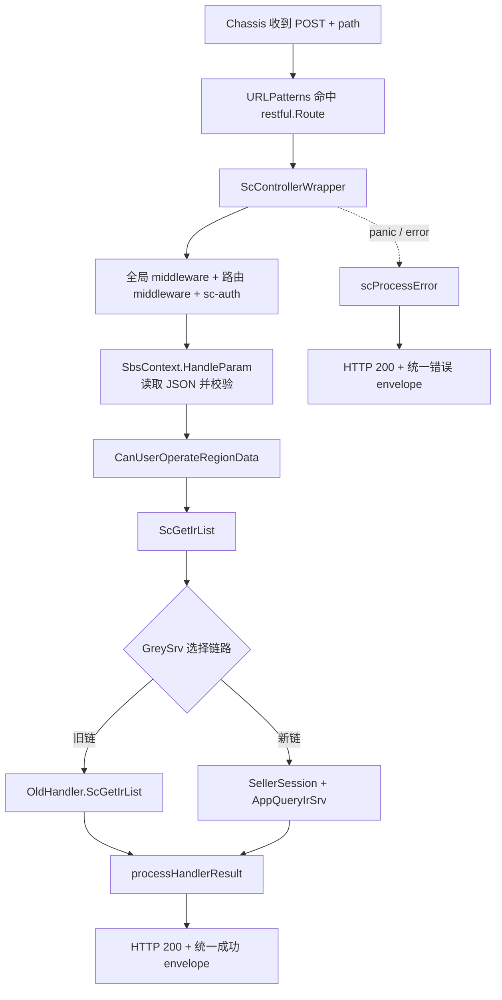

这张图解释了四个常见现象。第一，route 不匹配时 wrapper 和 handler 都不会执行。第二，鉴权或参数绑定失败时 handler 也不会执行。第三，handler 执行了不代表一定走新 application service，当前代码可能转给旧 handler。第四，前端看到 HTTP 200 不等于业务成功，因为 SC 错误也会被统一包装成 200 响应。

后续每读一段代码，都把它放回这张图，确认它的输入、输出和失败出口。否则很容易被 middleware 中大量外部错误类型淹没，忘记本次请求真正经过哪些关键节点。

## 路由是 method、path、请求原型与 handler 的汇合点

`apps/inbound/inbound/access/http/sc/urls.go` 中的核心条目是：

```go
func (s *FbsScInboundSchema) URLPatterns() []restful.Route {
    return []restful.Route{
        {
            Method: http.MethodPost,
            Path:   "/api/fbs/sc/inbound/request/list/",
            ResourceFunc: middleware.ScControllerWrapper(
                s.ScGetIrList,
                inbound.ScIrListReq{},
            ),
        },
    }
}
```

这是为教学换行后的等价片段。真实文件还注册了许多入库接口。对单条 route，先读四项：

| 项 | 当前值 | 它决定什么 |
| --- | --- | --- |
| Method | `POST` | 浏览器 method 必须匹配，也影响参数读取位置 |
| Path | `/api/fbs/sc/inbound/request/list/` | 完整路径及尾部斜杠 |
| 请求原型 | `inbound.ScIrListReq{}` | wrapper 要创建、绑定和校验的具体类型 |
| 业务函数 | `s.ScGetIrList` | 参数准备完成后调用的 controller handle |

`restful.Route` 属于当前 Chassis REST server API。课程不要求你掌握 Chassis 的全部注册机制，但要认识 `URLPatterns() []restful.Route` 是该 schema 暴露路由的入口。若新增接口只写 handler、不把 route 纳入实际 schema 聚合，代码可以编译，运行时却没有入口。

请求原型容易被忽略。这里传入的是值 `ScIrListReq{}`，wrapper 后续使用反射创建同类型的新值。它不是实际请求数据，也不是默认全局对象；它告诉统一绑定层“本路由期待什么 DTO”。因此修改 DTO 会同时影响绑定、校验、handler 的类型断言和接口契约。

排查 404 时先对照 route 的 method 与完整 path，再确认当前进程是否注册了这个 schema。不要因为仓库里搜索得到字符串就断言运行中的服务一定加载它。主服务同时存在 `app/` 与 `apps/`，旧新模块并存；同一 path 也可能在旧目录出现。运行时聚合和灰度选择比词面搜索更重要。

## `ScControllerWrapper` 为 handler 建立共同运行环境

`middleware/sc_controller_handle.go` 中，`ScControllerWrapper` 接收业务函数、请求原型和可选 handler 名称，返回 Chassis 需要的 `func(ctx *restful.Context)`。它做的事情可以分为外圈与内圈。

外圈负责一次 HTTP 调用的基础保护：登记 latency defer，初始化 log ID 并在结束时清理；用 `recover` 捕获 panic、打印运行栈，并把它转换为 `ErrPanic`；取得全局预设中间件链；组合当前路由的中间件，且默认加入 API block handler 与 `sc-auth`；最后让两条链包住真正的 REST 处理函数。

缩减后可以这样理解：

```go
func ScControllerWrapper(handle FbsControllerHandle, req any, names ...string) restfulHandler {
    names = AppendFirstHandler(APIBlockHandler, names...)
    return func(ctx *restful.Context) {
        defer recoverAsScError(ctx)
        global := GetFbsManager().GetPresetChain(ctx)
        current := fbsManager.use(append(names, "sc-auth")...)
        rest := func(ctx *restful.Context) {
            scRestfulFunc(ctx, handle, req)
        }
        global(current(rest))(ctx)
    }
}
```

这只是职责示意，不是可替换生产代码。真实实现还处理 latency 与 log ID。关键点是业务 handler 并非 Chassis 直接调用；它被多层函数包装。若认证中间件拒绝请求，`ScGetIrList` 没有日志是正常的。若 panic，被外圈 recover 后，客户端看到统一错误而不是连接直接断开。

中间件顺序也有语义。外层先执行前置逻辑，内层运行 handler，再按调用栈返回执行后置逻辑。调整组合顺序可能改变鉴权、日志、限流与错误捕获行为。业务需求通常不应修改这层；如果确实要加横切能力，必须列出所有消费者并做跨路由验证。

## `scRestfulFunc` 把框架 context 转成业务可用 context

wrapper 的内圈 `scRestfulFunc` 创建 `sbsctx.NewSbsContextImpl(ctx)`，然后依次执行参数处理、区域数据权限检查和业务 handler。成功时调用 `processHandlerResult`；失败时延迟调用 `scProcessError`。

其主线可以概括为：

```go
sbsCtx := sbsctx.NewSbsContextImpl(ctx)

finalErr = sbsCtx.HandleParam(reqParams)
if finalErr != nil {
    return
}

finalErr = userUtil.CanUserOperateRegionData(sbsCtx)
if finalErr != nil {
    return
}

handlerData, finalErr = handle(sbsCtx)
if finalErr != nil {
    return
}

processHandlerResult(ctx, handlerData)
```

真实代码还检查响应 header `Proxy-Response`。当它为 `YES` 时，说明代理路径已经处理响应，wrapper 不再重复写结果。这是又一个“handler 返回后页面为什么不是统一 envelope”的排查分支。

`SbsContext` 把三类对象放在一起：标准 `context.Context` 用于超时、取消和跨层元数据；原始 `*restful.Context` 用于读写 HTTP；已绑定的请求 struct 供 handler 获取。应用与领域层应优先接收标准 context，而不是让 Chassis HTTP 类型一路渗透到 repository。

这里还执行 `CanUserOperateRegionData`。因此 region 相关失败不一定来自 handler 查询条件，也可能在统一权限检查阶段发生。前端 wrapper 注入的 region/shop 上下文与后端中间件、会话、权限必须共同核验，不能只盯 body。

## 参数绑定：为什么 POST JSON 能变成 `ScIrListReq`

`middleware/sbsctx/context.go` 的 `HandleParam` 先检查请求原型是否为空，再通过 `reflect.TypeOf(reqParam)` 获得类型，创建新值并调用 `ReadParam`。读取成功后，根据是否跳过参数解析决定是否执行自定义 validator。

对当前 POST 路由，`ReadParam` 检查 Content-Type。如果包含 `application/json`，就用 `json.Decoder` 从 request body 解码；如果是 XML，则走 Chassis 的 `ReadEntity`；GET 请求则用 `ReadQueryEntity`。读取结束后，它把指针解引用，将值保存到 `s.reqStruct`。

这解释了 handler 中为什么可以写：

```go
req := ctx.GetReqStruct().(inbound.ScIrListReq)
```

类型断言在这里依赖 wrapper 的保证：route 传入 `inbound.ScIrListReq{}`，`HandleParam` 按这个具体类型创建和保存值，只有绑定与校验成功才调用 handler。若绕过 wrapper 直接在测试中构造 fake context，就必须提供同一具体类型；传 `*ScIrListReq` 或别的 struct 都会触发 panic。

还要注意当前兼容逻辑：非 GET 且 Content-Type 不是 JSON/XML 时，读取可能被标记为 skip，validator 也会跳过。此时请求 struct 仍可能是零值。不要把“body 看起来是 JSON”当作已绑定；浏览器必须发送正确 Content-Type。对新接口，是否接受其他内容类型要沿用当前路由同类模式，不能由 handler 靠猜测补救。

JSON 解码失败，例如数字字段收到不可转换字符串，会在 handler 前返回错误。`scProcessError` 对 `*json.UnmarshalTypeError` 有专门分支，转成 invalid param；validator 的 `ValidationErrors` 会翻译并标注错误分类。当前 `ScIrListReq` 的许多字段只有 JSON tag，没有 validation tag，所以“会运行 validator”不等于“分页、长度和枚举已被校验”。具体约束必须检查 DTO tag、application service 和领域逻辑，不能凭框架能力推断。

## DTO 是运行时契约，不只是字段集合

`apps/inbound/inbound/application/fbs_ir_entity.go` 的 `ScIrListReq` 包含分页、IR ID、状态、时间、仓库、SKU、运输方式、发票状态、来源等字段。节选如下：

```go
type ScIrListReq struct {
    PageNo        int      `json:"page_no"`
    Count         int      `json:"count"`
    IrID          string   `json:"ir_id"`
    StatusList    []int8   `json:"status_list"`
    WhsList       []string `json:"whs_list"`
    SellerSku     *string  `json:"seller_sku"`
    MtSkuIdList   []string `json:"-"`
    RequestSource *domainmodel.RequestSource `json:"request_source"`
}
```

这段代码展示四种契约语义。普通 `int`/`string` 无法区分“调用方没传”和“明确传零值”；指针字段可区分缺失与具体值；slice 要考虑 nil、空数组和非空数组；`json:"-"` 表示字段不接受前端直接注入，通常由服务内部补充。

以 `SellerSku *string` 为例，不传时是 nil，可以表示“不启用此过滤”；传空字符串则是非 nil 指针，是否等同不筛选要看后续 normalize/query 逻辑。前端上一章选择 trim 后为空就不发送，是为了减少含糊状态，但后端仍应考虑已有调用方可能发送空字符串。

`RequestSource` 也是指针，却由 handler 在缺失时补默认值。这说明默认值放置位置是契约设计的一部分：wrapper 只负责通用绑定，handler 负责当前入口的来源默认值，application service 收到的是已补齐的请求。若把默认值改到 DTO 构造或 repository，旧/新入口可能出现不一致。

修改 DTO 前要搜索三类消费者：同一类型被哪些 route 当作请求原型，哪些 handler/application 方法接收它，哪些 copier/映射与测试依赖字段。只改 JSON tag 可能破坏前端；只改 Go 字段名但保留 tag 可能不影响 wire format，却会影响所有 Go 调用点。

## handler 做入口编排，不承担所有业务

`ScGetIrList` 的真实顺序是：默认假设不用新链；如果 `GreySrv` 存在，调用 `GreyToNewByApiPath`；未选择新链时直接交给 `OldHandler.ScGetIrList`；选择新链后读取 Seller 信息；从 context 取 `ScIrListReq`；复制为 service request；缺失 `RequestSource` 时补 FBS 默认值；最后调用 `AppQueryIrSrv.GetScIrList`。

```go
func (s *FbsScInboundSchema) ScGetIrList(ctx sbsctx.SbsContext) (interface{}, error) {
    useNewChain := false
    if s.GreySrv != nil {
        var err error
        useNewChain, err = s.GreySrv.GreyToNewByApiPath(ctx, &oldinbound.ScIrListReq{})
        if err != nil {
            return nil, err
        }
    }
    if !useNewChain {
        return s.OldHandler.ScGetIrList(ctx)
    }

    sellerInfo, err := s.SellerSessionSrv.GetSellerInfo(ctx.GetRestfulContext())
    if err != nil {
        return nil, err
    }

    req := ctx.GetReqStruct().(inbound.ScIrListReq)
    var srvReq inbound.ScIrListReq
    if err := copier.Copy(&srvReq, &req); err != nil {
        return nil, err
    }
    if srvReq.RequestSource == nil {
        source := appdomainmodel.RequestSourceFBS
        srvReq.RequestSource = &source
    }
    return s.AppQueryIrSrv.GetScIrList(ctx.GetContext(), &srvReq, sellerInfo)
}
```

这段接近真实实现，只调整了局部变量展示。它体现 controller 的合理职责：选择入口链路、获取会话、把 HTTP DTO 转成 application request、补入口默认值、调用应用服务并透传结果/错误。真正的列表过滤、数据访问和领域规则不应继续堆在 handler。

`copier.Copy` 看起来像“自己复制给自己”，但它保留了入口 DTO 与 service request 可独立演进的空间；当前类型相同不代表永远相同。修改字段后，应验证 copier 是否能正确复制指针、嵌套结构与新类型。对关键字段，测试中直接断言传给 fake service 的值，比相信反射库更可靠。

## 旧链与新链并存意味着什么

当前代码事实不是“`apps/` 已完全替换 `app/`”，而是同一路由可通过 GreySrv 选择旧 handler 或新 application service。课程不讲发版操作，但开发者必须理解这种运行时分支，因为它直接影响需求正确性。

如果新增请求字段只在新 DTO/新 service 生效，而灰度规则仍可能走旧链，那么部分请求会忽略筛选或行为不同。你需要检查 GreySrv 使用的旧请求原型、旧 handler 的 DTO 与转换、两条链的响应结构，以及测试是否覆盖 `useNew=true/false`。不能用“我改的是新目录”作为忽略旧链的理由。

反过来，也不应为了兼容把所有新逻辑复制两份。先确认需求范围、当前链路策略和旧实现维护边界，再选择：两边都支持字段；入口统一 normalize 后两边消费；只在新链启用但给旧链明确兼容行为；或等待架构决策。课程练习只要求你发现分支并写出验证矩阵，不替团队做迁移决策。

用下面的四格表避免漏测：

| 链路 | 字段缺失 | 字段有值 |
| --- | --- | --- |
| 旧链 | 行为与改动前一致 | 明确支持、忽略或受控拒绝，不能未知 |
| 新链 | 行为与改动前一致 | application/query 正确消费并可验证 |

“字段缺失”是兼容性基线；“字段有值”是新能力。只有测新链有值，无法证明真实流量一致。

## 成功响应由统一层包装

handler 返回 `(data, nil)` 后，`processHandlerResult` 先记录 latency，再按 data 类型分支。文件与 PDF 有专门写法；普通数据调用 `response.OkResponse(data)` 并以 HTTP 200 写 JSON。前端因此通常看到 envelope，而不是裸 `ScIRListRsp`。

application 中的 `ScIRListRsp` 真实结构包含：

```go
type ScIRListRsp struct {
    Total  int64          `json:"total"`
    IrList []ScIrListInfo `json:"ir_list"`
}
```

它会作为统一响应中的 data。前端类型和解包逻辑必须区分 envelope 字段与业务数据字段。若 wrapper 已经返回 `data`，页面再访问一次 `.data` 会得到 undefined；若某个实例返回完整 response，页面直接读 `ir_list` 又会失败。联调时同时看 Network 原始 JSON 与 request wrapper 返回约定。

不要在每个 handler 手写 `ctx.JSON`。那会绕过统一格式、错误分类、监控和文件分支，还可能造成重复写响应。只有仓库已有明确特殊响应类型或代理路径时，才沿现有模式处理。

## 错误如何变成前端看到的 `retcode`

`scRestfulFunc` 保存 `finalErr`，延迟调用 `scProcessError`。后者先记录 path 与 error，再按具体错误类型转换。WMS、DATA、ISC、Retail、OMS、SCBS、SellerServices、SLS、FeatureToggle 等下游错误会映射为面向 Seller Center 的稳定错误；validator 错误会翻译；`HTTPError` 保留；JSON 类型错误变为 invalid param；未知错误报告监控事件并兜底为 `ErrUnknownType`。

最终写回：

```go
ctx.JSON(
    http.StatusOK,
    errcode.ErrorFormat(ctx.Ctx, returnErr, data, langID),
)
```

这就是前端必须区分 HTTP 成功与业务成功的直接代码证据。统一返回 HTTP 200 是当前 SC 接口约定，不应在单个 handler 私自改成另一种风格。若设计全新外部 API，需要按其所属边界和现有 wrapper 决定，不把 SC 约定推广到所有服务。

错误处理还有两个安全目的。第一，未知内部 error 不应原样暴露给 Seller；`ScControllerWrapper` 会用稳定未知错误兜底。第二，下游错误映射同时记录监控事件，服务端保留诊断证据，客户端获得可翻译信息。开发时不要为了“方便排错”把数据库错误、堆栈或请求凭据塞进 response。

panic 由 wrapper 最外层 recover，打印 stack 后也走 `scProcessError(..., ErrPanic)`。单元测试通过不代表没有 panic；对类型断言、nil service 和边界输入仍应设计测试，recover 是最后防线，不是正常控制流。

## 从一次失败反推所在层

下面四个症状看起来都像“接口失败”，检查路径完全不同。

### 404，handler 无日志

先核对 method、完整 path、尾部 `/`、代理目标和运行进程的 route 注册。不要先改 `ScGetIrList`，因为请求可能没有进入 wrapper。

### HTTP 200，`retcode` 表示参数错误

查看 Content-Type 与 request payload，确认数字、数组和枚举形态。JSON 类型错误发生在 handler 前；validator 错误也发生在 handler 前。用 request ID 查日志，区分 decode 与 validation。

### HTTP 200，未知业务错误，只在部分 Seller 出现

先确认是旧链还是新链，再查 Seller session、region 权限和下游错误映射。不要假设所有用户执行相同 application service。

### HTTP 200，服务端返回列表，页面仍为空

后端主链可能已经成功。检查 envelope、字段名 `ir_list`、前端 wrapper 解包、Store 写入和渲染条件。不要为了迁就页面把后端字段临时改成 `list`，除非契约正式变更并兼容所有消费者。

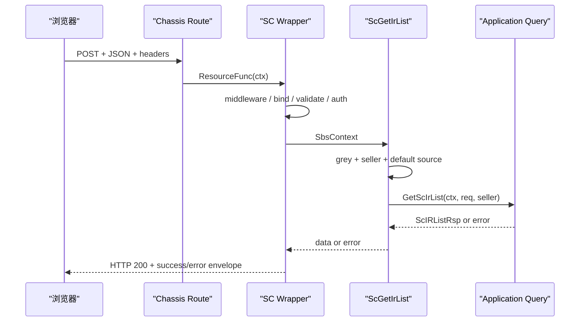

时序图里的每个箭头都能找到证据：Network 记录、route 条目、wrapper 日志、handler test、fake service 收到的 request、最终 response。诊断的目标是找到第一条不符合契约的箭头。

## 用现有 handler test 学会隔离入口编排

`apps/inbound/inbound/access/http/sc/handle_test.go` 已有 `TestScGetIrListUsesQueryServiceWhenGreyEnabled`。测试构造 `ScIrListReq`、Seller 信息、fake query service 和 `useNew=true` 的 fake GreySrv，然后直接调用 handler。它断言返回值、传给 query service 的分页/IR ID，以及缺失 `RequestSource` 时补上的 FBS 默认值。

这个测试没有启动 HTTP server，也没有执行真正的 wrapper。它验证的是 controller 编排：新链选择、Seller 传递、请求复制与默认值。速度快、失败定位清楚。对应地，参数绑定、Content-Type、middleware 顺序和统一 envelope 需要 wrapper/集成层测试或受控接口验证，不能声称一个 handler unit test 覆盖整条 HTTP 链。

测试 double 的类型也揭示接口边界。fake context 的 `GetReqStruct()` 必须返回值类型 `ScIrListReq`，fake query service 保存收到的指针，测试随后断言字段。新增字段时，最小可靠测试是把字段放进 input，调用 handler，再检查 fake service 收到同值；同时保留字段缺失用例，证明默认行为不变。

还应补旧链测试：`useNew=false` 时 query service 不应被调用，OldHandler 应接收请求。若旧 handler 很难替换，至少在影响分析中记录未覆盖项，不能把 new-chain test 写成“接口全链通过”。

## 受控练习：验证 `seller_sku` 契约穿过新链

前端练习准备发送可选 `seller_sku`。当前新链 DTO 已经有 `SellerSku *string`，所以后端任务不是盲目新增字段，而是证明它能从已绑定请求传给 application query，并识别旧链兼容风险。

### 第一步：做存在性审计

搜索 `SellerSku` 与 `seller_sku`，列出 DTO、转换、application request、query 条件和测试。区分 `json:"seller_sku"` 与仅 Go 内部字段。若 repository 已消费它，记录过滤方式；若没有，不要在报告中声称后端已经支持完整筛选。

### 第二步：补 handler 编排断言

在现有 new-chain test 的请求中加入：

```go
sellerSKU := "SKU-001"
req := inbound.ScIrListReq{
    PageNo:    3,
    Count:     30,
    SellerSku: &sellerSKU,
}
```

调用后断言 `query.scListReq.SellerSku` 非 nil 且值相等。再写一个 nil 用例，确认 handler 不会擅自创建空字符串指针。这里验证的是复制与传递，不要把测试名写成“filters database by seller sku”。

### 第三步：验证 HTTP 绑定

若仓库已有同类 route 测试设施，构造 `Content-Type: application/json` 的 POST body，执行 wrapper，验证 handler/fake service 收到指针值。再用错误类型，例如把 `seller_sku` 传成对象，确认 handler 不执行且返回统一参数错误。若当前测试环境无法低成本启动 Chassis，保留一条受控 test 环境联调记录，并明确 unit test 未覆盖绑定层。

### 第四步：检查旧链

打开 `app/inbound/inbound/access/schttp` 对应 DTO 和 handler，确认同名 JSON 字段及其 query 逻辑。若旧链不支持，写出实际行为和决策点，不自行删除灰度分支。至少保留“旧链 + 字段缺失”回归证据。

### 第五步：形成证据包

完成标准包括：method/path 契约卡；DTO 空值语义；new-chain handler test；绑定层验证或明确未覆盖；旧链影响说明；一条脱敏 request/response 记录；相关 Go test 命令与退出码。开发交接后遵循团队通用发版流程，本章不讲平台操作。

## 新增 Chassis HTTP 接口的最小工作顺序

真实需求未必只是改列表字段。需要新增同类 SC 接口时，可以按以下顺序工作。

1. 找一个同侧、同响应形态、同鉴权要求的近邻接口，读 route、DTO、handler、application 方法和测试，避免从空白复制过时样板。
2. 先写 method/path、请求字段、空值语义、响应 data 与错误语义；确认是否 JSON、文件或 PII。
3. 在 application/access 边界定义 DTO，使用明确 JSON tag；只有证据支持时才加 validation tag。
4. 在 `URLPatterns` 注册 route，选对 SC/FBS/OpenAPI wrapper 与请求原型。
5. handler 只做入口编排、会话/上下文获取、DTO 转换和应用服务调用，不把 SQL 与复杂规则写进去。
6. 为正常、绑定错误、业务错误和关键 nil/zero 边界准备测试；存在旧/新链时分别覆盖。
7. 用受控环境核对实际 request、统一 response、request ID 与日志，不把 handler unit test 当成 HTTP 全链证据。
8. 运行目标 package test，再按影响面选择更大范围的 test/build；记录未验证的下游与环境条件。

顺序的核心是先契约、后接线，再逐层验证。直接复制一个旧接口然后改到能编译，往往会带入错误 wrapper、旧 DTO 或不适用的权限链。

## 常见误区与修正方法

### 只搜索 URL，不看 method

同一路径在不同 method 下可以是不同 route。修正方法是把 method/path 作为不可分割的键，并核对前端 `params/data`。

### 在 handler 里重新解析 body

wrapper 已经绑定并校验，再读 body 可能得到 EOF，还会形成两套规则。修正方法是从 `SbsContext.GetReqStruct()` 获取 DTO；需要特殊内容类型时使用仓库已有专用模式。

### 认为 validation 一定检查了分页和枚举

只有 DTO tag 或显式逻辑存在才有约束。修正方法是逐字段查看 validation tag 和下游校验，给出实际反例测试。

### 把 type assertion panic 当作框架不稳定

route 与 wrapper 正常执行时具体类型有保证；直接单测 fake context 时最容易传错指针/值。修正方法是让 fake 与 route 原型一致，并保留 panic recover 只是最后防线的认识。

### 修改新链后宣称接口完成

GreySrv 可能仍选旧链。修正方法是至少覆盖四格兼容矩阵，明确字段在两条链的行为。

### 每个 handler 自己格式化错误

这会泄露内部 error、破坏翻译与前端统一处理。修正方法是返回稳定 error，让 SC wrapper 转换；只在已有边界明确要求时使用特殊响应。

### 用 Chassis r.8 文档覆盖 r.13 源码

文档能解释模块名，不能证明当前函数签名和兼容逻辑。修正方法是以 `go.mod`、当前 wrapper 源码和测试为事实，再用相近版本文档补概念。

### 把发布灰度与代码中的 GreySrv 混为一谈

本章只讨论请求运行时选择旧/新实现对开发正确性的影响，不教授发版 SOP。修正方法是在契约和测试中覆盖分支，不延伸到平台操作。

## 章末故障演练

为下面每个现象写出“第一证据、第二检查点、不要先做什么”。

1. 前端 POST 正确 URL，却返回 404，服务端 handler 没日志。
2. HTTP 200，业务码为 invalid param，payload 中 `count` 是字符串。
3. 同一 payload 对部分 Seller 生效、部分不生效。
4. new-chain unit test 通过，线上记录显示请求走 OldHandler。
5. handler 返回 `ScIRListRsp`，Network 有 `ir_list`，页面读取 `list`。
6. 新字段在 DTO 中存在，fake query service 收到 nil。
7. 测试直接传 `*ScIrListReq`，handler 在类型断言处 panic。
8. 文件导出接口被普通 JSON wrapper 包装，浏览器无法下载。

一个合格答案应把问题分别定位到 route 注册/进程、JSON 绑定、灰度分支、测试覆盖、响应契约、copier/映射、fake 类型和特殊响应分流。若八题都回答“查日志”，说明还没有把日志放回控制流。

## 章末自检

不看源码先回答，再用当前仓库验证：

1. `URLPatterns` 中为什么既要写请求原型又要写 handler？
2. `ScControllerWrapper` 的外圈与 `scRestfulFunc` 各负责什么？
3. POST JSON 在什么条件下被解析，何时可能跳过 validator？
4. handler 中的值类型断言为什么在正常 route 下成立，测试中又为什么容易失败？
5. `ScIrListReq` 的 `string`、`*string`、slice 和 `json:"-"` 分别表达什么边界？
6. `ScGetIrList` 为什么先判断 GreySrv，再取 Seller、复制 DTO 和补 RequestSource？
7. 成功和失败为什么都可能返回 HTTP 200，前端应怎样判断？
8. 一个 handler unit test 能证明什么，不能证明什么？
9. 新增可选筛选字段时，如何验证旧链、新链、缺失和值四种组合？
10. Chassis 文档与当前代码不一致时，你按什么顺序取证？

达到本章目标的标准不是能默写 wrapper，而是拿到一条 Network 记录后，能在十分钟内画出实际控制流，指出最可能的失败层，并设计最小验证，不跨层猜测。

## 本章小结

Chassis HTTP 接口的可读单位不是单个 handler，而是 route、controller wrapper、SbsContext、DTO、handler、application service 和统一 response 的组合。route 把 method/path、请求原型与业务函数连接起来；SC wrapper 建立中间件、日志、panic 保护、参数绑定、权限和错误转换；handler 负责入口编排；application 与下层实现业务查询。

当前入库列表还有旧/新链并存。任何契约改动都要证明缺失字段保持旧行为，并核对字段在两条链的消费方式。成功与错误都可能使用 HTTP 200 envelope，因此后端测试既要看 data，也要看错误格式；前端则必须检查业务码。

把本章与 FE-W05 合起来，你已经有了一条连续的开发地图：页面组织筛选 → API 函数确定 POST/body → request wrapper 拼前缀并注入上下文 → Chassis route 命中 → wrapper 绑定 DTO → handler 选择链路 → application 返回列表 → 统一 envelope → 前端解包和展示。后续学习分层、数据库和跨服务时，都应保留这条主线。

## 参考文献

- Go Documentation. [The Go Programming Language Specification: Struct types](https://go.dev/ref/spec#Struct_types). 访问于 2026-07-16。
- Go Packages. [`encoding/json`](https://pkg.go.dev/encoding/json). 访问于 2026-07-16。
- Go Packages. [`context`](https://pkg.go.dev/context). 访问于 2026-07-16。
- Go Blog. [The Go Blog: Defer, Panic, and Recover](https://go.dev/blog/defer-panic-and-recover). 2010-08-04。
- RFC Editor. [RFC 9110: HTTP Semantics](https://www.rfc-editor.org/rfc/rfc9110). 2022-06。
