# JavaScript 数据、类型与相等性：先读懂仓库判断分支

> 预计学习时间：90–130 分钟
> 一句话总结：从 FBS 前端的真实条件分支入手，理解 JavaScript 的数据类型、引用、空值、隐式转换与相等性规则，能够独立解释并修改仓库中的权限判断、路由守卫和状态筛选逻辑。

## 这一章解决什么问题

打开 FBS 任一前端仓库，你会看到大量条件判断：路由守卫里的 `to.route.name === 'fbsNoPermissions'`，权限检查中的 `permission.some(item => permissions.includes(item))`，错误处理中的 `if (data?.retcode !== 0)`。每一行都依赖 JavaScript 特有的类型规则和相等性行为。

后端同学转前端时，最常见的两类问题都与这些规则有关。第一，把 JavaScript 当成"去掉类型的 Java/C#"，忽略了隐式转换、`undefined` vs `null`、引用相等这些微妙但频繁出现的规则；第二，知道语法但读不懂代码为什么这样写，比如为什么用 `===` 而不是 `==`，为什么 `?.` 和 `??` 几乎出现在每一个页面组件里。

本章从 FBS 三个前端仓库的真实片段出发，先建立类型系统，再解释相等性规则，最后回到仓库阅读和修改条件分支。目标不是让你背完 ECMAScript 规范——而是让你在看到 `if (data?.retcode !== 0)` 时，能拆解出：`data` 可能是什么、`?.` 在什么情况下返回 `undefined`、`!==` 与 `!=` 的区别、`0` 在这里代表什么语义。

学完后你能做到三件事：解释四个真实判断片段的类型和结果；修复一个故意引入的空值边界问题；在看任何 FBS 页面代码时，不用猜一个表达式的结果会是什么。

> 本章示例来自 `fbs-sc-vue`、`fbs-frontend` 和 `fbs-sc-react` 三个仓库的 release 分支（2026-07-20）。代码行为可能随仓库演进；做实际需求时应重新打开当前工作树核验。

## 变量与基本类型：从权限判断片段出发

先看 `fbs-frontend/src/business/utils/permission.ts` 里的权限判断：

```javascript
export function hasPermission(permission) {
  const permissions = get(store.getState(), 'context.currentUser.permission_code_list', []);
  if (Array.isArray(permission)) {
    return permission.some(item => permissions.includes(item));
  }
  return permissions.includes(permission);
}
```

这段代码看起来简单，但后端同学要想明白每一层，至少需要理解：`const` 声明、数组、`Array.isArray` 返回值、`some` 和 `includes` 的布尔语义、以及函数没有写返回类型这件事本身的含义。我们逐层拆开。

### `const` 与 `let`：变量声明不携带运行时类型

JavaScript 用 `const` 和 `let` 声明变量。核心规则只有两条：`const` 声明的变量不能重新赋值；`let` 可以。两者都不限制修改变量指向的对象内部。

```javascript
const list = [];      // 不能再写 list = somethingElse
list.push('item');    // 但可以修改数组内容

let count = 0;
count = 1;            // let 允许重新赋值
```

在 FBS 代码中你几乎看不到 `var`。`var` 有函数作用域和变量提升等历史行为，三个 FBS 前端仓库通过 ESLint 或团队约定已经统一使用 `const`/`let`。作为惯例：默认用 `const`，只有确实需要重新赋值时改用 `let`。

`const` 不意味着"不可变"。`const permissions = []; permissions.push('code')` 完全合法。它限制的是变量名与值的绑定关系，而不是值本身。这个区别在后面讲到对象和数组时还会反复出现。

### 基本类型：值本身直接存储

JavaScript 有七种基本类型：`number`、`string`、`boolean`、`null`、`undefined`、`symbol`、`bigint`。后面两种在 FBS 前端仓库中极少出现，本章聚焦前五种。

基本类型变量直接保存值本身。赋值给另一个变量时，值被复制：

```javascript
let first = 10;
let second = first;
second = 20;
console.log(first);   // 10，不受 second 修改影响
```

`number` 是 IEEE 754 双精度浮点数。没有 int/float/double 的区分。`1` 和 `1.0` 是同一个值。

`string` 可以用单引号、双引号或反引号（模板字面量）。FBS 仓库中，JSX 属性习惯用双引号，普通字符串三种都有出现，模板字面量用于拼接变量：

```javascript
const path = `/portal/fbs/${module}`;  // 模板字面量嵌入变量
```

`boolean` 只有 `true` 和 `false`。注意 `'false'`（字符串）的布尔值是 `true`——这是一个高频陷阱，后面在 truthy/falsy 部分会详细讲。

### `typeof`：运行时类型检查

`typeof` 操作符返回类型的字符串表示。它有一些"反直觉"的结果，但记住核心几条就够用：

```javascript
typeof 42;           // 'number'
typeof 'hello';      // 'string'
typeof true;         // 'boolean'
typeof undefined;    // 'undefined'
typeof null;         // 'object' ← 历史遗留，记住即可
typeof [];           // 'object'
typeof {};           // 'object'
typeof (() => {});   // 'function'
```

`typeof null === 'object'` 是 JavaScript 最早版本的一个 bug，因为兼容性原因一直保留至今。判断 `null` 不能依赖 `typeof`，应该用 `value === null`。

对于数组，更可靠的方式是 `Array.isArray(value)`，正如上面权限代码中使用的那样。

## 对象、数组与引用：值被复制，引用也是

### 对象是引用类型

JavaScript 中，对象（包括普通对象 `{}`、数组 `[]`、函数、日期、正则等）都是引用类型。变量保存的是指向对象的**引用值**，而不是对象本身。

```javascript
const obj1 = { name: 'FBS' };
const obj2 = obj1;
obj2.name = 'Portal';
console.log(obj1.name);   // 'Portal' —— 两个变量指向同一个对象
```

赋值的规则没有变——`obj2 = obj1` 复制的仍然是值，只是这个值是引用值。结果就是两个变量指向同一个对象。这和 Java 中引用类型的行为类似，但 JavaScript 没有基本类型包装类的自动装箱/拆箱，对象字面量就是直接的对象值。

### 数组也是对象

```javascript
const list = ['a', 'b'];
const alias = list;
alias.push('c');
console.log(list);    // ['a', 'b', 'c']
console.log(list.length); // 3
```

数组在 JavaScript 中是一种特殊的对象。`typeof []` 返回 `'object'`，`Array.isArray` 专门用来区分数组和普通对象。数组有 `length` 属性、支持索引访问、有一组自己的方法（`push`、`filter`、`map`、`includes` 等），但这些都是在对象基础上的扩展。

### 不可变更新：为什么 React 要用展开运算符

三个 FBS 前端仓库都大量使用不可变更新模式。当你看到这样的代码：

```javascript
const nextState = { ...prevState, key: newValue };
const nextList = [...prevList, newItem];
```

它的作用是创建一个新对象或新数组，而不是修改原来的。React 依赖引用变化来判断是否需要重新渲染；Vue 3 虽然使用 Proxy 代理实现响应式，但展开运算符仍然是创建浅拷贝的标准方式。

注意是**浅**拷贝：

```javascript
const obj = { nested: { value: 1 } };
const copy = { ...obj };
copy.nested.value = 2;
console.log(obj.nested.value); // 2 —— 嵌套对象没有被复制
```

不可变更新的完整模式会在后续工程章节展开。这一章你只需要知道：`...` 创建的是浅拷贝，修改嵌套属性时仍然会影响原对象。

## 空值：`null`、`undefined` 与它们带来的防御性编程

### 两种空值的语义差异

JavaScript 有两种"空"值，它们的语义不同，但经常被混用：

- `undefined` 表示"不存在"或"未赋值"。变量声明但未初始化时是 `undefined`，对象访问不存在的属性时返回 `undefined`，函数没有 `return` 语句时返回 `undefined`。
- `null` 表示"有意为空"或"没有对象"。它通常由开发者显式赋值，表示一个变量目前不指向任何对象。

```javascript
let x;
console.log(x);              // undefined —— 声明但未赋值

const obj = {};
console.log(obj.nonexist);  // undefined —— 属性不存在

function noReturn() {}
console.log(noReturn());    // undefined —— 没有返回值

const manual = null;        // null —— 显式设置为空
```

在 FBS 代码中，两者通常不严格区分。API 返回数据中缺失的字段可能是 `null` 也可能是 `undefined`。重要的是统一使用安全的访问方式。

### 可选链 `?.`：不要在有 `null`/`undefined` 的地方深入访问

`?.` 是 FBS 前端代码中出现频率最高的操作符之一。它会在左值为 `null` 或 `undefined` 时短路并返回 `undefined`，而不是抛出 `TypeError`：

```javascript
const shopId = data?.shopInfo?.fbsShopId;
// 等价于：
// let temp = data === null || data === undefined ? undefined : data.shopInfo;
// temp = temp === null || temp === undefined ? undefined : temp.fbsShopId;
```

在之前看到的权限代码中，`permission.some(...)` 之所以能安全执行，是因为前面有 `Array.isArray(permission)` 的守卫。如果那段代码没有守卫而直接写 `permission?.some(item => ...)`，就能在 `permission` 为 `null`/`undefined` 时安全返回 `undefined` 而不是崩溃。

但 `?.` 返回 `undefined` 这件事本身值得注意。`undefined` 出现在条件判断中会被当作 `false`（见下一节 truthy/falsy），所以 `if (data?.retcode !== 0)` 中如果 `data` 是 `null`，表达式变成 `undefined !== 0`，结果是 `true`，会触发错误分支——这可能就是期望的行为（数据都没回来当然应该当作失败）。

### 空值合并 `??`：只在 `null`/`undefined` 时提供默认值

`??` 也称为 nullish coalescing。它和 `||` 的关键区别是：`??` 只在左值为 `null` 或 `undefined` 时取右值；`||` 在所有 falsy 值（`0`、`''`、`false`、`null`、`undefined`、`NaN`）上都取右值。

```javascript
const count = 0 || 10;       // 10 —— 0 是 falsy
const count2 = 0 ?? 10;      // 0 —— 0 不是 null/undefined

const name = '' || 'default';    // 'default'
const name2 = '' ?? 'default';   // ''
```

在 FBS 的分页和计数逻辑中，`??` 的正确使用很重要。如果一段代码写了 `pageSize || 20` 而有效的 `pageSize` 确实可能为 `0`，这个写法就会出错，必须改为 `pageSize ?? 20`。

## Truthy 与 Falsy：布尔上下文中的隐式转换

### 哪些值是 falsy

当 JavaScript 期望一个布尔值（如在 `if`、`while`、`&&`、`||`、`!` 中），非布尔值会被隐式转换为布尔。以下八个值是 falsy，其他所有值都是 truthy：

| Falsy 值 | 常见场景 |
| --- | --- |
| `false` | 布尔假 |
| `0`、`-0`、`0n` | 数值零 |
| `''`、`""`、` `` ` | 空字符串 |
| `null` | 显式空 |
| `undefined` | 未定义 |
| `NaN` | 非数值 |

### 在 FBS 页面判断中识别转换

回到 FBS 的路由守卫片段 `fbs-sc-vue/src/router/index.ts`：

```javascript
if (data.shopInfo.fbsTag) {
  // 卖家标签存在，进入正常流程
  if (!isCBSC && region === 'br' && data.shopInfo.lockByTax && to.route.name !== 'fbsTaxError') {
    return { path: '/portal/fbs/taxError' };
  }
}
```

`data.shopInfo.fbsTag` 本身是一个值。如果 `fbsTag` 不存在（`undefined`），条件分支的 `if (undefined)` 等同于 `if (false)`，不会进入。如果 `fbsTag` 是 `0` 或空字符串，也不会进入——但后端同学需要确认这个字段的实际类型：它是布尔值还是数字标签？如果是数字标签且可能为 `0`，那么 `0` 是 falsy 会导致逻辑错误，需要用更精确的判断如 `fbsTag !== undefined`。

再看权限判断中的 `Array.isArray(permission)`：如果 `permission` 是 `null` 或 `undefined`，`Array.isArray` 返回 `false`，条件分支不进入，函数走到最后的 `permissions.includes(permission)`——这行可能会因为 `permission` 为 `null`/`undefined` 而返回 `false`（`includes` 用 `SameValueZero` 比较，`null` 和 `undefined` 与普通值永不相等），不会崩溃。

### 显式转换：不要依赖隐式规则

虽然 JavaScript 允许隐式转换，FBS 代码中优先使用显式方式：

```javascript
// 推荐：显式判断
if (list && list.length > 0) { }
if (value !== null && value !== undefined) { }

// 避免：依赖隐式转换（虽然能跑，但意图不明确）
if (list.length) { }    // 0 是 falsy，意图是“非空列表”
if (!value) { }         // 太宽泛，0 和 '' 也会命中
```

## 相等性：`==`、`===` 与 `Object.is`

### `===` 是默认选择

`===`（严格相等）不进行类型转换。类型不同直接返回 `false`；类型相同再比较值或引用。

```javascript
1 === 1;         // true
'1' === 1;       // false —— 类型不同
null === null;   // true
undefined === undefined; // true
null === undefined;      // false
[] === [];       // false —— 两个不同的数组对象
```

在 FBS 三个前端仓库中，ESLint 配置禁止 `==`、强制使用 `===`。仓库中所有条件判断都用 `===` 和 `!==`。

### 对象和数组的比较是比较引用

这一点和 Java 的 `==` 行为一致：

```javascript
const a = [1, 2];
const b = [1, 2];
a === b;           // false —— 不同引用

const c = a;
a === c;           // true —— 同一引用
```

想要比较数组"内容是否相同"，通常需要逐个元素比较，或使用 `lodash.isEqual`。FBS 代码中如需要深度相等比较，会使用 lodash 的工具函数，不会直接用 `===` 比较两个数组或对象。

### `==` 的隐式转换规则（知道它会"努力让两边相同类型"即可）

你不需要背下 `==` 的全部转换规则。要知道的是：`null == undefined` 返回 `true`（这是 `==` 唯一被偶尔使用的场景）；其他情况一律使用 `===`。FBS 仓库的 ESLint 已经禁止 `==`，如果某处代码仍然使用了它，要么是故意的（需要团队 review），要么是历史遗留。

### `NaN` 的特殊性

`NaN` 是唯一一个不等于自身的值：

```javascript
NaN === NaN;       // false
Number.isNaN(NaN); // true —— 正确的 NaN 判断方式
```

在 FBS 的数值处理和表单校验中，如果后端接口可能返回非数值，前端通常会用 `isNaN` 或 `Number.isNaN` 做防御：

```javascript
if (Number.isNaN(parsedValue)) {
  // 处理非数值输入
}
```

## 在仓库中阅读条件判断：逐行拆解四个真实片段

### 片段一：权限检查

来源：`fbs-frontend/src/business/utils/permission.ts`

```javascript
export function hasPermission(permission) {
  const permissions = get(store.getState(), 'context.currentUser.permission_code_list', []);
  if (Array.isArray(permission)) {
    return permission.some(item => permissions.includes(item));
  }
  return permissions.includes(permission);
}
```

拆解：
- `const permissions` —— 从 Redux Store 中取出用户的权限码列表，`get`（lodash 的 `get`）的安全之处在于第三个参数 `[]`：如果路径中任何一层不存在，返回空数组而不是 `undefined`。
- `Array.isArray(permission)` —— 判断传入参数是单个权限码（字符串）还是多个权限码（数组）。这里不能依赖 truthy/falsy，因为字符串也可能是空字符串。
- `permission.some(item => permissions.includes(item))` —— 数组版本的逻辑：只要传入的任一权限码在用户权限列表中存在，就返回 `true`。`some` 找到一个匹配项就短路返回 `true`；全不匹配返回 `false`。
- `permissions.includes(permission)` —— 单权限码版本的逻辑：检查这个具体的权限码是否在用户列表中。

如果 `permission` 是 `null` 或 `undefined`，第一行 `Array.isArray` 返回 `false`，进入第二条路。`includes` 对 `null`/`undefined` 与权限码列表的比较不会匹配（权限码是字符串），所以返回 `false`。不会崩溃，但也不会有权限。

### 片段二：路由守卫中的条件链

来源：`fbs-sc-vue/src/router/index.ts`

```javascript
if (data.shopInfo.fbsTag) {
  if (!isCBSC && region === 'br' && data.shopInfo.lockByTax && to.route.name !== 'fbsTaxError') {
    return { path: '/portal/fbs/taxError' };
  }
}
```

拆解：
- `data.shopInfo.fbsTag` —— 隐式布尔转换。`undefined` 时为 `false`，不会进入。但如果 `fbsTag` 是数字 `0`，也会导致不进入——但根据上下文，`fbsTag` 在这里应为布尔值或非零数值，表示"卖家已打标"。
- `!isCBSC && region === 'br' && ...` —— 三个条件用 `&&` 串联。`&&` 是短路求值：只要左边为 `false`，右边不会执行。这里在 CBSC 条件下整个表达式不会进入锁税逻辑。
- `to.route.name !== 'fbsTaxError'` —— 如果当前已经在税务错误页，不重复跳转（避免死循环）。`!==` 是严格不等，没有类型转换。

### 片段三：API 响应错误判断

来源：`fbs-sc-vue/src/utils/request.js`

```javascript
if (notBlob && data?.retcode !== 0 && !config.__hiddenErrorMessage) {
  commonHandleAPIError(data);
}
```

拆解：
- `data?.retcode` —— 可选链。如果 `data` 为 `null` 或 `undefined`，整个表达式求值为 `undefined`。
- `data?.retcode !== 0` —— 注意这里：如果 `data` 是 `null`/`undefined`，`undefined !== 0` 是 `true`。这意味着数据完全缺失时也会触发错误处理——这通常是期望的行为。
- `!config.__hiddenErrorMessage` —— 逻辑非。某些场景下（比如静默预加载数据）前端不希望弹出 toast，会传入 `hiddenErrorMessage: false`。

假设 `data` 正常返回，`retcode` 为 `0` 表示业务成功。不为 `0` 就进入错误处理。这段逻辑的前提是 HTTP 状态码层面已经成功（200），只是业务返回码表示失败——这正是 `unpackData: false` 配置的设计意图。如果 HTTP 层就已经失败（如 500），会被 response interceptor 的 `error` 回调捕获，不会走到这里。

### 片段四：路由守卫中判断 VPI 管理权限

来源：`fbs-sc-vue/src/router/index.ts`

```javascript
if (vpiRouteNames.includes(to.route.name) && !data?.shopInfo?.allowVpiManagement) {
  return { path: '/portal/fbs/product/approved' };
}
```

拆解：
- `vpiRouteNames.includes(to.route.name)` —— `vpiRouteNames` 是预定义的数组：`['fbsVirtualBundlesList', 'fbsVirtualBundlesCreate', 'fbsVirtualBundlesEdit']`。`includes` 检查当前路由是否属于这三个 VPI 管理页面。
- `!data?.shopInfo?.allowVpiManagement` —— 双重可选链。如果 `data` 或 `shopInfo` 为 `null`/`undefined`，表达式结果为 `undefined`，`!undefined` 为 `true`，意味着"没有权限信息就当作没权限"，重定向到商品列表页。这是一种安全的默认拒绝策略。

## 常见错误与修正

### 把 `0` 或空字符串当作"没有值"

```javascript
// 错误：0 是合法的库存数，但 0 || default 会忽略它
const stock = response.stock || 999;
// 正确：
const stock = response.stock ?? 999;
```

### 忘记 `?.` 只短路 `null`/`undefined`

```javascript
// data 是空字符串 '' 时，data?.length 返回 0 而不是 undefined
// 如果后续依赖 undefined 来判断"数据不存在"，就会出错
const length = data?.length; // ''?.length = 0！
```

### `===` 比较数组和对象

```javascript
const permissions = ['a', 'b'];
permissions === ['a', 'b']; // false —— 不同引用
// 应使用：
permissions[0] === 'a' && permissions[1] === 'b'; // 或 .every()
```

### `typeof null === 'object'`

```javascript
// 错误：这个判断无法区分 null 和普通对象
if (typeof value === 'object') { /* ... */ }
// 正确：
if (value !== null && typeof value === 'object') { /* ... */ }
```

## 练习

### 预测输出

不运行代码，写出每一行的输出并解释原因。

```javascript
// 练习 A：基本类型与引用
const a = { count: 1 };
const b = a;
b.count = 2;
const c = 1;
let d = c;
d = 3;
console.log(a.count);  // ?
console.log(c);        // ?

// 练习 B：空值与相等性
const x = undefined;
const y = null;
console.log(x == y);   // ?
console.log(x === y);  // ?
console.log(x ?? 'fallback');   // ?
console.log(y ?? 'fallback');   // ?

// 练习 C：可选链与 truthy
const data = { shopInfo: { fbsTag: 0 } };
console.log(data?.shopInfo?.fbsTag !== undefined);  // ?
if (data?.shopInfo?.fbsTag) {
  console.log('进入分支');
} else {
  console.log('不进入');  // ?
}
```

### 修复空值边界

以下代码来自一个假想的 FBS 商品列表筛选组件。找出所有可能因空值而崩溃或行为不符合预期的地方，并修复：

```javascript
function getFilteredProducts(products, filter) {
  const result = [];
  for (let i = 0; i < products.length; i++) {
    const product = products[i];
    if (filter.status === product.status) {
      if (product.name.includes(filter.keyword)) {
        result.push(product);
      }
    }
  }
  return result;
}
```

修复提示：`products` 可能为 `null`，`filter` 可能为 `null`，`filter.status` 可能为 `undefined`，`filter.keyword` 可能为空字符串，`product.name` 可能为 `null`。

### 判断仓库片段

打开你本地 `fbs-sc-vue` 仓库，找到 `src/views/inbound/IBT/detail/index.vue` 中 `v-if` 或 `v-show` 指令。选一个包含 `?.`、`!==` 或 `&&` 的判断表达式，解释：
- 这个表达式在什么条件下渲染对应元素
- 如果数据的每一层都为 `null`，最终行为是什么
- 如果修改一个条件（如把 `!==` 改成 `!=`），行为会有什么变化

### 参考答案

**8.1 A**: `a.count` 输出 `2`（`a` 和 `b` 指向同一个对象）。`c` 输出 `1`（基本类型赋值是复制，`d` 的修改不影响 `c`）。

**8.1 B**: `x == y` 为 `true`（宽松相等中 `null == undefined`）。`x === y` 为 `false`（严格相等中类型不同）。`x ?? 'fallback'` 为 `'fallback'`（`undefined` 触发 `??`）。`y ?? 'fallback'` 也为 `'fallback'`（`null` 同样触发 `??`）。

**8.1 C**: `data?.shopInfo?.fbsTag !== undefined` 为 `true`（`fbsTag` 是 `0`，不等于 `undefined`）。`if (data?.shopInfo?.fbsTag)` 中 `0` 是 falsy，不进入分支，输出 `'不进入'`。这正是前面提到的：数字型标签为 `0` 时不能用 truthy 判断，需要用 `!== undefined` 或明确的值比较。

## 参考文献

- [ECMAScript Language Specification — Types](https://tc39.es/ecma262/#sec-ecmascript-data-types-and-values) — JavaScript 类型系统的规范定义
- [MDN JavaScript Guide — Grammar and types](https://developer.mozilla.org/en-US/docs/Web/JavaScript/Guide/Grammar_and_types) — 变量声明、类型与字面量
- [MDN Equality comparisons and sameness](https://developer.mozilla.org/en-US/docs/Web/JavaScript/Equality_comparisons_and_sameness) — `==`、`===` 与 `Object.is` 的完整对比
- [MDN Optional chaining](https://developer.mozilla.org/en-US/docs/Web/JavaScript/Reference/Operators/Optional_chaining) — `?.` 操作符
- [MDN Nullish coalescing operator](https://developer.mozilla.org/en-US/docs/Web/JavaScript/Reference/Operators/Nullish_coalescing) — `??` 操作符
- [MDN Truthy](https://developer.mozilla.org/en-US/docs/Glossary/Truthy) — truthy 与 falsy 的完整列表


---

# 函数、作用域、闭包与模块：跟上组件外的调用链

> 预计学习时间：100–140 分钟
> 一句话总结：理解 JavaScript 函数是一等值、词法作用域决定变量可见性、闭包捕获外部变量、ES Module 组织代码边界——从 FBS 的 API 工厂函数、Vuex action 和 React hook 中读懂组件外的调用链。

## 这一章解决什么问题

后端同学看前端代码时，经常低估函数本身的复杂度。在 Java 或 Go 中，函数（方法）有固定签名、不支持嵌套定义、没有闭包概念。但在 JavaScript 中，函数是一等值——可以赋值给变量、作为参数传递、从函数中返回、在任何地方创建。更关键的是，FBS 前端代码广泛使用函数来"制造"其他函数：`createApi` 接收 method 和 url，返回一个能发请求的函数；Vuex action 是一个函数，内部通过 `dispatch` 调用另一个 action；React hook 用闭包捕获组件的状态引用。

这一章不教你怎么用 React hooks 写完整组件，而是帮你建立读懂这一类代码的语言基础。学完后你会拿到三把钥匙：能拆解箭头函数和普通函数的差异，能画出闭包捕获外部变量的作用域图，能理解 `import/export` 如何把代码组织成模块边界。

> 示例来自三个前端仓库的 release 分支（2026-07-20）。实际开发时以当前工作树为准。

## 函数的三种写法：声明、表达式与箭头

### 函数声明：有名字，会提升

```javascript
function getRequestList(data) {
  return request({ url: '/inbound/request/list/', method: 'POST', data });
}
```

这是 FBS 代码中最传统的形式。`function` 关键字声明的函数会被"提升"：在当前作用域的任何位置都可以调用它，即使调用写在声明之前。但依赖提升会使代码阅读顺序混乱，现代 FBS 代码较少使用。

### 函数表达式：函数是值

```javascript
const handleErrorMsg = function(response) {
  const { error } = response;
  if (!error) {
    const { data = {} } = response;
    if (data?.retcode !== 0) {
      commonHandleAPIError(data);
    }
  }
  return response;
};
```

函数表达式把函数当作值赋给变量。它不会提升——必须先定义再使用。在 FBS 的 `request.js` 中，response interceptor 的回调就是典型的函数表达式。

### 箭头函数：简洁，没有自己的 `this`

```javascript
export const getRequestList = (data = {}) => request({
  url: '/inbound/request/list/',
  method: 'POST',
  data,
});
```

箭头函数在 FBS 代码中占绝大多数。它的几个特点：

- 省略 `function` 关键字，`=>` 左边是参数，右边是函数体。
- 如果函数体只有一条表达式，可以省略 `{}` 和 `return`（隐式返回）。
- 如果只有一个参数，可以省略参数括号。
- **没有自己的 `this`**——箭头函数里的 `this` 来自定义它的外层作用域。在 FBS 的 Vue 组件和 React 类组件中，这一点决定了很多回调的写法。

对比以下两种写法：

```javascript
// 普通函数：this 取决于调用方式
const obj = {
  name: 'FBS',
  sayName: function() { console.log(this.name); }
};
obj.sayName(); // 'FBS'

// 箭头函数：this 来自外层作用域（此处为全局/模块作用域）
const obj2 = {
  name: 'FBS',
  sayName: () => { console.log(this.name); }
};
obj2.sayName(); // undefined —— this 指向外层，不是 obj2
```

在 FBS 代码中，Vue 组件的 `methods` 和 React 类组件的实例方法不能用箭头函数定义，因为需要 `this` 指向当前组件实例。但作为回调传给 `map`、`filter`、`some` 等数组方法时，箭头函数因其简洁和词法 `this` 而成为标准写法。

## 参数：默认值、解构与 rest

### 默认参数

```javascript
function getRequestList(data = {}) {
  // 如果调用时不传 data 或传 undefined，data 的值为 {}
}
```

默认参数在 FBS 的 API 函数中几乎无处不在。`(data = {})` 确保即使调用方忘记传参数，函数内部也不会因为访问 `data.xxx` 而崩溃。

默认参数只在实参为 `undefined` 时生效。传入 `null` 不会触发默认值：

```javascript
getRequestList(null);  // data 是 null，不是 {}
```

### 解构参数

```javascript
// 从对象参数中提取特定字段
const handleErrorMsg = (response) => {
  const { error, data = {}, config = {} } = response;
  // 等价于：
  // const error = response.error;
  // const data = response.data !== undefined ? response.data : {};
};
```

解构配合默认值是 FBS 代码的常见模式。它比逐行 `.` 访问更紧凑，并且可以在一行内为缺失的属性提供默认值。

更深层的解构也常见：

```javascript
const getCurrentShop = () => {
  return app.vue3VuexStore.getters['FBS_STORE/Shop/currentShop'];
};
const { fbsWhsRegion, fbsShopId } = getCurrentShop();
```

### Rest 参数 `...`

```javascript
function logAll(prefix, ...args) {
  console.log(prefix, ...args);  // args 是真正的数组，包含剩余所有参数
}
```

`...` 在函数参数位置收集剩余参数为一个真正的数组。FBS 代码中常用于包装函数的参数转发。

注意区分 `...` 的三种用法：在参数位置是 rest（收集），在数组/对象字面量中是 spread（展开），在函数调用中是 spread（展开参数）。

## 函数是一等值：回调、高阶函数与工厂

### 函数可以作为参数传递

这是 FBS 代码中最常见的函数使用模式之一——回调：

```javascript
[request, piiRequest, blobRequest].forEach(itemRequest => {
  itemRequest.interceptors.request.use(function(config) {
    config.headers['lang-id'] = app.user.language;
    return config;
  });
});
```

`forEach` 接收一个函数作为参数，用它处理数组中的每个元素。`interceptors.request.use` 同样接收一个函数——这里就是回调模式。理解回调的关键是：调用它的代码（Axios 拦截器）决定何时调用以及传什么参数；你只需要定义被调用时的行为。

### 高阶函数：返回函数的函数

Portal 仓库的 `createApi` 是 FBS 代码中最高阶的函数模式之一：

```javascript
export const createApi = (method, url, configs) => {
  return (params, configParams = {}) => {
    const requestFn = request[lowerCase(method)];
    const requestParams = getRequestParams(method, params);
    // ...返回 requestFn(url, ...)
  };
};
```

`createApi` 接收 method、url 和 configs，返回一个新的函数。这个返回的函数"记住"了 method 和 url——这就是闭包（下一节详解）。调用方只需要传入 params 就能发起请求：

```javascript
const apiGetConfigInfo = createApi('GET', '/portal/inbound/config/get');
// apiGetConfigInfo 现在是 (params) => request.get('/portal/inbound/config/get', { params })
```

高阶函数在 FBS 中的价值是消除重复。不用在每个 API 定义里重复写 method 判断、参数位置选择、请求实例选择等逻辑。`createApi` 把"如何创建 API 调用"封装为函数工厂，每个具体的 API 定义只需传入差异化的三个参数。

### 箭头函数的隐式返回

```javascript
// 有花括号：需要显式 return
const fn1 = (x) => { return x * 2; };

// 无花括号：隐式返回表达式结果
const fn2 = (x) => x * 2;

// 返回对象字面量时需要加括号，否则花括号被解析为函数体
const fn3 = (x) => ({ value: x });  // 正确
const fn4 = (x) => { value: x };    // 错误：value 被当作 label 语句
```

## 词法作用域与闭包

### 作用域决定变量在哪里可见

JavaScript 使用词法（静态）作用域：变量的可见性由代码写在哪里决定，不由运行时调用栈决定。

```javascript
const baseURL = '/api/fbs/sc';  // 模块作用域

export const request = app.request.clone({ baseURL });

[request, piiRequest].forEach(itemRequest => {
  itemRequest.interceptors.request.use(function(config) {
    config.headers['fbs-sc-source'] = getFbsScSource(); // getFbsScSource 来自模块作用域
    return config;
  });
});
```

变量查找顺序：当前函数作用域 → 外层函数作用域 → ... → 模块作用域 → 全局作用域。`request.js` 中的拦截器函数内部可以访问 `app`、`getFbsScSource`、`utils` 等所有模块顶层的变量——不是因为有特殊语法，而是因为它们都在外层作用域中声明。

### 闭包：函数记住它被创建时的作用域

闭包是 JavaScript 中最强大的特性之一。简单来说：一个函数内部定义的函数，可以访问外部函数的变量，即使外部函数已经返回。

从 Portal 的 `createApi` 中提取一个最小模型：

```javascript
function createMultiplier(factor) {
  return function(number) {
    return number * factor;  // factor 被"捕获"了
  };
}

const double = createMultiplier(2);
const triple = createMultiplier(3);
console.log(double(5));  // 10 —— factor=2 的闭包仍在工作
console.log(triple(5));  // 15 —— factor=3 的闭包独立存在
```

`createMultiplier(2)` 返回了一个新函数。当这个返回的函数在别处被调用时，它仍然能访问 `factor`——尽管 `createMultiplier` 的调用早已结束。这是因为 JavaScript 函数在创建时会捕获整个外层作用域链，不是捕获那一刻的变量值。

以下图表示 `double` 被调用时的作用域链：

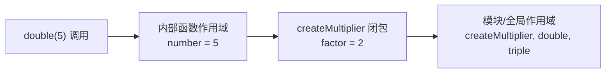

### 闭包在 FBS 中的实际应用

**API 工厂**：`createApi('GET', url)` 返回的函数闭包捕获了 `method` 和 `url`。这就是为什么 `apiGetConfigInfo(params)` 不用每次都传 method 和 url——它们已经"封存"在闭包里了。

**Vuex action**：action 函数通过闭包访问 `commit`、`dispatch`、`state` 等参数，不需要每次调用都传入：

```javascript
// 简化自 FBS Vuex action 模式
async function fetchInboundList({ commit, state }, params) {
  commit('SET_LOADING', true);
  const data = await getRequestList({ ...state.filter, ...params });
  commit('SET_LIST', data);
  commit('SET_LOADING', false);
}
```

**React hook**：`useState` 和 `useEffect` 依赖闭包保持对组件状态的引用：

```javascript
function InboundPage() {
  const [list, setList] = useState([]);
  useEffect(() => {
    getRequestList({ status: 'PENDING' }).then(data => setList(data));
  }, []); // 空依赖数组意味着只在组件挂载时执行一次
  // useEffect 的回调闭包捕获了 setList
}
```

### 闭包常见陷阱：循环中的 `var`

FBS 代码中使用 `const`/`let`，已经避免了经典闭包陷阱。但如果看到旧的 ES5 代码用 `var` 在循环中创建函数，要注意：

```javascript
// 陷阱（旧代码中可能出现）
for (var i = 0; i < 3; i++) {
  setTimeout(function() { console.log(i); }, 100);
}
// 输出：3, 3, 3 —— 所有回调共享同一个 i

// 现代修复：用 let
for (let i = 0; i < 3; i++) {
  setTimeout(() => console.log(i), 100);
}
// 输出：0, 1, 2 —— 每次迭代有独立的 i
```

`let` 在 `for` 循环头中会为每次迭代创建新的绑定，所以每个回调捕获的是各自的 `i` 值。这是 `let` 与 `var` 在作用域上的关键差异。

## ES Module：导出与导入

### 默认导出与具名导出

三个 FBS 前端仓库统一使用 ES Module（`import`/`export`）组织代码。一个模块可以有两种导出：

```javascript
// fbs-sc-vue/src/api/inbound.js
import { request } from '../utils/request'; // 具名导入

export function getRequestList(data = {}) {   // 具名导出
  return request({ url: '/inbound/request/list/', method: 'POST', data });
}

export default function setupInbound() {       // 默认导出（每个模块最多一个）
  // ...
}
```

对应的导入：

```javascript
import setupInbound, { getRequestList } from './inbound';
//     ↑ 默认导入       ↑ 具名导入（解构语法）
```

### 模块的"静态"特性

ES Module 的导入导出在代码执行前就已经确定。这带来了两个重要后果：

第一，`import` 语句不能放在条件分支或函数内部。`import()` 动态导入可以，但返回的是 Promise。

第二，导出的是"活绑定"——导入方看到的是导出方的最新值，不是快照。这个特性在 FBS 中主要用于 Vuex Store 模块和常量导出。

```javascript
// constants.js
export let count = 0;
export function increment() { count++; }

// main.js
import { count, increment } from './constants.js';
console.log(count); // 0
increment();
console.log(count); // 1 —— 看到了最新值
```

### 重命名导入

```javascript
import { request as scRequest } from './sc-request';
import { request as portalRequest } from './portal-request';
```

FBS 代码中重命名主要用于避免命名冲突。如 `utils/request.js` 导出的 `request` 与组件内部定义的 `request` 不同时。

### 聚合导出（barrel export）

FBS 代码常用 barrel export 简化导入路径：

```javascript
// src/api/index.js
export { getRequestList, getPickupInfo } from './inbound';
export { getProductList } from './product';
```

使用方只需：

```javascript
import { getRequestList, getProductList } from '../api';
```

这在 Portal 的 `src/apis/` 和 Vue 的 `src/api/` 中很常见。

## 在仓库中阅读函数调用链

### 六.1 从 `getRequestList` 向外追踪

以 SC Vue 入库列表为例，函数调用链如下：

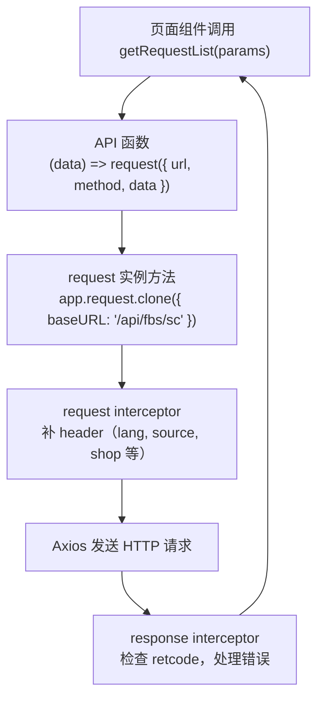

每一步的"函数作为值被传递"：

- 步骤 A→B：页面把 params 传给 API 函数。
- 步骤 B→C：API 函数内部调用了 `request({...})`——这里 `request` 是一个被宿主包装过的 Axios 实例，本质上也源自函数调用。
- 步骤 C→D：request interceptor 是在 `forEach` 循环中注册的回调函数，它通过闭包访问 `app`、`getFbsScSource` 等模块级变量。
- 步骤 E→F：response interceptor 同样是注册的回调，处理 Axios 返回的 response 对象。

### 六.2 Portal 的 `createApi` 工厂链

从 Portal 的 `src/apis/inbound.ts` 阅读：

```javascript
export const apiGetConfigInfo = createApi('GET', '/portal/inbound/config/get');
```

理解这一行需要拆解两次闭包：

1. `createApi('GET', '/portal/inbound/config/get')` 在模块加载时执行，返回 `(params) => request.get('/portal/inbound/config/get', { params })`。
2. 页面调用 `apiGetConfigInfo({ region: 'br' })` 时，这个返回的函数执行，method 和 url 来自闭包。

这就是为什么一个两行的 API 定义能包含 method 选择、参数位置适配、请求实例选择等全套逻辑——工厂函数通过闭包把复杂逻辑封装了一次，每个 API 定义只暴露差异。

## 常见错误与修正

### 箭头函数的隐式返回导致对象字面量语法错误

```javascript
// 错误：花括号被解析为函数体
const createConfig = (base) => { baseURL: base };
// createConfig('/api') 返回 undefined

// 正确：用括号包裹对象字面量
const createConfig = (base) => ({ baseURL: base });
```

### 忘记闭包捕获的是变量引用而非快照

```javascript
function createCounters() {
  const result = [];
  for (var i = 0; i < 3; i++) {
    result.push(() => i);
  }
  return result;
}
const counters = createCounters();
console.log(counters[0]()); // 3，不是 0！
```

现代写法用 `let` 或 `forEach` 替代 `var` + `for` 循环可以避免。

### `this` 在回调中丢失

```javascript
class RequestManager {
  constructor() { this.baseURL = '/api'; }
  setup() {
    // 错误：普通函数中 this 取决于调用方式
    setTimeout(function() { console.log(this.baseURL); }, 100);
    // 正确：箭头函数保持 this
    setTimeout(() => { console.log(this.baseURL); }, 100);
  }
}
```

FBS 的 React 类组件中如果使用了传统类写法，需要特别注意这一点。好消息是三个 FBS 前端仓库都在向函数组件 + hooks 迁移。

### 模块导入未使用的变量

ES Module 的静态特性意味着构建工具（Webpack、Rspack）可以做 tree-shaking——移除未被使用的导出。但要注意副作用导入：

```javascript
import './init';  // 只执行模块的顶层代码，不导入任何值
```

这种写法在 FBS 代码中用于注册全局拦截器、初始化监控等场景。删除这类导入时要确认模块的副作用确实是需要的。

## 练习

### 作用域图

画出以下代码执行到 `console.log(url)` 时，所有变量的作用域链和可见性：

```javascript
// request.js
const baseURL = '/api/fbs/sc';
function createRequest() {
  const instanceId = Math.random();
  return function(config) {
    const fullURL = baseURL + config.url;
    console.log(fullURL, instanceId);
  };
}
const request = createRequest();
request({ url: '/inbound/list/' });
```

### 闭包改写

将以下重复代码改写为一个工厂函数，用闭包消除重复：

```javascript
const getInboundList = (params) => request({ url: '/inbound/list/', method: 'GET', params });
const getProductList = (params) => request({ url: '/product/list/', method: 'GET', params });
const getShopList = (params) => request({ url: '/shop/list/', method: 'GET', params });
```

### 预测 `this`

```javascript
const handler = {
  name: 'inbound',
  fetch: function() { console.log(this.name); },
  fetchArrow: () => { console.log(this.name); }
};

handler.fetch();          // ?
const f = handler.fetch;
f();                      // ?
handler.fetchArrow();     // ?
```

### 参考答案

**8.1** `fullURL` 在当前匿名函数作用域，`baseURL` 来自模块作用域（闭包捕获），`instanceId` 来自 `createRequest` 函数作用域（闭包捕获），`config.url` 来自参数。所有闭包变量在 `createRequest()` 返回后仍可访问。

**8.2** 参考实现：
```javascript
const createGetApi = (url) => (params) => request({ url, method: 'GET', params });
const getInboundList = createGetApi('/inbound/list/');
const getProductList = createGetApi('/product/list/');
const getShopList = createGetApi('/shop/list/');
```

**8.3** `handler.fetch()` 输出 `'inbound'`（方法调用，`this` 指向 `handler`）。`f()` 输出 `undefined`（普通函数调用，`this` 在非严格模式下指向全局对象，在严格模式和模块中为 `undefined`）。`handler.fetchArrow()` 输出 `undefined`（箭头函数的 `this` 来自定义时的外层作用域，即模块作用域）。

## 参考文献

- [MDN Functions Guide](https://developer.mozilla.org/en-US/docs/Web/JavaScript/Guide/Functions) — 函数声明、表达式、参数与闭包
- [MDN Arrow function expressions](https://developer.mozilla.org/en-US/docs/Web/JavaScript/Reference/Functions/Arrow_functions) — 箭头函数的语法与 `this` 行为
- [MDN import](https://developer.mozilla.org/en-US/docs/Web/JavaScript/Reference/Statements/import) — ES Module 导入语法
- [MDN export](https://developer.mozilla.org/en-US/docs/Web/JavaScript/Reference/Statements/export) — ES Module 导出语法
- [MDN Closures](https://developer.mozilla.org/en-US/docs/Web/JavaScript/Closures) — 闭包概念与示例
- [ECMAScript Specification — Function Objects](https://tc39.es/ecma262/#sec-terms-and-definitions-function) — 函数的规范定义


---

# Promise、async/await 与事件循环：读懂请求和页面副作用

> 预计学习时间：110–150 分钟
> 一句话总结：理解 Promise 的状态、`await` 的暂停语义、微任务执行顺序和错误传播——能读懂 FBS 页面中任何异步请求、数据初始化和并发组合，并能修复常见的漏 `await` 和漏错误处理问题。

## 这一章解决什么问题

后端同学对"异步"并不陌生。Go 有 goroutine + channel，Java 有线程池 + Future。但 JavaScript 的异步模型和他们都不一样：单线程、事件循环、Promise 链、`async`/`await` 只是语法糖、`Promise.all` 的失败即停行为……这些规则组合在一起，常常让第一次读到 FBS 页面代码的后端研发掉进同一个坑——以为 `await` 后面一定能拿到值，以为代码顺序就是执行顺序，忘了 `.catch` 或 `try/catch`。

本章从 FBS 的真实异步调用出发：API 请求、页面初始化 action、远端组件加载、并发导出等。你会先看懂一个请求从发起到 UI 更新的完整链路，然后理解事件循环如何调度"网络回来的数据"和"用户点击的按钮"之间的先后顺序。学完后你会发现，之前觉得"神秘"的 loading 状态切换、错误 toast 弹出时机、同时发多个请求的最佳写法，背后全是同一套规则在工作。

> 示例来自三个前端仓库的 release 分支（2026-07-20）。实际开发时以当前工作树为准。

## Promise：一个可能还未完成的值

### Promise 有三种状态

JavaScript 的 Promise 表示一个异步操作的最终结果。它只能是三种状态之一：

- **pending**：操作还在进行中，结果未知。
- **fulfilled**：操作成功，有一个值。
- **rejected**：操作失败，有一个原因（错误）。

状态一旦从 pending 变为 fulfilled 或 rejected，就永久固定，不能再次改变。

```javascript
const promise = getRequestList({ status: 'PENDING' });
console.log(promise); // Promise { <pending> } —— 请求还没返回
```

`getRequestList` 返回的不是数据，而是 Promise。这一点和后端同学习惯的同步 API 完全不同。你不能：

```javascript
// 错误示范——这样永远拿不到数据
const data = getRequestList({ status: 'PENDING' });
console.log(data); // Promise 对象，不是列表数据
```

### `.then` 和 `.catch`：在 Promise 完成后执行

```javascript
getRequestList({ status: 'PENDING' })
  .then(response => {
    console.log(response.data); // 请求成功后的数据
  })
  .catch(error => {
    console.error('请求失败', error);
  })
  .finally(() => {
    console.log('无论成功还是失败都会执行');
  });
```

`.then` 的第一个参数是 fulfilled 回调，第二个参数（可选）是 rejected 回调。但在 FBS 代码中，几乎总是用 `.catch` 单独处理错误，保持清晰的成功/失败分离。

### `.then` 返回新 Promise，可以链式调用

这是 Promise 最强大的特性之一：每个 `.then` 返回一个新的 Promise，可以继续链式调用：

```javascript
getRequestList({ status: 'PENDING' })
  .then(response => response.data)          // 提取 data
  .then(data => data.list)                  // 提取 list
  .then(list => list.filter(item => item.urgent))  // 过滤
  .catch(error => console.error(error));
```

每一步的返回值都会自动包装成 Promise。即使 `.then` 的回调返回了一个普通值，链上的下一个 `.then` 也能拿到它。

注意：`.catch` 放在链的末尾可以捕获前面任何一步的错误。但如果 `.catch` 之后还有 `.then`，后面的 `.then` 仍会执行——`.catch` 返回的也是 Promise。

### Promise 构造函数：包装回调风格的 API

在 FBS 代码中不常见（Axios 已经返回 Promise），但了解它对理解旧代码很有帮助：

```javascript
function delay(ms) {
  return new Promise((resolve, reject) => {
    setTimeout(() => {
      resolve('done');
    }, ms);
  });
}
```

`resolve` 将 Promise 转为 fulfilled，`reject` 将其转为 rejected。Promise 构造函数是同步执行的，但 `resolve`/`reject` 通常是异步调用的。

## `async`/`await`：让异步代码读起来像同步

### 基础语法

`async` 函数自动返回 Promise。`await` 暂停函数执行直到 Promise 完成：

```javascript
async function loadInboundPage() {
  const response = await getRequestList({ status: 'PENDING' });
  // 这行在请求完成后才执行
  console.log(response.data);
  return response.data;
}
```

这是 `getRequestList().then(response => { ... })` 的等价写法。但 `await` 让代码从上到下读起来像同步流程，不需要嵌套回调。

### 关键误区：`await` 不会阻塞主线程

"暂停执行"是指暂停**当前 async 函数**，不是暂停整个 JavaScript 线程。在 `await` 等待网络请求的几百毫秒里，用户的点击、滚动、定时器、其他 async 函数全都正常运作。

```javascript
async function loadA() {
  const data = await slowRequest(); // 等了 2 秒
  console.log('A done');
}
async function loadB() {
  console.log('B done instantly');
}
loadA(); // 开始等待
loadB(); // 立即执行，不会等 loadA 完成
// 输出顺序：B done instantly  →  (2 秒后)  A done
```

### 错误处理：`try/catch`

```javascript
async function loadPage() {
  try {
    const response = await getRequestList({ status: 'PENDING' });
    return response.data;
  } catch (error) {
    console.error('加载失败', error);
    return []; // 返回空列表作为降级
  }
}
```

`catch` 可以捕获 `await` 后面 Promise 的 rejected 状态。如果 `async` 函数内部抛出的错误没有被 `catch`，它会作为函数返回 Promise 的 rejection 向外传播。

```javascript
async function faultyLoad() {
  const data = await getRequestList({});
  data.nonexistent.method(); // 同步抛出 TypeError
  return data;
}
// faultyLoad() 返回的 Promise 是 rejected，可以 .catch 捕获
```

### 忘记 `await` 的后果

这是后端同学最常踩的坑：

```javascript
// 错误：忘记 await
const response = getRequestList({ status: 'PENDING' });
console.log(response.data); // undefined —— response 是 Promise 对象
response.list.filter(...);  // TypeError: Cannot read properties of undefined

// 正确：
const response = await getRequestList({ status: 'PENDING' });
```

如何发现这类问题？如果变量出现在 `response.data` 这类访问模式中，但你在 `response` 上找不到 `.data`，它很可能是一个未 `await` 的 Promise。

## 并发：`Promise.all`、`Promise.allSettled` 与串行

### `Promise.all`：全部成功或任意失败

当多个请求互不依赖时，用 `Promise.all` 同时发起，等待全部完成：

```javascript
const [inboundList, productList, shopInfo] = await Promise.all([
  getRequestList({ status: 'PENDING' }),
  getProductList({ status: 'ACTIVE' }),
  getShopInfo(),
]);
```

关键行为：**只要任何一个 Promise rejected，`Promise.all` 立即 rejected**，其余 Promise 的结果被丢弃（但它们请求仍在进行）。这意味着如果你用 `Promise.all` 处理三个独立请求，一个失败就会丢掉另外两个成功的结果。这在表单初始化和数据看板中可能是严重问题。

### `Promise.allSettled`：等待全部完成，不管成败

```javascript
const results = await Promise.allSettled([
  getRequestList({ status: 'PENDING' }),
  getProductList({ status: 'ACTIVE' }),
  getShopInfo(),
]);

// results = [
//   { status: 'fulfilled', value: {...} },
//   { status: 'rejected', reason: Error(...) },
//   { status: 'fulfilled', value: {...} },
// ]

results.forEach((result, index) => {
  if (result.status === 'fulfilled') {
    console.log(`请求 ${index} 成功`, result.value);
  } else {
    console.error(`请求 ${index} 失败`, result.reason);
  }
});
```

当每个请求有自己的降级策略（如缓存、默认值、空列表），不需要因为一个失败就放弃全部结果时，用 `Promise.allSettled` 更合适。FBS 的数据看板和多模块首页通常会倾向于这种模式。

### `Promise.race`：谁先完成用谁

`Promise.race` 返回第一个 settled 的 Promise 的结果。FBS 代码中常用于超时控制：

```javascript
const result = await Promise.race([
  getRequestList({ status: 'PENDING' }),
  new Promise((_, reject) => setTimeout(() => reject(new Error('请求超时')), 10000)),
]);
```

### 串行 vs 并行的选择

```javascript
// 串行：第二个请求依赖第一个的结果
const user = await getUserInfo();
const permissions = await getUserPermissions(user.id);

// 并行：两个请求互不依赖
const [config, list] = await Promise.all([
  getConfig(),
  getRequestList({ status: 'PENDING' }),
]);
```

判断标准只有一条：第二个请求的参数是否来自第一个请求的结果。不要因为"看起来更安全"就写成串行——两个独立请求串行会浪费一倍以上的等待时间。

## 事件循环：为什么 `await` 后面不一定是下一行

### 宏任务与微任务

JavaScript 的事件循环是单线程的，但通过任务队列管理异步操作。两类任务：

- **宏任务**（task）：`setTimeout`、`setInterval`、I/O、UI 渲染、事件监听。
- **微任务**（microtask）：Promise 的 `.then`/`.catch`/`.finally`、`await` 后面的代码（本质是 `.then`）、`queueMicrotask`、`MutationObserver`。

执行规则：先执行一个宏任务，然后清空所有微任务队列，再取下一个宏任务。

### 经典执行顺序示例

```javascript
console.log('1');

setTimeout(() => console.log('2'), 0);

Promise.resolve().then(() => console.log('3'));

console.log('4');

// 输出：1 → 4 → 3 → 2
```

为什么？`console.log('1')` 和 `console.log('4')` 是同步代码，在当前宏任务中立即执行。`setTimeout` 的回调放入宏任务队列。`Promise.resolve().then(...)` 的回调放入微任务队列。

当前宏任务执行完后，事件循环先检查微任务队列——`console.log('3')` 被执行。然后才从宏任务队列取出 `console.log('2')`。

### `await` 的微观行为

```javascript
async function demo() {
  console.log('A');
  await Promise.resolve();
  console.log('B');
}
console.log('C');
demo();
console.log('D');
// 输出：C → A → D → B
```

`console.log('C')` 和 `demo()` 都是同步。`demo` 内部先 `console.log('A')`，然后遇到 `await`——这里很关键：`await` 把它**后面的代码**（`console.log('B')`）放入微任务队列，然后 `demo` 函数暂停，控制权交回调用方。于是 `console.log('D')` 在同步代码中继续执行。同步代码执行完后，微任务队列中的 `console.log('B')` 被执行。

### 在 FBS 代码中的应用

理解事件循环对阅读 FBS 页面初始化代码非常重要：

```javascript
async function initPage() {
  this.loading = true;          // 1. 同步：设置 loading 状态
  try {
    const data = await getRequestList(params); // 2. 发起请求，后续代码进入微任务
    this.list = data.list;      // 3. 在微任务中更新列表
  } finally {
    this.loading = false;       // 4. 在微任务中清除 loading
  }
}
```

1→2→3→4 的顺序看似自然，但要注意：第 1 步设置 `loading = true` 后，到第 3 步更新列表之间有网络请求的延迟。在这期间，UI 已经渲染了 loading 状态，用户可以正常交互。如果代码在 `await` 之前漏掉了 `loading = true`，用户会在请求期间看到旧数据或无反馈状态。

另外，如果你想在数据加载完后"确保 UI 已经更新"，直接在 `this.list = data.list` 之后访问 DOM 可能拿不到新渲染——UI 渲染也是一个宏任务，在微任务清空后才会执行。

## 异步遍历与初始化模式

### 串行遍历中的 `await`

```javascript
// 如果需要顺序执行（每个请求依赖前一个的结果）
async function processItems(items) {
  for (const item of items) {
    const result = await processItem(item.id);
    console.log(result);
  }
}

// 不要用 forEach + async——forEach 不等待回调返回的 Promise
items.forEach(async (item) => {
  await processItem(item.id); // 这个 await 没有用！
});
```

`forEach` 的签名是 `(callback) => void`，它不会等待回调返回的 Promise。用 `for...of` 替代。

### 页面初始化中的异步 pattern

FBS 页面的典型初始化模式：

```javascript
async mounted() {
  try {
    await Promise.all([
      this.fetchInboundList(),
      this.fetchProductList(),
    ]);
  } catch (error) {
    this.error = error.message;
  } finally {
    this.loading = false;
  }
}
```

或者 React 函数组件中的等效写法：

```javascript
useEffect(() => {
  let cancelled = false;
  async function load() {
    setLoading(true);
    try {
      const [list, config] = await Promise.all([
        getRequestList(filter),
        getConfig(),
      ]);
      if (!cancelled) {
        setList(list);
        setConfig(config);
      }
    } catch (error) {
      if (!cancelled) setError(error.message);
    } finally {
      if (!cancelled) setLoading(false);
    }
  }
  load();
  return () => { cancelled = true; };
}, [filter]);
```

`cancelled` 标志位解决的是组件卸载后的 setState 警告——当 `await` 期间用户导航到其他页面，Promise 仍然会 resolve，但组件已经不存在了。

## 在仓库中阅读异步代码

### 六.1 Vuex action 的异步链

FBS SC Vue 仓库中，Vuex action 是典型的异步函数：

```javascript
// 简化自 FBS_STORE 的初始化 action
async function initFBSStore({ commit, dispatch, state }) {
  commit('SET_INIT_LOADING', true);
  try {
    const [sellerInfo, shopInfo] = await Promise.all([
      dispatch('fetchSellerInfo'),
      dispatch('fetchShopInfo'),
    ]);
    commit('SET_SELLER_INFO', sellerInfo);
    commit('SET_SHOP_INFO', shopInfo);
    if (sellerInfo.enableOneClickRegistration) {
      await dispatch('fetchClientRequestStatus');
    }
  } finally {
    commit('SET_INIT_LOADING', false);
  }
}
```

注意这里用了两层 `dispatch`：外层 action 通过 `dispatch` 调用内层 action。每个 `dispatch` 返回一个 Promise，所以可以用 `await`。`Promise.all` 确保两个不互依赖的请求同时发出。如果 `enableOneClickRegistration` 为 true，再串行发起第三个请求。

### 六.2 请求拦截器中的异步

```javascript
itemRequest.interceptors.response.use(
  (response) => {           // 同步回调
    response = handleErrorMsg(response);
    return response;
  },
  (error) => {              // 同步回调
    return Promise.reject(error);
  },
);
```

Axios 的 response interceptor 回调是同步的。如果需要在拦截器中做异步操作（如刷新 token 后重试），必须返回一个 Promise：

```javascript
itemRequest.interceptors.response.use(
  undefined,
  async (error) => {
    if (error.response?.status === 401) {
      await refreshToken();
      return itemRequest(error.config); // 用新 token 重试
    }
    return Promise.reject(error);
  }
);
```

### 六.3 并发导出任务

FBS 的导出功能经常涉及多个异步任务的并发：

```javascript
// 简化自批量导出逻辑
async function batchExport(ids) {
  const tasks = ids.map(id => exportForPdf({ id }));
  const results = await Promise.allSettled(tasks);

  const succeeded = results
    .filter(r => r.status === 'fulfilled')
    .map(r => r.value);

  const failed = results
    .filter(r => r.status === 'rejected')
    .map(r => r.reason.message);

  return { succeeded, failed };
}
```

这里用 `Promise.allSettled` 而非 `Promise.all`，因为一个导出失败不应该阻止其他导出任务。

## 常见错误与修正

### 漏 `await`

```javascript
// 错误
const data = fetchData();
processData(data); // data 是 Promise

// 正确
const data = await fetchData();
processData(data);
```

### `Promise.all` 中一个失败全部丢弃

```javascript
// 可能不好：仪表盘某个模块失败就让整个页面崩溃
const [sales, inventory, alerts] = await Promise.all([
  getSalesData(),
  getInventory(),
  getAlerts(),
]);

// 更好：每个模块有自己的降级
const [sales, inventory, alerts] = await Promise.allSettled([
  getSalesData(),
  getInventory(),
  getAlerts(),
]).then(results => results.map(r =>
  r.status === 'fulfilled' ? r.value : null
));
```

### `forEach` + `async` 不生效

```javascript
// 错误：forEach 不等待
items.forEach(async item => { await processItem(item); });

// 正确：
for (const item of items) { await processItem(item); }
// 或并发：
await Promise.all(items.map(item => processItem(item)));
```

### `await` 后组件已卸载

React 中组件卸载后的异步更新是经典 bug：

```javascript
useEffect(() => {
  let cancelled = false;
  async function load() {
    const data = await getRequestList({});
    if (cancelled) return;  // 组件已卸载，不更新状态
    setList(data.list);
  }
  load();
  return () => { cancelled = true; };  // 清理函数
}, []);
```

### 错误被静默吞掉

```javascript
// 错误：错误被吞掉，页面永远 loading
async function load() {
  const data = await getRequestList({}).catch(() => {}); // data 是 undefined
  setLoading(false);
  setList(data.list); // TypeError
}

// 正确：至少记录错误或设置错误状态
async function load() {
  try {
    const data = await getRequestList({});
    setList(data.list);
  } catch (error) {
    setError(error.message);
  } finally {
    setLoading(false);
  }
}
```

## 练习

### 预测执行顺序

```javascript
console.log('start');

setTimeout(() => console.log('timeout'), 0);

Promise.resolve()
  .then(() => console.log('then 1'))
  .then(() => console.log('then 2'));

async function run() {
  console.log('async start');
  await Promise.resolve();
  console.log('async after await');
}
run();

console.log('end');
```

### 修复漏 `await`

以下代码意图是获取列表并过滤：

```javascript
function getUrgentList(params) {
  const response = getRequestList(params);
  const list = response.data.list;
  return list.filter(item => item.urgentStatus);
}
```

找出问题并修复。如果有多个修复方式，说明各自适用场景。

### 并发改造

以下代码中，三个请求互相独立，但目前的写法是串行的。改写为并行版本，并为每个请求提供独立的错误处理（任一请求失败不影响其他请求的结果展示）：

```javascript
async function loadDashboard() {
  const stats = await getStats();
  const recentActivity = await getRecentActivity();
  const alerts = await getAlerts();
  return { stats, recentActivity, alerts };
}
```

### 参考答案

**8.1** 输出顺序：`start` → `async start` → `end` → `then 1` → `then 2` → `async after await` → `timeout`。关键理解点：`async after await` 需要在微任务队列中排队，排在 `then 1` 的微任务之后、`then 2` 之后，因为 `await Promise.resolve()` 等价于 `Promise.resolve().then(() => { ... })`。而 `timeout` 是宏任务，在所有微任务之后。

**8.2** 修复：把函数声明为 `async`，加 `await`。`const response = await getRequestList(params);`。另一个方式是用 `.then`：`return getRequestList(params).then(response => response.data.list.filter(...))`。前者更可读，适合有多个异步操作的场景；后者更紧凑，适合简单的链式处理。

**8.3** 并行版本参考：
```javascript
async function loadDashboard() {
  const [statsR, activityR, alertsR] = await Promise.allSettled([
    getStats(),
    getRecentActivity(),
    getAlerts(),
  ]);
  return {
    stats: statsR.status === 'fulfilled' ? statsR.value : null,
    recentActivity: activityR.status === 'fulfilled' ? activityR.value : [],
    alerts: alertsR.status === 'fulfilled' ? alertsR.value : [],
  };
}
```

## 参考文献

- [MDN Promise](https://developer.mozilla.org/en-US/docs/Web/JavaScript/Reference/Global_Objects/Promise) — Promise API 完整文档
- [MDN async function](https://developer.mozilla.org/en-US/docs/Web/JavaScript/Reference/Statements/async_function) — `async`/`await` 语法
- [MDN Using promises](https://developer.mozilla.org/en-US/docs/Web/JavaScript/Guide/Using_promises) — Promise 使用指南
- [WHATWG Event loops](https://html.spec.whatwg.org/multipage/webappapis.html#event-loops) — 事件循环的规范定义
- [Jake Archibald: In The Loop](https://www.youtube.com/watch?v=cCOL7MC4Pl0) — JSConf.Asia 事件循环可视化演讲


---

# JavaScript 常用对象与 Web 数据处理

> 预计学习时间：100–140 分钟
> 一句话总结：掌握 FBS 前端仓库中高频使用的 Array、Object、String、Date、URL/URLSearchParams 和 JSON 方法——能独立完成列表筛选、查询参数构造、接口数据转换和时间处理，并理解可变性、时区和精度边界。

## 这一章解决什么问题

前端代码有一半是在处理数据。从接口拿到 JSON 响应，转成表格能渲染的字段；从表单收集用户输入，转成接口需要的查询参数；从日期选择器拿到 Date 对象，格式化成后端期望的时间字符串——每一步都在调用 JavaScript 内建对象的方法。

后端同学看这部分代码时，最常遇到的问题是：不知道哪些方法修改原对象、哪些返回新对象（可变性陷阱）；不知道 `Date` 的时区行为在不同浏览器和 Node 环境中可能不一致；不知道 `URLSearchParams` 的存在，于是手写了复杂的字符串拼接。

本章不穷举 JavaScript 所有内建对象。我们从 FBS 仓库的实际用法出发，只讲三个前端仓库中真正出现频率高的那些方法和对象。学完后，你读 FBS 的列表筛选、导出参数构造、时间格式化代码时，不需要逐个查 MDN。

> 示例来自三个前端仓库的 release 分支（2026-07-20）。

## Array：列表操作的核心

### 是否修改原数组——最重要的第一课

JavaScript 的数组方法分为两类：修改原数组的（mutating）和返回新数组的（non-mutating）。FBS 代码遵循 React/Vue 的不可变更新原则，所以**返回新数组的方法占绝对主流**。但如果你不知道哪些方法会修改原数组，就可能在不该改的地方改了。

| 返回新数组（常用） | 修改原数组（注意） |
| --- | --- |
| `map`、`filter`、`concat`、`slice`、`flatMap` | `push`、`pop`、`shift`、`unshift`、`splice`、`sort`、`reverse` |
| 不会影响原数据，适合 React/Vue | 会改变原数组，React 中要避免直接用 |

```javascript
const list = [3, 1, 2];

// 返回新数组：原数组不变
const sorted = [...list].sort((a, b) => a - b); // sorted = [1,2,3], list = [3,1,2]

// 修改原数组：list 被改变了
list.sort((a, b) => a - b); // list = [1,2,3]
```

FBS 代码中如果需要排序，通常会在排序前用 `[...list]` 或 `list.slice()` 创建浅拷贝：

```javascript
const sortedList = [...requestList].sort((a, b) => a.ir_id - b.ir_id);
```

### `map`：转换每个元素

`map` 是 FBS 代码中出现频率最高的数组方法。它遍历数组，对每个元素应用回调函数，返回一个新数组：

```javascript
// 从 FBS 导出逻辑中抽象
const exportIds = inboundList.map(item => item.ir_id);
// [1001, 1002, 1003, ...]

// 构造下拉选项
const options = warehouseList.map(wh => ({
  label: wh.warehouseName,
  value: wh.warehouseId,
}));
```

`map` 的回调签名：`(element, index, array) => newValue`。FBS 代码中绝大多数只用第一个参数。

### `filter`：保留符合条件的元素

```javascript
// 从入库列表中筛选 urgent 状态的
const urgentList = inboundList.filter(item => item.urgentStatus);

// 筛选特定区域的
const regionList = inboundList.filter(item =>
  item.fbsWhsRegion === region
);
```

`filter` 始终返回新数组，即使只筛选出一个元素。没有匹配项时返回空数组 `[]`。

### `find` 与 `findIndex`：找第一个满足条件的

```javascript
// 找到指定 IR ID 的详情
const detail = inboundList.find(item => item.ir_id === selectedId);
if (detail) {
  // 找到了
}
```

`find` 返回第一个匹配的元素，如果找不到返回 `undefined`。`findIndex` 返回索引，找不到返回 `-1`。

### `some` 与 `every`：判断条件

```javascript
// 至少有一个是紧急的？
const hasUrgent = inboundList.some(item => item.urgentStatus);

// 全部都是已完成？
const allDone = inboundList.every(item => item.status === 'DONE');
```

这两个在权限检查、表单校验和条件渲染中频繁出现。`some` 找到第一个匹配就返回 `true`（短路），`every` 找到第一个不匹配就返回 `false`（短路）。空数组上 `some` 返回 `false`，`every` 返回 `true`（vacuous truth）。

### `includes`：是否包含某个值

```javascript
if (vpiRouteNames.includes(to.route.name)) {
  // 当前路由是 VPI 管理页面
}
```

`includes` 使用 `SameValueZero` 算法比较，对基本类型按值比较，对对象按引用比较。

### `reduce`：归约为单一值

```javascript
// 计算总费用
const totalFee = vasList.reduce((sum, item) => sum + item.estimatedFee, 0);

// 按状态分组
const grouped = inboundList.reduce((acc, item) => {
  const key = item.status;
  if (!acc[key]) acc[key] = [];
  acc[key].push(item);
  return acc;
}, {});
```

`reduce` 在 FBS 代码中用于汇总数值、分组和构建映射表。初始值参数（第二个参数）建议始终提供，否则空数组上的 `reduce` 会抛 TypeError。

### `flat` 与 `flatMap`

`flatMap` 在 FBS 代码中用于"一对多"的映射：

```javascript
// 把每个入库单的 SKU 列表合并成一个平铺列表
const allSkus = inboundList.flatMap(item => item.skuList);
```

等价于 `map` + `flat(1)`。

## Object：键值操作与属性遍历

### 属性访问：点号与方括号

```javascript
const config = { 'base-url': '/api', timeout: 5000 };
config['base-url']; // 方括号用于包含特殊字符的键
config.timeout;     // 点号用于标准标识符键
```

FBS 代码中绝大多数属性用点号访问。Vuex Store 的 getter 调用因为路径包含 `/`，必须用方括号：

```javascript
app.vue3VuexStore.getters['FBS_STORE/Shop/currentShop']
```

### `Object.keys`、`Object.values`、`Object.entries`

```javascript
const filter = { status: 'PENDING', region: 'br' };
Object.keys(filter);   // ['status', 'region']
Object.values(filter); // ['PENDING', 'br']
Object.entries(filter); // [['status', 'PENDING'], ['region', 'br']]
```

`Object.entries` 在需要同时处理键和值的循环中最有用：

```javascript
for (const [key, value] of Object.entries(filter)) {
  if (value !== undefined && value !== '') {
    queryParams.append(key, value);
  }
}
```

### 属性存在性检查

```javascript
// 检查属性是否存在（包括继承的属性）
if ('toString' in obj) { /* ... */ }

// 检查是否是对象自身（非继承）的属性
if (Object.hasOwn(obj, 'fbsTag')) { /* ... */ }

// 检查属性值是否为 undefined
if (obj.fbsTag !== undefined) { /* ... */ }
```

FBS 代码中大多数情况下用 `!== undefined` 就够了。当属性的存在本身就有意义（如区分 `{ key: undefined }` 和 `{}`）时用 `in` 或 `Object.hasOwn`。

### `Object.assign` 与展开运算符

```javascript
// 合并配置
const merged = Object.assign({}, defaultConfig, userConfig);

// 更常见的写法：展开运算符
const merged = { ...defaultConfig, ...userConfig };
// 后面的属性覆盖前面的同名属性
```

展开运算符在 FBS 代码中是默认的对象合并方式。

## String：API 字段、路径与显示文本

### 基本方法速查

| 方法 | 作用 | 返回新字符串？ | FBS 典型场景 |
| --- | --- | :---: | --- |
| `includes(sub)` | 是否包含子串 | - | 路由判断、权限码检查 |
| `startsWith(prefix)` | 是否以 prefix 开头 | - | URL 前缀检查 |
| `endsWith(suffix)` | 是否以 suffix 结尾 | - | 文件扩展名检查 |
| `indexOf(sub)` | 子串首次出现的位置 | - | 查找路径分隔符 |
| `slice(start, end)` | 截取子串 | 是 | 截取路径、截取 ID |
| `split(separator)` | 按分隔符拆成数组 | 是 | 解析逗号分隔的 ID 列表 |
| `replace(pattern, replacement)` | 替换匹配项 | 是 | URL 替换 |
| `trim()` | 去除首尾空白 | 是 | 表单输入清理 |
| `toLowerCase()` | 转小写 | 是 | 比较忽略大小写 |
| `toUpperCase()` | 转大写 | 是 | 区域码标准化 |

### 模板字面量

```javascript
const message = `入库单 ${irId} 已${status === 'DONE' ? '完成' : '处理中'}`;
const url = `/portal/fbs/inbound/detail?ir_id=${irId}&region=${region}`;
```

模板字面量用反引号 `` ` `` 包裹，`${expression}` 嵌入表达式。相比 `+` 拼接，模板字面量更易读，且支持多行字符串。

FBS 代码中 URL 构造几乎全部使用模板字面量。

## Number 与 Math：分页、库存与费用计算

### `parseInt` 与 `parseFloat`

```javascript
const page = parseInt(params.page, 10); // 第二个参数是进制，建议始终提供
const fee = parseFloat(response.estimatedFee); // 字符串 '12.50' → 数字 12.5
```

从 URL 查询参数或 API 响应中提取数值时，这两个函数是最常用的。`Number()` 也可以做类型转换，但对非数字字符串行为不同：`Number('10abc')` 返回 `NaN`，`parseInt('10abc', 10)` 返回 `10`。

### `toFixed` 与精度

```javascript
const displayFee = estimatedFee.toFixed(2); // '12.50'
```

`toFixed` 返回字符串，不是数字。用于展示，不用于继续计算。

### 数学运算与 `Math`

```javascript
Math.max(...list);    // 最大值
Math.min(...list);    // 最小值
Math.round(value);    // 四舍五入
Math.ceil(value);     // 向上取整
Math.abs(value);      // 绝对值
Math.random();        // 0 到 1 之间的随机数（不用于安全场景）
```

### `NaN` 与 `Infinity`

```javascript
const bad = parseInt('abc', 10); // NaN
const div = 1 / 0;               // Infinity

// 检查 NaN 的正确方式（NaN !== NaN）
Number.isNaN(bad);               // true
// 检查有限数值
Number.isFinite(value);          // false for NaN, Infinity, -Infinity
```

## Date：入库时间、截止日期与秒毫秒

### Date 对象的基础

```javascript
const now = new Date();              // 当前时刻
const specific = new Date('2026-07-20T10:30:00Z'); // ISO 8601 UTC 时间
const fromTimestamp = new Date(1720000000000);     // 毫秒时间戳
```

Date 在 JavaScript 中表示一个时刻（时间线上的一个点），内部存储为自 1970-01-01 UTC 以来的毫秒数。

### 时区陷阱

`new Date()` 和 `Date` 的方法行为取决于运行环境（浏览器/Node.js）的时区设置。这是跨地区 FBS 业务中最重要的边界问题：

```javascript
const date = new Date('2026-07-20T00:00:00'); // 无时区后缀 = 本地时区解释
const dateUTC = new Date('2026-07-20T00:00:00Z'); // Z = UTC

// 在巴西时区 (UTC-3) 的浏览器中：
date.getTime() === dateUTC.getTime(); // false！相差 3 小时
```

FBS 的最佳实践：API 通信统一使用 UTC 时间戳（毫秒或秒），或带时区的 ISO 8601 字符串。展示层用 `toLocaleString` 或 `Intl.DateTimeFormat` 按用户时区格式化。

### 秒与毫秒

```javascript
const timestampMs = Date.now();              // 毫秒
const timestampSeconds = Math.floor(Date.now() / 1000); // 秒
const fromSeconds = new Date(timestampSeconds * 1000);  // 秒转 Date
```

不同后端接口可能返回秒级或毫秒级时间戳。检查 API 文档或看字段名后缀（`_at` 还是 `_ts`，`mtime` 还是 `mtime_ms`）。在 FBS 的 Go 后端中 `time.Unix()` 返回秒，前端接收后需要 `* 1000`。

### 格式化方法

```javascript
const date = new Date();
date.toISOString();            // '2026-07-20T03:15:30.000Z' —— API 请求体常用
date.toLocaleDateString('zh-CN'); // '2026/7/20' —— 页面展示
date.getFullYear();            // 2026
date.getMonth();               // 6 ← 注意：0-based，7 月 = 6
date.getDate();                // 20
```

`getMonth()` 返回 0-11 是最常见的坑。`date.toISOString().slice(0, 10)` 是取 YYYY-MM-DD 字符串的可靠方式。

## JSON：前后端数据交换的通用语言

### `JSON.stringify`：序列化

```javascript
const payload = {
  ir_id: 12345,
  status_list: ['PENDING', 'PROCESSING'],
};
const body = JSON.stringify(payload);
// '{"ir_id":12345,"status_list":["PENDING","PROCESSING"]}'
// Axios 会自动做这一步，API 函数中不需要手动调用
```

需要注意的值：
- `undefined`、`Function`、`Symbol` 在序列化时会被忽略（对象属性）或转为 `null`（数组元素）。
- `Date` 会调用 `toISOString()` 转为 UTC 字符串。
- 循环引用会导致 `TypeError`。

### `JSON.parse`：反序列化

```javascript
const response = '{"retcode":0,"data":{"list":[],"total":0}}';
const parsed = JSON.parse(response);
console.log(parsed.data.list); // []
```

Axios 默认会调用 `JSON.parse` 解析响应体，但 FBS 的 request instance 配置了 `unpackData: false`，所以 `.then` 回调中拿到的 `response.data` 仍然是字符串（或已经被 Axios 解析后的对象，取决于 `responseType`）。实际行为以 request wrapper 配置为准。

### `JSON.parse` 的 `reviver` 参数

```javascript
// 将 ISO 日期字符串自动转为 Date 对象
const data = JSON.parse(text, (key, value) => {
  if (typeof value === 'string' && /^\d{4}-\d{2}-\d{2}T/.test(value)) {
    return new Date(value);
  }
  return value;
});
```

这在需要将 API 返回的时间字符串转为 Date 对象时很有用，但 FBS 代码中更常见的做法是在拿到数据后手动转换。

## URL 与 URLSearchParams：查询参数的正确打开方式

### 构造查询字符串

```javascript
const params = new URLSearchParams();
params.append('page', '1');
params.append('count', '20');
params.append('status', 'PENDING');
params.toString(); // 'page=1&count=20&status=PENDING'
```

对比手动拼接：

```javascript
// 不推荐：手动处理编码和边界
`page=${page}&count=${count}&status=${status}`

// 推荐：URLSearchParams 自动编码
const params = new URLSearchParams({ page, count, status });
```

FBS 代码中如果出现手动 URL 拼接，通常是因为 `URLSearchParams` 在某些旧版运行环境不可用（但 FBS 的 Node 16/20 和现代浏览器都支持）。

### 解析 URL 查询参数

```javascript
const url = new URL('https://example.com/page?ir_id=12345&region=br');
const irId = url.searchParams.get('ir_id'); // '12345'
```

### 从当前页面 URL 获取参数

```javascript
const params = new URLSearchParams(window.location.search);
const irId = params.get('ir_id');
```

FBS 的页面详情和列表筛选经常从 URL 中读取初始参数。

### 注意点

`URLSearchParams` 的值始终是字符串。需要数值或布尔值时要手动转换：

```javascript
const page = parseInt(params.get('page'), 10) || 1;
const urgent = params.get('urgent') === 'true';
```

## Map 与 Set：特殊场景工具

### Map：任意键类型的键值对

```javascript
const cache = new Map();
cache.set(irId, { data: inboundDetail, timestamp: Date.now() });
const cached = cache.get(irId);
cache.has(irId);    // true/false
cache.delete(irId);
```

相比普通 Object，Map 的优势是键可以是任意类型（包括对象）且有明确的 `.size` 属性。FBS 代码中 Map 用于缓存、ID 映射和去重。

### Set：唯一值集合

```javascript
const selectedIds = new Set();
selectedIds.add(irId);
selectedIds.has(irId);  // true
selectedIds.delete(irId);
// 数组去重
const uniqueRegions = [...new Set(inboundList.map(item => item.region))];
```

Set 在 FBS 中用于选中项管理、去重和存在性检查。

## 综合：完成一个列表筛选数据转换

结合本章学到的所有方法，完成一个从接口数据到页面展示数据的完整转换：

```javascript
// 原始响应
const response = {
  retcode: 0,
  data: {
    list: [
      { ir_id: 1001, status: 'PENDING', mtime: 1720000000, whs_region: 'br', urgent: 1 },
      { ir_id: 1002, status: 'DONE', mtime: 1719900000, whs_region: 'sg', urgent: 0 },
      { ir_id: null, status: 'CANCELLED', mtime: 1719800000, whs_region: 'br', urgent: 1 },
    ],
    total: 3,
  }
};

// 转换：过滤无效数据 → 字段映射 → 时间格式化 → 排序
function transformInboundList(response) {
  const list = response?.data?.list ?? [];
  
  return list
    .filter(item => item.ir_id !== null)              // 移除异常记录
    .map(item => ({
      id: item.ir_id,
      status: item.status,
      // 秒级时间戳转毫秒再格式化
      updatedAt: new Date(item.mtime * 1000).toLocaleDateString('zh-CN'),
      region: item.whs_region.toUpperCase(),
      isUrgent: item.urgent === 1,                    // 数字转布尔
    }))
    .sort((a, b) => b.id - a.id);                     // 按 ID 降序
}

console.log(transformInboundList(response));
// [
//   { id: 1002, status: 'DONE', updatedAt: '2026/7/18', region: 'SG', isUrgent: false },
//   { id: 1001, status: 'PENDING', updatedAt: '2026/7/19', region: 'BR', isUrgent: true },
// ]
```

这个转换链条体现了 FBS 前端数据处理的核心模式：链式调用，不修改输入，每一步做一件事。

## 练习

### 不修改输入的列表转换

给定以下输入，编写一个函数，返回按 `estimatedFee` 降序排列、且只包含费用大于 0 的 SKU 列表。每个元素只保留 `sku_id`、`fee_display`（格式化为 `$XX.XX`）、`is_free`（布尔值）。

```javascript
const input = [
  { sku_id: 'A001', estimated_fee: '12.5', fee_currency: 'USD' },
  { sku_id: 'A002', estimated_fee: '0', fee_currency: 'USD' },
  { sku_id: 'A003', estimated_fee: '8.0', fee_currency: 'USD' },
  { sku_id: 'A004', estimated_fee: null, fee_currency: 'USD' },
];
```

要求：不能修改 `input` 数组和其中的任何对象。

### 时间处理

FBS 后端返回的时间戳为秒级 `1720000000`。编写一个函数 `formatTime(timestampInSeconds, locale)`，返回适合在页面上展示的时间字符串。如果 `timestampInSeconds` 为 `null` 或 `undefined`，返回 `'--'`。如果 `locale` 为 `'zh-CN'`，格式为 `2026/7/20`；如果为 `'en-US'`，格式为 `7/20/2026`。

### URL 参数构造

编写函数 `buildFilterUrl(basePath, params)`：
- `basePath` 如 `/portal/fbs/inbound/list`
- `params` 如 `{ page: 1, status: 'PENDING', region: 'br' }`
- 如果 `params` 中某个值为 `null`、`undefined` 或空字符串，不包含在 URL 中
- 返回完整 URL 字符串

### 参考答案

**10.1** 参考实现：
```javascript
function transform(input) {
  return input
    .filter(item => parseFloat(item.estimated_fee) > 0)
    .map(item => ({
      sku_id: item.sku_id,
      fee_display: `$${parseFloat(item.estimated_fee).toFixed(2)}`,
      is_free: false,
    }))
    .sort((a, b) => parseFloat(b.fee_display.slice(1)) - parseFloat(a.fee_display.slice(1)));
}
```

**10.2** 参考实现：
```javascript
function formatTime(timestampInSeconds, locale = 'zh-CN') {
  if (timestampInSeconds == null) return '--';
  const date = new Date(timestampInSeconds * 1000);
  return date.toLocaleDateString(locale);
}
```

**10.3** 参考实现：
```javascript
function buildFilterUrl(basePath, params) {
  const search = new URLSearchParams();
  for (const [key, value] of Object.entries(params)) {
    if (value !== null && value !== undefined && value !== '') {
      search.append(key, value);
    }
  }
  const query = search.toString();
  return query ? `${basePath}?${query}` : basePath;
}
```

## 参考文献

- [MDN Array](https://developer.mozilla.org/en-US/docs/Web/JavaScript/Reference/Global_Objects/Array) — Array 全部方法
- [MDN Object](https://developer.mozilla.org/en-US/docs/Web/JavaScript/Reference/Global_Objects/Object) — Object 静态方法
- [MDN String](https://developer.mozilla.org/en-US/docs/Web/JavaScript/Reference/Global_Objects/String) — String 方法
- [MDN Date](https://developer.mozilla.org/en-US/docs/Web/JavaScript/Reference/Global_Objects/Date) — Date 对象
- [MDN JSON](https://developer.mozilla.org/en-US/docs/Web/JavaScript/Reference/Global_Objects/JSON) — JSON 方法
- [MDN URLSearchParams](https://developer.mozilla.org/en-US/docs/Web/API/URLSearchParams) — 查询参数构建
- [MDN Map](https://developer.mozilla.org/en-US/docs/Web/JavaScript/Reference/Global_Objects/Map) — Map 对象
- [MDN Set](https://developer.mozilla.org/en-US/docs/Web/JavaScript/Reference/Global_Objects/Set) — Set 对象


---

# TypeScript：从接口数据到组件 Props 的类型链

> 预计学习时间：110–150 分钟
> 一句话总结：读懂并编写 FBS 仓库中的 TypeScript 类型——接口、联合类型、泛型、类型收窄和工具类型——能为一个未类型化的 API 加最小类型并通过 type-check，理解类型只在编译期存在。

## 这一章解决什么问题

打开 FBS Portal 的 `src/apis/inbound.ts` 或 SC Vue 的任意 `.ts` 文件，首先看到的就是类型声明。后端同学对类型并不陌生——Go 的 `struct` 和 `interface`、Java 的 `class` 和泛型。但 TypeScript 的类型系统和它们有本质差异：TypeScript 是**结构类型**而非名义类型，类型在**运行时完全消失**（擦除），泛型比 Java 更灵活但也更"宽松"。

本章的核心目标是帮你建立一套读码习惯：看到 `interface InboundRequestShopSearchQuery` 时，知道这不是 Java 的 interface（不强制 implements），而是对对象形状的描述；看到 `Partial<ConfigParams>` 时，知道它把所有属性变成可选；看到 `(params: Params, configParams: RequestConfig = {}): ApiPromise<Data>` 时，能拆解泛型参数链。

学完后，你不需要手写复杂的类型体操。但你需要能在 FBS 仓库中：指出一个接口类型在编译时和运行时的区别，为未标注类型的 API 响应添加最小类型，以及读懂 `createApi` 这样的高阶泛型工厂函数。

> 本章示例来自三个前端仓库的 release 分支（2026-07-20）。TypeScript 版本以 SC 两仓的 4.7 和 Portal 的 4.4 为基线，不使用高版本语法。

## 核心概念：类型声明与类型擦除

### 类型注解 vs 运行时值

TypeScript 的 `interface`、`type`、`:` 类型注解只在编译时存在。编译成 JavaScript 后，它们完全被擦除：

```typescript
// TypeScript 源码
interface InboundItem {
  ir_id: number;
  status: string;
}

const item: InboundItem = { ir_id: 1001, status: 'PENDING' };

// 编译为 JavaScript 后：
// interface InboundItem 消失了
const item = { ir_id: 1001, status: 'PENDING' };
```

这意味着你不能在运行时做 `item instanceof InboundItem` 或反射获取接口的字段列表。TypeScript 提供的是**编译期**安全网，不是运行时类型信息。

### 结构类型系统

TypeScript 判断两个类型是否兼容，依据的是**形状**（有哪些属性、属性类型是什么），而不是名称或继承关系：

```typescript
interface Point {
  x: number;
  y: number;
}

interface Coordinate {
  x: number;
  y: number;
}

const p: Point = { x: 1, y: 2 };
const c: Coordinate = p; // 合法！形状兼容，不管名字
```

这和 Java/C# 的名义类型系统完全不同。在 FBS 代码中，这意味着两个不同文件里定义了相同形状的接口，它们可以互相赋值，不需要显式的类型转换或继承关系。

结构类型的实用价值：API 的响应类型不需要从某个基类继承，只要形状匹配就行。

### 类型推断

类型注解是可选的，TypeScript 会根据赋值推断类型：

```typescript
let count = 0;      // 推断为 number
const list = [];    // 推断为 never[] —— 空数组没有类型线索

const list2 = getRequestList(data); // 如果函数有返回类型注解，list2 自动获得类型
```

FBS 代码中，函数返回值和简单变量通常依赖推断，但 API 函数参数、组件 Props 和 Store state 会显式注解。

## `interface` 与 `type`：描述对象形状

### `interface`：描述对象的结构

FBS Portal 的 API 类型主要使用 `interface`：

```typescript
export interface ConfigParams {
  region: string;
  cb_option: number;
  shipping_method?: number;    // ? 表示可选属性
  pickup_method?: number;
  migrate_cal_available_date?: boolean;
  display_remaining_quota_sc?: boolean;
}
```

`interface` 可以描述对象形状。`?` 表示可选属性——该属性可以不存在，但不能是错误类型。

```typescript
const valid: ConfigParams = { region: 'br', cb_option: 1 };
const missing: ConfigParams = {};                       // 错误：region 和 cb_option 是必需的
const wrong: ConfigParams = { region: 'br', cb_option: '1' }; // 错误：cb_option 应该是 number
```

### `type`：类型别名

`type` 可以为任意类型起别名：

```typescript
type Method = 'GET' | 'POST' | 'PUT' | 'PATCH' | 'DELETE';
type PermissionCode = string;  // 语义别名
type Callback<T> = (value: T) => void;
```

FBS 代码中，简单别名和联合类型通常用 `type`，复杂对象形状用 `interface`。两者大部分场景可以互换，但 `interface` 支持声明合并（同名 interface 自动合并），`type` 支持联合类型和映射类型。

### `interface` 的声明合并

```typescript
interface Window {
  app: AppInstance;
}
// 在另一个文件中
interface Window {
  REPORT: ReportInstance;
}
// 现在 Window 同时有 app 和 REPORT 属性
```

FBS 代码中常利用声明合并为全局对象（如 `window`、宿主提供的 `app`）补充类型。这解释了为什么你可以在 `.ts` 文件中直接访问 `app.request` 而编辑器没有报错。

## 联合类型与类型收窄

### 联合类型：值可以是几种类型之一

```typescript
type Status = 'PENDING' | 'PROCESSING' | 'DONE' | 'CANCELLED';

function handleStatus(status: Status) {
  // status 只能是这四个字符串之一
}
```

FBS 代码中，字面量联合类型用于状态枚举、方法名（`'GET' | 'POST'`）、组件尺寸等取值有限的场景。

### 类型收窄：在分支中缩小类型范围

当 TypeScript 知道你检查了某个条件后，它会自动缩小变量的类型：

```typescript
function process(value: string | number) {
  if (typeof value === 'string') {
    // 这里 value 的类型被收窄为 string
    console.log(value.toUpperCase());
  } else {
    // 这里 value 的类型被收窄为 number
    console.log(value.toFixed(2));
  }
}
```

在 FBS 的权限判断代码中，类型收窄自然发生：

```typescript
export function hasPermission(permission: Permission | Permission[]) {
  const permissions = get(store.getState(), 'context.currentUser.permission_code_list', []);
  if (Array.isArray(permission)) {
    // permission 被收窄为 Permission[]
    return permission.some(item => permissions.includes(item));
  }
  // permission 被收窄为 Permission（单个字符串）
  return permissions.includes(permission);
}
```

`Array.isArray` 检查是 TypeScript 能自动识别的类型收窄方式之一。类似的还有 `typeof`、`instanceof`、`in`、`value !== null` 等。

### 可辨识联合（Discriminated Union）

在 FBS 的 API 响应类型中，一种常见的模式是用一个字段区分变体：

```typescript
interface SuccessResponse {
  retcode: 0;
  data: { list: InboundItem[] };
}

interface ErrorResponse {
  retcode: number;  // 非 0
  message: string;
}

type ApiResponse = SuccessResponse | ErrorResponse;

function handleResponse(response: ApiResponse) {
  if (response.retcode === 0) {
    // response 被收窄为 SuccessResponse
    console.log(response.data.list);
  } else {
    // response 被收窄为 ErrorResponse
    console.error(response.message);
  }
}
```

## 泛型：把类型当作参数

### 基础泛型

泛型在 FBS 代码中无处不在。Portal 的 `createApi` 就是一个泛型函数：

```typescript
export const createApi = <Params = any, Data = any>(
  method: Method,
  url: string,
  configs?: RequestConfig
) => {
  return (params: Params, configParams: RequestConfig = {}): ApiPromise<Data> => {
    // ...
  };
};
```

`<Params = any, Data = any>` 声明了两个类型参数，`= any` 是默认值（不传时默认为 `any`）。

调用时：

```typescript
// 显式提供类型参数
const apiGetConfigInfo = createApi<ConfigParams, any>('GET', '/portal/inbound/config/get');

// 也可以让 TypeScript 推断
export const apiGetConfigInfo = createApi<ConfigParams, any>(
  'GET',
  '/portal/inbound/config/get'
);
```

泛型让 `createApi` 能够"记住"不同 API 的参数类型：`apiGetConfigInfo` 的参数类型是 `ConfigParams`，`apiGetItemTagBlacklist` 的参数类型是 `Record<string, never>`（空对象）。

### 泛型约束

```typescript
interface HasId {
  id: number;
}

function findById<T extends HasId>(list: T[], id: number): T | undefined {
  return list.find(item => item.id === id);
}
```

`T extends HasId` 约束 T 必须满足 `{ id: number }` 的形状。这在 FBS 代码中的通用工具函数里出现。

### 读懂 `Record`、`Partial`、`Pick`、`Omit`

这些是 TypeScript 内建的泛型工具类型，FBS 代码中频繁使用：

```typescript
// Record<K, V>：键为 K、值为 V 的对象类型
type StatusMap = Record<string, string>; // { [key: string]: string }
// FBS 中用于 API 参数：Record<string, never> 代表空对象 {}

// Partial<T>：T 的所有属性变为可选
interface ConfigParams { region: string; cb_option: number; }
type PartialConfig = Partial<ConfigParams>;
// { region?: string; cb_option?: number; }
// FBS 中用于更新接口的参数类型

// Pick<T, K>：从 T 中挑选 K 属性
type InboundSummary = Pick<InboundItem, 'ir_id' | 'status'>;
// { ir_id: number; status: string; }
// FBS 中用于列表项展示类型

// Omit<T, K>：从 T 中排除 K 属性
type InboundWithoutInternal = Omit<InboundItem, 'internal_id'>;
// FBS 中用于排除前端不应使用的内部字段
```

### 条件类型简述

Portal 的 `createApi.ts` 中有条件类型的实际应用：

```typescript
type CheckNever<T> = T extends never ? true : false;
type CheckAny<T> = CheckNever<T> extends false ? false : CheckNever<T> extends true ? false : true;

export type ApiPromise<T = any> = T extends Blob
  ? CheckAny<T> extends true
    ? Promise<ApiResponse<T>>
    : Promise<Blob>
  : Promise<ApiResponse<T>>;
```

这段代码的作用是：如果 Data 类型参数是 `Blob`，返回类型根据泛型推断结果区分 `Promise<ApiResponse<Blob>>` 和 `Promise<Blob>`；如果不是 `Blob`，始终返回 `Promise<ApiResponse<T>>`。

读代码时不需要完全理解条件类型的实现细节。需要知道的是：当你写 `createApi<Params, Blob>(...)` 时，返回的是一个能处理二进制响应的函数；当你写 `createApi<Params, ListData>(...)` 时，返回的函数包含 `retcode` 检查逻辑。

## 类型断言与 `as`

### 类型断言：告诉 TypeScript "相信我"

```typescript
const element = document.getElementById('inbound-form') as HTMLFormElement;
element.submit(); // TypeScript 相信你的断言
```

类型断言是开发者覆盖 TypeScript 推断的方式。它不做任何运行时检查，用错了会在运行时出错。

### `const` 断言

```typescript
const METHODS = ['GET', 'POST', 'PUT'] as const;
// 类型被推断为 readonly ['GET', 'POST', 'PUT']，而非 string[]
```

`as const` 让 TypeScript 推断最窄的类型（字面量类型、`readonly` 元组），而不是宽泛的类型。在 FBS 中用于常量定义和枚举替代。

### 非空断言 `!`

```typescript
const config = getConfig()!; // 告诉 TS：这不会是 null/undefined
```

应谨慎使用。FBS 代码中在确认值一定存在时偶尔出现。如果值确实可能是 `null`，用 `?.` 或 `??` 比 `!` 更安全。

## 在仓库中阅读 TypeScript 代码

### 六.1 Portal API 类型链

以 `fbs-frontend/src/apis/inbound.ts` 为例：

```typescript
// 1. 接口定义：描述 API 请求和响应形状
export interface InboundRequestShopSearchQuery {
  shop_id_or_name: string;
}

export interface InboundRequestShopSearchResponse {
  message: string;
  data: {
    shop_list: {
      creator: string;
      sync_status: number;
      shop_id: number;
      mtime: number;
      operator: string;
      // ...
    }[];
  };
}

// 2. 用 createApi<Params, Data> 创建类型安全的 API 函数
export const apiSearchShop = createApi<InboundRequestShopSearchQuery, InboundRequestShopSearchResponse>(
  'GET',
  '/portal/inbound/shop_search'
);

// 3. 页面中使用时，TypeScript 自动推断参数和返回值类型
apiSearchShop({ shop_id_or_name: '12345' })
  .then(response => {
    // response 类型被自动推断为 ApiPromise<InboundRequestShopSearchResponse> 的 resolved 值
    console.log(response.data.shop_list);
  });
```

整个类型链：`interface` → `createApi<Params, Data>` → 调用时自动推断。不需要在任何地方手动标注 `apiSearchShop` 的参数或返回值类型。

### 六.2 Vue SFC 中的 Props 类型

Vue 3 组件中，Props 可以用 TypeScript 类型声明：

```vue
<script setup lang="ts">
interface InboundDetailProps {
  irId: number;
  readonly?: boolean;
}

const props = defineProps<InboundDetailProps>();
// props.irId 的类型是 number
// props.readonly 的类型是 boolean | undefined
</script>
```

`defineProps` 是 Vue 3 的编译宏，不是运行时的函数。TypeScript 类型在编译时用于生成运行时的 Props 声明。

### 六.3 Store 类型

FBS 的 Vuex Store 使用 TypeScript 声明模块类型：

```typescript
interface ShopState {
  currentShop: Shop | null;
  shopList: Shop[];
}

// Vuex 模块中使用
const module: Module<ShopState, RootState> = {
  state: (): ShopState => ({
    currentShop: null,
    shopList: [],
  }),
  // ...
};
```

这确保了 `store.state.Shop.currentShop` 的类型是 `Shop | null`，从而在页面上访问 `currentShop.fbsWhsRegion` 时 TypeScript 会提示你可能为 `null`。

## TS 版本边界：4.4 vs 4.7

FBS 三个前端仓库的 TypeScript 版本不一致：

- Portal (`fbs-frontend`)：TS 4.4.x
- SC Vue (`fbs-sc-vue`)：TS 4.7.x
- SC React (`fbs-sc-react`)：TS 4.7.x

关键差异：

| 特性 | TS 4.4 | TS 4.7（SC 两仓） |
| --- | :---: | :---: |
| 可选链 `?.` | ✓ | ✓ |
| 空值合并 `??` | ✓ | ✓ |
| `as const` | ✓ | ✓ |
| 模板字面量类型 | ✓ | ✓ |
| 控制流分析增强 | 有限 | 改进（属性访问收窄更好） |
| ESM Node.js 支持 | ✗ | ✓（但仓库不直接依赖此特性） |
| `satisfies` 关键字 | ✗ | ✗（4.9+ 才有） |

在写涉及 Portal 的类型代码时，不要使用 4.7+ 的语法。课程中的示例以 4.4 为最低公共基线，不依赖 4.7 独占特性。

## 常见错误与修正

### 混淆 `interface` 与运行时类型检查

```typescript
// 错误：TypeScript 类型在运行时不存在
function isConfigParams(obj: unknown): obj is ConfigParams {
  return obj instanceof ConfigParams; // 编译错误！
}

// 正确：手动检查形状
function isConfigParams(obj: unknown): obj is ConfigParams {
  return typeof obj === 'object' && obj !== null
    && 'region' in obj && 'cb_option' in obj;
}
```

### 过度使用 `any`

```typescript
// 不推荐
function process(data: any): any { return data.list; }

// 推荐：至少定义最小接口
function process(data: { list: unknown[] }): unknown[] { return data.list; }
```

`any` 会关闭类型检查，等于回到纯 JavaScript。FBS 代码中 `any` 主要出现在历史遗留代码和确实无法确定类型的边界（如 Axios response interceptor 的 error 参数）。新增代码优先用 `unknown` + 类型收窄。

### 可选属性未处理 `undefined`

```typescript
interface Shop {
  fbsShopId?: number;
}

const shop: Shop = {};
console.log(shop.fbsShopId.toFixed(2)); // 编译错误或运行时 TypeError
// 正确：
console.log(shop.fbsShopId?.toFixed(2) ?? 'N/A');
```

### `as` 断言过多

```typescript
// 危险：掩盖了真正的类型问题
const data = response as unknown as MyType;

// 更好：定义类型守卫或使用 assertion function
function assertIsMyType(obj: unknown): asserts obj is MyType {
  if (!obj || typeof obj !== 'object') throw new Error('Invalid data');
}
```

## 练习

### 为未类型化 API 添加类型

以下是 FBS 中一个简化版 API 函数，目前没有类型注解。为请求参数和响应数据添加完整的类型定义：

```javascript
// 当前代码（无类型）
export function getInboundList(params) {
  return request({ url: '/inbound/list', method: 'GET', params });
}

// 已知：
// params: { page: number, count: number, status?: string, region?: string }
// 响应: { retcode: number, data: { list: Array<{ ir_id: number, status: string, mtime: number }>, total: number } }
```

### 类型收窄

对于以下类型，编写 `formatValue` 函数，接收 `string | number | boolean`，返回格式化字符串（数字保留两位小数，布尔转为 `'Yes'`/`'No'`，字符串原样返回）。必须在函数体内正确使用类型收窄，不能使用 `as` 或 `any`。

### 工具类型选择

根据场景选择最合适的工具类型：`Partial`、`Pick`、`Omit`、`Record` 或 `Required`。

a) 从 `InboundItem`（有 15 个字段）创建只含 `ir_id` 和 `status` 的列表展示类型。
b) 从 `ConfigParams` 创建所有字段都可选的更新参数类型。
c) 创建一个 key 为 `region` 字符串、value 为 `Warehouse[]` 的映射类型。
d) 从 `UserData` 排除 `password` 和 `token` 字段。

### 参考答案

**9.1** 参考：
```typescript
interface GetInboundListParams {
  page: number;
  count: number;
  status?: string;
  region?: string;
}

interface InboundItem {
  ir_id: number;
  status: string;
  mtime: number;
}

interface GetInboundListResponse {
  retcode: number;
  data: {
    list: InboundItem[];
    total: number;
  };
}

export function getInboundList(
  params: GetInboundListParams
): Promise<GetInboundListResponse> {
  return request({ url: '/inbound/list', method: 'GET', params });
}
```

**9.2** 参考：
```typescript
function formatValue(value: string | number | boolean): string {
  if (typeof value === 'string') return value;
  if (typeof value === 'number') return value.toFixed(2);
  return value ? 'Yes' : 'No';
}
```

**9.3** a) `Pick<InboundItem, 'ir_id' | 'status'>`；b) `Partial<ConfigParams>`；c) `Record<string, Warehouse[]>`；d) `Omit<UserData, 'password' | 'token'>`。

## 参考文献

- [TypeScript Handbook — Everyday Types](https://www.typescriptlang.org/docs/handbook/2/everyday-types.html) — 基础类型
- [TypeScript Handbook — Narrowing](https://www.typescriptlang.org/docs/handbook/2/narrowing.html) — 类型收窄
- [TypeScript Handbook — Generics](https://www.typescriptlang.org/docs/handbook/2/generics.html) — 泛型
- [TypeScript Handbook — Utility Types](https://www.typescriptlang.org/docs/handbook/utility-types.html) — 工具类型
- [TypeScript 4.7 Release Notes](https://www.typescriptlang.org/docs/handbook/release-notes/typescript-4-7.html) — SC 两仓 TS 基线
- [TypeScript 4.4 Release Notes](https://devblogs.microsoft.com/typescript/announcing-typescript-4-4/) — Portal TS 基线


---

# 浏览器与框架语法桥：DOM、事件、JSX、Vue SFC

> 预计学习时间：110–150 分钟
> 一句话总结：区分 JavaScript 语言、浏览器 Web API、React JSX 和 Vue SFC 四种不同的语法层——能读懂表单、事件、条件渲染、列表渲染和组件 Props/Emits，并将同一交互在 React 和 Vue 片段中逐项对应。

## 这一章解决什么问题

后端同学第一次看到 Vue SFC（`.vue` 文件）或 React JSX 时，最大的困惑不是语法本身，而是分不清哪些属于 JavaScript 语言、哪些是浏览器能力、哪些是框架的"魔法"。一个 `.vue` 文件里有 `<template>`、`<script>` 和 `<style>` 三个区域；一段 React 代码里 `onClick={() => handleClick(id)}` 看起来像 HTML 但又不一样。

本章不教你怎么从零搭建一个 React 或 Vue 项目——那是模块二的事。本章的目标是：当你打开 FBS 任一页面的 `.vue` 或 `.tsx` 文件时，你能说出每一段代码属于哪一层，理解数据从用户操作到页面更新的路径，以及 React 和 Vue 在同等功能上各自是怎么写的。

> 示例来自三个前端仓库的 release 分支（2026-07-20）。本节不展开状态管理、路由和构建配置。

## 理解四层语法边界

### JavaScript 语言本身

这是你截至 FE-L05 已经学过的内容：变量、函数、Promise、Array 方法、TypeScript 类型。`const x = 1`、`array.map(fn)`、`await fetchData()` 都属于这一层。无论在什么框架中，这些规则都不变。

### 浏览器 Web API

浏览器提供了 JavaScript 运行时之外的全局对象：`document`（DOM 树）、`window`（全局上下文）、`fetch`（网络请求）、`localStorage`、`console` 等。这些不是 JavaScript 语言规范的一部分，而是浏览器宿主环境提供的。

```javascript
// 浏览器 API，不是 JavaScript 语言
document.getElementById('app');
window.location.href;
localStorage.setItem('key', 'value');
```

FBS 代码中直接使用浏览器 API 的场景相对少，因为 React 和 Vue 代替了直接的 DOM 操作。但你仍然会在初始化代码、工具函数和基础库中见到 `window`、`document` 和 `location`。

### React JSX

JSX 不是 HTML，也不是 JavaScript 的正式一部分。它是 JavaScript 的**语法扩展**，看起来像 HTML 写在 JS 里，但编译后变成 `React.createElement()` 调用：

```jsx
// JSX 源码
const title = <h1 className="fbs-title">{name}</h1>;

// 编译后近似等价于：
const title = React.createElement('h1', { className: 'fbs-title' }, name);
```

关键区别：
- JSX 用 `className` 而非 HTML 的 `class`（因为 `class` 是 JavaScript 的保留字）。
- JSX 用 `{}` 嵌入 JavaScript 表达式（`{name}`），HTML 没有这个能力。
- JSX 的属性名使用 camelCase（`onClick` 而非 `onclick`）。
- JSX 的 `{}` 中可以放任何 JavaScript 表达式：变量、函数调用、三元运算符、`.map()` 等。

### Vue SFC 与模板语法

Vue 的 `.vue` 文件是**单文件组件**（Single File Component），包含三个区域：

```vue
<template>
  <!-- Vue 模板语法：增强版 HTML -->
  <div class="fbs-ibt-detail" ref="ibtDetail">
    <h1>{{ $t('inboundProblemId') }}: {{ id }}</h1>
    <EdsTag v-if="!dataLoading" :status="status.type">
      {{ $t(status.label) }}
    </EdsTag>
  </div>
</template>

<script lang="ts">
// 标准 TypeScript/JavaScript
import { defineComponent, ref } from 'vue';
export default defineComponent({
  // ...
});
</script>

<style scoped>
/* CSS，scoped 确保样式只在当前组件生效 */
.fbs-ibt-detail { padding: 16px; }
</style>
```

Vue 模板语法是**增强版 HTML**，支持：
- `{{ }}`（Mustache 插值）：嵌入 JavaScript 表达式
- `v-` 指令：`v-if`（条件渲染）、`v-for`（列表渲染）、`v-model`（双向绑定）、`v-show`
- `:` 前缀（`v-bind` 简写）：动态绑定属性 `:status="status.type"`
- `@` 前缀（`v-on` 简写）：事件监听 `@click="handleClick"`

## 最小 DOM 与事件模型

在 FBS 代码中你很少直接操作 DOM，但理解 DOM 的基本模型能帮助你明白框架在做什么。

### DOM 是一棵树

```javascript
const div = document.getElementById('app');
const children = div.children;      // HTMLCollection
const firstChild = div.firstElementChild;
const parent = div.parentElement;
```

### 事件监听

```javascript
// 原生事件监听
button.addEventListener('click', (event) => {
  console.log('clicked', event.target);
  event.preventDefault(); // 阻止默认行为
});
```

`addEventListener` 是浏览器提供的事件订阅机制。React 和 Vue 各自封装了这个机制，但你看到 `onClick` 或 `@click` 时，要知道它们的底层就是浏览器事件。

### 表单受控值

原生表单元素的值由 DOM 自身管理：

```html
<input type="text" id="keyword" />
```
```javascript
const value = document.getElementById('keyword').value;
```

React 和 Vue 通常采用"受控组件"模式：表单值由 JavaScript 状态管理，DOM 只是状态的反映。这意味着你改表单值时，不是改 DOM，而是改 JavaScript 状态。

## React JSX 语法精要

### 组件：返回 JSX 的函数

```jsx
function InboundFilter({ onFilter, regions }) {
  return (
    <div className="filter-bar">
      <select onChange={(e) => onFilter({ region: e.target.value })}>
        {regions.map(r => (
          <option key={r} value={r}>{r}</option>
        ))}
      </select>
    </div>
  );
}
```

- 函数名首字母大写（这是 React 判断"组件" vs "普通 HTML" 的依据）。
- 返回 JSX。`()` 包裹多行 JSX 是约定，避免自动分号插入问题。
- 参数中的 `{ onFilter, regions }` 是解构 Props——父组件传入的数据。

### 条件渲染

React 中没有 `v-if`。条件渲染使用 JavaScript 表达式：

```jsx
// 三元运算符
{loading ? <Spinner /> : <Table data={list} />}

// 逻辑与短路
{error && <Alert type="error" message={error} />}

// 提前 return（整个组件级别）
if (!data) return <Empty />;
```

### 列表渲染

```jsx
{inboundList.map(item => (
  <InboundRow key={item.ir_id} data={item} />
))}
```

`key` 是 React 用于追踪列表项变化的标识。它必须是稳定且唯一的——通常是数据 ID，不能用数组索引（除非列表顺序永远不变）。

### 事件处理

```jsx
<button onClick={() => handleSubmit(formData)}>提交</button>
<button onClick={handleSubmit}>提交</button>  {/* 不需要传参时 */}
<input onChange={(e) => setKeyword(e.target.value)} />
```

React 事件名使用 camelCase（`onClick`、`onChange`），不是 HTML 的小写（`onclick`）。合成事件对象 `e` 是 React 包装过的，但行为和原生事件对象基本一致。

注意 `onClick={handleSubmit(formData)}` 是错误写法——这会在渲染时就调用函数。正确写法是用箭头函数包裹：`onClick={() => handleSubmit(formData)}`。

### Props：数据向下流动

```jsx
// 父组件
<InboundDetail irId={selectedId} readonly={true} />

// 子组件
function InboundDetail({ irId, readonly }) {
  // irId 的类型是 number，readonly 是 boolean
}
```

Props 是只读的。子组件不能修改 Props，只能通过回调函数通知父组件修改。

## Vue 模板语法精要

### 组件：template + script

```vue
<template>
  <div class="filter-bar">
    <EdsSelect v-model="selectedRegion" :options="regionOptions" @change="handleRegionChange" />
  </div>
</template>

<script lang="ts">
import { defineComponent, ref } from 'vue';

export default defineComponent({
  props: {
    regions: { type: Array, required: true },
  },
  emits: ['filter'],
  setup(props, { emit }) {
    const selectedRegion = ref('');

    const handleRegionChange = (value) => {
      emit('filter', { region: value });
    };

    return { selectedRegion, handleRegionChange };
  },
});
</script>
```

Vue 3 支持两种 API：Options API（`data`、`methods`、`computed` 等选项）和 Composition API（`setup` 函数或 `<script setup>`）。FBS 仓库中两种都存在，但新代码倾向 Composition API。

### 条件渲染（Vue）

```vue
<EdsTag v-if="!dataLoading && basicInfo.urgentStatus">
  {{ $t('commonUrgent') }}
</EdsTag>
<BaseSkeleton v-else-if="dataLoading" :line="3" />
<template v-else>
  <div>默认内容</div>
</template>
```

`v-if` 真正从 DOM 中移除元素。`v-show` 只是切换 `display: none`，元素仍在 DOM 中。FBS 中切换频繁的元素用 `v-show`，条件很少变化的用 `v-if`。

### 列表渲染（Vue）

```vue
<div v-for="item in inboundList" :key="item.ir_id">
  {{ item.status }}
</div>
```

`:key` 和 React 的 `key` 作用相同。

### 事件处理与双向绑定

```vue
<EdsButton @click="handleModify">{{ $t('commonModify') }}</EdsButton>
<EdsInput v-model="searchKeyword" />
```

`@` 是 `v-on` 的简写。`v-model` 是双向绑定的语法糖——它同时处理了 `:value`（数据到视图）和 `@input`（视图到数据）。

Vue 模板中的方法名不需要像 React 那样用箭头函数包裹，可以直接写方法引用。

### Props 与 Emits

```vue
<!-- 父组件 -->
<InboundFilter :regions="regionList" @filter="handleFilter" />

<!-- 子组件 -->
<script setup lang="ts">
const props = defineProps<{ regions: string[] }>();
const emit = defineEmits<{ filter: [params: { region: string }] }>();
</script>
```

Vue 中数据向下流（Props），事件向上流（Emits）。这和 React 的 Props + 回调函数是同一个模式，只是语法不同。

## React vs Vue：同一交互的两种写法

以"一个筛选下拉框，选择后触发列表刷新"为例，对比三种形态的写法：

### React 16（Portal）

```jsx
function InboundPage() {
  const [region, setRegion] = useState('');
  const [list, setList] = useState([]);

  const handleRegionChange = (e) => {
    const newRegion = e.target.value;
    setRegion(newRegion);
    getRequestList({ region: newRegion }).then(res => setList(res.data.list));
  };

  return (
    <div>
      <select value={region} onChange={handleRegionChange}>
        <option value="">全部</option>
        {regions.map(r => <option key={r} value={r}>{r}</option>)}
      </select>
      {list.map(item => <InboundRow key={item.ir_id} data={item} />)}
    </div>
  );
}
```

### Vue 3（SC Vue）

```vue
<template>
  <div>
    <EdsSelect v-model="region" :options="regionOptions" @change="handleRegionChange" />
    <InboundRow v-for="item in list" :key="item.ir_id" :data="item" />
  </div>
</template>

<script lang="ts">
export default defineComponent({
  setup() {
    const region = ref('');
    const list = ref([]);

    const handleRegionChange = async (value) => {
      const res = await getRequestList({ region: value });
      list.value = res.data.list;
    };

    return { region, list, handleRegionChange };
  },
});
</script>
```

### React 18（SC React）

```jsx
function InboundPage() {
  const [region, setRegion] = useState('');
  const [list, setList] = useState([]);

  useEffect(() => {
    getRequestList({ region }).then(res => setList(res.data.list));
  }, [region]);

  return (
    <div>
      <select value={region} onChange={(e) => setRegion(e.target.value)}>
        <option value="">全部</option>
        {regions.map(r => <option key={r} value={r}>{r}</option>)}
      </select>
      {list.map(item => <InboundRow key={item.ir_id} data={item} />)}
    </div>
  );
}
```

三种写法的共同点：
- 用户操作 → 更新状态变量 → 框架自动重新渲染 UI。
- 列表用数组的 `.map()` 生成元素，每个元素需要唯一 `key`。
- 事件处理函数中执行异步请求，请求结果更新状态。

主要差异：
- React 16 的异步请求在事件处理函数中直接完成。
- Vue 3 用 `v-model` 简化双向绑定，响应式系统自动追踪依赖。
- React 18 用 `useEffect` 将"region 变化 → 请求列表"的逻辑分离，符合声明式编程风格。

## SFC 的 template/script/style 边界

回到 FBS 的真实 `.vue` 文件，理解三个区域的职责和交互：

### `<template>`：定义 DOM 结构

这是框架管理的 DOM 片段。`template` 中的 HTML 不是直接插入页面的 HTML——Vue 编译它为一个渲染函数：

```vue
<template>
  <div class="fbs-ibt-detail">
    <EdsForm :model="form" ref="fbsIbtRef" :rules="formRules">
      <EdsFormItem :label="$t('commonRequestId') + ':'">
        <ShowMore :list="requestIds" canClick @jump="jumpToRequest" />
      </EdsFormItem>
    </EdsForm>
  </div>
</template>
```

这里 `EdsForm`、`EdsFormItem`、`ShowMore` 是其他 Vue 组件，`form`、`fbsIbtRef`、`formRules`、`requestIds` 是在 `<script>` 中定义的 JavaScript 值。

### `<script>`：定义数据和行为

```vue
<script lang="ts">
export default defineComponent({
  data() {
    return {
      form: { /* ... */ },
      id: '',
      dataLoading: true,
    };
  },
  computed: {
    canModify() {
      return this.basicInfo.editStatus !== 'NONE';
    },
  },
  methods: {
    async handleModify() {
      // ...
    },
  },
});
</script>
```

`data` 返回的数据是响应式的：修改时模板自动更新。`computed` 是计算属性——依赖变化时自动重新计算。`methods` 是普通函数，在模板中通过事件绑定调用。

### `<style scoped>`：定义组件私有样式

```vue
<style scoped lang="less">
.fbs-ibt-detail {
  padding: 16px;
  .fbs-ibt-title {
    display: flex;
    justify-content: space-between;
  }
}
</style>
```

`scoped` 属性让这些 CSS 只作用于当前组件的元素。Vue 通过为组件的每个元素添加唯一属性（如 `data-v-xxx`）来实现隔离。FBS SC Vue 使用 Less 预处理器（`lang="less"`），FBS Portal 使用 CSS Modules，FBS SC React 使用 Less + CSS Modules。

## 在仓库中逐项对应

### 条件渲染对照

| 意图 | React JSX | Vue Template |
| --- | --- | --- |
| 满足条件才渲染 | `{condition && <Comp />}` | `<Comp v-if="condition" />` |
| if/else | `{cond ? <A /> : <B />}` | `<A v-if="cond" /><B v-else />` |
| 条件控制显示 | `style={{ display: cond ? '' : 'none' }}` | `<Comp v-show="cond" />` |

### 列表渲染对照

| 意图 | React JSX | Vue Template |
| --- | --- | --- |
| 遍历数组渲染 | `{list.map(item => <Row key={item.id} />)}` | `<Row v-for="item in list" :key="item.id" />` |

### 事件处理对照

| 意图 | React JSX | Vue Template |
| --- | --- | --- |
| 点击事件 | `onClick={handler}` | `@click="handler"` |
| 传参 | `onClick={() => handler(id)}` | `@click="handler(id)"` |
| 输入变化 | `onChange={e => set(e.target.value)}` | `v-model="value"` 或 `@change="handler"` |
| 阻止默认行为 | `e.preventDefault()` | `@click.prevent="handler"` |

### 数据传递对照

| 意图 | React JSX | Vue Template |
| --- | --- | --- |
| 父→子传数据 | `<Child prop={value} />` | `<Child :prop="value" />` |
| 子→父通信 | `<Child onChange={handler} />` | `<Child @change="handler" />` |
| 跨层级注入 | Context | Provide/Inject |

## 常见错误与修正

### 忘记 JSX 的表达式语法

```jsx
// 错误：把 JSX 当成 HTML 写
<div class="active"></div>

// 正确：JSX 用 className
<div className="active"></div>
```

### Vue 模板中的 `v-for` 和 `v-if` 同级

```vue
<!-- 不推荐：两者在同一个元素上，v-if 优先级更高 -->
<div v-for="item in list" v-if="item.active" :key="item.id">

<!-- 推荐：用 computed 先过滤，或在外层包裹 -->
<template v-for="item in activeList" :key="item.id">
  <div>{{ item.name }}</div>
</template>
```

### 直接在 JSX `{}` 中写对象

```jsx
// 错误：对象不是合法的 React 子元素
<div>{ { name: 'FBS' } }</div>

// 正确：
<div>{ JSON.stringify({ name: 'FBS' }) }</div>
```

### `v-model` 与单向数据流的冲突

```vue
<!-- 错误：同时在 Props 上使用 v-model 会尝试修改父组件数据 -->
<InboundRow v-model="props.item.status" />

<!-- 正确：通过 emit 通知父组件修改 -->
<InboundRow :status="props.item.status" @update:status="handleStatusChange" />
```

## 练习

### 框架语法对应

将以下 React JSX 代码改写为 Vue Template 语法，保持功能等价：

```jsx
function FilterBar({ regions, selectedRegion, onSelect }) {
  return (
    <div className="filter-bar">
      {regions.length > 0 ? (
        <select value={selectedRegion} onChange={(e) => onSelect(e.target.value)}>
          <option value="">全部</option>
          {regions.map(r => <option key={r} value={r}>{r}</option>)}
        </select>
      ) : (
        <span>暂无可用区域</span>
      )}
    </div>
  );
}
```

### 条件渲染判断

FBS 代码片段中：

```vue
<EdsTag status="error" v-if="!dataLoading && basicInfo.urgentStatus">
  {{ $t('commonUrgent') }}
</EdsTag>
```

回答：
- 在什么条件下这个标签会渲染？
- `dataLoading` 是 `true` 时会怎样？
- `basicInfo.urgentStatus` 是 `undefined` 时会怎样？
- 如果把 `v-if` 改成 `v-show`，行为会有什么差异？

### 找出 SFC 的各层代码

打开你本地的 `fbs-sc-vue/src/views/inbound/IBT/detail/index.vue`，找出并标记：
- 一处 JavaScript 语言本身的代码（不属于 Vue 也不属于浏览器 API）
- 一处 Vue 特有的模板语法
- 一处浏览器 API 调用（如果有的话）
- 一处组件 Props 传递

### 参考答案

**9.1** 参考：
```vue
<template>
  <div class="filter-bar">
    <select v-if="regions.length > 0" :value="selectedRegion" @change="(e) => onSelect(e.target.value)">
      <option value="">全部</option>
      <option v-for="r in regions" :key="r" :value="r">{{ r }}</option>
    </select>
    <span v-else>暂无可用区域</span>
  </div>
</template>
```

**9.2** 标签在 `dataLoading` 不为 `true`（即数据加载完成后）且 `basicInfo.urgentStatus` 是 truthy 值时渲染。`dataLoading` 为 `true` 时不渲染。`urgentStatus` 是 `undefined` 时不渲染（falsy）。`v-if` 切换会销毁/创建 DOM 元素，`v-show` 只是切换 `display` CSS——标签始终存在于 DOM 中。

## 参考文献

- [React Learn — Your First Component](https://react.dev/learn/your-first-component) — React 组件基础
- [React Learn — Writing Markup with JSX](https://react.dev/learn/writing-markup-with-jsx) — JSX 语法规则
- [React Learn — Conditional Rendering](https://react.dev/learn/conditional-rendering) — 条件渲染
- [React Learn — Rendering Lists](https://react.dev/learn/rendering-lists) — 列表渲染
- [Vue 3 Guide — Template Syntax](https://vuejs.org/guide/essentials/template-syntax.html) — Vue 模板语法
- [Vue 3 Guide — Components Basics](https://vuejs.org/guide/essentials/component-basics.html) — 组件基础
- [MDN Introduction to events](https://developer.mozilla.org/en-US/docs/Learn/JavaScript/Building_blocks/Events) — 浏览器事件
- [MDN Document Object Model](https://developer.mozilla.org/en-US/docs/Web/API/Document_Object_Model) — DOM 概述


---

# 启动三类 FBS 前端工程并建立仓库地图

> 预计学习时间：130–180 分钟
> 一句话总结：掌握 FBS 三个前端仓库的 Node 版本、包管理器、MMC/Webpack 构建工具和 dev server 的启动方式，能选择一仓完成完整启动并获得可核验的页面结果，另两仓能解释命令与运行边界。

## 这一章解决什么问题

后端研发最初接触 FBS 前端时，遇到的不是"看不懂 JSX"或"不会写组件"，而是更基础的问题：我应该用 Node 14 还是 Node 20？这三个仓库分别用 Yarn、pnpm 还是 npm？为什么 Portal 跑在 `localhost:8099`，Seller Center Vue 跑在 `localhost:4200`，而 React 模块又是另一个端口？`yarn install` 执行到一半报 registry 错误应该怎么排查？

本章从"能跑起来"这个最基本的目标出发，逐一核验三个仓库的环境要求，给出最小启动命令，然后帮你建立一张仓库职责地图。完成本章后，你至少能让一个前端仓库在本地成功启动并看到页面，另外两个仓库能说出它们的 Node 版本和启动命令。

学完本章不代表你能开始写前端代码——那是后续工程章节的事。但你会获得一个最重要的起点：知道在开始改代码之前，需要确认哪些工具版本，以及每个仓库的 `package.json` 里的 scripts 分别做什么。

> 本章基于三个前端仓库的 release 分支（2026-07-20）。环境要求、端口和命令可能随仓库演进变化，操作前以当前工作树的 `package.json` 和 `AGENTS.md`/fullstack Skill 为准。本章只支持 macOS + 公司开发环境。

## 先看完成后的结果

完成本章后，你应该能够：

1. 按顺序列出三个仓库使用的 Node 版本、包管理器和主要构建工具。
2. 在至少一个仓库中完成 `install → dev server → 浏览器打开页面` 的完整流程。
3. 在另外两个仓库中，能说出为什么它们的启动方式不同（而不是"因为没有试过"）。
4. 保存一张"仓库版本身份证"表格，包含 Node 版本、包管理器、构建工具、dev server 端口和启动命令。

## 工具与关系

FBS 三个前端仓库的技术栈不是一套统一配置。在开始安装之前，先建立它们的分工：

| 仓库 | 代号 | 框架 | Node | 包管理器 | 构建工具 | 定位 |
| --- | --- | --- | --- | --- | --- | --- |
| `fbs-frontend` | Portal | React 16 | `>=16 <17` | Yarn Classic | Webpack 5 | FBS Portal 管理后台、OPS 平台 |
| `fbs-sc-vue` | SC Vue | Vue 3 | 20.x（已验证） | Yarn Classic | MMC v3 / Rsbuild | Seller Center FBS 模块（Vue 版） |
| `fbs-sc-react` | SC React | React 18 | 20.x | pnpm 8 | MMC / Rsbuild | Seller Center FBS 模块（React 版）+ 远端组件 |

三者的角色分工：

- **Portal** 是独立运行的 SPA（Single Page Application）。它有自己的 Webpack dev server，直接访问 `http://localhost:8099`。不需要 MMC，不需要 Seller Center 宿主。
- **SC Vue** 是一个 MMF（Multi Module Framework）模块。它不能独立运行——本地 dev server 需要代理到 Seller Center 测试环境，通过 MMF Dev Tools（一个 Chrome 扩展）注入本地模块覆盖线上版本。
- **SC React** 也是一个 MMF 模块，但它是 pnpm monorepo 结构，包含 `projects/react-frontend`（主模块）和 `projects/fbs-sc-remote-component`（远端组件）。

对后端研发学习前端来说，推荐优先级：**SC Vue > Portal > SC React**。SC Vue 的 start 流程最简洁（`yarn dev`），且 Vue 3 + TypeScript 的模板语法比 React JSX 更接近后端同学习惯的声明式编码。Portal 则是最接近传统 Web 应用的开发体验，不需要 MMF 和宿主概念。

## 安装前核验

在尝试启动任何仓库之前，先确认你本机的 Node.js 环境。

### 检查和切换 Node 版本

```bash
# 查看当前 Node 版本
node -v
# 查看已安装的 Node 版本（如果使用 nvm）
nvm ls
```

FBS 仓库需要两个 Node 版本并存：Portal 需要 Node 16，两个 SC 仓库需要 Node 20。如果你使用 nvm，可以在不同终端窗口中分别设置：

```bash
# 终端 A（Portal）
nvm use 16
node -v  # 应该显示 v16.x.x

# 终端 B（SC Vue / SC React）
nvm use 20
node -v  # 应该显示 v20.x.x
```

如果未安装对应版本：

```bash
nvm install 16
nvm install 20
```

### 确认包管理器

```bash
# Yarn Classic（Portal 和 SC Vue）
yarn --version  # 应该显示 1.x.x，推荐 1.22.x

# pnpm（SC React）
pnpm --version  # 应该显示 8.x.x
```

如果缺少对应工具：

```bash
npm install -g yarn   # Yarn Classic
npm install -g pnpm@8 # pnpm 8
```

### 确认网络与 npm registry

FBS 仓库依赖公司内部 npm registry。启动前确认：

```bash
# 查看当前 registry
npm config get registry
# 应该返回公司内部 registry 地址

# 如果没有配置，按团队文档设置
# npm config set registry <内部地址>
```

如果你能看到 `package.json` 中的 `@scfe-common`、`@shopee` 等 scope 包成功下载，说明 registry 配置正确。如果 `yarn install` 或 `pnpm install` 在下载阶段卡住或报 404/401，通常是因为 registry 不通或未登录。

## 分仓库启动

### SC Vue：最简洁的启动路径

SC Vue 是目前三个仓库中最容易完整的启动体验。进入仓库目录后，三步就能看到页面：

```bash
cd Work/FBS/fbs-sc-vue

# 1. 确保 Node 20
node -v  # v20.x.x

# 2. 初始化（安装依赖 + MMC + 拉取 i18n + 获取模块信息）
yarn run init
# 这一步会依次执行：
#   - yarn install（安装 npm 依赖）
#   - 安装 MMC v3 全局工具
#   - 拉取远程 i18n 翻译文件
#   - 获取模块在 Seller Portal 中的配置信息

# 3. 启动 dev server
yarn dev
# 默认在 http://localhost:4200 启动
```

`yarn run init` 是一个聚合命令。排查失败时，逐条执行子步骤：

```bash
yarn install          # 依赖安装失败 → 检查 registry 和网络
yarn run getKey       # 获取模块 key
yarn run getModule    # 获取模块远程配置
yarn run i18n:pull    # 拉取翻译文件
```

本地 dev server 启动后，`localhost:4200` 本身不会显示 FBS 页面。你需要在 Chrome 中安装 **MMF Dev Tools** 扩展，然后：

1. 访问 Seller Center 测试环境的任意页面。
2. 点击 MMF Dev Tools 图标，在弹出面板中填入模块 key 和 `localhost:4200`。
3. 刷新 Seller Center 页面，导航到 FBS 模块——此时页面渲染将由本地 dev server 提供。

完整 MMF 本地调试流程超出了语言基础的范围，但你现在需要知道的关键点是：SC Vue 和 SC React 都不能脱离宿主独立访问，它们依赖 MMF Dev Tools 注入本地构建产物。如果浏览器打开 `localhost:4200` 只看到空白页或默认页面，这是正常的——模块需要宿主环境。

### Portal：独立 SPA 的启动路径

Portal 是最接近传统 Web 开发的体验，不依赖任何宿主或浏览器扩展：

```bash
cd Work/FBS/fbs-frontend

# 1. 确保 Node 16
node -v  # v16.x.x

# 2. 安装依赖
yarn install

# 3. 拉取 i18n 翻译文件
yarn i18n:pull

# 4. 启动 dev server
yarn start
# 默认在 http://localhost:8099 启动
```

启动成功后，直接在浏览器打开 `http://localhost:8099`，你应该能看到 FBS Portal 的登录页或首页。Portal 是独立 SPA，不依赖 Seller Center 宿主——这是它和两个 SC 仓库最根本的区别。

Portal 默认代理 API 请求到测试环境后端。如果你发现页面加载但数据为空，检查 Network 面板中的 API 请求是否返回了数据。如果 API 返回 401 或 CORS 错误，可能是因为 cookie/鉴权问题——Portal 需要你先在浏览器中登录过 test 环境的 Seller Center 或 Portal。

### SC React：pnpm monorepo 的启动路径

SC React 使用 pnpm workspace 管理多个子项目，启动流程比 SC Vue 稍多一步：

```bash
cd Work/FBS/fbs-sc-react

# 1. 确保 Node 20 + pnpm 8
node -v  # v20.x.x
pnpm --version  # 8.x.x

# 2. 安装所有 workspace 的依赖
pnpm install

# 3. 初始化宿主（拉取模块信息、i18n 等）
pnpm run init:host

# 4. 启动主模块 dev server
pnpm run dev:host
# 项目入口为 projects/react-frontend
```

SC React 的 `pnpm-workspace.yaml` 定义了 workspaces：`projects/*`、`domains`、`basic`。`pnpm install` 会安装所有这些目录下的依赖。

如果你需要同时开发远端组件，另开一个终端窗口：

```bash
cd Work/FBS/fbs-sc-react
pnpm run init:remote   # 初始化远端组件
pnpm run dev:remote    # 启动远端组件 dev server
```

和 SC Vue 一样，本地 dev server 启动后也需要通过 MMF Dev Tools 注入。差异在于 SC React 的模块 ID 和端口配置可能不同——具体以 `mmc.config.js` 中的 `id` 字段和启动时的终端输出为准。

## 三种工程形态的差异地图

现在三仓的启动命令已在手边，更重要的是理解它们为什么不同。以下是横向对比：

| 维度 | Portal | SC Vue | SC React |
| --- | --- | --- | --- |
| **运行形态** | 独立 SPA | MMF 模块 | MMF 模块 + 远端组件 |
| **宿主** | 无 | Seller Center | Seller Center |
| **dev server 端口** | 8099 | 4200 | MMC 动态分配 |
| **本地调试方式** | 浏览器直连 | MMF Dev Tools 注入 | MMF Dev Tools 注入 |
| **路由注册** | React Router 5 文件定义 | MMF route config 数组 | `registerRouterModule` |
| **状态管理** | Redux + Recoil | Vuex（宿主注入） | Redux Toolkit + 宿主 Vuex |
| **请求库** | Axios 0.18 + Portal proxy | Axios（宿主 clone） | Axios 1.12（宿主 clone） |
| **样式方案** | Less + CSS Modules | Less + Vue scoped style | Less + CSS Modules |
| **i18n** | i18next + Transify | Transify（宿主提供） | Transify（宿主提供） |
| **权限** | 路由 + 操作权限码 | 路由 authCodes + 操作权限 | 路由 authCodes + 操作权限 |

这张表不是用来背的。它的作用是在你以后遇到问题时提供排查方向。如果 Portal 页面可以独立访问，两个 SC 仓库不能，因为它们缺少 Seller Center 宿主提供的基础设施（会话、Store、i18n、请求实例）。

### MMC 的角色

MMC（Multi Module CLI）是 Seller Center 多模块框架的命令行工具。在两个 SC 仓库中，它承担了 Webpack/Rspack 配置、模块注册、产物打包和 dev server 管理。你不必深入理解 MMC 的内部实现，但需要知道：

- `mmc.config.js` 声明模块 ID、类型（module/portal/remote-component）、技术栈（vue3/react18）。
- dev server 启动时，MMC 读取 `mmc.config.js`，生成合适的 Webpack/Rsbuild 配置。
- 构建产物会包含模块元信息，Seller Center 宿主通过它加载模块。

### 为什么三个仓库的 Node 版本不一致

Portal 使用 Node 16 是因为它的依赖链中存在对 Node 17+ 不兼容的包（且 Portal 的 React 16 和 Webpack 5 组合在当前阶段不需要升级 Node）。两个 SC 仓库使用 Node 20 是因为 MMC v3 和 Rsbuild 对 Node 18+ 有要求。这不是"历史遗留问题"——这是正常的多项目并存状况，每个项目在自己的依赖兼容范围内选择最合适的 Node 版本。

你在不同仓库之间切换时，记得先切 Node 版本。最常见的问题是：在 SC Vue 目录下执行 `yarn dev`，但用的是 Node 16，导致 MMC 或某些依赖失败。

## 常见失败与排错路径

### `yarn install` 卡在某个 scope 包

```text
error An unexpected error occurred: "...@scfe-common/xxx: Not found"
```

**排查顺序**：确认 registry 配置 → 检查内网连接 → 确认是否需要登录 → 检查是否在 VPN 环境中。如果你在公司内网但也有部分包报 401，尝试 `npm login --registry=<内部地址>`。

### `mmc: command not found`

MMC 由 `yarn run init` 全局安装。如果 `init` 步骤执行了但 MMC 仍不可用，检查：

```bash
which mmc
# 如果找不到：
npm list -g @scfe/mmc
# 或全局重装
npm install -g @scfe/mmc
```

### dev server 启动但浏览器访问空白

- **Portal (`localhost:8099`)**：确认 `yarn i18n:pull` 已执行。i18n 翻译文件缺失是 Portal 空白最常见的原因。检查浏览器 Console 是否有 `Cannot read properties of undefined (reading 'xxx')` 类似的错误。
- **SC Vue / SC React**：确认 MMF Dev Tools 已配置并启用。本地 dev server 的页面本身就是空白（或只有框架基础壳）——页面内容由宿主注入。

### `yarn dev` 报端口占用

```bash
# 查看占用端口的进程
lsof -i :4200
# SC Vue 默认端口 4200
# Portal 默认端口 8099
```

如果需要修改端口， SC Vue 可以在 `mmc.config.js` 或启动命令中指定（取决于 MMC 版本），Portal 通过环境变量或 webpack devServer 配置修改。

### 切换仓库后忘记切 Node 版本

这是最简单也最高频的错误。养成习惯：进入任何 FBS 前端仓库后，第一个命令永远是 `node -v`，确认当前版本与仓库要求的范围一致。

## 验收记录

保存以下表格作为你完成本章的证据：

| 仓库 | Node 版本（实际） | 包管理器（版本） | `install` 成功 | dev server 成功 | 页面可访问 |
| --- | --- | --- | :---: | :---: | :---: |
| Portal (`fbs-frontend`) | | | | | |
| SC Vue (`fbs-sc-vue`) | | | | | |
| SC React (`fbs-sc-react`) | | | | | |

至少完成一行的全部勾选。另外两行至少完成前两列（版本信息）。这样做不是为了收集数据，而是为了建立一个习惯：在改代码之前，先确认自己站对了环境。

如果你在某一仓卡住了 20 分钟以上，不要继续硬排——先在剩下的仓库中完成一次完整启动，获得正向反馈和经验，再回头处理问题仓库。


### 启动顺序与依赖关系

三个仓库的启动有隐含的依赖顺序。如果你要完整验证一条从前端到后端的请求链路，启动顺序是：

1. **后端先启动**：`sbs-fbs-server` 的 API server 在测试环境已运行，本地通常不需要启动（除非你在做后端开发）。
2. **前端后启动**：任一前端仓库的 dev server。
3. **对于 SC 仓库**：还需要 MMF Dev Tools 注入 → 访问 Seller Center 测试环境。

如果你在本地同时启动了前端和后端，注意端口不要冲突。Portal 的 Webpack dev server 默认会代理 `/api` 请求到后端——检查 `webpack.config.js` 中的 devServer proxy 配置，确认代理目标指向正确的后端地址。

### i18n 文件缺失导致的一系列问题

三个仓库在 `yarn install` 之后、`yarn dev` 之前都可能需要 i18n 文件。Portal 的 i18n 文件在 `yarn i18n:pull` 后生成到 `src/lang/`；SC Vue 的 i18n 由 `yarn run init` 步骤中的 `yarn i18n:pull` 生成。如果 i18n 文件缺失，常见症状是：

- 页面所有文字显示为 key 名（如 `inboundProblemId` 而非"入库问题 ID"）。
- Console 报 `Cannot read properties of undefined`——因为 `$t` 函数依赖的 i18n 实例未正确初始化。
- 某些组件（依赖翻译文件的）完全不渲染。

修复方式：确认 `src/lang/` 目录下有对应语言的 JSON 文件（如 `zh-CN.json`、`en.json`），如果没有，重新执行 `yarn i18n:pull`。

### 理解 dev server 的热更新机制

三个仓库的 dev server 都支持热更新（HMR——Hot Module Replacement）：你修改源码并保存后，浏览器中的页面自动刷新或局部更新，不需要手动重启 dev server。但 HMR 有边界：

- 修改 `.vue` 或 `.tsx` 组件文件：通常自动热更新。
- 修改 `mmc.config.js` 或 `webpack.config.js`：需要重启 dev server。
- 修改 `package.json` 或新增依赖：需要重新 `yarn install` 后重启。
- 修改路由配置：Vue Router 和 React Router 的配置变更通常需要手动刷新浏览器（不一定要重启 dev server）。

如果你改了代码但页面没变化，先确认文件是否正确保存，再确认 dev server 的终端输出是否有编译错误。HMR 失败时终端通常有明确的错误信息。

## 练习

### 三选一完整启动

选择 SC Vue 或 Portal 完成完整启动流程。保存以下证据：

- 终端中执行 `node -v` 和 `yarn --version` 的输出截图。
- `yarn dev`（或 `yarn start`）的启动日志中显示 "Compiled successfully" 或类似成功信息的截图。
- 浏览器中打开对应页面（Portal 直接打开，SC Vue 通过 MMF Dev Tools 注入）的截图。

### 建立仓库地图

在不查看上面表格的情况下，默写三个仓库的 Node 版本、包管理器和 dev server 默认端口。

### 解释差异

用一两句话解释：为什么 Portal 可以独立访问 `localhost:8099` 看到页面，而 SC Vue 访问 `localhost:4200` 不能直接看到 FBS 页面？

### 参考答案

**8.3**：Portal 是独立 SPA，它的 Webpack dev server 会渲染完整的 React 应用，因此浏览器直连即可看到页面。SC Vue 是 MMF 模块，它的 dev server 只提供模块的 JavaScript/CSS 产物，页面结构（HTML、宿主框架、导航栏、全局状态）由 Seller Center 宿主提供，模块只在宿主请求时才被加载。

## 参考文献

- [Node.js 16 API](https://nodejs.org/docs/latest-v16.x/api/) — Portal 运行线
- [Node.js 20 API](https://nodejs.org/docs/latest-v20.x/api/) — SC 两仓运行线
- [Yarn Classic Documentation](https://classic.yarnpkg.com/lang/en/docs/) — Portal 和 SC Vue 的包管理器
- [pnpm Documentation](https://pnpm.io/) — SC React 的包管理器
- [Webpack Concepts](https://webpack.js.org/concepts/) — Portal 构建工具
- [Rspack Introduction](https://rspack.rs/guide/start/introduction) — SC Vue 构建工具底层
- [Rsbuild Guide](https://rsbuild.rs/guide/start/) — SC Vue 构建工具配置层


---

# 组件、样式、表单与表格：按现有组件库做页面

> 预计学习时间：110–150 分钟
> 一句话总结：能在 FBS 的 React 16、Vue 3 或 React 18 项目中拆解组件树、传递 Props/Emits、处理表单事件，并优先复用 EDS/SSC UI 组件库——交付一个符合仓库模式的带校验字段小组件。

## 这一章解决什么问题

后端研发看前端页面时，常把整个页面当成一个巨大的"模板文件"。但实际上，FBS 的前端页面由多层组件嵌套组成：最外层是布局容器、中间是业务区块、最内层是表单控件和表格单元格。每一层都有自己接收的数据（Props）、自己的状态、自己发出的事件。

本章的核心不是讲 React 或 Vue 的组件原理，而是帮你上手 FBS 仓库中实际出现的模式：怎么把一个需求拆成组件，怎么复用仓库里已有的 EDS Button、SSC Table 而不是从零写 `<div>`，怎么在 Vue template 的 `v-model` 和 React 的 `useState` 之间切换，以及样式该放在 `scoped` 还是 `CSS Modules` 里。

学完本章后，你不会成为组件设计专家，但你会在看到入库列表页面时，能说出哪个部分是哪个组件，数据从哪里进来，事件从哪里出去，并且能照现有模式增加一个带校验的表单字段。

> 本章基于三个前端仓库的 release 分支（2026-07-20）。组件库版本、API 和样式约定以仓库当前代码为准。

## 识别现有页面中的组件树

以 SC Vue 的 IBT（Inbound Problem Ticket）详情页为例。打开 `fbs-sc-vue/src/views/inbound/IBT/detail/index.vue`，你会看到如下结构（已做精简标注）：

```vue
<template>
  <div class="fbs-ibt-detail">
    <EdsForm :model="form" :rules="formRules">
      <section class="fbs-ticket-info">
        <h1 class="fbs-ibt-title">
          <span>{{ $t('inboundProblemId') }}: {{ id }}</span>
          <EdsTag v-if="urgentStatus" status="error">
            {{ $t('commonUrgent') }}
          </EdsTag>
        </h1>
        <div class="fbs-ibt-content">
          <BaseSkeleton v-if="dataLoading" :line="3" />
          <template v-else>
            <EdsFormItem :label="$t('commonRequestId')">
              <ShowMore :list="requestIds" @jump="jumpToRequest" />
            </EdsFormItem>
          </template>
        </div>
      </section>
    </EdsForm>
  </div>
</template>
```

它的组件树可以画成：

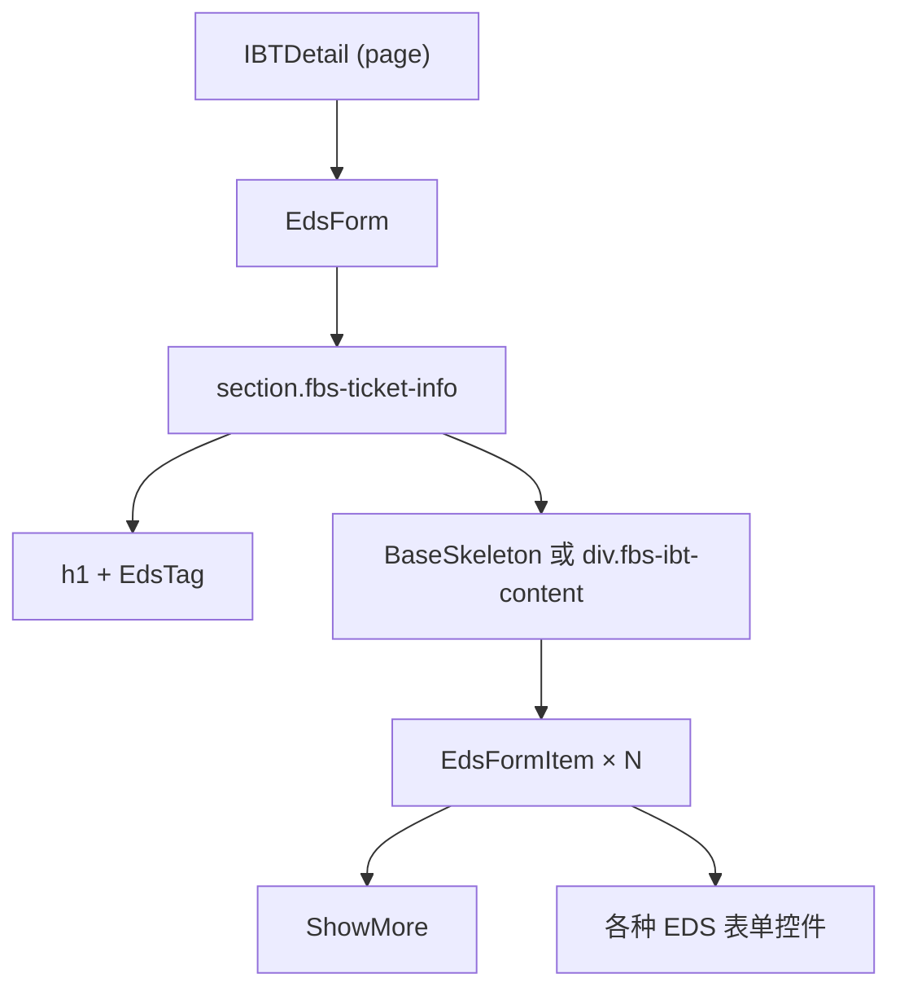

你需要学会的阅读方式：**不要从上往下按行读，而是按缩进识别组件边界**。`<EdsForm>` 开始到 `</EdsForm>` 结束是一个组件实例。它的子节点中的 `EdsTag`、`EdsFormItem`、`BaseSkeleton` 是子组件。`ShowMore` 是业务组件（来自本仓库 `src/views/` 而非组件库）。

### 区分三种组件来源

FBS 页面中出现的标签通常来自三类来源，学会区分它们是对页面做出改动的第一步：

| 来源 | 前缀/特征 | 示例 | 修改方式 |
| --- | --- | --- | --- |
| EDS/SSC UI 组件库 | `Eds` 或 `Ssc` 前缀 | `<EdsButton>`、`<EdsForm>`、`<SscTable>` | 查组件库文档，不修改组件源码 |
| 业务组件 | 无前缀，来自 `@/components` 或 `../` | `<ShowMore>`、`<InboundRow>` | 可以修改，但需确认影响范围 |
| HTML 原生元素 | 纯小写标签 | `<div>`、`<span>`、`<section>` | 按标准 HTML 处理 |

写新页面时，优先使用 EDS/SSC UI 组件库中的控件，而不是从零搭建 `<div>` + CSS。组件库提供了统一的交互、无障碍和主题适配。FBS Portal 和 SC Vue/React 使用同一套 EDS 组件库（各自版本可能略有差异），但 Portal 有独立的上层封装（`@/components/` 下）。

## Props 与 Emits：组件之间的数据契约

### Vue：Props 向下，Emits 向上

Vue 组件的数据流是单向的。父组件通过 Props 向子组件传递数据，子组件通过 Emits 向父组件发送事件：

```vue
<!-- 父组件 -->
<EdsTag :status="status.type" />
<ShowMore :list="requestIds" @jump="jumpToRequest" />
```

- `:status="status.type"`：冒号前缀是 `v-bind` 的简写，表示把 JavaScript 表达式 `status.type` 的值绑定到 Props `status`。
- `@jump="jumpToRequest"`：`@` 是 `v-on` 的简写，表示监听子组件发出的 `jump` 事件，并用父组件的 `jumpToRequest` 方法处理。

### React：Props 向下，回调函数向上

React 没有 Emits 机制，子组件通过 Props 接收的回调函数通知父组件：

```jsx
// 父组件
<InboundRow data={item} onStatusChange={handleStatusChange} />

// 子组件内部
function InboundRow({ data, onStatusChange }) {
  return (
    <tr onClick={() => onStatusChange(data.id)}>
      <td>{data.status}</td>
    </tr>
  );
}
```

`onStatusChange` 是一等公民的函数，当作 Props 传入。这和 Vue 的 `@jump` 在语义上等价，但 React 中它没有特殊的语法——就是一个普通的 Props。

### 不要在子组件中修改 Props

无论是 Vue 还是 React，Props 是只读的。如果你需要在子组件中编辑数据，把数据复制到子组件的局部状态中（`data()` 或 `useState`），修改完成后通过 Emit 或回调通知父组件更新原始数据。

```vue
<!-- Vue：v-model 是修改 Props 的常见错误 -->
<!-- 错误 -->
<InboundRow v-model="props.item.status" />
<!-- 正确 -->
<InboundRow :status="props.item.status" @update:status="handleStatusChange" />
```

## 表单、校验与双向绑定

### Vue 表单：`v-model` + EDS 组件

FBS Vue 仓库中，表单使用 `EdsForm` + `EdsFormItem` + `v-model`：

```vue
<template>
  <EdsForm :model="form" :rules="formRules" ref="formRef">
    <EdsFormItem label="IR ID" prop="irId">
      <EdsInput v-model="form.irId" />
    </EdsFormItem>
    <EdsFormItem label="状态" prop="status">
      <EdsSelect v-model="form.status" :options="statusOptions" />
    </EdsFormItem>
  </EdsForm>
</template>

<script lang="ts">
export default defineComponent({
  data() {
    return {
      form: { irId: '', status: '' },
      formRules: {
        irId: [{ required: true, message: '请输入 IR ID' }],
        status: [{ required: true, message: '请选择状态' }],
      },
    };
  },
});
</script>
```

`v-model` 的双向绑定意味着：修改输入框 → `form.irId` 自动更新。但要注意，`v-model` 不能直接绑定 Props——它本质上会尝试修改绑定的值。如果 Props 来自父组件，使用 `:value` + `@input` 模式代替。

### React 表单：受控组件

React 中没有 `v-model`，表单值完全由 state 管理：

```jsx
function FilterForm({ onSearch }) {
  const [irId, setIrId] = useState('');
  const [status, setStatus] = useState('');

  const handleSubmit = () => {
    onSearch({ irId, status });
  };

  return (
    <div>
      <Input value={irId} onChange={e => setIrId(e.target.value)} placeholder="IR ID" />
      <Select value={status} onChange={setStatus} options={statusOptions} />
      <Button onClick={handleSubmit}>搜索</Button>
    </div>
  );
}
```

受控组件的模式是：`value={state}` + `onChange={setState}`。每个表单字段都需要独立的 state 和事件处理函数。这在字段多的表单中会产生大量重复代码，FBS Portal 中通常封装了 `useForm` 类 hook 来管理复杂表单状态。

### 校验时机

FBS 表单校验通常在两个时机触发：
- `blur`：字段失去焦点时校验单个字段。适合实时反馈。
- `submit`：提交时校验全部字段。适合最终把关。

EDS 组件库的 `EdsForm` 默认在 submit 时校验全部规则，可以在 Props 中配置校验时机。

## 组件库边界：只讲用得到的 API

FBS 前端统一使用 EDS（Enterprise Design System）作为基础组件库。SC 仓库在此基础上封装了 SSC UI。你不必通读组件库文档——以下是你在 FBS 页面中实际会高频遇到的组件：

| 组件 | 用途 | 在 FBS 页面中的典型位置 |
| --- | --- | --- |
| `EdsButton` | 操作按钮 | 表单提交、弹窗确认、列表操作列 |
| `EdsForm` / `EdsFormItem` | 表单容器和表单项 | 筛选栏、详情编辑、创建页面 |
| `EdsInput` / `EdsSelect` | 文本输入和下拉选择 | 筛选表单、编辑表单 |
| `EdsTag` | 状态标签 | 列表中的状态列、详情页状态标识 |
| `EdsTable` / `SscTable` | 数据表格 | 列表页、详情页的关联数据 |
| `EdsPagination` | 分页 | 列表页底部分页栏 |
| `EdsDialog` | 弹窗 | 确认操作、创建/编辑表单弹窗 |
| `EdsToast` / `message` | 消息提示 | 操作成功/失败反馈 |

每当你需要增加一个交互元素，先确认组件库是否已有对应组件，再确认仓库中是否已有使用样例（搜索组件名即可）。遵守这两步，能帮你避开绝大多数"写得能跑但不符合团队规范"的问题。

## 样式组织：Less、Scoped 与 CSS Modules

### Vue Scoped Style（SC Vue）

```vue
<style scoped lang="less">
.fbs-ibt-detail {
  padding: 16px;
  .fbs-ibt-title {
    display: flex;
    justify-content: space-between;
  }
}
</style>
```

`scoped` 确保这些 CSS 只作用于当前组件，不会泄漏到其他组件。Vue 通过为元素添加 `data-v-xxx` 属性实现隔离。`.fbs-ibt-title` 是 Less 的嵌套语法——编译后变成 `.fbs-ibt-detail .fbs-ibt-title`。

### CSS Modules（Portal、SC React）

```less
// InboundManagement.module.less
.filterBar {
  display: flex;
  gap: 16px;
}
```

```tsx
// 组件中引用
import styles from './InboundManagement.module.less';
<div className={styles.filterBar}>...</div>
```

CSS Modules 自动将类名编译为唯一标识（如 `filterBar_abc123`），实现样式隔离。和 Vue scoped 一样，你不必手动管理命名冲突。

### 什么时候用内联样式

React 中可以通过 `style` 属性设置内联样式（Vue 也有 `:style` 绑定），但在 FBS 仓库中这通常只用于动态值（如根据数据计算的颜色、宽度）。静态样式一律放在 `.less` 文件中：

```jsx
// 动态值用内联
<div style={{ width: `${progress}%` }} />

// 静态样式用 class
<div className={styles.progressBar} />
```

## 表格：数据展示的核心模式

FBS 的列表页大量使用 EDS Table 或 SSC Table。核心模式是：**列定义 + 数据源 = 表格**。

```vue
<!-- Vue 示例（简化） -->
<EdsTable :data="list" :columns="columns">
  <template #status="{ row }">
    <EdsTag :status="getStatusType(row.status)">
      {{ $t(row.status) }}
    </EdsTag>
  </template>
</EdsTable>

<script>
columns: [
  { prop: 'ir_id', label: 'IR ID', width: 120 },
  { prop: 'status', label: '状态', slot: 'status' },
  { prop: 'mtime', label: '更新时间', formatter: (row) => formatTime(row.mtime) },
]
</script>
```

表格中的自定义列通过 slot 实现（Vue）或 `render` 函数（React）。EDS Table 暴露的 slot/column API 在不同版本之间可能有差异——以仓库当前使用的版本为准，不依赖组件库最新文档。

## 空态、加载态与错误态

一个完整的组件不只是"正常数据时的展示"。FBS 页面中，每个列表和详情都必须处理三种状态：

| 状态 | 触发条件 | FBS 处理方式 |
| --- | --- | --- |
| 加载中 | API 请求未完成 | `v-if="loading"` 渲染 Skeleton 或 Spin |
| 空数据 | API 返回 `total: 0` 或 `list: []` | Empty 组件 + 引导文案 |
| 错误 | API 返回 `retcode !== 0` 或 HTTP 错误 | 错误提示 + 重试按钮 |

```vue
<BaseSkeleton v-if="dataLoading" :line="3" />
<EdsEmpty v-else-if="!list.length" :description="$t('noData')" />
<EdsTable v-else :data="list" />
```

三种状态缺一不可。后端的错误处理通常返回空列表或错误信息——前端需要在页面上把这两种情况区分开：空列表表示"没有符合条件的数据"，错误表示"数据获取失败"。它们对应的用户操作也不同（前者引导修改筛选条件，后者引导重试）。

## 在仓库中增加一个组件字段

现在把以上知识整合成一个实际任务。假设需求是：在入库问题列表（IBT List）的筛选栏中增加一个"紧急程度"下拉筛选。

### 找到目标页面

```bash
fbs-sc-vue/src/views/inbound/IBT/list/searchForm.vue
```

### 找到组件库中的下拉组件

搜索仓库中的 `EdsSelect` 使用样例：

```bash
rg "EdsSelect" fbs-sc-vue/src/views/inbound/ --context 3
```

### 增加字段

```vue
<!-- searchForm.vue 中新增 -->
<EdsFormItem :label="$t('ibtUrgency')" prop="urgency">
  <EdsSelect
    v-model="form.urgency"
    :options="urgencyOptions"
    :placeholder="$t('commonAll')"
    clearable
  />
</EdsFormItem>

<script>
// data 中新增
urgencyOptions: [
  { label: '紧急', value: 'URGENT' },
  { label: '普通', value: 'NORMAL' },
],
</script>
```

### 传递到列表请求

```javascript
// list.vue 中，筛选条件合并 urgency
const params = {
  ...searchForm,
  urgency: searchForm.urgency || undefined, // 不选时不传
};
this.fetchList(params);
```

### 验证

- 选择一个紧急程度，确认列表 API 请求中携带了 `urgency` 参数。
- 清除选择，确认 `urgency` 参数不再出现在请求中。
- 刷新页面，确认筛选条件保持（如果路由层做了 query 同步的话）。


### 组件组合模式：如何避免"上帝组件"

在 FBS 仓库中，你经常会看到一个页面组件承载了大量逻辑。但随着需求增长，一个组件超过 300 行后就会变得难以维护。FBS 推荐的拆分方式是：

1. **按区域拆分**：页面中的 header、filter bar、table、pagination 各自成组件。
2. **按职责拆分**：展示组件只接收 Props 并渲染，容器组件管理数据和逻辑。
3. **按复用拆分**：如果两个页面有相似的表单或列表，抽成共享组件。

如果你要在已有页面中新增功能，不一定需要马上拆分组件。但如果新增的代码让组件超过了 300 行，或者新增的功能与原有逻辑概念上独立（如新增一个弹窗、新增一个 tab），就应该考虑拆出独立组件。

### EDS 组件库版本差异

EDS 组件库在三个仓库中的版本可能不同。Portal 使用较早版本的 EDS（匹配 React 16），SC Vue 使用较新版本（匹配 Vue 3），SC React 使用最新版本（匹配 React 18）。同一组件在不同版本中的 API、Props 和 slot 名可能有差异。

以 `EdsTable` 为例：旧版本可能用 `columns` prop + `slot` 自定义列，新版本可能用 `columns` prop + `render` 函数。查组件库文档时注意选择与仓库实际版本匹配的文档，不要混用不同版本的 API。

验证方式：在仓库中搜索组件的实际使用样例，比看文档更可靠。`rg "EdsTable" --context 5` 能给出最准确的用法。

### 样式调优的实用技巧

在 FBS 仓库中做样式修改时：

- 先用浏览器 DevTools 的 Elements 面板定位目标元素的 class 和最终计算样式。
- 在 `.vue` 文件的 `<style scoped>` 或 `.module.less` 中修改，不要写全局样式（除非你明确需要影响多个组件）。
- 如果发现 EDS 组件的默认样式不满足需求，优先查看组件库是否暴露了样式相关的 Props（如 `size`、`type`、`theme`），而不是写 CSS 覆盖。
- 如果必须覆盖组件库样式，使用 `:deep()`（Vue scoped）或提高 CSS 选择器优先级，而不是 `!important`。

### 理解 Vue 的响应式限制

Vue 3 的响应式系统基于 Proxy，比 Vue 2 的 `Object.defineProperty` 更强大，但仍有一些边界需要注意：

- 直接给对象添加新属性不会触发响应式更新——使用 `reactive` 或确保属性在初始化时存在。
- 直接通过索引修改数组或修改 `length` 会触发更新（Vue 3 已修复 Vue 2 的这一问题）。
- `ref` 包装的值需要通过 `.value` 访问（在 `<script>` 中），但在 `<template>` 中自动解包。

FBS 仓库中使用 `data()` 选项 API 居多（而非 `setup()` + `ref`），所以响应式边界通常自动处理。如果看到使用了 Composition API（`setup()` 或 `<script setup>`），要注意 `ref` 的 `.value` 访问问题。

## 常见错误

### 直接 `<div>` 代替组件库控件

```html
<!-- 不推荐 -->
<div class="my-button" @click="handleClick">提交</div>
<!-- 推荐 -->
<EdsButton type="primary" @click="handleClick">提交</EdsButton>
```

EDS 组件库提供了统一的主题、加载态、禁用态、无障碍支持。手写 `<div>` 可能省了几秒钟，但会引入不一致的交互行为。

### 忘记空态和加载态

```vue
<!-- 不完整 -->
<EdsTable :data="list" />
<!-- 完整 -->
<BaseSkeleton v-if="loading" />
<EdsEmpty v-else-if="!list.length" />
<EdsTable v-else :data="list" />
```

### 修改 Props 而不是通知父组件

```vue
<!-- 错误 -->
props.item.status = 'DONE';
<!-- 正确 -->
emit('update:status', 'DONE');
```

### `v-for` 没有 `:key`

```vue
<!-- 错误 -->
<div v-for="item in list">{{ item.name }}</div>
<!-- 正确 -->
<div v-for="item in list" :key="item.id">{{ item.name }}</div>
```

## 练习

### 组件树识别

打开 `fbs-sc-vue/src/views/inbound/IBT/list/searchForm.vue`，画出组件树。标注每个组件来自 EDS/SSC UI 还是业务组件。

### 增加筛选字段

在不查看上面示例的情况下，在 searchForm 中增加一个"仓库区域"下拉筛选（字段名 `whsRegion`）。完成以下步骤：找到 EdsSelect 的用法样例 → 增加表单项 → 增加数据选项 → 合并到请求参数。

### Props 修复

以下代码存在 Props 修改问题，修复它：

```vue
<!-- 子组件 ProductItem.vue -->
<template>
  <EdsInput v-model="product.stock" />
</template>
<script>
export default {
  props: { product: Object },
};
</script>
```

### 参考答案

**10.3**：需要用 `:value` + `@input` 模式，或通过 emit 通知父组件修改。修正：

```vue
<template>
  <EdsInput :value="product.stock" @input="value => $emit('update:stock', value)" />
</template>
```

## 参考文献

- [React Learn — Your First Component](https://react.dev/learn/your-first-component)
- [React Learn — Passing Props to a Component](https://react.dev/learn/passing-props-to-a-component)
- [Vue 3 Guide — Components Basics](https://vuejs.org/guide/essentials/component-basics.html)
- [Vue 3 Guide — Props](https://vuejs.org/guide/components/props.html)
- [Vue 3 Guide — Component Events](https://vuejs.org/guide/components/events.html)
- [MDN CSS Modules](https://developer.mozilla.org/en-US/docs/Web/CSS/CSS_modules) — CSS Modules 概述


---

# 路由、菜单与页面入口：让页面真正可访问

> 预计学习时间：110–150 分钟
> 一句话总结：能在 FBS 三个前端仓库中从浏览器 URL 反查路由定义、找到页面入口、理解菜单与权限的关系——完成一个不破坏宿主的新路由注册并验证直达、刷新和无权限三种路径。

## 这一章解决什么问题

后端同学第一次在 FBS 前端新增页面时，最常见的困惑是："我写了一个 `.vue` 文件，但在浏览器里打不开。"这是因为页面不是自动可访问的——它需要在路由配置中注册，路由又需要关联菜单项或权限码，而权限码又可能受宿主（Seller Center）控制。

FBS 的三个前端仓库各自有不同的路由机制：Portal 用 React Router 5 的文件式路由定义，SC Vue 用 MMF 路由数组 + `beforeEnter` 守卫，SC React 用 `registerRouterModule` + `RouteConfig`。三者的共同点是：**URL → 路由定义 → 页面组件**这条链路在三个仓库中都存在，只是注册方式和前置条件不同。

本章的目标不是让你背下三个路由库的 API，而是帮你建立一套可复用的排查和新增流程：拿到一个浏览器 URL → 倒推它对应哪个路由定义 → 找到这个路由的页面组件入口 → 理解它的菜单、权限、懒加载和重定向行为 → 仿照现有模式新增一个受控子路由。

> 本章基于三个前端仓库的 release 分支（2026-07-20）。路由注册方式、守卫逻辑和权限码以仓库当前代码为准。

## URL 到路由定义：反向追踪的通用流程

无论哪个仓库，排查"为什么这个 URL 打不开"的流程是相同的：

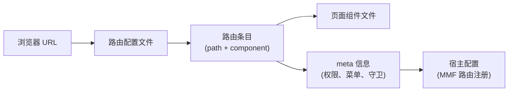

以 SC Vue 的 FBS 首页为例。浏览器 URL 是 `/portal/fbs/home`：

1. 打开 `src/router/index.ts`，搜索 `fbsHome` 或 `home`。
2. 找到对应路由定义，看到它的 `component` 是 `Vue3Mount(() => import('../views/home/index.vue'))`。
3. 路由的 `meta.authCodes` 是 `['access_to_sbs', 'access_to_sbs_service_by_shopee']`——这是进入 FBS 模块的基础权限。
4. 路由的父级 `/portal/fbs` 有 `beforeEnter` 守卫，在首次进入时初始化 Store（`INIT_FBS_STORE`）。

### 三个仓库的路由配置文件定位

| 仓库 | 路由配置位置 | 路由类型 |
| --- | --- | --- |
| Portal (`fbs-frontend`) | `src/routes/*.ts`（多文件，按业务域拆分） | React Router 5，`RouteNode[]` |
| SC Vue (`fbs-sc-vue`) | `src/router/index.ts`（单文件主路由数组） | MMF route config，`routers` 数组 |
| SC React (`fbs-sc-react`) | `projects/react-frontend/src/router/index.ts` | MMF `RouteConfig[]`，通过 `registerRouterModule` 注册 |

### 懒加载：`() => import(...)` 的含义

在三个仓库的路由定义中，你都会看到类似写法：

```javascript
// SC Vue
component: Vue3Mount(() => import('../views/home/index.vue'))

// Portal
component: lazy(() => import('../views/InboundManagement/InboundRequest/List'))

// SC React
component: commonLazyLoader(() => import('../views/Home'))
```

`() => import(...)` 是动态导入。它的作用是：**页面组件的代码不会打包进主 bundle，而是在用户第一次导航到该路由时才加载**。这对后端同学来说可能有些陌生——在 Go 或 Java 中，代码在编译时就确定了；在前端，路由懒加载是一种优化策略，减少首屏加载体积。

当你新增一个路由时，保持和周围路由相同的懒加载模式即可。不要改成静态 `import`——这会破坏构建产物的拆分策略。

## SC Vue 路由：从 `/portal/fbs` 到每个子页面

### 路由数组结构

SC Vue 的路由定义在 `src/router/index.ts` 中是一棵嵌套树：

```typescript
export const routers = [
  {
    path: '/portal/fbs',        // 模块根路径
    name: 'fbs',
    redirect: '/portal/fbs/home', // 默认跳转到首页
    meta: {
      authCodes: ['access_to_sbs', 'access_to_sbs_service_by_shopee'],
    },
    beforeEnter: async (to, from) => {
      // 首次进入时初始化 Store
      const data = await app.vue3VuexStore.dispatch('FBS_STORE/INIT_FBS_STORE');
      // 检查系统升级、税务锁定、入驻状态等
    },
    children: [
      {
        path: 'home',
        name: 'fbsHome',
        component: Vue3Mount(() => import('../views/home/index.vue')),
      },
      // ...更多子路由
    ],
  },
];
```

`children` 中的子路由会自动继承父路由的 path 前缀。`'home'` 实际匹配的是 `/portal/fbs/home`。父路由的 `beforeEnter` 只执行一次——后续在子路由之间切换时不会重复初始化 Store。

### 路由守卫中的关键逻辑

`beforeEnter` 守卫不是"权限检查"那么简单。它承担了多个职责：

1. **Store 初始化**：`dispatch('FBS_STORE/INIT_FBS_STORE')` 获取卖家信息、店铺信息、系统配置。
2. **系统升级检测**：如果 `systemUpgrading.toggle` 为 true，跳转到升级提示页。
3. **税务锁定**：巴西地区（`region === 'br'`）且 `lockByTax` 时，跳转到税务错误页。
4. **入驻状态**：如果卖家未完成入驻（`!fbsTag`），跳转到入驻落地页。
5. **VPI 管理限制**：如果卖家没有 VPI 管理权限，尝试访问 VPI 页面时重定向到商品列表。

后端同学需要注意：这些逻辑不是分散在各个页面的——它们集中在路由守卫中。这意味着如果你新增一个页面，不需要在每个页面里重复写权限和状态检查，只需确保路由定义中的 `authCodes` 和 `meta` 正确即可。

### 新增一个子路由

仿照现有模式，新增一个"入库统计"页面：

```typescript
// 在 routers[0].children 中新增
{
  path: 'inbound/statistics',       // 完整路径：/portal/fbs/inbound/statistics
  name: 'fbsInboundStatistics',
  component: Vue3Mount(() => import('../views/inbound/statistics/index.vue')),
  meta: {
    authCodes: ['access_to_sbs', 'access_to_sbs_service_by_shopee'],
    // 如果需要额外的操作权限：
    // permissions: ['VIEW_INBOUND_STATISTICS'],
  },
}
```

新增后验证：

1. 在浏览器中手动输入 `/portal/fbs/inbound/statistics` → 确认页面能正常加载。
2. 刷新页面（Cmd+R）→ 确认路由守卫正常执行，Store 正确初始化。
3. 模拟无权限场景 → 确认页面显示无权限提示或被重定向。

## Portal 路由：React Router 5 的分文件定义

### 路由文件结构

Portal 的路由按业务域拆分到多个文件中：

```
src/routes/
  inbound.ts          → 入库管理路由
  product.ts          → 商品管理路由
  inventory.ts        → 库存管理路由
  sellerManagement.ts → 入驻管理路由
  charging.ts         → 计费管理路由
  types.ts            → RouteNode 类型定义
```

每个文件导出一个 `RouteNode[]`。以入库路由为例：

```typescript
// src/routes/inbound.ts
const inboundRoutes: RouteNode[] = [
  {
    name: $t('Inbound Management'),
    meta: { isParentNode: true, icon: InboundIcon },
    children: [
      {
        path: '/inbound/request/list',
        component: lazy(() => import('../views/InboundManagement/InboundRequest/List')),
        name: $t('Inbound Request List'),
        meta: { permissions: ['VIEW_INBOUND_REQUEST'] },
        children: [
          {
            path: '/inbound/request/detail/:id',
            component: lazy(() => import('../views/InboundManagement/InboundRequest/Detail')),
            meta: { permissions: ['VIEW_INBOUND_REQUEST'] },
          },
        ],
      },
    ],
  },
];
```

`RouteNode` 的类型定义：

```typescript
// src/routes/types.ts
interface RouteNode {
  path?: string;
  name?: string;
  component?: React.LazyExoticComponent<any>;
  meta?: { permissions?: string[]; isParentNode?: boolean; icon?: any; };
  children?: RouteNode[];
}
```

### Portal 的路由特点

与 SC Vue 不同，Portal 的路由有以下特点：

- **绝对路径**：path 以 `/` 开头（如 `/inbound/request/list`），不依赖父路由前缀。
- **`lazy()` 包装**：React Router 5 使用 `React.lazy()` 实现代码拆分，`lazy()` 是 Portal 的封装。
- **`meta.permissions`**：权限码数组，Portal 的权限系统在渲染前检查用户是否拥有对应权限。
- **`meta.isParentNode`**：标记父节点（菜单分组），不渲染页面，只用于侧边栏菜单结构。

### Portal 的路由渲染流程

Portal 的路由注册和渲染与 SC Vue 有本质区别。SC Vue 依赖 MMF 框架接管路由注册，Portal 则通过 React Router 5 的 `<Route>` 组件直接渲染：

```
src/index.tsx → 读取 routes/*.ts → 生成 <Route> 树 → ReactDOM.render()
```

因此 Portal 不需要 MMF Dev Tools 就能独立访问。如果你在 Portal 中新增路由后页面 404，通常是因为：路由未在对应 `routes/*.ts` 文件中注册，或 `path` 与其他路由冲突。

## SC React 路由：`registerRouterModule` 模式

### 路由配置格式

SC React 的路由配置是一个 `RouteConfig[]`，使用 `registerRouterModule` 注册：

```typescript
// projects/react-frontend/src/router/index.ts
export const routes: RouteConfig[] = [
  {
    parent: "fbs",
    name: "fbsHome",
    path: "home",
    component: commonLazyLoader(() => import('../views/Home')),
  },
  {
    parent: "fbs",
    name: "fbsInboundList",
    path: "inbound/list",
    component: commonLazyLoader(() => import('../views/InboundList')),
    meta: {
      shopSwitcherEnabled: true,
    },
    beforeEnter: async (to, from) => {
      // 路由守卫逻辑
    },
  },
];
```

和 SC Vue 的区别：

- `parent` 字段指定父路由名称（如 `"fbs"`），path 只需要写相对路径。
- `commonLazyLoader` 封装了 `React.lazy` + `Suspense` + `SSCConfigProvider`，确保每个懒加载的组件都包裹在必要的 Context 中。
- `registerRouterModule` 将路由数组注册到 MMF 框架中，由框架负责与宿主（Seller Center）的路由系统对接。

### SC React 的路由特点

SC React 和 SC Vue 一样是 MMF 模块，路由最终由 Seller Center 宿主管理。`registerRouterModule` 告诉宿主"我提供了这些路由"，宿主负责把它们挂载到正确的位置。因此：

- 路由的完整 URL 由宿主前缀 + `parent` 路径 + 当前 `path` 组成。
- 路由守卫中的 `to.route` 和 `from.route` 对象由 MMF 框架提供。
- 菜单配置由宿主统一管理，模块只负责声明自己能处理哪些路由。

## 菜单与路由的关系（三仓共同模式）

FBS 前端使用**路由驱动菜单**的设计：菜单项由路由配置生成，而不是手动维护两份数据。

- Portal：`src/routes/*.ts` 中的 `meta.isParentNode` + `name` → 侧边栏菜单。
- SC Vue：`src/router/index.ts` 中的路由树 → MMF 框架生成导航。
- SC React：`RouteConfig[]` 中的 `parent` + `name` → MMF 框架生成导航。

这意味着新增一个路由后，菜单项通常会自动出现（如果它符合菜单生成规则）。但要注意：
- 如果路由的 `meta` 中缺少必要的权限码，菜单项可能显示但点击后无法访问。
- 如果路由是某个业务模块的详情页（如 `/inbound/request/detail/:id`），它通常不会出现在菜单中——详情页是通过列表页的链接进入的。

## 新增路由的完整检查清单

无论哪个仓库，新增一个页面路由后，逐项确认：

1. **路由定义**：在对应的路由文件中添加了路由条目，path 不与现有路由冲突。
2. **权限**：如果页面需要权限控制，`authCodes` 或 `permissions` 正确配置。
3. **懒加载**：使用 `() => import(...)` 或对应仓库的懒加载封装（`Vue3Mount`、`lazy()`、`commonLazyLoader`）。
4. **直达**：浏览器手动输入完整 URL 能正常加载页面（不经过导航菜单）。
5. **刷新**：在页面上按 Cmd+R 刷新，页面不白屏、路由守卫正常执行。
6. **无权限**：模拟无权限用户，确认页面被重定向或显示无权限提示。
7. **菜单（如适用）**：确认新增路由在侧边栏菜单或导航中正确显示。
8. **旧路由不受影响**：确认修改没有破坏已有页面的路由。

## 常见错误

### 忘记路由守卫的初始化逻辑

在 SC Vue 中，路由守卫 `beforeEnter` 负责 Store 初始化。如果你新增的页面在 `beforeEnter` 执行之前就需要访问 Store 数据（如在组件外读取 `app.vue3VuexStore`），可能会拿到未初始化的状态。确保页面的数据获取逻辑在 `beforeEnter` 完成之后执行。

### path 冲突

```typescript
// 这两个 path 会冲突——`detail` 可能被当作 `:id` 的匹配
{ path: '/inbound/detail' }
{ path: '/inbound/:id' }
```

Router 按注册顺序匹配，先注册的优先。如果 `/inbound/detail` 注册在 `/inbound/:id` 之后，它永远不会被匹配——`:id` 会先捕获 `detail` 作为参数值。

### SC React 中忘记 `parent` 字段

SC React 的路由依赖 `parent` 字段挂载到正确的路由树上。如果 `parent` 填写错误或引用了不存在的父路由，页面不会被注册到宿主中，浏览器访问会 404。

### 在 SC Vue/React 中直接写绝对路径

```typescript
// 不推荐在 MMF 模块中写绝对路径
{ path: '/portal/fbs/my-page', component: ... }
// 推荐：用 parent + 相对路径
{ parent: 'fbs', path: 'my-page', component: ... }
```

## 练习

### URL 反向追踪

浏览器地址栏显示 `https://seller-portal.test.shopee.io/portal/fbs/inbound/request/list`。在 SC Vue 仓库中追踪：这个 URL 对应哪个路由定义？它的页面组件文件在哪里？它的权限要求是什么？

### 新增路由

在 SC Vue 仓库中，为"入库统计"页面新增一个路由，要求：

- path 为 `inbound/statistics`，完整路径 `/portal/fbs/inbound/statistics`
- 组件指向一个新建的 `views/inbound/statistics/index.vue`（只需创建一个包含 `<h1>Inbound Statistics</h1>` 的最小页面）
- 不需要额外的操作权限（复用父路由的 `authCodes`）

### 权限对比

Portal 的权限检查使用 `meta.permissions` 数组，SC Vue 使用 `meta.authCodes` 数组。两者的区别是什么？为什么 SC Vue 的 `authCodes` 是"进入模块的基础权限"而 `permissions` 是"操作权限"？

### 参考答案

**8.1**：路由定义在 `src/router/index.ts` 的 `routers[0].children` 中，对应 `name: 'fbsInboundRequestList'`（或类似命名），页面组件通过 `Vue3Mount(() => import(...))` 懒加载到 `views/inbound/` 下的 `.vue` 文件。父路由的 `authCodes` 要求 `['access_to_sbs', 'access_to_sbs_service_by_shopee']`。

**8.3**：Portal 是独立 SPA，自己管理权限——`permissions` 是 Portal 侧定义的权限码，由 Portal 的权限系统检查。SC Vue 是 MMF 模块，`authCodes` 是 Seller Center 宿主层面的权限码（控制用户是否能进入 FBS 模块），而操作级别的权限（如"能不能创建入库单"）在代码中通过 `permissions` 或 `hasPermission` 函数单独检查。`authCodes` 控制准入，`permissions` 控制能力。

## 参考文献

- [React Router v5.2 Official Tag](https://github.com/remix-run/react-router/tree/v5.2.0) — Portal 的路由库基线
- [React Router v6 Documentation](https://reactrouter.com/6.30.3/start/overview) — SC React 路由概念参考
- [Vue: Routing](https://vuejs.org/guide/scaling-up/routing.html) — Vue 路由基础概念


---

# 状态管理：Redux/Recoil、Vuex 与宿主状态

> 预计学习时间：110–150 分钟
> 一句话总结：能追踪"当前 seller/shop"从初始化到页面的完整数据流，读懂 Redux/Thunk、Vuex module、Recoil atom 和 Redux Toolkit 的读法与不可变更新规则——画出一个状态的来源、写入、派生与消费链。

## 这一章解决什么问题

后端同学看前端状态管理代码时，最常见的误判是：把 Store 当作一个"全局变量池"——需要什么就从里面取，想改就直接改。但在 FBS 前端中，状态有严格的生命周期和所有权：组件自己管理的、本仓 Store 管理的、宿主提供的、远端组件共享的——每一层都有不同的读写规则。

更复杂的是，三个 FBS 前端仓库使用了完全不同的状态管理方案：Portal 同时用 Redux（带 Thunk 中间件）和 Recoil，SC Vue 用 Vuex（由 Seller Center 宿主注入），SC React 用 Redux Toolkit 但依赖宿主 Vuex 提供基础信息。这不是"选型混乱"，而是不同时期的技术决策和宿主约束共同作用的结果。

本章的目标不是让你成为 Redux 或 Vuex 专家，而是帮你建立一套状态追踪能力：看到一个页面上的数据（如当前 seller 的 shop ID），你能从页面一路追溯到 Store 中的定义、初始化 action、写入点、派生逻辑和消费方。

> 本章基于三个前端仓库的 release 分支（2026-07-20）。

## 先建立状态分层的概念

在 FBS 的任一前端页面中，一个"当前 shop 信息"可能来自以下四层之一：

| 层级 | 示例 | 特点 |
| --- | --- | --- |
| 组件局部状态 | `data() { return { form: {} } }` 或 `useState` | 只有当前组件可见，组件销毁即消失 |
| 本仓 Store | Redux store、Vuex module、RTK slice | 跨页面共享，浏览器刷新后可能丢失 |
| 宿主 Store | Seller Center 提供的全局状态 | 跨模块共享，由宿主管理生命周期 |
| 远端组件状态 | 通过 Props/Context 从远端组件传入 | 跨仓共享，但契约严格限制 |

一个实用的判断规则：如果数据只在一个组件中使用，用局部状态；如果在多个页面中需要（如用户信息、当前 shop），放 Store；如果其他 MMF 模块或宿主也需要，放宿主 Store。FBS 的"当前 seller/shop"就是最典型的跨页面、跨模块共享数据，所以它在宿主 Store 中管理。

## SC Vue：Vuex 模块化的宿主注入模式

### FBS Store 的注册

SC Vue 中的 Store 不是在本仓创建的，而是注册到 Seller Center 宿主提供的 Vuex Store 中：

```typescript
// src/store/index.ts
import { app } from 'framework';
import FBS_STORE from './modules/index';

export const fbsStoreName = 'FBS_STORE';
app.registerVue3StoreModule(fbsStoreName, FBS_STORE);
```

`app.registerVue3StoreModule` 是 MMF 框架提供的能力，它将 FBS 的 Vuex 模块挂载到宿主 Vuex Store 的 `FBS_STORE` 命名空间下。此后，任何代码（包括宿主的其他模块）都可以通过 `app.vue3VuexStore.getters['FBS_STORE/Shop/currentShop']` 访问 FBS 的状态。

### 模块结构

`src/store/modules/` 下有四个子模块：

| 模块 | 路径 | 管理的数据 |
| --- | --- | --- |
| `Seller` | `modules/seller/index.ts` | 卖家信息、入驻状态、一键注册配置 |
| `Shop` | `modules/shop/index.ts` | 当前选中的店铺、店铺列表、店铺标签 |
| `System` | `modules/system/index.ts` | 系统升级状态、全局开关 |
| `Temporal` | `modules/temporal/index.ts` | 临时数据缓存 |

### 读法：从页面追到 Store

在 IBT 详情页中，`dataLoading` 是从组件 `data()` 中读取的局部状态，而 `basicInfo.urgentStatus` 可能来自 Store。追踪过程：

1. 页面模板中使用 `basicInfo` → 在 `<script>` 中找它的来源。
2. 如果来自 `mapState` 或 `this.$store.state.FBS_STORE.xxx` → 找到对应 module 的 state 定义。
3. 如果来自 computed 属性 → 看它是从 state 派生的还是从 API 响应赋值的。

### 写操作：`dispatch` 和 `commit`

```javascript
// 触发异步 action
await app.vue3VuexStore.dispatch('FBS_STORE/INIT_FBS_STORE');
// 同步修改 state
app.vue3VuexStore.commit('FBS_STORE/SET_SHOP_INFO', shopInfo);
```

- `dispatch` 用于触发 action（可以包含异步操作），action 内部通过 `commit` 修改 state。
- `commit` 用于直接提交 mutation（必须是同步操作），mutation 是唯一能改变 state 的途径。

FBS 仓库中，路由守卫的 `beforeEnter` 里 `dispatch('FBS_STORE/INIT_FBS_STORE')` 是 Store 初始化的入口——它内部会并发请求卖家信息和店铺信息，然后将结果 commit 到对应 module 的 state 中。

### 命名空间规则

Vuex module 通过 `namespaced: true` 启用命名空间。访问时必须带完整路径：

```javascript
// 正确
app.vue3VuexStore.getters['FBS_STORE/Shop/currentShop']
// 错误
app.vue3VuexStore.getters.currentShop  // 找不到
```

## Portal：Redux + Thunk + Recoil

### Redux 基础结构

Portal 的 Redux Store 创建于 `src/store/index.ts`：

```typescript
import { createStore, applyMiddleware } from 'redux';
import thunk from 'redux-thunk';

export const store = createStore(reducer, applyMiddleware(thunk));
```

Redux 的三个核心概念对应 FBS Portal 的实际角色：

| 概念 | 定义 | FBS Portal 中的位置 |
| --- | --- | --- |
| **State** | 单一数据源，一个大的对象树 | `store.getState()` 返回的整个 state |
| **Action** | 描述"发生了什么"的普通对象 | `src/store/actions/` 下的 action creator |
| **Reducer** | 根据 action 计算新 state 的纯函数 | `src/store/reducers/` 下的 reducer 文件 |

### Thunk：让 action 可以异步

Redux 原生的 action 是同步的——dispatch 一个 action 对象，reducer 立即处理。但在 FBS Portal 中，大量操作需要先发 API 请求再更新 state。Thunk 中间件让 action creator 可以返回一个函数而不是对象：

```javascript
// 同步 action creator
const setUser = (user) => ({ type: 'SET_USER', payload: user });

// 异步 action creator（Thunk）
const fetchUser = () => async (dispatch, getState) => {
  dispatch({ type: 'FETCH_USER_START' });
  try {
    const user = await api.getUser();
    dispatch({ type: 'FETCH_USER_SUCCESS', payload: user });
  } catch (error) {
    dispatch({ type: 'FETCH_USER_ERROR', payload: error });
  }
};
```

FBS Portal 中，几乎所有的 API 调用都通过 Thunk 包装。页面上 `dispatch(fetchInboundList(params))` 会触发请求 → 更新 loading 状态 → 请求完成后更新列表数据。

### Recoil：Portal 的原子化状态

Portal 同时使用了 Recoil 管理部分状态。Recoil 的核心是 **atom**（状态单元）和 **selector**（派生状态）：

```javascript
// atom：定义一个状态单元
const currentUserAtom = atom({
  key: 'currentUser',
  default: null,
});

// selector：从 atom 派生数据
const permissionListSelector = selector({
  key: 'permissionList',
  get: ({ get }) => {
    const user = get(currentUserAtom);
    return user?.permission_code_list ?? [];
  },
});
```

在 Portal 中，`src/recoil/` 目录下定义了 Recoil atom 和 selector。与 Redux 的区别：Recoil 的状态单元更细粒度，且自带派生能力（selector），不需要像 Redux 那样通过 `mapStateToProps` 或 `useSelector` 手动订阅整个 state 树。

Portal 中 Redux 和 Recoil 并存是历史原因。简单判断：Redux 管理业务数据（入库列表、商品列表），Recoil 管理全局上下文（当前用户、权限列表）。

### Portal 页面读取 Store 的方式

```javascript
// React-Redux hooks
import { useSelector, useDispatch } from 'react-redux';

function InboundList() {
  const list = useSelector(state => state.inbound.list);
  const loading = useSelector(state => state.inbound.loading);
  const dispatch = useDispatch();

  useEffect(() => {
    dispatch(fetchInboundList(params));
  }, [params]);

  // 读取 Recoil 状态
  const permissions = useRecoilValue(permissionListSelector);
}
```

## SC React：Redux Toolkit + 宿主 Vuex

### 双 Store 并存

SC React 面临一个特殊挑战：作为 MMF 模块，它需要与宿主的 Vuex Store 交互（获取 seller 信息、shop 信息等基础数据），但模块内部的业务状态使用 Redux Toolkit 管理。

```typescript
// 从宿主 Vuex 读取当前 shop
const currentShop = app?.vue3VuexStore?.getters?.['FBS_STORE/Shop/currentShop'];

// 从模块自己的 Redux Store 读取业务状态
import { useSelector } from 'react-redux';
const inboundList = useSelector(state => state.inbound.list);
```

### Redux Toolkit：slice 模式

SC React 使用 Redux Toolkit 的 `createSlice` 替代传统 Redux 的分散 action/reducer 文件：

```typescript
// store/modules/shop.ts
import { createSlice } from '@reduxjs/toolkit';

const shopSlice = createSlice({
  name: 'shop',
  initialState: { currentSelectedShop: null, fbsStatus: 0 },
  reducers: {
    setCurrentShop(state, action) {
      state.currentSelectedShop = action.payload;
    },
    setFbsStatus(state, action) {
      state.fbsStatus = action.payload;
    },
  },
});

export const { setCurrentShop, setFbsStatus } = shopSlice.actions;
export default shopSlice.reducer;
```

Redux Toolkit 的 `createSlice` 自动生成 action creator 和 reducer，并内置 Immer——你可以在 reducer 中"直接修改"state（实际上 Immer 在背后做了不可变更新）。这对习惯 Redux 传统写法的人可能有些反直觉：`state.currentSelectedShop = action.payload` 看起来像直接修改，但它是安全且正确的。

### Selector：从 state 中提取数据

```typescript
// 基础 selector
const selectCurrentShop = (state) => state.shop.currentSelectedShop;

// 带派生逻辑的 selector
const selectFbsTag = (state) => state.shop.fbsTag !== 0;
```

Selector 是纯函数，可以组合。复杂项目中使用 `createSelector`（reselect）创建带缓存的 selector，避免不必要的重新计算。

## 状态流转：一次完整的追踪练习

以"当前 shop 的仓库区域 `fbsWhsRegion`"为例，追踪它在 SC Vue 仓库中的完整生命周期：

1. **初始化**：路由守卫 `beforeEnter` → `dispatch('FBS_STORE/INIT_FBS_STORE')` → action 中并发请求 seller 和 shop 信息 → `commit('SET_SHOP_INFO', data)`。
2. **存储**：`state.FBS_STORE.Shop.currentShop.fbsWhsRegion`。
3. **消费**：request interceptor 中通过 `getCurrentShop().fbsWhsRegion.toUpperCase()` 注入到请求 header 的 `fbs-whs-region` 中。
4. **派生**：如果 CBSC 条件下，`fbsWhsRegion` 影响请求来源标记 `req-source: 'CNSC'`。


如果你需要新增一个跨页面的状态（如"用户选择的默认仓库"），你需要决定它放哪一层。判断标准：如果只有本仓页面需要，放入本仓 Store 的对应 module；如果其他 MMF 模块也需要，考虑放入宿主 Store（需要协调宿主侧改动）；如果只有一个组件需要，用局部状态。

## 不可变更新：React 和 Redux 的共同约束

React 和 Redux 都依赖引用比较来判断是否需要重新渲染。修改状态时必须创建新对象/新数组：

```javascript
// 错误：直接修改
state.list.push(newItem);

// 正确：创建新引用
return { ...state, list: [...state.list, newItem] };

// Redux Toolkit 中 Immer 让你可以"直接修改"（实际做了不可变代理）
state.list.push(newItem); // createSlice reducer 中合法
```

Vue 3 使用 Proxy 实现响应式，所以 Vuex/组件 data 中可以直接赋值。但跨框架传递数据时（如 SC React 从宿主 Vuex 读取），仍需注意不可变性的约束。

## 常见错误

### 在 action 外直接修改 state

```javascript
// 错误：绕过 mutation 直接修改
this.$store.state.FBS_STORE.Shop.currentShop = newShop;

// 正确：通过 commit
this.$store.commit('FBS_STORE/SET_SHOP_INFO', newShop);
```

### 忘记 Redux reducer 是纯函数

```javascript
// 错误：reducer 中有副作用（API 调用、随机数）
function inboundReducer(state, action) {
  const data = await fetchData();  // 不允许！
  return { ...state, data };
}

// 正确：副作用放在 Thunk 中
```

### 从宿主 Vuex 读取时未处理可选链

```javascript
// 可能抛出 TypeError
const shopId = state.shop.currentSelectedShop.fbsShopId;

// 正确
const shopId = state.shop.currentSelectedShop?.fbsShopId;
```

### 把大量不需要跨页面的数据放入 Store

组件的表单临时数据、搜索关键词、展开/折叠状态通常不需要入 Store。Store 中只放真正需要跨页面共享的状态。

## 练习

### 追踪练习

在 SC Vue 仓库中追踪 `fbsTag` 的完整生命周期：它在哪个 API 中获取、存入哪个 module、在哪些文件中被读取和使用。

### 新增状态

在 SC Vue 的 System module 中新增一个 `maintenanceMode` 状态（布尔值，默认 `false`）。在路由守卫 `beforeEnter` 中检查这个状态，如果为 `true`，重定向到一个维护提示页。

### 派生状态

Portal 仓库中，`permissions.includes(permission)` 被多次使用。创建一个 selector，封装这个判断逻辑，使调用方只需 `const hasPermission = useSelector(selectHasPermission(code))`。

### 参考答案

**8.2** 关键步骤：`modules/system/index.ts` 的 state 中新增 `maintenanceMode: false`；mutation 中新增 `SET_MAINTENANCE_MODE`；`beforeEnter` 中读取 `getters['FBS_STORE/System/maintenanceMode']`；维护提示页可以是简单的 `MaintenanceNotice.vue`。

## 参考文献

- [Redux Essentials Tutorial](https://redux.js.org/tutorials/essentials/part-1-overview-concepts) — store/action/reducer 概念
- [Redux Toolkit Tutorials](https://redux-toolkit.js.org/tutorials/overview) — createSlice 和 createAsyncThunk
- [Vuex 4 Documentation](https://vuex.vuejs.org/) — state/getter/mutation/action/module
- [Recoil Documentation](https://recoiljs.org/docs/introduction/getting-started/) — atom/selector 概念
- [React Learn — Managing State](https://react.dev/learn/managing-state) — React 状态管理概述


---

# API、代理、错误与前后端契约

> 预计学习时间：120–160 分钟  
> 一句话总结：沿入库列表请求拆开 API 函数、请求实例、宿主代理、业务错误与联调证据，能够独立定位一次前后端契约问题。

## 这一章解决什么问题

后端同学第一次改前端接口，常会把“调用 API”理解成在组件里写一次 `axios.post`。这段代码也许能发出请求，却绕过了 FBS 前端已经建立的请求约定：路径前缀由谁补、会话由谁携带、请求标识怎么生成、语言和仓区信息从哪里来、业务错误由谁翻译、PII 和导出为什么要走另一套实例。结果通常不是语法错误，而是本地看似成功、接到宿主后失败，或者一次错误弹出两遍。

本章只追一条真实链路：Seller Center 入库请求列表。我们从 Vue 仓库的 `src/api/inbound.js` 出发，经过 `src/utils/request.js`，到达后端路由 `/api/fbs/sc/inbound/request/list/`。随后用 React 16 Portal 和 React 18 MMF 的实现做对照。学完后，你不需要背完 Axios；你要能回答七个工程问题：请求从哪里发出，method 和 path 在哪里决定，参数放在 query 还是 body，baseURL 与宿主代理如何组合，哪些 header 由统一封装注入，失败属于哪一层，以及契约变更需要同时检查哪些文件。

> 本章观察各仓库 release 分支（2026-07-20）中的代码。路径、依赖版本和封装行为可能随仓库演进；做实际需求时，应重新打开当前工作树核验，不能把本章片段当成永久 API。

## 先建立一张请求地图

浏览器请求不是从按钮一步跳到 Go handler。一次列表刷新通常穿过五层：组件或 Store 组织查询条件；API 函数选择业务端点；request wrapper 补公共规则；浏览器和宿主代理发送请求；后端返回统一响应。把它们混在一个文件里，短期少写几行，长期会让每个页面各自处理鉴权、错误与环境差异。

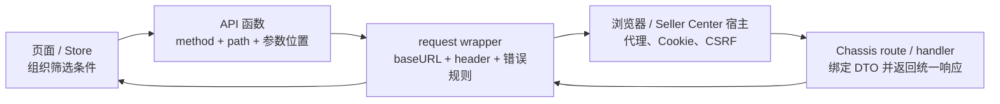

这张图有两个容易被忽略的方向。第一，请求向右走时，每层只补自己负责的信息；页面不该猜 CSRF header，request wrapper 也不该理解“入库状态筛选”的业务含义。第二，响应向左走时也分层：HTTP 客户端先判断有没有可用响应，再判断 HTTP 状态与业务 `retcode`，页面最后只处理本业务的空态、重试入口或成功数据。

遇到问题时先标出故障位于哪条边，而不是立刻改代码。例如 Network 面板里根本没有请求，检查页面事件和 API 函数；有请求但 URL 多了一段前缀，检查 API path 与 baseURL；HTTP 200 但页面提示失败，检查业务 `retcode`；只有某个地区或宿主失败，检查统一注入的 region/shop/source 信息和宿主配置。

## 从 Vue 入库列表读懂最小 API 函数

打开 `fbs-sc-vue/src/api/inbound.js`，入库列表函数的核心形态可以缩减为：

```javascript
export function getRequestList(data) {
  return request({
    url: '/inbound/request/list/',
    method: 'post',
    data,
  })
}
```

这层很薄，但它承担了清楚的业务契约。函数名说明调用意图；`url` 是相对业务路径；`method` 明确后端路由；`data` 表示 JSON 请求体。调用者只需传入列表筛选条件，不必知道 Seller Center 的完整 API 前缀，也不必每次创建 Axios 实例。

如果同一文件里的查询接口使用 GET，你会看到参数通常放在 `params`：

```javascript
export function getPickupInfo(params) {
  return request({
    url: '/inbound/request/pickup/info/',
    method: 'get',
    params,
  })
}
```

`params` 与 `data` 不是风格偏好。Axios 会把 `params` 序列化到 URL query，把 `data` 放入请求体。后端的参数绑定也会按 HTTP method 与 Content-Type 选择读取位置。把 GET 的筛选条件错放进 `data`，浏览器可能仍发出请求，但服务端读不到；把 POST JSON 错放进 `params`，敏感字段还可能出现在 URL、浏览器历史或代理日志中。

读 API 文件时，先做一张四列表，而不是顺着几百行函数逐个看：

| 问题 | 在哪里看 | 入库列表示例 | 判断结果 |
| --- | --- | --- | --- |
| 业务动作是什么 | 函数名与调用点 | `getRequestList` | 查询列表 |
| 请求到哪个端点 | `url` | `/inbound/request/list/` | 相对 SC FBS 前缀 |
| 使用什么 method | `method` | `post` | 与 Chassis route 对齐 |
| 参数放在哪里 | `data` / `params` | `data` | JSON body |

这四项是联调的第一份契约证据。不要从页面字段名直接猜后端字段，也不要因为函数名叫 `get...` 就推断 HTTP method 是 GET；这里的 `get` 表示读取业务数据，实际路由是 POST。

## baseURL 如何把相对路径变成真实请求

Vue 仓库的 `src/utils/request.js` 不是从裸 Axios 随意创建实例，而是基于宿主提供的请求能力 clone，并给普通 FBS SC 请求配置 `baseURL: '/api/fbs/sc'`。因此前一节的相对 path 会组合成：

```text
/api/fbs/sc + /inbound/request/list/
= /api/fbs/sc/inbound/request/list/
```

这个最终 path 与 `sbs-fbs-server/apps/inbound/inbound/access/http/sc/urls.go` 中的 POST 路由完全对应。前端函数保留业务段，统一实例保留应用前缀，两边各自变化时更容易控制影响面。

所谓“代理”至少可能指三件事，排错时不要混用：开发服务器把某个前缀转发到测试后端；Seller Center 宿主为子模块提供统一请求、会话或网关能力；服务端自身又可能按规则把请求交给旧实现或新实现。本章前端部分关心前两种。Network 面板显示的浏览器 URL 是证据起点，开发配置和宿主注入决定它最终由谁接收。

如果你把 API 函数改成完整域名，会同时破坏多项假设：本地、PFB 和不同环境无法复用相同相对路径；浏览器跨域、Cookie 与 CSRF 行为改变；宿主的请求拦截、监控与统一 header 可能被绕过。除非仓库现有模式和任务契约明确要求，不要用硬编码域名“修复”代理问题。

排查 404 时按组合顺序逐项打印或查看：API 函数中的 `url`，所用 request 实例的 `baseURL`，浏览器最终 Request URL，请求是否经过正确宿主或 dev proxy，后端 route 是否包含尾部 `/`。尾部斜杠看似细节，却是契约的一部分；本接口前后端当前都保留尾部 `/`，不要在没有验证路由行为时自行统一格式。

## request wrapper 注入了哪些上下文

`fbs-sc-vue/src/utils/request.js` 的请求拦截器会为请求补充多类 header。当前代码可见的关键项包括 `Fbs-Request-Id`、`lang-id`、`fbs-sc-source`；在 CBSC 条件下还会补 `fbs-whs-region`、`fbs-shop-id` 和 `req-source`。这些字段不是页面筛选条件，而是请求运行上下文。

request ID 用于跨层关联一次请求。遇到“页面报错但服务端说没看到”时，应从浏览器请求 header 取出标识，再查网关与服务日志，而不是只给一张 toast 截图。语言 header 影响后端错误翻译。source、warehouse region 与 shop 信息会影响身份、数据边界或链路选择。具体语义应以当前后端中间件和业务代码为准，但前端开发至少要知道它们由统一层提供，不能在某个页面里随意覆盖。

这里有一个重要边界：业务请求字段与运行上下文要分开。比如列表筛选的 `status_list` 属于 JSON body；当前 Seller、Shop、语言、请求标识通常来自宿主状态和 wrapper。若把后者复制进每个 API 的 body，会出现重复事实源：页面传一个 shop，header 又表示另一个 shop，后端必须猜信哪个。

检查 wrapper 时不要只看 request interceptor。还要找实例是如何 clone 的、实例是否针对普通/Blob/PII 分流、response interceptor 返回的是完整 Axios response 还是已经解包的 `data`。调用页面对返回值的写法必须与这一行为一致。

## 普通、Blob、PII 为什么不能合并成一个万能请求

Vue 仓库当前区分普通请求、Blob 请求、PII 请求和 PII Blob 请求，还保留 remote request 场景。React 18 MMF 的 `basic/src/utils/MMF/request/request.ts` 也有相似的 `commonRequest`、`blobRequest`、`piiRequest`、`piiBlobRequest`。这不是重复代码，而是数据与响应语义不同。

普通 JSON 请求期望结构化响应，wrapper 可以直接检查 `retcode` 并取 `data`。Blob 请求通常用于 Excel、PDF 或批量导出，成功体是二进制；但失败时服务端仍可能返回 JSON 错误。如果一看到 `responseType: 'blob'` 就无条件创建下载文件，用户会下载一个内容为错误 JSON 的“xlsx”。正确封装要根据 Content-Type、业务约定或 Blob 文本解析结果区分成功文件与失败信息。

PII 请求的差别更严肃。个人敏感信息需要走仓库规定的请求实例和服务边界，可能涉及不同前缀、header、加解密或审计能力。页面开发者不能因为普通 request 已经能访问某个 URL，就用它读取敏感字段。判断标准不是“代码能不能跑”，而是该字段是否属于受控数据、现有同类 API 使用哪种封装、后端是否位于敏感数据服务边界。

因此新增 API 前先回答：响应是 JSON 还是文件，数据是否含 PII，是否由 remote component 跨宿主使用，错误体是什么形态。答案决定你复用哪个实例，而不是决定给万能实例再加一个布尔参数。

## 把失败拆成四层

前端最危险的错误处理方式是 `catch` 之后统一弹“请求失败”。它让网络故障、404、业务校验失败和页面渲染异常看起来一样。FBS request wrapper 已经承担一部分统一处理，页面层更需要先分层。

### 第一层：请求没有发出

按钮未绑定、校验提前 return、组件已卸载、Promise 没有执行，都会让 Network 面板没有记录。这时后端与代理都还没参与。检查事件回调、条件分支、调用栈和控制台异常。

### 第二层：传输失败

断网、DNS、连接中断、客户端超时等情况下，Axios error 可能没有可用的 `response`。此时不要读取 `error.response.data.retcode`，否则错误处理本身又抛异常。证据是 Network 状态、error 的 request/response 字段和耗时。

### 第三层：HTTP 失败

浏览器收到了 4xx 或 5xx。404 优先核对 method、完整 path、代理和后端 route；401/403 优先核对会话、CSRF、权限和宿主；500 需要 request ID 与服务端日志。注意当前 SC 业务错误常通过 HTTP 200 加业务 `retcode` 返回，所以 HTTP 200 只证明传输层成功，不能证明业务成功。

### 第四层：业务失败

响应 JSON 可被解析，但 `retcode` 非成功值。Vue wrapper 会检查业务码，并按当前代码中的翻译优先顺序选择消息；`hiddenErrorMessage` 可控制是否由统一层展示。页面若再无条件 toast，就会出现双弹窗。页面需要自定义交互时，应明确让统一层静默，再根据业务错误提供字段提示、保留用户输入或给出重试入口。

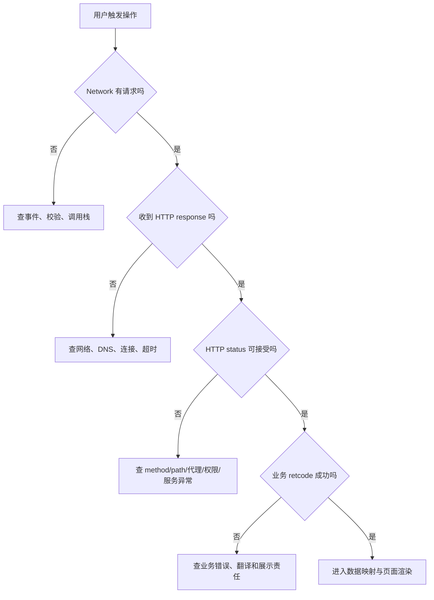

这个判断树的价值是让证据先于猜测。它不会替你定位所有问题，但会阻止你在“没有请求”的时候修改 Go handler，也会阻止你在业务错误时反复调整 dev proxy。

## React 16 Portal：类型契约与请求封装如何配合

`fbs-frontend/src/apis/inbound.ts` 为 Portal 入库列表定义请求与响应类型，并通过 `createApi<Params, Data>` 生成调用函数。`src/common/utils/createApi.ts` 会根据 HTTP method 决定参数位置：GET 使用 `params`，DELETE 使用 `data`，POST 等方法把参数作为 body；Blob 场景还有不同返回处理。

与 Vue JavaScript API 相比，TypeScript 类型让调用者在编译期更早看到字段名和可选性。例如请求类型没有 `seller_sku`，页面直接传入时可能触发类型检查；响应类型声明 `ir_list`，组件访问不存在的 `list` 会被发现。但这并不保证运行时契约正确。后端可以返回旧字段，代理可以给出 HTML 错误页，类型断言也可以绕过检查。

Portal 的 `src/utils/request.ts` 还体现了另一组运行约束：Axios 0.18、`withCredentials`、CSRF cookie/header、region/request-id/lang header，HTTP 错误与业务 `retcode` 分开处理，Blob 失败体可能是 JSON。课程不能拿 Axios 1.x 文档中的所有默认行为直接套到这个仓库；做具体改动时，应先读 lockfile/manifest 与当前封装，再使用对应版本文档解释公共 API。

所以 TypeScript contract 的正确定位是“编译期协作工具”，不是服务端真相。可信联调仍需对照浏览器实际 request/response、Go DTO 的 JSON tag、路由 method/path 和错误格式。

## React 18 MMF：相似封装不等于可以跨仓复制

`fbs-sc-react/basic/src/utils/MMF/request/request.ts` 也把普通、Blob、PII 与 PII Blob 分开，注入请求 header，检查 `retcode` 并调用 toast。它与 Vue wrapper 的职责相近，说明两个 Seller Center 模块共享相似宿主约束；但当前依赖是 Axios 1.12.2，类型、拦截器签名和部分行为与 Portal 的 Axios 0.18 不同。

跨仓改需求时可以迁移“意图”，不能直接迁移实现。你可以说三个仓都需要 request ID、语言、业务错误处理；不能把 React 18 的实例代码复制进 React 16 Portal，再期待旧 TypeScript 与 Axios 类型通过。也不能把 Vue wrapper 的 `hiddenErrorMessage` 用法想当然地写进 React 18，必须确认对应实例是否支持同名选项。

建议用职责矩阵比较，而不是做代码 diff：

| 职责 | SC Vue | Portal React 16 | SC React 18 |
| --- | --- | --- | --- |
| 应用前缀 | 普通实例配置 SC FBS baseURL | Portal wrapper 配置对应 baseURL | MMF request 实例配置 SC FBS 前缀 |
| 请求上下文 | request ID、语言、source，特定场景含 region/shop | region、request ID、语言、Cookie/CSRF | request ID、语言、source 等 |
| 业务错误 | response interceptor 检查 `retcode` | HTTP 与业务错误分层 | interceptor 检查 `retcode` 并 toast |
| 文件响应 | 独立 Blob 实例 | Blob 分支，失败可能解析 JSON | 独立 Blob 实例 |
| PII | 独立 PII/PII Blob 实例 | 按 Portal 现有边界核验 | 独立 PII/PII Blob 实例 |

矩阵帮助 reviewer 检查职责是否遗漏；具体字段和值仍回到当前代码。

## 前后端契约到底包含什么

很多接口文档只列 request/response JSON，这对真实联调不够。完整契约至少包括：HTTP method、最终 path、Content-Type、必要 header、鉴权/会话来源、请求字段及空值语义、响应 envelope、业务错误语义、文件/PII 分流、兼容策略和可观测标识。

以入库列表为例，当前可从代码确认：前端 POST 到 `/api/fbs/sc/inbound/request/list/`；请求 body 对应 Go `ScIrListReq` 的 JSON tag；wrapper 会补公共 header；后端成功响应由统一 wrapper 包装，业务失败也可能以 HTTP 200 返回错误 envelope。handler 当前还存在旧/新链路选择，因此新增可选筛选字段必须保证两条链路都能接受，或者明确新字段只在某条链路生效并给出兼容行为。

字段契约要特别关注三组区别。第一，缺失、`null`、空字符串、零和空数组不是同一个值。Go 的 `string`、`*string`、`[]string` 各自表达不同；TypeScript 的可选属性、`null` 联合类型也应与之对应。第二，字段名转换由 JSON tag 决定，不由 Go 字段名的大小写自动猜。例如 `SellerSku *string` 对外是 `seller_sku`。第三，列表排序、分页和时间字段需要明确单位与边界，否则双方都“类型正确”仍可能语义错误。

新增筛选字段时，先写契约卡：

```text
名称：seller_sku
位置：POST JSON body
前端类型：sellerSku?: string（提交前 trim；空值不发送）
后端字段：SellerSku *string `json:"seller_sku"`
缺失语义：不按 Seller SKU 过滤
空字符串语义：前端归一化为缺失；后端保持兼容
响应：不新增字段
错误：非法长度在字段附近提示；未知错误由统一层展示
兼容：旧调用方不传字段时行为完全不变
```

这张卡不是替代代码，而是让前后端在改动前对齐零值与兼容性。最终仍需用 request payload、handler 测试和接口响应证明。

## 用 Network 面板完成一次可复现联调

联调前先清空 Network，打开 Preserve log 只在需要跨页面保留请求时使用，并按接口路径过滤。触发一次列表查询后，不要只看 Preview；按以下顺序记录证据。

第一，确认 Request URL 与 Request Method。它们应对应 baseURL 拼接结果和 Chassis route。第二，看 Request Headers，确认 Content-Type、request ID、语言与当前场景需要的上下文，不要复制 Cookie 或凭据到工单。第三，看 Payload，区分 Query String Parameters 与 Request Payload，检查字段名、类型和空值是否符合契约。第四，看 Status、Response Headers 与 Response，区分 HTTP 层和业务层。第五，看 Timing，判断耗时主要在排队、连接还是等待响应；慢请求不等于前端渲染慢。

一份可复现记录至少包含：页面与操作、环境、时间、method/path、已脱敏 payload、HTTP status、业务 `retcode`、request ID、期望与实际、是否稳定复现。不要贴整段 Cookie、授权 header、真实 PII 或无关响应。

如果页面 toast 已消失，可用 Network 的 response 继续定位。如果 response 成功但页面仍空，问题已经越过请求层，转查数据解包、状态写入、computed/selector 与渲染条件。把责任边界说清，比在 request interceptor 里加日志更重要。

## 受控练习：给入库列表增加一个兼容筛选字段

练习目标不是提交业务仓，而是在独立练习分支或草稿中完成影响分析和最小 diff。假设需求是“入库列表可按 Seller SKU 精确筛选”，产品已确认空输入表示不筛选，旧调用行为不变。

### 第一步：定位调用链

在 Vue 入库页面搜索 `getRequestList` 的调用点，找出筛选表单到请求对象的映射。记录页面状态字段、提交函数、API 函数和 request 实例。再到后端 route 与 `ScIrListReq` 验证现有 `seller_sku` 是否已经存在。当前新链 DTO 已有 `SellerSku *string`，这意味着需求可能只缺前端接线，不能看到需求就先新增后端字段。

### 第二步：定义归一化规则

页面输入在提交前 trim。trim 后为空则不发送 `seller_sku`，避免把空字符串解释成真实过滤条件。不要把展示用的 `sellerSku` 直接改名为 snake_case 并污染组件状态；在 API 参数组装边界完成字段映射即可。

```javascript
const sellerSku = filters.sellerSku.trim()
const payload = {
  ...buildExistingFilters(filters),
  ...(sellerSku ? { seller_sku: sellerSku } : {}),
}
await getRequestList(payload)
```

这段是缩减示例，不保证可直接替换页面现有函数。实际改动必须复用当前页面已有的参数构造、分页重置和加载状态处理。

### 第三步：检查错误责任

列表查询失败时，统一 wrapper 已处理普通业务错误，页面不应无条件再 toast。若需求要求把“SKU 格式非法”显示在输入框旁，调用时应使用仓库支持的静默选项，并只对已确认的业务码设置字段错误；未知错误仍交回统一机制。不要按错误 message 文本做稳定分支，翻译和后端文案都可能变化。

### 第四步：准备验证矩阵

| 用例 | 前端 payload | 预期 |
| --- | --- | --- |
| 未输入 | 不含 `seller_sku` | 行为与改动前一致 |
| 只输入空格 | trim 后不含字段 | 不触发空字符串过滤 |
| 合法 SKU | `seller_sku: "SKU-001"` | 请求成功，列表按契约过滤 |
| 不存在 SKU | 发送合法值 | 成功空列表，不当作系统错误 |
| 网络中断 | 请求无可用 response | 只出现一次通用网络提示，可重试 |
| 业务错误 | HTTP 200、非成功 `retcode` | 按统一翻译规则展示一次 |

### 第五步：留下交接证据

提交给 reviewer 的不是一句“自测通过”，而是受影响文件、契约卡、两组 payload 截图或文本记录、类型/lint 结果、空值与错误用例，以及未验证项。完成开发交接后，后续发版遵循团队通用流程，本课程不展开。

## 常见误区与修正方法

### 在组件里创建新的 Axios 实例

它绕过宿主请求能力、baseURL、header、业务错误和监控。修正方法是先找同域 API 文件与同数据类型实例，只有现有封装确实无法表达需求时才在统一层扩展。

### 把所有字段都放进 query

这会让 POST DTO 绑定失败，还可能把敏感信息暴露在 URL。修正方法是同时对照 HTTP method、API 函数的 `params/data` 和后端 `HandleParam` 行为。

### HTTP 200 就当成功

SC 接口的业务错误可以使用 HTTP 200 envelope。修正方法是看 `retcode` 与 wrapper 的成功判断，不让页面直接消费未经检查的 response。

### 页面和 wrapper 都弹错误

用户看到两次提示，测试也难稳定。修正方法是明确展示责任：默认由统一层处理；字段级或可恢复交互才由页面接管，并使用封装已有的静默能力。

### 用 TypeScript 类型代替联调

类型不会读取真实响应。修正方法是把 TS、Go JSON tag、Network payload 和 handler 测试放在同一契约检查中。

### 直接复制另一仓的 request.ts

三仓 Axios 版本、宿主能力和错误策略不同。修正方法是迁移职责和测试用例，重新按目标仓当前封装实现。

### 先怪代理

没有 Network 请求时代理根本未参与；业务 `retcode` 失败时代理通常已经完成工作。修正方法是按四层失败模型先分类，再检查对应证据。

## 章末自检

完成本章后，请不用翻代码回答下面问题，再回仓库核对：

1. `getRequestList` 为什么用 POST 和 `data`，最终 path 如何由相对 URL 与 baseURL 组成？
2. request ID、语言和 shop/region 信息为什么不应由每个页面自行维护？
3. 传输失败、HTTP 失败和业务失败分别在 Network 与 Axios error 中留下什么证据？
4. Blob 成功体和 Blob 错误体为什么需要分流？
5. PII API 为什么不能复用普通 request，只换一个 URL？
6. TypeScript 请求类型与 Go DTO 不一致时，你会用哪些运行证据确认真相？
7. 同一需求落到 React 16、Vue 3 和 React 18 时，哪些职责可复用，哪些实现必须重新核验？
8. 新增可选筛选字段时，如何证明“不传字段时旧行为不变”？

如果只能背出文件名，还没有达到本章目标。你应能从页面行为出发，画出链路，指出每层输入输出，并用一条实际 Network 记录判断问题属于哪一层。

## 本章小结

FBS 前端的 API 调用是一条分层契约，不是一次裸 HTTP 调用。业务 API 函数确定 method、相对 path 和参数位置；request wrapper 统一补 baseURL、请求上下文、错误、Blob 与 PII 规则；宿主和代理负责把浏览器请求送到正确服务；页面只处理本业务状态和被明确接管的错误。

可靠联调从分类开始：没有请求、传输失败、HTTP 失败、业务失败和渲染失败分别查不同证据。TypeScript 能提前发现一部分字段问题，却不能替代 Network payload、Go DTO 和真实响应。下一章沿同一个 `/api/fbs/sc/inbound/request/list/` 进入后端，看看 Chassis route、SC wrapper、参数绑定、灰度分支与统一响应怎样兑现这份契约。

## 参考文献

- MDN Web Docs. [HTTP overview](https://developer.mozilla.org/en-US/docs/Web/HTTP/Guides/Overview). 访问于 2026-07-16。
- RFC Editor. [RFC 9110: HTTP Semantics](https://www.rfc-editor.org/rfc/rfc9110). 2022-06。
- TypeScript. [Handbook: Object Types](https://www.typescriptlang.org/docs/handbook/2/objects.html). 访问于 2026-07-16。
- Axios. [Request Config](https://axios-http.com/docs/req_config). 访问于 2026-07-16；具体行为须按各仓依赖版本与封装核验。
- Axios. [Handling Errors](https://axios-http.com/docs/handling_errors). 访问于 2026-07-16；具体行为须按各仓依赖版本与封装核验。


---

# 权限、i18n、时间、文件与 PII：页面功能的准入项

> 预计学习时间：120–160 分钟
> 一句话总结：能在写 FBS 页面时同步处理权限检查、多语言翻译、时区转换、文件上传下载和 PII 敏感信息边界——以"新增字段 + 导出"需求为主线，逐项加载仓库规则，用缺权限/不同时区/错误文件做反例验证。

## 这一章解决什么问题

后端同学写前端页面时，往往聚焦在"把数据正确显示出来"。但在 FBS 的前端仓库中，一个功能完整上线还需要通过五道准入检查：这个用户能看到这个页面/按钮吗？页面上的文字在不同语言下正确吗？时间是用 UTC 还是本地时区？导出文件是 Excel 还是 PDF，文件名怎么定？涉及 PII 的数据经过了敏感服务吗？

这些检查不是"最后加一下就行"——它们分布在路由、请求、组件、Store 的不同层面。本章用一个统一的需求主线"在入库列表增加一个联系人字段 + 导出功能"串联这五道检查，每道检查都给出仓库中现有的实现位置和代码样例。

学完本章后，你不会背完所有权限码和 i18n key，但你会在写任何新功能时自动问自己这五个问题，并且知道去哪里找答案。

> 本章基于三个前端仓库的 release 分支（2026-07-20）。权限码、i18n key、时区约定和 PII 规则以仓库当前代码为准。

## 权限：路由级和操作级两层控制

### 路由级权限（authCodes）

在 SC Vue 和 SC React 中，路由级权限由 `meta.authCodes` 控制：

```typescript
// SC Vue src/router/index.ts
meta: {
  authCodes: ['access_to_sbs', 'access_to_sbs_service_by_shopee'],
}
```

`authCodes` 由 Seller Center 宿主在用户进入模块前校验。如果用户不满足任一个 authCode，整个 FBS 模块不可见。这不是 FBS 自己能控制的——它是宿主层面的准入。

### 操作级权限（permissions）

进入模块后，具体页面和操作按钮由操作权限控制。Portal 和 SC 仓库使用类似模式：

```typescript
// Portal: 路由定义中的权限
meta: { permissions: ['VIEW_INBOUND_REQUEST'] }

// Portal: 页面中的按钮级权限
{hasPermission('PROCESS_INBOUND_REQUEST') && (
  <Button>创建入库单</Button>
)}

// SC Vue: 操作权限检查
const canModify = computed(() => {
  return hasPermission('INBOUND_MODIFY');
});
```

Portal 的权限码定义在 `src/constants/permissions.ts` 中，是一个数字到权限名的映射：

```typescript
export const PERMISSIONS = {
  VIEW_INBOUND_REQUEST: 1111,
  PROCESS_INBOUND_REQUEST: 1112,
  // ...
};
```

SC Vue 和 SC React 的权限检查依赖宿主提供的权限列表。`hasPermission` 函数在 `fbs-frontend/src/business/utils/permission.ts` 中定义（FE-L01 已讲过），核心逻辑是从 Redux Store 中读取 `permission_code_list`，然后 `includes` 判断。

### 新增功能时的权限步骤

当你需要新增一个受权限控制的功能时：

1. 确认权限码是否已在 `PERMISSIONS` 常量或权限管理平台中定义。如果没有，先在权限管理平台注册，再添加到代码中。
2. 在路由定义中配置 `permissions`（控制页面准入）或 `authCodes`（控制模块准入）。
3. 在页面中需要权限控制的操作按钮处加上 `hasPermission` 判断。
4. 测试无权限用户的体验：页面是否显示无权限提示（而不是白屏或报错），受限按钮是否正确隐藏。

## i18n：Transify、i18next 与翻译 key

### 翻译函数的正确调用方式

FBS 三个前端仓库使用 Transify 作为翻译管理平台。页面中所有用户可见的文案都必须通过 `$t()` 包裹：

```vue
<!-- Vue -->
<h1>{{ $t('inboundProblemId') }}: {{ id }}</h1>
<EdsTag>{{ $t('commonUrgent') }}</EdsTag>
```

```tsx
// React (Portal)
<h1>{$t('Inbound Request List')}</h1>
```

`$t` 接收一个翻译 key，返回当前语言对应的翻译文案。翻译 key 由 Transify 平台管理，前端通过 `yarn i18n:pull` 从远程拉取到本地 `src/lang/` 目录下的 JSON 文件。

### 翻译 key 的命名惯例

FBS 的翻译 key 没有强制的层级命名规则，但常见的模式是：

| 类型 | 示例 key | 含义 |
| --- | --- | --- |
| 通用文案 | `commonUrgent`、`commonModify`、`commonError` | 跨页面复用的按钮/提示文案 |
| 页面特化 | `inboundProblemId`、`ibtDefaultTreatment` | 只在特定页面使用的文案 |
| 状态值 | 状态 key 直接对应后端返回的枚举值 | 状态枚举的翻译 |

### 新增文案的流程

1. 在 Transify 平台创建新的翻译 key，填写各语言（中文、英文、泰文等）的翻译。
2. 在本地仓库执行 `yarn i18n:pull` 拉取最新翻译文件。
3. 在代码中使用 `$t('yourNewKey')`。

不要在代码中硬编码文案，也不要通过拼接字符串来"省 key"：

```javascript
// 错误：硬编码中文
<Button>创建入库单</Button>

// 错误：拼接——不同语言的语序可能不同
const msg = $t('create') + ' ' + $t('inbound') + ' ' + $t('request');

// 正确：使用完整的翻译 key
<Button>{$t('createInboundRequest')}</Button>
```

### Portal 的 $t 封装

Portal 在 `src/business/utils/i18n.ts` 中封装了 `$t`：

```typescript
export const $t: IntlT = generateTransifyCommon({
  project: 'fbs',
  t: (key, options) => {
    handleTranslateReport(key);
    return i18n.t(key, options);
  },
  isShowKey: false,
});
```

`isShowKey: false` 表示如果找不到翻译，不显示原始 key（而是显示空字符串或其他降级方案）。`handleTranslateReport` 用于翻译覆盖率上报——如果某个 key 缺失翻译，Transify 平台会收到报告。

SC React 中远端组件使用 `$gtForRemoteComponent`，它使用单花括号插值 `{var}` 而非双花括号 `{{var}}`——这是远端组件的宿主兼容约束，不要混用。

## 时间：秒/毫秒、UTC/本地时区与格式化

### FBS 的时间契约

FBS 后端（Go）返回的时间戳通常是**秒级 Unix 时间戳**。前端接收到后需要 `* 1000` 转为毫秒才能传给 `new Date()`：

```javascript
// 后端返回：mtime: 1720000000（秒）
const date = new Date(item.mtime * 1000);
```

不同接口可能有不同的时间格式（秒级时间戳、毫秒级时间戳、ISO 8601 字符串）。读 API 文档或响应样例时先确认时间格式，不要假设所有接口都返回相同的格式。

### 时区边界

FBS 是跨国业务，卖家可能分布在巴西（UTC-3）、新加坡（UTC+8）、泰国（UTC+7）等不同时区。前端的时间处理规则：

- **存储和传输**：统一使用 UTC。API 的请求和响应中的时间戳/ISO 字符串都应该是 UTC。
- **展示**：按用户所在时区格式化。使用 `toLocaleDateString` 或 `Intl.DateTimeFormat`。
- **日期选择器**：选择的日期通常按当天 00:00 本地时间处理，需要转成 UTC 时间戳发给后端。

```javascript
// 展示：按用户时区格式化
const displayDate = new Date(timestamp * 1000).toLocaleDateString('zh-CN');
// 输出：2026/7/20

// 发给后端：日期选择器选中的日期转 UTC 时间戳
const selectedDate = new Date('2026-07-20'); // 本地时间 00:00
const utcTimestamp = Math.floor(selectedDate.getTime() / 1000);
```

关键边界：`new Date('2026-07-20')` 在不同时区的浏览器中行为不同。在 UTC+8 的浏览器中它是 `2026-07-20 00:00:00 +0800`，在 UTC-3 中是 `2026-07-20 00:00:00 -0300`。如果你需要精确的 UTC 午夜，使用 `new Date('2026-07-20T00:00:00Z')`。

### FBS 仓库中的时间工具

三个仓库各自封装了时间处理工具函数。写新功能时，优先搜索仓库中已有的时间格式化函数而不是手写 `new Date().getXxx()`：

```bash
# 在仓库中搜索时间相关工具函数
rg "formatTime|formatDate|toLocale" --include='*.ts' --include='*.js'
```

## 文件：下载、上传与 Blob 处理

### 文件下载：区分普通请求和 Blob 请求

FBS 的文件导出（Excel、PDF）使用专门的 Blob 请求实例。以 SC Vue 为例：

```javascript
// 普通请求——返回 JSON，自动解包
export const exportForExcel = (data) => request({
  url: '/inbound/request/export/excel',
  method: 'POST',
  data,
});

// Blob 请求——返回二进制，不解包
export const exportSyncPdf = (data) => blobRequest({
  url: '/inbound/request/export/pdf',
  method: 'POST',
  data,
});
```

`blobRequest` 是 `app.request.clone({ responseType: 'blob' })`，配置了 `responseType: 'blob'` 告诉 Axios 不要将响应解析为 JSON。收到 Blob 后，需要通过临时 URL 触发浏览器下载：

```javascript
const blob = await exportSyncPdf({ ir_id: id });
const url = URL.createObjectURL(blob);
const a = document.createElement('a');
a.href = url;
a.download = `inbound_${id}.pdf`;
a.click();
URL.revokeObjectURL(url);
```

### 文件上传

FBS 的上传功能通常使用 FormData + POST：

```javascript
const formData = new FormData();
formData.append('file', file);
formData.append('ir_id', id);

await request({
  url: '/inbound/request/upload',
  method: 'POST',
  data: formData,
  headers: { 'Content-Type': 'multipart/form-data' },
});
```

上传前通常需要前端校验文件类型和大小：

```javascript
const MAX_SIZE = 10 * 1024 * 1024; // 10MB
const ALLOWED_TYPES = ['.xlsx', '.xls', '.csv'];

if (file.size > MAX_SIZE) {
  EdsToastInstance.error($t('fileTooLarge'));
  return;
}
if (!ALLOWED_TYPES.some(ext => file.name.endsWith(ext))) {
  EdsToastInstance.error($t('fileTypeNotAllowed'));
  return;
}
```

### 导出文件命名

文件名通常包含业务标识、时间戳和文件类型：

```javascript
// 命名模式
const fileName = `Inbound_Request_${ir_id}_${Date.now()}.pdf`;
```

`Date.now()` 用于生成唯一文件名，避免浏览器缓存问题。

## PII：敏感信息的处理边界

### PII 请求使用独立的 request 实例

FBS 中涉及敏感信息（姓名、电话、邮箱、证件号等）的请求，必须使用 `piiRequest` 而非普通的 `request`：

```javascript
// SC Vue src/utils/request.js
export const piiRequest = app.request.clone({
  baseURL: '/api/fbs/pii/sc',  // 指向敏感数据服务
  unpackData: false,
});
```

PII 请求指向 `/api/fbs/pii/sc` 而非普通业务请求的 `/api/fbs/sc`。后端 `fbs-sensitive-data-server` 专门处理敏感数据，提供独立的鉴权、审计和脱敏能力。

### PII 的展示边界

即使通过 PII 接口获取了敏感数据，前端展示时仍然要遵循最小展示原则：

- 姓名：可能需要部分脱敏（如"张**"）。
- 电话：通常需要脱敏（如"138****1234"）。
- 证件号：绝不在页面上完整展示，仅展示部分或完全隐藏。
- 邮箱：视业务需求决定是否脱敏。

脱敏通常在服务端完成（`fbs-sensitive-data-server` 的响应中已经脱敏），但前端不能假设服务端一定会脱敏——展示前应做二次检查。FBS 仓库中有对应的脱敏工具函数，在展示 PII 数据时优先使用。

### PII 数据的日志与存储

PII 数据绝不能出现在以下位置：

- `console.log()` 或任何前端日志。
- 浏览器 localStorage/sessionStorage。
- URL 查询参数（除非已脱敏）。
- 错误上报的 payload 中。

如果必须在前端临时持有 PII 数据（如编辑表单），使用后应立即清理。不要将 PII 数据存入 Redux/Vuex Store 的持久化部分。

### PII 的权限检查

访问 PII 数据通常需要更高的权限级别。在 FBS Portal 中，查看卖家详情的 PII 字段需要 `CLIENT_DETAIL_ALL` 权限码；SC 仓库中 PII 相关操作需要宿主层面的额外授权。

```javascript
// Portal: 只有特定权限才能看完整信息
{hasPermission('CLIENT_DETAIL_ALL') ? (
  <FullDetail data={piiData} />
) : (
  <MaskedDetail data={piiData} />
)}
```

## 综合任务：新增字段 + 导出

将以上五道检查串联为一个实际任务。假设需求是：在入库列表中新增"紧急联系人"字段和导出 Excel 功能。

### 需求拆解

| 关注点 | 需要做什么 | 仓库位置 |
| --- | --- | --- |
| 权限 | 确认是否需要新权限码 | `constants/permissions.ts` |
| i18n | 新增翻译 key：`inboundUrgentContact`、`exportInboundList` | Transify 平台 → `yarn i18n:pull` |
| 时间 | 确认导出文件名中的时间格式 | 现有导出函数参考 |
| 文件 | 新增 Excel 导出 API（blobRequest） | `src/api/inbound.js` |
| PII | 判断"紧急联系人"是否属于 PII，如果是走 piiRequest | `src/utils/request.js` |

### 实现检查清单

1. **权限**：如果导出功能需要特定权限，在操作按钮上添加 `hasPermission` 判断。
2. **i18n**：列表列头和导出按钮文案使用 `$t('inboundUrgentContact')`。
3. **时间**：导出文件名包含 `YYYYMMDD` 格式的当前日期。
4. **文件**：使用 `blobRequest` 发送导出请求，接收 Blob 后触发浏览器下载。
5. **PII**：如果"紧急联系人"是 PII，展示时脱敏；导出时确认权限和审计。

### 反例验证

| 反例 | 预期行为 |
| --- | --- |
| 无导出权限用户访问页面 | 导出按钮隐藏 |
| 英文语言下的页面 | 列头显示"Urgent Contact" |
| 巴西时区用户导出 | 文件名中的日期是巴西当地时间 |
| 导出请求网络错误 | Toast 提示 + 不下载破损文件 |
| PII 数据出现在 console.log | ESLint/代码审查应拦截 |

## 常见错误

### 硬编码文案

```vue
<!-- 错误 -->
<Button>Create Inbound Request</Button>
<!-- 正确 -->
<Button>{{ $t('createInboundRequest') }}</Button>
```

### 时间戳未区分秒/毫秒

```javascript
// 错误：后端返回秒级时间戳，前端直接当毫秒用
new Date(item.mtime);  // 日期是 1970 年！

// 正确：
new Date(item.mtime * 1000);
```

### PII 走普通请求

```javascript
// 错误：敏感数据走普通 request
const data = await request({ url: '/some/pii/endpoint' });
// 正确：
const data = await piiRequest({ url: '/some/pii/endpoint' });
```

### 导出文件名含特殊字符

```javascript
// 可能在某些浏览器/OS 中失败
const fileName = `入库单_${irId}_${name}.pdf`;
// 更安全：使用 ASCII 字符
const fileName = `Inbound_${irId}_${Date.now()}.pdf`;
```

## 练习

### i18n 缺失排查

在 SC Vue 仓库中，找一个未在 Transify 注册但页面中直接写了中文的地方（提示：搜索非 `$t()` 包裹的中文字符）。评估它是否需要改为 `$t()`。

### 时间处理审查

在 `fbs-sc-vue/src/views/inbound/` 目录下搜索 `new Date(` 或 `mtime` 的使用。检查所有时间处理是否正确处理了秒/毫秒转换。

### PII 数据流追踪

在 SC Vue 仓库中追踪 `piiRequest` 的一个用例。从页面调用开始，经过 API 函数、request wrapper、到后端路由。标注在每一层中 PII 数据是否被正确保护。

### 参考答案

**8.3**：`piiRequest` 的 `baseURL: '/api/fbs/pii/sc'` 将请求路由到 `fbs-sensitive-data-server` 而非主服务。请求 header 中注入的 `lang-id`、`fbs-sc-source` 等信息同样由 wrapper 注入。后端敏感服务返回的数据已经脱敏，前端不应做额外的日志输出。

## 参考文献

- [MDN Intl.DateTimeFormat](https://developer.mozilla.org/en-US/docs/Web/JavaScript/Reference/Global_Objects/Intl/DateTimeFormat) — 时区感知的日期格式化
- [MDN Blob](https://developer.mozilla.org/en-US/docs/Web/API/Blob) — 二进制数据对象
- [MDN URL.createObjectURL](https://developer.mozilla.org/en-US/docs/Web/API/URL/createObjectURL) — Blob 下载
- [Axios v0.18 Response Type](https://github.com/axios/axios/tree/v0.18.0) — Portal 的 Blob 请求配置
- [RFC 9110 HTTP Semantics](https://www.rfc-editor.org/rfc/rfc9110) — HTTP 请求/响应语义


---

# 前端纵向切片：为入库列表增加一个受控能力

> 预计学习时间：150–200 分钟
> 一句话总结：整合模块二的组件、路由、状态、API、权限、i18n 和文件处理能力，在 SC Vue 仓库中完成一个从需求分析到可运行验证的完整前端切片——新增一个筛选能力并验证全链路。

## 这一章解决什么问题

前面六章分别覆盖了 FBS 前端开发的六个独立维度：FE-W01 启动了三仓工程并建立了仓库地图；FE-W02 讲了组件树、表单和表格的读写模式；FE-W03 讲了 URL → 路由 → 菜单的映射关系；FE-W04 分析了三仓各自的状态管理架构；FE-W05 深入了 API 请求链路、错误分层和前后端契约；FE-W06 补上了权限、i18n、时间、文件处理和 PII 的准入规则。

但你还缺一个关键能力：把所有维度串成一条完整的改动链。本章不会讲任何新概念——它把前面六章覆盖的所有知识点整合为一条练习路径，带你从需求出发，在 SC Vue 仓库的入库列表页面中实际新增一个「优先仓」筛选字段，逐层完成从筛选表单到 API 参数、从列表展示到 i18n 翻译的完整改动，每步保留可验证的中间状态，最终产出可交付的 git diff 和验收记录。

本章以 SC Vue 仓库的入库列表为主练习场。改动内容：「为入库列表增加一个优先仓（priority warehouse）下拉筛选」——涉及筛选表单、API 参数传递、列表展示三个层面，是一道真实且范围可控的前端需求。Portal 和 SC React 仓库的对应改动留作迁移分析题。

> 本章基于 SC Vue 仓库的 release 分支（2026-07-20）。本章不做后端开发、不做新建路由、不做权限码注册——那些属于全栈纵向切片的范围。

## 确认验收样例

在动手之前，先把「做完」定义为可验证的用例表。这张表是本章所有步骤的目标——每完成一步，都回来对照，确认没有偏离。

| 用例 | 操作 | 预期结果 | 验证方式 |
| --- | --- | --- | --- |
| 正常筛选 | 筛选栏选择「优先仓 = A」，点击搜索 | 列表只显示对应优先仓的入库单 | Network 面板确认请求参数含 `priority_whs`；页面列表数据正确 |
| 清除筛选 | 清除「优先仓」选择，点击搜索 | 列表显示所有入库单 | Network 面板确认请求参数不含 `priority_whs` |
| 空结果 | 选择无数据的优先仓 | 列表显示空态提示「暂无符合条件的数据」 | 肉眼确认 |
| 回归 | 其他筛选条件（status、date range 等）仍正常 | 无回归问题 | 逐个测试原有筛选字段 |
| i18n | 切换语言为英文 | 筛选项标签、空态文案正确显示英文 | 肉眼确认 |

为什么先写验收用例？因为在真实需求中，验收标准决定了你什么时候可以停下来——没有它，你会不自觉地在细节上反复修改，或者在验了一半时开始怀疑"这样算不算做完"。

## 第一步：定位入库列表的完整调用链

需求是「加一个筛选字段」。但你面对的是一个已有的页面——必须先理解它现在的结构，才能安全地在里面加东西。

### 找到页面入口

SC Vue 仓库的页面遵循「一个页面 = 一个目录」的组织方式。入库列表的入口在 `src/views/inbound/IBT/list/`。这个目录下通常有：

```
list/
  index.vue          ← 列表页主组件
  searchForm.vue      ← 筛选表单组件
  list.vue            ← 列表表格组件
```

打开 `src/views/inbound/IBT/list/index.vue`，你会看到类似这样的结构：

```vue
<template>
  <div class="ibt-list-page">
    <SearchForm :form="searchForm" @search="handleSearch" @reset="handleReset" />
    <List :data="tableData" :loading="loading" />
    <Pagination :current="page" :total="total" @change="handlePageChange" />
  </div>
</template>
```

这里的关键信息是数据流方向：`searchForm` 作为 Props 传给 `SearchForm`，用户操作通过 `@search` 事件向上传递，`handleSearch` 负责调用 API 并更新 `tableData`。

### 追踪筛选表单的数据结构

打开 `src/views/inbound/IBT/list/searchForm.vue`，找到 `form` 对象的定义：

```vue
<script>
export default {
  props: {
    form: { type: Object, required: true }
  },
  data() {
    return {
      statusOptions: [],
      warehouseOptions: []
    }
  }
}
</script>
```

注意这里的关键信息：`form` 是 Props 传入的——它不是 searchForm 内部的 data。这意味着 form 的初始值在父组件 `index.vue` 中定义。打开 `index.vue` 找到它：

```javascript
data() {
  return {
    searchForm: {
      status: '',
      date_range: [],
      keyword: ''
    }
  }
}
```

现在你知道了 form 的结构——新增字段时，需要同时在 index.vue 的 `searchForm` 初始化和 searchForm.vue 的模板中各加一处。

### 追踪搜索触发后的 API 调用

`searchForm.vue` 中点击搜索按钮时，`$emit('search', this.form)` 将整个 form 对象传给父组件。找到 `index.vue` 中的 `handleSearch` 方法：

```javascript
methods: {
  async handleSearch(params) {
    this.page = 1
    await this.fetchList(params)
  },
  async fetchList(params) {
    this.loading = true
    try {
      const res = await getInboundList(this.buildParams(params))
      this.tableData = res.data.list
      this.total = res.data.total
    } finally {
      this.loading = false
    }
  },
  buildParams(params) {
    // 关键：清除空值，避免 ?status=&keyword= 这样的请求
    const cleaned = {}
    Object.keys(params).forEach(key => {
      if (params[key] !== '' && params[key] !== undefined && params[key] !== null) {
        cleaned[key] = params[key]
      }
    })
    cleaned.page = this.page
    cleaned.page_size = this.pageSize
    return cleaned
  }
}
```

这段 `buildParams` 是整个数据流的**关键节点**：它决定了哪些 form 字段会进入 API 请求。新增字段时，`buildParams` 已经通过 `Object.keys(params)` 自动处理你在 form 中新加的 key——只要 key 的值不为空字符串，就会被包含。这意味着你在 form 中加一个新字段后，大多数情况下不需要修改 `buildParams`——但你需要确认这一点，而不是假设。

### 找到 API 函数

`getInboundList` 在 `src/api/inbound.js` 中定义：

```javascript
import request from '@/utils/request'

export function getInboundList(params) {
  return request({
    url: '/inbound/list',
    method: 'get',
    params
  })
}
```

现在你有了完整的调用链图：

```
searchForm.vue (用户选择筛选条件)
  → $emit('search', form)
  → index.vue handleSearch(form)
  → index.vue buildParams(form) → 清除空值 → 拼装分页参数
  → getInboundList(params)
  → request({ url: '/inbound/list', method: 'get', params })
  → 后端 API
  → 响应 → this.tableData → List 组件渲染
```

在这一步，你的目标是**画出这张图**——不需要改任何代码。这个习惯——「先画调用链，再动手改」——在后续所有前端纵向切片中都会反复用到。

## 第二步：新增筛选字段

现在你知道数据流了，可以安全地加字段。分三个文件修改。

### 2.1 form 初始化（index.vue）

在 `index.vue` 的 `searchForm` 中新增字段：

```javascript
// 修改前
data() {
  return {
    searchForm: {
      status: '',
      date_range: [],
      keyword: ''
    }
  }
}

// 修改后
data() {
  return {
    searchForm: {
      status: '',
      date_range: [],
      keyword: '',
      priority_whs: ''     // ← 新增：优先仓筛选，默认全部（空字符串 = 不筛选）
    }
  }
}
```

初始值设为空字符串——与 status 字段一致。FBS 的 `buildParams` 函数会过滤掉空字符串，不筛选时不传参数。

### 2.2 筛选表单 UI（searchForm.vue）

在 `searchForm.vue` 模板中新增筛选下拉：

```vue
<!-- 修改前 -->
<EdsForm :model="form">
  <EdsFormItem :label="$t('inboundStatus')" prop="status">
    <EdsSelect v-model="form.status" :options="statusOptions" clearable :placeholder="$t('pleaseSelect')" />
  </EdsFormItem>
  <!-- 其他现有字段... -->
  <EdsFormItem>
    <EdsButton type="primary" @click="handleSearch">{{ $t('search') }}</EdsButton>
    <EdsButton @click="handleReset">{{ $t('reset') }}</EdsButton>
  </EdsFormItem>
</EdsForm>

<!-- 修改后 -->
<EdsForm :model="form">
  <EdsFormItem :label="$t('inboundStatus')" prop="status">
    <EdsSelect v-model="form.status" :options="statusOptions" clearable :placeholder="$t('pleaseSelect')" />
  </EdsFormItem>
  <!-- ↓ 新增：优先仓筛选 -->
  <EdsFormItem :label="$t('priorityWarehouse')" prop="priority_whs">
    <EdsSelect v-model="form.priority_whs" :options="priorityWarehouseOptions" clearable :placeholder="$t('all')" />
  </EdsFormItem>
  <!-- 其他现有字段保持不变... -->
  <EdsFormItem>
    <EdsButton type="primary" @click="handleSearch">{{ $t('search') }}</EdsButton>
    <EdsButton @click="handleReset">{{ $t('reset') }}</EdsButton>
  </EdsFormItem>
</EdsForm>
```

几处需要确认的细节：

- `v-model="form.priority_whs"` 绑定的是 form 对象的属性——注意它必须在 `index.vue` 的 `searchForm` 中已定义（2.1 已做）。
- `clearable` 属性让用户能清空选择回到「全部」状态——这对应验收用例中的「清除筛选」路径。
- `placeholder="$t('all')"` 在未选择时显示「全部」——这个文案需要 i18n 翻译。

### 2.3 下拉选项数据

优先仓的选项从哪里来？FBS 仓库中下拉选项通常有三个来源：

1. **硬编码常量**（`src/constants/` 目录）：选项固定且变更不频繁的场景——如状态枚举。
2. **Store 初始化数据**：从后端接口拉取后存入 Vuex Store，全局复用。
3. **组件内 API 调用**：选项数据只在本页面使用，每次挂载时请求。

优先仓列表如果是一个确定且不常变的枚举（如 A、B、C 三个仓），用硬编码常量最直接：

```javascript
// src/constants/warehouse.js（如已存在则追加）
export const PRIORITY_WAREHOUSE_OPTIONS = [
  { label: '仓 A', value: 'A' },
  { label: '仓 B', value: 'B' },
  { label: '仓 C', value: 'C' }
]
```

在 `searchForm.vue` 中引入：

```javascript
// 修改后
import { PRIORITY_WAREHOUSE_OPTIONS } from '@/constants/warehouse'

export default {
  props: {
    form: { type: Object, required: true }
  },
  data() {
    return {
      statusOptions: [],
      priorityWarehouseOptions: PRIORITY_WAREHOUSE_OPTIONS,  // ← 新增
      warehouseOptions: []
    }
  }
}
```

如果选项来自后端接口，参考 FE-W05 中「受控练习」的步骤——先确认后端 DTO 中的字段名和值类型，再用 Store 或 API 获取。**不要假设后端接口已经支持这个字段**——如果后端尚未提供，可以先硬编码选项把前端 UI 和流程跑通，在后端就绪后替换数据源。这属于练习三中讨论的「部分交付」策略。

## 第三步：确认 API 参数传递

第二步完成后，你已经在 form 中新增了 `priority_whs` 字段。但别急着假设参数会自动正确传递——验证它。

### 3.1 buildParams 的自动处理

回到 `index.vue` 的 `buildParams` 方法。因为它在遍历 `params` 对象的 key 时用的是 `Object.keys(params)`，新增的 `priority_whs` 会自动被包含：

```javascript
buildParams(params) {
  const cleaned = {}
  Object.keys(params).forEach(key => {
    if (params[key] !== '' && params[key] !== undefined && params[key] !== null) {
      cleaned[key] = params[key]
    }
  })
  // 此时 params 包含 { status: 'PENDING', priority_whs: 'A', keyword: '', ... }
  // cleaned 会是 { status: 'PENDING', priority_whs: 'A', page: 1, page_size: 20 }
  // keyword 因为空字符串被过滤掉了——符合预期
  cleaned.page = this.page
  cleaned.page_size = this.pageSize
  return cleaned
}
```

验证步骤：选择「优先仓 = A」后点击搜索，打开浏览器 DevTools → Network 面板，找到 `/inbound/list` 请求，检查 Query String Parameters：

```
page: 1
page_size: 20
status: PENDING
priority_whs: A      ← 确认这个字段出现在请求中
```

清除优先仓选择后再次搜索，确认 `priority_whs` 不再出现在 Query String Parameters 中。

### 3.2 与后端的字段名对齐

这是联调时最容易出问题的地方。前端传的字段名必须和后端 DTO 中的 `form` tag 一致。如果后端 DTO 中定义的是：

```go
type ScIrListReq struct {
    PriorityWarehouse *string `json:"priority_warehouse" form:"priority_warehouse"`
}
```

而前端传的是 `priority_whs`，后端会忽略这个字段——因为 Chassis 的 `form` tag 绑定按字段名精确匹配，不匹配的 key 被静默丢弃，不报任何错误。

**验证方式**：在你确信后端接口已就绪的情况下，用 Network 面板确认参数名和后端 DTO 一致。如果联调时发现筛选不生效，第一步不是怀疑后端逻辑有问题，而是确认字段名是否完全匹配。

## 第四步：调整列表展示

需求只要求加一个筛选字段——列表列不需要变。但如果实际需求中需要新增列表列（比如显示每条入库单对应的优先仓名称），按以下模式处理。

打开 list.vue，找到列定义：

```javascript
// 修改前
columns: [
  { prop: 'ir_id', label: this.$t('irId'), width: 120 },
  { prop: 'status', label: this.$t('status'), width: 100,
    formatter: (row) => this.$t(row.status) },
  // ... 其他列
]

// 修改后（如果需求要加列）
columns: [
  { prop: 'ir_id', label: this.$t('irId'), width: 120 },
  { prop: 'status', label: this.$t('status'), width: 100,
    formatter: (row) => this.$t(row.status) },
  // ↓ 新增
  { prop: 'priority_warehouse', label: this.$t('priorityWarehouse'), width: 120,
    formatter: (row) => row.priority_warehouse || '--' },
  // ... 其他列
]
```

`formatter` 中的 `|| '--'` 处理空值——当后端字段未返回或为 null 时，显示 `--` 而非空白。FBS 仓库中这个降级文案的惯例是 `--` 或 `$t('none')`，以当前仓库实际写法为准。

## 第五步：i18n、空态与错误处理

### 5.1 翻译 key

本改动至少需要两个翻译 key：

| key | 中文 | 英文 |
| --- | --- | --- |
| `priorityWarehouse` | 优先仓 | Priority Warehouse |
| `all` | 全部 | All |

FBS 的 i18n 流程（FE-W06 已详述）：在 Transify 平台创建 key → 填写中文/英文翻译 → 执行 `yarn i18n:pull` 拉取到本地 `src/lang/` 目录。注意命名规则：FBS 仓库使用 camelCase 命名（`priorityWarehouse` 而非 `priority_warehouse`）。

完成后验证：切换系统语言为英文，确认筛选标签显示 "Priority Warehouse"，占位符显示 "All"。

### 5.2 空数据处理

当筛选条件无匹配结果时，列表应显示空态组件。在 `index.vue` 的模板中确认：

```vue
<List v-if="!loading && tableData.length > 0" :data="tableData" />
<EmptyState v-else-if="!loading" :description="$t('noMatchingData')" />
```

注意空态文案用「暂无符合条件的数据」而非「暂无数据」——前者告诉用户「你的筛选条件没有命中结果」，后者可能让用户误以为「系统里什么数据都没有」。这个差异在边界用例中很重要。

### 5.3 错误处理

FBS 的 request wrapper（`src/utils/request.js`）在响应拦截器中已统一处理 HTTP 错误（自动 toast 提示、401 跳转登录）。对于本需求，你不需要在组件中额外写 try-catch——`fetchList` 中已有的 `try { ... } finally { this.loading = false }` 模式已经覆盖了正常的错误流程。但如果需要在特定错误时做更精细的处理（如某错误码下显示特定提示而非通用 toast），在 catch 分支中按 FE-W05 的四层错误模型处理。

## 第六步：验证与回归

### 6.1 逐条验收

按「确认验收样例」中的 5 个用例逐条执行：

**正常筛选实验**：选择优先仓 = A → 搜索 → Network 面板截图确认 `priority_whs=A` 在请求参数中 → 列表只显示对应数据。

**清除筛选实验**：点击优先仓下拉的清除按钮 → 搜索 → Network 面板截图确认请求参数不含 `priority_whs` → 列表恢复全部数据。

**空结果实验**：选择无数据的优先仓 → 搜索 → 确认列表展示 `noMatchingData` 文案 → 确认不会出现 loading 无限转圈或报错。

**回归实验**：不选优先仓，用 status、date range 等原有筛选独立和组合筛选 → 确认结果与之前一致。

**i18n 实验**：切换语言 → 确认所有新增文案正确切换。

### 6.2 代码质量

```bash
yarn lint
```

确认无新增 lint 错误——如果有，追溯错误信息到具体行修复。打开 Console，确认无红色 error 和黄色 warning（忽略与本次改动无关的既有 warning）。如果出现 `[Vue warn]: Invalid prop` 或 `Cannot read property of undefined`，回到第二步和第三步检查 Props 传递链和 API 响应结构。

### 6.3 最终的 git diff

```bash
git diff
```

你应该看到大约 3-4 个文件的改动，每个文件的改动量在 5-15 行左右：

```
src/views/inbound/IBT/list/index.vue         ← searchForm 新增字段
src/views/inbound/IBT/list/searchForm.vue    ← 模板新增下拉 + 引入常量
src/constants/warehouse.js                   ← 新增选项常量（如需要）
src/lang/zh-CN.json / src/lang/en-US.json    ← i18n 新增 key
```

## 跨仓影响记录

即使本章只在 SC Vue 中实际操作，你需要能回答以下问题——它们决定了你的改动是否对另外两个仓库造成影响。

Portal 的入库列表在 `src/views/InboundManagement/` 下，是一个 React 类组件/函数组件。筛选状态通过 Redux Store 管理，API 调用走 `src/utils/request.ts` 的 Axios wrapper。加优先仓筛选需要修改：列表组件（新增 Select 组件 + dispatch action）、Redux Store（新增筛选字段到 state + reducer case）、API 类型定义（`src/apis/inbound.ts` 中的 params 类型新增 `priority_whs?: string`）、i18n 翻译文件（`src/lang/`）。

SC React 的入库列表以远端组件（InboundComponent）形态存在——它由主模块通过 Module Federation 加载。加优先仓筛选需要修改：远端 InboundComponent 的 Props 类型定义和渲染逻辑、主模块调用 InboundComponent 时传入新的 Props 值、项目的 API 函数文件和翻译文件。关键风险：如果新增 Props 且主模块未更新调用代码，组件使用 Props 默认值（可能为 undefined），筛选能力不生效但不报错——这比报错更难发现。

| 对比维度 | SC Vue（本章主场地） | Portal | SC React |
| --- | --- | --- | --- |
| 筛选状态位置 | index.vue data | Redux Store | 宿主演入 Props |
| 新增筛选字段改动量 | 2 个 Vue 文件 | 组件 + Store + Action + API 类型 | 远端组件 + 主模块调用 + API |
| API 参数 | 通过 buildParams 自动处理 | 需在 action creator 中显式提取 | 需在 Props 和 action creator 中显式提取 |
| i18n | Transify + vue-i18n | Transify + react-i18next | Transify + react-i18next |

后端 API 是同一个——`/inbound/list`。所以 API 参数的字段名在三仓中必须一致。如果你在 SC Vue 中用的是 `priority_whs`，Portal 和 SC React 也必须用 `priority_whs`，否则请求到后端时被忽略。

## 练习

### 练习一：完成主仓库切片

在 SC Vue 仓库中完成本章描述的优先仓筛选改动。完成后保存 `git diff` 输出和 Network 面板中「选择优先仓」和「清除优先仓」两次请求的截图。逐条核对 5 个验收用例是否全部通过。

### 练习二：迁移分析

写出 Portal 和 SC React 仓库中实现相同改动需要修改的具体文件路径和每个文件的改动内容。不要求实际改代码——但要写出每个文件的改动描述（如「在 XXX 组件中新增 Select 元素」「在 Redux action creator 中新增 priority_whs 参数提取」「在 API 类型定义中新增可选字段」）。

### 练习三：边界扩展

如果后端接口尚未支持 `priority_whs` 参数，分析三种策略的适用场景和风险：

1. **前端本地筛选**：调用全量数据后在前端用 `Array.filter` 筛选。优点是不依赖后端，立即可验证 UI；缺点是分页不准确（前端只拿了当前页数据，筛选后结果少于预期）且大数据量时性能差。**仅在 prototype 阶段使用，不要合入主分支。**
2. **先写契约、后对接**：前端按后端将提供的字段名和值类型写好参数传递逻辑，后端上线后自然对接。优点是不产生技术债、前端不需要回滚代码；缺点是无法立即端到端验证筛选效果。**这是推荐策略。**
3. **feature flag 包裹**：用环境变量或配置开关控制筛选 UI 的展示，后端上线后打开。优点是可以在生产环境中安全部署、逐步放量；缺点是增加了配置复杂度。

### 练习四：自测清单设计

为你在练习一中完成的实际改动编写一份自测清单，至少包含 6 个验收项，覆盖：
- 正常路径（至少 3 项：带筛选参数正常返回、清除筛选后全量返回、分页切换时筛选条件保持）
- 边界路径（至少 2 项：空结果展示、API 返回 500 时页面不崩溃）
- 回归路径（至少 1 项：其他筛选字段在新增字段后仍正常）

每项写出操作步骤和预期结果。

## 自检

1. 从需求到交付的完整前端纵向切片包含哪些步骤？为什么每步都要保留可验证的中间状态？
2. 在改代码之前，为什么要先画出调用链？画出调用链具体要看哪些节点？
3. `buildParams` 函数过滤空值的逻辑是如何影响新字段的？为什么大多数情况下你不需要修改它？
4. 跨仓影响分析需要回答哪些问题？为什么只改一个仓库的代码但需要拉另外两个仓库的 diff？
5. 验收用例为什么必须覆盖正常路径、边界路径和回归路径？少一个会带来什么风险？

## 参考文献

- 模块二 FE-W01 ~ FE-W06 各章内容
- SC Vue 仓库 `src/views/inbound/IBT/list/` 目录下的组件
- SC Vue 仓库 `src/api/inbound.js` 的列表请求函数
- FE-W05 API 请求链路与错误分层模型
- FE-W06 i18n 翻译流程与权限控制


---

# 三种应用生命周期与宿主边界

> 预计学习时间：120–160 分钟
> 一句话总结：能区分 Portal SPA、Vue MMF module、React 18 MMF module 三种 FBS 前端形态的加载链路——从入口文件到页面渲染，解释关键对象、宿主交接信息、失败点和观测方法。

## 这一章解决什么问题

模块二教你分别在三个仓库里写组件、加路由、调接口。但还有一个根本问题没回答：当你打开浏览器访问 FBS 页面时，从 URL 输入到页面渲染，中间到底发生了什么？

Portal 的 `localhost:8099`、SC Vue 的 `localhost:4200`、SC React 的动态端口——三者的启动方式你已经会了，但它们背后的初始化流程完全不同。Portal 是自己渲染自己的 SPA，SC 两个仓库是 MMF 模块，依赖 Seller Center 宿主注入路由、Store、请求实例和全局依赖。不理解这些差异，你在排查白屏、路由 404、Store 未初始化等问题时只能靠猜。

本章以一条真实的 FBS 页面 URL 为线索，分别在三个仓库中追踪它的加载链路。你会逐站定位 entry 文件、宿主注入点、路由注册、状态初始化和页面组件渲染，然后对比三种形态的关键差异。学完后，你能画出一张"给定 URL → 哪个仓库 → 哪些初始化步骤 → 哪个组件渲染"的排查地图。

> 本章基于三个前端仓库的 release 分支（2026-07-20）。

## 三种形态速览

在深入代码之前，先用一个表建立三种形态的直觉：

| 维度 | Portal (`fbs-frontend`) | SC Vue (`fbs-sc-vue`) | SC React (`fbs-sc-react`) |
| --- | --- | --- | --- |
| **形态** | 独立 SPA | MMF module | MMF module + 远端组件 |
| **入口加载** | `entry.ts` → 动态 import `index.tsx` | `index.ts` → 注册 Store → 注册 Router | `index.ts` → 初始化远端组件 → 注册全局依赖 → 注册路由 |
| **宿主依赖** | 无——自己管理一切 | 依赖 Seller Center 宿主 | 依赖宿主 + 远端组件宿主 |
| **渲染方式** | `ReactDOM.render()` | MMF 框架调用模块组件 | MMF 框架调用 + 远端组件生命周期 |
| **路由注册** | React Router 5 文件定义 | `routers` 数组导出 | `registerRouterModule(routes)` |
| **Store 来源** | 自建 Redux + Recoil | `app.registerVue3StoreModule` | 宿主 Vuex + 自建 Redux Toolkit |
| **全局依赖** | 无需注入 | `initRemoteDepsForMMF()` | `initGlobalDepsForMMF()` + `DepsProvider` |

三种形态的差异不是"技术选型随意"，而是历史演进的结果。Portal 最早建设，是独立 SPA；后来 Seller Center 推行 MMF 多模块架构，FBS 的 SC 功能拆成了 Vue MMF 模块；再后来团队启动 Vue 向 React 迁移，新增了 React 18 MMF 模块和远端组件。理解这段历史对读懂代码有帮助，但本章不展开——聚焦当前代码中的三种加载链路。

## Portal：自给自足的 SPA 生命周期

### 从 URL 到首屏渲染

Portal 的加载链路是最接近传统 Web 应用的：

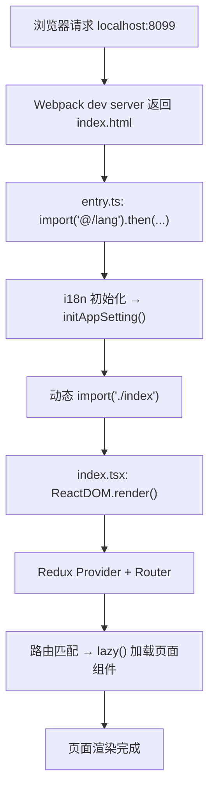

关键文件及职责：

| 步骤 | 文件 | 职责 |
| --- | --- | --- |
| 1 | `src/entry.ts` | 异步加载 i18n 和应用设置，然后动态加载主入口 |
| 2 | `src/index.tsx` | 创建 Redux Store、挂载 React Router、`ReactDOM.render()` |
| 3 | `src/routes/*.ts` | 定义路由树，每个路由指向 `lazy()` 加载的页面组件 |
| 4 | 页面组件 | 实际渲染的 React 组件 |

### entry.ts 的异步启动模式

```typescript
// src/entry.ts（简化）
import('@/lang').then(async ({ run }) => {
  await run();                              // i18n 初始化
  const { initAppSetting } = await import('@/bridge/init-app-setting');
  await initAppSetting();                   // 应用全局设置
  import('./index');                        // 加载主入口
});
```

这个文件做了三件事，全部是异步的：

1. **i18n 初始化**：`run()` 加载翻译文件、设置语言。如果 i18n 未初始化就渲染页面，所有 `$t()` 调用都会失败——这就是 Portal 白屏最常见的原因。
2. **应用设置**：`initAppSetting()` 从后端拉取全局配置（如功能开关、环境变量）。
3. **主入口加载**：`import('./index')` 是动态导入，此时 i18n 和配置已就绪。

如果 Portal 白屏，第一件事是打开浏览器 Console，看 i18n 初始化是否报错。`src/lang/` 目录下缺少 JSON 文件是最常见的原因。

### 渲染入口：Redux + Router + Render

Portal 的渲染层次：`Redux Provider` 提供全局 Store → `RecoilRoot` 提供原子化状态 → `Router` 匹配 URL → `App` 根组件（侧边栏、导航、主内容区）。全部由 Portal 自己创建和管理，没有宿主参与。这意味着 Portal 需要自己处理所有基础设施，但也意味着你不会遇到"宿主版本不兼容"的问题。

### 失败点地图

| 现象 | 可能原因 | 排查方法 |
| --- | --- | --- |
| 白屏 + Console 无报错 | i18n 初始化失败 | 检查 `src/lang/` 目录下的 JSON 文件 |
| 白屏 + `Cannot read property` | Store 未正确初始化 | 检查 `generateStore()` 和 reducer |
| 页面 404 | 路由未注册或懒加载失败 | 检查 `src/routes/` 中对应路由定义 |
| API 请求 401 | 未登录 Portal test 环境 | 在 test 环境 Portal 登录后再访问 localhost |
| 页面加载但数据为空 | API 代理未配置 | 检查 Network 面板中 API 请求 URL 和状态码 |

## SC Vue：MMF 模块的宿主依赖生命周期

### 模块初始化：Store → Router → 全局依赖

SC Vue 不能独立启动。它的 `src/index.ts` 不是渲染入口——它是**模块注册入口**：

```typescript
// src/index.ts（简化）
import './store';                          // 1. 注册 Vuex module
import './router';                         // 2. 注册路由
import { initRemoteDepsForMMF } from './global-deps-register';
initRemoteDepsForMMF();                    // 3. 注册全局依赖（远端组件用）
```

这三步不渲染任何东西。它们的作用是**向 MMF 框架声明"我提供了这些能力"**。`./store` 执行 `app.registerVue3StoreModule('FBS_STORE', FBS_STORE)` 将 Vuex module 挂载到宿主 Store。`./router` 导出一个 `routers` 数组，MMF 框架将其合并到宿主路由表中。`initRemoteDepsForMMF()` 注册全局依赖供远端组件使用。

### 宿主注入的完整链路

SC Vue 页面的完整渲染需要宿主参与：

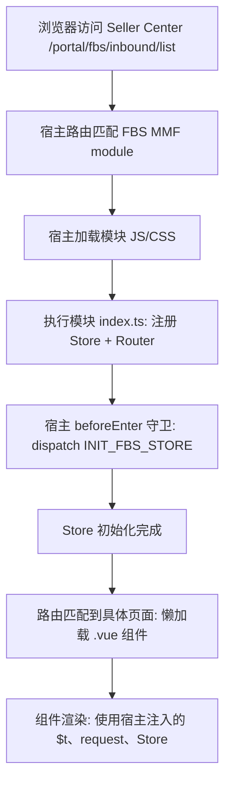

关键宿主注入对象：

| 注入对象 | 来源 | 访问方式 | 作用 |
| --- | --- | --- | --- |
| `app` | 宿主 `framework` | `import { app } from 'framework'` | 全局应用实例 |
| `app.request` | 宿主 Axios 实例 | `app.request.clone({ baseURL })` | 携带宿主会话的请求实例 |
| `app.vue3VuexStore` | 宿主 Vuex Store | `getters['FBS_STORE/...']` | 跨模块共享状态 |
| `app.i18n` | 宿主 i18n 实例 | `app.i18n.t(key)` | 翻译函数 |
| `app.router` | 宿主 Vue Router | 路由守卫中访问 | 路由导航 |

### beforeEnter：路由守卫中的初始化契约

```typescript
// src/router/index.ts（简化）
beforeEnter: async (to, from) => {
  const data = await app.vue3VuexStore.dispatch('FBS_STORE/INIT_FBS_STORE');
  if (data.systemUpgrading?.toggle) return { path: '/portal/fbs/systemUpdating' };
  // 检查税务锁定、入驻状态、权限等
}
```

`beforeEnter` 是模块与宿主的"初始化契约"。它在首次进入 FBS 模块时执行，获取卖家/店铺信息并检查系统状态。如果 `INIT_FBS_STORE` 失败，整个 FBS 模块无法使用。排查"SC FBS 页面打不开"时的第一个检查点：打开 Vue DevTools 或 Console，确认 `FBS_STORE` 的 state 是否已填充。

### 失败点地图（SC Vue）

| 现象 | 可能原因 | 排查方法 |
| --- | --- | --- |
| SC FBS 模块入口不可见 | `authCodes` 不满足 | 检查宿主的权限配置 |
| 进入模块后白屏 | `INIT_FBS_STORE` 失败 | Console 查看 dispatch 错误 |
| 页面组件不渲染 | 路由未注册或懒加载失败 | 检查 `routers` 数组 |
| MMF Dev Tools 不生效 | 模块 key 或端口错误 | 检查 `mmc.config.js` 和 Dev Tools 面板 |
| 请求失败 401/403 | 宿主会话过期 | 刷新 Seller Center 页面 |

## SC React：MMF + 远端组件的双重生命周期

### 模块初始化：三步注册

SC React 的初始化比 SC Vue 多了一层——远端组件运行时：

```typescript
// projects/react-frontend/src/index.ts（简化）
import { init as initRemoteComponent } from '@shopee/remote-component-react';

initRemoteComponent({
  environment: app.environment.environment,
  region: app.environment.region,
});

initGlobalDepsForMMF();        // 注册全局依赖
app.registerRouterModule(routes); // 注册路由
```

`initRemoteComponent` 初始化远端组件框架——环境配置错误会导致远端组件加载线上版本而非本地开发版本。`initGlobalDepsForMMF()` 准备 `$gt`、`request`、`router`、`reporter` 等全局依赖。`app.registerRouterModule(routes)` 向 MMF 框架注册路由。

### DepsProvider：React 侧依赖注入

SC React 的核心设计是 `DepsProvider`——一个 React Context，为所有组件提供全局依赖：

```tsx
// 简化版
<DepsProvider value={{ $gt, request, router, reporter }}>
  <App />
</DepsProvider>
```

这与 SC Vue 的 `app.xxx` 全局访问有本质区别：Vue 中任何地方都可以 `import { app } from 'framework'`；React 中全局依赖通过 Context 显式传递，只有包裹在 `DepsProvider` 内的组件才能访问。如果你在一个独立测试中渲染 SC React 组件但没有包裹 `DepsProvider`，`useContext(DepsContext)` 返回 `undefined`。

### 远端组件的双宿主兼容

SC React 的远端组件目录 `projects/fbs-sc-remote-component/` 中的组件需要同时被 Portal（Module Federation）和 MMF 宿主消费。`createRemoteComponent` 工厂函数在运行时检测宿主类型并返回对应格式：

```tsx
// createRemoteComponent.tsx（简化）
export function createRemoteComponent(Component) {
  const hostType = getHostType();
  if (hostType === 'portal') {
    return { mount, update, unmount };  // Portal 期望生命周期对象
  }
  return WrappedComponent;  // MMF 期望 React 组件
}
```

### 三种形态加载时序对比

| 阶段 | Portal | SC Vue | SC React |
| --- | --- | --- | --- |
| 1. 入口加载 | `entry.ts` 异步链 | `index.ts` 同步注册 | `index.ts` 同步注册 |
| 2. 依赖初始化 | i18n → AppSetting → index | Store → Router → Deps | RemoteComponent → Deps → Router |
| 3. 宿主注入 | 无 | `app` 全局对象 | `app` + `DepsProvider` Context |
| 4. 页面渲染 | `ReactDOM.render()` | 宿主调用 `Vue3Mount()` | 宿主调用 `React18Mount()` |
| 5. 懒加载 | `React.lazy()` | `() => import()` | `React.lazy()` + SSCConfigProvider |

## 跨形态排错：用同一套问题定位

无论哪种形态，页面打不开时按以下顺序排查：

### 第一步：确定故障层

```text
浏览器能看到页面吗？
├─ 完全白屏 → 入口层问题（entry/index 加载失败）
├─ 有壳但内容空白 → 路由/Store 层问题
├─ 有内容但数据为空 → API/数据层问题
└─ 页面能看但交互不工作 → 事件/状态层问题
```

### 第二步：检查最薄弱的环节

| 形态 | 最薄弱环节 | 检查方法 |
| --- | --- | --- |
| Portal | i18n 初始化 | Console 是否有 i18n 错误 |
| SC Vue | `INIT_FBS_STORE` | Vue DevTools 中 FBS_STORE state 是否为空 |
| SC React | `DepsProvider` | React DevTools 中 DepsContext 是否有值 |

### 第三步：用 DevTools 逐层核验

1. **Network 面板**：页面和 JS/CSS 资源是否成功加载（200）。
2. **Console 面板**：是否有未捕获错误。
3. **框架 DevTools**：组件树是否完整，Store 是否有数据。
4. **MMF Dev Tools**（SC 仓库）：模块是否成功注入宿主。

### 跨形态故障对照表

| 故障现象 | Portal 定位 | SC Vue 定位 | SC React 定位 |
| --- | --- | --- | --- |
| 白屏 | i18n 未初始化 | INIT_FBS_STORE 失败 | DepsProvider 未包裹 |
| 页面 404 | 路由文件未注册 | routers 数组缺失 | registerRouterModule 未调用 |
| 请求 401 | 未登录 test Portal | 宿主会话过期 | 宿主会话过期 |
| 组件报 undefined | Store state 未填充 | Store state 未填充 | DepsContext 未提供 |

## 从生命周期理解开发约束

### 为什么 SC Vue 不能在 beforeEnter 之前访问 Store

Store 在模块加载时注册（`import './store'`），但数据在 `beforeEnter` 中的 `dispatch('INIT_FBS_STORE')` 后才填充。提前访问会得到初始空值。

### 为什么 SC React 组件必须包裹在 DepsProvider 中

因为 `request`、`$gt`、`router` 等通过 React Context 传递，不是全局变量。任何脱离 `DepsProvider` 子树的组件访问这些依赖都会得到 `undefined`。

### 为什么 Portal 改路由不需要注册步骤

Portal 使用 React Router 5 的文件式路由——`src/routes/*.ts` 在构建时收集并生成路由树，不需要向宿主注册。SC 仓库需要注册是因为路由必须合并到宿主全局路由表中。

### 为什么远端组件需要 createRemoteComponent 工厂

远端组件的消费者有两种——Portal（Module Federation）和 MMF 宿主。它们对导出格式有不同要求。工厂在运行时检测宿主类型并适配。

### 三种形态对"新页面开发"的影响

| 操作 | Portal | SC Vue | SC React |
| --- | --- | --- | --- |
| 新增路由 | 在 `src/routes/` 加文件 | 在 `routers` 数组加条目 | 在 `routes` 数组加条目 |
| 新增 Store 模块 | 在 `src/store/` 加 reducer | 在 `src/store/modules/` 加 module | 在 `store/modules/` 加 slice |
| 新增依赖注入 | 不需要 | `initRemoteDepsForMMF()` 中注册 | `initGlobalDepsForMMF()` 中注册 |
| 启动验证 | 浏览器打开 localhost 即可 | MMF Dev Tools 注入后验证 | MMF Dev Tools 注入后验证 |

## 宿主边界对测试和调试的影响

### Portal：可独立测试

Portal 不依赖外部宿主，你可以在不启动 Seller Center 的情况下做绝大多数前端测试和调试。`ReactDOM.render()` 是标准的 React 入口，Jest 单元测试可以直接渲染组件并验证行为，不需要 mock 宿主对象。这使得 Portal 的开发反馈循环最短——改代码、刷新浏览器、看结果。

### SC Vue：需要宿主上下文

SC Vue 的几乎所有能力（路由、Store、请求、i18n）都来自宿主 `app` 对象。这意味着：
- 单元测试需要 mock `framework` 模块中的 `app`。
- 本地开发必须通过 MMF Dev Tools 连接 Seller Center 测试环境。
- 如果测试环境挂了，SC Vue 的本地开发也受影响（因为 INIT_FBS_STORE 需要调用测试环境 API）。

这不是 SC Vue 的设计缺陷——这是 MMF 多模块架构的固有特征：模块复用宿主的基础设施，换取更小的模块体积和更一致的跨模块体验。代价是模块不能脱离宿主独立运行。

### SC React：双重依赖

SC React 不仅依赖 MMF 宿主，还依赖远端组件运行时。这意味着：
- 本地开发可能需要同时启动主模块和远端组件两个 dev server。
- 远端组件的调试需要确认它被哪个宿主加载（Portal 还是 MMF），因为两者的生命周期不同。
- 测试远端组件时，需要 mock 两个宿主的环境变量、全局依赖和生命周期方法。

一个实用的开发策略：先在主模块内完成组件开发和测试（此时不涉及远端组件的生命周期），确认功能正确后再将组件抽取到远端组件目录并适配两种宿主。

### 三种形态的开发体验对比

| 维度 | Portal | SC Vue | SC React |
| --- | --- | --- | --- |
| 本地启动复杂度 | 低（`yarn start`） | 中（`yarn dev` + MMF Dev Tools） | 高（`pnpm dev:host` + 可能 `pnpm dev:remote`） |
| 独立测试能力 | 强 | 弱（需 mock 宿主） | 弱（需 mock 双宿主） |
| 开发反馈速度 | 快 | 中 | 中 |
| 对测试环境依赖 | 仅 API 代理 | API + Store 初始化 | API + Store 初始化 + 远端组件 |

这张表不是让你选择"哪个仓库最好"——每个仓库的约束由它的架构角色决定。但了解这些差异能帮助你在不同仓库之间切换时，调整对开发速度的预期和调试策略。

## 练习

### 时序图绘制

为 SC Vue 仓库画一张完整的页面加载时序图，包含以下参与方：浏览器、Seller Center 宿主、模块 `index.ts`、`store/index.ts`、`router/index.ts`、`beforeEnter` 守卫、页面组件。标注每个步骤的输入和输出。

### 故障定位

以下场景分别发生在哪种形态中？定位到具体文件：

a) 用户访问 `/portal/fbs/inbound/list`，页面显示"系统升级中"。
b) Portal 本地 `localhost:8099` 能打开但所有文字显示为 key 名（如 `inboundProblemId` 而非"入库问题 ID"）。
c) SC React 中 `useContext(DepsContext)` 返回 `undefined`。

### 跨形态对比

用一句话描述 Portal、SC Vue、SC React 在"路由注册方式"上的核心差异。

### 参考答案

**7.2a**：SC Vue。`src/router/index.ts` 的 `beforeEnter` 中 `systemUpgrading.toggle` 检查 → 跳转 `/portal/fbs/systemUpdating`。

**7.2b**：Portal。`src/entry.ts` 的 i18n 初始化未完成或 `src/lang/` 下缺少翻译 JSON 文件。

**7.2c**：SC React。组件不在 `DepsProvider` 子树内，或 `initGlobalDepsForMMF()` 未被调用。

**7.3**：Portal 通过文件定义路由树自动收集；SC Vue 导出数组由 MMF 框架注册；SC React 显式调用 `registerRouterModule` 注册。

## 自检

1. Portal SPA、Vue MMF、React 18 MMF 三种应用从加载到页面渲染的关键对象分别是什么？它们的宿主交接信息有什么不同？

2. 为什么 MMF 模块不能直接 `yarn dev` 启动，而需要通过 MMC Dev Tools 或宿主启动？失败点通常出在哪一层？

3. 三种形态的错误排查中，"页面白屏"和"路由 404"分别对应哪些最可能的原因？

4. 宿主边界对前端开发的三个直接影响是什么？为什么不能把 MMF 模块当成独立 SPA 开发？

5. 如果你需要在三个仓库中同时修改一个组件，每种仓库的验证流程有什么不同？

## 参考文献

- [React 16.14.0 Official Release](https://github.com/facebook/react/releases/tag/v16.14.0)
- [React 18 Upgrade Guide](https://react.dev/blog/2022/03/08/react-18-upgrade-guide)
- [Vue 3 Guide](https://vuejs.org/guide/introduction.html)
- [Webpack Module Federation](https://webpack.js.org/concepts/module-federation/)
- [qiankun Guide](https://qiankun.umijs.org/guide)
- [React Router v5.2](https://github.com/remix-run/react-router/tree/v5.2.0)

---

# 微前端与远端组件：Module Federation、qiankun、MMF

> 预计学习时间：120–160 分钟
> 一句话总结：理解前端从巨石单体到微前端的演进逻辑，能区分 FBS 三个前端仓库各自的微前端方案——Portal 的 Module Federation + qiankun、SC Vue 的 MMF 模块机制、SC React 的 MMF + 远端组件双重身份——并评估修改跨仓库公共组件时对各消费者的影响。

## 为什么前端需要微前端

### 从单体巨石到分而治之

前端项目在早期通常是一个单一应用——所有页面、所有功能都在一个代码仓库里，一起构建、一起部署、一起上线。这种模式在小团队和简单业务场景下是高效的。但随着团队规模和业务复杂度增长，三个问题变得不可忽视。

**第一个问题是协作冲突**。多个团队同时在一个仓库中开发不同功能模块，代码合并冲突频繁，每个人的改动都可能意外影响其他人的页面。一个团队修改了公共的 `Button` 组件，所有团队的页面都可能受影响，但只有到集成测试阶段才会暴露。

**第二个问题是构建和部署的耦合**。首页需要紧急上线一个 Banner 修改，但因为仓库里另一个团队正在做一个大型重构，整个构建失败。首页的紧急修复被困在构建系统里，没有任何技术原因——纯粹是组织上的耦合。

**第三个问题是技术栈锁定**。当一个仓库被锁定在某个框架版本（如 React 16），所有团队都必须接受这个约束。想用 React 18 的新特性？不行——整个仓库必须统一升级，而统一升级对大型项目来说是一个数月级别的工程。

这三个问题的核心矛盾在于：**团队的边界和代码的边界不重合**。多个团队共享一个仓库，但一个团队的改动不应该影响另一个团队的页面；一个团队想快速迭代，但被另一个团队的构建失败卡住；一个团队想升级技术栈，但被整个仓库的兼容性约束限制。

微前端（Micro Frontends）就是在解决这个问题。它的核心思想来自后端微服务架构：**将一个复杂的单体应用拆分为多个独立的小型应用，每个小应用由不同的团队独立开发、独立构建、独立部署，同时又能被组合成一个对用户来说统一的界面。**

这个思想在 2016 年左右由 ThoughtWorks 技术雷达首次系统性地提出。之后几年，社区涌现了多种实现方案：single-spa（基于路由加载独立子应用）、qiankun（阿里基于 single-spa 增强的方案）、Webpack Module Federation（构建时声明共享模块）、以及各公司内部的定制框架（如 FBS 使用的 MMF）。

### FBS 为什么需要三种机制而不是一种

FBS 的前端架构是微前端实践的一个真实缩影——三个阶段引入了三种不同的机制，每种机制解决不同的问题。

首先，Portal 是 FBS 前端的总入口。它需要加载来自不同团队、使用不同技术栈的独立子应用——比如履约团队的数据看板、仓储团队的报表页面。这些子应用是完全独立的仓库，有自己的路由、状态管理和构建流程。这时候 qiankun 是最合适的选择——它提供运行时的 JS 沙箱和样式隔离，让一个团队用 React 16、另一个团队用 Vue 3 也能共存。

其次，Portal 同时需要接入一些共享的 UI 能力——比如入库列表组件需要同时在 Portal 的入库管理页面和 Seller Center 的 SC 页面中出现。如果每个消费者都复制一份组件代码，维护成本翻倍。Module Federation 提供了更轻量的方案：将共享组件作为"远端模块"暴露出去，消费者在运行时动态加载，React 等核心依赖在宿主和远端模块之间共享，避免重复打包。

最后，Seller Center 本身是一个多模块宿主平台。在 Seller Center 中提供功能的团队（包括 FBS 团队）不需要各自搭建独立的宿主框架——只需要开发 MMF 模块，专注于业务逻辑。MMF 提供了统一的宿主基础设施：路由管理、Store 注入、全局依赖（`$gt`、`request`、`reporter` 等）。FBS 的两个 SC 仓库正是以 MMF 模块的身份运行在 Seller Center 中。

下面这个表总结了三种机制的出现背景：

| 机制 | 出现背景 | 解决的场景 | 在 FBS 中的位置 |
| --- | --- | --- | --- |
| qiankun | Portal 需要整合多个独立团队的子应用 | 加载完全独立的子应用（HTML/JS/CSS 隔离） | Portal 对外部子应用的加载 |
| Module Federation | Portal 需要共享组件但不想复制代码 | 运行时加载 JS 模块，共享 React 等核心依赖 | Portal 对 SC React 远端组件的消费 |
| MMF | Seller Center 需要统一管理多团队的功能模块 | 同一宿主内的模块化开发，模块共享宿主基础设施 | SC Vue / SC React 的运行容器 |

## Portal：Module Federation 与 qiankun 的分工

Portal 是 FBS 前端体系中角色最复合的仓库——它既承载入库管理、报表、配置等大量自身业务页面，同时又通过 Module Federation 和 qiankun 加载来自其他仓库或团队的远端模块与子应用。也就是说，Portal 的代码库里既有「自己写的功能」，也有「加载别人的功能」的编排逻辑。理解 Portal 自身业务与加载机制之间的关系，是理解整个 FBS 前端架构的起点。

### Module Federation：运行时加载 JS 模块

Webpack 5 的 Module Federation 允许一个应用（宿主，Host）在**运行时**加载另一个应用（远端，Remote）暴露的 JS 模块。传统的 npm 包方案要求远端每次变更后宿主需要重新安装依赖并重新构建；Module Federation 的远端模块更新后，宿主只需要重新加载页面就能获取最新代码——不需要重新构建。

Portal 的 Module Federation 配置在 `webpack.config.js` 中：

```javascript
// webpack.config.js（关键配置）
const { ModuleFederationPlugin } = require('webpack').container

module.exports = {
  plugins: [
    new ModuleFederationPlugin({
      name: 'fbs_portal',
      remotes: {},          // 远端模块在 remotes.js 中动态配置
      shared: {
        react: { singleton: true, eager: false },
        'react-dom': { singleton: true, eager: false },
        'react-router-dom': { singleton: true }
      }
    })
  ]
}
```

这里的关键是 `shared` 配置。`singleton: true` 表示整个页面中只有一个 React 实例——远端模块不能打包自己的 React，必须使用 Portal 提供的那个。这解决了「页面上有两个 React 导致 hooks 报错」的经典问题。`eager: false` 表示这些依赖不会在宿主启动时立即下载，而是延迟到第一个远端模块被加载时才下载。

远端模块的入口地址通过 `remotes.js` 管理：

```javascript
// remotes.js（简化核心逻辑）
const getRemoteModule = (moduleName, entry) =>
  `promise new Promise((resolve, reject) => {
    // 1. 先检查是否已加载
    if (window[moduleName]) {
      resolve(window[moduleName])
      return
    }

    // 2. 动态创建 script 标签加载远端 JS
    const script = document.createElement('script')
    script.src = getEntryUrl(moduleName, entry)
    script.onload = () => {
      if (window[moduleName]) {
        resolve(window[moduleName])
      } else {
        reject(new Error('Module not found on window'))
      }
    }
    script.onerror = () => reject(new Error('Failed to load remote module'))
    document.head.appendChild(script)
  })`
```

注意 `getEntryUrl()` 函数——它从 `sessionStorage` 或默认地址中取得远端模块的 JS 文件 URL。这意味着本地开发时可以通过 `sessionStorage` 指向本地 dev server 的地址来调试远端模块。

Portal 中消费远端组件的方式：

```tsx
import React, { Suspense } from 'react'

const RemoteInboundComponent = React.lazy(
  () => import('remote_inbound/InboundComponent')
)

// 使用
function InboundPage({ irId }) {
  return (
    <Suspense fallback={<Spin />}>
      <RemoteInboundComponent irId={irId} />
    </Suspense>
  )
}
```

`import('remote_inbound/InboundComponent')` 中的 `remote_inbound` 对应 `remotes.js` 中的 moduleName。`React.lazy` + `Suspense` 处理加载中的状态——远端模块的网络加载通常需要几百毫秒到几秒不等，没有 Suspense 会让页面白屏。

**从零开始理解**：如果你只写过传统的 `import Foo from './Foo'` 静态导入，Module Federation 的概念可能感觉很复杂。但它的本质非常简单——`import('remote_inbound/InboundComponent')` 就是告诉 webpack：「这不是我自己的代码，去那个地址下载它」。就像你在 HTML 里写 `<script src="https://cdn.example.com/lib.js"></script>`，只不过 webpack 帮你处理了依赖共享和模块解析。

### qiankun：加载独立子应用

qiankun 解决的是另一类问题。Module Federation 共享的是 JS 模块——远端模块和宿主共享同一个 DOM、同一个 React 实例、同一套全局变量。但如果要加载的是一个由其他团队维护的完整应用——有自己的路由、状态管理、CSS 文件、甚至用的框架都不一样——Module Federation 就不够了。

qiankun 通过 runtime 沙箱提供了更强的隔离。每个子应用在自己的沙箱中运行，互不干扰：

```typescript
// Portal 中 qiankun 微应用注册（简化）
import { registerMicroApps, start } from 'qiankun'

registerMicroApps([
  {
    name: 'sub-app-data-dashboard',
    entry: '//cdn.example.com/sub-app-data-dashboard/',
    container: '#sub-app-container',
    activeRule: '/data-dashboard',
    props: {
      // Portal 下发给子应用的共享数据
      user: getCurrentUser(),
      permissions: getPermissions()
    }
  }
])

start()
```

`container` 指定子应用挂载到 Portal 的哪个 DOM 节点。`activeRule` 是路由匹配规则——当浏览器 URL 匹配 `/data-dashboard` 时，qiankun 自动激活对应的子应用。`entry` 是子应用的 HTML 入口地址——qiankun 会 fetch 这个 HTML，解析其中的 JS/CSS 资源并加载。

### Portal 中两种机制的边界

同一个 Portal 中同时运行 Module Federation 和 qiankun，它们的边界在哪里？

**Module Federation 用于 FBS 内部的组件级共享**——比如 SC React 的入库列表组件，FBS 团队自己维护，与 Portal 共享同一套 React 16 运行时。qiankun 用于加载外部团队的独立子应用——比如履约团队的数据看板，FBS 团队不维护，可能使用不同的技术栈。

这个边界对日常开发有两个直接影响：

1. 如果你在改 SC React 的远端组件，你只需要考虑 Module Federation 的兼容性——Props 是否向后兼容、依赖版本是否匹配 React 16。
2. 如果你需要接入一个外部团队的新子应用，你只需要在 Portal 的 qiankun 注册配置中添加一条记录——不涉及任何 Module Federation 配置的修改。

## SC Vue：以 MMF 模块的身份运行

SC Vue 仓库中没有 Module Federation 配置，也没有 qiankun 注册代码。但它的页面仍然在一个更大的宿主框架中运行——这个宿主就是 Seller Center，而连接 SC Vue 和 Seller Center 的机制是 MMF。

### MMF 模块到底是什么

MMF（Multi-Module Framework）是 Seller Center 的平台级框架。它的核心概念是：**把 Seller Center 拆成宿主和模块两层**。宿主提供路由系统、全局状态、权限校验、导航框架等基础设施；模块只负责具体的业务页面。宿主和模块之间通过严格的接口契约通信。

对于 SC Vue 的开发者来说，这意味着你写的是"模块"代码，但用户看到的是"在 Seller Center 里打开的 FBS 功能页面"。

### 模块的身份声明

每个 MMF 模块通过 `mmc.config.js` 向宿主声明自己的身份：

```javascript
// mmc.config.js
module.exports = {
  id: 435,              // 模块在 Seller Center 中的唯一 ID
  type: 'module',        // 类型：module（普通模块）
  tech: 'vue3',          // 技术栈
  name: 'FBS Inbound',
  routes: [              // 模块负责的路由声明
    {
      path: '/portal/fbs/inbound',
      component: () => import('./src/views/inbound/IBT/list/index.vue')
    }
  ]
}
```

`id` 是关键字段——它同时在模块侧（`mmc.config.js`）和宿主侧（Seller Center 平台配置）被引用，两边的 id 必须一致。`type: 'module'` 告诉宿主这个模块是一个标准的 MMF 模块（而不是远端组件——后面 SC React 部分会讲到 `type: 'remote-component'` 的区别）。

### 宿主注入：模块从宿主拿到了什么

SC Vue 在 `main.js` 中初始化时，不是从零开始创建 Vue 实例——而是在宿主已经准备好的上下文上注册自己：

```javascript
// main.js（核心流程简化）
import { createApp } from 'vue'
import { createStore } from 'vuex'
import { createRouter } from 'vue-router'

export function init({ hostStore, hostRouter, globalDeps }) {
  // 1. 创建 Vuex Store 实例，挂载到宿主 Store 的命名空间下
  const store = createStore({
    modules: { ... },
    // 注意：Store 实例被宿主管理，不是独立的
  })

  // 2. 创建 Router 实例，注册到宿主路由表
  const router = createRouter({
    routes: [ ... ]
  })

  // 3. 全局依赖挂载
  // host.i18n、host.request、host.$gt 等由宿主注入
  const app = createApp(App)
  app.config.globalProperties.$gt = globalDeps.$gt
  app.config.globalProperties.$request = globalDeps.request

  return { app, store, router }
}
```

这里的关键是 `init()` 函数——它不是模块内部调用的，而是由宿主的模块加载器在加载这个模块时调用的。`hostStore` 和 `hostRouter` 是宿主传入的，模块的 store 和 router 挂载在这些宿主对象上。这就是为什么 SC Vue 不能独立运行——它依赖宿主提供的 Store 和 Router 基础设施。

**从零开始理解**：如果你只写过一个完整的独立 Vue 应用——在一个 `new Vue({...})` 或 `createApp(...).mount('#app')` 中做完所有事情——MMF 模块的概念需要换个思路。你不是在创建一个应用，而是在一个已经存在的应用中「注册」你的功能。就像你在已有的 HTML 页面上用 `appendChild` 在指定 div 里渲染你的组件，而不是创建一个新的 HTML 页面。

### 模块内开发的关键约束

因为模块运行在宿主中，你在 SC Vue 中写代码时需要注意几个约束：

1. **不要修改全局样式**。你的 CSS 通过 scoped style 隔离，但如果写了 `body { margin: 0 }`，你会影响整个 Seller Center 的布局。
2. **不要在模块代码中 `Vue.use()` 宿主已注册的插件**。`vue-i18n`、`vue-router`、`@shopee/eds` 等组件库由宿主统一注册，模块重复注册可能导致冲突。
3. **全局依赖通过 `this.$gt`、`this.$request` 访问，不要自己创建**。这些依赖由宿主管理生命周期和配置（如 `$request` 的 baseURL 来自宿主环境配置），自行创建会导致请求发到错误的环境。
4. **路由 path 必须在 `mmc.config.js` 声明**。路由是在宿主编译时注册的——如果你在模块中动态创建了新路由但没有在 mmc 配置中声明，这个路由不会被宿主识别。

## SC React：MMF 模块 + 远端组件的双重身份

SC React 是三个仓库中架构最复杂的一个——它同时扮演两个角色：像 SC Vue 一样作为 MMF 模块运行在 Seller Center 中，同时作为远端组件提供者被 Portal 通过 Module Federation 加载。理解这个双重身份是本章最关键的部分。

### 角色一：MMF 模块

SC React 在 Seller Center 中是一个 MMF 模块，和 SC Vue 类似。但它的 `mmc.config.js` 和初始化方式与 Vue 有所不同：

```javascript
// mmc.config.js
module.exports = {
  id: 432,
  type: 'module',
  tech: 'react18',      // ← 注意：React 18，比 Portal 的 React 16 高两个大版本
  name: 'FBS SC React Module'
}
```

SC React 使用 React 18，支持 `useId`、`startTransition`、`useSyncExternalStore` 等新特性。但这意味着——它在 Portal 中不能直接用原始组件，因为 Portal 是 React 16。后面远端组件部分会详细讲这个兼容层。

SC React 模块的初始化：

```typescript
// main.tsx
import { registerRouterModule } from '@shopee/mmf-sdk'

const routes = [
  { path: '/portal/fbs/sc/inbound', component: InboundModule }
]

// 向宿主注册路由
app.registerRouterModule(routes)
```

与 SC Vue 的主要区别：SC React 使用 `registerRouterModule()` 而非在 mmc config 中声明 routes；Store 通过 `DepsProvider` 注入而非 Vuex 模块注册。

### 角色二：远端组件提供者

SC React 仓库中的 `projects/fbs-sc-remote-component/` 目录是远端组件的专属领地。这个目录下的组件会被额外构建为独立的 JS 产物，供 Portal 通过 Module Federation 加载。

远端组件的关键在于适配层。Portal 期望模块导出一个包含 `{ mount, update, unmount }` 方法的生命周期对象，而 MMF 宿主期望模块导出一个 React 组件——同一份代码需要同时满足两种格式。`createRemoteComponent` 工厂函数处理这个适配：

```typescript
// createRemoteComponent.tsx（核心逻辑简化）
export function createRemoteComponent(Component) {
  const hostType = getHostType() // 检测当前运行的宿主类型

  // 内部包装组件：为两种宿主统一提供 DepsProvider
  const WrappedComponent = (props) => (
    <DepsProvider>
      <SSCProvider>
        <Component {...props} />
      </SSCProvider>
    </DepsProvider>
  )

  // 根据宿主类型返回不同格式
  if (hostType === 'portal') {
    // Portal 格式：生命周期对象
    return {
      mount: (el, props, context) => {
        ReactDOM.render(
          <WrappedComponent {...props} portalContext={context} />,
          el
        )
      },
      update: (instance, props, context) => {
        // 更新组件，复用已创建的 DOM 容器
        ReactDOM.render(
          <WrappedComponent {...props} portalContext={context} />,
          instance.container
        )
      },
      unmount: (instance) => {
        ReactDOM.unmountComponentAtNode(instance.container)
      }
    }
  }

  // MMF 格式：直接返回 React 组件
  return WrappedComponent
}
```

`getHostType()` 通常在运行时通过检查 `window` 上的特定标识（如 `window.__SELLER_CENTER__`、`window.__PORTAL__` 等）来判断当前宿主。这个检测在模块加载时执行一次。

**从零开始理解**：`createRemoteComponent` 本质上是一个**适配器**。同一个 React 组件（`InboundComponent`），在 MMF 宿主中通过 `React.createElement(InboundComponent)` 直接渲染，在 Portal 中通过 `window[moduleName].mount(el, props, context)` 调用后使用 `ReactDOM.render` 渲染。两种方式的最终渲染结果是一样的，但 Portal 需要额外的生命周期方法（mount/update/unmount）是因为它的 Module Federation 架构需要统一的加载接口——不限于 React 组件，Vue 或其他框架的组件也可以通过相同接口加载。

### React 16 与 React 18 的跨宿主兼容

这是 SC React 远端组件开发中最关键的技术约束。SC React 模块本身使用 React 18 的新特性开发。但当同一个组件作为远端组件被 Portal 加载时，Portal 提供的是 React 16 运行时。

Module Federation 的 `shared: { react: { singleton: true } }` 确保了远端组件使用的是 Portal 提供的 React 16，而不是自己打包的 React 18。这意味着：

- 远端组件**可以使用** React 16 支持的特性：hooks（`useState`、`useEffect`、`useContext` 等——React 16.8+ 就支持）、`React.memo`、`React.lazy`。
- 远端组件**不能使用** React 18 独占的特性：`useId()`、`startTransition()`、`useDeferredValue()`、`useSyncExternalStore()`。这些在 React 16 中不存在，调用会抛 `TypeError: (0, React.useId) is not a function`。
- 如果业务逻辑必须使用 React 18 特性，有两个选项：一是在远端组件中通过 `React.useId !== undefined` 之类的特性检测做降级；二是推动 Portal 升级到 React 18（这是一个数月级别的跨团队工程）。

### 针对 SC React 仓库的开发清单

当你在 SC React 中开发一个需要在 Portal 中消费的远端组件时，使用以下清单：

1. **确认组件导出使用了 `createRemoteComponent` 工厂**。不要直接 `export default YourComponent`——直接导出仅适用于 MMF 侧消费，Portal 侧会报 `Element type is invalid`。
2. **确认组件不依赖 React 18 独占 API**。在本地用 React 16 环境测试一次（见下面调试步骤）。
3. **确认全局依赖在两种宿主中都可用**。`DepsProvider` 在 Portal 侧通过 `mount()` 的 `context` 参数注入依赖，在 MMF 侧通过模块作用域的全局变量注入。如果你在组件中直接引用了 `window.xxx`，确认它在两种宿主中都存在。
4. **新增 Props 时优先设为可选**。`interface Props { region?: string }` 而非 `region: string`——这样 Portal 侧即使没有传入新 Props，组件也不会崩溃。
5. **测试覆盖两种宿主**。至少在 MMF Dev Tools（模拟 Seller Center）和 Portal Module Federation 环境下各验证一次。

本地调试 Portal 侧消费的步骤：

1. 在 SC React 中修改远端组件代码，运行 `pnpm dev:remote` 启动远端组件 dev server。
2. 打开浏览器 DevTools → Application → Session Storage → 设置 `fbs_remote_component_dev` 为远端组件 dev server 地址。
3. 刷新 Portal 页面，Module Federation 将从你的本地 dev server 加载远端组件代码，而非生产 CDN 版本。
4. 在 Console 中检查是否有 `Module not found` 或 `Element type is invalid` 错误。

## 远端组件跨宿主生命周期的完整追踪

本章已经分别讲解了三种机制，现在把它们串联起来，以同一个 `InboundComponent` 为例，看它在 Portal 和 Seller Center 中的完整加载路径。

### Portal 侧的加载路径

1. Portal 页面代码 `React.lazy(() => import('remote_inbound/InboundComponent'))` 触发动态加载。
2. Webpack 查找 Module Federation 配置中 `remote_inbound` 的入口 URL（通过 `remotes.js` 的 `getEntryUrl` 函数）。
3. 创建 `<script>` 标签加载远端组件 JS 文件。
4. JS 执行：`window['remote_inbound'] = { get: ..., init: ... }`。
5. Webpack 调用 `window['remote_inbound'].get('InboundComponent')` → 获得 `createRemoteComponent` 返回的 `{ mount, update, unmount }`。
6. Portal 调用 `.mount(el, props, context)` → `ReactDOM.render` 渲染组件。

### Seller Center（MMF）侧的加载路径

1. Seller Center 宿主编译时读取 `mmc.config.js` 中的 `id: 432`，将模块路由合并到宿主路由表。
2. 用户访问 `/portal/fbs/sc/inbound`，宿舍由匹配到 SC React 模块的路由。
3. 宿主模块加载器加载模块的 `main.tsx` 入口。
4. `main.tsx` 调用 `app.registerRouterModule(routes)` 注册路由 → React Router 渲染对应的组件。
5. 组件在 `DepsProvider` 上下文中运行，通过 `useContext` 获取全局依赖。

### 两条路径的差异为何必然存在

Portal 需要通过 `mount/update/unmount` 生命周期方法控制远端组件，是因为 Portal 的微前端架构中需要支持非 React 组件的加载——如果一个 Vue 组件需要通过 Module Federation 接入，Portal 仍然用 `mount/update/unmount` 接口。MMF 不需要这个抽象层，因为它只运行 React 组件，`React.createElement` 已经足够了。

这也解释了为什么 `createRemoteComponent` 不是一个可选工具——它是 Portal 和 MMF 两种宿主之间的**协议转换器**。

## 三种仓库的开发约束总结

本章从 Portal、SC Vue、SC React 三个仓库的角度分别讲解了各自的微前端方案。在日常开发中，这三个仓库的微前端相关操作可以归纳为下表：

| 操作 | Portal | SC Vue | SC React |
| --- | --- | --- | --- |
| 新增页面 | React Router 注册 | 在 Vue Router 注册 + `mmc.config.js` 声明路由 | `registerRouterModule()` 注册 |
| 修改全局依赖 | Portal 的 Redux Store | 不影响——依赖从 MMF 宿主注入 | 不影响——依赖通过 `DepsProvider` 注入 |
| 新增公共组件 | 放 `src/components/`，仅供 Portal 使用 | 放 `src/views/` 内，仅供 SC Vue 使用 | 放 `projects/fbs-sc-remote-component/`，供 Portal 消费 |
| 修改远端组件 Props | 检查 Portal 消费代码是否传入新 Props | 不消费远端组件 | 确保 Portal 和 MMF 两侧都兼容 |
| 依赖版本升级 | 需评估 qiankun 子应用兼容性 | 需确认宿主支持的版本 | 远端组件需保持 React 16 兼容 |
| 本地启动 | `yarn dev`，独立运行 | MMF Dev Tools 必需 | `yarn dev`（MMF 模式）或 `pnpm dev:remote`（远端组件模式） |

## 常见错误与排查

### 远端组件在 Portal 中不渲染

最可能的原因：`createRemoteComponent` 未正确适配 Portal 格式。Portal 检测到模块返回值没有 `.mount` 方法 → 尝试用 `React.createElement` 渲染但失败。排查：在 Console 中 `console.log(window['remote_inbound'])` 确认模块是否正确加载；检查 `createRemoteComponent` 是否被正确调用。

### 远端组件使用了 React 18 特性在 Portal 中报错

错误信息 `TypeError: (0, React.useId) is not a function`。原因：Portal 提供 React 16，`useId` 不存在。修复：降级到 React 16 兼容写法，或用特性检测 `if (typeof React.useId === 'function') { ... } else { ... }`。

### MMF Dev Tools 不加载模块

确认模块 ID 与 `mmc.config.js` 中的 `id` 一致。确认 dev server 端口正确且在运行。确认 Chrome 扩展已启用。

### 模块部署后 Portal 中远端组件仍是旧版本

可能原因：CDN 缓存未刷新；`remotes.js` 中的入口 URL 仍指向旧版本；浏览器 Service Worker 缓存。最快验证方法：Network 面板检查远端组件 JS 文件的 URL 和响应内容。

## 练习

### 练习一：绘制三个仓库的加载路径图

分别画出 InboundComponent 在 Portal 和 Seller Center（MMF）中的完整加载路径。在路径图的每个节点上标注关键文件（如 `remotes.js`、`mmc.config.js`、`createRemoteComponent.tsx`、`main.tsx`）。这不需要画成精美的流程图——在白纸或编辑器里画出调用关系即可，关键是确认你理解了每一层的职责。

### 练习二：新增远端组件 Props 的兼容评估

假设 InboundComponent 需要新增一个必填 Props `region`（字符串类型）。评估这个改动对以下消费者的影响，写出每个需要修改的文件路径和改动内容：
- Portal 中的消费代码
- SC React MMF 模块中的消费代码
- 远端组件自身的 Props 类型定义

如果你的评估中发现某个消费者不需要修改（比如 Portal 侧可以从 context 中自动获取 region），说明原因。

### 练习三：机制选择题

以下场景应该使用哪种机制？说明原因。
a) FBS 需要在 Portal 中展示一个由仓储团队维护的数据看板页面（该团队使用 Vue 3）。
b) FBS 需要在 Portal 和 Seller Center 中展示同一个「入库状态标签」组件。
c) FBS 需要在 Seller Center 中新增一个「FBS 操作日志」功能页面。

### 练习四：排查 Module Federation 加载失败

Portal 中 `React.lazy(() => import('remote_inbound/InboundComponent'))` 触发了加载失败，页面中对应区域显示 Loading 状态持续不消失（Suspense fallback 没有替换为实际组件）。列出你排查这个问题的完整步骤——从 Network 面板到 Console 到 Source 面板的逐层检查。

### 参考答案

**练习一**：参考「远端组件跨宿主生命周期的完整追踪」一节——Portal 路径 6 步，MMF 路径 5 步。

**练习二**：Portal 消费代码中 `InboundPage` 组件的 `region` Props 需要传入（如果 region 可以从 Portal 的 Redux Store 或当前路由推导，考虑在 Portal 侧封装一层而非要求每个消费者传入）。SC React MMF 模块同理。远端组件 Props 类型定义改为 `region: string`（如果接受「未传入时使用默认值」，可改为 `region?: string` 并在组件内提供默认值）。

**练习三**：a) qiankun——独立子应用，不同团队维护，不同技术栈。b) Module Federation 远端组件——内部共享组件，需要跨宿主复用。c) MMF 模块——在 Seller Center 中的标准新功能开发模式。

**练习四**：1) Network 面板 → 找到远端组件 JS 的请求 → 确认 HTTP 状态码（404 表示 URL 错误，CORS 错误表示跨域策略问题）→ 确认响应内容是 JS 代码而非 HTML 错误页。2) Console → 查找 `Failed to load`、`Module not found`、`Element type is invalid` 错误。3) Application → Session Storage → 确认开发模式下的 URL 覆盖是否正确。

## 自检

1. 微前端解决了前端的哪三个核心问题？FBS 为什么使用了三种不同的微前端机制而不是统一成一种？
2. 在 Portal 中，Module Federation 和 qiankun 各用于什么场景？它们的核心技术差异是什么（模块级共享 vs 应用级隔离）？
3. 在 SC Vue 中开发时，有哪些操作是受限的（不能独立创建 Vue 实例、不能修改全局样式、全局依赖必须通过宿主注入）？为什么？
4. SC React 的 `createRemoteComponent` 为什么必须存在？如果去掉它，把远端组件直接 export，在 Portal 和 MMF 中各会发生什么？
5. 远端组件为什么不能使用 React 18 独占 API？如果业务必须使用 `useId()`，有哪些兼容方案？

## 参考文献

- [Webpack Module Federation](https://webpack.js.org/concepts/module-federation/)
- [qiankun Guide](https://qiankun.umijs.org/guide)
- [ThoughtWorks Technology Radar — Micro Frontends](https://www.thoughtworks.com/radar/techniques/micro-frontends)
- [React 16.14.0 Release](https://github.com/facebook/react/releases/tag/v16.14.0)
- [React 18 Upgrade Guide](https://react.dev/blog/2022/03/08/react-18-upgrade-guide)
- FE-A01 三种应用生命周期与宿主边界


---

# Vue/React 共存、共享依赖与版本迁移

> 预计学习时间：120–160 分钟
> 一句话总结：能处理 FBS 中 React 16/18、Vue 3 三种框架在同一页面中共存的情况——理解宿主 Vuex 注入、axios external 共享、全局依赖注入机制，能够定位依赖缺失故障并提出兼容改法。

## 这一章解决什么问题

大多数前端项目只有一个框架——React 或 Vue，选一个用到老。但 FBS 的三个前端仓库打破了这条规则：Portal 运行 React 16，SC Vue 运行 Vue 3，SC React 运行 React 18——更关键的是，SC React 作为一个 React 应用，需要从宿主的 Vuex Store 读取卖家信息和店铺数据。React 和 Vue 不是"选一个"的关系，它们在同一页面中共存。

这种跨框架共存带来了三类问题：一是 React 组件如何读取 Vuex Store（答案：不是通过"桥接库"，而是直接访问宿主的 getter）；二是多个框架的共享依赖（如 axios）如何避免重复打包（答案：通过 webpack external 声明"运行时由宿主提供"）；三是全局依赖（翻译函数、请求实例、监控上报）如何注入到不同框架的组件中。

本章从三个真实场景出发：React 组件读取 Vuex Store、SC React 的 `DepsProvider` 依赖注入机制、以及依赖共享与版本迁移策略。学会这些后，你不会再对"为什么这个 React 组件里能访问 `app.vue3VuexStore`"感到困惑，也不会在改了共享依赖后导致另一个框架爆炸。

> 本章基于三个前端仓库的 release 分支（2026-07-20）。

## 跨框架共存的现实

### FBS 中三种框架的共存地图

在当前 FBS 代码中，以下场景涉及跨框架交互：

| 场景 | 消费者框架 | 提供者框架 | 交互方式 |
| --- | --- | --- | --- |
| SC React 读取卖家/店铺信息 | React 18 | Vue 3（宿主 Vuex） | `app.vue3VuexStore.getters` |
| SC React 使用宿主请求实例 | React 18 | Vue 3（宿主 `app.request`） | `app.request.clone()` |
| SC React 使用宿主翻译 | React 18 | Vue 3（宿主 `app.i18n`） | `$gt` 函数通过 DepsProvider 注入 |
| 远端组件被 Portal 消费 | React 18 | React 16（Portal） | Module Federation + createRemoteComponent |
| Portal 微应用（qiankun） | 各种框架 | React 16（Portal） | qiankun 沙箱隔离 |

### 跨框架不是"桥接"——是"共享宿主基础设施"

理解 FBS 跨框架的关键洞察：这些框架不是通过某个"桥接库"互相调用的。它们共享的是**同一个宿主基础设施**——`app` 对象。`app.vue3VuexStore` 本质上就是一个 JavaScript 对象，React 组件访问它不需要通过 Vue——直接读取 `getters` 属性即可。

这解释了为什么你在 SC React 中看到这样的代码：

```typescript
const currentShop = app?.vue3VuexStore?.getters?.['FBS_STORE/Shop/currentShop'];
```

这不是 React 调用了 Vue 的某个 API。这是普通的 JavaScript 对象属性访问——`getters` 是一个对象，`'FBS_STORE/Shop/currentShop'` 是它的一个 key。Vuex 的响应式系统（`getters` 是计算属性的代理）对 React 是透明的——React 拿到的是计算后的值。

## SC React 读取宿主的 Vuex Store

### 直接访问 getters

在 SC React 中，获取当前店铺信息的标准写法：

```typescript
import { app } from 'framework';

// 在组件或工具函数中
const shop = app?.vue3VuexStore?.getters?.['FBS_STORE/Shop/currentShop'] || {
  fbsWhsRegion: '',
  fbsShopId: '',
};
```

注意几个细节：

- **可选链**：`app?.vue3VuexStore?.getters`——这三层的每一层都可能为 `undefined`。`app` 在模块加载早期可能还未完全初始化。
- **命名空间路径**：`'FBS_STORE/Shop/currentShop'` 是完整的命名空间路径。不能省略 `FBS_STORE/` 前缀。
- **默认值**：`|| { fbsWhsRegion: '', fbsShopId: '' }` 确保即使 getter 返回 `undefined`，后续代码也不会崩溃。

### 为什么不用 react-vuex-bridge

你可能会问：为什么不用一个现成的 React-Vuex 桥接库？答案是：不需要。FBS 代码中读取 Vuex Store 的场景很有限——主要是初始化时读取一次基础信息（shop、seller、region）。这种低频、少字段的访问模式，直接读对象属性比引入一个桥接库更简单、更可控。引入桥接库会带来额外的依赖维护成本、版本兼容问题和学习曲线——而对于 FBS 的实际使用场景来说收益极小。

### 访问宿主 Vuex 的边界

不所有数据都应该从宿主 Vuex 读取。判断标准：

| 数据类型 | 存储位置 | 理由 |
| --- | --- | --- |
| 跨模块基础信息（shop、seller） | 宿主 Vuex | 多个 MMF 模块共享 |
| SC React 模块业务数据 | 自建 Redux Toolkit Store | 只有本模块使用 |
| 组件临时状态（表单、筛选） | 组件局部 state | 不需要持久化 |

如果 SC React 中需要频繁访问某个 Vuex 数据，考虑在模块初始化时从 Vuex 读取一次，存入本模块的 Redux Store，而不是每次使用都跨越框架边界读取。这样减少了与宿主的耦合，也方便单元测试时 mock。

## 共享依赖的 webpack external 机制

### 为什么要 external

FBS 前端多个框架共享一些基础库——axios、lodash、moment 等。如果每个模块都把 axios 打包进自己的 bundle，会有三个问题：

1. **体积膨胀**：页面加载三个 axios 副本，浪费带宽和解析时间。
2. **版本冲突**：不同模块的 axios 版本可能不一致，拦截器行为可能互相干扰。
3. **实例隔离**：每个模块创建自己的 axios 实例，但共享宿主 Cookie 和 CSRF token 的能力需要通过宿主的 `app.request` 获得。

webpack external 的解决方案：在构建时声明"这个库不要打包，运行时由外部提供"。

### MMF 模块中的 external 实践

SC 两个仓库在 `mmc.config.js` 中配置了 external。例如：

```javascript
module.exports = {
  externals: {
    'axios': 'axios',       // 不打包 axios
    'react': 'React',       // 不打包 React
    'react-dom': 'ReactDOM',
  },
};
```

运行时，这些库由宿主（Seller Center Portal）提供。宿主在页面中已经加载了这些库的 `<script>` 标签，模块代码运行时直接从 `window.axios` 等全局变量获取。

### external 失效的排查

常见症状：模块构建成功，但浏览器中报 `axios is not defined` 或 `React is not defined`。

排查步骤：
1. 确认宿主的 HTML 中是否加载了对应的库的 `<script>` 标签。
2. 确认 external 配置中的全局变量名是否与宿主提供的变量名一致（区分大小写）。
3. 如果本地 dev server 独立启动（没有宿主），需要手动在 HTML 模板中添加这些依赖的 `<script>`。

## 全局依赖注入：DepsProvider 与 initGlobalDepsForMMF

### 依赖注入的动机

SC React 的组件依赖一些全局能力：翻译函数 `$gt`、请求实例 `request`、路由实例 `router`、监控上报 `reporter`。这些不是 React 组件自己创建的对象——它们来自宿主。如何把这些宿主提供的对象传递给组件树的每个节点？

直接 `import { app } from 'framework'` 在每个组件中是可行的（SC Vue 就是这么做的），但 SC React 选择了一条不同的路——React Context。原因：

- **可测试性**：通过 Context 注入的依赖在测试中可以轻松替换为 mock，而直接 import `app` 需要在模块级别做 mock。
- **显式依赖**：组件通过 `useContext(DepsContext)` 声明自己需要哪些全局能力，而不是隐式依赖全局变量。
- **类型安全**：DepsContext 的值可以定义完整的 TypeScript 类型。

### initGlobalDepsForMMF 的执行时机

```typescript
// global-deps-register.ts（简化）
export function initGlobalDepsForMMF() {
  globalDeps = {
    $gt: app.i18n.t,          // 翻译函数
    request: app.request.clone({ baseURL: '/api/fbs/sc' }),
    router: app.router,
    reporter: createReporter(),
  };
}
```

这个函数在 `index.ts` 中、路由注册之前执行。它必须在任何组件渲染之前完成——否则组件首次渲染时 `DepsContext` 的值还是空的。

### 缺失依赖的故障模式

如果 `initGlobalDepsForMMF()` 未被调用，组件中 `useContext(DepsContext)` 返回 `undefined`。根据组件内部的防御性代码编写程度，可能的症状：

- 组件不渲染（因为 `deps.request` 为 `undefined`，访问 `.get()` 报错）。
- 翻译不生效（所有文案显示为 key 名）。
- 路由跳转不工作（`deps.router` 为 `undefined`）。

排查方法：在浏览器 React DevTools 中找到组件树，检查 `DepsProvider` 的 value 是否正确。

## 版本迁移的兼容策略

### FBS 当前版本矩阵

| 依赖 | Portal | SC Vue | SC React |
| --- | --- | --- | --- |
| React | 16.14 | - | 18.x |
| Vue | - | 3.x | -（通过宿主） |
| TypeScript | 4.4 | 4.7 | 4.7 |
| Axios | 0.18 | 宿主提供 | 宿主提供 |
| Node | 16 | 20 | 20 |

### Vue → React 迁移的渐进策略

FBS 团队正在将 SC 功能从 Vue 逐步迁移到 React。这不是"大爆炸"式的一刀切——而是渐进迁移：

- 新功能优先在 SC React 中开发。
- SC Vue 的存量功能逐步被 SC React 的同功能页面替换。
- 远端组件使 Portal 和 SC React 可以共享同一套组件代码，减少重复开发。

迁移过程中的关键约束：

1. **API 契约不变**：后端接口对 Vue 和 React 是一样的。前端改框架不能改接口。
2. **用户体验一致**：迁移后的 React 页面在交互、样式、错误处理上应与 Vue 页面保持一致。
3. **渐进替换**：先替换较少依赖的独立页面（如列表页），再替换复杂页面（如多步骤表单）。

### 共享依赖升级的风险评估

如果要升级某个共享依赖（如 axios 从 0.18 到 1.x）：

| 风险项 | 评估方法 | Portal 影响 | SC Vue 影响 | SC React 影响 |
| --- | --- | :---: | :---: | :---: |
| API 变化 | 对比 changelog | 中 | 低（通过宿主） | 低（通过宿主） |
| 拦截器行为 | 测试现有拦截器 | 高 | 中 | 中 |
| 类型定义 | TypeScript 编译 | 有 | 有 | 有 |
| 包体积 | 对比 bundle 大小 | 无关（external） | 无关 | 无关 |

关键结论：Portal 对 axios 版本升级最敏感，因为它直接依赖 axios；SC 两个仓库通过宿主使用 axios，宿主升级后它们自动获得新版本，但需要确认拦截器行为是否兼容。

## 常见错误

### 在 SC React 中直接 import Vuex 的 mutation

```typescript
// 错误：绕过 action 直接 commit
app.vue3VuexStore.commit('FBS_STORE/SET_SHOP_INFO', data);

// 正确：通过 dispatch 触发 action（action 内部会做校验和附加逻辑）
app.vue3VuexStore.dispatch('FBS_STORE/SET_SHOP_INFO', data);
```

### 在多个地方初始化全局依赖

```typescript
// 错误：重复初始化可能导致版本不一致
import { initGlobalDepsForMMF } from './global-deps-register';
initGlobalDepsForMMF();  // index.ts 中已执行
initGlobalDepsForMMF();  // 某个组件中又执行了一次
```

全局依赖只应在模块入口初始化一次。如果组件需要特定的依赖配置，通过 Props 传入或使用自己的 Context，不要修改全局 deps。

### 跨框架共享对象时忘记不可变性

Vue 的响应式系统会包装对象。如果将一个 Vue 响应式对象直接传给 React 的 state：

```typescript
// 风险：Vue 响应式代理可能与 React 的不可变更新冲突
const [shop, setShop] = useState(app.vue3VuexStore.getters['FBS_STORE/Shop/currentShop']);
```

安全做法：读取需要的字段值，而非整个代理对象：

```typescript
const rawShop = app.vue3VuexStore.getters['FBS_STORE/Shop/currentShop'];
const [shop, setShop] = useState({
  id: rawShop?.fbsShopId,
  region: rawShop?.fbsWhsRegion,
});
```

## 宿主请求实例的跨框架共享

### app.request 的多重身份

在 FBS 前端代码中，`app.request` 不只是一种 Axios 实例。它同时承载了：

- **会话管理**：自动附带宿主 Cookie 和 CSRF token。
- **请求拦截**：统一注入请求 ID、语言、区域等 header。
- **响应拦截**：统一处理 retcode、错误提示、监控上报。
- **实例克隆**：通过 `.clone()` 创建不同配置的子实例（普通/PII/Blob）。

SC Vue 和 SC React 都通过 `app.request.clone()` 创建自己的请求实例，而不是直接使用 `app.request`。这样每个仓库可以配置自己的 `baseURL`、`responseType`、错误处理逻辑，但仍然继承宿主的会话和拦截器。

### 为什么不能自己创建 Axios 实例

```typescript
// 错误：自己创建的 Axios 实例没有宿主 Cookie 和 CSRF token
import axios from 'axios';
const myRequest = axios.create({ baseURL: '/api/fbs/sc' });

// 正确：从宿主克隆
const myRequest = app.request.clone({ baseURL: '/api/fbs/sc', unpackData: false });
```

自己创建的 Axios 实例缺少宿主的请求拦截器——没有 Cookie、没有 CSRF token、没有请求 ID、没有监控上报。请求看起来发出了，但后端会因为缺少鉴权信息而返回 401。这个问题在本地开发时尤其容易混淆——因为本地可能配置了代理绕过鉴权。

### clone 的配置继承

`app.request.clone(options)` 创建的新实例继承原实例的所有拦截器，但可以覆盖特定配置。常见的覆盖项：

```typescript
// 普通 FBS 请求
export const request = app.request.clone({ baseURL: '/api/fbs/sc', unpackData: false });

// PII 请求——baseURL 指向敏感数据服务
export const piiRequest = app.request.clone({ baseURL: '/api/fbs/pii/sc', unpackData: false });

// Blob 请求——响应不解析为 JSON
export const blobRequest = app.request.clone({ baseURL: '/api/fbs/sc', responseType: 'blob' });
```

注意 `unpackData: false` 的含义：它告诉 Axios 不要自动解包响应数据（不要做 `response.data.data` 这种嵌套解构）。FBS 后端返回的响应结构为 `{ retcode, data, message }`，前端需要完整访问这个结构来判断业务成功与否——自动解包会让 `retcode` 字段丢失。


## 跨框架组件的实战开发策略

### 先在一个框架中完整开发，再考虑跨框架

FBS 当前不是所有组件都需要跨框架。大多数组件只在一个仓库中使用。只有以下情况才需要跨框架考虑：

1. 组件在 Portal 和 SC 中都需要（如入库管理的某些共享视图）。
2. 组件被标记为"后续可能跨框架"（团队规划中的迁移项）。
3. 组件是基础设施级别的（如权限检查、翻译封装）。

如果你不确定一个组件是否需要跨框架，默认**不需要**。先在一个仓库中完成开发和验证，将来如果真的需要跨框架，再执行抽取和适配——避免过早抽象。

### 从单框架组件到跨框架组件的迁移步骤

1. **识别共享部分**：哪些逻辑是框架无关的（纯数据转换、业务规则、API 调用）？哪些是框架相关的（渲染、事件处理、状态管理）？
2. **抽取框架无关逻辑**：将框架无关的逻辑抽取为纯函数或自定义 hook / composable，放在 `basic/` 或 `domains/` 目录下。
3. **创建适配层**：为每个目标框架创建适配组件，负责将框架无关逻辑桥接到框架的渲染和事件系统。
4. **测试双框架**：在两种框架中各验证一次功能、样式和交互。

### 跨框架组件的状态管理

跨框架组件不应该是"万能"的——它需要明确自己在每个框架中如何管理工作：

- **数据获取**：跨框架组件可以接收数据作为 Props，由消费方负责调用 API。或者，如果数据获取逻辑与框架无关，可以抽取为独立的数据 service。
- **用户交互**：跨框架组件通过回调函数（`onChange`、`onSubmit`）通知消费方用户操作，由消费方的框架状态管理来处理。
- **样式**：使用 CSS Modules 确保样式隔离——不会与消费方的样式系统冲突。


## 从 SC React 依赖图看全局注入的设计

### 绘制 SC React 的依赖注入图

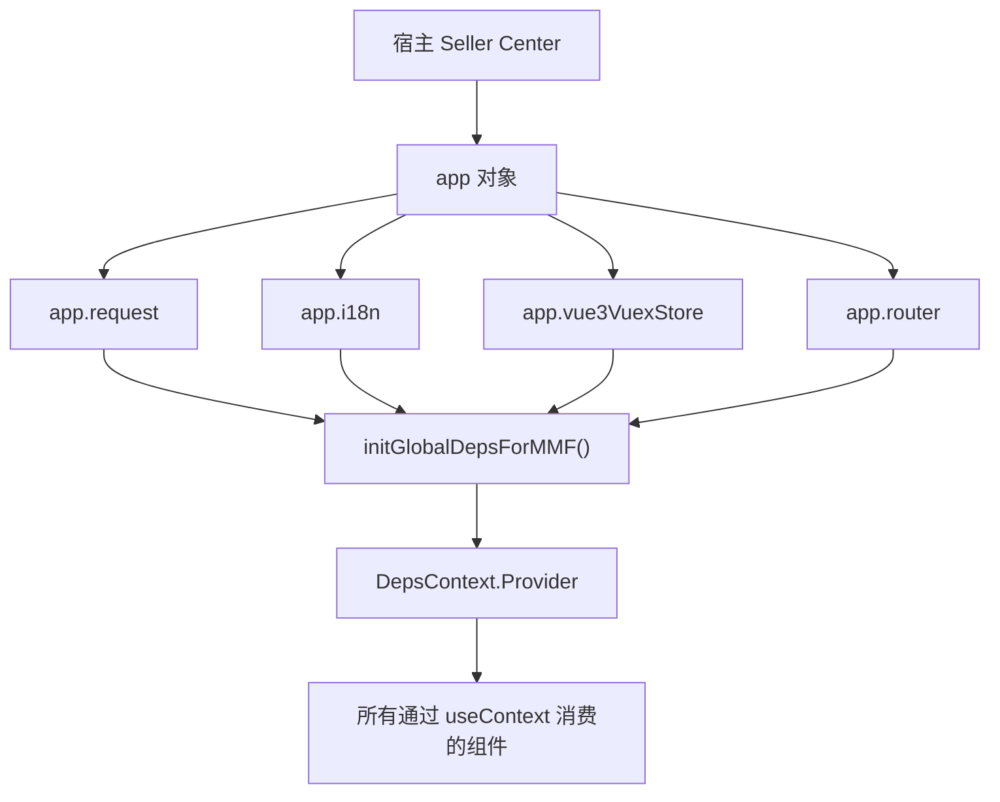

### 关键设计决策

为什么 `app.vue3VuexStore` 没有通过 `DepsProvider` 注入，而是直接 import？因为 Vuex Store 的访问模式是"一次读取、多处使用"——shop、seller 等信息在 Store 初始化后很少变化。通过 Context 注入会触发不必要的重新渲染（Context 值变化会导致所有消费者重新渲染），而直接读取 `getters` 是惰性的——只在读取时获取当前值，不触发渲染。

这个设计选择反映了 FBS 团队的实际权衡：Context 适合注入相对稳定的服务对象（如 `request`、`$gt`），不适合注入频繁变化的数据对象（如 Store state）。对于后者，直接访问 getter 是更轻量的方案。


## 跨框架开发的测试策略

跨框架组件的测试面临一个核心挑战：组件在一个框架中渲染，但依赖另一个框架提供的对象。以下是 FBS 中常用的测试策略：

1. **单元测试框架无关逻辑**：纯函数（数据转换、校验规则）不需要框架上下文，直接测试输入输出。
2. **集成测试用 mock context**：测试 DepsProvider 包裹的组件时，手动创建一个包含 mock deps 的 Context value。
3. **E2E 测试验证跨框架行为**：通过浏览器自动化工具（Playwright/Cypress）在真实宿主中测试，而不是在单元测试中模拟宿主行为。

对于 SC React 组件的单元测试，标准的 mock 模式：

```typescript
const mockDeps = {
  $gt: (key: string) => key,
  request: { get: jest.fn(), post: jest.fn() },
  router: { push: jest.fn() },
  reporter: { report: jest.fn() },
};

function renderWithDeps(ui: React.ReactElement) {
  return render(
    <DepsContext.Provider value={mockDeps}>
      {ui}
    </DepsContext.Provider>
  );
}
```

这个模式让你的组件测试不依赖真实的宿主环境，运行速度快且可靠。

## 练习

### 依赖追踪

在 SC React 仓库中追踪 `$gt` 函数从宿主到组件的完整路径：宿主提供 → `initGlobalDepsForMMF()` → `DepsContext.Provider` → 组件 `useContext(DepsContext).$gt`。

### 故障定位

SC React 页面中所有文案显示为 key 名而非翻译后文案。列出三个最可能的原因。

### 跨框架兼容

你在 SC React 中新增了一个组件，它依赖 `app.vue3VuexStore.getters['FBS_STORE/System/maintenanceMode']`。这个组件将来可能被抽取到远端组件，被 Portal 消费。写出在这种架构迁移中需要考虑的三个兼容问题。

### 参考答案

**7.2**：1) `initGlobalDepsForMMF()` 中 `$gt` 未正确赋值；2) `DepsProvider` 未包裹到这个组件的祖先链中；3) 组件在 `DepsProvider` 渲染之前就尝试访问了 deps。

**7.3**：1) Portal 没有 `app.vue3VuexStore`——远端组件不能直接依赖 Vuex getter，需要通过 Props 或 Context 传入；2) `maintenanceMode` 的语义在两个宿主中是否一致；3) 如果从 Vuex 改为 Props 传入，需要协调两个消费者的调用方式。

## 自检

1. SC React 模块中，React 组件如何读取宿主注入的 Vuex Store？这种跨框架状态共享的边界在哪里？

2. `initGlobalDepsForMMF` 和 `DepsProvider` 各自解决了什么问题？如果宿主依赖注入失败，前端会出现什么现象？

3. Webpack external 机制在 FBS 中的作用是什么？如果 external 配置错误（如 axios 版本不匹配），会有什么后果？

4. 版本迁移时，为什么不能同时修改三个仓库？安全的迁移顺序是什么？

5. 跨框架组件的测试中，如何在不启动完整宿主的情况下验证组件的依赖注入？

## 参考文献

- [React Context](https://react.dev/learn/passing-data-deeply-with-context)
- [Vuex 4 Documentation](https://vuex.vuejs.org/)
- [React 18 Upgrade Guide](https://react.dev/blog/2022/03/08/react-18-upgrade-guide)
- [Webpack externals](https://webpack.js.org/configuration/externals/)

---

# 测试、静态检查、构建与产物边界

> 预计学习时间：120–160 分钟
> 一句话总结：能按 FBS 仓库选择正确的 lint、type-check、test 与 build 命令，理解三个仓库的构建配置、产物目录和 Portal/MMF 的消费边界——为一个 diff 输出可复核的开发准出清单。

## 这一章解决什么问题

写代码只是开发的一半。在 FBS 前端仓库中，从写完代码到"可以提交 MR"，中间还有四道工序：lint（代码风格和潜在错误检查）、type-check（TypeScript 类型检查）、test（单元测试和集成测试）、build（构建可部署的产物）。每道工序在不同仓库中的命令、配置、耗时都不同。

更重要的是，三个仓库的构建产物形式完全不同。Portal 构建出一个完整的 SPA bundle，部署后独立运行；SC Vue 和 SC React 构建出 MMF 模块产物，由 Seller Center 宿主加载。理解这些差异，你才能判断一个改动是否应该触发构建验证，以及出问题时应该从哪里排查。

本章不罗列每个仓库的全部配置项——那是文档做的事情。本章帮你建立一套判断流程：根据 diff 范围判断需要跑哪些检查，知道每个仓库的检查命令是什么，理解构建产物的消费者是谁，以及如何为自己的改动整理一份 reviewer 可复核的开发准出清单。

> 本章基于三个前端仓库的 release 分支（2026-07-20）。

## 四道检查的职责与触发时机

### lint：代码风格和潜在错误

| 仓库 | 命令 | 工具 | 典型耗时 |
| --- | --- | --- | --- |
| Portal | `yarn lint` | ESLint + Stylelint | 1-2 分钟 |
| SC Vue | `yarn lint` | ESLint | 30-60 秒 |
| SC React | `pnpm lint`（如配置） | ESLint | 30-60 秒 |

lint 检查的是代码**怎么写**的问题：缩进、引号风格、未使用变量、禁止的 API 等。ESLint 规则由仓库根目录的 `.eslintrc` 定义——三个仓库的规则略有差异，但核心原则一致。

lint 应该在每次提交前运行。如果 lint 失败，优先按规则建议修改，不要试图绕过规则（`// eslint-disable` 只在极其特殊的情况下使用，且需要注释说明原因）。

### type-check：TypeScript 类型检查

| 仓库 | 命令 | 工具 | 典型耗时 |
| --- | --- | --- | --- |
| Portal | `npx tsc --noEmit` | TypeScript 4.4 | 1-3 分钟 |
| SC Vue | `npx tsc --noEmit` | TypeScript 4.7 | 30-60 秒 |
| SC React | `npx tsc --noEmit`（按 project） | TypeScript 4.7 | 30-60 秒 |

type-check 检查的是代码**类型是否正确**：Props 类型是否匹配、函数参数和返回值、null/undefined 处理等。`--noEmit` 只检查不输出编译产物。

type-check 的常见失败模式：

- `Property 'xxx' does not exist on type 'Y'`：对象类型不匹配，检查 API 响应的类型定义。
- `Type 'string | undefined' is not assignable to type 'string'`：可选属性未处理 undefined 情况。
- `Cannot find module 'xxx'`：导入路径错误或依赖未安装。

Portal 的 `tsconfig.json` 中 `"noImplicitAny": false`——这意味着 Portal 不强制要求所有变量都有显式类型。这是历史原因，新代码应尽量提供类型。

### test：单元测试和集成测试

| 仓库 | 命令 | 工具 | 配置位置 |
| --- | --- | --- | --- |
| Portal | `yarn test` | Jest 24 | `configs/jest.config.js` |
| SC Vue | 按需配置 | Vitest / Jest | 仓库 scripts |
| SC React | `pnpm test`（按 workspace） | Vitest / Jest | 各 project 配置 |

Portal 的 Jest 配置要点：

```javascript
// configs/jest.config.js（简化）
module.exports = {
  rootDir: '../',
  modulePaths: ['<rootDir>/src/'],
  moduleNameMapper: {
    '^@/(.*)$': '<rootDir>/src/$1',          // 路径别名
    '\\.(css|less|scss)$': 'identity-obj-proxy', // 样式 mock
  },
};
```

`moduleNameMapper` 中的 `'^@/(.*)$'` 让你在测试中也能使用 `@/` 路径别名。`identity-obj-proxy` 让 CSS/Less 导入在测试中返回空对象（不关心样式，只测试逻辑）。

### build：构建可部署产物

| 仓库 | 命令 | 构建工具 | 产物位置 | 消费者 |
| --- | --- | --- | --- | --- |
| Portal | `yarn build` | Webpack 5 | `dist/` 目录 | 独立部署 |
| SC Vue | `yarn build` | MMC / Rsbuild | MMC 产物目录 | Seller Center 宿主 |
| SC React | `pnpm build:host` / `pnpm build:remote` | MMC / Rsbuild | MMC 产物目录 | Seller Center 宿主 / Portal |

build 是四道检查中最耗时的一步（2-10 分钟不等），不应该在每次代码修改后都运行。触发 build 的场景：
- 修改了构建配置（`webpack.config.js`、`mmc.config.js`）。
- 新增了路由、依赖或入口文件（可能影响产物结构）。
- 准备提交 MR 前做最终验证。
- 日常开发中通常只需要 lint + type-check。

## 按 diff 范围选择检查

### 最小检查组合

| 改动范围 | 必须运行 | 建议运行 |
| --- | --- | --- |
| 只改了一个组件的样式或文案 | lint | — |
| 改了组件逻辑或新增组件 | lint + type-check | test |
| 改了 API 函数或 Store | lint + type-check + test | — |
| 改了路由配置 | lint + type-check | build（确认产物结构） |
| 改了构建配置或入口文件 | lint + type-check + build | test |

### 跨仓库改动的检查顺序

如果你的改动涉及多个仓库（如 SC React 远端组件 + Portal 消费），检查顺序：

1. 先在被修改的仓库中完成 lint + type-check + test。
2. 在消费仓库中确认改动的影响（不需要重新构建被修改仓库，只需要在消费仓库中运行自己的 lint + type-check）。
3. 如果涉及远端组件，在 Portal 和 MMF 两种宿主中各验证一次页面行为。

## Portal 构建与产物

### Webpack 构建的关键配置

Portal 使用 Webpack 5 + Module Federation。`webpack.config.js` 的核心配置项：

- `entry`：入口文件，通常是 `src/entry.ts`。
- `output`：产物输出目录 `dist/` 和 publicPath。
- `resolve.alias`：`@` → `src/` 路径别名。
- `ModuleFederationPlugin`：远端模块声明。
- `devServer.proxy`：本地开发时的 API 代理。

### 产物结构

构建后的 `dist/` 目录包含：
- `index.html`：SPA 入口。
- `static/js/`：按路由拆分的 JS chunk（通过 React.lazy 实现）。
- `static/css/`：CSS 文件。
- `remoteEntry.js`：Module Federation 的远端入口（供其他应用消费）。

### 构建失败的常见原因

| 错误 | 原因 | 解决 |
| --- | --- | --- |
| `Module not found` | 导入路径错误或依赖未安装 | 检查路径，重新 `yarn install` |
| `TypeScript errors` | 类型不匹配 | 先跑 `npx tsc --noEmit` 定位 |
| `Can't resolve 'xxx'` | webpack alias 或 resolve 配置问题 | 检查 `webpack.config.js` 的 resolve 配置 |
| `Memory limit exceeded` | 构建内存不足 | 增加 Node 内存限制 `NODE_OPTIONS=--max-old-space-size=4096` |

## MMC 构建与 MMF 产物

### MMC 构建的工作流程

两个 SC 仓库使用 MMC 作为构建工具。MMC 内部包装了 Webpack 或 Rsbuild，提供一系列与 Seller Center 模块相关的专有能力：

1. 读取 `mmc.config.js` 获取模块 ID、类型和技术栈。
2. 从 Seller Portal 平台拉取模块的远程配置（`yarn run getModule`）。
3. 从 Transify 平台拉取翻译文件（`yarn run i18n:pull`）。
4. 根据 `tech` 字段（`vue3` / `react18`）选择合适的构建器配置。
5. 生成包含模块元信息的构建产物。

### MMF 产物的消费者

MMF 构建产物有两个消费者：

- **Seller Center 宿主**：在用户访问对应路径时，宿主从 CDN 加载模块的 JS/CSS，注入路由、Store 等宿主能力后渲染。
- **Module Federation（仅远端组件）**：SC React 的远端组件产物同时被 Portal 通过 Module Federation 消费。

### 本地开发 vs 生产构建

本地开发时，MMC 启动 dev server，产物在内存中（不输出到磁盘）。生产构建时，产物输出到 `dist/` 或 MMC 配置的 output 目录。两者的关键区别：

- 本地 dev server 的产物未压缩、包含 source map，方便调试。
- 生产构建的产物经过压缩、tree-shaking、code splitting 优化。
- MMF Dev Tools 在本地开发时注入的是 dev server 的产物。

## 开发准出清单

每次准备提交 MR 时，整理以下核查项并附上证据：

### 代码质量核查

```markdown
- [ ] lint 通过：`yarn lint`（或对应命令）无新增错误
- [ ] type-check 通过：`npx tsc --noEmit` 无新增类型错误
- [ ] 无硬编码文案：所有用户可见文字使用 `$t()` 包裹
- [ ] 无 PII 泄露：敏感数据不出现在日志、URL 或 Store 持久化中
- [ ] 无 console.log 残留：生产代码中的调试日志已清理
```

### 功能验证核查

```markdown
- [ ] 正常路径：至少一种输入下功能正常
- [ ] 空态：无数据时页面不白屏、不报错
- [ ] 加载态：数据加载中有 loading 指示
- [ ] 错误态：API 失败时有错误提示（如果由 wrapper 统一处理则标注）
- [ ] 权限控制：无权限用户不能看到受限功能和数据
- [ ] i18n：至少中英文下文案正确（如果你有权限切换语言）
```

### 跨仓影响核查

```markdown
- [ ] 本仓影响：列出所有修改的文件和原因
- [ ] 跨仓影响：判断是否影响 Portal / SC Vue / SC React 的另一仓
- [ ] 远端组件影响：如果修改了远端组件，确认 Portal 和 MMF 两个消费者的兼容性
- [ ] API 契约变化：如果请求参数或响应字段有变化，与后端对齐
```

### 构建验证核查

```markdown
- [ ] 本地 dev server 正常启动：能访问对应页面
- [ ] build 通过（如适用）：`yarn build` 或对应命令无错误
- [ ] 产物结构正常：关键 chunk 文件存在
```

## 常见错误

### 忽略 lint 直接提交

lint 错误不阻断构建，所以很容易被忽略。但 lint 规则通常对应着团队约定的编码规范——绕过 lint 等于绕过 Code Review 的第一道防线。

### type-check 只跑了 IDE 的实时检查

IDE 的 TypeScript 检查可能只检查当前打开的文件。`npx tsc --noEmit` 检查整个项目，可能发现 IDE 中未显示的跨文件类型问题。

### build 只在本地跑，没验证产物正确性

构建成功后，浏览器的 `yarn start` / `yarn dev` 可能正常运行，但这不代表生产构建产物也正常。如果改了构建配置，至少验证一次生产构建的产物。

### 跳过测试因为"没写新增测试"

如果改动的代码已有测试，修改后应确保已有测试仍通过。如果没有已有测试，至少手动验证改动功能。

## Jest 单元测试实战

### Portal 的测试目录结构

Portal 的测试文件分布有两种模式：

- `__test__/` 目录：与源码同级或模块级，存放该模块的测试文件。
- `.test.ts` / `.spec.ts` 文件：与被测文件同级，命名约定明确。

查找已有测试的方法：

```bash
# 找 Portal 中与 inbound 相关的测试
find src/ -path "*inbound*" -name "*.test.*" -o -path "*inbound*" -path "*__test__*"
```

### 一个典型的 Portal 单元测试

以权限检查函数为例：

```javascript
// __test__/permission.test.js
import { hasPermission } from '@/business/utils/permission';
import { store } from '@/store';

jest.mock('@/store', () => ({
  store: {
    getState: jest.fn(),
  },
}));

describe('hasPermission', () => {
  it('returns true when user has the permission', () => {
    store.getState.mockReturnValue({
      context: { currentUser: { permission_code_list: ['VIEW_INBOUND'] } },
    });
    expect(hasPermission('VIEW_INBOUND')).toBe(true);
  });

  it('returns false when user does not have the permission', () => {
    store.getState.mockReturnValue({
      context: { currentUser: { permission_code_list: [] } },
    });
    expect(hasPermission('VIEW_INBOUND')).toBe(false);
  });

  it('handles array input', () => {
    store.getState.mockReturnValue({
      context: { currentUser: { permission_code_list: ['VIEW_INBOUND', 'EDIT_INBOUND'] } },
    });
    expect(hasPermission(['VIEW_INBOUND', 'ADMIN'])).toBe(true);
  });
});
```

关键测试模式：

- **mock 外部依赖**：`jest.mock('@/store')` 替换真实的 Redux Store。
- **控制测试数据**：`store.getState.mockReturnValue(...)` 设置 Store 的返回值。
- **多场景覆盖**：正常有权限、无权限、数组输入等。

### 测试 React 组件的模式

测试 React 组件通常需要渲染库（如 `@testing-library/react`）：

```javascript
import { render, screen, fireEvent } from '@testing-library/react';
import { Provider } from 'react-redux';
import FilterBar from './FilterBar';

const renderWithStore = (component, initialState) => {
  const store = createStore(rootReducer, initialState);
  return render(<Provider store={store}>{component}</Provider>);
};

it('calls onSearch when search button is clicked', () => {
  const onSearch = jest.fn();
  renderWithStore(<FilterBar onSearch={onSearch} />);
  fireEvent.click(screen.getByText('搜索'));
  expect(onSearch).toHaveBeenCalled();
});
```

### 测试命令的效率技巧

```bash
# 只运行改动的测试文件
yarn test:onlyChanged

# 只运行特定文件的测试
yarn test -- path/to/component.test.js

# 监听模式——文件改动后自动运行
yarn test:watch

# 运行测试并生成覆盖率报告
yarn test --coverage
```


## 构建产物的消费边界详解

### Portal 产物的独立部署路径

Portal 是独立 SPA，它的产物部署到 CDN 后，用户直接通过 URL 访问。构建产物中的 `index.html` 通过 `<script>` 标签加载 JS bundle。Portal 不需要任何宿主环境——这是它和两个 SC 仓库最根本的产物差异。

Portal 构建后需要验证的关键点：
- `index.html` 中的 `<script>` 标签路径是否正确（publicPath 配置）。
- 懒加载的 chunk 文件是否正确分拆（Network 面板中按路由导航时是否加载了额外的 JS）。
- Module Federation 的 `remoteEntry.js` 是否正确生成（如果 Portal 提供了远端入口）。

### MMF 产物的宿主加载流程

SC 仓库的构建产物包含模块元信息（模块 ID、版本、路由映射等），由 MMC 打包为特定格式。宿主加载流程：

1. Seller Center 宿主从配置中心获取模块列表和版本信息。
2. 用户访问某路径时，宿主匹配到负责该路径的模块。
3. 宿主从 CDN 加载模块的 JS 和 CSS。
4. 执行模块的注册代码（Store、Router）。
5. 宿主触发路由守卫，初始化模块状态。
6. 渲染对应页面组件。

### 构建产物的缓存策略

前端资源的缓存策略对用户体验影响很大。FBS 构建产物通常使用以下缓存策略：

- **HTML 文件**：不缓存或短期缓存（因为 HTML 中引用的 JS/CSS 文件名带有 content hash，更新时文件名会变）。
- **JS/CSS 文件**：长期缓存（文件名中的 content hash 确保内容变化时文件名变化）。
- **MMC module metadata**：短期缓存或按版本号缓存。

如果在本地测试时发现"改了代码但浏览器显示旧版本"，首先尝试硬刷新（Cmd+Shift+R），如果仍无效，检查 dev server 是否正确触发了 HMR 或重新编译。


## CI/CD 中的质量闸门

### 典型的 CI 流程

FBS 前端仓库在 MR 合并前通常会经过以下 CI 检查：

1. **依赖安装**：`yarn install` / `pnpm install`
2. **lint**：ESLint 检查
3. **type-check**：TypeScript 编译检查
4. **test**：单元测试
5. **build**：构建验证（确认产物可生成）

任何一步失败都会阻止 MR 合并。这就是为什么"本地 lint 通过了但 CI 上失败了"需要重视——CI 环境和本地环境可能有差异（Node 版本、缓存状态等）。

### 本地环境与 CI 环境的差异排查

常见差异和解决方案：

| 差异 | 现象 | 解决 |
| --- | --- | --- |
| Node 版本不同 | CI 上某些包安装失败 | 用 nvm 切换到 CI 使用的 Node 版本重试 |
| 缓存差异 | 本地 OK 但 CI 报错 | `rm -rf node_modules && yarn install` 清理重装 |
| 操作系统差异 | 路径分隔符或换行符问题 | 使用 `path.join()` 而非字符串拼接；统一 LF 换行 |
| 环境变量 | 本地有 `.env.local` 但 CI 没有 | 确认 CI 配置中环境变量是否设置 |


## 为不同仓库选择合适的开发工具链

### 推荐的 IDE 和插件

| 需求 | 推荐工具 |
| --- | --- |
| Vue 3 开发 | VS Code + Volar（Vue 官方插件）+ TypeScript |
| React 开发 | VS Code + ESLint + Prettier |
| 跨仓库工作 | VS Code workspace 配置多个仓库路径 |
| 调试 Node 脚本 | VS Code 内置 debugger + `--inspect-brk` |

### 提高开发效率的命令别名

```bash
# 在 ~/.zshrc 中设置别名
alias fbsp="cd ~/Work/FBS/fbs-frontend && yarn start"
alias fbscv="cd ~/Work/FBS/fbs-sc-vue && yarn dev"
alias fbscr="cd ~/Work/FBS/fbs-sc-react && pnpm dev:host"

# 快速 lint
alias fblint="cd ~/Work/FBS/fbs-frontend && yarn lint"
```

这些别名不是必需品，但它们能减少你在三个仓库之间切换时的重复输入，让你更快进入开发状态。

## 练习

### 检查选择

以下改动分别需要运行哪些检查？（只需回答 lint / type-check / test / build 四个选项的组合）

a) 修改了一个 Vue 组件的 `v-if` 条件
b) 在 Portal 的 `webpack.config.js` 中新增了一个 alias
c) 修改了 SC React 远端组件的 Props 接口
d) 新增了一个 API 函数并在页面中调用了它

### 准出清单填写

选择一个你最近在 FBS 前端仓库中做过的改动（或假设一个），填写完整的开发准出清单。

### 构建排查

SC Vue 的 `yarn build` 失败，错误信息为 `Module not found: Error: Can't resolve '@/components/InboundRow'`。列出三个排查步骤。

### 参考答案

**7.1**：a) lint + type-check（v-if 的条件涉及类型判断）。b) lint + type-check + build（修改构建配置必须验证产物）。c) lint + type-check + test（Props 接口变化可能影响消费者）。d) lint + type-check + test。

**7.3**：1) 确认 `@/components/InboundRow` 文件是否存在——路径拼写是否正确、文件扩展名是否正确。2) 检查 `tsconfig.json` 或 webpack alias 中 `@` 的映射是否正确指向 `src/`。3) 确认 `InboundRow` 的导出方式（`export default` vs `export const`）与导入方式匹配。

## 自检

1. FBS 三个前端仓库各自使用了哪些构建工具？它们的产物格式和消费方式有什么不同？

2. lint、type-check、test、build 四道检查的职责分别是什么？什么情况下只需要跑部分检查？

3. Portal 的 Webpack 产物和 MMF 的 MMC 产物各自的消费边界是什么？为什么不能混淆？

4. 开发准出清单应该包含哪些项目？为什么"lint 通过"和"build 成功"不能互相替代？

5. CI 流水线中的质量闸门通常包括哪些检查？本地开发和 CI 环境的结果不一致时，优先排查什么？

## 参考文献

- [Webpack Concepts](https://webpack.js.org/concepts/)
- [Jest Documentation](https://jestjs.io/docs/getting-started)
- [TypeScript 4.7 Release Notes](https://www.typescriptlang.org/docs/handbook/release-notes/typescript-4-7.html)
- [Rspack Introduction](https://rspack.rs/guide/start/introduction)
- [Rsbuild Guide](https://rsbuild.rs/guide/start/)

---

# 前端观测与系统化排错

> 预计学习时间：130–170 分钟
> 一句话总结：能用浏览器 DevTools、Network 面板、Console、Source Map、API SLA 监控埋点与构建日志分层定位白屏、路由 404、权限拒绝、请求失败和 MMF 宿主注入异常五类高频问题——完成两份故障诊断记录，其中一份来自 MMF 宿主边界。

## 这一章解决什么问题

模块一到模块三的前七章，你学会了怎么在 FBS 前端仓库中写正确的代码。但现实是：代码不会一次写对。白屏、接口报错、路由不匹配、权限被拒——这些不是你学得不够好，它们是前端开发的日常。

区别在于你怎么应对。没有章法的人会逐行改代码、反复刷新浏览器、猜原因。有章法的人会先保存现象证据，然后分层假设、逐个验证、最小修复、回归验证。本章教你后一种方法。

FBS 前端的错误来源跨越四层：宿主层（MMF 注入失败）、构建层（source map 不匹配）、网络层（代理配置错误、超时、HTTP 错误码）和应用层（组件状态异常、路由守卫逻辑）。每层的排查方式不同——你不能用看 Console 的方法排查宿主注入问题，也不能用看 Network 面板的方法排查构建错误。本章为每一层建立一套标准的排查流程，然后通过两个真实场景（MMF 模块白屏和 API 监控异常）带你实操整个诊断过程。

> 本章基于三个前端仓库的 release 分支（2026-07-20）。

## 错误分层与排查策略

### FBS 前端的四层错误模型

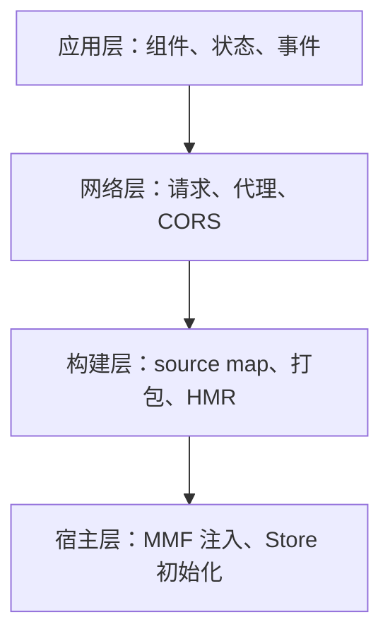

| 层 | 典型症状 | 首选工具 | 排查难度 |
| --- | --- | --- | --- |
| **宿主层** | 模块入口不可见、全局对象 undefined | MMF Dev Tools + Console | 高（需理解宿主架构） |
| **构建层** | HMR 不生效、生产环境白屏但本地正常 | Terminal + Network | 中 |
| **网络层** | 请求 401/403/404/500、CORS 错误 | Network 面板 | 低 |
| **应用层** | 组件报错、状态异常、渲染空白 | Console + React/Vue DevTools | 低 |

排查原则：**从外到内**——先排除宿主层，再排构建层，再排网络层，最后排应用层。如果宿主层的问题（如 MMF 未注入）都没解决，排查应用层代码是浪费时间。

### 保存现象证据

在开始排查之前，先收集以下信息——不要凭记忆描述问题：

1. **截图**：页面的当前状态（白屏？部分渲染？错误提示？）。
2. **Console 完整输出**：不仅是红色的 Error，还包括黄色的 Warning。
3. **Network 面板**：筛选失败请求（红色或 4xx/5xx），展开查看 Request Headers 和 Response。
4. **当前环境**：Node 版本、哪个仓库、哪个分支、是否通过 MMF Dev Tools 注入。

## 分层排查方法

### 宿主层：MMF 注入失败的排查

MMF 模块不渲染的最常见原因按概率排序：

**1. MMF Dev Tools 未配置或未启用**

症状：`localhost:4200` 正常启动，但 Seller Center 页面中 FBS 模块不出现。检查 Chrome 扩展图标是否亮起，点击图标查看填写的模块 key 和本地端口是否正确。模块 key 应与 `mmc.config.js` 中的 `id` 字段一致。

**2. 模块 index.ts 执行时报错**

症状：Console 中可能看到模块 JS 文件加载失败或执行错误。打开 Network 面板，搜索对应仓库的 JS 文件（通常以模块名命名的 chunk），确认 HTTP 状态为 200。如果不是 200，检查 dev server 是否正常监听在预期端口。

**3. INIT_FBS_STORE 失败**

症状：FBS 模块可见但内容区域空白。打开 Vue DevTools，查看 `FBS_STORE` 的 state 是否包含数据。如果 state 为空对象或全为 null，说明 API 请求失败。在 Network 面板中查找 INIT_FBS_STORE 触发的 API 请求，检查请求 URL（是否指向正确的测试环境）和响应状态码。

### 构建层：白屏与 Source Map 问题

**场景一：本地 dev server 正常，生产构建后白屏**

排查步骤：
1. `yarn build` 或 `pnpm build:host` 是否成功。
2. 打开生成的 `index.html` 或 MMF 产物，检查 `<script>` 标签的 `src` 路径是否正确。
3. 如果使用了 Module Federation，检查 `remoteEntry.js` 是否生成且可访问。
4. 检查 `publicPath` 或 `base` 配置——如果构建产物部署在子路径下而 publicPath 配置为 `/`，JS 和 CSS 文件将 404。

**场景二：HMR 不生效**

排查步骤：
1. 确认 dev server 的终端输出中是否有"compiled successfully"或类似信息。
2. 确认浏览器的 Network 面板中是否有 WebSocket 连接（HMR 依赖 WebSocket 推送更新）。
3. 如果修改了路由配置或 webpack/MMC 配置，HMR 可能不会自动生效——需要手动刷新浏览器或重启 dev server。

### 网络层：代理、超时与 HTTP 错误

**401/403：鉴权问题**

排查步骤：
1. 检查浏览器是否已登录 Seller Center（SC 仓库）或 Portal（Portal 仓库）的测试环境。
2. 如果是本地 dev server 代理了 API 请求，确认代理配置正确——Webpack devServer.proxy 或 MMC 代理设置。
3. 如果是 PII 请求，确认是否使用了 `piiRequest` 而非普通的 `request`，以及 baseURL 是否正确指向 `/api/fbs/pii/sc`。

**404：接口不存在**

排查步骤：
1. 确认 API 函数中的 `url` 拼写正确（注意尾部斜杠 `/` 的有无）。
2. 确认 request wrapper 的 `baseURL` 拼出的完整路径与后端路由一致。
3. 如果是代理配置问题，在 Network 面板中查看请求的完整 URL——是否被代理正确转发到了后端。

**CORS 错误**

排查步骤：
1. 确认 Access-Control-Allow-Origin 响应头是否包含当前前端域名。
2. 本地开发时，确认 dev server 的代理配置正确（所有 API 请求应通过代理转发，避免跨域）。
3. 如果是直连后端（未走代理），需要后端配置 CORS 允许本地域名。

**超时**

排查步骤：
1. 确认后端服务是否正常运行（ping 或 curl 测试环境的健康检查接口）。
2. 确认请求的 timeout 设置是否合理——FBS 的默认超时通常较长（10-30 秒），如果请求的数据量大或后端处理慢，可能超时。
3. 如果频繁超时，考虑在前端增加加载超时提示和重试按钮。

### 应用层：组件状态与路由异常

**组件报错：Cannot read properties of undefined**

这是最常见的应用层错误。排查步骤：
1. 根据错误堆栈定位报错的文件和行。
2. 确认那个位置访问的对象是否可能为 `null` 或 `undefined`。
3. 检查对象的数据来源——是从 API 响应解析的？从 Store 读取的？从 Props 传入的？
4. 如果数据可能为空，增加 `?.` 或 `??` 防御。

**路由守卫异常：重定向循环**

症状：浏览器地址栏不断变化，页面不断重新加载。

排查步骤：
1. 检查 `beforeEnter` 或路由守卫的跳转逻辑。
2. 确认跳转的目标路由是否会再次触发同一个守卫——形成 `A → B → A` 的死循环。
3. 通常的解决方案是在守卫中检查当前路由是否已经是目标路由，如果是则不跳转。

## 真实排错案例一：MMF 模块白屏

### 现象收集

用户报告："SC FBS 模块点了没反应，页面是白的，什么都没有。"

我们收集到的证据：
- 浏览器地址栏 URL 正常（`/portal/fbs/home`）。
- Console 有一条错误：`TypeError: Cannot read properties of undefined (reading 'fbsTag')`。
- Network 面板显示 FBS 模块的 JS 文件正常加载（200）。
- 展开错误堆栈，定位到 `src/router/index.ts` 的 `beforeEnter` 函数。

### 假设建立与验证

**假设 1**：`INIT_FBS_STORE` 的 API 请求失败，返回的数据中缺少 `shopInfo`。

验证：在 Network 面板中搜索 INIT_FBS_STORE 触发的 API 请求。发现该请求返回了数据，但 `shopInfo` 字段为 `null`。

**假设 2**：后端接口异常。

验证：用 curl 或 Postman 直接调用同一个 API，确认数据确实缺少 `shopInfo`——原来是测试环境的该卖家账号未完成入驻，后端返回的 `shopInfo` 为 null。

### 修复与回归

修复方案：在 `beforeEnter` 中增加 `shopInfo` 为空时的降级处理：

```typescript
const data = await app.vue3VuexStore.dispatch('FBS_STORE/INIT_FBS_STORE');
if (!data?.shopInfo) {
  // 降级：跳转到入驻页或引导页
  return { path: '/portal/fbs/onboarding' };
}
```

回归验证：模拟一个未入驻的卖家账号访问 FBS 模块——确认跳转到入驻页而非白屏。

## 真实排错案例二：API 监控异常

### 现象

SC Vue 仓库的 API 监控面板显示某个接口的失败率突然升高。但业务方没有收到用户投诉。

排查发现：该接口的"失败"是指 API SLA 上报的失败次数增加，不是用户看到的错误提示增加了。深入排查后发现，某个 retcode 被错误地归类为"失败"——它在业务上是正常状态（表示"数据为空"），但监控配置把它当成了错误码。

### 排查过程

1. 在 SC Vue 的 `src/report/api.ts` 中找到 SLA 监控的注册逻辑。
2. 找到 `registerQMSAPIWatcher` 函数，检查它的 retcode 分类规则。
3. 确认 `customCode` 数组中是否缺少这个"正常但非零"的 retcode。
4. 补充该 retcode 到 `customCode` 数组——监控恢复正常。

这个案例的关键教训：前端监控信号不等于用户可见的错误。在根据监控报警修改代码之前，要先确认监控的分类规则是否正确。

## 排错工具箱

### 每个仓库的排错入口

| 仓库 | 排错文档位置 | 常见问题的快速索引 |
| --- | --- | --- |
| Portal | `.agents/skills/fullstack/SKILL.md` | 启动失败、代理不通、i18n 缺失 |
| SC Vue | `.agents/skills/fullstack/SKILL.md` | MMC 安装、模块注册、MMF Dev Tools |
| SC React | `TROUBLESHOOTING.md` | pnpm workspace、远端组件、依赖安装 |

### 浏览器 DevTools 的高效用法

- **Console 过滤器**：在 Console 中使用 `Ctrl+F` 搜索特定错误关键词（如 `TypeError`、`401`、`net::ERR`）。
- **Network 过滤器**：输入 `method:POST` 只看 POST 请求；输入 `-status-code:200` 只看非 200 的请求。
- **Conditional Breakpoint**：在 Sources 面板中对怀疑的代码行右键 → 添加条件断点，输入 `data === undefined`——只在数据为空时才中断。
- **Performance 面板**：如果怀疑性能问题（如页面加载慢），录制一段 Performance trace，查看是哪个阶段耗时最长（网络请求？脚本解析？渲染？）。

### 排错记录模板

每次排错后，用以下模板记录以便团队积累知识：

```markdown
### 问题：[一句话描述]
- 现象：[截图 + 错误信息]
- 环境：[仓库 / Node 版本 / 分支 / 是否 MMF Dev Tools]
- 排查过程：
  1. [假设 A] → [验证方法] → [结果]
  2. [假设 B] → [验证方法] → [结果]
- 根因：[用一句话解释为什么会出现这个问题]
- 修复：[具体的代码或配置改动]
- 预防：[以后如何避免或更快地发现]
```

## 常见错误

### 同时改多个变量

排错时每次只改一处——如果同时改了组件代码、路由配置和 API 调用，修好了也不知道是哪步修好的，修坏了也不知道是哪步搞坏的。

### 忽略 Warning

Console 中的黄色 Warning 往往是问题的前兆。`[Vue warn]`、`Warning: Each child in a list should have a unique key` 这类 warning 现在不致命，但可能在特定条件下升级为 error。

### 用猜测代替证据

"我觉得可能是 API 的问题"——这不是排查。排查是：打开 Network 面板，找到那次请求，确认它发到了哪个 URL、返回了什么状态码、响应体是什么。用证据说话。

## API SLA 监控与前端可观测性

### FBS 的监控体系

SC Vue 通过 `src/report/api.ts` 中的 `registerQMSAPIWatcher` 和 `registerQMSSLAAPIWatcher` 为每个请求实例注册监控。这个监控不是"出了问题才看"的日志——它持续采集三个维度的数据：

**1. API 成功率**：哪些接口的失败率上升了？监控中的 retcode 分类规则决定了一个接口调用算"成功"还是"失败"。`transifyCode` 和 `customCode` 两个数组定义了哪些非零 retcode 属于正常业务状态。

**2. 请求耗时**：哪些接口变慢了？SLA（Service Level Agreement）监控对比实际耗时与预设阈值，超时的接口会被标记。

**3. 请求量**：哪些接口的调用量异常（突然激增或骤降）？

### retcode 分类机制

```javascript
// src/report/api.ts（简化）
const transifyCode = Object.keys(RetcodeKeyMap).map(Number); // 有翻译的 retcode
const customCode = [9004, 9005, 9103, ...];                  // 没有翻译但属于正常业务的 retcode
const filterCode = [19999, 10001, ...];                      // 应忽略的 retcode（非业务错误）
const codes = [...transifyCode, ...customCode].filter(code => !filterCode.includes(code));
```

这段代码的含义：

- `transifyCode` 中的 retcode 是已对接翻译的——前端会展示翻译后的错误文案。
- `customCode` 中的 retcode 是没有翻译的——但仍属于"业务正常返回"（如表示"没有更多数据"的状态码）。
- `filterCode` 中的 retcode 应该被忽略——它们不是业务错误，可能只是框架层面的状态码。

如果前端新增了一个业务状态码但忘记加入 `customCode` 数组，它会被监控归类为"失败"——这就是案例二中的问题。

### 如何查看监控数据

FBS 前端通常对接公司内部的 Cat 监控平台或 Grafana 面板。具体访问方式以团队内部文档为准。作为前端开发者，你不需要搭建监控平台——但你需要会用它：

1. 当有人报"接口有问题"时，先去监控平台确认是"真的接口成功率下降"还是"监控分类配置错误"。
2. 当有新接口上线时，确认它的 retcode 是否被正确分类。
3. 定期查看 API 请求耗时的 P95/P99——如果某个接口突然变慢，可能是后端性能退化或数据库查询变慢。


## 构建错误排查

### Webpack 构建失败

Webpack 构建失败的可能原因非常多，但按优先级排查最常见的三类：

1. **模块解析失败**：`Can't resolve 'xxx'`。路径拼写错误、忘记安装依赖、alias 配置不对。
2. **Loader 配置问题**：`You may need an appropriate loader`。这个文件类型没有配置对应的 webpack loader——通常是新增了非标准文件类型（如 `.graphql`、`.wasm` 等）。
3. **TypeScript 错误**：如果 webpack 配置了 `fork-ts-checker-webpack-plugin`，TypeScript 错误也会导致构建失败。先跑 `npx tsc --noEmit` 定位错误。

### MMC 构建失败

MMC 构建失败通常与以下因素相关：

1. **模块配置缺失**：`mmc: command not found`——MMC 未安装或未在 PATH 中。
2. **远程配置拉取失败**：`yarn run getModule` 失败。检查内网连接和 Seller Portal 平台的模块配置。
3. **i18n 拉取失败**：`yarn run i18n:pull` 失败。检查 Transify 平台的权限和网络连接。
4. **依赖版本冲突**：pnpm workspace 的依赖版本不一致。尝试 `pnpm install --force`。

### 构建产物问题

**场景：构建成功但部署后 404**

- 检查 `publicPath` 或 `base` 配置——如果应用部署在子路径下（如 `/fbs/`），而构建时的 publicPath 是 `/`，JS 文件会请求 `/static/js/xxx.js` 而非 `/fbs/static/js/xxx.js`。
- 检查 Nginx 或 CDN 配置——静态文件的路径规则是否正确。

**场景：懒加载的页面 404**

- 检查 `React.lazy(() => import('./path'))` 中的路径是否正确。
- 检查 webpack 的 `output.chunkFilename` 配置——懒加载的 chunk 文件命名规则是否导致文件找不到。


## 跨仓库问题的系统化排错

### Portal 消费远端组件失败

如果 Portal 中远端组件不渲染，排查顺序：

1. SC React 中远端组件的构建产物是否正确生成。
2. SC React 远端组件的 dev server 是否启动且监听预期端口。
3. Portal 的 Module Federation 配置中 remotes 是否指向正确的地址（本地 dev server vs CDN）。
4. Portal 的浏览器 Console 中是否有模块加载错误。
5. Portal 的 Network 面板中远端组件的 JS 文件是否正常加载（200）。

### 三仓联动问题的排查模板

当一个问题涉及多个仓库时，先在每个仓库单独验证，再串起来验证：

1. **后端**：接口是否正常（curl 或 Postman 确认）。
2. **SC Vue/React（MMF 模块）**：Network 面板确认模块是否收到正确的接口响应。
3. **Portal**：如果消费者是 Portal，确认 Module Federation 加载的远端组件版本是否匹配。
4. **宿主**：如果 MMF 模块在宿主中表现异常但本地 dev server 正常，问题在宿主配置或 MMF Dev Tools。


## 缓存导致的排查陷阱

### 浏览器缓存

改了代码但浏览器显示旧版本——最常见的排查失误之一。解决：

- 打开 DevTools → Network 面板 → 勾选"Disable cache"。
- 硬刷新：Cmd+Shift+R（Mac）或 Ctrl+Shift+R（Windows）。
- 如果仍然不行，清除浏览器缓存或使用无痕模式。

### Service Worker 缓存

如果 FBS 使用了 Service Worker，SW 可能会缓存旧版本的 HTML 和 JS。排查：

- 在 Application 面板 → Service Workers → 点击"Unregister"注销 SW。
- 然后在 Cache Storage 中清除所有缓存。
- 刷新页面。

### CDN 缓存

生产环境的前端产物通常部署在 CDN 上。如果 CDN 缓存了旧版本，本地清除缓存没用——需要等 CDN 刷新或手动触发 CDN 的缓存更新。FBS 的构建产物文件名包含 content hash，理论上内容变化时文件名会变化，CDN 应该返回新文件。如果旧文件名仍被访问，检查 HTML 文件是否被 CDN 缓存。


## 排错习惯的养成

### 先保存证据，再改代码

改代码之前，先把当前的错误信息、页面截图、Network 的请求列表保存下来。改了代码才发现忘了原来的错误是什么——这种情况非常常见。

### 每次只改变一个变量

不管多着急，一次只改一处。改了组件 → 刷新 → 看结果。不行就改回去，再改另一处。不要同时改三处然后不知道是哪处修好的。

### 记下排错过程

排完一次耗时超过 15 分钟的问题后，花 2 分钟记录：现象、假设、验证过程、根因、修复。下次遇到类似问题时，先查笔记而不是从头排。

### 遇到无法解释的现象时

如果所有合理假设都被排除，考虑以下可能：

- 浏览器扩展干扰（用无痕模式测试）。
- Node 版本不匹配（`node -v` 确认）。
- 缓存（硬刷新 + 清除 Service Worker）。
- 环境变量（`.env.local` 可能覆盖了预期配置）。
- 多个 dev server 实例残留（`ps aux | grep node` 检查）。


## 从监控信号到代码定位

当收到监控告警（如某接口失败率突增）时，标准的响应流程：

1. 确认告警是否真实——先去监控面板看实际数据趋势，排除误报。
2. 确定影响范围——是所有用户在影响还是特定地区/特定 seller？
3. 找最近的变更——是前端改了请求参数格式还是后端改了接口逻辑？
4. 用最小复现验证——尽量在不影响线上用户的情况下复现问题。
5. 修复后验证监控数据恢复——确认修复生效，不只是"代码改了"。

对于前端开发者来说，第 3 步是关键。如果你确认前端最近没有上线改动但监控告警了，大概率是后端接口行为变化——带着"没有改前端"这个证据去找后端同事，比"感觉是后端的问题"有效得多。

## 练习

### 分层诊断

以下错误应该从哪一层开始排查？

a) 页面可以访问但某个列表数据为空。
b) `localhost:4200` 启动正常但 SC 页面不显示 FBS 模块。
c) `yarn dev` 报 `Error: listen EADDRINUSE :::4200`。
d) 组件报 `Cannot read properties of null (reading 'filter')`。

### 完整排错记录

从你自己的开发经历中找一个曾经遇到的前端问题，按照本章的排错记录模板写一份完整的诊断报告。

### 参考答案

**7.1**：a) 网络层（API 请求）→ 应用层（组件数据绑定）。b) 宿主层（MMF Dev Tools 配置）。c) 构建层（端口占用）。d) 应用层（组件空值处理）。

## 自检

1. FBS 前端常见的五类高频问题（白屏、路由 404、权限拒绝、请求失败、宿主异常）分别应该从哪一层开始排查？

2. 分层排查模型中，"确认范围 → 建立假设 → 逐层验证 → 最小修复 → 回归"五步各自的作用是什么？

3. Network 面板、Console、Vue/React DevTools 和 source map 各自最适合排查哪类问题？

4. API SLA 监控异常时，如何区分是前端问题还是后端问题？需要看哪些证据？

5. 为什么排查 MMF 宿主问题时不能只看自己模块的日志？需要额外查看哪些宿主层面的信息？

## 参考文献

- [MDN Browser Developer Tools](https://developer.mozilla.org/en-US/docs/Learn/Common_questions/Tools_and_setup/What_are_browser_developer_tools)
- [Chrome DevTools Network](https://developer.chrome.com/docs/devtools/network)
- [Chrome DevTools Console](https://developer.chrome.com/docs/devtools/console)
- [React Developer Tools](https://react.dev/learn/react-developer-tools)

---

# 前端改动影响分析与开发交接

> 预计学习时间：120–160 分钟
> 一句话总结：能从 FBS 前端需求和 diff 判断影响的仓库、路由、组件、权限、翻译和构建配置——整理一份 reviewer 可复核的跨仓影响摘要、测试结果和开发交接清单。

## 这一章解决什么问题

模块二的最后一章（FE-W07）教你完成了一个完整的前端切片。但那是单仓库改动——你只需要考虑 SC Vue 一个仓库中的文件。真实的 FBS 前端需求很少只涉及一个仓库。改了一个 API 类型定义，Portal 和 SC React 都可能受影响；增了一个远端组件的 Props，两个宿主都要验证。

本章教你从需求出发，系统化地评估改动的影响范围。你会学会建立仓库地图、判断影响面、加载仓库规则、分析实际 diff、选择准出检查，最后整理一份 reviewer 可以直接复核的开发交接材料。这套流程不只适用于大型改动——每个 MR 都可以用它来确保在提交之前已经想清楚了影响面。

> 本章基于三个前端仓库的 release 分支（2026-07-20）。

## 影响分析的思维框架

### 从需求出发的五问

接到一个 FBS 前端需求时，先问自己五个问题：

| 问题 | 目的 | 去哪里找答案 |
| --- | --- | --- |
| 这个功能在哪个页面上？ | 确定涉及哪个仓库 | 需求文档 + 浏览器 URL 反查路由 |
| 涉及哪些前端能力？ | 确定影响的代码模块 | 需求拆解 + 仓库代码搜索 |
| 影响哪些消费者？ | 确定跨仓影响 | 搜索组件的 import/require 引用 |
| 需要什么前置依赖？ | 确定阻塞项 | 后端接口、权限码、翻译 key |
| 怎么验证改对了？ | 建立验收标准 | 用例定义 + 自动化检查 |

### 影响分析的三个层次

| 层次 | 范围 | 典型改动 |
| --- | --- | --- |
| **本文件** | 修改的单个文件 | 组件内部状态调整、样式修改 |
| **本仓** | 修改文件所在仓库的其他文件 | 组件 Props 变化影响的消费者、路由变化影响的导航 |
| **跨仓** | 其他前端仓库 | API 类型共享、远端组件 Props、翻译 key 共享 |

大多数改动只到"本仓"层。当改动涉及以下几类时，才需要做跨仓影响分析：

- 修改了 `src/api/*.js` 中的接口类型定义（Portal 和 SC 仓库可能共享接口定义或接口契约）。
- 修改了 SC React 远端组件的 Props（影响 Portal 的消费代码）。
- 新增或修改了共享常量（如权限码、枚举值）。
- 修改了 i18n key 的命名规则（影响所有仓库的翻译文件）。

## 仓库地图与影响定位

### 以入库功能为例的影响地图

假设需求是"为入库列表增加一个新的筛选字段"，以 SC Vue 为主仓库的影响分析：

| 影响级别 | 具体文件/仓库 | 改动类型 |
| --- | --- | --- |
| 本文件 | `src/views/inbound/IBT/list/searchForm.vue` | 新增筛选字段 |
| 本仓 | `src/api/inbound.js` | 确认参数传递方式（可能不需要修改） |
| 本仓 | `src/views/inbound/IBT/list/list.vue` | 如果需要新增列展示 |
| 跨仓 | Portal `src/views/InboundManagement/` | Portal 也有入库列表，可能需要同步改动 |
| 跨仓 | SC React 远端 InboundComponent | 如果远端组件提供了入库列表，需要同步 Props |
| 依赖 | 后端 API | 确认后端是否支持新筛选参数 |
| 依赖 | Transify 平台 | 新增翻译 key |

### 三种需求类型的典型影响面

**页面级改动**（新增页面、修改页面布局）：
- 影响面：路由、菜单、组件、权限、i18n。
- 跨仓：通常不影响——每个仓库的页面独立。

**能力级改动**（新增 API 函数、修改共享组件）：
- 影响面：API 类型定义、组件 Props、消费者代码。
- 跨仓：可能影响——通过搜索引用确定。

**基础设施级改动**（升级依赖、修改构建配置、调整 ESLint 规则）：
- 影响面：所有使用该依赖/配置的仓库。
- 跨仓：大概率影响——需要逐仓验证。

## 加载仓库规则

### 每个仓库的编码规则

在开始改代码之前，先读对应仓库的编码规则。三个仓库都有 `.agents/skills/coding/` 目录，包含以下主题的规则文件：

| 规则文件 | 作用 | 何时必读 |
| --- | --- | --- |
| `repo-guide-route-rule` | 路由注册约定 | 新增路由时 |
| `repo-guide-api-rule` | API 函数写法 | 新增 API 函数时 |
| `repo-guide-permission-rule` | 权限控制约定 | 新增权限控制时 |
| `repo-guide-i18n-rule` | 翻译 key 命名 | 新增文案时 |
| `repo-guide-store-rule` | Store 使用约定 | 新增状态时 |
| `repo-guide-component-library-rule` | 组件库使用约定 | 使用 EDS/SSC UI 时 |
| `repo-guide-pii-rule` | PII 数据处理 | 处理敏感数据时 |
| `repo-guide-time-rule` | 时间处理约定 | 处理日期时间时 |
| `repo-guide-file-operation-rule` | 文件操作约定 | 上传下载时 |

不要求全部读完——只读与当前改动相关的规则。如果改动涉及多个主题，读对应的规则文件即可。

### 仓库编码规则的优先级

当规则与直觉冲突时，**规则优先**。例如，你可能习惯用 `fetch` 发请求，但规则要求使用 `app.request.clone()`——遵守规则。仓库规则是团队经验的结晶，违反规则通常会导致隐蔽的 bug（如跨域问题、Cookie 缺失、监控断点）。

## 分析实际 diff

### 生成影响清单

在提交 MR 之前，用 `git diff` 生成改动文件列表，然后逐文件标注影响级别：

```bash
git diff --stat origin/release
```

对于每个修改的文件，回答三个问题：
1. 这个文件被谁 import/require？（用 `rg "import.*from.*文件名"` 反查）
2. 这个文件的修改改变了什么接口/类型/行为？
3. 这个改变是否向后兼容？

### 向后兼容性检查清单

| 改变 | 向后兼容？ | 如果不兼容，需要协调什么 |
| --- | :---: | --- |
| 新增可选 Props | 是 | 无需协调 |
| 新增必填 Props | 否 | 所有消费者都需要传入新 Props |
| 修改 Props 类型 | 否 | 所有消费者都需要更新类型 |
| 删除 Props | 否 | 所有消费者都需要移除该 Props |
| 修改 API URL | 否 | 后端路由同步调整 |
| 修改 API 响应字段名 | 否 | 所有消费者需要更新字段名 |
| 新增 export | 是 | 无需协调 |
| 修改 export 签名 | 否 | 所有 import 方需要更新 |

如果不兼容，在 MR 描述中明确标注为 **破坏性变更**，并列出受影响方。

## 准出检查与测试矩阵

### 按改动类型选择检查

| 改动类型 | lint | type-check | test | build |
| --- | :---: | :---: | :---: | :---: |
| 组件样式修改 | 必须 | — | — | — |
| 新增组件 | 必须 | 必须 | 建议 | — |
| 修改 API 类型 | 必须 | 必须 | 建议 | — |
| 新增路由 | 必须 | 必须 | — | 建议 |
| 新增依赖 | 必须 | 必须 | — | 必须 |
| 修改构建配置 | 必须 | 必须 | — | 必须 |

### 跨仓验证矩阵

当改动涉及跨仓影响时：

| 验证项 | Portal | SC Vue | SC React |
| --- | :---: | :---: | :---: |
| 页面正常渲染 | 如果影响 | 如果影响 | 如果影响 |
| API 请求正常 | 验证 | 验证 | 验证 |
| console 无新增 error | 验证 | 验证 | 验证 |
| 远端组件兼容 | 验证 | — | 验证 |
| i18n 正确 | 验证 | 验证 | 验证 |

## 开发交接材料

### MR 描述模板

每次提交 MR 时，按以下结构填写描述：

```markdown
## 改动目的
[一句话说明这个 MR 要解决什么问题]

## 改动范围
- [仓库名]：[修改的文件和原因]
- [如果是跨仓]：[列出受影响的仓库和改动类型]

## 影响分析
- [ ] 本仓影响：[列出影响的本仓文件]
- [ ] 跨仓影响：[列出影响的其他仓库] 或 [无]
- [ ] 破坏性变更：[是/否，如果是，列出详情]
- [ ] 权限变更：[是/否]
- [ ] i18n 变更：[是/否]
- [ ] API 契约变更：[是/否]

## 验证结果
- [ ] lint 通过
- [ ] type-check 通过
- [ ] 页面正常渲染
- [ ] console 无新增 error
- [ ] [如有跨仓] 受影响仓库验证通过

## 截图/录屏
[附上功能变更前后的截图对比]
```

### 给 reviewer 的信息

除了 MR 描述，以下信息也应在 MR 中提供：

1. **自测记录**：你在本地验证了什么、怎么验证的。
2. **已知限制**：哪些场景你没法测试（如特定地区、特定权限）。
3. **阻塞项**：如果 MR 依赖尚未上线的后端接口或 i18n 审批。

Reviewer 最怕的是"看起来没问题但我不确定你有没有测过"。越详细的自测记录，reviewer 越有信心 approve。

## 常见错误

### 在 MR 中贴完整 diff 但不说明影响

Reviewer 需要的是"这些改动影响了谁"，不是"这些文件改了"。如果 diff 超过 200 行，必须附影响分析。

### 跨仓改动只测了主仓库

改了远端组件后，只在 SC React 中测了，Portal 没测——这是最常见的跨仓遗漏。如果时间不够同时测两个宿主，至少在 MR 中标注"Portal 未验证，请 reviewer 关注"，而不是悄悄合并。

### 验收只验了正常路径

少了一个必填字段的校验、网络失败的降级、空列表的展示——这些边界情况才是 bug 的来源。至少验证：正常、空态、错误态、无权限态。

### MR 描述太简略

`"fix: update component"` 这样的 MR 描述对 reviewer 毫无帮助。描述应该回答：为什么改、改了什么、影响了谁、怎么验证的。

## 实际案例分析：跨仓需求的完整影响评估

### 案例场景

假设需求为"在入库列表（IR List）中增加一个'优先仓类型'筛选字段和对应列展示，字段名为 `priority_whs_type`"。这个功能需要在 SC Vue 实现，但 Portal 和 SC React 也有入库列表页面。

### 第一步：确定涉及页面和仓库

通过搜索三个仓库中的入库列表页面：

- SC Vue：`src/views/inbound/IBT/list/`
- Portal：`src/views/InboundManagement/InboundRequest/List`
- SC React：远端 `InboundComponent`

这三个页面都可能需要展示这个新字段，但本次需求可能只要求在 SC Vue 实现。分析时应明确标注"Portal 和 SC React 当前不做改动，但需确认未来如果同步时的影响"。

### 第二步：逐仓列出改动清单

**SC Vue（主仓库）**：

| 文件 | 改动 | 影响级别 |
| --- | --- | --- |
| `src/views/inbound/IBT/list/searchForm.vue` | 新增下拉选择组件 | 本文件 |
| `src/views/inbound/IBT/list/list.vue` | 新增表格列定义 | 本文件 |
| `src/api/inbound.js` | 确认参数传递（可能无需改动） | 本仓 |

**Portal（暂不改动）**：

| 文件 | 未来如需同步的改动 |
| --- | --- |
| `src/views/InboundManagement/InboundRequest/List/index.tsx` | 新增筛选字段和列 |
| `src/apis/inbound.ts` | 新增参数类型 |

**SC React（暂不改动）**：

| 文件 | 未来如需同步的改动 |
| --- | --- |
| `projects/fbs-sc-remote-component/src/InboundComponent/` | 新增 Props 和筛选字段 |

### 第三步：评估依赖项

| 依赖项 | 状态 | 应对 |
| --- | --- | --- |
| 后端 API 支持 `priority_whs_type` 参数 | 需确认 | 与后端对齐 API 文档，确认字段名和值类型 |
| 后端 API 响应包含 `priority_whs_type` 字段 | 需确认 | 确认响应结构 |
| Transify 翻译 key | 需新增 | `priorityWhsType`、选项 label 等 |
| 权限码 | 无需新增 | 复用现有入库列表查看权限 |

### 第四步：准出检查计划

| 检查 | SC Vue 验证结果 |
| --- | :---: |
| lint | 待验证 |
| type-check | 待验证 |
| 正常筛选 | 待验证 |
| 清除筛选 | 待验证 |
| 空结果 | 待验证 |
| console 无 error | 待验证 |
| Portal 不受影响 | 确认（未改动 Portal） |
| SC React 不受影响 | 确认（未改动 SC React） |


## 团队协作中的开发交接

### 何时需要正式交接

以下情况建议做正式的开发交接（不只是提交 MR）：

1. 跨仓库的大型需求——修改影响到两个以上仓库。
2. 新增了共享组件或修改了共享依赖。
3. 引入了新的技术方案（如新的状态管理方式、新的构建配置）。
4. 有破坏性变更——需要通知所有消费者同步更新。

### 交接材料清单

一套完整的开发交接材料应包括：

1. **需求文档链接**：PRD 或 TD 的原始需求。
2. **架构决策记录**：为什么选择这个技术方案而不是其他方案。
3. **MR 链接**：所有相关仓库的 MR。
4. **影响分析报告**：本章第六节的 MR 描述模板。
5. **自测记录**：验证了什么、怎么验证的、结果如何。
6. **已知问题**：有哪些场景未验证、有哪些暂时无法解决的问题。
7. **后续建议**：未来需要关注的技术债、即将废弃的旧代码、计划中的迁移步骤。

### 从"完成开发"到"完成交接"

很多前端开发者认为自己"完成了开发"就是"写完了代码 + 本地跑通了"。但在 FBS 的多仓库环境中，真正的"完成"包括：

1. 代码写完了。
2. 本仓验证过了（正常路径 + 边界路径）。
3. 跨仓影响分析过了。
4. MR 描述写清楚了。
5. 阻塞项标注了。
6. Reviewer 能够根据你的描述独立判断是否可以合并。

缺少最后两步的 MR 会增加 reviewer 的负担——他们需要自己推断影响面、自己猜测验证范围、自己判断遗留风险。这不是"懒得写"，这是把本属于开发者的分析工作转嫁给了 reviewer。


## 测试策略与验证矩阵

### 按风险等级分配测试工作量

| 风险等级 | 特征 | 测试深度 |
| --- | --- | --- |
| 低 | 样式微调、文案修改 | 目视检查 + lint |
| 中 | 组件逻辑修改、新增 API 调用 | 手动测试 + lint + type-check |
| 高 | 跨仓影响、破坏性变更、权限变更 | 手动测试 + lint + type-check + 双宿主验证 |
| 极高 | 基础设施变更（构建、依赖、路由框架） | 手动测试 + lint + type-check + 三仓全量回归 |

### 无法自动化的测试项

以下测试项目前无法自动化（或自动化成本很高），需要手动验证：

- MMF Dev Tools 注入后的页面行为。
- 不同权限账号下的页面变化。
- 不同语言下的翻译文案正确性。
- 不同时区下的时间显示。
- 远端组件在 Portal 和 MMF 中的渲染一致性。

在 MR 描述中明确标注哪些场景未自动化测试——让 reviewer 知道需要重点人工检查什么。


## 持续改进：从每次 MR 中积累

### 建立个人的影响分析模板

经过几次跨仓需求后，你会形成自己的影响分析直觉。把常用的检查项整理成模板：

```markdown
### 我的影响分析模板
- [ ] 搜索改动的函数/组件在三个仓库中的引用
- [ ] 检查 API 类型是否有消费者
- [ ] 检查 i18n key 是否需要同步
- [ ] 检查权限码是否需要新增
- [ ] 确认远端组件的 Props 兼容性
- [ ] 运行 lint + type-check
- [ ] 至少验证正常、空态、错误态三种路径
```

### 从 MR review 的反向反馈学习

当 reviewer 指出你漏掉了某项影响时，把它加入你的模板。几次 MR 之后，你的模板会逐渐覆盖所有常见的影响面——这比背任何"最佳实践"都有效。

### 影响分析不是一次性的

随着 FBS 代码库的演进，仓库之间的关系、组件的消费者、共享依赖的版本都可能变化。半年前某个改动的安全范围，今天可能不再安全。关键基础设施变更后，重新审视之前的影响分析假设。


## 从模块三结业到独立交付

### 模块三的能力总结

学完模块三的 6 章后，你应该获得了以下能力：

1. **架构理解**：能画出一张从 URL 到页面渲染的三仓加载链路图，标注每一层的关键对象和失败点。
2. **微前端判断**：能区分 Module Federation、qiankun、MMF 三种机制，知道什么时候用哪种。
3. **跨框架开发**：能在 React 组件中安全访问宿主 Vuex Store，理解依赖注入的原理和限制。
4. **质量保障**：能按 diff 范围选择正确的 lint/type-check/test/build 组合。
5. **系统化排错**：能用四层模型分层定位问题，先排除宿主再排网络最后排应用。
6. **影响分析**：能从需求出发评估跨仓影响，整理 reviewer 可复核的交接材料。

这六项能力合在一起，意味着你不再是一个"能在 Vue 中写组件"的前端开发者——你是能独立接手一个 FBS 前端需求、评估影响、完成实现、验证交付的全栈前端工程师。

### 从模块三到实际工作的过渡

模块一到模块三覆盖了从 JavaScript 语法到跨仓架构的完整前端知识链。但知识不等于经验。真正让你从"学会了"到"会做了"的，是在真实仓库中完成 5-10 个实际需求。每做一个需求，回顾本章的影响分析模板，检查自己是否漏掉了影响面。每次 MR 被 reviewer 发现遗漏时，把遗漏项加入你的个人模板。

### 模块一至模块三的核心知识链路

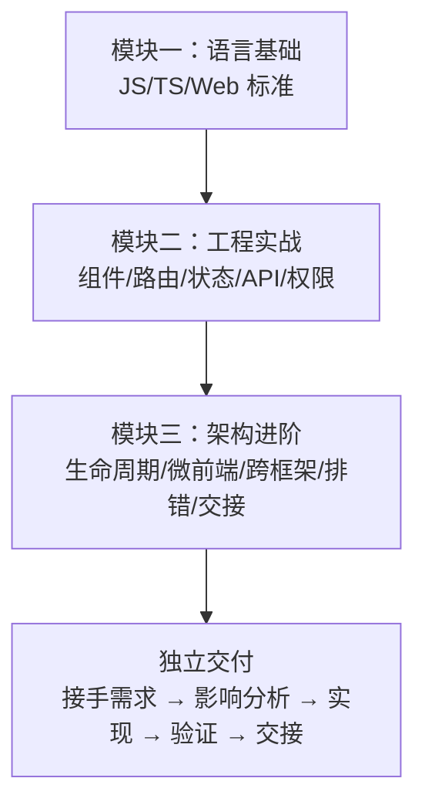

这三个模块不是各自独立的课程——它们是一条连贯的学习路径。模块一让你能读懂代码，模块二让你能写对代码，模块三让你能独立交付代码。三者缺一不可。


## 从全栈视角看影响分析

### 前后端联动的典型场景

作为全栈开发者，你需要同时考虑前端和后端的影响面。以下场景需要跨端协调：

1. **API 契约变更**：后端修改了接口的请求参数或响应字段 → 前端所有消费方需要同步。
2. **权限模型变更**：后端新增或调整了权限码 → 前端权限检查代码需要更新。
3. **业务流程变更**：入库流程的某个步骤被移除 → 前端该步骤的页面/组件需要下线。

### 前后端交接的沟通要点

与后端同事交接时，带上以下信息能让沟通更高效：

1. 前端目前使用的接口列表（从 `src/api/` 目录中提取）。
2. 前端消费的字段清单（从组件中的数据绑定提取）。
3. 前端期望的响应格式（retcode 约定、分页格式、时间格式）。

"后端改了接口，前端崩了"通常是沟通问题，不是技术问题。在接口设计阶段就对齐契约，比上线后发现不兼容再修要好得多。


## 练习答案与自测

### 本章自测题

1. 修改了 SC Vue 的 API 函数 `getRequestList` 的参数类型。影响范围包括哪些？
2. 远端组件的 Props 新增了一个必填字段。Portal 侧需要做什么？
3. 一个 MR 的 diff 包含 15 个文件，其中 3 个是构建配置文件的修改。MR 描述中至少应该包含哪些信息？
4. 跨仓改动的验证至少应该在几个宿主中完成？

### 参考答案

1. 本仓影响：所有调用 `getRequestList` 的页面需要更新参数。跨仓影响：如果后端接口是同一个，Portal 的对应 API 函数也需要同步。
2. Portal 消费该远端组件的代码需要传入新的必填 Props，否则 TypeScript 会报编译错误。
3. 改动目的、修改的文件和原因、影响分析（本仓/跨仓/破坏性变更）、验证结果（lint/type-check/页面行为）、截图对比。
4. Portal 和 MMF 两个宿主都需要验证（如果远端组件被两个宿主消费）。


## 回顾与展望

模块三的六章构成了 FBS 前端学习的最高台阶。从理解三种应用的生命周期，到驾驭微前端和跨框架开发，再到系统化排错和规范化交付——你现在具备了独立接手一个完整 FBS 前端需求的能力。下一阶段，你将把视角从前端延伸到后端：Go 语言的语法和标准库、Chassis 框架的 HTTP 开发模型、数据库操作、异步任务和消息系统。前端积累的思维框架——分层排查、影响分析、契约先行——在后端学习中同样适用。区别只是换了语言、换了工具，底层的工程思维一脉相承。

影响分析不是负担——它是让你在合并之前就发现问题的习惯，而不是在合并之后修 bug 的代价。每一次 MR 都认真做完这五步，你会发现自己踩坑的次数越来越少的。

总结：影响分析不是让你多写文档——是让你在写完代码之后、提交 MR 之前，停下来想一想：我改的这几行代码，会影响谁？每次 MR 都问自己这个问题，长期下来你会发现自己写的代码越来越安全——不是因为变得畏手畏脚，而是因为你对 FBS 代码库的理解更深入了。
影响分析是习惯，不是负担。

## 练习

### 影响分析

假设需求：为 Portal 的入库列表增加"批量导出 Excel"功能。写出完整的影响分析报告，包括本仓影响、跨仓影响、依赖项和验证计划。

### 向后兼容判断

以下改动哪些是向后兼容的？

a) 给 API 函数的参数类型新增一个可选字段。
b) 将组件的 Props `size: string` 改为 `size: 'small' | 'medium' | 'large'`。
c) 删除了一个已 export 的工具函数。
d) 修改了 request wrapper 的 `baseURL`。

### 填写 MR 描述

为你最近一次 FBS 前端改动（或假设一次改动）填写完整的 MR 描述模板。

### 综合练习参考答案

**8.2**：a) 兼容（新增可选字段不影响现有调用）。b) 不兼容（限制了允许的值范围，现有传入超出范围的值会报错）。c) 不兼容（import 方会报模块找不到）。d) 不兼容（所有 API 请求的 URL 都会变化）。

## 自检

1. 影响分析的三个层次（本仓、跨仓、破坏性变更）分别覆盖什么范围？为什么不能只分析本仓？

2. MR 描述中必须包含哪些信息？为什么 reviewer 需要这些信息而不只是看 diff？

3. 准出检查的选择依据是什么？一个只改了样式的改动和一个新增了路由的改动，各自的检查策略有什么不同？

4. 跨仓改动的验收矩阵应该覆盖哪些仓库和哪些宿主？为什么 Portal 和 MMF 两个宿主都需要验证？

5. 从"完成开发"到"完成交接"的差异是什么？交接材料中最容易被遗漏的是哪类信息？

## 参考文献
- 模块二 FE-W07（前端纵向切片）
- Portal `.agents/skills/coding/`
- SC Vue `.agents/skills/coding/`
- SC React `.agents/skills/coding/`

---

# Go 工具链、模块与版本边界

> 预计学习时间：120–160 分钟
> 一句话总结：能读懂 FBS 三个后端仓库的 `go.mod`、理解 Go 的模块/包组织方式、掌握编译和测试的最小命令，并知道 Go 1.15 与 1.20 版本差异对课程示例的限制。

## 这一章解决什么问题

前端同学第一次打开 FBS 后端仓库时，第一个困惑往往不是 Go 语法本身，而是工程组织方式。`go.mod` 文件做什么用？`git.garena.com/shopee/...` 这样的 import 路径是什么意思？为什么三个后端仓库使用了不同的 Go 版本？为什么有些文件叫 `xxx_test.go`？为什么有些文件开头带 `// +build` 注释？

这些问题的答案和 JavaScript 的 `package.json`、`node_modules`、`import` 路径有对应关系——但又不完全一样。本章帮你建立 Go 工程的心智模型，用前端工程的类比来解释 Go 的模块系统、编译过程和测试命令。学完后，你能看懂任何一个 FBS 后端仓库的 `go.mod`，知道怎样在各个仓库间判断代码的版本兼容性，以及为什么 Tax 仓库还在用 Go 1.15 而另外两个仓库已经升级到 Go 1.20。

> 本章基于三个后端仓库的 release 分支（2026-07-20）。

## Go 模块：前端的 `package.json` 但更严格

### go.mod 是声明文件但不执行

在 JavaScript/TypeScript 项目中，`package.json` 既声明依赖，又通过 `scripts` 字段定义可执行命令。Go 的 `go.mod` 只做两件事：声明当前模块的**路径**（module path）和**依赖约束**（require）。它没有 scripts，没有 devDependencies 与 dependencies 的区分。

以 `sbs-fbs-server` 的 `go.mod` 为例：

```go
module git.garena.com/shopee/bg-logistics/b2c/sbs-fbs-server

go 1.20

require (
	git.garena.com/shopee/bg-logistics/go/chassis v0.4.3-r.13
	git.garena.com/shopee/bg-logistics/go/gorm v0.0.7
	git.garena.com/shopee/bg-logistics/go/scorm v0.2.3-r.4
	// ...更多依赖
)
```

- **`module` 行**：声明这个仓库的"名字"。当你从别的仓库 import 这个仓库的代码时，用的就是这个路径。类比前端的 npm 包名，但 Go 的 module path 是完整路径而非短名。
- **`go 1.20`**：声明这个模块编写时使用的 Go 版本。编译器根据这个版本决定启用哪些语言特性。Go 1.20 的代码可以 import Go 1.15 的模块，但反过来不行——低版本编译器不认识高版本语法。
- **`require` 块**：声明依赖的模块和版本。和 `package.json` 的 dependencies 非常类似，版本号格式为 `v主版本.次版本.补丁版本-r.内部修订号`。

**前端类比**：`go.mod` ≈ `package.json`（但更精简）。Go 没有 `package-lock.json` 或 `yarn.lock` 的等价物——`go.sum` 文件记录了依赖的哈希校验和，用于安全性验证，而不是锁定版本。

### import 路径就是 module path + 子目录

在 JavaScript 中，`import` 可以使用相对路径（`'./utils'`）、别名路径（`'@/utils'`）或包名（`'lodash'`）。Go 的 import 只有一种形式：**以 module path 或标准库名为前缀的完整路径**：

```go
import (
	"git.garena.com/shopee/bg-logistics/b2c/sbs-fbs-server/apps/inbound"   // 本仓库的子包
	"git.garena.com/shopee/bg-logistics/go/chassis"                         // 外部依赖
	"context"                                                               // 标准库
	"fmt"                                                                   // 标准库
)
```

- `"context"` 和 `"fmt"` 是 Go 标准库的包——不用声明在 go.mod 中，编译器自动识别。
- `"git.garena.com/shopee/..."` 开头的路径都是内部依赖。路径的前缀和 go.mod 中 require 的模块名对应。
- import 路径不是 URL——虽然看起来像。它是模块的命名空间。Go 编译器通过内部代理（GOPROXY）或公司内部 Git 服务器解析这些路径并下载代码。

**前端类比**：Go 的 import path ≈ npm 的 `"lodash/fp"`——包名（`lodash`）+ 子路径（`/fp`）。区别是 Go 没有"路径别名"机制（没有 `@/`）；每次 import 必须写完整路径。不过 FBS 的后端仓库中可以通过 `go.mod` 的 `replace` 指令做路径重定向。

### 包的组织：目录即包边界

在 JavaScript 项目中，一个目录下可以有多个文件，通过 `export`/`import` 按文件自由引用。Go 中一个目录下的所有 `.go` 文件（除 `_test.go`）属于同一个包，共享同一个命名空间。包名通常和目录名一致，但不强制：

```
apps/inbound/
├── inbound.go          // package inbound
├── handle.go           // package inbound
├── wire_set.go         // package inbound
└── handle_test.go      // package inbound_test（或 package inbound）
```

一个目录下所有非测试文件的 `package` 声明必须一致。你可以 import 一个包，但不能 import 包内的单个文件。所以 Go 代码中的 import 粒度是**包**，文件的拆分纯粹是为了可读性。

**前端类比**：Go 的包 ≈ JavaScript 中一个目录下的 `index.js` 加上所有通过它 re-export 的模块。区别是 Go 强制一个目录只属于一个包，且包内所有导出都是全局可见的（不需要在每个文件里 import 同包的其他文件）。

## Go 多版本并存的现实：1.15 与 1.20

### FBS 三个后端仓库的版本

| 仓库 | Go 版本 | Chassis 版本 | 主要影响 |
| --- | --- | --- | --- |
| `sbs-fbs-server` | 1.20 | v0.4.3-r.13 | 主服务和敏感服务的 Go 基线 |
| `fbs-sensitive-data-server` | 1.20 | v0.4.3-r.13 | 与主服务同基线 |
| `fbs-tax-server` | 1.15 | v0.4.3-r.22 | 税务服务的旧版本基线 |

Tax 仓库使用 Go 1.15，这意味着它不能使用 Go 1.18 引入的泛型、Go 1.13 的数字字面量改进、Go 1.20 的多项性能优化。这不是"懒得升级"——税务服务的稳定性要求很高，升级 Go 版本需要大量的回归测试和合规审查。在 FBS 的日常开发中，写 Tax 相关代码时必须记住这个版本限制。

**前端类比**：这就像 FBS 前端中 Portal 还在用 Node 16 而 SC 仓库已升级到 Node 20。你不能在 Portal 代码里用 Node 18+ 的 API（如原生 `fetch`），同理不能在 Tax 代码里用 Go 1.18+ 的泛型。两个生态的"技术债"来自同一个原因——稳定优先。

### Go 1.15 不能用的关键特性

| 特性 | Go 版本要求 | 在 FBS Tax 仓库中 |
| --- | :---: | --- |
| 泛型（`func F[T any](x T)`） | 1.18+ | **不能用** |
| `any` 关键字（`interface{}` 的别名） | 1.18+ | **不能用**，继续用 `interface{}` |
| `os.ReadFile`（简化文件读取） | 1.16+ | **不能用**，继续用 `ioutil.ReadFile` |
| 内嵌 `embed`（打包静态资源） | 1.16+ | **不能用** |
| 切片转数组指针 | 1.17+ | **不能用** |

我们的课程示例以 Go 1.20 为主，方便展示现代 Go 的最佳实践。但对于 Tax 仓相关的练习，会标注哪些写法在 Tax 中不兼容。

### 版本选择对课程的意义

FBS 三个后端仓库的 Go 版本不一致，决定了本章后续所有代码示例必须兼容 Go 1.20，并在必要时标注 Tax 的差异。课程不会因为 Tax 用旧版本就把所有示例写成 Go 1.15 风格——那样会丢失现代 Go 的最佳实践。但涉及 Tax 的章节会明确说明差异。

**前端类比**：这门课程不会因为 Portal 用 TypeScript 4.4 就放弃讲 4.7 的改进——但会标注哪些写法在 Portal 中不能用。生产环境的多样性是现实约束，课程的职责是帮你认清这些约束，而不是为了"统一起见"把所有内容降到最低公共版本。

## 仓库结构与入口点

### three 后端仓库的结构概览

```
sbs-fbs-server/
├── cmd/                  # 程序入口（main 包）
│   ├── api_server/       # HTTP/gRPC API 服务
│   └── fbs_task/         # 定时任务和异步任务服务
├── app/                  # 旧模块目录
├── apps/                 # 新模块目录
├── middleware/           # HTTP 中间件
├── sbs_agent/            # 基础设施适配层（DB、Redis、Saturn 等）
├── errcode/              # 错误码定义
├── go.mod                # 模块声明
└── Makefile              # 编译和运行命令
```

`cmd/` 下的每个子目录对应一个独立的可执行程序。`cmd/api_server/main.go` 是 API 服务的入口，`cmd/fbs_task/main.go` 是任务服务的入口。它们可以共用 `apps/` 下的业务代码，但编译成两个独立的二进制文件。

**前端类比**：`cmd/` ≈ monorepo 中的 `packages/app-a` 和 `packages/app-b`。它们共享 `apps/`（domains）中的业务逻辑，但各自有各自的 `index.js`（main.go）。Go 的 main package 是唯一可以编译成可执行文件的包——其他所有包都只能产生库文件，不能被"运行"。

### Makefile：后端的 scripts

Go 没有 `npm scripts` 的概念。FBS 后端仓库使用 `Makefile` 来定义常用命令。与 `package.json` 的 scripts 不同，Makefile 更底层——它直接在 shell 中执行命令：

```makefile
# 简化示例
.PHONY: build test run

build:
	go build -o bin/api_server ./cmd/api_server

test:
	go test ./... -count=1

run:
	go run ./cmd/api_server
```

- `make build` 编译出二进制文件。
- `make test` 运行全项目的测试。
- `make run` 编译并运行。

**前端类比**：`Makefile` ≈ `"scripts"` in `package.json`。`make build` 相当于 `yarn build`，`make test` 相当于 `yarn test`。区别是 Go 的编译是"真编译"——产出的是平台相关的二进制文件，而不是前端那样的 JS bundle。

## 从零开始：编译和运行一个最小 Go 程序

### Hello World 与编译过程

创建一个最小 Go 文件 `main.go`：

```go
package main

import "fmt"

func main() {
	fmt.Println("hello fbs")
}
```

运行它有两种方式：

```bash
# 方式一：编译并立即运行（不保留二进制文件）
go run main.go
# 输出：hello fbs

# 方式二：编译出二进制文件再运行
go build -o hello main.go
./hello
# 输出：hello fbs
```

`go run` 相当于前端的 `node main.js`或 `ts-node main.ts`——编译并执行，不保留编译产物。`go build` 相当于 `webpack build` 或 `tsc`——产生可部署的产物。区别是 Go 编译出的产物是原生的二进制文件，不依赖 Node.js 运行时。

**前端类比**：`go run` ≈ `node index.js`（解释执行），`go build` ≈ `npx webpack --mode production`（产生可部署产物）。Go 的二进制文件可以直接在目标服务器上运行，不需要安装 Go 运行时——这和后端 Node.js 应用需要在服务器上安装 Node 完全不同。

### 编译是跨平台的

Go 编译支持交叉编译——在 macOS 上可以编译出 Linux 的二进制文件：

```bash
GOOS=linux GOARCH=amd64 go build -o hello-linux main.go
```

这在 CI/CD 中非常实用：开发者在 macOS 上写代码和测试，CI 服务器编译 Linux 二进制部署。前端同学熟悉的"本地开发是 macOS，服务器是 Linux，但 Node.js 抹平了差异"的经验，在 Go 中体现为"交叉编译"能力。

### go test 的基础用法

Go 的测试文件和源码在同一目录下，以 `_test.go` 结尾。创建一个简单测试 `main_test.go`：

```go
package main

import "testing"

func TestHello(t *testing.T) {
	got := "hello fbs"
	want := "hello fbs"
	if got != want {
		t.Errorf("got %q, want %q", got, want)
	}
}
```

运行测试：

```bash
go test        # 当前目录
go test ./...  # 当前目录及所有子目录
go test -v     # 显示详细输出
go test -run TestHello  # 只运行匹配名称的测试
```

**前端类比**：`go test` ≈ `yarn test` 或 `npm test`。`_test.go` ≈ `.test.ts` 或 `.spec.ts`。`t.Errorf()` ≈ `expect(x).toBe(y)`。Go 的测试框架非常简洁——没有 describe/it/beforeEach 等 DSL，只有 `testing.T` 提供的基本断言。FBS 后端代码中如果使用了 test suite，那是自定义的扩展，不是标准库的一部分。

### Go 没有 node_modules

前端项目的 `node_modules` 通常有几个 GB，每个项目一份。Go 使用全局模块缓存——`$GOPATH/pkg/mod/`——所有项目共享一份下载的依赖。你不需要在每个项目里 `npm install`，Go 在编译时自动从缓存（或网络）取用依赖。

**前端类比**：Go 的依赖管理 ≈ 全局的 `pnpm store`，所有项目共享同一份缓存。`go mod tidy` ≈ `npm prune`——清理不再使用的依赖。

## 内网依赖与私有模块

### FBS 使用的私有 Go 模块

FBS 后端仓库依赖大量公司内部的 Go 模块，所有路径以 `git.garena.com/shopee/bg-logistics/` 开头。这些模块托管在公司内部的 Git 服务器上，不对外公开。你的本地 Go 环境需要配置正确的 GOPROXY（指向内部 Go 模块代理）或 `.gitconfig`（允许通过 SSH 访问内部仓库）。

如果你在本地 `go build` 时报错 `cannot find module providing package`，通常是因为 Go 无法解析内部模块路径——确认网络和 GOPROXY/GOPRIVATE 配置。

### replace 指令

`go.mod` 中的 `replace` 指令允许将依赖重定向到本地路径或其他版本：

```go
replace git.garena.com/shopee/bg-logistics/go/chassis => ../chassis
```

这在本地调试共享库时非常有用。你不需要发布新版本才能测试改动——直接用本地路径替换。在 FBS 的开发中，如果你同时改了 chassis 和 sbs-fbs-server，可以用 replace 指向本地的 chassis。

**前端类比**：Go 的 `replace` ≈ npm 的 `"file:../local-pkg"` 或 Yarn 的 `yarn link`。都是让本地依赖覆盖远程版本，方便联调。

### 生成代码：`//go:generate`

FBS 后端仓库中大量使用代码生成——Wire 的依赖注入代码、protobuf 的 gRPC 桩代码、错误码的字符串映射等。这些生成代码通常通过 `//go:generate` 注释声明：

```go
//go:generate wire
//go:generate protoc --go_out=. --go-grpc_out=. proto/*.proto
```

运行 `go generate ./...` 会扫描所有包含 `//go:generate` 注释的文件并执行对应命令。生成代码不应该手动修改——它会在每次 `go generate` 时被覆盖。

**前端类比**：`//go:generate` + `go generate` ≈ `"prebuild"` 或 `"codegen"` scripts in `package.json`。Protobuf 代码生成 ≈ GraphQL Codegen。Wire 代码生成在功能上类似于 Angular 或 NestJS 的依赖注入代码生成。

## 版本兼容性判断

### 一段代码能否用在 Tax 仓库中的判断流程

以后你看到一段 Go 代码，需要判断它能否在 Tax 仓库中使用时：

1. 打开 Tax 的 `go.mod`，看 `go` 指令——它决定可用的语言特性。
2. 确认代码中使用的语法是否是 1.15 支持的（无泛型、无 `any`、无 `os.ReadFile` 等）。
3. 确认代码中 import 的包在 Tax 的 `go.mod` 中是否有对应依赖（版本可能不同）。
4. 如果代码使用了 `go.mod` 中未声明的依赖，需要 `go get` 添加。但如果这个新依赖的内部版本与 Tax 已有的其他依赖冲突（同一个模块的不同版本），可能无法直接添加。

**前端类比**：判断一段 TypeScript 代码能否在 Portal（TypeScript 4.4）中运行，等同于判断一段 Go 代码能否在 Tax（Go 1.15）中运行。两边的限制都是"语言版本限定了可用语法"。

## 常见错误

### `package xxx is not in GOROOT`

```text
package git.garena.com/.../chassis is not in GOROOT
```

翻译：Go 找不到这个包。可能原因：
- 模块未下载到缓存（运行 `go mod download` 或直接 `go build`，Go 会自动下载）。
- GOPROXY 配置不正确（检查 `go env GOPROXY`）。
- 内网依赖需要特定认证（确认 Git 可以 clone 对应的内部仓库）。

### 用错了 Go 版本

```text
go: go.mod file indicates go 1.20, but maximum version supported by tidy is 1.15
```

你的系统 Go 版本太低。Tax 仓库需要 Go 1.15，主服务仓库需要 Go 1.20。确认 `go version` 输出匹配当前仓库的要求。

### 试图 import 单个文件

```go
import "git.garena.com/.../apps/inbound/handle.go"  // 错误！
```

Go 不能 import 文件——只能 import 包。正确的写法是 import 目录对应的包路径。

### 生成代码被手动修改

FBS 仓库中的 `wire_gen.go`、protobuf 生成的 `.pb.go` 文件如果被手动修改，下次 `go generate` 时会覆盖掉修改。发现问题时先确认代码是手写的还是生成的——检查文件头部是否有 `// Code generated by... DO NOT EDIT.` 注释。

## 练习

### 依赖分析

下面的 Go 代码使用了 `os.ReadFile`。这段代码能在 `fbs-tax-server` 中编译吗？如果不能，应该怎么改？

```go
package main

import "os"

func main() {
	data, err := os.ReadFile("config.yaml")
	if err != nil {
		panic(err)
	}
	println(string(data))
}
```

### 版本判断

以下代码段中哪些不能在 Tax 仓库中使用？

a) `var x interface{} = "hello"`  
b) `var x any = "hello"`  
c) `func Max[T Ordered](a, b T) T { if a > b { return a }; return b }`  
d) `import "context"`  
e) `import "git.garena.com/shopee/bg-logistics/go/scormv2"`

### 模块路径练习

以下是 `sbs-fbs-server` 代码中的一行 import。请说明它的每个组成部分分别对应 go.mod 中的什么信息：

```go
import "git.garena.com/shopee/bg-logistics/go/chassis"
```

### 参考答案

**8.1**：不能。`os.ReadFile` 是 Go 1.16 加入的，Tax 仓库使用的 Go 1.15 不支持。应改为 `ioutil.ReadFile`。

**8.2**：b）`any` 是 Go 1.18 语法糖，c）泛型是 Go 1.18 特性。a、d、e 在 Go 1.15 中都可以使用（前提是 scormv2 的版本与 Tax 的 go.mod 兼容）。

**8.3**：`git.garena.com/shopee/bg-logistics/go/chassis` 对应 go.mod 中 `require` 块的 `git.garena.com/shopee/bg-logistics/go/chassis v0.4.3-r.13`。前缀 `git.garena.com/shopee/bg-logistics/go/` 是该内部模块的组织命名空间，`chassis` 是具体模块名。


## 从 npm 到 Go：一个前端开发者的工具链对照表

为了让前端同学更快地上手 Go 开发环境，下面是一张工具链对照表：

| 前端概念 | Go 对应 | 说明 |
| --- | --- | --- |
| `package.json` | `go.mod` | 声明模块名和依赖 |
| `node_modules/` | `$GOPATH/pkg/mod/` | 依赖存储位置（Go 全局共享） |
| `npm install` | `go mod download` | 下载依赖到缓存 |
| `npm run build` | `go build` | 编译项目 |
| `npm test` | `go test` | 运行测试 |
| `npm run dev` | `go run` | 编译并运行（开发模式） |
| `npx tsc --noEmit` | `go vet` 或 IDE | 静态检查（Go 编译器自带） |
| `ESLint` | `gofmt` + `go vet` | 格式化和静态分析 |
| `.eslintrc` | 无需配置文件 | Go 的格式化和大部分检查是强制性的 |
| `"scripts"` | `Makefile` | 可执行命令的定义文件 |
| TypeScript `any` | `interface{}` | 任意类型（Go 1.18+ 有 `any` 别名） |
| `"exports"` 字段 | 公开名首字母大写 | Go 通过命名规则控制可见性 |
| `"private": true` | module path 不以公开仓库命名 | Go 没有显式的 private 标记 |
| `import x from 'y'` | `import "y"` | 导入一个包 |
| `import { x } from 'y'` | `import "y"` 并通过 `y.X` 使用 | Go 没有具名导入 |

核心差异总结：

1. **Go 没有包管理器命令**：npm/yarn/pnpm 是独立的 CLI 工具。Go 的工具链（`go build`、`go test`、`go mod`）全部打包在 `go` 这个二进制文件中。
2. **Go 的编译是强制性的**：你没法"保存代码就直接在浏览器里看效果"——必须先编译（或 `go run` 编译+运行）。但这个编译非常快——Go 1.20 的编译速度通常以秒计，不会像前端大型项目的 Webpack 编译那样等几分钟。
3. **Go 没有热更新**：前端开发中有 HMR（Hot Module Replacement），Go 没有等价物。修改代码后必须重新编译和重启服务。不过 FBS 后端使用了内部框架，部分场景下可能有热重载能力——具体取决于 Chassis 配置。
4. **Go 的类型系统是不可商量的**：TypeScript 允许 `any` 绕过类型检查，`// @ts-ignore` 可以跳过某一行。Go 没有等价物——类型错误就是编译错误，必须修。这对从 JavaScript 转过来的前端同学来说可能需要适应，但它也意味着很多前端常见的运行时类型错误在 Go 中根本不会发生。

## 小结

本章建立了 Go 工程的心智模型：`go.mod` 声明依赖，import 路径对应模块路径+子目录，`go build` 编译出原生二进制，`go test` 运行测试。你学会了识别三个 FBS 后端仓库的 Go 版本差异（1.15 vs 1.20），以及这个版本差异对代码可移植性的限制。接下来，你将深入 Go 的类型系统——从 struct、指针和 tag 开始。

## 参考文献

- [The Go Programming Language Specification](https://go.dev/ref/spec)
- [Effective Go](https://go.dev/doc/effective_go)
- [Go Modules Reference](https://go.dev/doc/modules/gomod-ref)
- [Go 1.15 Release Notes](https://go.dev/doc/go1.15)
- [Go 1.20 Release Notes](https://go.dev/doc/go1.20)


---

# 值、指针、struct、tag 与数据边界

> 预计学习时间：120–160 分钟
> 一句话总结：能阅读 Go 的零值、指针、struct 定义、组合和 tag，理解 HTTP 请求 DTO 与数据库对象为何不同——从 FBS 主服务的 HTTP define 出发，修复一个字段的 tag 或零值语义问题。

## 这一章解决什么问题

前端同学习惯了 JavaScript 的对象模型：`const obj = { name: 'FBS', count: 0 }`——字段可以随时增删，`undefined` 表示"没有值"，`null` 表示"故意为空"。Go 的世界完全不同：struct 的字段在编译时确定，不能动态添加；变量一定有值（零值）；"没有值"这个概念不存在——你需要通过指针或特定标记来表达"可选"。

这种差异导致两类高频错误。一是将 JavaScript 的对象直觉带入 Go：以为 `== nil` 能判断空字符串、以为结构体字段可以为 `undefined`。二是忽略了指针和值在序列化、比较和方法调用中的行为差异——同样的 struct 传值和传指针可能产生完全不同的结果。

本章从 FBS 主服务的 HTTP DTO（`apps/inbound/inbound/application/fbs_ir_entity.go` 等文件）出发，逐步建立 Go 的值、指针、struct 和 tag 的心智模型。学完后，你能读懂 FBS 代码中任何 struct 定义、理解每个字段后面的 `json:"xxx"` 是什么意思、并修复一个实际的 tag 或零值语义问题。

> 本章基于 `sbs-fbs-server` 的 release 分支（2026-07-20），示例兼容 Go 1.20。Tax 仓的 Go 1.15 限制在本章无影响——本章内容均为 Go 1.0 就已存在的基础语法。

## Go 的值：没有 undefined 的世界

### 每个变量都有值

在 JavaScript 中，声明变量但不赋值会得到 `undefined`：

```javascript
let x;           // undefined
const obj = {};
obj.missing;     // undefined
```

Go 没有 `undefined`。**任何类型的变量在声明后都立即拥有一个明确定义的零值**：

```go
var i int        // 0
var s string     // ""（空字符串）
var b bool       // false
var p *int       // nil（指针的零值）
var m map[string]int  // nil（map 的零值）
```

零值不是"没有值"——它是该类型的默认值，在运行时有明确的语义。`0` 是合法的 int，`""` 是合法的 string。Go 不区分"不存在"和"为空"。

**前端类比**：Go 的零值 ≈ JavaScript 中 TypeScript 强制所有字段必须有初始值的严格模式——但这个"初始值"不是 `undefined`，而是该类型的自然起点。JavaScript 中 `let count = 0` 需要手动赋值，Go 中 `var count int` 自动得到 `0`。

### 零值的实际影响

在 FBS 后端代码中，零值是一个需要谨慎对待的设计选择。以下 struct 展示了一个常见的陷阱：

```go
type InboundFilter struct {
    Status   string
    Region   string
    PageNo   int
    PageSize int
}
```

如果调用方不传 `Status` 和 `Region`，它们会是空字符串 `""`——你可能期望"没传就不筛选"，但空字符串是一种合法的筛选值（在 HTTP query 中 `?status=` 和完全没有 `status` 参数是不同的）。如果调用方不传 `PageNo`，它会是 `0`——你可能期望"默认第 1 页"，但 `0` 页对数据库分页来说是无效值。

这就是为什么 FBS 的 HTTP DTO 中经常使用指针来表示可选字段：

```go
type ScIrListReq struct {
    Status     *string  `json:"status"`     // nil = 不筛选，非 nil = 筛选
    Region     *string  `json:"region"`
    PageNo     int      `json:"page_no"`    // 有默认值逻辑
    PageSize   int      `json:"page_size"`
}
```

`*string`（字符串指针）的零值是 `nil`，可以用 `nil` 明确区分"调用方没传"和"调用方传了空字符串"。`int` 无法用 `nil` 表示"没传"——Go 中 int 没有 nil 值。如果 `PageNo` 需要区分"没传"和"传了 0"，也需要改成 `*int`。

**前端类比**：Go 的指针表达"可选" ≈ TypeScript 的 `?:`（可选属性）。`*string` ≈ `string | undefined`，`string` ≈ 必填的 `string`。区别是 Go 的零值是隐式的——你不需要显式赋值 `= nil`，未赋值的指针自动为 `nil`。

## 指针：值传递的解决方案

### 指针做什么

Go 的指针和 C 语言的指针类似——它存储的是另一个变量的**内存地址**。声明和使用的语法：

```go
var x int = 42
var p *int = &x    // p 指向 x 的地址
fmt.Println(*p)    // 42——通过指针读取 x 的值
*p = 100           // 通过指针修改 x 的值
fmt.Println(x)     // 100——x 被修改了
```

`&` 取地址，`*` 解引用。Go 没有指针运算——你不能 `p++` 来访问相邻内存。这比 C 安全得多。

**前端类比**：Go 的指针 ≈ JavaScript 的对象引用。`const b = a` 不会复制对象，`b.name = 'new'` 会影响 `a`——因为 `a` 和 `b` 指向同一个对象。Go 的 `p := &x` 也是类似：`p` 和 `&x` 指向同一块内存。区别是 Go 的指针可以指向基本类型（如 int、string 的指针），JavaScript 的基本类型总是按值传递。

### 为什么需要指针

Go 的函数参数总是**按值传递**——函数得到的是实参的副本。这意味着：

```go
func addOne(x int) {
    x = x + 1
}

n := 10
addOne(n)
fmt.Println(n)  // 10——n 没有变化！
```

如果要让函数修改外部变量，必须传递指针：

```go
func addOne(x *int) {
    *x = *x + 1
}

n := 10
addOne(&n)
fmt.Println(n)  // 11
```

在 FBS 代码中，HTTP handler 接收到的请求参数经常是指针类型——框架在反序列化 JSON 后需要修改 struct 的字段，用指针才能确保修改反映到原始对象上。

**前端类比**：Go 的值传递 ≈ JavaScript 传递基本类型（`number`、`string`）。Go 的指针传递 ≈ JavaScript 传递对象——函数可以修改对象内部的属性，但 Go 中即使修改"对象"（struct）也需要显式传指针，因为 Go 的 struct 也是值类型。

使用指针前务必判 nil——对 nil 指针解引用会导致 panic（`panic: nil pointer dereference`），类似于前端的 `Cannot read property of undefined`。这是 Go 新手最常见的运行时错误。

### 指针 vs 值的正确使用

| 场景 | 使用值 | 使用指针 |
| --- | --- | --- |
| 字段是否可选 | ✗ | ✓——nil 表示"未设置" |
| 需要修改入参 | ✗ | ✓ |
| struct 非常大 | ✗ | ✓——避免复制开销 |
| 并发安全的数据 | ✓——或使用同步机制 | 需要特别注意数据竞争 |
| 小且不可变的值 | ✓ | ✗——增加不必要的间接访问 |

在 FBS 代码中，HTTP DTO 的可选字段几乎总是指针；领域实体通常使用值类型；数据库模型则混合使用——要看字段在数据库中是否允许 NULL。

## struct：Go 的"对象"

### struct 的定义和创建

Go 没有 class——struct 是唯一的复合类型定义方式：

```go
type InboundItem struct {
    IrID    int    `json:"ir_id"`
    Status  string `json:"status"`
    Creator string `json:"creator"`
}

// 创建实例
item := InboundItem{
    IrID:   1001,
    Status: "PENDING",
}
fmt.Println(item.IrID)  // 1001
```

struct 字段的可见性由**首字母大小写**控制：大写字母开头的字段是公开的（可以被其他包访问），小写字母开头的字段是私有的（仅本包可访问）。Go 没有 `public`/`private`/`protected` 关键字。

### struct 是值类型

在 JavaScript 中，对象总是引用类型。在 Go 中，struct 是值类型——赋值会复制整个 struct：

```go
item1 := InboundItem{IrID: 1001}
item2 := item1          // 完整复制
item2.IrID = 1002
fmt.Println(item1.IrID) // 1001——不受影响
fmt.Println(item2.IrID) // 1002
```

**前端类比**：Go 的 struct 赋值 ≈ JavaScript 的 `{ ...obj }`（展开运算符创建浅拷贝），而不是 `const b = a`（引用赋值）。这个差异非常重要：在 Go 中你不会意外地通过"引用"修改了不该修改的数据——每个 struct 赋值都是隔离的。

### struct 嵌入：Go 的"继承"

Go 没有继承，但可以通过 struct 嵌入实现组合：

```go
type BaseEntity struct {
    CreatedAt time.Time
    UpdatedAt time.Time
}

type InboundItem struct {
    BaseEntity               // 嵌入——InboundItem 自动拥有 CreatedAt 和 UpdatedAt
    IrID   int    `json:"ir_id"`
    Status string `json:"status"`
}

item := InboundItem{}
item.CreatedAt = time.Now()  // 直接访问嵌入字段
```

在 FBS 后端代码中，这种模式大量出现——很多业务实体都嵌入了一个包含 `CreatedAt`、`UpdatedAt`、`Creator` 等公共字段的基础 struct。

**前端类比**：Go 的 struct 嵌入 ≈ JavaScript 的 `...spread` + 接口。`type InboundItem struct { BaseEntity; IrID int }` ≈ 在 TypeScript 中写 `interface InboundItem extends BaseEntity { irId: number }`。区别是 Go 的嵌入是真正的"字段提升"——嵌入的字段可以直接通过外层对象访问，不需要像 `item.BaseEntity.CreatedAt` 这样逐层访问。

## DTO 是什么，为什么 Go 后端需要它

DTO 的全称是 Data Transfer Object（数据传输对象），这个词最早出现在 Martin Fowler 的《Patterns of Enterprise Application Architecture》中。DTO 的核心职责只有一个：**描述数据在跨越进程或服务边界时的形状**。它不是业务规则的一部分，不是数据库表的一对一映射，只是一个"数据包裹"——告诉调用方"你发给我什么格式，我返回给你什么格式"。

在前后端分离架构中，DTO 的作用可以用一句话概括：前端和后端对同一段 JSON 的结构理解必须一致，但这份 JSON 的结构不等于数据库的表结构。DTO 就是那份 JSON 结构的 Go 语言表达。

来说一个具体的例子。假设数据库中 ASN 表有 20 个字段：`id`、`status`、`warehouse_id`、`created_at`、`updated_at`、`internal_note`、`audit_trail` 等等。前端查询 ASN 列表时只需要其中 5 个字段：`ir_id`、`status`、`warehouse_name`、`sku_count`、`created_at`。DTO 的作用就是定义一个只包含这 5 个字段的 struct，让 JSON 序列化时只输出前端需要的数据，而不是把 20 个数据库字段全部暴露出去。

DTO 还解决了另一个问题：字段名映射。数据库列名可能是 `warehouse_id`（snake_case），但前端期望的 JSON 字段名可能是 `warehouseName`（camelCase）或 `warehouse_name`。DTO 通过 `json:"warehouse_name"` tag 完成这个映射——Go 代码里用 `WarehouseID`（Go 命名风格），对外输出时变成 `warehouse_name`（JSON 风格），互不干扰。

社区中 DTO 的使用方式有多种。Java/Spring 生态通常用 DTO + Entity + VO 三层分离，前端传入 DTO、后端返回 VO、数据库操作使用 Entity。Node.js/TypeScript 生态中，Prisma 和 TypeORM 等 ORM 模糊了这层边界——开发者常常直接用数据库模型序列化为 JSON 返回。Go 社区倾向于显式分离：GORM 的模型 struct 和 JSON 的 DTO struct 通常是两套独立的定义，中间的转换代码虽然看起来"不够聪明"，但类型安全、容易追踪、不会因为 ORM 的"魔法序列化"而出问题。

在 FBS 的三个后端仓库中，DTO 通常放在 `application/` 目录下（如 `apps/inbound/inbound/application/fbs_ir_entity.go`），是"面向外部接口的数据结构"。与之对应的数据库模型放在 `infra/` 目录下，领域实体放在 `domain/` 目录下。三者的 tag 体系完全不同：DTO 用 `json`/`form`/`binding`，数据库模型用 `gorm`/`scorm`，领域实体 tag 最少，更接近纯 Go struct。

## tag：struct 字段的元数据标签

### tag 的语法规则

tag 写在 struct 字段类型声明的后面，用反引号包裹。反引号在 Go 中表示原始字符串字面量（raw string literal），内部的所有字符都是字面值，不需要转义。一个字段可以有多个 tag，用空格分隔，格式为 `key:"value"`：

```go
type ScIrListReq struct {
    Status   *string `json:"status" form:"status" binding:"omitempty"`
    PageNo   int     `json:"page_no" form:"page_no"`
    PageSize int     `json:"page_size" form:"page_size" binding:"required"`
}
```

tag 的 key-value 语法有明确的规则：key 和 value 之间用冒号，value 必须用双引号包裹。多个 key-value 对之间用空格分隔。整个 tag 字符串用反引号包裹。tag 内部不允许出现未转义的反引号（反引号本身不能出现在反引号字符串中），但可以用双引号——因为反引号字符串内部的双引号不需要转义。

tag 的 value 可以包含多个选项，用逗号分隔，每个库对选项的定义不同。tag 本身不影响编译——Go 编译器不会"理解"tag 的含义，tag 是给库和框架看的。以最常见的 `json` tag 为例：

- `json:"field_name"`：指定 JSON 序列化/反序列化时的字段名为 `field_name`。
- `json:"field_name,omitempty"`：当字段值为零值时，序列化时跳过该字段，不输出到 JSON 中。
- `json:"-"`：完全忽略该字段，不序列化也不反序列化。
- `json:"field_name,string"`：将数值类型序列化为 JSON 字符串而非数字。

`form` tag 的规则类似但用于 HTTP 请求参数绑定：`form:"field_name"` 指定从 query 参数或 form body 中读取的字段名。`binding` tag 用于参数校验：`binding:"required"` 表示该字段必须存在，`binding:"omitempty"` 表示可选。

**前端类比**：Go 的 tag ≈ TypeScript 的 decorator（装饰器）或多框架注解。`@JsonProperty("ir_id")` 在 Java/TypeScript 中指定 JSON 字段名，`json:"ir_id"` 在 Go 中做同样的事。区别是 Go 的 tag 是语言级特性（虽然编译器不处理），而前端需要通过 Babel/TypeScript 编译器插件来实现类似功能。

### tag 在不同库中的工作机制

tag 本身只是字符串——Go 编译器读取源码时会把它作为 struct 字段的附加信息存储，但不会"执行"它。真正使用 tag 的是标准库和第三方框架，它们通过 Go 的 **reflect（反射）包**在运行时读取 tag 的值，决定如何处理对应字段。

**`encoding/json` 的 tag 处理**：`json.Unmarshal(data, &req)` 执行时，标准库通过反射遍历 `req` 的每个字段，读取 `json` tag 的值作为目标 JSON 键名。如果 JSON 数据中的键名与 tag 不匹配，该字段保持零值。序列化时（`json.Marshal`），如果 tag 包含 `omitempty`，标准库会检查字段的零值决定是否输出——会调用 `reflect.Value.IsZero()` 来判断。

**Chassis 框架的 form/binding tag 处理**：Chassis 在 HTTP 请求到达时，通过反射读取 handler 的 DTO struct 的 `form` tag，从请求的 query string 或 POST body 中提取同名参数，进行类型转换后填入对应字段。如果 `binding:"required"` 存在但参数缺失，Chassis 会自动返回校验错误——这个校验不需要你手动写 if-else。

**GORM/Scorm 的 tag 处理**：GORM 读取 struct 字段的 `gorm` tag 来映射数据库列名、主键、索引等信息。例如 `gorm:"column:warehouse_id"` 告诉 GORM 该字段对应数据库的 `warehouse_id` 列。没有 `gorm` tag 时，GORM 会根据字段名自动生成蛇形命名的列名（如 `WarehouseID` → `warehouse_id`）——但显式写 tag 比依赖自动转换更可靠，避免命名规则变更时的意外。Scorm 是 FBS 内部的 GORM fork，tag 处理机制相同。

tag 不会在编译时报错——拼写错误（如 `jsom:"ir_id"` 中 `json` 写成了 `jsom`）编译完全正常，但在运行时会导致字段不被正确序列化。排查这类问题的方法是在测试中使用 `json.Marshal` 打印实际输出的 JSON 字符串，对比预期结构。

### tag 中 omitempty 与零值的微妙交互

`omitempty` 的行为完全取决于类型的零值。理解这一点对于避免数据丢失至关重要：

- **string**：零值是 `""`。`json:"name,omitempty"` 搭配 `string` 类型时，空字符串字段不会出现在 JSON 输出中。
- **bool**：零值是 `false`。`json:"is_urgent,omitempty"` 搭配 `bool` 类型时，当 `is_urgent` 为 `false`，JSON 中不会出现该字段。接收方看到"没有这个字段"可能误解为"数据丢失"而非"值为 false"。
- **int**：零值是 `0`。`json:"total_qty,omitempty"` 搭配 `int` 类型时，数量为 0 时不会出现在 JSON 中——但如果 0 在业务上是合法值（如"实际入库数量为 0"），省略会导致信息丢失。
- **指针**：零值是 `nil`。`json:"remark,omitempty"` 搭配 `*string` 类型时，指针为 nil 时不会出现在 JSON 中。这是 `omitempty` 最自然的用法——指针的 nil 明确表示"未设置"。

如果在业务上需要区分"false"和"未设置"，有几种策略：

1. 改用 `*bool` 类型 + 去掉 `omitempty`：`*bool` 为 nil 时表示未设置，序列化不输出；非 nil 时总是序列化，无论 true 还是 false。
2. 去掉 `omitempty`，始终输出字段：无论值是什么都出现在 JSON 中，接收方能可靠判断。
3. 使用 `*bool` + `omitempty`：nil 时不输出，非 nil 时输出（包括 false）。

同样的策略适用于 `int`（0 会被 `omitempty` 跳过）和 `string`（空字符串会被跳过）。在 FBS 的入库 DTO 中，`SellerSku *string json:"seller_sku"` 使用指针表达可选——指针为 nil 时序列化不输出（因为 Go 对 nil 指针调用 `IsZero()` 返回 true，配合无显式 `omitempty` 时的默认行为）。这种用法比显式写 `omitempty` 更清晰："nil = 不输出"的语义一目了然。

## FBS 仓库中的 struct 与 DTO

### FBS 代码中常见的 tag

在深入具体 struct 之前，先认识 FBS 代码中你会反复见到的 tag 种类和用途：

| tag | 用途 | FBS 使用场景 |
| --- | --- | --- |
| `json:"field_name"` | JSON 序列化/反序列化的字段名 | 所有 HTTP 请求/响应 DTO |
| `json:"field_name,omitempty"` | 零值时不序列化该字段 | 可选字段 |
| `form:"field_name"` | HTTP form/query 参数名 | Chassis 参数绑定 |
| `binding:"required"` | 参数必填校验 | 请求参数校验 |
| `gorm:"column:xxx"` | 数据库列名 | GORM/Scorm 数据模型 |
| `xlsx:"column_name"` | Excel 导出列名 | 文件导出 DTO |

### HTTP 请求 DTO

打开 `sbs-fbs-server/apps/inbound/inbound/access/http/sc/` 下的文件，你会看到大量类似这样的 DTO：

```go
type ScIrListReq struct {
    PageNo       int    `json:"page_no" form:"page_no"`
    PageSize     int    `json:"page_size" form:"page_size"`
    Status       *int   `json:"status" form:"status"`
}
```

这个 struct 定义了"Seller Center 入库列表请求"的数据结构。`form` tag 用于 Chassis 的请求参数绑定——框架从 HTTP query 或 body 中提取对应字段并填充到 struct 中。`json` tag 在序列化/反序列化时生效。

### 数据库模型 vs 请求 DTO

FBS 严格区分三种 struct：

- **HTTP DTO**（`application/` 目录下）：面向外部接口的数据结构，使用 `json`/`form`/`binding` tag。
- **数据库模型**（`infra/` 目录下）：面向数据库的数据结构，使用 `gorm`/`scorm` tag。
- **领域实体**（`domain/` 目录下）：纯业务逻辑的数据结构，使用值类型居多，tag 较少。

这三种 struct 不能互换使用——它们的职责不同、tag 不同、字段集也不同。HTTP DTO 可能有一些仅供前端使用的计算字段，数据库模型有仅供持久化使用的内部字段。在 handler 和 repository 之间，代码负责 DTO ↔ 实体 ↔ DO（Data Object）的转换。

**前端类比**：Go 的三层 struct ≈ 前端的 API response type（DTO）、domain model（实体）、database entity（DO）。三者的分离不是因为架构教条，而是因为"给前端看的数据"和"存数据库的数据"往往结构不同——字段名、可选性、嵌套层级都可能有差异。

### 为什么需要三层结构

在 FBS 的 `sbs-fbs-server` 中，一个"入库单"至少有三个不同的 struct 定义：

**1. HTTP DTO**（`application/` 层）——给前端看的数据：

```go
type IrDetailResponse struct {
    IrID     int     `json:"ir_id"`
    Status   string  `json:"status"`
    SkuCount *int    `json:"sku_count,omitempty"`  // 可能不存在
}
```

**2. 领域实体**（`domain/` 层）——业务逻辑用的数据：

```go
type InboundRequest struct {
    ID        int
    Status    InboundStatus  // 自定义类型，不是原始 string
    Warehouse string
    CreatedAt time.Time
}
```

**3. 数据库模型**（`infra/` 层）——持久化用的数据：

```go
type InboundRequestDO struct {
    ID             int64     `gorm:"column:id;primaryKey"`
    Status         string    `gorm:"column:status"`
    WarehouseID    string    `gorm:"column:warehouse_id"`
    CreatedAt      time.Time `gorm:"column:created_at"`
    UpdatedAt      time.Time `gorm:"column:updated_at"`
    InternalNote   string    `gorm:"column:internal_note"`  // 不对外暴露的字段
}
```

三者的区别：

- **字段名不同**：HTTP DTO 用 snake_case JSON（`ir_id`），数据库用数据库列名（`warehouse_id`），领域实体用 Go 内部命名（`Warehouse`）。
- **字段集不同**：HTTP DTO 可能有计算字段（如 `SkuCount`），数据库 DO 有内部字段（如 `InternalNote`），领域实体有业务逻辑相关的自定义类型（如 `InboundStatus`）。
- **tag 不同**：各有各的 tag 体系，互不干扰。

**前端类比**：三层 struct ≈ 前端的 API Response Type + Domain Model + Database Entity。TypeScript 项目中用 Prisma 或 TypeORM 也会有类似的分离——`UserResponseDto`（返回给前端）、`User`（业务逻辑）、`UserEntity`（数据库映射）。Go 的区别是这三层不是通过"装饰器"或"配置文件"关联的——你需要手动写转换代码（或者用代码生成工具）。

### FBS 中的转换模式

在 handler 中，代码负责将 HTTP DTO 转换为领域实体，在 repository 中将领域实体转为 DO。例如：

```go
// handler 层：将请求 DTO 转为领域对象
func toDomain(req *ScIrListReq) inbound.SearchCriteria {
    return inbound.SearchCriteria{
        Status:   req.Status,
        PageNo:   req.PageNo,
        PageSize: req.PageSize,
    }
}

// repository 层：将领域对象转为查询条件
func toQuery(criteria inbound.SearchCriteria) map[string]interface{} {
    query := map[string]interface{}{}
    if criteria.Status != nil {
        query["status"] = *criteria.Status
    }
    return query
}
```

这个转换链是"显式样板代码"——不依赖任何框架或反射。它的优点是类型安全（编译时能发现字段不匹配）、容易追踪（顺着调用链就能找到所有字段转换点）。代价是代码量大——当一个 DTO 有 20 个字段时，转换代码也很长。FBS 的部分模块使用了代码生成来减少这种重复。

### tag 在数据流中的完整作用

以一次入库列表请求为例，tag 在各个环节的作用：

1. **前端发送请求**：`{ "page_no": 1, "page_size": 20 }`
2. **Chassis 参数绑定**：读取 `form:"page_no"` → 设置 `ScIrListReq.PageNo = 1`
3. **handler 中使用**：代码直接用 `req.PageNo` 而非 `req.ir_page_no`
4. **数据库查询**：通过 `gorm:"column:page_no"` 映射到数据库列
5. **返回响应**：`json:"page_no"` 将 Go 字段 `PageNo` 序列化为 JSON `"page_no"`

如果任何一个 tag 写错了，数据就会在某一层断裂。最常见的是 JSON tag 拼写错误——前端发送了 `ir_id`，后端 tag 写成了 `json:"irId"`，导致 `ir_id` 字段始终为零值。这类问题不会在编译时发现（tag 只是字符串），需要集成测试或联调时暴露。

tag 在数据流中的三个关键作用归结为：**字段名映射**（Go 风格 → JSON/数据库风格）、**可选性控制**（omitempty 决定字段是否出现在 JSON 中）、**校验声明**（binding tag 声明必填规则，由框架自动执行）。

## 常见错误与修正

### 把指针零值 nil 和空值混淆

```go
var s *string    // s == nil——"没有值"
var t string     // t == ""——"有空字符串值"
```

`nil` 和 `""` 在业务语义上是完全不同的。如果代码中用 `== nil` 判断字符串是否未设置但变量类型是 `string`（不是 `*string`），条件永远不会成立——`string` 类型不可能为 nil。

### 忘记指针解引用

```go
var p *int
*p = 42  // panic: nil pointer dereference
```

在使用指针之前，先判断它是否为 nil：

```go
if p != nil {
    *p = 42
}
```

### tag 拼写错误

```go
type Req struct {
    IrID int `jsom:"ir_id"`  // 拼写错误：json 写成了 jsom
}
```

这个错误不会在编译时报错——tag 只是字符串。运行时序列化会静默使用字段名的默认规则（首字母大写 → `"IrID"` 而非 `"ir_id"`），导致前端解析失败。排查方法：写一个测试，用 `json.Marshal` 打印实际输出的 JSON 字符串，对比预期字段名。

### 混淆值方法和指针方法

```go
func (item InboundItem) SetStatus(s string) {  // 值接收者
    item.Status = s  // 只修改副本
}

func (item *InboundItem) SetStatusPtr(s string) {  // 指针接收者
    item.Status = s  // 修改原始对象
}
```

`SetStatus` 不会影响调用方的变量（因为传值），`SetStatusPtr` 会。如果不注意这个差异，会写出"看起来修改了但实际没有"的代码。

## 从 JavaScript 到 Go 的类型思维转变

本章的核心信息可以浓缩为一句话：**Go 没有 undefined，没有 null（在值类型上），没有隐式类型转换，赋值就是复制。** 这是从 JavaScript/TypeScript 转向 Go 时最大的思维转变。

在 JavaScript 中，你习惯了 `undefined` 和 `null` 的双重空值、对象引用的共享修改、以及 `==` 和 `===` 的隐式转换。在 Go 中，这些概念要么不存在，要么有完全不同的实现方式。适应这个变化不需要变成"类型系统专家"——只需要在每次定义 struct 时问自己三个问题：这个字段可以不设置吗？（用指针）这个字段会被修改吗？（传指针给函数）这个字段在 JSON/数据库中的名字是什么？（写 tag）。

掌握了这三个问题，你就掌握了 Go 的数据建模。接下来，你将学习 Go 的接口和方法——如何定义行为，以及如何通过接口实现依赖倒置。

## 练习

### 零值判断

以下每个变量的零值是什么？

a) `var x int`
b) `var s string`
c) `var p *InboundItem`
d) `var m map[string]int`
e) `var sl []string`

### tag 修复

以下 struct 用于 JSON API 响应。存在什么问题？如何修复？

```go
type InboundResponse struct {
    IrID     int     `json:"ir_id"`
    TotalQty int     `json:"total_qty,omitempty"`
    Remark   *string `json:"remark"`
    IsUrgent bool    `json:"is_urgent,omitempty"`
}
```

### 指针语义

写出以下代码的输出：

```go
type Item struct { Count int }
func setCount(v Item) { v.Count = 10 }
func setCountPtr(v *Item) { v.Count = 20 }

i := Item{Count: 1}
setCount(i)
fmt.Println(i.Count)
setCountPtr(&i)
fmt.Println(i.Count)
```

### 综合练习

在 FBS 的 `apps/inbound/inbound/access/http/sc/` 目录下找到两个不同的请求 DTO struct，记录它们的字段类型、指针使用规则、和 tag 模式。对比这两个 DTO，回答：为什么某些字段用 `*string` 而不用 `string`？为什么某些字段用了 `omitempty` 而其他没有？

### 参考答案

**零值判断**：a) 0，b) `""`（空字符串），c) nil，d) nil，e) nil。

**tag 修复**：`TotalQty` 使用 `omitempty`，当 `TotalQty` 为 0 时不会出现在 JSON 中。如果 0 在业务上是合法值（如"实际入库数量为 0"），应去掉 `omitempty`。`IsUrgent` 同理——`false` 会被省略，接收方看到缺失字段可能误解为"字段缺失"。如果需要在 JSON 中总是包含 `is_urgent`，去掉 `omitempty`；如果需要区分"未设置"和"值为 false"，改用 `*bool`。

**指针语义**：输出 `1` 然后 `20`。`setCount` 修改了副本，不影响原始值；`setCountPtr` 通过指针修改了原始值。

**综合练习**：`*string` 用于区分"调用方没传"（nil）和"调用方传了空字符串"（`""`）；`omitempty` 用于可选字段——当字段为零值时跳过序列化。未使用 `omitempty` 的字段表示"始终出现在 JSON 中"，即便为零值。

## 自检

在继续下一章之前，确认你能回答以下问题：

1. Go 中 `var s string` 和 `var s *string` 的零值分别是什么？在 HTTP DTO 中分别代表什么业务语义？
2. 什么情况下应该用值接收者，什么情况下应该用指针接收者？各给出一个 FBS 代码中的例子。
3. `json:"total_qty,omitempty"` 在 `total_qty` 为 `0` 时会发生什么？为什么这可能是一个 bug？
4. 从 HTTP 请求到达 handler 到数据库查询返回，`page_no` 字段经历了哪些 tag 的转换？画出完整的 tag 数据流。
5. 在 FBS 的三个后端仓库中，`application/`、`domain/`、`infra/` 目录下的 struct 各用什么 tag？它们的职责分别是什么？

## 参考文献

- [Go Spec: Struct types](https://go.dev/ref/spec#Struct_types)
- [Go Spec: Pointer types](https://go.dev/ref/spec#Pointer_types)
- [Go Blog: JSON and Go](https://go.dev/blog/json)
- [Effective Go: Pointers vs Values](https://go.dev/doc/effective_go#pointers_vs_values)
- `sbs-fbs-server/apps/inbound/inbound/access/http/sc/` 的 DTO 定义文件


---

# 方法、接口、嵌入与依赖倒置

> 预计学习时间：120–160 分钟
> 一句话总结：能阅读 Go 的方法集、接口满足、struct 嵌入和构造函数——从 FBS 的 handler/service interface 出发，沿接口找到运行时实现，写一个最小 fake，并理解 Wire 在其中的角色。

## 这一章解决什么问题

前端同学对"接口"并不陌生——TypeScript 的 `interface` 用于描述对象形状，组件 Props、API 响应类型都是接口。但 Go 的接口和 TypeScript 的接口有本质差异：Go 的接口不需要显式声明"我实现了你"。只要一个类型的方法集包含接口要求的所有方法，它就自动满足接口——不需要 `implements` 关键字。这种"隐式满足"机制让 Go 的接口成为依赖倒置的天然载体。

在 FBS 后端代码中，几乎每个业务模块都遵循相同的模式：handler 依赖 service 接口 → service 接口有具体实现 → Wire 在编译时把具体实现注入到 handler 中。理解这个模式，你就能读懂 FBS 代码中最核心的架构约定。

> 本章基于 `sbs-fbs-server` 的 release 分支（2026-07-20）。

## 方法：附属于类型的函数

### Go 的方法定义

JavaScript 中，方法是对象上的函数属性。Go 的方法通过"接收者"（receiver）绑定到类型：

```go
type InboundRequest struct {
	ID     int
	Status string
}

// 值接收者——操作的是副本
func (r InboundRequest) IsPending() bool {
	return r.Status == "PENDING"
}

// 指针接收者——操作的是原始对象
func (r *InboundRequest) Approve() {
	r.Status = "APPROVED"
}

req := InboundRequest{ID: 1001, Status: "PENDING"}
fmt.Println(req.IsPending())  // true
req.Approve()
fmt.Println(req.Status)       // "APPROVED"
```

**前端类比**：Go 的 `func (r *InboundRequest) Approve()` ≈ JavaScript 的 `class InboundRequest { approve() { this.status = 'APPROVED' } }`。区别是 Go 没有 class，方法定义在类型外部——这更像给类型"附加"函数。值接收者和指针接收者的区别在 JavaScript 中不存在等价物——JavaScript 的对象方法总是操作原始对象。

### 选择值接收者还是指针接收者

| 判断条件 | 使用值接收者 | 使用指针接收者 |
| --- | :---: | :---: |
| 方法需要修改接收者自身 | ✗ | ✓ |
| 接收者是大型 struct（复制成本高） | ✗ | ✓ |
| 方法只读取数据不修改 | ✓ | ✗ |
| 需要实现接口（见后文） | 视接口要求 | 视接口要求 |
| 并发场景 | ✓——值接收者天然线程安全 | 需要同步机制 |

FBS 代码中的经验法则：**默认使用指针接收者**。即使方法不修改数据，大型 struct 的复制成本也足够高。只有非常小的、不可变的值（如 `InboundStatus` 这样的自定义类型）才用值接收者。

## 接口：Go 的类型约束

### 接口定义

```go
type InboundRepository interface {
	FindByID(ctx context.Context, id int) (*InboundRequest, error)
	Save(ctx context.Context, req *InboundRequest) error
	List(ctx context.Context, filter SearchCriteria) ([]InboundRequest, int, error)
}
```

这个接口定义了三个方法。任何拥有这三个方法的类型都自动满足这个接口——不需要 `implements InboundRepository` 这样的声明。

### 隐式满足

```go
// 类型定义
type mysqlInboundRepo struct {
	db *gorm.DB
}

// 实现三个方法
func (r *mysqlInboundRepo) FindByID(ctx context.Context, id int) (*InboundRequest, error) { ... }
func (r *mysqlInboundRepo) Save(ctx context.Context, req *InboundRequest) error { ... }
func (r *mysqlInboundRepo) List(ctx context.Context, filter SearchCriteria) ([]InboundRequest, int, error) { ... }

// 自动满足 InboundRepository 接口
var _ InboundRepository = (*mysqlInboundRepo)(nil)  // 编译时验证
```

最后一行 `var _ InboundRepository = (*mysqlInboundRepo)(nil)` 不是必需的运行时代码——它纯粹是编译时断言。如果 `*mysqlInboundRepo` 没有完全实现接口，这行代码会导致编译错误。FBS 代码中常见这种模式，用来确保实现类不会意外偏离接口。

**前端类比**：Go 的隐式接口满足 ≈ TypeScript 的结构类型。TypeScript 中 `{ name: string }` 自动满足 `{ name: string }` 类型——不需要声明 `implements`。Go 把这个概念从"结构匹配"扩展到了"方法集匹配"。

### 接口放在哪里

Go 的接口定义通常放在**使用者**所在的包，而不是实现者所在的包。这是 Go 和 Java/C# 的关键差异：

```go
// service/ 包——定义接口（使用者）
type InboundRepository interface { ... }

// infra/ 包——提供实现（实现者）
type mysqlInboundRepo struct { ... }
```

这意味着如果你写了一个 mock 实现来测试，不需要修改 `infra/` 包——直接在测试文件中定义一个实现了相同接口的 mock struct 即可。这就是依赖倒置：上层定义需要什么，下层提供实现。

**前端类比**：Go 的接口放在使用者侧 ≈ React 组件的 Props 由组件自己定义，而不是由数据源定义。组件的 Props 接口说"我需要 name: string"，任何能提供 name 的地方就可以用——无论是 API 响应还是 mock 数据。

## FBS 中的接口与实现

### Handler → Service → Repository 链路

在 FBS 主服务的 inbound 模块中，典型的三层接口关系：

```go
// handler 层：依赖 service 接口
type InboundHandler struct {
	svc InboundService
}

// service 层：定义接口并依赖 repository 接口
type InboundService interface {
	GetIrList(ctx context.Context, req *SearchCriteria) ([]InboundItem, int, error)
}

// repository 层：定义接口，由 infra 层实现
type InboundRepository interface {
	FindByFilter(ctx context.Context, filter map[string]interface{}) ([]InboundRequestDO, error)
}
```

每层只依赖下一层的接口，不依赖具体实现。这带来的好处：

- handler 的单元测试可以用 mock service，不需要真实数据库。
- service 的单元测试可以用 mock repository，不需要启动 MySQL。
- 修改 repository 的实现（如从 GORM 切换到 Scorm）不影响上层代码。

### Wire 的角色

FBS 使用 Google Wire 实现编译期依赖注入。`wire.Bind` 将接口和具体实现绑定：

```go
// 声明接口和实现的绑定关系
var InboundSet = wire.NewSet(
	NewInboundHandler,
	NewInboundService,
	wire.Bind(new(InboundService), new(*inboundServiceImpl)),
	NewInboundRepository,
	wire.Bind(new(InboundRepository), new(*mysqlInboundRepo)),
)
```

Wire 在编译时扫描这些绑定关系，生成 `wire_gen.go`——一个包含了所有对象创建和连接代码的文件。Wire 不是运行时框架——它只是一个代码生成工具。生成完成后，所有的依赖连接都变成了普通的 Go 代码，没有反射、没有运行时开销。

**前端类比**：Go 的 Wire ≈ Angular 的 DI 容器或 NestJS 的 `@Injectable()`。区别是 Wire 在编译时生成所有代码——生产环境运行的代码中没有 DI 容器、没有装饰器、没有反射，只有普通的函数调用和赋值。这相当于前端的"编译时依赖注入"——类似于使用构建工具在编译期解析所有 import 并将其展开为内联代码。

## 接口的测试价值

### 用 mock 实现替代真实依赖

```go
// 测试中的 mock 实现
type mockInboundRepo struct {
	findByIDFunc func(ctx context.Context, id int) (*InboundRequest, error)
}

func (m *mockInboundRepo) FindByID(ctx context.Context, id int) (*InboundRequest, error) {
	return m.findByIDFunc(ctx, id)
}

func TestGetIrDetail(t *testing.T) {
	repo := &mockInboundRepo{
		findByIDFunc: func(ctx context.Context, id int) (*InboundRequest, error) {
			return &InboundRequest{ID: id, Status: "PENDING"}, nil
		},
	}
	svc := NewInboundService(repo)
	detail, err := svc.GetIrDetail(context.Background(), 1001)
	if err != nil || detail.Status != "PENDING" {
		t.Errorf("unexpected result")
	}
}
```

**前端类比**：Go 的 mock 实现 ≈ Jest 的 `jest.fn()` + mock 返回值。`mockInboundRepo.findByIDFunc` ≈ `jest.fn().mockReturnValue(...)`。区别是 Go 需要手动写 mock struct，而 JavaScript 可以直接用 `jest.mock('./module')` 自动生成。FBS 项目中通常使用 `testify/mock` 或手写简单 mock。

### 接口不是越多越好

不是每个 struct 都需要一个对应的 interface。FBS 的接口通常只出现在"有多个可能实现"或"上层需要测试"的地方。如果一个类型只有一个实现、且不参与单元测试 mock，它可能根本没有接口——直接使用具体类型。Go 社区的经验是"接口应该小而精"——大多数接口只有 1-3 个方法。这和 Java/C# 中动辄 10+ 个方法的"大接口"不同。

## 常见错误

### 混淆值接收者和指针接收者的接口满足

```go
type Greeter interface { Greet() string }
type Foo struct {}
func (f Foo) Greet() string { return "hello" }    // 值接收者

var g Greeter = Foo{}   // OK
var g Greeter = &Foo{}  // 也 OK——指针包含值的方法集
```

如果方法是用指针接收者定义的：

```go
func (f *Foo) Greet() string { return "hello" }   // 指针接收者

var g Greeter = &Foo{}  // OK
var g Greeter = Foo{}   // 编译错误！Foo 没有实现 Greet
```

指针类型的方法集包含值接收者和指针接收者的所有方法。值类型的方法集只包含值接收者的方法。这是 Go 接口中最容易出错的地方。

### 接口定义在错误的位置

在 FBS 代码中，如果你需要 mock `InboundRepository`，应该在 `service` 包（使用者）中定义接口，而不是在 `infra` 包（实现者）中。把接口放在实现者旁边违反了依赖倒置原则——使用者被迫依赖实现者的包，测试时仍然需要引入真实实现所在的包。

## Go 的接口与 TypeScript 的接口：本质差异

### 结构型 vs 名义型

TypeScript 的接口是**结构型**——只要形状匹配就兼容。Go 的接口也是**结构型**——只要方法集匹配就满足。但 TypeScript 通常通过 `implements` 关键字显式声明来实现接口（虽然可以用类型断言绕过），Go 完全不需要声明。

这导致了不同的编程风格：

```typescript
// TypeScript：通常显式声明
class MySQLRepo implements InboundRepository {
  findById(id: number): InboundRequest { ... }
}

// Go：不需要声明，方法签名匹配即可
type mysqlInboundRepo struct { db *gorm.DB }
func (r *mysqlInboundRepo) FindByID(...) { ... }
// 自动满足 InboundRepository 接口
```

### 接口的"零值"和空接口

Go 的 `interface{}`（或 Go 1.18+ 的 `any`）可以保存任何类型的值——类似 TypeScript 的 `unknown`（不是 `any`，因为 `any` 会关闭类型检查而 `interface{}` 不会）。空接口在前端类比中是"泛型容器"——`let x: unknown = 42` 可以用 `typeof` 检查后安全使用，`var x interface{} = 42` 需要用类型断言 `x.(int)` 取回原类型。

在 FBS 代码中，你很少看到 `interface{}`——大多数场景都有明确的接口定义。如果出现 `interface{}`，通常是在"确实无法预知类型"的边界（如 JSON 通用解析、中间件通用处理）。

### 接口组合

Go 的接口可以通过嵌入组合成更大的接口：

```go
type Reader interface { Read(p []byte) (n int, err error) }
type Writer interface { Write(p []byte) (n int, err error) }
type ReadWriter interface {
	Reader
	Writer
}
```

FBS 代码中这个模式常见于标准库级别的组合，业务代码中较少——因为 FBS 倾向于小接口（1-3 个方法），不需要组合。


## FBS 中的依赖注入全景

### Wire 的完整工作流

在 FBS 的每个模块中，Wire 的工作流是：

1. 在 `wire.go` 中定义 provider set：
```go
// +build wireinject
//go:generate wire
package inbound

var InboundSet = wire.NewSet(
	NewHandler,
	NewService,
	wire.Bind(new(Service), new(*serviceImpl)),
	NewRepository,
	wire.Bind(new(Repository), new(*mysqlRepo)),
)
```

2. 在 `wire.go` 中定义 injector 函数：
```go
func InitInboundHandler(db *gorm.DB) *Handler {
	wire.Build(InboundSet)
	return nil
}
```

3. 运行 `go generate` → Wire 生成 `wire_gen.go`：
```go
func InitInboundHandler(db *gorm.DB) *Handler {
	repo := NewRepository(db)
	svc := NewService(repo)
	handler := NewHandler(svc)
	return handler
}
```

4. 在 `main.go` 中调用 injector：
```go
handler := inbound.InitInboundHandler(db)
```

生成后的代码就是普通的 Go 代码——没有注解、没有反射、没有运行时开销。Wire 纯粹是编译时代码生成工具。

### Wire 解决了什么问题

Wire 解决的是"手动依赖注入太繁琐"的问题。如果没有 Wire，你需要在 main.go 中手动写十几行依赖创建代码——而且每次依赖关系变化时都要手动更新。Wire 把这个过程自动化了。

**前端类比**：Go 的 Wire ≈ Angular 的 DI 容器，但编译时生成。Angular 在浏览器运行时通过 `@Injectable()` 装饰器和反射来解析依赖；Wire 在编译时就把所有依赖关系展开成普通代码。生成后的代码没有任何魔法——你可以逐行阅读和理解。


## 接口驱动的开发流程

### 在 FBS 中新增一个功能的推荐步骤

1. 在 `domain/` 中定义领域实体（纯 struct，无接口）。
2. 在 `application/`（或 `service/`）中定义 service 接口，声明业务操作的签名。
3. 写 service 的具体实现，依赖 repository 接口。
4. 在 `infra/` 中实现 repository 接口（数据库查询代码）。
5. 在 `wire.go` 中注册 provider set 和绑定关系。
6. 运行 `go generate` 生成 wire_gen.go。
7. 写 handler，依赖 service 接口，处理 HTTP 请求/响应。
8. 写 handler_test.go（mock service）和 service_test.go（mock repository）。

### 接口帮助你推迟决策

接口的核心价值不是"可以换实现"——实际上 FBS 中大多数接口只有一个实现，而且在可预见的未来都不会换。接口的核心价值是"让你可以推迟决策"。写 service 时你不需要知道 repository 用 MySQL 还是 memory——只需要知道"有个东西能查数据"。测试时，你给它一个 mock。

**前端类比**：React 组件通过 Props 接收数据而不是直接调用 API，是为了推迟"数据从哪来"的决策。`<UserProfile user={user} />` 不关心 `user` 是来自 Redux Store 还是 API 响应还是 mock 数据。Go 的接口做的是同样的事——推迟"具体实现是什么"的决策到调用方。


## 从 OOP 到 Go：方法论的转变

如果你之前主要使用 Java 或 TypeScript（带 class）进行面向对象开发，Go 的接口和组合模式需要一些适应：

1. **Go 没有继承**——用 struct 嵌入和接口组合替代。
2. **Go 没有抽象类**——用接口 + 默认实现 struct 替代。
3. **Go 没有构造函数重载**——通常用 `NewXxx()` 函数替代，参数通过 Options pattern 或 Config struct 传递。
4. **Go 的接口遍地都是但非常小**——大多数接口只有 1-3 个方法，不像 Java 的 interface 有 10+ 个方法。
5. **Go 的 DI 在编译时完成**——Wire 生成的代码是可阅读的，不需要理解运行时反射。

FBS 代码忠实地体现了这些 Go 惯用法。如果你在阅读 FBS 代码时觉得"为什么这么写而不是像 Java 那样"，答案通常是"因为 Go 不鼓励那种写法，而且有更好的替代"。


## 接口和结构体在错误处理中的角色

在 Go 中，error 本身就是一个接口——只有一个方法 `Error() string`。这意味着任何实现了 `Error() string` 的类型都是合法的 error。FBS 代码利用这一特性构建了丰富的错误层级：

```go
// 自定义错误类型
type BusinessError struct {
	Code    int
	Message string
}

func (e *BusinessError) Error() string {
	return fmt.Sprintf("[%d] %s", e.Code, e.Message)
}

// 使用 errors.Is 和 errors.As 检查错误类型
if errors.Is(err, ErrNotFound) { ... }      // 检查是否为特定 sentinel error
var bizErr *BusinessError
if errors.As(err, &bizErr) { ... }           // 提取自定义错误类型
```

在 FBS 的 `errcode/` 包中，你会看到大量使用这一模式的代码。业务错误码通过实现 error 接口与 Go 的标准错误处理机制无缝集成。这部分内容将在 BE-L05 详细展开——但理解 error 是接口这一事实，现在就需要建立。


## 从练习到实战

学完本章后，试试在 `sbs-fbs-server` 中完成以下任务：

1. 找到 `apps/inbound/` 下的 `wire.go` 文件——看它的 provider set 包含哪些组件。
2. 追踪 `InboundService` 接口（或类似命名）——找到它的定义、所有方法签名、以及具体实现。
3. 找到 `InboundRepository` 接口——看它的方法和具体实现。
4. 打开 `wire_gen.go`（生成文件）——观察 Wire 如何将 provider set 展开为普通代码。

如果你能完成这四个步骤，你就掌握了 FBS 代码中最核心的架构范式。接下来的章节中，你会反复看到这个模式——handler → service → repository 的三层结构，由 Wire 编译时连接。


## Go 接口与前端架构的类比

如果你做过 React 或 Vue 的前端开发，Go 的接口和依赖注入有一个非常贴切的类比：

React 组件通过 Props 声明我需要什么，而不是谁提供给我。Go 的接口做的是同样的事——消费者定义需要什么，不关心谁提供。提供者只需满足契约，不需要知道谁在消费。

这个原则在前后端开发中同样有效。当你从前端转到后端时，不要被依赖注入、控制反转这些术语吓到——它们只是把具体实现从消费者中抽离的不同叫法而已。

## 练习

### 接口实现

以下接口 `Validator` 需要哪些类型满足它？

```go
type Validator interface {
	Validate() error
}

type Email string
func (e Email) Validate() error { ... }

type User struct { Name string }
func (u *User) Validate() error { ... }
```

a) `var v Validator = Email("test@test.com")`——能编译吗？  
b) `var v Validator = User{Name: "test"}`——能编译吗？  
c) `var v Validator = &User{Name: "test"}`——能编译吗？

### Mock 编写

为 `InboundService` 接口编写一个 mock，用于测试 handler。假设 handler 调用 `GetIrList` 获取列表数据并检查返回数量。

### 参考答案

**6.1**：a) 能——Email 的方法使用值接收者，值类型满足接口。b) 不能——`*User` 的 `Validate()` 是指针接收者，值类型 `User` 不满足接口。c) 能——指针类型包含指针接收者的方法。

**6.2**：参考模式见第四节代码。

## 参考文献

- [Go Spec: Interface types](https://go.dev/ref/spec#Interface_types)
- [Go Spec: Method sets](https://go.dev/ref/spec#Method_sets)
- [Effective Go: Interfaces](https://go.dev/doc/effective_go#interfaces)
- [Go Blog: Wire](https://go.dev/blog/wire)

---

# slice、map、排序与数据转换

> 预计学习时间：120–160 分钟
> 一句话总结：能安全处理 Go 的 slice 和 map——理解 append、拷贝、去重、排序、nil/empty 差异和共享底层数组风险，编写不修改输入的转换函数和 table-driven test。

## 这一章解决什么问题

前端同学对数组和对象操作非常熟悉——`array.map()`、`array.filter()`、`Object.keys()`、`[...array]`。Go 的 slice 和 map 在概念上类似，但有一个关键差异：Go 的 slice 和 map 默认是**引用底层数据的视图**，而不是独立的副本。修改一个 slice 可能意外地影响另一个——这在 JavaScript 中很少见（展开运算符创建的是浅拷贝，但至少数组本身不共享）。

这个差异导致 FBS 后端代码中经常出现一个模式：在函数返回之前用 copy 或新建 slice 来隔离数据。不这样做，调用方可能会意外修改 handler 层的缓存数据——这在并发场景下尤其危险。

> 本章基于 `sbs-fbs-server` 的 release 分支（2026-07-20）。

## slice：Go 的动态数组

### slice 的创建和基本操作

```go
// 创建
var s []int                  // nil slice——len=0，底层数组为 nil
s2 := []int{1, 2, 3}        // 字面量
s3 := make([]int, 0, 10)     // len=0, cap=10

// 追加
s = append(s, 1)             // [1]
s = append(s, 2, 3, 4)      // [1, 2, 3, 4]

// 截取
sub := s[1:3]                 // [2, 3]——和 s 共享底层数组！
```

**前端类比**：Go 的 slice ≈ JavaScript 的数组，但有三个关键差异：1) `append` 返回新 slice（可能指向新底层数组），不像 `array.push()` 修改原数组；2) `s[1:3]` 创建的是视图而非副本；3) slice 有容量概念——`make([]int, 0, 10)` 预分配了 10 个元素的空间。

### nil slice vs empty slice

```go
var s1 []int             // nil——JSON 序列化为 null
s2 := []int{}            // empty——JSON 序列化为 []
s3 := make([]int, 0)     // empty
```

在 FBS 的 HTTP 响应中，`nil` slice 和 empty slice 的 JSON 表示不同。如果前端期望 `"list": []`，但后端返回了 `"list": null`，前端代码可能会出问题。因此 FBS 的响应中通常使用 `make([]T, 0)` 初始化列表字段，确保即使没有数据也返回空数组。

**前端类比**：Go 的 nil slice ≈ JavaScript 的 `null`，empty slice ≈ JavaScript 的 `[]`。在 TypeScript 中 `const x: string[] = null` 和 `const x: string[] = []` 的区别和 Go 中完全一样。

### 共享底层数组的陷阱

```go
original := []int{1, 2, 3, 4, 5}
subset := original[1:3]   // [2, 3]
subset[0] = 100
fmt.Println(original)     // [1, 100, 3, 4, 5]——原始数据被修改了！
```

如果你需要独立的副本，使用 `copy`：

```go
subset := make([]int, 2)
copy(subset, original[1:3])
subset[0] = 100
fmt.Println(original)     // [1, 2, 3, 4, 5]——原始数据不变
```

在 FBS 代码中，从 handler 返回数据给调用方之前，如果数据来自内部缓存，通常会先 copy 再返回。否则调用方可能会意外修改缓存。

## map：Go 的键值对

### map 的创建和基本操作

```go
// 创建
m := map[string]int{"a": 1, "b": 2}   // 字面量
m2 := make(map[string]int)             // empty map

// 读写
m["c"] = 3                              // 添加
value := m["a"]                         // 读取——key 不存在时返回零值
value, ok := m["d"]                     // ok=false，说明 key 不存在
delete(m, "a")                          // 删除

// 遍历（顺序不固定）
for key, value := range m {
	fmt.Println(key, value)
}
```

**前端类比**：Go 的 map ≈ JavaScript 的 `Map` 对象或普通 `{}`。`value, ok := m["key"]` ≈ JavaScript 的 `m.has("key") ? m.get("key") : undefined`。Go 的 map 遍历顺序不固定——如果需要有序遍历，必须先取 keys → 排序 → 按排序后的顺序取值。

### map 的常见陷阱

**1. nil map 不能写入**：
```go
var m map[string]int    // nil
m["a"] = 1               // panic: assignment to entry in nil map
```

必须用 `make` 或字面量初始化后才能写入。读取 nil map 不会 panic——返回零值。

**2. map 不是并发安全的**：
```go
// 并发读写 map 会导致 panic
// Go 1.6+ 运行时检测到并发 map 读写会直接崩溃
// 使用 sync.Mutex 或 sync.Map
```

在 FBS 的并发代码中（如 goroutine 共享的缓存），必须用锁保护 map 操作。

**3. map 是引用类型**：
```go
m1 := map[string]int{"a": 1}
m2 := m1           // m2 和 m1 指向同一个底层哈希表
m2["a"] = 100
fmt.Println(m1["a"])  // 100
```

## range 遍历

`range` 用于遍历 slice、map、string、channel。对于 slice，`range` 返回索引和值；对于 map，返回 key 和 value：

```go
// slice
for i, item := range items {
	fmt.Printf("%d: %v\n", i, item)
}

// 只要值
for _, item := range items { ... }

// 只要索引
for i := range items { ... }

// map
for key, val := range myMap { ... }
```

**前端类比**：Go 的 `for i, v := range items` ≈ JavaScript 的 `items.forEach((v, i) => ...)`。`_` ≈ 忽略参数。

## 排序与去重

### 排序

Go 标准库提供 `sort` 包：

```go
import "sort"

// 基本类型排序
ints := []int{3, 1, 4, 1, 5}
sort.Ints(ints)                // [1, 1, 3, 4, 5]
sort.Sort(sort.Reverse(sort.IntSlice(ints))) // 降序

// 自定义排序
type InboundByTime []InboundRequest
func (a InboundByTime) Len() int           { return len(a) }
func (a InboundByTime) Less(i, j int) bool { return a[i].CreatedAt.Before(a[j].CreatedAt) }
func (a InboundByTime) Swap(i, j int)      { a[i], a[j] = a[j], a[i] }

sort.Sort(InboundByTime(requests))
```

Go 1.8+ 提供了更简洁的 `sort.Slice`：

```go
sort.Slice(requests, func(i, j int) bool {
	return requests[i].CreatedAt.Before(requests[j].CreatedAt)
})
```

### 去重

Go 没有内建的去重函数。常用模式：用 map 记录已见过的值：

```go
func unique(ids []int) []int {
	seen := make(map[int]bool)
	result := make([]int, 0)
	for _, id := range ids {
		if !seen[id] {
			seen[id] = true
			result = append(result, id)
		}
	}
	return result
}
```

**前端类比**：Go 的去重模式 ≈ JavaScript 的 `[...new Set(ids)]`。Go 的 `map[T]bool` ≈ `Set<T>`。

## FBS 代码中的数据转换模式

### 从数据库模型到 API 响应

在 FBS 的 handler 中，典型的转换流程：

```go
func toResponse(items []InboundRequestDO) []InboundItem {
	result := make([]InboundItem, 0, len(items))
	for _, do := range items {
		result = append(result, InboundItem{
			IrID:   int(do.ID),
			Status: do.Status,
		})
	}
	return result
}
```

注意 `make([]InboundItem, 0, len(items))`——预分配了足够的容量，避免 append 过程中多次扩容。

### 筛选和分页

```go
func paginate(items []InboundItem, pageNo, pageSize int) []InboundItem {
	start := (pageNo - 1) * pageSize
	if start >= len(items) {
		return []InboundItem{}
	}
	end := start + pageSize
	if end > len(items) {
		end = len(items)
	}
	return items[start:end]
}
```

## 常见错误

### append 后未使用返回值

```go
s := []int{1, 2}
append(s, 3)      // s 仍然是 [1, 2]！
s = append(s, 3)  // 正确
```

### 循环中修改 slice 长度

```go
// 可能跳过元素
for i := 0; i < len(items); i++ {
	if shouldRemove(items[i]) {
		items = append(items[:i], items[i+1:]...)
		i--   // 需要回退索引
	}
}
```

### 未初始化 map 就写入

```go
var cache map[string]int
cache["key"] = 1  // panic
```

## 从 JavaScript 数组到 Go slice 的思维转变

### 不可变 vs 可变操作

JavaScript 中区分了修改原数组的方法和返回新数组的方法：`map`、`filter` 返回新数组，`push`、`pop`、`sort` 修改原数组。Go 没有这个区分——**所有对 slice 的修改都是对同一个底层数组的操作**（除非 append 触发了扩容）。

```javascript
// JavaScript：返回新数组，不修改原数组
const doubled = numbers.map(x => x * 2);
// Go：需要手动创建新 slice
doubled := make([]int, len(numbers))
for i, n := range numbers { doubled[i] = n * 2 }
```

这个差异意味着在 Go 中，你需要比 JavaScript 更谨慎地管理数据的所有权。如果一个函数接收了一个 slice 参数，你要明确它是"借用"（只读）还是"占有"（可能修改）。FBS 代码中，纯查询函数通常只读，修改函数通常创建新 slice 返回。

### 前端数组 API 到 Go 的对照

| JavaScript | Go |
| --- | --- |
| `array.map(fn)` | `for` 循环 + `append` |
| `array.filter(fn)` | `for` 循环 + `if` + `append` |
| `array.find(fn)` | `for` 循环 + `return` |
| `array.some(fn)` / `array.every(fn)` | `for` 循环 + `bool` |
| `array.reduce(fn, init)` | `for` 循环 + 累加变量 |
| `[...array]` | `make` + `copy` |
| `array.sort(fn)` | `sort.Slice(array, fn)` |
| `new Set(array)` | `map[T]bool` |
| `array.includes(x)` | `for` 循环 / `slices.Contains`（Go 1.21+） |

### map 在前端和后端的差异

JavaScript 的 `Object` 和 `Map` 在 Go 中统一为 `map[K]V`。关键差异：

- JavaScript 的 `obj.key` 在 Go 中是 `m["key"]`——只能用方括号。
- JavaScript 的 `obj.key === undefined` 判断不存在，Go 用 `value, ok := m["key"]`。
- JavaScript 的 `Object.keys(obj)` 在 Go 中没有等价物——需要自己遍历收集。
- Go 的 map 遍历顺序不确定——不能依赖 `for range` 的顺序。

在 FBS 的 HTTP handler 中，从 URL query 参数到数据库查询条件的转换经常使用 map：`map[string]interface{}{"status": "PENDING", "region": "BR"}`。这种动态查询条件的构建在 Go 中很自然——比前端用对象字面量更灵活，但需要注意值的类型安全。


## FBS 仓库中的实际数据转换

### 列表接口的典型转换管道

在 `sbs-fbs-server` 的 inbound 模块中，一次列表查询经过的数据转换：

1. HTTP DTO（请求） → handler 提取筛选条件 → `map[string]interface{}`
2. `map[string]interface{}` → repository 转换为 SQL 查询条件
3. SQL 结果集 → repository 转换为 `[]InboundRequestDO`
4. `[]InboundRequestDO` → service 转换为 `[]InboundRequest`（领域实体）
5. `[]InboundRequest` → handler 转换为 `[]InboundItem`（响应 DTO）
6. `[]InboundItem` → JSON 序列化 → HTTP 响应

每一步都涉及 slice 的创建和转换。如果某一步不小心共享了底层数组，后续步骤的修改可能反向污染上游数据。因此 FBS 的转换代码中几乎总是创建新的 slice。

### Tax 仓库中的 slice 处理

Tax 仓库（Go 1.15）不能使用 `sort.Slice`（Go 1.8+ 可用，1.15 没问题）和一些新的 slice 工具函数。Tax 中排序需要实现完整的 `sort.Interface`：

```go
type byCreatedAt []*Invoice

func (a byCreatedAt) Len() int           { return len(a) }
func (a byCreatedAt) Less(i, j int) bool { return a[i].CreatedAt < a[j].CreatedAt }
func (a byCreatedAt) Swap(i, j int)      { a[i], a[j] = a[j], a[i] }

sort.Sort(byCreatedAt(invoices))
```


## 性能考虑

### 预分配容量

```go
// 差：多次扩容
result := []int{}
for i := 0; i < 10000; i++ { result = append(result, i) }

// 好：一次分配
result := make([]int, 0, 10000)
for i := 0; i < 10000; i++ { result = append(result, i) }
```

预分配容量在 FBS 的批量数据处理中非常重要——处理几千条入库记录时，不预分配会导致多次内存分配和复制。FBS 代码中常见的模式是 `make([]T, 0, expectedSize)`。

### 大 slice 的截取和内存泄漏

```go
// 潜在的内存泄漏：bigSlice 的底层数组无法被 GC
smallSlice := bigSlice[0:10]  // 只用了 10 个元素，但整个底层数组被引用
// 解决：复制需要的部分
smallSlice := make([]T, 10)
copy(smallSlice, bigSlice[0:10])
```

FBS 中处理大文件读取和大列表分页时需要注意这个陷阱。如果取了一小段但原始数据很大，底层数组会一直占用内存。


## table-driven test

Go 社区推崇 table-driven test——用表格数据驱动测试用例：

```go
func TestTransform(t *testing.T) {
	tests := []struct {
		name  string
		input []InboundRequestDO
		want  []InboundItem
	}{
		{"empty", []InboundRequestDO{}, []InboundItem{}},
		{"single", []InboundRequestDO{{ID: 1}}, []InboundItem{{IrID: 1}}},
		{"multiple", []InboundRequestDO{{ID: 1}, {ID: 2}}, []InboundItem{{IrID: 1}, {IrID: 2}}},
	}
	for _, tt := range tests {
		t.Run(tt.name, func(t *testing.T) {
			got := toResponse(tt.input)
			if !reflect.DeepEqual(got, tt.want) {
				t.Errorf("got %v, want %v", got, tt.want)
			}
		})
	}
}
```

**前端类比**：Go 的 table-driven test ≈ Jest 的 `test.each(table)(name, fn)`。`t.Run(tt.name, ...)` ≈ `it.each(table)`。


## 从 slice 和 map 到并发安全

slice 和 map 的数据共享问题在并发场景下会被放大。BE-L07 会详细讨论 goroutine 和同步机制。现在只需要记住一条原则：**如果多个 goroutine 访问同一个 slice 或 map，至少有一个在写入，就必须加锁。** Go 运行时会检测并发 map 写入，并直接 panic 而不是悄悄地损坏数据——这是 Go 的"fail fast"哲学。


Go 的切片和映射在语义上与前端数组和对象非常接近，但"共享底层数据"这个特性需要特别注意。每当你从函数返回 slice 或 map，问自己：调用方会修改它吗？如果会，先 copy。每当你接收 slice 或 map 作为参数，问自己：这个函数会修改它吗？如果不会，在注释中说明。这些习惯能避免大量难以排查的数据污染问题。


### 需求

FBS 主服务的入库列表接口返回了 `[]InboundRequestDO`（数据库模型），你需要将其转换为 `[]InboundListItem`（前端需要的 DTO）。DTO 需要：1) 过滤掉 status 为 DELETED 的记录；2) 按 created_at 降序排列；3) 分页；4) 转换字段名（ID → irId，warehouse_id → warehouseId）；5) 如果不是 CBSC 环境，过滤掉 cross_border 为 true 的记录。

```go
type InboundRequestDO struct {
	ID          int64
	Status      string
	WarehouseID string
	CrossBorder bool
	CreatedAt   time.Time
}

type InboundListItem struct {
	IrID        int    `json:"ir_id"`
	Status      string `json:"status"`
	WarehouseID string `json:"warehouse_id"`
}

func TransformInboundList(items []InboundRequestDO, isCBSC bool, pageNo, pageSize int) ([]InboundListItem, int, error) {
	// 1. 过滤
	filtered := make([]InboundListItem, 0, len(items))
	for _, item := range items {
		if item.Status == "DELETED" {
			continue
		}
		if !isCBSC && item.CrossBorder {
			continue
		}
		filtered = append(filtered, InboundListItem{
			IrID:        int(item.ID),
			Status:      item.Status,
			WarehouseID: item.WarehouseID,
		})
	}

	// 2. 排序（按 ID 降序，模拟 created_at 排序）
	sort.Slice(filtered, func(i, j int) bool {
		return filtered[i].IrID > filtered[j].IrID
	})

	// 3. 分页
	total := len(filtered)
	start := (pageNo - 1) * pageSize
	if start >= total {
		return []InboundListItem{}, total, nil
	}
	end := start + pageSize
	if end > total {
		end = total
	}

	return filtered[start:end], total, nil
}
```

### 写出 table-driven test

为上面的函数编写至少三个测试用例：空输入、正常输入、分页边界。

这个练习整合了本章学到的所有知识点：slice 的创建、过滤、排序、分页、nil/empty 处理。


前端开发中，数据处理通常是链式调用：`data.filter(fn).map(fn).sort(fn).slice(start, end)`——每一步返回新数组，链式连接。Go 不支持这种写法——你需要用多个 for 循环和临时变量。

但 Go 的方式有自己的优势：每一步都显式可见，性能特征清晰（每个循环的复杂度一目了然），避免了链式调用中可能产生的中间数组分配。FBS 代码中，数据转换通常合并到一个循环中完成，减少多次遍历。

这个差异不是"谁好谁坏"的问题——只是两种不同的编程范式。适应 Go 的显式循环风格后，你会发现代码虽然更长，但更透明——没有隐藏的副作用，没有魔法般的链式优化。

## 练习

### 安全转换函数

编写 `FilterAndMap(items []int, predicate func(int) bool, mapper func(int) string) []string`，要求不修改输入的 slice。

### 去重排序

给定 `[]string{"c", "a", "b", "a", "c"}`，返回去重并按字母排序的 slice。

### 参考答案

**7.2**：
```go
func uniqueSorted(input []string) []string {
	seen := make(map[string]bool)
	result := make([]string, 0)
	for _, s := range input {
		if !seen[s] {
			seen[s] = true
			result = append(result, s)
		}
	}
	sort.Strings(result)
	return result
}
```

## 参考文献

- [Go Blog: Slices](https://go.dev/blog/slices-intro)
- [Go Spec: Slice types](https://go.dev/ref/spec#Slice_types)
- [Go Spec: Map types](https://go.dev/ref/spec#Map_types)
- [sort package](https://pkg.go.dev/sort)

---

# error、defer、panic/recover 与资源生命周期

> 预计学习时间：130–170 分钟
> 一句话总结：能区分 Go 的业务错误、包装错误、panic 与恢复——理解 FBS 的 `errcode/*` 错误码体系，正确关闭资源、回滚事务并保留错误上下文，修复一个吞错或 defer 次序问题。

## 这一章解决什么问题

前端同学处理错误的方式通常是 `try/catch`——捕获、打印、有时静默吞掉。Go 的错误处理更严格也更显式：每个可能出错的函数都返回 error，调用方必须检查它、决定怎么处理。不检查 error 是 bug；检查了但处理不当（如吞错、丢失上下文、资源泄漏）也是 bug。

FBS 的 `errcode/` 包定义了完整的业务错误码体系，`errors.Is` 和 `errors.As` 用于错误类型判断，`defer` 确保资源总是被释放——这些机制共同构成了 Go 代码的可靠性基石。

> 本章基于 `sbs-fbs-server` 的 release 分支（2026-07-20）。

## Go 的错误：值不是异常

### 错误是普通值

```go
func FindByID(id int) (*InboundRequest, error) {
	if id <= 0 {
		return nil, fmt.Errorf("invalid id: %d", id)
	}
	// ...查询数据库
	return &result, nil
}

req, err := FindByID(1001)
if err != nil {
	// 处理错误
	return err
}
// 使用 req
```

Go 的 error 只是一个实现了 `Error() string` 方法的普通接口。它不像 JavaScript 的 `throw` 那样会中断调用栈——error 是返回值的一部分，调用方必须主动检查。

**前端类比**：Go 的 `val, err := fn()` ≈ TypeScript 的 `const [val, err] = await maybeFail()` 或 Rust 的 `Result` 类型。区别是 Go 没有 `try/catch` 式的异常处理——所有错误都通过返回值传递，调用方必须处理每一个。

### 错误检查的常见模式

```go
// 立即返回错误
if err != nil { return err }

// 包装错误，添加上下文
if err != nil { return fmt.Errorf("find request %d: %w", id, err) }

// 记录日志后降级
if err != nil {
	log.Printf("cache miss: %v", err)
	return dbQuery()  // 降级到数据库查询
}

// 返回哨兵错误
var ErrNotFound = errors.New("not found")
if err != nil { return ErrNotFound }
```

**前端类比**：Go 的 `fmt.Errorf("...: %w", err)` ≈ JavaScript 的 `throw new Error("...", { cause: err })`。`%w` 包装错误并保留原始错误链。`errors.Is(err, ErrNotFound)` ≈ `err instanceof NotFoundError`。

## FBS 的错误码体系

### errcode 包的结构

FBS 的 `errcode/` 包定义了按模块分类的错误码常量。每个业务错误有一个唯一的数字码、一条面向用户的错误消息、以及对应的翻译 key（用于前端展示）。

```go
// 简化示例
const (
	ErrInboundNotFound = 30001  // 入库单不存在
	ErrInvalidStatus   = 30002  // 状态无效
	ErrDuplicateRequest = 30003 // 重复提交
)

var errMsg = map[int]string{
	ErrInboundNotFound: "inbound request not found",
	ErrInvalidStatus:   "invalid status transition",
	ErrDuplicateRequest: "duplicate request",
}

func New(code int) error {
	return &BusinessError{Code: code, Message: errMsg[code]}
}
```

handler 返回错误时，Chassis 中间件会读取 `BusinessError` 的 Code 并转换为 HTTP 响应中的 `retcode` 字段。前端通过 `retcode` 判断业务成功/失败并展示对应的错误翻译。

### 业务错误 vs 系统错误

| 类型 | 示例 | HTTP 状态码 | 前端处理 |
| --- | --- | --- | --- |
| 业务错误 | "入库单不存在"、 "状态不允许修改" | 200 + 非零 retcode | 展示错误消息 + 可能重试 |
| 参数错误 | "pageNo 必须大于 0" | 400 | 前端表单校验 |
| 鉴权错误 | "无权限" | 401 | 跳转登录 |
| 系统错误 | "数据库连接失败" | 500 | 统一错误页 |

FBS 的 Chassis 中间件负责将不同类型的错误映射到合适的 HTTP 状态码和响应体格式。

## defer：资源管理的保证

### defer 的执行时机

`defer` 注册的函数在包围它的函数返回前执行——无论函数是正常返回还是 panic：

```go
func processFile(path string) error {
	f, err := os.Open(path)
	if err != nil {
		return err
	}
	defer f.Close()  // 确保文件总是被关闭

	// 处理文件内容...
	return nil
}
```

**前端类比**：Go 的 `defer` ≈ JavaScript 的 `try { ... } finally { cleanup() }`。`defer f.Close()` ≈ `finally { file.close() }`。区别是 Go 的 defer 在函数开头声明，在函数结尾执行——清理代码和分配代码紧挨着，不会遗漏。

### defer 的执行顺序

多个 defer 按 LIFO（后进先出）顺序执行：

```go
defer fmt.Println("1")
defer fmt.Println("2")
defer fmt.Println("3")
// 输出：3, 2, 1
```

这在实际代码中用于控制资源释放顺序——后获得的资源先释放：

```go
tx, _ := db.Begin()
defer tx.Rollback()  // 先注册

rows, _ := tx.Query("...")
defer rows.Close()    // 后注册——先于 Rollback 执行
```

### defer 与返回值

defer 可以修改命名返回值：

```go
func process() (err error) {
	f, _ := os.Open("file")
	defer func() {
		if closeErr := f.Close(); closeErr != nil && err == nil {
			err = closeErr  // 将关闭错误作为返回值
		}
	}()
	// ...
	return nil
}
```

在 FBS 的事务代码中，defer 常用于捕获 panic、设置返回错误、确保事务回滚。

## panic 与 recover

### panic 是程序崩溃

```go
panic("something went wrong")  // 程序崩溃，打印堆栈
```

Go 的 panic 类似 JavaScript 的 `throw new Error()`——它会立即中断当前函数并沿调用栈向上传播。但 Go 中通常只在不可恢复的错误场景（如数组越界、nil 指针解引用）才触发 panic。业务逻辑错误应该返回 error，不应该 panic。

**前端类比**：Go 的 `panic/recover` ≈ JavaScript 的 `throw/catch`。区别是 Go 社区强烈不推荐用 panic 做正常流程控制——panic 是"真的出大事了"的信号。

### recover 捕获 panic

```go
func safeCall() (err error) {
	defer func() {
		if r := recover(); r != nil {
			err = fmt.Errorf("panic recovered: %v", r)
		}
	}()
	mayPanic()
	return nil
}
```

FBS 的 Chassis 中间件在最外层注册了 recover，防止单个请求的 panic 导致整个服务崩溃。HTTP handler 中的 panic 会被中间件捕获，转换为 500 响应返回，不会杀死进程。但 goroutine 中的 panic 如果不 recover，会直接导致进程退出——这是 Go 的 fail-fast 设计。

### 什么场景才用 panic

在 FBS 代码中，panic 通常只出现在以下场景：

- 程序初始化阶段（依赖缺失直接退出比带病运行更安全）。
- 编程错误（传入不可能为 nil 的参数但确实为 nil——这是 bug，应该暴露）。
- 不可恢复的运行时错误（如从错误码到消息的映射缺少某个 code——这是代码 bug）。

业务逻辑中的任何错误都应该返回 error，不要用 panic。

## 资源生命周期管理

### 文件、连接和事务

```go
func handler(db *sql.DB) error {
	tx, err := db.Begin()
	if err != nil { return err }
	defer tx.Rollback()  // 默认回滚

	// ...业务操作...

	return tx.Commit()     // 成功时提交，defer 的 Rollback 是无操作
}
```

这个模式在 FBS 的事务代码中反复出现：先 defer rollback，最后 commit。如果中间任何步骤出错返回，defer 确保事务被回滚。如果一切正常，commit 之后 rollback 调用安全（事务已结束，rollback 是空操作）。

### 错误包装与上下文

```go
func (s *service) GetIrDetail(ctx context.Context, id int) (*InboundRequest, error) {
	req, err := s.repo.FindByID(ctx, id)
	if err != nil {
		return nil, fmt.Errorf("get inbound request %d: %w", id, err)
	}
	return req, nil
}
```

`%w` 包装错误，`errors.Is(err, ErrNotFound)` 可以穿透包装层判断原始错误类型：

```go
if errors.Is(err, ErrNotFound) {
	// 返回 404
} else {
	// 返回 500
}
```

在 FBS 代码中，service 层通常会包装 repository 返回的错误，添加业务上下文；handler 层根据错误类型决定 HTTP 状态码和响应格式。

## 常见错误

### 吞错

```go
req, _ := repo.FindByID(ctx, id)  // 忽略 error
// req 可能是 nil——后续代码会 panic
```

### defer 中修改错误未捕获

```go
func copyFile() error {
	src, _ := os.Open("src")
	defer src.Close()  // 错误被静默丢弃
	// ...
}
```

正确写法：在 defer 中显式捕获关闭错误。

### panic 恢复后未记录日志

```go
defer func() {
	if r := recover(); r != nil {
		// 什么都不做——panic 被静默吞掉了
	}
}()
```

至少应该记录日志或返回错误给调用方。

## error 与 TypeScript/JavaScript 的错误处理对比

### throw/catch vs error 返回值

JavaScript 的错误处理是"异常"模式——函数可以不声明可能抛出的错误，调用方可以选择不 catch。Go 的模式是"错误作为返回值"——每个函数的签名明确定义了可能出错，调用方必须显式处理。

| 场景 | JavaScript/TypeScript | Go |
| --- | --- | --- |
| 函数可能失败 | 没有签名层面的标记 | 返回 `(Result, error)` |
| 必须处理错误 | 可以忽略——错误会向上传播 | 必须检查——不检查是 bug |
| 错误类型判断 | `instanceof` | `errors.Is` / `errors.As` |
| 错误上下文 | `cause` 属性（ES2022+） | `%w` 包装 |
| 资源清理 | `finally` | `defer` |
| 致命错误 | `throw new Error()` | `panic` |

### async/await vs Go 的错误处理

```javascript
// JavaScript
const req = await repo.findById(id);  // 可能 throw
```

```go
// Go
req, err := repo.FindByID(ctx, id)
if err != nil { return nil, err }
```

前端同学可能会觉得 Go 的 `if err != nil` 很啰嗦。但在写了大量异步代码后你会发现：Go 的显式错误处理不是负担——它让你在写每一行代码时都必须考虑"这个操作会失败吗"。而 JavaScript 中 `await fn()` 可能随时 throw，你只能靠 try/catch 笼统地捕获——或者（更常见的）忘记 catch。

### 错误处理哲学差异

Go 社区有一个共识：**错误是常态**。文件找不到、网络超时、数据库连接断开——这些不是"异常"，是分布式系统的日常。Go 的显式 error 返回值让你被迫面对这个现实。JavaScript 的 try/catch 模式倾向于"先假设一切顺利，出问题了再说"——这在原型开发中可能更快，但在生产系统中会导致未被捕获的错误。


## FBS 中的事务和 defer 实战

### FBS 入仓事务的简化示例

```go
func (s *service) CreateInbound(ctx context.Context, req *CreateReq) (id int, err error) {
	tx, err := s.db.Begin()
	if err != nil { return 0, fmt.Errorf("begin tx: %w", err) }
	defer func() {
		if err != nil {
			tx.Rollback()
		}
	}()

	id, err = s.repo.InsertHeader(tx, req.Header)
	if err != nil { return 0, fmt.Errorf("insert header: %w", err) }

	err = s.repo.InsertItems(tx, id, req.Items)
	if err != nil { return 0, fmt.Errorf("insert items: %w", err) }

	err = tx.Commit()
	if err != nil { return 0, fmt.Errorf("commit: %w", err) }
	return id, nil
}
```

分析：defer 确保如果函数以 error 返回，事务一定被回滚。如果 commit 成功，函数返回 nil error，defer 不执行 Rollback。三个 insert 步骤中任何一个失败，函数立即返回 error，defer 触发回滚。

### 命名返回值的陷阱

```go
func bad() (err error) {
	tx, _ := db.Begin()
	defer tx.Rollback()  // 总是执行——即使是 commit 后也是空操作
	return tx.Commit()    // err 可能为 nil
}
```

这个写法有问题：`tx.Rollback()` 总在执行——如果 commit 成功，rollback 是无操作（安全但多余）。如果 commit 失败，rollback 也是无操作（因为 commit 已经尝试提交，数据库已经决定了结果）。正确的写法是在 defer 中检查命名返回值 error。


## 从错误处理到可观测性

### 错误日志的结构化

在 FBS 中，错误不只是返回给调用方——还需要记录到日志和监控系统。一个典型的错误处理包含三个动作：

```go
if err != nil {
	logger.Error("create inbound failed", "id", id, "error", err)  // 日志
	metrics.Counter("inbound.create.error").Inc()                   // 监控指标
	return fmt.Errorf("create inbound %d: %w", id, err)             // 返回带上下文的错误
}
```

**前端类比**：Go 的错误处理 + 日志 ≈ 前端的 `console.error()` + Sentry/Bugsnag 上报。区别是 Go 的日志是结构化的（键值对），且错误必须同时返回给调用方——不只是"记录一下"。

### Panic 恢复后必须留下痕迹

Chassis 中间件的 recover 捕获 panic 后，至少会做两件事：记录完整的堆栈到日志、返回 HTTP 500。如果代码自己 recover 了一个 panic，必须记录日志或返回 error——否则这个故障就"消失"了，你永远不知道它发生过。


## defer 进阶：闭包陷阱

```go
func bad() {
	for i := 0; i < 3; i++ {
		defer func() { fmt.Print(i) }()  // 输出 3, 3, 3
	}
}

func good() {
	for i := 0; i < 3; i++ {
		defer func(val int) { fmt.Print(val) }(i)  // 输出 2, 1, 0
	}
}
```

defer 注册的函数捕获了变量 `i` 的引用——不是值。当 defer 执行时，循环已经结束，`i` 已经变成 3。正确的做法是将当前值作为参数传入——参数按值传递，捕获的是那一刻的值。

这个陷阱在 JavaScript 中也存在——`setTimeout(() => console.log(i), 0)` 在 `var` 循环中输出最终值。两个语言的解决方案也是一样的：用函数参数捕获当前值或用 `let`。


## FBS 仓库中的实际错误处理模式

### 主服务的统一错误响应

在 `sbs-fbs-server` 中，handler 返回 error 后，Chassis 中间件 `controller_handle.go` 负责将 error 转换为统一的 HTTP 响应格式。你不需要在每个 handler 中写 JSON 序列化——中间件做了这件事。handler 只需返回 error，中间件处理 HTTP 层面的响应。

### 敏感数据服务的错误边界

`fbs-sensitive-data-server` 处理 PII 数据时，错误处理更加严格——不允许在错误消息中泄露任何敏感信息。即使是"用户不存在"这样的错误，也需要确保返回的信息不会暴露系统中是否存在这个用户（防止枚举攻击）。

### Tax 仓库的 recovery 中间件

Tax 仓库包含 recovery 中间件，在 HTTP 层面捕获 panic 并转换为结构化的错误响应。这个中间件是"最后一道防线"——如果业务代码中抛出了未被捕获的 panic，中间件确保服务不会崩溃、错误被记录。


## context 取消与 defer 的交互

context 取消时，`ctx.Err()` 返回非 nil error。defer 中需要检查这个错误：

```go
func processWithContext(ctx context.Context) error {
	resource, err := acquire(ctx)
	if err != nil { return err }
	defer func() {
		if ctx.Err() != nil {
			// 上下文取消——可能不需要正常清理
			resource.ForceRelease()
		} else {
			resource.Release()
		}
	}()
	// ...
}
```

这个模式在 FBS 的长时间运行任务中很重要——如果请求被取消了（用户关闭浏览器、超时），需要区分"正常结束"和"被迫中断"的清理逻辑。


## 从错误处理到系统可靠性

Go 的错误处理哲学看似繁琐，实则是对分布式系统失效模式的诚实回应。在微服务架构中，网络超时、数据库连接断开、依赖服务不可用——这些不是意外，而是日常。Go 强制你面对每一个可能的失败点，并在代码中明确处理它们。

前端同学适应 Go 的错误处理后，可能会发现一种微妙的心态变化：从前你写 `await fetch(...)` 时，默认相信"这次调用会成功"——只有出问题了才去想怎么处理。现在你写 `resp, err := client.Do(req)` 时，默认知道"这次调用可能失败"——成功只是众多可能结果中的一个。

这个心态变化不是 Go 语言特有的——Rust 的 `Result` 类型、Haskell 的 `Either` 都传达了同样的理念。Go 只是用最朴素的方式（`if err != nil`）把这个理念嵌入到每一行代码中。

## 练习

### defer 顺序

以下代码的输出是什么？

```go
func demo() {
	for i := 0; i < 3; i++ {
		defer fmt.Print(i)
	}
}
```

### 修复吞错

以下函数有两个错误处理问题，找出并修复：

```go
func GetAndCache(key string) string {
	val, _ := cache.Get(key)  // 问题 1
	if val != "" { return val }
	val, err := db.Query("SELECT value FROM cache WHERE key=?", key)
	if err != nil {
		return ""  // 问题 2
	}
	return val
}
```

### 事务保护

写一个函数 `CreateInboundWithItems(ctx context.Context, db *sql.DB, header Header, items []Item) (id int, err error)`，要求：
- 使用事务保护两个操作（插入 header 和插入 items）
- defer 确保失败时回滚（注意检查命名返回值 err）
- context 取消时返回合适的错误
- 所有错误都使用 `fmt.Errorf("...: %w", err)` 包装上下文信息

### 错误码追踪

在 `sbs-fbs-server/errcode/` 目录中，找一个业务错误码。追踪它从定义位置到 handler 使用的完整路径。回答：这个错误码在什么条件下触发？最终前端收到什么样的 JSON 响应？

### 代码阅读练习

打开 `sbs-fbs-server/middleware/controller_handle.go`，找到统一错误处理的逻辑。注意：不同的错误类型如何映射到不同的 HTTP 状态码？业务错误和系统错误如何区分？

### 参考答案

**defer 顺序**：输出 `2 1 0`（LIFO 顺序——后注册的 defer 先执行。循环中每次迭代注册一个 defer，最后注册的 `fmt.Print(2)` 最先执行）。

**修复吞错**：问题 1——忽略了 `cache.Get` 的 error 返回值，应该检查并降级到 db 查询而不是直接使用空字符串。问题 2——db 错误被静默吞掉，调用方不知道数据可能不准确。修复：函数签名改为 `(string, error)`，两个错误都返回给调用方。

**事务保护**：参考答案参考「FBS 中的事务和 defer 实战」一节的代码模式——关键在于 defer 中检查命名返回值 err，只在 err != nil 时执行 Rollback。context 取消检查：在每次数据库操作前检查 `ctx.Err() != nil`，如果已取消则提前返回。

**错误码追踪**：以 `ErrInboundNotFound` 为例，定义在 `errcode/inbound.go`，在 service 层 `FindByID` 查询不到记录时返回，handler 层通过 `errors.Is` 判断 → 设置 HTTP 404 状态码。前端收到的 JSON 类似 `{"retcode": 30001, "retmsg": "inbound request not found"}`。

**代码阅读练习**：Chassis 中间件通过类型断言判断 error 类型：`BusinessError` → 200 + 非零 retcode；`validation error` → 400；`auth error` → 401；其他 → 500。关键代码在 `handleError` 或类似函数中。

## 参考文献

- [Go Spec: Defer statements](https://go.dev/ref/spec#Defer_statements)
- [Go Spec: Handling panics](https://go.dev/ref/spec#Handling_panics)
- [Effective Go: Errors](https://go.dev/doc/effective_go#errors)
- [Go Blog: Error handling](https://go.dev/blog/go1.13-errors)
- [Go Blog: Defer, Panic, and Recover](https://go.dev/blog/defer-panic-and-recover)


---

# context、时间、JSON、HTTP、I/O 与文件

> 预计学习时间：130–170 分钟
> 一句话总结：能沿 `context.Context` 传递取消/超时信息，使用 Go 标准库处理 JSON 序列化、HTTP 客户端调用、时间处理和文件操作——为一个调用链补齐 context 与超时，并用测试验证。

## 这一章解决什么问题

前端同学对 context、JSON、HTTP 和时间处理都有自己的直觉——`fetch()` + `await`、`JSON.parse()`/`JSON.stringify()`、`new Date()`、`URLSearchParams`。Go 的标准库提供了类似的能力，但方式和前端有显著差异：Go 的 HTTP 调用是同步阻塞而非 Promise-based，JSON 处理通过 struct tag 而非运行时检查，时间处理区分秒/毫秒/纳秒且强类型。

本章以 FBS 后端代码中最常见的操作——handler 接收请求、JSON 解析请求体、调用下游服务、处理时间、返回 JSON 响应——为主线，逐一解释 Go 标准库中的对应工具。学完后，你能独立为一个 handler 补齐完整的 context 传递和超时控制。

> 本章基于 `sbs-fbs-server` 的 release 分支（2026-07-20）。

## context：请求的生命周期线

### context 做什么

```go
func Handler(ctx context.Context, req *Request) (*Response, error) {
	// ctx 携带：截止时间、取消信号、请求级键值对
	resp, err := callDownstream(ctx, req)  // 传递 ctx 给下游
	// 如果 ctx 被取消（超时或调用方取消），callDownstream 应尽快返回
}
```

Go 的 `context.Context` 是一根贯穿整个请求生命周期的线——它从 HTTP handler 传入，经过 service、repository、HTTP client，一路传递到最深层的调用。任何一层都可以通过 `ctx.Done()` 检测请求是否已被取消，通过 `ctx.Err()` 获知取消原因。

**前端类比**：Go 的 context ≈ 前端的 AbortController。`ctx.Done()` ≈ `signal.aborted`，`ctx.Err()` ≈ `signal.reason`。`context.WithTimeout(ctx, 5*time.Second)` ≈ `AbortSignal.timeout(5000)`。区别是 Go 的 context 是显式传递的——每个函数签名都有 `ctx context.Context`，而前端的 AbortController 通常作为独立对象传递。

### context 的几种创建方式

```go
ctx := context.Background()                      // 根 context——没有超时、没有取消
ctx, cancel := context.WithTimeout(ctx, 5*time.Second) // 5 秒超时
defer cancel()                                         // 防止泄漏
ctx, cancel := context.WithCancel(ctx)                  // 手动取消
ctx = context.WithValue(ctx, key, value)                // 携带键值对（慎用）
```

FBS 的 HTTP handler 从 Chassis 框架接收一个已设置超时的 context——通常 10-30 秒。handler 不需要自己创建 context，只需要把它传给下游。

### context 取消的传播

```go
func callDownstream(ctx context.Context) error {
	req, _ := http.NewRequestWithContext(ctx, "GET", "http://downstream/api", nil)
	resp, err := http.DefaultClient.Do(req)
	if err != nil {
		return err  // 如果 ctx 已取消，err 会包含 context.Canceled
	}
	defer resp.Body.Close()
	// ...
}
```

如果上游的 context 超时或被取消，`http.DefaultClient.Do(req)` 会立即返回错误——不会继续等待下游响应。这个机制确保一个超时的上游请求不会拖累下游资源。

**前端类比**：Go 的 `http.NewRequestWithContext(ctx, ...)` ≈ `fetch(url, { signal })`。Go 的 context 超时 = 前端的 `AbortSignal.timeout()`。两个生态都在做同样的事——"上游不想要结果了，下游就别做了"。

## JSON 处理

### 序列化与反序列化

```go
import "encoding/json"

// 序列化
resp := Response{IrID: 1001, Status: "PENDING"}
data, err := json.Marshal(resp)    // []byte
str := string(data)                 // {"ir_id":1001,"status":"PENDING"}

// 反序列化
var req CreateRequest
err := json.Unmarshal(body, &req)   // 传入指针——Unmarshal 需要修改 req
```

`json.Marshal` 通过 struct tag 决定字段名。`json.Unmarshal` 将 JSON 填充到 struct 中——注意传入的是指针。

**前端类比**：Go 的 `json.Marshal` ≈ `JSON.stringify()`，`json.Unmarshal` ≈ `JSON.parse()`。区别是 Go 的序列化完全由 struct 定义驱动——tag 决定 JSON 字段名，类型决定值的格式。JavaScript 中你可以随意增删字段，Go 中 struct 定义了什么就是什么。

### 空值与 omitempty

在 BE-L02 中已经讲过，回顾一下：`json:"field,omitempty"` 在字段为零值时跳过序列化。`*string` 的零值是 nil，序列化时完全不出现在 JSON 中；`string` 的零值是 `""`，`omitempty` 时也被跳过。FBS 的 DTO 中常见 `*string json:"xxx,omitempty"` 的组合来表达"可选字段"。

### 时间格式

Go 的 `time.Time` 默认序列化为 RFC 3339 格式（`2006-01-02T15:04:05Z07:00`）。如果需要自定义格式：

```go
type Item struct {
	CreatedAt time.Time `json:"created_at"`
}

// 自定义格式需要实现 json.Marshaler 接口
type CustomTime time.Time
func (ct CustomTime) MarshalJSON() ([]byte, error) {
	return json.Marshal(time.Time(ct).Format("2006-01-02 15:04:05"))
}
```

FBS 的后端通常使用时间戳（秒或毫秒）进行 API 通信——`time.Unix(seconds, 0)` 或 `time.UnixMilli(millis)`。前端接收后负责格式化为用户时区。

## HTTP 客户端

### 发送 GET 和 POST 请求

```go
// GET
resp, err := http.Get("http://example.com/api/data")
if err != nil { return err }
defer resp.Body.Close()
body, _ := io.ReadAll(resp.Body)

// POST JSON
data, _ := json.Marshal(reqBody)
resp, err := http.Post("http://example.com/api/create", "application/json", bytes.NewReader(data))
```

**前端类比**：Go 的 `http.Get(url)` ≈ `fetch(url)`。`http.Post(url, "application/json", body)` ≈ `fetch(url, { method: 'POST', body: JSON.stringify(data) })`。区别是 Go 的 HTTP 调用是同步阻塞的——在 goroutine 中调用不会阻塞其他请求，但当前 goroutine 会等待响应。

### 带 context 的请求

```go
req, _ := http.NewRequestWithContext(ctx, "POST", url, body)
req.Header.Set("Content-Type", "application/json")
req.Header.Set("Authorization", "Bearer "+token)
resp, err := client.Do(req)
```

FBS 调用下游服务时使用这种方式——通过 context 传递超时和取消信号，通过 Header 设置鉴权和内容类型。

### 超时设置

```go
client := &http.Client{Timeout: 10 * time.Second}
```

FBS 中对下游服务的 HTTP 调用通常设置较短的超时（5-10 秒），加上 context 的超时作为双重保障。

## 时间处理

### 时间的基本操作

```go
now := time.Now()                         // 当前本地时间
nowUTC := time.Now().UTC()                // UTC 时间
t := time.Unix(1720000000, 0)            // 从 Unix 秒时间戳
t2 := time.UnixMilli(1720000000000)       // 从 Unix 毫秒时间戳
t.Format("2006-01-02 15:04:05")          // 格式化——使用 Go 独特的参考时间

t.Add(24 * time.Hour)                     // 加一天
t.Sub(other)                              // 时间差 → time.Duration
t.Before(other)                           // 比较
```

**前端类比**：Go 的 `time.Now()` ≈ `new Date()`，`time.Unix(sec, 0)` ≈ `new Date(sec * 1000)`，`t.Format(...)` ≈ `date.toLocaleString()`。Go 的时间格式化使用固定的参考时间 `2006-01-02 15:04:05`——不是 `YYYY-MM-DD` 这样的占位符。

### FBS 的时间约定

FBS 后端统一使用 UTC 存储和处理时间。API 响应中的时间通常是秒级 Unix 时间戳（int64）或 ISO 8601 字符串。前端负责按用户时区格式化显示。后端不做时区转换——这是前端的事。

### context 超时

```go
ctx, cancel := context.WithTimeout(ctx, 5*time.Second)
defer cancel()
```

这个模式在 FBS 的 handler 中反复出现——给下游调用设置明确的超时。如果 5 秒内没有响应，context 自动取消，下游调用返回错误。

## 文件 I/O

### 读写文件

```go
// Go 1.16+（sbs-fbs-server 可用，Tax 仓不可用）
data, err := os.ReadFile("config.yaml")

// Go 1.15 兼容写法（Tax 仓）
import "io/ioutil"
data, err := ioutil.ReadFile("config.yaml")

// 写入
err := os.WriteFile("output.json", jsonData, 0644)
```

Tax 仓库必须使用 `ioutil.ReadFile`，其他两个仓库可以用 `os.ReadFile`。在写跨仓库的工具代码时需要注意这个差异。

### 流式处理大文件

```go
f, err := os.Open("large_file.xlsx")
defer f.Close()
// 逐块读取，不一次加载全部内容
buf := make([]byte, 4096)
for {
	n, err := f.Read(buf)
	if err == io.EOF { break }
	// 处理 buf[:n]
}
```

FBS 的文件导出（Excel、PDF）可能涉及大文件处理。使用流式读取避免内存溢出。

## FBS 中的综合示例

以下是一个完整的 handler 示例，整合 context、JSON、HTTP 和时间处理：

```go
func (h *Handler) GetIrDetail(ctx context.Context, req *GetDetailReq) (*GetDetailResp, error) {
	// 1. 解析请求
	irID := req.IrID

	// 2. 调用 service（传递 ctx）
	detail, err := h.svc.GetDetail(ctx, irID)
	if err != nil {
		return nil, err  // Chassis 中间件处理错误→HTTP 响应
	}

	// 3. 组装响应
	resp := &GetDetailResp{
		IrID:      detail.ID,
		Status:    detail.Status,
		CreatedAt: detail.CreatedAt.Unix(),  // 秒级时间戳
	}
	return resp, nil
}
```

## 常见错误

### 忘记 defer resp.Body.Close()

```go
resp, _ := http.Get(url)
// 忘记关闭——连接泄漏
```

### context 未传递

```go
func handler(ctx context.Context) {
	callDB()  // 没传 ctx——数据库查询不受超时控制
}
```

### 时间戳单位混淆

```go
time.Unix(detail.CreatedAt, 0)   // 假设是秒——如果是毫秒会变成遥远的未来
```

## context 在 FBS 中的实际传递路径

### 从 HTTP handler 到数据库查询的完整链路

在 `sbs-fbs-server` 中，一个请求的 context 传递链路是：

1. Chassis 框架接收 HTTP 请求 → 创建带超时的 context（默认 30 秒）
2. Chassis 中间件处理 → context 传递给 handler
3. Handler → Service → Repository → 数据库驱动

每一层都接收并传递 context。如果任何一层创建了新的 context（如 `context.WithTimeout`），新的 context 继承原 context 的取消信号。当最外层的 HTTP 超时后，所有下游调用——包括正在执行的数据库查询——都会收到取消信号。

### context 超时与数据库连接池

FBS 使用连接池管理数据库连接。context 超时后，正在等待连接或正在执行查询的 goroutine 会返回错误。但需要注意的是：context 取消不会中断数据库服务器端正在执行的 SQL——它只是让客户端不再等待结果。如果 SQL 执行了很长时间（例如锁等待），取消 context 后 SQL 仍然在数据库服务器上运行，直到完成或数据库自身的超时触发。

### context 的 WithValue 使用规则

FBS 代码中偶尔使用 `context.WithValue` 传递请求级元数据——如 request ID、用户 ID 等。但 Go 社区强烈建议：**不要把业务数据放在 context 中**。context 的 value 只应用于跨层传递的元数据（日志追踪 ID、鉴权信息），不应用于替代函数参数。

```go
// 正确：传递追踪信息
ctx = context.WithValue(ctx, "request_id", reqID)

// 错误：传递业务数据
ctx = context.WithValue(ctx, "user", userObj)  // 应用函数参数替代
```

### 前端 fetch 的超时机制对比

前端同学可能注意到：`fetch()` 本身不支持超时参数——需要 `AbortController` 配合 `setTimeout`。Go 的 `context.WithTimeout` 是语言标准库的一等公民——每个 HTTP 请求、数据库查询、gRPC 调用都原生支持 context 超时。这个差异意味着 Go 的"超时控制"是系统级的——从前到后一条线；前端需要手动在每个 fetch 调用上设置。


## JSON 和 HTTP 在 FBS 中的完整示例

### 从请求到响应的完整 JSON 流

```go
func (h *Handler) CreateInbound(ctx context.Context, body []byte) (*Response, error) {
	// 1. 解析 JSON 请求体
	var req CreateInboundReq
	if err := json.Unmarshal(body, &req); err != nil {
		return nil, fmt.Errorf("invalid request: %w", err)
	}

	// 2. 校验（Chassis 的 binding tag 自动完成，这里手动示例）
	if req.WarehouseID == "" {
		return nil, errors.New("warehouse_id is required")
	}

	// 3. 调用 service
	id, err := h.svc.Create(ctx, &req)
	if err != nil {
		return nil, err
	}

	// 4. 返回 JSON 响应
	resp := &Response{
		IrID:      id,
		CreatedAt: time.Now().UTC().Unix(),
	}
	return resp, nil
}
```

FBS 的 handler 不需要手动调用 `json.Marshal`——Chassis 中间件自动处理。handler 只需要返回 Go struct，中间件负责序列化为 JSON 并写入 HTTP 响应体。

### 时间字段的格式约定

FBS 后端统一使用 **秒级 Unix 时间戳（int64）** 作为 API 响应的时间格式。前端接收到 `1720000000` 后，`new Date(1720000000 * 1000)` 转为浏览器本地时区显示。后端不做时区转换——这是前后端契约：后端提供 UTC 时间戳，前端负责格式化。

为什么用秒而不是毫秒？Go 的 `time.Now().Unix()` 返回秒，`time.Now().UnixMilli()` 返回毫秒——两个都很简单。FBS 选择秒是为了节省传输字节（10 位数字 vs 13 位），且大多数业务场景秒级精度足够。


## 文件处理与内存管理

### 上传文件的处理

```go
func (h *Handler) UploadFile(ctx context.Context, file multipart.File, header *multipart.FileHeader) error {
	defer file.Close()

	// 校验文件大小
	if header.Size > 10*1024*1024 {  // 10MB 上限
		return errors.New("file too large")
	}

	// 保存到临时文件
	dst, err := os.CreateTemp("", "upload-*")
	if err != nil { return err }
	defer dst.Close()

	if _, err := io.Copy(dst, file); err != nil { return err }
	return nil
}
```

FBS 的文件上传和导出通常通过临时文件处理——先写入临时文件，验证正确后再移动到最终位置。`io.Copy` 是流式复制，不会将整个文件加载到内存。

### Excel 导出

FBS 的 Excel 导出功能使用 `excelize` 或内部封装的 Excel 库。大文件导出时，使用流式写入（`StreamWriter`）而非一次性构建整个 Excel 对象——避免内存溢出。导出完成后，文件通过 HTTP 响应返回给前端。


## Go 标准库的时间陷阱与最佳实践

### time.Now vs time.Now().UTC

```go
t1 := time.Now()          // 本地时间
t2 := time.Now().UTC()    // UTC 时间
```

在服务器代码中，永远使用 `time.Now().UTC()`。服务器的时区可能是 UTC、可能是宿主机本地时区——不确定。使用 UTC 消除这种不确定性。本地时间只用于展示层（通常在前端）。

### Duration 的运算

```go
d := 5 * time.Second + 300 * time.Millisecond  // 复合 duration
time.Since(start)                                // 从 start 到现在的时间
time.Until(deadline)                             // 从现在到 deadline 的时间
ctx, cancel := context.WithTimeout(ctx, 10*time.Second)
defer cancel()
```

### 时区的正确处理

Go 的 `time.LoadLocation("Asia/Shanghai")` 加载时区。FBS 后端不需要这样做——所有时间都是 UTC。如果需要时区转换（如展示仓库当地时间），在前端做，不在后端做。

### 时间和 JSON 的交互

```go
type Event struct {
	At time.Time `json:"at"`  // RFC 3339 格式：2006-01-02T15:04:05Z
}
```

如果后端以 Unix 时间戳传递时间，DTO 中用 int64 而非 time.Time：

```go
type Response struct {
	CreatedAt int64 `json:"created_at"`  // 秒级时间戳
}
```


## HTTP 客户端在生产环境的最佳实践

### 连接复用

```go
var client = &http.Client{
	Timeout: 10 * time.Second,
	Transport: &http.Transport{
		MaxIdleConns:        100,
		IdleConnTimeout:     90 * time.Second,
		DisableCompression:  false,
	},
}
```

FBS 中调用外部服务时，复用 HTTP client 实例——不要在每次请求时创建新的 client。`http.DefaultClient` 是一个全局共享的实例，但最好使用自定义的 client 来控制超时和连接池。

### 重试策略

```go
func callWithRetry(ctx context.Context, url string) ([]byte, error) {
	for i := 0; i < 3; i++ {
		resp, err := call(ctx, url)
		if err == nil { return resp, nil }
		if !isRetryable(err) { return nil, err }
		time.Sleep(time.Duration(i) * time.Second)  // 退避
	}
	return nil, fmt.Errorf("max retries exceeded")
}
```

只在可重试的错误（网络超时、临时服务不可用）上重试。不要在业务错误（如参数校验失败）上重试。

### FBS 中调用敏感数据服务的模式

主服务调用敏感数据服务时，使用 gRPC 或 HTTP。HTTP 调用时通过 context 传递超时和鉴权信息。响应中的敏感数据不写日志、不缓存、使用后立即销毁。

## 总结与进阶

本章覆盖了 Go 标准库中与前端开发最相关的六个方面：context、JSON、HTTP、时间、文件和 I/O。它们分别对应前端开发中的 Promise 超时、JSON 序列化、fetch API、Date/Intl、File API。理解了这些对应关系后，你在前后端之间切换时不再需要"重新学习"这些概念——只需要翻译语法。

在后端工程模块中，你将把这些标准库能力与 Chassis 框架结合，构建完整的 HTTP 接口和处理链路。

## 练习

### handler 编写

写一个 handler 函数，要求：
- 接收 POST JSON 请求（包含 `warehouse_id` 和 `sku_list`）
- 校验 `warehouse_id` 不为空
- 调用 service 层处理（返回创建的 id 和时间）
- 返回 JSON 响应（包含 `ir_id` 和 `created_at`）
- context 超时 10 秒
- 如果 warehouse_id 为空或 service 返回错误，返回合适的错误

### 文件下载与数据处理

写一个函数 `DownloadAndProcess(ctx context.Context, url string, outputPath string) error`，要求：
- 从指定 HTTP URL 下载 JSON 数据（内容为 `[]Item`，Item 包含 `Name`、`Status`、`CreatedAt` 字段）
- 筛选出 `Status` 为 `"ACTIVE"` 的条目
- 按 `CreatedAt` 升序排序
- 将结果写入 `outputPath`
- context 超时 10 秒
- HTTP 请求失败或 JSON 解析失败时返回带上下文的错误（使用 `fmt.Errorf("...: %w", err)`）
- 文件操作使用 defer 确保关闭

### 时间处理

编写一个 API handler，接收 `start_date` 和 `end_date`（都是 RFC 3339 格式的字符串，如 `"2026-01-01T00:00:00Z"`），解析后查询该时间范围内的数据。要求：
- 日期范围是 [start, end)（左闭右开）
- 如果 end 早于 start，返回参数错误
- 如果解析失败，返回带上下文的错误

### 参考答案

**handler 编写**：参考「FBS 中的综合示例」一节的结构，整合 `json.Unmarshal`、参数校验、service 调用、响应组装。关键点：handler 接收 `ctx context.Context`，传递给 service；service 返回错误时，handler 直接返回 error（由 Chassis 中间件处理）。

**文件下载与数据处理**：整合 `http.NewRequestWithContext`、`json.Unmarshal`、筛选、`sort.Slice`、`os.WriteFile`。关键点：使用带 context 的 HTTP 请求确保超时生效；筛选和排序在内存中完成（假设数据量不大）；错误包装使用 `%w` 保留原始错误链。

**时间处理**：使用 `time.Parse(time.RFC3339, startDate)` 解析日期字符串。左闭右开区间表示 `t >= start && t < end`。错误返回使用 `fmt.Errorf("invalid date range: start %s is after end %s", start, end)`。

## 参考文献

- [context package](https://pkg.go.dev/context)
- [Go Concurrency Patterns: Context](https://go.dev/blog/context)
- [net/http package](https://pkg.go.dev/net/http)
- [encoding/json package](https://pkg.go.dev/encoding/json)
- [time package](https://pkg.go.dev/time)
- [os package](https://pkg.go.dev/os)


---

# goroutine、channel、sync 与并发边界

> 预计学习时间：140–180 分钟
> 一句话总结：能阅读 Go 的 goroutine、channel、WaitGroup、Mutex 和 worker pool 模式——从 FBS 的异步批处理代码出发，识别数据竞争和 goroutine 泄漏，使用 race detector 和测试修复并发问题。

## 这一章解决什么问题

前端同学对异步编程并不陌生——Promise、async/await、事件循环是日常。但 Go 的并发模型和 JavaScript 完全不同。Go 的 goroutine 是真正并行运行的轻量级线程（Go runtime 调度到多个 OS 线程上），而不是单线程的事件循环。多个 goroutine 可以同时执行、同时访问共享内存——这比 JavaScript 的异步模型强大得多，也危险得多。

FBS 后端代码大量使用 goroutine 进行并发处理：批量入库的并行校验、异步任务的消息消费、worker pool 处理大量数据。这些代码如果不理解并发原语——goroutine、channel、Mutex、WaitGroup——完全看不懂。

> 本章基于 `sbs-fbs-server` 的 release 分支（2026-07-20）。Tax 仓的 Go 1.15 不支持部分并发工具，已标注差异。

## goroutine：轻量级并发执行

### 启动 goroutine

```go
go doWork()           // 新 goroutine 中执行
go func() {
	fmt.Println("concurrent")
}()
```

`go` 关键字启动一个新的 goroutine。goroutine 非常轻量——一个 Go 程序可以轻松创建数万个 goroutine，每个只需要几 KB 栈空间。Go runtime 负责将 goroutine 调度到操作系统线程上执行。

**前端类比**：Go 的 `go fn()` ≈ JavaScript 的 `setTimeout(fn, 0)`（但不是完全相同）。区别是 JavaScript 的 setTimeout 在事件循环的下一个 tick 执行，仍在主线程上；Go 的 goroutine 可能真正并行执行在不同的 OS 线程上。

### goroutine 泄漏

```go
func leak() {
	go func() {
		// 这个 goroutine 永远不会退出——泄漏
		for { /* 无限循环 */ }
	}()
}
```

如果一个 goroutine 被阻塞且永远无法继续（等待一个永远不会关闭的 channel，等待一个永远不会返回的锁），它会一直占用内存。FBS 的长时间运行服务需要监控 goroutine 数量——持续增长通常意味着泄漏。

**前端类比**：Go 的 goroutine 泄漏 ≈ JavaScript 中忘记 clearInterval 或 removeEventListener。两者都导致资源持续占用。

## channel：goroutine 之间的通信

### channel 的创建和使用

```go
ch := make(chan int)        // 无缓冲 channel——同步
ch := make(chan int, 10)    // 有缓冲 channel——缓冲 10 个

ch <- 42                    // 发送
value := <-ch               // 接收
close(ch)                   // 关闭——发送方通知接收方"不会再有数据了"
```

channel 是 Go 的"管道"——goroutine 通过它发送和接收数据。无缓冲 channel 要求发送方和接收方同时就绪（同步），有缓冲 channel 允许发送方在缓冲未满时继续执行（异步）。

**前端类比**：Go 的 channel ≈ 前端的消息队列或 EventEmitter。区别是 Go 的 channel 是类型安全的（`chan int` 只能传 int）、编译时检查、并且内置了关闭语义。

### select：多路复用

```go
select {
case msg := <-ch1:
	handle(msg)
case msg := <-ch2:
	handle(msg)
case <-ctx.Done():
	return ctx.Err()  // 上下文取消
case <-time.After(5 * time.Second):
	return errors.New("timeout")
}
```

`select` 等待多个 channel 操作中的任意一个就绪。如果多个同时就绪，随机选一个。`select` 是 Go 并发编程的核心——超时控制、取消传播、多路复用都通过它实现。

**前端类比**：Go 的 `select` ≈ JavaScript 的 `Promise.race([p1, p2, timeout])`。区别是 Go 的 select 是语言级特性，可以同时等待 channel 接收和超时等操作。

### 单向 channel

```go
func producer(out chan<- int) { out <- 42 }     // 只能发送
func consumer(in <-chan int) { val := <-in }    // 只能接收
```

单向 channel 在函数签名中明确表达意图——producer 只能发送，consumer 只能接收。FBS 代码中常见这个模式，防止误用。

## 同步原语

### sync.WaitGroup

```go
var wg sync.WaitGroup
for _, item := range items {
	wg.Add(1)
	go func(item Item) {
		defer wg.Done()
		process(item)
	}(item)
}
wg.Wait()  // 等待所有 goroutine 完成
```

WaitGroup 用于等待一组 goroutine 完成。`Add(1)` 增加计数，`Done()`减少计数，`Wait()` 阻塞直到计数归零。FBS 的批量处理代码中大量使用这个模式。

**前端类比**：Go 的 WaitGroup ≈ JavaScript 的 `Promise.all(promises)`。`wg.Add(1)` + `wg.Done()` ≈ 创建一个 Promise 并 resolve 它；`wg.Wait()` ≈ `await Promise.all(...)`。

### sync.Mutex

```go
var mu sync.Mutex
var counter int

func increment() {
	mu.Lock()
	defer mu.Unlock()
	counter++
}
```

Mutex 保护共享数据的并发访问。Go 标准库还有 `sync.RWMutex`（读写锁——多个 reader 可以同时持有，writer 独占）。

**前端类比**：Go 的 Mutex ≈ 前端的 Mutex（在 Web Workers 中）。区别是 JavaScript 主线程是单线程的，通常不需要 Mutex——除非使用 SharedArrayBuffer + Atomics。

### sync.Once

```go
var once sync.Once
func getInstance() *Service {
	once.Do(func() {
		instance = initService()
	})
	return instance
}
```

确保函数只执行一次——即使多个 goroutine 同时调用。FBS 中用于单例初始化和懒加载。

## worker pool 模式

### 固定数量的 worker 处理任务

```go
func workerPool(tasks <-chan Task, results chan<- Result, count int) {
	var wg sync.WaitGroup
	for i := 0; i < count; i++ {
		wg.Add(1)
		go func() {
			defer wg.Done()
			for task := range tasks {
				results <- process(task)
			}
		}()
	}
	wg.Wait()
	close(results)
}
```

这个模式在 FBS 的异步批处理中常见——固定 N 个 worker 从 channel 中消费任务，处理结果写入另一个 channel。主 goroutine 等待全部完成后汇总结果。

### 有界并发

```go
sem := make(chan struct{}, 10)  // 最多 10 个并发
for _, url := range urls {
	sem <- struct{}{}
	go func(u string) {
		defer func() { <-sem }()
		fetch(u)
	}(url)
}
```

使用有缓冲 channel 作为信号量——限制同时运行的 goroutine 数量。FBS 中调用外部 API 时常用这个模式做限流。

## 数据竞争与 race detector

### 数据竞争示例

```go
var counter int
go func() { counter++ }()  // 写
go func() { counter++ }()  // 同时写——数据竞争
```

Go 的 race detector 可以检测运行时数据竞争：

```bash
go test -race ./...
go build -race
```

FBS 的并发代码必须通过 race detector 检查——任何数据竞争都是 bug。race detector 会报告竞争发生的具体位置。

**前端类比**：Go 的 race detector ≈ 前端的 TypeScript strict mode + ESLint——编译时/测试时发现问题。区别是 Go 的 race detector 在运行时动态检测，需要实际触发并发执行才能发现竞争。

### 竞争修复

```go
var mu sync.Mutex
var counter int

func increment() {
	mu.Lock()
	counter++
	mu.Unlock()
}
```

所有对共享数据的并发访问必须被 Mutex 保护，或使用 channel 通信代替共享内存。

## FBS 中的并发模式

### 主服务的异步任务

`sbs-fbs-server` 的 `workerpool/` 或 `async/` 目录包含异步处理模式。典型场景：批量入库时并行校验 SKU 信息，使用 goroutine + WaitGroup + channel 收集校验结果。

### Saturn 任务的并发

BE-A03 会详细讲 Saturn 定时任务。现在只需要知道：Saturn 任务可能以并发模式执行，多个实例同时处理不同分片。任务内部的 goroutine 安全同样需要 Mutex 保护共享状态。

### Tax 仓库的并发限制

Tax（Go 1.15）不支持 `sync.Map` 的某些方法、部分 channel 优化。并发代码在 Tax 中需要更谨慎——优先使用 Mutex + 普通 map 而非 `sync.Map`。

## 常见错误

### goroutine 泄漏（进阶）

```go
ch := make(chan int)
go func() { ch <- 42 }()  // 没人接收——goroutine 永久阻塞
```

### 关闭已关闭的 channel

```go
close(ch)
close(ch)  // panic: close of closed channel
```

### 忘记 WaitGroup.Done

```go
wg.Add(1)
go func() {
	// 忘记 wg.Done()——WaitGroup 永远不会归零
}()
wg.Wait()  // 永久阻塞
```

## 并发模式对比：JavaScript vs Go

### 单线程事件循环 vs 多线程 goroutine

JavaScript 的异步是"一个厨师快速切换做多道菜"——事件循环在一个线程上调度任务、Promise 的 then 回调在微任务队列中按序执行。Go 的并发是"多个厨师同时做多道菜"——多个 goroutine 在多个 OS 线程上真正并行执行。

| 维度 | JavaScript | Go |
| --- | --- | --- |
| 并发模型 | 单线程 + 事件循环 | 多线程 goroutine |
| 数据共享 | 不需要锁（单线程） | 需要 Mutex/channel |
| 错误隔离 | try/catch + Promise rejection | error 返回值 + panic/recover |
| 取消机制 | AbortController | context.Context |
| 并发数量 | 受事件循环限制 | 可创建数万个 goroutine |
| CPU 密集型 | 阻塞主线程（需要 Web Worker） | 自动多核并行 |

### Promise.all vs WaitGroup + channel

```javascript
// JavaScript
const [a, b, c] = await Promise.all([fetchA(), fetchB(), fetchC()]);
```

```go
// Go
var wg sync.WaitGroup
results := make(chan Result, 3)
for _, fn := range []func() Result{fetchA, fetchB, fetchC} {
	wg.Add(1)
	go func(f func() Result) { defer wg.Done(); results <- f() }(fn)
}
wg.Wait()
close(results)
// 从 results channel 收集结果
```

Go 的写法更长，但它让你明确控制"何时等待、何时收集、何时关闭"。JavaScript 的 Promise.all 更简洁但隐藏了这些细节——如果三个 fetch 中有一个 reject 且你没 catch，整个 Promise.all 的 rejection 可能丢失。

### Web Worker vs goroutine

JavaScript 的 Web Worker 是真正的并行——和 goroutine 最接近的前端概念。但 Web Worker 不能访问 DOM、不能共享变量（只能通过消息传递数据）。Go 的 goroutine 可以共享内存——这是 goroutine 更强大也更危险的原因。


## FBS 中的 worker pool 实战

### 批量入库的并发校验

在 FBS 的入库模块中，创建入库单时需要校验每个 SKU 的合法性。如果一次提交 200 个 SKU，串行校验需要 5 秒（每个 25ms），10 个 worker 并发校验只需 0.5 秒：

```go
func ValidateSKUs(ctx context.Context, skus []SKU) ([]SKUResult, error) {
	tasks := make(chan SKU, len(skus))
	results := make(chan SKUResult, len(skus))
	var wg sync.WaitGroup
	workers := 10
	for i := 0; i < workers; i++ {
		wg.Add(1)
		go func() {
			defer wg.Done()
			for sku := range tasks {
				result := validateSKU(ctx, sku)
				results <- result
			}
		}()
	}
	for _, sku := range skus { tasks <- sku }
	close(tasks)
	wg.Wait()
	close(results)
	var validated []SKUResult
	for r := range results { validated = append(validated, r) }
	return validated, nil
}
```

关键点：有缓冲 channel 避免 worker 阻塞；先发任务再关 tasks channel；WaitGroup 确保所有 worker 完成后再关 results channel。

### context 取消传播到 worker

在上面的例子中加入 context 支持：

```go
select {
case task, ok := <-tasks:
	if !ok { return }
	result := validateSKU(ctx, task)
	select {
	case results <- result:
	case <-ctx.Done():
		return
	}
case <-ctx.Done():
	return
}
```

如果 context 取消了（超时），worker 退出——不会继续处理剩余任务。results channel 可能不完整，调用方需要处理部分结果。


## 并发安全的缓存模式

### sync.Map vs Mutex + map

```go
// Mutex + map：简单的并发安全缓存
type Cache struct {
	mu    sync.RWMutex
	items map[string]Item
}

func (c *Cache) Get(key string) (Item, bool) {
	c.mu.RLock()
	defer c.mu.RUnlock()
	item, ok := c.items[key]
	return item, ok
}

func (c *Cache) Set(key string, item Item) {
	c.mu.Lock()
	defer c.mu.Unlock()
	c.items[key] = item
}
```

`sync.Map` 适合"键值对稳定、读多写少"的场景。FBS 中简单的缓存用 Mutex + map，复杂场景用 Redis。

### 并发安全的单例初始化

```go
var (
	instance *Service
	once     sync.Once
)

func GetService() *Service {
	once.Do(func() { instance = initService() })
	return instance
}
```

这个模式在 FBS 的 Wire 初始化中隐式保证——Wire 生成的代码确保每个依赖只创建一次。


## 死锁识别与避免

### 常见死锁场景

```go
// 死锁：无缓冲 channel 上 send 但没有 receiver
ch := make(chan int)
ch <- 1  // 永久阻塞

// 死锁：两个 goroutine 相互等待
// goroutine A: lock A, wait for B
// goroutine B: lock B, wait for A
```

### 避免死锁的原则

1. 固定锁的获取顺序——如果两个 Mutex 都需要，总是先锁 A 再锁 B。
2. 使用 `defer Unlock()` 确保锁总是被释放。
3. 避免在持有锁时调用外部函数——你不知道外部函数会不会也要锁。
4. 使用带超时的 channel 操作——`select` + `time.After` 代替裸 send/receive。


## 从事件循环到 goroutine：思维转变

### 不再有"主线程"概念

前端开发中，你习惯了"主线程做 UI 渲染，异步任务通过事件循环调度"。Go 中没有"主线程"的概念——所有 goroutine 都是平等的。`main` 函数运行在主 goroutine 中，但主 goroutine 退出后整个程序退出——这和 JavaScript 完全不同（Node.js 等待事件循环清空才退出）。

### 同步代码不阻塞"别人"

在 JavaScript 中，一个 `while(true){}` 会冻结整个页面。在 Go 中，一个 goroutine 里的无限循环只阻塞那个 goroutine——其他 goroutine 继续运行。这个自由意味着你可以在代码中写同步逻辑，只要不阻塞共享资源。

### channel 思维 vs Promise 思维

JavaScript 的 Promise 是"值"——`.then(fn)` 对值做变换。Go 的 channel 是"管道"——数据在 goroutine 之间流动。两者的思维模型不同：Promise 链式处理同一个值的变换，channel 传递不同的值到不同的处理者。


### 并发下载器

写一个程序，并发下载 10 个 URL 的内容。限制最大并发数为 3。记录每个 URL 的下载大小和耗时。按下载时间排序输出结果。

### goroutine 泄漏检测

写一个可能造成 goroutine 泄漏的程序（channel 永远无人接收）。使用 `runtime.NumGoroutine()` 在程序运行前后对比 goroutine 数量。

### 总结

Go 的并发模型比 JavaScript 强大——真正的并行、可管理数万个 goroutine、通过 channel 实现 CSP 模式。但也更危险——数据竞争、死锁、goroutine 泄漏。FBS 的并发代码需要严格的 race detector 检查和充分的测试覆盖。从 JavaScript 转到 Go，适应并发模型不是学语法——是学一种新的思考方式：不再依赖事件循环的调度顺序，而是显式管理 goroutine 的生命周期和数据访问。


## 实际代码走读：sbs-fbs-server 中的并发代码

### 异步任务入口

在 `sbs-fbs-server/cmd/fbs_task/main.go` 中，任务进程启动时创建多个 goroutine 分别消费不同类型的消息。每个 goroutine 独立运行，通过 channel 接收消息、通过 Mutex 保护共享状态、通过 context 接收关闭信号。这是 FBS 中 goroutine 和 channel 最具代表性的使用场景。

### 生产级 goroutine 管理

FBS 的生产代码中，每个 goroutine 都有明确的退出路径——通过 context 取消或 channel 关闭。没有"永远运行"的 goroutine。启动 goroutine 的地方一定有对应的关闭逻辑。这是一个重要的工程习惯：创建 goroutine 时，必须想好它什么时候退出。

### 并发测试

FBS 的并发测试使用 `go test -race` 在 CI 中运行。race detector 会检测所有数据竞争。如果 PR 有未加锁的并发访问，CI 会直接失败。写 FBS 的并发代码时，本地开发和提交 MR 之前至少跑一次 `go test -race`。


## 还有哪些没讲到

Go 的并发工具箱远不止本章的内容。`context` 的完整用法（BE-L06）、`sync.Pool`（对象池）、`atomic` 包（无锁原子操作）、`errgroup`（并发错误收集）——这些在 FBS 代码中也有使用，但本章聚焦于最核心的 goroutine/channel/Mutex/WaitGroup/worker pool。掌握这些基础后，其他并发原语可以通过阅读标准库文档快速上手。


## 从 JavaScript 异步到 Go 并发：方法论的转变

学完本章后，你应该能回答这个问题："什么时候用 goroutine + channel，什么时候用 async/await？" 答案是：**它们解决的是不同层面的问题。** JavaScript 的 async/await 解决的是单线程中的非阻塞 I/O——不让一个慢速请求阻塞 UI。Go 的 goroutine + channel 解决的是多核 CPU 的并行计算和分布式系统的通信模型。当你从前端转到后端时，不要把 Go 的 goroutine 当成"前端的 async/await 的替代品"——它们是不同维度的工具，解决不同维度的问题。

FBS 的代码忠实地反映了这个区别：I/O 密集的 HTTP handler 不需要 goroutine（请求已经在一个 goroutine 中了），CPU 密集的批量计算需要 goroutine + worker pool。理解这个区别，是你从前端开发者转变为全栈工程师的关键一步。

## 总结与展望

模块四的七章构成了 Go 语言和标准库的完整基础。从前端转到后端，最难的不是学新语法——是适应一种不同的思维方式。JavaScript 教你等待——await 等待 Promise、事件循环等待下一个 tick。Go 教你管理——管理 goroutine 的生命周期、管理共享数据的访问、管理错误的传播路径。

接下来的模块五将把这些语言基础应用到 FBS 的实际工程中——Chassis 框架的 HTTP 路由、Wire 依赖注入的完整接线、数据库操作、服务调用和生产级并发。你在模块四中建立的肌肉记忆（每个函数返回 error、defer 确保清理、context 贯穿始终、并发访问必须加锁）将贯穿后续所有章节。


## 并发编程的测试与调试实践

### 使用 race detector

Go 的 race detector 是并发代码的第一道防线。它通过在编译时注入额外的检测代码，在运行时监控所有内存访问。如果有两个 goroutine 同时访问同一块内存且至少一个是写操作，race detector 会报告完整的堆栈信息：

```bash
go test -race -run TestConcurrent ./...
```

FBS 的 CI 流水线中应该始终启用 race detector——任何数据竞争都会导致构建失败。

### 模拟竞争条件

测试并发代码时，不要只跑一次——用 `-count=N` 多次运行增加发现竞争的概率：

```bash
go test -race -count=100 -run TestConcurrent
```

### goroutine 泄漏检测（进阶）

在测试的 cleanup 阶段检查 goroutine 数量是否回归：

```go
func TestNoLeak(t *testing.T) {
	before := runtime.NumGoroutine()
	runFeature()
	time.Sleep(100 * time.Millisecond) // 等待清理
	after := runtime.NumGoroutine()
	if after > before {
		t.Errorf("goroutine leak: %d -> %d", before, after)
	}
}
```

### channel 操作的正确关闭

关闭 channel 是发送方的责任，不是接收方的。接收方只能通过 `val, ok := <-ch` 检测 channel 是否已关闭。试图向已关闭的 channel 发送数据会 panic，关闭已关闭的 channel 也会 panic。在 FBS 代码中，channel 的生命周期通常是：创建 → 发送方发送数据 → 发送方 close → 接收方 for range 读取直到 channel 关闭。

### context 与 goroutine 的一致性原则

每个长期运行的 goroutine 都应该接收一个 context.Context 参数，并在 `ctx.Done()` 时退出。这不是可选的——这是 Go 社区的硬性约定。如果 goroutine 不响应 ctx 取消，超时控制失效、优雅关闭失效、资源泄漏。

FBS 的代码严格遵守这个约定：从 HTTP handler 创建的 goroutine 继承 handler 的 context，Saturn 任务创建的 goroutine 继承任务的 context，worker pool 的 worker 接收 context 并在取消时停止处理。

### 从理论到实践

在进入模块五之前，建议你在 `sbs-fbs-server` 中完成以下练习：

1. 找到 `cmd/fbs_task/main.go`，观察 goroutine 的创建和 context 的使用。
2. 搜索 `sync.WaitGroup`、`sync.Mutex` 的使用——它们在哪些模块中、保护了什么共享数据。
3. 运行 `go test -race ./...` 中的并发相关测试，观察 race detector 的输出格式。
4. 试着修改一个并发代码片段，故意引入数据竞争，看 race detector 如何报告。

这些练习不需要实际运行——仅通过阅读和理解代码，你就能建立 Go 并发编程的直觉。结合本章前半部分的讲解，你应该已经具备读懂 FBS 中任何并发代码的能力。

## 练习

### 并发计数器

写一个程序，启动 100 个 goroutine，每个将计数器增加 1000 次。使用 Mutex 保护计数器。最终计数应为 100000。

### worker pool

实现一个简单的 worker pool：10 个 worker 处理 100 个任务。每个任务随机休眠 10-100ms。记录总处理时间，并与串行处理对比。

### 参考答案

**8.1**：`var mu sync.Mutex; var count int; for i:=0; i<100; i++ { wg.Add(1); go func() { defer wg.Done(); for j:=0; j<1000; j++ { mu.Lock(); count++; mu.Unlock() } } }; wg.Wait()`
## 参考文献

- [Go Spec: Go statements](https://go.dev/ref/spec#Go_statements)
- [Go Spec: Channel types](https://go.dev/ref/spec#Channel_types)
- [Go Spec: Select statements](https://go.dev/ref/spec#Select_statements)
- [Go Blog: Share Memory By Communicating](https://go.dev/blog/codelab-share)
- [sync package](https://pkg.go.dev/sync)
- [Go Blog: Race Detector](https://go.dev/blog/race-detector)

---

# 启动三类 FBS 后端进程并建立仓库地图

> 预计学习时间：150–200 分钟
> 一句话总结：识别主服务、敏感数据服务和 Tax 服务的职责与进程入口，选择正确 Go 版本、配置和启动命令，并用一条最小构建/测试路径验证进程地图。

## 这一章解决什么问题

前端项目常用一个开发命令启动浏览器应用。FBS 后端的入口更分散：三个仓库一共有七个明确的 `main.go` 进程，主服务和敏感数据服务各有 API、task 两类进程，Tax 有 API、core、task 三类进程。第一次进入仓库时，先要回答“我正在构建哪个可执行程序”，而不是直接寻找一个统一的启动按钮。

三个仓库还使用不同的 Go 与 Chassis 版本。它们都包含公司环境中的内部依赖，完整运行通常还需要配置和依赖服务。本章因此把“能编译一个目标包、能运行一组局部测试、能说明未启动的外部依赖”作为最小路径，不假装一条命令能在任意电脑上还原公司环境。

## 先认识仓库、进程、框架、配置与构建

这些词在前端也有近似对象，但不能直接画等号。

| 概念 | 在后端工程中表示什么 | 它解决的问题 | 前端可借用的类比 |
| --- | --- | --- | --- |
| 仓库 | 一组共同版本管理的源码、配置和构建文件 | 划定代码协作与版本边界 | 一个 Git 前端仓库或 monorepo |
| 进程 | 操作系统正在运行的一个可执行程序实例 | 承接 HTTP、计算或后台任务 | dev server、SSR server、worker |
| 框架 | 规定启动、路由、中间件等公共流程的代码库 | 避免每个业务模块重复搭服务骨架 | Express、NestJS；只作概念类比 |
| 配置 | 随环境变化、但不应硬编码进业务逻辑的参数 | 让同一份程序适配不同运行环境 | `.env` 与构建配置 |
| 构建 | 把源码与依赖检查、编译成目标产物 | 提前发现类型和依赖问题 | TypeScript/Webpack 构建 |

一个仓库可以生成多个可执行程序；一个可执行程序上线后又可能运行多个实例。`cmd/api_server/main.go` 是源码入口，不是“某台服务器”；`go build ./cmd/api_server` 生成的是二进制文件，也不等于服务已经连接好数据库并可接受真实请求。

### Chassis 是什么，为什么现在就要知道

Chassis 是三个仓库当前使用的 Go 服务框架。它承接进程初始化、HTTP/gRPC schema 注册、中间件、配置和公司基础设施接入。业务模块在框架规定的入口注册 route 与 handler。下一章会逐层读一条 Chassis HTTP 请求，本章只需要知道：`main.go` 启动的不是一段孤立业务函数，而是由 Chassis 组织起来的一整个服务进程。

社区里常见的同类选择有标准库 `net/http`、Gin、Echo、Go kit 等。标准库依赖少、控制直接，但团队需要自行组合参数绑定、错误包装、监控和服务治理；Gin/Echo 提供较轻的 HTTP 开发体验，却仍需接入公司的配置、鉴权与监控；Chassis 对内部基础设施集成更深，代价是 API 与版本行为必须以当前仓库源码为准，不能直接套公开框架教程。本课程不会把现有服务迁移到另一套框架。

### API、core 与 task 为什么拆成不同进程

API 进程接收同步请求并返回响应；task 进程处理定时或异步工作；Tax 的 core 进程承接该仓库当前定义的核心服务能力。拆进程后可以分别构建、配置和观察，但进程之间的调用会引入网络、超时与兼容问题。不能仅凭名称推断部署规模、机器位置或资源模型，实际运行形态要以环境配置和平台事实为准。

**Situation**：一个前端开发者第一次面对三个仓库和七个进程入口，不确定先构建哪个目标、使用哪个 Go 版本，也分不清编译与启动证据。

**Task**：选择主服务作为切入点，完成一条最小启动路径（编译+测试），并为另外两个仓库绘制准确的进程地图和版本矩阵。

**Action**：比较三个仓库的 go.mod → 追踪 cmd/ 目录下的各个 main.go → 理解每个进程的职责 → 运行 go build 和 go test → 记录版本、端口、启动方式。

**Result**：你得到一张可核对的进程地图：能找到入口文件，知道该用哪条编译和测试命令，也能区分“源码可构建”与“完整环境可运行”。

> 本章基于三个后端仓库的 release 分支（2026-07-20）。Go 版本以各仓库 go.mod 中的声明为准。

## 三个仓库的职责全景

### 为什么需要三个仓库

三个后端仓库按当前代码职责划分了主业务、敏感数据和 Tax 边界。课程只依据仓库中的入口、模块和调用关系解释这些边界，不推断组织或发布原因：

| 仓库 | 核心职责 | 为什么独立 |
| --- | --- | --- |
| `sbs-fbs-server` | 入库、商品、库存、店铺管理等核心业务 | 主业务逻辑，改动频繁、团队主要维护 |
| `fbs-sensitive-data-server` | 卖家敏感信息（姓名、电话、证件） | PII 数据安全合规，独立部署、独立审计、独立权限 |
| `fbs-tax-server` | 税务计算、发票生成、计费结算 | 财务相关业务，维护周期长、合规要求高、发布节奏慢 |

**前端类比**：三个仓库 ≈ 前端的三个微前端应用或 npm monorepo 中的 packages。拆分的原因不是技术限制，而是组织结构（不同团队）、安全合规（敏感数据隔离）、发布节奏（财务慢、业务快）。你可以把 `sbs-fbs-server` 理解为前端的"主应用"，`fbs-sensitive-data-server` 是"安全隔离的 PII 模块"，`fbs-tax-server` 是"稳定少变的财务模块"。

### 每个仓库的进程矩阵

| 仓库 | 进程 | main.go 位置 | 职责 | 部署数量 |
| --- | --- | --- | --- | --- |
| `sbs-fbs-server` | api_server | `cmd/api_server/main.go` | 面向同步调用的主 API 入口 | 由运行环境决定 |
| `sbs-fbs-server` | fbs_task | `cmd/fbs_task/main.go` | 定时、异步与消息类任务入口 | 由运行环境决定 |
| `fbs-sensitive-data-server` | api_server | `cmd/api_server/main.go` | 敏感数据服务 API 入口 | 由运行环境决定 |
| `fbs-sensitive-data-server` | task | `cmd/task/main.go` | 敏感数据相关任务入口 | 由运行环境决定 |
| `fbs-tax-server` | tax_api | `cmd/tax_api/main.go` | Tax API 入口 | 由运行环境决定 |
| `fbs-tax-server` | tax_core | `cmd/tax_core/main.go` | Tax core 入口 | 由运行环境决定 |
| `fbs-tax-server` | tax_task | `cmd/tax_task/main.go` | Tax 任务入口 | 由运行环境决定 |

**前端类比**：多进程架构接近 monorepo 中的多个 app。`cmd/api_server` 是同步服务的源码入口；`cmd/fbs_task` 接近独立 worker，承接任务与消费入口。类比只用于定位，不表示前后端运行模型相同。

### 进程之间的关系

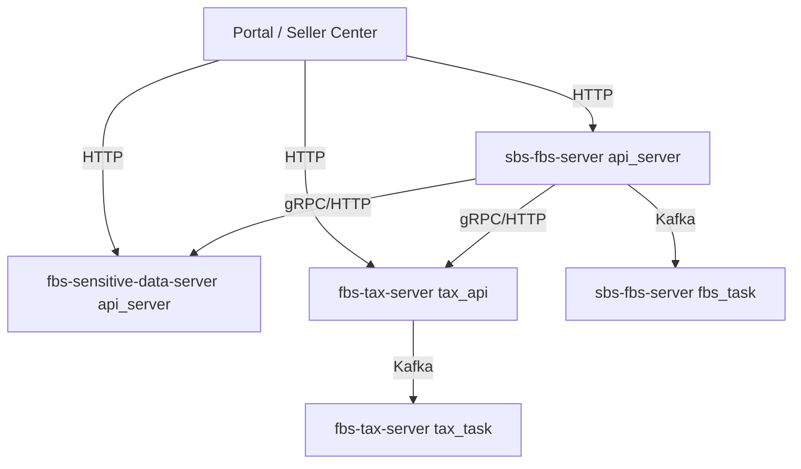

本课程以主服务 API 作为 ASN 同步请求主线。主服务代码中存在敏感数据与 Tax 的 client 边界，task 入口中存在定时、异步和消息处理代码。某个具体需求实际经过哪些服务，必须从 route、client 与任务注册逐条确认，不能把全景图当成每次请求的固定时序。

**前端类比**：这个架构 ≈ 前端的主应用（主服务 API）+ 独立的微服务（敏感数据 / Tax）+ 后台 Worker（task 进程）。前端同学可以把它想象成 Vercel/Netlify 的部署模型：API Routes 处理请求、Background Functions 处理异步任务、第三方 API 处理专项能力。

## 主服务：sbs-fbs-server

### 进程入口

```go
// cmd/api_server/main.go（简化）
func main() {
	// 1. 初始化 Chassis 框架（注册 HTTP 路由、gRPC 服务）
	// 2. 初始化 Wire 依赖注入（创建 handler、service、repository）
	// 3. 启动 HTTP 服务器
}
```

```go
// cmd/fbs_task/main.go（简化）
func main() {
	// 1. 初始化 Chassis + Saturn 任务框架
	// 2. 注册定时任务和消息消费者
	// 3. 启动任务调度器
}
```

### 目录结构回顾

```
sbs-fbs-server/
├── cmd/                  # 进程入口
│   ├── api_server/       # HTTP/gRPC API 服务
│   └── fbs_task/         # 定时任务 + 消息消费
├── app/                  # 旧模块（逐步迁移到 apps/）
├── apps/                 # 新模块（inbound、rts、product 等）
├── middleware/            # HTTP 中间件
├── sbs_agent/            # 基础设施适配层
├── errcode/              # 错误码定义
├── libs/                 # 内部工具库
├── conf/                 # Chassis 配置文件
└── go.mod                # Go 1.20
```

**前端类比**：`cmd/` 接近多个应用入口，`apps/` 按业务域组织模块，`middleware/` 接近服务端的请求拦截链，`sbs_agent/` 封装数据库、缓存和任务等设施。React route guard 只能帮助理解“入口前检查”，不能替代服务端中间件的安全语义。

### 编译和测试

```bash
cd sbs-fbs-server

# 编译 API 服务
go build -o bin/api_server ./cmd/api_server

# 编译任务服务
go build -o bin/fbs_task ./cmd/fbs_task

# 运行所有测试
go test ./... -count=1

# 只测试某个模块
go test ./apps/inbound/... -v

# 带 race detector 的测试
go test -race ./...
```

**前端类比**：`go build -o bin/api_server ./cmd/api_server` 与前端 build 都会检查源码与依赖，但 Go 产出本机可执行程序，前端通常产出浏览器资源。`go test ./...` 与 Jest/Vitest 都是测试入口，包选择和运行环境不同。

### Star 案例：启动主服务 API

**Situation**：你需要验证主服务的代码能否正常编译和运行测试，以便开始开发一个入库功能。

**Task**：编译主服务的两个进程，运行核心模块的测试，记录版本和依赖信息。

**Action**：
```bash
cd sbs-fbs-server
go version  # go1.20.x
go build -o bin/api_server ./cmd/api_server
go build -o bin/fbs_task ./cmd/fbs_task
go test ./apps/inbound/... -v -count=1
go test ./middleware/... -v -count=1
```

**Result**：若命令退出码为 0，两个二进制文件会生成在 `bin/`，目标测试形成改动前基线。课程生成环境没有执行公司内网依赖下的真实构建，学员需保存自己的命令、退出码和阻塞信息，不能复制一段“全部通过”的结论。

## 敏感数据服务：fbs-sensitive-data-server

### 职责边界

敏感数据服务的 module path 与主服务相同（`git.garena.com/shopee/bg-logistics/b2c/sbs-fbs-server`），但仓库与进程入口是分开的。课程只把相同 module path 当作当前工具链和 IDE 排错事实，不猜测形成原因，也不据此推断数据库或部署拓扑。

它集中承接联系人、地址等敏感数据相关能力，并通过自己的 API、鉴权和数据访问层控制边界。主服务需要相关信息时应沿现有 client 调用，不直接复制敏感数据存储逻辑。具体接口返回完整值、掩码值还是最小视图，要逐接口查代码与权限，不能用“敏感服务会自动脱敏”概括全部行为。

**前端类比**：前端 `piiRequest` 与后端敏感数据 client 都是在边界访问敏感能力。它们的协议、鉴权和返回字段并不对称，必须分别沿 wrapper/client 与服务端 route 核验。

### 编译和测试（敏感数据服务）

```bash
cd fbs-sensitive-data-server
go build -o bin/api_server ./cmd/api_server
go build -o bin/task ./cmd/task
go test ./... -count=1
```

### Star 案例：从主服务追踪 PII 调用

**Situation**：主服务的 handler 需要展示卖家联系人姓名。这个字段来自敏感数据服务。

**Task**：理解主服务如何调用敏感数据服务，以及敏感数据服务如何确保数据安全。

**Action**：
1. 在主服务的 `thirdpart/` 或 `agent/` 目录中找到调用敏感数据服务的 gRPC client。
2. 追踪 client 的创建过程，确认连接、context 与鉴权信息由哪一层提供。
3. 在敏感数据服务的 `apps/client/access/http/sc/` 中找到对应的 handler。
4. 检查 handler、application 与 mapper 实际返回哪些字段，以及鉴权发生在哪一层。

**Result**：你能够画出一条经过代码核对的敏感数据调用链，并明确哪些字段和鉴权行为仍需在受控环境验证。

## Tax 服务：fbs-tax-server

### 职责和特殊性

Tax 服务承接税务、发票与计费相关能力。仓库提供 `tax_api`、`tax_core`、`tax_task` 三个入口；为什么某段逻辑属于哪一个进程，要看调用与注册代码，不能从“core”名称继续推导 CPU 模型或部署策略。

Tax 的 `go.mod` 声明 Go 1.15。为该仓库编写声称可用的代码时，不使用泛型和更高版本才加入的标准库 API，并按仓库当前构建线验证。新版本 Go 工具链可能具备向后兼容能力，但“能被新工具链编译”不代表可以抬高项目的语言基线。

### 编译和测试（Tax 服务）

```bash
cd fbs-tax-server
go build -o bin/tax_api ./cmd/tax_api
go build -o bin/tax_core ./cmd/tax_core
go build -o bin/tax_task ./cmd/tax_task
go test ./... -count=1
```

### Star 案例：为什么 Tax 服务独立

**Situation**：ASN 需求评审中出现 Tax 字段，开发者需要判断是否真的修改 Tax，并注意其 Go 1.15 基线。

**Task**：理解 Tax 服务独立的原因。

**Action**：查看 Tax 的进程入口、领域目录、协议和当前依赖，确认它与主服务之间通过明确边界协作。再记录 Go 1.15 对新代码语法与标准库选择的限制。仓库为什么形成、多久发布一次、升级为何尚未发生，如果没有正式资料就不写成结论。

**Result**：你能根据职责与代码调用判断一个 ASN 需求是否涉及 Tax，并能在不涉及时给出“不修改 Tax”的证据。

## 配置文件与环境

### Chassis 配置

三个仓库都使用 Chassis 框架，配置文件在 `conf/` 目录下：

```yaml
# 从主服务 conf/chassis.yaml 缩减，只保留本章要识别的结构。
sbs_fbs_server:
  initial:
    config:
      apolloDisabled: false
      appId: sbs-fbs-server
      namespaceList: sbs_fbs_server
  application:
    name: ${APPLICATION_NAME||FBSServer}
    environment: ${ENV||test}
  service:
    rest:
      listenAddress: "${POD_IP||0.0.0.0}:${PORT||8080}"
```

配置值的实际来源要沿当前 Chassis 配置和环境约定核验。DSN、口令和密钥不能写进课程或提交到仓库；本章只记录键名、读取位置与缺失时的可观察错误。

**前端类比**：Chassis 配置 ≈ 前端的 `.env` + webpack config。`conf/chassis.yaml` ≈ `.env.local`（本地配置），Apollo ≈ 远程配置中心（类似前端的 LaunchDarkly 或 Firebase Remote Config）。

### Makefile 是仓库命令索引，不是统一标准

主服务 Makefile 当前包含 `gen_wire`、`build_prepare`、`run_api_server`、`run_task_server` 与若干构建 target；Tax Makefile 另有 `test`、`lint`、`wire_*`、`build` 等 target。三个仓库没有一套完全相同的 `make build/test/run/lint` 接口。

本地操作前先阅读目标 target。某些 target 会安装工具、访问内网、启动代理或读取环境配置，不应因为名称像 `run` 就直接执行。只需要验证编译时，优先使用明确的 `go build ./cmd/...`；需要生成 Wire 时再按仓库现有脚本和版本执行。

**前端类比**：Makefile 与 `package.json` scripts 都给复杂命令命名，但 target 名称没有跨仓统一语义，最终仍要读脚本内容。

## 版本矩阵与环境要求

| 项目 | sbs-fbs-server | fbs-sensitive-data-server | fbs-tax-server |
| --- | --- | --- | --- |
| Go 版本 | 1.20 | 1.20 | 1.15 |
| Chassis | v0.4.3-r.13 | v0.4.3-r.13 | v0.4.3-r.22 |
| GORM/Scorm | internal gorm v0.0.7、scorm v0.2.3-r.4、scormv2 v0.0.2-r.3、GORM 1.23.8 | scormv2 v0.0.2-r.3；旧 scorm/GORM 为间接依赖 | scormv2 v0.0.2-r.5、GORM 1.23.8 |
| Redis client | go-redis v0.0.1-r.4 | go-redis v0.0.1-a2 | go-redis v0.0.1-r.9 |
| Saturn adapter | chassis-saturn-server v1.0.8-r.17 | chassis-saturn-server v1.0.8-r.9 | chassis-saturn-server v1.0.8-r.18 |

`r.13`、`r.22` 等修订号属于当前内部依赖版本标识，不能用公开教程的相近版本替代当前源码行为。

## 从启动一个进程到理解整个架构

### 推荐的学习路径

最低要求是在 `sbs-fbs-server` 中构建并测试一条局部路径。随后按以下顺序扩大范围：

1. 先在主服务中完成一次完整的功能开发（handler → service → repository → 测试）。
2. 在授权环境用受控请求核对一个跨服务协议；没有账号时只提交 client/route 链路和 fixture。
3. 阅读 Tax 的入口与对外协议，判断当前 ASN 需求是否与它有关。

### 学习检查清单

- [ ] 能画出三个仓库的进程图
- [ ] 能在主服务中完成编译和测试
- [ ] 能说明 Tax 当前声明 Go 1.15，并据此限制示例语法
- [ ] 能在本地用 curl 调用主服务的健康检查接口
- [ ] 能从仓库、进程和 client 边界说明敏感服务为何是独立修改范围

## 常见错误

### 用错 Go 版本

Tax 的 `go.mod` 声明 1.15。较新工具链是否可用于当前构建要按仓库约定验证；无论使用哪版工具链，提交的源码都不能悄悄采用高于项目基线的语法和标准库 API。

### 混淆三个仓库的 import 路径

敏感数据服务与主服务 module path 相同。IDE 索引或跨仓跳转异常时，先检查当前 workspace、module root 和打开的仓库，不把同名 import 当作另一个工作树的代码。

### 在生产环境中手动启动进程

本章只验证本地构建、测试和授权环境中的启动证据，不教授生产部署或发布操作。不要在生产环境手动执行课程命令。

## 练习

### 进程地图绘制

画出三个仓库的全部进程及其通信关系。标注每个进程的 main.go 位置和职责。

### 版本兼容判断

以下代码使用了 `go 1.21` 的 `slices.Contains` 函数。它能在哪个仓库的代码中使用？（答案：都不能。主服务和敏感数据服务是 1.20，Tax 是 1.15。这个函数需要 Go 1.21+。）

### 编译和测试实战

在 `sbs-fbs-server` 中运行 `go build ./cmd/api_server` 和 `go test ./apps/inbound/... -v`。记录输出和耗时。

## 把构建、启动和联调分成三种证据

`go build` 只证明目标包及其编译期依赖可以生成产物。`go test` 证明被执行的测试在当前环境通过。进程真正启动还要经过配置加载、端口监听与依赖初始化；接口可用则继续需要路由、身份、数据库或下游服务。三种结论不能互相替代。

| 证据 | 可以下什么结论 | 不能下什么结论 |
| --- | --- | --- |
| 目标进程构建退出码为 0 | 当前源码与编译依赖相容 | 配置正确、接口可访问 |
| 局部测试通过 | 对应测试覆盖的行为通过 | 全仓、真实数据库和下游均正常 |
| 进程日志显示监听成功 | 框架已走到监听阶段 | 每条业务 route 和权限都正确 |
| 授权环境中的请求记录 | 该请求在该环境形成响应 | 其他身份、错误路径和 task 均正常 |

如果构建被内部模块下载阻塞，记录 Go 版本、命令、退出码和第一条有意义的错误，再判断是代码错误还是环境依赖。不要把本机缺少凭据改写成“仓库无法编译”，也不要为让命令通过而把敏感配置写进课程。

Makefile 与前端 `package.json` scripts 都是命令入口，但文件中实际 target 才是事实。先运行 `make help` 或阅读 Makefile，再决定使用 `make build`、`go build` 还是仓库定义的其他目标。Go 模块通常使用共享下载缓存；首次构建仍可能访问内部模块代理，因此“无需安装依赖”不等于“离线必然可构建”。

## 独立练习：交付一张可复核进程地图

选择主服务 API 作为最小路径：

1. 从 `go.mod` 记录语言版本，并说明本机工具链是否匹配；
2. 从 `cmd/api_server/main.go` 沿初始化调用找到 Chassis 与应用装配入口；
3. 运行目标构建和一组 inbound 局部测试，保存命令、退出码和未验证项；
4. 为另外两仓只读检查 `go.mod`、`cmd/` 与 Makefile，不要求连接真实依赖；
5. 画出七个进程，箭头只保留能由当前代码或配置证明的调用；
6. 给每个进程写出“面向同步请求、核心服务或任务”的入口类型；
7. 标出完整运行仍需要的配置、内网依赖和授权环境。

通过标准：没有把仓库、进程、实例混为一谈；没有把 build 成功写成接口启动成功；Tax 示例保持 Go 1.15 基线；敏感服务相同 module path 被记录为工具链边界；图中没有凭空添加数据库、部署数量或调用方向。

## 章末自检与下一步

- 三个仓库共有几个明确进程入口？分别是什么？
- `go.mod` 的 Go 版本、当前安装的工具链版本与代码可用语法是什么关系？
- Chassis 解决哪类公共问题？标准库、Gin/Echo 与它的主要取舍是什么？
- 为什么 `go build`、进程监听成功和接口联调成功是三种证据？
- 敏感数据服务与主服务 module path 相同会怎样影响 IDE 和依赖排查？
- 一个 ASN 列表需求为什么通常先从主服务 API 开始，又怎样证明暂不修改 Tax？

下一章从主服务 API 的一条真实 Network 记录进入 Chassis route。届时会把 route、middleware、DTO、handler 与统一响应逐个解释，并验证请求究竟在哪一层失败。


## 参考文献

- [Go Modules Reference](https://go.dev/doc/modules/gomod-ref)
- [Go 1.15 Release Notes](https://go.dev/doc/go1.15)
- [Go 1.20 Release Notes](https://go.dev/doc/go1.20)


---

# Chassis HTTP 接口：从路由到请求与响应

> 预计学习时间：130–180 分钟  
> 一句话总结：沿同一入库列表接口追踪 Chassis 路由、SC wrapper、参数绑定、灰度分支、handler 与统一响应，建立可验证的后端改动方法。

## 从前端 Network 记录进入 Go 服务

上一章停在浏览器发出的请求：

```text
POST /api/fbs/sc/inbound/request/list/
Content-Type: application/json
Body: { "page_no": 1, "count": 20, ... }
```

前端同学第一次接触后端仓库，容易拿着 URL 全仓搜索，找到一个同名函数就开始改。可是真实请求在到达业务查询前，还要经过 Chassis 路由、中间件链、参数绑定、校验、区域权限、Seller 会话、旧/新链路选择和统一响应。任何一层都可能让“我的 handler 为什么没执行”成为合理现象。

本章以 `sbs-fbs-server` 当前 release 工作树为基线，只追 Seller Center 入库列表。你将读到这些真实文件：

- `apps/inbound/inbound/access/http/sc/urls.go`
- `apps/inbound/inbound/access/http/sc/handle.go`
- `apps/inbound/inbound/application/fbs_ir_entity.go`
- `middleware/sc_controller_handle.go`
- `middleware/controller_handle.go`
- `middleware/sbsctx/context.go`
- `apps/inbound/inbound/access/http/sc/handle_test.go`

目标不是记住目录，而是能从 method/path 推导运行顺序，知道请求对象为何能在 handler 中被取出，判断错误由谁转成前端看到的 envelope，并为一个兼容字段改动设计测试。

## 先把 HTTP 接口里的名词拆开

HTTP 是浏览器、服务与代理之间传输请求/响应的应用层协议。一个请求至少包含 method、path、header 和可选 body；响应包含状态、header 和可选 body。API 是调用方可依赖的行为契约，不等于某个 Go 函数。只要 method、path、字段、错误语义或权限要求变化，接口契约就可能变化。

route（路由）是一条匹配规则：什么 method 和 path 交给哪个处理入口。handler 是命中路由后执行的业务入口函数。middleware（中间件）包在 handler 外面，统一完成认证、日志、限流、参数处理或错误恢复。DTO（Data Transfer Object，数据传输对象）描述跨边界传递的数据形状。response envelope 是包住业务 data、业务码和提示信息的统一响应外壳。

这几个对象解决的问题不同：route 决定“去哪里”，middleware 决定“进入前需要经过什么”，DTO 决定“传什么”，handler 决定“入口如何编排”。把它们全称为“接口代码”，排错时就会从 404 直接跳到数据库。

### Chassis 与常见 HTTP 技术栈怎样比较

Go 社区可直接使用 `net/http`，也常见 Gin、Echo、Fiber 等 Web 框架；大型系统还会在它们外面组合鉴权、配置、监控与服务治理。`net/http` 稳定、透明、依赖少，但许多团队能力要自行组织。Gin/Echo 路由和绑定更轻便，社区资料多；接入公司统一基础设施仍需额外适配。Chassis 已与当前仓库的 schema、中间件、错误码和服务调用方式结合，开发者能复用一致入口，代价是内部版本差异明显，公开同类框架的示例不能直接复制。

本章学习的是当前 Chassis r.13 代码的真实链路，不做框架选型，也不把 Chassis route 写法推广为 Go HTTP 的唯一做法。

> 本章代码来自 `sbs-fbs-server` 的 release 分支（2026-07-20）。当前 Chassis 版本为 v0.4.3-r.13（比课程参考的 r.8 文档更新）；框架文档只帮助理解概念，实际类型、函数和行为一律以当前 `go.mod`、源码及测试为准。

## 一条请求的完整骨架

先不展开业务查询，把控制流画出来：

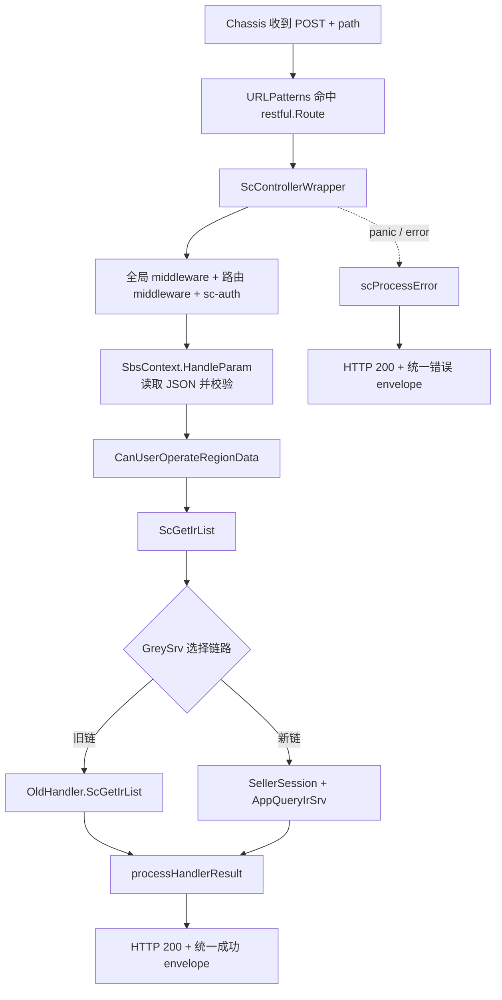

这张图解释了四个常见现象。第一，route 不匹配时 wrapper 和 handler 都不会执行。第二，鉴权或参数绑定失败时 handler 也不会执行。第三，handler 执行了不代表一定走新 application service，当前代码可能转给旧 handler。第四，前端看到 HTTP 200 不等于业务成功，因为 SC 错误也会被统一包装成 200 响应。

后续每读一段代码，都把它放回这张图，确认它的输入、输出和失败出口。否则很容易被 middleware 中大量外部错误类型淹没，忘记本次请求真正经过哪些关键节点。

## 路由是 method、path、请求原型与 handler 的汇合点

`apps/inbound/inbound/access/http/sc/urls.go` 中的核心条目是：

```go
func (s *FbsScInboundSchema) URLPatterns() []restful.Route {
    return []restful.Route{
        {
            Method: http.MethodPost,
            Path:   "/api/fbs/sc/inbound/request/list/",
            ResourceFunc: middleware.ScControllerWrapper(
                s.ScGetIrList,
                inbound.ScIrListReq{},
            ),
        },
    }
}
```

这是为教学换行后的等价片段。真实文件还注册了许多入库接口。对单条 route，先读四项：

| 项 | 当前值 | 它决定什么 |
| --- | --- | --- |
| Method | `POST` | 浏览器 method 必须匹配，也影响参数读取位置 |
| Path | `/api/fbs/sc/inbound/request/list/` | 完整路径及尾部斜杠 |
| 请求原型 | `inbound.ScIrListReq{}` | wrapper 要创建、绑定和校验的具体类型 |
| 业务函数 | `s.ScGetIrList` | 参数准备完成后调用的 controller handle |

`restful.Route` 属于当前 Chassis REST server API。课程不要求你掌握 Chassis 的全部注册机制，但要认识 `URLPatterns() []restful.Route` 是该 schema 暴露路由的入口。若新增接口只写 handler、不把 route 纳入实际 schema 聚合，代码可以编译，运行时却没有入口。

请求原型容易被忽略。这里传入的是值 `ScIrListReq{}`，wrapper 后续使用反射创建同类型的新值。它不是实际请求数据，也不是默认全局对象；它告诉统一绑定层“本路由期待什么 DTO”。因此修改 DTO 会同时影响绑定、校验、handler 的类型断言和接口契约。

排查 404 时先对照 route 的 method 与完整 path，再确认当前进程是否注册了这个 schema。不要因为仓库里搜索得到字符串就断言运行中的服务一定加载它。主服务同时存在 `app/` 与 `apps/`，旧新模块并存；同一 path 也可能在旧目录出现。运行时聚合和灰度选择比词面搜索更重要。

## `ScControllerWrapper` 为 handler 建立共同运行环境

`middleware/sc_controller_handle.go` 中，`ScControllerWrapper` 接收业务函数、请求原型和可选 handler 名称，返回 Chassis 需要的 `func(ctx *restful.Context)`。它做的事情可以分为外圈与内圈。

外圈负责一次 HTTP 调用的基础保护：登记 latency defer，初始化 log ID 并在结束时清理；用 `recover` 捕获 panic、打印运行栈，并把它转换为 `ErrPanic`；取得全局预设中间件链；组合当前路由的中间件，且默认加入 API block handler 与 `sc-auth`；最后让两条链包住真正的 REST 处理函数。

缩减后可以这样理解：

```go
func ScControllerWrapper(handle FbsControllerHandle, req any, names ...string) restfulHandler {
    names = AppendFirstHandler(APIBlockHandler, names...)
    return func(ctx *restful.Context) {
        defer recoverAsScError(ctx)
        global := GetFbsManager().GetPresetChain(ctx)
        current := fbsManager.use(append(names, "sc-auth")...)
        rest := func(ctx *restful.Context) {
            scRestfulFunc(ctx, handle, req)
        }
        global(current(rest))(ctx)
    }
}
```

这只是职责示意，不是可替换生产代码。真实实现还处理 latency 与 log ID。关键点是业务 handler 并非 Chassis 直接调用；它被多层函数包装。若认证中间件拒绝请求，`ScGetIrList` 没有日志是正常的。若 panic，被外圈 recover 后，客户端看到统一错误而不是连接直接断开。

中间件顺序也有语义。外层先执行前置逻辑，内层运行 handler，再按调用栈返回执行后置逻辑。调整组合顺序可能改变鉴权、日志、限流与错误捕获行为。业务需求通常不应修改这层；如果确实要加横切能力，必须列出所有消费者并做跨路由验证。

## `scRestfulFunc` 把框架 context 转成业务可用 context

wrapper 的内圈 `scRestfulFunc` 创建 `sbsctx.NewSbsContextImpl(ctx)`，然后依次执行参数处理、区域数据权限检查和业务 handler。成功时调用 `processHandlerResult`；失败时延迟调用 `scProcessError`。

其主线可以概括为：

```go
sbsCtx := sbsctx.NewSbsContextImpl(ctx)

finalErr = sbsCtx.HandleParam(reqParams)
if finalErr != nil {
    return
}

finalErr = userUtil.CanUserOperateRegionData(sbsCtx)
if finalErr != nil {
    return
}

handlerData, finalErr = handle(sbsCtx)
if finalErr != nil {
    return
}

processHandlerResult(ctx, handlerData)
```

真实代码还检查响应 header `Proxy-Response`。当它为 `YES` 时，说明代理路径已经处理响应，wrapper 不再重复写结果。这是又一个“handler 返回后页面为什么不是统一 envelope”的排查分支。

`SbsContext` 把三类对象放在一起：标准 `context.Context` 用于超时、取消和跨层元数据；原始 `*restful.Context` 用于读写 HTTP；已绑定的请求 struct 供 handler 获取。应用与领域层应优先接收标准 context，而不是让 Chassis HTTP 类型一路渗透到 repository。

这里还执行 `CanUserOperateRegionData`。因此 region 相关失败不一定来自 handler 查询条件，也可能在统一权限检查阶段发生。前端 wrapper 注入的 region/shop 上下文与后端中间件、会话、权限必须共同核验，不能只盯 body。

## 参数绑定：为什么 POST JSON 能变成 `ScIrListReq`

`middleware/sbsctx/context.go` 的 `HandleParam` 先检查请求原型是否为空，再通过 `reflect.TypeOf(reqParam)` 获得类型，创建新值并调用 `ReadParam`。读取成功后，根据是否跳过参数解析决定是否执行自定义 validator。

对当前 POST 路由，`ReadParam` 检查 Content-Type。如果包含 `application/json`，就用 `json.Decoder` 从 request body 解码；如果是 XML，则走 Chassis 的 `ReadEntity`；GET 请求则用 `ReadQueryEntity`。读取结束后，它把指针解引用，将值保存到 `s.reqStruct`。

这解释了 handler 中为什么可以写：

```go
req := ctx.GetReqStruct().(inbound.ScIrListReq)
```

类型断言在这里依赖 wrapper 的保证：route 传入 `inbound.ScIrListReq{}`，`HandleParam` 按这个具体类型创建和保存值，只有绑定与校验成功才调用 handler。若绕过 wrapper 直接在测试中构造 fake context，就必须提供同一具体类型；传 `*ScIrListReq` 或别的 struct 都会触发 panic。

还要注意当前兼容逻辑：非 GET 且 Content-Type 不是 JSON/XML 时，读取可能被标记为 skip，validator 也会跳过。此时请求 struct 仍可能是零值。不要把“body 看起来是 JSON”当作已绑定；浏览器必须发送正确 Content-Type。对新接口，是否接受其他内容类型要沿用当前路由同类模式，不能由 handler 靠猜测补救。

JSON 解码失败，例如数字字段收到不可转换字符串，会在 handler 前返回错误。`scProcessError` 对 `*json.UnmarshalTypeError` 有专门分支，转成 invalid param；validator 的 `ValidationErrors` 会翻译并标注错误分类。当前 `ScIrListReq` 的许多字段只有 JSON tag，没有 validation tag，所以“会运行 validator”不等于“分页、长度和枚举已被校验”。具体约束必须检查 DTO tag、application service 和领域逻辑，不能凭框架能力推断。

## DTO 是运行时契约，不只是字段集合

`apps/inbound/inbound/application/fbs_ir_entity.go` 的 `ScIrListReq` 包含分页、IR ID、状态、时间、仓库、SKU、运输方式、发票状态、来源等字段。节选如下：

```go
type ScIrListReq struct {
    PageNo        int      `json:"page_no"`
    Count         int      `json:"count"`
    IrID          string   `json:"ir_id"`
    StatusList    []int8   `json:"status_list"`
    WhsList       []string `json:"whs_list"`
    SellerSku     *string  `json:"seller_sku"`
    MtSkuIdList   []string `json:"-"`
    RequestSource *domainmodel.RequestSource `json:"request_source"`
}
```

这段代码展示四种契约语义。普通 `int`/`string` 无法区分“调用方没传”和“明确传零值”；指针字段可区分缺失与具体值；slice 要考虑 nil、空数组和非空数组；`json:"-"` 表示字段不接受前端直接注入，通常由服务内部补充。

以 `SellerSku *string` 为例，不传时是 nil，可以表示“不启用此过滤”；传空字符串则是非 nil 指针，是否等同不筛选要看后续 normalize/query 逻辑。前端上一章选择 trim 后为空就不发送，是为了减少含糊状态，但后端仍应考虑已有调用方可能发送空字符串。

`RequestSource` 也是指针，却由 handler 在缺失时补默认值。这说明默认值放置位置是契约设计的一部分：wrapper 只负责通用绑定，handler 负责当前入口的来源默认值，application service 收到的是已补齐的请求。若把默认值改到 DTO 构造或 repository，旧/新入口可能出现不一致。

修改 DTO 前要搜索三类消费者：同一类型被哪些 route 当作请求原型，哪些 handler/application 方法接收它，哪些 copier/映射与测试依赖字段。只改 JSON tag 可能破坏前端；只改 Go 字段名但保留 tag 可能不影响 wire format，却会影响所有 Go 调用点。

## handler 做入口编排，不承担所有业务

`ScGetIrList` 的真实顺序是：默认假设不用新链；如果 `GreySrv` 存在，调用 `GreyToNewByApiPath`；未选择新链时直接交给 `OldHandler.ScGetIrList`；选择新链后读取 Seller 信息；从 context 取 `ScIrListReq`；复制为 service request；缺失 `RequestSource` 时补 FBS 默认值；最后调用 `AppQueryIrSrv.GetScIrList`。

```go
func (s *FbsScInboundSchema) ScGetIrList(ctx sbsctx.SbsContext) (interface{}, error) {
    useNewChain := false
    if s.GreySrv != nil {
        var err error
        useNewChain, err = s.GreySrv.GreyToNewByApiPath(ctx, &oldinbound.ScIrListReq{})
        if err != nil {
            return nil, err
        }
    }
    if !useNewChain {
        return s.OldHandler.ScGetIrList(ctx)
    }

    sellerInfo, err := s.SellerSessionSrv.GetSellerInfo(ctx.GetRestfulContext())
    if err != nil {
        return nil, err
    }

    req := ctx.GetReqStruct().(inbound.ScIrListReq)
    var srvReq inbound.ScIrListReq
    if err := copier.Copy(&srvReq, &req); err != nil {
        return nil, err
    }
    if srvReq.RequestSource == nil {
        source := appdomainmodel.RequestSourceFBS
        srvReq.RequestSource = &source
    }
    return s.AppQueryIrSrv.GetScIrList(ctx.GetContext(), &srvReq, sellerInfo)
}
```

这段接近真实实现，只调整了局部变量展示。它体现 controller 的合理职责：选择入口链路、获取会话、把 HTTP DTO 转成 application request、补入口默认值、调用应用服务并透传结果/错误。真正的列表过滤、数据访问和领域规则不应继续堆在 handler。

`copier.Copy` 看起来像“自己复制给自己”，但它保留了入口 DTO 与 service request 可独立演进的空间；当前类型相同不代表永远相同。修改字段后，应验证 copier 是否能正确复制指针、嵌套结构与新类型。对关键字段，测试中直接断言传给 fake service 的值，比相信反射库更可靠。

## 旧链与新链并存意味着什么

当前代码事实不是“`apps/` 已完全替换 `app/`”，而是同一路由可通过 GreySrv 选择旧 handler 或新 application service。课程不讲发版操作，但开发者必须理解这种运行时分支，因为它直接影响需求正确性。

如果新增请求字段只在新 DTO/新 service 生效，而灰度规则仍可能走旧链，那么部分请求会忽略筛选或行为不同。你需要检查 GreySrv 使用的旧请求原型、旧 handler 的 DTO 与转换、两条链的响应结构，以及测试是否覆盖 `useNew=true/false`。不能用“我改的是新目录”作为忽略旧链的理由。

反过来，也不应为了兼容把所有新逻辑复制两份。先确认需求范围、当前链路策略和旧实现维护边界，再选择：两边都支持字段；入口统一 normalize 后两边消费；只在新链启用但给旧链明确兼容行为；或等待架构决策。课程练习只要求你发现分支并写出验证矩阵，不替团队做迁移决策。

用下面的四格表避免漏测：

| 链路 | 字段缺失 | 字段有值 |
| --- | --- | --- |
| 旧链 | 行为与改动前一致 | 明确支持、忽略或受控拒绝，不能未知 |
| 新链 | 行为与改动前一致 | application/query 正确消费并可验证 |

“字段缺失”是兼容性基线；“字段有值”是新能力。只有测新链有值，无法证明真实流量一致。

## 成功响应由统一层包装

handler 返回 `(data, nil)` 后，`processHandlerResult` 先记录 latency，再按 data 类型分支。文件与 PDF 有专门写法；普通数据调用 `response.OkResponse(data)` 并以 HTTP 200 写 JSON。前端因此通常看到 envelope，而不是裸 `ScIRListRsp`。

application 中的 `ScIRListRsp` 真实结构包含：

```go
type ScIRListRsp struct {
    Total  int64          `json:"total"`
    IrList []ScIrListInfo `json:"ir_list"`
}
```

它会作为统一响应中的 data。前端类型和解包逻辑必须区分 envelope 字段与业务数据字段。若 wrapper 已经返回 `data`，页面再访问一次 `.data` 会得到 undefined；若某个实例返回完整 response，页面直接读 `ir_list` 又会失败。联调时同时看 Network 原始 JSON 与 request wrapper 返回约定。

不要在每个 handler 手写 `ctx.JSON`。那会绕过统一格式、错误分类、监控和文件分支，还可能造成重复写响应。只有仓库已有明确特殊响应类型或代理路径时，才沿现有模式处理。

## 错误如何变成前端看到的 `retcode`

`scRestfulFunc` 保存 `finalErr`，延迟调用 `scProcessError`。后者先记录 path 与 error，再按具体错误类型转换。WMS、DATA、ISC、Retail、OMS、SCBS、SellerServices、SLS、FeatureToggle 等下游错误会映射为面向 Seller Center 的稳定错误；validator 错误会翻译；`HTTPError` 保留；JSON 类型错误变为 invalid param；未知错误报告监控事件并兜底为 `ErrUnknownType`。

最终写回：

```go
ctx.JSON(
    http.StatusOK,
    errcode.ErrorFormat(ctx.Ctx, returnErr, data, langID),
)
```

这就是前端必须区分 HTTP 成功与业务成功的直接代码证据。统一返回 HTTP 200 是当前 SC 接口约定，不应在单个 handler 私自改成另一种风格。若设计全新外部 API，需要按其所属边界和现有 wrapper 决定，不把 SC 约定推广到所有服务。

错误处理还有两个安全目的。第一，未知内部 error 不应原样暴露给 Seller；`ScControllerWrapper` 会用稳定未知错误兜底。第二，下游错误映射同时记录监控事件，服务端保留诊断证据，客户端获得可翻译信息。开发时不要为了“方便排错”把数据库错误、堆栈或请求凭据塞进 response。

panic 由 wrapper 最外层 recover，打印 stack 后也走 `scProcessError(..., ErrPanic)`。单元测试通过不代表没有 panic；对类型断言、nil service 和边界输入仍应设计测试，recover 是最后防线，不是正常控制流。

## 从一次失败反推所在层

下面四个症状看起来都像“接口失败”，检查路径完全不同。

### 404，handler 无日志

先核对 method、完整 path、尾部 `/`、代理目标和运行进程的 route 注册。不要先改 `ScGetIrList`，因为请求可能没有进入 wrapper。

### HTTP 200，`retcode` 表示参数错误

查看 Content-Type 与 request payload，确认数字、数组和枚举形态。JSON 类型错误发生在 handler 前；validator 错误也发生在 handler 前。用 request ID 查日志，区分 decode 与 validation。

### HTTP 200，未知业务错误，只在部分 Seller 出现

先确认是旧链还是新链，再查 Seller session、region 权限和下游错误映射。不要假设所有用户执行相同 application service。

### HTTP 200，服务端返回列表，页面仍为空

后端主链可能已经成功。检查 envelope、字段名 `ir_list`、前端 wrapper 解包、Store 写入和渲染条件。不要为了迁就页面把后端字段临时改成 `list`，除非契约正式变更并兼容所有消费者。

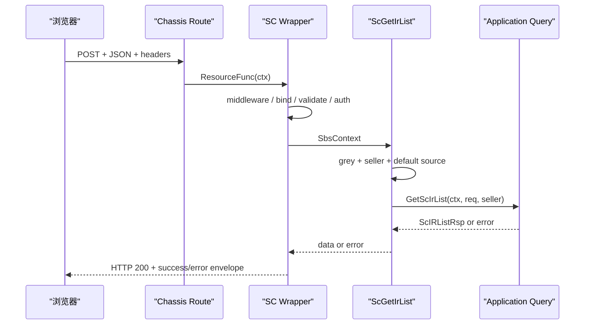

时序图里的每个箭头都能找到证据：Network 记录、route 条目、wrapper 日志、handler test、fake service 收到的 request、最终 response。诊断的目标是找到第一条不符合契约的箭头。

## 用现有 handler test 学会隔离入口编排

`apps/inbound/inbound/access/http/sc/handle_test.go` 已有 `TestScGetIrListUsesQueryServiceWhenGreyEnabled`。测试构造 `ScIrListReq`、Seller 信息、fake query service 和 `useNew=true` 的 fake GreySrv，然后直接调用 handler。它断言返回值、传给 query service 的分页/IR ID，以及缺失 `RequestSource` 时补上的 FBS 默认值。

这个测试没有启动 HTTP server，也没有执行真正的 wrapper。它验证的是 controller 编排：新链选择、Seller 传递、请求复制与默认值。速度快、失败定位清楚。对应地，参数绑定、Content-Type、middleware 顺序和统一 envelope 需要 wrapper/集成层测试或受控接口验证，不能声称一个 handler unit test 覆盖整条 HTTP 链。

测试 double 的类型也揭示接口边界。fake context 的 `GetReqStruct()` 必须返回值类型 `ScIrListReq`，fake query service 保存收到的指针，测试随后断言字段。新增字段时，最小可靠测试是把字段放进 input，调用 handler，再检查 fake service 收到同值；同时保留字段缺失用例，证明默认行为不变。

还应补旧链测试：`useNew=false` 时 query service 不应被调用，OldHandler 应接收请求。若旧 handler 很难替换，至少在影响分析中记录未覆盖项，不能把 new-chain test 写成“接口全链通过”。

## 受控练习：验证 `seller_sku` 契约穿过新链

前端练习准备发送可选 `seller_sku`。当前新链 DTO 已经有 `SellerSku *string`，所以后端任务不是盲目新增字段，而是证明它能从已绑定请求传给 application query，并识别旧链兼容风险。

### 第一步：做存在性审计

搜索 `SellerSku` 与 `seller_sku`，列出 DTO、转换、application request、query 条件和测试。区分 `json:"seller_sku"` 与仅 Go 内部字段。若 repository 已消费它，记录过滤方式；若没有，不要在报告中声称后端已经支持完整筛选。

### 第二步：补 handler 编排断言

在现有 new-chain test 的请求中加入：

```go
sellerSKU := "SKU-001"
req := inbound.ScIrListReq{
    PageNo:    3,
    Count:     30,
    SellerSku: &sellerSKU,
}
```

调用后断言 `query.scListReq.SellerSku` 非 nil 且值相等。再写一个 nil 用例，确认 handler 不会擅自创建空字符串指针。这里验证的是复制与传递，不要把测试名写成“filters database by seller sku”。

### 第三步：验证 HTTP 绑定

若仓库已有同类 route 测试设施，构造 `Content-Type: application/json` 的 POST body，执行 wrapper，验证 handler/fake service 收到指针值。再用错误类型，例如把 `seller_sku` 传成对象，确认 handler 不执行且返回统一参数错误。若当前测试环境无法低成本启动 Chassis，保留一条受控 test 环境联调记录，并明确 unit test 未覆盖绑定层。

### 第四步：检查旧链

打开 `app/inbound/inbound/access/schttp` 对应 DTO 和 handler，确认同名 JSON 字段及其 query 逻辑。若旧链不支持，写出实际行为和决策点，不自行删除灰度分支。至少保留“旧链 + 字段缺失”回归证据。

### 第五步：形成证据包

完成标准包括：method/path 契约卡；DTO 空值语义；new-chain handler test；绑定层验证或明确未覆盖；旧链影响说明；一条脱敏 request/response 记录；相关 Go test 命令与退出码。开发交接后遵循团队通用发版流程，本章不讲平台操作。

## 新增 Chassis HTTP 接口的最小工作顺序

真实需求未必只是改列表字段。需要新增同类 SC 接口时，可以按以下顺序工作。

1. 找一个同侧、同响应形态、同鉴权要求的近邻接口，读 route、DTO、handler、application 方法和测试，避免从空白复制过时样板。
2. 先写 method/path、请求字段、空值语义、响应 data 与错误语义；确认是否 JSON、文件或 PII。
3. 在 application/access 边界定义 DTO，使用明确 JSON tag；只有证据支持时才加 validation tag。
4. 在 `URLPatterns` 注册 route，选对 SC/FBS/OpenAPI wrapper 与请求原型。
5. handler 只做入口编排、会话/上下文获取、DTO 转换和应用服务调用，不把 SQL 与复杂规则写进去。
6. 为正常、绑定错误、业务错误和关键 nil/zero 边界准备测试；存在旧/新链时分别覆盖。
7. 用受控环境核对实际 request、统一 response、request ID 与日志，不把 handler unit test 当成 HTTP 全链证据。
8. 运行目标 package test，再按影响面选择更大范围的 test/build；记录未验证的下游与环境条件。

顺序的核心是先契约、后接线，再逐层验证。直接复制一个旧接口然后改到能编译，往往会带入错误 wrapper、旧 DTO 或不适用的权限链。

## 常见误区与修正方法

### 只搜索 URL，不看 method

同一路径在不同 method 下可以是不同 route。修正方法是把 method/path 作为不可分割的键，并核对前端 `params/data`。

### 在 handler 里重新解析 body

wrapper 已经绑定并校验，再读 body 可能得到 EOF，还会形成两套规则。修正方法是从 `SbsContext.GetReqStruct()` 获取 DTO；需要特殊内容类型时使用仓库已有专用模式。

### 认为 validation 一定检查了分页和枚举

只有 DTO tag 或显式逻辑存在才有约束。修正方法是逐字段查看 validation tag 和下游校验，给出实际反例测试。

### 把 type assertion panic 当作框架不稳定

route 与 wrapper 正常执行时具体类型有保证；直接单测 fake context 时最容易传错指针/值。修正方法是让 fake 与 route 原型一致，并保留 panic recover 只是最后防线的认识。

### 修改新链后宣称接口完成

GreySrv 可能仍选旧链。修正方法是至少覆盖四格兼容矩阵，明确字段在两条链的行为。

### 每个 handler 自己格式化错误

这会泄露内部 error、破坏翻译与前端统一处理。修正方法是返回稳定 error，让 SC wrapper 转换；只在已有边界明确要求时使用特殊响应。

### 用 Chassis r.8 文档覆盖 r.13 源码

文档能解释模块名，不能证明当前函数签名和兼容逻辑。修正方法是以 `go.mod`、当前 wrapper 源码和测试为事实，再用相近版本文档补概念。

### 把发布灰度与代码中的 GreySrv 混为一谈

本章只讨论请求运行时选择旧/新实现对开发正确性的影响，不教授发版 SOP。修正方法是在契约和测试中覆盖分支，不延伸到平台操作。

## 章末故障演练

为下面每个现象写出“第一证据、第二检查点、不要先做什么”。

1. 前端 POST 正确 URL，却返回 404，服务端 handler 没日志。
2. HTTP 200，业务码为 invalid param，payload 中 `count` 是字符串。
3. 同一 payload 对部分 Seller 生效、部分不生效。
4. new-chain unit test 通过，线上记录显示请求走 OldHandler。
5. handler 返回 `ScIRListRsp`，Network 有 `ir_list`，页面读取 `list`。
6. 新字段在 DTO 中存在，fake query service 收到 nil。
7. 测试直接传 `*ScIrListReq`，handler 在类型断言处 panic。
8. 文件导出接口被普通 JSON wrapper 包装，浏览器无法下载。

一个合格答案应把问题分别定位到 route 注册/进程、JSON 绑定、灰度分支、测试覆盖、响应契约、copier/映射、fake 类型和特殊响应分流。若八题都回答“查日志”，说明还没有把日志放回控制流。

## STAR 案例：接口返回成功，筛选却没有生效

### Situation

前端发送了新的 `seller_sku` 字段，HTTP 状态与 retcode 都表示成功，列表却与未筛选时相同。

### Task

在不同时修改前后端和数据库的前提下，确定字段丢在绑定、handler 转换还是 application 之后。

### Action

先保存 Network 请求，确认 method、path、Content-Type 与字段值。随后在 handler test 中使用同一 DTO，捕获 fake service 收到的参数。测试显示绑定对象已有字段，但传给 service 的条件缺失，于是把范围锁定在 handler 转换。补上映射后，增加“未传字段保持旧行为”和“传字段进入 service”的两组断言，再重跑错误响应测试。

### Result

筛选参数能够穿过 HTTP 入口，旧请求不受影响。修复没有触碰 repository，也没有用日志猜测数据库行为。

### Reflection

HTTP 200 只证明请求走完响应包装，不能证明每个字段都穿过调用链。分层测试的价值是把证据停在最近的交接点。

## 章末自检

不看源码先回答，再用当前仓库验证：

1. `URLPatterns` 中为什么既要写请求原型又要写 handler？
2. `ScControllerWrapper` 的外圈与 `scRestfulFunc` 各负责什么？
3. POST JSON 在什么条件下被解析，何时可能跳过 validator？
4. handler 中的值类型断言为什么在正常 route 下成立，测试中又为什么容易失败？
5. `ScIrListReq` 的 `string`、`*string`、slice 和 `json:"-"` 分别表达什么边界？
6. `ScGetIrList` 为什么先判断 GreySrv，再取 Seller、复制 DTO 和补 RequestSource？
7. 成功和失败为什么都可能返回 HTTP 200，前端应怎样判断？
8. 一个 handler unit test 能证明什么，不能证明什么？
9. 新增可选筛选字段时，如何验证旧链、新链、缺失和值四种组合？
10. Chassis 文档与当前代码不一致时，你按什么顺序取证？

达到本章目标的标准不是能默写 wrapper，而是拿到一条 Network 记录后，能在十分钟内画出实际控制流，指出最可能的失败层，并设计最小验证，不跨层猜测。

## 本章小结

Chassis HTTP 接口的可读单位不是单个 handler，而是 route、controller wrapper、SbsContext、DTO、handler、application service 和统一 response 的组合。route 把 method/path、请求原型与业务函数连接起来；SC wrapper 建立中间件、日志、panic 保护、参数绑定、权限和错误转换；handler 负责入口编排；application 与下层实现业务查询。

当前入库列表还有旧/新链并存。任何契约改动都要证明缺失字段保持旧行为，并核对字段在两条链的消费方式。成功与错误都可能使用 HTTP 200 envelope，因此后端测试既要看 data，也要看错误格式；前端则必须检查业务码。

把本章与 FE-W05 合起来，你已经有了一条连续的开发地图：页面组织筛选 → API 函数确定 POST/body → request wrapper 拼前缀并注入上下文 → Chassis route 命中 → wrapper 绑定 DTO → handler 选择链路 → application 返回列表 → 统一 envelope → 前端解包和展示。后续学习分层、数据库和跨服务时，都应保留这条主线。

## 参考文献

- Go Documentation. [The Go Programming Language Specification: Struct types](https://go.dev/ref/spec#Struct_types). 访问于 2026-07-16。
- Go Packages. [`encoding/json`](https://pkg.go.dev/encoding/json). 访问于 2026-07-16。
- Go Packages. [`context`](https://pkg.go.dev/context). 访问于 2026-07-16。
- Go Blog. [The Go Blog: Defer, Panic, and Recover](https://go.dev/blog/defer-panic-and-recover). 2010-08-04。
- RFC Editor. [RFC 9110: HTTP Semantics](https://www.rfc-editor.org/rfc/rfc9110). 2022-06。


---

# Wire 与分层：把 handler 接到应用、领域和基础设施

> 预计学习时间：160–220 分钟
> 一句话总结：沿 ASN 接口手工还原 access、application、domain、infra 的依赖图，再用 Wire 的 provider set 与生成代码核对，让一次新增依赖既能编译，也能被测试隔离。

## 先完成一件具体的事

上一章停在 HTTP handler：请求已经绑定成 Go 对象，handler 也知道要调用哪个业务接口。现在继续往下追。目标不是背诵 Wire API，而是回答四个能直接影响改动的问题：handler 实际拿到的 service 从哪里来；service 为什么只依赖接口；数据库实现在哪一层接入；增加一个依赖后，哪些文件应改、哪些生成文件不能手改。

本章以主服务当前 release 工作树中的 ASN 新目录为主线。真实聚合入口是 `apps/inbound/asn/wire/wire_set.go`。它没有定义一个虚构的 `NewInboundHandler → NewInboundService → NewInboundRepository` 三节点链，而是把 access struct、application、domain、数据库和 ACL 的多个 provider set 汇合起来。大型存量工程就是这样：心智模型可以简化，证据不能简化成另一套代码。

前端同学可以先把 provider set 理解为“构建期的依赖清单”。React 组件树在运行时通过 props、Context 或 Provider 传递对象；Wire 在生成阶段解出构造关系，输出普通 Go 调用。这个类比只帮助找到入口。Wire 没有浏览器运行时容器，也不会在请求到来时按名称查找实例。

## 先认识依赖、依赖注入、Wire 与分层

依赖是一个对象完成工作时需要的另一个能力。application 查询 ASN 时需要 repository，这就是依赖；它不应在每次调用时自行创建数据库连接。依赖注入（Dependency Injection，DI）是由对象外部把所需能力交给它。这样构造关系集中、替换 fake 更容易，业务代码也不必知道具体初始化细节。

Wire 是 Go 的编译期依赖注入代码生成器。provider 告诉 Wire 怎样得到一个类型，provider set 组合若干提供方式，injector 描述最终需要什么，生成文件则把这些信息展开成普通 Go 构造调用。Wire 不负责路由、事务或数据库查询；它只解决“启动进程时，哪些对象怎样被创建并连接”。

分层是按职责和变化原因划边界。access 处理 HTTP/任务协议，application 编排用例，domain 表达业务规则和所需接口，infra 适配数据库与外部服务。分层解决的是业务与技术细节互相牵连的问题，不是为了让目录看起来对称。

### 同类做法及其取舍

| 做法 | 优点 | 代价与风险 | 当前课程结论 |
| --- | --- | --- | --- |
| `main` 中手写构造 | 直接、无生成步骤、容易单步阅读 | 对象图大后重复且易漏，跨进程差异难维护 | 小程序常用，当前大型对象图不统一改回手写 |
| Wire 编译期生成 | 类型错误较早暴露，产物是普通 Go，运行时无容器查找 | 需要维护 set 和生成流程，作用域放错仍会过度注入 | 按仓库现状使用并审查生成 diff |
| 运行时 DI 容器 | 注册灵活，可按配置选择实现 | 错误更可能推迟到启动/运行时，依赖关系更隐式 | 当前主线不采用 |
| service locator / 全局单例 | 调用点写起来短 | 隐藏依赖、难隔离测试、初始化顺序脆弱 | 不作为绕过 Wire 的修复 |

Wire 的优点不能替代架构判断。它能证明类型图可解，却不知道一个 client 应只进入 API 还是也进入 task；分层也不能靠 Wire 自动生成。后文每次看 set，都要同时问“类型能否提供”和“职责是否放在这里”。

## 从 HTTP schema 画第一版依赖图

打开 `apps/inbound/asn/wire/wire_set.go`，先不跳进每个文件。当前文件有三组值得分别读的集合：

- `AccessStructSet` 使用 `wire.Struct(..., "*")` 组装 HTTP schema、任务集合、consumer 和 cron task。
- `ServiceSet` 引入 application、domain 的 provider set，并继续依赖 `RepoSet`。
- `RepoSet` 汇合 ASN、SKU、carton、remark、shipment 等数据库实现，以及 ToB ACL 实现。

它们最后被 `AccessSet = wire.NewSet(AccessStructSet, ServiceSet)` 导出，再由上一级 `apps/inbound/wire_set.go` 合入 `InboundWireSet`。进程级 injector 位于 `cmd/api_server/wire.go`；`wire.Build(...)` 把 inbound 与其他业务模块、中间件和 agent 一起装配为 API 进程需要的对象图。

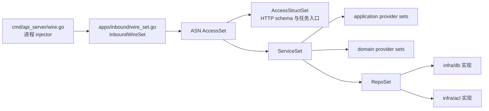

这张图表达依赖供应关系，不等于一次请求的调用时序。一次 SC 请求会从 schema/handler 进入 application，再进入 domain 或 repository；Wire 图回答的是“这些对象如何在进程启动前被创建并连在一起”。不要把构建关系和运行关系混成一张箭头图。

### 手工追踪时记录三类节点

第一类是消费者：struct 字段或构造函数参数表明“我需要某个类型”。第二类是 provider：普通 Go 函数、`wire.Struct` 或 `wire.Value` 说明“我能提供某个类型”。第三类是绑定：`wire.Bind` 说明“这个具体类型可满足那个接口”。

例如 ASN repository 的依赖接口位于 `apps/inbound/asn/domain/dep`，实现位于 `apps/inbound/asn/infra/db`。`AsnIndexRepoImplSet` 同时提供 `AsnIndexRepoImpl` 的构造方式，并把 `api.AsnRepoIface` 绑定到 `*AsnIndexRepoImpl`。domain 看到的是接口，Wire 看得到具体实现，两边因此可以同时成立。

前端的近似关系是：页面依赖 `InboundApi` 类型，应用入口把真实 HTTP adapter 放进 Context，单测则放 fake。差别在于 TypeScript 类型会被擦除，Context 选择发生在运行时；Go 接口由编译器检查，Wire 生成的构造代码也参加编译。

## 四层不是四个固定目录名

课程使用 access、application、domain、infra 作为阅读坐标，但不能据此断言三个后端仓库目录完全一致。主服务同时有 `app/` 和 `apps/`；敏感服务也存在不同成熟度的模块；Tax 更常见 controller、service、model/dao 与 third_party 的组织。分层要从职责和依赖方向判断，而不是看文件夹拼写。

| 阅读坐标 | 本次 ASN 主线中的职责 | 不应放入的工作 |
| --- | --- | --- |
| access | 协议入口、参数绑定、调用 application、响应转换 | 直接拼复杂 SQL；把跨服务重试写进 handler |
| application | 用例编排、事务入口、跨 domain 协作、结果转换 | 暴露 HTTP context 类型给 domain；复制 repository 查询细节 |
| domain | 实体、业务规则、依赖接口和领域服务 | 依赖具体 MySQL 表模型；读取 Chassis 请求对象 |
| infra | 实现 repository/client，适配数据库或下游 | 决定页面权限；把底层错误原样作为 HTTP 契约 |

这不是“每层都必须有一个同名 struct”的格式要求。有的用例很薄，application 只做转换与委派；有的业务规则集中在 domain intern；旧模块可能把若干职责放在相邻包里。判断标准始终是：上层需要什么契约，具体设施是否能在测试中替换，业务规则是否被协议与数据库细节绑住。

## Wire 到底生成了什么

`cmd/api_server/wire.go` 带有 `wireinject` build tag。它声明 injector 并调用 `wire.Build`，函数体是给生成器读取的描述。生成后的 `cmd/api_server/wire_gen.go` 是普通 Go 文件：逐项调用 provider，得到 repository、domain service、application service、schema 和最终 App。

生成代码有三个实际用途。第一，编译器能检查缺少 provider、重复绑定和类型不匹配。第二，开发者可以沿局部变量阅读真实构造顺序。第三，代码评审时能看出一次 provider 变更扩大了哪些进程对象图。

它不是运行时反射容器。请求进入后不会再次执行 `wire.Build`；运行时使用的是已经创建好的对象。也不能说 Wire “零成本”，因为对象本身的初始化仍有时间与资源开销。准确说法是：依赖图解析在生成/编译阶段完成，没有额外的运行时按类型查找容器。

### `wire.NewSet`、`wire.Struct` 与 `wire.Bind`

`wire.NewSet` 组合 provider。被组合的项可以是构造函数，也可以是另一个 set。大型模块用小 set 表达局部边界，再由进程 injector 汇总。

`wire.Struct(new(T), "*")` 表示用可供给的字段类型组装 `T` 的所有字段。它适合字段本身已经清楚表达依赖的 schema/task set。新增字段会改变构造要求，因此不是“无需维护”。如果字段不应自动注入，应收窄字段列表或改用显式构造函数，而不是依赖偶然可用的同类型对象。

`wire.Bind(new(Interface), new(*Implementation))` 只声明接口满足关系，不负责创建 implementation。相同 set 中仍需要一个能提供 `*Implementation` 的 provider。`new(Interface)` 和 `new(*Implementation)` 是 Wire 用来取得类型信息的写法，不是在业务运行时分配最终对象。

### 生成失败比运行时失败更有价值

假设给 application 实现增加 `AuditWriter` 字段，却没有把 provider 加入对象图。重新生成时 Wire 会报告缺少该类型的 provider；若没有重新生成，现有 `wire_gen.go` 仍按旧构造签名调用，通常会在编译阶段因参数或 struct 变化而失败。不能把它描述成“编译通过但运行时必然 nil panic”。是否能编译取决于具体改法，可靠动作是同时检查生成 diff 和构建结果。

另一个常见失败是同一目标类型有多个来源。比如两个 set 都提供同一个具体 client，Wire 无法凭业务意图猜选哪个。修复方式是明确类型边界、封装为不同 adapter，或缩小 set；不要为了让生成器通过而随意删除其中一个 provider。

## 沿 ASN repository 看依赖倒置

`apps/inbound/asn/domain/dep/asn_repo.go` 定义 domain 需要的 repository 能力。`apps/inbound/asn/infra/db/fbs_asn_repo_impl.go` 的 `AsnIndexRepoImpl` 实现这些方法，并依赖 `db.DbAgentIface`。domain 包不需要 import Scorm 表模型；infra 才把 domain 条件转换成查询条件，再把表记录转换回 domain entity。

依赖方向因此不是“handler → service → MySQL 文件”的物理箭头，而是两组关系：运行时调用从上往下；源代码接口由内层或消费者侧定义，具体实现从外层指向接口。Wire 负责在最外侧把两者接上。

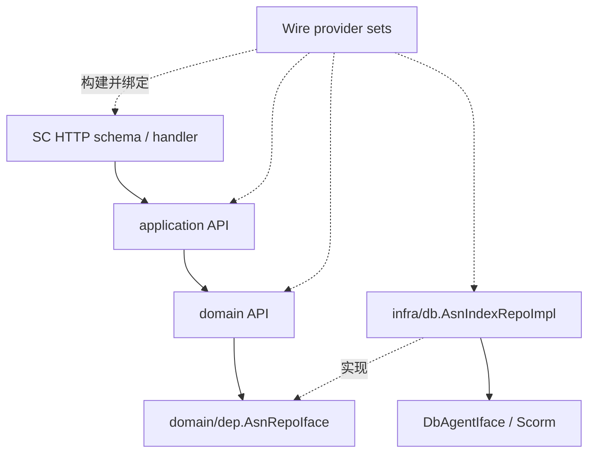

这种边界直接改善测试。application 或 domain 单测可以提供 fake repository，控制“查到记录”“无记录”“数据库错误”等结果，而不需要真正连接 MySQL。infra 测试再单独验证查询条件与表映射。一个测试同时启动 HTTP、Wire 和数据库看似更完整，却很难指出失败属于哪一层。

## 受控改动：增加一个只读审计依赖

练习需求是：ASN 列表查询完成后记录一条不含请求 body、不含 PII 的结构化审计事件。它只用于教学依赖接入，不代表生产需求，也不要求修改业务仓库。先定义边界：审计失败是否影响查询结果必须由真实需求决定；本练习采用“失败返回错误”，便于观察依赖传播，不能把这个选择推广为所有日志场景。

### 第一步：把接口放在消费者能拥有的位置

如果 application 用例需要写审计，就在该用例可依赖的包定义最小接口，而不是把完整 logger SDK 暴露进去：

```go
// 教学缩减示例：名称与字段需按目标模块现有约定调整。
type AuditWriter interface {
	Write(ctx context.Context, event AuditEvent) error
}

type AuditEvent struct {
	Action string
	Count  int
}
```

最小接口让 fake 很容易实现，也防止 application 开始依赖日志格式化、传输协议或凭据配置。不要为了“以后可能需要”预先加入十几个方法。

### 第二步：修改构造依赖或 struct provider 所需字段

目标实现增加 `AuditWriter`。若该类型通过显式 `NewXxx(a, b)` 构造，就修改构造函数；若由 `wire.Struct(..., "*")` 组装，就增加字段并确认 provider set 能提供唯一的 `AuditWriter`。两种方式不能在没有读源码前混写成一条固定命令。

### 第三步：在 infra 或 adapter 层提供实现

实现可以包住仓库已有的结构化记录能力。代码评审要确认事件中只有 action、数量、请求标识等允许字段，不记录联系人、地址、原始 token 或整个 DTO。安全边界会在 BE-W06 继续展开。

### 第四步：更新 provider set

provider set 需要同时包含具体实现 provider 与接口绑定。缩减形态如下：

```go
var AuditSet = wire.NewSet(
	NewAuditWriter,
	wire.Bind(new(AuditWriter), new(*auditWriter)),
)
```

然后把 `AuditSet` 合入恰当的模块 set。应放在能够服务该依赖的最小范围，避免仅一个 ASN 用例所需的 adapter 被塞进全局基础集合。范围越大，重复 provider 和意外耦合越难诊断。

### 第五步：生成、读 diff、再测试

仓库 injector 文件已有 `//go:generate` 约定时，按对应目录的现有 Makefile 或 `go generate` 入口执行。不要凭课程猜一条全仓生成命令。完成后按以下顺序核对：

1. `wire_gen.go` 的文件头仍说明 generated；
2. 新 provider 只进入预期进程，例如 API 而非无关 task；
3. 生成代码先取得具体实现，再把它传入目标 application；
4. 没有出现第二套同类型 provider；
5. 目标包单测和进程构建通过。

生成 diff 很大时先检查是否使用了与仓库锁定版本不一致的 Wire，或是否在错误目录执行。不要把无关重排和业务改动一起提交。

## 循环依赖要从包和职责两层诊断

Go 首先禁止 package import cycle。A 包 import B，B 又 import A，即使还没运行 Wire，编译器也会拒绝。Wire 还会诊断 provider 图中的依赖环：构造 A 需要 B，构造 B 又需要 A。两种错误症状相似，修法不同。

遇到 import cycle，查看包依赖。常见原因是 infra 为复用一个 DTO 反向 import access，或 domain import application。把共享的稳定类型移到合适的内层包，或在边界做转换；不能新建一个 `common` 包把所有东西扔进去。

遇到 provider cycle，写出构造关系。可能是两个 service 彼此持有完整接口。先问它们是否真的属于两个职责；也可以抽出更小的只读能力、用事件/回调打断同步所有权，或把共同规则下沉到无外部依赖的 domain service。不要用全局变量和 service locator 绕过 Wire，那只会把编译期错误换成运行时隐式依赖。

| 现象 | 第一项检查 | 有效修复方向 | 无效捷径 |
| --- | --- | --- | --- |
| `import cycle not allowed` | package import 图 | 调整类型归属与转换边界 | 把文件随意移动到 `utils` |
| no provider found | 目标类型及 set 作用域 | 增加 provider/bind 或纳入正确 set | 手改 `wire_gen.go` |
| multiple bindings | 同类型 provider 来源 | 缩小 set、明确 adapter 类型 | 随机删掉一个 provider |
| cycle for X | 构造函数/字段依赖图 | 拆小接口或重划职责 | 全局单例、运行时查找 |

## 三个仓库怎样对照，而不强求同构

主服务的 ASN provider set 是模块化聚合案例。敏感服务的 `apps/client/wire_set.go` 当前大量旧业务组装被注释，实际可见的 `InitializeMiddleware` 聚合中间件和 agent。这说明阅读者必须同时看 injector、生成文件与进程注册，不能看见一个 `wire_set.go` 就假设全部业务已经接入。

Tax 的 `apps/tax_api/api/wire.go` 和 `apps/tax_core/wire.go` 直接聚合 controller、service、DAO 和 third-party provider sets，生成文件会展开一条很长的构造链。Tax 的目录词汇与主服务不同，但依赖原则相同：controller 不应自己创建 DAO；service 通过接口依赖外部能力；最外层 injector 决定使用哪个实现。

这三种形态提供一个实用阅读顺序：先找进程调用的 `Init...` 或 `Initialize...`；再找对应 injector 的 `wire.Build`；沿 provider set 缩小到目标模块；最后才进具体构造函数。直接全文搜索 `wire.NewSet` 会得到几百个结果，信息很多，路线却没有建立。

## STAR 案例：生成成功，API 进程却多了不该有的依赖

### Situation

开发者为一个 ASN 查询用例增加 client adapter。Wire 可以生成，目标包测试也通过，但 `wire_gen.go` 显示该 adapter 被全局 set 引入多个进程对象图。它的初始化还需要一项只在 API 环境存在的配置。

### Task

确认问题是业务调用错误、provider 缺失，还是 provider 作用域过大，并让 API 使用该 adapter 而不影响 task 进程。

### Action

先比较改动前后的生成文件，不启动服务猜配置。diff 显示新 provider 从共享 `ServiceSet` 进入 API 与 task。随后画出 set 包含关系，确认只有 HTTP application 需要它。把 adapter provider 从共享集合移到 access/API 对应的更小 set，保留接口绑定；重新生成 API 与 task 的 Wire 文件。最后用 fake adapter 跑 application 失败路径测试，并分别构建两个进程入口。

### Result

API 生成链保留新 adapter，task 生成链不再创建它。配置缺失不再阻塞 task 构建，application 测试仍能验证远端失败的错误转换。

### Reflection

Wire 通过不等于依赖边界正确。生成器验证的是类型图可解，不会判断一个 provider 是否被放得太高。有效证据来自 set 作用域、生成 diff、进程构建与隔离测试的组合。

## 独立练习：提交一份可复核的依赖变更说明

选择 ASN 的一个 SC HTTP schema，完成只读分析，不修改业务仓库：

1. 从 schema 字段或 handler 调用找到 application 接口；
2. 找到 application 的具体实现 provider；
3. 继续找到一个 domain 依赖接口及 infra 实现；
4. 标出 `wire.Bind` 或等价的接口满足证据；
5. 在 `cmd/api_server/wire_gen.go` 找到至少两个对应的构造局部变量；
6. 写一个“增加 fake AuditWriter”的最小改动计划；
7. 说明 API 与 task 哪些进程应受影响，并给出判断依据。

通过标准不是列出最多文件，而是每条箭头能回答“谁消费什么类型、谁提供它、由哪个 set 汇合”。如果某条关系只靠目录名猜测，标为待核对并回到构造函数或生成代码。

## 章末自检

- 能否用一句话区分 provider 图与请求调用图？
- 能否解释 `wire.Bind` 为什么不能单独创建实现？
- 能否说明 `wire.Struct(..., "*")` 增加字段后为什么会改变对象图？
- 能否分别诊断 package import cycle 和 provider cycle？
- 能否指出生成文件可阅读、可纳入 diff，但不应手改？
- 能否用主服务、敏感服务和 Tax 的不同 injector 说明“职责相似不等于目录同构”？

下一章会沿本章的 repository 接口进入 MySQL、GORM/Scorm 和事务。到那里，Wire 只负责把数据库实现接上；查询条件、表模型、锁与回滚仍由 repository 和事务抽象负责。

## 参考文献

- [Go Blog: Wire](https://go.dev/blog/wire)
- [Wire v0.5.0 README](https://github.com/google/wire/blob/v0.5.0/README.md)
- [Go 语言规范：接口类型](https://go.dev/ref/spec#Interface_types)


---

# MySQL、GORM/Scorm、仓储与事务

> 预计学习时间：180–240 分钟
> 一句话总结：沿 ASN 列表条件进入 repository，区分 domain 条件、表模型与 ORM 查询，并用失败实验确定事务、锁和测试的边界。

## 从一个筛选条件开始

本章的任务很小：给 ASN 列表查询增加一个向后兼容的筛选条件，并说明它是否需要索引、是否改变分页、是否应进入事务。小任务能暴露数据层最常见的误判。前端传来一个字段，不等于在 handler 里直接拼 SQL；repository 多加一个 `Where`，也不等于数据库设计已经完成。

主线使用 `apps/inbound/asn/infra/db/fbs_asn_repo_impl.go`。`QueryAsnListByCondition` 先把 domain 的 `AsnConditions` 转成 repository 条件，再取得 `DbAgentIface` 提供的 Scorm 查询对象。条件通过 `Scopes`、`Where`、子查询逐步叠加，随后排序、分页并 `Find` 到表模型，最后转换为 domain record。

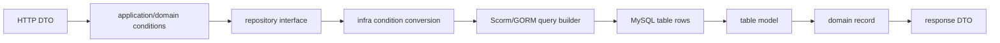

每次转换都有职责。HTTP DTO 处理协议字段名和可选性；domain 条件表达业务查询意图；表模型表达列名和存储类型；response DTO 只返回调用方需要的数据。把四者合成一个 struct 看似省代码，后续任何列变化、接口兼容或领域规则都会互相牵连。

## 先解释标题里的五个概念

MySQL 是关系型数据库管理系统。它把数据组织成表、行、列，用 SQL 查询和修改，并通过索引、约束与事务维护数据正确性。在本章的后端架构里，MySQL 是持久化设施：进程退出后 ASN 数据仍要存在，多次请求还要看到受控的一致结果。

ORM 是 Object-Relational Mapping（对象关系映射）的缩写。它把 Go struct、字段和方法调用转换为表、列和 SQL，减少重复扫描与拼接代码。GORM 是 Go 社区常用 ORM；Scorm 是当前公司代码中出现的数据库封装/ORM 体系，并存在不同版本和 adapter。ORM 没有消除 SQL。开发者仍要理解 filter、join、排序、索引和事务，才能判断链式调用实际做了什么。

repository（仓储）是业务层依赖的数据访问契约，例如“按条件查询 ASN”或“保存一组 SKU”。它把业务需要的能力与 MySQL、Scorm 的具体 API 隔开。DAO（Data Access Object）通常更贴近表和 SQL；不同仓库对名称的使用并不完全一致，因此看职责和参数，不只看目录名。

事务把一组数据库操作放进一个提交/回滚边界。全部成功才提交；中途失败则回滚，目的是维护事先定义的业务不变量。锁用于协调并发访问，索引用于缩小扫描与支持排序。它们解决的问题不同：事务不是性能工具，索引也不能保证多步写入原子性。

### 社区常见选择与当前技术栈的取舍

| 方式 | 优点 | 代价 | 本课程怎样使用 |
| --- | --- | --- | --- |
| `database/sql` + 手写 SQL | 控制直接、SQL 明确、依赖少 | 扫描、映射和重复样板较多 | 用于理解底层契约，不替换现有 repository |
| GORM | CRUD/query builder 完整，社区资料多 | 抽象可能掩盖 SQL，版本 API 有差异 | 只借稳定概念，具体调用以仓库为准 |
| sqlx | 保留 SQL，同时简化绑定与扫描 | 仍需手写 SQL 与组织 repository | 当前主线没有据此改造 |
| sqlc | 从 SQL 生成类型安全代码 | 需要维护 SQL 与生成流程，迁移成本存在 | 当前仓库未采用，不作为练习答案 |
| Scorm/内部 DB adapter | 接入当前 context、路由、错误与公司环境 | 公开资料少，多版本并存，迁移复制易出错 | 先读 adapter 类型、版本和相邻实现 |

当前方案的优势是已经接入三仓既有基础设施，改动可沿相邻模式完成。缺点是 GORM/Scorm 多版本共存，公开示例常常只能解释概念，不能证明方法签名、错误读取和 context 行为。零基础学习者应先把 ORM 翻译成 SQL 意图，再回到 wrapper 检查仓库特有语义。

## 三个数据对象不要混用

以“是否跨仓”为例。HTTP 可能用可选字段区分“未传”与明确 `false`；domain 继续保留这个语义；repository 才把布尔值转换成当前表列需要的整数。主服务的 ASN repository 对 `IsCrossDock` 做了这一步转换。若 handler 直接写 `0`，就失去了未传条件；若 domain 直接依赖表列的 int32，业务层又被存储格式绑住。

| 对象 | 主要问题 | 常见字段形态 | 变化来源 |
| --- | --- | --- | --- |
| 请求 DTO | 调用方传了什么，格式是否合法 | JSON/form tag、指针、枚举字符串 | HTTP 契约 |
| domain 条件/实体 | 业务想查询或修改什么 | 值对象、可选条件、业务状态 | 业务规则 |
| DO/表模型 | 如何存储与扫描 | gorm tag、列类型、ctime/mtime | 数据库 schema |
| 响应 DTO | 调用方允许看到什么 | 展示字段、兼容默认值 | API 契约与安全边界 |

前端类比很直接：表模型不是组件 Props，就像后端返回的原始 DTO 不应直接成为整个 Redux store 的永久形状。两边都需要边界转换，才能让上游界面不跟着底层表结构摇摆。

## 当前仓库并非只用一种 ORM

主服务 `go.mod` 同时包含内部 gorm fork、Scorm、Scorm v2、`gorm.io/gorm` 1.23.8 与 MySQL driver。敏感服务直接依赖 Scorm v2，同时保留若干间接旧依赖。Tax 使用 Scorm v2 和 GORM 1.23.8。课程因此不能写“FBS 后端统一使用 GORM v2 API”，也不能把公开 GORM 文档里的每个方法当成内部 wrapper 一定支持。

ASN 代码本身就能看到并存。`AsnIndexRepoImpl` 通过 `DbAgentIface.GetDb(ctx)` 使用 Scorm 风格的 `SQLCommon`；`AsnSkuRepoImpl` 同时持有 `DbAgentIface` 与 `FBSScormV2`，不同方法走不同 adapter。选择不是靠文件新旧猜测，而是看依赖类型、返回对象和错误语义。

公开 GORM 文档只帮助理解 query builder、transaction、model 等稳定概念。具体的 `GetError()`、`RunWithTransaction`、`SearchOptions`、context 绑定和路由规则，以仓库 adapter 为准。

## 阅读查询：把链式调用翻译成 SQL 意图

`QueryAsnListByCondition` 的读取顺序不是从上到下背 API，而是分六步提问。

第一，主表是什么。代码用 `Table(FbsAsnTabName)` 建立查询。第二，哪些条件需要其他表。vendor/shop 条件会对子表选择 `asn_id`，再用 `id IN (subquery)` 限定主表。第三，哪些是简单字段条件，交给 `WithFieldOption` scopes。第四，哪些条件有特殊语义，例如异常 carton 的 OR 条件、跨仓布尔转换、存在 ToB order id。第五，count 与 list 是否共享完全相同的 filter。第六，排序与分页何时加入。

```sql
-- 教学等价形态，不是可直接替换仓库代码的生产 SQL。
SELECT *
FROM fbs_asn_tab
WHERE whs_region = ?
  AND inbound_status IN (?)
  AND id IN (
    SELECT asn_id FROM fbs_asn_sku_index_tab WHERE shop_id = ?
  )
ORDER BY ctime DESC
LIMIT ? OFFSET ?;
```

翻译后容易发现风险。子查询字段是否有索引；`ORDER BY ctime` 与过滤条件能否共同利用索引；大 offset 是否变慢；count 查询是否误带 limit；空 slice 传给 `IN (?)` 会生成什么行为。这些问题不能凭 ORM 链看起来流畅而忽略。

### nil、zero 与“没有条件”

`0` 可能是合法状态，也可能是未传默认值。repository 条件使用 `*SearchOptions` 和 `*bool`，就是为了保留三态：没有筛选、筛选 true、筛选 false。增加新字段时先写请求矩阵：未传、零值、有效非零、非法值。然后逐层确认哪一种会构造 scope。

如果把可选整数从指针改为值，未传和 `0` 会合并。前端可能因此看到默认列表突然只剩状态 0。数据库没有报错，HTTP 也是成功，这类错误只能由契约测试和查询条件测试发现。

### 分页不是最后随手加两行

当前代码在 `IsNeedPage` 时计算 `(PageNo - 1) * Count`。调用前要保证 PageNo、Count 已归一化；否则负 offset、超大 page size 会把入口问题带到数据库。列表与总数也要来自同一过滤条件。若先查询列表、再用另一套条件 count，页面会出现“当前空列表但 total 非零”这类难联调问题。

稳定排序同样重要。只按非唯一 `ctime desc` 排序时，同一时间值的记录在翻页间可能漂移。是否要追加主键排序必须结合现有契约与索引评估，不能在课程里直接宣布修改生产查询；但 code review 至少要提出这个问题。

### 查询 diff 应怎样做 code review

拿到查询改动时，依次检查数据语义、SQL 正确性、性能证据、并发边界和测试。先看指针、空 slice、枚举与时间区间怎样从 domain 映射到列；再把 ORM 翻译成 SQL，确认 AND/OR 括号、子查询、count、排序和分页。随后检查访问模式与索引证据，最后判断读取是否参与写入不变量，测试能否观察真实结果。

例如 `HasAbnormalCarton` 的两个状态若用 OR，外层还要与其他 scopes 用 AND，测试应准备只命中第二个状态的记录。shop 条件若通过 SKU index 子查询过滤 ASN，同一 ASN 多个 SKU 不能让主列表重复。`OnlyTotal` 分支若在排序/分页前返回，新增条件必须进入 count/list 的共同查询链。update map 自动补 `mtime` 时，还要判断原地修改调用方 map 是否符合契约。

“建议优化 SQL”不是可执行评论。把意见写成“给定什么输入，预期形成什么 SQL 意图，应观察什么结果”，reviewer 才能复核。

## 受控修改：增加 `transit_whs_id` 条件

当前 ASN 条件链已经包含 `TransitWhsId`，因此它适合做存在性审计，而不是重复实现。假设需求要求支持该条件，先核对四处：HTTP DTO 是否有字段；转换是否进入 domain `AsnConditions`；`toAsnConditions` 是否生成 repository option；repository 的 `Scopes` 是否使用正确列名。

如果四处都存在，开发任务可能已经完成，真正缺的是测试或前端契约。不要因为任务单写“后端加筛选”就机械增加第二个 `Where`。重复条件可能语义相同，也可能因类型转换不同造成冲突。

测试采用 table-driven 形式，输入至少覆盖：未传时不限制；单值命中；合法但无记录；非法值在入口被拒绝；与 shop 子查询组合。repository 单测若难以直接检查生成 SQL，可以通过受控测试数据库或 adapter fake 检查结果；不要 mock 到只断言“方法被调用”，那无法证明条件正确。

```go
// 教学测试骨架，需使用目标仓现有测试设施。
tests := []struct {
	name       string
	condition  *AsnConditions
	wantIDs    []uint64
	wantErr    bool
}{
	{name: "condition absent", condition: &AsnConditions{}},
	{name: "warehouse matched", condition: conditionWithTransitWhs(100)},
	{name: "warehouse not found", condition: conditionWithTransitWhs(999)},
}
```

## 写入前先定义业务不变量

事务不是“多个 SQL 就包起来”的装饰。先写不变量。例如创建 ASN 时，主记录与 SKU 记录要么都可被后续流程识别，要么都不可见；状态更新与操作记录是否必须原子成功，也要由用例决定。只有定义了失败后不允许出现的状态，才能画出事务边界。

主服务通过 `RunWithTransaction(ctx, func(ctx context.Context) error {...})` 暴露事务。关键点是 callback 收到新的 context，repository 从这个 context 取得事务连接。若在 callback 内误用外层 context，某次写入可能落到非事务连接，外层回滚也撤不掉它。

`sbs_agent/db/db_extend.go` 的实现还处理 panic、callback error、commit error 与 rollback。开发者不应在每个用例重新复制一份 `Begin/Commit/Rollback`。重复实现很容易漏掉 panic 或 commit 失败，并产生“双重 rollback 是否安全”的争论。

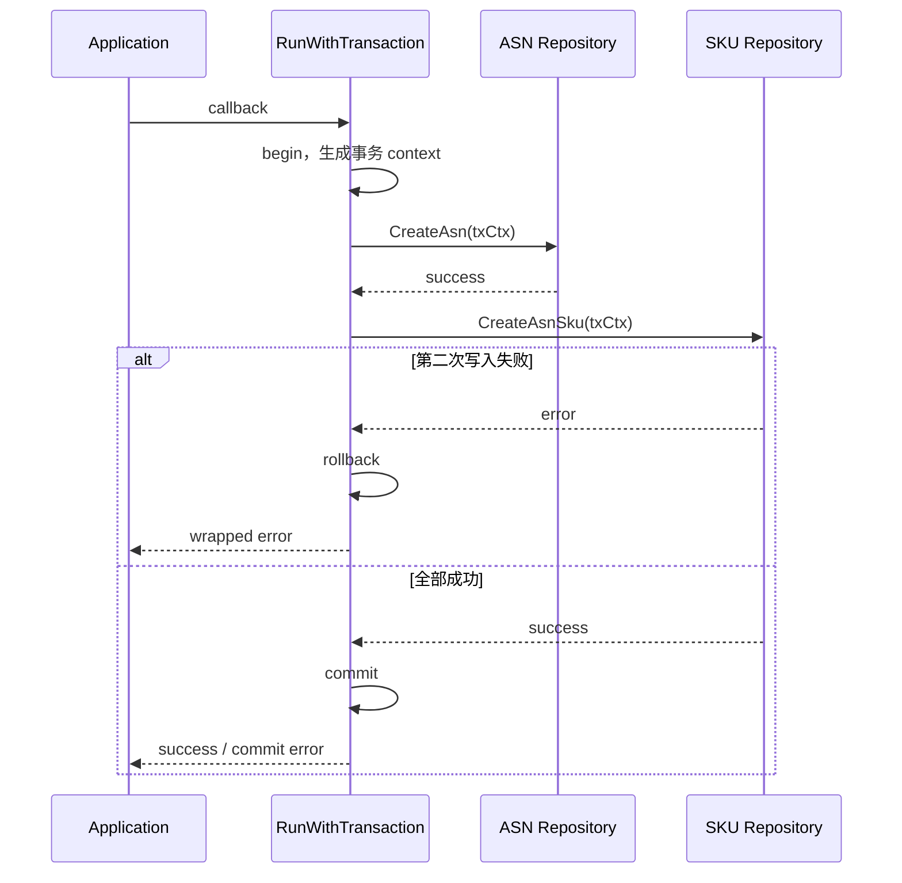

### 事务里不宜放什么

远端 HTTP/gRPC 调用通常无法随 MySQL rollback。把慢调用放进事务还会延长锁持有时间。若流程必须先调用下游再写库，要分析下游副作用；若先写库再发布消息，要面对事务提交与消息发布之间的缺口。这些组合会在模块六的可靠性章节展开。本章只要求识别：数据库事务能保证同一数据资源内的原子性，不会自动撤销邮件、文件、缓存或远端服务。

读操作也不因为“重要”就需要事务。只有需要一致快照、锁定记录或与写入组成不变量时才考虑。无条件给查询加事务会增加连接与锁负担。

## 失败实验：第二次写入报错

实验目标是区分三种实现：两次写入没有事务；两次写入使用同一 tx context；外层开事务但第二次误用原 context。

准备 fake repository，记录接收到的 context 标识，并让第二次写入返回固定错误。断言不只看最终 error，还要看第一条数据是否可见、rollback 是否被调用、错误是否保留操作语义。若使用仓库现有 transaction fake，应让它真实执行 callback，不要直接返回 nil 跳过用例代码。

| 场景 | 预期数据状态 | 预期错误 | 能证明什么 |
| --- | --- | --- | --- |
| 两次均成功 | 两组数据可见 | nil | 正常提交路径 |
| 第二次失败 | 两组数据都不可见 | 保留第二次操作语义 | rollback 覆盖同一事务 |
| callback panic | 两组数据都不可见 | panic 按 adapter 约定传播/转换 | 资源清理路径 |
| commit 失败 | 不报告业务成功 | commit error | 不能只检查 callback |

不要用“单测返回了 error”替代数据状态证据。事务的学习成果是证明部分写入没有泄漏。

### 事务反例：连接在 callback 外取得

下面的代码表面上进入了事务，第一条写入却可能使用外层连接：

```go
// 错误示意：dbCtx 在事务开始前由外层 ctx 取得。
dbCtx := repo.DB.GetDb(ctx)
err := repo.DB.RunWithTransaction(ctx, func(txCtx context.Context) error {
	if err := dbCtx.Create(&main).GetError(); err != nil {
		return err
	}
	return repo.CreateChildren(txCtx, children)
})
```

第二次写入失败时，rollback 无法证明撤回第一条。修复方法是在 callback 内让所有 repository 都从 `txCtx` 取得连接，并用失败实验检查最终数据状态。

另一个反例是捕获错误后返回 nil。事务 manager 只根据 callback 返回值决定是否提交；写日志不会触发回滚。若业务允许部分成功，就重新定义不变量和响应语义，不能悄悄吞错。

## 锁：`FOR UPDATE` 依赖事务才有意义

ASN repository 的 `LockAsn` 使用 query option `FOR UPDATE`。它表达的是悲观锁读取。锁的生命周期跟事务连接绑定；在事务外执行后连接立即结束，随后再更新并不能依赖这把锁保护不变量。

正确推理顺序是：要保护什么并发不变量；按哪个唯一条件锁定；所有竞争路径是否以相同顺序拿锁；锁内工作是否足够短；找不到记录和死锁如何处理。只看到状态更新就加 `FOR UPDATE`，可能制造热点和死锁，仍未覆盖另一条不拿锁的写路径。

前端类比是保存按钮的 loading 状态。它只能减少同一页面的重复点击，无法阻止两个浏览器或任务同时更新同一 ASN。数据库唯一约束、条件更新、事务锁或幂等键解决的是服务端竞争，不能由 UI 状态替代。

## 索引意识：从访问模式而不是字段名出发

新筛选字段是否建索引，需要结合基数、过滤组合、排序、数据量和写入成本。`transit_whs_id` 可能单独过滤，也可能总与 region/status 组合；单列索引和联合索引的选择不同。课程环境不应凭字段名给出生产 DDL。

可复核流程是：写出代表性 SQL；记录预计返回比例；确认现有索引；在允许环境用 `EXPLAIN` 观察访问类型、候选索引与估算行数；用接近真实分布的数据比较；同时评估写放大。没有环境证据时，把索引结论标为待 DBA/owner 核验，不伪造执行计划。

## 三个仓库的数据层对照

敏感服务的 `apps/*/infra/db` 同样把 PII 领域对象与表模型隔开，并通过 `libs/db`/Scorm v2 获取连接。安全上还要检查查询结果是否超出最小返回范围。数据存在敏感库，不等于普通服务可以任意透传。

Tax 的 `internal/common/dbhelper` 提供带事务状态的 context，service/DAO 以自己的错误类型返回。Tax 仍使用 GORM/Scorm 相关依赖，但调用形态与主服务 `GetError()` 不完全一致。跨仓复制 repository 代码前必须先看 context、错误和分库规则，不能只替换表名。

### 时间、批量和数据路由也是 repository 边界

数据库时间字段可能保存 Unix 秒，筛选输入却来自毫秒或带时区字符串。单位转换应在明确边界完成并有上下界测试。毫秒直接查询秒字段通常只会稳定返回空，不会产生 SQL error，因此跨端联调要同时保存原始单位与转换后条件。

批量写入要检查单批大小、顺序、重复键和部分失败。ASN SKU repository 在批量插入前按 SKU ID 排序；课程不猜测历史动机，但修改时要保留可观察行为，并测试 nil、重复项和失败路径。

数据库还可能依据 region、seller 或业务键选择连接。repository 应通过现有 DB agent/context 路由，不自行拼物理库名。逻辑单测没有连接真实环境时，只能证明条件与转换，不能宣称 shard routing 已验证。跨 region 查询若与当前模型冲突，应升级为设计问题。

## STAR 案例：筛选能用，翻到第二页却重复

### Situation

开发者给 ASN 列表加入组合条件，接口与第一页验证均正常。测试发现数据持续写入时，第二页出现重复记录，偶尔又漏掉一条。

### Task

判断问题来自前端重复请求、过滤条件、count，还是分页排序不稳定，并提出不改变接口字段的最小修复。

### Action

先保存两次请求参数和数据库查询条件，排除前端 pageNo 错误。检查 SQL 后确认两页都按 `ctime desc`，而多条记录 ctime 相同。用固定数据重复查询复现顺序漂移，再评估现有索引与兼容性，提出追加唯一键作为次级排序的方案。测试断言按复合顺序分页，并重新核对 count 不带 limit/offset。

### Result

固定数据下翻页集合稳定且无重复。修改只影响排序确定性，没有把分页问题错误归因于事务。

### Reflection

ORM 没有报错不代表查询契约正确。列表接口还包含过滤一致性、确定顺序、分页边界与数据变化条件；测试必须覆盖这些可观察行为。

## 独立练习与交付证据

围绕一个已存在的 ASN 条件完成审计：

1. 画出 DTO → domain condition → repo condition → SQL 列的映射；
2. 给出未传、零值、命中、无结果、非法输入五组样例；
3. 判断 count/list 是否共享条件；
4. 写出分页与稳定排序风险；
5. 判断该变更是否需要事务并说明不变量；
6. 如果涉及多写入，设计第二次写入失败实验；
7. 记录索引结论所需证据，不虚构 DDL。

通过标准：条件不会因零值误收窄；repository 不依赖 HTTP DTO；事务 callback 内所有数据库调用使用事务 context；失败路径能证明没有部分写入；测试能判定行为而不只检查函数调用次数。

交付说明应包含：missing/zero 矩阵、domain 与表列映射、等价 SQL、list/count/pagination 测试、索引核验状态、事务不变量、失败注入后的数据状态，以及 context/数据路由说明。无法在授权数据库执行 `EXPLAIN` 时明确标为未验证，不用“ORM 会处理”替代。

## 章末自检

- 能否说明主服务同时出现 Scorm、Scorm v2 和 GORM 依赖时，为什么不能混写 API？
- 能否区分请求 DTO、domain entity 与表模型？
- 能否从一条 ORM chain 还原表、join/subquery、filter、sort 和 page？
- 能否解释 `RunWithTransaction` callback 为什么传入新 context？
- 能否说明远端调用为何不能被 MySQL rollback？
- 能否设计一个真正验证回滚的数据状态测试？

下一章进入跨服务 client。数据库事务在那里会成为一个重要边界：本地回滚不能撤回已发生的 HTTP/gRPC 副作用，超时与错误也需要在 adapter 层转换成本服务语义。

## 参考文献

- [Go 官方文档：访问关系型数据库](https://go.dev/doc/database/)
- [GORM 文档](https://gorm.io/docs/)
- [MySQL 8.0 Reference Manual](https://dev.mysql.com/doc/refman/8.0/en/)


---

# 服务调用、HTTP/gRPC 契约与超时

> 预计学习时间：180–240 分钟
> 一句话总结：把一次下游调用拆成业务接口、client adapter、协议对象、超时与错误转换，并用 fake 验证慢响应、空响应和远端错误。

## 先划清本章边界

一个 Go 函数调用可能停留在当前进程，也可能穿过 HTTP 或 gRPC 到另一服务。调用代码都长得像 `client.Query(ctx, req)`，运行性质却完全不同。远端调用会遇到网络延迟、服务发现、序列化、部分响应、超时和对端版本演进；本地函数调用不会自动拥有这些失败模式。

本章不选择“HTTP 还是 gRPC”的通用最佳方案。FBS 当前仓库已经有既定协议：主服务 `thirdpart` 和 agent 中有 HTTP/服务调用 adapter，敏感服务 `agent/*`、`thirdpart/*` 连接 FBS、SCBS、SPEX 等边界，Tax 的 `third_party/*` 大量使用 protobuf 与 Chassis gRPC invoke。开发任务应先沿现有 client，再判断契约和超时是否正确。

目标是交付一份跨服务契约：调用者输入什么，adapter 发出什么，超时由谁控制，远端错误怎样转成本服务错误，fake 如何让失败路径可重复。

## 先解释服务调用、HTTP、gRPC、protobuf 和超时

服务调用是一个进程请求另一个进程提供能力。调用跨过网络后，就不再是普通函数：请求可能根本没送达，也可能已经执行但响应丢失，还可能收到一个协议成功、业务失败的结果。

HTTP 是通用请求/响应协议，常用 method、path、header 与 JSON 表达接口。gRPC 是远程过程调用框架，通常基于 HTTP/2，并用 protobuf 定义消息与 service/method。protobuf 是接口描述和二进制序列化体系，字段编号承担长期兼容身份；生成的 Go 代码只是协议源的产物。

client adapter 把上层业务接口适配为具体 HTTP/gRPC 调用，再把远端结果转回本服务语义。timeout 是调用方愿意等待某阶段的时长；deadline 是整条 context 链的绝对截止时间。重试会重新发起一次尝试，不等于延长原请求，也不保证没有重复副作用。

### 常见技术选择与当前仓库的取舍

| 选择 | 优点 | 代价 | 适用判断 |
| --- | --- | --- | --- |
| HTTP/JSON | 通用、易抓包、浏览器和工具支持好 | 文本体积较大，契约常靠文档/测试约束 | 已有 HTTP client 时沿现有契约演进 |
| gRPC/protobuf | 强类型 schema、生成 client、字段编号便于兼容演进 | 生成链和调试门槛更高，网关/工具要适配 | 已有 gRPC 边界时维护 proto 与生成产物 |
| 同进程 Go 接口 | 无网络序列化，编译器直接检查类型 | 不能跨进程独立伸缩或隔离 | 能留在同一进程时不伪装成远端调用 |
| 消息/异步任务 | 可把调用方与处理时机解耦 | 结果不是同步返回，要处理重复、延迟和最终一致性 | 模块六再按真实需求判断 |

HTTP 和 gRPC 没有脱离上下文的胜负。当前技术栈的优势是协议、监控与 client 封装已经存在；代价是三仓 wrapper、错误类型和 timeout 单位并不完全相同。普通字段改动不应顺便迁移协议。

## 从业务接口反查到传输层

不要从 `grpc` 或 `http` 全仓搜索开始。先在 application/domain 找业务含义明确的接口，例如“查询联系人”“取得外部订单”“查询 seller 信息”。接着找它的实现与 provider set，最后进入调用库。这个顺序能把下游内部实现留在边界外。

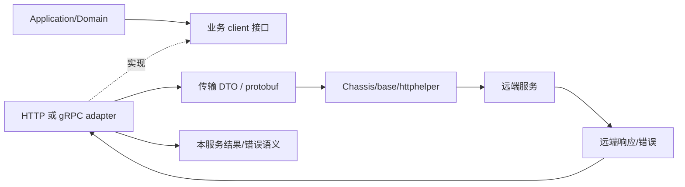

业务层不应拼 URL、schema ID 或 protobuf operation ID。adapter 负责这些传输细节，也负责把远端空值、retcode、transport error 转换为上层能处理的结果。这样单测可替换 adapter，而不是启动远端服务。

前端对应 request wrapper：组件调用 `getInboundList(filter)`，wrapper 才决定 base URL、header、超时与错误 envelope。后端 client adapter 是同一类边界，只是它运行在服务端，并继续携带 request context。

### 先写一张调用契约卡

阅读 client 前先记录六项：业务 operation、调用方、远端依赖、输入/输出、deadline 来源、失败语义。再补“是否有副作用”和“是否允许部分结果”。这张卡能阻止开发者从某个 `Invoke` 调用反推全部业务。

例如“按 ASN 查询最小联系人视图”可能是只读，但仍不能直接标成“可安全无限重试”：它可能受入口 deadline、远端限流和数据权限约束。相反，一个命名为 `Get` 的接口也可能在远端触发审计或缓存回填。副作用判断必须来自协议与实现证据。

调用前还要确认请求是否已经归一化，调用后确认 mapper 是否丢失 missing/zero 语义。远端返回成功但缺少必要字段时，adapter 应产生可识别的协议错误或安全默认，不让 nil 一路流到 handler。契约卡最终与 fake case 一一对应，缺少的失败语义会立刻暴露。

## 三种调用先分清

本地调用由编译器检查 Go 类型，错误通常同步返回。HTTP 调用通过 method/path/header/body 建立契约，JSON 字段名与可选性决定兼容。gRPC 调用通过 protobuf message、service/method 和 metadata 建立契约，字段编号是长期兼容标识。

| 维度 | 本地接口 | HTTP/JSON | gRPC/protobuf |
| --- | --- | --- | --- |
| 边界 | 同一进程 | 网络 | 网络 |
| 契约 | Go 类型 | method/path/header/JSON/状态或 retcode | service/method/message/field number |
| 常见失败 | 业务 error、panic | DNS/连接/超时/非预期状态/坏 JSON | dial/invoke/timeout/status/坏 message |
| 演进重点 | 调用方一起编译 | 字段可选、默认值、错误 envelope | 字段编号保留、optional/默认值、生成代码 |
| 测试替身 | fake interface | fake adapter/受控 HTTP server | fake adapter/受控 server |

现有协议决定继续使用哪一列。为了“性能”把一个成熟 HTTP client 改成 gRPC，已经超出普通字段改动；它会影响服务注册、schema、监控、生成代码和消费者。

## HTTP adapter：成功不只看网络 error

主服务 `thirdpart/data/datahttp/intern/data_impl.go` 使用 `HTTPRequestWithResponse` 并传入配置超时；`thirdpart/charging` 也显式构造 request timeout。真实 adapter 往往需要检查三层结果：传输是否成功；HTTP/框架响应是否能解析；业务 retcode/data 是否表示成功。

`err == nil` 只说明调用库没有返回传输错误，不能证明业务成功。反过来，HTTP 非 2xx 与业务 retcode 的处理要遵循当前 wrapper，不能在每个 client 发明一套分类。

缩减 adapter 可以这样组织：

```go
// 教学缩减示例，不可直接替换仓库 client。
func (c *contactClient) Query(ctx context.Context, req QueryReq) (Contact, error) {
	var remote remoteResponse
	if err := c.transport.Call(ctx, req, &remote); err != nil {
		return Contact{}, fmt.Errorf("query contact transport: %w", err)
	}
	if remote.RetCode != 0 {
		return Contact{}, mapRemoteError(remote.RetCode, remote.Info)
	}
	if remote.Data == nil {
		return Contact{}, ErrEmptyRemoteData
	}
	return toDomainContact(*remote.Data), nil
}
```

错误包装要保留操作语义，但不能把远端原始响应、token 或 PII 全部塞进 error。日志也遵循相同限制。

## gRPC/protobuf：生成代码是契约产物

Tax 的 third-party client 可看到 `base.GRPCInvoke`、`GRPCEndPointInvoke`、protobuf request/response 与 `base.SetTimeout`。敏感服务也包含生成的 protobuf Go 文件。阅读时要区分手写 adapter 与 generated message；修改契约源后重新生成，不直接手改 `*.pb.go`。

protobuf 演进最重要的不是 Go 字段顺序，而是字段编号。已发布字段编号不能换给另一含义。删除字段应保留编号/名称，避免旧消息被新代码误读。新增字段通常应是旧消费者可以忽略、旧生产者不提供时新消费者有安全默认的字段。

默认值会制造“未传还是零值”的歧义。当前生成代码若使用 pointer/optional 语义，应保留；若没有 presence，需要在协议层用明确枚举或额外字段表达。不能因为 Go 端拿到 `0` 就断言远端明确发送了 0。

### metadata 不是业务参数垃圾箱

request ID、region、身份等跨调用信息可能通过 context/metadata 传播，具体键由当前框架约定。业务筛选字段应进入 request message，不要塞入 context。context 适合取消、deadline 和 request-scoped 元数据，不适合绕开函数签名传递任意业务状态。

### 协议变更评审不只看新增字段

先列出生产者和消费者，再判断它们是否可能运行不同版本。向后兼容至少要回答“新消费者能否读旧消息”和“旧消费者如何处理新消息”。新增字段若被新业务立即当成必填，而旧生产者无法提供，就不是安全的兼容新增；需要默认行为、分阶段开关或调整升级顺序。

HTTP 的 method、path、header、body 位置和错误 envelope 都是契约。gRPC 的 service/method、field number、oneof、枚举 0 值和 unknown field 也要检查。枚举增加新值时，旧消费者的 default 分支尤其重要。生成文件 diff 必须能追溯到 proto 源和生成命令；直接编辑 `*.pb.go` 的修复会在下次生成时消失。

## 超时预算从入口往下分配

若入口请求最多允许 2 秒，client 不能给每个下游都设置 2 秒并串行调用三次。预算包含入口处理、数据库、多个下游、序列化和返回余量。上游 deadline 应沿 context 传播，下游 adapter 的自身 timeout 取两者较短值或遵循框架当前规则。

```mermaid
sequenceDiagram
  participant FE as Frontend
  participant API as FBS API
  participant DB as MySQL
  participant PII as Sensitive Service
  FE->>API: request，deadline T0+2s
  API->>DB: query，预算 500ms
  DB-->>API: result
  API->>PII: client call，剩余预算内设 700ms
  alt PII 超时
    PII--xAPI: deadline/timeout
    API-->>FE: 稳定的本服务错误或允许的降级结果
  else 成功
    PII-->>API: minimal data
    API-->>FE: response
  end
```

数字只是教学样例，不是生产配置。真正预算要由接口 SLO、当前监控和依赖延迟校准。本章要求写出分配方法，不凭感觉复制别的 client 的 timeout。

### 连接超时、调用超时和总 deadline

gRPC client 可能分别有 dial timeout、keepalive、invoke timeout；HTTP transport 也有连接、TLS、response header 与整体 request timeout。它们不是同一个旋钮。仓库 wrapper 已封装的部分优先复用。随意在外层再套一个更短 context，可能导致调用频繁取消；设置更长则无法突破上游已到期 deadline。

超时返回后，远端是否仍可能完成副作用取决于协议和实现。客户端看到 timeout 不能断言“对端没执行”。对于写操作，重试前必须有幂等键或可查询结果；不能把所有 timeout 当成安全重试。

### timeout 故障按证据定位

先记录入口 deadline、client 配置、实际耗时和可识别错误类型，再判断耗时发生在连接、服务发现、请求传输、远端执行还是响应解析。只有总耗时而没有阶段证据时，不直接提高 timeout。

常见假设包括：上游 deadline 更短、单位换算错误、下游变慢、连接资源不足、多个层级重复重试。配置写 `5000` 并不自动等于 5 秒；要看它怎样转换成 `time.Duration`。提高 timeout 还会占用更多 goroutine、连接和入口预算，可能把快速失败变成级联拥塞。

### 并行调用仍共享总预算

两个独立只读下游可以并行，但所有 goroutine 要共享可取消 context，调用方要收集退出结果并定义部分失败语义。不能在第一个结果返回时直接离开，让另一个调用继续泄漏；也不能让两个 client 各自重试，使最大调用次数失控。

例如入口只剩 900ms，而 A、B 分别需要约 200ms、500ms，设计仍要说明各自 timeout、整体等待方式、一个失败是否取消另一个，以及部分结果能否返回。延迟数字不能替代业务语义，所以没有上下文时不存在唯一答案。

## 错误转换：调用者只应依赖本服务语义

adapter 至少分类 transport/timeout、远端明确拒绝、远端业务错误、协议/解析错误、空或不完整响应。上层可能需要决定重试、降级、转换为用户错误或报警。若 adapter 只返回 `errors.New(remote.Info)`，分类信息丢失；若把所有远端 code 原样透到前端，本服务契约又被下游绑住。

| 下游结果 | adapter 建议语义 | 上层可做的决定 |
| --- | --- | --- |
| deadline exceeded | 可识别的 timeout cause | 只读请求可有限重试/降级；写请求先查幂等 |
| 连接失败 | dependency unavailable | 快速失败、熔断由现有设施决定 |
| 明确 invalid argument | 映射为本服务可支持的参数错误 | 返回稳定 retcode，不泄露下游细节 |
| 未授权 | dependency auth/config error | 报警，不能伪装成用户无数据 |
| nil/缺字段 | invalid remote response | 阻止 nil panic，记录脱敏证据 |

错误映射表应有测试。只测试 happy path 会把线上最难定位的行为留给真实网络。

## fake 驱动的四组失败测试

在 application 层定义最小业务 client 接口，然后用 fake 控制结果：成功、超时、远端业务错误、空响应。fake 不需要知道 URL 或 protobuf；它只模拟 adapter 已转换后的业务语义。adapter 自身再用受控 transport 测传输映射。

```go
type fakeContactClient struct {
	contact Contact
	err     error
}

func (f fakeContactClient) Query(ctx context.Context, req QueryReq) (Contact, error) {
	select {
	case <-ctx.Done():
		return Contact{}, ctx.Err()
	default:
		return f.contact, f.err
	}
}
```

测试断言包括：context 是否传入；超时能否被 `errors.Is` 或当前错误体系识别；空响应不会 panic；远端错误不泄露原始 payload；正常结果经过字段转换而不是直接透传。

如果要验证 deadline，使用可控 channel 或短而有余量的 timer，避免靠长 `Sleep`。测试失败时应指出是未传播取消还是错误映射不对。

## 受控字段演进

练习需求：下游联系人响应新增一个“是否允许展示”的可选标志。先定义兼容矩阵：旧远端不返回字段；新远端返回 true；新远端返回 false；响应缺少联系人；远端返回错误。adapter 必须为旧响应选择安全默认，安全章节会进一步判断默认应否展示。

HTTP JSON 需要确认 `omitempty` 与 pointer；protobuf 需要确认字段编号和 presence。application 只接收 domain 结果，如 `ContactView{Allowed bool}`，不接触 `*wrappers.BoolValue` 或 JSON raw message。

契约变更的证据包应包含：协议 diff；生成文件 diff；adapter 转换测试；旧响应 fixture；超时/空响应测试；消费者影响说明。没有真实环境时明确标为未联调，不伪报远端已经发布。

## 三仓对照

主服务的 thirdpart 有多种 HTTP helper 与 Chassis client，超时来自各自配置；新增调用应先找相邻 adapter。敏感服务同时是 PII 服务与其他服务的 client，`agent/fbs`、`agent/scbs`、`thirdpart/spex` 显示边界并不统一为一种协议。Tax 的 third_party gRPC 使用更明确的 protobuf、schema/operation 与 timeout option，部分 client 还配置 endpoint invoke。

相同概念的实现差异如下：context 类型可能是标准 `context.Context`，也可能是 Tax 的 `dbhelper.LLSContext`；错误可能是 Go error、SSC error pointer 或远端 retcode；timeout 单位有毫秒和 duration。跨仓复制最危险的正是单位和错误判断。

## client adapter 的 code review 顺序

先确认 context 从入口传入，没有换成 `context.Background()`；再核对 timeout 来源、单位、默认值和上游 deadline。然后检查 request/response 是否通过明确 mapper 转换，transport error、远端业务错误、协议错误与空响应是否分开。最后审查 retry owner、日志字段、生成文件来源和 fake 的失败能力。

一份可执行的 review 记录应落到具体 operation：旧 response fixture 是否继续通过，timeout 能否被识别，空 response 是否避免 panic，写操作 timeout 后是否存在幂等证据，指标能否按 dependency/operation/error class 观察。若 wrapper 已统一处理某项，就引用该实现，不在 adapter 再做第二套。

可观测字段也属于 adapter 契约。至少要能关联 request、dependency、operation、duration 与 error class；不能用完整 request/response 换取可观测性。一次 timeout 若只能看到“调用失败”，开发者无法区分连接、远端业务或 deadline；若日志包含整个联系人对象，排错能力则以数据泄露为代价。选择少量结构化字段，并通过测试确认 mapper 与 logger 都没有绕过 allowlist。

## STAR 案例：超时后重试造成重复副作用

### Situation

一个 client 写操作偶发 timeout。开发者在 application 里立即重试，错误率下降，但下游出现重复记录。

### Task

确认 timeout 是未执行、执行失败还是响应丢失，并在不假设下游可回滚的前提下修复。

### Action

保留 request ID 与脱敏调用证据，检查 client timeout 和上游 deadline。确认 timeout 只能说明调用者未按时收到结果，不能证明远端未执行。随后查找下游是否支持幂等 key 或结果查询；把重试改为携带稳定业务键，并为“首次已成功、响应超时、第二次调用”增加 fake 测试。对不可幂等的路径停止自动重试，返回可识别错误并进入人工/任务补偿流程。

### Result

重复副作用测试通过，调用超时仍能被监控识别。正常请求延迟没有因为无限重试而扩大。

### Reflection

重试不是 timeout 的默认答案。先识别操作是否幂等，再决定重试归属、次数和预算；client、application 与任务层不能各自重试一次。

## 独立练习

选择一个仓库中现有 third-party client，交付：

1. 业务接口到 transport 的调用图；
2. HTTP 或 gRPC 契约表；
3. timeout 来源、单位、上游 deadline 与剩余预算；
4. transport、远端业务、空响应三类错误映射；
5. fake 的成功/超时/空响应/远端错误测试；
6. 一个新增可选字段的向后兼容矩阵；
7. 日志中允许与禁止记录的字段。

通过标准是失败路径可重复、上层不依赖远端原始错误、timeout 不超过入口预算、旧响应仍可被读取。下一章会把身份、权限和 PII 纳入同一调用链。

## 参考文献

- [RFC 9110: HTTP Semantics](https://datatracker.ietf.org/doc/html/rfc9110)
- [Go context package](https://pkg.go.dev/context)
- [gRPC Go documentation](https://grpc.io/docs/languages/go/)
- [Protocol Buffers: Proto3](https://protobuf.dev/programming-guides/proto3/)


---

# 鉴权、错误码、PII 与接口安全边界

> 预计学习时间：180–240 分钟
> 一句话总结：对“展示联系人”需求做数据分类，沿 SC 身份、中间件与敏感服务追踪信任边界，并用无权限、非法参数和日志扫描验证最小返回。

## 需求看起来只是多一个字段

ASN 页面希望展示联系人信息。若把它当成普通 DTO 字段，开发者可能直接从下游取回姓名、电话和地址，写日志排错，再塞进列表响应。功能会很快“完成”，安全边界也同时被绕开。

本章先问四个问题：请求者是谁；请求者能否操作当前 seller/shop/region；数据是否属于 PII；调用方真正需要返回多少。答案分别落在身份认证、授权、敏感服务边界与响应最小化。它们不能由一个 `if user != nil` 代替。

主服务的中间件目录包含 Seller Center auth、FBS session auth、OpenAPI auth、CSRF、权限检查与统一 controller wrapper。敏感服务有 session/remote auth interceptor 和 SC HTTP 接口。Tax 另有 JWT、限流、恢复与响应 middleware。三仓概念相通，handler 名称和上下文结构并不相同。

## 先认识认证、授权、PII、错误码与安全边界

认证（authentication）验证调用方是谁或持有什么可信凭据。授权（authorization）判断这个身份能否执行某个动作。数据范围继续限制它能访问哪些 seller、shop、region、记录与字段。三者缺一不可。

PII 是可以直接或间接识别个人的信息。姓名、电话和详细地址是常见例子，但实际分类以团队规范和字段用途为准。安全边界是数据或信任跨层、跨进程时必须重新检查的地方，例如浏览器进入主服务、主服务调用敏感服务、完整对象映射成响应。

错误码是给机器稳定判断的契约标识，错误消息服务于受控的人类提示，内部 cause 则用于工程诊断。把三者混在一个字符串里，会同时破坏调用方兼容和信息保护。middleware/interceptor 是执行这些横切控制的常见位置，但业务资源归属仍需 application/domain 判断。

### 常见身份与权限方案的取舍

| 方案 | 适合解决什么 | 优点 | 不能替代什么 |
| --- | --- | --- | --- |
| Session/Cookie | 浏览器登录态 | 注销和服务端控制直观 | 资源归属、CSRF、服务间身份 |
| JWT/签名 token | 无状态身份声明、API 调用 | 可携带声明，跨服务验证方便 | token 吊销策略、数据范围、最小返回 |
| API key/服务凭据 | 标识服务或集成方 | 接入简单 | 终端用户授权、细粒度资源权限 |
| RBAC | 角色到动作权限 | 规则易集中管理 | seller/shop/region 级数据范围 |
| ABAC/策略判断 | 根据属性与上下文授权 | 表达细粒度条件 | 凭据真实性和安全数据处理 |

当前仓库已经有 SC session、OpenAPI、远程鉴权、JWT 与不同 middleware 链。优势是各入口可沿现有控制接入；代价是不能把一套入口的 principal/context 假设复制给另一套入口。本章不新建统一身份平台，只训练读懂边界并写出负例证据。

## 认证、授权与数据范围是三次判断

认证回答“凭据对应谁”。授权回答“这个身份能做哪个动作”。数据范围回答“即使能做此动作，能访问哪些 seller、region、记录和字段”。

```mermaid
flowchart LR
  A["请求与凭据"] --> B{"认证通过?"}
  B -- 否 --> X["稳定的未认证错误"]
  B -- 是 --> C{"动作权限通过?"}
  C -- 否 --> Y["稳定的无权限错误"]
  C -- 是 --> D{"数据范围匹配?"}
  D -- 否 --> Y
  D -- 是 --> E["参数与资源校验"]
  E --> F["调用敏感服务/业务服务"]
  F --> G["最小字段转换"]
  G --> H["脱敏日志 + 统一响应"]
```

“已登录”不等于能读任意 shop。URL/body 中的 seller ID 也不能因来自前端就可信。主服务 wrapper 中可见 region 操作与 API permission 检查；SC auth 还会从请求和会话建立身份。业务层仍要检查资源归属，尤其是按 ID 查询单条记录时。

前端权限控制只负责体验，例如隐藏按钮。攻击者可以直接发 HTTP 请求，所以后端必须独立鉴权。这个规则与前端课程的权限章衔接：菜单不可见不是 API 安全证据。

### 批量接口会放大数据范围错误

批量 ASN 查询不能只检查“用户有查看权限”，再按请求中的 ID list 查询。可信 seller/shop/region 应与 ID list 一起进入 repository 条件。先查出全部记录再在 Go 内存中过滤，意味着未授权数据已经越过数据库边界，也可能进入日志或 metrics。

批量输入还需要数量上限、去重和明确的部分失败策略。100 个 ID 中一个越权，是整体拒绝、只返回允许项，还是逐项状态，必须由契约决定。测试应准备两个 shop 的合成数据，断言查询条件包含可信范围，并确认另一组数据没有进入结果和日志。

## 中间件链的顺序会改变结果

认证应在业务 handler 前建立可信 context。CSRF 保护针对会改变状态的方法，主服务当前保护 POST、PUT、PATCH、DELETE，并读取 `X-CSRFToken` 与 session。限流可能在高成本业务之前拒绝。recovery 负责把 panic 转为受控失败，不负责把鉴权错误当成功响应。

顺序不应靠课程臆测，必须从 route/schema 注册和 wrapper 读取。新增 endpoint 时复制相邻 route 的 handler chain，再逐项说明每个中间件服务的威胁。漏一个名称可能让接口绕开 session；多加错误的 auth 又可能让合法调用方全部 401。

| 控制 | 保护对象 | 不能替代 |
| --- | --- | --- |
| authentication | 伪造/缺失身份 | resource ownership |
| authorization | 未获准动作 | 参数校验、PII 最小化 |
| CSRF | 已登录浏览器被诱导发状态变更 | XSS、防重放、业务幂等 |
| rate limit | 资源耗尽与滥用频率 | 权限和输入大小上限 |
| validation | 非法格式与范围 | 数据归属和业务状态机 |
| recovery | 未处理 panic 的进程影响 | 正确错误处理 |

### 多种入口不能共享同一身份假设

Portal、SC、OpenAPI 和内部 gRPC 的身份来源不同。SC session 中的 seller/shop 语义不能直接套到 OpenAPI；OpenAPI 的 JWT 或签名也不等于浏览器会话。application 被多个入口复用时，应接收归一化的可信 principal 与 scope，而不是在 domain 内读取某个 HTTP header。

服务间认证也不等于终端用户授权。主服务调用敏感服务时，敏感服务需要确认调用服务身份；是否还传递用户、店铺与用途上下文，要看当前协议。服务凭据不能成为读取任意 PII 的通行证。

### 写接口还要区分 CSRF、幂等与重放

CSRF 保护持有浏览器 session 的状态变更请求，防止第三方页面诱导发送；它不保证请求只执行一次。双击、网络重试或合法请求重放仍需业务幂等和状态检查。敏感查询也不应把 PII 放在 URL query，因为浏览器历史、代理和 access log 都可能记录 URL。

## PII 分类从字段和用途开始

姓名、电话、详细地址、证件、银行信息通常需要更严格处理；是否属于 PII 还要遵循团队数据分类规范。本课不列真实数据。练习使用合成值，并把字段按用途分为：页面必要展示；仅服务端处理；仅审计系统可见；完全不应进入当前链路。

“存在敏感服务”不是普通服务自由读取的许可证。敏感服务把存储与访问控制集中到更窄边界，调用方仍需证明用途、身份与最小字段。列表页若只需显示掩码电话后四位，就不应先取完整地址再在前端截断。

```text
错误路径：PII 服务 → 返回完整对象 → 主服务日志完整对象 → 前端取一个字段
受控路径：主服务提交身份/资源语义 → PII 服务鉴权并返回最小视图 → 主服务只映射允许字段
```

敏感服务生成的 protobuf 文件中能看到 contact/address 等字段，这只能证明协议存在，不能证明每个调用方都有权使用全部字段。

### 按数据生命周期检查，而不是只看 response

一项联系人数据会经历收集、传输、处理、存储、缓存、日志/监控与删除或过期。当前接口可能只负责其中几段，但安全评审要标出每次复制：HTTP body 到 DTO、DTO 到 client request、远端 response 到 domain、domain 到 response、错误与日志。每多一次完整对象复制，就多一个可能泄露或超范围复用的位置。

字段 allowlist 比“先复制完整对象再删字段”更可靠。前者默认拒绝未来新增字段，后者可能在 protobuf/struct 增加字段后自动把它带入日志或响应。mapper 测试因此应构造一个包含额外敏感字段的远端对象，并证明输出仍只有允许字段。

缓存也不能绕过授权。若最小联系人视图将来被缓存，key 必须包含足以区分数据范围的维度，缓存值仍遵循最小化与过期策略；这些设计属于模块六的缓存章节。本章先把“是否发生缓存、谁能读取”列为边界问题，不自行加入 Redis。

## 错误码是接口契约的一部分

主服务 `errcode` 把错误登记为稳定 code、消息、类型与来源，controller wrapper 转成前端熟悉的 envelope。错误需要同时服务机器判断与人类定位。稳定 retcode 用于调用方分支；日志中的 cause 用于工程诊断。不能把数据库 error、JWT 内容或远端 PII 直接当响应 info。

新增错误前先搜索是否已有同语义 code。重复注册“no permission”会让前端不知道处理哪一个。参数错误、未认证、无权限、资源不存在、依赖失败和系统错误不能全映射成一个通用失败，否则监控与用户反馈都失去分类。

另一方面，错误差异不能泄露资源是否存在。未授权调用者查询一个 ASN ID 时，如果“存在但无权限”与“不存在”返回可区分细节，可能形成枚举通道。具体策略应按接口现有约定与安全审查决定。

### 错误信息的安全回归矩阵

| 场景 | 调用方看到什么 | 日志/监控保留什么 | 禁止行为 |
| --- | --- | --- | --- |
| 无凭据或失效 | 稳定未认证错误 | route、request ID、失效分类 | 回显 token 或签名细节 |
| 无动作权限 | 稳定权限错误 | principal 类型、action、scope 摘要 | 返回资源内容 |
| 跨数据范围 | 按防枚举策略处理 | 脱敏资源键、权限分类 | 暴露存在性细节 |
| 参数非法 | 稳定参数错误 | 字段名与规则 | 返回 parser/SQL 原文 |
| PII 下游失败 | 依赖错误或允许的降级 | dependency、operation、retcode | 记录完整响应 |

错误码测试要与日志捕获测试配合。只看数字发现不了 info 泄露；只扫禁词也证明不了授权正确。

### 错误转换的四层

infra 保留数据库/下游 cause；domain/application 转成业务语义；handler/wrapper 映射稳定 retcode；日志记录脱敏上下文。每层只做自己的转换。handler 不应通过字符串匹配 SQL error 决定权限。

```go
// 教学缩减示例。
contact, err := piiClient.GetMinimalContact(ctx, resource)
if err != nil {
	if errors.Is(err, ErrRemoteUnauthenticated) {
		return Response{}, ErrDependencyAuth
	}
	return Response{}, fmt.Errorf("load contact view: %w", err)
}
return toSafeResponse(contact), nil
```

## 参数校验要在昂贵调用前完成

格式、长度、枚举、分页上限在协议入口尽早拒绝。资源归属和业务状态可能需要 application/domain 查询后判断。不要把所有校验挤进 struct tag，也不要等到 SQL 报错。

联系人需求的输入矩阵至少包括：缺少 ASN ID；ID 格式非法；合法但不存在；存在但不属于当前 shop；有查看 ASN 权限但无查看联系人权限；全部通过。每组都应有确定的 retcode/HTTP 语义与“敏感 client 是否被调用”断言。前四组若不需要 PII，应断言 client 没有调用。

## 日志：能关联问题，但不能复制数据

安全日志保留 request ID、操作名、受控资源标识、结果 code、耗时与依赖名称。禁止记录 Authorization、cookie、CSRF token、完整请求/响应、联系人、地址或未脱敏凭据。资源 ID 是否敏感也要按规范判断；必要时 hash 或截断。

字符串 `%+v` 打印整个 req/resp 是高频风险。第三方 client 的现存日志不能自动成为新代码可复制的范本；课程生成也不展示其中可能包含的数据。code review 应搜索结构体打印、header dump、protobuf JSON 与 panic stack 附带的对象。

| 目的 | 可记录示例 | 不应记录 |
| --- | --- | --- |
| 关联调用 | request ID、operation | token、cookie |
| 判断范围 | region、脱敏资源键 | 完整地址、电话 |
| 判断结果 | retcode、错误分类 | 完整 remote response |
| 性能 | duration、dependency name | 带 PII 的 URL query |

错误日志也不能成为数据出口。返回给用户的信息收窄了，但日志若保留原文，风险仍在。

### 凭据与配置也属于披露边界

token、secret、private key 和数据库口令不进入代码、课程示例或测试 fixture。配置只引用键名与加载边界，实际值通过安全渠道取得。排错记录保存“header 是否存在、凭据类型、过期分类和 request ID”，不要求复制 header/cookie。截图也可能包含凭据，交付前要做视觉检查。

## 受控接口改动：返回最小联系人视图

定义合成契约：列表默认不返回联系人；只有显式请求 detail 且权限通过时，返回 `display_name` 与 `masked_phone`；完整电话和地址不进入响应。旧调用方未传开关时行为不变。

第一步在 DTO 使用可选字段保留未传语义。第二步在 application 做 resource ownership 与 action permission 检查。第三步调用敏感服务的最小 client 接口。第四步在 adapter/mapper 只选择允许字段。第五步统一错误映射。第六步做披露扫描。

不要把 mask 只留给前端。Network、浏览器插件和前端日志都能看到原始响应。最小化应在离数据源尽可能近且能执行业务授权的服务端边界完成。

### 三类强制失败验证

无权限：使用合成身份，断言稳定权限错误、PII client 未调用、日志无敏感字段。非法参数：断言在入口或 application 早期拒绝，无数据库/PII 访问。日志检查：成功与远端失败各跑一次，扫描 token、phone、address、完整 DTO 等模式。

再补两个边界：旧调用方未传新字段；敏感服务返回字段缺失。前者验证兼容，后者验证 mapper 不 panic 且采用安全默认。

### 安全测试按边界分层

中间件单测验证缺 header、无效 session、CSRF mismatch 和 handler 是否被阻止。handler 测试验证 principal/context 传给 application。application 测试验证 action 与 ownership，失败时 PII client 未调用。adapter 测试验证最小字段 mapper 与远端 auth error。端到端测试再确认 route chain 真实注册。

安全测试尤其关注“某动作没有发生”：repository/client 没被调用，response 没带字段，logger 没收到完整对象。每层模拟全系统会让测试脆弱；只做端到端 happy path 又无法定位失败。

## 威胁检查：从数据流而不是术语清单出发

| 数据流节点 | 主要威胁 | 证据/控制 |
| --- | --- | --- |
| 浏览器到主服务 | 伪造 ID、CSRF、越权 | auth chain、CSRF、permission test |
| 主服务 resource lookup | 跨 shop/region 访问 | ownership 条件、negative test |
| 主服务到敏感服务 | 伪造调用方、过量字段 | remote auth、最小 request/response |
| response mapping | 完整对象透传 | allowlist mapper、contract test |
| logging/metrics | PII 或凭据泄漏 | structured fields、披露扫描 |
| error handling | 资源枚举、内部细节泄漏 | stable error map、unauthorized test |

这张表不是一次性合规勾选。接口字段、调用方或日志变化后需要回归对应节点。

## Tax 为什么只能做边界对照

Tax middleware 中有 JWT、限流、日志、recovery 与 gRPC interceptor，但联系人 ASN 需求不经过 Tax。为了“覆盖三个仓库”把 Tax 接入主案例会制造错误架构。正确用法是比较：Tax 的 controller 如何取得可信 context、错误如何转成 SSC 语义、第三方 client 怎样处理敏感发票数据。然后回到本需求说明为什么不改 Tax。

这也是全栈影响分析能力：知道某服务有安全能力，不等于每个需求都要修改它。

## 常见安全误判怎样修正

“接口在内网”不能替代应用身份与数据范围；“数据已经 mask”也不能允许无限批量枚举。网络位置和掩码是控制的一部分，不是授权结论。

“返回 404 就不会泄露资源”只处理响应文案。授权失败和不存在若在耗时、大小、日志或下游调用上差异明显，仍可能泄露线索。课程不要求自行实现常量时间响应，但要按现有安全策略检查可观察差异。

“只在 debug 日志打印”也不安全。故障时可能开启 debug，数据在进入日志调用参数时已经暴露。logger 应从源头选择 allowlist 字段。测试使用合成电话也不能证明完整 payload 打印是安全模式。

## STAR 案例：接口权限正确，日志仍泄露电话

### Situation

联系人接口只对有权限用户返回掩码电话，功能测试和越权测试都通过。一次远端错误时，client 用 `%+v` 记录了完整响应，日志出现原始电话。

### Task

堵住日志出口，同时保留排错所需的请求关联、远端错误分类和耗时。

### Action

沿失败路径找到结构体打印，列出实际需要的字段。改成结构化日志，只记录 request ID、operation、远端 retcode 与 duration；错误 cause 保留分类，不附 response body。增加成功/失败日志捕获测试，并对课程与生成 HTML 执行敏感关键词和凭据模式扫描。检查相邻 retry 日志，避免第二处再次打印。

### Result

权限与接口响应行为不变，日志仍可按 request ID 定位依赖失败，扫描不再命中联系人数据。

### Reflection

安全边界覆盖数据的整个生命周期。入口鉴权通过、响应脱敏都不能补偿日志复制原始对象。

## 安全评审口述题

给出一个新 OpenAPI：调用方凭 JWT 传 seller ID，查询联系人。学员需指出 JWT 认证后仍要验证 seller scope；联系人应由敏感服务最小返回；请求参数不应记录；错误不应泄露 seller 是否存在；批量查询需要上限和逐项策略。每个判断至少映射到一个代码层和一个负例测试；若接口包含写操作，还要补 CSRF 适用性、幂等与重放判断。

## 独立练习：联系人字段安全评审

提交以下材料：

1. 字段分类与使用目的；
2. SC 请求从 auth 到 resource ownership 的链路；
3. 主服务到敏感服务的最小契约；
4. 权限、参数、远端错误到稳定 retcode 的映射；
5. 无权限、非法参数、旧调用方、空响应测试；
6. 允许日志字段清单与披露扫描结果；
7. 说明为什么 Tax 不在本次修改范围。

通过标准：前端隐藏按钮不作为授权证据；非法/越权请求不会调用敏感 client；响应采用字段 allowlist；日志不含真实或合成的完整 PII；错误不会泄露资源细节；旧调用方行为不变。

交付包还应包含 principal/scope 模型、route middleware 顺序、字段分类、最小 response schema、错误矩阵、负例测试、client 未调用断言、日志捕获与凭据/PII 披露扫描。真实环境证据无法安全保存时，只记录检查结论与执行者，不复制原始数据。

## 章末自检

- 能否区分认证、动作授权和数据范围？
- 能否说明 CSRF、限流和参数校验各自不能替代什么？
- 能否从 PII 用途推出最小返回字段？
- 能否解释为什么错误响应与日志需要不同信息密度？
- 能否设计断言“无权限时 client 未被调用”的测试？
- 能否判断一个不经过 Tax 的 ASN 需求为何不应修改 Tax？

下一章把 HTTP、Wire、repository、client 与安全边界合成一个后端纵向切片。课程不会真的写入共享环境；学员以受控 diff、单测、接口样例和兼容清单作为完成证据。

## 参考文献

- [RFC 9110: HTTP Semantics](https://datatracker.ietf.org/doc/html/rfc9110)
- [gRPC Go documentation](https://grpc.io/docs/languages/go/)


---

# 后端纵向切片：为入库请求增加一个受控能力

> 预计学习时间：220–300 分钟
> 一句话总结：以 ASN 列表新增一个向后兼容筛选为主线，完成契约、route/DTO、application/domain、repository、Wire、安全与测试的最小闭环。

## 项目契约

本章整合模块五，不首次讲授新框架。起始系统是主服务现有 ASN 列表链路；目标是增加一个可选的只读筛选条件，并把结果字段返回给前端。最终字段必须从真实需求选择。课程用 `transit_whs_id` 作为结构示例，因为当前 repository 条件中已有对应证据；学员实施前先做存在性审计，不能重复实现已有能力。

完成条件有六项：旧请求不变；新条件能命中和返回空列表；非法输入得到稳定错误；repository 条件有测试；Wire/构建没有无关变化；前端得到可联调的契约样例。敏感服务和 Tax 默认不修改，只有影响分析证明涉及其职责时才进入范围。

不做共享环境写操作，不讲发布平台。产物是受控 diff 或设计补丁、测试结果、接口样例和开发交接清单。

## 先解释纵向切片、里程碑、兼容与交接

纵向切片是围绕一个可观察用户行为，贯穿必要技术层的最小交付单元。本章的切片从请求字段开始，经过 handler、application/domain、repository，再回到响应与前端联调。它不是把整个系统每层都改一遍；某层已有能力时，正确结果可能只是补测试或证明无需修改。

横向分层开发则按技术层分批完成，例如先做完所有数据库，再做所有 API。它便于专业分工，但小需求容易在最后才发现契约不通。大爆炸式改造一次调整目录、框架和业务，短期看似统一，回归与回退成本很高。当前 Landing 练习选择纵向切片，是为了让每个里程碑都保留可编译、可测试的证据，并限制范围。

里程碑是可以单独复核的中间状态；兼容是新旧调用方在版本交错时仍有明确行为；开发交接是把需求、改动、验证、风险与未验证项交给 reviewer。交接不等于发布，本课程也不教授发布平台。

| 交付方式 | 优点 | 风险 | 本章选择 |
| --- | --- | --- | --- |
| 纵向切片 | 很早得到端到端反馈，范围与完成证据清楚 | 需要跨层理解，切片过大仍会失控 | 主路径 |
| 横向分层 | 同类技术改动集中 | 契约问题可能延后暴露 | 只用于团队内部协作，不作为验收单位 |
| 大规模重构后再加功能 | 有机会统一架构 | diff 大、回归面广、难判断业务影响 | 不夹带在本练习 |
| 只改能跑的最少行 | diff 小 | 容易漏权限、兼容、测试和进程影响 | 不以行数判断完成 |

## 先建立切片台账

动代码前创建一张台账，每一行是一个可观察行为，不是一份文件。建议至少包含旧请求、新条件命中、新条件无结果、非法输入、无权限、repository 失败和 context 取消。列则记录契约、执行层、测试证据与状态。

| 行为 | 第一责任边界 | 最小证据 | 进入下一里程碑前的状态 |
| --- | --- | --- | --- |
| 旧请求不含字段 | DTO/application | 旧 fixture + handler test | 必须保持基线 |
| 新条件命中 | application/repository | captured condition + result test | 条件只映射一次 |
| 合法但无结果 | repository/response | list 空、total 0 | 不能误报系统错误 |
| 非法输入 | binding/application | 稳定参数错误、repo 未调用 | 失败尽早发生 |
| 越权请求 | application/repository | 权限错误、可信 scope、repo/client 未越界 | 不靠前端隐藏 |
| 数据访问失败 | repository/error mapping | cause 保留、稳定 retcode | 不泄露 SQL |
| context 取消 | application/repository | 可识别取消、后续调用停止 | 不换 Background |

台账的作用是保持纵向。若某一行只有“改了四个文件”而没有可观察结果，它还不是完成证据；若一个新技术改动无法服务任何台账行为，就应重新检查范围。

每个里程碑更新三种状态：`planned` 表示只有设计，`verified_locally` 表示局部 fixture/fake 已通过，`verified_in_authorized_env` 表示已在授权环境核对真实边界。不能用局部测试冒充第三种状态，也不能因为缺少账号就放弃前两种证据。

## 里程碑一：建立基线，而不是立即改代码

从 BE-W02 的 SC URL 进入 handler，记录 method、path、request/response DTO 和 wrapper。沿 BE-W03 的依赖图进入 application/domain，再沿 BE-W04 到 ASN repository。保存目标包当前测试结果；若因内网依赖无法执行，记录命令、完整错误与未验证范围。

```mermaid
flowchart LR
  FE["SC inbound page/API"] --> R["Chassis route + schema"]
  R --> H["handler"]
  H --> A["application"]
  A --> D["domain conditions/rules"]
  D --> P["repository interface"]
  P --> I["infra/db implementation"]
  I --> M["MySQL"]
  I --> A
  A --> H
  H --> FE
```

每个节点写出真实文件与类型。若某箭头只凭目录猜测，先回到构造函数、接口或生成代码。基线还要包含旧请求的 JSON 和预期响应，后续回归才能证明兼容。

提交点：一张可追溯链路图、测试基线、范围外说明。此时不应有业务代码 diff。

## 里程碑二：契约先行

把需求写成样例：未传条件返回原列表；传合法 ID 只返回匹配记录；传合法但无记录的 ID 返回空 list 与 total 0；传非法值返回参数错误；调用方无当前 seller/shop 数据权限时返回权限错误。

请求字段用可选形态保留 missing 与 zero 的差异。响应是否增加字段要由页面用途决定；筛选条件并不必然要求列表 item 回显同一列。避免“既然数据库有，就都返回”。

兼容矩阵：

| 调用方 | 请求 | 新服务行为 | 兼容判断 |
| --- | --- | --- | --- |
| 旧前端 | 不含新字段 | 与基线一致 | 必须通过 |
| 新前端 | 合法字段 | 过滤生效 | 新能力 |
| 新前端 | 非法字段 | 稳定参数错误 | 失败契约 |
| 未授权调用方 | 任意字段 | 权限错误，不查越权数据 | 安全契约 |

提交点：DTO 草案、正常/空/错误样例、非目标。不要等后端完成后让前端从代码猜字段名。

### 用范围控制表拦住两类“顺便”

第一类是顺便返回更多字段。表里已有 warehouse 名称、联系人或税务状态，不表示它们都应进入 response；每个字段会带来权限、PII、翻译、时区或下游依赖。第二类是顺便统一 `app/` 与 `apps/`。目录迁移会扩大 Wire、任务和测试影响，不再是这个筛选切片。

把候选项标成 proposed、accepted、deferred、rejected，并写理由。兼容回退只讨论代码与 schema 的先后约束：可选请求字段通常允许旧前端继续调用；若后端回退时新前端已经发送字段，还要核对旧 binder 对未知字段的行为。数据库列/索引变化需要独立迁移评审，不能当作普通代码回退。

## 里程碑三：route 与 DTO 的最小改动

若 endpoint 已存在，不新增第二条 route。修改对应 request define，保留现有 tag/validation 风格；handler 只负责把输入转成 application 参数。新字段的默认值归一化应有唯一位置，避免 handler 和 domain 各做一次不同转换。

handler test 至少断言字段被正确传给 fake application；非法格式若由 binder/validator 处理，增加绑定层测试；旧 request fixture 继续通过。不要在 handler 单测 mock repository，那会跨过 application 边界并让测试难维护。

提交点：route 不变的说明、DTO diff、handler/绑定测试。恢复路径是移除可选字段和转换，不影响旧字段。

## 里程碑四：application 与 domain 保留业务语义

application 把 DTO 转成 domain `AsnConditions`，并从可信 context 补充 seller/shop/region，不能接受前端自报的归属信息。domain 判断条件是否允许组合，必要时限制 page size 或状态组合。

本次只读筛选通常不需要事务。若发现为了加条件要写多张表，说明需求已越过项目契约，应停下来拆分，而不是顺手塞进列表接口。

为 application 使用 fake repository，覆盖条件缺失、命中、空结果、repository error、context canceled。错误映射要保留 cause，最终由 wrapper 输出稳定 retcode。

提交点：domain 条件、application 转换与 fake 测试。此阶段系统仍可编译，repository 可暂时用 fake 支撑。

## 里程碑五：repository 条件与数据验证

先检查 `AsnConditions`、`toAsnConditions` 与 `QueryAsnListByCondition` 是否已经支持字段。若支持，本里程碑的正确产物可能只有测试。若缺失，按 DTO → domain → repo option → column 的链路增加一次，不在多个层重复拼 `Where`。

验证 list 与 count 使用相同 filter，排序稳定，分页边界不变。索引结论依据现有 schema 与允许环境的 explain；无证据时记录待核验。只读筛选不添加事务，也不为“安全”加入 `FOR UPDATE`。

测试数据用合成 ID，覆盖两个 warehouse、相同状态与相同时间排序边界。断言返回集合和 total，而不只断言 ORM 方法被调用。

提交点：repository diff/存在性审计、table-driven test、SQL/索引说明。恢复路径是移除 scope，同时保持 DTO 暂时被忽略会造成错误，因此回退必须跨层一致。

### 如果中途发现必须调用下游

若筛选条件不是本地列，而要实时查询 warehouse mapping，范围已经改变：列表请求新增远端延迟、timeout、批量能力和部分失败语义。此时停止 repository 方案，回到契约与架构里程碑。先比较下游是否有批量接口、映射是否已有本地数据、能否在写入时同步，以及失败时是否允许缺字段。

没有证据时不把远端调用藏进 repository loop。需要下游就重新执行 W05 的超时预算、错误转换和 fake 失败测试；涉及 PII 就引入 W06 的身份传播与最小返回；需要缓存或异步同步则进入模块六设计。

## 里程碑六：Wire 与进程影响

纯条件字段通常不新增依赖，`wire_gen.go` 应无变化。这本身是有价值的验收：如果生成文件出现大量 diff，说明误动 provider 或生成环境不一致。

若需求确实新增 validator/client，按 BE-W03 在最小 provider set 注册，重新生成并分别判断 API、task 进程影响。不得手改生成文件，也不得把 API 专用 client 放进全局 set。

提交点：Wire diff（理想情况为空）与 API 构建结果。敏感服务、Tax 和 task 不变的理由写入影响清单。

## 里程碑七：安全与错误回归

新筛选字段可能成为越权入口。测试使用当前身份的 shop/region 与请求条件组合，确保 repository 最终条件包含可信数据范围。不能先按请求 ID 查出任意记录，再在响应阶段过滤。

日志只记录 operation、request ID、受控条件是否存在与结果数量；不记录 token、完整 DTO 或敏感字段。无权限和非法参数应在无需下游/数据库时尽早拒绝。返回空列表与权限错误不能随意互换，具体遵循现有防枚举策略。

提交点：权限负例、非法参数负例、日志披露扫描、错误映射表。

## 里程碑八：前后端联调契约

后端向前端提供 method/path、request JSON、success/empty/error 样例、字段是否可选、retcode 与超时说明。前端反向确认 request wrapper、类型定义、筛选控件空值清理和分页重置。

新增筛选时前端通常要把 pageNo 重置为 1，否则用户在第十页修改条件会得到空结果并误以为后端失败。后端不依赖这个体验行为，但联调清单应指出。

没有公司测试账号时，用 handler/application test 与 JSON fixture 作为生成阶段证据，把真实 Network 验证列为受控环境待完成项。不要伪造 curl 成功输出。

提交点：联调表、旧/新请求 fixture、前端待办与未验证项。

## 一次完整的验证顺序

1. 运行改动包的单测；
2. 运行 DTO/handler 绑定测试；
3. 运行 application fake 测试；
4. 运行 repository 条件测试；
5. 检查 Wire diff 并构建 API 入口；
6. 用受控 fixture 验证旧、新、空、非法、无权限；
7. 检查日志与课程产物披露；
8. 在授权环境完成前端 Network 联调。

顺序从便宜、局部的证据走向跨层证据。失败时回到对应层，不同时改 handler、SQL 和前端。

### 从干净工作树复现

交接人不能依赖本机未提交的生成文件或环境变量。复现步骤写明目标 commit、Go 版本、安全配置键名、生成命令、测试和构建命令；敏感值通过安全渠道取得。复现者依次验证旧 fixture、新条件命中/空、非法与无权限、repository 测试、Wire diff 和 API build。真实 HTTP 联调需要账号/代理时，单列环境步骤。

### 四轮 reviewer 验证

契约 reviewer 检查 missing/zero、旧前端、empty/error 与 retcode。数据 reviewer 追 DTO 到列，检查 count/list、分页和索引证据。工程 reviewer 看 provider set、生成 diff、task/敏感服务/Tax 的不修改依据。失败 reviewer 注入 repository error、context cancel、非法 ID 与另一 shop 身份。

把四轮结论做成 evidence table，每项指向测试名、文件或命令结果。没有证据的项标 `not_verified` 并注明需要的环境，不写“应该没问题”。

验证还要包含变更前后对比。旧 fixture、旧测试与 Wire 生成 diff 是基线证据；新测试只证明新增行为。若新条件测试通过但旧请求 total、排序或错误 envelope 改了，切片仍未完成。回归范围应由调用方、共享 DTO、provider set 和查询条件的消费者反推，不能只跑新增测试文件。

## 故障演练：新条件一直不生效

保留原始请求和响应，建立四个假设：前端没发字段；binder 没绑定；application 转换丢失；repository 没加入 scope。每个假设只做一个检查：Network/fixture、handler 参数断言、fake repository 捕获条件、repository SQL/结果测试。

若 fake repository 已收到字段，而数据测试没过滤，范围缩到 infra。若 handler 没收到，先看 JSON/form tag，不去调索引。这个证据链复用了前后端课程的四层失败模型。

修复后重跑旧请求，避免新字段默认值意外收窄全部调用方。

测试失败时回到最近里程碑。handler test 失败就查 DTO/tag/转换；application fake 失败查条件和错误映射；repository 结果不对就固定输入并还原 SQL；API build 报 Wire 问题就比较生成 diff 与 provider scope；Network 联调失败按 URL、binding、application、repository 四站定位。不要在一个失败上同时改前端请求、handler 与 SQL。

## STAR 案例：代码只改三行，影响清单却有两页

### Situation

repository 已支持目标条件，开发者只需把 DTO 字段映射到 domain，实际 diff 很小。评审担心是否漏了权限、分页、旧调用方和 task 消费者。

### Task

用证据证明“小 diff”覆盖完整纵向行为，并说明哪些仓库/进程无需修改。

### Action

先做存在性审计，引用 repository 当前 scope。增加 DTO/application 映射与 handler fake 测试；保留旧 JSON fixture；增加无权限和 page reset 联调项。检查 Wire 无 diff，确认没有新依赖；搜索字段消费者，确认 task 不读取 HTTP DTO；检查敏感服务和 Tax 职责，记录不涉及 PII/税务。最后运行目标测试与 API 构建。

### Result

实现 diff 很小，但证据覆盖契约、数据、安全、进程与前端。评审可以逐项复核，无需用代码行数猜影响。

### Reflection

纵向切片的价值不是制造更多改动，而是让一个用户行为跨层闭环。已有能力应复用，范围外服务应有“不修改”的证据。

## 独立迁移题

把筛选从 `transit_whs_id` 迁移为另一个真实 ASN 条件。没有逐行答案。要求重新完成存在性审计、可选性矩阵、权限数据范围、repository 测试和前端分页行为。若字段涉及 PII，项目立即转入 BE-W06 的最小返回流程；若涉及 Tax，只在真实业务链证明需要时扩展。

再做一次自主演练：筛选条件与一个非敏感 warehouse label 同时变化。先判断 label 来自现有表、配置还是下游。本地表需要 DO→domain→response mapper 及旧记录空值测试；配置需要默认值与环境说明；下游则重新执行 W05。后端不应自行返回翻译文案，除非现有契约已有这一职责。

## 模块五跨章回归

W01 的进程图决定本次只构建 API；W02 证明字段绑定和统一错误 envelope；W03 判断无新依赖时 Wire 应无 diff；W04 验证条件、count 与分页；W05 只在真实下游出现时启用；W06 约束可信数据范围和日志。W07 不重新复制这些知识，而是让每项完成证据能反向指到对应边界。

术语也要回归：handler/schema 不称为 application，repository 接口与 infra 实现分开，timeout 不代表远端未执行，认证不等于授权，MySQL transaction 不覆盖远端副作用。术语混乱通常意味着代码职责也混在一起。

## 开发交接清单

| 类别 | 必交证据 |
| --- | --- |
| 需求 | 正常/空/非法/无权限样例与非目标 |
| 链路 | URL 到 repository 的真实文件/类型图 |
| 实现 | DTO、转换、条件和必要测试 diff |
| 兼容 | 旧 fixture、missing/zero 行为、稳定排序/分页 |
| 安全 | 可信数据范围、错误映射、日志扫描 |
| 工程 | Wire diff、目标测试、API 构建、未验证项 |
| 联调 | 前端 request/类型/page reset 与 Network 待办 |

完成开发交接后遵循团队通用发版流程，本课程不展开发布操作。

交接会议的十分钟版本按行为组织：先讲正常/空/错误样例和非目标，再用链路图指出改动节点；随后展示旧 fixture、新条件 repository test、无权限/非法参数三类证据；最后说明 Wire/进程影响、前端 page reset 和真实环境未验证项。如果只能逐文件朗读 diff，交接材料还没有形成可复核的用户行为闭环。

## 模块完成记录

最终提交一页记录：选择的真实字段、锁定 commit、链路节点、测试/构建命令与结果、reviewer 风险、公司环境联调待办与范围外服务。记录不含账号、cookie、token、真实 PII、本机绝对路径或课程制作信息。字符数、文件数量和代码行数都不能替代这页证据。

## 章末自检

- 能否在改代码前交付可追溯基线？
- 能否识别 repository 已支持字段，从而避免重复实现？
- 能否让每个里程碑保持可编译、可测试？
- 能否说明只读筛选为何通常不需要事务与锁？
- 能否用可信身份范围防止把筛选变成越权查询？
- 能否证明敏感服务、Tax 与 task 为什么不改？
- 能否把前端分页重置纳入联调，而不塞进后端逻辑？

完成本章后，你已经能独立交付模块五范围内的小型同步后端需求。模块六会继续处理配置、缓存、Saturn、Kafka、幂等与系统化诊断；只有这些设施真正进入需求时，才把它们加入纵向切片。

## 参考文献

- [RFC 9110: HTTP Semantics](https://datatracker.ietf.org/doc/html/rfc9110)
- [Go context package](https://pkg.go.dev/context)
- [GORM 文档](https://gorm.io/docs/)


---

# Apollo 与 Chassis 配置：环境差异、热更新和开关

> 预计学习时间：130–180 分钟
> 一句话总结：建立对配置中心的零基础认知，沿三个仓库的真实配置 struct、Apollo 接入和热更新代码，学会从配置读取、非法值防护到功能开关的完整设计方法。

## 为什么后端需要一个专门的“配置管理”机制

前端工程中，配置通常体现为 `.env` 文件、Webpack mode、构建变量或 `process.env` 注入。这些值在本地打包时就确定了，部署到测试环境和生产环境分别构建一次。后端的情况不太一样：同一个编译好的二进制文件会被部署到测试、预发布、生产等不同环境，DB 连接串、缓存地址、限流阈值、开关状态全部不同。如果每次切换环境都要重新编译，效率很低，出错的概率也高。

所以后端工程通常把“配置”和“代码”分开管理。代码仍然随版本发布，配置则由配置中心独立下发和更新。配置值可以在服务运行中动态修改而不重启进程，也可以通过配置中心统一灰度、回滚和审计。

在这一整套机制里，有几个角色要先分清楚：

**配置中心**：独立于业务服务的管理平台，存放配置项、管理环境差异和控制下发策略。Apollo 是公司内部主要使用的配置中心之一，每个仓库的 `conf/chassis*.yaml` 里都有 Apollo 的 appId、namespace 和 cluster 声明。

**配置 struct**：Go 代码中定义的结构体，字段通过 yaml tag 映射到配置中心的 key。`confighelper.GetConfig(ctx)` 调用返回的就是填好当前值的 struct。它的作用是把字符串格式的配置项转成类型安全的 Go 对象，避免到处自己 `strconv.Atoi`。

**配置前缀 / namespace**：区分不同服务或不同用途的配置命名空间。比如敏感数据服务的 `ApolloConfigPrefix = "fbs-sensitive"`，Tax 服务用 `"application,tax_task,service_config,wbc_public,chassis"` 多个 namespace。代码会按前缀或 namespace 拉取一组配置，而不是每次都重新声明从哪里拿。

**静态配置、动态配置、环境变量**：静态配置是写死在代码文件（如 `conf/chassis.yaml`）里的值，改它需要重新构建；动态配置由 Apollo 下发，进程启动时读取一次，然后通过热更新（hot reload）监听后续变化；环境变量（如 `ENV`、`POD_IP`、`PORT`）注入容器信息，配合配置中心补足机器级别的差异。

**功能开关**：本质也是一个配置项，值通常是布尔或灰度名单。它不承载业务数据，只控制某段新逻辑是否生效。开关的价值在于：上线新功能时可以先对部分用户打开，有问题可以迅速关闭而不需要回发代码。

社区里同类方案很多。Spring 的 `application.yml` + Config Server 对 Java 栈友好；etcd / Consul 适合 Kubernetes 原生环境，但通常需要自己写监听和解析逻辑；云厂商的 Parameter Store 和 Secret Manager 用于安全凭据，但一般不支持灰度、审计和批量管理。Apollo 在公司内部与 Chassis 绑定较深，配置变更能经审核、灰度并触发 `config.RegisterListener` 回调，这是当前三个仓库的现状事实。课程不比较哪个方案更好，而是把现有的接入链路讲清楚：配置从 Apollo 到 Go struct 到底经过哪些步骤，修改一个配置项要注意什么。

三后端仓库全部使用 Chassis 框架接入 Apollo，但它们的使用模式并不完全相同。下表给出最关键的差异：

| 仓库 | 配置 struct 位置 | Apollo prefix/namespace | 热更新方式 |
| --- | --- | --- | --- |
| `sbs-fbs-server` | 分散在各 middleware/sbs_agent 的 config.go | `sbs_fbs_server` | 通过 Chassis `config.RegisterListener` 逐模块监听 |
| `fbs-sensitive-data-server` | `confighelper/confighelper.go` 的 `FbsSensitiveDataServerConfig` | `fbs-sensitive` | 统一 `Event()` 回调更新全局 struct |
| `fbs-tax-server` | `internal/common/dbhelper`、`infrastructrure/cache` 等处 | `application,tax_task,...` 多 namespace | Tax 至少三个进程各自订阅不同 namespace 组合 |

> 本章基于三个后端仓库的 release 分支（2026-07-20）。配置 struct 字段和 Apollo namespace 以当前 `conf/chassis*.yaml`、`go.mod` 和代码实现为准。加密凭据（token、密钥、DSN）不应直接写入课程资产，因此示例中的敏感值已省略或替换为占位符。

## 一条配置从 Apollo 到 Go 代码的全过程

以敏感数据服务的 `FbsAgentConfig` 为例，追踪配置怎样从平台变成业务代码可用的值。

### 第一步：Apollo 平台存储

运维或配置管理员在 Apollo 管理界面填写一条 key-value：`fbs-sensitive.FbsAgent.Host` = `"内部域名"`。`fbs-sensitive` 是 namespace，`FbsAgent.Host` 对应 YAML 的缩进路径。

这个值会保存在 Apollo 服务端，可以按 cluster、环境分别维护不同版本。平台侧的审批、灰度、回滚和变更历史写操作不属于本章范围，但你要知道：程序员最终拿到的值可能经历过平台审核、灰度分流和下发延迟。

### 第二步：Chassis 初始化时拉取

`conf/chassis.yaml` 里声明 Apollo 的 appId、namespace 和 cluster：

```yaml
fbs-sensitive:
  initial:
    config:
      apolloDisabled: false
      appId: fbs-sensitive-data-server
      namespaceList: fbs-sensitive
      cluster: default
```

Chassis 框架在 `chassis.Init()` 阶段读取这个声明，连接 Apollo 服务器，拉取 `fbs-sensitive` namespace 下所有配置，缓存到进程内。`apolloDisabled: true` 用于本地调试时跳过远程拉取，只用 `conf/*.yaml` 里的本地默认值。

### 第三步：confighelper 反序列化为 struct

`confighelper.NewFbsSensitiveDataServerConfig()` 在 Chassis init 之后调用，把 Apollo 下发的 YAML 字符串反序列化到 `FbsSensitiveDataServerConfig`：

```go
// confighelper/confighelper.go（简化）
type FbsAgentConfig struct {
    Host      string `yaml:"Host"`
    AppKey    string `yaml:"AppKey"`
    Token     string `yaml:"Token"`
    TestToken string `yaml:"TestToken"`
}

func LatestConfig() (*FbsSensitiveDataServerConfig, error) {
    s := &FbsSensitiveDataServerConfig{}
    if err := config.UnmarshalConfig(s.ConfPrefix(), s); err != nil {
        return nil, fmt.Errorf("failed to unmarshal fbs config, err:%v", err)
    }
    s.parseComplexConfig()
    return s, nil
}
```

`config.UnmarshalConfig` 按 struct 的 yaml tag 匹配 Apollo 返回的 key，填入对应字段。`parseComplexConfig()` 进一步处理嵌套的 JSON 字符串字段：比如 `FbsPortalSoupConfig.ApiPermissionCode` 在 Apollo 中是 JSON 文本，反序列化后需要再 `json.Unmarshal` 解析为 `map[string][]int`。这是从代码能确认的真实模式，而不是作者假设。

### 第四步：业务代码通过 GetConfig 使用

handler 或 service 需要读取配置时，调用 `confighelper.GetConfig(ctx).AuthConfig.Key`。`GetConfig` 不是每次从 Apollo 重新拉取，而是返回第三步初始化后存在全局变量 `gFbsSensitiveDataServerConfig` 里的实例。

**Situation**：为新 ASN 功能增加一个行为控制开关。

**Task**：在敏感数据服务中为 OpenAPI Auth 增加 Key 字段，理解其从 Apollo 配置到代码的完整路径，并设计缺失和非法值的默认行为。

**Action**：
1. 在 `FbsSensitiveDataServerConfig` 或对应子 struct 中声明 `AuthConfig` 字段，使用 yaml tag 映射 Apollo key。
2. 代码启动时通过 `config.UnmarshalConfig` 从 Apollo namespace 拉配置并反序列化。
3. handler 中调用 `confighelper.GetConfig(ctx).AuthConfig` 获取当前值。
4. 为 AuthConfig 字段被清空、设置过长或格式非法等场景编写测试，确认默认拒绝或 fallback 行为。
5. 关闭配置开关时，验证已有调用方仍然正常工作。

**Result**：你能解释配置从 Apollo 到 struct 的全过程，能增加一个配置字段并为其设计合法/非法/缺失时的代码行为，而不是依赖“运维会配好”来保证正确性。

> FBS 仓库中的 `FbsAgentConfig.Token`、`AppKey`、数据库 DSN 和 session 密钥等敏感值不得写入课程正文、练习、测试或产物。这里的示例只保留字段名和类型。

## 热更新：让配置变更不依赖重启

前端开发中修改 `.env` 需要重新 `npm run dev`。后端服务如果每改一个限流阈值都要重启所有实例，运维成本和风险都很高。热更新（hot reload）解决了这个问题：进程不重启，Apollo 推送变更后代码自动获取新值。

### 热更新的三个步骤

Chassis 基于 Apollo 的配置下发机制提供了 `config.RegisterListener`。敏感数据服务的实现比较清晰：

```go
// confighelper/confighelper.go（简化）
func NewFbsSensitiveDataServerConfig() *FbsSensitiveDataServerConfig {
    fbsConfig, err := LatestConfig()
    if err != nil {
        panic(err)
    }
    // 注册监听器，当 Apollo 推送变更时回调 Event 方法
    if err := config.RegisterListener(&FbsSensitiveDataServerConfig{}); err != nil {
        panic(err)
    }
    gFbsSensitiveDataServerConfig = fbsConfig
    return gFbsSensitiveDataServerConfig
}

// Event 是满足 config.Listener 接口的方法
func (s *FbsSensitiveDataServerConfig) Event(event []*event.Event) {
    fbsConfig, err := LatestConfig()
    if err != nil {
        logger.LogErrorf("failed to Refresh config, err:%v", err)
        return  // 关键：更新失败时保留旧值，不让服务进入无配置状态
    }
    gFbsSensitiveDataServerConfig = fbsConfig
}
```

这段代码说明了三个重要设计点：

1. 变更事件到达时会重新 `UnmarshalConfig` 并覆盖全局变量。无需重启、无需手动调接口刷新。
2. 失败时保留旧值，打印错误日志。这不是最优做法——有些系统会持续告警直到配置恢复——但至少不会因为一次配置下发错误导致业务全挂。
3. 监听是按 namespace 前缀注册的，一个服务可以同时监听多个 namespace。

### 哪些情况热更新不够用

不是所有配置项都适合热更新。以下几类配置通常只在进程启动时读取一次，修改后需要重启：

- 数据库连接池参数（`MaxIdleConns`、`MaxOpenConns`、`ConnMaxLifetime`）。这些值在 `ScormClusterConfig` 中声明，但底层连接池在 init 阶段就完成了初始化，热更新的值不会自动重建连接池。
- HTTP/gRPC client 的超时设置。许多 client 在创建时固化 `http.Client.Timeout`，修改配置值不会让已创建的 client 实例重设超时。
- 端口和监听地址。`listenAddress` 在进程启动时绑定，热更新无法改变已监听的 socket。

判断一个配置项是否支持热更新，要看它被读取的位置和底层资源的初始化时机。配置 struct 被更新了，不等于所有依赖于这个配置的组件都会以新值重新运行。这需要逐项查代码确认。

### 热更新的风险与防护

配置变更不是“改了就能用”。几类常见的风险值得注意：

**格式错误**。有人在 Apollo 填写 YAML 时缩进错了，或者 JSON 字符串少了一个引号。`UnmarshalConfig` 或 `parseComplexConfig` 会返回 error。当前代码在 `Event` 回调里遇到 error 时保留旧值——这是一个关键的 fallback，破坏了它会导致配置下发错误时服务进入不完整状态。

**逻辑冲突**。两项配置各自合法，但组合在一起不成立。例如限流阈值 100 和并发连接池 10 这种组合不是配置中心的职责，必须由代码或文档约束。

**时序不一致**。热更新是异步的，不同实例收到推送有先后。灰度期间可能出现同一接口在两个实例上行为不同。这不是 bug，是灰度窗口的正常现象；但它要求你在设计功能开关时，不能依赖“所有实例同时切到新值”的假设。

**误关闭**。有人在 Apollo 误把 `AuthConfig.Key` 清空。代码如果不检查空值就直接使用，可能出现异常。在 `LatestConfig` 或 `GetConfig` 之后增加 normalize 逻辑（如空字符串报错、负数取 0、时间区间非法取默认区间）是必要的防线。

`fbs-sensitive-data-server` 的 `getFbsSensitiveDataServerConfig` 被包装成 `recorder.RegisterGlobalVar`，这笔全局变量还挂载了流量录制和回放的能力。这意味着热更新后录制/回放框架仍能拿到当前最新值。对经常写测试和定位问题的同学来说，这是一个值得注意的细节：修改配置 struct 的时机可能影响录制数据的完整性。

## 配置开关：上线新功能的第一道防线

功能开关（feature toggle）是把配置管理用于行为控制的典型场景。开关通常在 Apollo 里是一个布尔字段或灰度名单，代码读取后决定走新逻辑还是旧逻辑。

### 主服务 SystemUpgrading 的真实开关

`middleware/system_upgrading/config/apollo.go` 提供了两套开关模式：

```go
type PortalSystemUpgradingConfig struct {
    Toggle    int8   `yaml:"Toggle"`
    Whitelist string `yaml:"Whitelist"`
}

type SettingEditableConfig struct {
    Disabled     bool   `yaml:"Disabled"`
    DisableBegin int64  `yaml:"DisableBegin"`
    DisableEnd   int64  `yaml:"DisableEnd"`
    Message      string `yaml:"Message"`
}
```

`Toggle` 是整数开关（`0` = 关，`1` = 开）。`Whitelist` 是灰度名单（可能是 shop_id 或 seller_id 列表），命中名单的用户即使全局开关关闭也能访问新功能。`SettingEditableConfig` 更进一步，把一个配置区域的“可编辑性”与时间窗口绑定——只有在 `DisableBegin` 到 `DisableEnd` 之间才允许修改。

### 设计开关的几个原则

**开关关闭时等于没上线**。新功能的所有代码路径都必须受开关控制，不能出现“开关关了但某个内部修改仍然生效”的半开关状态。这要求代码在尽可能早的位置分支，而不是写到最后一行才检查开关。

**开关有安全默认值**。`Toggle` 的零值（0）或 `Disabled` 的零值（false）必须对应当前稳定行为。这样即使 Apollo 下发失败、配置丢失或降级，服务不会意外开启未验证功能。

**开关有生命周期**。上线验证完成后，开关应该被清理，而不是永远留着。永久开关最终会变成“没人知道它影响什么”的技术债。课程不要求你在某个时间点提交清理 MR，但在实现时应当用注释注明开关的预期存活时间和清理条件。

**开关与业务逻辑分离**。不要在业务逻辑深处内联 `if toggle == 1`，这样单元测试无法独立验证新旧两套行为。把开关判断放在应用层入口，将新/旧实现作为不同的依赖注入路径，测试时可以用 fake 覆盖。

## 敏感配置的安全边界

并非所有配置都可以放入 Apollo。以下内容不得进入配置中心，更不得写入代码仓库：

- 数据库 DSN 中的用户名密码。应当在代码中使用环境变量或密钥管理服务注入，不在 Apollo 明文存储。三个仓库的 `ScormGroupConfig.MasterDsn` 在配置 struct 中保留了字段，但实际值应从安全渠道注入，不在课程资产中出现。
- API Token 和 AppKey。`FbsAgentConfig.Token`、`Token` 和 `AppKey` 等字段在生产环境不应硬编码或明文存放在 Apollo namespace 中。课程示例只保留字段名和类型声明。
- JWT 签名密钥、Session 加密密钥。这些值泄露后可以伪造认证信息，必须由专门的密钥管理服务提供，不应出现在常规配置流中。

敏感数据服务的 confighelper 文件中出现了 `Token`、`AppKey`、`JwtSecret` 等字段类型声明，这些是仓库现状。课程只说明字段在 struct 中存在，不复制、猜测或构造任何真实值。

## 配置排错：当配置值不是你以为的那个值

配置排错比业务逻辑排错更让人头疼，因为问题往往不在你刚才改的那几行代码里。以下按“我改了什么 → 实际生效的是什么 → 为什么会不一致”的结构整理出四个高频场景。

### 场景一：本地改了 chassis.yaml，服务没反应

`conf/chassis.yaml` 是 Chassis 框架的启动配置，包括 Apollo appId、namespace、cluster、日志级别和 prometheus 开关。但业务配置（如 `FbsAgent.Host`、`AuthConfig.Key`、限流阈值）通常不从 chassis.yaml 读取，而是通过 Apollo namespace 下发。本地启动如果没有设置 `apolloDisabled: false`（即未禁用 Apollo）且网络能连上公司 Apollo 服务器，代码会从远程拉配置，覆盖本地 YAML 中相同 key 的值。

排查顺序：检查 `apolloDisabled` 是否为 true → 检查 namespace 配置是否正确 → 检查网络是否能访问 Apollo → 用 `config.UnmarshalConfig` 打印实际反序列化后的 struct 值，与预期对比。

### 场景二：热更新后新值没生效

`config.RegisterListener` 注册的回调会在 Apollo 推送变更时执行，但进程内可能有其他组件缓存了旧值。如果某个 middleware 在 `Init()` 阶段把配置值赋给了自己的全局变量，热更新只更新了主 struct，middleware 的内部变量仍指向旧对象。Trace 方法是确认该组件的初始化时机和它持有的变量类型：是每次请求从 `GetConfig(ctx)` 获取，还是启动时拿了一次就不再更新。

### 场景三：不同进程同一 key 拿到不同值

Apollo 的配置粒度可以到 cluster 和 namespace 组合。Tax 服务的 `tax_api`、`tax_core`、`tax_task` 三个进程各自配置独立的 chassis.yaml block，`namespaceList` 也各不相同：`tax_task` 的 namespace 包含 `tax_task`，`tax_api` 的 namespace 包含 `application`。如果两个进程对同一个 key 表现出不同行为，先确认它们订阅的 namespace 集合是否一致，再确认 Apollo 平台侧的 cluster 配置是否有差异。

### 场景四：配置热更新后服务短暂异常

热更新不是原子操作。`Event` 回调重新执行 `LatestConfig()` 后，`parseComplexConfig()` 会再次解析嵌套 JSON 字段。如果 `parseComplexConfig` 中的某一步失败，`Event` 回调会 `return`（不更新全局变量），服务继续使用旧配置。但如果 `parseComplexConfig` 成功但业务含义错误（比如限流阈值从 1000 变成 -1），在 `Event` 完成和下一个请求到达之间，可能有请求拿到新值并触发异常行为。防御方式是在 normalize 阶段对值域做校验，非法值直接放弃更新并告警。


## 三大仓库配置实践对照

### 主服务 sbs-fbs-server 的分散式配置

主服务没有统一的 confighelper。配置 struct 分散在 `middleware/` 和 `sbs_agent/` 的各子包中：

- `middleware/apiblock/config.go`：API 限流配置
- `middleware/openapi_auth/config.go`：OpenAPI 鉴权配置
- `middleware/seller_center_auth/config.go`：Seller Center 认证配置
- `sbs_agent/db/config.go`：数据库连接配置
- `sbs_agent/saturn/sender/config.go`：Saturn 消息发送配置
- `sbs_agent/cache_backend/redis_cache/config/config.go`：Redis 缓存配置

每个模块各自定义自己的 config struct 和 yaml tag，独立注册 Apollo 监听。优点是模块边界清晰、变更影响面小；缺点是缺少一个集中看所有配置的地方，排查时需要知道配置项归属哪个模块。

### 敏感数据服务的集中式配置

敏感数据服务用一个 `confighelper/confighelper.go` 收纳了所有配置：`FbsSensitiveDataServerConfig` 包含了 Agent、Session、Auth、FileStore、数据库、限流、灰度等子配置。热更新也只注册了一个 `Event` 回调，在内部更新整个 struct 后替换全局指针。

集中式配置的读取方式是 `confighelper.GetConfig(ctx).FbsAgentConfig.Host`，调用方不需要知道 namespace 名称或 yaml tag 前缀，统一由 ConfigPrefix 管理。模式简单、新人容易上手，适合配置项较多但结构还算稳定的服务。

### Tax 服务的多进程独立配置

Tax 服务的三个进程各有一组独立的 chassis.yaml block（`tax_api`、`tax_task`、`tax_core`），namespace 组合也不同。每个进程在 `chassis.Init` 阶段只加载自己需要的配置，不会拉取其他进程的 namespace。课程没有要求你记住 Tax 的全部配置项，但从配置入手能回答：“同样一个 `go.mod` 声明的仓库，为什么三个进程行为不同？”——因为它们启动时读到的是不同的 namespace 集合。

这是一条经验法则：当三个后端仓库中任一行代码表现出“这里和另一个进程不一样”时，先查 `conf/chassis.yaml` 中的 `namespaceList`，再查 `go.mod` 的 Chassis 版本。


## 练习

### 练习一：追踪一个配置字段的完整路径

选择 `sbs-fbs-server` 中 `middleware/system_upgrading/config/apollo.go` 的 `PortalSystemUpgradingConfig.Toggle`，完成以下步骤：

1. 在 `conf/chassis.yaml` 中找到这个配置使用的 Apollo namespace。
2. 在代码中找到 `Toggle` 被读取的位置（通常在 middleware handler 的入口处）。
3. 画出配置从 Apollo 平台 → Chassis init → struct 反序列化 → handler 读取的全路径。
4. 回答：如果 Apollo 下发 `Toggle: 2`（既不是 0 也不是 1），当前代码会怎样处理？

### 练习二：为入库列表增加一个功能开关

模拟在 `sbs-fbs-server` 的 ASN 查询接口中新增一个“按创建时间范围筛选”的功能：

1. 在合适的 config struct 中增加一个 `AsnTimeFilterEnabled bool` 字段，带 yaml tag。
2. 在 handler 或 application 层中编写读取开关的代码。
3. 写出开关关闭时旧行为的回归检查项（至少三项）。
4. 写出开关打开时的功能验证项（至少三项）。
5. 设计一个非法值场景并给出处理方式（比如 Apollo 下发了字符串 "yes" 而不是 true）。

### 练习三：热更新风险评估

敏感数据服务的 `FbsPortalSoupConfig.RateLimit` 是一个 JSON 字符串字段，解析为 `map[string]int64`（path → 每秒限制次数）。

1. 如果有人在 Apollo 中将 `RateLimit` 改为非法 JSON，`Event` 回调会执行到哪一步，服务最终使用什么配置值？
2. 如果在限流配置更新过程中（`LatestConfig` 成功但尚未 `AtomicStore`），一个新请求到达，它会使用旧值还是新值？为什么？
3. 设计一个“限流阈值配置变更”的安全流程，至少包含：变更前的审核检查、变更中的灰度方式、变更后的监控验证项。


### 练习四：为敏感数据服务增加一个配置开关

参考 `SettingEditableConfig` 的模式，为敏感数据服务的 Seller Center 接口增加一个“新老 handle 切换”功能：

1. 在 `FbsSensitiveDataServerConfig` 中增加一个 `ScHandleGreyConfig` 子 struct，包含 `UseNewHandle bool` 和 `GreyShopIds []string` 两个字段。
2. 编写 normalize 逻辑：`GreyShopIds` 为空时自动 fallback 到全局 `UseNewHandle`。
3. 设计 Apollo 配置变更的流程：先在测试环境验证 → 灰度 5% → 灰度 50% → 全量 → 清理开关。
4. 列出开关清理时需要从代码中删除的内容（不限于这一个 struct）。


## 自检

完成练习后，确认以下问题都能用完整句子回答：

1. 静态配置、动态配置和环境变量各解决什么问题？FBS 仓库中哪些内容属于静态配置，哪些走 Apollo 动态配置？
2. 配置从 Apollo 到 Go struct 经过了哪几个步骤？每一步的出错如何处理？
3. 热更新的核心原理是什么？哪些配置不适合热更新，为什么？
4. 功能开关设计的三个原则是什么？开关关闭时怎么保证“等于没上线”？
5. 敏感数据（token、密钥、DSN）不能在哪些地方出现？FBS 仓库的现有 config struct 中保留了哪些敏感字段类型？

## 参考文献

- `conf/chassis*.yaml`：三个仓库的 Chassis 配置入口，包含 Apollo appId、namespace 和 cluster 声明
- `fbs-sensitive-data-server/confighelper/confighelper.go`：统一配置 struct 定义、热更新监听、流量录制集成
- `sbs-fbs-server/middleware/system_upgrading/config/apollo.go`：`PortalSystemUpgradingConfig` 和 `SettingEditableConfig` 的真实开关模式
- `fbs-tax-server/conf/chassis.yaml`：Tax 多进程的 namespace 组合方式
- Confluence `2516849432`「chassis - v0.4.3-r.8」：Chassis 框架的配置、监听和 namespace 概念（实际 API 以当前代码为准）

---

# Redis/Codis 与缓存一致性

> 预计学习时间：140–200 分钟
> 一句话总结：先理解缓存在后端架构中解决什么问题、有哪些通用模式与风险，再沿三个仓库的真实 Redis/Codis 调用代码，学会判断缓存是否必要、设计 key 和 TTL、处理一致性、穿透与降级。

## 缓存解决什么问题

后端服务在响应用户请求时，很多数据不是凭空算出来的。它可能来自一次 MySQL 查询、一次外部 HTTP/gRPC 调用，或者一次复杂的业务规则计算。如果每个请求都重复这些操作，数据库和下游服务的压力会随着流量线性增长。缓存（cache）在数据源前面加了一层更快的存储，把已经获取或计算过的结果暂存起来，后续请求命中缓存时就不用再访问原始数据源。

前端也有类似的模式：浏览器 HTTP 缓存、Service Worker 缓存、Redux/Vuex store 都是“存一份，少算一次”。但后端的缓存多了一层分布式问题：多个进程实例共享同一个 Redis 集群，缓存的数据可能被任何一个实例修改或删除，一致性的复杂度远高于浏览器单页内的 store。

在 FBS 后端的实际架构中，Redis（公司内部部分场景使用 Codis 代理或 Cache Cloud 管理）承担了这层共享缓存。三个仓库的代码中，Redis 被用于缓存店铺信息、仓库状态、发票校验规则、卖家会话等高频读取且相对稳定的数据。它不是一个独立的“缓存项目”，而是嵌入在业务调用链中的加速层。

### 这里说的 Redis 和 Codis 到底是什么

Redis 是一个开源的键值内存数据库，支持 string、hash、list、set 和 sorted set 等数据结构，最早由 Salvatore Sanfilippo 在 2009 年发布。它的核心特点是所有数据存在内存中（可选持久化到磁盘），单线程处理命令，读写在微秒级完成。在分布式架构中，它通常被部署在业务数据库前面，充当“比 MySQL 快 10–100 倍”的共享内存层。

Codis 是豌豆荚开源的 Redis 分布式代理方案，解决单机 Redis 容量有限的问题。它把 key 按 slot 分片到多个 Redis 实例，对客户端暴露一个代理端口，让业务代码像连接单机 Redis 一样访问一个集群。公司内部还使用 Cache Cloud 等平台统一管理 Redis/Codis 资源，课程不展开平台操作细节。

社区里同类方案还有其他选择。Memcached 更早出现，协议简单、多线程处理、只支持 key-value 字符串，但不支持丰富数据结构和持久化。本地内存缓存（如 Go 的 `sync.Map` 或 Tax 仓库中 `infrastructrure/cache/local_cache.go`）没有网络开销，但只在单进程内有效，多实例部署时不同进程的本地缓存可能不一致。Redis 在 FBS 仓库中的定位是“跨实例、跨请求、有 TTL 的共享数据层”，它不替代数据库，只是减少不必要的重复读取和重复计算。

### 缓存常见的三种读模式

**cache-aside（旁路缓存）**是三个仓库中最常见的模式。读数据时先查缓存，命中直接返回；未命中时查数据库，把结果写入缓存再返回。写数据时先更新数据库，然后使缓存失效或更新缓存。之所以叫“旁路”，是因为缓存不在数据库的主路径上——应用程序自己决定何时读缓存、何时写数据库。

**read-through / write-through** 把缓存作为数据的统一入口，读写都经过缓存层，缓存层自己负责加载和持久化。这种模式让业务代码更简单，但要求缓存的可用性不低于数据库，否则所有请求都会失败。

**write-behind** 是写请求先入缓存，异步批量写入数据库。它的写入延迟更低，但 crash 时可能丢失尚未持久化的数据。FBS 仓库中没有使用这种模式。

FBS 课程只讲 cache-aside，因为三个仓库的真实代码都是这个模式。后面说的“更新策略”“失效”“一致性”全都在 cache-aside 的上下文下讨论，不扩展到其他架构。

> 本章基于三个后端仓库的 release 分支（2026-07-20）。Redis 操作的 API 以 `sbs-fbs-server/sbs_agent/redis_pool/redis.go`、`sbs_agent/cache/redis.go` 和 `fbs-tax-server/internal/common/cache/start.go` 为准。上层的 Codis 代理和 Cache Cloud 平台管理不在课程范围内，只说明其在公司环境中的存在以及与标准 Redis 的关系。

## FBS 仓库中的 Redis 封装

### 主服务的两层 Redis 封装

`sbs-fbs-server` 有两层 Redis 封装。底层是 `sbs_agent/redis_pool/redis.go` 的 `RedisConn`，直接包装了公司内部 `go-redis` 客户端，提供 `Get`、`Set`、`SetEX`、`SetNXEX`、`Delete`、`Incr` 等基础操作，每个操作通过 `defer` 自动上报延迟指标：

```go
// sbs_agent/redis_pool/redis.go（简化）
func (rConn *RedisConn) Get(ctx context.Context, key string) (by []byte, err error) {
    defer func() {
        cache.ReportLatency(ctx, "GET", err)
    }()
    by, err = rConn.client.Get(ctx, key).Bytes()
    return
}

func (rConn *RedisConn) SetEX(ctx context.Context, key string, timeout int, value []byte) (err error) {
    defer func() {
        cache.ReportLatency(ctx, "SETEX", err)
    }()
    _, err = rConn.client.SetEX(ctx, key, value, time.Duration(timeout)*time.Second).Result()
    return
}
```

上层是 `sbs_agent/cache/redis.go` 的 `RConn`，接口相似但集成了错误码映射和流量录制。两个封装都通过 Wire 注入到业务模块。你会发现两个 `RedisConn`/`RConn` 都在做类似的事情，这是仓库演进过程中新旧封装并存的正常现象。

### 敏感数据服务的 Redis 使用

敏感数据服务的 Redis 调用分散在各业务 agent 和 thirdpart 调用中，主要用于缓存外部服务返回的鉴权结果和会话信息。它的 Redis 封装与主服务形态接近，都依赖公司内部的 `go-redis` 库和 Chassis 配置初始化，只是初始化入口收在 `cmd/api_server/main.go` 的 init 阶段。

### Tax 服务的缓存基础设施

Tax 服务在 `internal/common/cache/start.go` 初始化 Redis，并按业务域拆分了多个专用缓存模块，如 `fiscal_requirement_cache.go`（财务要求缓存）、`tax_validation_rule_cache.go`（校验规则缓存）、`warehouse_state_cache.go`（仓库状态缓存）。这个设计值得留意：不是所有缓存都扔进一个 `CacheHelper`，而是让每个业务场景有自己的 key 空间、TTL 策略和失效逻辑。

**Situation**：运营同事反馈 Seller Center 页面加载超过 5 秒，排查发现每个请求都在调用外部服务查询仓库状态。

**Task**：引入 Redis 缓存加速仓库状态查询，并处理缓存穿透、TTL 过期和源数据变更后的失效问题。

**Action**：
1. 在 `sbs_agent/redis_pool` 或 `sbs_agent/cache` 中确认可用的 Redis 连接。
2. 设计 key 命名规范，如 `fbs:warehouse:state:{warehouse_id}:{country}`。
3. 实现 cache-aside 读：先查缓存 → 未命中则查外部服务 → 写入缓存并设置合理 TTL（如 300 秒）。
4. 处理缓存穿透：对外部服务返回“仓库不存在”的结果也缓存一个短 TTL 的空值标记。
5. 仓库状态变更时主动失效对应缓存 key，并通过 `SetEX` 确保旧 key 不会永远占用内存。

**Result**：你能解释 cache-aside 模式下的读取路径、key 设计原则和失效策略，并能独立为一个只读外部数据源增加缓存层。

## 缓存的关键决策点

### key 设计

缓存 key 不是随便拼的。它必须满足几个条件：从业务参数中稳定生成、不同数据对象不会 key 冲突、key 长度合理（太短可读性差，太长浪费内存和带宽）。主服务的 `sbs_agent/cache_backend/redis_cache/config/config.go` 提供了 `KeyPrefix` 字段，所有 key 会自动加上这个前缀，保证不同模块的缓存空间不污染。

一个典型的 key 格式：`{prefix}:{entity}:{id}:{country}`。如果 id 可能重复但 country 能区分，就带上 country。如果同一个实体有“列表”和“详情”两种查询，key 中也要体现差异。不要只写 `fbs:shop:123`，等后来加了 `fbs:shop:123:CN` 和 `fbs:shop:123:SG` 时，清理旧 key 会变得困难。

### TTL 的选择

TTL（Time To Live，存活时间）决定缓存数据在多长时间内有效。TTL 太短，缓存命中率低，加速效果差；TTL 太长，源数据变化后客户端长时间看到旧值，一致性风险高。

选择 TTL 的出发点是“数据有多频繁变化”以及“看到一会儿旧数据的影响有多大”。仓库状态可能每天变几次，300 秒 TTL 可以接受。卖家会话通常几分钟到几小时有效。发票校验规则可能按季度更新，TTL 可以设数小时甚至一天。

Tax 仓库的 `fiscal_requirement_cache` 使用了较长的 TTL，同时在财务规则变更时通过 `eventbus` 发出失效事件。这种“正常 TTL 较长 + 事件驱动失效”的组合，比单纯缩短 TTL 更有效：不需要因为偶尔的变更把每次读取的加速效果都牺牲掉。

### 序列化

Redis 的 value 是字节数组。存进去之前要把 Go 对象序列化，取出来要反序列化。常见选择是 JSON（`json.Marshal`/`json.Unmarshal`），可读性好但体积大、速度一般。主服务的 redis_pool 和 cache 封装接收和返回的都是 `[]byte`，序列化由上层业务代码自己处理。这意味着如果你在一个 handler 里直接用 `json.Marshal` 序列化一个结构体后存入 Redis，取出时要注意字段变更的兼容性：旧缓存中的 JSON 可能缺少新增字段，`json.Unmarshal` 会把它设为零值——这可能是你期望的，也可能不是。

## 缓存穿透、击穿与雪崩

这三个词经常被一起提起，但它们指的是不同的问题。

**缓存穿透**：查询一个根本不存在的数据。缓存中没有，数据库中也没有。每次请求都会穿透缓存直达数据库。典型场景是用一个不存在的 shop_id 反复调用查询接口，每一次都会走到 MySQL `SELECT ... WHERE shop_id = ?`。

防御方式是在缓存中存储一个“空值标记”，比如 `{ "exists": false }`，并给它一个较短的 TTL（如 60 秒）。恶意扫描者换了 shop_id，新的 shop_id 还是会穿透，但同一个 shop_id 在 TTL 内不会重复打到数据库。更彻底的做法是在上游加参数校验（shop_id 格式不对的直接拒绝），或者在网关上做频率限制。

**缓存击穿**：一个热点 key 刚好过期，大量并发请求同时发现缓存未命中，全部冲去查数据库。这和“正常未命中”不一样：正常未命中是零散请求，数据库扛得住；击穿是一瞬间的流量尖峰，可能把数据库连接池打满。

防御方式是在缓存未命中时加锁，只让一个请求去查数据库重建缓存，其他请求等待或返回降级值。主服务的 `SetNXEX`（Set if Not Exists with Expiry）可以实现这个锁：`SetNX` 只在 key 不存在时成功，用它作为“正在重建”的标记，重建完成后 `SetEX` 写入真实值，`Delete` 删除锁标记。

**缓存雪崩**：大量缓存在同一时间过期，瞬间的集中未命中击垮了数据库。这通常发生在缓存预热不当时或 TTL 设计过于统一时。

防御方式是给 TTL 加随机偏移，例如 `TTL = 300 + rand.Intn(60)` 而不是所有人的 TTL 都是 300 秒。另一个做法是多级缓存：本地内存 + Redis，即使 Redis 挂了，本地的旧值还能撑一会儿。

## 缓存一致性：写了数据库，缓存怎么办

cache-aside 的核心矛盾：数据库和缓存是两个独立存储，任何一方的写入都可能和另一方的数据产生时间差。常见的处理顺序有两种：

**先更新数据库，再使缓存失效**。这是三个仓库中最实用的选择。更新数据库成功后，直接 `Delete` 缓存 key。下一次读取时缓存未命中，会从数据库加载最新数据写入缓存。如果 `Delete` 失败了？缓存中留着旧数据，下一个请求读到的仍是旧值，直到 TTL 到期。影响有限但值得监控——`Delete` 失败应该记错误日志并触发告警。

**先使缓存失效，再更新数据库**。如果失效成功但数据库更新失败，缓存是空的，下次读取走数据库拿到旧值写入缓存——似乎没问题？问题在于并发：A 线程失效缓存后、更新数据库前，B 线程读缓存未命中，从数据库读到旧值并写入缓存；然后 A 的数据库更新才执行。结果缓存中是旧值，数据库中是新值。这种“先失效后更新”的并发窗口比“先更新后失效”大，所以社区实践中更推荐后者。

**更新缓存而非失效**。直接在写完数据库后 `SetEX` 写入最新值。这避免了下一次读的缓存未命中，但引入了两个新问题：如果更新缓存失败，缓存中是旧值、数据库是新值；如果多个写入并发，后一个 `SetEX` 可能覆盖前一个的正确值（除非用了乐观锁或版本号）。在 FBS 仓库中，大部分场景直接用 `Delete` 使失效，而不是更新缓存值。

FBS 仓库没有使用分布式事务或 CDC（Change Data Capture）捕捉数据库 binlog 来更新缓存。这意味着“写入数据库成功但缓存失效失败”是真实存在的一致性缺口，不能假设它不会发生。实际应对方式是在缓存操作失败时记录错误日志，依赖 TTL 自愈，并在监控系统中设置缓存错误率的告警阈值。

## 缓存故障降级

Redis 不是不会挂。当 Redis 连接失败时，不应该让所有依赖缓存的业务接口全部报错。更好的做法是降级：缓存不可用时跳过缓存，直接查询数据库。

主服务的 `sbs_agent/cache/redis.go` 在 `Get` 失败时返回 error，调用方可以在 application 层判断 error 类型：如果是 `ErrCacheMiss`（key 不存在），走数据库加载逻辑；如果是连接错误，同样走数据库但记录一条降级日志。降级不等于忽略错误：缓存持续不可用时，监控系统应能检测到 Redis 错误率飙升并产生告警。

Tax 仓库的 `infrastructrure/cache/local_cache.go` 还提供了本地缓存作为 Redis 的二级缓存。当 Redis 不可用时，本地缓存中可能仍有过期但不会太旧的少量数据，比完全不返回数据要好。这种“本地 + Redis”的两级架构在 FBS 仓库中不是标配，但值得作为设计选项了解。

## 分布式锁的适用边界

Redis 除了缓存数据，还被用于实现分布式锁（distributed lock）。锁解决的问题很直观：在多个进程实例中，只允许一个实例在某个时刻执行某段逻辑。

FBS 仓库中的关键应用是 Saturn 定时任务和幂等控制。定时任务需要保证同一个任务不会在两个实例上同时执行（否则可能重复扣款），幂等键需要保证同一个请求不会重复处理。Tax 服务的 `internal/common/cache/lock.go` 提供了基于 Redis 的锁实现，主服务在 Saturn handler 中也有类似模式。

**Redis 锁的基本原理**：`SetNX`（Set if Not Exists）在 key 不存在时设置成功并返回 true，否则返回 false。获取锁就是尝试 `SetNX(key, token, ttl)`，成功则进入临界区，释放锁就是 `Delete(key)`（需验证 token 是自己的，防止误删他人锁）。TTL 防止锁持有者崩溃后锁永远不被释放。

**锁的局限性**：Redis 锁是“尽力而为”的，不是绝对可靠。主从切换时（sentinel 或 cluster failover），已获取的锁可能在新主上不存在，导致两个实例同时持有锁。对于对账、扣款等有严格一致性要求的场景，FBS 仓库更依赖数据库的唯一约束和事务，Redis 锁主要用于控制并发任务的执行频率。

**什么时候不应该用 Redis 锁**：
- 业务逻辑已经依赖数据库唯一约束保证一致性时，不需要再套一层 Redis 锁
- 锁持有时间超过 TTL 时，锁会自动过期，临界区逻辑可能被并发执行
- 锁只控制“是否执行”，不保证“执行了多少次”——幂等和去重是另外的问题


## 缓存预热与缓存设计评审

新功能上线时，如果缓存是空的，第一批请求全部穿透到数据库，可能造成启动初期的数据库压力尖峰。缓存预热（cache warm-up）在服务启动或首次部署时主动加载一批热点数据到缓存中，避免“冷启动”穿透。

FBS 仓库中没有通用的预热框架，预热逻辑分散在具体的业务初始化代码中。常见模式是在 Wire 注入阶段或 `main.go` 的 init 之后，调用一个 `PreloadCache()` 函数，按配置的白名单加载需要预热的 key。预热失败时不应阻止进程启动，而是记录日志并让后续请求走正常的 cache-aside 路径。

缓存设计的评审 checklist：

- key 命名是否包含足够的区分维度？是否预留了前缀？
- TTL 选择是否有业务依据（数据变更频率、可容忍的旧数据时长）？
- 缓存不存在的数据（穿透防护）是否处理？
- 缓存不可用时是否降级到数据库而不是直接报错？
- 写操作是否触发了正确的缓存失效？失效范围是精确的还是过宽的？
- 是否有批量操作可能导致 Redis 大 key 或热 key 问题？
- 序列化方式是否兼容字段新增（向前兼容）？


## 来自 FBS 仓库的真实缓存场景

### 仓库状态缓存（Tax 服务）

`warehouse_state_cache.go` 缓存了外部仓库管理系统的状态信息。这个缓存有以下几个值得学习的特征：

**较长的 TTL + 事件驱动失效**。仓库状态不是实时变化的，TTL 设为数小时。但一旦仓库状态变更（比如仓库维护中），通过 `eventbus` 发出事件，缓存模块收到事件后主动失效对应的 key。这样就兼顾了“大部分时间不用重复查”和“变更后快速生效”。

**缓存外部服务结果**。仓库状态来自外部系统，不是本地 MySQL。这意味着增加缓存的价值更大：不仅节省了数据库查询，还节省了跨网络的外部调用。但同时，外部系统故障时缓存可能是唯一能返回的数据源——如果连缓存都不可用，这里的选择是返回默认状态并告警，而不是报错。

### 入库列表的缓存辅助（主服务）

`apps/inbound/inbound/helper/cache_helper.go` 中封装了入库模块的缓存辅助函数。代码形态不是一个通用缓存框架，而是根据入库业务的特定查询模式定制的。这说明在 FBS 仓库中，缓存不是一个独立中间件层，而是融入在业务模块的 application 和 domain 层中的能力。

读这段代码时要注意：它不是简单的“查缓存 → 回结果”，而是结合了业务条件判断（比如某些状态不允许缓存）、数据聚合（缓存的是计算后的结果而非原始 MySQL 行），以及与其他缓存 key 的联动（失效一个 key 需要同时失效关联的聚合缓存）。

### 敏感数据的会话缓存

敏感数据服务的会话（session）管理使用了 Redis 作为共享会话存储。多个 API 实例通过 Redis 共享同一个用户的会话状态，用户登录一次后在任一实例上都能识别身份。这和纯业务缓存不同：会话缓存的 TTL 是用户登录有效期，丢失意味着用户需要重新登录；数据量小但并发高，每个请求都要读一次会话。


## 练习

### 练习一：为 ASN 查询结果增加缓存

ASN 列表查询每次都要扫描 MySQL 的 `inbound_asn` 表。设计一个 Redis 缓存层：

1. 定义缓存的 key 格式，需要包含查询的分页参数（page_no、page_size）和筛选条件（status、warehouse_id 等）。
2. 选择 TTL 并写出选择理由（至少考虑“运营多久刷新一次列表”“数据变更频率”“容许看到多久旧数据”三个因素）。
3. 画出 cache-aside 的读路径流程图（Mermaid），标注正常命中、未命中、缓存不可用三条分支。
4. 写出缓存失效的判断逻辑：哪些写操作需要使哪些缓存 key 失效？是否可能误伤其他查询结果？
5. 列出至少两组发生并发写入时可能出现的一致性风险，并说明当前设计如何处理。

### 练习二：缓存穿透和击穿的防护

在一个 FBS 店铺查询接口中，`shop_id` 由前端传入。考虑以下场景：

1. 爬虫程序用随机生成的 8 位数字 shop_id 对接口发起每秒 500 次请求。设计缓存穿透防护并写出伪代码。
2. 一个店铺数据在运营后台更新后，缓存被删除。在重建缓存期间正好有大促活动，同一店铺 120 个请求在 200ms 内同时到达。设计击穿防护（使用 `SetNXEX`）并画出并发请求的时序图。
3. 设计一个监控指标：缓存命中率、缓存穿透率、缓存重建耗时。分别说明指标含义和告警阈值。

### 练习三：Tax 仓库缓存对比

查看 Tax 服务的 `infrastructrure/cache/fiscal_requirement_cache.go` 至少三个缓存模块：

1. 比较它们的 key 命名、TTL 和失效策略。
2. 找出是否存在一个“缓存了外部服务结果”的模块，画出它的数据流：从缓存读取 → 缓存未命中 → 外部调用 → 写入缓存。
3. 判断这个模块是否处理了外部服务返回 null 或错误时的缓存行为。


### 练习四：缓存设计评审

FBS 店铺列表接口在高并发场景下出现 MySQL CPU 飙升。你打算引入 Redis 缓存加速。

1. 写出这个缓存方案的设计文档，覆盖 key 设计、TTL、序列化、失效策略和降级方案。
2. 用上面的 checklist 逐项评审自己的设计方案，记录通过项和待改进项。
3. 设计一个缓存命中率和 Redis 错误率的 Grafana 看板（写出你想看的指标名称和查询语句，不要求真实创建）。
4. 画出店铺信息变更时的缓存失效时序图：运营后台修改店铺 → 主服务更新 MySQL → 缓存失效 → 下一次查询重建缓存。


FBS 仓库中一个值得观察的现象：缓存的使用不是统一收敛到某个 `cache` 包的，而是分散在 `sbs_agent/redis_pool`、`sbs_agent/cache`、`apps/*/helper/cache_helper.go`、Tax 的 `internal/common/cache` 和 `infrastructrure/cache` 等多个位置。这不是设计缺陷，而是仓库在不同时期、不同团队、不同业务场景下的自然演变。

当你自己增加缓存时，优先沿袭当前模块已有的缓存方式，而不是引入一个新的封装层。如果当前模块没有现成的缓存模式，引用 `sbs_agent/redis_pool` 或 `sbs_agent/cache` 的基础封装，把缓存逻辑放在 application 层，让 domain 层和 repository 层不需要感知缓存的存在。


## 自检

1. 缓存解决的核心问题是什么？cache-aside、read-through、write-behind 的区别和使用场景？
2. Redis 和 Codis 的关系是什么？为什么不用本地内存缓存替代 Redis？
3. 缓存穿透、击穿、雪崩分别是什么现象？各自的防御措施有哪些？
4. “先更新数据库，再使缓存失效”为什么比“先失效缓存，再更新数据库”更安全？
5. 缓存不可用时应该返回错误还是降级到数据库？降级时需要注意哪些监控信号？

## 参考文献

- `sbs-fbs-server/sbs_agent/redis_pool/redis.go`：底层 Redis 连接操作封装
- `sbs-fbs-server/sbs_agent/cache/redis.go`：带错误码映射和延迟上报的 Redis 操作封装
- `sbs-fbs-server/sbs_agent/cache_backend/redis_cache/`：带 key 前缀和压缩器配置的缓存后端
- `fbs-tax-server/infrastructrure/cache/`：税务相关缓存模块
- `fbs-tax-server/internal/common/cache/start.go`：Tax 服务 Redis 初始化入口

---

# Saturn 定时任务与异步任务

> 预计学习时间：150–210 分钟
> 一句话总结：从“服务为什么需要后台任务”开始，讲清定时任务和异步任务在后端架构中的角色、社区同类方案、FBS 所用的 Saturn 模式，再沿三个仓库真实的任务注册、执行和幂等代码，学会设计和诊断 Saturn 任务。

## 后台任务解决什么问题

HTTP API 有一个隐含假设：客户端发送请求，服务端在短时间内返回响应。这种“同步调用”模式在绝大多数 CRUD 场景下运行得很好。但有两个场景就不合适了。

第一类场景是定时执行。每天晚上跑一轮账单对账、每小时同步一次渠道配置、每隔 5 分钟刷新一次仓库状态。这些操作不需要客户端主动触发，而是由服务自己按时间计划执行。如果把定时逻辑写在某个 HTTP handler 里，靠外部 cron 去 curl，就会把业务逻辑和调用方式绑死，而且缺少任务级别的监控和失败重试。

第二类场景是解耦异步执行。一个入库 ASN 创建后需要通知多个下游系统、触发数据同步和索引重建。这些操作可能耗时较长，如果全在 HTTP handler 里串行执行，接口响应时间会远远超过客户端的超时时间。把它们交给后台异步处理，接口快速返回成功，后台慢慢完成后续步骤——上下游的可用性也相互解耦了。

**定时任务（scheduled task / cron job）** 是在预设的时间点自动触发的任务，由调度器按 cron 表达式决定何时启动。**异步任务（async task / message job）** 是由上游业务逻辑在任意时刻提交的“稍后处理”的工作单元，调度器收到后立即或排队执行。这两类任务在后端架构中统称为“后台任务”。

社区里实现后台任务的方案很多。Linux cron 是最原始的定时工具，但它不感知业务逻辑、不提供失败重试和监控。Java 的 Quartz 支持集群调度和持久化，但需要额外的数据库表。Celery（Python）、Sidekiq（Ruby）、Bull（Node.js）等语言专属框架提供了任务队列、重试和监控，适合独立部署的 worker 进程。云厂商的定时触发（如 AWS EventBridge）适合无服务器架构。

FBS 后端使用的 Saturn 是公司内部的任务调度平台。它在本课程中表现为三个角色：调度平台负责任务的分发、分片和故障转移；Chassis Saturn server 负责接收平台下发的任务并调用注册的 handler；业务代码负责编写 handler 并注册到 Saturn schema。你不能假设 Saturn 一定能把任务投递到目标实例——本章的关键一课是学会在 handler 内部确保幂等和可重试。

**为什么不用 Kafka 代替 Saturn**？Kafka 在一次业务动作发生后通知“某件事发生了”（事件），Saturn 在特定时间或提交时执行“做某件事”（任务）。两者的边界会在下一章进一步展开，现在只需要记住：Saturn 的触发源是时间或主动提交，Kafka 的触发源是业务的领域事件。同一个业务流程可能先通过 Kafka 消费事件，再由事件 handler 提交一个 Saturn 异步任务——这不是重复，是职责分层。

> 本章基于三个后端仓库的 release 分支（2026-07-20）。Saturn 框架的版本、接口和 handler 注册方式以 `sbs-fbs-server/sbs_agent/saturn/`、`cmd/fbs_task/`、`fbs-sensitive-data-server/cmd/task/` 和 `fbs-tax-server/cmd/tax_task/` 的当前代码为准。`Saturn平台使用指南（CN）.pptx` 中的概念用于辅助理解，实际接口以代码为准。

## Saturn 任务是如何注册和执行的

### 任务入口：fbs_task 进程

主服务的后台任务跑在 `cmd/fbs_task/main.go` 这个独立进程中。它不使用 API 进程的 `ListenAndServe`，而是初始化 Chassis 之后调用 `initNewTask()` 注册所有任务 handler，再调用 `chassis.Run()` 启动 Saturn 消息监听：

```go
// cmd/fbs_task/main.go（简化）
func main() {
    // ... Chassis 初始化、config、基础组件 ...
    initNewTask()   // 注册所有定时任务和异步任务
    chassis.Run()   // 开始监听 Saturn 消息
}
```

`chassis.Run()` 不会自动发现 handler。必须先通过 `initNewTask()` 把所有 handler 按照 Saturn 框架的注册方式提交给框架，启动后框架才能把平台下发的任务消息路由到正确的 handler。

### 任务注册的两种模式

FBS 仓库中存在两种 Saturn 注册方式。

**模式一：新架构的分模块注册**。`initNewTask()` 按模块分别调用各模块的注册函数。例如 inbound 模块的定时任务注册函数会把“扫描即将过期的入库单”注册为一个 crontask handler，把“异步处理入库通知”注册为一个 asynctask handler。每个 handler 都在注册时声明自己的 job 名称、执行函数和重试策略。

**模式二：旧 SaturnHandler 的 taskType 注册**。`sbs_agent/saturn/saturn_handler.go` 中的 `SaturnHandler` 使用了基于 `taskType` 的路由方式：

```go
// sbs_agent/saturn/saturn_handler.go（简化，该实现已标记为 Deprecated）
type SaturnHandler struct {
    HandlerMap map[int]AsyncMsgHandler
}

func (s *SaturnHandler) HandleJob(ctx context.Context, message *entity.SaturnMessage) *entity.SaturnReply {
    // 解析消息中的 taskType，查找对应 handler
    handler, ok := s.HandlerMap[msg.TaskType]
    if !ok {
        return &entity.SaturnReply{Retcode: -1, Message: "taskType undefined"}
    }
    // 执行 handler，捕获 panic
    defer func() {
        if painMsg := recover(); painMsg != nil { /* ... */ }
    }()
    return handler.Handle(ctx, msg)
}
```

这段代码做了三件值得学习的事。一是通过 `taskType` 映射 handler，类似 HTTP 路由的 path 匹配。二是处理了 `ctx.Done()`，即上游平台取消了任务时能够及时退出。三是通过 `defer + recover` 捕获 handler 内的 panic，避免单个 handler 崩溃影响整个 Saturn server。但同时代码注释明确说明该模式已废弃，推荐使用模式一的独立 msg job 或模块维护方式。两者并存是仓库演进中的正常现象。

### 定时任务 vs 异步任务的实现差异

定时任务（crontask）的 handler 签名通常是一个不接受业务消息体的函数，因为它的触发源是时间而不是上游数据。执行逻辑是“全量扫描 + 条件过滤”：比如“查询所有状态为 pending 且超过 24 小时的 ASN，逐条处理”。

异步任务（asynctask）的 handler 接收一个包含业务 payload 的消息体。消息体由上游代码（可能是 HTTP handler、其他任务或 Kafka consumer）在提交任务时构造，包含处理所需的全部数据或数据 ID。执行逻辑是“接收 payload → 按 ID 加载最新数据 → 执行处理”。

```go
// 定时任务示例（简化）
func HandleExpiredASNScan(ctx context.Context) error {
    asns, err := repo.FindExpiredASNs(ctx, 24*time.Hour)
    // ... 逐条处理 ...
}

// 异步任务示例（简化）
func HandleASNSync(ctx context.Context, msg *ASNSyncPayload) error {
    asn, err := repo.FindByID(ctx, msg.ASNID)
    // ... 执行业务处理 ...
}
```

### Saturn runner 的拦截器

`sbs_agent/saturn/saturn_runner.go` 中注册了两个拦截器（interceptor），分别在消息任务和定时任务执行前对 context 进行预处理：

```go
func InitSaturnOptions() {
    chassisSaturn.InstallServerPlugin(
        chassisSaturn.WithInitFunc(func() error { return nil }),
        chassisSaturn.WithRunnerOpts(
            lib.WithCronJobInterceptor(saturnCronJobInterceptor),
            lib.WithMsgJobInterceptor(saturnMsgJobInterceptor),
        ),
    )
}
```

`saturnMsgJobInterceptor` 从 Saturn 消息头中提取重试标记（`X-Retry-Flag`），写入 context，下游 handler 可以通过 `ctxhelper.WithRetryTimes` 读取当前是第几次重试。这个设计让 handler 可以根据重试次数调整行为（比如第三次重试时不再调外部接口，直接告警）。

**Situation**：运营同事需要每天凌晨自动统计前一天的入库完成率并生成报表。

**Task**：在 `fbs_task` 进程中实现一个 Saturn 定时任务，并确保任务的幂等性和失败处理。

**Action**：
1. 定义定时任务 handler，在 Saturn 中注册并设置 cron 表达式（如 `0 2 * * *` 每天凌晨 2 点执行）。
2. handler 中查询前一天的 ASN 数据、计算完成率、生成报表记录写入 MySQL。
3. 基于“报表日期”字段实现幂等：如果当天报表已存在，跳过重新计算。
4. 为数据查询异常、报表写入冲突、部分 ASN 状态不完整等情况编写兜底逻辑。
5. 通过重试标记 `X-Retry-Flag` 区分首次执行和重试执行的不同行为。

**Result**：你能在一个真实仓库中注册并实现 Saturn 定时任务，处理幂等、失败和重试，并能在监控系统中验证任务执行结果。

## Saturn 任务的三项铁律

### 铁律一：幂等

同一个任务可能被执行多次。Saturn 平台在任务超时后可能重试，手动重放也可能触发重复执行。handler 不能假设“每次提交只执行一次”。

实现幂等的常见方式：基于业务唯一键（如订单号、ASN ID + timestamp、报表日期）在数据库中使用 `INSERT ... ON DUPLICATE KEY UPDATE` 或先 `SELECT` 检查状态再决定是否执行。主服务的 `fbs_task` 和 Tax 的定时任务中都能找到这类模式。

幂等不只是“防止重复插入”，也包括“重复执行不会产生副作用”。如果一个 handler 做了“发送邮件 + 更新状态 + 推送通知”，而幂等只保护了“更新状态”，邮件和通知可能在重试时再次发出。

### 铁律二：超时控制

Saturn handler 有执行超时限制，超时后平台会认为任务失败并可能重试。handler 内部必须传递 context：数据库查询、外部调用、缓存操作都应绑定同一个 context，以便超时信号可以传导到所有子操作。

如果 handler 内有一些不可取消的操作（如已经发出去了一个 HTTP 请求），超时后只能靠幂等保证重试不会产生错误结果。这是“防御层叠加”的思路，不是单靠超时就能保证正确性。

### 铁律三：返回语义

Handler 的返回值决定 Saturn 平台如何对待本次执行：

- 返回 `nil` 表示成功，平台通知任务完成。
- 返回 `error` 表示失败，平台根据任务配置决定是否重试和重试间隔。
- panic 被 recover 捕获后应当转换成 error 返回，而不是让进程直接崩溃。

关键细节：任务成功后平台不会再重试。如果你在 handler 里捕获了业务异常但返回了 `nil`，平台会认为任务完成。反过来，网络超时这种可能自愈的错误应该返回 error 让平台重试，而不是吞掉。

## 分片、批量与任务生命周期管理

### 分片执行

大量数据需要定时处理时，单实例串行处理可能耗时过长。Saturn 支持分片（sharding）：同一份任务按分片键（如 shop_id % N）分发到多个实例并行处理。每个实例只处理自己分片内的数据，避免多个实例重复处理同一份数据。

分片的难点不在框架配置，而在业务数据的分片键选择。选了 `shop_id`，同一个 shop 的数据一定落在同一个分片，适合需要事务性处理同一个卖家数据的场景。选了随机的分片键，数据会均匀分布，但不保证同一个业务实体的数据在同一分片内。

### 批量处理

定时任务常见模式是分页批量处理：

```go
for offset := 0; ; offset += batchSize {
    records, err := repo.FindPendingRecords(ctx, offset, batchSize)
    if len(records) == 0 { break }
    for _, record := range records {
        // 处理单条记录，使用 record.ID 保证幂等
    }
}
```

批量大小要在“单次执行时间”和“数据库查询频率”之间权衡。batchSize 太小，查询次数多；batchSize 太大，单批处理时间可能接近超时阈值。通常 100-500 是一个合理的起步值，根据实际数据量和执行时间调整。

### 任务的生命周期管理

一个 Saturn 任务从创建到下线通常经历的阶段：

1. 开发阶段：本地编译通过、单元测试覆盖正常路径和失败路径。
2. 测试环境部署：观察任务是否能被 Saturn 平台调度、handler 是否正常收到消息、执行日志是否完整。
3. 灰度上线：先在部分实例启用、小流量验证、监控执行耗时和错误率。
4. 全量上线：扩大分片或全量启用。
5. 监控运维：持续关注执行成功率、执行耗时 P99、告警触发情况。
6. 下线清理：业务变更后删除 handler 注册、清理对应的 Saturn job 配置和相关测试。

FBS 仓库中 `cmd/fbs_task/main.go` 的 `initNewTask()` 函数集中了大部分任务的初始化调用。增加或删除一个任务时，这里是要检查的入口点。不要以为删掉了 handler 源文件就等于下线了任务——注册入口还在，平台还在调度，只是 handler 找不到会报错。

## 三个仓库的 Task 进程差异

前端转后端的同学常常默认“一个仓库一个 task 进程”。实际上三个仓库的 task 进程结构差异很大，意味着你接手不同仓库的 Saturn 任务开发时，不能用一个模式套所有仓库。

### 主服务：fbs_task 的新旧架构并存

`cmd/fbs_task/main.go` 是三个仓库中最复杂的 task 入口。它同时承载了：

1. 通过 `initNewTask()` 注册的新架构定时任务和异步任务，按模块拆分的 `apps/*/access/{crontask,asynctask}` 目录
2. 旧 `SaturnHandler` 注册的基于 `taskType` 路由的 handler（已标记 Deprecated）
3. Kafka consumer 的注册（下一章会展开）
4. gRPC 服务端注册

新旧架构在同一个进程中并行运行，各自有独立的注册方式和 handler 签名。阅读代码时如果看到两套不同的 handler 风格，不要以为是项目不一致——它只是两个阶段的产物共存在同一个进程中。做改动时优先往新架构（`apps/*/access/` 下的独立 handler）添加，不要往 `SaturnHandler.HandlerMap` 里追加新的 taskType。

### 敏感数据服务：轻量 task 进程

敏感数据服务的 `cmd/task/main.go` 相对简洁。它的任务主要围绕 PII 数据的清理、审计日志归档和会话过期处理。由于敏感数据的特性，它的 handler 中对日志输出有更严格的控制，PII 字段不应出现在任务日志中。

### Tax 服务：tax_task 的独立进程

`fbs-tax-server/cmd/tax_task/main.go` 是一个独立的 task 进程。Tax 服务的定时任务和异步任务聚焦于发票生成、税务计算、对账和结算。它的任务数量不如主服务多，但每个任务涉及的数据量和执行时间通常更大。

跟主服务不同的是，Tax 的 task 进程有自己独立的 `conf/chassis.yaml` block（`tax_task:`），namespace 组合与 `tax_api` 不同。这可能导致同一个配置 key 在 API 进程和 task 进程中读出不同的值——排查配置问题时别忘了先确认当前进程订阅的 namespace。


## Saturn 与 Kafka 的边界：何时提交任务，何时发消息

这里提前建一个认知桥梁（下一章会详细展开 Kafka，但设计 Saturn 任务时必须知道这个边界）：

- Saturn 异步任务的语义是“我要你帮我做一件事”。上游提交任务后不关心任务何时完成，只要最终成功。
- Kafka 消息的语义是“某件事发生了，关心这件事的人自己处理”。上游发布事件后不知道有哪些消费者、也不期待消费者的处理结果反馈给上游。

如果把“订单创建”作为一个 Kafka 事件，对账模块消费后自行处理；如果把“为这个订单开发票”作为一个 Saturn 任务，订单创建后提交任务，任务 handler 专门处理发票生成。同一笔业务可能流动为“发一条 Kafka 消息 → consumer 消费 → 提交 Saturn 异步任务 → handler 执行”——这是 FBS 仓库中的真实链路，不是因为混乱，而是因为不同步骤有不同的可靠性要求。


## Saturn 任务的测试策略

任务 handler 的测试和 HTTP handler 的测试有几个关键差异。

**外部依赖的隔离**。任务 handler 通常依赖数据库、缓存和外部服务。测试时不能假设这些依赖真实可用，应通过 fake/mock 注入隔离。主服务的测试中使用了 table-driven test 模式，用 fake repository 和 fake client 替代真实依赖。

**幂等性的测试**。对同一个输入调用 handler 两次，验证第二次调用的结果和副作用与第一次一致。这需要 fake repository 能记录写入操作，在第二次调用时模拟“记录已存在”的情况。

**超时的测试**。使用 `context.WithTimeout` 创建一个短超时的 context 传给 handler，验证 handler 在超时后是否正确返回错误而不是挂起。注意：`go test` 本身有超时（默认 10 分钟），但 handler 级别的超时应该在测试代码中用 `context` 控制。

**重试的测试**。通过 `ctxhelper.WithRetryTimes` 在 context 中设置重试次数，验证 handler 在第 N 次重试时的行为是否与首次不同（比如跳过外部调用）。

主服务 `apps/inbound/asn/application/` 和 `cmd/fbs_task/` 下的 `*_test.go` 文件中可以找到真实的任务测试范例。注意不是所有仓库的 task handler 都有对应测试，现有的测试覆盖也不均匀。


## 练习

### 练习一：追踪一个真实 Saturn 任务

在 `sbs-fbs-server/apps/seller/shop_mgmt/access/crontask/` 中选一个定时任务，完成以下追踪：

1. 从 `initNewTask()` 找到该任务的注册位置。
2. 阅读 handler 代码，画出执行流程图。
3. 识别其中是否实现了幂等、超时和重试处理。如果没有，标记风险点。
4. 如果该任务执行失败，会影响哪些业务功能？

### 练习二：为 ASN 过期扫描设计 Saturn 任务

ASN 创建后如果 72 小时未完成入库，需要标记为“已过期”并通知卖家。

1. 设计定时任务的执行频率（cron 表达式）和分片策略。
2. 写出 handler 的伪代码，包含分页查询、逐条处理、幂等控制。
3. 设计任务的返回语义：哪些情况返回 nil（成功），哪些返回 error（需重试）？
4. 写出三条监控指标：任务执行成功率、单次执行耗时、过期 ASN 数量趋势。

### 练习三：Task 进程与 API 进程的协作

API 进程中的 HTTP handler 创建了一条新的 ASN，需要触发异步处理（如通知仓库管理系统）。

1. 设计异步任务的 payload 结构（至少包含 ASN ID 和操作时间戳）。
2. 写出 API 进程中提交异步任务的代码（使用 `saturn.Sender`）。
3. 写出 task 进程中接收和处理异步任务的 handler 代码。
4. 如果提交任务成功但 handler 执行失败（重试 3 次后仍然失败），设计补偿方案。


### 练习四：Saturn 任务故障诊断

以下是一个来自团队的故障报告：

> 事件：凌晨 3 点的“同步渠道配置”定时任务连续 3 天没有执行。
> 现象：3 天前任务改为每天凌晨 3 点执行后，只在改配置当天执行成功了一次，之后就再也没有执行记录。

1. 列出可能导致定时任务“只执行了一次”的原因（至少 4 种），包括代码层面、配置层面和平台层面。
2. 为每种原因设计验证方法（需要看什么日志、查什么配置、运行什么命令）。
3. 如果确认是 cron 表达式配置错误（写成了 `0 3 * * 1` 而不是 `0 3 * * *`），写出正确的 cron 表达式并解释两个表达式的区别。
4. 设计一个“任务执行监控”方案：什么指标能帮助你在任务漏执行的第一时间发现异常？


三个仓库的 Saturn 任务有一个共同特征值得注意：handler 的业务逻辑直接调用了 service 和 repository 层，而不是通过 HTTP 路由再次进入 API。这意味着 Saturn handler 和 HTTP handler 共享同一套 application 和 domain 层——对 service 逻辑的任何修改，可能同时影响同步接口和异步任务的行为。

这是 DDD 分层架构的一个好处：核心业务规则集中在 domain 和 application 层中，无论入口是 HTTP 还是 Saturn 消息，业务行为保持一致。但反过来说，如果你在 application 层加了一个“只有 HTTP handler 才会传这个参数”的假设，Saturn handler 可能因为这个参数为零值而进入异常分支。设计 application 层的接口时，需要确认它在 HTTP 和 Saturn 两种调用上下文中都能正常工作。


## 自检

1. 定时任务、异步任务和消息消费分别解决什么问题？三者在触发方式上的本质区别是什么？
2. Saturn 的 handler 注册有哪两种模式？新旧模式共存时应该优先使用哪种？
3. 幂等、超时和返回语义是 Saturn 任务的三项铁律。用你自己的话解释每条铁律的含义和违反后的后果。
4. 分片执行的业务意义是什么？分片键的选择依据是什么？
5. 一个 Saturn 任务从开发到下线的完整生命周期包含哪些阶段？

## 参考文献

- `sbs-fbs-server/cmd/fbs_task/main.go`：主服务 task 进程入口和任务初始化
- `sbs-fbs-server/sbs_agent/saturn/saturn_handler.go`：旧架构 Saturn handler（Deprecated）及幂等/重试/panic 处理
- `sbs-fbs-server/sbs_agent/saturn/saturn_runner.go`：Saturn 拦截器注册和消息头解析
- `fbs-sensitive-data-server/cmd/task/main.go`：敏感数据服务任务进程入口
- `fbs-tax-server/cmd/tax_task/main.go`：Tax 服务任务进程入口
- `Saturn平台使用指南（CN）.pptx`：Saturn 的 RPC/script/msg job 概念辅助，实际接口以代码为准

---

# Kafka 消息链路与事件边界

> 预计学习时间：140–200 分钟
> 一句话总结：从“消息队列在后端架构中解决什么问题”开始，讲清 Kafka 的核心概念、社区同类方案、FBS 仓库中的真实 producer/consumer 链路，以及消息兼容、重复、失败处理的设计方法。

## 消息队列解决什么问题

HTTP API 是请求-响应模式：A 发请求给 B，B 处理完返回结果。这种模式要求 A 和 B 同时在线，A 知道 B 的存在，A 关心 B 的处理结果。在 FBS 系统中，还有很多场景不需要这一整套约束。

店铺渠道信息变更了，对账模块需要知道，但不要求变更操作者在页面上等着对账完成。入库 ASN 创建后，仓库管理系统和 BI 报表系统各自需要消费这份信息，但创建 ASN 的接口不应该直接耦合仓库系统和 BI。发票生成完成后，账单系统需要据此更新——但账单系统可能在发票生成时恰好维护中，不能强制要求它实时在线。

**消息队列**（message queue）在这些场景中充当了异步解耦层。上游（producer，生产者）把消息写入队列后继续自己的工作，不等待下游（consumer，消费者）处理完毕。下游按自己的节奏从队列中消费消息。RabbitMQ、Amazon SQS、Google Pub/Sub、NSQ 都是社区常用的消息队列，各有侧重。

**Kafka** 的定位不是传统消息队列，而是一个分布式流平台（distributed streaming platform）。它由 LinkedIn 在 2011 年开源，后来捐给 Apache 基金会。和 RabbitMQ 的主要区别在于：Kafka 把消息持久化在磁盘并按时间顺序保留（默认数天甚至数周），支持多个 consumer group 独立消费同一份数据，天然适合大数据量、高吞吐、多消费者、需要回放（replay）的场景。在 FBS 架构中，Kafka 既承担了服务间的异步通信，也部分承担了数据同步和事件溯源的角色。

对比 Saturn 的差异值得在这个阶段再强调一次：Kafka 的出发点是“某件事发生了，关心这件事的人自己消费”，它的核心是事件通知和领域事件分发。Saturn 的出发点是“我要做一件事”，它的核心是任务调度和可靠执行。在 FBS 仓库中，同一个业务流程可能先通过 Kafka 发布事件，消费方收到事件后根据需要提交 Saturn 异步任务——两者配合使用，不是因为功能重叠，而是因为它们服务于不同层次的可靠性需求。

> 本章基于三个后端仓库的 release 分支（2026-07-20）。Kafka 的版本、producer/consumer 注册方式和消息序列化格式以 `sbs-fbs-server` 和 `fbs-tax-server` 的当前代码为准。具体平台（集群、topic、分区数、保留策略）不在课程范围。

## Kafka 的核心概念

在开始读 FBS 仓库的 consumer 代码之前，先建立起 Kafka 的几个基础模型。这些概念在前端开发中几乎没有对应的概念，建议逐条消化而不是一次读完。

**消息（message）**：一段键值对数据，包含 key（用于分区路由）、value（业务数据，通常是 JSON 或 protobuf 序列化后的字节串）、headers（键值对元数据，如 trace_id、retry_count）和 timestamp。

**Topic（主题）**：消息的分类名，比如 `fbs.shop.channel.change`。producer 往 topic 写，consumer 从 topic 读。一个 topic 可以有多个 consumer group 独立消费，不会互相影响。

**Partition（分区）**：一个 topic 被分成多个 partition，分布在不同 broker 上。partition 内部消息严格有序，但 partition 之间的消息无序。拥有相同 key 的消息一定路由到同一个 partition，这是“同一个实体的消息保证有序”的唯一方式。

**Consumer Group（消费者组）**：同一组内的 consumer 共同消费一个 topic，每个 partition 只被组内一个 consumer 消费。这保证了同一消息不会在组内重复处理，同时允许通过增加 consumer 实例水平扩展消费能力。

**Offset（偏移量）**：每条消息在 partition 内的唯一序号。consumer 处理完消息后提交（commit）当前 offset，下次启动时从这个 offset 继续消费。提交时机决定了“at-most-once”、“at-least-once”还是“exactly-once”语义。

**序列化与 Schema 演进**：producer 把 Go struct 序列化成字节串写入 Kafka，consumer 按相同 schema 反序列化。如果 producer 增加了字段但 consumer 还没更新，consumer 应当能跳过不认识的新字段而不报错。这就是消息的向后兼容（backward compatibility）和向前兼容（forward compatibility），通常由 protobuf 或 Apache Avro 等序列化方案的 schema 检查来保证。

## FBS 仓库中的 Kafka 链路

### 主服务的 consumer 注册

主服务 `fbs_task` 进程中注册了多个 Kafka consumer。典型的注册路径是：`initNewTask()` → 各模块的 consumer 注册函数 → Chassis Kafka consumer handler。consumer 的实现文件分布在 `apps/*/access/consumer/` 目录下：

```
apps/seller/shop/access/consumer/sync_shop_channel_consumer.go
apps/seller/shop/access/consumer/sync_shop_channel_for_whs_consumer.go
apps/seller/client/port/input/consumer/mass_update_client_handler.go
apps/seller/client/port/input/consumer/account_user_handler.go
apps/seller/client/port/input/consumer/client_request_event_handler.go
...
```

每个 consumer handler 通常包含三个部分：定义消息结构体（payload）、实现消费处理函数、错误和重试逻辑。以 `sync_shop_channel_consumer` 这个典型的 consumer 为例：

```go
// apps/seller/shop/access/consumer/define.go（简化）
type ShopChannelChangeEvent struct {
    ShopID    int64  `json:"shop_id"`
    ChannelID int64  `json:"channel_id"`
    Action    string `json:"action"`   // "add", "remove", "update"
    Timestamp int64  `json:"timestamp"`
}

// sync_shop_channel_consumer.go（简化）
func HandleShopChannelChange(ctx context.Context, msg []byte) error {
    var event ShopChannelChangeEvent
    if err := json.Unmarshal(msg, &event); err != nil {
        return fmt.Errorf("unmarshal event: %w", err)
    }
    // 根据 Action 执行对应的业务逻辑
    switch event.Action {
    case "add":
        return service.AddShopChannel(ctx, event.ShopID, event.ChannelID)
    case "remove":
        return service.RemoveShopChannel(ctx, event.ShopID, event.ChannelID)
    case "update":
        return service.UpdateShopChannel(ctx, event.ShopID, event.ChannelID)
    default:
        return fmt.Errorf("unknown action: %s", event.Action)
    }
}
```

从这段真实代码中能归纳出几个知识点：

1. consumer 接收的是 `[]byte`，自己负责反序列化。序列化格式（JSON 还是 protobuf）由消息的契约决定，不是由 consumer 框架决定的。
2. handler 不直接操作数据库，而是委托给 service 层。这意味着 consumer、HTTP handler 和 Saturn handler 可以共享同一套 application/domain 层。
3. 错误返回后，框架会根据配置决定是否重试、重试几次、是否需要写入 DLQ（Dead Letter Queue，死信队列）。

### Tax 服务的 producer 模式

Tax 仓库在 `internal/common/kafka/` 下组织 Kafka 相关代码，其中 produder 的职责是“在业务事件发生时发送消息”：

```
internal/common/kafka/producer/biling.go      // 账单相关消息
internal/common/kafka/brazil_invoice.go         // 巴西发票消息
internal/common/kafka/brazil_cancel_invoice.go  // 发票取消消息
internal/common/kafka/order_status.go           // 订单状态消息
internal/common/kafka/consumer/billing.go       // 账单消费
```

这些文件说明 Tax 服务在 Kafka 中同时扮演 producer 和 consumer：它既向外发送发票生成完成的事件（让账单系统消费），也消费外部发来的订单状态变更事件（触发自身税务计算）。

一个关键设计点：`initialize/base/init_kafka.go` 是 Tax 服务中 Kafka 初始化的集中入口。producer 的配置（topic、broker 地址、序列化方式）在启动时初始化一次，业务代码通过注入的 Kafka client 发送消息。

**Situation**：当店铺绑定的渠道发生变化时，对账系统和库存系统需要感知到这个变化并做出相应调整，但店铺管理接口不应该直接耦合这两个系统。

**Task**：追踪主服务中 `sync_shop_channel_consumer` 从消息消费到业务处理的完整链路，理解消息的生产者、消费者和消息生命周期。

**Action**：
1. 找到产生 `ShopChannelChangeEvent` 的 producer 代码（可能在店铺管理的 service 或 repository 层）。
2. 找到消费该事件的 consumer handler 代码，画出从消息到达 → 反序列化 → 业务处理的完整流程图。
3. 识别 consumer 如何处理重复消息：有没有基于 shop_id + channel_id + timestamp 的幂等机制？
4. 在测试环境复现一次消息消费失败 → 重试 → 最终成功的完整流程，记录日志和监控输出。

**Result**：你能从 producer 代码追到 consumer handler，理解一条 Kafka 消息从发到收的完整链路，并能判断当前代码对消息重复、失败和兼容性的保护能力。

## 消息设计的常见决策

### 消息体是具体数据还是数据 ID

两种模式在 FBS 仓库中都有出现。

**携带完整数据**：消息体中包含处理所需的全部字段。优点是 consumer 不需要额外查询，处理更快；缺点是一旦上游数据模型变更，消息结构也必须跟着变。适合实时性要求高、consumer 并发大、上游数据变化不频繁的场景。

**只携带数据 ID**：消息体中只包含实体 ID 和时间戳。consumer 收到消息后根据 ID 重新查询最新数据。优点是消息 payload 稳定、consumer 始终拿到最新数据；缺点是多一次查询、数据在“发出消息”和“消费消息”之间可能已经再次变化。适合数据频繁更新、consumer 需要最准确状态的场景。

主服务的 `sync_shop_channel_consumer` 走的是“携带完整数据”的模式：消息中包含了 `ShopID`、`ChannelID`、`Action` 和 `Timestamp`。Consumer 收到后直接用这些字段执行操作，不需要查库。

### 消息兼容性

消息的字段会随着需求变化而增加或修改。一个 producer 多了一个 `Region` 字段，旧的 consumer 能否正确处理这个消息？

**向后兼容（backward compatibility）**：新 consumer 能消费旧 producer 的消息。新增字段在反序列化时赋零值即可。

**向前兼容（forward compatibility）**：旧 consumer 能消费新 producer 的消息。用 JSON 做序列化时，旧 consumer 的 `json.Unmarshal` 会自动忽略不认识的新字段，天然支持向前兼容。但 protobuf 等 schemaful 格式需要显式声明向后兼容（字段号只能增加不能修改）。

FBS 仓库中大部分 consumer 使用 JSON 序列化，向前兼容性是内置的。但这不是永久免费的午餐：当新字段承载业务语义且 consumer 需要感知（比如 `Action` 从三种变成四种）时，consumer 必须同步更新。

### 消息重复与乱序

Kafka 保证 partition 内部消息有序，但不保证跨 partition 有序，也不保证消息不重复。consumer 的处理逻辑必须能应对以下情况：

**消息重复**：网络波动时 producer 可能重发，consumer 重启时可能从已处理过的 offset 重新消费。应对方式是幂等处理（与 Saturn 相同的原则）：基于业务唯一键判断是否已处理。

**消息乱序**：同一个实体的不同状态变更可能落入不同 partition，导致 consumer 读到“先更新，后创建”的乱序消息。应对方式是 consumer 按实体 ID 缓存最后处理的 timestamp，丢弃早于该 timestamp 的消息；或者按实体 ID 路由到同一个 partition（Kafka message key 决定 partition）。

## 消息的可靠性层次

Kafka 不提供“exactly-once”（恰好一次）的消息投递保证，只提供“at-least-once”（至少一次）。这意味着 consumer 在最理想的情况下也能收到重复消息。真正实现业务级别的 exactly-once 需要 consumer 端配合：幂等处理 + 事务性提交 offset。

在 FBS 仓库中，consumer 的常见做法是“处理成功则提交 offset，失败则不提交并依赖重试”。这种方式保证 at-least-once（消息不会被漏掉），但不保证 exactly-once（同一消息可能被处理多次）。每个 consumer handler 的设计者都必须意识到这个语义，并在 handler 内部实现业务幂等。

**DLQ（Dead Letter Queue，死信队列）** 是消息重试全部失败后的最后去处。主服务中的 consumer 在达到最大重试次数后会走 DLQ 路径。进入 DLQ 的消息不会自动重新处理，需要人工或定时任务检查 DLQ 中的消息，判断是数据问题（修数据后重新入队）、代码问题（修 bug 后重新部署）还是配置问题（纠正 topic 路由）。

**消息丢失的可能环节**：

1. producer 端：`producer.Send()` 返回成功不代表消息已持久化到所有 replica。Kafka broker 在 acks=1（只等 leader 确认）时，leader 挂了且新 leader 没有这条消息，就丢了。
2. broker 端：Kafka broker 根据 retention policy（保留策略）自动删除过期消息。如果 consumer 因为故障停在某个 offset 超过保留时间，恢复后那段数据已经不存在了。
3. consumer 端：consumer 处理消息成功后、提交 offset 之前进程崩溃。重启后从旧 offset 重新消费，产生重复处理——这不是丢失，是重复。

对于 FBS 课程而言，你不需要配置 Kafka broker 的参数。你需要知道：你的 consumer handler 随时可能收到重复消息，所以必须幂等；你的 producer 代码 `Send()` 成功后消息不保证一定能被消费（broker 故障、retention 清理都可能影响），所以关键业务应该在 producer 侧保存一份消息发送记录用于对账。


## 事务后发消息的风险

一个常见的写路径：

1. 数据库事务中更新 ASN 状态为“已入库”
2. 事务提交成功后，producer 向 Kafka 发送 `ASN_STATUS_CHANGED` 消息

第二步失败（producer 超时、网络不可达）会导致：数据库已经更新了 ASN 状态，但下游 consumer 不知道这件事。下游系统将永远缺少这条状态变更通知。

这是一个分布式系统中经典的“dual-write”问题：数据库和消息是两个独立的存储，无法在一个本地事务中同时写入。处理方式有以下几种：

**方案一：outbox 模式**。不直接发 Kafka，而是在同一个数据库事务中往一张 `outbox` 表插入消息记录。然后由一个独立的 scan 线程轮询 outbox 表，把未发送的消息投递到 Kafka，投递成功后才删除或标记为已发送。核心思想是把“发消息”这个操作变成数据库事务的一部分，用数据库事务保证不丢。

**方案二：CDC（Change Data Capture，变更数据捕获）**。不让业务代码直接写 Kafka，而是通过 Debezium 等工具捕捉 MySQL binlog，把 INSERT/UPDATE 自动转换成 Kafka 消息。彻底避免了 dual-write，但要求运维有 CDC 基础设施。

**方案三：妥协方案——发消息失败时记录异常并告警**。在 FBS 仓库中，部分代码在事务提交后直接发 Kafka，失败时写错误日志并记录到监控系统。运营或开发定期检查积压的失败消息，手工补偿。这个方案的可靠性远不如 outbox，但对非核心、允许短暂不一致的场景够用。

FBS 仓库当前没有统一的 outbox 或 CDC 实现。你在自己的代码中选择哪条路径，取决于业务对一致性的要求。课程的建议是：涉及资金、库存、订单状态等不可逆操作的，优先与团队讨论 outbox 或 CDC；对于纯通知类的事件，抓好失败监控和告警就够。


## 消息可观测性

一个 Kafka consumer 如果静默地停止消费了，你可能在几小时后才发现下游数据全部过期。所以在开发和运维 consumer 时，至少要确保三件事：

**消费延迟（consumer lag）监控**。consumer lag 是当前最新消息 offset 和 consumer 已提交 offset 之间的差值。lag 持续增长说明 consumer 处理速度跟不上生产速度或者 consumer 停了。主服务的 task 进程通过 Prometheus 暴露了 consumer lag 指标，你在 Grafana 上能看到。

**错误率监控**。consumer handler 的 error 返回次数、反序列化失败次数、重试次数。假设你突然看到某个 topic 的 consumer error 率从 0.1% 飙升到 50%，大概率是 producer 的消息格式变了但 consumer 没升级。

**消费记录日志**。每个 consumer handler 处理消息时应在日志中输出消息的唯一标识（如 trace_id、message_id）和处理结果。当需要排查“为什么这条数据下游没更新”时，消费者日志是比猜测更可靠的证据。

FBS 主服务的 `middleware/` 和 `libs/monitor/` 中已有 consumer 延迟上报的实现，但具体指标名称和上报方式以当前环境配置为准。课程不虚构具体的 Grafana 看板截图，只说明你要找什么、怎么看。


## 测试 Kafka consumer

consumer 的单元测试与 HTTP handler 不同：HTTP handler 可以用 `net/http/httptest` 模拟请求，consumer 没有这种标准库。

FBS 仓库中 consumer 测试的常见方法：

**直接测试 handler 函数**。consumer handler 最终是一个接收 `[]byte` 返回 `error` 的函数。把你的 handler 提取成纯函数后，可以传入合法 JSON、非法 JSON、空字节、超大 payload 等输入，验证返回结果。这样测试不依赖 Kafka 运行环境。

**Mock 依赖的 service 和 repository**。consumer 调用了 service 层和 repository 层，测试时将这些依赖注入 fake/mock，验证 consumer 在不同 service 返回结果时的行为——service 返回 error 时应重试还是放弃，service panic 时 consumer 如何处理。

**集成测试（如需验证整个链路）**。在 test 环境中启动一个真实的 Kafka consumer，往 topic 写入测试消息，等待 consumer 处理完成后检查数据库状态、下游调用记录和日志输出。这门课不要求你在课程环境中运行这一步。

主服务 `apps/seller/shop/access/consumer/sync_shop_channel_consumer_test.go` 提供了真实的 consumer 测试范例。这些测试没有启动 Kafka broker，而是直接调用 handler 函数并 mock 依赖。


## 消息契约的设计评审清单

在发布一条新的 Kafka 消息之前，用以下问题检查消息设计：

- topic 命名是否遵循团队约定的命名规范（如 `{domain}.{entity}.{event}`）？
- 消息体的字段是否足够让 consumer 独立处理？还是 consumer 必须额外查询其他数据源？
- 消息的 key 是否保证了需要有序消费的实体落到同一个 partition？
- 序列化格式（JSON / protobuf）是否与现有 consumer 兼容？
- 消息中有没有不应扩散的敏感信息（PII、token、内部路径）？
- 消息的新增字段是否可选的，旧 consumer 忽略后是否有默认行为？
- 有没有设计消息的 schema version 字段，便于未来 consumer 按版本区分处理？
- 如果一条消息被 DLQ 了，是否需要人工处理流程？谁负责？


## 练习

### 练习一：为 ASN 状态变更设计消息

ASN 状态从“待收货”变为“已入库”时，需要通知对账系统和 BI 报表系统。

1. 设计消息 topic 名称和消息体结构（至少包含 ASN ID、状态变更前后值、操作时间）。
2. 选择消息体模式：携带完整数据还是只携带 ID？写出选择理由。
3. 如果下游消费了对账但还没来得及消费，ASN 状态又被回退到“待收货”，写出消息消费的时序和可能出现的问题。
4. 设计消息的向后兼容策略：后续增加 `final_location` 字段时，旧 consumer 如何不受影响？

### 练习二：追踪一个真实的 FBS consumer

选择主服务 `apps/seller/client/port/input/consumer/` 下的任意一个 consumer handler：

1. 找出它对应的 Kafka topic。
2. 画出从 Kafka 消息到达 → 反序列化 → handler 入口 → application/domain 层 → response 的流程图。
3. 判断该 consumer 如何处理消息解析失败、业务处理失败和重试。
4. 找出该 consumer 是否可能处理重复消息，以及重复消息的业务影响。

### 练习三：Kafka 与 Saturn 的协作

ASN 创建后，需要触发生成发票的 Saturn 异步任务。但发票生成依赖订单状态，订单状态通过 Kafka 消息传递。

1. 画出完整数据流：ASN 创建 → Kafka 消息 → consumer 消费 → 提交 Saturn 异步任务 → handler 执行 → 结果写入。
2. 在每一步标注“如果这一步失败，下一步会怎样”。
3. 如果 Saturn 异步任务提交成功但 3 次重试全部失败，这算“已处理的 Kafka 消息”还是“未处理的”？offset 已经提交了吗？写出你的理解和处理方案。


### 练习四：Kafka consumer 故障诊断

以下是来自团队的故障报告：

> 事件：店铺渠道同步延迟了 40 分钟。
> 现象：`sync_shop_channel_consumer` 的 lag 从上午 10:00 开始持续增长，10:40 恢复正常。
> 当时没有服务发布、没有配置变更、没有流量尖峰。

1. 列出可能导致 consumer lag 突增的原因（至少 5 种）。
2. 为每种原因设计验证方法（查什么日志、看什么指标、用什么命令）。
3. 如果确认原因是“消费者在 10:00-10:40 期间每次反序列化一个特殊 shop_id 的消息时 panic 并被 recover 捕获，每次 panic 导致 consumer 暂停处理 30 秒后重试”，说明 consumer 的重试策略设计有什么问题，并写出改进方案。
4. 如果确认原因是“上游在 10:00 发布了一次大批量同步任务，短时间内向 Kafka 写入了 50 万条消息”，说明 consumer 水平扩展有什么限制（partition 数量固定时最多能扩展多少个 consumer 实例？）。


Kafka 在 FBS 架构中承担了一个不容易被替代的角色：它既是异步通信通道，又是数据管道。你可以从 topic 中回溯几天前的消息，这对问题排查和数据修复来说是巨大的优势。但这也意味着 consumer 代码要不断地处理“过去”的消息——schema 兼容、数据修复、状态补偿在 Kafka 系统中是持续的工作，不是一次性搞定的。

另一个值得注意的细节：主服务的 `fbs_task` 进程同时运行 Saturn 任务和 Kafka consumer。它在同一个进程中承载了消息消费和任务执行两套调度，但它们共享了同一个 Chassis 初始化、同一个 config、同一个数据库连接池和同一个监控体系。这意味着 fbs_task 进程是主服务中逻辑最复杂的进程入口，排查 task 进程故障时要分清是 Saturn 任务的问题还是 Kafka consumer 的问题，以及两者之间是否存在资源竞争。


## 自检

1. Kafka 和 HTTP API 在通信模式上的本质区别是什么？什么场景适合 Kafka，什么场景适合同步 HTTP 调用？
2. Kafka 的 topic、partition、consumer group、offset 分别解决什么问题？消息在 partition 内有序和跨 partition 无序意味着什么？
3. “消息携带完整数据”和“消息只携带数据 ID”两种模式分别适合什么场景？FBS 仓库中哪个 consumer 用的是哪一种？
4. 消息重复和乱序是 Kafka 消费中必须应对的两个问题。分别写出它们的成因和应对方式。
5. Kafka 和 Saturn 什么时候配合使用？什么时候只用一个就够了？

## 参考文献

- `sbs-fbs-server/apps/seller/shop/access/consumer/`：店铺渠道同步的 consumer 实现
- `sbs-fbs-server/apps/seller/client/port/input/consumer/`：客户相关事件 consumer 实现
- `fbs-tax-server/internal/common/kafka/`：Tax 服务的 producer 和 consumer 模块
- `fbs-tax-server/initialize/base/init_kafka.go`：Tax 服务 Kafka 初始化入口

---

# 可靠性：幂等、事务、重试、并发与降级组合

> 预计学习时间：150–210 分钟
> 一句话总结：后端系统中没有单独一个技术能保证可靠性，需要根据业务不变量组合数据库事务、幂等键、锁、重试、补偿和降级。本章沿 FBS 三个仓库的真实代码，建立可靠性的系统性思维。

## 可靠性不是一道选项题

前几章各自讲了缓存、任务、消息，每一章都会提到“在 handler 里实现幂等”“用事务保证一致性”“消费失败时重试”。但如果你在面对一个真实需求时，不假思索地把事务、幂等、重试和锁全部堆上去，得到的代码可能既慢又难维护——更重要的是，你并没有真正想清楚这个业务对可靠性的要求是什么。

可靠性（reliability）在后端工程中是指：系统在面对部分失败、并发操作、消息重复、网络超时、硬件故障和人为误操作时，仍然能把数据保持在正确的状态，或者至少能检测到不一致并告警。

这个定义中的关键词是“正确的状态”——这个“正确”不是技术框架给的，而是业务规则给的。同一笔扣款操作不能重复执行两次，但同一封通知邮件多发一次问题不大。两个并发请求同时修改同一个卖家信息，最终谁的值有效需要通过业务规则判断，不是通过锁自动解决。所以讨论可靠性时要从业务不变量出发，再选择技术手段。这门课把这套思路称为“不变量优先”：先定义不可违背的业务规则，再评估哪些技术能低成本地守住这些规则，最后验证极端并发和失败场景下规则是否仍然成立。

社区中有一整套关于分布式系统可靠性的理论和实践：ACID 事务、CAP 理论、Saga 分布式事务、TCC（Try-Confirm-Cancel）、2PC（两阶段提交）、断路器（Circuit Breaker）、舱壁隔离（Bulkhead）。FBS 仓库没有实现所有这些模式，也不需要在入门课程中全部展开。本章只覆盖三个仓库中真实出现的模式，以及它们的适用边界。

> 本章基于三个后端仓库的 release 分支（2026-07-20）。事务边界、幂等实现、重试策略和并发控制以 `sbs-fbs-server` 和 `fbs-tax-server` 的当前代码为准。本机环境未执行真实数据库事务或压测，正文中的验证步骤需要学员在自己的开发环境或测试环境中补充执行。

## 业务不变量：可靠性的唯一锚点

在讨论任何技术手段之前，先把要保护的业务规则说清楚。以 ASN 入库场景为例，可能的不变量有：

- 同一个 ASN ID 不能被创建两次
- 同一个 ASN 的“已入库”确认不能执行两次（重复扣库存）
- ASN 状态变更为“已入库”时，对应的入库单行项（item）必须全部标记完成
- 如果状态变更失败，已发送的 Kafka 通知不能撤回，但可以补发一条更正消息

这里有一个重要的区分：幂等保护的是操作不能重复执行，事务保护的是多个操作要么全部成功要么全部失败，两件事情解决的不是同一个问题。

例子：一个 HTTP handler 先更新 ASN status 为“已入库”，再往 `inventory_log` 表插入一条库存流水记录。如果更新 ASN status 成功但插入流水记录失败，事务回滚后 ASN status 又回到了旧值，这保护了“状态和流水记录要么同时存在，要么同时不存在”的不变量。但如果同一个请求被前端重试了两次（第一次成功，第二次因为幂等保护被跳过），事务不会自动感知到这是一条重复请求——那是幂等的事。

**Situation**：运营同事反馈同一笔入库单被确认了两次，导致库存数量扣减了双倍。排查发现是网络抖动导致前端超时后自动重试，后端没有做幂等防护。

**Task**：为 ASN 入库确认接口增加业务不变量分析，并组合数据库事务、唯一约束和幂等键给出可靠的设计方案。

**Action**：
1. 定义 ASN 入库确认的业务不变量（至少 4 条）。
2. 从现有代码中找到 ASN 状态变更的事务边界，确认是否覆盖了所有需要原子执行的写操作。
3. 设计幂等键（如 `asn_id + confirm_version` 或 `asn_id + operator + timestamp`），通过数据库唯一约束或 Redis 去重防止重复执行。
4. 写出并发场景下的时序图：两个请求同时确认同一 ASN，事务和唯一约束如何交互。
5. 设计失败场景的处理：库存扣减成功但通知仓库系统失败，如何补偿？

**Result**：你能为一个真实接口定义业务不变量，并根据不变量选择事务边界、幂等策略和补偿方案。

## 数据库事务：原子性的基石

在 Go 中，事务的开辟和提交通常放在 repository 层或 application 层。FBS 主服务中，GORM/Scorm 的 `Transaction` 方法接收一个闭包，闭包内的所有数据库操作共享同一个连接和事务上下文：

```go
// 典型的事务写法（简化）
err := db.Transaction(func(tx *gorm.DB) error {
    if err := tx.Model(&ASN{}).Where("id = ?", asnID).Update("status", "received").Error; err != nil {
        return err
    }
    if err := tx.Create(&InventoryLog{ASNID: asnID, Change: quantity}).Error; err != nil {
        return err
    }
    return nil
})
```

几个易错点值得注意。

**事务不要跨 RPC 调用**。如果你在事务闭包内调用了一个外部 gRPC/HTTP 服务，事务持有数据库连接的时间就取决于外部服务的响应速度。外部服务慢，锁就长时间不释放，可能阻塞其他事务。解决办法是：先查询和操作，提交事务，再根据事务结果决定是否调用外部服务。如果必须“调用成功才提交事务”，那要从业务层面重新设计，比如改成“操作数据库 + 写 outbox 表 + 异步发消息”。

**GORM 的默认事务**。GORM 的 `Create`、`Update`、`Delete` 在未显式开启事务时，每条语句是一个自动提交的独立事务。这意味着两个连续写操作在没有 `db.Transaction` 包裹时是两个独立事务，不存在原子性。如果你看到一段代码连续调用了多个 GORM 写操作但没看到事务，你就该警惕了。

**事务隔离级别**。MySQL 默认的 REPEATABLE READ 隔离级别能防止脏读和不可重复读，但不能防止幻读和写偏斜。如果你的事务中有“先查后写”的逻辑（如“如果库存 > 0 才扣减”），同一事务内看到的数据不会变，但另一个事务可能在你的 `SELECT` 之后、`UPDATE` 之前修改了同一个数据行——这就是写偏斜。FBS 仓库中部分模块使用了 `SELECT ... FOR UPDATE` 锁行来阻止并发修改，这是在应用层显式控制并发的手段。

## 补偿：当回滚不够的时候

事务回滚可以撤销数据库中的修改，但它有个前提：所有操作都在同一个数据库事务内。一旦跨了数据库、跨了服务、发了消息，回滚就不够了。这时候需要补偿。

补偿（compensation）是执行业务上等效的撤销操作，而不是技术上的回滚。例如：ASN 确认后发了 Kafka 消息告知仓库系统准备收货，随后发现确认数据错误需要撤销。数据库可以用事务回滚或更新状态为“已撤销”，但 Kafka 消息已经发出去了，没法撤回。补偿的方式是再发一条“ASN 确认已撤销”的 Kafka 消息，让仓库系统自行处理。

补偿和事务回滚的本质区别在于：回滚把数据恢复到操作前状态（好像操作没发生过），补偿执行了一条新操作来抵消旧操作的影响（操作发生过，留下了痕迹）。监控系统、审计日志、下游缓存都可能看到“操作发生 + 补偿操作”的完整轨迹。如果你跟 QA 说“我回滚了 ASN 确认”，但 QA 在 Kafka 监控中看到了两条消息（确认 + 撤销），质问“你到底回滚了没”，你就需要能解释这个区别。

FBS 仓库中补偿的实现方式通常是手工编写一个 `Compensate*` 或 `Rollback*` 函数，而不是使用某个框架的自动补偿。例如 Tax 仓库的 `brazil_cancel_invoice.go` 处理的发票取消操作，就是对之前生成的发票的补偿行为。补偿的幂等性要求比原操作更高——原操作只可能被提交一次（有幂等保护），但补偿操作本身要应对“原操作成功→补偿→补偿重试”和“原操作未执行成功→补偿误触发”两种截然不同的输入。

## 幂等：重复执行等于执行一次

FBS 仓库中的幂等实现主要依赖数据库的唯一约束和状态判断两种模式。

**数据库唯一约束**。在表中建一个 `UNIQUE KEY (asn_id, confirm_version)`，重复插入时数据库返回 duplicate key error，代码捕获这个错误后直接返回成功。优点是不需要额外的缓存或锁，依赖数据库本身的能力。缺点是幂等键的设计必须包含所有区分“重复”和“新请求”的维度。

**状态判断**。在执行操作前先检查业务状态。例如 ASN 的 status 已经是“已入库”，再次确认时直接返回成功。优点是不需要建唯一约束，缺点是存在并发窗口：两个请求同时检查状态都是“待收货”，都通过了判断，其中一个先执行了更新。解决办法是结合乐观锁（`UPDATE ... WHERE status = 'pending'`，检查 affected rows）。

Tax 仓库的 `internal/common/cache/lock.go` 提供了基于 Redis 的分布式锁作为幂等保护的补充，但如前所述，Redis 锁不是绝对可靠的，它更适合“降低重复执行的概率”而不是“保证绝不重复”。

## 重试：自愈还是雪崩？

重试是处理瞬时故障的有效手段，但不是万能的。关键要区分哪些错误重试有意义，哪些重试只会制造更多问题。

**适合重试的错误**：网络超时（TCP connection refused、DNS 临时不可用）、数据库连接池耗尽后的恢复、外部服务返回 503（服务暂时不可用）、死锁检测（database deadlock）。

**不适合重试的错误**：参数校验失败（400）、权限不足（403）、数据不存在（404）、业务规则冲突（如库存不足）、幂等键冲突（说明已经被处理过）。这些错误无论重试多少次结果都不会变，重试只是浪费资源。

**重试策略**。简单的固定间隔重试（如每隔 1 秒重试 3 次）可以应对大部分瞬时故障。指数退避（exponential backoff，如 1s、2s、4s、8s）在重试次数多时能减少对下游的压力。课程不评价哪种策略最优，只强调：重试次数必须有限，超过上限后要转 DLQ 或人工处理。

**重试风暴**。当服务 A 调用服务 B 超时，A 重试，B 的请求量翻倍；B 负载升高，返回更多超时；A 继续重试——最后整个调用链被重试请求塞满。这是“重试放大效应”，防御方式是限制重试的最大并发数（如同一时刻最多 10 个请求正在重试），以及在服务端实施限流和降级。

## 并发控制：数据库锁与分布式锁

**数据库行锁**。`SELECT ... FOR UPDATE` 在事务内对查询行加排他锁，其他事务的 `FOR UPDATE` 或 `UPDATE` 会阻塞直到当前事务提交。这是限制并发修改的最强手段，但代价是锁等待可能成为性能瓶颈。

**乐观锁**。在表中增加 `version` 字段，更新时用 `UPDATE ... SET status = 'received', version = version + 1 WHERE id = ? AND version = ?`。如果 affected rows 为 0，说明 version 不匹配（被其他请求修改过），可以重试或返回冲突错误。乐观锁的特点是读取时不阻塞，写入时检测冲突，适合冲突概率低的场景。

**分布式锁**。Redis `SetNX` / etcd lease 用于跨进程的排他控制。如前面的讨论，分布式锁是“尽力而为”的，极端故障下可能失效，只适合控制执行频率而不是保证数据正确性。

FBS 仓库中，数据库行锁和乐观锁在 `apps/inbound/asn/` 的事务代码中有实际应用，分布式锁主要在 Saturn 任务中控制分片冲突。

## 并发竞态的实战诊断

FBS 仓库中最容易出问题的并发场景不是理论中的 ABA 问题，而是下面这种：

1. HTTP handler 查询当前 ASN 状态 → status = "created"
2. Saturn 定时任务也查询到同一条 ASN → status = "created"
3. HTTP handler 更新 status = "cancelled"
4. Saturn 定时任务更新 status = "processing"
5. 最终状态：processing，但 HTTP 接口返回了 cancelled

这是一个典型的 read-modify-write 竞态。两个执行路径同时读到旧状态，各自完成了状态变更，最后执行的写操作覆盖了先执行的写操作。数据库事务可以保护自己的操作，但不能保护“A 事务的更新被 B 事务覆盖”。

防御方式：乐观锁（version 字段）两个写操作都用 `WHERE version = ?`，只有第一个成功；状态机不把任何状态变更写成 `UPDATE SET status = ?`，而是写成 `UPDATE SET status = 'processing' WHERE status = 'created'`，把进入条件的判断和写入放在同一条 SQL 中。FBS 主服务的 ASN 状态流转代码中能够找到这种模式的实现。对不允许重复操作的场景（如扣款记录），用数据库唯一约束 + INSERT 替代 UPDATE——操作成功即 CREATE，重复则 duplicate key error 被幂等捕获。

## 降级、熔断与限流

**降级（degradation）**：在部分依赖不可用时，关闭受影响较小的功能，保留核心能力。FBS 仓库中一个典型的降级策略出现在缓存场景：Redis 不可用时不报错，降级为直接查数据库，虽然速度变慢但接口仍然可用。

**熔断（circuit breaker）**：当一个外部依赖连续失败达到阈值时，直接拒绝接下来的请求而不实际调用，等一段时间后再尝试少量请求探测恢复情况。FBS 仓库当前的代码中没有显式的熔断器实现，但在 service 层调用外部系统时，应该有人工的失败计数和超时后跳过逻辑。

**限流（rate limiting）**：保护服务不被过量请求冲垮。FBS 仓库中 `middleware/apiblock/` 提供了接口级别的阻断能力，敏感数据服务的 `FbsPortalSoupConfig.RateLimit` 按 path 配置每秒最大请求数。限流的核心设计问题是超限后怎么办——直接返回 429 是最简单的做法，排队更平滑但需要队列本身能扛住积压。FBS 仓库中大部分限流直接返回错误，与 HTTP API 的短连接特性一致。

## 可靠性组合：为 ASN 场景搭建故障矩阵

下面的故障矩阵覆盖了一次 ASN 入库确认请求的完整执行路径：

| 步骤 | 可能失败 | 保护手段 | 失败后行为 |
| --- | --- | --- | --- |
| 参数校验 | 格式错误 | handler 层校验 | 返回 400，不进入业务逻辑 |
| 查询 ASN 当前状态 | DB 连接超时 | 重试 1 次 | 返回 503，前端可重试 |
| 幂等判断 | 并发冲突 | status 状态机 + 唯一约束 | 确认已处理则返回成功 |
| 更新 ASN 状态 | DB 死锁 | 重试 3 次（指数退避） | 超过重试上限则返回 500 |
| 写入库存流水 | 同事务内 | 与状态事务原子 | 回滚，ASN 状态不变 |
| 提交事务 | DB 连接断开 | GORM 自动重试 | 重试后仍失败则返回 500 |
| 发送 Kafka 消息 | 网络超时 | 重试 2 次 + 记录补偿任务 | 消息投递失败，补偿 later |
| 返回前端 | HTTP 连接断开 | 无（操作已提交） | 前端重试，幂等判断拦截 |

这个矩阵说明三点。一，不是每一步失败都需要返回错误——幂等判断返回成功也是正确的。二，事务保护了状态和流水的一致性边界，但不保护 Kafka 消息，Kafka 需要独立的补偿机制。三，重试在不同步骤有不同的策略和上限，不是“所有失败都重试 3 次”。

## 多服务协作的可靠性挑战

前面几节讨论的场景都发生在单个服务内部。当业务逻辑跨越多个服务时，可靠性问题会更加复杂。

跨服务写操作不能使用同一个数据库事务——每个服务有自己的数据库。FBS 仓库中没有使用 2PC/XA 等分布式事务，跨服务的一致性通过异步消息 + 补偿实现，即“最终一致性”模式。主服务更新 ASN 状态后向 Kafka 发送消息，敏感数据服务消费消息后进行自己的持久化。如果敏感数据服务操作失败，它不会回滚主服务的状态——它通过重试和告警让问题最终被修复，或者通过补偿消息通知主服务数据不一致。

最终一致性最大的风险是“最终”到底是多少时间。FBS 主服务的 consumer lag 指标是对这个问题的部分回答：如果在 Grafana 上发现 consumer lag 突然飙升，说明有一批消息积压了，跨服务的数据正处于不一致状态。

Saga 是微服务架构中实现跨服务一致性的经典模式：每个本地事务完成后发布一个事件，触发下一个服务的事务；如果某个服务的事务失败，前面的服务执行补偿事务来撤销。FBS 仓库中不存在显式的 Saga 框架，但业务流程（如 ASN 创建→仓库分配→库存预占→账单生成）实际上是一个隐式的 Saga。当你在做需求分析和方案设计时，脑子里应该有这条 Saga 链路：哪些步骤是可回滚的，哪些是不可逆的，失败时的补偿路径是什么。

## 总结：可靠性的四层模型

把本章涉及的可靠性手段按层次组织，方便你在做方案设计时逐层检查：

| 层次 | 解决的问题 | FBS 仓库中的手段 |
| --- | --- | --- |
| 操作级 | 同一个操作不能执行多次 | 数据库唯一约束、状态机 WHERE 条件、幂等 key |
| 事务级 | 多个操作必须同时成功或同时失败 | GORM Transaction、FOR UPDATE 行锁 |
| 请求级 | 一次请求中的失败如何处理 | 重试策略、超时控制、context 传播 |
| 系统级 | 跨服务、跨进程的可靠性 | 消息补偿、最终一致性、consumer lag 监控 |

这四层不是递进关系——它们各自保护不同类型的不可靠。一层都没有的接口是危险的，但四层全堆上去也是浪费。选择哪层，取决于你的业务不变量在哪一层被破坏的可能性最大。

建议养成一个习惯：每为一个接口写完可靠性的代码，花 5 分钟在 commit message 或 MR 描述中列出“这个接口能应对的失败场景”和“明确不能应对的失败场景”。团队其他人看到之后，至少知道你的设计边界在哪里，而不是在你的代码没覆盖到的场景里踩坑。


## 补充：事务提交后发消息的可靠方案

前面在“补偿”一节中提到了事务提交后发 Kafka 消息失败的问题。这里展开三种在 FBS 仓库语境下可行的方案，按可靠性从低到高排列。

方案一：直接发消息 + 失败告警。这是 FBS 仓库中部分模块的做法。事务提交后立即 `producer.Send()`，失败时记录错误日志并上报监控。优点是实现简单、不引入额外基础设施；缺点是无法保证消息一定投递成功，监控告警是人工兜底。

方案二：outbox 模式。在同一个数据库事务中，除了业务表的写入，还往一张 `outbox` 表插入一条消息记录（与业务表共享事务）。事务提交后，一个独立的轮询线程从 `outbox` 表中按时间顺序拉取未发送的记录，投递到 Kafka，投递成功后标记为已发送或删除。核心思想是把“发消息”变成数据库事务的一部分，利用事务的原子性保证不会出现“业务写入了但消息没发出去”的情况。

方案三：CDC 捕获 binlog。不通过业务代码直接写 Kafka，而是通过 Debezium 等工具监听 MySQL binlog，把 INSERT/UPDATE 自动转换成 Kafka 消息。这种方式完全避免了 dual-write 问题，但需要运维团队提供 CDC 基础设施，且 schema 变更时 CDC 配置也需要同步调整。

三种方案的适用场景不同。对于 ASN 状态变更这类需要强一致性的事件，outbox 或 CDC 更合适；对于通知类的非关键事件，直接发消息 + 告警的成本更低。FBS 仓库当前没有统一的 outbox 或 CDC 实现，选择哪条路径需要和团队确认现有基础设施的可用性。


## 状态机模式在 FBS 仓库中的具体例子

ASN 的状态流转在 `apps/inbound/asn/` 中是一个典型的状态机实现。不是每个 status 字段都可以直接从任何值更新为任何值——ASN 从 `created` 只能进入 `processing` 或 `cancelled`，从 `processing` 只能进入 `received` 或 `exception`。这种约束不是靠 handler 里的 if-else 维护的，而是直接写在 SQL 的 WHERE 条件里。

具体的代码模式是：不写 `UPDATE inbound_asn SET status = ? WHERE id = ?`，而是写 `UPDATE inbound_asn SET status = 'processing' WHERE id = ? AND status = 'created'`。如果 affected rows 为 0，说明 ASN 已经不是 `created` 状态了——它可能已经被其他操作改成了 `cancelled`，或者已经被另一个请求改成了 `processing`。返回 affected rows = 0 时，代码需要重新查询当前状态，根据新状态决定是返回幂等成功还是业务冲突错误。

这个模式的关键价值在于：把“判断进入条件”和“执行状态变更”合并为一次原子操作，消除了判断和执行之间的并发窗口。你在阅读主服务的 ASN 状态变更代码时，可以用 `WHERE status = ?` 作为搜索条件，快速定位使用了状态机模式的 SQL。同样的模式在 Tax 服务的发票状态流转中也能找到。

关于这个模式的测试：你不能用普通的 `assert.Equal(expectedStatus, actualStatus)` 来验证，因为两个并发请求可能都通过了 `WHERE` 条件检查但只有一个实际生效。正确的测试方式是启动两个 goroutine 同时执行同一个 ASN 的状态变更，然后验证最终数据库中的 affected rows 总和不为 2（有一个应该返回 0），且最终状态是唯一定义的后继状态。

## 练习

### 练习一：为 ASN 入库确认设计完整可靠性方案

一个 ASN 入库确认接口（POST /api/fbs/sc/inbound/asn/{asn_id}/confirm）需要做到：

1. 同一笔 ASN 不能确认两次（幂等）
2. 确认成功必须同时更新 ASN 状态和写入库存流水（事务）
3. 写入成功后在 Kafka 发布“ASN 已入库”事件
4. 如果发 Kafka 失败，不回滚事务但记录补偿任务

设计整个 handler 的执行流程，画出时序图。为每一步标注选择的可靠性手段和原因。写出至少三个并发或失败场景下的预期行为。

### 练习二：重试策略分析

在 `fbs-sensitive-data-server` 或 `fbs-tax-server` 中找一个使用了重试的代码路径：

1. 识别重试的是什么类型的错误。
2. 使用的重试策略（固定间隔、指数退避、最大次数）。
3. 分析这个重试策略是否可能引发重试风暴。如果是，设计改进方案。

### 练习三：不变量追溯

在 `sbs-fbs-server/apps/inbound/` 中选择一个你之前读过的 handler，追溯它的业务不变量：

1. 列出该 handler 涉及的不变量（至少 3 条，覆盖数据一致性和操作幂等两方面）
2. 找到代码中具体实现每条不变量的位置（文件名+函数名+行号）
3. 判断是否有不变量未被代码保护。如果有，提出保护方案

### 练习四：故障矩阵设计

为 Saturn 任务“每日对账”设计故障矩阵，覆盖以下执行步骤：查询对账数据 → 比较两方账单 → 记录差异 → 通知运营。要求至少 6 行，包含至少两个并发冲突场景。

### 练习五：并发竞态分析

1. 在 `sbs-fbs-server/apps/inbound/` 中找到一段使用 `WHERE status = ?` 的 SQL 更新语句。
2. 编写测试代码模拟两个 goroutine 同时执行这段更新逻辑。
3. 记录测试结果，说明两个 goroutine 各执行到了哪一步，最终的数据库状态是什么。
4. 如果两个 goroutine 都认为自己执行成功了但数据库只有一条更新生效，这是否符合业务预期？如果不符合，设计改进方案。

### 练习六：跨服务可靠性分析

入库流程涉及三个服务：主服务（ASN 管理）→ 敏感数据服务（PII 校验）→ Tax 服务（发票预生成）。当前通过 Kafka 消息串联。

1. 如果敏感数据服务的 PII 校验失败（卖家税务信息不完整），ASN 应该回退吗？如果不应该，敏感数据服务和 Tax 服务各自需要什么补偿操作？
2. 画出三种可能的执行时序，分别标注数据不一致出现的环节和持续时间。
3. 如果 Kafka broker 故障导致消息丢失，整个流程的恢复需要哪些步骤？
4. 设计三条监控告警规则，确保能在 10 分钟内发现跨服务数据不一致。

## 自检

1. 业务不变量、事务、幂等、重试和降级分别解决什么问题？它们的职责边界在哪里？
2. GORM 在开启和不开启事务时，连续两个写操作的原子性有什么不同？
3. 数据库中唯一约束做幂等和状态判断做幂等的优缺点分别是什么？
4. 重试什么错误有意义？重试风暴是如何形成的？
5. 数据库行锁、乐观锁、分布式锁的适用场景和可靠性差异？

## 参考文献

- `sbs-fbs-server/apps/inbound/`：入库业务的 ASN 状态变更、事务边界和幂等设计
- `sbs-fbs-server/sbs_agent/db/`、`sbs_agent/mysql/`：数据库连接管理和事务封装
- `sbs-fbs-server/errcode/`：错误码定义和翻译映射
- `sbs-fbs-server/libs/monitor/`：HTTP/gRPC/Redis/DB 的延迟、错误率指标上报
- `fbs-tax-server/internal/common/cache/lock.go`：基于 Redis 的分布式锁实现
- `fbs-tax-server/internal/`：Tax 业务中的事务、幂等和重试模式

---

# 日志、指标、链路与系统化排错

> 预计学习时间：140–200 分钟
> 一句话总结：从“可观测性为什么是后端必备能力”出发，建立日志、指标、健康检查和系统化排错的方法论，再沿三个仓库的真实代码学会用 request ID、结构化日志和监控指标定位接口、数据库、任务和消息问题。

## 后端排错为什么不能靠“看看代码”

前端排错有浏览器 DevTools：点开 Network 看请求，点开 Console 看错误，在 Sources 里打断点。每一步的输入输出都在同一个界面上，肉眼可见。后端没有这个条件——一个请求经过了网关、中间件、handler、service、repository、数据库、缓存、消息队列，可能还跨了多个服务。排错时你看到的只是最后返回的那一行错误信息。

所以后端的可观测性（observability）需要主动设计：让系统在运行中产出足够的信息，使得你不需要重新部署或加日志就能回答“刚才发生了什么”。这包括三类信号：

**日志（logs）**：时间戳标记的离散事件记录。一行日志告诉你“在某个时刻发生了一件什么事”。它的价值在于细节——你可以看到具体的变量值、SQL 语句、错误堆栈。

**指标（metrics）**：按时间聚合的数值。一个指标告诉你“过去 5 分钟的请求错误率是 2%”。它的价值在于趋势和告警——你不会逐行翻日志去找错误率，你会看 Grafana 曲线。

**健康检查（health check）**：服务主动暴露的存活和就绪状态。Kubernetes 用 liveness probe 判断要不要重启 pod，用 readiness probe 判断要不要把流量切过来。FBS 主服务的 `cmd/api_server` 和 `fbs_task` 中都有健康检查注册。

这三类信号不是替代关系，而是互补关系。指标告诉你出问题了，日志告诉你问题是什么，健康检查告诉你是哪个进程出问题了。FBS 仓库中没有实现分布式链路追踪（distributed tracing，如 Jaeger、OpenTelemetry），因此本章不讲 trace。但 request ID 的跨服务传递是链路追踪的最小替代，在排错中同样关键。

### 常见的可观测性基础设施

社区里可观测性工具链非常成熟。日志方面有 ELK（Elasticsearch + Logstash + Kibana）、Loki + Grafana；指标方面 Prometheus + Grafana 是事实标准；链路追踪有 Jaeger、Zipkin、OpenTelemetry。FBS 后端在公司内部环境使用了 Cat（监控）、Grafana（看板）、Prometheus（指标采集）和公司日志平台。课程只讲代码层面的接入方式（怎么产生日志、怎么上报指标），不讲平台操作（怎么配 Grafana 看板、怎么查 Cat 日志）。

> 本章基于三个后端仓库的 release 分支（2026-07-20）。日志格式、request ID 传递、Prometheus 指标上报和健康检查注册以 `sbs-fbs-server` 的 `middleware/` 和 `libs/monitor/` 代码为准。Cat、Grafana 和公司日志平台的具体界面不在课程范围内，仅通过内部平台文档引导查询思路。

## 结构化日志：从 `fmt.Println` 到可检索的证据

### 为什么结构化日志比 println 好用

`fmt.Println("ASN created:", asnID)` 在本地调试时足够，但到了生产环境几千 QPS 时就没法用了。你需要能按 request ID 关联同一个请求的所有日志，能按错误码筛选错误日志，能按接口路径统计日志量。结构化日志（structured logging）把每条日志组织成键值对，让日志平台能按字段检索和聚合。

FBS 主服务使用的 `gocommon/logger` 提供了 `logger.CtxLogInfof(ctx, ...)`、`logger.CtxLogErrorf(ctx, ...)`、`logger.CtxLogWarnf(ctx, ...)` 等函数。它们接受 context 参数，从 context 中提取 request ID、trace ID 和用户信息，自动追加到日志中。

### request ID 的生成与传递

request ID 是一个唯一标识一次请求的字符串。它在请求到达网关时生成（或前端传入），写入 context，随后在 handler、service、repository、外部调用中一路传递。

主服务的 `middleware/req_context.go` 和 `libs/uuid/` 中实现了 request ID 的初始化和注入。关键代码路径：HTTP 中间件从请求头提取或生成 request ID → 写入 `context` → `logger.SetLogId(uuid.NewString(ctx))` 将 request ID 关联到当前 goroutine 的日志输出。

在 Saturn 任务中，`saturnMsgJobInterceptor` 也调用了 `libs.InitLogId(ctx)`，确保每个任务消息都有独立的 request ID。排查一个任务执行失败时，拿到任务的 request ID，在日志平台搜索这个 ID，就能看到这次执行期间的全部日志。

### 日志级别与使用规范

`gocommon/logger` 定义了 info、debug、warn、error 等级别。在 FBS 仓库的 `conf/chassis.yaml` 中，`logLevel` 控制全局日志级别：0 = info（默认，生产环境），1 = debug（开发环境），2 = verbose（极详细，几乎不用于生产）。以下是一个实用规范：

- **Error**：当前请求或任务因错误无法继续处理。必须包含错误信息和上下文参数（如 `asn_id`、`shop_id`）。Error 日志应当触发监控告警。
- **Warn**：操作继续但有不正常情况。例如缓存失效但降级到了数据库、外部调用重试了一次才成功。Warn 日志用于发现趋势性问题。
- **Info**：关键业务节点。接口进入/返回、任务开始/结束、数据库事务提交/回滚。Info 日志是排错时的主要线索。
- **Debug**：详细变量值、中间计算步骤、SQL 参数。只在开发环境开启。

**不要记录的东西**：PII 数据（姓名、电话、证件号）、token 和密码（包括部分遮蔽的）、完整的请求 body（可能包含敏感字段）、超大二进制数据（如图片）。FBS 主服务的日志中间件在 `logRequestBody: true` 时会打印请求体，但敏感数据服务的 PII 相关接口应当关闭此选项或在打印前过滤敏感字段。

### 日志排错三步法

面对一个线上故障时，按以下顺序使用日志：

1. 根据告警信息确定问题发生的时间和接口（或任务名称），拿到 request ID。
2. 在日志平台用 request ID 搜索，按时间排序，从最早一条读到最晚一条。注意看：哪个步骤的耗时异常长？哪条日志之后就没有后续日志了（可能卡住了）？有没有被吞掉的错误？
3. 如果没有 request ID（比如问题是“接口整体变慢”而不是单个请求失败），改用错误率指标定位高错误时间段，再用时间段 + 接口路径搜索日志，按错误信息分组找规律。

**Situation**：监控告警显示 `POST /api/fbs/sc/inbound/asn/list/` 的 P99 延迟从 200ms 飙升到 5s，持续 15 分钟后自动恢复。你需要找出原因并给出防范方案。

**Task**：在不能复现的情况下，仅通过日志和监控指标定位根因，并建立以后能快速发现的排错能力。

**Action**：
1. 在 Grafana 上查看该接口在事故期间的延迟、QPS、错误率三条曲线，找到异常窗口。
2. 从异常窗口中抽取若干 request ID，在日志平台查看这些请求的完整日志链路。
3. 按 handler → service → repository → DB 的顺序逐层检查，找出哪一层的耗时突然增加。
4. 如果发现是数据库慢查询（repository 层耗时从 5ms 跳到 3s），提取慢查询的 SQL 和参数，分析是否有缺少索引、全表扫描或锁等待。
5. 写出排错报告（现象、假设、验证步骤、根因、修复方案），并列出以后应增加的监控指标。

**Result**：你能在无法复现的情况下，仅凭日志和指标定位到延迟根因所在的服务层级，并提出可落地的监控改进。

## 指标：从“感觉慢了”到“P99 超过 500ms”

### 三类核心指标

FBS 主服务的 `libs/monitor/` 目录下按维度封装了 HTTP、gRPC、Redis、DB 和 consumer 的指标上报。指标类型通常包括：

**请求量（QPS / throughput）**：每秒请求数。用来判断流量是否正常。QPS 不变但延迟飙升 → 可能是依赖变慢。QPS 翻倍但延迟不变 → 可能是流量突增（促销、爬虫）。

**延迟（latency）**：请求从进入服务到返回响应的耗时。P50（中位数）、P95、P99 三种分位数分别描述典型用户、差体验用户和极端情况的耗时。只看平均延迟可能被少数超快和超慢请求掩盖真实分布。

**错误率（error rate）**：错误响应的占比。按错误码分组能区分业务错误（如参数校验失败）和系统错误（如 DB 连接不可用）。业务错误率升高可能是前端 bug 或恶意扫描，系统错误率升高必须立即响应。

### Prometheus 指标的上报路径

`libs/monitor/http_interceptor.go` 在 HTTP 请求进入和返回时分别记录时间戳，计算出耗时并上报到 Prometheus。上报的指标名和 label 由框架统一管理，通常包含 `method`、`path`、`status_code` 等维度。

`libs/monitor/redis.go` 的 `ReportRedisLatency` 函数在每个 Redis 操作完成时（通过 `defer`）上报延迟和结果。`libs/monitor/db.go` 同理。这些上报逻辑分散在基础封装中，业务代码不需要手动调用——只要使用了封装好的 Redis 连接和 DB 连接，指标就会自动上报。

### 从指标到假设

指标告诉你异常，不告诉你原因。你需要从指标建立假设，再用日志验证。以下是几个典型的排错路径：

- QPS 正常、P99 飙升、错误率正常 → 假设：某类请求的数据库查询变慢。验证：按慢请求的 request ID 查日志，看 repository 耗时。
- QPS 飙升、延迟正常、错误率正常 → 假设：正常流量突增。验证：按 QPS 飙升的接口查来源 IP 或 user agent。
- QPS 下降、延迟飙升、错误率飙升 → 假设：下游依赖故障导致超时。验证：查错误日志中的下游调用错误。
- QPS 正常、延迟正常、错误率从 0 跳到 5% → 假设：新部署引入了间歇性 bug。验证：对比发布前后的错误日志，找出新增的错误类型。

## 健康检查与进程存活

FBS 主服务注册了 liveness probe（探活检查）的 handler：

```go
// 在 main.go 中注册
chassis.RegisterSchema("rest", &probeHTTP.LivenessProbe{})
```

Kubernetes 定期请求这个接口，如果返回失败就重启 pod。健康检查不是排错工具，但它是排错的起点：pod 频繁重启本身就是一个值得排查的现象。重启前后的日志、重启时的内存和 goroutine 数量、重启频率的变化——这些是排查内存泄漏、死锁和 goroutine 泄漏的入口。

## 异步任务与消息消费的排错

同步 HTTP 接口的排错至少有一条完整的 request ID 串联所有日志。异步任务和消息消费的排错更复杂——执行不是在用户请求的上下文中，没有前端超时反馈，失败可能静默堆积。

### Saturn 任务排错

Saturn 任务排错的核心线索是任务的 trace ID（等同于 request ID）和执行时间。排查步骤：

1. 确定任务名称和执行时间窗口。
2. 在 Cat 或日志平台搜索该时间段内该任务的日志，注意筛选条件要包含任务名或 job 名称，因为同一个 task 进程中可能有数十个任务在同时执行。
3. 找到任务的执行入口日志（`task started` 或等效信息），记录 trace ID。
4. 用 trace ID 搜索该次执行的完整日志链路，按 handler → service → repository 顺序排查。
5. 如果任务日志突然中断（没有 task completed/failed 日志），检查是否有 panic 被 recover 捕获但没有正确记录、或者 Saturn 平台侧超时杀掉了任务。

### Kafka consumer 排错

Kafka consumer 的排错比 Saturn 更复杂：consumer 在持续消费，没有“一次执行”的清晰边界。排错时关注：

1. Consumer lag：如果 lag 持续增长，说明消费速度跟不上生产速度。先看 consumer 的错误率——错误率高说明大量消息处理失败导致重试；如果错误率不高但 lag 还在涨，可能是单条消息处理耗时增加。
2. 消息处理失败日志：搜索 consumer handler 的 error 日志，按错误类型分组。如果大量消息因为同样的错误失败（如某个字段反序列化失败），很可能是 producer 的消息格式变了。
3. 消费位点重置（offset reset）：如果 consumer group 的 offset 被重置（如运维操作或 consumer 更换了 group ID），consumer 会从 earliest 或 latest 重新消费。这可能导致一批消息被重新处理——如果 consumer 没有幂等保护，可能产生重复数据。

### 异步故障的记录与回溯

同步请求失败时，调用方立刻知道。异步任务失败时，如果只是返回 error 给 Saturn 或 Kafka 框架然后等重试，开发人员可能要等告警系统通知才知道。所以异步 handler 的日志级别通常比同步 handler 更严格：所有 error 都应打印详细信息（trace ID、payload 摘要、错误堆栈），并在监控系统中单独设置异步任务的错误率告警。


## 跨服务链路追踪的缺失与替代

FBS 仓库没有统一的分布式链路追踪（tracing）。这意味着当你需要追踪一条跨越主服务 → 敏感数据服务 → Tax 服务的完整请求时，你需要在每个服务中分别搜索日志，靠时间戳和业务 ID 人工串联。

在缺乏 tracing 的环境中，以下做法是当前的最佳替代：

**传递 trace ID**：在 HTTP 请求头或 gRPC metadata 中传递一个跨服务的 trace ID。每个服务在接收请求时从 header 提取，在调用下游时附带。这样你可以在日志平台同时搜索三个服务的同一个 trace ID，得到跨服务链路。

**在关键边界打印关联日志**：在服务 A 调用服务 B 之前，打印一条包含 trace ID + request params 的 Info 日志；在服务 B 收到请求后，打印一条包含 trace ID 的 Info 日志。这两条日志形成跨服务的“锚点”。

**用业务 ID 做人工串联**：如果 trace ID 没有跨服务传递，最后的办法是用业务 ID（如 `asn_id`、`shop_id`）在各服务的日志中搜索，靠时间戳排序人工还原链路。

FBS 主服务的 `libs/monitor/chassis_http_interceptor.go` 和 `libs/monitor/grpc_interceptor.go` 中已经实现了 HTTP/gRPC 调用的指标上报，但跨服务的 trace ID 传递需要检查当前代码中是否已有实现。课程不假设它存在或不存在——你接手一个需要跨服务排错的任务时，先查当前代码中的 header/metadata 传递，再决定是否需要补充。


## 系统化排错的五步法

将前面分散的排错技巧提炼为可复用的方法：

**第一步：界定范围**。先回答：哪个进程（api_server / fbs_task / tax_api）？哪个接口或任务？什么时间段？是偶发还是持续？

**第二步：看指标**。确认 QPS、延迟、错误率三条曲线。异常窗口内是否有发布、配置变更、流量变化？指标的变化是突变还是渐变？

**第三步：建假设**。基于指标异常模式，提出 2-3 个可验证的假设。每个假设必须能用日志或代码证据证实或排除。

**第四步：逐个验证**。一次只验证一个假设，不要同时改动多个变量或查看多个不相关的位置。

**第五步：最小修复 + 回归**。找到根因后做最小修改。修复后检查：原问题是否消失？相关指标是否恢复正常？是否引入了新的错误模式？

这套方法不是理论——它是 FBS 团队在处理生产故障时的实际工作流。课程中的练习会反复使用这套方法。


## Cat 监控平台与公司日志平台

在公司内部环境中，Cat 和公司日志平台是应用监控和日志管理的核心系统。FBS 主服务的 `sbs_agent/monitor/` 和 `libs/cat_monitor/` 中封装了 Cat 的接入逻辑。Cat 主要负责实时监控数据的聚合和展示——方法的调用次数、成功率、平均耗时、P95/P99 分位数，以及调用链上的上下游关系。它不存储所有日志细节，而是存储经过聚合的指标和采样链路。

公司日志平台存储全量日志，支持按时间、服务名、request ID、日志级别和关键字检索。它的查询语言通常支持全文搜索和字段过滤，有些平台还支持从一条日志跳转到同 trace ID 的上下游服务日志。

这两个平台的关系是：Cat 的实时曲线告诉你“哪里出了问题”，日志平台的检索能力告诉你“问题到底是什么”。你在排错时的标准动线是：在 Cat 或 Grafana 上发现异常 → 拿到异常请求的 request ID → 在日志平台搜索 request ID → 阅读日志链路 → 定位根因。

主服务的 `libs/monitor/` 下还封装了与 Grafana/Prometheus 的对接。Prometheus 是一个时序数据库，定时从服务的 `/metrics` 接口拉取指标数据并存储。Grafana 从 Prometheus 查询数据并以图表展示。FBS 主服务的 `conf/chassis.yaml` 中 `prometheus` 和 `runtimeMonitor` 配置块控制 Prometheus 指标的上报行为。


## 真实排错案例：一次购物中台调用超时

以下是一个在 FBS 主服务中实际可能出现并需要按本章方法排查的案例。

现象：卖家中心入库列表接口偶尔返回超时错误，错误信息显示“Get FBS Shop Info Timeout”。频率约每小时 2-3 次，但在并发高峰期（每天上午 10:00-11:00）频率会增加到每分钟 5-10 次。

第一步——界定范围：这是主服务 `api_server` 进程中的同步 HTTP 接口。问题是间歇性的外部调用超时。

第二步——看指标：在 Grafana 上查看该接口的延迟分布。发现 P50 正常（150ms），P99 偶尔飙到 5000ms（正好是超时时间）。同一时间段内，主服务对购物中台的 gRPC 调用延迟没有整体升高——只有少数请求超时。排除购物中台整体变慢的假设。

第三步——建假设：
- 假设 A：购物中台的特定接口（单个 shop 查询）有慢查询，导致部分请求超时。
- 假设 B：主服务的 context 超时设置不当，购物中台正常响应时也被截断了。
- 假设 C：主服务与购物中台之间的网络偶发丢包。

第四步——逐个验证：查超时请求的日志，发现所有超时都集中在某一类 shop_id（特定国家的卖家）。查业务逻辑后发现这类 shop 会触发购物中台的批量查询——这个接口在流量大时会产生慢查询。假设 A 成立。排除了假设 B（context 超时设置一致）和假设 C（网络丢包率正常）。

第五步——最小修复：为这类 shop 的查询结果增加缓存（TTL 300 秒），缓存未命中时才调购物中台。

修复后验证：上线后该接口的 P99 从 5000ms 降到 800ms，超时错误率降为零。增加了购物中台调用的 P99 延迟告警和缓存命中率监控。

这个案例说明：间歇性故障的排查不能靠直觉，要靠分层的证据。如果你一开始就认为是网络问题去查网络，可能花一整天也找不到根因。


## 日志与指标的卫生习惯

以下几个习惯能让你在排错时节省大量时间：

**日志中带 context**。不要写 `log.Infof("ASN created, id=%d", id)`，要写 `logger.CtxLogInfof(ctx, "ASN created, id=%d", id)`。多一个 ctx 参数，日志中就自动带上 request ID、trace ID 和调用链信息。

**不要吞错误**。见过太多这样的代码：`result, err := doSomething(); if err != nil { log.Warn("something went wrong"); return defaultValue }`。错误被吞了，调用方不知道出了事，排错时没有痕迹。如果这个错误可以忽略，至少用 Warn 级别记录它并写明为什么可以忽略。

**错误日志要包含足够上下文**。`log.Error("db query failed")` 是无用的。`logger.CtxLogErrorf(ctx, "query ASN failed, asn_id=%d, err=%v", asnID, err)` 能让排错者在日志平台直接搜索 `asn_id` 找到相关日志。

**不要在高频路径打 Info 日志**。每条 Info 日志都有 I/O 开销。在一个 QPS 1000 的接口里，如果 handler 入口打印一条 Info 日志，一天就是 8640 万条日志。用 Debug 级别（生产不输出）或抽样打印（每 100 次打一次）。

**监控告警要区分紧急和非紧急**。PII 查询接口的错误率 5% 和 ASN 列表查询的错误率 5%，紧急程度不同。前者的影响范围可能是合规事故，后者是用户体验下降。告警阈值和响应级别应该根据业务影响设置，而不是所有接口统一用 1% 错误率告警。


## 练习

### 练习一：为 ASN 接口编写结构化日志

在 `sbs-fbs-server/apps/inbound/asn/` 的 HTTP handler 中（或阅读一个现有 handler），识别以下日志需求：

1. 接口进入时打印 request ID、ASN ID 和查询参数。
2. 数据库查询完成后打印耗时和返回行数。
3. 缓存命中时打印 hit/miss 和 key。
4. 外部服务调用失败时打印错误信息和重试次数。

判断现有代码中哪些日志已经存在、哪些缺失。为缺失的日志写出添加位置和代码。

### 练习二：从指标到日志的排错演练

监控告警：`sbs-fbs-server` 的 `POST /api/fbs/sc/inbound/asn/list/` 错误率从 0.1% 跳到 15%，持续时间 20 分钟。

1. 列出你需要查看的指标（至少 4 个），以及每个指标要回答的问题。
2. 假设错误都是 `ErrDBQueryTimeout`，写出从指标 → 假设 → 日志验证的完整排错步骤。
3. 假设错误分布在多个不同的错误码中（没有集中模式），写出你的下一步排查思路。

### 练习三：健康检查与 pod 重启

1. 在 `cmd/api_server/main.go` 中找到 liveness probe 的注册代码。
2. 写出三种可能导致 pod 被 Kubernetes 重启的原因（非代码 bug）。
3. 如果 pod 每 5 分钟重启一次，你会查看哪些日志和指标来定位根因？


### 练习四：异步任务故障诊断

监控告警：Saturn 定时任务“每日对账”（`DailyReconciliationTask`）在今天凌晨 2 点执行失败，重试 3 次全部失败。

1. 写出你查看日志的搜索条件。
2. 假设日志显示“数据库查询超时”，分析可能的原因（至少 3 种）。
3. 假设日志显示“外部服务返回 503”，写出你的排查步骤。
4. 假设日志在“开始对账”之后没有任何输出（没有错误、没有完成），分析可能的原因和排查方法。


### 练习五：跨服务排错设计

为 ASN 创建流程（Portal → 主服务 → 敏感数据服务）设计排错方案：

1. 设计 trace ID 在三者之间的传递方式。
2. 列出每个服务中需要打印的关键日志（至少 5 条，覆盖进入、关键操作、外部调用、返回）。
3. 设计三条监控告警规则（覆盖延迟、错误率和消息积压）。
4. 如果用户反馈“我提交了一个 ASN 但是页面一直显示处理中”，写出你的排错步骤（从前端到后端逐层排查）。


可观测性不是“上线之后加日志”。它应该在你写 handler 的时候就想好：如果这个接口在生产环境返回了 500，我需要看什么信息才能在 5 分钟内定位到原因？把这个问题想清楚，你自然就知道该打什么日志、该上报什么指标、该传递什么 ID。

FBS 仓库中的可观测性代码是逐模块演进的，不是一次性统一设计的。你会在不同模块中看到不同风格和不同粒度的日志。这不是混乱，这是仓库成长的自然过程。当你自己写新模块时，尽量遵循本章推荐的结构化日志和指标规范，而不是复制附近旧模块的 `fmt.Println`。


### 练习六：自建监控看板

不实际搭建 Grafana 看板，但写出你要搭建的看板结构：

1. 为 ASN 入库模块设计一个 Grafana 看板，至少包含 6 个 panel（面板）。
2. 每个 panel 写出：指标名称、聚合方式（sum/avg/P99）、告警阈值、panel 类型（曲线/柱状图/表格/单值）。
3. 标注 3 个最重要的 panel，解释为什么它们是排错时第一个要看的。


可观测性的投入产出比不容易量化。加一条日志花 30 秒，但它可能在半年后救你一命——也可能永远没人看到它。我的经验是：为失败路径加日志永远是高价值的，因为失败路径本身就少；为正常路径加日志要克制，只加关键节点。另一条经验：指标比日志更容易被运维人员利用（看一眼曲线 vs 搜半天日志），所以如果同样的信息可以同时做成指标和日志，优先做成指标。

最后一点：公司内部的可观测平台在不断演进。本章提到的 Cat、Prometheus、Grafana 和公司日志平台是 2026-07-20 的现状，但具体界面、查询语法和告警配置方式可能已经更新。以当前平台文档为准，不要把课程中的描述当作平台的固定界面。


## 自检

1. 日志、指标和健康检查各自解决什么问题？为什么不能只用其中一种？
2. request ID 的作用是什么？在 HTTP 请求和 Saturn 任务中分别如何生成和传递？
3. Error、Warn、Info、Debug 四个日志级别各自的使用场景是什么？哪些数据绝对不能写入日志？
4. 从 Grafana 看到 P99 延迟飙升后，如何用日志定位是哪一层出了问题？
5. 健康检查（liveness/readiness probe）的作用是什么？pod 频繁重启说明什么？

## 参考文献

- `sbs-fbs-server/libs/monitor/`：HTTP/gRPC/Redis/DB/consumer 指标上报封装
- `sbs-fbs-server/middleware/req_context.go`：request context 初始化
- `sbs-fbs-server/libs/uuid/`：request ID 生成
- `sbs-fbs-server/conf/chassis.yaml`：日志级别和 logProvider 插件配置
- `fbs-sensitive-data-server/middleware/` 和 `libs/http_interceptors/`：敏感数据服务的日志和拦截器
- `fbs-tax-server/middleware/`：Tax 服务的日志、恢复和监控中间件

---

# 后端改动影响分析、测试与开发交接

> 预计学习时间：140–200 分钟
> 一句话总结：学会从需求和 diff 出发，系统化地判断后端改动影响哪些进程、路由、Wire 注入、数据库、缓存、任务、消息、配置和下游，选择正确的测试策略，并整理 reviewer 可复核的开发交接材料。

## 后端改动为什么需要系统化的影响分析

前端改动的影响面通常比较直观。你改了一个 React 组件，影响的是一组页面；改了一条 API 调用，影响的是一组业务逻辑。浏览器的模块边界和页面路由帮你把影响范围圈定得比较清楚。

后端改动的波及面就没这么友善了。你在 `apps/inbound/asn/application/` 中修改了一个 ASN 状态校验函数，可能同时影响 HTTP handler（同步接口）、Saturn handler（定时扫描任务）和 Kafka consumer（消息驱动处理）三套调用路径。你在 `sbs_agent/db/` 中加了一个连接池参数，可能影响整个服务的所有数据库操作。你在某个 DTO 中新增了一个字段，所有消费这个接口的前端和下游服务都可能需要适配。

系统化的影响分析就是把“我感觉可能会影响这里”替换成“按代码结构逐层扫描后，确认影响以下位置”。它不是让你在 MR 模板里填一个列表就完事，而是你在写代码时就要完成的思考过程。如果等你写完 200 行改动再回头补影响分析，你大概率会漏掉几个间接调用点。

影响分析的核心是三个问题：
1. 我改了什么？（变更内容）
2. 什么会直接或间接地执行到我改动的这段代码？（调用链路）
3. 我改动了行为还是改动了接口？（影响类型：行为内部变化不影响调用方，接口变化影响所有调用方）

本章以 FBS 三个后端仓库的实际结构和模块组织为基础，建立一套可复用的影响分析流程。它不是某个仓库的专有 SOP，而是在任何 Go 服务中都能用的通用方法。

> 本章基于三个后端仓库的 release 分支（2026-07-20）。测试工具、构建配置和 CI 行为以各仓库的 `_test.go`、Makefile 和 workflow skill 为准。前后端发版遵循团队通用流程，不在本章展开——课程只在最终交付环节用一句话提示“完成开发交接后遵循团队通用发版流程”。

## 影响分析的六个维度

面对一个后端改动需求，从以下六个维度逐层扫描。每个维度都对应了仓库中真实存在的文件和调用关系。

### 维度一：进程与入口

改动的代码属于哪个进程？是 `api_server`（同步服务）、`fbs_task`（任务/消费服务）、`tax_api`、`tax_core` 还是 `tax_task`？如果改动代码在 `cmd/fbs_task/main.go` 中初始化了某个组件，但 `cmd/api_server/main.go` 中没有同样的初始化，那么只有 task 进程受影响。

判断方法：追踪改动的文件被哪些 `main.go` 直接或间接 import 了。Go 的依赖关系决定了 import 即影响——即使改动的是 `internal/` 下的私有函数，所有 import 了包含这个函数的 package 的 `main.go` 都受影响。

容易遗漏的点：`sbs-fbs-server` 的 `app/` 与 `apps/` 两套目录可能同时存在同名模块的旧版和新版。如果只改了 `apps/inbound/` 下的代码，确认 `app/` 下是否有旧版 inbound 代码仍被某些路径调用。

### 维度二：路由与 Schema

HTTP handler 的改动影响什么接口？Saturn handler 的改动影响什么定时任务？Kafka consumer 的改动影响什么消息处理？Wire 注入的改动影响哪些 handler 能拿到正确的依赖？

判断方法：对于 HTTP，沿 `urls.go` → `define.go` → `handle.go` 找到受影响的 URL path 和 method。对于 Saturn，沿 `initNewTask()` 或各模块的注册函数找到受影响的 job 名称。对于 Wire，沿 `wire_set.go` → `wire_gen.go` 确认改动后 provider 集合是否仍然可生成。

### 维度三：数据层

数据库表结构、查询条件、事务边界或 ORM 映射的改动影响哪些读写路径？缓存 key、TTL 或序列化格式的改动影响什么数据的读取性能？

判断方法：追踪 repository/DAO 层中对具体表名、字段名和 SQL 条件的引用。注意 GORM 的隐式表名映射（struct 名称决定表名）和字段映射（tag 决定列名）。如果改了一个 struct 的 gorm tag，可能影响该表的所有读写操作。

### 维度四：外部依赖

HTTP client、gRPC client、Kafka producer 的改动影响哪些下游服务？protobuf 定义的改动影响哪些跨服务契约？Apollo 配置 struct 的改动影响哪些运行环境？

判断方法：追踪 `thirdpart/`、`agent/`、`sbs_agent/` 中对外部服务的调用封装。如果改动涉及 protobuf 文件，确认生成代码是否更新、consumer 端是否已同步。

### 维度五：异步链路

数据库事务中的改动是否通过 Kafka producer 或 Saturn sender 触发了异步操作？consumer handler 的改动是否依赖新的消息字段？

判断方法：沿事务提交点查找后续的 `producer.Send()` 或 `saturnSender.Send()` 调用。这些调用通常在 application 层的事务提交之后，但它们不受事务保护——如果事务提交成功但消息发送失败，需要检查是否有补偿机制。

### 维度六：配置与构建

新增或修改的配置字段影响哪些环境的 Apollo namespace？Makefile、Dockerfile 或 CI 脚本的改动影响哪些构建任务？`go.mod` 的依赖变更影响哪些包的版本兼容性？

判断方法：对比 `conf/chassis*.yaml` 中不同环境 block 的差异。确认新配置字段在所有环境中都有合理的默认值。检查 `go.mod` 中受影响的依赖在 Tax 仓库（Go 1.15）中是否可用。

**Situation**：你收到了一个需求——在 ASN 入库确认接口中增加“最终入库仓位”（final_location）字段。这个改动需要从前端传参到后端持久化，涉及 DTO、handler、domain、repository 和数据库。

**Task**：使用六个维度完成完整的影响分析，并在分析完成后确定测试策略和开发交接内容。

**Action**：
1. 逐维度扫描影响面：确认影响的进程、route、数据表、外部调用、异步消息和配置项。
2. 为每个受影响的模块标注影响类型（接口变更 vs 内部行为变更）。
3. 基于影响分析确定测试范围（需要覆盖的 `_test.go` 文件、需要更新的 autotest 用例、需要验证的上下游）。
4. 整理开发交接材料：影响摘要、测试结果、构建状态和兼容性说明。
5. 将交接材料提交给 reviewer，确认覆盖了所有 reviewer 关心的信息。

**Result**：你能对任意一个后端改动完成系统化的影响分析，并根据分析结果选择测试策略和整理开发交接材料。

## 六个维度的实战演练

下面用一个具体的需求演练影响分析的全过程。

### 需求描述

在 ASN 入库列表查询接口 `POST /api/fbs/sc/inbound/asn/list/` 的返回结果中增加一个字段 `final_location`（最终入库仓位）。这个字段来自 `inbound_asn` 表的一个已有列，目前没有被接口返回。改动范围：在 DTO 中增加字段 → 在 repository 查询中增加列 → 测试验证。

### 逐维度扫描

**维度一：进程与入口**。ASN 查询接口在 `apps/inbound/asn/access/http/sc/` 下，属于主服务 `api_server` 进程。该路径下的 handler 仅被 `api_server` 的 Wire 集合引用，不影响 `fbs_task` 进程。影响范围：`api_server`。

**维度二：路由与 Schema**。接口 path 不变（`/api/fbs/sc/inbound/asn/list/`），method 不变（POST），但返回 DTO 增加了字段。这是向后兼容的接口变更——旧前端不传 `final_location` 不会报错，新前端可以读取它。影响范围：该接口的所有前端调用方（Portal、Seller Center Vue、Seller Center React）。需要在 MR 描述中写明新增字段的类型和含义。

**维度三：数据层**。`final_location` 是 `inbound_asn` 表的已有列，不需要 DDL 变更。repository 的 SELECT 语句需要加入该列。GORM/Scorm 的 struct 映射中如果使用了 `SELECT *` 或完整字段列表，需要补充该字段。影响范围：`inbound_asn` 相关的 repository 和 domain 实体。

**维度四：外部依赖**。该接口是纯读取接口，不调用外部服务。新增字段不会触发外部调用变更。影响范围：无。

**维度五：异步链路**。该接口不发送 Kafka 消息，不提交 Saturn 任务。影响范围：无。

**维度六：配置与构建**。无配置变更。构建范围不变。影响范围：无。

### 影响摘要

| 维度 | 影响范围 | 影响类型 |
| --- | --- | --- |
| 进程 | `api_server` | 无变更 |
| 路由 | ASN 列表查询接口 | 向后兼容的接口变更 |
| 数据层 | `inbound_asn` repository + domain 实体 | 列增加 |
| 外部依赖 | 无 | 无变更 |
| 异步链路 | 无 | 无变更 |
| 配置/构建 | 无 | 无变更 |

## 测试策略：从影响分析到测试覆盖

影响分析的结果直接决定测试策略。不是“跑一次全量测试”就叫测试策略，而是要根据影响类型和受影响模块选择测试重点。

### 测试层次的选择

**单元测试（unit test）**。验证 repository 的 SELECT 正确包含了新字段，domain 实体的字段正确映射，DTO 的序列化包含了新字段。主服务的测试文件在 `apps/inbound/asn/` 下，使用 `go test` 执行。如果现有测试使用了 table-driven 模式，在测试表中增加新字段的预期值即可。

**接口测试（integration / autotest）**。验证接口返回的 JSON 包含 `final_location` 字段，且字段值等于数据库中的实际值。主服务的 `autotest/` 目录和 `_test.go` 中可能包含接口级别的测试。如果 autotest 使用了 golden file（预期响应的 JSON 快照），需要更新 golden file。

**兼容性测试**。验证旧前端（不传 `final_location`）调用接口时不会报错。验证接口的旧字段仍然正常返回。这是“向后兼容”承诺的最低验证。

**回归测试**。运行与 ASN 模块相关的所有现有测试（`go test ./apps/inbound/...`），确认没有引入 regression。

### 测试不能替代的验证

以下验证在本地开发环境可能无法完成，需要标记为“授权环境验收项”：

- 真实 MySQL 的 EXPLAIN 输出确认新列的加入不影响查询计划
- 真实前端调用接口确认新字段正常展示
- 并发场景下新旧前端混合调用接口的稳定性

课程环境不执行这些验证，但在开发交接材料中应明确列出。

## 开发交接材料

### 为什么要写交接材料

后端改动往往不是一个人在维护。你的 reviewer 可能不熟悉 ASN 模块的具体逻辑，接手后续工作的同事可能完全不认识你。交接材料的目标是让 reviewer 和后续维护者能在不逐行读代码的情况下理解：你改了什么、影响了什么、验证了什么、还需要注意什么。

### 交接材料的结构

一份合格的开发交接材料至少包含以下内容：

**1. 变更摘要**。一句话说明改了什么、为什么改。不需要复述需求文档，但要说清楚技术上的改动点。

**2. 影响分析**。按六个维度列出影响范围。如果某个维度无影响，也明确写上“无”——这让 reviewer 知道你不是忘了看，而是确认过确实没有影响。

**3. 测试结果**。列出运行的测试命令和结果。不是“全部通过”，而是具体到哪个测试套件、多少条用例、运行时间。如果某类测试因为环境限制没有执行，标注“未执行”并说明原因。

**4. 兼容性说明**。如果改变了接口契约，说明向前/向后兼容性。如果有破坏性变更，明确列出受影响的调用方和迁移步骤。本次课程的发版不属于授课范围，只需注明“开发交接完成后由团队按通用发版流程发布”。

**5. 配置与数据变更**。如果涉及 Apollo 配置变更、数据库 DDL 或数据迁移脚本，列出变更内容和执行顺序。

**6. 可观测信号**。列出变更上线后应关注的监控指标（如接口延迟、错误率、数据库慢查询）和预期的正常值范围。

### 交接材料模板

以下模板可以直接用于 FBS 后端改动的 MR 描述：

```markdown
## 变更摘要
[一句话说明]

## 影响分析
- 进程：
- 路由/Schema：
- 数据层：
- 外部依赖：
- 异步链路：
- 配置/构建：

## 测试结果
| 测试类型 | 命令 | 结果 |
| --- | --- | --- |
| 单元测试 | | |
| 接口测试 | | |
| 回归测试 | | |

## 兼容性说明
[向后兼容 / 破坏性变更 + 迁移说明]

## 配置与数据变更
[Apollo 配置 / DDL / 数据迁移 / 缓存失效]

## 可观测信号
| 指标 | 预期值 | 告警阈值 |
| --- | --- | --- |
```

## 三个仓库的测试实践对比

### 主服务的测试模式

`sbs-fbs-server` 的测试分布在多个层级。`*_test.go` 文件散布在 `apps/`、`middleware/`、`sbs_agent/`、`libs/` 和 `errcode/` 目录下。主服务的测试强调 table-driven test（表驱动测试），这是 Go 社区的标准测试模式：把输入和预期输出放在一个表格中，循环执行同一个测试函数：

```go
// 表驱动测试示例（简化）
func TestValidateASNStatus(t *testing.T) {
    tests := []struct {
        name    string
        status  string
        wantErr bool
    }{
        {"valid created", "created", false},
        {"valid received", "received", false},
        {"invalid empty", "", true},
        {"invalid unknown", "unknown", true},
    }
    for _, tt := range tests {
        t.Run(tt.name, func(t *testing.T) {
            err := ValidateASNStatus(tt.status)
            if (err != nil) != tt.wantErr {
                t.Errorf("ValidateASNStatus(%q) error = %v, wantErr %v", tt.status, err, tt.wantErr)
            }
        })
    }
}
```

表驱动测试的价值在于：每次加一个新场景只需在测试表中加一行，不需要复制测试函数。主服务中能看到的测试大多遵循这个模式。

主服务还包含 `autotest/` 目录，这是接口级别的自动化测试——不是纯粹的单元测试，它会实际构造 HTTP 请求、调用 handler、检查数据库状态和 API 响应。autotest 的运行需要完整的服务环境，在本地开发中通常只在完整环境可用的场景下执行。

### 敏感数据服务的测试侧重

敏感数据服务的测试代码集中在 `_test.go` 文件中。由于 PII 数据的合规要求，测试中使用的数据必须是构造的非真实数据，不能从生产数据库导出后脱敏使用。敏感数据服务的测试强调了数据隔离：测试不应依赖任何包含个人信息的 fixture 或 golden file。

### Tax 服务的测试特点

Tax 服务中部分测试文件显式引用了 `.cursor/skills/unit-test/SKILL.md` 中的 test 策略。由于 Tax 服务使用 Go 1.15，测试中不能使用 Go 1.16+ 的特性（如 `testing.T.Setenv`、`io/fs` 相关 API）。如果你在 Tax 仓库的测试代码中看到了 Go 版本不兼容的语法，需要确认它是否被 build tag 隔离，或者直接使用 Go 1.15 兼容的替代方案。

Tax 服务的测试强调业务逻辑的边界条件：税率计算的精度边界、发票金额的舍入规则、跨币种的对账差异容忍度。这些测试属于纯业务逻辑测试，不依赖数据库或外部服务，运行速度快，适合作为单元测试的首选目标。


## 构建与 CI 衔接

FBS 三个仓库都使用 Makefile 统一构建和测试命令。主服务的 Makefile 通常定义了 `build`、`test`、`lint` 和 `clean` 目标。在提交 MR 之前，至少运行以下检查：

```bash
# 格式化检查
gofmt -d .

# 静态分析
go vet ./...

# 测试
go test ./... -count=1 -race

# 构建
go build ./cmd/...
```

CI（持续集成）流水线会在代码提交后自动运行这些检查。如果 CI 失败了，MR 不会被合入。你不需要配置 CI 流水线，但你需要知道本地运行的检查是和 CI 一致的。如果本地能通过的测试在 CI 上不通过，差异通常来自环境变量、Go 版本或依赖下载——这三者是 CI 排错的第一批检查项。


## 跨服务改动的影响分析

前面的例子只涉及单服务内的改动。当需求要求跨服务修改（如同时改主服务和敏感数据服务）时，影响分析的维度需要按服务分列，增加了“跨服务契约”维度。

### 跨服务影响分析示例

需求：ASN 创建时增加“卖家税务标识”字段。前端在表单中收集该字段，主服务验证并存储，敏感数据服务对税务标识进行加密存储。

影响分析：

| 维度 | 主服务 | 敏感数据服务 |
| --- | --- | --- |
| 进程 | api_server | api_server |
| 路由 | ASN 创建接口 DTO 变更 | 新增或修改 PII 存储接口 |
| 数据层 | `inbound_asn` 表增加列 | PII 存储表增加列或字段 |
| 外部依赖 | 新增对敏感数据服务的 HTTP/gRPC 调用 | 无新增 |
| 异步链路 | 无 | 无 |
| 配置 | 新增敏感数据服务 client 配置 | 无 |
| 跨服务契约 | 新增 PII 存储接口的请求/响应 DTO | 同上 |

开发交接时，两个服务的 MR 应该互相引用。主服务的 MR 描述中写明“依赖敏感数据服务的 MR #xxx”，敏感数据服务的 MR 描述中写明“被主服务的 MR #yyy 调用”。两个 MR 可以独立 review，但部署顺序是先敏感数据服务（新接口上线），再主服务（调用新接口），并在上线后验证新旧 DTO 兼容性。


## 数据变更的兼容性

数据库 schema 变更（DDL）是后端改动中风险最高的一类。大表的 DDL 可能锁表数分钟到数小时，索引的增加或删除改变查询计划，字段类型的修改可能影响已有数据的读写。

**兼容性原则**：

**只增不减**。新增列是可以接受的，只要默认为 NULL 或有 DEFAULT 值。删除列的流程是：先在代码中停止读写该列 → 观察足够长时间确认无异常 → 再执行 DROP COLUMN。不要让“删列”和“停用代码”同时发生。

**不改变已有列的类型**。VARCHAR(100) 扩展到 VARCHAR(200) 一般是安全的（不重写数据），但 INT 改成 BIGINT 会锁表并重写所有行。改列类型之前必须评估表大小和读写负载。

**索引先建后验证**。新索引创建后，用 EXPLAIN 确认查询计划确实使用了新索引。旧索引删除前，确认没有任何查询还在依赖它。主服务的 `sbs_agent/db/` 中可能含有慢查询日志收集逻辑，上线后关注新增的慢查询。

**数据迁移**。如果需要在已有数据中回填新字段的默认值，不要一次性 UPDATE 所有行——大事务可能导致锁等待和主从延迟。分批次 UPDATE，每批 1000-5000 行，批次之间有间隔。

这些原则在 GORM/Scorm 的 AutoMigrate 功能中部分自动化，但不能完全依赖 AutoMigrate。AutoMigrate 可以加列、加索引，不会删列或改类型。对于生产环境的数据变更，DDL 脚本应该独立于 ORM 的 AutoMigrate 手动编写和审核。


## FBS 仓库中的真实开发交接案例

以下是 FBS 团队在实际开发中的几个交接最佳实践（从仓库的 MR 历史和 workflow skill 中推断，不代表当前任何具体 MR）：

**直接定位代码位置**。不要写“修改了 ASN 创建逻辑”，而是写“在 `apps/inbound/asn/application/intern/fbs_asn_impl.go` 的 `CreateASN()` 函数中增加了税务标识校验”。Reviewer 可以直接打开文件跳到具体位置。

**附上测试证据**。在 MR 描述中附上测试运行的截图或粘贴命令输出。不是“已测试通过”，而是“`go test ./apps/inbound/asn/... -count=1 -v` 输出如下：PASS (0.84s)，覆盖 12 条用例”。

**兼容性检查清单**。对于接口变更，列出一个清单逐条打勾：
- [x] 旧前端是否仍正常调用
- [x] 新增字段是否有默认值（防止旧前端不传时 panic）
- [x] 错误码是否复用现有错误码（不新增无意义的错误码）
- [x] 权限校验是否仍正确覆盖

**可观测信号**。对于性能敏感的改动，附上压测数据和预期指标：
- 接口 P99 延迟预期从 250ms 增加到 280ms（因为新增了一次外部调用）
- 敏感数据服务的 PII 存储接口调用量预期增加 15%

这些实践不是公司标准 SOP，而是 FBS 团队在真实协作中逐渐形成的习惯。你在 FBS 仓库中找到的 MR 描述可能比这个简单也可能比这个详细——关键不是格式，而是你这个作者有没有花时间考虑 reviewer 和后续维护者会需要什么信息。


## 练习

### 练习一：为一个虚构改动完成影响分析

需求：在 `sbs-fbs-server` 的 ASN 创建接口（`POST /api/fbs/sc/inbound/asn/create/`）中增加对敏感数据服务的 PII 校验调用。ASN 创建时如果卖家联系信息不完整，接口返回错误并拒绝创建。

使用六个维度完成完整影响分析，输出影响分析表格。

### 练习二：为影响分析结果制定测试策略

基于练习一的影响分析结果：

1. 列出至少 5 条需要新增或修改的测试用例。
2. 每条测试用例写出：测试类型（单元/接口/兼容性/回归）、测试目标、预期结果。
3. 区分哪些测试在本地可执行，哪些需要标记为“授权环境验收项”。

### 练习三：填写开发交接材料

基于练习一和练习二的结果，按模板填写一份完整的开发交接材料。要求：每个部分都必须写，即使某部分内容为“无变更”。

#### 练习四：Review 一份真实 MR

在 `sbs-fbs-server` 中找一个已有的 `_test.go` 文件（如 `apps/inbound/asn/` 下的测试），阅读其测试逻辑：

1. 判断这个测试覆盖了哪些影响维度。
2. 找出该测试未覆盖但实际存在风险的影响维度。
3. 为该测试写一份开发交接材料，模拟你是这个改动的作者。


### 练习五：跨服务影响分析

需求：在 ASN 入库列表查询接口中增加“卖家税务状态”信息。这个信息存储在 Tax 服务的数据库中，主服务需要通过 gRPC 调用 Tax 服务获取。

1. 完成主服务和 Tax 服务两个仓库的影响分析（各六个维度 + 跨服务契约维度）。
2. 设计 DTO 的向前兼容性：如果 Tax 服务返回的税务状态字段尚不存在，主服务如何处理？
3. 列出两个服务各自的部署顺序和依赖关系。
4. 设计两条监控告警规则：主服务调用 Tax 服务的延迟告警、Tax 服务 PII 查询的错误率告警。


### 练习六：数据迁移方案设计

ASN 表中增加了 `tax_identifier` 字段（VARCHAR(50), DEFAULT NULL）。已有 500 万条 ASN 记录的该字段为 NULL，需要根据创建时间和卖家信息从外部系统回填。

1. 设计分批回填的方案：每批大小、批次数、总预计时间。
2. 回填过程中新创建的 ASN 如何处理（先有默认值再被回填任务覆盖？还是回填任务跳过已有值的行？）。
3. 如果回填任务中途失败了，如何从断点恢复？
4. 回填完成后需要做哪些验证（数据完整性、读写性能、索引使用）？


影响分析的终极目标不是填写一个表格，而是建立对系统行为的信心。信心来自于你知道你的改动会影响哪些调用链路，也知道哪些链路是安全的。如果你发现自己写影响分析时反复说“不确定这里会不会影响”，那就说明你需要先花时间把调用链路搞清楚再开始改代码——而不是改完再去补影响分析。

另一个容易被忽视的细节：影响分析应该同时告诉 reviewer 你不改什么以及为什么。比如“需求要求增加税务校验，但不修改现有的库存扣减逻辑——尽管它们都在 ASN 确认的同一个 handler 中”。这能让 reviewer 更快地圈定 review 范围，而不需要自己猜测你的改动边界。

最后，课程中提到了很多测试类型和测试工具，但测试的真正价值不在工具名称，而在于你是否能用测试回答一个核心问题：“如果我的改动有问题，能在上线之前发现吗？”如果这个问题你回答不了，再多测试也只是摆设。


## 自检

1. 后端改动影响分析的六个维度分别是什么？为什么“进程与入口”是第一维度？
2. 接口变更和内部行为变更的区别是什么？为什么接口变更需要兼容性说明？
3. 单元测试、接口测试、兼容性测试和回归测试各自覆盖什么？为什么不能只做一种？
4. 开发交接材料的目标读者是谁？他们最关心的信息是什么？
5. 为什么“授权环境验收项”必须明确标出而不是假装已经验证？

## 参考文献

- `sbs-fbs-server/apps/inbound/` 下的 `_test.go`、`autotest/` 和 testing workflow skill
- `fbs-tax-server/` 下的 `_test.go` 和 unit-test Skill
- `sbs-fbs-server/cmd/` 下的各进程入口和 Wire 生成文件
- `fbs-sensitive-data-server/` 的测试文件和进程结构
- `sbs-fbs-server/.ai/skills/dev/testing/SKILL.md`（如存在）：主服务测试规范