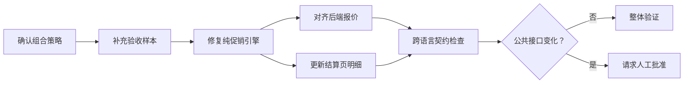

# 第 3 章　怎样把“帮我做完”写成可验证意图？

> 预计学习时间：55–70 分钟  
> 一句话总结：任务契约把一句需求拆成目标、范围、不变量、验收证据和停止条件，让智能体知道该做什么，也知道何时不能继续猜。

## 一句真实得不能再真实的需求

星桥商城准备上线年中促销，产品经理写下：

> 支持会员折扣和优惠券叠加，结算页把优惠写清楚，尽快上线。

人类工程师会追问：哪些优惠能叠加？门槛按原价还是折后价？特价商品怎么算？前端预览和后端结算谁说了算？“写清楚”要显示几层明细？

智能体也需要这些答案。区别在于，人可以在会议上临时补齐上下文，智能体往往会把没写出来的部分补成一个看似合理的版本。它可能让所有优惠无条件叠加，页面金额对了，订单金额却没变。

这不是措辞不够漂亮，而是意图还不能验证。

## 任务契约不是长提示词

[[task contract]]（任务契约）是一份可执行的工作说明。它把业务意图连接到代码边界、验证方法和停止条件。形式可以是 Markdown、JSON、工单字段或结构化表单，重点不在格式，而在每个决定能否被检查。

一份最小任务契约通常回答八个问题：

| 字段 | 要回答的问题 | 星桥商城示例 |
| --- | --- | --- |
| 目标 | 用户行为发生什么变化？ | 会员折扣与订单券按显式策略组合，并显示价格明细 |
| 范围 | 哪些模块和用户路径在内？ | 结算预览、共享促销引擎、后端报价 |
| 非目标 | 哪些事本次不做？ | 不接真实支付，不重做活动后台 |
| 输入与输出 | 接收什么，返回什么？ | 购物车与策略输入；分项金额和应付金额输出 |
| 不变量 | 哪些规则不能被实现自由破坏？ | 金额使用整数分，后端报价是订单事实 |
| 验收场景 | 哪些例子必须得到什么结果？ | 叠加允许时应付 66820 分；禁用时 73020 分 |
| 失败处理 | 条件不满足时怎样返回？ | 策略缺失时拒绝报价，不静默选择默认值 |
| 停止条件 | 何时转人工或缩小任务？ | 需要改公共接口或影响范围超出三个消费者 |

长提示词也可能包含这些内容，但任务契约多了两层约束：它是可版本化的项目事实，可以被测试、脚本和人工审核共同读取；它还明确写出失败和停止，不假设任务一定能顺利完成。

## 先把事实和选择分开

写契约时，最容易把三类内容混在一起：

- 已确认事实：金额以分存储，后端报价决定订单应付金额。
- 本次选择：会员折扣和订单券是否允许叠加，由活动策略字段控制。
- 尚未确认：退款时是否重放下单时的策略版本。

如果把“尚未确认”写成要求，智能体会替业务做决定。更好的做法是把它列入开放问题，并给出阻塞范围：本章任务不修改退款路径；若共享促销引擎的改动会影响退款，停止并列出消费者。

这就是 [[reliable stop]]（可靠停止）。停止不是失败报告里的客套话，而是对证据不足的正常处理。

## 把原始需求改成任务契约

实验仓库已经给出完整版本：[优惠叠加任务契约](../labs/commerce-harness-lab/harness-overlay/specs/promotion-stacking.md)。先看其中最重要的部分：

```text
目标：前端预览和后端报价执行同一套显式组合策略。

范围：storefront、promotion-engine、commerce-api 的报价记录与测试。

不变量：
- 金额使用整数分。
- 特价商品不再应用会员商品折扣。
- 后端报价仍是订单事实。

验收：
- 允许叠加，应付 66820 分。
- 禁止叠加，应付 73020 分。
- 特价商品无订单券，应付 81000 分。

停止：
- 必须改变公共接口才能兼容。
- 共享包影响到范围外消费者。
- JavaScript 与 Java 的验收金额不一致。
```

三个具体数字比“金额正确”更有用。它们让测试可以先失败，再随着实现修复变为通过。停止条件也避免智能体为了凑出绿色测试，顺手改变接口或删掉断言。

## 验收场景要覆盖边界，不只覆盖顺利路径

验收场景不是把需求换成 Given/When/Then 就结束。它需要覆盖任务真正容易出错的分界线。

优惠叠加至少有四类分界：

| 分界 | 正常例 | 反例或边界例 |
| --- | --- | --- |
| 用户资格 | 会员商品折扣生效 | 非会员不应用 |
| 商品状态 | 普通商品参加会员折扣 | 特价商品不重复参加 |
| 组合策略 | 明确允许时叠加 | 明确禁止时只保留一种 |
| 金额门槛 | 折后仍达到门槛 | 折后低于门槛 |

再加一条跨系统契约：同一购物车与策略输入，JavaScript 预览和 Java 报价必须返回相同分项金额。它能抓住“页面看起来对、订单实际不对”这种真实故障。

## 让任务图显出依赖和人工闸门

复杂任务不要只写一串步骤。先标出依赖，智能体才不会在策略未确认时开始改 UI。



任务图不需要复杂调度器。一张可读的 Mermaid 图或一份带依赖的清单，已经能减少顺序错误。后续第 11 章会讨论什么时候才需要并行和多智能体。

## 用结构化格式连接工具

当任务契约需要被脚本读取，可以抽出稳定字段。下面只是教学示例，不要求所有团队采用同一 schema。

```json
{
  "taskId": "promotion-stack-01",
  "scope": ["storefront", "promotion-engine", "commerce-api:pricing"],
  "invariants": ["money-in-cents", "backend-authoritative"],
  "acceptanceCases": ["P1", "P2", "P3"],
  "approvalRequiredFor": ["public-api", "new-consumer", "dependency-upgrade"],
  "stopWhen": ["source-conflict", "cross-language-mismatch"]
}
```

结构化的好处是能做缺字段检查。代价是容易把尚未稳定的业务讨论过早固定成 schema。先用 Markdown 把问题讲清楚，字段重复出现后再结构化，通常更省事。

## 常见误区

### 把实现步骤写得很细，却不写用户结果

“修改 `calculateCart`，新增三个函数”限制了实现，却没有说明用户应看到什么。任务契约先写行为和证据，只有架构边界确定时才限制具体文件。

### 只写成功条件

真实任务会遇到来源冲突、权限不足、依赖不可用和影响面失控。没有失败处理，智能体最常见的选择就是继续猜。

### 用“保持兼容”代替兼容定义

兼容谁、哪种输入、哪个响应字段、哪条历史路径，都需要具体例子。“不影响现有功能”无法自动验证。

### 把所有风险都设成人工批准

审批太多会让系统停在每一步。只有组织需要承担风险的决定进入人工闸门；格式、单元测试和局部实现应由机械检查处理。

## 本章练习：改写库存需求

原始需求是：

> 下单时别超卖，支付超时后把库存还回来，网络重试也不能重复扣库存。

请写一份最小任务契约，至少包含目标、范围、四条不变量、五个验收场景和两个停止条件。可以参考实验仓库的[业务简报](../labs/commerce-harness-lab/case/business-brief.md)，但不要直接抄参考实现。

### 参考答案与判分

合格答案应出现以下关系：

- reserve、claim、release 是不同状态转换。
- 相同幂等键和相同请求返回第一次结果。
- 相同键与不同请求体形成冲突，不能被当成重试。
- 库存不足时不留下部分预占。
- 重复 claim 或 release 不重复改变库存。
- 修改支付回调、账本语义或多仓分配时停止并请求批准。

六项中覆盖五项，并且每项都能转成观察或测试，即可通过。只写“加锁”“用 Redis”不算完成，因为那是实现方案，不是行为契约。

## 本章小结

可验证意图由行为、边界和证据组成。目标说明用户结果，范围和非目标控制改动，不变量保护业务底线，验收场景把“正确”变成具体输入输出，停止条件阻止系统在证据不足时继续猜。

下一章会处理另一个常见落差：契约已经写清，智能体怎样在一个历史仓库里找到真正相关的代码和规则。

上一章：[模型、agent loop 与 harness](./02-model-agent-loop-and-harness.md)  
下一章：[智能体怎样读懂项目？](./04-agent-legible-repository.md)  
术语复习：[术语表](../reference/glossary.md)

## 参考文献

- Ryan Lopopolo. [Harness engineering: leveraging Codex in an agent-first world](https://openai.com/index/harness-engineering/). OpenAI, 2026-02-11.
- OpenAI. [How evals drive the next chapter in AI for businesses](https://openai.com/index/evals-drive-next-chapter-of-ai/). 2025-11-19.
- Shopify Developers. [DiscountCombinesWith](https://shopify.dev/docs/api/admin-graphql/latest/objects/DiscountCombinesWith). 访问于 2026-07-10.
