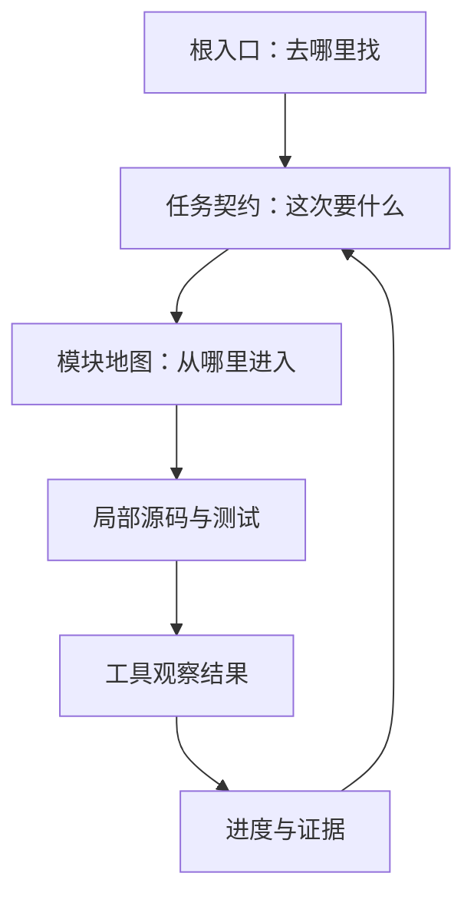

# 第 4 章　智能体怎样读懂项目？

> 预计学习时间：60–75 分钟  
> 一句话总结：智能体可读的仓库不是把所有资料塞进上下文，而是让事实有入口、有来源、有新鲜度，并能按任务裁剪成最小有效上下文。

## 搜到 83 个文件之后

失败轨迹里，智能体搜索 `discount`，得到 83 个匹配。搜索工具工作正常，结果也没有造假，智能体仍然选错了文件。

问题是搜索回答了“哪里出现这个词”，没有回答：当前结算页从哪个入口加载？哪个促销实现仍在使用？共享包有哪些消费者？历史文档是否已经过期？

让智能体读懂仓库，先要把“仓库里有信息”和“当前任务能发现可信信息”区分开。

## 三类信息不要混成一份大文档

一个项目通常同时存在三类内容：

| 类型 | 例子 | 生命周期 |
| --- | --- | --- |
| 稳定事实 | 模块职责、依赖方向、公共接口 | 随架构变化更新 |
| 任务指令 | 允许修改路径、验证命令、审批点 | 随任务变化 |
| 运行状态 | 已完成步骤、测试结果、未解决风险 | 每轮执行更新 |

把三者都写进根目录说明，文件很快会变长。更麻烦的是，旧任务状态会伪装成稳定事实。一个短入口更适合做导航：告诉智能体该去哪里找架构、任务和进度，而不是复制全部内容。

实验仓库的入口是[仓库地图](../labs/commerce-harness-lab/harness-overlay/docs/index.md)。它不解释每条促销规则，只把问题路由到相应事实源和验证信号。

## 一条事实要带四个属性

当一条结论会影响修改范围时，至少记录：

- fact：结论是什么。
- source reference：它来自哪个文件、接口、测试或负责人决定。
- freshness：来源什么时候更新，是否覆盖当前版本。
- confidence：证据是直接读取、交叉验证，还是暂时推断。

例如：

| 事实 | 来源 | 新鲜度 | 置信度 | 下一步 |
| --- | --- | --- | --- | --- |
| storefront 依赖共享促销引擎 | `apps/storefront/package.json` | 当前工作区 | 高 | 读取实际 import |
| 后端报价决定订单金额 | `docs/architecture.md` 与接口测试 | 2026-07-10 | 高 | 保留后端权威性 |
| 退款页消费共享包 | 搜索命中一个旧入口 | 未确认 | 中 | 查路由与构建清单 |
| 会员折扣可与订单券叠加 | 2024 年旧文档写“待确认” | 过期 | 低 | 读取已批准任务契约 |

来源引用不是为了给每句话加脚注，而是让智能体和审核者能回到证据。新鲜度则回答“曾经为真”和“现在仍为真”的差别。

## 渐进式披露：先给地图，再按需下钻

[[progressive disclosure]]（渐进式披露）让信息分层进入上下文：

1. 根入口给出项目地图、默认命令和高风险边界。
2. 当前任务加载一份任务契约与相关模块入口。
3. 遇到具体问题时再读取局部架构、接口或测试。
4. 运行后只把关键观察和决定写入持久状态。



每一层都应比下一层短。智能体如果一开始就读取所有源码、所有文档和完整日志，上下文会被不相关信息占满，真正重要的限制反而容易丢失。

## Context Pack 是一次任务的最小工作集

本课程用 [[Context Pack]] 指一组经过裁剪、带来源的任务上下文。它不是仓库总结，也不是永久知识库。

优惠叠加任务的 Context Pack 可以包含：

```text
task:
  specs/promotion-stacking.md

facts:
  docs/architecture.md#architecture-boundaries
  starter/packages/promotion-engine/package.json

entrypoints:
  starter/apps/storefront/src/App.jsx
  starter/packages/promotion-engine/src/index.js
  starter/services/commerce-api/.../PricingService.java

validation:
  node --test starter/packages/promotion-engine/test/*.test.js
  npm run build:web
  mvn test

boundaries:
  shared package = notice
  public API = approval
```

它没有收入库存服务、运营后台样式和历史活动截图，因为当前任务不需要。若后续发现退款页也是消费者，再把已核验入口加入，而不是一开始猜测所有影响面。

## 用上下文预算做取舍

上下文预算不是只算 token。还要算注意力：多少来源互相冲突，多少日志需要定位，多少文件对下一步没有作用。

可以用四个问题删减：

- 这份信息会改变下一项行动吗？
- 它是事实、指令，还是只供背景理解？
- 能否用入口替代全文？
- 工具能否在需要时重新读取，而不必长期保留？

测试失败时，优先保留失败测试名、断言差异、关键堆栈和命令环境。几万行完整日志可以作为附件，不必全部回填模型上下文。

## 什么时候应该停止探索

智能体在大仓库里很容易进入“再搜一个文件”的循环。可靠探索需要停止条件：

- 两个同权威来源冲突。
- 当前入口无法证明仍在构建或路由中生效。
- 影响面超过任务契约允许范围。
- 必需的配置或测试入口缺失。
- 只能通过读取敏感数据才能继续。

停止时要返回证据，而不是只说“信息不足”：列出已读来源、冲突点、缺少的决定、可继续的最小问题。这样人才能快速接手。

## 工程加深：生成仓库事实表

仓库事实表不必靠模型自由总结。先用可重复命令收集结构，再由模型解释。

macOS 与 Windows PowerShell 都可以运行：

```bash
node ../labs/commerce-harness-lab/starter/scripts/audit-baseline.mjs
node ../labs/commerce-harness-lab/harness-overlay/scripts/verify-overlay.mjs
```

第一个命令确认 starter 中刻意保留的缺口，第二个命令检查覆盖层是否具备入口、契约、评测和进度文件。命令输出是观察结果，不等于业务判断；它只把缺失项稳定地暴露出来。

## 常见误区

### 把根指令写成百科全书

根文件负责导航和默认规则。详细领域知识应放在局部文档，并有明确所有者和更新信号。

### 把搜索排名当成模块定位

关键词靠近不代表调用路径相关。定位至少要结合入口、依赖、路由或测试。

### 只记录结论，不记录来源

“这个模块已废弃”在半年后很难复核。来源文件、提交、接口或测试让结论可追溯。

### 把 Context Pack 固定成模板

每项任务需要的工作集不同。固定塞入所有架构文档，只是换了一种方式制造噪声。

## 本章练习：为优惠任务做 Context Pack

阅读实验仓库的[业务简报](../labs/commerce-harness-lab/case/business-brief.md)和[starter 架构记录](../labs/commerce-harness-lab/starter/docs/legacy/architecture.md)，完成一张表：

| 项目 | 选择的内容 | 来源 | 为什么需要 | 何时丢弃或刷新 |
| --- | --- | --- | --- | --- |
| 任务契约 |  |  |  |  |
| 稳定事实 |  |  |  |  |
| 入口文件 |  |  |  |  |
| 验证命令 |  |  |  |  |
| 边界 |  |  |  |  |

### 自检标准

- 是否排除了库存服务等无关模块？
- 是否把 2024 年旧规则标成低新鲜度，而不是当前事实？
- 是否能从每个入口回到实际文件？
- 是否有共享包 notice 和公共接口 approval？
- 是否写出两种可靠停止情况？

五项全部满足，可以认为 Context Pack 已具备任务价值。

## 本章小结

智能体可读性来自信息组织，不来自文档数量。短入口负责导航，稳定事实带来源和新鲜度，任务契约控制本轮目标，运行状态独立保存。Context Pack 再从这些来源中裁剪当前任务需要的最小工作集。

下一章会在 starter 仓库上真正走一遍存量改造：怎样定位入口、控制共享影响面，并把失败信号接回执行循环。

上一章：[怎样把“帮我做完”写成可验证意图？](./03-verifiable-intent-contract.md)  
下一章：[怎样改造一个已有企业仓库？](./05-retrofit-existing-enterprise-repository.md)  
术语复习：[术语表](../reference/glossary.md)

## 参考文献

- Ryan Lopopolo. [Harness engineering: leveraging Codex in an agent-first world](https://openai.com/index/harness-engineering/). OpenAI, 2026-02-11.
- matklad. [ARCHITECTURE.md](https://matklad.github.io/2021/02/06/ARCHITECTURE.md.html). 2021-02-06.
- [AGENTS.md open format](https://agents.md/). 访问于 2026-07-10.
