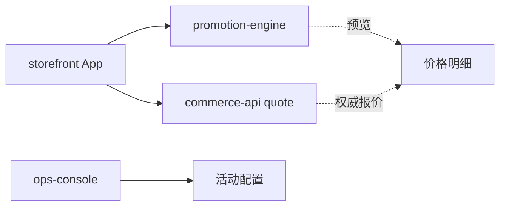

# 第 5 章　怎样改造一个已有企业仓库？

> 预计学习时间：65–80 分钟  
> 一句话总结：存量仓库改造先定位真实入口和影响边界，再用最小覆盖层补任务契约、验证信号与可靠停止，而不是重写整个项目。

## 先接受仓库不整齐

打开[星桥商城实验仓库](../labs/commerce-harness-lab/index.html)的 `starter/`，你会看到两个 React 应用、一个共享促销包和一个 Spring Boot 服务。旧文档说前端可以独立预估价格，后端也有自己的促销实现；组合规则还写着“待产品确认”。

这就是存量仓库的常态：代码能运行，知识却没有收敛到一个地方。Harness 改造的第一步不是创建一套完美目录，而是确认当前任务会经过哪些真实入口。

## 第一步：建立基线，不要急着修

先运行基线检查：

```bash
cd courses/harness-engineering/labs/commerce-harness-lab/starter
node scripts/audit-baseline.mjs
node --test packages/promotion-engine/test/*.test.js
```

审计应发现四个设计缺口。Node 测试中“策略禁止叠加”会失败，这是课程刻意保留的基线故障。先保存命令、退出码和失败断言，后面才能证明改造真的改变了行为。

不要为了得到绿色结果删掉失败测试。失败测试就是任务事实的一部分。

## 第二步：沿运行路径定位，而不是沿词面定位

优惠叠加的运行路径是：



需要核验的事实包括：

1. `storefront` 是否真的 import 共享促销引擎。
2. 后端报价是否由 `PricingService` 计算。
3. `ops-console` 当前是否写入组合策略，还是只展示静态数据。
4. 共享包还有没有范围外消费者。

只有前两项能直接从当前 starter 证明。第三项尚未实现，第四项需要继续扫描 workspace。这里应把“未知”保留下来，不能补成确定结论。

## 第三步：给路径分级

用 allowed、notice、approval 和 blocked 四级控制修改：

| 级别 | 星桥商城范围 | 系统行为 |
| --- | --- | --- |
| allowed | 当前任务 spec、局部测试、storefront 展示 | 可修改并自动验证 |
| notice | 共享促销包、Java 报价记录、多个应用 | 修改前列出消费者与影响 |
| approval | 公共 API、依赖升级、支付或库存语义 | 暂停并请求负责人决定 |
| blocked | 凭证、真实数据、跳过测试、削弱断言 | 拒绝执行并记录原因 |

notice 不是审批。它要求智能体先把影响面说清，再继续执行。这样既不会因为共享包而处处停顿，也不会静默扩大范围。

## 第四步：铺一层最小 Harness

实验仓库的 [harness-overlay 入口](../labs/commerce-harness-lab/harness-overlay/AGENTS.md) 包含：

- `AGENTS.md`：短入口、默认验证与边界。
- `docs/index.md`：问题到事实源的地图。
- `specs/`：两个已确认任务契约。
- `plans/current-task.md`：顺序与审批点。
- `evals/cases.json`：稳定的行为样本。
- `state/progress.md`：跨会话进度和证据。
- `scripts/verify-overlay.mjs`：无依赖结构检查。

运行：

```bash
cd courses/harness-engineering/labs/commerce-harness-lab/harness-overlay
node scripts/verify-overlay.mjs
```

通过只说明覆盖层结构完整，不说明业务实现已经正确。结构检查和行为测试要分开。

## 第五步：先修纯规则，再修界面

共享促销引擎中有一行注释，明确指出实现没有读取 `allowMemberWithOrderCoupon`。修复可以很小：

```javascript
const canUseOrderCoupon =
  couponEligible &&
  (memberDiscount === 0 || policy.allowMemberWithOrderCoupon);

const orderDiscount = canUseOrderCoupon ? 5000 : 0;
```

先让纯函数的三个验收样本通过，再更新 React 展示。这样一旦金额不对，问题集中在业务规则；界面只负责显示分项结果。

Java 端也要实现同一策略。课程不建议让浏览器和 Java 共享源码，而是让两边共享行为契约与验收样本。跨语言一致性靠相同输入输出验证，不靠复制文件。

## 第六步：把工具输出变成可行动反馈

下面两种输出都来自测试命令，价值不同：

```text
tests failed
```

```text
case: promotion-no-stack
expected payable: 73020
actual payable: 68020
policy: allowMemberWithOrderCoupon=false
next check: ORDER_COUPON branch in promotion-engine
```

第二种输出让智能体知道失败属于哪条业务规则、期望和实际差多少、下一步去哪里看。错误信息不必替智能体完成推理，但要给它足够证据采取新行动。

## 第七步：定义完成证据

存量改造至少留下：

| 证据 | 为什么需要 |
| --- | --- |
| 修改前失败记录 | 证明问题可复现 |
| 任务契约版本 | 证明实现依据 |
| 影响文件与消费者 | 控制共享改动范围 |
| JavaScript 与 Java 测试 | 检查两条实现路径 |
| 两个 React 构建 | 检查共享包没有破坏消费者 |
| 剩余风险 | 说明哪些路径没有验证 |

如果本机没有 Java 环境，应明确写“Java 测试未运行”，而不是用源码看起来正确代替测试通过。可靠停止比虚假的完成更有价值。

## 常见误区

### 先生成几十份文档

文档没有真实任务牵引，很快变成无人维护的模板。先围绕一个高频失败补入口、契约和验证。

### 把旧代码都改成新风格

Harness 改造不是顺手重构。范围越大，越难判断哪项改动修复了问题。

### 把共享包设成永久禁止修改

共享包可能确实需要修。更合理的控制是 notice、消费者分析和跨应用回归。

### 只留下最终 diff

没有基线失败、命令和风险记录，审核者无法判断 diff 是否真的满足任务。

## 本章练习：设计一份改造计划

阅读[失败轨迹 A](../labs/commerce-harness-lab/case/failure-traces.md)和[促销任务契约](../labs/commerce-harness-lab/harness-overlay/specs/promotion-stacking.md)，写出 6–10 步改造计划。每一步标明：输入证据、允许路径、验证命令、失败后的下一步。

### 通过标准

- 修改实现前先保存失败基线。
- 先处理纯促销规则，再处理 React 展示。
- 共享包修改触发消费者检查。
- JavaScript 与 Java 使用相同验收样本。
- 至少有一个可靠停止条件。
- 最终证据包含未验证项。

六项全部出现，计划即可进入工程执行。

## 本章小结

存量仓库的 Harness 改造从事实收敛开始。先复现失败，沿运行路径找到真实入口，再用分级边界控制影响面。最小覆盖层补上任务契约、仓库地图、验证样本和进度状态；实现则从纯规则和最小 diff 开始。

下一章换一个起点：没有历史代码时，怎样从第一天建立足够用、又不过度设计的 agent-first 仓库。

上一章：[智能体怎样读懂项目？](./04-agent-legible-repository.md)  
下一章：[怎样从零建设 agent-first 新仓库？](./06-build-agent-first-repository.md)  
术语复习：[术语表](../reference/glossary.md)

## 参考文献

- Ryan Lopopolo. [Harness engineering: leveraging Codex in an agent-first world](https://openai.com/index/harness-engineering/). OpenAI, 2026-02-11.
- Shopify Developers. [DiscountCombinesWith](https://shopify.dev/docs/api/admin-graphql/latest/objects/DiscountCombinesWith). 访问于 2026-07-10.
- Shopify Developers. [Discount Function support for rejecting discount codes](https://shopify.dev/changelog/discount-rejection-support-for-discount-functions). 2025-12-17.
