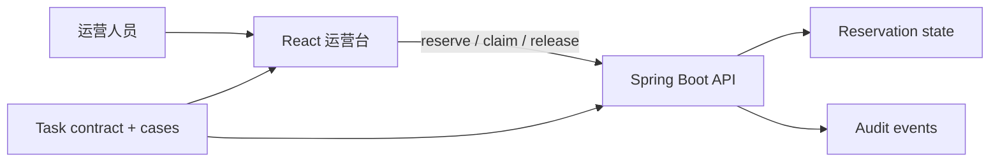
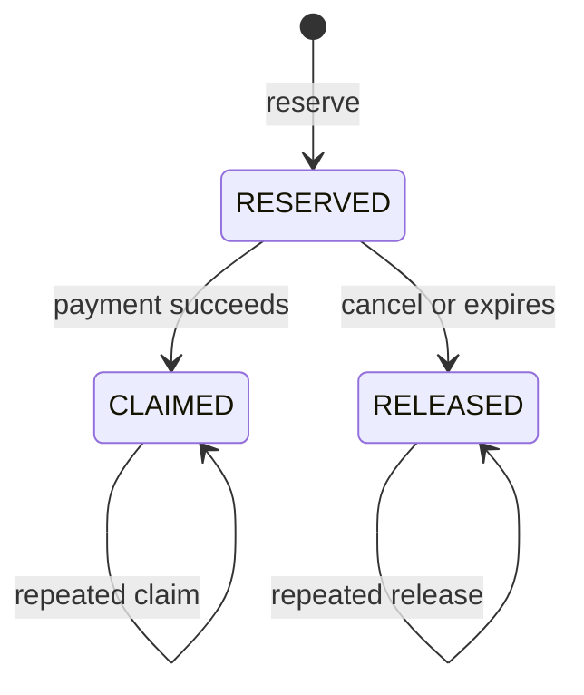

# 第 6 章　怎样从零建设 agent-first 新仓库？

> 预计学习时间：65–85 分钟  
> 一句话总结：新仓库先建立一条能运行、能验证、能恢复的最小路径，再随着真实失败增加边界和工具，不要在第一行业务代码之前造一座平台。

## 空仓库既轻松，也危险

存量仓库的问题是历史太多。空仓库的问题正相反：没有任何事实。智能体会快速补出目录、依赖和接口，但这些选择未必能延续到第二个功能。

本章从库存预占开始。目标不是搭建生产级电商平台，而是让一个小仓库具备清楚的所有权：React 负责展示和发命令，Spring Boot 负责状态转换，任务契约和验收样本负责定义正确。

实验仓库的 [greenfield 蓝图](../labs/commerce-harness-lab/greenfield/README.md) 是起点。

## 为什么选择这组技术

截至 2026 年 7 月，本课程固定使用：

| 部分 | 选择 | 原因 |
| --- | --- | --- |
| 浏览器应用 | React 19.2 | 主流组件模型，官方稳定版本 |
| 前端构建 | Vite 8.1 | 配置少，开发与构建入口清楚 |
| Node.js | 22 | 稳定 LTS，能运行 Vite 8 与内置测试 |
| Java | 21 | LTS，适合作为企业后端教学基线 |
| Java 框架 | Spring Boot 4.1 | 当前稳定线，Web、验证和测试入口成熟 |
| 构建 | Maven | 企业 Java 中普遍，命令和依赖声明直接 |

版本不是 Harness 的核心。固定版本是为了减少环境歧义。正式项目应按组织支持周期选择，并定期升级；课程不在每次小版本发布后追新。

## 先画所有权，再创建目录



这张图规定两件事：前端不本地计算可售库存，服务端不决定页面排版。验收样本同时约束两端的接口行为。

最小目录可以是：

```text
apps/ops-console/
services/commerce-api/
contracts/
specs/
scripts/
state/
AGENTS.md
```

暂时不拆微服务，不加消息队列，也不引入 Redis。课程先用内存存储看清状态机、幂等和反馈。等测试证明并发或持久性成为瓶颈，再替换基础设施。

## 初始化 React 路径

macOS、Windows PowerShell 和常见终端都可以使用：

```bash
npm create vite@latest apps/ops-console -- --template react
cd apps/ops-console
npm install
npm run dev
```

课程仓库已经提供最小 React 应用，不要求重复生成。实践时至少保留三条命令：

```bash
npm run dev
npm run build
npm test
```

如果项目暂时没有测试，不要创建一个永远返回 0 的假命令。可以明确写 `test: not configured`，并把补测试列为任务前置。

## 初始化 Spring Boot 路径

Java 服务使用 Java 21、Spring Boot 4.1 和 Maven。最小依赖是 Web、Validation 和 Test。运行入口保持简单：

```bash
mvn test
mvn spring-boot:run
```

Windows PowerShell 使用同样命令。如果仓库提供 Maven Wrapper，则使用 `./mvnw`；Windows 使用 `mvnw.cmd`。Wrapper 能固定 Maven 版本，但不能代替 JDK。

一个状态转换接口可以先写成：

```java
public interface ReservationStore {
    Reservation findByIdempotencyKey(String key);
    Reservation save(Reservation reservation);
    int available(String sku);
}
```

内存实现和数据库实现都遵守同一接口。这样教学版本保持轻量，后续又能讨论替换存储时哪些语义不能改变。

## 先把状态机写进契约

库存预占至少有三条路径：



状态图比“别超卖”更接近代码。它仍然需要不变量补充：同键相同请求返回第一次结果，同键不同请求拒绝；库存不足不留下半成品；每次转换写审计事件。

## 新仓库的最小 Harness

第一版只需要六样东西：

1. 一个短入口，说明去哪里找架构、任务和命令。
2. 一份当前任务契约。
3. 一张依赖与所有权图。
4. 一组能失败的验收样本。
5. 一个统一验证入口。
6. 一份跨会话进度记录。

别急着创建几十个 skills、hook 和智能体角色。没有失败样本时，很难判断这些组件是在解决问题，还是只增加维护面。

## 为命令设计稳定输出

统一验证脚本应明确报告每个阶段：

```text
PASS structure: browser does not import server source
PASS javascript: promotion cases 3/3
PASS react: storefront build
PASS react: ops-console build
FAIL java: JDK 21 not found
STOP completion: Java acceptance cases not verified
```

最后一行很重要。部分通过不能被总结成“所有检查通过”。工具应返回结构化结果和非零退出码，让 agent loop 知道是否继续。

## 从第二个功能开始检验架构

第一个功能往往看不出架构问题。加入优惠叠加后，检查：

- 是否需要让库存服务知道优惠规则？通常不需要。
- React 是否开始复制后端状态转换？不应该。
- 两个任务是否能共享金额、时间和错误码约定？可以共享 contract，不必共享所有源码。
- 是否出现多个验证入口？应收口到一个脚本或一组可组合命令。

如果第二个功能只能靠跨层 import 才能快速完成，说明边界写得不够清楚，或者工具没有提供合适接口。

## 常见误区

### 把 agent-first 理解成“让智能体决定全部架构”

Agent 可以提出方案，团队仍要决定所有权、风险和长期成本。架构决定应有证据和人工责任人。

### 一开始就模拟大厂生产架构

课程案例借鉴现实问题，不复制生产规模。为两条业务规则搭建十个服务，只会掩盖状态语义。

### 版本永远写 latest

初始化时用 latest 可以，进入课程或生产基线后应固定版本和锁文件，否则同一命令在不同日期得到不同项目。

### 只有 happy path 测试

库存系统真正困难的是重试、冲突、重复转换和超时。正常预占成功只能证明最短路径可用。

## 本章练习：设计第一天的仓库

不用写完整代码。为 greenfield 库存任务提交：

- 目录树。
- 一张所有权图。
- 根入口的 10–20 行草稿。
- 五个验收样本。
- 一个统一验证输出示例。
- 两个需要人工批准的变化。

### 自检标准

目录能说明职责；状态由 Java 服务拥有；React 不复制库存计算；验收覆盖重复与冲突；验证能报告部分失败；基础设施升级需要审批。六项全部满足即可通过。

## 本章小结

新仓库的优势是可以从第一天写清所有权和完成条件。先用单服务、纯规则和小型 React 页面跑通一条闭环，再让真实失败推动工具、边界和基础设施增长。

下一章关注智能体真正行动的接口：什么样的工具输出能帮助它纠错，什么样的工具只会扩大风险。

上一章：[怎样改造一个已有企业仓库？](./05-retrofit-existing-enterprise-repository.md)  
下一章：[什么工具能让智能体真正行动？](./07-tools-for-reliable-action.md)  
术语复习：[术语表](../reference/glossary.md)

## 参考文献

- React Team. [React 19.2](https://react.dev/blog/2025/10/01/react-19-2). 2025-10-01.
- Vite Team. [Vite 8.1 is out](https://vite.dev/blog/announcing-vite8-1). 2026-06-23.
- Spring. [Spring Boot CLI and stable versions](https://docs.spring.io/spring-boot/cli/). 访问于 2026-07-10.
- Shopify Engineering. [We replaced Redis with MySQL for inventory reservations—and it scaled](https://shopify.engineering/scaling-inventory-reservations). 2026-05-12.
