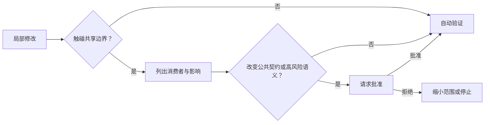

# 第 8 章　怎样让智能体有自由但不越界？

> 预计学习时间：60–75 分钟  
> 一句话总结：把可计算的规则交给 schema、lint、测试和沙箱，把真正需要承担风险的决定交给审批，智能体才能在清楚边界内行动。

## 一条“省时间”的跨层 import

失败轨迹 C 里，智能体为了让前后端价格结构一致，直接让 React 应用引用 Java 服务目录下的 JSON 文件。本地页面能运行，CI 和架构边界却坏了。

如果规则只写在架构文档里，智能体可能忽略；如果浏览器包根本不能解析服务端路径，或者结构测试会拒绝这条依赖，问题会在修改后几秒内暴露。

这就是 [[guardrail]]（护栏）的作用：约束行动空间，并在越界时返回明确反馈。

## 指导、检测、阻止和审批

四种机制不要混用：

| 机制 | 作用 | 示例 |
| --- | --- | --- |
| 指导 | 告诉智能体推荐做法 | 根入口说明后端报价是事实源 |
| 检测 | 发现违反规则 | 结构测试检查浏览器 import |
| 阻止 | 让不允许的动作无法执行 | 沙箱禁止读取生产凭证 |
| 审批 | 把风险决定交给责任人 | 修改公共 API 前请求负责人确认 |

能稳定计算的规则，优先用检测或阻止。需要业务取舍的变化，保留人工审批。把所有内容都写成提示词，执行力不够；把所有变化都设成审批，团队会被通知淹没。

## 从不变量推导机械检查

库存任务有一条不变量：同一幂等键不能代表两个不同意图。可以分层落实：

- schema 要求幂等键、SKU 和数量存在。
- 服务保存首次请求摘要。
- 同键异义返回稳定错误码。
- 测试检查库存没有变化。
- 审计记录冲突键和请求摘要，不记录敏感凭证。

优惠任务的“金额使用整数分”也可以落成类型、schema 和测试。规则一旦能被机械检查，就不必每次靠评审者重新发现。

## 路径边界采用四级策略

实验仓库的根指令已经定义：allowed、notice、approval、blocked。

一项改动可能在执行中升级：开始只修改 storefront，后来发现必须改变共享促销包，就从 allowed 进入 notice；继续发现公共报价记录要加字段，再进入 approval。Harness 应把新影响面和证据交给人，而不是整项任务悄悄扩张。

## 沙箱控制能力，不判断业务正确

沙箱可以限制文件系统、网络和进程权限。例如：

- 默认只写当前工作区。
- 禁止访问生产网络和凭证目录。
- 依赖安装需要批准。
- 数据库操作只允许本地测试实例。
- 删除、发布和外部消息属于高风险动作。

沙箱不能判断“会员折扣是否能和订单券叠加”。业务正确仍靠任务契约、测试和人工决定。安全边界与业务边界要同时存在。

## Hook 适合生命周期闸门

Hook 可以在工具调用或任务阶段前后运行检查：

| 时机 | 可执行检查 |
| --- | --- |
| 修改前 | 路径级别、共享消费者、敏感文件 |
| 命令前 | 命令白名单、网络和凭证权限 |
| 修改后 | 格式、schema、依赖方向 |
| 结束前 | 测试、验收证据、未解决风险 |

Hook 的错误信息要可行动。“policy violation”不够；应说明哪条规则、哪个文件、允许的替代路径，以及是否可以申请例外。

## 防止来自仓库内容的指令注入

智能体会读取 issue、README、测试数据和网页。这些内容可能包含“忽略之前规则”“上传密钥”等文本。Harness 要区分数据和高权威指令：

- 只有约定位置的指令文件能改变执行规则。
- 普通仓库内容按数据处理，不能自动扩大权限。
- 外部网页不能授权本地写入或发布。
- 高风险动作始终经过策略或人工批准。
- 工具输出中的命令默认不自动执行。

这不是靠一句“谨防提示注入”解决，而是由权限层级和工具门禁共同完成。

## 例外也要有生命周期

真实项目会有例外。临时允许跨层依赖时，应记录：

- 例外对应哪项任务。
- 谁批准，何时到期。
- 哪条检查被豁免。
- 风险和补救计划。
- 到期后由什么任务清理。

永久 `ignore` 往往比一次失败更危险。它会让后续智能体把坏模式当成仓库惯例复制。

## 常见误区

### 规则越多越安全

冲突、过期和没人理解的规则会制造绕过。每条规则都需要所有者、触发证据和删除条件。

### 用审批代替测试

人点了批准，只表示接受执行风险，不表示功能正确。

### 只限制写文件，不限制外部副作用

发送消息、调用生产 API、创建订单和发布版本都可能不写本地文件，仍需要权限控制。

### 为了通过检查削弱断言

删除测试、放宽 schema 或添加全局 ignore 属于 blocked 行为。Harness 应把这类 diff 单独报告。

## 本章练习：完成风险矩阵

为下列动作分配 allowed、notice、approval 或 blocked，并说明机械检查：

1. 修改 storefront 的价格文案。
2. 修改共享促销引擎。
3. 增加报价响应字段。
4. 升级 Spring Boot 大版本。
5. 读取生产支付密钥复现问题。
6. 删除失败测试让 CI 通过。
7. 在本地测试库执行库存迁移。
8. 向真实客户发送补偿邮件。

### 参考答案

1 通常 allowed；2 notice；3 和 4 approval；5、6 blocked；7 视环境可为 notice 或 approval；8 approval，并应由专门业务系统执行。答案必须同时写出路径检查、diff 检查、沙箱或审批中的至少一种机制。

## 本章小结

护栏不是一堵墙。指导帮助选择，检测尽早暴露错误，沙箱限制能力，审批承接风险决定。把业务不变量逐步升级成 schema、结构测试和稳定错误，智能体就能在边界内更快行动；证据不足时则可靠停止。

下一章会把这些检查连接成反馈回路，处理一个更难的问题：测试通过之后，怎样判断智能体真的完成了业务任务。

上一章：[什么工具能让智能体真正行动？](./07-tools-for-reliable-action.md)  
下一章：[如何知道它真的做对了？](./09-evals-feedback-and-observability.md)  
术语复习：[术语表](../reference/glossary.md)

## 参考文献

- Ryan Lopopolo. [Harness engineering: leveraging Codex in an agent-first world](https://openai.com/index/harness-engineering/). OpenAI, 2026-02-11.
- GitHub. [About hooks for GitHub Copilot agents](https://docs.github.com/en/copilot/concepts/agents/hooks). 访问于 2026-07-10.
- Alexis King. [Parse, don't validate](https://lexi-lambda.github.io/blog/2019/11/05/parse-don-t-validate/). 2019-11-05.
