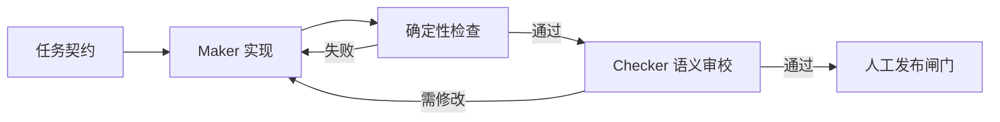

# 第 9 章　如何知道它真的做对了？

> 预计学习时间：65–80 分钟  
> 一句话总结：测试检查已知规则，评测检查任务行为，日志和轨迹解释过程；只有检测结果能回到下一轮修改，才形成真正的反馈回路。

## 绿色测试也可能是假完成

智能体修复优惠叠加测试后，报告“全部通过”。但它只运行了共享包测试，没有构建两个 React 应用，也没有运行 Java 报价测试。绿色是真的，结论是假的。

完成判断需要回答三个问题：

- 检查覆盖了任务契约里的哪些行为？
- 哪些检查真正运行过，结果和环境是什么？
- 没覆盖的风险是否被明确留下？

“有测试”和“有足够完成证据”不是一回事。

## 四种反馈各管一层

| 反馈 | 主要回答 | 星桥商城例子 |
| --- | --- | --- |
| 单元与结构测试 | 局部规则是否满足 | 金额以分计算，浏览器不依赖 Java 源码 |
| 验收测试 | 用户行为是否符合契约 | 禁止叠加时应付 73020 分 |
| eval | 智能体能否稳定完成一类任务 | 给出失败轨迹后能否定位到共享策略而不越界 |
| 人工审校 | 取舍、解释和风险是否可接受 | 优惠说明是否让客服和顾客看得懂 |

[[eval]]（评测）不是单元测试的新名字。它通常以任务、环境、允许动作和评分证据组成，检查模型与 harness 共同表现。多轮智能体还要观察过程，因为最终答案正确不代表中途没有越权、误改或泄露。

## 从任务契约生成评测样本

实验仓库的 [eval cases](../labs/commerce-harness-lab/harness-overlay/evals/cases.json) 包含三个样本。每个样本有任务、期望结果和必需证据。

一个库存样本可以写成：

```json
{
  "id": "inventory-idempotent-retry",
  "task": "网络响应丢失后，用相同幂等键重试预占",
  "expected": {
    "reservationCount": 1,
    "available": 1,
    "sameReservationId": true
  },
  "requiredEvidence": ["java-test", "transition-log"]
}
```

样本没有要求使用 Redis、锁或某个类名。它约束业务结果和证据，保留实现空间。

## 先做错误分类，再谈分数

单一总分很难指导改进。把失败分成可行动类别：

| 类别 | 表现 | 优先修哪里 |
| --- | --- | --- |
| 意图遗漏 | 忘记特价商品边界 | 任务契约与验收样本 |
| 定位错误 | 修改旧入口 | 仓库地图与 Context Pack |
| 越界 | 绕过共享包门禁 | 权限和结构检查 |
| 工具误用 | 对业务拒绝无限重试 | 错误分类和工具说明 |
| 验证不足 | 只跑局部测试 | 完成条件和统一验证入口 |
| 状态丢失 | 恢复后重做或改变决定 | 持久进度与交接 |

同一错误连续出现三次，通常应该改 harness；偶发的推理错误则可能需要模型、示例或任务分解调整。

## 评价表要有可观察锚点

当结果不能只用精确值判断，可以使用 [[rubric]]（评价量规）。例如评审一份库存任务契约：

| 维度 | 0 分 | 1 分 | 2 分 |
| --- | --- | --- | --- |
| 状态完整 | 没有状态 | 有 reserve/claim | 含 release、终态和非法转换 |
| 幂等语义 | 未提及 | 同键能重试 | 同键同义重放、异义冲突 |
| 完成证据 | 只写“测试通过” | 有命令 | 有命令、结果、环境与未覆盖项 |
| 风险边界 | 无 | 有泛化提醒 | 明确审批动作和可靠停止 |

评价表必须能指向产物证据。若标准只有“高质量”“完整”“专业”，不同审校者会按印象打分，智能体也不知道怎样修改。

## Maker-checker：生成者不要独占结论

让同一个智能体生成实现、解释结果并宣布完成，容易把自己的假设带进审校。可以把流程拆成：

1. maker 根据任务契约实现并提供证据。
2. checker 在较干净的上下文中读取契约、diff 和结果。
3. 确定性检查先运行，语义审校再判断行为与风险。
4. 失败证据返回 maker，进入下一轮。



checker 不一定是另一个模型。它可以是脚本、测试、代码所有者或组合。重点是结论有独立证据。

## 日志、指标与轨迹各有用途

- 日志记录发生了什么，例如状态转换和错误原因。
- 指标用于比较趋势，例如任务成功率、人工接管率、重试次数。
- 轨迹保留智能体看到了什么、调用了哪些工具、为何停止。

库存预占至少记录：reservationId、idempotencyKey 的安全摘要、SKU、数量、前后状态、原因、时间和调用结果。不要把支付凭证或客户隐私写入轨迹。

## 一组够用的团队指标

| 指标 | 计算方式 | 能发现什么 |
| --- | --- | --- |
| 首轮验收通过率 | 首轮通过任务数 / 总任务数 | 意图和环境是否足够清楚 |
| 返工轮次 | 每任务修改循环次数 | 反馈是否可行动 |
| 人工接管率 | 转人工任务数 / 总任务数 | 自治边界是否合适 |
| 越界拦截率 | 被规则阻止的越界 / 越界尝试 | 门禁是否生效 |
| 回归逃逸率 | 发布后发现的回归 / 已完成任务 | 验收覆盖是否不足 |

指标用来找问题，不用来逼智能体刷分。只追求首轮通过率，团队可能降低任务难度或删掉失败样本。

## 常见误区

### 把测试数量当质量

一百条重复 happy path，不如一条能抓住同键异义的边界测试。

### 只看最终文件

最终 diff 正确，中途仍可能读取敏感数据或执行危险命令。高风险任务需要轨迹级检查。

### 让评价表追着当前实现写

如果每次失败都修改标准来适配结果，评测失去约束力。标准变化也要版本化和审核。

### 失败只返回一个分数

分数不能驱动下一步。报告要指出样本、证据、失败类别和建议检查位置。

## 本章练习：设计一个小型 eval

从优惠或库存任务中选一个，提交：任务输入、初始仓库状态、允许动作、三个验收样本、一个越界样本、必需证据、错误分类和通过阈值。

### 通过标准

至少一个样本检查正常路径，一个检查重试或组合边界，一个检查失败不留副作用；越界样本不能只看最终答案；报告能定位下一项 harness 改进。

## 本章小结

质量闭环从任务契约开始，经测试、评测、日志和独立审校回到下一轮修改。测试告诉你具体规则是否满足，eval 检查一类任务是否稳定完成，轨迹揭示过程风险，人工负责仍需判断的取舍。

下一章会处理跨小时任务：当上下文压缩、进程中断或人员交接发生时，怎样保留足够状态继续工作。

上一章：[怎样让智能体有自由但不越界？](./08-guardrails-permissions-and-approval.md)  
下一章：[任务跑几小时，怎样不失忆？](./10-long-running-state-and-recovery.md)  
术语复习：[术语表](../reference/glossary.md)

## 参考文献

- OpenAI. [How evals drive the next chapter in AI for businesses](https://openai.com/index/evals-drive-next-chapter-of-ai/). 2025-11-19.
- Anthropic. [Demystifying evals for AI agents](https://www.anthropic.com/engineering/demystifying-evals-for-ai-agents). 2026-01-09.
- Shopify Engineering. [We replaced Redis with MySQL for inventory reservations—and it scaled](https://shopify.engineering/scaling-inventory-reservations). 2026-05-12.
