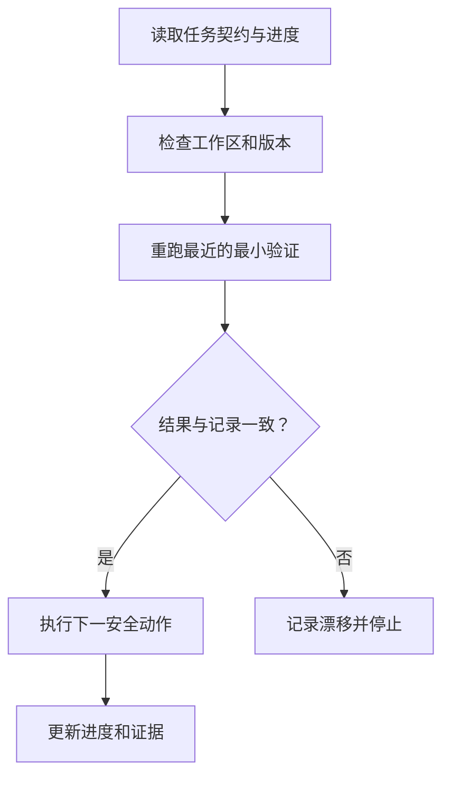

# 第 10 章　任务跑几小时，怎样不失忆？

> 预计学习时间：55–70 分钟  
> 一句话总结：长任务依靠仓库里的计划、决策、进度和证据继续运行；聊天历史只是临时上下文，不能承担唯一记忆。

## 会话恢复后，规则变了

失败轨迹 D 中，智能体已经确认优惠叠加规则并补了测试。上下文压缩后，新一轮只看到原始需求，于是重新解释业务，把“特价商品”改成完全不能参加任何优惠。

问题不是压缩本身。系统没有把已确认决定写入稳定状态，也没有给恢复过程一个入口。

## 哪些内容必须离开聊天

长任务至少持久保存：

| 内容 | 示例 | 更新时机 |
| --- | --- | --- |
| 任务契约 | 叠加策略和验收金额 | 需求确认后 |
| 当前计划 | 下一步先修纯规则 | 计划变化时 |
| 已确认决定 | 门槛按折后金额 | 决定形成时 |
| 修改摘要 | 已改哪些文件及原因 | 每个检查点 |
| 运行证据 | 命令、退出码、失败样本 | 每次验证后 |
| 未解决风险 | Java 环境缺失 | 新风险出现时 |
| 下一安全动作 | 先补同键异义测试 | 暂停或交接前 |

实验仓库的 [progress.md](../labs/commerce-harness-lab/harness-overlay/state/progress.md) 就是一个简单载体。它不需要保存每轮推理，只保存能让下一位执行者复核并继续的信息。

## 计划、日志和状态不要混在一起

- 计划描述接下来打算做什么，可以改变。
- 日志记录已经发生什么，通常只追加。
- 状态描述当前事实，例如任务处于 blocked 或 ready。

把三者混成一段日记，恢复者要自己猜哪些仍有效。结构化小节或字段更容易复核。

## 检查点要能回到干净状态

一个有效检查点包括：

1. 工作区处于可理解状态，没有半写入生成文件。
2. 已完成的局部测试有结果。
3. 当前 diff 与任务范围一致。
4. 进度文件写明下一步和未解决问题。
5. 恢复命令能重新建立环境。

检查点不等于必须提交 Git。教学环境可以保存文件快照；真实仓库可使用提交、分支或工作树。重点是恢复者不必猜哪些中间产物可以信任。

## 恢复流程先验证，再继续



不要看到 `progress.md` 写“测试通过”就直接信任。依赖、代码和环境可能已经变化。先重跑最近的最小验证，确认状态仍然成立。

## 上下文压缩时保留什么

压缩摘要适合保留：目标、决定、当前假设、未解决问题、最近工具结果和下一步。大段源码、完整日志和已过期讨论可以通过路径按需重读。

一个恢复包可以是：

```text
task: specs/inventory-reservation.md
plan: plans/current-task.md
progress: state/progress.md
changed: InventoryService.java, InventoryServiceTest.java
last_check: mvn -Dtest=InventoryServiceTest test -> failed I2
next: implement same-key-different-intent conflict
stop: payment callback semantics require approval
```

这比复制完整聊天更短，也更容易验证。

## 幂等让恢复不会重复副作用

长任务恢复时，系统常常不知道上一步到底成功没有。支付、发消息、创建订单和预占库存都可能出现“操作完成，响应丢失”。

恢复前先查询状态；需要重试时复用原业务键。对于不能幂等的动作，记录外部操作 ID，并把重复执行设为审批或 blocked。持久状态和工具语义必须配合，单独保存“已执行”文字并不可靠。

## 限制无效循环

智能体如果连续三次运行同一测试、得到同一失败、没有产生新证据，Harness 应暂停。可设置：

- 同类失败最大重试次数。
- 每轮必须记录新假设或新观察。
- 多次无进展后切换 checker 或转人工。
- 成本、时间或工具调用预算。

停止报告要包含最后的稳定状态。否则人工接手仍需从头探索。

## 常见误区

### 把聊天导出当项目状态

聊天包含大量临时推理和过期假设。项目状态应短、结构化、可版本化。

### 每分钟写一次进度

过度更新会制造噪声。完成一个可验证单元、形成决定或准备暂停时更新最有价值。

### 恢复后不重跑验证

旧结果只能证明当时的状态。恢复者需要确认依赖和工作区没有漂移。

### 只记录完成项

未解决问题、失败尝试和下一安全动作更能减少重复劳动。

## 本章练习：做一次中断恢复

阅读[失败轨迹 D](../labs/commerce-harness-lab/case/failure-traces.md)。假设任务在补完两条测试后中断，写一份恢复卡：任务来源、已确认决定、修改文件、最近验证、未解决风险、下一安全动作和停止条件。

### 通过标准

另一名学习者只读恢复卡和仓库文件，就能指出先运行什么命令、当前哪项决定不能重做、哪一步需要人工批准。做到这一点即可通过。

## 本章小结

长时运行不是让一个会话无限增长，而是让任务能在多次会话和故障之间保持连续。稳定事实、计划、证据和下一安全动作进入持久状态；恢复先验证旧状态，再继续行动；有副作用的步骤依靠幂等和外部 ID 防止重复。

下一章会把单任务闭环扩大到自治等级和并行执行，讨论什么时候让系统继续，什么时候必须把决定交还给人。

上一章：[如何知道它真的做对了？](./09-evals-feedback-and-observability.md)  
下一章：[何时提高自治，何时交给人？](./11-autonomy-and-orchestration.md)  
术语复习：[术语表](../reference/glossary.md)

## 参考文献

- Anthropic. [Effective harnesses for long-running agents](https://www.anthropic.com/engineering/effective-harnesses-for-long-running-agents). 2025-11-26.
- OpenAI. [Run long horizon tasks with Codex](https://developers.openai.com/blog/run-long-horizon-tasks-with-codex). 2026-02-23.
- Michael Bolin. [Unrolling the Codex agent loop](https://openai.com/index/unrolling-the-codex-agent-loop/). OpenAI, 2026-01-23.
- Brandur Leach. [Designing robust and predictable APIs with idempotency](https://stripe.com/blog/idempotency). Stripe, 2017-02-22.
