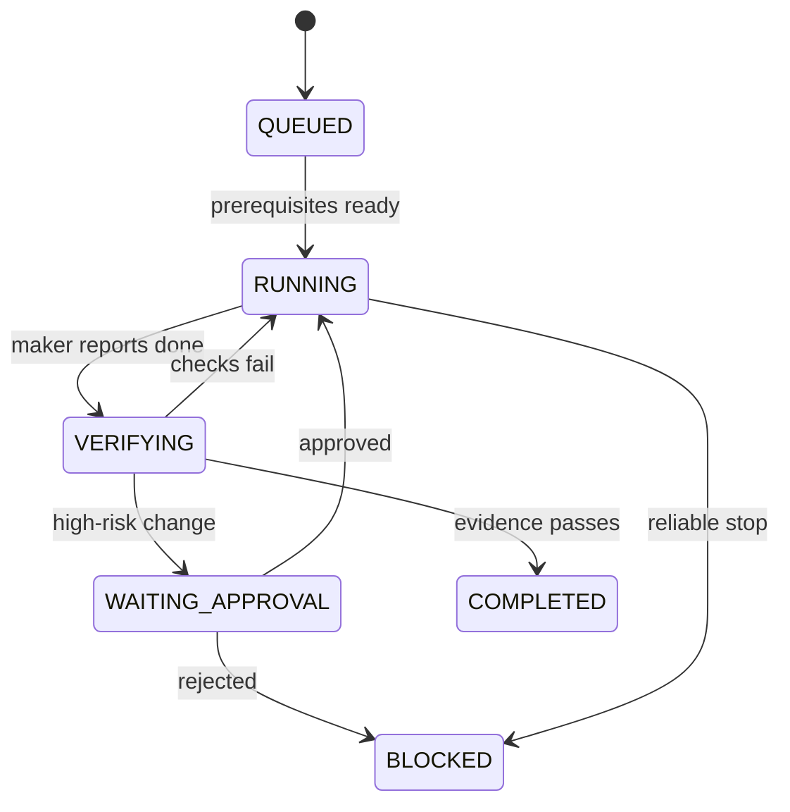
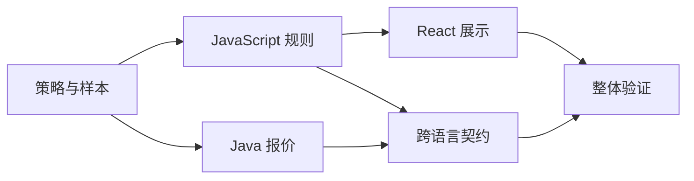

# 第 11 章　何时提高自治，何时交给人？

> 预计学习时间：55–75 分钟  
> 一句话总结：自治等级由风险、证据和恢复能力决定；先让单智能体闭环可靠，再用状态机、隔离和依赖图扩大并行。

## 能自动继续，不代表应该自动继续

优惠页面文案改错，可以快速回滚。库存 claim 语义改错，可能导致真实订单和库存账不一致。两项任务都能由智能体修改代码，适合的自治等级却不同。

自治不是一个开关。它是任务在什么条件下可以继续、需要谁批准、失败后怎样恢复的组合。

## 五级自治模型

| 等级 | 智能体权限 | 人的角色 | 适合任务 |
| ---: | --- | --- | --- |
| 0 | 只分析和建议 | 人执行全部动作 | 新领域、高风险诊断 |
| 1 | 在沙箱生成修改 | 人逐项审查并运行 | 初次接入仓库 |
| 2 | 自动修改和局部验证 | 人批准共享或外部影响 | 常规功能与测试 |
| 3 | 自动完成低风险任务并提交审核 | 人审核证据与例外 | 规则成熟的重复任务 |
| 4 | 持续处理任务队列 | 人管理策略、指标和异常 | 高度标准化、可恢复工作 |

等级越高，越需要稳定任务契约、权限边界、评测、审计和恢复。不能因为模型升级就直接从 1 跳到 4。

## 用风险和证据决定闸门

可以给任务看四个维度：

- 影响：错误会影响多少用户、资金或数据。
- 可逆：能否快速、完整回滚。
- 可检测：现有检查能否在发布前发现错误。
- 可恢复：中断和部分失败后能否回到已知状态。

库存账本语义影响高、回滚难，因此公共接口、状态转换和支付回调保留人工批准。React 运营台的只读字段影响小、构建和视觉检查充分，可以在沙箱内自动完成。

## 状态机比“自主完成”更清楚

一个任务编排器可以只管理少量状态：

每次转换都需要触发条件和证据。`COMPLETED` 不能由模型的一句话直接写入；它由验证结果决定。

## 并行前先画依赖图

优惠任务可以并行做 React 展示和 Java 报价，但两者都依赖已确认的策略和验收样本：

如果两个 agent 同时改共享促销包，冲突和重复工作会抵消并行收益。分工应按所有权和输出接口切开，并使用独立工作区或分支。

## 多智能体需要四个额外条件

1. 任务边界能独立描述。
2. 文件或资源所有权不重叠。
3. 子任务输出有稳定交接格式。
4. 集成者能验证组合结果。

子智能体不应该把完整聊天发给管理者。它返回任务状态、修改摘要、证据、风险和建议下一步。管理者再决定集成、重试或转人工。

## 什么时候不要用多智能体

- 核心业务规则尚未确认。
- 多项工作会频繁修改同一文件。
- 验收必须依赖人工主观判断。
- 单任务本身只有几分钟。
- 失败后无法隔离和回滚。

增加 agent 会增加通信、上下文和集成成本。一个可靠单循环通常比三个互相猜测的 agent 更快。

## 人工注意力也要排队

高自治系统的瓶颈常从编码转移到审批和审核。闸门应返回：

- 需要决定的具体问题。
- 可选方案及影响。
- 已完成的自动检查。
- 不批准时的安全默认。
- 决定有效期。

“请审核所有修改”会把人重新拖回完整执行。好的闸门只请求机器无法承担的判断。

## 常见误区

### 用任务成功率单独决定自治

九成成功率对文案修改可能足够，对资金和库存仍不可接受。还要看影响、可逆和检测能力。

### 并行就是更快

共享文件冲突、重复探索和集成失败都会增加总时间。先测量依赖和交接成本。

### 管理 agent 自动拥有更高权限

编排职责不等于安全授权。管理者也要经过相同策略和审计。

### 人工闸门没有超时和默认动作

审批无人处理时，任务可能永久挂起。高风险默认停止，低风险可以超时回退到只读或缩小范围。

## 本章练习：为两项任务分配自治等级

分别为“修改优惠说明文案”和“改变库存 claim 语义”选择自治等级，写出：允许动作、自动检查、人工闸门、超时默认和恢复方式。

### 参考方向

文案任务可以是等级 2 或 3，但仍要构建和视觉检查。库存语义通常停在等级 1 或 2，公共契约和状态机变化必须审批，并需要幂等、并发和恢复证据。只写“重要任务人工审核”不够，要指出审核发生在哪个状态转换。

## 本章小结

自治来自可验证性，不来自愿望。任务影响低、可逆、可检测、可恢复时，可以逐步减少人工介入；资金、权限和库存语义仍保留明确闸门。并行则需要依赖图、隔离所有权和可验证交接。

下一章会看规模化后的另一面：智能体会复制仓库里的坏模式，团队怎样控制漂移、安全、成本和组织负担。

上一章：[任务跑几小时，怎样不失忆？](./10-long-running-state-and-recovery.md)  
下一章：[速度提高后，怎样控制漂移和风险？](./12-governance-drift-security-and-cost.md)  
术语复习：[术语表](../reference/glossary.md)

## 参考文献

- OpenAI. [An open-source spec for Codex orchestration: Symphony](https://openai.com/index/open-source-codex-orchestration-symphony/). 2026-04-27.
- Anthropic. [Scaling managed agents: decoupling the brain from the hands](https://www.anthropic.com/engineering/managed-agents). 2026-04-08.
- Anthropic. [Building a C compiler with a team of parallel Claudes](https://www.anthropic.com/engineering/building-c-compiler). 2026-02-05.
