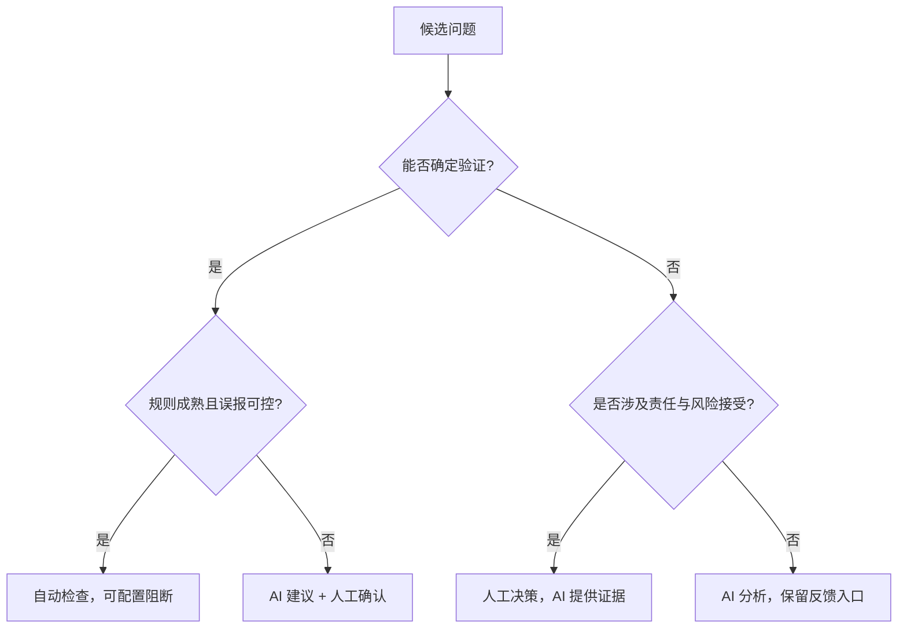

# 第 1 章 为什么今天需要 AI Code Review

> 预计学习时间：55–70 分钟
> 一句话总结：把 AI 放进代码审查之前，先分清它该接管哪些重复劳动，哪些判断仍必须由人负责。

## 先看一次普通的合并请求

一名开发者提交了 26 个文件的改动：前端新增批量操作，后端增加一个异步接口，还顺手重构了日志。自动测试通过，lint 没有报错。审查者在半小时里留下四条评论：一个变量名不清楚，一处错误信息不统一，两处空值保护缺失。两天后，测试环境仍然发现了一个问题：异步任务在失败分支里没有释放锁，后续请求一直等待。

这类经历很容易导向两个相反的结论。有人会说，人工审查太慢，应该让 AI 全部接手；也有人会说，AI 连业务语义都不懂，代码审查只能依靠资深工程师。两种说法都把问题压扁了。真正需要回答的是：**不同审查手段分别能看到什么证据，付出多少成本，在哪些条件下容易失效。**

[[Code Review（CR）]] 是对代码改动进行判断和反馈的活动。它不等同于"找 Bug"。Google 的工程实践把设计、功能、复杂度、测试、命名、注释、风格和文档都列为审查对象；Bacchelli 与 Bird 对现代代码审查的研究还发现，**开发者同时把知识传递和团队协作视为重要结果**——这意味着审查不只是"发现缺陷"，也是团队认知的同步机制。[1][2]

课程里会频繁出现 [[Merge Request（MR）]]。它是一份合并请求：开发者请团队把一个分支的改动合入目标分支。GitHub 常用 Pull Request（PR）这个名称。MR 不只是 diff 页面，还承载需求说明、提交记录、自动检查、讨论、批准和最终合并状态。**AI CR 如果只拿到几行 diff，看到的只是这个协作对象的一小部分**——这是后续所有上下文增强策略的出发点。

## 人工 CR 没有消失，但吞吐矛盾在加剧

现代代码审查的基本矛盾是：**高质量判断需要上下文和注意力，研发流程却希望反馈更早、更快、更稳定。**

人工审查擅长处理模糊目标。例如，"这个缓存会不会让结算金额过期""这个接口是否破坏了另一个团队的兼容承诺""为了赶发布日期暂时接受这段重复代码是否合理"。这些问题需要业务责任和风险取舍。审查者在判断代码时，同时也在判断团队愿意承担什么风险。

但同一个审查者也有注意力上限。小改动容易快速理解，大改动需要在多个文件、调用链和需求之间来回切换。等待审查拉长反馈周期；审查者忙于交付时，评论集中在容易看见的命名和格式；改动越晚被检查，返工时已经叠加的代码和测试就越多。

**还有一类成本很容易被忽视：资深工程师不断重复解释已经稳定的规则。**"错误日志必须记录原始 error""并发资源需要在所有退出路径释放""组件库已经处理空值，不要额外包一层""某目录只能调用领域服务，不能直接查存储"。前两条可能适合静态分析或 AI，后两条依赖仓库约定。关键不在于谁来执行，而在于：**规则如果只存在于某个人的记忆里，审查吞吐就受这个人的时间限制。**

所以本课程所说的"AI 替代人工"有严格边界：**替代的是人工审查中的重复扫描、证据收集和第一轮反馈，不是替代代码所有者的责任。** 准确的目标是让机器扩大覆盖，让人把注意力用在高风险和高语境判断上。

## Code Review 的六个阶段

下面的演进不是一条所有团队都按年份经历的线性历史，也不是新阶段彻底淘汰旧阶段。**成熟系统通常同时保留多种手段，只是把不同问题交给更合适的执行者。**

### 阶段一：人工逐行审查

最初的核心对象是补丁和讨论。人阅读改动，结合需求和经验给出评论。它的优点是判断弹性大，可以追问作者，也能处理架构取舍。缺点同样明显：**结果依赖参与者时间、经验和注意力，重复规则消耗大量审查容量。**

人工审查还承担教学功能。资深工程师指出一处错误时，可能顺便解释模块边界和历史原因。这个过程能传播知识，却难以规模化。**把所有低级扫描都留给资深工程师，既昂贵，也会让真正需要讨论的设计问题淹没在评论列表里。**

### 阶段二：格式、规则和静态分析自动化

lint、格式化器、类型检查、编译器、安全扫描和 [[静态分析]] 把一部分问题变成确定性判断。**只要规则可编码、输入可获得，机器就能快速、稳定地执行。** 例如未使用变量、危险 API、明显空指针路径、依赖漏洞或不符合格式规范的代码，都可能在提交前被拦截。

这一步的价值不是"工具比人聪明"，而是**让确定性问题不再占用人类注意力**。它也是 [[Shift-Left]] 的典型实践：把质量检查提前到编码、提交或 MR 阶段，而不是等到集成测试或线上事故才发现。

**规则工具的边界在于它必须提前知道要找什么。** 某个函数虽然类型正确，却在业务上用了错误的 error 变量；某段并发代码虽然语法合法，却把锁释放放在了不完整的分支；某个建议虽然符合通用防御式编程，却违背了团队组件的推荐用法——这些问题需要比模式匹配更宽的语义判断。

### 阶段三：远端 Diff AI 审查

大语言模型让审查系统可以读自然语言与代码，给出解释性评论。最容易落地的形态是把 MR diff、少量规则和 Prompt 发给远端模型，再把结果写回 MR。它部署简单，能覆盖规则工具难以编码的问题，也能在很短时间内完成第一轮扫描。

CodeReviewer 这类研究把自动代码审查拆成代码改动质量估计、评论生成和代码修复三个任务。[4] 这个拆分很重要：**发现问题、解释问题和产生可用修复不是同一种能力。** 一个系统能生成流畅评论，不代表定位正确；能给出修复片段，也不代表修复符合仓库约束。

只看 diff 的 AI 审查经常遇到上下文缺口。调用函数的约定可能在另一个文件，类型定义可能由生成代码提供，需求约束可能写在任务系统，测试可能说明一个看似奇怪的分支是刻意设计。**模型收到的信息不够时，仍可能给出语言流畅的建议。结果就是"看起来合理，实际上不适用"。** 这是第 4 章采纳率诊断的核心起点。

### 阶段四：本地仓库上下文审查

下一步是让审查器进入真实工作区。它可以搜索符号、读取关联文件、查看测试、运行命令，再结合项目规则判断 diff。GitHub 的官方文档也把全项目上下文、自定义指令、仓库级说明、Agent skills 和 MCP 上下文作为提高审查相关性的手段。[5]

本地上下文减少了部分误报，却引入新的工程问题：模型该读哪些文件，如何避免把整个仓库塞进上下文，怎样限制命令权限，如何证明每个文件都检查过，任务失败后从哪里恢复。**模型有了工具，只说明它"可以"行动，不说明它"必然"按完整流程行动。** 这是第 6、7 章要深入讨论的核心矛盾。

### 阶段五：Harness 驱动审查

[[Harness]] 是包围模型的工程运行支架。它把一次大审查变成外部可控制的过程：服务端创建 Session，筛选文件并切分 Batch；Agent 只能领取当前任务；提交结果后由程序检查结构和工作量；状态机决定下一步是继续、重审、扩展检查还是汇总。

**这里发生了一个关键转变。Prompt 仍然重要，但流程正确性不再完全寄托在模型"记住所有要求"。** 批次、状态、下一步许可、重试和结果验证被写进代码与数据模型。模型负责擅长的语义分析，确定性程序负责计数、权限、状态与失败恢复。这是第 2 章要拆开讲的核心架构。

### 阶段六：指标与反馈闭环

系统上线后，问题从"能不能评论"变成"评论是否有用、漏掉多少、为何变差"。这要求记录开发者是否采纳、哪些建议被拒绝、测试后来发现哪些应召回问题、不同仓库和问题类型表现如何。反馈再进入规则、测试集、上下文策略和质量门。

BitsAI-CR 的工业实践使用规则检查、二次过滤、规则分类、反馈飞轮和评估指标，说明生产 AICR 往往是组合系统，而不是一次模型调用。[6] 课程不会照搬其公开数字，因为模型、团队、语言和统计口径都不同。我们关心的是工程结构：**先检测，再验证，用反馈持续校准。** 这是第 3 章要建立的度量体系和后续所有优化的前提。

## 为什么是今天：代码生成改变了输入规模

过去，代码产出速度在很大程度上受人工输入限制。AI 生码工具提高了创建和修改代码的速度，也让"一次改很多文件"变得更常见。**代码写得更快，不会自动让需求更清楚、架构更一致或测试更充分。** 审查入口因此承受更大的数量和速度压力。

如果生成端每小时产生多次改动，而审查仍等待少数资深工程师排队，质量系统会出现三个后果。第一，反馈变晚，错误在更多改动上叠加。第二，审查者会采用抽查或只看关键文件，覆盖难以稳定。第三，**生码平台缺少一个可以程序化调用的质量门，生成结果只能直接进入测试或等待人工。**

AI CR 的现实价值就在这里：它可以在提交前、本地工作区、MR 创建时或生码任务结束后立即运行，给出第一轮语义检查，并把高风险问题和证据交给人。**远端服务化后，同一套能力还能被 CI、开发平台和其他生码 Agent 调用。** 第 8 章会专门讨论服务化，当前只需记住：AICR 的调用方不再只有"正在看 MR 的人"。

这并不意味着评论越多越好。假设系统每次都报告几十个低价值问题，开发者会快速学会忽略它；假设系统只报告一两条极有把握的问题，采纳率可能很好，却漏掉大量真正缺陷。**高质量 AICR 必须同时处理噪音与遗漏，这正是后续采纳率和召回率两条主线。**

## 四类审查者怎样分工

用"AI 能不能审查代码"来提问太宽。更实用的做法是**先看问题特征，再选择执行者。**

| 问题特征 | 首选手段 | 原因 | 需要升级的条件 |
| --- | --- | --- | --- |
| 规则明确、可确定计算、无需业务语境 | lint / 编译 / 静态分析 | 快、稳定、可阻断，结果易复现 | 规则难表达或误报随上下文变化 |
| 需要跨少量文件理解代码意图，有清楚证据 | AI CR | 语义覆盖广，可解释并给出候选修复 | 涉及高风险、所有权或含糊业务取舍 |
| 需要需求、组织承诺、架构责任或风险接受 | 人工审查 | 人能承担决策责任并处理含糊目标 | 可先让 AI 收集证据和列出冲突点 |
| 既有可编码底线，又有上下文例外 | 组合审查 | 工具守底线，AI 查语境，人做终局判断 | 需要明确谁有阻断权和如何处理冲突 |

**一个常见错误是把容易自动化的问题全部交给 AI。** 例如格式、导入顺序和已知危险函数，本可由确定性工具快速判断，却被模型用自然语言重复评论。这样既增加成本，也让结果存在随机性。**另一个错误是把高风险决策自动化：AI 说"没有问题"就允许涉及权限或资金的改动直接合并。** 模型输出应该成为证据的一部分，而不是责任的替代物。

2025 年的一项研究尝试组合静态分析与 LLM，报告混合策略能改善评论的相关性与完整性。[7] Ericsson 的经验报告也采用 LLM 与静态程序分析的轻量组合，并让有经验开发者参与初步评估。[8] 这些公开证据与我们的工程判断一致：**规则和模型不是竞争关系，它们覆盖不同的可判定空间。**

## 从真实问题样本看"适合谁审"

下面的场景来自脱敏后的教学样本。它们不代表行业分布，也不用于计算生产指标。目的只是练习分工。

### 场景一：未使用变量

代码声明了变量却从未读取。编译器或 lint 可以确定判断，首选确定性工具。AI 再评论只会重复已有信号。人工一般无需参与，除非未使用代码暴露了更大的需求遗漏。

### 场景二：goroutine 中锁释放位置不完整

锁只在成功分支释放，错误分支提前返回。数据流分析可能发现，AI 也可以沿控制流解释后果。**适合"静态分析 + AI"组合：前者提供稳定告警，后者解释并检查相邻代码是否存在约定。** 若锁保护的是高风险共享状态，应由人确认修复。

### 场景三：日志记录了错误的 error 变量

当前分支检查 `saveErr`，日志却打印上一个步骤的 `queryErr`。类型系统通常不报错，局部语义却明显矛盾。AI 对这类跨几行的变量关系很有优势，也适合补充自定义静态规则。**评论应包含具体变量和控制流证据，不能只说"错误处理可能有问题"**——这种模糊评论本身就是采纳率杀手。

### 场景四：重复方法定义

如果语言或构建系统会直接报错，交给编译器；如果是不同文件中语义重复、导致维护分叉，AI 可搜索符号并提示。是否合并方法仍要看模块边界，可能需要人判断。

### 场景五：建议增加空值保护，但业务入口保证非空

这是一类典型拒绝评论。单看当前函数，防御式检查似乎合理；结合入口契约，它可能重复甚至隐藏上游错误。**AI 只有读取契约、调用方或测试后才有资格判断。** 证据仍冲突时，应交给代码所有者。

### 场景六：方法内部已经处理失败

AI 在调用处建议重复捕获，但被调用方法已转换错误并记录必要信息。**这说明审查器只看了 diff，没追踪实现。** 解决办法不是让 Prompt 更强硬，而是让系统提供符号搜索和相关文件上下文，并在提交评论前复核。

### 场景七：组件库推荐的写法看起来违反通用规则

通用规则要求显式传值，项目组件却约定缺省值触发受控行为。**AI 若不知道组件文档，会把正确代码判为问题。** 这类案例应沉淀为项目级规则或路径级说明。人工负责确认规则，AI 负责在后续审查中一致执行。

### 场景八：修复方向正确，建议代码不可用

AI 正确发现竞争条件，却给出会阻塞事件循环的修复。这里**"发现"与"修复"必须分开评分。** 评论可以保留问题证据，但修复建议要经过复核；高风险改动由人决定。

### 场景九：接口改变了权限边界

代码本身可以运行，测试也通过，但新接口把原本只在后台使用的能力暴露给普通用户。AI 可以追踪鉴权调用、列出缺失测试，**却不能代表产品和安全负责人接受风险。** 必须人工审查，并且适合设置强制审批规则。

### 场景十：命名不够清楚

AI 能快速指出含糊命名，但价值依赖团队语境。如果只是个人偏好，不应形成阻断评论；如果名称掩盖了单位、时区或状态语义，就可能导致真实缺陷。**审查器应说明歧义如何影响阅读或调用，而不是只给一个替换词。**

把十个场景放在一起可以看到，执行者不是按"简单/复杂"一刀切。选择标准至少包括：**规则能否确定表达、需要多少上下文、错误后果、是否涉及责任决策、结果能否自动验证。**

## AI CR 的职责边界

一套健康的 AICR 系统应该明确三种权限。

**建议权**：AI 可以报告候选问题、证据、严重度和修复方向。大多数语义评论停留在这里。开发者可以采纳、拒绝或标记无法判断。

**阻断权**：只有规则清楚、误报经过校准、失败成本足够高的检查才适合阻断合并。阻断可以来自测试、静态分析或经过验证的 AI 质量门，**但必须有申诉和人工覆盖路径。** 否则系统会用"安全"名义制造不可解释的流程堵塞。

**决策权**：架构例外、业务风险、数据兼容、发布时间与技术债取舍属于责任主体。AI 可以准备材料，不能替负责人签字。GitHub 的官方 Code Review 文档也明确写道，Copilot 不保证发现 PR 中的所有问题，可能犯错，使用者应仔细验证反馈并补充人工审查。[5]

边界还要体现在产品交互中。如果 AI 评论被当成普通审查意见，开发者可以讨论、解决和隐藏；如果系统允许一键应用修复，就应保留变更 diff 和测试结果；如果支持自动重审，就要避免重复提交已解决评论。官方产品已经暴露出这些工程细节：GitHub Copilot 的评论不计入必需批准，也不会直接阻止合并；它允许自定义仓库规则和反馈，并提示重审可能重复评论。[5]

## Shift-Left 不是把所有门都移到最左边

Shift-Left 常被理解成"越早检查越好"。更准确的定义是：**把能够在早期获得足够证据的检查提前。** 格式、类型和局部语义可以在编辑器或提交前运行；依赖真实集成环境的行为仍应留给集成测试；需要线上流量才能判断的问题要依靠灰度和监控。

AICR 适合位于提交前和 MR 阶段，因为此时 diff、仓库和作者意图基本可得，修改成本又比测试后更低。它还可以成为生码任务的质量门：Agent 完成代码后先触发 AICR，处理高置信问题，再把代码交给人。**但"左移"不能让同一个 AI 同时写代码、审自己、宣布通过并自动发布——生成者与评价者需要一定分离，关键状态要由外部系统维护。**

这套思想在课程中被称为 **CR Shift-Left**。它不是一个单独模型，而是一组对象和流程：Session 保存一次审查，Batch 控制工作量，Issue 保存候选问题，状态机规定下一步，MCP 暴露领取任务与提交结果的工具，指标和记忆把反馈带回下一轮。第 2 章会沿一条真实请求逐站拆解。

## 本课程接下来怎样推进

第 1 章只建立了边界：人工、规则工具与 AI 各有职责；高质量不等于评论数量；AICR 必须同时面对噪音与遗漏。

第 2 章把模型放进一个可执行系统。你会看到 Prompt 为什么仍然必要，却不足以控制长流程；也会看到 Session、Batch、File、Issue、状态机、MCP 和 Agent 怎样交接。第 3 章先建立度量语言，定义采纳率、召回率与 F1，并揭示分母变化如何改变结论。**这是后续所有优化的前提：没有稳定口径，"优化"很容易退化成展示几条漂亮评论。** 随后四章分别诊断和改造采纳率、召回率，最后进入远端服务化。这条路线刻意把指标放在改造之前——也只有先分清 AI 和人的责任，后续的自动采纳、质量门和远端接入才不会扩大错误权限。

## 路线检查

回到章首的 26 文件 MR，可以这样分工：lint 处理格式和确定性规则；静态分析检查可编码的数据流与资源释放；AI 在仓库上下文中扫描错误变量、跨文件约定和候选风险；人工集中判断异步设计、业务契约和是否接受风险。测试环境发现的锁问题还应进入评估集，检查下一版 AICR 能否召回。

如果你面对一个新问题，可以依次问五个问题：**它能否被确定性规则表达？需要哪些仓库或业务上下文？报告错误的成本是什么？谁有权接受风险？结果如何验证和回流？** 能够回答这五问，就不会把"采用 AI"误写成"增加一次模型调用"。

## 参考文献

1. Alberto Bacchelli, Christian Bird. [Expectations, outcomes, and challenges of modern code review](https://doi.org/10.1109/ICSE.2013.6606617). ICSE, 2013.
2. Google Engineering Practices. [The Standard of Code Review](https://google.github.io/eng-practices/review/reviewer/standard.html)；[What to look for in a code review](https://google.github.io/eng-practices/review/reviewer/looking-for.html).
3. Shane McIntosh 等. [The impact of code review coverage and code review participation on software quality](https://doi.org/10.1145/2597073.2597076). MSR, 2014.
4. Zhiyu Li 等. [Automating Code Review Activities by Large-Scale Pre-training](https://arxiv.org/abs/2203.09095). ESEC/FSE, 2022.
5. GitHub Docs. [About GitHub Copilot code review](https://docs.github.com/en/copilot/concepts/agents/code-review).
6. Tao Sun 等. [BitsAI-CR: Automated Code Review via LLM in Practice](https://arxiv.org/abs/2501.15134). 2025.
7. Imen Jaoua 等. [Combining Large Language Models with Static Analyzers for Code Review Generation](https://arxiv.org/abs/2502.06633). MSR, 2025.
8. Shweta Ramesh 等. [Automated Code Review Using Large Language Models at Ericsson: An Experience Report](https://arxiv.org/abs/2507.19115). ICSME, 2025.
