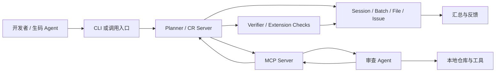
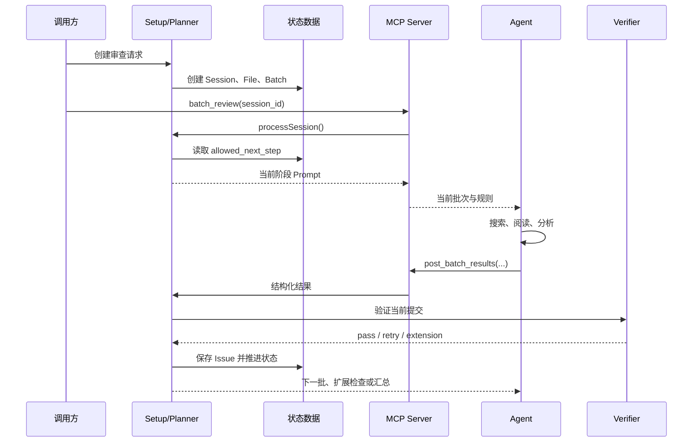
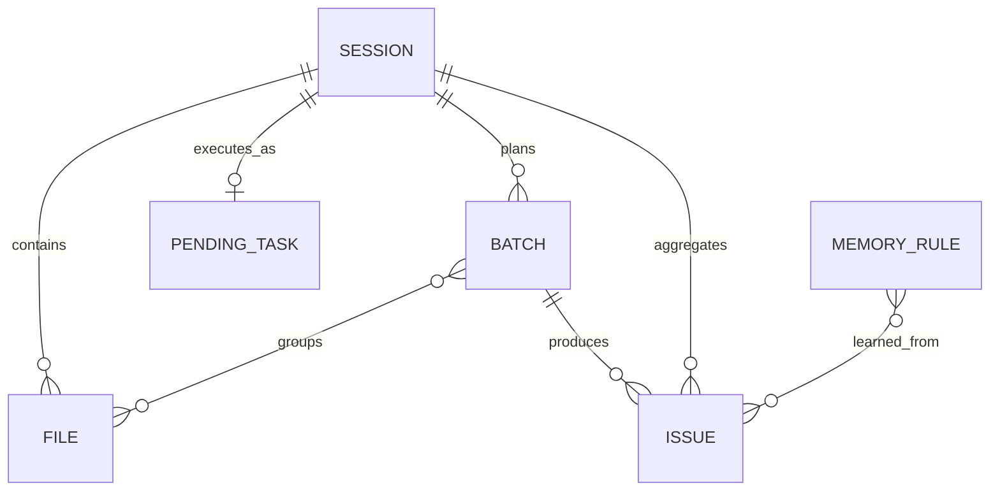
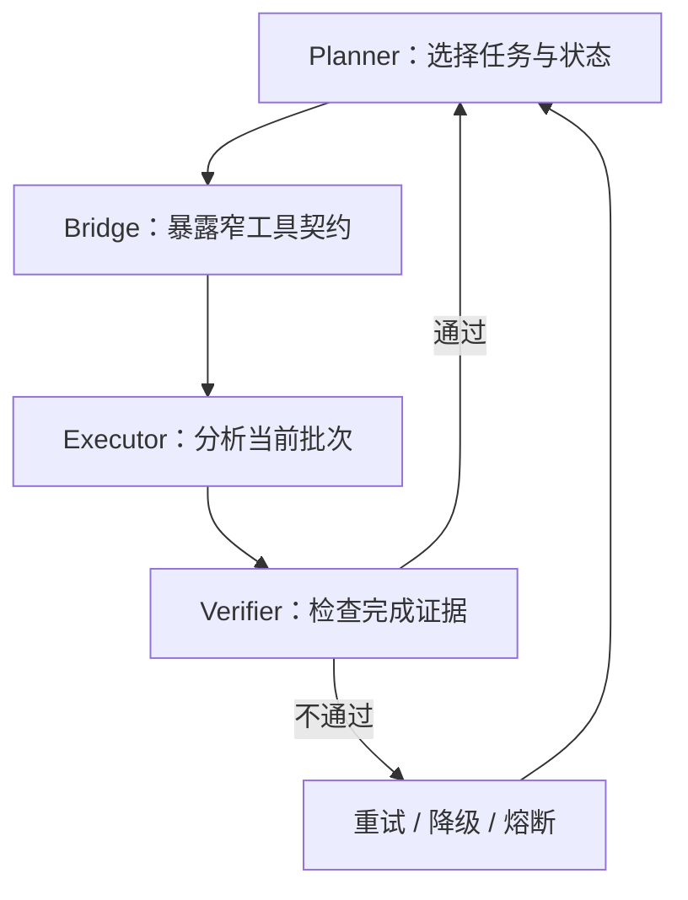

# 第 2 章 从 Prompt 到 Harness：整体架构与核心思路

> 预计学习时间：80–100 分钟
> 一句话总结：沿一次真实审查请求拆开入口、状态机、批次、MCP、Agent 与结果验证的职责。

## 一个 Prompt 为什么控制不了完整审查

设想一条很长的指令：先检查环境，再读取全部改动；按文件依赖分组，每组审查后提交结构化结果；高风险问题要复核；所有批次完成后检查遗漏，最后生成总结。模型读懂这段话并不困难。困难在于任务运行几十分钟后，系统怎样知道它真的完成了每一步。

如果模型直接回复“已检查所有文件”，这句话是自我报告，不是完成证据。它可能跳过后段文件，可能把两个步骤合并，也可能在上下文变长后只给概括性意见。**Prompt 可以表达期望，却无法独立保存事务状态**、核对文件集合、阻止越级调用、恢复中断任务或让多个执行者共享进度。

这不意味着 Prompt 没用。Prompt 负责把当前任务、规则、上下文和输出格式告诉模型。问题在于我们曾让它同时承担四种职责：说明目标、保存进度、控制流程、验收结果。后面三种职责更适合确定性程序。

[[Harness]] 的作用，就是把这些工程职责从 Prompt 中拿出来。它是围绕模型的一套运行支架：准备上下文，暴露工具，保存状态，限定权限，验证结果，处理失败并记录指标。模型仍负责代码语义分析；系统不再把完整流程寄托在模型的工作记忆里。

Anthropic 的工程文章区分了 workflow 与 agent：[[Workflow]] 由预定义代码路径编排模型和工具，[[Agent]] 则由模型动态决定过程与工具使用。[1] 本课程案例是混合结构。宏观审查路径由状态机规定，因此更像 workflow；在每个批次内部，Agent 可以搜索仓库、阅读关联文件并决定分析方法。这个区分能避免一个误解：采用 Agent，不等于把所有控制权交给模型。

## 先画出系统边界

一条本地 AICR 请求至少涉及四层。为了公开教学，下面把与业务无关的入口合并为“CLI/调用方”，保留实现中的核心服务和工具名。



调用方负责发起任务和携带必要身份、仓库、分支或 MR 信息。Planner 负责创建审查计划、推进状态、切分批次和决定下一步。MCP Server 把后端能力转换为模型可调用的工具。Agent 阅读当前 Prompt，在工作区内分析代码，再提交结构化结果。Verifier 和扩展检查不相信“我完成了”，而是检查结果格式、工作量和后续复核条件。

这里的 Server 不是“更大的模型”。它是确定性控制面。Agent 也不是数据库状态的所有者。只要这条边界明确，系统就能回答三个重要问题：谁可以推进状态，谁可以生成问题，谁可以判定流程完成。

MCP 官方规范采用 Host–Client–Server 架构。Host 管理多个 Client、权限和生命周期；每个 Client 与一个特定 Server 保持 1:1 有状态会话；Server 暴露 tools、resources 和 prompts，并通过能力协商声明支持什么。[2] 课程案例没有机械复制规范名词，但遵守相同方向：模型侧通过受控工具访问后端能力，而不是直接修改审查数据库。

## 一次请求怎样穿过系统

下面沿一条正常请求走一遍。先只看交接，不急着记状态编号。

### 入口：创建或复用任务

开发者在本地工作区触发 AICR。入口校验参数，识别仓库和改动范围，然后调用 Setup。远端模式还会处理异步任务、仓库准备和回调，第 8 章再展开。

入口不应每次都无条件创建新任务。同一份改动可能因为页面刷新、网络重试或外部平台重复回调而被多次触发。系统需要内容哈希和会话状态来判断：复用已完成结果、继续未完成 Session，还是创建新 Session。幂等从入口开始，不能等 Agent 已经运行后再补。

### Setup：把模糊改动变成可审查对象

`setupSession` 做的工作比“调用模型”更基础：创建或更新 Session，收集改动文件，过滤不需要审查的类型，计算内容哈希，尝试复用历史文件结果，再调用批次分配器生成 Batch。完成后，Session 进入 ready 状态，`current_step` 仍表示未正式开始，`allowed_next_step` 指向 0。

文件过滤必须可追溯。依赖锁文件、生成产物、二进制资源或超大文件可能被排除，但排除不能悄悄发生。否则最终“完成 100% 审查”只覆盖了过滤后的集合，读者却以为覆盖了 MR 全部文件。好的 Setup 会保存原始集合、有效集合和排除原因。

历史复用也有边界。文件路径相同不代表内容相同；内容相同但规则版本改变，也未必可以复用。**当前实现使用内容哈希和 Session 状态参与判断**。工程上还应考虑模型、Prompt、规则与工具版本，把它们纳入结果有效性的定义。

### Planner：只下发当前任务

Setup 完成后，Planner 不把全流程一次性塞给 Agent。它读取 `allowed_next_step`，调用相应处理函数，生成当前阶段的 Prompt。Agent 每次拿到的不是“请自行完成一切”，而是明确的下一项工作和结构化提交要求。

在批次审查阶段，Planner 还会读取当前 `current_batch_index`，只提供当前 Batch 的文件、规则与上下文。完成一个 Batch 后，服务端才决定继续下一个、进入扩展检查、回退重审或生成汇总。

### MCP Bridge：把状态转换为工具契约

模型无法直接调用 Egg Service。MCP Server 注册两个核心工具：

- `cr_shift_left_batch_review`：根据 `session_id` 领取或继续当前允许的审查任务。
- `cr_shift_left_post_batch_results`：提交 `batch_results`，扩展阶段还可携带 `extension_results`。

工具名不是重点，契约才是。领取工具只需要 Session ID，服务端根据状态返回当前 Prompt；提交工具要求每条结果包含文件、行号、评分、分类、内容及可选代码片段。Agent 不传“下一步应该是 3”，也不直接把 `current_batch_index` 加一。状态推进权留在后端。

### Agent：在批次内部执行语义工作

Agent 收到当前批次后读取改动，必要时搜索定义、调用方和测试。它可以根据代码决定先看哪个文件，也可以用工具补足上下文。这是模型应有的自由：在受控工作单元里选择分析路径。

Agent 产出的是候选 Issue，而不是最终真理。一个候选问题至少要回答：问题在哪，现有代码是什么，风险为何成立，严重度和类别是什么，怎样改进。高质量评论还要区分“必须修复的正确性问题”和“可选的维护建议”。这些字段让后端能够检查完整性，也让后续指标有稳定对象。

### 提交与验证：先验收，再推进

Agent 调用提交工具后，Processor 根据当前状态解释 payload。如果状态是 2，`batch_results` 会进入验证；如果缺少预期结果，实现会降级回 Step 1，而不是假装完成。验证通过后保存 Issue、更新 Batch 和 Session，再决定下一个状态。

验证不等同于让另一个模型说“看起来不错”。可确定检查优先写成代码：字段是否完整，文件是否属于当前批次，行号是否合理，是否重复提交，审查耗时与问题密度是否落在配置范围，包含高风险修复建议时字段是否齐全。**模型复核适合处理语义相关性，不能替代这些机械约束**。

### 汇总：从多批结果生成可读结论

所有批次和必要扩展检查结束后，状态进入 3。汇总从数据库中的结构化 Issue 生成，而不是要求模型回忆此前对话。它可以按风险和类别组织问题，链接文件位置，说明覆盖和排除项，并为指标与反馈保留 Issue ID。



这张图不是实现证据。证据来自 `setup.ts`、`processor.ts`、两个 MCP Tool、`verifier.ts` 与数据模型。图的作用是把它们组织成一条可复述的请求链。

## 五个核心数据对象

只看服务调用容易误以为状态都存在 Prompt 里。真正让任务可恢复的是持久对象。

### Session：一次审查的总账

[[Session]] 保存顶层生命周期：执行模式、状态、当前步骤、下一步许可、当前批次、文件数、行数、批次数、完成数、问题数、开始和结束时间。它还是外部请求与内部对象的关联点。

Session 不应该塞入所有结果详情。它保存汇总和指针，具体文件、批次和问题使用独立对象。这样更新一个 Issue 不必重写整份会话，也便于按批次恢复。

### File：审查范围的快照

File 对象记录路径、diff 规模、内容哈希、过滤或复用状态，以及它属于哪个 Session。它回答“本次到底要审什么”。如果只把文件列表写在 Prompt 中，任务中断后很难证明哪些文件已经处理。

内容哈希让系统区分“同一路径的新内容”和“可以复用的相同内容”。但哈希只证明字节关系，不能证明规则环境相同。课程后续会把版本维度纳入评估讨论。

### Batch：受控工作单元

[[Batch]] 把多个 File 组织为一次 Agent 可以处理的工作量。当前实现主要以约 800–1200 diff 行作为理想范围，同时结合语义分组、拆分、合并、去重和完整性检查。旧设计材料曾出现 800–1500，这属于版本差异，不应混成一个固定行业阈值。

Batch 要保存索引、文件集合、工作量、状态、重试与结果统计。它让系统可以说“第 4 批失败，重新执行第 4 批”，而不是整次审查从头开始。

### Issue：可反馈、可度量的问题单元

[[Issue]] 是一条候选审查问题。位置、评分、类别、描述、现有代码、改进代码、采纳状态和有效性围绕它组织。后续采纳率的分子分母，本质上是在筛选 Issue。

Issue 必须有稳定标识。开发者拒绝一条评论、最终代码采纳建议、测试发现漏报，都需要关联到具体对象。若结果只存在一段汇总文本中，数据闭环就无法建立。

### PendingTask 与 MemoryRule：跨执行与跨会话状态

远端模式使用 PendingTask 表达排队、认领、执行、回调和终态；MemoryRule 保存由历史反馈形成的规则。前者让一次任务跨进程恢复，后者让不同 Session 共享经过筛选的经验。第 8 章和第 5/7 章分别展开。



ER 图省略了真实表名、组织字段和大量实现列，只表达教学关系。关系不是说每个数据库都必须这样设计；它说明这些对象分别解决范围、工作量、结果、异步生命周期和跨任务反馈。

## `allowed_next_step`：把建议变成许可

当前主链是 `0 → 1 → 2 → 2.x → 3`。它不是进度百分比，而是服务端允许执行的动作类型。

| 状态 | 含义 | 谁执行主要工作 | 进入下一状态前的证据 |
| --- | --- | --- | --- |
| `0` | 前置与环境检查 | Server 读取配置，Agent 按提示确认环境 | Session 可运行，配置和身份满足条件 |
| `1` | 下发并执行当前批次审查 | Server 选 Batch，Agent 分析代码 | 有当前批次及明确提交契约 |
| `2` | 接收并验证批次结果 | Server / Verifier | 结构、范围和质量检查通过，或得到重试理由 |
| `2.x` | 执行条件化扩展检查 | Agent + 扩展检查编排器 | recheck、记忆、过滤等当前所需检查完成 |
| `3` | 生成最终汇总 | Server / Agent 按持久结果汇总 | 所有必要批次和扩展检查已达到终态 |

`current_step` 表示当前记录到的阶段，`allowed_next_step` 表示允许的下一动作。二者分开能表达“刚完成 Step 1，下一次提交必须按 Step 2 解释”。如果只保存一个 `status=running`，服务端收到 payload 时不知道它是批次结果、扩展结果还是重复请求。

下面是 `processor.ts` 的简化节选。无关日志、监控和字段已移除，状态值与分发关系保持不变。

```typescript
// 简化节选：状态由服务端读取，调用方不能自选处理分支
const session = await getSession(sessionId);

switch (session.allowed_next_step) {
  case "0":
    return executeStep0(session);
  case "1":
    return executeStep1(session);
  case "2":
    return handleStep2(session, batchResults);
  case "2.x":
    return handleStep2x(session, extensionResults);
  case "3":
    return executeStep3(session);
  default:
    return { error: "INVALID_STEP" };
}
```

这个 switch 的价值不在语法，而在所有权：Processor 从数据库读取状态，再选择处理函数。Agent 即使在 Prompt 中写“请进入汇总”，也不能绕过未完成的批次。

### 正常状态循环

一次 Batch 的常见循环是 `1 → 2 → 1`。Step 1 下发任务并把许可推进到 2；Agent 提交结果；Step 2 验证通过，若还有批次就增加索引并回到 1。所有批次完成后，系统可能进入 `2.x` 或 `3`。

### 缺失结果时的降级

如果状态为 2，调用却没有 `batch_results`，当前实现不会生成空结果并继续。`handleStep2` 会把 Batch 状态回退为 pending，把 `allowed_next_step` 设回 1，再重新下发审查。`2.x` 缺少扩展结果时也会清理扩展状态并回退。

这是一个实用的失败处理原则：payload 与当前状态不匹配时，选择可解释的恢复点。恢复动作必须幂等，避免重复保存 Issue 或跳过 Batch。

### 扩展状态为什么写成 `2.x`

扩展检查不是单个固定步骤。它可以根据问题、模式和配置进入 recheck、negative memory、接口契约、任务说明、positive memory、filter 或 fix。把它统一标成 `2.x`，再由 `extension_check_state` 保存内部子状态，能让主链保持稳定，同时允许检查序列演进。

这种设计也有代价。日志和指标必须同时记录主状态与子状态，否则所有扩展耗时都堆在 `2.x`。工具 payload 也要明确当前期望哪种扩展结果，不能让 Agent 猜。

## 链式 Prompt：每一步只承担当前责任

Harness 并没有消灭 Prompt，而是改变 Prompt 的粒度。`promptBuilder.ts` 会根据环境检查、当前批次、验证反馈、扩展检查和汇总生成不同提示。每份 Prompt 都可以包含四类信息：当前事实、当前任务、可用工具、提交契约。

“当前事实”包括 Session ID、批次索引、文件范围、规则和已知上下文。“当前任务”只描述这一阶段要完成的判断。“可用工具”告诉 Agent 如何搜索和提交。“提交契约”规定字段、何时调用工具以及不能自行宣布的状态。

链式 Prompt 的优点是局部可调试。如果某一批没有按格式提交，可以检查对应阶段的提示和工具 schema；如果高风险复核遗漏，可以检查扩展阶段；如果汇总不完整，可以对照数据库 Issue。单一巨型 Prompt 失败时，很难知道是理解、记忆、工具还是状态出了问题。

它也有风险。不同 Prompt 可能重复或冲突，旧规则可能残留，阶段切换时必要上下文可能丢失。因此 Prompt 需要版本管理和契约测试。至少应验证状态名、工具名、必填字段和禁止越级指令与代码一致。

## Harness 的四层职责

为了设计新系统，可以把职责压缩成四层，而不是照抄类名。

### Planner：决定做什么

Planner 根据改动范围与当前状态决定批次、顺序和下一任务。它维护全局完成条件，但不替 Agent 阅读每一行代码。Planner 的输出必须可持久化：任务列表、状态转换和失败原因不能只存在于一次模型回复。

### Team Lead / Verifier：决定是否算完成

Verifier 负责验收。确定性条件写成程序，语义条件可以调用独立复核。它不能只看“输出是否很长”，而要检查当前工作单元是否完整、证据字段是否可用、结果是否与文件范围一致。

### Bridge / MCP：控制怎样访问能力

Bridge 把后端能力暴露为窄工具。工具参数越清楚，越容易校验和审计。不要提供一个万能 `execute(action, payload)` 让模型自行拼动作；也不要让工具直接接受“目标状态”。工具应围绕业务动作设计，例如领取当前批次、提交当前结果。

### Executor / Agent：完成语义分析

Executor 在受限工作区中读取代码、调用搜索和测试工具，生成候选 Issue。它的自治范围由批次、权限与停止条件共同决定。模型更强可以改善这一层，却不能取消其他三层。



Anthropic 所说的 orchestrator-workers 与 evaluator-optimizer 模式可作为公共参照：中央编排者动态拆解任务，工作者执行；评价者依据清楚标准给反馈并循环改进。[1] 本案例与它们相似，但状态机、数据库和 MCP 工具让流程具备持久与恢复能力。不要因为结构相似，就声称某篇文章证明了当前实现最优。

## 正常路径之外的六个失败点

架构是否可靠，取决于失败时还能否解释和恢复。

### 失败点一：Setup 范围不完整

文件过滤错误或 diff 获取失败，会让后续所有步骤在错误集合上“成功”。应记录总文件、有效文件、排除文件和原因，并在汇总展示覆盖边界。

### 失败点二：批次不均衡

一个 Batch 太大，Agent 容易概括；太小则上下文被切碎，跨文件关系丢失。当前 800–1200 行只是案例实现的主要理想范围，不是通用答案。分批还要考虑语义依赖、文件类型和仓库基线。

### 失败点三：重复领取或重复提交

网络重试可能重复调用工具。领取动作应返回同一当前任务，提交动作应根据 Session、Batch 和结果标识去重。只靠前端按钮禁用无法保证幂等。

### 失败点四：状态与 payload 不匹配

状态是 2，Agent 却提交扩展结果；状态是 `2.x`，调用方没有 extension payload。Processor 必须拒绝或回退，日志要记录期望与实际，不要把未知字段悄悄丢弃后推进。

### 失败点五：验证门被配置关闭

实现包含耗时、密度、内容长度和高风险建议检查，但兜底配置中部分阈值是 0 或近似关闭值，运行时又可能被数据库热配置覆盖。架构图上有 Verifier，不代表每个质量门在所有环境都生效。第 7 章会区分设计目标、默认值和运行值。

### 失败点六：扩展检查循环不终止

recheck 或 fix 如果不断返回需要继续，任务会卡在 `2.x`。每个子状态需要重试上限、超时、熔断和可人工接管的终态。失败不是 `running` 的另一种写法，必须有明确分类。

## 怎样观察这条链路

没有可观测性，状态机只是在数据库里移动字符串。每次处理至少应绑定 Session 级 trace，并记录阶段名、Batch 索引、开始结束时间、结果数量、验证结论和错误类别。

当前实现把 `allowed_next_step` 转换为类似 `processor_step_2_x` 的阶段名，并在 MCP 工具调用处记录领取和提交阶段。这让监控可以回答“卡在哪个状态”“某个工具失败还是审查超时”“重试是否集中在特定 Batch”。远端执行器还需要队列等待和仓库准备指标。

日志不能记录全部 Prompt、令牌和业务代码而不设边界。公开或多租户系统应脱敏仓库地址、账号、任务文本和代码片段。更适合长期保留的是哈希、版本、计数、状态与错误分类；需要原文排障时使用受控采样和访问审计。

## 源码观察：从三处验证架构

阅读真实仓库时，不必从目录第一行读到最后一行。沿请求链抓三个观察点即可建立骨架。

第一处看 `setup.ts` 的 `setupSession`。记录它创建哪些对象，如何过滤文件、计算哈希、复用历史结果和生成 Batch。检查完成时写入的 Session 状态。

第二处看 `processor.ts` 的 `processSession`。确认 switch 的输入来自数据库 Session，不来自 Agent 参数；再追踪 Step 1 怎样选择批次、Step 2 怎样验证、缺失 payload 怎样回退、什么时候进入 `2.x` 与 3。

第三处看两个 MCP 工具。`cr_shift_left_batch_review` 只传 `session_id` 并调用 Processor；`cr_shift_left_post_batch_results` 传结构化结果，同样把处理权交给 Processor。工具本身不重写状态机，这是 Bridge 应有的薄度。

完成这三处后，再按问题进入 `batchAllocator.ts`、`verifier.ts`、`extensionChecker.ts`、`promptBuilder.ts` 和数据模型。这样阅读的依据是因果链，而不是文件大小。

## 状态预测练习

在做状态预测前，还需要补一层容易被架构图隐藏的设计：Batch 怎样形成，以及工具契约怎样证明“当前批次”没有被越界处理。

### 分批不是按行数机械切片

最简单的分批方法是把 diff 每 1000 行截断。它会制造两个问题。第一，一个组件的类型、实现和测试可能被切进三个批次，Agent 在每批都只看到不完整语义。第二，某个 900 行生成文件可能独占一个 Batch，真正需要审查的十几个小文件却被挤到另一个超载批次。

当前 `batchAllocator.ts` 采用多阶段思路。先按目录、文件关系和语义线索形成初始组，再根据工作量拆分过大的组、合并过小的组，最后做去重和完整性校验。约 800–1200 diff 行是主要理想范围，不是第一优先级压倒所有语义关系的硬切线。

分批结果至少要满足三个不变量。每个有效 File 必须属于某个 Batch；同一个 File 不应在普通审查阶段被无意重复分配；所有 Batch 的文件并集应等于 Setup 认定的有效文件集合。三个不变量都可以由程序检查，不需要模型判断。

跨 Batch 依赖无法完全消除。可采用两种补偿。一种是在 Prompt 中附带只读的关联摘要或符号信息，让当前批次知道外部契约；另一种在所有批次完成后执行扩展检查，专门查跨批次冲突。补偿信息要受预算控制，否则分批在物理上存在，模型上下文却仍然承载全仓库。

Batch 大小还会影响指标。大 Batch 可能让后段文件漏检，小 Batch 增加调用次数、成本和重复评论。后续做召回率实验时，应把批次规模作为实验变量记录，而不是只看最终 F1。若同时改模型、Prompt、批次和规则，就无法知道提升来自哪里。

### 工具 schema 是协议，不只是参数校验

领取工具输入只有 `session_id`，意味着调用者不能指定“我要第 8 批”。服务端依据 Session 返回当前允许的任务。这个设计缩小了越权面：即使 Agent 记错索引，也不能绕过前七批。

提交工具中的 `batch_results` 是数组，每项包含文件路径、行号、评分、类别和问题内容，并允许带现有代码、改进代码等字段。schema 能阻止字段类型明显错误，却不能证明语义真实。例如 Agent 可以提交一个属于其他批次的合法路径，也可以给不存在的行号。服务端仍需把 payload 与当前 Batch、diff 和文件快照交叉检查。

扩展检查复用同一提交入口，是为了让 Processor 统一读取状态并解释 payload。它也要求错误信息足够清楚：是当前状态不接收 `batch_results`，还是 `extension_results` 缺少当前子检查字段。模糊的“参数错误”会让 Agent 盲目重试。

一个稳健的工具响应不只返回 Prompt。机器可读部分还可以包含 `session_status`、当前 Batch、下一步类型、验证是否通过和稳定错误码；面向 Agent 的自然语言说明负责解释动作。把所有信息塞进一段文字，会让调用方再次依赖模型解析状态。

### 状态转换需要并发保护

本地单人运行也可能出现并发：用户重复点击、MCP 超时后重试、旧请求晚到。两个提交同时读取 `allowed_next_step=2`，都验证并保存，就可能重复 Issue、重复增加完成数，甚至把索引推进两次。

常见防护是带条件更新：只有数据库仍处于期望状态和版本时才提交转换。也可以为 Session 增加版本号，更新时使用 compare-and-swap；Issue 使用 Session、Batch 与内容指纹组成唯一键；完成计数从 Batch 状态聚合，而不是无条件 `+1`。课程案例的远端 PendingTask 使用软认领和同仓库分支串行处理类似问题，第 8 章会详细讨论。

状态机设计还要列出非法转换。`1 → 3` 不应因为 Agent 提前总结而发生；完成态不应重新接受普通结果；失败恢复只能回到明确检查点。把非法转换写成测试，比在 Prompt 里强调“绝对不要跳步”可靠。

### 结果保存要先于下一任务下发

假设 Step 2 验证通过后先返回下一批 Prompt，异步保存 Issue 随后失败。Agent 已开始下一批，数据库却仍认为上一批未完成。恢复时可能重复审查，也可能丢结果。

较安全的顺序是：验证 payload，事务性保存 Issue 与 Batch 状态，更新 Session 的下一步许可，提交成功后再返回新 Prompt。跨数据库或外部系统无法单事务时，使用幂等事件和可重放的 outbox，而不是假设网络调用一定成功。

这条顺序解释了为什么“链式对话”不等于状态机。对话可以把下一段文字发出来，**只有持久提交才能证明上一阶段已经形成可恢复事实**。

## 两种替代架构及其边界

理解 Harness 不必把当前实现当唯一答案。比较替代方案更容易看清选择条件。

第一种是无状态 PR Bot：每次收到 webhook，就取 diff、调用模型、发布评论。它组件少、反馈快，适合小改动和可容忍失败的建议型场景。缺点是难以恢复长任务，跨批完成证明弱，重复触发和上下文选择需要额外处理。若团队只想给 5 个文件的 MR 做非阻断提示，这可能是更合适的起点。

第二种是完全自治 Agent：给仓库、目标和工具，让模型自行规划、审查、复核并总结。它对未知任务有弹性，也减少显式流程代码；但完成证明、成本上限、权限和可复现性更难控制。高风险或规模化服务通常仍需要外部超时、预算、状态和人工批准。

当前混合 Harness 位于两者之间：Server 固定主状态和完成条件，Agent 在批次内部保持自治。它付出的代价是更多数据对象、迁移、监控和契约维护。只有当任务规模、自动化调用或恢复要求确实存在时，这些代价才合理。

下面不是标准答案式测验，而是检查你是否掌握状态所有权。

情况一：Session 的 `allowed_next_step` 是 1，当前批次索引为 3。调用领取工具后，服务端应下发第 3 批任务，并把后续期望调整为提交结果。Agent 无权自行把索引改成 4。

情况二：状态是 2，但提交调用没有 `batch_results`。当前实现回退到 Step 1，把当前 Batch 恢复为 pending，再次下发审查。它不会把空数组当成“没有发现问题”，因为“未提交结果”和“审查后确认零问题”语义不同。

情况三：状态是 `2.x`，扩展检查返回完成。Processor 应根据 `extension_check_state` 判断还有没有下一个扩展子任务；有则继续 `2.x`，无则进入下一个 Batch 或状态 3。Agent 的文字总结不能代替这个判断。

情况四：所有 Batch 标记完成，但有一个 File 从未属于任何 Batch。即使状态准备进入 3，完整性检查也应阻止汇总或标记范围缺陷。完成批次数不等于文件覆盖完整。

如果能解释这四种情况，你已经抓住 Harness 的核心：模型产生语义判断，外部系统保存事实并决定许可。

## 从 Prompt-only 迁移到 Harness 的最小路径

新团队不必一次建设全部组件。可以按风险逐层外置。

先把输出变成稳定 schema，让每条 Issue 有位置、类别、严重度、证据和建议。随后增加 Session，保存请求、状态和结果。再把大改动切成 Batch，由服务端发放当前批次。之后加入确定性验证、重试和终态。最后再扩展记忆、自动采纳、远端队列和复杂复核。

每一步都应该解决一个可观察问题。若当前任务只有几个文件、失败可人工重跑，完整状态机可能得不偿失；若需要长时间运行、跨几十个文件、被外部平台自动调用，持久状态和幂等就不是“高级功能”，而是基本正确性。

这一判断也符合公开工程建议：先使用能满足任务的最简单方案，只在性能与可靠性需要时增加 agentic 复杂度。[1] 简单不是少写代码，而是让每个组件都有清楚失败模式。一个 300 行万能 Prompt 往往比五个窄接口更难验证。


## 参考文献
1. Anthropic. [Building effective agents](https://www.anthropic.com/engineering/building-effective-agents). 2024-12-19.
2. Model Context Protocol. [Architecture, Specification 2025-06-18](https://modelcontextprotocol.io/specification/2025-06-18/architecture).
3. GitHub Docs. [About GitHub Copilot code review](https://docs.github.com/en/copilot/concepts/agents/code-review)；[Using GitHub Copilot code review](https://docs.github.com/en/copilot/how-tos/use-copilot-agents/request-a-code-review/use-code-review).
4. GitLab Docs. [GitLab Duo in merge requests](https://docs.gitlab.com/user/project/merge_requests/duo_in_merge_requests/).
5. Nelson F. Liu 等. [Lost in the Middle: How Language Models Use Long Contexts](https://arxiv.org/abs/2307.03172). TACL, 2023.

