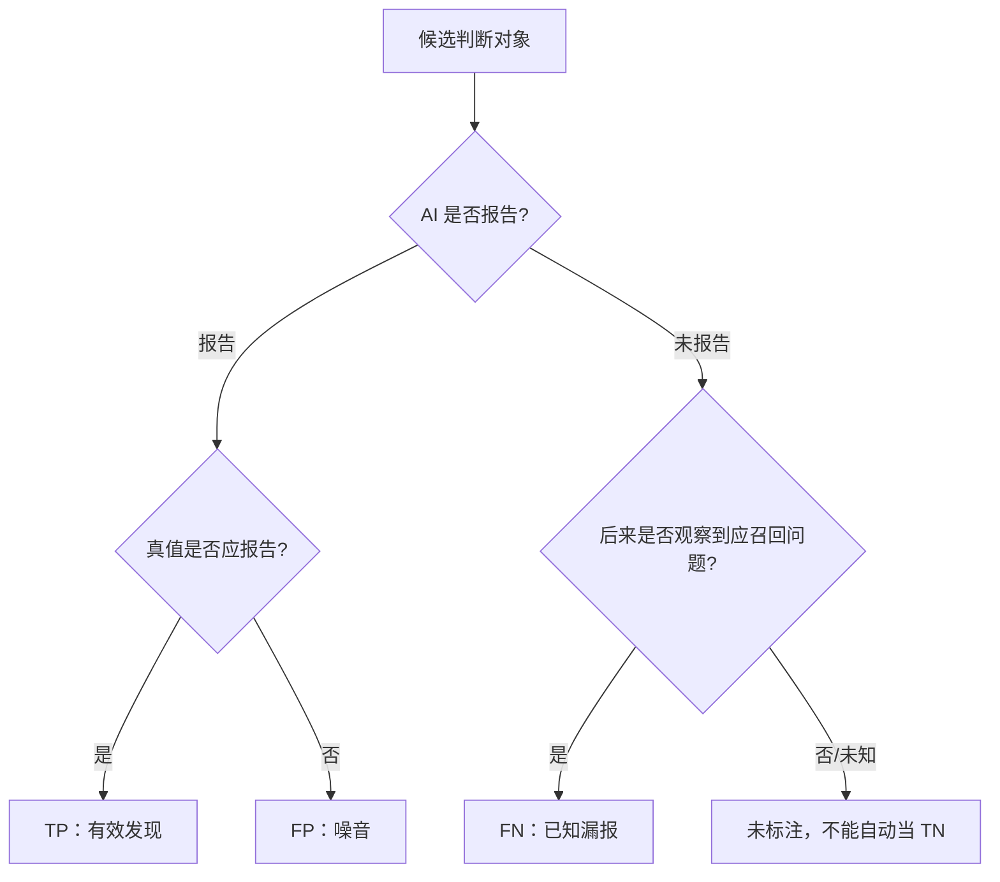
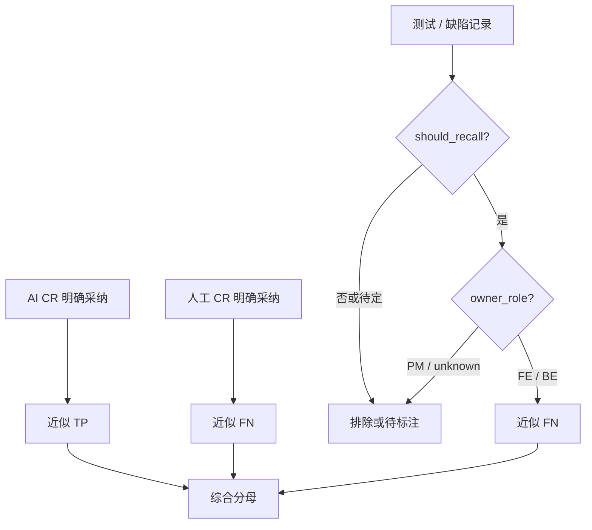
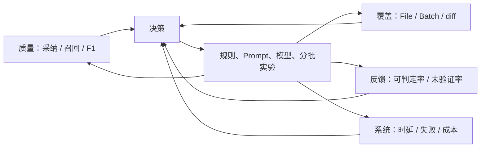
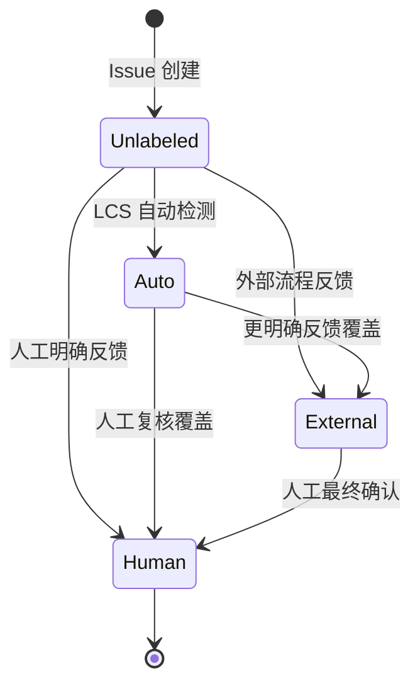

# 第 3 章 先建立度量：采纳率、召回率与 F1-Score

> 预计学习时间：85–105 分钟
> 一句话总结：从 TP、FP、FN 到真实状态枚举，建立一套可复算、能解释排除项的 AICR 指标口径。

## **三条漂亮评论不能证明系统变好了**

团队升级了模型，新版本在一次 MR 中发现三条真实问题，评论解释清楚，开发者全部采纳。展示页面看起来很有说服力。可它没有回答另外几件事：系统一共报告了多少条，是否还有十几条被拒绝，测试后来发现了多少漏报，这三条是否来自定向挑选的成功案例。

评估 AICR 至少要同时看两种错误。第一种是系统报告了不成立、无价值或不可执行的问题，开发者被噪音打扰；第二种是系统没有报告本应发现的问题，团队得到虚假的安全感。前者主要伤害采纳与信任，后者主要伤害召回与覆盖。

指标的公式并不难。难的是把真实协作过程映射为可以复算的样本：什么算“系统报告”，什么算“确实存在”，开发者改了类似代码算不算采纳，人工 CR 后来发现的问题是否都应归为 AI 漏报，测试 Bug 是否属于代码审查能力范围。

本章先给出通用的 Precision、Recall、F1，再进入案例代码的工程口径。两层不能混在一起。通用公式提供共同语言，业务状态决定每个数落在哪个格子。

## 从混淆矩阵开始

把每个“可能存在的问题”视为一个判断对象。系统要么报告，要么没有报告；真值标注要么认为它应当报告，要么认为不应报告。

|  | 真值：应报告 | 真值：不应报告 |
| --- | --- | --- |
| AI 报告 | [[TP]]：找对了 | [[FP]]：误报或不应报 |
| AI 未报告 | [[FN]]：漏报 | TN：正确保持沉默 |

TP 是 True Positive。AICR 报告某处锁释放缺失，经审查确认确实存在且属于本系统范围，这是一条 TP。

FP 是 False Positive。AICR 建议增加空值检查，但入口契约保证非空，或者方法内部已经处理，按当前审查规则这是一条 FP。低价值建议是否算 FP 要提前约定；若团队把“正确但不重要”单独分类，就不能在不同报告里随意合并。

FN 是 False Negative。人工 CR 或测试后来发现一个按规则应由 AICR 找到的问题，AI 没有报告，这是 FN。只有被观察到的漏报才能进入数据。没有人工复查和测试反馈的代码，不会自动产生“零 FN”。

TN 在代码审查中最难枚举。一个文件里不存在的问题数量近乎无限，不能把“AI 没有胡乱报告的所有地方”都计作 TN。因此 AICR 通常更关注 [[Precision]]、[[Recall]] 和 [[F1-Score]]，而不是表面准确率 Accuracy。



图中“未标注”是评估工程的关键。只要真值集合不完整，Recall 就是对“已知应召回问题”的召回，不是对所有潜在缺陷的绝对召回。

## Precision：报告出来的有多少值得保留

scikit-learn 给出的定义是：

`Precision = TP / (TP + FP)`

假设 AICR 报告 10 条可判定问题，其中 6 条经确认应报告，4 条被确认不应报告，Precision 是 `6 / 10 = 60%`。它回答“AI 开口时有多可靠”。[1]

在真实 AICR 产品中，团队常用“采纳率”近似观察 Precision：开发者采纳建议，通常说明评论有用；开发者拒绝，可能说明评论不成立。这个映射有价值，却不严格等价。

一条正确建议可能没被采纳，因为当前发布窗口不允许重构，作者已经用另一种方式修复，或建议代码不可用。一条建议也可能被机械接受，却没有解决根因。采纳是行为信号，Precision 是相对真值的分类指标。课程后文会继续使用“采纳率”，但每次都说明它是工程代理指标。

## Recall：应该发现的有多少被找到

通用定义是：

`Recall = TP / (TP + FN)`

若真值集有 12 个应报告问题，AICR 找到 6 个，Recall 是 `6 / 12 = 50%`。它回答“系统漏掉多少”。[1]

Recall 的**分母不能从 AI 自己的输出构造**。只统计 AI 报告的问题，永远看不到 FN。必须从独立来源补真值，例如人工 CR 已采纳问题、测试阶段确认的缺陷、回归事故、专家标注的 Benchmark，或带故障注入的评估集。

不同真值来源的观察窗口不同。人工 CR 更容易发现可读性、架构和局部逻辑问题；测试 Bug 更接近可执行行为；线上事故偏向高影响问题。把它们合并前要去重、归属并限定应召回范围。

## F1：同时惩罚噪音与遗漏

当 Precision 和 Recall 同等重要，F1 是二者的调和平均：

`F1 = 2 × Precision × Recall / (Precision + Recall)`

若 Precision 为 60%，Recall 为 50%，F1 约为 54.55%。调和平均会被较低的一侧明显拉低。一个系统 Precision 90%、Recall 10%，F1 只有 18%；这比算术平均 50% 更能暴露失衡。[1]

F1 仍不是“总体质量分”。它没有直接表达问题严重度、审查延迟、成本、覆盖文件和人工标注质量。两个系统 F1 相同，一个可能只报告高危问题，另一个覆盖大量风格建议。只有在同一数据窗口、真值集合、过滤规则和聚合方式下，F1 才适合比较。

还可以使用 Fβ 调整 Precision 与 Recall 权重。安全审查可能更怕漏报，选择 β>1；高噪音会让开发者关闭工具的场景可能更重 Precision，选择 β<1。本课程采用 F1 建立共同语言，不意味着所有仓库都应把两者权重设为相同。

## 先定义统计单位

在写 SQL 前，先回答“一个样本是什么”。候选单位至少有四种：Issue、文件、MR、任务。

Issue 级适合计算采纳率，因为一条评论有独立反馈。文件级适合观察覆盖，例如 20 个有效文件中有多少被审查。MR 级适合看一次变更是否出现至少一个有效问题。任务级适合远端队列和端到端完成率。

不能把单位混在一个分母里。例如分子是“采纳 Issue 数”，分母却是“有反馈 MR 数”；或趋势图一周按 Issue 计算，下一周改为按 MR 平均。名称仍叫采纳率，数值已经不可比。

本章主要使用 Issue 级采纳率与 Issue/Bug 混合的案例召回率。混合分母并非纯分类 Benchmark，它是当前工程看板的覆盖代理。我们会明确指出这一点。

## 当前**采纳状态不是一个布尔值**

真实协作中，建议不只有采纳和拒绝。案例代码的 `is_applied` 使用分段枚举保存反馈来源与可判定性。

| 状态 | 含义 | 当前正式采纳率 |
| --- | --- | --- |
| `0` | 人工标记未采纳 | 进入分母，不进分子 |
| `1` | 人工标记采纳 | 进入分母和分子 |
| `2` | 行级算法自动识别完全采纳 | 当前排除 |
| `3` | 行级算法自动识别完全未采纳 | 当前排除 |
| `4` | 外部生码/协作流程标记采纳 | 进入分母和分子 |
| `5` | 外部流程经确认未采纳 | 进入分母，不进分子 |
| `50` | 建议代码为空或不完整，无法自动检测 | 排除 |
| `51` | 仅注释建议 | 排除 |
| `52` | 文件已删除 | 排除 |
| `53` | MR 中低分问题无反馈，无法判断 | 排除 |
| `60–69` | 1%–99% 的部分采纳区间 | 当前排除 |
| `null` | 尚未检测或没有反馈 | 排除 |

旧版设计把部分低数字用于别的含义。当前课程以代码枚举为事实源。任何看板或历史报表若沿用旧解释，都必须带版本，否则状态 4/5 会被误读。

正式统计常量把 `[1, 4]` 作为已采纳，把 `[0, 5]` 作为未采纳，有效分母状态就是 `[1, 4, 0, 5]`。自动识别 2/3 被注释排除，部分采纳 60–69 也不进入当前正式分母。

这项选择牺牲了样本量，换取更清楚的反馈来源。它不代表自动检测没有价值。自动状态可用于运营提示、抽样和后续标注，只是当前正式口径没有把它与明确反馈混合。

## 当前采纳率的完整过滤链

代码中的采纳率可以写成集合表达：

`Adoption = count(status ∈ {1,4}) / count(status ∈ {0,1,4,5})`

但进入这个集合前还有过滤条件：

1. Session 创建时间位于统计窗口。
2. Issue 的 `score >= 4`。
3. `is_applied` 属于四个正式分母状态。
4. `is_valid` 为 1 或 `null`；明确无效的 0 被排除。

第四点很容易被口头描述成“只统计有效问题”，实际代码更准确的说法是“排除明确判无效的问题，同时保留尚未验证的 null”。如果未验证样本比例随时间变化，采纳率也会受影响。看板应同时展示 `is_valid=null` 的数量，而不是把它藏在分母里。

评分阈值同样改变指标。2–3 分建议即使有反馈，也不进入当前正式采纳率。这样可以聚焦高风险或高价值问题，但不能拿结果回答“全部评论中多少被采纳”。指标名称最好写成“4–5 分明确反馈采纳率”。

### 一个混合状态教学样本

下面有 12 条脱敏 Issue。它们是教学构造，不是生产数据。

| Issue | score | status | is_valid | 处理 |
| --- | ---: | ---: | ---: | --- |
| A 错误变量引用 | 5 | 1 | 1 | 正式分子、分母 |
| B 资源未释放 | 4 | 4 | 1 | 正式分子、分母 |
| C 场景不存在 | 4 | 0 | 1 | 正式分母 |
| D 修复建议不可用 | 5 | 5 | 1 | 正式分母 |
| E 建议代码完全匹配最终文件 | 5 | 2 | 1 | 自动状态，排除 |
| F 建议代码未匹配 | 4 | 3 | 1 | 自动状态，排除 |
| G 部分采用另一种写法 | 4 | 65 | 1 | 部分采纳，排除 |
| H 没有可比较的建议代码 | 5 | 50 | 1 | 无法检测，排除 |
| I 二次复核判为无效 | 5 | 1 | 0 | 明确无效，排除 |
| J 低分维护建议 | 3 | 1 | 1 | 低于阈值，排除 |
| K 尚未反馈 | 5 | null | null | 无正式状态，排除 |
| L 明确采纳但尚未做有效性复核 | 4 | 4 | null | 当前代码纳入分子、分母 |

正式分母是 A、B、C、D、L，共 5 条；分子是 A、B、L，共 3 条。采纳率为 `3 / 5 = 60%`。

若把自动状态 2/3 加入，分母变成 7，分子变成 4，结果约 57.14%。若再把部分采纳按“采纳”加入，结果又变。没有哪个数字天然更真实，只有定义是否匹配用途、来源是否可靠、版本是否稳定。

### 为什么自动检测暂不等于人工反馈

当前自动检测会清理注释和空行，对建议代码与最终文件做行级 [[LCS]] 比较。100% 匹配可判完全采纳，0% 可判未采纳，中间映射到 60–69 的部分区间。

LCS 能识别建议片段是否出现在最终文本，却不能判断语义等价。开发者可能换变量名、移动代码、用库函数重写，行为相同但文本不匹配；短片段如 `return null` 可能在文件其他位置碰巧出现，形成冲撞。注释类和文件删除因此有专门的无法判断状态。

自动检测适合做候选标签，不应在未校准前与人工确认等权混合。可以抽样比较自动状态与人工反馈，按代码长度、语言和改写类型测 Precision，再决定哪些区间进入正式口径。

## 当前召回率是怎样构造的

代码中有两个召回代理：

`综合召回率 = AI CR 已采纳 / (AI CR 已采纳 + 人工 CR 已采纳 + 应召回 Bug)`

`纯 CR 召回率 = AI CR 已采纳 / (AI CR 已采纳 + 人工 CR 已采纳)`

这里把 AI 已采纳近似视为 TP，把人工 CR 已采纳和后续应召回 Bug 近似视为 FN。它的优点是能连接研发流程中的现成反馈；局限是三类数据未必构成完整且互斥的真值集。

同一问题可能先被 AI 提出，又被人工重复评论；如果没有去重，会同时进入分子和分母。人工审查没有发现的问题并不自动不存在；测试 Bug 可能由环境、需求或集成问题引起，不一定属于代码审查范围。因此 Bug 先经过 `should_recall` 判断。

当前 Bug 统计还要求 `owner_role` 为 FE 或 BE。PM 和 unknown 被排除。角色过滤能减少不属于研发代码审查的问题，却会引入归属偏差：无法正确识别角色的真实缺陷不会进入分母。看板应同时展示被排除数量和原因。



### 召回率教学样本

假设一个统计窗口中有 6 条 AI 已采纳高分问题、3 条仅由人工 CR 发现并采纳的问题、3 个经确认应由 AICR 召回且归属 FE/BE 的 Bug。

综合召回率是 `6 / (6 + 3 + 3) = 50%`。纯 CR 召回率是 `6 / (6 + 3) ≈ 66.67%`。

如果该窗口采纳率 Precision 代理为 60%，采用综合 Recall 50%，F1 约为 54.55%。采用纯 CR Recall 66.67%，F1 约为 63.16%。同一个系统得到两个 F1，原因不是公式不稳定，而是 Recall 分母不同。报告必须把“含 Bug”或“不含 Bug”写进名称。

若 Bug 中还有 2 个 `unknown` 归属被排除，不能写“系统只漏了 6 条”。准确表达是：当前综合分母包含 6 条已知 FN，另有 2 条因归属未进入口径。排除项是结果的一部分。

## 用补充工作簿理解抽样偏差

课程案例包含两份已采纳测试集，共 34 条问题；另有一份定向收集的拒绝集合，共 44 条。已采纳集包含规范、健壮性和可维护性问题，拒绝集大多是健壮性建议，常见拒绝原因包括场景不存在、业务约束已保证、方法内部已有处理、组件推荐写法，以及方向正确但修复不可用。

一个诱人的计算是 `34 / (34 + 44) ≈ 43.59%`，然后把它称为采纳率。这是错误的。前两份工作簿按“已采纳测试问题”收集，第三份按“Bad Case 和未采纳”定向收集，抽样概率完全不同。把两个选择机制拼在一起，分母不代表任何自然流量窗口。

这些数据适合做什么？它们适合建立分类法、设计回归用例、训练标注者和演示状态计算。它们不适合估计生产总体比例。若要计算采纳率，应从一个固定时间窗内的全部符合条件 Issue 开始，再按同一规则标注状态。

这个例子说明，样本数量再明确，也不等于样本可用于某个指标。每份评估集都要记录来源、选择条件、时间窗、去重方式和用途。
## 从单一比例升级为指标面板

一个可用面板不需要几十个 KPI，但不能只放 F1。

### 质量指标

展示 4–5 分明确反馈采纳率、含 Bug 与不含 Bug 的召回代理、F1、明确无效率、部分采纳率和无法判断率。每个指标旁边显示分子、分母，不只显示百分比。

### 覆盖指标

展示有效文件数、已分批文件数、完成 Batch、排除文件、被审查 diff 行和未覆盖原因。流程完成率能帮助区分“模型没发现”和“任务根本没审到”。

### 反馈质量

展示有反馈 Issue 占比、`is_valid=null` 占比、自动状态与人工状态一致率、Bug `unknown` 归属占比。没有足够反馈时，采纳率可能只反映愿意点击的少数用户。

### 系统指标

展示端到端耗时、每 Batch 耗时、重试、失败、超时、模型与工具成本。质量提升若以不可接受的等待和成本为代价，也需要明确权衡。



面板的目的不是让所有数字同时上涨。更常见的情况是：增加复核后 Precision 上升，Recall 下降；增加批次后 Recall 上升，时延和成本增加；扩大规则后覆盖上升，无法判断率也上升。指标帮助团队看见权衡。

## 怎样比较两个版本

假设版本 B 的采纳率从 60% 升到 70%。在宣布提升前，至少检查七件事。

第一，统计窗口是否覆盖相近的仓库、语言和改动规模。第二，score 阈值和状态枚举是否相同。第三，`is_valid=null` 占比是否变化。第四，有反馈比例是否相近。第五，是否有同一 Issue 去重。第六，Bug 归属和 `should_recall` 规则是否变化。第七，模型、Prompt、规则、批次、复核是否同时修改。

最可靠的比较是在同一冻结测试集上运行 A/B，并对真实流量做分层观察。冻结集给可复现结果，真实流量验证外部有效性。若只能做前后对比，报告要列出变化因素，避免把相关变化归因给某一个模型版本。

比例还需要样本量。2 条中采纳 2 条是 100%，200 条中采纳 160 条是 80%，前者并不提供更强证据。课程不要求推导置信区间，但工程报告至少展示分子分母，并对小样本标记“观察中”。

## **指标会被优化，也会被钻空子**

只追采纳率，系统可能减少评论，只报告最显而易见的问题；只追召回率，系统可能报告大量候选，把判断成本转给开发者；只追 F1，团队可能通过调整真值范围让数字好看。

因此指标必须绑定行为边界。采纳率旁边看覆盖与报告数量；召回率旁边看 Precision 与人工负担；F1 旁边看严重度分层、无法判断和成本。质量门不能以“达到某百分比”自动赋予高风险合并权。

反馈机制也会改变行为。若拒绝评论需要填写很长表单，用户只会对最糟糕的建议反馈；若采纳按钮能一键应用，采纳信号会混入便利性偏差。收集界面是评估系统的一部分。

## 一份可版本化的指标契约

在写指标契约之前，还需要解决三个常见工程问题：分层统计、反馈状态流和实验判读。它们决定一个公式能否变成持续运行的评估系统。

## **不要让总体平均掩盖失败区域**

假设总体采纳率是 70%，前端问题 85%，后端问题 40%。只展示总体值会让后端用户觉得看板与体验矛盾。AICR 的表现通常随语言、仓库、问题类型、严重度、diff 规模和批次位置变化，因此必须分层。

有用的分层不是越多越好。每增加一个维度，样本就更稀疏。优先选择能对应工程动作的维度：按 category 可以调整规则与上下文；按 score 可以校准严重度；按 Batch 位置可以观察长任务后段衰减；按仓库和语言可以选择模型、静态分析器与基线；按拒绝类型可以决定复核和记忆策略。

例如，“健壮性问题采纳率低”仍然太宽。继续看拒绝类型，可能发现一半是 `already_handled`，说明审查器没有阅读被调用方法；另一半是 `bad_fix`，说明发现方向正确但修复生成差。前者需要上下文检索，后者需要把问题判断与修复建议分开验收。一个总体比例无法给出这两种动作。

严重度分层还应检查校准。若 5 分评论的采纳率反而长期低于 3 分，可能是评分模型过度自信，也可能是 5 分集中在难判的业务问题。不能只因为 score≥4 被称为“高风险”，就假设它已经经过概率校准。

### 宏平均与微平均

多个仓库聚合时有两种常见方法。微平均把所有 Issue 放在一起计算，大仓库权重更高；宏平均先算每个仓库的比例，再对仓库等权平均，小仓库影响被放大。

仓库 A 有 900 条反馈，采纳 630 条；仓库 B 有 10 条反馈，采纳 1 条。微平均是 `631 / 910 ≈ 69.34%`，宏平均是 `(70% + 10%) / 2 = 40%`。两个结果回答不同问题：前者代表总体 Issue 流量，后者代表“一个典型仓库”的平均表现。

scikit-learn 也提醒，多分类与多标签下不同平均方式不会得到等价结果。[1] AICR 看板必须保存聚合方式。团队级趋势可用微平均，仓库推广评估同时看宏平均和每仓库分布。

### 严重度加权不是随意乘分数

有人会用 `score × issue_count` 构造加权 Recall。这样做隐含“5 分损失是 1 分的五倍”，通常没有证据。更稳妥的做法是分层报告 4 分、5 分 Precision/Recall，或根据事故成本定义经评审的权重，并做敏感性分析。

加权 F1 也不能掩盖某一类完全失效。安全问题样本少，总体加权后可能几乎看不见。高风险类别应设置单独底线和人工审查，而不是期待综合分数自动保护。

## **反馈状态是一条生命周期**

Issue 创建时 `is_applied=null`，表示尚无采纳判断。之后可能经过自动检测得到 2、3、50–53 或 60–69，也可能被人工标为 0/1，或由外部流程写入 4/5。状态不是互斥数据源的简单终点，它们可能按时间覆盖。

当前代码允许外部明确反馈覆盖自动、旧外部、无法检测和部分采纳状态，但保留人工 0/1。这体现了证据优先级：明确人工反馈高于文本匹配推断。实现时还要保存状态来源与更新时间，否则只看最终数字无法解释覆盖过程。



图中 `Auto` 代表 2/3、50–53、60–69 的一组状态，不表示它们语义相同。真正的数据模型最好拆出 `adoption_value`、`adoption_source`、`confidence` 和 `checked_at`，或维护事件表。单个整数能兼容旧系统，却让查询者必须记住编码区间。

反馈状态流还会产生删失问题。统计窗口结束时，近期 Issue 更可能仍是 null，因为开发者还没完成修改或反馈。若按 Session 创建时间直接比较最近一周与上月，最近一周的可反馈样本可能只包含处理最快的问题。可以设置成熟窗口，例如只统计创建后满七天的 Issue，或按反馈发生时间另做视图。

## 从 Issue 到可审计查询

指标查询不应只存在一段难读 SQL。可以先写成集合管道，再实现和测试。

```text
source = issues linked to sessions in the time window
high_value = source where score >= 4
not_invalid = high_value where is_valid is 1 or null
explicit = not_invalid where status in [0, 1, 4, 5]
adopted = explicit where status in [1, 4]

adoption_rate = count(adopted) / count(explicit)
```

每一行都应输出中间计数。假设 source 1000 条，high_value 400，not_invalid 360，explicit 120，adopted 72，最终 60% 的同时还应看到明确反馈覆盖只有 `120 / 360 = 33.3%`。没有这个覆盖率，读者可能把 60% 理解为 360 条问题的整体表现。

查询需要固定去重键。案例 Issue 有由 Session、分支、文件、类别和行号构成的 issue key，但同一根因可能出现在相邻行或被不同规则重复报告。精确哈希解决重复写入，不一定解决语义重复。评估集可以增加 `root_cause_id`，由标注者把同一根因聚合。

还要测试空分母。没有明确反馈时，结果应为 null 或“数据不足”，不能显示 0%。0% 意味着有可判定样本但没有采纳，和没有样本完全不同。代码不同接口有时返回 0、有时返回 null，课程建议统一面板语义并明确迁移。

## 为优化建立最小实验

第 4–7 章会修改规则、上下文、复核、批次和质量门。每次改造都应从一个可证伪假设开始。

假设：“`already_handled` 拒绝较多，因为模型没有读取被调用方法。”处理组给 Agent 符号定义和一层调用上下文，对照组保持原输入；其他模型、Prompt、分批和时间窗口尽量不变。主要指标看该拒绝类型的 Precision 代理，护栏指标看 Recall、时延和令牌成本。

另一个假设：“大任务后段漏报增加，因为 Batch 过大且完成证明不足。”可以在固定 Benchmark 上比较两种批次范围，记录每个 Batch 位置的 Recall、重复问题、时延和失败。若只看整任务平均，后段改善可能被前段高分掩盖。

实验单位必须防止污染。对同一 MR 同时运行两版而把两版评论都展示给开发者，反馈会互相影响。可以离线双跑，或按仓库/用户分流；任何在线实验都需要说明风险与人工兜底。

结果也要区分统计显著与工程意义。即使样本足够让 1 个百分点差异稳定，如果它换来两倍成本，未必值得上线；样本较小但发现高危漏报，则可能先采取保守防护再继续收集。指标辅助决策，不替代风险责任。

## **评估数据本身也需要质量门**

模型输出有质量门，标签同样需要。至少检查必填证据、问题是否落在评估范围、重复根因、状态来源、标注者和仲裁结果。Bug 数据还要检查任务关联、`should_recall` 理由和 owner_role 置信度。

当标注规则变化时，不要直接覆盖旧标签。保存 `label_version`，对固定 Benchmark 做迁移报告：多少样本改变，旧版与新版指标差多少。否则一次标签清洗会在趋势图上伪装成模型提升。

Bad Case 回流也不能“见一个加一个”后立即评测。若某条漏报同时变成 Prompt 规则和测试样本，系统记住答案后通过不代表泛化。可以把同类问题的一部分用于规则开发，另一部分保留为盲测，并定期加入时间上更新的样本。

最后，评估集要有删除机制。过时 API、废弃框架和已取消的团队规则会让系统被迫优化无效目标。删除需要记录原因和版本，不是为了抬高分数悄悄移除失败样本。

建议为每个正式指标保存一份契约，而不是只在看板 SQL 中维护。

契约应包含名称和版本、统计单位、时间字段、过滤条件、分子状态、分母状态、去重键、无法判断处理、真值来源、角色范围、聚合方式和已知偏差。修改任一项就发布新版本，并保留旧版本一段时间做双算。

以当前采纳率为例，可以命名为 `adoption_high_risk_explicit_feedback_v2`：Issue 级；按 Session 创建时间；score≥4；状态 0/1/4/5；分子 1/4；排除 `is_valid=0`，保留 `null`；按 issue key 去重。名字虽然长，却比“采纳率”更不容易被误用。

综合召回率可以命名为 `recall_proxy_ai_manual_bug_fe_be_v2`，明确它是 proxy，不是完整 Benchmark Recall。报告中同时给 `cr_recall_proxy`，让读者知道含 Bug 与不含 Bug 的区别。
## 建立可信真值集

召回率工程的第一步不是调模型，而是建立能暴露漏报的真值集。定义应召回范围：正确性、安全、兼容、性能是否必召回；维护建议和风格问题是否纳入；只统计 diff 引入的问题还是也统计被改动暴露的历史问题。范围不清时，标注者会把个人偏好当真值。

每个真值问题应包含：最小代码、改动上下文、问题描述、为何成立、严重度、期望定位和可接受修复方向。只保存一句人工评论可能缺少隐含语境。CodeReviewQA 研究将评论理解拆成变更类型识别、位置定位和方案识别，正是说明"生成相似文本"不足以定位模型失败。

高风险样本至少由两名有领域知识的人独立判断，分歧项记录原因并仲裁。标注指南随分歧演进，旧样本需按新规则回扫。


## F-Score 的加权变体与使用边界

F1 假设 Precision 和 Recall 同等重要，但不同场景有不同侧重。安全审查场景更怕漏报——漏掉一个 SQL 注入可能比多报十个误报严重得多。此时应该使用 Fβ，β>1 给 Recall 更高权重。高噪音导致开发者关闭工具的场景更怕误报——此时 β<1 给 Precision 更高权重。

Fβ 的计算公式为 `(1+β²) × Precision × Recall / (β² × Precision + Recall)`。当 β=2 时 Recall 的权重是 Precision 的 4 倍——这意味着系统宁可多报也不漏报。当 β=0.5 时，Precision 的权重是 Recall 的 4 倍——系统宁可漏报也不多报。

课程中统一使用 F1 建立共同语言，不意味着所有仓库都应把两者设为相同权重。但选择不同 β 之前需要先确认：你有足够证据证明漏报的代价确实是误报的 N 倍吗？这个 N 是经验估算还是有事故成本数据支撑？如果答案是否定的，F1 作为起点比拍脑袋选一个 β 更可靠。


## 一份可以签名的指标契约模板

将以上所有讨论凝结为一份可实操的指标契约模板。在你的团队启动 AICR 建设时，先填这张表，而不是先写 SQL。

| 字段 | 采纳率示例 | 召回率示例 |
| --- | --- | --- |
| 名称 | adoption_high_risk_v2 | recall_proxy_ai_cr_bug_v2 |
| 统计单位 | Issue 级 | Issue/Bug 混合级 |
| 时间字段 | Session.created_at | Session.created_at |
| 分子条件 | status ∈ {1,4}, score ≥ 4, is_valid ≠ 0 | AI 已采纳 Issue（同上过滤） |
| 分母条件 | status ∈ {0,1,4,5}, score ≥ 4, is_valid ≠ 0 | AI 已采纳 + 人工 CR 已采纳 + should_recall Bug（FE/BE only） |
| 排除项 | 自动采纳(2/3)、部分采纳(60-69)、null、is_valid=0 | PM/unknown Bug、not_recall Bug、pending Bug |
| 去重键 | session_id + file_path + line + category | 同上 + root_cause_id（如标注可用） |
| 聚合方式 | 微平均（按 Issue 总量） | 微平均（按 Issue 总量） |
| 已知偏差 | 排除 null 可能高估采纳率 | 角色归属偏差：无法识别角色的真实缺陷不进入分母 |
| 显示要求 | 百分比 + 分子/分母 + is_valid=null 占比 | 百分比 + 分子/分母 + pending Bug 占比 |

这份模板的价值不在于填得多快，而在于**让每个看到指标的人都能追溯"这个数字是怎么来的"。** 如果团队换了一个人维护看板，他应该能从这份契约中完整重现每个数字，而不是对着一段 SQL 猜测当初的设计意图。


## 严重度分层的统计陷阱

并非所有应召回问题同等重要。一个会导致数据丢失的并发 Bug 和一个会影响可读性的命名建议，在混淆矩阵中都是"应报告"，但它们的业务影响相差几个数量级。

如果只看总体 Precision/Recall，系统可能在安全和高危问题上表现很差，但被大量低严重度问题的良好表现所掩盖。解决方案是按严重度分层报告指标。

| 严重度 | 应召回范围 | 最低 Recall 要求 | 最低 Precision 要求 |
| --- | --- | --- | --- |
| 5 分（严重缺陷） | 必须召回 | ≥ 70% | ≥ 50% |
| 4 分（潜在风险） | 应召回 | ≥ 50% | ≥ 60% |
| 3 分（建议） | 可选 | 不设定 | ≥ 80% |

分层之后，你会看到真实的问题分布。一个系统可能总体 Recall 60%，看起来还不错。但拆开看：5 分问题 Recall 只有 30%，4 分问题 Recall 70%。**总体平均掩盖了系统在最需要可靠性的领域表现糟糕的事实。**

分层统计的另一个用途是发现评分漂移。如果 5 分问题的采纳率长期低于 4 分问题的采纳率，可能不是 5 分建议本身更差，而是评分模型把"难以判断的业务问题"都标成了 5 分。这类问题需要人工复核评分校准，而不是调整采纳率公式。

## 从一天的度量数据到一季度的趋势

指标的价值不在单点。单日采纳率从 65% 降到 60%，可能只是统计波动。但如果连续四周趋势都指向同一方向，那就有系统性的变化在发生。

建议为每个核心指标建立趋势图，用 7 天和 30 天滑动窗口显示。叠加标注事件：模型升级日、规则变更日、质量门开启日、新仓库接入日。这样当趋势出现拐点时，可以快速定位可能的原因。

季度趋势的另一个用途是设定改进目标。如果 Q1 的采纳率基线是 58%，Recall 是 38%，那么 Q2 的合理目标可能是采纳率 63%（+5pp）、Recall 43%（+5pp）。数值不是拍脑袋定的——它来自对拒绝样本的根因分析和对改进手段的预期影响评估。第 4-7 章会详细展开如何从根因诊断到目标设定。


## 从度量到行动：第三章节的定位

第 3 章到此结束了所有度量体系的建设。本章不是一门统计课——它是一组工程决策的前置条件。每一个公式、每一个状态枚举、每一个过滤规则，都将在后续章节中反复出现。第 4 章用拒绝样本的诊断类型来回答"为什么采纳率低"，第 6 章用衰减信号来回答"为什么召回率低"——这两个问题只有在定义了采纳率和召回率之后才有意义。

如果你只记住了本章的一个原则，记住这条：**指标的数字不取决于公式，取决于口径。** 口径决定了你看到什么，也决定了你看不见什么。选择什么进入分子、什么进入分母、什么被排除——这些选择塑造了你优化什么、忽略什么。第 4 章开始，你会反复验证每一个工程动作是否真的改变了这些数字，还是仅仅改变了定义这些数字的口径。


## 参考文献
1. scikit-learn. [Model evaluation: precision, recall and F-measures](https://scikit-learn.org/stable/modules/model_evaluation.html#precision-recall-and-f-measures).
2. Hong Yi Lin 等. [CodeReviewQA: The Code Review Comprehension Assessment for Large Language Models](https://arxiv.org/abs/2503.16167). Findings of ACL, 2025.
3. Tao Sun 等. [BitsAI-CR: Automated Code Review via LLM in Practice](https://arxiv.org/abs/2501.15134). 2025.
4. Zhiyu Li 等. [Automating Code Review Activities by Large-Scale Pre-training](https://arxiv.org/abs/2203.09095). ESEC/FSE, 2022.

