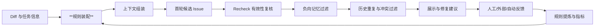
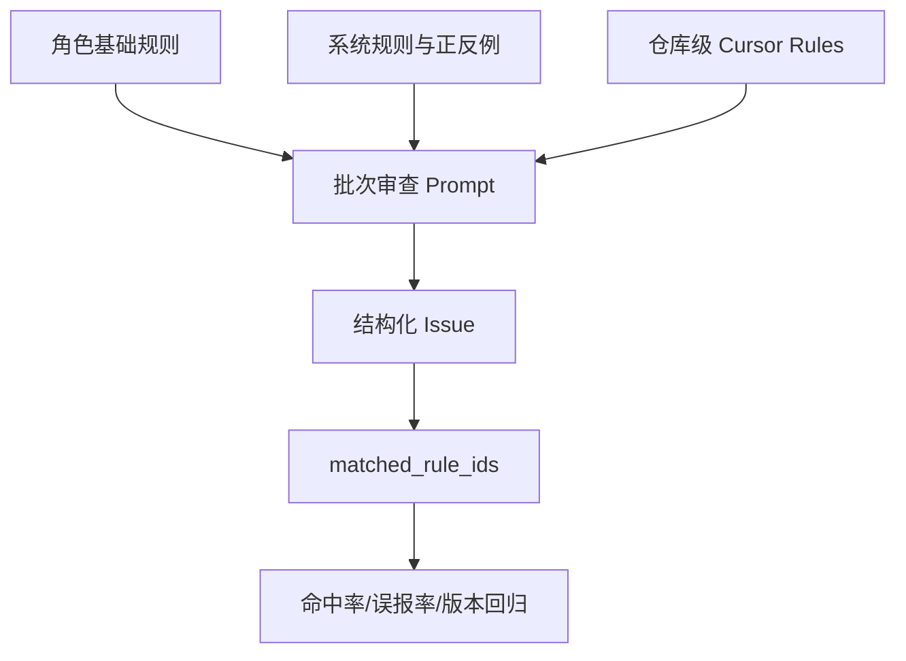
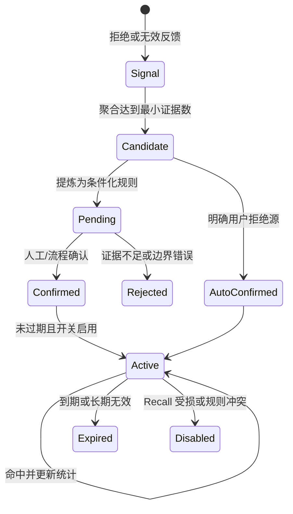
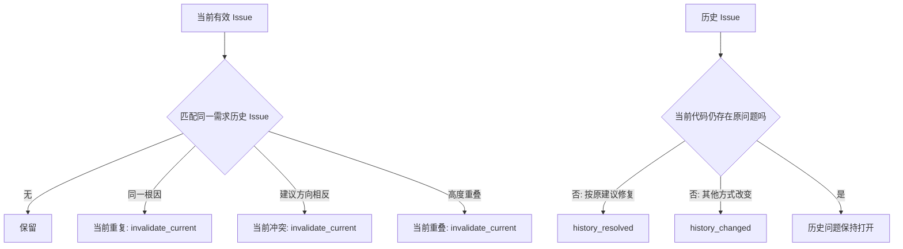
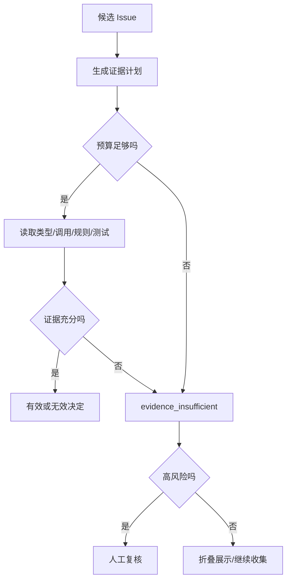
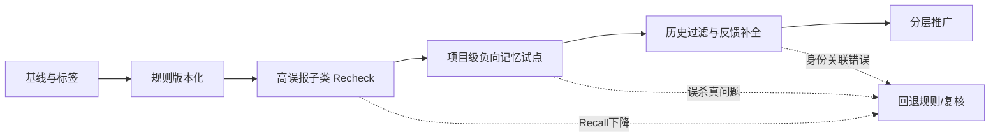

# 第 5 章　提升采纳率：规则、上下文、复核与**负向记忆**

> 预计学习时间：90–110 分钟
> 一句话总结：提升采纳率要把规则、证据、过滤和反馈做成分层流水线，并用召回率与成本防止系统为了少报而变得沉默。

## 从一条被拒绝的空值建议开始改造

设想首轮审查给出下面的候选问题：

> `accountInfo` 的字段可能为空，调用下游服务前应再次检查，否则可能出现空指针或非法请求。

开发者拒绝：“`accountInfo` 由统一入口构造，成功返回时字段完整。”如果只在 Prompt 末尾追加一句“请结合上下文，减少误报”，下一轮模型仍可能报告同类问题。因为系统没有回答四个具体问题：

1. 当前仓库是否有“信任内部对象，只在系统边界校验”的规则？
2. 审查时是否拿到了 `accountInfo` 的类型、构造函数和入口校验？
3. 首轮候选生成后，是否有人验证“可能为空”这个触发假设？
4. 开发者拒绝后，这条经验如何只影响合适的项目和用户，而不误伤别的仓库？

第 4 章已经把低采纳根因拆开。本章把它们映射成一条实际流水线：规则层定义什么值得报；上下文层提供仓库证据；Recheck 过滤首轮误判；负向记忆处理反复出现的拒绝模式；**历史过滤**消除同一需求里的重复与冲突；采纳检测和明确反馈负责验证改变。

这条链的目标不是让问题数量越来越少。一个什么都不报的系统采纳率无法定义，也没有质量价值。每次降噪都要同时检查 Recall、反馈覆盖、时延和高风险漏报。

## 先建立六层控制面



六层不是六个必须串行调用的模型。规则和上下文可以在首轮一次装配；Recheck 与负向记忆可以根据风险、成本和开关选择执行；历史过滤目前只适用于有历史任务身份的远端场景；自动采纳检测在合并后异步运行。架构价值来自职责分开，而不是调用次数多。

| 控制层 | 解决的主要根因 | 输入证据 | 错误使用的风险 |
| --- | --- | --- | --- |
| 规则 | 团队标准缺失、严重度混乱 | 通用规则、项目规则、正反例 | 规则冲突、过拟合、Prompt 膨胀 |
| 上下文 | 场景误判、已有处理 | Diff、符号、调用链、类型、文档 | 检索噪音、成本和隐私扩大 |
| Recheck | 首轮推测、范围错位、错误修复 | 候选 Issue 与仓库证据 | 两个模型共享盲点，误删真问题 |
| 负向记忆 | 同类拒绝反复出现 | 拒绝/无效反馈的稳定模式 | 把个人偏好推广成全局规则 |
| 历史过滤 | 重复、冲突、已修复旧问题 | 同一需求历史 Issue 与当前文件 | 身份关联错误，误关仍存在问题 |
| 反馈检测 | 无法判断优化是否有效 | 人工、外部流程、最终代码 | 标签偏差、语义等价误判 |

接下来按一个问题从进入到回流的顺序改造。

## 第一层：把审查标准变成可版本化规则

### 三类规则各自负责什么

课程案例的 `promptBuilder.ts` 在构建批次审查 Prompt 时，组合了三个来源。

第一类是角色基础规则。`configService.getCodeReviewRulesByRole(project_type)` 按前端或后端角色加载分类、严重度、输出结构和通用检查项。它回答“安全、规范、性能、健壮性等问题怎样描述和评分”。

第二类是规则库中的系统条目。`memoryDistiller.loadSystemPromptRules(project_type)` 按角色前缀加载已结构化的规则和 Good/Bad Case，并把规则 ID 写入 Prompt。它适合维护需要统一发布、可以统计命中的经典坑点。

第三类是仓库级 Cursor Rules。Session 在 Setup 阶段保存规则文件的压缩内容，Prompt 构建时解压并注入。它负责业务仓库自己的约定，例如组件封装、国际化方式、数据边界和禁止写法。



简化后的实现关系如下。代码省略了解压、日志与异常分支，只保留装配职责。

```typescript
// 教学化节选：promptBuilder.ts
const base = await configService.getCodeReviewRulesByRole(projectType);
const system = await memoryDistiller.loadSystemPromptRules(projectType);
const repositoryRules = decodeCursorRules(session.cursor_rules);

const reviewPrompt = compose({
  diff: files,
  baseRules: base.rules,
  examples: system.examples,
  systemRules: system.rules,
  repositoryRules,
});
```

这段代码证明当前实现支持三层装配，不证明每层内容都已经正确。规则仍需要版本、适用范围和回归样本。

### 一条可执行规则应该包含什么

“注意空值”“避免异步问题”“使用最佳实践”都太宽。它们没有触发条件，几乎能解释任何代码。可执行规则至少写清五项：

| 字段 | 问题 | 示例 |
| --- | --- | --- |
| 适用对象 | 检查什么代码 | 系统边界接收的外部请求字段 |
| 触发条件 | 什么证据出现才报告 | 字段无类型保证，且入口未校验 |
| 排除条件 | 什么情况下不要报告 | 内部对象由成功构造函数保证完整 |
| 风险与分数 | 为什么值得打断开发者 | 可触发崩溃且无恢复，4 分 |
| 证据要求 | 评论必须引用什么 | 构造路径或缺失校验的具体位置 |

例如可以把空值规则写成：

> 对来自 HTTP、RPC、消息或持久化反序列化边界的数据，若后续直接解引用且入口、类型与构造函数均未提供非空保证，报告空值风险。对只在内部成功构造路径中流转的对象，不因理论上的 `nil` 可能性重复添加校验；如果无法确认构造路径，先在 Recheck 中读取定义与调用方。

这条规则比“所有指针都检查”更长，但它减少了模型自由补全适用条件的空间。规则仍不能塞入所有项目例外。具体组件、配置和领域约束应留在仓库层。

### 正反例比口号更容易校准边界

规则库可以为同一子类保存 Good Case 和 Bad Case。Good Case 展示“什么情况下应报告”，Bad Case 展示“看起来相似但不要报告”。课程案例的分享材料将这类经典坑点按前后端和问题类别整理；当前代码也允许系统条目以规则 ID 和示例形式注入。

反例尤其适合处理防御性建议：已有可选链、框架保证、内部方法已处理、配置故意以失败启动保护系统、单写者对象不需要额外互斥锁。反例不能只贴代码，要说明排除条件，否则模型只会记住表面字符串。

### 规则冲突必须有优先级

假设基础规则说“外部错误必须捕获”，项目规则说“此 fire-and-forget 调用在内部统一上报，不阻塞调用方”。两者并不真正冲突：基础规则定义目标，项目规则定义当前实现方式。若两个来源都用绝对命令，模型可能随机选择。

建议把优先级写成：法律与安全底线高于组织通用规则；项目规则可以细化通用规则，但必须说明满足同一目标的替代机制；个人偏好只能影响非强制项。每条规则保存版本、生效时间和负责人，出现争议时可以回滚。

## 第二层：围绕假设构建最小上下文包

### 不是“给更多代码”，而是“给能判定的代码”

首轮审查通常从 Diff 开始。为了判断一个空值建议，需要的上下文可能是类型定义、构造函数和一层调用方；为了判断数据竞争，需要的是共享对象的所有写入点和并发边界；为了判断组件 API，需要的是依赖版本与封装实现。三种问题不能使用同一份固定上下文模板。

可以先按候选问题类型生成一个查询计划：

| 候选问题 | 最小上下文 | 不够时再扩展 |
| --- | --- | --- |
| 空值/越界 | 类型、注解、构造路径、直接调用方 | 反序列化入口、测试替身 |
| 异步/错误处理 | 调用方是否等待、被调用方法 catch/finally | 上层时序、重试和告警 |
| 组件/框架契约 | 实际版本、项目封装、同仓库用法 | 迁移计划、公共文档 |
| 业务条件 | 需求字段、测试、领域枚举 | 上下游接口与历史变更 |
| 并发/锁 | goroutine/Promise 创建点、共享读写 | 生命周期、锁顺序与压测 |

`Cursor CodeBase` 或其他代码检索能力只是取证工具。系统还需要记录“为什么检索这个符号”和“结果支持什么结论”。否则 Agent 读取十个文件后仍可能沿用最初推测。

### 上下文包应带版本和来源

代码审查针对某个 commit 或 MR。若 Recheck 读取的是工作区后来修改过的文件，证据会漂移。上下文项应至少携带路径、commit、符号、来源类型和截取范围。项目规则也应记录规则版本，而不是只把一段匿名文本放进 Prompt。

对大型仓库，建议限制自动扩展的层数。先读直接定义和一层调用；证据仍不够时，再按风险分数决定是否继续。低分建议如果需要十次检索才能成立，通常不适合打断当前 MR。

### 上下文质量需要独立观测

可以记录下面几项：候选问题触发了多少次代码读取；读取是否命中目标符号；是否存在文件缺失或权限失败；Recheck 最终引用了哪些证据；不同问题类型的平均上下文成本。若采纳率上升只是因为每条评论读取了几十个文件，系统可能无法规模化。

上下文增强还要设置 Recall 护栏。过于强调“只有证据完整才能报告”，会让模型把证据暂时检索不到误解成问题不存在。正确状态可能是 `uncertain`：不进入高置信评论，保留给人工抽检或异步补证。

## 第三层：用 Recheck 验证候选，不让首轮自己裁决

### Recheck 的输入是候选问题，不是空白 Diff

首轮审查负责发现。Recheck 负责逐条挑战首轮结论。当前案例对每个 Issue 提供文件、行号、`diff_scope`、分类、分数、描述、原代码、建议代码和命中规则，然后要求 Agent 读取更多上下文。

Recheck 的判断顺序很具体：

1. 问题描述、原代码和建议代码是否真的对应当前文件。
2. 问题落在变更行、上下文行还是 Diff 范围外。
3. 触发条件能否在当前仓库中成立。
4. 是否已有保护、组件保证或业务约束。
5. 修复是否出现范围蔓延、过度文档化或过度抽象。

处理结果写回 `is_valid` 和 `invalid_reason`。若无效判断使用了某条规则，还保存 `matched_rule_ids`，为后续分析规则质量提供线索。

```typescript
// 教学化节选：extensionChecker.ts
for (const result of recheckResults) {
  await Issue.update({
    is_valid: result.is_valid ? 1 : 0,
    invalid_reason: result.reason,
    source_rule_ids: result.matched_rule_ids?.join(','),
  }, { where: { id: result.issue_id } });
}
```

### Recheck 为什么不能直接当真值

Recheck 仍可能和首轮共享模型、规则与检索盲区。它能降低噪音，不等于替代人工标签。若把所有 `is_valid=0` 自动当作绝对误报并用于训练，系统会强化自身偏见。

至少做三项保护：对高风险被过滤问题抽样复核；记录 Recheck 的证据与模型版本；监控过滤前后 Recall。还可以让首轮和复核使用不同提示结构，必要时使用不同模型或静态证据，降低完全同源的错误。

### 按风险决定复核成本

每个批次执行 Recheck 会增加时延和 Token。可以采用风险路由：4–5 分候选逐条复核；3 分只对高误报子类复核；2 分默认不展示或聚合到非阻断建议。这个策略需要用仓库基线校准，不能把分数阈值当作所有项目的固定答案。

当前实现把 `recheck` 配置为每批执行，并在兜底扩展检查列表中启用。运行时配置仍可能覆盖。正文中的“默认”只指代码兜底值，不代表所有部署环境。

## 第四层：把反复拒绝转成有边界的负向记忆

### 负向记忆处理的是模式，不是单条意见

一次拒绝可能是误点、个人偏好或临时业务决定。直接把它写成永久黑名单，会迅速让系统失去召回。课程案例会先按项目和子类别聚合近期拒绝或无效信号，达到最小出现次数后，再让模型提炼为结构化规则。

负向规则包含类别、子类、规则文本、置信度、证据数、严格度和条件。`absolute` 表示在明确范围内直接过滤；`conditional` 表示必须读取上下文确认条件。例如：

```text
NEG-017
类别：健壮性 / 重复空值检查
规则：内部成功构造对象已由入口保证字段完整时，不重复报告字段空值。
严格度：conditional
条件：必须找到构造入口或非空类型保证；找不到证据时不得直接过滤。
证据数：6
```

这里的证据数不能自动证明规则正确。六次拒绝可能来自同一个人对同一需求的重复运行。提炼前需要按根因、任务和用户去重。

### 项目级与用户级不能混为一谈

当前数据模型允许 `user_id=null` 表示项目级规则，也允许保存用户级规则。加载时，如果存在当前用户，会同时读取项目规则和该用户的个人规则。这个边界很有用：

- 团队明确的组件契约、业务不变量适合项目级。
- 非强制的风格、建议展示偏好可以留在用户级。
- 安全、合规和已确认高风险规则不能被个人负向偏好覆盖。

用户级规则也可能造成回音室。某位开发者总拒绝测试建议，不代表系统应该永远不提醒他。应限制负向记忆能过滤的类别、分数和规则优先级，并保留抽样曝光。

### 规则要有确认、过期和命中统计

当前实现只加载活跃、状态为 `confirmed` 或 `auto_confirmed`、且尚未过期的规则。用户明确拒绝来源会自动确认；由 Recheck 无效信号提炼的规则默认进入待确认。规则还有过期时间、命中次数和最近命中时间。

这套生命周期比“无限追加黑名单”安全，但仍有两个实现边界需要看清：

1. 兜底提炼配置当前启用 `user_reject` 和 `bug`，没有默认启用 `recheck` 与 `user_adopt`。
2. 兜底扩展检查列表当前不含 `memory_neg`，代码只是具备这项能力；数据库热配置或调用参数可能另行启用。



### 负向记忆过滤也要读上下文

`memoryChecker.ts` 会加载项目级和当前用户级负向规则，并只处理 Recheck 后仍有效的候选。对于 conditional 规则，Prompt 明确要求读取代码上下文确认条件。命中后，Issue 被标记为无效，规则的 `hit_count` 增加。

不要把“语义相似”当作充分条件。两条空值建议文字相似，一个发生在外部输入边界，一个发生在内部对象，结论可能相反。负向规则必须有排除条件和适用范围。

## 第五层：过滤同一需求里的历史噪音

远端审查会遇到重跑、补提交和同一分支多次触发。当前案例的 `filterChecker.ts` 会寻找同一仓库与源/目标分支，或同一 MR URL 的历史完成 Session，再比较当前与历史有效问题。

它处理三类当前问题：和历史完全重复、与历史建议冲突、与历史高度重叠。它还会判断历史问题是否已在当前代码中消失，并标记为已修复或代码已变化。

这个过滤器只在 remote Session 的最后一批执行。它不是通用的每批去重器，也不能处理没有可靠任务身份的本地对话。课程设计时要把“当前实现的适用范围”和“希望所有入口都有历史记忆”分开。



历史匹配最容易出错的是身份。相同行号可能因插入代码而变化；不同描述可能指向同一根因；同一描述也可能发生在两个独立对象。可以结合文件、符号、Diff hunk、规则 ID 和根因指纹，不要只用文本相似度。

## 第六层：用反馈验证，而不是用感觉宣布提升

### 人工和外部明确反馈仍是正式指标主线

当前正式采纳率只纳入人工 0/1 与外部流程 4/5。首轮候选经过 Recheck 或负向过滤后，`is_valid=0` 会被正式查询排除。这样过滤动作能直接影响分母，所以必须同步观察过滤前候选数、过滤率和固定 Benchmark Recall。

若只看过滤后的采纳率，很容易得到虚假提升。例如原来 100 条明确反馈中采纳 60 条；新规则过滤掉 30 条，其中 20 条其实是真问题，剩余 70 条采纳 55 条，采纳率升到 78.6%，但系统少保留了 5 个已采纳问题并可能漏掉更多未反馈真问题。没有 Recall，无法判断这次改造是否值得。

### LCS 自动检测提供辅助证据

`adoptionChecker.ts` 会在合并后读取最终文件，去掉空行和注释、压缩空白，再用行级 LCS 比较 `improve_code` 与文件内容。只有建议的全部有效行都匹配时才得到自动采纳；部分匹配进入 60–69；完全不匹配得到自动未采纳。

不超过三行的建议容易在文件其他位置偶然出现。当前实现增加“短代码冲撞”检查：即使建议片段匹配，只要原代码仍以连续块存在，就按未采纳处理。

```text
improve_lines = normalize(improve_code)
file_lines = normalize(final_file)
matched = LCS(improve_lines, file_lines)

if improve_lines <= 3 and original_code_still_exists:
    adopted_lines = 0
else:
    adopted_lines = matched.length
```

这不是语义等价检测。开发者用更好的方式修复，LCS 可能判未采纳；相同片段碰巧存在，也可能造成假阳性。自动 2/3 和部分 60–69 当前不进入正式采纳率分母，适合作为待复核、反馈补全和检测器评估数据。

### 分开评估“问题正确”和“建议可直接使用”

自动检测主要观察建议代码是否出现，不能单独判断风险是否成立。建议为抽样评审保留两列：`issue_validity` 与 `fix_adoption`。问题成立但修复改写的样本，不应和纯误报混为一谈；问题不成立但开发者顺手做了相似修改，也不能直接算模型判断正确。

## 规则与过滤器怎样避免互相打架

当系统同时有基础规则、项目规则、Recheck、负向记忆和历史过滤时，一个 Issue 可能经历多个判断。若每层只写最终布尔值，团队会看到问题“突然消失”，却不知道是哪一层做了决定。

建议把每次判断保存成事件，而不是只覆盖 Issue 当前字段：

```text
issue_created
  rule_ids: [SYS-BE-R012, PROJECT-07]
  model_version: ...

recheck_completed
  decision: invalid
  reason_type: existing_protection
  evidence: [service/foo.ts#parse, types/request.ts#Header]

negative_memory_checked
  decision: keep
  rule_id: null

feedback_received
  source: external
  adoption: adopted
```

当前案例主要在 Issue 上保存最终状态、无效原因和规则 ID，已经能支持基础追踪。事件模型是课程建议，适合检查器继续增加后的演进。它能回答“Recheck 判无效，但开发者后来采纳了，哪条规则需要复查”，也能重放旧逻辑。

### 决策优先级不能藏在 Prompt 里

可以定义一张显式优先级表：

| 冲突 | 建议处理 |
| --- | --- |
| 安全/合规底线与个人负向记忆冲突 | 保留问题并转人工，不允许个人规则过滤 |
| 项目契约与通用风格规则冲突 | 项目契约优先，记录替代机制 |
| Recheck 判无效但静态分析有确定证据 | 保留或升级人工复核，模型不能覆盖确定证据 |
| 历史建议与当前建议方向相反 | 读取当前代码与规则版本，不按时间简单选新或旧 |
| 自动检测未采纳但人工明确采纳 | 人工明确反馈优先，保留检测差异用于改进算法 |

优先级最好由后端代码执行，而不是要求模型记住。模型负责给出结构化判断，Harness 决定某类判断是否有权过滤高分问题。

### 过滤动作必须是可逆的

“过滤”不应等于删除。将 Issue 标成无效时保留原评论、规则版本、检查器、原因和证据；看板允许按检查器查看被过滤项。规则回滚后，可以重算状态或恢复展示。

若负向规则误杀了安全问题，团队需要定位它命中过哪些历史 Issue。`hit_count` 只能告诉命中次数，不能给出具体样本；更完整的实现可以增加规则命中关系或审计日志，并设置保留期。

## 为上下文设置预算和降级路径

上下文增强最容易从“缺证据”走向“把全仓库都交给模型”。应给每个候选问题设置预算：最大文件数、最大符号层数、最大 Token、最大耗时和工具失败后的状态。

一种风险分层方式是：5 分候选允许读取直接定义、两层调用和相关测试；4 分读取直接定义与一层调用；3 分只读取直接定义；低分没有明确项目规则时不自动扩展。具体数值需要用仓库规模和模型成本校准。

预算耗尽后的结果不能默认为“有效”或“无效”。可以返回 `evidence_insufficient`，并按风险选择：高风险交给人工，低风险进入折叠区，不参与自动负向规则生成。



工具失败也要分类。文件不存在可能来自重命名；权限失败是运行环境问题；符号搜索无结果可能是语言索引未准备；超时是容量问题。把它们都写成“未发现上下文”会让 Recheck 做出错误否定。

## 负向规则的反误杀测试

每条负向规则至少要有三组测试样本：应该过滤、表面相似但应该保留、证据不足不能自动决定。

以“内部对象不要重复空值检查”为例：

| 样本 | 上下文 | 期望 |
| --- | --- | --- |
| A | 对象只来自成功构造函数，字段有非空保证 | 过滤重复空值建议 |
| B | 对象来自 RPC 反序列化，字段可缺失 | 保留空值风险 |
| C | Diff 只出现使用点，构造路径检索失败 | 不自动过滤，标证据不足 |

上线前在固定集上回放所有活跃负向规则。规则更新不仅测试自己的样本，还要运行安全、并发、鉴权等高风险回归集。否则一个宽泛的“不要做防御性检查”可能消掉真正的边界校验。

规则过期不代表直接删除。到期时可以进入观察状态：停止自动过滤，但继续记录“若启用会命中哪些 Issue”，重新积累证据后再确认。这样能发现组件升级或业务变化导致的规则漂移。

### 检查用户级规则是否污染项目级判断

同一个 Issue 可以分别用项目规则、用户规则运行影子判断。如果只有用户规则过滤，展示层可以对该用户折叠，但保留项目级结果用于指标和团队 Review。高风险问题则不允许个人规则改变可见性。

个人偏好也应有上限。若一个用户产生大量负向规则，可能是他对反馈入口的理解不同，或系统在该模块上有结构性误报。此时优先做根因调查，不是继续增加个性化过滤。

## 让看板能回答“哪一层有效”

总体采纳率只能告诉系统输出后的结果。为了评估分层流水线，可以增加漏斗：

```text
首轮候选 1,000
  -> Recheck 保留 780
  -> 负向记忆保留 735
  -> 历史过滤保留 710
  -> 高分且明确反馈 260
  -> 采纳 180
```

每一层同时显示过滤数量、过滤原因、被过滤高分数量、人工抽查真阳性率和额外成本。漏斗中的 69.2% 明确反馈采纳率不能单独证明前三层正确；还要看固定 Benchmark 中从 1,000 到 710 的过程中损失了多少真问题。

建议至少提供下面四个视图：

1. 规则视图：每条规则命中、采纳、拒绝、Recheck 无效和版本变化。
2. 检查器视图：Recheck、负向记忆、历史过滤分别过滤什么，抽查错误多少。
3. 根因视图：`false_positive`、`bad_fix`、`already_handled`、`low_value` 等趋势。
4. 成本视图：每层的 Token、工具调用、时延、失败和证据不足率。

还应把“问题判断正确但修复不可用”单独列出。如果只用 Issue 采纳状态衡量规则，修复生成的缺陷会错误归因给发现阶段。

## 异常与恢复：降噪链不能拖垮审查主流程

规则解压失败、代码检索超时、Recheck 返回结构错误、记忆服务不可用、历史任务关联失败，都可能发生。每层要定义失败时是 fail-open 还是 fail-closed。

| 失败 | 推荐降级 | 原因 |
| --- | --- | --- |
| 项目规则读取失败 | 使用基础规则，报告配置告警 | 不应阻断全部审查，但结果置信度下降 |
| Recheck 超时 | 保留首轮候选并标未复核，或高风险人工复核 | 不能把超时当无效 |
| 负向记忆不可用 | 跳过过滤 | 负向层是降噪增强，不应阻断发现 |
| 历史关联失败 | 保留当前问题，停止修改历史状态 | 错误关联比重复展示风险更高 |
| 自动采纳检测失败 | 保持未知，稍后重试 | 不能写成未采纳 |

安全与合规规则读取失败时可以采取更严格策略，例如阻断自动合入并请求人工检查。不同规则等级需要不同失败语义。

恢复后不要静默补写。保存检查器状态、重试次数和最终来源，避免同一 Issue 被重复过滤或反馈覆盖顺序错乱。第 2 章的外部状态机思想在这里仍然适用：模型输出不是完成证明，检查器的结构化结果成功持久化后才算该层完成。

## 从影子运行到正式过滤

降噪能力适合按四个阶段发布。

阶段一只记录。新规则、Recheck 或负向记忆产生判断，但不改变用户可见结果。团队比较“如果启用会过滤什么”。阶段二折叠低风险建议，用户仍可展开，高风险不自动过滤。阶段三在一个项目正式过滤已确认子类，同时抽样所有高分过滤项。阶段四才扩大仓库与问题类型。

每个阶段设置停止条件：高风险 Recall 下降；某条规则出现跨模块误杀；证据不足率显著升高；成本超过预算；用户反馈覆盖下降；规则冲突无法解释。触发后回退到上一阶段，而不是用更多例外覆盖错误规则。

影子运行也要防止评估污染。若同一开发者同时看到新旧两套评论，反馈会互相影响。可以只在后台比较，或按任务稳定分流。固定 Benchmark 用于可重复回归，新时间窗口样本用于检查泛化。

## 上线前核对实现、兜底配置和运行配置

采纳率链路常见的误会是“代码里有，所以线上正在运行”。上线评审应并排检查三层：实现是否存在；代码兜底是否启用；数据库、环境变量或任务参数最终给了什么值。

以当前案例为例，`recheck` 位于兜底扩展检查列表，`memory_neg` 只出现在推荐配置中；负向规则提炼的兜底来源包含用户拒绝，不包含 Recheck 无效信号；远端 `filter` 还要求 Session 的 `remote` 标志和最后一批条件。只看类名会错误推断整条链都在每次审查执行。

可以用下面的发布核对表：

| 检查 | 需要留下的证据 |
| --- | --- |
| 规则来源 | 本次加载的基础、系统和项目规则版本及数量 |
| 检查器开关 | Session 最终启用列表，而不是代码常量 |
| 条件满足 | project_id、remote、最后一批、历史任务身份等条件 |
| 结果持久化 | 每个检查器完成状态、过滤数量和失败原因 |
| 反馈来源 | 人工、外部和自动状态的写入时间与覆盖关系 |
| 回退能力 | 可以关闭的配置项、规则版本和恢复步骤 |

测试环境还应覆盖“规则为空、项目规则解压失败、负向规则过期、历史任务找不到、Recheck 返回少一条结果、自动检测文件重命名”等失败路径。正常路径通过只能证明演示可运行，不能证明降噪链在异常时不会误删问题。

完成核对后，把实际运行配置快照绑定到实验记录。采纳率变化若没有配置快照，团队无法判断是规则内容、检查器启用、模型版本还是反馈入口改变造成的。

## 用五个里程碑实施采纳率改造

### 里程碑一：建立可解释基线

固定一个仓库、模型、规则版本和成熟窗口。保存明确反馈采纳率、反馈覆盖率、每类拒绝原因、固定 Benchmark Recall、平均审查时延与成本。抽样复核至少包含已采纳、已拒绝和无反馈三组。

完成条件是能回答“主要噪音来自哪里”，而不是得到一个漂亮的总体比例。

### 里程碑二：规则最小化与命中追踪

先处理证据最充分的两三个根因桶。把宽泛规则改成触发条件、排除条件和证据要求；为每条规则分配 ID；在 Issue 中记录命中。离线回放固定样本，检查新规则是否减少目标误报，同时保留原有真问题。

失败时回退规则版本，不要在同一轮继续添加更多例外。

### 里程碑三：为高误报子类增加 Recheck

选择 `already_handled`、组件契约误判或范围错位等子类，要求 Recheck 读取最小上下文。记录每条候选的检索次数、有效/无效结论与理由。先离线或影子运行，再决定是否进入正式展示链。

完成条件包括目标根因桶下降、Recall 无明显损失，以及成本在可接受范围。

### 里程碑四：小范围启用负向记忆

先在一个项目启用，只接受达到最小证据数、置信度阈值、明确适用条件且有过期时间的规则。高分与安全问题默认不允许个人负向规则直接过滤。每周抽查命中样本和被过滤的真问题。

如果 Recall 下降或某条规则跨模块误杀，立即禁用该规则，而不是等整体指标恢复。

### 里程碑五：接入历史过滤与反馈补全

为远端任务建立稳定身份，处理重复、冲突和已修复历史 Issue。合并后运行自动检测补充证据，并推动外部流程提供明确 4/5 状态。看板同时显示正式采纳率、自动检测覆盖、无法判断和部分采纳分布。



## 设计一场能判读的改造实验

以“重复空值检查”作为目标根因。实验可以这样设计：

| 项目 | 对照组 | 处理组 |
| --- | --- | --- |
| 首轮规则 | 当前版本 | 相同 |
| 首轮上下文 | 当前版本 | 相同 |
| Recheck | 当前逻辑 | 强制读取构造入口与直接 callee |
| 负向记忆 | 关闭 | 关闭，避免变量混杂 |
| 样本 | 同一固定 Benchmark 与影子 MR | 同一批样本 |
| 主要指标 | 该子类人工确认 Precision | 同左 |
| 护栏 | 高风险 Recall、时延、调用次数 | 同左 |

如果处理组减少了重复校验误报，却把真正来自外部输入的空值风险也过滤掉，说明 Recheck 规则缺少系统边界条件。若准确率不变但成本增加，说明问题不在检索，而在规则或首轮分类。

第二轮才加入负向记忆。仍使用同一 Benchmark，并增加新时间窗口的盲测样本，防止规则只记住开发集。每次只增加一个主要变量，保留回退开关。

### 推荐的发布门槛

门槛应由仓库基线决定，下面是一组结构，不是固定数字：

- 目标误报子类相对下降，并达到最小样本量。
- 固定 Benchmark 的高风险 Recall 不低于基线容忍区间。
- 被 Recheck 或负向规则过滤的高分问题完成人工抽查。
- 审查时延和 Token 成本没有超过服务预算。
- 规则命中、过滤原因和版本可以追溯。
- 无法判断率没有因“更谨慎”大幅上升。

采纳率上升只能算一个条件。Recall、成本、反馈覆盖与可追溯性共同决定能否推广。

## 迁移任务：为另一个仓库设计降噪闭环

选择一个你熟悉的仓库，找出一种经常被拒绝的评论。不要直接写新 Prompt，先提交一页设计：

1. 给出三条成对样本：候选问题、拒绝证据、最终代码。
2. 判断根因属于规则、上下文、范围、修复、历史还是价值。
3. 写一条带触发条件、排除条件和证据要求的规则。
4. 设计 Recheck 需要读取的最小上下文与停止条件。
5. 决定这条经验应是组织、项目还是个人范围，保存多久，谁能禁用。
6. 定义主要指标、Recall 护栏、成本预算与回退条件。

一个合格方案应该允许评审者指出“哪项证据会让这条规则不再成立”。如果规则无法被证伪，它很可能只是偏好口号。

评审这份设计时，还要追问过滤失败怎样恢复。规则加载失败时是否退回基础审查；Recheck 超时时候选是否保留；负向规则误杀后能否查到命中样本并回放；项目级规则是否会被个人偏好覆盖。没有这些答案，闭环只描述了成功路径。

最后用一条此前从未出现过、但根因相似的代码变更做盲测。开发样本通过只能说明系统记住了已有案例，盲测才能检查触发条件是否具备迁移性。


## LCS 自动采纳检测：为什么 100% 才判采纳

采纳反馈的收集是一个瓶颈。如果每个 Issue 都等待开发者手动点击"采纳"或"拒绝"，数据积累会很慢。自动采纳检测试图解决这个问题——它不依赖开发者反馈，而是直接比较 AI 建议的代码片段和最终合入的代码。

系统的自动检测逻辑是：清理建议代码和最终文件中的注释和空行，压缩空白字符，然后做行级 LCS 比较。LCS 匹配率达到 100% 才判定为明确采纳（状态 2），0% 判定为明确未采纳（状态 3），中间值映射到 60–69 的部分采纳区间。

为什么 100% 才判采纳？因为 LCS 只能判断"建议代码是否出现在最终文件中"，不能判断"出现的原因是什么"。一个建议说"在这里加 return null"，最终文件确实有 return null——但可能开发者本来就要加，不是因为看了 AI 的建议。短代码尤其容易产生这种冲撞。

因此系统专门处理了短代码冲撞：不超过 3 行的建议如果和最终文件发生匹配但原代码仍存在，会按未采纳处理。这是降低假阳性的启发式，仍可能漏掉等价改写——开发者用库函数替代了建议的原始代码，行为相同但 LCS 匹配不到。

自动检测适合做运营提示、抽样和后续标注。当前正式采纳率不把自动状态纳入，不是因为自动检测没用，而是**在未经校准前不应与人工确认等权混合。** 团队计划在积累足够的校准数据后，逐步将特定区间的自动状态纳入正式口径。

## 反误杀回归：任何过滤都必须检查 Recall

采纳率的提升很容易走向一个危险的捷径：减少报告数量。规则更严→少报问题；Recheck 更激进→多判无效；负向记忆更宽→多静默。每一项操作都让采纳率上升——但可能同时把真正的问题也过滤了。

因此系统有一条硬约束：**任何过滤机制上线时，都要在固定 Benchmark 样本上运行一遍，检查 Recall 是否下降。** 如果 Recall 下降，即使采纳率大幅上升，这个过滤机制也不合格。

具体操作是：冻结一批经过双人标注的样本（包含应报告和不应报告两类），在过滤机制上线前后分别运行审查，比较两版结果。被新过滤掉的问题逐条人工抽查——确认它们确实是误报，还是被误杀的真问题。

如果一条负向规则过滤了 10 条噪音但也误杀了一条安全建议，这条规则就应该被禁用。如果 Recheck 把某个子类的误报从 80% 降到 40%，但同时把这个子类的真问题也过滤了 20%，需要判断 trade-off——但默认态度是宁可保留更多噪音也不误杀高风险问题。

## 异常恢复与影子发布

规则变更不能"改完就上线"。团队建立了分阶段发布流程。

**影子模式**：新规则在后台运行，产出标记但不影响最终展示给开发者的 Issue 列表。收集 3–5 天的数据后，对比影子规则和正式规则的采纳率、覆盖和 Recall。如果影子规则确实减少了目标误报且未引入新问题，进入灰度。

**灰度发布**：先对一个项目或一个团队启用新规则。如果该项目的采纳率上升且 Recall 未下降，扩大范围。

**配置核对**：每次发布前确认当前生效的规则版本、Recheck 阈值、负向记忆范围和过滤策略。由于系统使用数据库热配置（60 秒自动刷新），配置变更不会立即反映到所有运行中的审查——**拉取模式让配置变更有观察窗口。**

## 五个里程碑的详细展开

**里程碑一：建立可解释基线。** 固定一个仓库、模型、规则版本和成熟窗口。保存明确反馈采纳率、反馈覆盖率、每类拒绝原因、固定 Benchmark Recall、平均审查时延与成本。抽样复核至少包含已采纳、已拒绝和无反馈三组。完成条件是能回答"主要噪音来自哪里"，而不是得到一个漂亮的总体比例。

**里程碑二：规则最小化与命中追踪。** 先处理证据最充分的两三个根因桶。把宽泛规则改成触发条件、排除条件和证据要求；为每条规则分配 ID；在 Issue 中记录命中。离线回放固定样本，检查新规则是否减少目标误报同时保留原有真问题。失败时回退规则版本，不要在同一轮继续添加更多例外。

**里程碑三：为高误报子类增加 Recheck。** 选择"已有处理"、组件契约误判或范围错位等子类，要求 Recheck 读取最小上下文。记录每条候选的检索次数、有效/无效结论与理由。先离线或影子运行，再决定是否进入正式展示链。完成条件包括目标根因桶下降、Recall 无明显损失，以及成本在可接受范围。

**里程碑四：小范围启用负向记忆。** 先在一个项目启用，只接受达到最小证据数、置信度阈值、明确适用条件且有过期时间的规则。高分与安全问题默认不允许个人负向规则直接过滤。每周抽查命中样本和被过滤的真问题。如果 Recall 下降或某条规则跨模块误杀，立即禁用该规则，而不是等整体指标恢复。

**里程碑五：接入历史过滤与反馈补全。** 为远端任务建立稳定身份，处理重复、冲突和已修复历史 Issue。合并后运行自动检测补充证据，并推动外部流程提供明确 4/5 状态。看板同时显示正式采纳率、自动检测覆盖、无法判断和部分采纳分布。


## 本章收束

采纳率工程是一条从标准到证据、再到反馈的链。规则层减少标准漂移；上下文层验证触发条件；Recheck 挑战首轮候选；负向记忆吸收稳定的拒绝模式；历史过滤解决重复和冲突；人工、外部与自动反馈共同提供验证信号。

课程案例已经具备这些能力的大部分代码对象，但能力存在不等于默认启用。`memory_neg` 不在当前兜底扩展检查列表，负向规则提炼的默认源也有限；数据库热配置可能改变运行行为。架构评审必须同时查看实现、兜底配置和实际运行配置。

最后保留一条硬约束：不能通过沉默提升采纳率。任何过滤器、规则或记忆上线时，都要在固定样本上检查 Recall，对高分被过滤问题做抽样，并保留版本和回退开关。第 6、7 章会把同样的工程思路转向另一个方向：模型没有报错，但它可能在大型任务中漏掉本应报告的问题。

## 参考文献

本章以课程案例当前实现、脱敏后的采纳与拒绝样本，以及规则、上下文、复核和反馈回流方案为主要事实来源。代码片段均为教学化节选；开关与默认值以当前代码兜底配置为准，实际运行值可能由外部配置覆盖。
