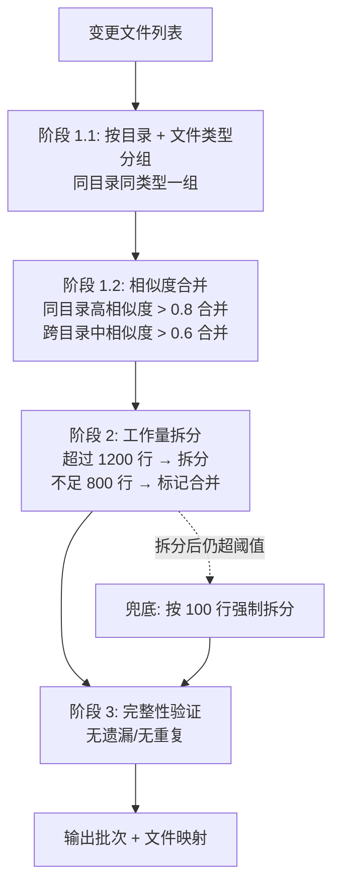
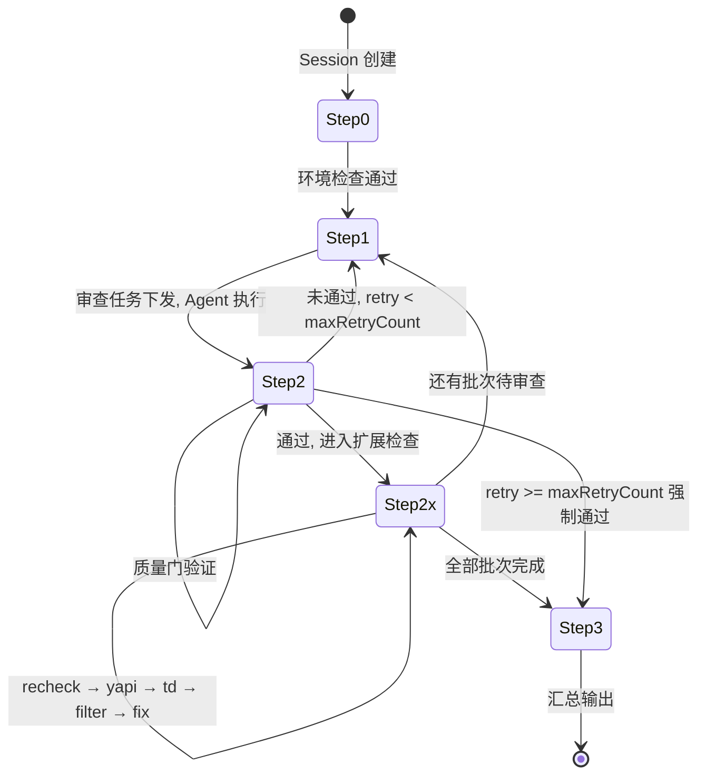
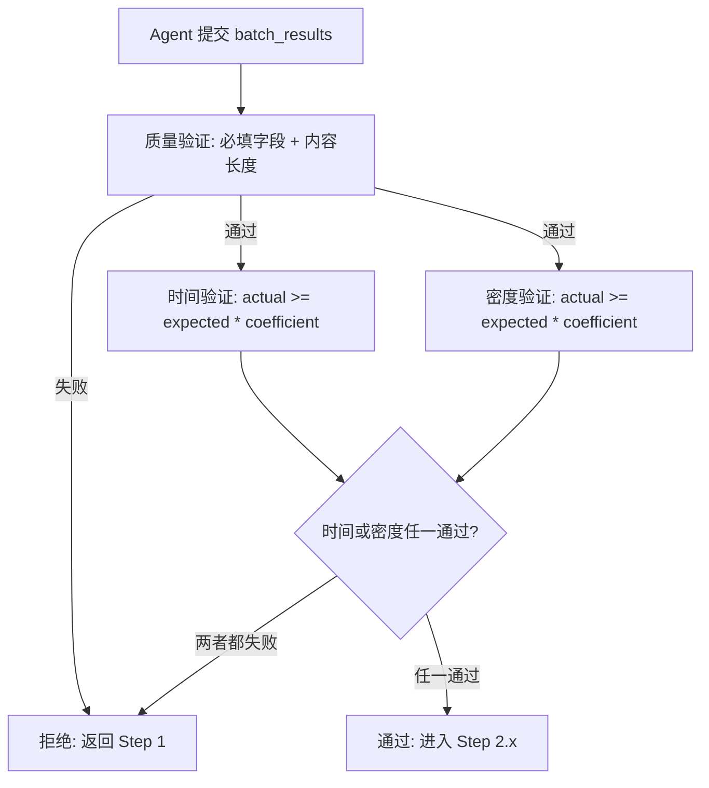
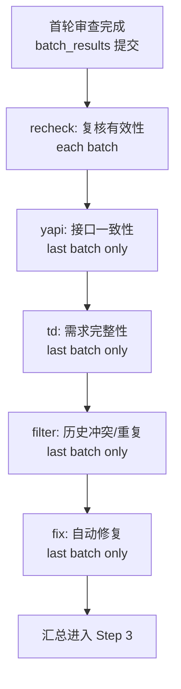
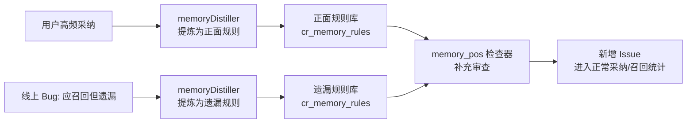
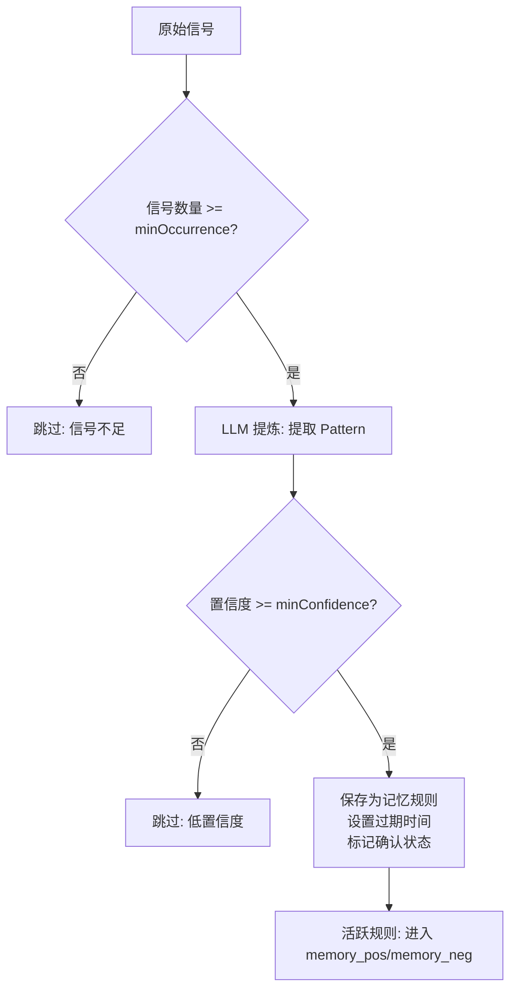
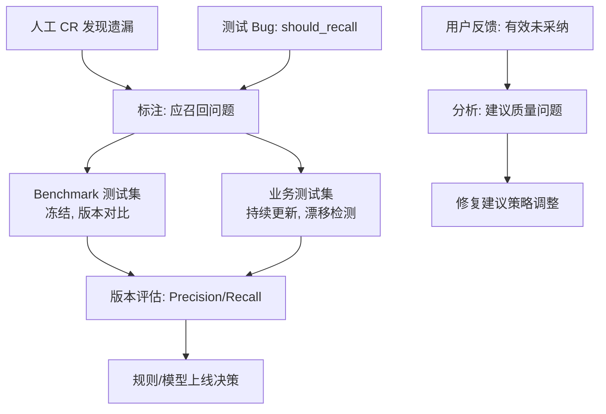
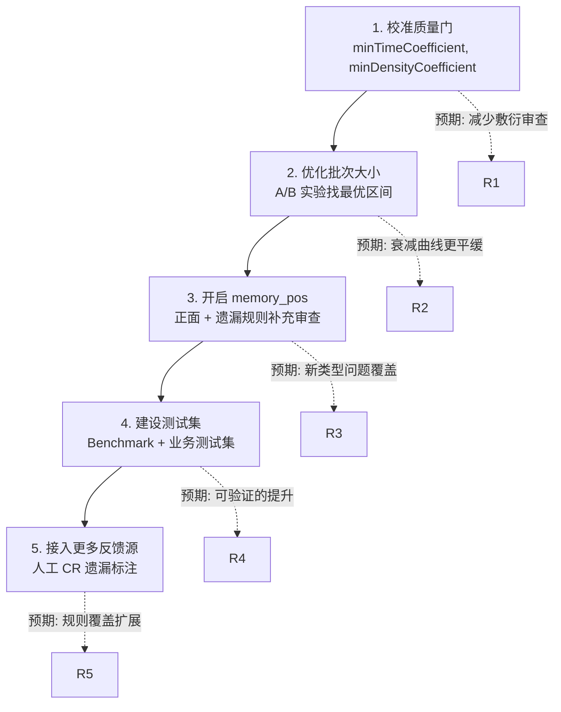

# 第 7 章 提升召回率：分批、**状态机**、质检与**数据回流**

> 预计学习时间：90–110 分钟
> 一句话总结：**用外部**完成证明**、**质量门**和**漏报回流**推动每一批审查真正结束**，让漏掉的问题有路径回到系统中。

## 召回率的提升不在模型，在控制

第 6 章结束的时候，我们得到了一个诊断：大型任务中模型出现输出衰减、步骤遗漏和流程控制失效，加强 Prompt 和让模型自管理都不能从根本上解决。这一章讲解法。

解法不是"找更强的模型"，也不是"写更详细的 Prompt"。解法是把流程控制从模型手中拿出来，交给外部系统。外部系统做四件事。把大任务切分成可管理的小块，让每一块都在模型的舒适区内。用状态机限制每一步的行为，不允许模型跳过步骤。用质量门验证每一步的产出，不达标的打回去重做。把漏掉的问题通过数据回流重新注入系统，让下一次审查更完整。

这四个机制分别对应代码中的四个模块：`batchAllocator.ts` 负责切分，`processor.ts` 负责状态机，`verifier.ts` 负责质量门，`memoryDistiller.ts` 和 `memoryChecker.ts` 负责数据回流。把它们串起来，就是一个从"模型自己审"到"系统驱动审"的完整方案。

## 语义分批：不只是"切小"

把大任务切小是最直观的思路，但"怎么切"比"切多小"重要得多。

案例的 Batch Allocator 使用三层算法。第一层语义分组：按文件路径的目录层级和文件类型把变更文件分到不同组。`/pages/user/Profile.tsx` 和 `/components/Button.tsx` 进入不同组，`/api/user.ts` 和 `/store/user.ts` 也进入不同组。分组依据不是文件数量，而是文件在工程中的语义角色。

第二层相似度合并：同目录下不同文件类型的组——比如 `/user/` 下有组件也有 Hooks——如果文件类型相似度高，合并为一个批次。合并阈值有两档：高相似度 0.8 和中等相似度 0.6。高相似度的组优先合并，确保关联紧密的文件在一起审查。中等相似度只在跨目录场景下触发，用来避免跨目录碎片。

第三层工作量拆分：合并后的批次如果 diff 行数超过理想最大值（1200 行），按文件拆分或按行数切分。如果不足理想最小值（800 行），标记为需要合并，在后续步骤中与相邻批次合并。兜底拆分按 100 行一组切，是最后的保底路径，通常不会触发。

每一层之后都有日志记录：分组后的批次数量、合并后的批次数量、拆分后的批次数量。这些日志不只是调试信息——它们是批次规划的审计轨迹，告诉你每个文件最终落在了哪个批次、为什么。

### 为什么不按文件数分

直觉可能会说"每批 3 个文件"。代码中也确实有 `idealMinFiles` 和 `idealMaxFiles` 都设为 3 的配置。但实际分配以 diff 行数为主要依据，文件数为辅助约束。

原因很简单：一个 5 行的配置文件和一个 300 行的业务组件，审查工作量差两个数量级。按文件数分会导致有的批次太轻（模型可能觉得不值得认真看），有的批次太重（模型可能在后期衰减）。按 diff 行数分，每批的工作量更均匀，衰减的可预测性更强。

另一个原因是上下文窗口。diff 行数直接对应输入 token 消耗。800–1200 diff 行的输入 token 消耗相对可控，留给关联上下文、规则和 Prompt 的空间也相对稳定。超过 1200 行，关联上下文可能被压缩，模型审查质量开始波动。

### 历史复用批次的特殊处理

如果一个 Session 中有文件在上次审查中没有变化（通过 content_hash 检测），这些文件会被归入"历史复用"批次。这个批次的状态直接标记为 `completed`，`actual_reviews` 使用上次审查的结果数量。

历史复用的价值不只是节省 Token——它也减少了模型的重复工作，让模型的注意力集中在真正有变化的代码上。第 5 章讲的历史过滤（filter checker）处理的是 Issue 级别的重复和冲突，这里的文件复用处理的是文件级别的重复。两套机制互补，共同减少噪音和遗漏。

## 状态机：外部流程控制

第 6 章展示了三次失败实验的结论：模型不能可靠地管理自己的审查流程。案例的解决方案是一个服务端状态机。

### 不是建议，是硬约束

`allowed_next_step` 是一个数据库字段，不是一段 Prompt 文本。Agent 调用"下一个任务"接口时，服务端读取这个字段，只返回当前步骤对应的工作内容。Agent 不能跳到前面的步骤，也不能跳到后面的步骤，甚至不能在当前步骤未完成时请求下一步。

这解决了"步骤遗漏"的根因。模型不需要记住"我接下来应该去重"，因为系统不会给它去重任务，直到它先完成审查和验证。模型不需要记住"我审查完这 10 个文件了吗"，因为系统只会在它提交完当前批次的结果后，才返回下一批文件。

完整的状态序列是 `0 → 1 → 2 → 2.x → 3`。

Step 0 是环境检查。系统确认 Agent 的 CLI 版本、MCP 配置和连接状态。这个步骤不涉及代码审查，但它的存在避免了"审查跑了一半发现连接断开"的问题。

Step 1 是审查任务下发。系统返回当前批次的文件列表、diff 内容、审查规则、关联上下文和下一步指令。Agent 拿到这些信息后执行审查，生成 Issue 列表。

Step 2 是结果提交与验证。Agent 提交 `batch_results`，系统运行质量门。通过后 `allowed_next_step` 变为 `2.x`，进入扩展检查；不通过则重置为 `1`，Agent 需要重新审查同一批代码。

Step 2.x 是扩展检查。根据配置逐个执行扩展检查器——recheck、memory_neg、yapi、td、memory_pos、filter、fix。每个检查器完成后，系统更新扩展检查状态，返回下一个检查器的 Prompt。

Step 3 是汇总。所有批次完成且扩展检查结束，系统生成最终报告。

### 重试与降级

重试上限 `maxRetryCount` 默认是 3。Agent 连续提交 3 次不合格结果后，系统强制通过当前批次。这不是理想行为，但避免了审查流程永久卡死。

降级路径覆盖了两种异常。如果 Agent 在 Step 2 提交时没有附带 `batch_results`——可能是通信丢失或 Agent 崩溃——系统回退到 Step 1 重新下发审查任务。如果 Agent 在 Step 2.x 提交时没有附带 `extension_results`，系统清空扩展检查状态，也回退到 Step 1。

降级的设计原则是"宁可重复工作，不要静默失败"。一次重复审查的成本可控（额外的模型调用和等待时间），但一次静默跳过导致的漏报，可能要到测试甚至线上才会暴露。

### 为什么状态机在服务端而不是 Agent 端

如果状态机实现在 Agent 端——比如 Agent 的 Prompt 中包含"你的状态应该是 reviewing，完成审查后改为 verifying"——模型仍然需要自己维护和遵守状态。第 6 章已经证明，模型在大型任务中无法可靠地做到这一点。

服务端状态机的优势是状态不依赖模型的"记忆"。状态存在数据库中，由代码逻辑驱动，不会因为模型"忘了"或"偷懒"而改变。Agent 只是一个无状态的执行器：它接收任务、执行任务、提交结果，然后接收下一个任务。它不需要知道自己在整个流程中的位置，不需要规划后续步骤，甚至不需要知道总共有多少个批次。

这种设计把 Agent 的职责从"管理审查流程"缩减为"执行单次审查"。模型只需要做好一件事：看代码，找问题。其他所有事情——分片、调度、验证、去重、汇总——由服务端完成。

## 批次间状态推进：从"审查完了"到"审查结束了"

状态机保证每步不会跳过，但批次之间的推进还有一个容易被忽略的问题：怎么判断一个批次"真正结束了"。

当前代码在  中处理批次完成：验证通过后， 变为 。如果当前批次不是最后一个， 完成后回到 ，下发下一个批次的审查任务。如果是最后一个批次，进入  做汇总。

但"下一个批次"的判断依赖于  的递增。如果系统错误地跳过了某个批次——比如 Batch 3 的状态被过早标记为 ——后续批次会照常推进，被跳过的文件的审查结果永远缺失。

代码中通过批次列表的完整性来防范这个问题。 在创建 Session 时构建了完整的批次列表和文件到批次的映射关系。 下发任务时按  从已存储的批次列表读取。如果某个批次索引的批次记录不存在，系统返回错误而不是跳到下一个。

但批次完成的状态标记时机也很关键。当前代码在  验证通过后调用  更新批次状态。这个更新与  的修改变不是一个原子操作——如果更新失败但  已经改变，系统会认为批次已完成但数据库中没有记录。

处理这类边界情况的工程实践是使用数据库事务包装批次状态更新和会话状态更新，或在读取时做防御性检查——"如果  说批次已完成但 Batch 状态仍是 ，以 Batch 实际状态为准"。

## 质量门：外部完成证明

状态机保证流程不会跳过，但流程走完不代表审查质量足够。质量门验证每一步的产出是否达到最低标准。

### 三层验证

`verifier.ts` 执行三层检查。第一层是质量验证——必填字段是否完整，内容长度是否达标，高风险问题是否提供了代码建议。这一层是硬约束，不通过直接拒绝，不会进入后续检查。

第二层是时间验证。系统根据文件数量和 diff 行数计算期望审查时间，然后比较实际耗时与期望耗时乘以 `minTimeCoefficient`。如果系数设为 0.3，实际时间不到期望的 30%，时间验证失败。

第三层是密度验证。系统根据 diff 行数和 `linesPerExpectedIssue`（默认每 100 行期望 1 个问题）计算期望问题数，然后比较实际发现问题数与期望数乘以 `minDensityCoefficient`。

时间与密度的策略是"或"——只要其中一项通过，整体通过。逻辑是：如果花了足够时间但问题少，可能是代码质量好；如果时间短但找到了预期数量的问题，说明效率高。两项都不通过，说明"又快又没发现问题"，大概率是敷衍。

### 验证失败的完整处理链路

当质量门拒绝一次审查结果时，不只是回退到 Step 1 重新审查那么简单。代码中有一条完整的失败处理链路。

 返回 。reason 记录失败原因——"审查时间不足且问题密度不足"或"审查记录缺少必需字段"。details 记录具体数值——实际耗时、期望耗时、密度系数、失败的具体字段。

 收到失败结果后调用 。这个方法原子地增加当前 Batch 的重试计数器。如果重试次数未达到 ， 更新 Batch 状态为 ，然后调用  构建一条包含失败原因的重新审查 Prompt——"请重新审查，关注以下遗漏项"。

如果重试次数达到上限，熔断机制触发。系统记录 warn 日志："熔断机制触发，强制通过，不再重试"。Batch 状态更新为 ，但流程继续推进到 Step 2.x 或下一个 Batch。

熔断触发的 Session 需要后续人工复查。系统不会自动标记熔断 Batch 的 Issue 为"可能遗漏"——这意味着漏报可能悄无声息地进入最终结果。课程案例团队通过监控  的 Session 来发现这些情况，但当前代码中没有一个字段明确区分"正常通过"和"熔断通过"。

一个改进方向是为 Batch 增加  字段：、、。看板展示三种状态的比例，团队可以一眼看出哪些 Batch 是强行通过的，并据此决定是否需要人工抽查。

### 阈值配置的三个层级

质量门的阈值有三个来源：代码默认值（`utils/config.ts` 中的兜底值）、数据库热配置（`cr_shift_left_config` 表）、运行时调用参数。三者的优先级是运行时参数最高，数据库配置次之，代码默认值最低。

课程案例代码中，四个核心阈值的默认值都设为关闭状态——`minTimeCoefficient=0`、`minDensityCoefficient=0`、`highRiskScoreThreshold=999`、`minContentLength=0`。这意味着如果数据库没有配置，质量门不生效。

这个设计的工程含义是：部署代码不等于质量门在运行。需要显式的配置动作——在数据库中写入合适的阈值——质量门才会真正拦截不达标的审查结果。案例团队的实际做法是先在数据库中以"仅记录"模式运行质量门（阈值设为 0 但记录实际值），收集一段时间数据后确定基线，再逐步收紧阈值。

### 质量门的校准策略

质量门的校准不是一次性的。随着模型升级、规则变化和仓库特征改变，基线也会漂移。

时间系数可以从历史正常审查的耗时分布中取低分位数。例如取第 10 百分位作为 `minTimeCoefficient` 的乘数——如果正常审查的最低耗时是期望的 40%，系数可以设 0.35，留一点缓冲。

密度系数更复杂，因为它受代码类型和规则覆盖范围影响。一个全是 CSS 样式变更的 MR，期望问题数天然低于一个核心业务逻辑变更的 MR。当前代码用统一的 `linesPerExpectedIssue`（100 行）计算期望值，未来可能需要按文件类型或目录设置不同的密度基线。

课程案例团队的建议是：先不区分类型，用统一的保守阈值运行一个月。然后分层观察不同类型的实际密度，如果某些类型长期低于阈值，再决定是代码质量真的好，还是阈值需要调整。

### 强制通过的权衡

`maxRetryCount=3` 意味着 Agent 最多被要求重审 3 次。超过后强制通过。

这个设计在"质量保证"和"流程连续性"之间做了权衡。如果代码确实非常干净（例如一个只改文档的 MR），Agent 无法发现预期数量的问题，质量门持续失败，强制通过避免了无限重试。但强制通过也意味着放弃了这一批的质量验证——如果确实是 Agent 敷衍，这个批次的漏报就进入了最终结果。

缓解措施是监控。重试次数异常升高的 Session 应该触发告警。如果某个仓库的强制通过比例持续偏高，需要检查阈值是否合适，或者模型是否出现了退化。

## 扩展检查：在审查之外补召回

审查主流程结束后的 Step 2.x，不是可选的附加项。它是召回率提升的关键环节，在首轮审查之外从多个角度补充问题发现。

### 检查器编排

扩展检查器按优先级顺序编排，由 `CHECKER_CONFIG` 定义优先级和策略。当前启用的检查器列表是 `['recheck', 'filter', 'yapi', 'td', 'fix']`。

recheck 优先级最高（priority=1），每个批次都执行。它复核首轮审查的问题是否落在 diff 范围、是否符合真实上下文、修复建议是否必要。第 5 章已经详细讲过 recheck 在采纳率提升中的作用；在召回率语境中，它的价值是防止有效问题被错误过滤——recheck 可以把被误判为无效的问题恢复为有效。

filter 的优先级是 98，只在最后一个批次执行。它检查当前 Session 的 Issue 是否与同一需求的历史 Issue 重复、冲突或已被历史审查标记为已修复。这个检查直接减少漏报——如果一个问题在上次审查中已经被报告但未修复，filter 会再次标记它，而不是让它因为"已处理"而被排除。

yapi 和 td 是业务上下文注入。yapi 检查 API 定义与实现的一致性——接口参数类型、返回值结构、错误码约定是否匹配。td 检查需求文档中的功能点是否在代码中完整实现。这两项检查补充了纯 diff 审查无法覆盖的问题类型：diff 只告诉你代码改了什么，yapi 和 td 告诉你改动是否符合外部契约。

fix 优先级最低（priority=99），在最后一批执行，自动修复高分问题。它不在本章的讨论范围，但在完整流程中，修复后的代码需要重新通过质量门，形成新的审查循环。

### memory_pos：基于经验的补充审查

在当前的兜底配置中，`memory_pos` 不在默认启用的检查器列表中。但它的实现已经完整，只需要在数据库配置中把 `memory_pos` 加入 `extensionCheckers.enabled` 即可激活。

memory_pos 的工作方式是加载两类规则——正面规则和遗漏规则——然后让模型基于这些规则重新审视所有变更文件。

正面规则来自用户频繁采纳的审查 Pattern。例如，过去三个月内，某个项目中"goroutine 未设置超时"类型的问题被采纳了 15 次。memoryDistiller 将这个 Pattern 提炼为一条正面规则："检查所有 goroutine 启动是否设置了合理的超时时间"。memory_pos 加载这条规则后，模型会在审查时额外关注超时设置。

遗漏规则来自线上 Bug 的复盘。例如，一个数据库连接泄漏的 Bug 被判定为 AICR 应该发现但漏掉了。memoryDistiller 将其提炼为一条遗漏规则："检查数据库连接、文件句柄和网络连接是否在 finally 或 defer 中正确关闭"。memory_pos 加载后，模型会对所有涉及资源操作的代码做额外检查。

### 记忆提炼的工程约束

memoryDistiller 不是"见一个 Bug 就加一条规则"。它有多个质量控制机制。

最小出现次数：一条 Pattern 必须出现至少 `minOccurrence` 次（默认 2）才会被提炼为规则。单次偶发事件不形成规则。最小置信度：LLM 提炼出的规则必须达到 `minConfidence`（默认 0.5）才会被保存。规则类型上限：每种类型最多保存 `maxRulesPerType` 条规则（默认 30），避免规则膨胀导致 Prompt 超长。规则过期：每条规则有 `ruleExpireDays`（默认 90 天），到期自动失效，避免陈旧的规则干扰当前审查。

提炼源也有控制。默认的 `enabledSources` 只有 `user_reject` 和 `bug`。这意味着默认情况下，系统只从用户拒绝和线上 Bug 中提炼规则。`recheck` 源默认关闭——被 recheck 判定为无效的问题不会自动成为负向规则，因为 recheck 本身也是模型判断，可能出错。`user_adopt` 源也默认关闭——高频采纳可以提炼正面规则，但默认不开启，可能是为了避免过度拟合特定用户的偏好。

规则的生效范围分为项目级和用户级。项目级规则对项目内所有审查生效。用户级规则只对特定用户的审查生效。用户级规则的设计意图是处理个人偏好——一个开发者可能反复拒绝某类建议，但同一规则不应该影响整个团队。

### 正面规则与负向规则的分工

第 5 章重点讲了负向规则（memory_neg）——从拒绝中学习"不要再报什么"。这里讲正面和遗漏规则（memory_pos）——从采纳和遗漏中学习"应该多检查什么"。

两者的分工很明确。负向规则提升采纳率，通过减少噪音让每条建议更可信。正面和遗漏规则提升召回率，通过补充检查让更多真实问题被发现。

但分工不等于独立运行。一条负面规则可能过于激进，把真正的安全问题也过滤了。一条正面规则可能过于宽泛，导致模型在无关代码上浪费时间。因此需要监控两个方向的指标：开启 memory_pos 后，召回率是否上升；开启 memory_neg 后，采纳率是否上升，同时 Recall 是否下降。

### 记忆规则的完整生命周期

把一条记忆规则从创建到退役的生命周期理清，能避免很多"规则存在但不生效"的问题。

规则由  创建。首先从原始信号中提取 Pattern——如果是负面规则，信号来自 windowDays 天内的用户拒绝记录或 recheck 无效记录；如果是遗漏规则，信号来自  的测试 Bug。如果相同 Pattern 的出现次数达到 ，系统调用 LLM 将信号提炼为结构化规则，包含规则文本、适用条件、置信度和严重度。

提炼后的规则状态是  还是 ，取决于信号来源。来自用户拒绝的负面规则直接确认——用户的明确拒绝就是最强的确认信号。来自 recheck 无效的规则默认 pending——需要人工审核，因为 recheck 本身是模型判断。来自 Bug 的遗漏规则也默认 pending。

只有  状态且未过期的规则才会被  加载并进入 memory_pos 或 memory_neg 的检查。pending 规则不生效——它们存在数据库中，等待人工审核和确认。

规则生效后会累加 。每次 memory_pos 或 memory_neg 检查中规则被命中，hit_count 自增 1。这个计数有两个用途。一是判断规则是否活跃——长时间零命中的规则可能已经过时，即使未到过期日也值得检查。二是做动态权重——高命中规则可能被赋予更高优先级的提示位置。

规则的退役有三条路径。 到期自动退役——最温和的退出方式。人工手动禁用——发现规则有误或不再适用时立即停用。提炼时被新规则覆盖——如果新提炼的规则与旧规则相似但更精确，旧规则被标记为 。

退役不代表删除。已退役的规则保留在数据库中，用于事后分析——某段时间的召回率变化，是否与某条规则的启用或退役有关。

被规则过滤的问题也需要可追溯。如果一条 Issue 因为命中负向规则被标记为 ，它的  字段记录了 。如果一条 Issue 由 memory_pos 补充发现，它的  字段记录了 。这些追溯信息让"为什么这个没报"和"为什么这个报了"都有答案。

## 数据回流：让漏掉的问题有路径回来

召回率提升的最后一环不是模型也不是代码，而是反馈通路。如果漏掉的问题没有路径回到系统中，系统就无法从错误中学习。

### 三层反馈来源

第一层是人工 CR。开发者或 Reviewer 在 MR 中发现 AI 没有提到的问题。这些问题的采纳记录进入 `crAnalytics` 的统计口径，成为召回率分母的一部分。但更重要的是，它们可以作为 missed 规则的原材料——如果同一类问题被人工重复发现，应该进入 memoryDistiller 的提炼流程。

第二层是测试 Bug。Bug 通过 `bugSync.ts` 的三层过滤后，标记为 `should_recall` 的进入提炼。

第三层是用户反馈。当用户标记一条 Issue 为"有效但未被采纳"，系统记录这个信号。虽然当前采纳率统计不包括这类状态，但这个信号对理解"模型找对了方向但建议不够好"很有价值。它可以用来调整修复建议生成策略，而不是简单归入"拒绝"。

### 测试集建设

提炼出的规则需要验证。"规则存在"不等于"规则有效"。案例团队建设了两类测试集来验证规则。

Benchmark 测试集是冻结的评估样本，用于比较版本。它包含经过标注的代码变更、期望发现的问题和期望不报告的问题。每轮规则变更后，在 Benchmark 上运行一遍，检查 Precision 和 Recall 的变化。Benchmark 不会频繁修改——修改意味着基线漂移，无法做版本比较。

业务测试集是持续更新的样本，用于发现漂移。它从最新的 Bad Case 和漏报中不断补充新样本。新的模型版本或规则变更可能在 Benchmark 上表现不变，但在业务测试集上暴露新的问题类型。

两套测试集的分工类似软件工程中的回归测试和探索测试。Benchmark 保证不后退，业务测试集保证能前进。

### 回流不等于自动优化

数据回流建立了"错误 → 规则 → 验证 → 上线"的路径，但每个环节都有人工判断的介入点。

提炼出的规则需要人工审核。LLM 提炼可能产生过于具体或过于宽泛的规则——"检查第 42 行的变量名"太具体，"注意代码质量"太宽泛。人工审核检查规则的适用条件是否清晰、排除条件是否合理、是否会误杀正常代码。

规则上线前需要回放。在历史样本上运行新规则，检查它是否减少了目标漏报，同时没有引入新的误报。如果一条遗漏规则让 Recall 上升 2% 但 Precision 下降 5%，需要判断这个 trade-off 是否值得。

规则也需要退役机制。一条规则可能在某段时间有效，但随着代码规范变化或框架升级，变得不再适用。`ruleExpireDays` 提供了自动退役通道，但人工也可以提前手动禁用。

## 从 40% 到 50%：一个召回率提升路线图

把以上机制串联起来，可以规划一条从当前召回率基线（课程案例的约 40%）到目标（约 50%）的提升路线。

第一步是开启并校准质量门。将 `minTimeCoefficient` 和 `minDensityCoefficient` 从 0 调整为合理的正值，确保敷衍审查被拦截。这一步不改变模型或规则，纯粹是流程控制。预期提升来自减少"又快又没发现问题"的批次。

第二步是优化批次大小。如果当前使用 800–1200 行，可以在 600–1500 的范围做 A/B 实验，找到当前模型和任务特征下的最优区间。更小的批次通常带来更好的审查质量，但增加总 Token 消耗和端到端延迟。需要在 Recall 和成本之间找到平衡。

第三步是开启 memory_pos。在数据库配置中把 `memory_pos` 加入 `extensionCheckers.enabled`，同时确保 memoryDistiller 已经在运行并产出规则。开启后观察 Recall 变化和新增 Issue 的质量——memory_pos 新增的 Issue 需要单独统计采纳率，判断它们是真发现还是噪音。

第四步是建设测试集和规则验证流程。有了冻结的 Benchmark 和持续更新的业务测试集，才能可靠地判断每项变更是否真的提升了召回率。没有测试集，任何数字变化都可能是噪音。

第五步是接入更多反馈源。如果当前只有测试 Bug 进入提炼，可以增加人工 CR 遗漏的手动标注流程。更丰富的反馈源产生更多遗漏规则，覆盖更多问题类型。

## 记忆规则的生命周期

把一条记忆规则从创建到退役的生命周期理清，能避免很多"规则存在但不生效"的问题。

规则由 `memoryDistiller.distill` 创建。首先从原始信号中提取 Pattern——如果是负面规则，信号来自 windowDays 天内的用户拒绝记录或 recheck 无效记录；如果是遗漏规则，信号来自 `should_recall` 的测试 Bug。如果相同 Pattern 的出现次数达到 `minOccurrence`（默认 2），系统调用 LLM 将信号提炼为结构化规则。

提炼后的规则状态：来自用户拒绝的负面规则直接确认——用户的明确拒绝就是最强的确认信号。来自 recheck 无效的规则默认 pending——需要人工审核。来自 Bug 的遗漏规则也默认 pending。只有 `confirmed` 状态且未过期的规则才会被加载并生效。

规则生效后会累加 `hit_count`。这个计数用于判断规则活跃度和做动态权重。规则的退役有三条路径：`ruleExpireDays` 到期自动退役、人工手动禁用、提炼时被新规则覆盖标记为 `superseded`。退役不删除——保留在数据库中用于事后分析。

被规则过滤的问题需要可追溯：Issue 的 `invalid_reason` 字段记录命中规则 ID，memory_pos 补充发现的 Issue 在 `sub_category` 记录标记。

## 参考文献
本章以课程案例的当前代码实现、批次分配算法日志、质量门配置策略和记忆提炼流程为主要证据来源。所有代码片段均为教学化节选；开关与默认值以当前代码兜底配置为准，实际运行值可能由外部配置覆盖。路线图中的阶段指标为教学构造，不构成对任意仓库的通用预估。
## 扩展检查器的完整编排

扩展检查器按优先级顺序编排，由 CHECKER_CONFIG 定义。当前启用的检查器列表默认是 recheck、filter、yapi、td、fix。recheck 优先级最高（priority=1），每个批次都执行。memory_neg 的优先级是 1.5，也在每个批次执行。memory_pos 优先级是 4，每个批次执行——它加载正面和遗漏规则，让模型基于历史经验审视代码。

yapi（priority=2）和 td（priority=3）只在最后一个批次执行——因为接口一致性和需求完整性判断需要全量代码视图。filter（priority=98）也只在最后一批执行——它需要当前和历史 Issue 的全局对比。fix（priority=99）在最后修复高分问题。

每个检查器完成后更新 extension_check_state，记录当前执行到哪个检查器、哪些已完成。`processExtensionResults` 统一分发——根据 checker_name 调用对应的处理方法：recheck 调用 processRecheckResults，memory_neg 调用 memoryChecker.processMemoryNegResults，memory_pos 调用 memoryChecker.processMemoryPosResults，filter 调用 filterChecker.processFilterResults，等等。

如果某个检查器执行失败，不会中断整个流程——失败记录日志，继续下一个检查器。但如果所有检查器都失败或超时，Session 可能永远无法到达 Step 3。因此每个子状态需要重试上限、超时和终态保证。

