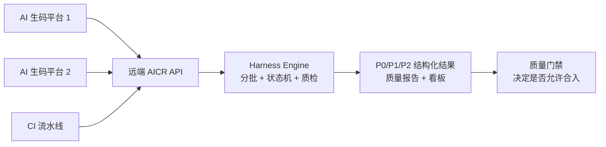
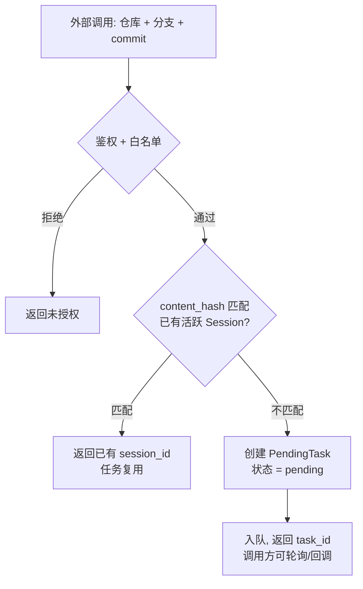
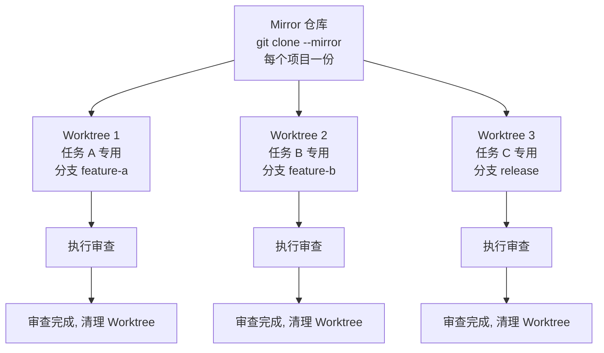
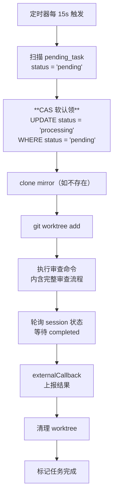
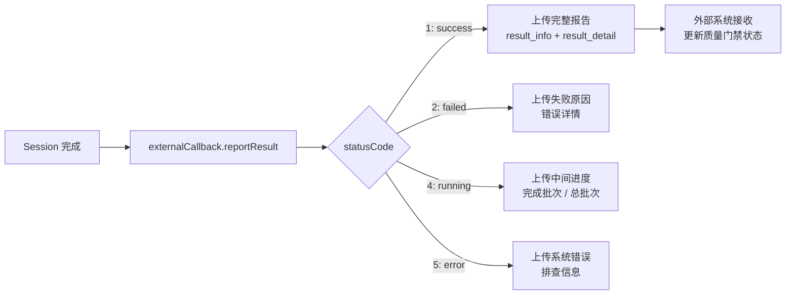

# 第 8 章 远端 AI Code Review 云服务

> 预计学习时间：90–110 分钟
> 一句话总结：为什么本地跑通了还需要远端服务，以及怎样把审查能力从个人工具变成可被任何系统调用的基础设施。

## 本地已经跑通了，为什么还需要远端

前七章构建的体系——分批审查、状态机、质量门、采纳率与召回率指标——全部可以在开发者本地环境运行。开发者提交一次审查命令，服务端接管流程，结果返回本地对话窗口。这套模式在个人使用场景中工作得很好。

但有两件事是本地模式做不到的。

**第一件事：把 AI CR 变成其他系统的可用能力。** 企业内的 AI 生码平台生成了一批代码，自动化研发工作台完成了一次需求落地，企业内生码平台端到端交付了一个功能模块——这些系统都产生了代码，都需要质量门禁，但它们不是开发者，没有本地 CLI。**它们只能通过 API 调用远端服务。**

**第二件事：为 AI 生码流程提供自动化质量门禁。** 当代码由 AI 生成后直接进入合入流程，中间没有人类开发者的审查环节。如果没有一个远端服务在代码进入主干前拦截问题，这些由多个 AI 协作产生的代码将以零人工审查的状态上线。

远端 AI CR 的核心价值不是"审查得更准"，而是****"让审查能力可以被任何系统调用"**。** 它的用户不只是人类开发者，还有生码平台、CI 流水线和自动化交付工具。



## 同步入口，异步执行

远端服务的第一层设计决策是：****入口同步，执行异步**。**

调用方发出请求后，远端接口在几秒内完成三件事——校验鉴权和白名单、创建或复用审查任务、返回一个任务标识。调用方不需要等待审查完成。它们可以轮询状态，也可以注册回调地址接收结果通知。

这个设计与本地模式的差异在于时间预期。本地开发者盯着终端，可以接受从发起到完成的全流程等待。但远端调用方通常是自动化流水线——它们发起的可能是一个发布流程中的一个步骤。如果 AICR 审查阻塞了 20 分钟，整个发布流水线就阻塞了 20 分钟。**异步执行让调用方可以在审查进行中继续其他步骤，结果到达后再做质量门禁判断。**

系统的 Controller 层实现了这个入口逻辑。它接收标准化的请求参数——仓库地址、分支、commit 范围或 MR URL——然后检查这些参数是否能匹配到一个现有的、状态可复用（`ready` 或 `reviewing`）的 Session。如果能匹配，直接返回已有 Session ID，避免重复审查。如果不能，创建一个新的 PendingTask 入队，等待 UnifiedExecutor 调度执行。

**入口的去重逻辑依赖 content_hash。** 代码在同一分支、同一 commit 范围内的内容哈希相同时，认为是同一次审查请求，不再重复创建任务。这个机制对远端场景尤其重要——同一段代码可能被多个平台分别触发审查（例如生码完成后触发一次，commit 后又触发一次），但审查结果应该只生成一次。



## Git 工作区：**Mirror + Worktree**

远端审查的第一个工程难题是 Git 工作区的管理。本地审查直接使用开发者本地的代码仓库，不需要额外的工作区准备。远端服务没有本地仓库，每次审查都需要从零开始。

最简单的做法是 `git clone`。每次来一个审查请求，就克隆一次仓库到临时目录，审查完成后删除。这个方案在并发为 1 时勉强可行，但当 5 个任务同时到达时，5 次全量克隆会把网络带宽和磁盘 I/O 同时打满。

系统采用了 **Mirror + Worktree** 的方案。

**Mirror** 是 `git clone --mirror` 创建的裸仓库镜像。它包含完整的对象数据库和引用，但没有工作目录——不占用工作区的磁盘空间。每个项目只需要一份 Mirror，存储在服务端的一个持久化路径下。

**Worktree** 是 `git worktree add` 创建的附加工作树。它从一个已有的本地仓库（这里是 Mirror）中检出一个分支到独立目录，不复制对象数据库，只创建必要的文件。创建时间通常在秒级，远快于全量克隆。

Mirror + Worktree 的组合把"每次审查都要做一次全量 Git 操作"变成了"每个项目做一次 Mirror，每个任务做一次 Worktree"。Mirror 的维护成本是定期的 `git fetch --prune` 更新（`--prune` 确保远程已删除的分支引用在 Mirror 中也清除）；Worktree 的创建和清理成本极低。



****Worktree 的并发隔离是天然属性**。** 每个 Worktree 是一个独立目录，互不干扰。任务 A 在 Worktree A 中修改文件、切换分支、执行审查，任务 B 在 Worktree B 中做同样的操作，互不影响。这种隔离方式不需要锁机制，不需要复杂的并发控制，Git 自身的 Worktree 语义就保证了隔离性。

### Mirror 维护：不是创建一次就完事

Mirror 仓库是远端服务的核心资产，但它是活的——远程仓库在持续更新。系统在每个任务执行前执行 `git fetch --prune`。但在高并发下，同一 Mirror 可能被多个任务同时 fetch——虽然 git fetch 是幂等的，但仍产生不必要的网络流量。

代码中通过 `cloningRepos` Map 来避免重复的初始克隆——如果同一 Mirror 正在被克隆，后续任务会等待同一个 Promise 完成。但 fetch 阶段没有类似去重机制。一个改进方向是**引入 Mirror 租约机制**：每个 Mirror 记录上次 fetch 时间，如果距离上次 fetch 不足一定间隔（如 60 秒），跳过本次 fetch。

Mirror 还需要考虑磁盘空间。定期检查磁盘空间的脚本监控阈值，如果低于阈值则拒绝新克隆请求并触发告警。一个容易被忽略的问题是：Mirror 的 fetch 操作本身也可能失败——网络波动、Git 服务端限流、认证 token 过期都可能导致 fetch 超时或报错。代码中实现了 fetch 失败的重试机制，重试 3 次后如果仍失败，该任务标记为系统错误（statusCode=5），等待后续恢复调度。

### Worktree 清理

正常路径下审查完成后 Worktree 被删除。但如果进程崩溃，Worktree 可能成为孤儿目录。`git worktree prune` 清理那些已从 Mirror 引用中删除但目录仍存在的 Worktree 记录，但 prune 只清理元数据不删物理目录。**完整清理需要额外步骤：定期扫描 worktree 目录，删除对应 Git 引用已移除的目录。**

## **UnifiedExecutor：统一流水线**

远端审查的执行调度经历了从双定时任务到统一流水线的演进。

旧架构中有两个独立的定时任务。第一个负责 Git 操作——克隆仓库、创建 Worktree、执行审查命令；第二个负责后续处理——等待 Session 完成、上报结果、清理 Worktree。两个任务通过数据库中的任务状态字段交接。

这种分离带来了几个问题。首先，第二个任务的轮询延迟意味着 Session 完成后不会立即上报——最长可能等待一个轮询周期。其次，两个任务的状态同步依赖数据库，如果其中一个任务在执行期间崩溃，另一个无法感知。第三，两个任务共享并发槽位，资源分配不透明。

当前设计：**单个定时任务完成 clone → worktree → 审查 → 轮询 session 状态 → 上报结果 → 清理 worktree 的全流程。** 审查命令内部已经集成了完整的 CLI 审查——它不再是"只做 Git 操作然后等待另一个任务接手"，而是"驱动整个审查完成"。



### 并发控制与同仓库串行

UnifiedExecutor 使用 `p-limit` 控制并发，默认同时最多执行 10 个任务，可通过环境变量 `CR_SHIFT_LEFT_EXECUTION_LIMIT` 覆盖。这个数字平衡了几个资源约束：Git 操作（10 个并发的 Worktree 创建和 fetch）、模型 API 调用、服务进程的内存和 CPU。

**同仓库同分支的串行限制**通过 `repoBranchKey` 实现——从任务数据中提取 `{repo}::{branch}` 作为唯一标识，在调度时检查是否有相同标识的任务正在执行。串行的理由是避免 Worktree 冲突：两个任务同时操作同一分支的不同 commit 时可能产生竞争条件。

### CAS 软认领与分布式并发

当多个服务实例（K8s Pod）同时扫描 `pending_task` 表时，如何保证一个任务只被一个实例获取是一个分布式并发问题。

系统使用数据库层面的 **CAS（Compare-And-Swap）实现软认领。** SQL 语句是 `UPDATE pending_task SET status='processing' WHERE status='pending' AND id IN (...)`。这不是一条简单的 UPDATE——它利用数据库的行锁和 WHERE 条件的原子性，确保一个任务只被一个实例认领。

CAS 操作之后，应用层再通过 `executing_count` 字段做二次确认。`executing_count` 是当前正在执行该任务的 Pod 计数。它有两个用途：一是在 Pod 崩溃后让其他 Pod 判断该任务是否真的死亡（如果 `executing_count > 0` 但对应 Pod 已不存在，说明是僵尸任务）；二是在优雅关闭时做批量扣减——Pod 收到 SIGTERM 后遍历自己认领的任务，把 `executing_count` 减 1。

**这个设计没有使用分布式锁（如 Redis 或 Zookeeper），而是依赖数据库自身的行级锁。** 优点是实现简单、无额外依赖；缺点是数据库成为单点。在每 15 秒扫描一次、单次扫描数十个任务的规模下，数据库压力在可控范围内。

### 恢复与容错

进程崩溃后，数据库中可能残留状态为 `processing` 但实际已经死亡的任务。UnifiedExecutor 有**启动恢复机制**：首次启动时批量扫描所有 `processing` 状态的任务，如果执行时间超过 `ZOMBIE_TASK_TIMEOUT_MINUTES`（默认 240 分钟），将其回退为 `pending`，等待重新调度。

滚动部署场景有额外的**延迟恢复**：新 Pod 启动后 3 分钟（可通过环境变量调整），会再跑一轮恢复，回收老 Pod 被杀后遗留的孤儿任务。这里排除了当前 Pod 自己正在执行的任务（通过 `executing_count` 判断）。

Session 轮询也有超时保护。每个任务轮询 Session 状态，轮询间隔 10 秒，总超时 5 分钟。还有**陈腐状态检测**——如果同一个 Session 状态（如 `reviewing`）连续未变化超过 6 次轮询（60 秒），系统判断审查可能卡住了，触发回退。回退最多重试 `MAX_SESSION_ROLLBACK_COUNT=2` 次。

## **外部回调**：结果如何通知调用方

远端审查产生的结果需要通过回调传递给外部系统。`externalCallback` 实现了这个机制。

**回调只在 `remote=1` 的 Session 中触发。** 系统从数据库中读取关联的 PendingTask，提取外部系统传入的回调信息——回调 URL、任务 ID、Flow ID、trace ID 等——然后构建结构化的回调请求。

回调内容分为两层。**`result_info` 是摘要层**——按照 Issue 的一级分类和二级分类统计问题数量，构成一个可快速浏览的质量概览。**`result_detail` 是明细层**——包含每条 Issue 的文件路径、行号、类别、严重度评分、问题描述和修复建议。

**回调状态码有五个值：** 1 表示成功完成（上传完整报告），2 表示失败，3 表示有审查结果但存在警告（如部分批次强制通过），4 表示仍在执行中（中间状态回调），5 表示系统错误（如 Git 操作失败或 LLM API 不可用）。

**中间状态回调（状态码 4）是一个重要的设计选择。** 它让调用方在审查进行中就能看到进度。例如自动化研发工作台在它的工作流 UI 中显示"AICR 审查中…已审查 3/8 批次"，这个信息来自中间状态回调。



## 可观测性：**四维监控**

本地审查失败时，开发者能看到终端输出，可以立即重试或报修。****远端审查是异步的——调用方发出请求后离开，几个小时后来看结果**。** 如果服务在这几个小时内悄悄坏了，调用方只会看到一个超时或空结果，而运维团队可能完全不知情。

系统建设了四维监控。

**进程维**检查服务进程是否存活、健康检查接口是否响应、内存和 CPU 使用率是否正常——这是最基础的存活监控。

**队列维**检查 PendingTask 表中 `pending` 状态的任务数量。如果积压持续增长而消费速度不变，说明处理能力不足。如果积压突然归零但消费日志没有相应变化，可能是扫描逻辑出了问题。

**I/O 维**检查 Git 操作的耗时和失败率。Mirror 的 fetch 时间如果持续增长，可能是仓库变大需要增量更新优化。Worktree 创建失败如果突然增多，可能是磁盘空间不足或 Git 版本问题。LLM API 调用的耗时、失败率和 token 消耗也都属于 I/O 维。

**业务维**检查审查结果的质量。每个周期的完成率、平均问题数、质量门通过率、重试次数分布和回调成功率。这些指标直接反映"审查服务对调用方是否可用"。

四维数据汇总到 Grafana 看板，异常触发告警。**告警规则不是"任何指标异常都报警"**——那会产生告警疲劳。实践是分级告警：队列积压超过阈值且持续超过两个周期才报警；单次 Git 操作失败不报警，但同一仓库连续 3 次失败报警。

## 质量门禁集成：审查结果如何变成发布决策

远端审查的最终产物不是一份报告——报告是中间产物。****最终的产物是一个决策：代码是否可以合入主干**。**

系统的集成模式是外部回调驱动。审查完成后，ExternalCallback 向调用方回传结构化结果。调用方根据结果做自己的决策——可以是最严格的门禁（有任何 P0 问题则阻断发布），也可以是宽松的提醒（显示报告但不阻断）。

****AICR 服务不替调用方做决策**。它只负责提供审查结果和质量数据。** 决策权在调用方手中。这个分离很重要——不同业务线对质量的容忍度不同，同一业务线在不同阶段的要求也不同。

典型的门禁逻辑可能是：P0 安全问题 = 0 硬阻断；P0 非安全问题但位于核心路径上人工审批；P1 问题总数不超过每千行 3 个；Session 必须是正常完成而非熔断强制通过。这些条件中只有"P0 安全问题 = 0"是硬阻断，其余都是人工审批。

**门禁的配置需要随数据校准。** 如果 P1 阈值设置过低，频繁阻断会让调用方绕过审查（例如直接标记所有 P1 为"已知风险"）；如果设置过高，质量门就失去了拦截价值。团队的做法是：上线第一周只记录不阻断，收集基线数据；第二周设置一个宽松阈值，观察阻断率和误阻断率；第三周逐步收紧到目标水平。

## 远端成本模型

远端审查的成本结构不同于本地审查。本地审查的成本几乎全部是 LLM API 的 Token 费用——因为 Git 操作由开发者自己完成，不需要服务端资源。远端审查增加了 Git 操作、Worktree 磁盘占用和回调处理的开销。

但远端审查也创造了成本优化机会。最显著的是 **Session 复用。** 如果两个外部调用方请求审查相同的代码——生码平台在代码生成后触发审查，同时 CI 流水线在 commit 阶段也触发审查——远端服务的去重机制让它们共享同一个 Session。一次审查，两次消费。

成本优化的另一个方向是 **Token 消耗的集中管理。** 本地审查时，每个开发者独立消耗 Token，无法做全局优化。远端审查时，服务端可以集中管理所有任务的 Prompt 模板、规则和上下文大小，从全局视角压缩 Token 消耗。一个重要优化是废弃 resume Agent 模式——这个模式在每次恢复时重新发送完整上下文，导致大量重复 Token 消耗。服务端直接管理状态后，恢复不再需要重发上下文。

## 容器化与服务演进

远端服务运行在容器环境中。文件路径的可移植性通过配置化的 `baseDir` 而非硬编码实现。进程生命周期感知通过 SIGTERM 处理函数实现优雅关闭和 `executing_count` 扣减。并发数、恢复延迟、轮询间隔等都通过环境变量可配。

当前服务的下一步演进方向是 **Go 重写。** Node.js 的单线程模型在处理大量并发 I/O 时有一定优势，但在 CPU 密集型操作和内存管理上存在局限。Go 的 goroutine 模型天然适合这种并发任务调度场景。更重要的是，Go 服务可以编译为单个二进制文件，容器镜像更小、启动更快。

重写不只是语言切换——**当前服务承载了约 70% 非 CR 逻辑（业务路由、数据处理、监控上报等），重写是一次清理机会。** 将 CR 核心逻辑与业务逻辑剥离，CR 服务只做审查和调度，其他职责交给专门的网关和数据处理服务。

这个剥离过程本身也是一次架构优化。当审查逻辑与其他业务逻辑耦合时，每次业务需求变更都可能引入对审查行为的意外影响——一个路由修改可能改变请求格式，一个数据处理调整可能影响 Issue 保存结构。剥离后，CR 服务的接口和数据结构保持稳定，业务变更被隔离在上游。

## 服务的可演进性

远端服务与本地工具的一个根本区别是：本地工具升级需要每个开发者更新 CLI 版本，远端服务升级只需要更新服务端。

这个区别在前七章构建的采纳率和召回率优化中体现得尤为明显。当团队优化了批次分配算法、调整了质量门阈值、新增了 memory_pos 检查器时，本地模式需要开发者更新 CLI 才能生效。远端模式只需要更新服务端代码和数据库配置——调用方完全无感知。

**但可演进性也带来了责任。** 远端服务的一次错误更新可能同时影响所有调用方。团队建立了分阶段发布的流程：先在测试环境运行新配置，同时在影子模式下验证（回调写入但不阻断），观察 3-5 天数据后评估，然后逐步灰度到生产环境。


## CAS 认领的并发时序

当多个 Pod 同时扫描 pending_task 表时，竞争发生得像这样：Pod 1 和 Pod 2 都在同一秒扫描到任务 A、B、C。Pod 1 先执行 `UPDATE SET status='processing' WHERE status='pending' AND id IN (A,B,C)`，数据库返回 3 行 affected。Pod 2 紧跟着执行同一条 UPDATE——此时任务 A、B、C 已经被 Pod 1 改为 processing，WHERE 条件不再匹配，数据库返回 0 行 affected。Pod 2 重新扫描，获取下一批 pending 任务。

这个机制的可靠性依赖数据库行锁的语义——不是应用层的锁，而是数据库 UPDATE 语句的原子性。

## 容器化与服务演进细节

远端服务运行在容器环境中。三个设计直接反映了容器化的约束。

文件路径的可移植性：Mirror 和 Worktree 的存储路径使用配置化的 baseDir 而非硬编码。这允许服务在不同环境使用不同存储位置。

进程生命周期感知：UnifiedExecutor 注册了 SIGTERM 处理函数，在进程被 K8s 终止前完成执行中任务的 executing_count 扣减。如果不做这一步，新 Pod 启动后的恢复机制会误将正常关闭的任务当作僵尸。

环境变量驱动的配置：并发数、恢复延迟、轮询间隔、重试次数等都通过环境变量可配——不依赖代码修改。不同集群可能需要不同配置，而镜像应该是不可变的。

下一步演进方向是 Go 重写。Go 的 goroutine 模型天然适合并发任务调度，可以编译为单个二进制文件，容器镜像更小。但重写不只是语言切换——当前服务承载了约 70% 非 CR 逻辑，重写是一次清理机会，将 CR 核心逻辑与业务逻辑剥离。

## 质量门禁集成决策树

```
P0 安全问题 → 硬阻断，禁止合入
P0 其他问题 → 人工审批
P1 总数 > 每千行 3 个 → 人工审批
强制通过 / 熔断 Session → 人工审批
以上都未触发 → 自动通过
```


## 本地与远端的混合部署

团队在实践中并不是"全切到远端"。本地模式和远端模式并行运行，各有各的适用场景。

**个人开发者的日常审查**——提交前检查、分支合入前的预审——最适合本地模式。延迟低，开发者可以实时看到结果，审查中的交互式追问在本地 MCP 对话中更自然。

**自动化生码平台的质量门禁**——生码后的审查、产出后的检查——最适合远端模式。这些场景的触发方不是人类，不需要交互式对话，只需要结构化结果和阻断决策。

**CI 流水线的提交后审查**——每次 commit push 后的质量检查——两种模式都可以用。远端模式更适合高频触发的场景（去重和 Session 复用），本地模式更适合低频但需要即时反馈的场景。

**本地与远端共享同一套 Harness Engine。** 采纳率和召回率的每一点提升——规则与 Recheck、分批与质量门——都会同时惠及本地开发者和远端平台调用方。远端化不是能力的替代，而是能力的放大。

这一共享架构还有一个工程收益：**故障隔离。** 如果远端服务的网络或调度出现问题，本地模式不受影响，开发者仍然可以运行本地 AICR 审查。如果 Harness Engine 本身出现 Bug，修复一次就能在两端同时生效。这种共享核心、独立入口的架构，保证了能力的统一演进而不会因单点故障全线瘫痪。


## 服务架构与部署拓扑

远端服务的部署拓扑通常包含 API 网关、CR 服务集群、数据库和监控系统四层。API 网关负责鉴权、限流和路由——外部调用方不直接访问 CR 服务。CR 服务集群运行多个 Pod，每个 Pod 内运行 UnifiedExecutor 定时任务。数据库存储 Session、Issue、MemoryRule 和 PendingTask。Grafana + SeaTalk 组成监控和告警层。

所有 Pod 共享同一个 PendingTask 表，通过 CAS 认领竞争任务。Pod 的数量可以根据队列积压动态调整——高峰时段扩容，低谷时段缩容。CAS 的设计使水平扩展不需要额外协调。

健康检查接口对外暴露 `/health` 端点，返回服务状态和当前正在执行的任务数。K8s 的 liveness probe 定时调用这个接口——如果 Pod 无响应，K8s 自动重启。readiness probe 检查数据库连接和 Git 可用性——如果 Git 服务不可用，Pod 被标记为未就绪，新请求不会路由到它。

分布式追踪通过 Session 级别的 trace ID 实现。每次创建 Session 时生成唯一 trace ID，后续所有操作（Setup、Batch 分配、审查执行、验证、回调）都携带这个 ID。日志按 trace ID 聚合，可以追踪一次审查从入口到回调的完整路径。对于远端模式，trace ID 在回调时一并传给调用方，方便调用方在自己的系统中关联审查结果。


## 远端服务的安全边界

远端服务对外暴露 API，安全是最基础的要求。鉴权层使用 Token 验证调用方身份——每个接入的业务线有独立的 Token，可以按 Token 做限流和配额管理。白名单限制可调用的仓库范围——Token A 只能审查仓库 X 和 Y，不能审查仓库 Z。

Git 操作的安全性也需要特别注意。Mirror 仓库中可能包含敏感的业务代码和配置。Worktree 使用完成后必须清理——不仅删除目录，还要确保文件内容不可恢复。审查日志中不应记录完整代码内容，只保留哈希和统计信息。

回调 URL 需要白名单校验——防止恶意调用方将结果发送到外部地址。回调数据中不包含源代码片段，只包含 Issue 的摘要信息。


## 远端服务的关键指标与 SLO

远端服务的可靠性需要量化为 SLO（Service Level Objective）。课程案例团队为远端服务定义了以下目标：

回调成功率 ≥ 99.5%（30 天滑动窗口）。低于此阈值触发 P0 告警。这个指标直接反映审查结果是否送达调用方——如果回调失败，调用方永远不知道审查结果。

任务完成率 ≥ 98%（不含因外部因素导致失败的场景，如 Git 仓库不可达）。区分"系统自身故障"和"外部依赖故障"——前者是服务团队的改进目标，后者需要调用方配合解决。

端到端 P95 延迟 ≤ 15 分钟（从小型 MR 的 5 分钟到大型 MR 的 15 分钟）。延迟受代码规模影响，不能用一个固定数字服务所有场景。P95 排除了极端异常值，反映正常用户体验。

队列等待 P99 ≤ 30 秒。如果任务创建后 30 秒内仍未开始执行，说明并发处理能力不足或当前负载过高。这个指标直接对应调用方的等待体验。

这些 SLO 不是一成不变的。随着服务规模增长、调用方增加和审查任务复杂度变化，SLO 需要定期回顾和调整。关键是每个 SLO 都要有对应的监控数据和告警规则，不能只是文档中的一句承诺。


## 远端服务 SLO 的实现细节

定义 SLO 只是第一步，实现需要配套的监控和告警体系。回调成功率通过 ExternalCallback 的返回码统计——每次回调的 HTTP 响应码记录在日志中，聚合为 30 天滑动窗口的成功率。低于 99.5% 时触发 P0 告警。

任务完成率通过 PendingTask 表的终态统计——completed 状态的任务数除以总任务数。需要排除因外部依赖（Git 不可达、LLM API 不可用）导致的失败，否则 SLO 会被外部因素拖垮。排除规则需要明确记录。

延迟通过 Session 的 created_at 到 completed_at 的时间差统计。P95 排除了极端异常值，但需要监控 P99 和最大值来发现个别严重延迟的任务——可能是一个大型仓库的首次 Mirror 克隆耗时过长。

队列等待时间通过 PendingTask 的 created_at 到第一次被 UnifiedExecutor 扫描的时间差统计。如果这个数字持续增长，需要扩容或优化调度策略。当前设计使用 p-limit 控制并发，扩容可以通过增加 Pod 数量或提高并发上限来实现。


远端服务的运维工作除了监控和告警，还包括定期的容量评估和成本核算。每月统计总审查次数、平均 Token 消耗、平均审查延迟和回调成功率，形成运维月报。容量评估根据增长趋势预测下个季度的资源需求——需要增加 Pod 数量还是提高并发上限。成本核算将 LLM API 费用、服务器费用和运维人力成本按业务线分摊，为后续收费或预算申请提供依据。


## 远端服务接入 Checklist

接入层：标准化入口接口、鉴权与白名单、content_hash 去重、任务复用。

Git 层：Mirror 创建与更新、Worktree 创建/清理/孤儿回收、磁盘空间监控。

调度层：PendingTask 状态流转、CAS 软认领、p-limit 并发、同仓库同分支串行、僵尸恢复、优雅关闭。

审查层：共享 Harness Engine、Session 轮询与超时。

回传层：ExternalCallback 结构化结果、中间状态进度回调、回调失败重试。

监控层：四维监控、Grafana 看板、分级告警。


## 远端服务运维要点

远端服务上线后，日常运维关注几个核心指标。回调成功率是最直接的服务质量信号——如果持续低于 95%，说明审查结果没有送达调用方。队列积压深度反映处理能力——正常波动在个位数，如果持续增长需要扩容或排查。任务平均耗时帮助判断是否需要调整批次大小或并发数。Token 消耗趋势反映成本变化——异常飙升可能意味着 Prompt 或上下文策略退化。

告警规则需要分级以避免疲劳。P0：服务不可用、回调成功率低于 90%。P1：队列积压超过阈值且持续 2 个周期、同一仓库连续 3 次 Git 失败。P2：审查完成率下降、Token 消耗异常——记录到看板不触发即时通知。


## 本章收束

远端 AI CR 服务解决的不是"审查更准"，而是**"让审查能力成为可被任何系统调用的基础设施"。** 同步入口异步执行解决调用方的等待问题。Mirror + Worktree 用极低的磁盘和网络代价实现并发隔离。**UnifiedExecutor 用统一流水线替代多段交接**，**用 CAS 认领防止重复执行**，**用恢复逻辑处理故障**。外部回调把结构化结果回传给调用方。四维监控让运维团队在用户投诉前就能发现异常。

****本地与远端共享同一套 Harness Engine**。** 采纳率和召回率的每一点提升——规则与 Recheck、分批与质量门——都会同时惠及本地开发者和远端平台调用方。远端化不是能力的替代，而是能力的放大。

第 9 章回到原点，把这些技术组件重组成一条可迁移的落地路线。

## 参考文献

本章以团队超过一年的 AI Code Review 远端服务实践为主要来源。Git Worktree 的隔离语义参考 [Git 官方文档](https://git-scm.com/docs/git-worktree)。监控体系和并发策略为团队实际设计，经教学化脱敏处理。
