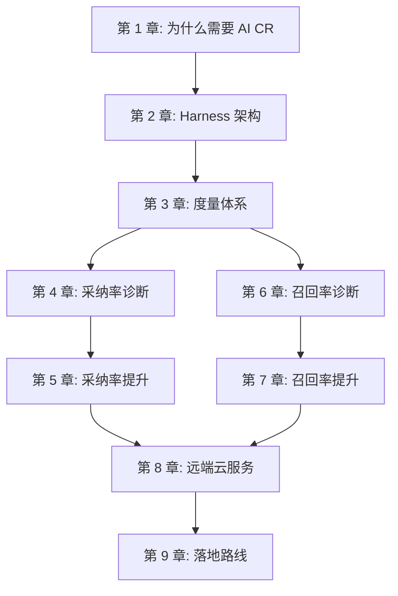
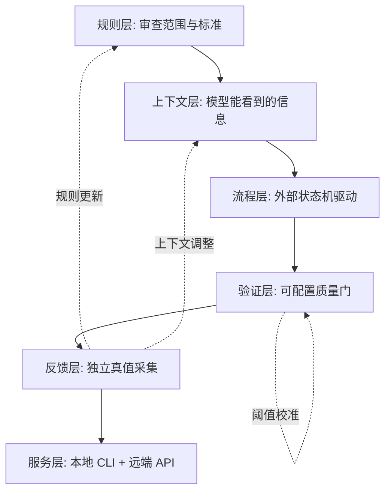
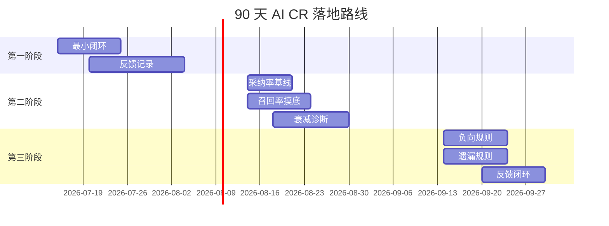

# 第 9 章 总结：从单次审查到可持续质量系统

> 预计学习时间：55–70 分钟
> 一句话总结：九个章节的核心机制重组为一条可迁移的落地路线，以及从今天开始可以做的第一件事。

## 课程回望：我们到底建了什么

九章走完回头看：****这节课没有教你"怎样写一段更好的 Code Review Prompt"，它教你的是怎样把 AI 审查建成一套完整的工程系统**。**

第一章把 AI CR 放到它的历史坐标里——人工 CR 的覆盖率瓶颈、静态规则的表达力边界、远端 Diff 审查的上下文缺失。理解了这些，才能理解为什么"让模型看代码"和"让模型做好审查"之间隔着一整套工程体系。

第二章拆开了这套体系的骨架。****Harness 不是 Prompt 的包装，而是把流程控制从模型手中拿出来的外部引擎**。** 状态机、批次分配、MCP 工具链、扩展检查——各自有明确的职责边界。

第三章先停下来，建立了度量语言。采纳率、召回率、F1-Score 不是三个公式，而是一整套判断"改了什么、漏了什么、代价是什么"的分析框架。****没有这一章，后面所有的优化都不知道自己在优化什么**。**

第四、五章攻采纳率。从 44 条拒绝样本诊断出七种根因，然后依次用规则分层、上下文增强、Recheck 二次验证、负向记忆提炼和历史过滤把它们解决。**每加一层机制，都要检查 Recall 是否下降——不能通过沉默提升采纳率。**

第六、七章攻召回率。****把"AI 偷懒"还原为输出衰减、步骤遗漏和流程控制失效****，用三次失败实验证明了 Prompt 和 AI 自管理都不够。然后用语义分批控制衰减、状态机防止跳过、质量门验证产出、memory_pos 和 memory_distiller 把漏报变成下一次审查的知识。

第八章把本地能力扩展为远端服务。Mirror + Worktree 解决了 Git 工作区隔离，UnifiedExecutor 用 CAS 认领和 p-limit 管理分布式并发，ExternalCallback 把结构化结果回传给生码平台和 CI 流水线。****审查能力从个人工具变成了基础设施**。**

## 四个可以带走的工程原则

不是每个团队都需要复刻这套系统的全部组件。但下面四条原则，建议在任何 AI 审查实践初期就建立。

**第一条：**Prompt 是必要条件，但不是充分条件**。** 模型的能力决定审查的上限，Harness 的工程质量决定审查的下限。Prompt 能告诉模型检查什么，但不能告诉模型怎样持续检查。课程中三次失败实验的同一个结论——加强 Prompt 不解决衰减，AI 自管流程会产生幻觉和退化，人工拆分不可持续——全部指向这个原则。

**第二条：**先建立度量，再优化**。** 不要在没有采纳率和召回率基线的情况下做任何"改进"。不知道当前 Precision 是多少，就不知道新规则是否减少了误报还是误杀了真问题。不知道 Recall 的分母构造，就不知道新增的审查覆盖是真实发现还是冗余报告。**指标不是事后报表，而是实验设计的前置条件。**

**第三条：**每个过滤动作都要检查 Recall**。** 规则过滤、Recheck 标记无效、负向记忆静默——每一次减少报告数量的操作，都要在固定样本上验证是否同时也减少了应报告的问题。采纳率可以靠少说话提升，那不是工程改进。

**第四条：**能力不等于默认启用**。** 课程代码中反复出现的模式：verifier 的阈值默认关闭、memory_pos 不在默认扩展检查列表、负向规则提炼源默认不含 recheck。****代码有这项能力，不代表部署后它就生效**。** 部署 = 代码部署 + 配置部署 + 验证部署。只看代码的人以为质量门在运行，只看文档的人以为阈值已校准，实际行为由数据库配置决定。

## 六层架构的可迁移版本

把课程的完整系统抽象掉具体实现，可以得到六层架构。它可以作为任何团队启动 AI CR 建设时的参考蓝图。

**规则层**定义审查的范围和标准。不一定要从零开始——可以从公开的安全规范、团队历史事故复盘和现有 lint 规则中提取。关键是每条规则必须有分类（安全/健壮性/规范/性能/可维护性）、有严重度分级（5-2 分）、有触发条件和排除条件、有版本号和变更记录。

**上下文层**决定模型能看到什么信息。最小集合是 diff 本身、diff 关联的同一文件中未改动代码、被调用函数的签名和文档。逐步扩展可以加上接口定义、需求描述、历史 Issue 和相关模块结构。**上下文的质量比数量重要——给一堆不相关的文件不如精确地给两三个关键符号。**

**流程层**用外部状态机驱动审查。最小实现可以是"查询任务 → 执行审查 → 提交结果 → 查询下一个任务"的四步循环，配合一个数据库字段记录当前步骤。不需要一开始就实现完整的 0→1→2→2.x→3 状态链。

**验证层**在流程步骤之间插入可配置的检查。必填字段完整性是最低要求。时间验证和密度验证需要基线数据——**没有基线时先记录不阻断**，收集足够数据后再设定阈值。

**反馈层**收集独立于 AI 输出的真值。人工 CR 记录、测试 Bug 归因、用户拒绝原因标注——这三条通路分别覆盖"人类发现了什么 AI 没发现""测试发现了什么""AI 报告了什么但不对"。****反馈的质量决定度量体系的质量，度量体系的质量决定优化决策的质量**。**

**服务层**决定审查能力的交付方式。本地 CLI 适合个人开发者，远端 API 适合平台集成。两者可以共享同一套核心逻辑，只在入口和 Git 工作区管理上有差异。**不要一开始就追求远端化——先让本地模式跑通全链路，再考虑服务化。**

## 90 天落地路线

不要试图一次性实现六层。下面是按优先级排列的三阶段路线。

**第一个 30 天：跑通最小闭环。** 选择一个小型仓库（不超过 50 个文件），搭建最小 Harness——一个脚本或简单服务，能接收 diff、调用 LLM 审查、保存结构化结果。**目标是让系统跑起来，不是让系统完美。** 这个阶段不需要分批算法、不需要质量门、不需要记忆提炼——只要能生成 Issue 列表。

并行做一件关键的事：**开始记录反馈。** 为每条 Issue 增加一个采纳状态字段。开发者标记"采纳"或"拒绝"时记录原因。不需要自动检测，不需要 LCS 对比——人工点击就够了。

**第二个 30 天：建立度量和诊断。** 用第一个月积累的反馈数据，计算采纳率基线。人工抽查 AI 没有报告但开发者在 MR 评论中发现的问题，建立召回率的初步分母。用第 6 章的衰减诊断信号检查审查质量——问题密度、描述长度、上下文引用的趋势。如果发现明显的后段衰减，引入第 7 章的批次分配和简单的时间验证。

**这个阶段结束时的里程碑是能回答三个问题：** 当前采纳率多少、当前召回率大概多少、主要噪音和漏报类型是什么。

**第三个 30 天：建立反馈闭环。** 从重复出现的拒绝模式开始，提炼第一批负向规则。从高频漏报开始，提炼第一批遗漏规则。接入测试 Bug 数据，建立 should_recall 的判定逻辑。如果团队有多个仓库或平台需要审查能力，评估是否需要远端服务——但远端化是一个独立项目，不在这个 30 天的范围。

## 几个容易被跳过的关键决策

在课程案例的演进中，有几个决策当时看起来不那么关键，事后看却是正确方向的重要支撑。

**第一个决策：用 Issue 级而非 MR 级做采纳率单位。** 初期有人提议用"这个 MR 是否有 AI 发现的有效问题"做二分类统计。这个指标看起来更直观，但它把"一次审查发现 10 个问题但只采纳 3 个"和"一次审查发现 1 个问题并采纳"视为同等。Issue 级的粒度让采纳率成为 Precision 的有效代理，也为后续的拒绝原因分类和根因诊断提供了基础。

**第二个决策：把自动采纳检测和正式采纳率分开。** LCS 自动检测能快速判断建议代码是否出现在最终文件中，但它不是语义等价判断。自动检测的 2/3 状态和部分采纳的 60–69 状态当前都不进入正式指标分母。这个选择减少了数据量，但避免了"机械采纳"污染指标。团队计划在未来校准自动检测的准确率后，逐步将特定区间的自动状态纳入正式口径。

**第三个决策：不把提炼流程捆死在自动触发上。** memoryDistiller 可以按定时任务自动运行，但当前设计中保留了人工审核节点——pending 状态的规则不直接生效，需要人工确认为 confirmed。**这个节点在生产效率和规则质量之间做了平衡。** 全自动化可能让一条错误规则迅速扩散到所有审查；全人工审核可能让规则产出速度跟不上代码变化。pending + confirmed 的两阶段是当前团队的共识。

**第四个决策：Quality Gate 的默认关闭。** verifier 的阈值默认值为 0 和 999，这看起来像是"没做完"。但团队刻意选择了这个设计——**质量门应该根据实际数据校准后开启，而不是用一个静态阈值假设所有仓库和语言都适用。** 从关闭到开启的过程本身就是一个数据驱动的决策过程：先记录数据、再确定基线、再逐步收紧。

## 跨章节系统检查清单

**采纳率体系**：是否定义了分母口径（哪些状态纳入，哪些排除）？是否区分了人工反馈、自动检测和外部反馈？是否保留了 is_valid 的 null 处理策略？是否对 4 分和 5 分问题分别做了分层统计？是否监控无效率、无法判断率和未验证率？

**召回率体系**：是否建立了独立于 AI 输出的真值集合？人工 CR 遗漏和测试 Bug 是否进入了 should_recall 判定流程？Bug 的角色归属是否存在偏差？是否区分了含 Bug 和不含 Bug 两种召回率口径？

**审查质量**：是否按 Batch 位置分层统计了问题密度和描述长度？是否监控了上下文引用率的变化趋势？是否追踪了质量门的重试次数和熔断比例？是否对强制通过的 Batch 做了后续人工抽查？

**规则与记忆**：是否明确了每条规则的适用条件、排除条件和证据要求？是否记录了规则的创建时间、来源、确认状态和过期时间？规则上线前是否在固定 Benchmark 上做回放验证？规则变更是否可追溯、可回退？

**服务与监控**：远端服务是否实现了 content_hash 去重和 Session 复用？是否处理了 Mirror 维护、Worktree 清理和磁盘空间监控？是否实现了分布式 CAS 认领和僵尸任务恢复？回调是否覆盖了成功、失败、运行中和系统错误四种状态？四维监控是否全部覆盖？

## 从课程到你的仓库

课程讲的是一个系统的实现，但它的价值在于你能把什么带走。

**如果你只有一个下午**，带走第三章的度量框架。为你的仓库建立采纳率、召回率和 F1-Score 的口径——定义分母、明确排除项、区分自动和人工反馈、记录状态版本。**没有度量，后面的所有优化都缺少方向。**

**如果你有一周**，加上第四章和第五章的采纳率诊断和降噪闭环。从拒绝样本开始，找出最高频的拒绝类型，从规则和上下文入手做定向改进。**不要一次改五样东西——每次只改变一个变量，在固定样本上检查 Precision 和 Recall 的变化。**

**如果你有一个月**，加上第六章和第七章的召回率诊断和提升。检查大型任务的衰减模式，引入批次分配和基本的质量验证。建立人工 CR 遗漏和测试 Bug 到记忆提炼的通路。你会看到这两个数字之间的关系：采纳率提升可能降低 Recall（更严格的过滤），Recall 提升可能降低 Precision（更多的候选建议）。F1 是平衡点，但最终决策取决于你的业务风险偏好。

**如果你有一个季度**，加上第八章的远端服务化。让你的审查能力不再受限于个人开发者的 CLI。**但远端化之前，确认本地模式的采纳率和召回率已经稳定——服务化的基础是能力可靠，不是接口可用。**

## 四个关键决策复盘（详细版）

**决策一：用 Issue 级而非 MR 级做采纳率单位。** MR 级二分类太粗糙——一次审查发现 10 个问题但只采纳 3 个，和发现 1 个采纳 1 个，MR 级视为同等。Issue 级让每条建议有独立反馈，让拒绝原因分类和根因诊断成为可能。

**决策二：把自动采纳检测和正式采纳率分开。** LCS 能判断建议代码是否出现在最终文件，但不是语义等价判断。短代码冲撞、等价改写、变量重命名都可能产生假阳性。当前 2/3/60-69 不进入正式分母，避免了"机械采纳"污染指标。未来校准后逐步纳入特定区间。

**决策三：提炼流程保留 pending+confirmed 两阶段。** 全自动化可能让一条错误规则迅速扩散；全人工审核可能让规则产出跟不上代码变化。两阶段在生产效率和规则质量之间做了平衡。

**决策四：Quality Gate 默认关闭。** verifier 阈值默认 0 和 999 不是"没做完"——它确保数据库加载失败时服务仍能运行。质量门应该根据实际数据校准后开启，从关闭到开启的过程本身就是数据驱动的决策：先记录、再定基线、再逐步收紧。

## 从课程到你的仓库的行动路线

一个下午：建立度量口径——定义分母、明确排除项、区分反馈来源。没有度量，后面所有优化都缺少方向。

一周：加上采纳率诊断和降噪闭环。从拒绝样本找出最高频类型，一次只改一个变量，在固定样本上检查变化。

一个月：加上召回率诊断和提升。检查大型任务衰减，引入批次分配和基本验证。你会看到采纳率和召回率之间的张力——F1 是平衡点但最终决策取决于业务风险偏好。

一个季度：加上远端服务化。但远端化之前，确认本地模式的指标已稳定。服务化的基础是能力可靠，不是接口可用。

## 课程能给你什么，不能给你什么

这门课能给的是：一套经过验证的 AI Code Review 工程方法——从架构设计到指标口径、从采纳率诊断到召回率提升、从本地部署到远端服务化。每一步都有可追溯的代码事实和可复算的实验结果。它不是纸上谈兵，而是真实系统一年多的演进记录。

这门课不能给的是：一个可以直接部署到你仓库的完整系统。你的语言栈、你的业务约束、你的团队结构和你的质量要求都不一样。九章的知识需要你根据自己的情况裁剪和组合。但这门课给了你判断力——你知道什么时候需要状态机、什么时候需要质量门、什么时候需要远端化；你也知道哪些"优化"可能只是让数字变好看的陷阱。

最终，AI Code Review 不是一个技术问题。它是一组工程决策的总和：谁有建议权、谁有阻断权、谁来承担错误决策的后果、怎么验证"变好了"不是自欺欺人。课程教了你怎样做出这些决策，而不是替你做出它们。

## 给不同角色的阅读建议

如果你是研发工程师，重点读第 2-3 章（架构与度量）和第 5、7 章（采纳率与召回率提升）。这些章节告诉你，当审查系统出现问题时，从哪里开始诊断，以及每项工程决策如何影响最终的指标数字。

如果你是 TL 或架构师，重点读第 1 章的六阶段演进、第 2 章的 Harness 职责分层、第 8 章的远端服务部署拓扑。这些章节帮你判断团队的 AI CR 建设当前处于哪个阶段，下一步该投资什么能力。

如果你是研发效能或质量平台工程师，重点读第 3 章的指标体系、第 5 章的规则版本化与 Recheck 编排、第 7 章的质量门设计、第 8 章的远端服务运维。这些是你搭建平台级 AICR 服务时需要解决的核心工程问题。

## 最后的话

AI Code Review 正在从"让模型看代码"走向"让系统保证质量"。这个过渡不取决于模型能力有多强——今天的模型能力已经足够在大多数场景中发挥作用。****它取决于工程体系有多完整**：有没有可复算的度量、有没有可验证的流程控制、有没有持续学习的反馈闭环、有没有可以把能力交付给任何系统的服务层。**

课程分析的系统从采纳率约 10% 起步，经过规则建设、上下文增强、Recheck、负向记忆、分批审查、质量门和记忆提炼，达到了采纳率约 60%、召回率约 40% 的水平。这条路线不是"只有大团队才能做"的工程——它的每一步都是可独立验证、可逐步叠加的。

你的仓库不需要复刻这套系统的全部组件。但你的仓库值得有一套自己的度量、一条自己的反馈通路、一个自己的质量门。****从今天开始，从记录第一条 Issue 的采纳状态开始**。**

## 参考文献

1. Alberto Bacchelli, Christian Bird. [Expectations, outcomes, and challenges of modern code review](https://doi.org/10.1109/ICSE.2013.6606617). ICSE, 2013.
2. Google Engineering Practices. [The Standard of Code Review](https://google.github.io/eng-practices/review/reviewer/standard.html).
3. Zhiyu Li 等. [Automating Code Review Activities by Large-Scale Pre-training](https://arxiv.org/abs/2203.09095). ESEC/FSE, 2022.
4. Tao Sun 等. [BitsAI-CR: Automated Code Review via LLM in Practice](https://arxiv.org/abs/2501.15134). 2025.
5. Hong Yi Lin 等. [CodeReviewQA: The Code Review Comprehension Assessment for Large Language Models](https://arxiv.org/abs/2503.16167). Findings of ACL, 2025.
6. Imen Jaoua 等. [Combining Large Language Models with Static Analyzers for Code Review Generation](https://arxiv.org/abs/2502.06633). MSR, 2025.
7. Shweta Ramesh 等. [Automated Code Review Using Large Language Models at Ericsson: An Experience Report](https://arxiv.org/abs/2507.19115). ICSME, 2025.
8. GitHub Docs. [About GitHub Copilot code review](https://docs.github.com/en/copilot/concepts/agents/code-review).
9. GitLab Docs. [GitLab Duo in merge requests](https://docs.gitlab.com/user/project/merge_requests/duo_in_merge_requests/).
10. Anthropic. [Building effective agents](https://www.anthropic.com/engineering/building-effective-agents). 2024-12-19.
11. MCP Architecture. [Specification 2025-06-18](https://modelcontextprotocol.io/specification/2025-06-18/architecture).
12. scikit-learn. [Model evaluation](https://scikit-learn.org/stable/modules/model_evaluation.html).
13. Nelson F. Liu 等. [Lost in the Middle: How Language Models Use Long Contexts](https://arxiv.org/abs/2307.03172). TACL, 2023.
14. Git. [git-worktree](https://git-scm.com/docs/git-worktree).

本课程基于团队超过一年的 AI Code Review 工程实践。所有代码片段为教学化节选。课程中的阶段指标来自团队内部分享，经教学化脱敏处理后使用，不构成对任意团队或技术栈的通用预估。
