# 第 1 章 为什么今天需要 AI Code Review

> 预计学习时间：55–70 分钟
> 一句话总结：把 AI 放进代码审查之前，先分清它该接管哪些重复劳动，哪些判断仍必须由人负责。

## 先看一次普通的合并请求

一名开发者提交了 26 个文件的改动：前端新增批量操作，后端增加一个异步接口，还顺手重构了日志。自动测试通过，lint 没有报错。审查者在半小时里留下四条评论：一个变量名不清楚，一处错误信息不统一，两处空值保护缺失。两天后，测试环境仍然发现了一个问题：异步任务在失败分支里没有释放锁，后续请求一直等待。

这类经历很容易导向两个相反的结论。有人会说，人工审查太慢，应该让 AI 全部接手；也有人会说，AI 连业务语义都不懂，代码审查只能依靠资深工程师。两种说法都把问题压扁了。真正需要回答的是：不同审查手段分别能看到什么证据，付出多少成本，在哪些条件下容易失效。

[[Code Review（CR）]] 是对代码改动进行判断和反馈的活动。它不等同于“找 Bug”。Google 的工程实践把设计、功能、复杂度、测试、命名、注释、风格和文档都列为审查对象；Bacchelli 与 Bird 对现代代码审查的研究还发现，开发者同时把知识传递和团队协作视为重要结果。[1][2] 这解释了为什么“AI 找到若干问题”不等于“AI 已经替代审查者”。

课程里会频繁出现 [[Merge Request（MR）]]。它是一份合并请求：开发者请团队把一个分支的改动合入目标分支。GitHub 常用 Pull Request（PR）这个名称。MR 不只是 diff 页面，还承载需求说明、提交记录、自动检查、讨论、批准和最终合并状态。AI CR 如果只拿到几行 diff，看到的只是这个协作对象的一小部分。

## 人工 CR 的价值没有消失，吞吐问题却越来越明显

现代代码审查有一个基本矛盾：高质量判断需要上下文和注意力，而研发流程希望反馈更早、更快、更稳定。

人工审查擅长处理含糊目标。例如，“这个缓存会不会让结算金额过期”“这个接口是否破坏了另一个团队的兼容承诺”“为了赶发布日期暂时接受这段重复代码是否合理”。这些问题需要业务责任、风险取舍和组织记忆。审查者不仅判断代码对不对，还要决定团队愿意承担什么风险。

同一个审查者也会遇到注意力上限。小改动容易被快速理解，大改动需要在多个文件、调用链和需求之间来回切换。等待审查会拉长反馈周期；审查者忙于交付时，评论可能集中在容易看见的命名和格式问题；改动越晚被检查，返工时已经叠加的代码和测试越多。McIntosh 等人的实证研究表明，审查覆盖与参与度和软件质量存在关联，但这类结果不应被简化成“多看一眼必然少一个 Bug”的因果公式。[3]

还有一类成本很隐蔽：资深工程师不断重复解释已经稳定的规则。比如“错误日志必须记录原始 error”“并发资源需要在所有退出路径释放”“组件库已经处理空值，不要额外包一层”“某目录只能调用领域服务，不能直接查存储”。前两条可能适合静态分析或 AI，后两条依赖仓库约定。无论交给谁，规则如果只存在于某个人的记忆里，审查吞吐都会受这个人的时间限制。

因此，本课程所说的“AI 替代人工”有严格边界：替代的是人工审查中的部分重复扫描、证据收集和第一轮反馈，不是替代代码所有者的责任。较准确的目标是让机器扩大覆盖，让人把注意力用在高风险和高语境判断上。

## Code Review 的六个阶段

下面的演进不是一条所有团队都按年份经历的历史线，也不是新阶段彻底淘汰旧阶段。成熟系统通常同时保留多种手段，只是把不同问题交给更合适的执行者。


### 阶段一：人工逐行审查

最初的核心对象是补丁和讨论。人阅读改动，结合需求和经验给出评论。它的优点是判断弹性大，可以追问作者，也能处理架构取舍。缺点同样明显：结果依赖参与者时间、经验和注意力，重复规则消耗大量审查容量。

人工审查还承担教学功能。资深工程师指出一处错误时，可能顺便解释模块边界和历史原因。这个过程能传播知识，却难以规模化。把所有低级扫描都留给资深工程师，既昂贵，也会让真正需要讨论的设计问题淹没在评论列表里。

### 阶段二：格式、规则和静态分析自动化

lint、格式化器、类型检查、编译器、安全扫描和 [[静态分析]] 把一部分问题变成确定性判断。只要规则可编码、输入可获得，机器就能快速、稳定地执行。例如未使用变量、危险 API、明显空指针路径、依赖漏洞或不符合格式规范的代码，都可能在提交前被拦截。

这一步的价值不是“工具比人聪明”，而是让确定性问题不再占用人类注意力。它也是 [[Shift-Left]] 的典型实践：把质量检查提前到编码、提交或 MR 阶段，而不是等到集成测试或线上事故才发现。

规则工具的边界在于它必须提前知道要找什么。某个函数虽然类型正确，却在业务上用了错误的 error 变量；某段并发代码虽然语法合法，却把锁释放放在了不完整的分支；某个建议虽然符合通用防御式编程，却违背了团队组件的推荐用法。这些问题需要更宽的语义判断。

### 阶段三：远端 Diff AI 审查

大语言模型让审查系统可以读自然语言与代码，给出解释性评论。最容易落地的形态是把 MR diff、少量规则和 Prompt 发给远端模型，再把结果写回 MR。它部署简单，能覆盖规则工具难以编码的问题，也能在很短时间内完成第一轮扫描。

CodeReviewer 这类研究把自动代码审查拆成代码改动质量估计、评论生成和代码修复三个任务。[4] 这个拆分很重要：发现问题、解释问题和产生可用修复不是同一种能力。一个系统能生成流畅评论，不代表定位正确；能给出修复片段，也不代表修复符合仓库约束。

只看 diff 的 AI 审查经常遇到上下文缺口。调用函数的约定可能在另一个文件，类型定义可能由生成代码提供，需求约束可能写在任务系统，测试可能说明一个看似奇怪的分支是刻意设计。模型收到的信息不够时，仍可能给出语言流畅的建议。结果就是“看起来合理，实际上不适用”。

### 阶段四：本地仓库上下文审查

下一步是让审查器进入真实工作区。它可以搜索符号、读取关联文件、查看测试、运行命令，再结合项目规则判断 diff。GitHub 的官方文档也把全项目上下文、自定义指令、仓库级说明、Agent skills 和 MCP 上下文作为提高审查相关性的手段。[5]

本地上下文减少了部分误报，却引入新的工程问题：模型该读哪些文件，如何避免把整个仓库塞进上下文，怎样限制命令权限，如何证明每个文件都检查过，任务失败后从哪里恢复。模型有了工具，只说明它“可以”行动，不说明它“必然”按完整流程行动。

### 阶段五：Harness 驱动审查

[[Harness]] 是包围模型的工程运行支架。它把一次大审查变成外部可控制的过程：服务端创建 Session，筛选文件并切分 Batch；Agent 只能领取当前任务；提交结果后由程序检查结构和工作量；状态机决定下一步是继续、重审、扩展检查还是汇总。

这里发生了一个关键转变。Prompt 仍然重要，但流程正确性不再完全寄托在模型“记住所有要求”。批次、状态、下一步许可、重试和结果验证被写进代码与数据模型。模型负责擅长的语义分析，确定性程序负责计数、权限、状态与失败恢复。

### 阶段六：指标与反馈闭环

系统上线后，问题从“能不能评论”变成“评论是否有用、漏掉多少、为何变差”。这要求记录开发者是否采纳、哪些建议被拒绝、测试后来发现哪些应召回问题、不同仓库和问题类型表现如何。反馈再进入规则、测试集、上下文策略和质量门。

BitsAI-CR 的工业实践使用规则检查、二次过滤、规则分类、反馈飞轮和评估指标，说明生产 AICR 往往是组合系统，而不是一次模型调用。[6] 课程不会照搬其公开数字，因为模型、团队、语言和统计口径都不同。我们关心的是工程结构：先检测，再验证，用反馈持续校准。

## 为什么是今天：代码生成改变了输入规模

过去，代码产出速度在很大程度上受人工输入限制。AI 生码工具提高了创建和修改代码的速度，也让“一次改很多文件”变得更常见。代码写得更快，不会自动让需求更清楚、架构更一致或测试更充分。审查入口因此承受更大的数量和速度压力。

如果生成端每小时产生多次改动，而审查仍等待少数资深工程师排队，质量系统会出现三个后果。第一，反馈变晚，错误在更多改动上叠加。第二，审查者会采用抽查或只看关键文件，覆盖难以稳定。第三，生码平台缺少一个可以程序化调用的质量门，生成结果只能直接进入测试或等待人工。

AI CR 的现实价值就在这里：它可以在提交前、本地工作区、MR 创建时或生码任务结束后立即运行，给出第一轮语义检查，并把高风险问题和证据交给人。远端服务化后，同一套能力还能被 CI、Web 开发平台和其他生码 Agent 调用。第 8 章会专门讨论服务化，当前只需记住：AICR 的调用方不再只有“正在看 MR 的人”。

这并不意味着评论越多越好。假设系统每次都报告几十个低价值问题，开发者会快速学会忽略它；假设系统只报告一两条极有把握的问题，采纳率可能很好，却漏掉大量真正缺陷。高质量 AICR 必须同时处理噪音与遗漏，这正是后续采纳率和召回率两条主线。

## 四类审查者怎样分工

用“AI 能不能审查代码”来提问太宽。更实用的做法是先看问题证据，再选择执行者。

| 问题特征 | 首选手段 | 原因 | 需要升级的条件 |
| --- | --- | --- | --- |
| 规则明确、可确定计算、无需业务语境 | lint / 编译 / 静态分析 | 快、稳定、可阻断，结果易复现 | 规则难表达或误报随上下文变化 |
| 需要跨少量文件理解代码意图，有清楚证据 | AI CR | 语义覆盖广，可解释并给出候选修复 | 涉及高风险、所有权或含糊业务取舍 |
| 需要需求、组织承诺、架构责任或风险接受 | 人工审查 | 人能承担决策责任并处理含糊目标 | 可先让 AI 收集证据和列出冲突点 |
| 既有可编码底线，又有上下文例外 | 组合审查 | 工具守底线，AI 查语境，人做终局判断 | 需要明确谁有阻断权和如何处理冲突 |

一个常见错误是把容易自动化的问题全部交给 AI。例如格式、导入顺序和已知危险函数，本可由确定性工具快速判断，却被模型用自然语言重复评论。这样既增加成本，也让结果存在随机性。另一个错误是把高风险决策自动化：AI 说“没有问题”就允许涉及权限或资金的改动直接合并。模型输出应该成为证据的一部分，而不是责任的替代物。

2025 年的一项研究尝试组合静态分析与 LLM，报告混合策略能改善评论的相关性与完整性。[7] Ericsson 的经验报告也采用 LLM 与静态程序分析的轻量组合，并让有经验开发者参与初步评估。[8] 这些公开证据与我们的工程判断一致：规则和模型不是竞争关系。它们覆盖不同的可判定空间。

## 从真实问题样本看“适合谁审”

下面的场景来自脱敏后的教学样本。它们不代表行业分布，也不用于计算生产指标。目的只是练习分工。

### 场景一：未使用变量

代码声明了变量却从未读取。编译器或 lint 可以确定判断，首选确定性工具。AI 再评论只会重复已有信号。人工一般无需参与，除非未使用代码暴露了更大的需求遗漏。

### 场景二：goroutine 中锁释放位置不完整

锁只在成功分支释放，错误分支提前返回。数据流分析可能发现，AI 也可以沿控制流解释后果。适合“静态分析 + AI”组合：前者提供稳定告警，后者解释并检查相邻代码是否存在约定。若锁保护的是高风险共享状态，应由人确认修复。

### 场景三：日志记录了错误的 error 变量

当前分支检查 `saveErr`，日志却打印上一个步骤的 `queryErr`。类型系统通常不报错，局部语义却明显矛盾。AI 对这类跨几行的变量关系很有优势，也适合补充自定义静态规则。评论应包含具体变量和控制流证据，不能只说“错误处理可能有问题”。

### 场景四：重复方法定义

如果语言或构建系统会直接报错，交给编译器；如果是不同文件中语义重复、导致维护分叉，AI 可搜索符号并提示。是否合并方法仍要看模块边界，可能需要人判断。

### 场景五：建议增加空值保护，但业务入口保证非空

这是一类典型拒绝评论。单看当前函数，防御式检查似乎合理；结合入口契约，它可能重复甚至隐藏上游错误。AI 只有读取契约、调用方或测试后才有资格判断。证据仍冲突时，应交给代码所有者。

### 场景六：方法内部已经处理失败

AI 在调用处建议重复捕获，但被调用方法已转换错误并记录必要信息。这说明审查器只看了 diff，没追踪实现。解决办法不是让 Prompt 更强硬，而是让系统提供符号搜索和相关文件上下文，并在提交评论前复核。

### 场景七：组件库推荐的写法看起来违反通用规则

通用规则要求显式传值，项目组件却约定缺省值触发受控行为。AI 若不知道组件文档，会把正确代码判为问题。这类案例应沉淀为项目级规则或路径级说明。人工负责确认规则，AI 负责在后续审查中一致执行。

### 场景八：修复方向正确，建议代码不可用

AI 正确发现竞争条件，却给出会阻塞事件循环的修复。这里“发现”与“修复”必须分开评分。评论可以保留问题证据，但修复建议要经过复核；高风险改动由人决定。

### 场景九：接口改变了权限边界

代码本身可以运行，测试也通过，但新接口把原本只在后台使用的能力暴露给普通用户。AI 可以追踪鉴权调用、列出缺失测试，却不能代表产品和安全负责人接受风险。必须人工审查，并且适合设置强制审批规则。

### 场景十：命名不够清楚

AI 能快速指出含糊命名，但价值依赖团队语境。如果只是个人偏好，不应形成阻断评论；如果名称掩盖了单位、时区或状态语义，就可能导致真实缺陷。审查器应说明歧义如何影响阅读或调用，而不是只给一个替换词。

把十个场景放在一起可以看到，执行者不是按“简单/复杂”一刀切。选择标准至少包括：规则能否确定表达、需要多少上下文、错误后果、是否涉及责任决策、结果能否自动验证。

## AI CR 的职责边界

一套健康的 AICR 系统应该明确三种权限。

第一种是建议权。AI 可以报告候选问题、证据、严重度和修复方向。大多数语义评论停留在这里。开发者可以采纳、拒绝或标记无法判断。

第二种是阻断权。只有规则清楚、误报经过校准、失败成本足够高的检查才适合阻断合并。阻断可以来自测试、静态分析或经过验证的 AI 质量门，但必须有申诉和人工覆盖路径。否则系统会用“安全”名义制造不可解释的流程堵塞。

第三种是决策权。架构例外、业务风险、数据兼容、发布时间与技术债取舍属于责任主体。AI 可以准备材料，不能替负责人签字。GitHub 的官方 Code Review 文档也明确写道，Copilot 不保证发现 PR 中的所有问题，可能犯错，使用者应仔细验证反馈并补充人工审查。[5]

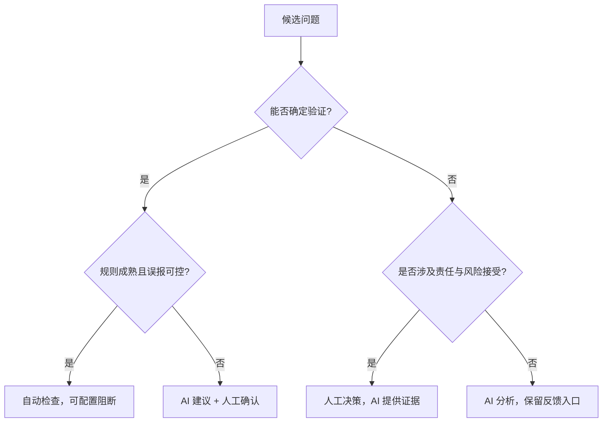

边界还要体现在产品交互中。如果 AI 评论被当成普通审查意见，开发者可以讨论、解决和隐藏；如果系统允许一键应用修复，就应保留变更 diff 和测试结果；如果支持自动重审，就要避免重复提交已解决评论。官方产品已经暴露出这些工程细节：GitHub Copilot 的评论不计入必需批准，也不会直接阻止合并；它允许自定义仓库规则和反馈，并提示重审可能重复评论。[5]

## Shift-Left 不是把所有门都移到最左边

Shift-Left 常被理解成“越早检查越好”。更完整的定义是：把能够在早期获得足够证据的检查提前。格式、类型和局部语义可以在编辑器或提交前运行；依赖真实集成环境的行为仍应留给集成测试；需要线上流量才能判断的问题要依靠灰度和监控。

AICR 适合位于提交前和 MR 阶段，因为此时 diff、仓库和作者意图基本可得，修改成本又比测试后更低。它还可以成为生码任务的质量门：Agent 完成代码后先触发 AICR，处理高置信问题，再把代码交给人。但“左移”不能让同一个 AI 同时写代码、审自己、宣布通过并自动发布。生成者与评价者需要一定分离，关键状态要由外部系统维护。

本课程案例把这套思想称为 CR Shift-Left。它不是一个单独模型，而是一组对象和流程：Session 保存一次审查，Batch 控制工作量，Issue 保存候选问题，状态机规定下一步，MCP 暴露领取任务与提交结果的工具，指标和记忆把反馈带回下一轮。第 2 章会沿一条真实请求逐站拆解。

## 本课程接下来怎样推进

第 1 章只建立了边界：人工、规则工具与 AI 各有职责；高质量不等于评论数量；AICR 必须同时面对噪音与遗漏。

第 2 章把模型放进一个可执行系统。你会看到 Prompt 为什么仍然必要，却不足以控制长流程；也会看到 Session、Batch、File、Issue、状态机、MCP 和 Agent 怎样交接。第 3 章先建立度量语言，定义采纳率、召回率与 F1，并揭示分母变化如何改变结论。随后四章分别诊断和改造采纳率、召回率，最后进入远端服务化。

这条路线刻意把指标放在改造之前。没有稳定口径，“优化”很容易退化成展示几条漂亮评论。也只有先分清 AI 和人的责任，后续的自动采纳、质量门和远端接入才不会扩大错误权限。

## 路线检查

回到章首的 26 文件 MR，可以这样分工：lint 处理格式和确定性规则；静态分析检查可编码的数据流与资源释放；AI 在仓库上下文中扫描错误变量、跨文件约定和候选风险；人工集中判断异步设计、业务契约和是否接受风险。测试环境发现的锁问题还应进入评估集，检查下一版 AICR 能否召回。

如果你面对一个新问题，可以依次问五个问题：它能否被确定性规则表达？需要哪些仓库或业务上下文？报告错误的成本是什么？谁有权接受风险？结果如何验证和回流？能够回答这五问，就不会把“采用 AI”误写成“增加一次模型调用”。

## 参考文献

1. Alberto Bacchelli, Christian Bird. [Expectations, outcomes, and challenges of modern code review](https://doi.org/10.1109/ICSE.2013.6606617). ICSE, 2013.
2. Google Engineering Practices. [The Standard of Code Review](https://google.github.io/eng-practices/review/reviewer/standard.html)；[What to look for in a code review](https://google.github.io/eng-practices/review/reviewer/looking-for.html).
3. Shane McIntosh, Yasutaka Kamei, Bram Adams, Ahmed E. Hassan. [The impact of code review coverage and code review participation on software quality](https://doi.org/10.1145/2597073.2597076). MSR, 2014.
4. Zhiyu Li 等. [Automating Code Review Activities by Large-Scale Pre-training](https://arxiv.org/abs/2203.09095). ESEC/FSE, 2022.
5. GitHub Docs. [About GitHub Copilot code review](https://docs.github.com/en/copilot/concepts/agents/code-review)；[Using GitHub Copilot code review](https://docs.github.com/en/copilot/how-tos/use-copilot-agents/request-a-code-review/use-code-review).
6. Tao Sun 等. [BitsAI-CR: Automated Code Review via LLM in Practice](https://arxiv.org/abs/2501.15134). 2025.
7. Imen Jaoua, Oussama Ben Sghaier, Houari Sahraoui. [Combining Large Language Models with Static Analyzers for Code Review Generation](https://arxiv.org/abs/2502.06633). MSR, 2025.
8. Shweta Ramesh 等. [Automated Code Review Using Large Language Models at Ericsson: An Experience Report](https://arxiv.org/abs/2507.19115). ICSME, 2025.


---

# 第 2 章 从 Prompt 到 Harness：整体架构与核心思路

> 预计学习时间：80–100 分钟
> 一句话总结：沿一次真实审查请求拆开入口、状态机、批次、MCP、Agent 与结果验证的职责。

## 一个 Prompt 为什么控制不了完整审查

设想一条很长的指令：先检查环境，再读取全部改动；按文件依赖分组，每组审查后提交结构化结果；高风险问题要复核；所有批次完成后检查遗漏，最后生成总结。模型读懂这段话并不困难。困难在于任务运行几十分钟后，系统怎样知道它真的完成了每一步。

如果模型直接回复“已检查所有文件”，这句话是自我报告，不是完成证据。它可能跳过后段文件，可能把两个步骤合并，也可能在上下文变长后只给概括性意见。Prompt 可以表达期望，却无法独立保存事务状态、核对文件集合、阻止越级调用、恢复中断任务或让多个执行者共享进度。

这不意味着 Prompt 没用。Prompt 负责把当前任务、规则、上下文和输出格式告诉模型。问题在于我们曾让它同时承担四种职责：说明目标、保存进度、控制流程、验收结果。后面三种职责更适合确定性程序。

[[Harness]] 的作用，就是把这些工程职责从 Prompt 中拿出来。它是围绕模型的一套运行支架：准备上下文，暴露工具，保存状态，限定权限，验证结果，处理失败并记录指标。模型仍负责代码语义分析；系统不再把完整流程寄托在模型的工作记忆里。

Anthropic 的工程文章区分了 workflow 与 agent：[[Workflow]] 由预定义代码路径编排模型和工具，[[Agent]] 则由模型动态决定过程与工具使用。[1] 本课程案例是混合结构。宏观审查路径由状态机规定，因此更像 workflow；在每个批次内部，Agent 可以搜索仓库、阅读关联文件并决定分析方法。这个区分能避免一个误解：采用 Agent，不等于把所有控制权交给模型。

## 先画出系统边界

一条本地 AICR 请求至少涉及四层。为了公开教学，下面把与业务无关的入口合并为“CLI/调用方”，保留实现中的核心服务和工具名。

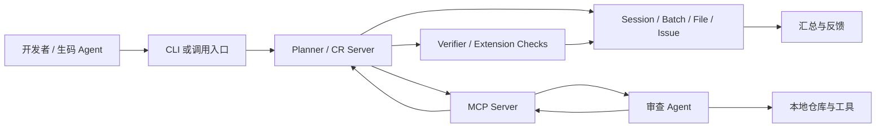

调用方负责发起任务和携带必要身份、仓库、分支或 MR 信息。Planner 负责创建审查计划、推进状态、切分批次和决定下一步。MCP Server 把后端能力转换为模型可调用的工具。Agent 阅读当前 Prompt，在工作区内分析代码，再提交结构化结果。Verifier 和扩展检查不相信“我完成了”，而是检查结果格式、工作量和后续复核条件。

这里的 Server 不是“更大的模型”。它是确定性控制面。Agent 也不是数据库状态的所有者。只要这条边界明确，系统就能回答三个重要问题：谁可以推进状态，谁可以生成问题，谁可以判定流程完成。

MCP 官方规范采用 Host–Client–Server 架构。Host 管理多个 Client、权限和生命周期；每个 Client 与一个特定 Server 保持 1:1 有状态会话；Server 暴露 tools、resources 和 prompts，并通过能力协商声明支持什么。[2] 课程案例没有机械复制规范名词，但遵守相同方向：模型侧通过受控工具访问后端能力，而不是直接修改审查数据库。

## 一次请求怎样穿过系统

下面沿一条正常请求走一遍。先只看交接，不急着记状态编号。

### 入口：创建或复用任务

开发者在本地工作区触发 AICR。入口校验参数，识别仓库和改动范围，然后调用 Setup。远端模式还会处理异步任务、仓库准备和回调，第 8 章再展开。

入口不应每次都无条件创建新任务。同一份改动可能因为页面刷新、网络重试或外部平台重复回调而被多次触发。系统需要内容哈希和会话状态来判断：复用已完成结果、继续未完成 Session，还是创建新 Session。幂等从入口开始，不能等 Agent 已经运行后再补。

### Setup：把模糊改动变成可审查对象

`setupSession` 做的工作比“调用模型”更基础：创建或更新 Session，收集改动文件，过滤不需要审查的类型，计算内容哈希，尝试复用历史文件结果，再调用批次分配器生成 Batch。完成后，Session 进入 ready 状态，`current_step` 仍表示未正式开始，`allowed_next_step` 指向 0。

文件过滤必须可追溯。依赖锁文件、生成产物、二进制资源或超大文件可能被排除，但排除不能悄悄发生。否则最终“完成 100% 审查”只覆盖了过滤后的集合，读者却以为覆盖了 MR 全部文件。好的 Setup 会保存原始集合、有效集合和排除原因。

历史复用也有边界。文件路径相同不代表内容相同；内容相同但规则版本改变，也未必可以复用。当前实现使用内容哈希和 Session 状态参与判断。工程上还应考虑模型、Prompt、规则与工具版本，把它们纳入结果有效性的定义。

### Planner：只下发当前任务

Setup 完成后，Planner 不把全流程一次性塞给 Agent。它读取 `allowed_next_step`，调用相应处理函数，生成当前阶段的 Prompt。Agent 每次拿到的不是“请自行完成一切”，而是明确的下一项工作和结构化提交要求。

在批次审查阶段，Planner 还会读取当前 `current_batch_index`，只提供当前 Batch 的文件、规则与上下文。完成一个 Batch 后，服务端才决定继续下一个、进入扩展检查、回退重审或生成汇总。

### MCP Bridge：把状态转换为工具契约

模型无法直接调用 Egg Service。MCP Server 注册两个核心工具：

- `cr_shift_left_batch_review`：根据 `session_id` 领取或继续当前允许的审查任务。
- `cr_shift_left_post_batch_results`：提交 `batch_results`，扩展阶段还可携带 `extension_results`。

工具名不是重点，契约才是。领取工具只需要 Session ID，服务端根据状态返回当前 Prompt；提交工具要求每条结果包含文件、行号、评分、分类、内容及可选代码片段。Agent 不传“下一步应该是 3”，也不直接把 `current_batch_index` 加一。状态推进权留在后端。

### Agent：在批次内部执行语义工作

Agent 收到当前批次后读取改动，必要时搜索定义、调用方和测试。它可以根据代码决定先看哪个文件，也可以用工具补足上下文。这是模型应有的自由：在受控工作单元里选择分析路径。

Agent 产出的是候选 Issue，而不是最终真理。一个候选问题至少要回答：问题在哪，现有代码是什么，风险为何成立，严重度和类别是什么，怎样改进。高质量评论还要区分“必须修复的正确性问题”和“可选的维护建议”。这些字段让后端能够检查完整性，也让后续指标有稳定对象。

### 提交与验证：先验收，再推进

Agent 调用提交工具后，Processor 根据当前状态解释 payload。如果状态是 2，`batch_results` 会进入验证；如果缺少预期结果，实现会降级回 Step 1，而不是假装完成。验证通过后保存 Issue、更新 Batch 和 Session，再决定下一个状态。

验证不等同于让另一个模型说“看起来不错”。可确定检查优先写成代码：字段是否完整，文件是否属于当前批次，行号是否合理，是否重复提交，审查耗时与问题密度是否落在配置范围，包含高风险修复建议时字段是否齐全。模型复核适合处理语义相关性，不能替代这些机械约束。

### 汇总：从多批结果生成可读结论

所有批次和必要扩展检查结束后，状态进入 3。汇总从数据库中的结构化 Issue 生成，而不是要求模型回忆此前对话。它可以按风险和类别组织问题，链接文件位置，说明覆盖和排除项，并为指标与反馈保留 Issue ID。

```mermaid
sequenceDiagram
  participant U as 调用方
  participant S as Setup/Planner
  participant D as 状态数据
  participant M as MCP Server
  participant A as Agent
  participant V as Verifier
  U->>S: 创建审查请求
  S->>D: 创建 Session、File、Batch
  U->>M: batch_review(session_id)
  M->>S: processSession()
  S->>D: 读取 allowed_next_step
  S-->>M: 当前阶段 Prompt
  M-->>A: 当前批次与规则
  A->>A: 搜索、阅读、分析
  A->>M: post_batch_results(...)
  M->>S: 结构化结果
  S->>V: 验证当前提交
  V-->>S: pass / retry / extension
  S->>D: 保存 Issue 并推进状态
  S-->>A: 下一批、扩展检查或汇总
```

这张图不是实现证据。证据来自 `setup.ts`、`processor.ts`、两个 MCP Tool、`verifier.ts` 与数据模型。图的作用是把它们组织成一条可复述的请求链。

## 五个核心数据对象

只看服务调用容易误以为状态都存在 Prompt 里。真正让任务可恢复的是持久对象。

### Session：一次审查的总账

[[Session]] 保存顶层生命周期：执行模式、状态、当前步骤、下一步许可、当前批次、文件数、行数、批次数、完成数、问题数、开始和结束时间。它还是外部请求与内部对象的关联点。

Session 不应该塞入所有结果详情。它保存汇总和指针，具体文件、批次和问题使用独立对象。这样更新一个 Issue 不必重写整份会话，也便于按批次恢复。

### File：审查范围的快照

File 对象记录路径、diff 规模、内容哈希、过滤或复用状态，以及它属于哪个 Session。它回答“本次到底要审什么”。如果只把文件列表写在 Prompt 中，任务中断后很难证明哪些文件已经处理。

内容哈希让系统区分“同一路径的新内容”和“可以复用的相同内容”。但哈希只证明字节关系，不能证明规则环境相同。课程后续会把版本维度纳入评估讨论。

### Batch：受控工作单元

[[Batch]] 把多个 File 组织为一次 Agent 可以处理的工作量。当前实现主要以约 800–1200 diff 行作为理想范围，同时结合语义分组、拆分、合并、去重和完整性检查。旧设计材料曾出现 800–1500，这属于版本差异，不应混成一个固定行业阈值。

Batch 要保存索引、文件集合、工作量、状态、重试与结果统计。它让系统可以说“第 4 批失败，重新执行第 4 批”，而不是整次审查从头开始。

### Issue：可反馈、可度量的问题单元

[[Issue]] 是一条候选审查问题。位置、评分、类别、描述、现有代码、改进代码、采纳状态和有效性围绕它组织。后续采纳率的分子分母，本质上是在筛选 Issue。

Issue 必须有稳定标识。开发者拒绝一条评论、最终代码采纳建议、测试发现漏报，都需要关联到具体对象。若结果只存在一段汇总文本中，数据闭环就无法建立。

### PendingTask 与 MemoryRule：跨执行与跨会话状态

远端模式使用 PendingTask 表达排队、认领、执行、回调和终态；MemoryRule 保存由历史反馈形成的规则。前者让一次任务跨进程恢复，后者让不同 Session 共享经过筛选的经验。第 8 章和第 5/7 章分别展开。

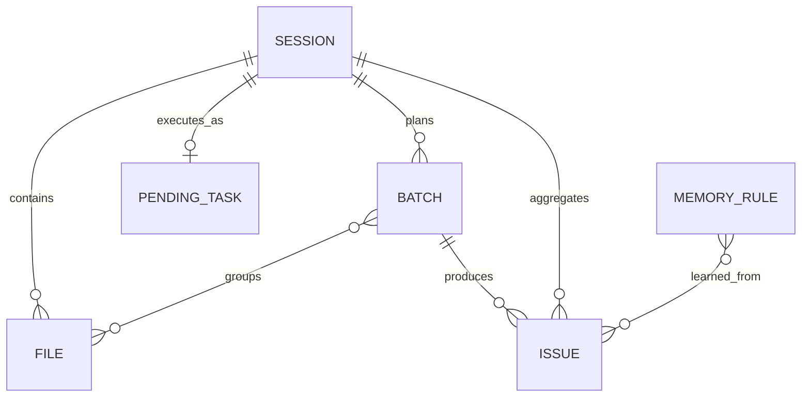

ER 图省略了真实表名、组织字段和大量实现列，只表达教学关系。关系不是说每个数据库都必须这样设计；它说明这些对象分别解决范围、工作量、结果、异步生命周期和跨任务反馈。

## `allowed_next_step`：把建议变成许可

当前主链是 `0 → 1 → 2 → 2.x → 3`。它不是进度百分比，而是服务端允许执行的动作类型。

| 状态 | 含义 | 谁执行主要工作 | 进入下一状态前的证据 |
| --- | --- | --- | --- |
| `0` | 前置与环境检查 | Server 读取配置，Agent 按提示确认环境 | Session 可运行，配置和身份满足条件 |
| `1` | 下发并执行当前批次审查 | Server 选 Batch，Agent 分析代码 | 有当前批次及明确提交契约 |
| `2` | 接收并验证批次结果 | Server / Verifier | 结构、范围和质量检查通过，或得到重试理由 |
| `2.x` | 执行条件化扩展检查 | Agent + 扩展检查编排器 | recheck、记忆、过滤等当前所需检查完成 |
| `3` | 生成最终汇总 | Server / Agent 按持久结果汇总 | 所有必要批次和扩展检查已达到终态 |

`current_step` 表示当前记录到的阶段，`allowed_next_step` 表示允许的下一动作。二者分开能表达“刚完成 Step 1，下一次提交必须按 Step 2 解释”。如果只保存一个 `status=running`，服务端收到 payload 时不知道它是批次结果、扩展结果还是重复请求。

下面是 `processor.ts` 的简化节选。无关日志、监控和字段已移除，状态值与分发关系保持不变。

```typescript
// 简化节选：状态由服务端读取，调用方不能自选处理分支
const session = await getSession(sessionId);

switch (session.allowed_next_step) {
  case "0":
    return executeStep0(session);
  case "1":
    return executeStep1(session);
  case "2":
    return handleStep2(session, batchResults);
  case "2.x":
    return handleStep2x(session, extensionResults);
  case "3":
    return executeStep3(session);
  default:
    return { error: "INVALID_STEP" };
}
```

这个 switch 的价值不在语法，而在所有权：Processor 从数据库读取状态，再选择处理函数。Agent 即使在 Prompt 中写“请进入汇总”，也不能绕过未完成的批次。

### 正常状态循环

一次 Batch 的常见循环是 `1 → 2 → 1`。Step 1 下发任务并把许可推进到 2；Agent 提交结果；Step 2 验证通过，若还有批次就增加索引并回到 1。所有批次完成后，系统可能进入 `2.x` 或 `3`。

### 缺失结果时的降级

如果状态为 2，调用却没有 `batch_results`，当前实现不会生成空结果并继续。`handleStep2` 会把 Batch 状态回退为 pending，把 `allowed_next_step` 设回 1，再重新下发审查。`2.x` 缺少扩展结果时也会清理扩展状态并回退。

这是一个实用的失败处理原则：payload 与当前状态不匹配时，选择可解释的恢复点。恢复动作必须幂等，避免重复保存 Issue 或跳过 Batch。

### 扩展状态为什么写成 `2.x`

扩展检查不是单个固定步骤。它可以根据问题、模式和配置进入 recheck、negative memory、接口契约、任务说明、positive memory、filter 或 fix。把它统一标成 `2.x`，再由 `extension_check_state` 保存内部子状态，能让主链保持稳定，同时允许检查序列演进。

这种设计也有代价。日志和指标必须同时记录主状态与子状态，否则所有扩展耗时都堆在 `2.x`。工具 payload 也要明确当前期望哪种扩展结果，不能让 Agent 猜。

## 链式 Prompt：每一步只承担当前责任

Harness 并没有消灭 Prompt，而是改变 Prompt 的粒度。`promptBuilder.ts` 会根据环境检查、当前批次、验证反馈、扩展检查和汇总生成不同提示。每份 Prompt 都可以包含四类信息：当前事实、当前任务、可用工具、提交契约。

“当前事实”包括 Session ID、批次索引、文件范围、规则和已知上下文。“当前任务”只描述这一阶段要完成的判断。“可用工具”告诉 Agent 如何搜索和提交。“提交契约”规定字段、何时调用工具以及不能自行宣布的状态。

链式 Prompt 的优点是局部可调试。如果某一批没有按格式提交，可以检查对应阶段的提示和工具 schema；如果高风险复核遗漏，可以检查扩展阶段；如果汇总不完整，可以对照数据库 Issue。单一巨型 Prompt 失败时，很难知道是理解、记忆、工具还是状态出了问题。

它也有风险。不同 Prompt 可能重复或冲突，旧规则可能残留，阶段切换时必要上下文可能丢失。因此 Prompt 需要版本管理和契约测试。至少应验证状态名、工具名、必填字段和禁止越级指令与代码一致。

## Harness 的四层职责

为了设计新系统，可以把职责压缩成四层，而不是照抄类名。

### Planner：决定做什么

Planner 根据改动范围与当前状态决定批次、顺序和下一任务。它维护全局完成条件，但不替 Agent 阅读每一行代码。Planner 的输出必须可持久化：任务列表、状态转换和失败原因不能只存在于一次模型回复。

### Team Lead / Verifier：决定是否算完成

Verifier 负责验收。确定性条件写成程序，语义条件可以调用独立复核。它不能只看“输出是否很长”，而要检查当前工作单元是否完整、证据字段是否可用、结果是否与文件范围一致。

### Bridge / MCP：控制怎样访问能力

Bridge 把后端能力暴露为窄工具。工具参数越清楚，越容易校验和审计。不要提供一个万能 `execute(action, payload)` 让模型自行拼动作；也不要让工具直接接受“目标状态”。工具应围绕业务动作设计，例如领取当前批次、提交当前结果。

### Executor / Agent：完成语义分析

Executor 在受限工作区中读取代码、调用搜索和测试工具，生成候选 Issue。它的自治范围由批次、权限与停止条件共同决定。模型更强可以改善这一层，却不能取消其他三层。

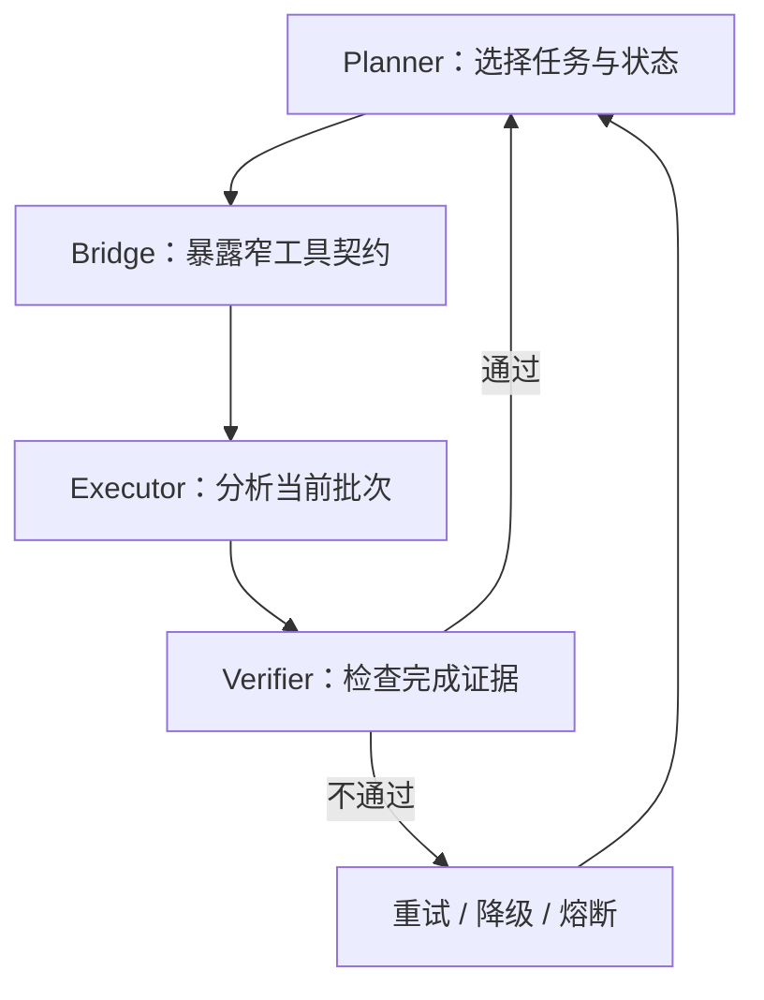

Anthropic 所说的 orchestrator-workers 与 evaluator-optimizer 模式可作为公共参照：中央编排者动态拆解任务，工作者执行；评价者依据清楚标准给反馈并循环改进。[1] 本案例与它们相似，但状态机、数据库和 MCP 工具让流程具备持久与恢复能力。不要因为结构相似，就声称某篇文章证明了当前实现最优。

## 正常路径之外的六个失败点

架构是否可靠，取决于失败时还能否解释和恢复。

### 失败点一：Setup 范围不完整

文件过滤错误或 diff 获取失败，会让后续所有步骤在错误集合上“成功”。应记录总文件、有效文件、排除文件和原因，并在汇总展示覆盖边界。

### 失败点二：批次不均衡

一个 Batch 太大，Agent 容易概括；太小则上下文被切碎，跨文件关系丢失。当前 800–1200 行只是案例实现的主要理想范围，不是通用答案。分批还要考虑语义依赖、文件类型和仓库基线。

### 失败点三：重复领取或重复提交

网络重试可能重复调用工具。领取动作应返回同一当前任务，提交动作应根据 Session、Batch 和结果标识去重。只靠前端按钮禁用无法保证幂等。

### 失败点四：状态与 payload 不匹配

状态是 2，Agent 却提交扩展结果；状态是 `2.x`，调用方没有 extension payload。Processor 必须拒绝或回退，日志要记录期望与实际，不要把未知字段悄悄丢弃后推进。

### 失败点五：验证门被配置关闭

实现包含耗时、密度、内容长度和高风险建议检查，但兜底配置中部分阈值是 0 或近似关闭值，运行时又可能被数据库热配置覆盖。架构图上有 Verifier，不代表每个质量门在所有环境都生效。第 7 章会区分设计目标、默认值和运行值。

### 失败点六：扩展检查循环不终止

recheck 或 fix 如果不断返回需要继续，任务会卡在 `2.x`。每个子状态需要重试上限、超时、熔断和可人工接管的终态。失败不是 `running` 的另一种写法，必须有明确分类。

## 怎样观察这条链路

没有可观测性，状态机只是在数据库里移动字符串。每次处理至少应绑定 Session 级 trace，并记录阶段名、Batch 索引、开始结束时间、结果数量、验证结论和错误类别。

当前实现把 `allowed_next_step` 转换为类似 `processor_step_2_x` 的阶段名，并在 MCP 工具调用处记录领取和提交阶段。这让监控可以回答“卡在哪个状态”“某个工具失败还是审查超时”“重试是否集中在特定 Batch”。远端执行器还需要队列等待和仓库准备指标。

日志不能记录全部 Prompt、令牌和业务代码而不设边界。公开或多租户系统应脱敏仓库地址、账号、任务文本和代码片段。更适合长期保留的是哈希、版本、计数、状态与错误分类；需要原文排障时使用受控采样和访问审计。

## 源码观察：从三处验证架构

阅读真实仓库时，不必从目录第一行读到最后一行。沿请求链抓三个观察点即可建立骨架。

第一处看 `setup.ts` 的 `setupSession`。记录它创建哪些对象，如何过滤文件、计算哈希、复用历史结果和生成 Batch。检查完成时写入的 Session 状态。

第二处看 `processor.ts` 的 `processSession`。确认 switch 的输入来自数据库 Session，不来自 Agent 参数；再追踪 Step 1 怎样选择批次、Step 2 怎样验证、缺失 payload 怎样回退、什么时候进入 `2.x` 与 3。

第三处看两个 MCP 工具。`cr_shift_left_batch_review` 只传 `session_id` 并调用 Processor；`cr_shift_left_post_batch_results` 传结构化结果，同样把处理权交给 Processor。工具本身不重写状态机，这是 Bridge 应有的薄度。

完成这三处后，再按问题进入 `batchAllocator.ts`、`verifier.ts`、`extensionChecker.ts`、`promptBuilder.ts` 和数据模型。这样阅读的依据是因果链，而不是文件大小。

## 状态预测练习

在做状态预测前，还需要补一层容易被架构图隐藏的设计：Batch 怎样形成，以及工具契约怎样证明“当前批次”没有被越界处理。

### 分批不是按行数机械切片

最简单的分批方法是把 diff 每 1000 行截断。它会制造两个问题。第一，一个组件的类型、实现和测试可能被切进三个批次，Agent 在每批都只看到不完整语义。第二，某个 900 行生成文件可能独占一个 Batch，真正需要审查的十几个小文件却被挤到另一个超载批次。

当前 `batchAllocator.ts` 采用多阶段思路。先按目录、文件关系和语义线索形成初始组，再根据工作量拆分过大的组、合并过小的组，最后做去重和完整性校验。约 800–1200 diff 行是主要理想范围，不是第一优先级压倒所有语义关系的硬切线。

分批结果至少要满足三个不变量。每个有效 File 必须属于某个 Batch；同一个 File 不应在普通审查阶段被无意重复分配；所有 Batch 的文件并集应等于 Setup 认定的有效文件集合。三个不变量都可以由程序检查，不需要模型判断。

跨 Batch 依赖无法完全消除。可采用两种补偿。一种是在 Prompt 中附带只读的关联摘要或符号信息，让当前批次知道外部契约；另一种在所有批次完成后执行扩展检查，专门查跨批次冲突。补偿信息要受预算控制，否则分批在物理上存在，模型上下文却仍然承载全仓库。

Batch 大小还会影响指标。大 Batch 可能让后段文件漏检，小 Batch 增加调用次数、成本和重复评论。后续做召回率实验时，应把批次规模作为实验变量记录，而不是只看最终 F1。若同时改模型、Prompt、批次和规则，就无法知道提升来自哪里。

### 工具 schema 是协议，不只是参数校验

领取工具输入只有 `session_id`，意味着调用者不能指定“我要第 8 批”。服务端依据 Session 返回当前允许的任务。这个设计缩小了越权面：即使 Agent 记错索引，也不能绕过前七批。

提交工具中的 `batch_results` 是数组，每项包含文件路径、行号、评分、类别和问题内容，并允许带现有代码、改进代码等字段。schema 能阻止字段类型明显错误，却不能证明语义真实。例如 Agent 可以提交一个属于其他批次的合法路径，也可以给不存在的行号。服务端仍需把 payload 与当前 Batch、diff 和文件快照交叉检查。

扩展检查复用同一提交入口，是为了让 Processor 统一读取状态并解释 payload。它也要求错误信息足够清楚：是当前状态不接收 `batch_results`，还是 `extension_results` 缺少当前子检查字段。模糊的“参数错误”会让 Agent 盲目重试。

一个稳健的工具响应不只返回 Prompt。机器可读部分还可以包含 `session_status`、当前 Batch、下一步类型、验证是否通过和稳定错误码；面向 Agent 的自然语言说明负责解释动作。把所有信息塞进一段文字，会让调用方再次依赖模型解析状态。

### 状态转换需要并发保护

本地单人运行也可能出现并发：用户重复点击、MCP 超时后重试、旧请求晚到。两个提交同时读取 `allowed_next_step=2`，都验证并保存，就可能重复 Issue、重复增加完成数，甚至把索引推进两次。

常见防护是带条件更新：只有数据库仍处于期望状态和版本时才提交转换。也可以为 Session 增加版本号，更新时使用 compare-and-swap；Issue 使用 Session、Batch 与内容指纹组成唯一键；完成计数从 Batch 状态聚合，而不是无条件 `+1`。课程案例的远端 PendingTask 使用软认领和同仓库分支串行处理类似问题，第 8 章会详细讨论。

状态机设计还要列出非法转换。`1 → 3` 不应因为 Agent 提前总结而发生；完成态不应重新接受普通结果；失败恢复只能回到明确检查点。把非法转换写成测试，比在 Prompt 里强调“绝对不要跳步”可靠。

### 结果保存要先于下一任务下发

假设 Step 2 验证通过后先返回下一批 Prompt，异步保存 Issue 随后失败。Agent 已开始下一批，数据库却仍认为上一批未完成。恢复时可能重复审查，也可能丢结果。

较安全的顺序是：验证 payload，事务性保存 Issue 与 Batch 状态，更新 Session 的下一步许可，提交成功后再返回新 Prompt。跨数据库或外部系统无法单事务时，使用幂等事件和可重放的 outbox，而不是假设网络调用一定成功。

这条顺序解释了为什么“链式对话”不等于状态机。对话可以把下一段文字发出来，只有持久提交才能证明上一阶段已经形成可恢复事实。

## 两种替代架构及其边界

理解 Harness 不必把当前实现当唯一答案。比较替代方案更容易看清选择条件。

第一种是无状态 PR Bot：每次收到 webhook，就取 diff、调用模型、发布评论。它组件少、反馈快，适合小改动和可容忍失败的建议型场景。缺点是难以恢复长任务，跨批完成证明弱，重复触发和上下文选择需要额外处理。若团队只想给 5 个文件的 MR 做非阻断提示，这可能是更合适的起点。

第二种是完全自治 Agent：给仓库、目标和工具，让模型自行规划、审查、复核并总结。它对未知任务有弹性，也减少显式流程代码；但完成证明、成本上限、权限和可复现性更难控制。高风险或规模化服务通常仍需要外部超时、预算、状态和人工批准。

当前混合 Harness 位于两者之间：Server 固定主状态和完成条件，Agent 在批次内部保持自治。它付出的代价是更多数据对象、迁移、监控和契约维护。只有当任务规模、自动化调用或恢复要求确实存在时，这些代价才合理。

下面不是标准答案式测验，而是检查你是否掌握状态所有权。

情况一：Session 的 `allowed_next_step` 是 1，当前批次索引为 3。调用领取工具后，服务端应下发第 3 批任务，并把后续期望调整为提交结果。Agent 无权自行把索引改成 4。

情况二：状态是 2，但提交调用没有 `batch_results`。当前实现回退到 Step 1，把当前 Batch 恢复为 pending，再次下发审查。它不会把空数组当成“没有发现问题”，因为“未提交结果”和“审查后确认零问题”语义不同。

情况三：状态是 `2.x`，扩展检查返回完成。Processor 应根据 `extension_check_state` 判断还有没有下一个扩展子任务；有则继续 `2.x`，无则进入下一个 Batch 或状态 3。Agent 的文字总结不能代替这个判断。

情况四：所有 Batch 标记完成，但有一个 File 从未属于任何 Batch。即使状态准备进入 3，完整性检查也应阻止汇总或标记范围缺陷。完成批次数不等于文件覆盖完整。

如果能解释这四种情况，你已经抓住 Harness 的核心：模型产生语义判断，外部系统保存事实并决定许可。

## 从 Prompt-only 迁移到 Harness 的最小路径

新团队不必一次建设全部组件。可以按风险逐层外置。

先把输出变成稳定 schema，让每条 Issue 有位置、类别、严重度、证据和建议。随后增加 Session，保存请求、状态和结果。再把大改动切成 Batch，由服务端发放当前批次。之后加入确定性验证、重试和终态。最后再扩展记忆、自动采纳、远端队列和复杂复核。

每一步都应该解决一个可观察问题。若当前任务只有几个文件、失败可人工重跑，完整状态机可能得不偿失；若需要长时间运行、跨几十个文件、被外部平台自动调用，持久状态和幂等就不是“高级功能”，而是基本正确性。

这一判断也符合公开工程建议：先使用能满足任务的最简单方案，只在性能与可靠性需要时增加 agentic 复杂度。[1] 简单不是少写代码，而是让每个组件都有清楚失败模式。一个 300 行万能 Prompt 往往比五个窄接口更难验证。

## 本章收束

一条高质量 AICR 请求可以用一句因果链复述：Setup 固定审查范围并生成 Batch；Planner 根据持久状态只下发当前任务；MCP 把任务变成窄工具契约；Agent 在工作区内做语义分析；Verifier 根据证据决定通过、重试或扩展；所有结果落入数据对象，最终汇总不依赖模型记忆。

这套架构解决的是“怎样可靠执行”，还没有回答“执行结果是否变好”。如果没有指标，状态机只能证明流程跑完，不能证明评论值得采纳，也不能证明漏报减少。第 3 章会把 Issue 状态映射为 TP、FP、FN，并解释为什么分母口径比公式更容易出错。

## 参考文献

1. Anthropic. [Building effective agents](https://www.anthropic.com/engineering/building-effective-agents). 2024-12-19.
2. Model Context Protocol. [Architecture, Specification 2025-06-18](https://modelcontextprotocol.io/specification/2025-06-18/architecture).
3. GitHub Docs. [About GitHub Copilot code review](https://docs.github.com/en/copilot/concepts/agents/code-review)；[Using GitHub Copilot code review](https://docs.github.com/en/copilot/how-tos/use-copilot-agents/request-a-code-review/use-code-review).
4. GitLab Docs. [GitLab Duo in merge requests](https://docs.gitlab.com/user/project/merge_requests/duo_in_merge_requests/).
5. Nelson F. Liu 等. [Lost in the Middle: How Language Models Use Long Contexts](https://arxiv.org/abs/2307.03172). TACL, 2023.


---

# 第 3 章 先建立度量：采纳率、召回率与 F1-Score

> 预计学习时间：85–105 分钟
> 一句话总结：从 TP、FP、FN 到真实状态枚举，建立一套可复算、能解释排除项的 AICR 指标口径。

## 三条漂亮评论不能证明系统变好了

团队升级了模型，新版本在一次 MR 中发现三条真实问题，评论解释清楚，开发者全部采纳。展示页面看起来很有说服力。可它没有回答另外几件事：系统一共报告了多少条，是否还有十几条被拒绝，测试后来发现了多少漏报，这三条是否来自定向挑选的成功案例。

评估 AICR 至少要同时看两种错误。第一种是系统报告了不成立、无价值或不可执行的问题，开发者被噪音打扰；第二种是系统没有报告本应发现的问题，团队得到虚假的安全感。前者主要伤害采纳与信任，后者主要伤害召回与覆盖。

指标的公式并不难。难的是把真实协作过程映射为可以复算的样本：什么算“系统报告”，什么算“确实存在”，开发者改了类似代码算不算采纳，人工 CR 后来发现的问题是否都应归为 AI 漏报，测试 Bug 是否属于代码审查能力范围。

本章先给出通用的 Precision、Recall、F1，再进入案例代码的工程口径。两层不能混在一起。通用公式提供共同语言，业务状态决定每个数落在哪个格子。

## 从混淆矩阵开始

把每个“可能存在的问题”视为一个判断对象。系统要么报告，要么没有报告；真值标注要么认为它应当报告，要么认为不应报告。

|  | 真值：应报告 | 真值：不应报告 |
| --- | --- | --- |
| AI 报告 | [[TP]]：找对了 | [[FP]]：误报或不应报 |
| AI 未报告 | [[FN]]：漏报 | TN：正确保持沉默 |

TP 是 True Positive。AICR 报告某处锁释放缺失，经审查确认确实存在且属于本系统范围，这是一条 TP。

FP 是 False Positive。AICR 建议增加空值检查，但入口契约保证非空，或者方法内部已经处理，按当前审查规则这是一条 FP。低价值建议是否算 FP 要提前约定；若团队把“正确但不重要”单独分类，就不能在不同报告里随意合并。

FN 是 False Negative。人工 CR 或测试后来发现一个按规则应由 AICR 找到的问题，AI 没有报告，这是 FN。只有被观察到的漏报才能进入数据。没有人工复查和测试反馈的代码，不会自动产生“零 FN”。

TN 在代码审查中最难枚举。一个文件里不存在的问题数量近乎无限，不能把“AI 没有胡乱报告的所有地方”都计作 TN。因此 AICR 通常更关注 [[Precision]]、[[Recall]] 和 [[F1-Score]]，而不是表面准确率 Accuracy。

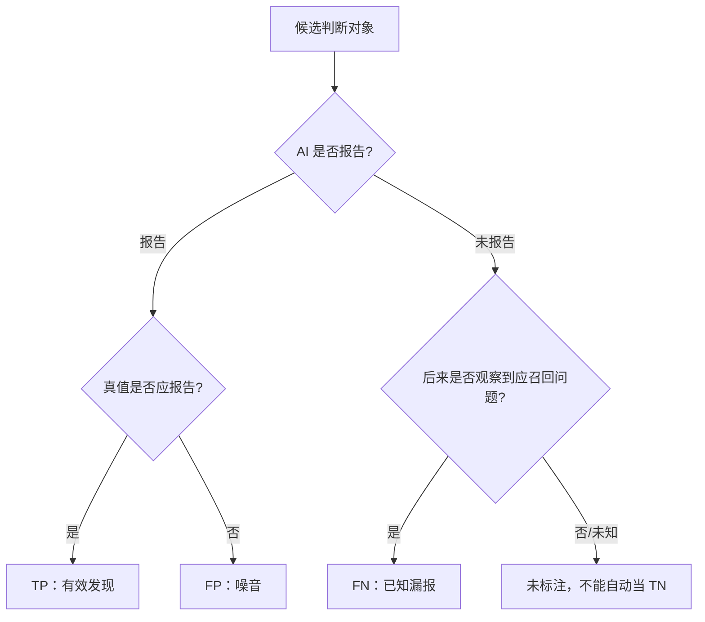

图中“未标注”是评估工程的关键。只要真值集合不完整，Recall 就是对“已知应召回问题”的召回，不是对所有潜在缺陷的绝对召回。

## Precision：报告出来的有多少值得保留

scikit-learn 给出的定义是：

`Precision = TP / (TP + FP)`

假设 AICR 报告 10 条可判定问题，其中 6 条经确认应报告，4 条被确认不应报告，Precision 是 `6 / 10 = 60%`。它回答“AI 开口时有多可靠”。[1]

在真实 AICR 产品中，团队常用“采纳率”近似观察 Precision：开发者采纳建议，通常说明评论有用；开发者拒绝，可能说明评论不成立。这个映射有价值，却不严格等价。

一条正确建议可能没被采纳，因为当前发布窗口不允许重构，作者已经用另一种方式修复，或建议代码不可用。一条建议也可能被机械接受，却没有解决根因。采纳是行为信号，Precision 是相对真值的分类指标。课程后文会继续使用“采纳率”，但每次都说明它是工程代理指标。

## Recall：应该发现的有多少被找到

通用定义是：

`Recall = TP / (TP + FN)`

若真值集有 12 个应报告问题，AICR 找到 6 个，Recall 是 `6 / 12 = 50%`。它回答“系统漏掉多少”。[1]

Recall 的分母不能从 AI 自己的输出构造。只统计 AI 报告的问题，永远看不到 FN。必须从独立来源补真值，例如人工 CR 已采纳问题、测试阶段确认的缺陷、回归事故、专家标注的 Benchmark，或带故障注入的评估集。

不同真值来源的观察窗口不同。人工 CR 更容易发现可读性、架构和局部逻辑问题；测试 Bug 更接近可执行行为；线上事故偏向高影响问题。把它们合并前要去重、归属并限定应召回范围。

## F1：同时惩罚噪音与遗漏

当 Precision 和 Recall 同等重要，F1 是二者的调和平均：

`F1 = 2 × Precision × Recall / (Precision + Recall)`

若 Precision 为 60%，Recall 为 50%，F1 约为 54.55%。调和平均会被较低的一侧明显拉低。一个系统 Precision 90%、Recall 10%，F1 只有 18%；这比算术平均 50% 更能暴露失衡。[1]

F1 仍不是“总体质量分”。它没有直接表达问题严重度、审查延迟、成本、覆盖文件和人工标注质量。两个系统 F1 相同，一个可能只报告高危问题，另一个覆盖大量风格建议。只有在同一数据窗口、真值集合、过滤规则和聚合方式下，F1 才适合比较。

还可以使用 Fβ 调整 Precision 与 Recall 权重。安全审查可能更怕漏报，选择 β>1；高噪音会让开发者关闭工具的场景可能更重 Precision，选择 β<1。本课程采用 F1 建立共同语言，不意味着所有仓库都应把两者权重设为相同。

## 先定义统计单位

在写 SQL 前，先回答“一个样本是什么”。候选单位至少有四种：Issue、文件、MR、任务。

Issue 级适合计算采纳率，因为一条评论有独立反馈。文件级适合观察覆盖，例如 20 个有效文件中有多少被审查。MR 级适合看一次变更是否出现至少一个有效问题。任务级适合远端队列和端到端完成率。

不能把单位混在一个分母里。例如分子是“采纳 Issue 数”，分母却是“有反馈 MR 数”；或趋势图一周按 Issue 计算，下一周改为按 MR 平均。名称仍叫采纳率，数值已经不可比。

本章主要使用 Issue 级采纳率与 Issue/Bug 混合的案例召回率。混合分母并非纯分类 Benchmark，它是当前工程看板的覆盖代理。我们会明确指出这一点。

## 当前采纳状态不是一个布尔值

真实协作中，建议不只有采纳和拒绝。案例代码的 `is_applied` 使用分段枚举保存反馈来源与可判定性。

| 状态 | 含义 | 当前正式采纳率 |
| --- | --- | --- |
| `0` | 人工标记未采纳 | 进入分母，不进分子 |
| `1` | 人工标记采纳 | 进入分母和分子 |
| `2` | 行级算法自动识别完全采纳 | 当前排除 |
| `3` | 行级算法自动识别完全未采纳 | 当前排除 |
| `4` | 外部生码/协作流程标记采纳 | 进入分母和分子 |
| `5` | 外部流程经确认未采纳 | 进入分母，不进分子 |
| `50` | 建议代码为空或不完整，无法自动检测 | 排除 |
| `51` | 仅注释建议 | 排除 |
| `52` | 文件已删除 | 排除 |
| `53` | MR 中低分问题无反馈，无法判断 | 排除 |
| `60–69` | 1%–99% 的部分采纳区间 | 当前排除 |
| `null` | 尚未检测或没有反馈 | 排除 |

旧版设计把部分低数字用于别的含义。当前课程以代码枚举为事实源。任何看板或历史报表若沿用旧解释，都必须带版本，否则状态 4/5 会被误读。

正式统计常量把 `[1, 4]` 作为已采纳，把 `[0, 5]` 作为未采纳，有效分母状态就是 `[1, 4, 0, 5]`。自动识别 2/3 被注释排除，部分采纳 60–69 也不进入当前正式分母。

这项选择牺牲了样本量，换取更清楚的反馈来源。它不代表自动检测没有价值。自动状态可用于运营提示、抽样和后续标注，只是当前正式口径没有把它与明确反馈混合。

## 当前采纳率的完整过滤链

代码中的采纳率可以写成集合表达：

`Adoption = count(status ∈ {1,4}) / count(status ∈ {0,1,4,5})`

但进入这个集合前还有过滤条件：

1. Session 创建时间位于统计窗口。
2. Issue 的 `score >= 4`。
3. `is_applied` 属于四个正式分母状态。
4. `is_valid` 为 1 或 `null`；明确无效的 0 被排除。

第四点很容易被口头描述成“只统计有效问题”，实际代码更准确的说法是“排除明确判无效的问题，同时保留尚未验证的 null”。如果未验证样本比例随时间变化，采纳率也会受影响。看板应同时展示 `is_valid=null` 的数量，而不是把它藏在分母里。

评分阈值同样改变指标。2–3 分建议即使有反馈，也不进入当前正式采纳率。这样可以聚焦高风险或高价值问题，但不能拿结果回答“全部评论中多少被采纳”。指标名称最好写成“4–5 分明确反馈采纳率”。

### 一个混合状态教学样本

下面有 12 条脱敏 Issue。它们是教学构造，不是生产数据。

| Issue | score | status | is_valid | 处理 |
| --- | ---: | ---: | ---: | --- |
| A 错误变量引用 | 5 | 1 | 1 | 正式分子、分母 |
| B 资源未释放 | 4 | 4 | 1 | 正式分子、分母 |
| C 场景不存在 | 4 | 0 | 1 | 正式分母 |
| D 修复建议不可用 | 5 | 5 | 1 | 正式分母 |
| E 建议代码完全匹配最终文件 | 5 | 2 | 1 | 自动状态，排除 |
| F 建议代码未匹配 | 4 | 3 | 1 | 自动状态，排除 |
| G 部分采用另一种写法 | 4 | 65 | 1 | 部分采纳，排除 |
| H 没有可比较的建议代码 | 5 | 50 | 1 | 无法检测，排除 |
| I 二次复核判为无效 | 5 | 1 | 0 | 明确无效，排除 |
| J 低分维护建议 | 3 | 1 | 1 | 低于阈值，排除 |
| K 尚未反馈 | 5 | null | null | 无正式状态，排除 |
| L 明确采纳但尚未做有效性复核 | 4 | 4 | null | 当前代码纳入分子、分母 |

正式分母是 A、B、C、D、L，共 5 条；分子是 A、B、L，共 3 条。采纳率为 `3 / 5 = 60%`。

若把自动状态 2/3 加入，分母变成 7，分子变成 4，结果约 57.14%。若再把部分采纳按“采纳”加入，结果又变。没有哪个数字天然更真实，只有定义是否匹配用途、来源是否可靠、版本是否稳定。

### 为什么自动检测暂不等于人工反馈

当前自动检测会清理注释和空行，对建议代码与最终文件做行级 [[LCS]] 比较。100% 匹配可判完全采纳，0% 可判未采纳，中间映射到 60–69 的部分区间。

LCS 能识别建议片段是否出现在最终文本，却不能判断语义等价。开发者可能换变量名、移动代码、用库函数重写，行为相同但文本不匹配；短片段如 `return null` 可能在文件其他位置碰巧出现，形成冲撞。注释类和文件删除因此有专门的无法判断状态。

自动检测适合做候选标签，不应在未校准前与人工确认等权混合。可以抽样比较自动状态与人工反馈，按代码长度、语言和改写类型测 Precision，再决定哪些区间进入正式口径。

## 当前召回率是怎样构造的

代码中有两个召回代理：

`综合召回率 = AI CR 已采纳 / (AI CR 已采纳 + 人工 CR 已采纳 + 应召回 Bug)`

`纯 CR 召回率 = AI CR 已采纳 / (AI CR 已采纳 + 人工 CR 已采纳)`

这里把 AI 已采纳近似视为 TP，把人工 CR 已采纳和后续应召回 Bug 近似视为 FN。它的优点是能连接研发流程中的现成反馈；局限是三类数据未必构成完整且互斥的真值集。

同一问题可能先被 AI 提出，又被人工重复评论；如果没有去重，会同时进入分子和分母。人工审查没有发现的问题并不自动不存在；测试 Bug 可能由环境、需求或集成问题引起，不一定属于代码审查范围。因此 Bug 先经过 `should_recall` 判断。

当前 Bug 统计还要求 `owner_role` 为 FE 或 BE。PM 和 unknown 被排除。角色过滤能减少不属于研发代码审查的问题，却会引入归属偏差：无法正确识别角色的真实缺陷不会进入分母。看板应同时展示被排除数量和原因。

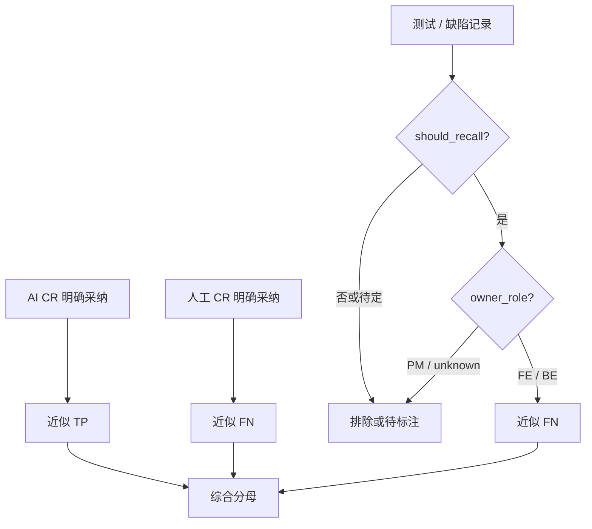

### 召回率教学样本

假设一个统计窗口中有 6 条 AI 已采纳高分问题、3 条仅由人工 CR 发现并采纳的问题、3 个经确认应由 AICR 召回且归属 FE/BE 的 Bug。

综合召回率是 `6 / (6 + 3 + 3) = 50%`。纯 CR 召回率是 `6 / (6 + 3) ≈ 66.67%`。

如果该窗口采纳率 Precision 代理为 60%，采用综合 Recall 50%，F1 约为 54.55%。采用纯 CR Recall 66.67%，F1 约为 63.16%。同一个系统得到两个 F1，原因不是公式不稳定，而是 Recall 分母不同。报告必须把“含 Bug”或“不含 Bug”写进名称。

若 Bug 中还有 2 个 `unknown` 归属被排除，不能写“系统只漏了 6 条”。准确表达是：当前综合分母包含 6 条已知 FN，另有 2 条因归属未进入口径。排除项是结果的一部分。

## 用补充工作簿理解抽样偏差

课程案例包含两份已采纳测试集，共 34 条问题；另有一份定向收集的拒绝集合，共 44 条。已采纳集包含规范、健壮性和可维护性问题，拒绝集大多是健壮性建议，常见拒绝原因包括场景不存在、业务约束已保证、方法内部已有处理、组件推荐写法，以及方向正确但修复不可用。

一个诱人的计算是 `34 / (34 + 44) ≈ 43.59%`，然后把它称为采纳率。这是错误的。前两份工作簿按“已采纳测试问题”收集，第三份按“Bad Case 和未采纳”定向收集，抽样概率完全不同。把两个选择机制拼在一起，分母不代表任何自然流量窗口。

这些数据适合做什么？它们适合建立分类法、设计回归用例、训练标注者和演示状态计算。它们不适合估计生产总体比例。若要计算采纳率，应从一个固定时间窗内的全部符合条件 Issue 开始，再按同一规则标注状态。

这个例子说明，样本数量再明确，也不等于样本可用于某个指标。每份评估集都要记录来源、选择条件、时间窗、去重方式和用途。

## 建立可信真值集

召回率工程的第一步不是调模型，而是建立能暴露漏报的真值集。

### 定义应召回范围

先写清问题分类和严重度。例如正确性、安全、兼容、性能是否必召回；维护建议和风格问题是否纳入；只统计 diff 引入的问题，还是也统计被改动暴露的历史问题。范围不清时，标注者会把个人偏好当真值。

### 保留证据

每个真值问题应包含最小代码、改动上下文、问题描述、为何成立、严重度、期望定位和可接受修复方向。只保存一句人工评论，可能缺少隐含语境。CodeReviewQA 把理解代码审查评论拆成变更类型识别、变更位置定位和方案识别三个推理步骤，并在 900 个手工样本、九种语言上评估 72 个模型，正说明“生成一段相似文本”不足以定位模型失败。[2]

### 双人标注与仲裁

高风险样本至少由两名具备领域知识的人独立判断。分歧项记录原因并仲裁，而不是强行多数投票。标注指南随着分歧演进，旧样本需要按新规则回扫。

### 切分固定集与动态集

固定 Benchmark 用来比较版本，不能频繁改；动态集持续吸收最新 Bad Case、漏报和新框架问题，用来发现漂移。模型或规则长期针对固定集优化后，固定集成绩可能上升，真实流量却不变。两套结果都应保留。

### 防止数据泄漏

如果评估样本同时进入 Prompt 示例、记忆规则或训练数据，再用它评估，就会高估泛化。至少记录样本进入哪些系统，并按时间切分。公开论文的 Benchmark 也不能直接当企业仓库的生产基线。

## 从单一比例升级为指标面板

一个可用面板不需要几十个 KPI，但不能只放 F1。

### 质量指标

展示 4–5 分明确反馈采纳率、含 Bug 与不含 Bug 的召回代理、F1、明确无效率、部分采纳率和无法判断率。每个指标旁边显示分子、分母，不只显示百分比。

### 覆盖指标

展示有效文件数、已分批文件数、完成 Batch、排除文件、被审查 diff 行和未覆盖原因。流程完成率能帮助区分“模型没发现”和“任务根本没审到”。

### 反馈质量

展示有反馈 Issue 占比、`is_valid=null` 占比、自动状态与人工状态一致率、Bug `unknown` 归属占比。没有足够反馈时，采纳率可能只反映愿意点击的少数用户。

### 系统指标

展示端到端耗时、每 Batch 耗时、重试、失败、超时、模型与工具成本。质量提升若以不可接受的等待和成本为代价，也需要明确权衡。

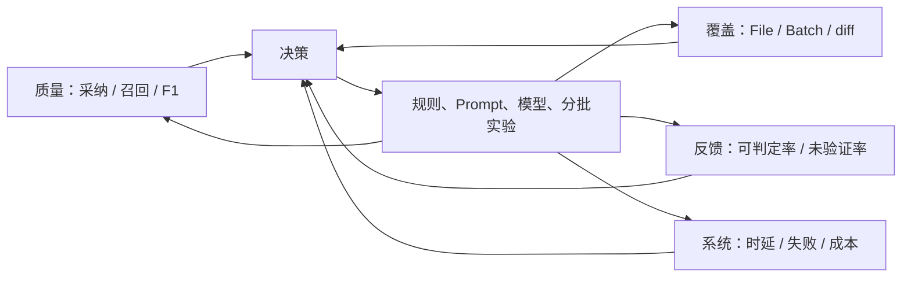

面板的目的不是让所有数字同时上涨。更常见的情况是：增加复核后 Precision 上升，Recall 下降；增加批次后 Recall 上升，时延和成本增加；扩大规则后覆盖上升，无法判断率也上升。指标帮助团队看见权衡。

## 怎样比较两个版本

假设版本 B 的采纳率从 60% 升到 70%。在宣布提升前，至少检查七件事。

第一，统计窗口是否覆盖相近的仓库、语言和改动规模。第二，score 阈值和状态枚举是否相同。第三，`is_valid=null` 占比是否变化。第四，有反馈比例是否相近。第五，是否有同一 Issue 去重。第六，Bug 归属和 `should_recall` 规则是否变化。第七，模型、Prompt、规则、批次、复核是否同时修改。

最可靠的比较是在同一冻结测试集上运行 A/B，并对真实流量做分层观察。冻结集给可复现结果，真实流量验证外部有效性。若只能做前后对比，报告要列出变化因素，避免把相关变化归因给某一个模型版本。

比例还需要样本量。2 条中采纳 2 条是 100%，200 条中采纳 160 条是 80%，前者并不提供更强证据。课程不要求推导置信区间，但工程报告至少展示分子分母，并对小样本标记“观察中”。

## 指标会被优化，也会被钻空子

只追采纳率，系统可能减少评论，只报告最显而易见的问题；只追召回率，系统可能报告大量候选，把判断成本转给开发者；只追 F1，团队可能通过调整真值范围让数字好看。

因此指标必须绑定行为边界。采纳率旁边看覆盖与报告数量；召回率旁边看 Precision 与人工负担；F1 旁边看严重度分层、无法判断和成本。质量门不能以“达到某百分比”自动赋予高风险合并权。

反馈机制也会改变行为。若拒绝评论需要填写很长表单，用户只会对最糟糕的建议反馈；若采纳按钮能一键应用，采纳信号会混入便利性偏差。收集界面是评估系统的一部分。

## 一份可版本化的指标契约

在写指标契约之前，还需要解决三个常见工程问题：分层统计、反馈状态流和实验判读。它们决定一个公式能否变成持续运行的评估系统。

## 不要让总体平均掩盖失败区域

假设总体采纳率是 70%，前端问题 85%，后端问题 40%。只展示总体值会让后端用户觉得看板与体验矛盾。AICR 的表现通常随语言、仓库、问题类型、严重度、diff 规模和批次位置变化，因此必须分层。

有用的分层不是越多越好。每增加一个维度，样本就更稀疏。优先选择能对应工程动作的维度：按 category 可以调整规则与上下文；按 score 可以校准严重度；按 Batch 位置可以观察长任务后段衰减；按仓库和语言可以选择模型、静态分析器与基线；按拒绝类型可以决定复核和记忆策略。

例如，“健壮性问题采纳率低”仍然太宽。继续看拒绝类型，可能发现一半是 `already_handled`，说明审查器没有阅读被调用方法；另一半是 `bad_fix`，说明发现方向正确但修复生成差。前者需要上下文检索，后者需要把问题判断与修复建议分开验收。一个总体比例无法给出这两种动作。

严重度分层还应检查校准。若 5 分评论的采纳率反而长期低于 3 分，可能是评分模型过度自信，也可能是 5 分集中在难判的业务问题。不能只因为 score≥4 被称为“高风险”，就假设它已经经过概率校准。

### 宏平均与微平均

多个仓库聚合时有两种常见方法。微平均把所有 Issue 放在一起计算，大仓库权重更高；宏平均先算每个仓库的比例，再对仓库等权平均，小仓库影响被放大。

仓库 A 有 900 条反馈，采纳 630 条；仓库 B 有 10 条反馈，采纳 1 条。微平均是 `631 / 910 ≈ 69.34%`，宏平均是 `(70% + 10%) / 2 = 40%`。两个结果回答不同问题：前者代表总体 Issue 流量，后者代表“一个典型仓库”的平均表现。

scikit-learn 也提醒，多分类与多标签下不同平均方式不会得到等价结果。[1] AICR 看板必须保存聚合方式。团队级趋势可用微平均，仓库推广评估同时看宏平均和每仓库分布。

### 严重度加权不是随意乘分数

有人会用 `score × issue_count` 构造加权 Recall。这样做隐含“5 分损失是 1 分的五倍”，通常没有证据。更稳妥的做法是分层报告 4 分、5 分 Precision/Recall，或根据事故成本定义经评审的权重，并做敏感性分析。

加权 F1 也不能掩盖某一类完全失效。安全问题样本少，总体加权后可能几乎看不见。高风险类别应设置单独底线和人工审查，而不是期待综合分数自动保护。

## 反馈状态是一条生命周期

Issue 创建时 `is_applied=null`，表示尚无采纳判断。之后可能经过自动检测得到 2、3、50–53 或 60–69，也可能被人工标为 0/1，或由外部流程写入 4/5。状态不是互斥数据源的简单终点，它们可能按时间覆盖。

当前代码允许外部明确反馈覆盖自动、旧外部、无法检测和部分采纳状态，但保留人工 0/1。这体现了证据优先级：明确人工反馈高于文本匹配推断。实现时还要保存状态来源与更新时间，否则只看最终数字无法解释覆盖过程。

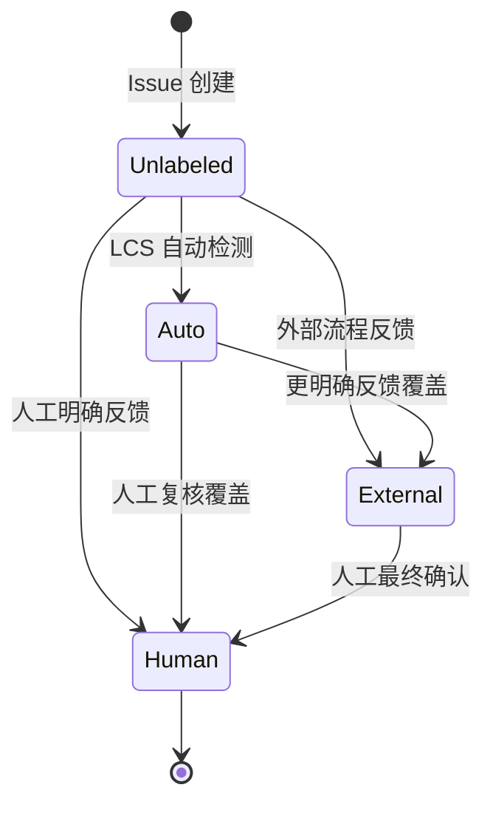

图中 `Auto` 代表 2/3、50–53、60–69 的一组状态，不表示它们语义相同。真正的数据模型最好拆出 `adoption_value`、`adoption_source`、`confidence` 和 `checked_at`，或维护事件表。单个整数能兼容旧系统，却让查询者必须记住编码区间。

反馈状态流还会产生删失问题。统计窗口结束时，近期 Issue 更可能仍是 null，因为开发者还没完成修改或反馈。若按 Session 创建时间直接比较最近一周与上月，最近一周的可反馈样本可能只包含处理最快的问题。可以设置成熟窗口，例如只统计创建后满七天的 Issue，或按反馈发生时间另做视图。

## 从 Issue 到可审计查询

指标查询不应只存在一段难读 SQL。可以先写成集合管道，再实现和测试。

```text
source = issues linked to sessions in the time window
high_value = source where score >= 4
not_invalid = high_value where is_valid is 1 or null
explicit = not_invalid where status in [0, 1, 4, 5]
adopted = explicit where status in [1, 4]

adoption_rate = count(adopted) / count(explicit)
```

每一行都应输出中间计数。假设 source 1000 条，high_value 400，not_invalid 360，explicit 120，adopted 72，最终 60% 的同时还应看到明确反馈覆盖只有 `120 / 360 = 33.3%`。没有这个覆盖率，读者可能把 60% 理解为 360 条问题的整体表现。

查询需要固定去重键。案例 Issue 有由 Session、分支、文件、类别和行号构成的 issue key，但同一根因可能出现在相邻行或被不同规则重复报告。精确哈希解决重复写入，不一定解决语义重复。评估集可以增加 `root_cause_id`，由标注者把同一根因聚合。

还要测试空分母。没有明确反馈时，结果应为 null 或“数据不足”，不能显示 0%。0% 意味着有可判定样本但没有采纳，和没有样本完全不同。代码不同接口有时返回 0、有时返回 null，课程建议统一面板语义并明确迁移。

## 为优化建立最小实验

第 4–7 章会修改规则、上下文、复核、批次和质量门。每次改造都应从一个可证伪假设开始。

假设：“`already_handled` 拒绝较多，因为模型没有读取被调用方法。”处理组给 Agent 符号定义和一层调用上下文，对照组保持原输入；其他模型、Prompt、分批和时间窗口尽量不变。主要指标看该拒绝类型的 Precision 代理，护栏指标看 Recall、时延和令牌成本。

另一个假设：“大任务后段漏报增加，因为 Batch 过大且完成证明不足。”可以在固定 Benchmark 上比较两种批次范围，记录每个 Batch 位置的 Recall、重复问题、时延和失败。若只看整任务平均，后段改善可能被前段高分掩盖。

实验单位必须防止污染。对同一 MR 同时运行两版而把两版评论都展示给开发者，反馈会互相影响。可以离线双跑，或按仓库/用户分流；任何在线实验都需要说明风险与人工兜底。

结果也要区分统计显著与工程意义。即使样本足够让 1 个百分点差异稳定，如果它换来两倍成本，未必值得上线；样本较小但发现高危漏报，则可能先采取保守防护再继续收集。指标辅助决策，不替代风险责任。

## 评估数据本身也需要质量门

模型输出有质量门，标签同样需要。至少检查必填证据、问题是否落在评估范围、重复根因、状态来源、标注者和仲裁结果。Bug 数据还要检查任务关联、`should_recall` 理由和 owner_role 置信度。

当标注规则变化时，不要直接覆盖旧标签。保存 `label_version`，对固定 Benchmark 做迁移报告：多少样本改变，旧版与新版指标差多少。否则一次标签清洗会在趋势图上伪装成模型提升。

Bad Case 回流也不能“见一个加一个”后立即评测。若某条漏报同时变成 Prompt 规则和测试样本，系统记住答案后通过不代表泛化。可以把同类问题的一部分用于规则开发，另一部分保留为盲测，并定期加入时间上更新的样本。

最后，评估集要有删除机制。过时 API、废弃框架和已取消的团队规则会让系统被迫优化无效目标。删除需要记录原因和版本，不是为了抬高分数悄悄移除失败样本。

建议为每个正式指标保存一份契约，而不是只在看板 SQL 中维护。

契约应包含名称和版本、统计单位、时间字段、过滤条件、分子状态、分母状态、去重键、无法判断处理、真值来源、角色范围、聚合方式和已知偏差。修改任一项就发布新版本，并保留旧版本一段时间做双算。

以当前采纳率为例，可以命名为 `adoption_high_risk_explicit_feedback_v2`：Issue 级；按 Session 创建时间；score≥4；状态 0/1/4/5；分子 1/4；排除 `is_valid=0`，保留 `null`；按 issue key 去重。名字虽然长，却比“采纳率”更不容易被误用。

综合召回率可以命名为 `recall_proxy_ai_manual_bug_fe_be_v2`，明确它是 proxy，不是完整 Benchmark Recall。报告中同时给 `cr_recall_proxy`，让读者知道含 Bug 与不含 Bug 的区别。

## 复算任务

拿前面的 12 条 Issue，先不看结论，按当前代码口径依次过滤：低分、无正式反馈、自动状态、部分状态、无法判断、明确无效。留下的五条中三条采纳，得到 60%。

然后改变一个条件：把 `is_valid=null` 暂时排除。L 被移出，分子变 2、分母变 4，采纳率变 50%。系统没有新增或删除任何评论，只是验证完成度的处理改变了结果。

再看召回样本。6 条 AI 已采纳、3 条人工已采纳、3 个应召回研发 Bug，综合 Recall 50%，纯 CR Recall 66.67%。如果其中一个 Bug 与人工评论是同一根因，去重后综合分母变 11，Recall 约 54.55%。去重规则同样会改变趋势。

最后尝试回答：`34 / (34 + 44)` 为什么不能作为三份工作簿的总体采纳率？因为已采纳集和拒绝集由结果状态定向选择，不是同一自然窗口的全量样本。能够指出选择机制，比算出 43.59% 更重要。

## 本章收束

评估 AICR 的顺序应该是：先定义对象和真值，再映射状态，最后计算公式。Precision 衡量已报告问题的可靠程度，Recall 衡量已知应报告问题的覆盖，F1 平衡两者。采纳率可以作为 Precision 代理，人工评论与应召回 Bug 可以构造 Recall 代理，但都要写清边界。

当前案例的正式采纳率只纳入 0/1/4/5，自动 2/3、无法判断 50–53、部分采纳 60–69 和 null 不进正式状态分母；score 必须至少为 4；`is_valid=0` 被排除，`null` 当前仍纳入。召回率又分含 Bug 和不含 Bug，Bug 只统计 `should_recall` 且归属 FE/BE。

第 4、5 章讨论采纳率时，不会用“减少问题数”冒充改进，而会追踪误报、低价值、不可执行和上下文不足。第 6、7 章讨论召回率时，也不会只让模型多写，而会检查 File/Batch 覆盖、外部完成证明和漏报回流。指标先于优化，才能让每个工程动作有可判读结果。

## 参考文献

1. scikit-learn. [Model evaluation: precision, recall and F-measures](https://scikit-learn.org/stable/modules/model_evaluation.html#precision-recall-and-f-measures).
2. Hong Yi Lin 等. [CodeReviewQA: The Code Review Comprehension Assessment for Large Language Models](https://arxiv.org/abs/2503.16167). Findings of ACL, 2025.
3. Tao Sun 等. [BitsAI-CR: Automated Code Review via LLM in Practice](https://arxiv.org/abs/2501.15134). 2025.
4. Zhiyu Li 等. [Automating Code Review Activities by Large-Scale Pre-training](https://arxiv.org/abs/2203.09095). ESEC/FSE, 2022.


---

# 第 4 章　采纳率低：问题为什么看起来对，却没人采用

> 预计学习时间：85–105 分钟
> 一句话总结：低采纳率通常不是一个模型问题，而是一组可以沿规则、上下文、建议和反馈证据逐层定位的系统问题。

## 先看四条“没有明显错误”的建议

同一批代码审查里出现了四条候选问题。为了公开教学，代码与业务名已经改写，但拒绝理由保留了原始结构。

第一条说：“请求头可能为空，直接访问字段会触发 panic，建议提前返回。”开发者拒绝，因为空请求头在这条业务链里并不表示非法输入，转换函数仍需产出一个可继续处理的对象。AI 发现了语言层面的空指针风险，却把业务允许的空状态当成了异常状态。

第二条说：“某个对象可能为空，应在调用前补一次检查。”开发者指出，被调用方法内部已经处理了空值。建议如果被执行，不会改善正确性，只会让同一条件在两层代码里重复出现。

第三条说：“表单校验仍使用 callback，应该改成 Promise。”这符合常见开源组件的新版本写法，但当前项目使用的组件封装仍推荐 callback。AI 把公共生态的默认知识覆盖到了本仓库的真实契约上。

第四条正确指出一个异步调用没有 `await`，但给出的修复是直接加 `await`。开发者实际需要的是不阻塞主流程，并在被调用方法内部捕获错误。问题方向有价值，修复方案却改变了时序语义。

这四条评论都能写得很像专业 Code Review。词句流畅，风险描述也有因果关系。它们仍然不值得直接采纳。真正缺少的不是“再解释得详细一点”，而是能证明建议适用于当前改动的仓库证据。

上一章把采纳率定义成 Precision 的工程代理。本章开始处理一个更棘手的事实：未采纳不是单一标签。它可能表示误报、已有处理、业务不同意、修复不可用、问题价值太低，也可能只是反馈来得太早。先把这些原因拆开，后面的优化才不会变成盲目改 Prompt。

## 44 条拒绝样本告诉了我们什么

课程案例包含一组定向收集的 44 条拒绝建议。其中 43 条被归为健壮性问题，1 条被归为安全问题。这个分布不能代表真实生产总体，因为样本就是为了收集 Bad Case 和未采纳案例而建立的。它适合回答“常见拒绝机制有哪些”，不适合回答“某类问题在生产中占多少”。

逐条阅读拒绝证据后，可以把样本归入下面七类。一个样本可能同时命中两类，分类目的是选择验证动作，不是制造互斥统计。

| 诊断类型 | 候选建议的典型说法 | 开发者提供的反证 | 首先检查什么 |
| --- | --- | --- | --- |
| 场景不存在 | “如果字段为空会失败” | 类型、入口或数据生成逻辑保证该状态不会出现 | 类型定义、构造路径、系统边界 |
| 已有处理 | “这里缺少校验或提示” | 上游、下游或公共方法已处理 | 调用链与被调用方法 |
| 业务语义误判 | “应该按角色返回不同值” | 业务明确要求取更晚时间或允许空状态继续 | 需求、测试、领域命名 |
| 框架契约误判 | “旧 API 必须迁移到新写法” | 项目封装、组件版本或注解定义了不同契约 | 依赖版本、封装源码、项目规则 |
| 修复不可用 | “增加 await、默认值或互斥锁” | 改变时序、破坏配置语义，或保护了并不共享的数据 | 建议代码的行为差异 |
| 重复或过时 | “再次报告相同风险” | 历史会话已报告，或当前版本已用其他方式修复 | 历史 Issue 与当前文件 |
| 价值不足 | “补充额外防御、注释或抽象” | 风险很低，修复成本和噪音高于收益 | 严重度、触发概率、影响范围 |

这一组样本有一个很稳定的特征：许多评论不是语言知识错了，而是适用条件错了。`nil` 会导致解引用失败是语言事实；“这个对象在此路径可能为 nil”是仓库事实；“遇到 nil 应直接返回”又是业务决策。AI 经常把第一层事实直接跳到第三层结论。

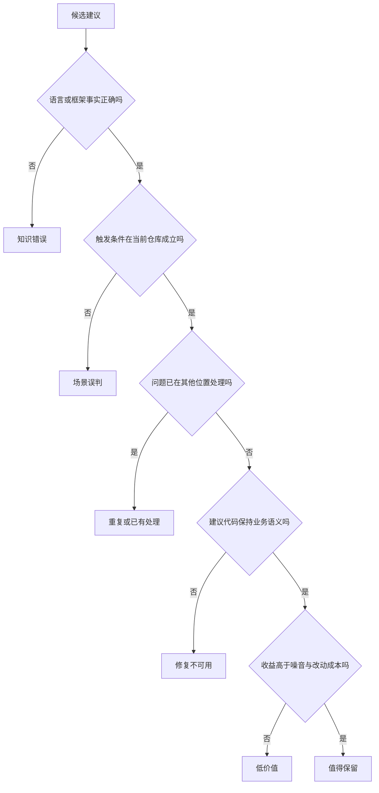

这棵树比“采纳/未采纳”多走了几步，却给出了可行动的结果。知识错误需要修规则或模型；场景误判需要上下文；已有处理需要调用链和历史过滤；修复不可用要把问题判断与建议代码分开验收；低价值则要校准严重度和报告门槛。

## 采纳率低不是一个根因

### 规则缺失：系统不知道团队认为什么重要

不同仓库对同一写法可能有相反判断。某个前端项目要求所有用户可见文案进入国际化函数；另一个项目的管理端脚本可能允许硬编码。某个后端团队禁止手写 SQL；另一个模块可能因为兼容旧查询层而暂时允许。若审查器只收到通用规则，它只能用训练数据里的常见偏好填空。

规则缺失会产生两种噪音。第一种是把团队允许的写法判错，例如强制把 callback 改成 Promise。第二种是把真正重要的项目约束降成普通建议，例如仓库明确禁止动态拼接国际化文案，模型却只给 2 分风格评论。

诊断规则缺失不能只问“有没有规则文件”。还要看三个证据：当前问题是否命中明确规则 ID；规则是否描述了适用条件；规则与正反例是否进入了这一批 Prompt。一个文件存在磁盘上，但加载失败、解析为空或没有被注入，运行效果仍等于没有规则。

课程案例的 `promptBuilder.ts` 会组合基础角色规则、规则库中的系统条目和仓库级 Cursor Rules。这个实现说明规则不是一段大 Prompt，而是多个来源在运行时装配。第 5 章会继续拆这三层怎样分工。

### 上下文不足：模型看见了 Diff，却没看见事实

Diff 能回答“这几行改了什么”，很难独立回答下面的问题：

- 这个字段由谁构造，是否真的可能为空？
- 被调用方法是否已经处理错误或设置了默认值？
- 当前组件是公共版本，还是团队二次封装？
- 这个配置允许为 0，是异常还是有意关闭？
- 同一需求的上一轮修改是否已经解决该问题？

Bad Case 中的“已有可选链”“方法内部已有空处理”“配置会在启动时校验”“只有当前协程更新该字段”，都需要 Diff 之外的证据。只把更多相邻行塞给模型并不够。需要的是与待验证假设有关的上下文：符号定义、一层调用方和被调用方、类型注解、项目规则、依赖版本、测试与需求约束。

可以把上下文不足分成检索失败和判断失败。检索失败是没有拿到正确文件；判断失败是拿到了文件，却没有把其中的保证用于结论。两者的修复完全不同。前者要改文件关联或工具调用，后者要让 Recheck 明确验证假设，并保存使用了什么证据。

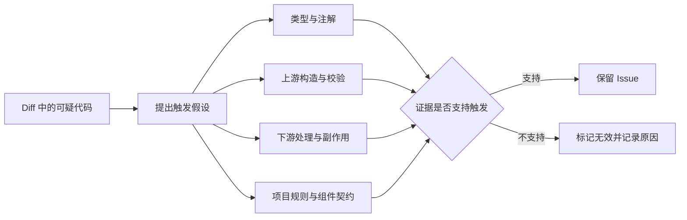

图里最重要的是“提出触发假设”。如果只让 Agent 漫无目的地搜索仓库，它会收集很多相关文本，却未必能推翻自己的第一判断。好的验证问题应该可以被证伪，例如：“`accountInfo` 是否存在任何返回成功但字段为空的构造路径？”而不是“请检查更多上下文”。

### 问题判断和修复建议绑得太紧

一条评论可能发现方向正确，建议代码却不适用。异步调用缺少错误处理是问题；是否加 `await` 取决于调用方是否应等待。配置缺少检查可能值得关注；是否提供默认值取决于配置错误时系统应该失败还是继续。共享对象的写入值得检查；是否加锁取决于是否真有多个并发写者。

如果评估只问“是否照着 improve_code 修改”，这类评论会被当成完全错误。更合理的内部判断至少拆成四项：

| 维度 | 判断问题 | 可能结果 |
| --- | --- | --- |
| 定位 | 文件和代码位置对吗 | 正确、偏移、与本次变更无关 |
| 风险 | 描述的失败机制成立吗 | 成立、不成立、证据不足 |
| 严重度 | 触发概率和影响是否配得上分数 | 合理、过高、过低 |
| 修复 | 建议保持当前业务与时序语义吗 | 可直接用、需改写、不可用 |

采纳反馈目前往往只有一个状态，因此诊断时要结合拒绝原因和最终代码。若大量样本是“方向对，修复不对”，继续增加规则可能没有帮助；应该让审查器先给出证据和最小修复约束，再生成代码建议，或者把修复建议交给独立步骤复核。

### 范围错位：评论没有属于当前变更

现代仓库常有大量历史问题。AI 读取整个文件后，可能发现一个真实缺陷，但它位于未修改的旧代码里，与当前 MR 没有直接关系。对代码质量而言它“是真的”；对本次审查而言它仍可能是噪音，因为开发者没有上下文、预算或授权在当前需求里处理。

课程案例用 `diff_scope` 保存问题位置与差异范围的关系：

- `changed_line`：定位在新增或修改行。
- `context_line`：位于 Diff 上下文行，需要证明本次改动直接触发它。
- `out_of_diff_scope`：不在当前 Diff hunk 中，Recheck 直接判为无效。
- `unknown`：无法确定范围时，必须用文件、原代码和建议代码证明关联，否则不保留。

范围判断不是“只允许评论绿色行”。跨文件依赖、接口变化和数据结构影响可能落在未修改文件中。区别在于是否有一条可解释的变更因果链。没有因果链的全仓扫描结果应该进入独立治理任务，而不是混进当前 MR 的阻断评论。

### 重复、冲突与已经修复的问题

同一需求可能多次运行审查。第一次建议从 A 改为 B，第二次又因上下文变化建议改回 A；或者两次都报告同一个位置的同一风险。即使每条单独看都有理由，连续展示会让使用者觉得工具没有记忆。

重复有三个层级。文本重复可以用哈希或相似度处理；根因重复需要理解两个描述是否指向同一失败；历史重复还要判断旧问题是否已被当前代码用另一种方式修复。简单把历史 Issue 全部拼进 Prompt，既浪费上下文，也可能让模型机械地重复旧结论。

当前案例的最终 `filter` 会在远端模式最后一批比较当前与同一需求的历史有效问题，支持 `duplicate_of_history`、`conflict_with_history`、`overlap_with_history`、`history_resolved` 和 `history_changed`。这是一层收尾过滤，不等于所有本地审查都自动拥有相同能力。

### 严重度和价值没有校准

如果每个“理论上可能”都标 4 分，开发者很快会忽略整个报告。风险分数至少需要回答触发可能性、影响范围、现有防护与恢复成本。一个只在不可能输入下触发的 panic，不应仅凭“panic 很严重”得到最高分。

课程案例中的已采纳样本也提供了对照。后端样本里，错误变量引用、`nil && len(x)` 的逻辑错误、分页字段误赋、循环层级错误等问题具有直接证据，修复范围也清楚。前端样本里，国际化规则、拼写错误、行键不稳定等建议同样可以由项目规则或可观察行为支撑。它们和拒绝样本的差异不是措辞更强，而是证据链更短、更可复核。

严重度校准可以从“同类已采纳与已拒绝对照”开始。不要先设一个普适阈值。对每个仓库分别观察：4–5 分问题中哪些有明确触发路径，哪些总被判为防御性建议；修正规则与评分后，再看分层采纳率和召回护栏。

## 从数据对象里找证据

诊断不能停在阅读评论。一次低采纳调查至少需要把 Issue、Session、代码版本和反馈连起来。课程案例的关键字段可以抽象成下面的证据链。

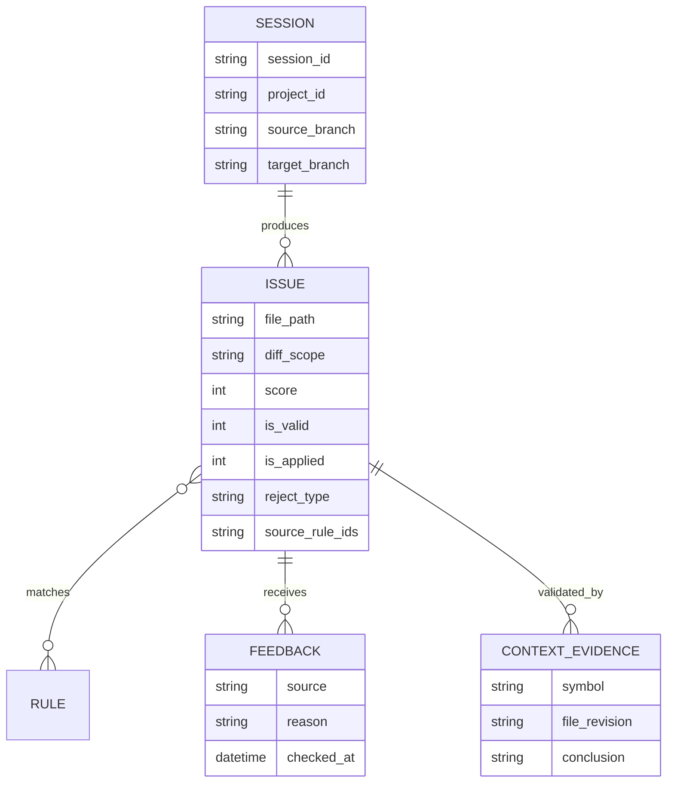

当前实现已经保存了 Issue 的规则命中、有效性、无效原因、采纳状态和拒绝类型等字段，但“本次 Recheck 具体读取了哪些符号与版本”仍主要存在 Agent 过程里。若团队经常争论上下文是否充分，可以增加结构化证据引用，例如 `evidence_files`、`evidence_symbols`、`assumption` 与 `verification_result`。这会增加存储和 Prompt 约束，收益是 Bad Case 可以复盘，而不是只剩一句“模型判断错误”。

`reject_type` 也不能完全依赖关键词。当前自动归因会把“误报、不是问题”映射为 `false_positive`，把“建议不可用、修复不对”映射为 `bad_fix`，把“不重要、忽略”映射为 `low_value`，还识别风格分歧与已经处理。它适合做粗分桶，不适合替代人工抽样。拒绝理由很短时，`unknown` 往往比武断分类更诚实。

## 五个根因工作台：怎样从评论走到证据

根因树只有在能指导取证时才有价值。下面选取五类高频拒绝，完整走一遍“现象、假设、证据、判断和改造归属”。案例均经过等价改写。

### 工作台一：理论上的空值，真实链路里的合法空状态

候选评论认为 `header` 可能为空，建议直接返回 `nil`。开发者的反证是：“空 header 也要继续。”这句话至少包含两种解释。第一种是 header 的字段有默认零值，转换函数应该继续生成参数；第二种是当前调用者会在更高层补齐 header，提前返回反而破坏流程。仅凭拒绝文本无法选择。

先画出对象生命周期：外部请求怎样反序列化；转换函数是否处于系统边界；空 header 由协议允许、兼容历史请求，还是只在测试替身里出现；转换结果的字段是否允许零值；下游在哪一步完成最终校验。然后构造两个最小测试：header 为空时当前实现输出什么；加入提前返回后调用方行为怎样变化。

若空 header 是协议允许状态，问题属于业务语义误判，修复建议有害。规则层应写清“此转换器允许缺少 header，并以零值继续”。若空 header 本应被入口拒绝，只是当前测试没有覆盖，那么开发者拒绝并不能推翻风险，问题应保留但修复位置可能从转换函数移到入口。

这个案例提醒我们，反馈不是天然真值。开发者最了解局部业务，也可能只描述了当前习惯。诊断需要把反馈转换成可验证假设。

### 工作台二：忽略解析错误，还是有意使用零值兜底

候选评论看到 `strconv.ParseInt` 的错误被忽略，建议显式检查 `err`。拒绝理由是：“ID 一定是整数，并且后续 `> 0` 已经安全兜底。”

这里有三层证据。类型层：ID 在上游是字符串还是数字，为什么需要解析。数据层：该字符串是否只来自数据库整数列，还是也来自用户输入、消息和旧数据。行为层：解析失败变成 0 后，`> 0` 分支跳过是否就是期望结果，还是会静默丢数据。

如果字符串完全由受控整数列生成，且 0 与“无有效 ID”语义一致，显式处理错误可能只增加日志噪音。若数据穿过外部边界，静默跳过会隐藏污染，建议方向成立。还有第三种情况：风险成立，但正确修复是在反序列化入口保证类型，而不是在每个使用点检查。

因此标注不能只写 `false_positive`。可以记录 `valid_risk_wrong_location`，让规则学习“报告系统边界缺失校验”，不要在所有消费点重复报告。

### 工作台三：公共框架知识和项目封装冲突

候选评论看到表单 validator 的 callback 风格，认为旧 API 会导致校验失败，建议返回 Promise。拒绝理由是“组件库推荐用法”。

验证顺序应从仓库向外，而不是先搜索公共文档。先确定导入路径，找到项目封装的类型声明和版本；再查看同仓库中由维护者编写的例子；必要时运行最小表单测试，观察 callback 是否被调用、错误是否显示。只有项目代码无法解释时，才用上游文档补充。

若项目封装确实支持 callback，这条评论属于框架契约误判。解决方案不是把“callback 永远允许”写进通用规则，而是在仓库规则中声明具体组件与版本。组件升级后，规则必须同步失效或迁移。没有版本字段的规则会把今天的正确经验变成明天的误报来源。

这种案例还暴露了检索优先级。Agent 如果先访问公共知识，容易形成锚定；后续即使读到项目封装，也可能把它当作落后实现。Recheck 应明确规定“实际依赖和仓库封装优先于无版本的通用最佳实践”。

### 工作台四：已经处理，但处理位置与形式不同

候选评论说“照片上传失败时没有提示”，开发者回答“调用方法已有统一错误提示”。要验证的不只是有没有 Toast 字符串，还要看失败是否沿调用链传播。

需要检查上传方法失败时返回什么；循环是否吞掉错误；调用者如何区分部分成功和全部失败；统一提示是否覆盖当前路径；重复提示会不会造成两个弹窗。若底层抛错且上层统一 catch，当前建议会重复处理。若底层只返回空结果而不上抛，开发者以为已有提示，实际路径可能仍静默失败。

“已有处理”根因最适合保存证据引用：callee 的错误分支、caller 的 catch、统一提示组件和对应测试。没有这些引用，下一轮模型无法区分真正已有处理和开发者口头声称。

还要注意修复层级。即使当前路径缺少提示，把 Toast 加在数据访问层也可能违反架构边界。AI 评论应该指出缺失的用户可见反馈，而不是强制某一层直接调用 UI API。

### 工作台五：并发风险存在于变量，还是存在于执行模型

候选评论发现共享 Map 的字段在 goroutine 中被写入，建议加互斥锁。开发者说：“只有这个协程更新该字段。”

看到共享对象不等于存在数据竞争。需要找出 goroutine 的创建位置、对象是否被多个任务复用、其他路径是否读写同一字段，以及当前容器是否线程安全。单一 goroutine 内部顺序写入普通 Map 不需要锁；多个 goroutine 写不同 key 仍可能不安全；单写多读也要看读写是否并发。

最小验证可以运行竞态检测或构造并发测试，但工具结果必须和覆盖路径一起解释。测试没有报 race 可能是分支未命中，不代表不存在；代码证明只有单写者时，加锁反而增加复杂度并可能引入锁顺序问题。

若此类误报反复出现，规则不应写成“不要报告 Map 并发问题”。应写成条件化判断：先定位并发创建点和所有写者；无法证明至少两个并发访问时，不给高分确定性结论，可以提示需要人工确认。

## 采纳失败和反馈失败要分开

有些低采纳不是建议质量问题，而是反馈系统没有正确观察到采用。开发者可能手工实现了语义等价修复，没有点击采纳；外部生码平台可能覆盖代码却未回传状态；建议只改了配置或测试，自动检测读取了错误分支；合并后文件重命名导致路径匹配失败。

可以把调查分成两个连续问题：

1. 建议在当时是否值得采用？
2. 现有反馈机制是否正确记录了采用结果？

第一个问题需要代码与业务评审，第二个问题需要状态来源、时间戳和最终版本。若两者混在一起，团队可能为了修检测器而改规则，也可能把检测漏报误认为开发者不信任系统。

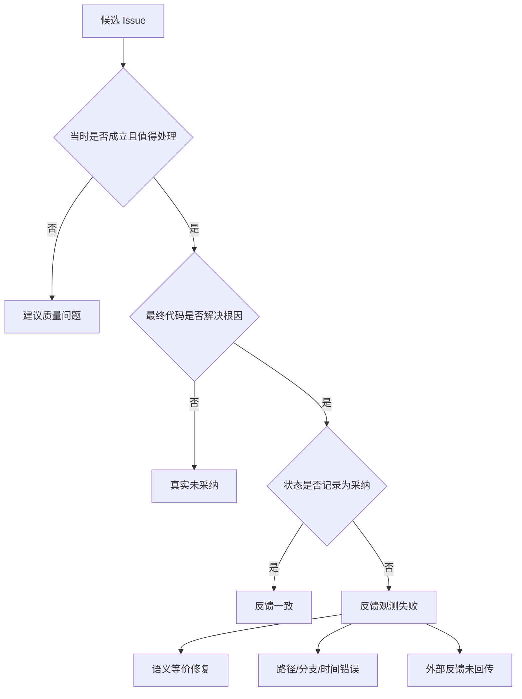

调查反馈失败时，要保存 Issue 创建 commit、检测所用 branch、最终 merge commit、文件重命名映射和状态更新时间。尤其不要用当前主干去判断几周前的建议，文件可能已经经历其他修改。

### 无反馈不是未采纳

`is_applied=null` 表示没有明确判断。它可能是开发者尚未处理、没有看到评论、审查任务中断，或反馈入口不可用。把 null 直接算未采纳，会惩罚反馈覆盖差的仓库；直接排除又可能只留下愿意互动的用户。

诊断报告应并列显示明确反馈率、反馈延迟和未反馈样本抽查。若优化后采纳率升高而反馈覆盖率下降，不能直接宣布系统变好。可能只是更少的人愿意点击。

### 自动未采纳也不是拒绝理由

行级检测发现建议代码没有出现在最终文件，只能说明文本没有按当前算法匹配。它不知道开发者为何没有采用，也不知道是否做了语义等价修复。自动状态适合触发补充核验，不应直接生成“开发者认为建议错误”的负向规则。

## 标签争议：谁有权决定一条评论是否正确

代码审查包含技术事实、业务语义和团队选择。单一评审者很难覆盖全部。可以按争议类型指定仲裁：

| 争议 | 首要评审者 | 必需证据 | 不能单独决定的人 |
| --- | --- | --- | --- |
| 语言/并发/类型事实 | 对应技术栈维护者 | 可运行测试、类型或规范 | 只凭业务习惯的使用者 |
| 业务允许状态 | 模块 Owner/TL | 需求、接口契约、测试 | 只看公共最佳实践的模型 |
| 组件封装行为 | 组件维护者 | 版本、源码、推荐用法 | 未确认版本的外部资料 |
| 严重度 | 模块 Owner + 质量角色 | 触发概率、影响与恢复 | 只依据错误名称的评审者 |
| 修复可用性 | 代码作者 + 维护者 | 行为差异、回归测试 | 只检查语法可编译的人 |

仲裁不需要每条 Issue 都开会。可以先抽样建立规则，再把明确案例自动化。对高风险、意见冲突或证据不足的样本保留 `uncertain`，不要为了报表完整强制二选一。

一致性也要测。让两位评审者独立标注同一批样本，观察分歧集中在哪些类别。若“业务语义误判”长期分歧大，说明标签说明不足或需要模块 Owner 参与；若“范围错位”分歧大，可能是 Diff 归因规则不清。

## 观察当前实现时，应该问哪些问题

阅读 `qms-server` 的采纳率链路，不必把几千行代码逐行抄进课程。沿控制点提出问题更有效。

在 `promptBuilder.ts` 检查：规则来自哪里；项目规则解压失败是否可见；规则与示例是否有 ID；Issue 是否回写命中规则。在 `extensionChecker.ts` 检查：Recheck 何时执行；`diff_scope` 怎样影响结论；无效原因是否保留；检查器是否可能被配置关闭。

在 `filterChecker.ts` 检查：历史任务怎样关联；本地与远端是否行为一致；重复、冲突和已修复分别怎样落状态。在 `memoryDistiller.ts` 与 `memoryChecker.ts` 检查：拒绝信号怎样去重；项目级与用户级怎样隔离；规则是否需要确认、是否过期、命中后如何审计。

最后在 `adoptionChecker.ts` 检查：检测读取哪个分支和文件；注释、空白、重命名和短代码怎样处理；部分采纳是否进入正式指标；拒绝类型是事实字段还是关键词推断。

这些问题能把“采纳率低”映射到具体代码对象。若调查只停在模型输出文本，后续团队很难判断应该改 Prompt、检索、状态机、数据模型还是反馈入口。

## 建立一张可复盘的根因仲裁卡

调查结束后，不要只在会议纪要里写“AI 误报”。可以为每个抽样 Issue 保存一张仲裁卡，让同类问题能够比较。

```text
issue_id: teaching-042
review_revision: commit-a
feedback_revision: commit-b
candidate: 建议为内部对象字段增加空值检查

scope_decision: caused_by_change
trigger_hypothesis: 成功构造对象的字段可能为空
evidence_for:
  - 字段类型允许空值
evidence_against:
  - 只有一个成功构造入口
  - 构造入口在返回前填充该字段
  - 测试覆盖空输入并在边界拒绝

issue_validity: invalid
fix_quality: harmful
root_cause: missing_repository_context
recommended_control: recheck_callee_and_constructor
reviewer_roles: module_owner, backend_reviewer
label_version: adoption-diagnosis-v1
```

这张卡把结论和证据分开。以后构造入口改变时，可以重新判断旧标签；Recheck 改造后，也可以检查它是否读取了相同证据。若只保存“误报”，规则提炼只能模仿一句结论，无法知道何时不适用。

仲裁卡还应记录反事实：什么变化会让当前结论翻转。上例中，只要发现另一个能绕过成功构造函数的反序列化入口，空值风险就需要重新评估。可翻转条件让规则保持开放，而不是把一次拒绝变成永久事实。

### 用证据强度决定自动化程度

不同证据的确定性不同。编译错误、类型不匹配、确定的数据流通常能自动验证；业务允许状态、用户体验和未来扩展需要人参与；“可能发生”但检索失败的情况只能标不确定。

| 证据等级 | 示例 | 适合的动作 |
| --- | --- | --- |
| 确定证据 | 编译失败、明确类型约束、可复现竞态 | 自动保留或过滤，并保存工具结果 |
| 强仓库证据 | 单一构造路径、项目规则、稳定测试 | Recheck 决定，定期抽样 |
| 业务证据 | 需求允许空值、模块 Owner 解释 | 人工确认后形成项目规则 |
| 弱推断 | 常见最佳实践、相似代码、模型常识 | 只能提出假设，不应给高分结论 |
| 证据缺失 | 文件无权限、符号检索失败 | 标记不确定，不能当作不存在 |

这张表也约束负向反馈。弱推断被拒绝可以帮助建立检索计划，不能直接生成绝对过滤规则。只有稳定、可复核、范围清楚的证据才适合自动化。

### 把修复位置也纳入仲裁

不少建议的问题方向成立，修复位置不对。例如入口缺少校验，却在每个消费点增加防御；统一错误处理缺失，却在底层库直接弹 Toast；异步任务需要观测，却在调用方强行 `await`。仲裁卡应记录 `recommended_layer`：boundary、domain、service、caller、callee、UI 或 infrastructure。

这样做能区分两种改造。若 `issue_validity=valid` 但 `fix_quality=harmful` 集中出现，优先改修复生成和架构约束；若 `issue_validity=invalid`，才去改规则、上下文与 Recheck。把两类都算成“未采纳”会浪费工程投入。

## 一套可复用的低采纳诊断流程

### 第一步：固定指标版本与样本窗口

先记录采纳率口径、反馈成熟窗口、仓库、语言、模型版本、规则版本和审查入口。不要把自动状态、人工状态和外部反馈随意混在一起。第 3 章已经说明，当前正式口径只纳入明确状态 0/1/4/5，并过滤低分和明确无效问题。

还要记录反馈覆盖率。假设 1,000 条高分候选中只有 120 条得到明确反馈，60% 采纳率只能描述这 120 条。若反馈者只在非常满意或非常不满时点击，样本仍然偏斜。

### 第二步：抽取“成对证据”

每个样本至少包含候选问题、当时 Diff、相关仓库上下文、开发者反馈和最终代码。缺少最终代码时，不能断言建议未实施；缺少当时版本时，也不能用今天的文件反推当时上下文。

抽样要同时包含已采纳与未采纳。只看 Bad Case 会把系统描绘得过度悲观，也无法找出同类问题何时值得报告。课程案例的三份定向数据正好说明这个边界：34 条已采纳与 44 条拒绝可以做对照教学，却不能拼成总体比例。

### 第三步：先判问题，再判修复

对每条建议依次回答：位置属于本次变更吗；触发条件能否由当前代码证明；是否已有处理；严重度是否合理；建议代码是否保持业务语义。评审者意见不一致时，记录分歧点并仲裁，不要强行压成一个模糊标签。

可以使用如下最小标注结构：

```text
issue_validity: valid | invalid | uncertain
scope: changed | caused_by_change | historical | unknown
root_cause: rule | context | duplicate | scoring | none
fix_quality: usable | needs_revision | harmful | absent
evidence: [type_or_annotation, caller, callee, test, requirement]
```

这段结构是教学建议，不是当前数据库字段。它的价值在于把“没采纳”拆成可修的原因。

### 第四步：按可控制层聚合

聚合维度应直接对应工程动作：

- `false_positive + scene_impossible`：检查类型、边界和 Recheck。
- `already_handled`：补调用链与重复检测。
- `bad_fix`：分离风险判断和修复生成。
- `style_disagree`：把团队偏好写入仓库规则，或降低严重度。
- `low_value`：调整报告门槛与分层展示。
- `duplicate/history`：改历史 Issue 过滤和问题身份键。

如果团队只能看到“健壮性问题采纳率 32%”，仍然不知道下一步做什么。根因桶应该稳定到足以观察趋势，又不能细到每个样本一个标签。

### 第五步：只改变一个控制点

规则、上下文、Recheck 和记忆同时上线，指标变化后无法归因。先选择最大的根因桶做最小实验。例如：

> 假设：`already_handled` 占比高，是因为首轮审查没有读取被调用方法。处理组在 Recheck 中强制读取 callee 与一层 caller；对照组保持不变。主要指标看该根因桶的明确反馈采纳率，护栏看高分 Recall、时延、工具调用次数和无法判断率。

若处理组减少了误报，却让审查时间翻倍，需要评估是否只对高分候选或特定子类触发。工程优化不是把所有证据都塞进每一次请求，而是让证据成本随风险变化。

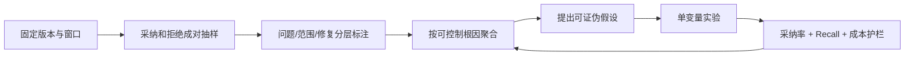

## 诊断练习：不要急着给解决方案

下面五条拒绝理由来自脱敏后的教学样本。先写出最可能的根因，再指定一项能推翻你判断的证据。

1. “这个字段不会为空，类型构造时已保证。”不要直接归为“模型不懂业务”。先查看构造函数是否覆盖全部入口，以及反序列化或测试替身能否绕过保证。
2. “方法内部已经做了空处理。”检查被调用方法的具体版本和返回语义。若内部只记录日志但仍解引用，开发者反证可能不完整。
3. “组件库就推荐 callback。”检查实际依赖版本、封装文档和仓库中的同类代码。公共文档不能代替项目契约。
4. “不需要 await，内部会捕获错误。”检查调用者是否依赖完成顺序、内部是否真的覆盖全部拒绝路径，以及未等待 Promise 是否会产生未处理拒绝。
5. “只有这个协程写该字段。”寻找所有闭包捕获、共享引用和异步入口。若确实只有单写者，加锁建议应判无效；若读取方与写入方并发，还要判断数据结构是否允许。

练习的完成标准不是猜中开发者答案，而是给出可判读的证据。证据显示假设不成立时，应允许改变结论。

完成练习后，再检查自己的取证顺序。若第一步总是搜索公共最佳实践，说明还没有把仓库事实放在优先位置；若只接受开发者一句“不会发生”，说明没有验证业务反证；若发现风险成立就默认建议代码正确，又把问题判断和修复质量合并了。成熟的诊断允许三种结论并存：问题成立且建议可用，问题成立但建议需重写，问题在当前范围不成立。

把五条练习的证据放进根因仲裁卡，然后尝试聚合。只有至少两条样本共享相同触发条件、排除条件和改造动作时，才考虑形成规则。表面都在讨论空值，不代表它们应进入同一条规则。

## 本章收束

低采纳率不是“评论写得不像人”这么简单。课程案例的拒绝样本反复出现同一条因果链：模型掌握通用风险，缺少当前仓库的适用条件，于是把可能性写成事实，再给出改变业务语义或重复现有防护的修复。

诊断时先固定指标口径，收集候选问题、当时上下文、反馈与最终代码。然后把位置、触发条件、已有处理、严重度和修复质量分开判断。规则缺失、上下文不足、Recheck 失效、历史重复和低价值问题需要不同控制点，不能都靠扩写 Prompt。

第 5 章会把这些根因映射成一条分层改造链：先建立可版本化规则和最小上下文，再用 Recheck 过滤首轮候选，用负向记忆吸收反复拒绝，用历史过滤减少重复，最后用人工反馈与自动检测验证效果。每层都要保留开关、证据和 Recall 护栏。

## 参考文献

本章以课程案例当前代码、脱敏后的 44 条定向拒绝样本和已采纳对照样本为主要事实来源。样本用于诊断机制教学，不代表生产总体分布，也不用于计算总体采纳率。


---

# 第 5 章　提升采纳率：规则、上下文、复核与负向记忆

> 预计学习时间：90–110 分钟
> 一句话总结：提升采纳率要把规则、证据、过滤和反馈做成分层流水线，并用召回率与成本防止系统为了少报而变得沉默。

## 从一条被拒绝的空值建议开始改造

设想首轮审查给出下面的候选问题：

> `accountInfo` 的字段可能为空，调用下游服务前应再次检查，否则可能出现空指针或非法请求。

开发者拒绝：“`accountInfo` 由统一入口构造，成功返回时字段完整。”如果只在 Prompt 末尾追加一句“请结合上下文，减少误报”，下一轮模型仍可能报告同类问题。因为系统没有回答四个具体问题：

1. 当前仓库是否有“信任内部对象，只在系统边界校验”的规则？
2. 审查时是否拿到了 `accountInfo` 的类型、构造函数和入口校验？
3. 首轮候选生成后，是否有人验证“可能为空”这个触发假设？
4. 开发者拒绝后，这条经验如何只影响合适的项目和用户，而不误伤别的仓库？

第 4 章已经把低采纳根因拆开。本章把它们映射成一条实际流水线：规则层定义什么值得报；上下文层提供仓库证据；Recheck 过滤首轮误判；负向记忆处理反复出现的拒绝模式；历史过滤消除同一需求里的重复与冲突；采纳检测和明确反馈负责验证改变。

这条链的目标不是让问题数量越来越少。一个什么都不报的系统采纳率无法定义，也没有质量价值。每次降噪都要同时检查 Recall、反馈覆盖、时延和高风险漏报。

## 先建立六层控制面

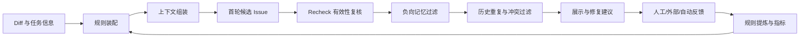

六层不是六个必须串行调用的模型。规则和上下文可以在首轮一次装配；Recheck 与负向记忆可以根据风险、成本和开关选择执行；历史过滤目前只适用于有历史任务身份的远端场景；自动采纳检测在合并后异步运行。架构价值来自职责分开，而不是调用次数多。

| 控制层 | 解决的主要根因 | 输入证据 | 错误使用的风险 |
| --- | --- | --- | --- |
| 规则 | 团队标准缺失、严重度混乱 | 通用规则、项目规则、正反例 | 规则冲突、过拟合、Prompt 膨胀 |
| 上下文 | 场景误判、已有处理 | Diff、符号、调用链、类型、文档 | 检索噪音、成本和隐私扩大 |
| Recheck | 首轮推测、范围错位、错误修复 | 候选 Issue 与仓库证据 | 两个模型共享盲点，误删真问题 |
| 负向记忆 | 同类拒绝反复出现 | 拒绝/无效反馈的稳定模式 | 把个人偏好推广成全局规则 |
| 历史过滤 | 重复、冲突、已修复旧问题 | 同一需求历史 Issue 与当前文件 | 身份关联错误，误关仍存在问题 |
| 反馈检测 | 无法判断优化是否有效 | 人工、外部流程、最终代码 | 标签偏差、语义等价误判 |

接下来按一个问题从进入到回流的顺序改造。

## 第一层：把审查标准变成可版本化规则

### 三类规则各自负责什么

课程案例的 `promptBuilder.ts` 在构建批次审查 Prompt 时，组合了三个来源。

第一类是角色基础规则。`configService.getCodeReviewRulesByRole(project_type)` 按前端或后端角色加载分类、严重度、输出结构和通用检查项。它回答“安全、规范、性能、健壮性等问题怎样描述和评分”。

第二类是规则库中的系统条目。`memoryDistiller.loadSystemPromptRules(project_type)` 按角色前缀加载已结构化的规则和 Good/Bad Case，并把规则 ID 写入 Prompt。它适合维护需要统一发布、可以统计命中的经典坑点。

第三类是仓库级 Cursor Rules。Session 在 Setup 阶段保存规则文件的压缩内容，Prompt 构建时解压并注入。它负责业务仓库自己的约定，例如组件封装、国际化方式、数据边界和禁止写法。

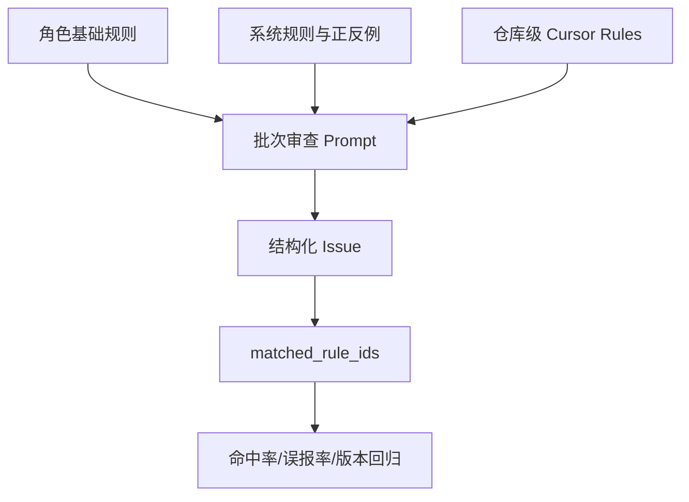

简化后的实现关系如下。代码省略了解压、日志与异常分支，只保留装配职责。

```typescript
// 教学化节选：promptBuilder.ts
const base = await configService.getCodeReviewRulesByRole(projectType);
const system = await memoryDistiller.loadSystemPromptRules(projectType);
const repositoryRules = decodeCursorRules(session.cursor_rules);

const reviewPrompt = compose({
  diff: files,
  baseRules: base.rules,
  examples: system.examples,
  systemRules: system.rules,
  repositoryRules,
});
```

这段代码证明当前实现支持三层装配，不证明每层内容都已经正确。规则仍需要版本、适用范围和回归样本。

### 一条可执行规则应该包含什么

“注意空值”“避免异步问题”“使用最佳实践”都太宽。它们没有触发条件，几乎能解释任何代码。可执行规则至少写清五项：

| 字段 | 问题 | 示例 |
| --- | --- | --- |
| 适用对象 | 检查什么代码 | 系统边界接收的外部请求字段 |
| 触发条件 | 什么证据出现才报告 | 字段无类型保证，且入口未校验 |
| 排除条件 | 什么情况下不要报告 | 内部对象由成功构造函数保证完整 |
| 风险与分数 | 为什么值得打断开发者 | 可触发崩溃且无恢复，4 分 |
| 证据要求 | 评论必须引用什么 | 构造路径或缺失校验的具体位置 |

例如可以把空值规则写成：

> 对来自 HTTP、RPC、消息或持久化反序列化边界的数据，若后续直接解引用且入口、类型与构造函数均未提供非空保证，报告空值风险。对只在内部成功构造路径中流转的对象，不因理论上的 `nil` 可能性重复添加校验；如果无法确认构造路径，先在 Recheck 中读取定义与调用方。

这条规则比“所有指针都检查”更长，但它减少了模型自由补全适用条件的空间。规则仍不能塞入所有项目例外。具体组件、配置和领域约束应留在仓库层。

### 正反例比口号更容易校准边界

规则库可以为同一子类保存 Good Case 和 Bad Case。Good Case 展示“什么情况下应报告”，Bad Case 展示“看起来相似但不要报告”。课程案例的分享材料将这类经典坑点按前后端和问题类别整理；当前代码也允许系统条目以规则 ID 和示例形式注入。

反例尤其适合处理防御性建议：已有可选链、框架保证、内部方法已处理、配置故意以失败启动保护系统、单写者对象不需要额外互斥锁。反例不能只贴代码，要说明排除条件，否则模型只会记住表面字符串。

### 规则冲突必须有优先级

假设基础规则说“外部错误必须捕获”，项目规则说“此 fire-and-forget 调用在内部统一上报，不阻塞调用方”。两者并不真正冲突：基础规则定义目标，项目规则定义当前实现方式。若两个来源都用绝对命令，模型可能随机选择。

建议把优先级写成：法律与安全底线高于组织通用规则；项目规则可以细化通用规则，但必须说明满足同一目标的替代机制；个人偏好只能影响非强制项。每条规则保存版本、生效时间和负责人，出现争议时可以回滚。

## 第二层：围绕假设构建最小上下文包

### 不是“给更多代码”，而是“给能判定的代码”

首轮审查通常从 Diff 开始。为了判断一个空值建议，需要的上下文可能是类型定义、构造函数和一层调用方；为了判断数据竞争，需要的是共享对象的所有写入点和并发边界；为了判断组件 API，需要的是依赖版本与封装实现。三种问题不能使用同一份固定上下文模板。

可以先按候选问题类型生成一个查询计划：

| 候选问题 | 最小上下文 | 不够时再扩展 |
| --- | --- | --- |
| 空值/越界 | 类型、注解、构造路径、直接调用方 | 反序列化入口、测试替身 |
| 异步/错误处理 | 调用方是否等待、被调用方法 catch/finally | 上层时序、重试和告警 |
| 组件/框架契约 | 实际版本、项目封装、同仓库用法 | 迁移计划、公共文档 |
| 业务条件 | 需求字段、测试、领域枚举 | 上下游接口与历史变更 |
| 并发/锁 | goroutine/Promise 创建点、共享读写 | 生命周期、锁顺序与压测 |

`Cursor CodeBase` 或其他代码检索能力只是取证工具。系统还需要记录“为什么检索这个符号”和“结果支持什么结论”。否则 Agent 读取十个文件后仍可能沿用最初推测。

### 上下文包应带版本和来源

代码审查针对某个 commit 或 MR。若 Recheck 读取的是工作区后来修改过的文件，证据会漂移。上下文项应至少携带路径、commit、符号、来源类型和截取范围。项目规则也应记录规则版本，而不是只把一段匿名文本放进 Prompt。

对大型仓库，建议限制自动扩展的层数。先读直接定义和一层调用；证据仍不够时，再按风险分数决定是否继续。低分建议如果需要十次检索才能成立，通常不适合打断当前 MR。

### 上下文质量需要独立观测

可以记录下面几项：候选问题触发了多少次代码读取；读取是否命中目标符号；是否存在文件缺失或权限失败；Recheck 最终引用了哪些证据；不同问题类型的平均上下文成本。若采纳率上升只是因为每条评论读取了几十个文件，系统可能无法规模化。

上下文增强还要设置 Recall 护栏。过于强调“只有证据完整才能报告”，会让模型把证据暂时检索不到误解成问题不存在。正确状态可能是 `uncertain`：不进入高置信评论，保留给人工抽检或异步补证。

## 第三层：用 Recheck 验证候选，不让首轮自己裁决

### Recheck 的输入是候选问题，不是空白 Diff

首轮审查负责发现。Recheck 负责逐条挑战首轮结论。当前案例对每个 Issue 提供文件、行号、`diff_scope`、分类、分数、描述、原代码、建议代码和命中规则，然后要求 Agent 读取更多上下文。

Recheck 的判断顺序很具体：

1. 问题描述、原代码和建议代码是否真的对应当前文件。
2. 问题落在变更行、上下文行还是 Diff 范围外。
3. 触发条件能否在当前仓库中成立。
4. 是否已有保护、组件保证或业务约束。
5. 修复是否出现范围蔓延、过度文档化或过度抽象。

处理结果写回 `is_valid` 和 `invalid_reason`。若无效判断使用了某条规则，还保存 `matched_rule_ids`，为后续分析规则质量提供线索。

```typescript
// 教学化节选：extensionChecker.ts
for (const result of recheckResults) {
  await Issue.update({
    is_valid: result.is_valid ? 1 : 0,
    invalid_reason: result.reason,
    source_rule_ids: result.matched_rule_ids?.join(','),
  }, { where: { id: result.issue_id } });
}
```

### Recheck 为什么不能直接当真值

Recheck 仍可能和首轮共享模型、规则与检索盲区。它能降低噪音，不等于替代人工标签。若把所有 `is_valid=0` 自动当作绝对误报并用于训练，系统会强化自身偏见。

至少做三项保护：对高风险被过滤问题抽样复核；记录 Recheck 的证据与模型版本；监控过滤前后 Recall。还可以让首轮和复核使用不同提示结构，必要时使用不同模型或静态证据，降低完全同源的错误。

### 按风险决定复核成本

每个批次执行 Recheck 会增加时延和 Token。可以采用风险路由：4–5 分候选逐条复核；3 分只对高误报子类复核；2 分默认不展示或聚合到非阻断建议。这个策略需要用仓库基线校准，不能把分数阈值当作所有项目的固定答案。

当前实现把 `recheck` 配置为每批执行，并在兜底扩展检查列表中启用。运行时配置仍可能覆盖。正文中的“默认”只指代码兜底值，不代表所有部署环境。

## 第四层：把反复拒绝转成有边界的负向记忆

### 负向记忆处理的是模式，不是单条意见

一次拒绝可能是误点、个人偏好或临时业务决定。直接把它写成永久黑名单，会迅速让系统失去召回。课程案例会先按项目和子类别聚合近期拒绝或无效信号，达到最小出现次数后，再让模型提炼为结构化规则。

负向规则包含类别、子类、规则文本、置信度、证据数、严格度和条件。`absolute` 表示在明确范围内直接过滤；`conditional` 表示必须读取上下文确认条件。例如：

```text
NEG-017
类别：健壮性 / 重复空值检查
规则：内部成功构造对象已由入口保证字段完整时，不重复报告字段空值。
严格度：conditional
条件：必须找到构造入口或非空类型保证；找不到证据时不得直接过滤。
证据数：6
```

这里的证据数不能自动证明规则正确。六次拒绝可能来自同一个人对同一需求的重复运行。提炼前需要按根因、任务和用户去重。

### 项目级与用户级不能混为一谈

当前数据模型允许 `user_id=null` 表示项目级规则，也允许保存用户级规则。加载时，如果存在当前用户，会同时读取项目规则和该用户的个人规则。这个边界很有用：

- 团队明确的组件契约、业务不变量适合项目级。
- 非强制的风格、建议展示偏好可以留在用户级。
- 安全、合规和已确认高风险规则不能被个人负向偏好覆盖。

用户级规则也可能造成回音室。某位开发者总拒绝测试建议，不代表系统应该永远不提醒他。应限制负向记忆能过滤的类别、分数和规则优先级，并保留抽样曝光。

### 规则要有确认、过期和命中统计

当前实现只加载活跃、状态为 `confirmed` 或 `auto_confirmed`、且尚未过期的规则。用户明确拒绝来源会自动确认；由 Recheck 无效信号提炼的规则默认进入待确认。规则还有过期时间、命中次数和最近命中时间。

这套生命周期比“无限追加黑名单”安全，但仍有两个实现边界需要看清：

1. 兜底提炼配置当前启用 `user_reject` 和 `bug`，没有默认启用 `recheck` 与 `user_adopt`。
2. 兜底扩展检查列表当前不含 `memory_neg`，代码只是具备这项能力；数据库热配置或调用参数可能另行启用。

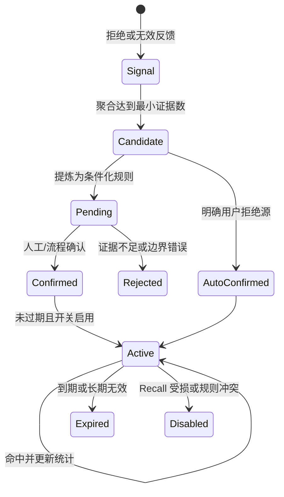

### 负向记忆过滤也要读上下文

`memoryChecker.ts` 会加载项目级和当前用户级负向规则，并只处理 Recheck 后仍有效的候选。对于 conditional 规则，Prompt 明确要求读取代码上下文确认条件。命中后，Issue 被标记为无效，规则的 `hit_count` 增加。

不要把“语义相似”当作充分条件。两条空值建议文字相似，一个发生在外部输入边界，一个发生在内部对象，结论可能相反。负向规则必须有排除条件和适用范围。

## 第五层：过滤同一需求里的历史噪音

远端审查会遇到重跑、补提交和同一分支多次触发。当前案例的 `filterChecker.ts` 会寻找同一仓库与源/目标分支，或同一 MR URL 的历史完成 Session，再比较当前与历史有效问题。

它处理三类当前问题：和历史完全重复、与历史建议冲突、与历史高度重叠。它还会判断历史问题是否已在当前代码中消失，并标记为已修复或代码已变化。

这个过滤器只在 remote Session 的最后一批执行。它不是通用的每批去重器，也不能处理没有可靠任务身份的本地对话。课程设计时要把“当前实现的适用范围”和“希望所有入口都有历史记忆”分开。

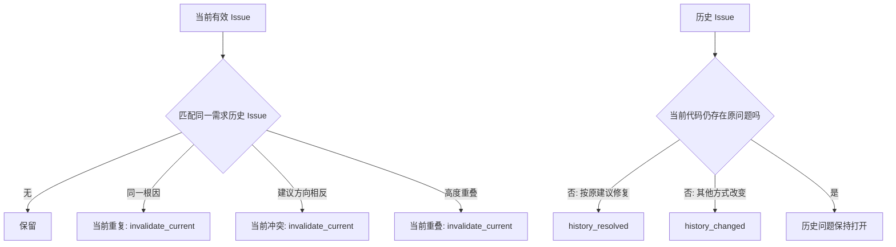

历史匹配最容易出错的是身份。相同行号可能因插入代码而变化；不同描述可能指向同一根因；同一描述也可能发生在两个独立对象。可以结合文件、符号、Diff hunk、规则 ID 和根因指纹，不要只用文本相似度。

## 第六层：用反馈验证，而不是用感觉宣布提升

### 人工和外部明确反馈仍是正式指标主线

当前正式采纳率只纳入人工 0/1 与外部流程 4/5。首轮候选经过 Recheck 或负向过滤后，`is_valid=0` 会被正式查询排除。这样过滤动作能直接影响分母，所以必须同步观察过滤前候选数、过滤率和固定 Benchmark Recall。

若只看过滤后的采纳率，很容易得到虚假提升。例如原来 100 条明确反馈中采纳 60 条；新规则过滤掉 30 条，其中 20 条其实是真问题，剩余 70 条采纳 55 条，采纳率升到 78.6%，但系统少保留了 5 个已采纳问题并可能漏掉更多未反馈真问题。没有 Recall，无法判断这次改造是否值得。

### LCS 自动检测提供辅助证据

`adoptionChecker.ts` 会在合并后读取最终文件，去掉空行和注释、压缩空白，再用行级 LCS 比较 `improve_code` 与文件内容。只有建议的全部有效行都匹配时才得到自动采纳；部分匹配进入 60–69；完全不匹配得到自动未采纳。

不超过三行的建议容易在文件其他位置偶然出现。当前实现增加“短代码冲撞”检查：即使建议片段匹配，只要原代码仍以连续块存在，就按未采纳处理。

```text
improve_lines = normalize(improve_code)
file_lines = normalize(final_file)
matched = LCS(improve_lines, file_lines)

if improve_lines <= 3 and original_code_still_exists:
    adopted_lines = 0
else:
    adopted_lines = matched.length
```

这不是语义等价检测。开发者用更好的方式修复，LCS 可能判未采纳；相同片段碰巧存在，也可能造成假阳性。自动 2/3 和部分 60–69 当前不进入正式采纳率分母，适合作为待复核、反馈补全和检测器评估数据。

### 分开评估“问题正确”和“建议可直接使用”

自动检测主要观察建议代码是否出现，不能单独判断风险是否成立。建议为抽样评审保留两列：`issue_validity` 与 `fix_adoption`。问题成立但修复改写的样本，不应和纯误报混为一谈；问题不成立但开发者顺手做了相似修改，也不能直接算模型判断正确。

## 规则与过滤器怎样避免互相打架

当系统同时有基础规则、项目规则、Recheck、负向记忆和历史过滤时，一个 Issue 可能经历多个判断。若每层只写最终布尔值，团队会看到问题“突然消失”，却不知道是哪一层做了决定。

建议把每次判断保存成事件，而不是只覆盖 Issue 当前字段：

```text
issue_created
  rule_ids: [SYS-BE-R012, PROJECT-07]
  model_version: ...

recheck_completed
  decision: invalid
  reason_type: existing_protection
  evidence: [service/foo.ts#parse, types/request.ts#Header]

negative_memory_checked
  decision: keep
  rule_id: null

feedback_received
  source: external
  adoption: adopted
```

当前案例主要在 Issue 上保存最终状态、无效原因和规则 ID，已经能支持基础追踪。事件模型是课程建议，适合检查器继续增加后的演进。它能回答“Recheck 判无效，但开发者后来采纳了，哪条规则需要复查”，也能重放旧逻辑。

### 决策优先级不能藏在 Prompt 里

可以定义一张显式优先级表：

| 冲突 | 建议处理 |
| --- | --- |
| 安全/合规底线与个人负向记忆冲突 | 保留问题并转人工，不允许个人规则过滤 |
| 项目契约与通用风格规则冲突 | 项目契约优先，记录替代机制 |
| Recheck 判无效但静态分析有确定证据 | 保留或升级人工复核，模型不能覆盖确定证据 |
| 历史建议与当前建议方向相反 | 读取当前代码与规则版本，不按时间简单选新或旧 |
| 自动检测未采纳但人工明确采纳 | 人工明确反馈优先，保留检测差异用于改进算法 |

优先级最好由后端代码执行，而不是要求模型记住。模型负责给出结构化判断，Harness 决定某类判断是否有权过滤高分问题。

### 过滤动作必须是可逆的

“过滤”不应等于删除。将 Issue 标成无效时保留原评论、规则版本、检查器、原因和证据；看板允许按检查器查看被过滤项。规则回滚后，可以重算状态或恢复展示。

若负向规则误杀了安全问题，团队需要定位它命中过哪些历史 Issue。`hit_count` 只能告诉命中次数，不能给出具体样本；更完整的实现可以增加规则命中关系或审计日志，并设置保留期。

## 为上下文设置预算和降级路径

上下文增强最容易从“缺证据”走向“把全仓库都交给模型”。应给每个候选问题设置预算：最大文件数、最大符号层数、最大 Token、最大耗时和工具失败后的状态。

一种风险分层方式是：5 分候选允许读取直接定义、两层调用和相关测试；4 分读取直接定义与一层调用；3 分只读取直接定义；低分没有明确项目规则时不自动扩展。具体数值需要用仓库规模和模型成本校准。

预算耗尽后的结果不能默认为“有效”或“无效”。可以返回 `evidence_insufficient`，并按风险选择：高风险交给人工，低风险进入折叠区，不参与自动负向规则生成。

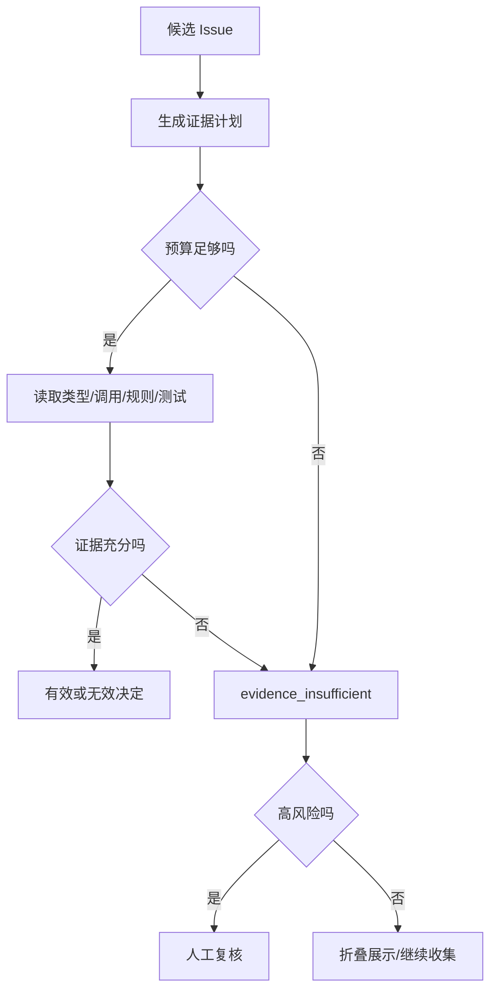

工具失败也要分类。文件不存在可能来自重命名；权限失败是运行环境问题；符号搜索无结果可能是语言索引未准备；超时是容量问题。把它们都写成“未发现上下文”会让 Recheck 做出错误否定。

## 负向规则的反误杀测试

每条负向规则至少要有三组测试样本：应该过滤、表面相似但应该保留、证据不足不能自动决定。

以“内部对象不要重复空值检查”为例：

| 样本 | 上下文 | 期望 |
| --- | --- | --- |
| A | 对象只来自成功构造函数，字段有非空保证 | 过滤重复空值建议 |
| B | 对象来自 RPC 反序列化，字段可缺失 | 保留空值风险 |
| C | Diff 只出现使用点，构造路径检索失败 | 不自动过滤，标证据不足 |

上线前在固定集上回放所有活跃负向规则。规则更新不仅测试自己的样本，还要运行安全、并发、鉴权等高风险回归集。否则一个宽泛的“不要做防御性检查”可能消掉真正的边界校验。

规则过期不代表直接删除。到期时可以进入观察状态：停止自动过滤，但继续记录“若启用会命中哪些 Issue”，重新积累证据后再确认。这样能发现组件升级或业务变化导致的规则漂移。

### 检查用户级规则是否污染项目级判断

同一个 Issue 可以分别用项目规则、用户规则运行影子判断。如果只有用户规则过滤，展示层可以对该用户折叠，但保留项目级结果用于指标和团队 Review。高风险问题则不允许个人规则改变可见性。

个人偏好也应有上限。若一个用户产生大量负向规则，可能是他对反馈入口的理解不同，或系统在该模块上有结构性误报。此时优先做根因调查，不是继续增加个性化过滤。

## 让看板能回答“哪一层有效”

总体采纳率只能告诉系统输出后的结果。为了评估分层流水线，可以增加漏斗：

```text
首轮候选 1,000
  -> Recheck 保留 780
  -> 负向记忆保留 735
  -> 历史过滤保留 710
  -> 高分且明确反馈 260
  -> 采纳 180
```

每一层同时显示过滤数量、过滤原因、被过滤高分数量、人工抽查真阳性率和额外成本。漏斗中的 69.2% 明确反馈采纳率不能单独证明前三层正确；还要看固定 Benchmark 中从 1,000 到 710 的过程中损失了多少真问题。

建议至少提供下面四个视图：

1. 规则视图：每条规则命中、采纳、拒绝、Recheck 无效和版本变化。
2. 检查器视图：Recheck、负向记忆、历史过滤分别过滤什么，抽查错误多少。
3. 根因视图：`false_positive`、`bad_fix`、`already_handled`、`low_value` 等趋势。
4. 成本视图：每层的 Token、工具调用、时延、失败和证据不足率。

还应把“问题判断正确但修复不可用”单独列出。如果只用 Issue 采纳状态衡量规则，修复生成的缺陷会错误归因给发现阶段。

## 异常与恢复：降噪链不能拖垮审查主流程

规则解压失败、代码检索超时、Recheck 返回结构错误、记忆服务不可用、历史任务关联失败，都可能发生。每层要定义失败时是 fail-open 还是 fail-closed。

| 失败 | 推荐降级 | 原因 |
| --- | --- | --- |
| 项目规则读取失败 | 使用基础规则，报告配置告警 | 不应阻断全部审查，但结果置信度下降 |
| Recheck 超时 | 保留首轮候选并标未复核，或高风险人工复核 | 不能把超时当无效 |
| 负向记忆不可用 | 跳过过滤 | 负向层是降噪增强，不应阻断发现 |
| 历史关联失败 | 保留当前问题，停止修改历史状态 | 错误关联比重复展示风险更高 |
| 自动采纳检测失败 | 保持未知，稍后重试 | 不能写成未采纳 |

安全与合规规则读取失败时可以采取更严格策略，例如阻断自动合入并请求人工检查。不同规则等级需要不同失败语义。

恢复后不要静默补写。保存检查器状态、重试次数和最终来源，避免同一 Issue 被重复过滤或反馈覆盖顺序错乱。第 2 章的外部状态机思想在这里仍然适用：模型输出不是完成证明，检查器的结构化结果成功持久化后才算该层完成。

## 从影子运行到正式过滤

降噪能力适合按四个阶段发布。

阶段一只记录。新规则、Recheck 或负向记忆产生判断，但不改变用户可见结果。团队比较“如果启用会过滤什么”。阶段二折叠低风险建议，用户仍可展开，高风险不自动过滤。阶段三在一个项目正式过滤已确认子类，同时抽样所有高分过滤项。阶段四才扩大仓库与问题类型。

每个阶段设置停止条件：高风险 Recall 下降；某条规则出现跨模块误杀；证据不足率显著升高；成本超过预算；用户反馈覆盖下降；规则冲突无法解释。触发后回退到上一阶段，而不是用更多例外覆盖错误规则。

影子运行也要防止评估污染。若同一开发者同时看到新旧两套评论，反馈会互相影响。可以只在后台比较，或按任务稳定分流。固定 Benchmark 用于可重复回归，新时间窗口样本用于检查泛化。

## 上线前核对实现、兜底配置和运行配置

采纳率链路常见的误会是“代码里有，所以线上正在运行”。上线评审应并排检查三层：实现是否存在；代码兜底是否启用；数据库、环境变量或任务参数最终给了什么值。

以当前案例为例，`recheck` 位于兜底扩展检查列表，`memory_neg` 只出现在推荐配置中；负向规则提炼的兜底来源包含用户拒绝，不包含 Recheck 无效信号；远端 `filter` 还要求 Session 的 `remote` 标志和最后一批条件。只看类名会错误推断整条链都在每次审查执行。

可以用下面的发布核对表：

| 检查 | 需要留下的证据 |
| --- | --- |
| 规则来源 | 本次加载的基础、系统和项目规则版本及数量 |
| 检查器开关 | Session 最终启用列表，而不是代码常量 |
| 条件满足 | project_id、remote、最后一批、历史任务身份等条件 |
| 结果持久化 | 每个检查器完成状态、过滤数量和失败原因 |
| 反馈来源 | 人工、外部和自动状态的写入时间与覆盖关系 |
| 回退能力 | 可以关闭的配置项、规则版本和恢复步骤 |

测试环境还应覆盖“规则为空、项目规则解压失败、负向规则过期、历史任务找不到、Recheck 返回少一条结果、自动检测文件重命名”等失败路径。正常路径通过只能证明演示可运行，不能证明降噪链在异常时不会误删问题。

完成核对后，把实际运行配置快照绑定到实验记录。采纳率变化若没有配置快照，团队无法判断是规则内容、检查器启用、模型版本还是反馈入口改变造成的。

## 用五个里程碑实施采纳率改造

### 里程碑一：建立可解释基线

固定一个仓库、模型、规则版本和成熟窗口。保存明确反馈采纳率、反馈覆盖率、每类拒绝原因、固定 Benchmark Recall、平均审查时延与成本。抽样复核至少包含已采纳、已拒绝和无反馈三组。

完成条件是能回答“主要噪音来自哪里”，而不是得到一个漂亮的总体比例。

### 里程碑二：规则最小化与命中追踪

先处理证据最充分的两三个根因桶。把宽泛规则改成触发条件、排除条件和证据要求；为每条规则分配 ID；在 Issue 中记录命中。离线回放固定样本，检查新规则是否减少目标误报，同时保留原有真问题。

失败时回退规则版本，不要在同一轮继续添加更多例外。

### 里程碑三：为高误报子类增加 Recheck

选择 `already_handled`、组件契约误判或范围错位等子类，要求 Recheck 读取最小上下文。记录每条候选的检索次数、有效/无效结论与理由。先离线或影子运行，再决定是否进入正式展示链。

完成条件包括目标根因桶下降、Recall 无明显损失，以及成本在可接受范围。

### 里程碑四：小范围启用负向记忆

先在一个项目启用，只接受达到最小证据数、置信度阈值、明确适用条件且有过期时间的规则。高分与安全问题默认不允许个人负向规则直接过滤。每周抽查命中样本和被过滤的真问题。

如果 Recall 下降或某条规则跨模块误杀，立即禁用该规则，而不是等整体指标恢复。

### 里程碑五：接入历史过滤与反馈补全

为远端任务建立稳定身份，处理重复、冲突和已修复历史 Issue。合并后运行自动检测补充证据，并推动外部流程提供明确 4/5 状态。看板同时显示正式采纳率、自动检测覆盖、无法判断和部分采纳分布。

```mermaid
flowchart LR
  B0[基线与标签] --> B1[规则版本化]
  B1 --> B2[高误报子类 Recheck]
  B2 --> B3[项目级负向记忆试点]
  B3 --> B4[历史过滤与反馈补全]
  B4 --> B5[分层推广]
  B2 -. Recall下降 .-> RB[回退规则/复核]
  B3 -. 误杀真问题 .-> RB
  B4 -. 身份关联错误 .-> RB
```

## 设计一场能判读的改造实验

以“重复空值检查”作为目标根因。实验可以这样设计：

| 项目 | 对照组 | 处理组 |
| --- | --- | --- |
| 首轮规则 | 当前版本 | 相同 |
| 首轮上下文 | 当前版本 | 相同 |
| Recheck | 当前逻辑 | 强制读取构造入口与直接 callee |
| 负向记忆 | 关闭 | 关闭，避免变量混杂 |
| 样本 | 同一固定 Benchmark 与影子 MR | 同一批样本 |
| 主要指标 | 该子类人工确认 Precision | 同左 |
| 护栏 | 高风险 Recall、时延、调用次数 | 同左 |

如果处理组减少了重复校验误报，却把真正来自外部输入的空值风险也过滤掉，说明 Recheck 规则缺少系统边界条件。若准确率不变但成本增加，说明问题不在检索，而在规则或首轮分类。

第二轮才加入负向记忆。仍使用同一 Benchmark，并增加新时间窗口的盲测样本，防止规则只记住开发集。每次只增加一个主要变量，保留回退开关。

### 推荐的发布门槛

门槛应由仓库基线决定，下面是一组结构，不是固定数字：

- 目标误报子类相对下降，并达到最小样本量。
- 固定 Benchmark 的高风险 Recall 不低于基线容忍区间。
- 被 Recheck 或负向规则过滤的高分问题完成人工抽查。
- 审查时延和 Token 成本没有超过服务预算。
- 规则命中、过滤原因和版本可以追溯。
- 无法判断率没有因“更谨慎”大幅上升。

采纳率上升只能算一个条件。Recall、成本、反馈覆盖与可追溯性共同决定能否推广。

## 迁移任务：为另一个仓库设计降噪闭环

选择一个你熟悉的仓库，找出一种经常被拒绝的评论。不要直接写新 Prompt，先提交一页设计：

1. 给出三条成对样本：候选问题、拒绝证据、最终代码。
2. 判断根因属于规则、上下文、范围、修复、历史还是价值。
3. 写一条带触发条件、排除条件和证据要求的规则。
4. 设计 Recheck 需要读取的最小上下文与停止条件。
5. 决定这条经验应是组织、项目还是个人范围，保存多久，谁能禁用。
6. 定义主要指标、Recall 护栏、成本预算与回退条件。

一个合格方案应该允许评审者指出“哪项证据会让这条规则不再成立”。如果规则无法被证伪，它很可能只是偏好口号。

评审这份设计时，还要追问过滤失败怎样恢复。规则加载失败时是否退回基础审查；Recheck 超时时候选是否保留；负向规则误杀后能否查到命中样本并回放；项目级规则是否会被个人偏好覆盖。没有这些答案，闭环只描述了成功路径。

最后用一条此前从未出现过、但根因相似的代码变更做盲测。开发样本通过只能说明系统记住了已有案例，盲测才能检查触发条件是否具备迁移性。

## 本章收束

采纳率工程是一条从标准到证据、再到反馈的链。规则层减少标准漂移；上下文层验证触发条件；Recheck 挑战首轮候选；负向记忆吸收稳定的拒绝模式；历史过滤解决重复和冲突；人工、外部与自动反馈共同提供验证信号。

课程案例已经具备这些能力的大部分代码对象，但能力存在不等于默认启用。`memory_neg` 不在当前兜底扩展检查列表，负向规则提炼的默认源也有限；数据库热配置可能改变运行行为。架构评审必须同时查看实现、兜底配置和实际运行配置。

最后保留一条硬约束：不能通过沉默提升采纳率。任何过滤器、规则或记忆上线时，都要在固定样本上检查 Recall，对高分被过滤问题做抽样，并保留版本和回退开关。第 6、7 章会把同样的工程思路转向另一个方向：模型没有报错，但它可能在大型任务中漏掉本应报告的问题。

## 参考文献

本章以课程案例当前实现、脱敏后的采纳与拒绝样本，以及规则、上下文、复核和反馈回流方案为主要事实来源。代码片段均为教学化节选；开关与默认值以当前代码兜底配置为准，实际运行值可能由外部配置覆盖。
