# 第 1 章 为什么今天需要 AI Code Review

> 预计学习时间：55–70 分钟
> 一句话总结：把 AI 放进代码审查之前，先分清它该接管哪些重复劳动，哪些判断仍必须由人负责。

## 先看一次普通的合并请求

一名开发者提交了 26 个文件的改动：前端新增批量操作，后端增加一个异步接口，还顺手重构了日志。自动测试通过，lint 没有报错。审查者在半小时里留下四条评论：一个变量名不清楚，一处错误信息不统一，两处空值保护缺失。两天后，测试环境仍然发现了一个问题：异步任务在失败分支里没有释放锁，后续请求一直等待。

这类经历很容易导向两个相反的结论。有人会说，人工审查太慢，应该让 AI 全部接手；也有人会说，AI 连业务语义都不懂，代码审查只能依靠资深工程师。两种说法都把问题压扁了。真正需要回答的是：**不同审查手段分别能看到什么证据，付出多少成本，在哪些条件下容易失效。**

[[Code Review（CR）]] 是对代码改动进行判断和反馈的活动。它不等同于"找 Bug"。Google 的工程实践把设计、功能、复杂度、测试、命名、注释、风格和文档都列为审查对象；Bacchelli 与 Bird 对现代代码审查的研究还发现，**开发者同时把知识传递和团队协作视为重要结果**——这意味着审查不只是"发现缺陷"，也是团队认知的同步机制。[1][2]

课程里会频繁出现 [[Merge Request（MR）]]。它是一份合并请求：开发者请团队把一个分支的改动合入目标分支。GitHub 常用 Pull Request（PR）这个名称。MR 不只是 diff 页面，还承载需求说明、提交记录、自动检查、讨论、批准和最终合并状态。**AI CR 如果只拿到几行 diff，看到的只是这个协作对象的一小部分**——这是后续所有上下文增强策略的出发点。

## 人工 CR 没有消失，但吞吐矛盾在加剧

现代代码审查的基本矛盾是：**高质量判断需要上下文和注意力，研发流程却希望反馈更早、更快、更稳定。**

人工审查擅长处理模糊目标。例如，"这个缓存会不会让结算金额过期""这个接口是否破坏了另一个团队的兼容承诺""为了赶发布日期暂时接受这段重复代码是否合理"。这些问题需要业务责任和风险取舍。审查者在判断代码时，同时也在判断团队愿意承担什么风险。

但同一个审查者也有注意力上限。小改动容易快速理解，大改动需要在多个文件、调用链和需求之间来回切换。等待审查拉长反馈周期；审查者忙于交付时，评论集中在容易看见的命名和格式；改动越晚被检查，返工时已经叠加的代码和测试就越多。

**还有一类成本很容易被忽视：资深工程师不断重复解释已经稳定的规则。**"错误日志必须记录原始 error""并发资源需要在所有退出路径释放""组件库已经处理空值，不要额外包一层""某目录只能调用领域服务，不能直接查存储"。前两条可能适合静态分析或 AI，后两条依赖仓库约定。关键不在于谁来执行，而在于：**规则如果只存在于某个人的记忆里，审查吞吐就受这个人的时间限制。**

所以本课程所说的"AI 替代人工"有严格边界：**替代的是人工审查中的重复扫描、证据收集和第一轮反馈，不是替代代码所有者的责任。** 准确的目标是让机器扩大覆盖，让人把注意力用在高风险和高语境判断上。

## Code Review 的六个阶段

下面的演进不是一条所有团队都按年份经历的线性历史，也不是新阶段彻底淘汰旧阶段。**成熟系统通常同时保留多种手段，只是把不同问题交给更合适的执行者。**


### 阶段一：人工逐行审查

最初的核心对象是补丁和讨论。人阅读改动，结合需求和经验给出评论。它的优点是判断弹性大，可以追问作者，也能处理架构取舍。缺点同样明显：**结果依赖参与者时间、经验和注意力，重复规则消耗大量审查容量。**

人工审查还承担教学功能。资深工程师指出一处错误时，可能顺便解释模块边界和历史原因。这个过程能传播知识，却难以规模化。**把所有低级扫描都留给资深工程师，既昂贵，也会让真正需要讨论的设计问题淹没在评论列表里。**

### 阶段二：格式、规则和静态分析自动化

lint、格式化器、类型检查、编译器、安全扫描和 [[静态分析]] 把一部分问题变成确定性判断。**只要规则可编码、输入可获得，机器就能快速、稳定地执行。** 例如未使用变量、危险 API、明显空指针路径、依赖漏洞或不符合格式规范的代码，都可能在提交前被拦截。

这一步的价值不是"工具比人聪明"，而是**让确定性问题不再占用人类注意力**。它也是 [[Shift-Left]] 的典型实践：把质量检查提前到编码、提交或 MR 阶段，而不是等到集成测试或线上事故才发现。

**规则工具的边界在于它必须提前知道要找什么。** 某个函数虽然类型正确，却在业务上用了错误的 error 变量；某段并发代码虽然语法合法，却把锁释放放在了不完整的分支；某个建议虽然符合通用防御式编程，却违背了团队组件的推荐用法——这些问题需要比模式匹配更宽的语义判断。

### 阶段三：远端 Diff AI 审查

大语言模型让审查系统可以读自然语言与代码，给出解释性评论。最容易落地的形态是把 MR diff、少量规则和 Prompt 发给远端模型，再把结果写回 MR。它部署简单，能覆盖规则工具难以编码的问题，也能在很短时间内完成第一轮扫描。

CodeReviewer 这类研究把自动代码审查拆成代码改动质量估计、评论生成和代码修复三个任务。[4] 这个拆分很重要：**发现问题、解释问题和产生可用修复不是同一种能力。** 一个系统能生成流畅评论，不代表定位正确；能给出修复片段，也不代表修复符合仓库约束。

只看 diff 的 AI 审查经常遇到上下文缺口。调用函数的约定可能在另一个文件，类型定义可能由生成代码提供，需求约束可能写在任务系统，测试可能说明一个看似奇怪的分支是刻意设计。**模型收到的信息不够时，仍可能给出语言流畅的建议。结果就是"看起来合理，实际上不适用"。** 这是第 4 章采纳率诊断的核心起点。

### 阶段四：本地仓库上下文审查

下一步是让审查器进入真实工作区。它可以搜索符号、读取关联文件、查看测试、运行命令，再结合项目规则判断 diff。GitHub 的官方文档也把全项目上下文、自定义指令、仓库级说明、Agent skills 和 MCP 上下文作为提高审查相关性的手段。[5]

本地上下文减少了部分误报，却引入新的工程问题：模型该读哪些文件，如何避免把整个仓库塞进上下文，怎样限制命令权限，如何证明每个文件都检查过，任务失败后从哪里恢复。**模型有了工具，只说明它"可以"行动，不说明它"必然"按完整流程行动。** 这是第 6、7 章要深入讨论的核心矛盾。

### 阶段五：Harness 驱动审查

[[Harness]] 是包围模型的工程运行支架。它把一次大审查变成外部可控制的过程：服务端创建 Session，筛选文件并切分 Batch；Agent 只能领取当前任务；提交结果后由程序检查结构和工作量；状态机决定下一步是继续、重审、扩展检查还是汇总。

**这里发生了一个关键转变。Prompt 仍然重要，但流程正确性不再完全寄托在模型"记住所有要求"。** 批次、状态、下一步许可、重试和结果验证被写进代码与数据模型。模型负责擅长的语义分析，确定性程序负责计数、权限、状态与失败恢复。这是第 2 章要拆开讲的核心架构。

### 阶段六：指标与反馈闭环

系统上线后，问题从"能不能评论"变成"评论是否有用、漏掉多少、为何变差"。这要求记录开发者是否采纳、哪些建议被拒绝、测试后来发现哪些应召回问题、不同仓库和问题类型表现如何。反馈再进入规则、测试集、上下文策略和质量门。

BitsAI-CR 的工业实践使用规则检查、二次过滤、规则分类、反馈飞轮和评估指标，说明生产 AICR 往往是组合系统，而不是一次模型调用。[6] 课程不会照搬其公开数字，因为模型、团队、语言和统计口径都不同。我们关心的是工程结构：**先检测，再验证，用反馈持续校准。** 这是第 3 章要建立的度量体系和后续所有优化的前提。

## 为什么是今天：代码生成改变了输入规模

过去，代码产出速度在很大程度上受人工输入限制。AI 生码工具提高了创建和修改代码的速度，也让"一次改很多文件"变得更常见。**代码写得更快，不会自动让需求更清楚、架构更一致或测试更充分。** 审查入口因此承受更大的数量和速度压力。

如果生成端每小时产生多次改动，而审查仍等待少数资深工程师排队，质量系统会出现三个后果。第一，反馈变晚，错误在更多改动上叠加。第二，审查者会采用抽查或只看关键文件，覆盖难以稳定。第三，**生码平台缺少一个可以程序化调用的质量门，生成结果只能直接进入测试或等待人工。**

AI CR 的现实价值就在这里：它可以在提交前、本地工作区、MR 创建时或生码任务结束后立即运行，给出第一轮语义检查，并把高风险问题和证据交给人。**远端服务化后，同一套能力还能被 CI、开发平台和其他生码 Agent 调用。** 第 8 章会专门讨论服务化，当前只需记住：AICR 的调用方不再只有"正在看 MR 的人"。

这并不意味着评论越多越好。假设系统每次都报告几十个低价值问题，开发者会快速学会忽略它；假设系统只报告一两条极有把握的问题，采纳率可能很好，却漏掉大量真正缺陷。**高质量 AICR 必须同时处理噪音与遗漏，这正是后续采纳率和召回率两条主线。**

## 四类审查者怎样分工

用"AI 能不能审查代码"来提问太宽。更实用的做法是**先看问题特征，再选择执行者。**

| 问题特征 | 首选手段 | 原因 | 需要升级的条件 |
| --- | --- | --- | --- |
| 规则明确、可确定计算、无需业务语境 | lint / 编译 / 静态分析 | 快、稳定、可阻断，结果易复现 | 规则难表达或误报随上下文变化 |
| 需要跨少量文件理解代码意图，有清楚证据 | AI CR | 语义覆盖广，可解释并给出候选修复 | 涉及高风险、所有权或含糊业务取舍 |
| 需要需求、组织承诺、架构责任或风险接受 | 人工审查 | 人能承担决策责任并处理含糊目标 | 可先让 AI 收集证据和列出冲突点 |
| 既有可编码底线，又有上下文例外 | 组合审查 | 工具守底线，AI 查语境，人做终局判断 | 需要明确谁有阻断权和如何处理冲突 |

**一个常见错误是把容易自动化的问题全部交给 AI。** 例如格式、导入顺序和已知危险函数，本可由确定性工具快速判断，却被模型用自然语言重复评论。这样既增加成本，也让结果存在随机性。**另一个错误是把高风险决策自动化：AI 说"没有问题"就允许涉及权限或资金的改动直接合并。** 模型输出应该成为证据的一部分，而不是责任的替代物。

2025 年的一项研究尝试组合静态分析与 LLM，报告混合策略能改善评论的相关性与完整性。[7] Ericsson 的经验报告也采用 LLM 与静态程序分析的轻量组合，并让有经验开发者参与初步评估。[8] 这些公开证据与我们的工程判断一致：**规则和模型不是竞争关系，它们覆盖不同的可判定空间。**

## 从真实问题样本看"适合谁审"

下面的场景来自脱敏后的教学样本。它们不代表行业分布，也不用于计算生产指标。目的只是练习分工。

### 场景一：未使用变量

代码声明了变量却从未读取。编译器或 lint 可以确定判断，首选确定性工具。AI 再评论只会重复已有信号。人工一般无需参与，除非未使用代码暴露了更大的需求遗漏。

### 场景二：goroutine 中锁释放位置不完整

锁只在成功分支释放，错误分支提前返回。数据流分析可能发现，AI 也可以沿控制流解释后果。**适合"静态分析 + AI"组合：前者提供稳定告警，后者解释并检查相邻代码是否存在约定。** 若锁保护的是高风险共享状态，应由人确认修复。

### 场景三：日志记录了错误的 error 变量

当前分支检查 `saveErr`，日志却打印上一个步骤的 `queryErr`。类型系统通常不报错，局部语义却明显矛盾。AI 对这类跨几行的变量关系很有优势，也适合补充自定义静态规则。**评论应包含具体变量和控制流证据，不能只说"错误处理可能有问题"**——这种模糊评论本身就是采纳率杀手。

### 场景四：重复方法定义

如果语言或构建系统会直接报错，交给编译器；如果是不同文件中语义重复、导致维护分叉，AI 可搜索符号并提示。是否合并方法仍要看模块边界，可能需要人判断。

### 场景五：建议增加空值保护，但业务入口保证非空

这是一类典型拒绝评论。单看当前函数，防御式检查似乎合理；结合入口契约，它可能重复甚至隐藏上游错误。**AI 只有读取契约、调用方或测试后才有资格判断。** 证据仍冲突时，应交给代码所有者。

### 场景六：方法内部已经处理失败

AI 在调用处建议重复捕获，但被调用方法已转换错误并记录必要信息。**这说明审查器只看了 diff，没追踪实现。** 解决办法不是让 Prompt 更强硬，而是让系统提供符号搜索和相关文件上下文，并在提交评论前复核。

### 场景七：组件库推荐的写法看起来违反通用规则

通用规则要求显式传值，项目组件却约定缺省值触发受控行为。**AI 若不知道组件文档，会把正确代码判为问题。** 这类案例应沉淀为项目级规则或路径级说明。人工负责确认规则，AI 负责在后续审查中一致执行。

### 场景八：修复方向正确，建议代码不可用

AI 正确发现竞争条件，却给出会阻塞事件循环的修复。这里**"发现"与"修复"必须分开评分。** 评论可以保留问题证据，但修复建议要经过复核；高风险改动由人决定。

### 场景九：接口改变了权限边界

代码本身可以运行，测试也通过，但新接口把原本只在后台使用的能力暴露给普通用户。AI 可以追踪鉴权调用、列出缺失测试，**却不能代表产品和安全负责人接受风险。** 必须人工审查，并且适合设置强制审批规则。

### 场景十：命名不够清楚

AI 能快速指出含糊命名，但价值依赖团队语境。如果只是个人偏好，不应形成阻断评论；如果名称掩盖了单位、时区或状态语义，就可能导致真实缺陷。**审查器应说明歧义如何影响阅读或调用，而不是只给一个替换词。**

把十个场景放在一起可以看到，执行者不是按"简单/复杂"一刀切。选择标准至少包括：**规则能否确定表达、需要多少上下文、错误后果、是否涉及责任决策、结果能否自动验证。**

## AI CR 的职责边界

一套健康的 AICR 系统应该明确三种权限。

**建议权**：AI 可以报告候选问题、证据、严重度和修复方向。大多数语义评论停留在这里。开发者可以采纳、拒绝或标记无法判断。

**阻断权**：只有规则清楚、误报经过校准、失败成本足够高的检查才适合阻断合并。阻断可以来自测试、静态分析或经过验证的 AI 质量门，**但必须有申诉和人工覆盖路径。** 否则系统会用"安全"名义制造不可解释的流程堵塞。

**决策权**：架构例外、业务风险、数据兼容、发布时间与技术债取舍属于责任主体。AI 可以准备材料，不能替负责人签字。GitHub 的官方 Code Review 文档也明确写道，Copilot 不保证发现 PR 中的所有问题，可能犯错，使用者应仔细验证反馈并补充人工审查。[5]

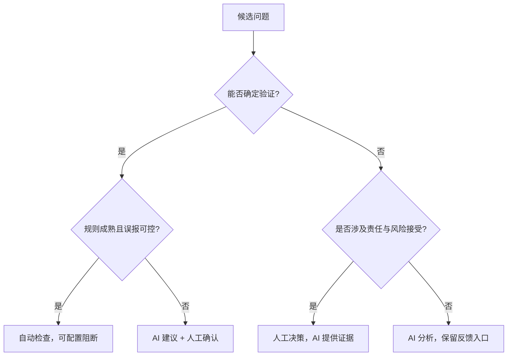

边界还要体现在产品交互中。如果 AI 评论被当成普通审查意见，开发者可以讨论、解决和隐藏；如果系统允许一键应用修复，就应保留变更 diff 和测试结果；如果支持自动重审，就要避免重复提交已解决评论。官方产品已经暴露出这些工程细节：GitHub Copilot 的评论不计入必需批准，也不会直接阻止合并；它允许自定义仓库规则和反馈，并提示重审可能重复评论。[5]

## Shift-Left 不是把所有门都移到最左边

Shift-Left 常被理解成"越早检查越好"。更准确的定义是：**把能够在早期获得足够证据的检查提前。** 格式、类型和局部语义可以在编辑器或提交前运行；依赖真实集成环境的行为仍应留给集成测试；需要线上流量才能判断的问题要依靠灰度和监控。

AICR 适合位于提交前和 MR 阶段，因为此时 diff、仓库和作者意图基本可得，修改成本又比测试后更低。它还可以成为生码任务的质量门：Agent 完成代码后先触发 AICR，处理高置信问题，再把代码交给人。**但"左移"不能让同一个 AI 同时写代码、审自己、宣布通过并自动发布——生成者与评价者需要一定分离，关键状态要由外部系统维护。**

这套思想在课程中被称为 **CR Shift-Left**。它不是一个单独模型，而是一组对象和流程：Session 保存一次审查，Batch 控制工作量，Issue 保存候选问题，状态机规定下一步，MCP 暴露领取任务与提交结果的工具，指标和记忆把反馈带回下一轮。第 2 章会沿一条真实请求逐站拆解。

## 本课程接下来怎样推进

第 1 章只建立了边界：人工、规则工具与 AI 各有职责；高质量不等于评论数量；AICR 必须同时面对噪音与遗漏。

第 2 章把模型放进一个可执行系统。你会看到 Prompt 为什么仍然必要，却不足以控制长流程；也会看到 Session、Batch、File、Issue、状态机、MCP 和 Agent 怎样交接。第 3 章先建立度量语言，定义采纳率、召回率与 F1，并揭示分母变化如何改变结论。**这是后续所有优化的前提：没有稳定口径，"优化"很容易退化成展示几条漂亮评论。** 随后四章分别诊断和改造采纳率、召回率，最后进入远端服务化。这条路线刻意把指标放在改造之前——也只有先分清 AI 和人的责任，后续的自动采纳、质量门和远端接入才不会扩大错误权限。

## 路线检查

回到章首的 26 文件 MR，可以这样分工：lint 处理格式和确定性规则；静态分析检查可编码的数据流与资源释放；AI 在仓库上下文中扫描错误变量、跨文件约定和候选风险；人工集中判断异步设计、业务契约和是否接受风险。测试环境发现的锁问题还应进入评估集，检查下一版 AICR 能否召回。

如果你面对一个新问题，可以依次问五个问题：**它能否被确定性规则表达？需要哪些仓库或业务上下文？报告错误的成本是什么？谁有权接受风险？结果如何验证和回流？** 能够回答这五问，就不会把"采用 AI"误写成"增加一次模型调用"。

## 参考文献

1. Alberto Bacchelli, Christian Bird. [Expectations, outcomes, and challenges of modern code review](https://doi.org/10.1109/ICSE.2013.6606617). ICSE, 2013.
2. Google Engineering Practices. [The Standard of Code Review](https://google.github.io/eng-practices/review/reviewer/standard.html)；[What to look for in a code review](https://google.github.io/eng-practices/review/reviewer/looking-for.html).
3. Shane McIntosh 等. [The impact of code review coverage and code review participation on software quality](https://doi.org/10.1145/2597073.2597076). MSR, 2014.
4. Zhiyu Li 等. [Automating Code Review Activities by Large-Scale Pre-training](https://arxiv.org/abs/2203.09095). ESEC/FSE, 2022.
5. GitHub Docs. [About GitHub Copilot code review](https://docs.github.com/en/copilot/concepts/agents/code-review).
6. Tao Sun 等. [BitsAI-CR: Automated Code Review via LLM in Practice](https://arxiv.org/abs/2501.15134). 2025.
7. Imen Jaoua 等. [Combining Large Language Models with Static Analyzers for Code Review Generation](https://arxiv.org/abs/2502.06633). MSR, 2025.
8. Shweta Ramesh 等. [Automated Code Review Using Large Language Models at Ericsson: An Experience Report](https://arxiv.org/abs/2507.19115). ICSME, 2025.


---

# 第 2 章 从 Prompt 到 Harness：整体架构与核心思路

> 预计学习时间：80–100 分钟
> 一句话总结：沿一次真实审查请求拆开入口、状态机、批次、MCP、Agent 与结果验证的职责。

## 一个 Prompt 为什么控制不了完整审查

设想一条很长的指令：先检查环境，再读取全部改动；按文件依赖分组，每组审查后提交结构化结果；高风险问题要复核；所有批次完成后检查遗漏，最后生成总结。模型读懂这段话并不困难。困难在于任务运行几十分钟后，系统怎样知道它真的完成了每一步。

如果模型直接回复“已检查所有文件”，这句话是自我报告，不是完成证据。它可能跳过后段文件，可能把两个步骤合并，也可能在上下文变长后只给概括性意见。**Prompt 可以表达期望，却无法独立保存事务状态**、核对文件集合、阻止越级调用、恢复中断任务或让多个执行者共享进度。

这不意味着 Prompt 没用。Prompt 负责把当前任务、规则、上下文和输出格式告诉模型。问题在于我们曾让它同时承担四种职责：说明目标、保存进度、控制流程、验收结果。后面三种职责更适合确定性程序。

[[Harness]] 的作用，就是把这些工程职责从 Prompt 中拿出来。它是围绕模型的一套运行支架：准备上下文，暴露工具，保存状态，限定权限，验证结果，处理失败并记录指标。模型仍负责代码语义分析；系统不再把完整流程寄托在模型的工作记忆里。

Anthropic 的工程文章区分了 workflow 与 agent：[[Workflow]] 由预定义代码路径编排模型和工具，[[Agent]] 则由模型动态决定过程与工具使用。[1] 本课程案例是混合结构。宏观审查路径由状态机规定，因此更像 workflow；在每个批次内部，Agent 可以搜索仓库、阅读关联文件并决定分析方法。这个区分能避免一个误解：采用 Agent，不等于把所有控制权交给模型。

## 先画出系统边界

一条本地 AICR 请求至少涉及四层。为了公开教学，下面把与业务无关的入口合并为“CLI/调用方”，保留实现中的核心服务和工具名。

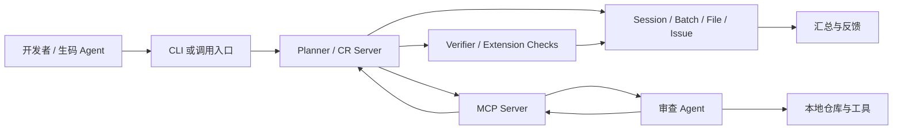

调用方负责发起任务和携带必要身份、仓库、分支或 MR 信息。Planner 负责创建审查计划、推进状态、切分批次和决定下一步。MCP Server 把后端能力转换为模型可调用的工具。Agent 阅读当前 Prompt，在工作区内分析代码，再提交结构化结果。Verifier 和扩展检查不相信“我完成了”，而是检查结果格式、工作量和后续复核条件。

这里的 Server 不是“更大的模型”。它是确定性控制面。Agent 也不是数据库状态的所有者。只要这条边界明确，系统就能回答三个重要问题：谁可以推进状态，谁可以生成问题，谁可以判定流程完成。

MCP 官方规范采用 Host–Client–Server 架构。Host 管理多个 Client、权限和生命周期；每个 Client 与一个特定 Server 保持 1:1 有状态会话；Server 暴露 tools、resources 和 prompts，并通过能力协商声明支持什么。[2] 课程案例没有机械复制规范名词，但遵守相同方向：模型侧通过受控工具访问后端能力，而不是直接修改审查数据库。

## 一次请求怎样穿过系统

下面沿一条正常请求走一遍。先只看交接，不急着记状态编号。

### 入口：创建或复用任务

开发者在本地工作区触发 AICR。入口校验参数，识别仓库和改动范围，然后调用 Setup。远端模式还会处理异步任务、仓库准备和回调，第 8 章再展开。

入口不应每次都无条件创建新任务。同一份改动可能因为页面刷新、网络重试或外部平台重复回调而被多次触发。系统需要内容哈希和会话状态来判断：复用已完成结果、继续未完成 Session，还是创建新 Session。幂等从入口开始，不能等 Agent 已经运行后再补。

### Setup：把模糊改动变成可审查对象

`setupSession` 做的工作比“调用模型”更基础：创建或更新 Session，收集改动文件，过滤不需要审查的类型，计算内容哈希，尝试复用历史文件结果，再调用批次分配器生成 Batch。完成后，Session 进入 ready 状态，`current_step` 仍表示未正式开始，`allowed_next_step` 指向 0。

文件过滤必须可追溯。依赖锁文件、生成产物、二进制资源或超大文件可能被排除，但排除不能悄悄发生。否则最终“完成 100% 审查”只覆盖了过滤后的集合，读者却以为覆盖了 MR 全部文件。好的 Setup 会保存原始集合、有效集合和排除原因。

历史复用也有边界。文件路径相同不代表内容相同；内容相同但规则版本改变，也未必可以复用。**当前实现使用内容哈希和 Session 状态参与判断**。工程上还应考虑模型、Prompt、规则与工具版本，把它们纳入结果有效性的定义。

### Planner：只下发当前任务

Setup 完成后，Planner 不把全流程一次性塞给 Agent。它读取 `allowed_next_step`，调用相应处理函数，生成当前阶段的 Prompt。Agent 每次拿到的不是“请自行完成一切”，而是明确的下一项工作和结构化提交要求。

在批次审查阶段，Planner 还会读取当前 `current_batch_index`，只提供当前 Batch 的文件、规则与上下文。完成一个 Batch 后，服务端才决定继续下一个、进入扩展检查、回退重审或生成汇总。

### MCP Bridge：把状态转换为工具契约

模型无法直接调用 Egg Service。MCP Server 注册两个核心工具：

- `cr_shift_left_batch_review`：根据 `session_id` 领取或继续当前允许的审查任务。
- `cr_shift_left_post_batch_results`：提交 `batch_results`，扩展阶段还可携带 `extension_results`。

工具名不是重点，契约才是。领取工具只需要 Session ID，服务端根据状态返回当前 Prompt；提交工具要求每条结果包含文件、行号、评分、分类、内容及可选代码片段。Agent 不传“下一步应该是 3”，也不直接把 `current_batch_index` 加一。状态推进权留在后端。

### Agent：在批次内部执行语义工作

Agent 收到当前批次后读取改动，必要时搜索定义、调用方和测试。它可以根据代码决定先看哪个文件，也可以用工具补足上下文。这是模型应有的自由：在受控工作单元里选择分析路径。

Agent 产出的是候选 Issue，而不是最终真理。一个候选问题至少要回答：问题在哪，现有代码是什么，风险为何成立，严重度和类别是什么，怎样改进。高质量评论还要区分“必须修复的正确性问题”和“可选的维护建议”。这些字段让后端能够检查完整性，也让后续指标有稳定对象。

### 提交与验证：先验收，再推进

Agent 调用提交工具后，Processor 根据当前状态解释 payload。如果状态是 2，`batch_results` 会进入验证；如果缺少预期结果，实现会降级回 Step 1，而不是假装完成。验证通过后保存 Issue、更新 Batch 和 Session，再决定下一个状态。

验证不等同于让另一个模型说“看起来不错”。可确定检查优先写成代码：字段是否完整，文件是否属于当前批次，行号是否合理，是否重复提交，审查耗时与问题密度是否落在配置范围，包含高风险修复建议时字段是否齐全。**模型复核适合处理语义相关性，不能替代这些机械约束**。

### 汇总：从多批结果生成可读结论

所有批次和必要扩展检查结束后，状态进入 3。汇总从数据库中的结构化 Issue 生成，而不是要求模型回忆此前对话。它可以按风险和类别组织问题，链接文件位置，说明覆盖和排除项，并为指标与反馈保留 Issue ID。

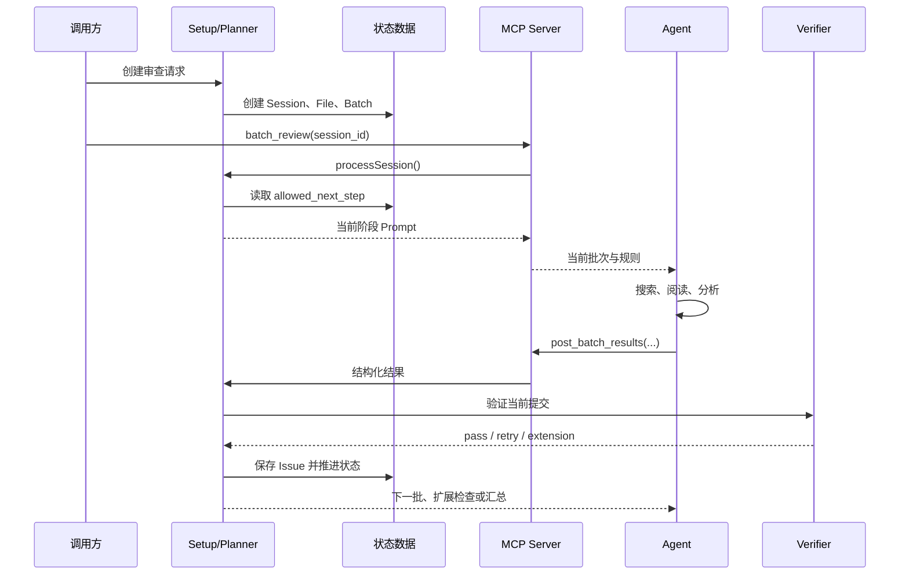

这张图不是实现证据。证据来自 `setup.ts`、`processor.ts`、两个 MCP Tool、`verifier.ts` 与数据模型。图的作用是把它们组织成一条可复述的请求链。

## 五个核心数据对象

只看服务调用容易误以为状态都存在 Prompt 里。真正让任务可恢复的是持久对象。

### Session：一次审查的总账

[[Session]] 保存顶层生命周期：执行模式、状态、当前步骤、下一步许可、当前批次、文件数、行数、批次数、完成数、问题数、开始和结束时间。它还是外部请求与内部对象的关联点。

Session 不应该塞入所有结果详情。它保存汇总和指针，具体文件、批次和问题使用独立对象。这样更新一个 Issue 不必重写整份会话，也便于按批次恢复。

### File：审查范围的快照

File 对象记录路径、diff 规模、内容哈希、过滤或复用状态，以及它属于哪个 Session。它回答“本次到底要审什么”。如果只把文件列表写在 Prompt 中，任务中断后很难证明哪些文件已经处理。

内容哈希让系统区分“同一路径的新内容”和“可以复用的相同内容”。但哈希只证明字节关系，不能证明规则环境相同。课程后续会把版本维度纳入评估讨论。

### Batch：受控工作单元

[[Batch]] 把多个 File 组织为一次 Agent 可以处理的工作量。当前实现主要以约 800–1200 diff 行作为理想范围，同时结合语义分组、拆分、合并、去重和完整性检查。旧设计材料曾出现 800–1500，这属于版本差异，不应混成一个固定行业阈值。

Batch 要保存索引、文件集合、工作量、状态、重试与结果统计。它让系统可以说“第 4 批失败，重新执行第 4 批”，而不是整次审查从头开始。

### Issue：可反馈、可度量的问题单元

[[Issue]] 是一条候选审查问题。位置、评分、类别、描述、现有代码、改进代码、采纳状态和有效性围绕它组织。后续采纳率的分子分母，本质上是在筛选 Issue。

Issue 必须有稳定标识。开发者拒绝一条评论、最终代码采纳建议、测试发现漏报，都需要关联到具体对象。若结果只存在一段汇总文本中，数据闭环就无法建立。

### PendingTask 与 MemoryRule：跨执行与跨会话状态

远端模式使用 PendingTask 表达排队、认领、执行、回调和终态；MemoryRule 保存由历史反馈形成的规则。前者让一次任务跨进程恢复，后者让不同 Session 共享经过筛选的经验。第 8 章和第 5/7 章分别展开。

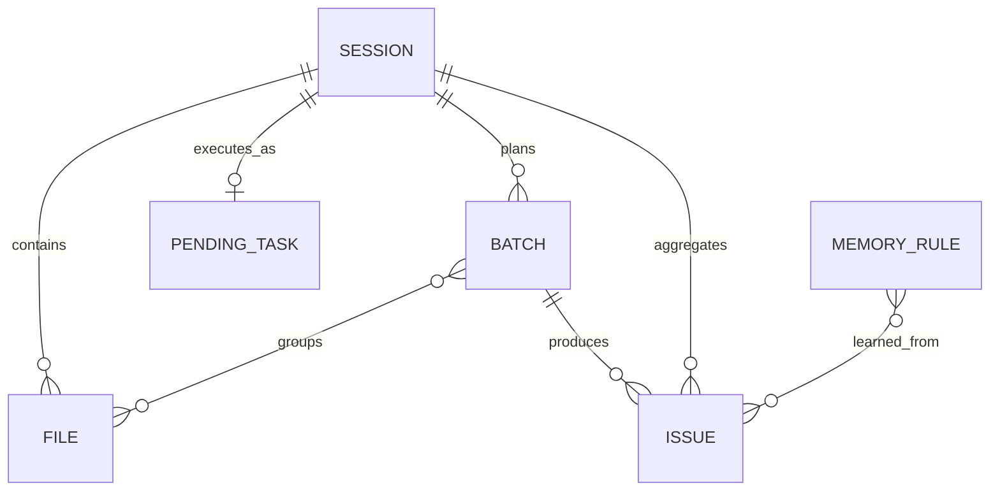

ER 图省略了真实表名、组织字段和大量实现列，只表达教学关系。关系不是说每个数据库都必须这样设计；它说明这些对象分别解决范围、工作量、结果、异步生命周期和跨任务反馈。

## `allowed_next_step`：把建议变成许可

当前主链是 `0 → 1 → 2 → 2.x → 3`。它不是进度百分比，而是服务端允许执行的动作类型。

| 状态 | 含义 | 谁执行主要工作 | 进入下一状态前的证据 |
| --- | --- | --- | --- |
| `0` | 前置与环境检查 | Server 读取配置，Agent 按提示确认环境 | Session 可运行，配置和身份满足条件 |
| `1` | 下发并执行当前批次审查 | Server 选 Batch，Agent 分析代码 | 有当前批次及明确提交契约 |
| `2` | 接收并验证批次结果 | Server / Verifier | 结构、范围和质量检查通过，或得到重试理由 |
| `2.x` | 执行条件化扩展检查 | Agent + 扩展检查编排器 | recheck、记忆、过滤等当前所需检查完成 |
| `3` | 生成最终汇总 | Server / Agent 按持久结果汇总 | 所有必要批次和扩展检查已达到终态 |

`current_step` 表示当前记录到的阶段，`allowed_next_step` 表示允许的下一动作。二者分开能表达“刚完成 Step 1，下一次提交必须按 Step 2 解释”。如果只保存一个 `status=running`，服务端收到 payload 时不知道它是批次结果、扩展结果还是重复请求。

下面是 `processor.ts` 的简化节选。无关日志、监控和字段已移除，状态值与分发关系保持不变。

```typescript
// 简化节选：状态由服务端读取，调用方不能自选处理分支
const session = await getSession(sessionId);

switch (session.allowed_next_step) {
  case "0":
    return executeStep0(session);
  case "1":
    return executeStep1(session);
  case "2":
    return handleStep2(session, batchResults);
  case "2.x":
    return handleStep2x(session, extensionResults);
  case "3":
    return executeStep3(session);
  default:
    return { error: "INVALID_STEP" };
}
```

这个 switch 的价值不在语法，而在所有权：Processor 从数据库读取状态，再选择处理函数。Agent 即使在 Prompt 中写“请进入汇总”，也不能绕过未完成的批次。

### 正常状态循环

一次 Batch 的常见循环是 `1 → 2 → 1`。Step 1 下发任务并把许可推进到 2；Agent 提交结果；Step 2 验证通过，若还有批次就增加索引并回到 1。所有批次完成后，系统可能进入 `2.x` 或 `3`。

### 缺失结果时的降级

如果状态为 2，调用却没有 `batch_results`，当前实现不会生成空结果并继续。`handleStep2` 会把 Batch 状态回退为 pending，把 `allowed_next_step` 设回 1，再重新下发审查。`2.x` 缺少扩展结果时也会清理扩展状态并回退。

这是一个实用的失败处理原则：payload 与当前状态不匹配时，选择可解释的恢复点。恢复动作必须幂等，避免重复保存 Issue 或跳过 Batch。

### 扩展状态为什么写成 `2.x`

扩展检查不是单个固定步骤。它可以根据问题、模式和配置进入 recheck、negative memory、接口契约、任务说明、positive memory、filter 或 fix。把它统一标成 `2.x`，再由 `extension_check_state` 保存内部子状态，能让主链保持稳定，同时允许检查序列演进。

这种设计也有代价。日志和指标必须同时记录主状态与子状态，否则所有扩展耗时都堆在 `2.x`。工具 payload 也要明确当前期望哪种扩展结果，不能让 Agent 猜。

## 链式 Prompt：每一步只承担当前责任

Harness 并没有消灭 Prompt，而是改变 Prompt 的粒度。`promptBuilder.ts` 会根据环境检查、当前批次、验证反馈、扩展检查和汇总生成不同提示。每份 Prompt 都可以包含四类信息：当前事实、当前任务、可用工具、提交契约。

“当前事实”包括 Session ID、批次索引、文件范围、规则和已知上下文。“当前任务”只描述这一阶段要完成的判断。“可用工具”告诉 Agent 如何搜索和提交。“提交契约”规定字段、何时调用工具以及不能自行宣布的状态。

链式 Prompt 的优点是局部可调试。如果某一批没有按格式提交，可以检查对应阶段的提示和工具 schema；如果高风险复核遗漏，可以检查扩展阶段；如果汇总不完整，可以对照数据库 Issue。单一巨型 Prompt 失败时，很难知道是理解、记忆、工具还是状态出了问题。

它也有风险。不同 Prompt 可能重复或冲突，旧规则可能残留，阶段切换时必要上下文可能丢失。因此 Prompt 需要版本管理和契约测试。至少应验证状态名、工具名、必填字段和禁止越级指令与代码一致。

## Harness 的四层职责

为了设计新系统，可以把职责压缩成四层，而不是照抄类名。

### Planner：决定做什么

Planner 根据改动范围与当前状态决定批次、顺序和下一任务。它维护全局完成条件，但不替 Agent 阅读每一行代码。Planner 的输出必须可持久化：任务列表、状态转换和失败原因不能只存在于一次模型回复。

### Team Lead / Verifier：决定是否算完成

Verifier 负责验收。确定性条件写成程序，语义条件可以调用独立复核。它不能只看“输出是否很长”，而要检查当前工作单元是否完整、证据字段是否可用、结果是否与文件范围一致。

### Bridge / MCP：控制怎样访问能力

Bridge 把后端能力暴露为窄工具。工具参数越清楚，越容易校验和审计。不要提供一个万能 `execute(action, payload)` 让模型自行拼动作；也不要让工具直接接受“目标状态”。工具应围绕业务动作设计，例如领取当前批次、提交当前结果。

### Executor / Agent：完成语义分析

Executor 在受限工作区中读取代码、调用搜索和测试工具，生成候选 Issue。它的自治范围由批次、权限与停止条件共同决定。模型更强可以改善这一层，却不能取消其他三层。

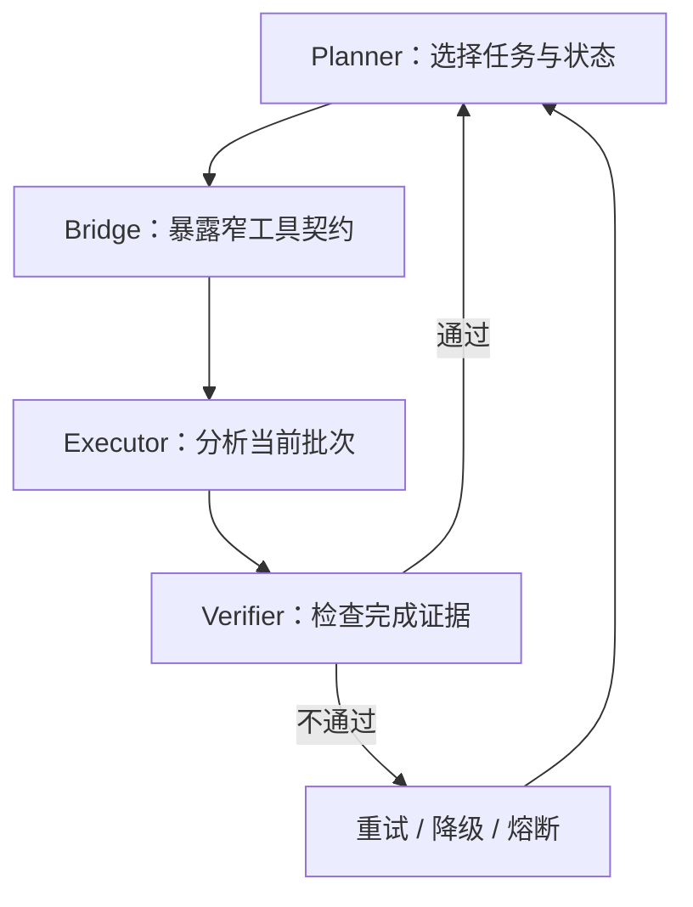

Anthropic 所说的 orchestrator-workers 与 evaluator-optimizer 模式可作为公共参照：中央编排者动态拆解任务，工作者执行；评价者依据清楚标准给反馈并循环改进。[1] 本案例与它们相似，但状态机、数据库和 MCP 工具让流程具备持久与恢复能力。不要因为结构相似，就声称某篇文章证明了当前实现最优。

## 正常路径之外的六个失败点

架构是否可靠，取决于失败时还能否解释和恢复。

### 失败点一：Setup 范围不完整

文件过滤错误或 diff 获取失败，会让后续所有步骤在错误集合上“成功”。应记录总文件、有效文件、排除文件和原因，并在汇总展示覆盖边界。

### 失败点二：批次不均衡

一个 Batch 太大，Agent 容易概括；太小则上下文被切碎，跨文件关系丢失。当前 800–1200 行只是案例实现的主要理想范围，不是通用答案。分批还要考虑语义依赖、文件类型和仓库基线。

### 失败点三：重复领取或重复提交

网络重试可能重复调用工具。领取动作应返回同一当前任务，提交动作应根据 Session、Batch 和结果标识去重。只靠前端按钮禁用无法保证幂等。

### 失败点四：状态与 payload 不匹配

状态是 2，Agent 却提交扩展结果；状态是 `2.x`，调用方没有 extension payload。Processor 必须拒绝或回退，日志要记录期望与实际，不要把未知字段悄悄丢弃后推进。

### 失败点五：验证门被配置关闭

实现包含耗时、密度、内容长度和高风险建议检查，但兜底配置中部分阈值是 0 或近似关闭值，运行时又可能被数据库热配置覆盖。架构图上有 Verifier，不代表每个质量门在所有环境都生效。第 7 章会区分设计目标、默认值和运行值。

### 失败点六：扩展检查循环不终止

recheck 或 fix 如果不断返回需要继续，任务会卡在 `2.x`。每个子状态需要重试上限、超时、熔断和可人工接管的终态。失败不是 `running` 的另一种写法，必须有明确分类。

## 怎样观察这条链路

没有可观测性，状态机只是在数据库里移动字符串。每次处理至少应绑定 Session 级 trace，并记录阶段名、Batch 索引、开始结束时间、结果数量、验证结论和错误类别。

当前实现把 `allowed_next_step` 转换为类似 `processor_step_2_x` 的阶段名，并在 MCP 工具调用处记录领取和提交阶段。这让监控可以回答“卡在哪个状态”“某个工具失败还是审查超时”“重试是否集中在特定 Batch”。远端执行器还需要队列等待和仓库准备指标。

日志不能记录全部 Prompt、令牌和业务代码而不设边界。公开或多租户系统应脱敏仓库地址、账号、任务文本和代码片段。更适合长期保留的是哈希、版本、计数、状态与错误分类；需要原文排障时使用受控采样和访问审计。

## 源码观察：从三处验证架构

阅读真实仓库时，不必从目录第一行读到最后一行。沿请求链抓三个观察点即可建立骨架。

第一处看 `setup.ts` 的 `setupSession`。记录它创建哪些对象，如何过滤文件、计算哈希、复用历史结果和生成 Batch。检查完成时写入的 Session 状态。

第二处看 `processor.ts` 的 `processSession`。确认 switch 的输入来自数据库 Session，不来自 Agent 参数；再追踪 Step 1 怎样选择批次、Step 2 怎样验证、缺失 payload 怎样回退、什么时候进入 `2.x` 与 3。

第三处看两个 MCP 工具。`cr_shift_left_batch_review` 只传 `session_id` 并调用 Processor；`cr_shift_left_post_batch_results` 传结构化结果，同样把处理权交给 Processor。工具本身不重写状态机，这是 Bridge 应有的薄度。

完成这三处后，再按问题进入 `batchAllocator.ts`、`verifier.ts`、`extensionChecker.ts`、`promptBuilder.ts` 和数据模型。这样阅读的依据是因果链，而不是文件大小。

## 状态预测练习

在做状态预测前，还需要补一层容易被架构图隐藏的设计：Batch 怎样形成，以及工具契约怎样证明“当前批次”没有被越界处理。

### 分批不是按行数机械切片

最简单的分批方法是把 diff 每 1000 行截断。它会制造两个问题。第一，一个组件的类型、实现和测试可能被切进三个批次，Agent 在每批都只看到不完整语义。第二，某个 900 行生成文件可能独占一个 Batch，真正需要审查的十几个小文件却被挤到另一个超载批次。

当前 `batchAllocator.ts` 采用多阶段思路。先按目录、文件关系和语义线索形成初始组，再根据工作量拆分过大的组、合并过小的组，最后做去重和完整性校验。约 800–1200 diff 行是主要理想范围，不是第一优先级压倒所有语义关系的硬切线。

分批结果至少要满足三个不变量。每个有效 File 必须属于某个 Batch；同一个 File 不应在普通审查阶段被无意重复分配；所有 Batch 的文件并集应等于 Setup 认定的有效文件集合。三个不变量都可以由程序检查，不需要模型判断。

跨 Batch 依赖无法完全消除。可采用两种补偿。一种是在 Prompt 中附带只读的关联摘要或符号信息，让当前批次知道外部契约；另一种在所有批次完成后执行扩展检查，专门查跨批次冲突。补偿信息要受预算控制，否则分批在物理上存在，模型上下文却仍然承载全仓库。

Batch 大小还会影响指标。大 Batch 可能让后段文件漏检，小 Batch 增加调用次数、成本和重复评论。后续做召回率实验时，应把批次规模作为实验变量记录，而不是只看最终 F1。若同时改模型、Prompt、批次和规则，就无法知道提升来自哪里。

### 工具 schema 是协议，不只是参数校验

领取工具输入只有 `session_id`，意味着调用者不能指定“我要第 8 批”。服务端依据 Session 返回当前允许的任务。这个设计缩小了越权面：即使 Agent 记错索引，也不能绕过前七批。

提交工具中的 `batch_results` 是数组，每项包含文件路径、行号、评分、类别和问题内容，并允许带现有代码、改进代码等字段。schema 能阻止字段类型明显错误，却不能证明语义真实。例如 Agent 可以提交一个属于其他批次的合法路径，也可以给不存在的行号。服务端仍需把 payload 与当前 Batch、diff 和文件快照交叉检查。

扩展检查复用同一提交入口，是为了让 Processor 统一读取状态并解释 payload。它也要求错误信息足够清楚：是当前状态不接收 `batch_results`，还是 `extension_results` 缺少当前子检查字段。模糊的“参数错误”会让 Agent 盲目重试。

一个稳健的工具响应不只返回 Prompt。机器可读部分还可以包含 `session_status`、当前 Batch、下一步类型、验证是否通过和稳定错误码；面向 Agent 的自然语言说明负责解释动作。把所有信息塞进一段文字，会让调用方再次依赖模型解析状态。

### 状态转换需要并发保护

本地单人运行也可能出现并发：用户重复点击、MCP 超时后重试、旧请求晚到。两个提交同时读取 `allowed_next_step=2`，都验证并保存，就可能重复 Issue、重复增加完成数，甚至把索引推进两次。

常见防护是带条件更新：只有数据库仍处于期望状态和版本时才提交转换。也可以为 Session 增加版本号，更新时使用 compare-and-swap；Issue 使用 Session、Batch 与内容指纹组成唯一键；完成计数从 Batch 状态聚合，而不是无条件 `+1`。课程案例的远端 PendingTask 使用软认领和同仓库分支串行处理类似问题，第 8 章会详细讨论。

状态机设计还要列出非法转换。`1 → 3` 不应因为 Agent 提前总结而发生；完成态不应重新接受普通结果；失败恢复只能回到明确检查点。把非法转换写成测试，比在 Prompt 里强调“绝对不要跳步”可靠。

### 结果保存要先于下一任务下发

假设 Step 2 验证通过后先返回下一批 Prompt，异步保存 Issue 随后失败。Agent 已开始下一批，数据库却仍认为上一批未完成。恢复时可能重复审查，也可能丢结果。

较安全的顺序是：验证 payload，事务性保存 Issue 与 Batch 状态，更新 Session 的下一步许可，提交成功后再返回新 Prompt。跨数据库或外部系统无法单事务时，使用幂等事件和可重放的 outbox，而不是假设网络调用一定成功。

这条顺序解释了为什么“链式对话”不等于状态机。对话可以把下一段文字发出来，**只有持久提交才能证明上一阶段已经形成可恢复事实**。

## 两种替代架构及其边界

理解 Harness 不必把当前实现当唯一答案。比较替代方案更容易看清选择条件。

第一种是无状态 PR Bot：每次收到 webhook，就取 diff、调用模型、发布评论。它组件少、反馈快，适合小改动和可容忍失败的建议型场景。缺点是难以恢复长任务，跨批完成证明弱，重复触发和上下文选择需要额外处理。若团队只想给 5 个文件的 MR 做非阻断提示，这可能是更合适的起点。

第二种是完全自治 Agent：给仓库、目标和工具，让模型自行规划、审查、复核并总结。它对未知任务有弹性，也减少显式流程代码；但完成证明、成本上限、权限和可复现性更难控制。高风险或规模化服务通常仍需要外部超时、预算、状态和人工批准。

当前混合 Harness 位于两者之间：Server 固定主状态和完成条件，Agent 在批次内部保持自治。它付出的代价是更多数据对象、迁移、监控和契约维护。只有当任务规模、自动化调用或恢复要求确实存在时，这些代价才合理。

下面不是标准答案式测验，而是检查你是否掌握状态所有权。

情况一：Session 的 `allowed_next_step` 是 1，当前批次索引为 3。调用领取工具后，服务端应下发第 3 批任务，并把后续期望调整为提交结果。Agent 无权自行把索引改成 4。

情况二：状态是 2，但提交调用没有 `batch_results`。当前实现回退到 Step 1，把当前 Batch 恢复为 pending，再次下发审查。它不会把空数组当成“没有发现问题”，因为“未提交结果”和“审查后确认零问题”语义不同。

情况三：状态是 `2.x`，扩展检查返回完成。Processor 应根据 `extension_check_state` 判断还有没有下一个扩展子任务；有则继续 `2.x`，无则进入下一个 Batch 或状态 3。Agent 的文字总结不能代替这个判断。

情况四：所有 Batch 标记完成，但有一个 File 从未属于任何 Batch。即使状态准备进入 3，完整性检查也应阻止汇总或标记范围缺陷。完成批次数不等于文件覆盖完整。

如果能解释这四种情况，你已经抓住 Harness 的核心：模型产生语义判断，外部系统保存事实并决定许可。

## 从 Prompt-only 迁移到 Harness 的最小路径

新团队不必一次建设全部组件。可以按风险逐层外置。

先把输出变成稳定 schema，让每条 Issue 有位置、类别、严重度、证据和建议。随后增加 Session，保存请求、状态和结果。再把大改动切成 Batch，由服务端发放当前批次。之后加入确定性验证、重试和终态。最后再扩展记忆、自动采纳、远端队列和复杂复核。

每一步都应该解决一个可观察问题。若当前任务只有几个文件、失败可人工重跑，完整状态机可能得不偿失；若需要长时间运行、跨几十个文件、被外部平台自动调用，持久状态和幂等就不是“高级功能”，而是基本正确性。

这一判断也符合公开工程建议：先使用能满足任务的最简单方案，只在性能与可靠性需要时增加 agentic 复杂度。[1] 简单不是少写代码，而是让每个组件都有清楚失败模式。一个 300 行万能 Prompt 往往比五个窄接口更难验证。


## 参考文献
1. Anthropic. [Building effective agents](https://www.anthropic.com/engineering/building-effective-agents). 2024-12-19.
2. Model Context Protocol. [Architecture, Specification 2025-06-18](https://modelcontextprotocol.io/specification/2025-06-18/architecture).
3. GitHub Docs. [About GitHub Copilot code review](https://docs.github.com/en/copilot/concepts/agents/code-review)；[Using GitHub Copilot code review](https://docs.github.com/en/copilot/how-tos/use-copilot-agents/request-a-code-review/use-code-review).
4. GitLab Docs. [GitLab Duo in merge requests](https://docs.gitlab.com/user/project/merge_requests/duo_in_merge_requests/).
5. Nelson F. Liu 等. [Lost in the Middle: How Language Models Use Long Contexts](https://arxiv.org/abs/2307.03172). TACL, 2023.


---

# 第 3 章 先建立度量：采纳率、召回率与 F1-Score

> 预计学习时间：85–105 分钟
> 一句话总结：从 TP、FP、FN 到真实状态枚举，建立一套可复算、能解释排除项的 AICR 指标口径。

## **三条漂亮评论不能证明系统变好了**

团队升级了模型，新版本在一次 MR 中发现三条真实问题，评论解释清楚，开发者全部采纳。展示页面看起来很有说服力。可它没有回答另外几件事：系统一共报告了多少条，是否还有十几条被拒绝，测试后来发现了多少漏报，这三条是否来自定向挑选的成功案例。

评估 AICR 至少要同时看两种错误。第一种是系统报告了不成立、无价值或不可执行的问题，开发者被噪音打扰；第二种是系统没有报告本应发现的问题，团队得到虚假的安全感。前者主要伤害采纳与信任，后者主要伤害召回与覆盖。

指标的公式并不难。难的是把真实协作过程映射为可以复算的样本：什么算“系统报告”，什么算“确实存在”，开发者改了类似代码算不算采纳，人工 CR 后来发现的问题是否都应归为 AI 漏报，测试 Bug 是否属于代码审查能力范围。

本章先给出通用的 Precision、Recall、F1，再进入案例代码的工程口径。两层不能混在一起。通用公式提供共同语言，业务状态决定每个数落在哪个格子。

## 从混淆矩阵开始

把每个“可能存在的问题”视为一个判断对象。系统要么报告，要么没有报告；真值标注要么认为它应当报告，要么认为不应报告。

|  | 真值：应报告 | 真值：不应报告 |
| --- | --- | --- |
| AI 报告 | [[TP]]：找对了 | [[FP]]：误报或不应报 |
| AI 未报告 | [[FN]]：漏报 | TN：正确保持沉默 |

TP 是 True Positive。AICR 报告某处锁释放缺失，经审查确认确实存在且属于本系统范围，这是一条 TP。

FP 是 False Positive。AICR 建议增加空值检查，但入口契约保证非空，或者方法内部已经处理，按当前审查规则这是一条 FP。低价值建议是否算 FP 要提前约定；若团队把“正确但不重要”单独分类，就不能在不同报告里随意合并。

FN 是 False Negative。人工 CR 或测试后来发现一个按规则应由 AICR 找到的问题，AI 没有报告，这是 FN。只有被观察到的漏报才能进入数据。没有人工复查和测试反馈的代码，不会自动产生“零 FN”。

TN 在代码审查中最难枚举。一个文件里不存在的问题数量近乎无限，不能把“AI 没有胡乱报告的所有地方”都计作 TN。因此 AICR 通常更关注 [[Precision]]、[[Recall]] 和 [[F1-Score]]，而不是表面准确率 Accuracy。

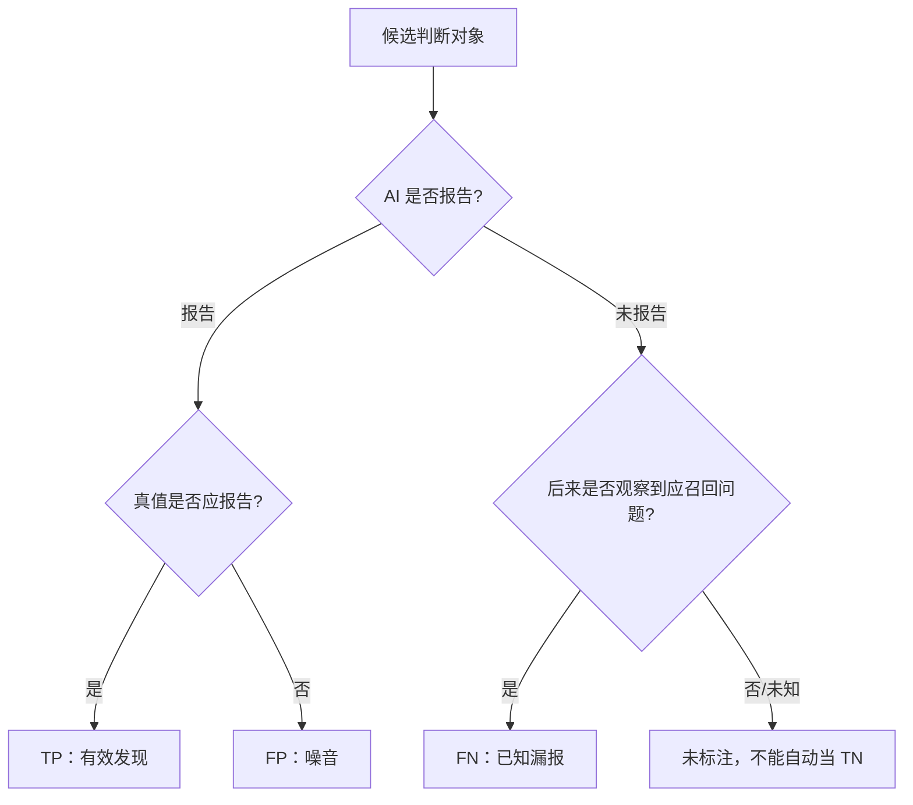

图中“未标注”是评估工程的关键。只要真值集合不完整，Recall 就是对“已知应召回问题”的召回，不是对所有潜在缺陷的绝对召回。

## Precision：报告出来的有多少值得保留

scikit-learn 给出的定义是：

`Precision = TP / (TP + FP)`

假设 AICR 报告 10 条可判定问题，其中 6 条经确认应报告，4 条被确认不应报告，Precision 是 `6 / 10 = 60%`。它回答“AI 开口时有多可靠”。[1]

在真实 AICR 产品中，团队常用“采纳率”近似观察 Precision：开发者采纳建议，通常说明评论有用；开发者拒绝，可能说明评论不成立。这个映射有价值，却不严格等价。

一条正确建议可能没被采纳，因为当前发布窗口不允许重构，作者已经用另一种方式修复，或建议代码不可用。一条建议也可能被机械接受，却没有解决根因。采纳是行为信号，Precision 是相对真值的分类指标。课程后文会继续使用“采纳率”，但每次都说明它是工程代理指标。

## Recall：应该发现的有多少被找到

通用定义是：

`Recall = TP / (TP + FN)`

若真值集有 12 个应报告问题，AICR 找到 6 个，Recall 是 `6 / 12 = 50%`。它回答“系统漏掉多少”。[1]

Recall 的**分母不能从 AI 自己的输出构造**。只统计 AI 报告的问题，永远看不到 FN。必须从独立来源补真值，例如人工 CR 已采纳问题、测试阶段确认的缺陷、回归事故、专家标注的 Benchmark，或带故障注入的评估集。

不同真值来源的观察窗口不同。人工 CR 更容易发现可读性、架构和局部逻辑问题；测试 Bug 更接近可执行行为；线上事故偏向高影响问题。把它们合并前要去重、归属并限定应召回范围。

## F1：同时惩罚噪音与遗漏

当 Precision 和 Recall 同等重要，F1 是二者的调和平均：

`F1 = 2 × Precision × Recall / (Precision + Recall)`

若 Precision 为 60%，Recall 为 50%，F1 约为 54.55%。调和平均会被较低的一侧明显拉低。一个系统 Precision 90%、Recall 10%，F1 只有 18%；这比算术平均 50% 更能暴露失衡。[1]

F1 仍不是“总体质量分”。它没有直接表达问题严重度、审查延迟、成本、覆盖文件和人工标注质量。两个系统 F1 相同，一个可能只报告高危问题，另一个覆盖大量风格建议。只有在同一数据窗口、真值集合、过滤规则和聚合方式下，F1 才适合比较。

还可以使用 Fβ 调整 Precision 与 Recall 权重。安全审查可能更怕漏报，选择 β>1；高噪音会让开发者关闭工具的场景可能更重 Precision，选择 β<1。本课程采用 F1 建立共同语言，不意味着所有仓库都应把两者权重设为相同。

## 先定义统计单位

在写 SQL 前，先回答“一个样本是什么”。候选单位至少有四种：Issue、文件、MR、任务。

Issue 级适合计算采纳率，因为一条评论有独立反馈。文件级适合观察覆盖，例如 20 个有效文件中有多少被审查。MR 级适合看一次变更是否出现至少一个有效问题。任务级适合远端队列和端到端完成率。

不能把单位混在一个分母里。例如分子是“采纳 Issue 数”，分母却是“有反馈 MR 数”；或趋势图一周按 Issue 计算，下一周改为按 MR 平均。名称仍叫采纳率，数值已经不可比。

本章主要使用 Issue 级采纳率与 Issue/Bug 混合的案例召回率。混合分母并非纯分类 Benchmark，它是当前工程看板的覆盖代理。我们会明确指出这一点。

## 当前**采纳状态不是一个布尔值**

真实协作中，建议不只有采纳和拒绝。案例代码的 `is_applied` 使用分段枚举保存反馈来源与可判定性。

| 状态 | 含义 | 当前正式采纳率 |
| --- | --- | --- |
| `0` | 人工标记未采纳 | 进入分母，不进分子 |
| `1` | 人工标记采纳 | 进入分母和分子 |
| `2` | 行级算法自动识别完全采纳 | 当前排除 |
| `3` | 行级算法自动识别完全未采纳 | 当前排除 |
| `4` | 外部生码/协作流程标记采纳 | 进入分母和分子 |
| `5` | 外部流程经确认未采纳 | 进入分母，不进分子 |
| `50` | 建议代码为空或不完整，无法自动检测 | 排除 |
| `51` | 仅注释建议 | 排除 |
| `52` | 文件已删除 | 排除 |
| `53` | MR 中低分问题无反馈，无法判断 | 排除 |
| `60–69` | 1%–99% 的部分采纳区间 | 当前排除 |
| `null` | 尚未检测或没有反馈 | 排除 |

旧版设计把部分低数字用于别的含义。当前课程以代码枚举为事实源。任何看板或历史报表若沿用旧解释，都必须带版本，否则状态 4/5 会被误读。

正式统计常量把 `[1, 4]` 作为已采纳，把 `[0, 5]` 作为未采纳，有效分母状态就是 `[1, 4, 0, 5]`。自动识别 2/3 被注释排除，部分采纳 60–69 也不进入当前正式分母。

这项选择牺牲了样本量，换取更清楚的反馈来源。它不代表自动检测没有价值。自动状态可用于运营提示、抽样和后续标注，只是当前正式口径没有把它与明确反馈混合。

## 当前采纳率的完整过滤链

代码中的采纳率可以写成集合表达：

`Adoption = count(status ∈ {1,4}) / count(status ∈ {0,1,4,5})`

但进入这个集合前还有过滤条件：

1. Session 创建时间位于统计窗口。
2. Issue 的 `score >= 4`。
3. `is_applied` 属于四个正式分母状态。
4. `is_valid` 为 1 或 `null`；明确无效的 0 被排除。

第四点很容易被口头描述成“只统计有效问题”，实际代码更准确的说法是“排除明确判无效的问题，同时保留尚未验证的 null”。如果未验证样本比例随时间变化，采纳率也会受影响。看板应同时展示 `is_valid=null` 的数量，而不是把它藏在分母里。

评分阈值同样改变指标。2–3 分建议即使有反馈，也不进入当前正式采纳率。这样可以聚焦高风险或高价值问题，但不能拿结果回答“全部评论中多少被采纳”。指标名称最好写成“4–5 分明确反馈采纳率”。

### 一个混合状态教学样本

下面有 12 条脱敏 Issue。它们是教学构造，不是生产数据。

| Issue | score | status | is_valid | 处理 |
| --- | ---: | ---: | ---: | --- |
| A 错误变量引用 | 5 | 1 | 1 | 正式分子、分母 |
| B 资源未释放 | 4 | 4 | 1 | 正式分子、分母 |
| C 场景不存在 | 4 | 0 | 1 | 正式分母 |
| D 修复建议不可用 | 5 | 5 | 1 | 正式分母 |
| E 建议代码完全匹配最终文件 | 5 | 2 | 1 | 自动状态，排除 |
| F 建议代码未匹配 | 4 | 3 | 1 | 自动状态，排除 |
| G 部分采用另一种写法 | 4 | 65 | 1 | 部分采纳，排除 |
| H 没有可比较的建议代码 | 5 | 50 | 1 | 无法检测，排除 |
| I 二次复核判为无效 | 5 | 1 | 0 | 明确无效，排除 |
| J 低分维护建议 | 3 | 1 | 1 | 低于阈值，排除 |
| K 尚未反馈 | 5 | null | null | 无正式状态，排除 |
| L 明确采纳但尚未做有效性复核 | 4 | 4 | null | 当前代码纳入分子、分母 |

正式分母是 A、B、C、D、L，共 5 条；分子是 A、B、L，共 3 条。采纳率为 `3 / 5 = 60%`。

若把自动状态 2/3 加入，分母变成 7，分子变成 4，结果约 57.14%。若再把部分采纳按“采纳”加入，结果又变。没有哪个数字天然更真实，只有定义是否匹配用途、来源是否可靠、版本是否稳定。

### 为什么自动检测暂不等于人工反馈

当前自动检测会清理注释和空行，对建议代码与最终文件做行级 [[LCS]] 比较。100% 匹配可判完全采纳，0% 可判未采纳，中间映射到 60–69 的部分区间。

LCS 能识别建议片段是否出现在最终文本，却不能判断语义等价。开发者可能换变量名、移动代码、用库函数重写，行为相同但文本不匹配；短片段如 `return null` 可能在文件其他位置碰巧出现，形成冲撞。注释类和文件删除因此有专门的无法判断状态。

自动检测适合做候选标签，不应在未校准前与人工确认等权混合。可以抽样比较自动状态与人工反馈，按代码长度、语言和改写类型测 Precision，再决定哪些区间进入正式口径。

## 当前召回率是怎样构造的

代码中有两个召回代理：

`综合召回率 = AI CR 已采纳 / (AI CR 已采纳 + 人工 CR 已采纳 + 应召回 Bug)`

`纯 CR 召回率 = AI CR 已采纳 / (AI CR 已采纳 + 人工 CR 已采纳)`

这里把 AI 已采纳近似视为 TP，把人工 CR 已采纳和后续应召回 Bug 近似视为 FN。它的优点是能连接研发流程中的现成反馈；局限是三类数据未必构成完整且互斥的真值集。

同一问题可能先被 AI 提出，又被人工重复评论；如果没有去重，会同时进入分子和分母。人工审查没有发现的问题并不自动不存在；测试 Bug 可能由环境、需求或集成问题引起，不一定属于代码审查范围。因此 Bug 先经过 `should_recall` 判断。

当前 Bug 统计还要求 `owner_role` 为 FE 或 BE。PM 和 unknown 被排除。角色过滤能减少不属于研发代码审查的问题，却会引入归属偏差：无法正确识别角色的真实缺陷不会进入分母。看板应同时展示被排除数量和原因。

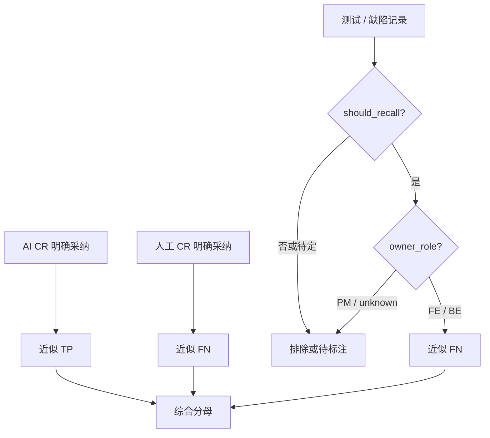

### 召回率教学样本

假设一个统计窗口中有 6 条 AI 已采纳高分问题、3 条仅由人工 CR 发现并采纳的问题、3 个经确认应由 AICR 召回且归属 FE/BE 的 Bug。

综合召回率是 `6 / (6 + 3 + 3) = 50%`。纯 CR 召回率是 `6 / (6 + 3) ≈ 66.67%`。

如果该窗口采纳率 Precision 代理为 60%，采用综合 Recall 50%，F1 约为 54.55%。采用纯 CR Recall 66.67%，F1 约为 63.16%。同一个系统得到两个 F1，原因不是公式不稳定，而是 Recall 分母不同。报告必须把“含 Bug”或“不含 Bug”写进名称。

若 Bug 中还有 2 个 `unknown` 归属被排除，不能写“系统只漏了 6 条”。准确表达是：当前综合分母包含 6 条已知 FN，另有 2 条因归属未进入口径。排除项是结果的一部分。

## 用补充工作簿理解抽样偏差

课程案例包含两份已采纳测试集，共 34 条问题；另有一份定向收集的拒绝集合，共 44 条。已采纳集包含规范、健壮性和可维护性问题，拒绝集大多是健壮性建议，常见拒绝原因包括场景不存在、业务约束已保证、方法内部已有处理、组件推荐写法，以及方向正确但修复不可用。

一个诱人的计算是 `34 / (34 + 44) ≈ 43.59%`，然后把它称为采纳率。这是错误的。前两份工作簿按“已采纳测试问题”收集，第三份按“Bad Case 和未采纳”定向收集，抽样概率完全不同。把两个选择机制拼在一起，分母不代表任何自然流量窗口。

这些数据适合做什么？它们适合建立分类法、设计回归用例、训练标注者和演示状态计算。它们不适合估计生产总体比例。若要计算采纳率，应从一个固定时间窗内的全部符合条件 Issue 开始，再按同一规则标注状态。

这个例子说明，样本数量再明确，也不等于样本可用于某个指标。每份评估集都要记录来源、选择条件、时间窗、去重方式和用途。
## 从单一比例升级为指标面板

一个可用面板不需要几十个 KPI，但不能只放 F1。

### 质量指标

展示 4–5 分明确反馈采纳率、含 Bug 与不含 Bug 的召回代理、F1、明确无效率、部分采纳率和无法判断率。每个指标旁边显示分子、分母，不只显示百分比。

### 覆盖指标

展示有效文件数、已分批文件数、完成 Batch、排除文件、被审查 diff 行和未覆盖原因。流程完成率能帮助区分“模型没发现”和“任务根本没审到”。

### 反馈质量

展示有反馈 Issue 占比、`is_valid=null` 占比、自动状态与人工状态一致率、Bug `unknown` 归属占比。没有足够反馈时，采纳率可能只反映愿意点击的少数用户。

### 系统指标

展示端到端耗时、每 Batch 耗时、重试、失败、超时、模型与工具成本。质量提升若以不可接受的等待和成本为代价，也需要明确权衡。

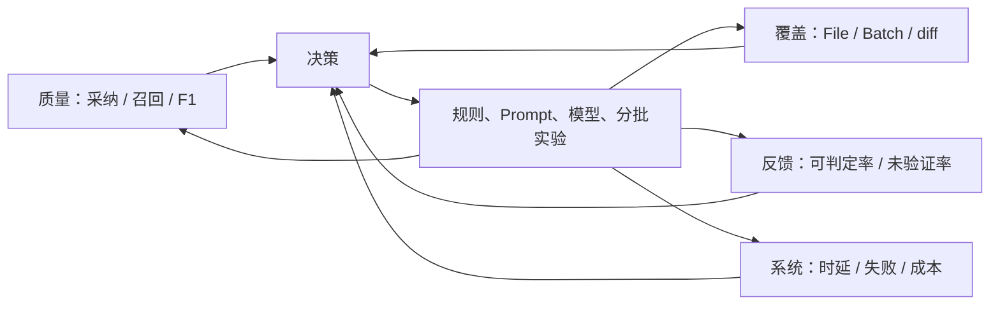

面板的目的不是让所有数字同时上涨。更常见的情况是：增加复核后 Precision 上升，Recall 下降；增加批次后 Recall 上升，时延和成本增加；扩大规则后覆盖上升，无法判断率也上升。指标帮助团队看见权衡。

## 怎样比较两个版本

假设版本 B 的采纳率从 60% 升到 70%。在宣布提升前，至少检查七件事。

第一，统计窗口是否覆盖相近的仓库、语言和改动规模。第二，score 阈值和状态枚举是否相同。第三，`is_valid=null` 占比是否变化。第四，有反馈比例是否相近。第五，是否有同一 Issue 去重。第六，Bug 归属和 `should_recall` 规则是否变化。第七，模型、Prompt、规则、批次、复核是否同时修改。

最可靠的比较是在同一冻结测试集上运行 A/B，并对真实流量做分层观察。冻结集给可复现结果，真实流量验证外部有效性。若只能做前后对比，报告要列出变化因素，避免把相关变化归因给某一个模型版本。

比例还需要样本量。2 条中采纳 2 条是 100%，200 条中采纳 160 条是 80%，前者并不提供更强证据。课程不要求推导置信区间，但工程报告至少展示分子分母，并对小样本标记“观察中”。

## **指标会被优化，也会被钻空子**

只追采纳率，系统可能减少评论，只报告最显而易见的问题；只追召回率，系统可能报告大量候选，把判断成本转给开发者；只追 F1，团队可能通过调整真值范围让数字好看。

因此指标必须绑定行为边界。采纳率旁边看覆盖与报告数量；召回率旁边看 Precision 与人工负担；F1 旁边看严重度分层、无法判断和成本。质量门不能以“达到某百分比”自动赋予高风险合并权。

反馈机制也会改变行为。若拒绝评论需要填写很长表单，用户只会对最糟糕的建议反馈；若采纳按钮能一键应用，采纳信号会混入便利性偏差。收集界面是评估系统的一部分。

## 一份可版本化的指标契约

在写指标契约之前，还需要解决三个常见工程问题：分层统计、反馈状态流和实验判读。它们决定一个公式能否变成持续运行的评估系统。

## **不要让总体平均掩盖失败区域**

假设总体采纳率是 70%，前端问题 85%，后端问题 40%。只展示总体值会让后端用户觉得看板与体验矛盾。AICR 的表现通常随语言、仓库、问题类型、严重度、diff 规模和批次位置变化，因此必须分层。

有用的分层不是越多越好。每增加一个维度，样本就更稀疏。优先选择能对应工程动作的维度：按 category 可以调整规则与上下文；按 score 可以校准严重度；按 Batch 位置可以观察长任务后段衰减；按仓库和语言可以选择模型、静态分析器与基线；按拒绝类型可以决定复核和记忆策略。

例如，“健壮性问题采纳率低”仍然太宽。继续看拒绝类型，可能发现一半是 `already_handled`，说明审查器没有阅读被调用方法；另一半是 `bad_fix`，说明发现方向正确但修复生成差。前者需要上下文检索，后者需要把问题判断与修复建议分开验收。一个总体比例无法给出这两种动作。

严重度分层还应检查校准。若 5 分评论的采纳率反而长期低于 3 分，可能是评分模型过度自信，也可能是 5 分集中在难判的业务问题。不能只因为 score≥4 被称为“高风险”，就假设它已经经过概率校准。

### 宏平均与微平均

多个仓库聚合时有两种常见方法。微平均把所有 Issue 放在一起计算，大仓库权重更高；宏平均先算每个仓库的比例，再对仓库等权平均，小仓库影响被放大。

仓库 A 有 900 条反馈，采纳 630 条；仓库 B 有 10 条反馈，采纳 1 条。微平均是 `631 / 910 ≈ 69.34%`，宏平均是 `(70% + 10%) / 2 = 40%`。两个结果回答不同问题：前者代表总体 Issue 流量，后者代表“一个典型仓库”的平均表现。

scikit-learn 也提醒，多分类与多标签下不同平均方式不会得到等价结果。[1] AICR 看板必须保存聚合方式。团队级趋势可用微平均，仓库推广评估同时看宏平均和每仓库分布。

### 严重度加权不是随意乘分数

有人会用 `score × issue_count` 构造加权 Recall。这样做隐含“5 分损失是 1 分的五倍”，通常没有证据。更稳妥的做法是分层报告 4 分、5 分 Precision/Recall，或根据事故成本定义经评审的权重，并做敏感性分析。

加权 F1 也不能掩盖某一类完全失效。安全问题样本少，总体加权后可能几乎看不见。高风险类别应设置单独底线和人工审查，而不是期待综合分数自动保护。

## **反馈状态是一条生命周期**

Issue 创建时 `is_applied=null`，表示尚无采纳判断。之后可能经过自动检测得到 2、3、50–53 或 60–69，也可能被人工标为 0/1，或由外部流程写入 4/5。状态不是互斥数据源的简单终点，它们可能按时间覆盖。

当前代码允许外部明确反馈覆盖自动、旧外部、无法检测和部分采纳状态，但保留人工 0/1。这体现了证据优先级：明确人工反馈高于文本匹配推断。实现时还要保存状态来源与更新时间，否则只看最终数字无法解释覆盖过程。

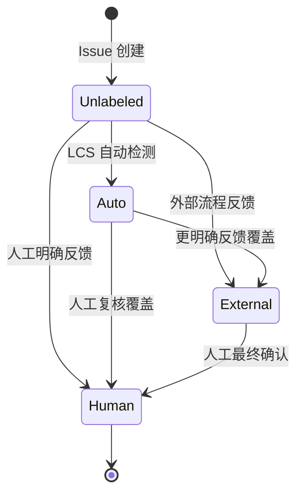

图中 `Auto` 代表 2/3、50–53、60–69 的一组状态，不表示它们语义相同。真正的数据模型最好拆出 `adoption_value`、`adoption_source`、`confidence` 和 `checked_at`，或维护事件表。单个整数能兼容旧系统，却让查询者必须记住编码区间。

反馈状态流还会产生删失问题。统计窗口结束时，近期 Issue 更可能仍是 null，因为开发者还没完成修改或反馈。若按 Session 创建时间直接比较最近一周与上月，最近一周的可反馈样本可能只包含处理最快的问题。可以设置成熟窗口，例如只统计创建后满七天的 Issue，或按反馈发生时间另做视图。

## 从 Issue 到可审计查询

指标查询不应只存在一段难读 SQL。可以先写成集合管道，再实现和测试。

```text
source = issues linked to sessions in the time window
high_value = source where score >= 4
not_invalid = high_value where is_valid is 1 or null
explicit = not_invalid where status in [0, 1, 4, 5]
adopted = explicit where status in [1, 4]

adoption_rate = count(adopted) / count(explicit)
```

每一行都应输出中间计数。假设 source 1000 条，high_value 400，not_invalid 360，explicit 120，adopted 72，最终 60% 的同时还应看到明确反馈覆盖只有 `120 / 360 = 33.3%`。没有这个覆盖率，读者可能把 60% 理解为 360 条问题的整体表现。

查询需要固定去重键。案例 Issue 有由 Session、分支、文件、类别和行号构成的 issue key，但同一根因可能出现在相邻行或被不同规则重复报告。精确哈希解决重复写入，不一定解决语义重复。评估集可以增加 `root_cause_id`，由标注者把同一根因聚合。

还要测试空分母。没有明确反馈时，结果应为 null 或“数据不足”，不能显示 0%。0% 意味着有可判定样本但没有采纳，和没有样本完全不同。代码不同接口有时返回 0、有时返回 null，课程建议统一面板语义并明确迁移。

## 为优化建立最小实验

第 4–7 章会修改规则、上下文、复核、批次和质量门。每次改造都应从一个可证伪假设开始。

假设：“`already_handled` 拒绝较多，因为模型没有读取被调用方法。”处理组给 Agent 符号定义和一层调用上下文，对照组保持原输入；其他模型、Prompt、分批和时间窗口尽量不变。主要指标看该拒绝类型的 Precision 代理，护栏指标看 Recall、时延和令牌成本。

另一个假设：“大任务后段漏报增加，因为 Batch 过大且完成证明不足。”可以在固定 Benchmark 上比较两种批次范围，记录每个 Batch 位置的 Recall、重复问题、时延和失败。若只看整任务平均，后段改善可能被前段高分掩盖。

实验单位必须防止污染。对同一 MR 同时运行两版而把两版评论都展示给开发者，反馈会互相影响。可以离线双跑，或按仓库/用户分流；任何在线实验都需要说明风险与人工兜底。

结果也要区分统计显著与工程意义。即使样本足够让 1 个百分点差异稳定，如果它换来两倍成本，未必值得上线；样本较小但发现高危漏报，则可能先采取保守防护再继续收集。指标辅助决策，不替代风险责任。

## **评估数据本身也需要质量门**

模型输出有质量门，标签同样需要。至少检查必填证据、问题是否落在评估范围、重复根因、状态来源、标注者和仲裁结果。Bug 数据还要检查任务关联、`should_recall` 理由和 owner_role 置信度。

当标注规则变化时，不要直接覆盖旧标签。保存 `label_version`，对固定 Benchmark 做迁移报告：多少样本改变，旧版与新版指标差多少。否则一次标签清洗会在趋势图上伪装成模型提升。

Bad Case 回流也不能“见一个加一个”后立即评测。若某条漏报同时变成 Prompt 规则和测试样本，系统记住答案后通过不代表泛化。可以把同类问题的一部分用于规则开发，另一部分保留为盲测，并定期加入时间上更新的样本。

最后，评估集要有删除机制。过时 API、废弃框架和已取消的团队规则会让系统被迫优化无效目标。删除需要记录原因和版本，不是为了抬高分数悄悄移除失败样本。

建议为每个正式指标保存一份契约，而不是只在看板 SQL 中维护。

契约应包含名称和版本、统计单位、时间字段、过滤条件、分子状态、分母状态、去重键、无法判断处理、真值来源、角色范围、聚合方式和已知偏差。修改任一项就发布新版本，并保留旧版本一段时间做双算。

以当前采纳率为例，可以命名为 `adoption_high_risk_explicit_feedback_v2`：Issue 级；按 Session 创建时间；score≥4；状态 0/1/4/5；分子 1/4；排除 `is_valid=0`，保留 `null`；按 issue key 去重。名字虽然长，却比“采纳率”更不容易被误用。

综合召回率可以命名为 `recall_proxy_ai_manual_bug_fe_be_v2`，明确它是 proxy，不是完整 Benchmark Recall。报告中同时给 `cr_recall_proxy`，让读者知道含 Bug 与不含 Bug 的区别。
## 建立可信真值集

召回率工程的第一步不是调模型，而是建立能暴露漏报的真值集。定义应召回范围：正确性、安全、兼容、性能是否必召回；维护建议和风格问题是否纳入；只统计 diff 引入的问题还是也统计被改动暴露的历史问题。范围不清时，标注者会把个人偏好当真值。

每个真值问题应包含：最小代码、改动上下文、问题描述、为何成立、严重度、期望定位和可接受修复方向。只保存一句人工评论可能缺少隐含语境。CodeReviewQA 研究将评论理解拆成变更类型识别、位置定位和方案识别，正是说明"生成相似文本"不足以定位模型失败。

高风险样本至少由两名有领域知识的人独立判断，分歧项记录原因并仲裁。标注指南随分歧演进，旧样本需按新规则回扫。


## F-Score 的加权变体与使用边界

F1 假设 Precision 和 Recall 同等重要，但不同场景有不同侧重。安全审查场景更怕漏报——漏掉一个 SQL 注入可能比多报十个误报严重得多。此时应该使用 Fβ，β>1 给 Recall 更高权重。高噪音导致开发者关闭工具的场景更怕误报——此时 β<1 给 Precision 更高权重。

Fβ 的计算公式为 `(1+β²) × Precision × Recall / (β² × Precision + Recall)`。当 β=2 时 Recall 的权重是 Precision 的 4 倍——这意味着系统宁可多报也不漏报。当 β=0.5 时，Precision 的权重是 Recall 的 4 倍——系统宁可漏报也不多报。

课程中统一使用 F1 建立共同语言，不意味着所有仓库都应把两者设为相同权重。但选择不同 β 之前需要先确认：你有足够证据证明漏报的代价确实是误报的 N 倍吗？这个 N 是经验估算还是有事故成本数据支撑？如果答案是否定的，F1 作为起点比拍脑袋选一个 β 更可靠。


## 一份可以签名的指标契约模板

将以上所有讨论凝结为一份可实操的指标契约模板。在你的团队启动 AICR 建设时，先填这张表，而不是先写 SQL。

| 字段 | 采纳率示例 | 召回率示例 |
| --- | --- | --- |
| 名称 | adoption_high_risk_v2 | recall_proxy_ai_cr_bug_v2 |
| 统计单位 | Issue 级 | Issue/Bug 混合级 |
| 时间字段 | Session.created_at | Session.created_at |
| 分子条件 | status ∈ {1,4}, score ≥ 4, is_valid ≠ 0 | AI 已采纳 Issue（同上过滤） |
| 分母条件 | status ∈ {0,1,4,5}, score ≥ 4, is_valid ≠ 0 | AI 已采纳 + 人工 CR 已采纳 + should_recall Bug（FE/BE only） |
| 排除项 | 自动采纳(2/3)、部分采纳(60-69)、null、is_valid=0 | PM/unknown Bug、not_recall Bug、pending Bug |
| 去重键 | session_id + file_path + line + category | 同上 + root_cause_id（如标注可用） |
| 聚合方式 | 微平均（按 Issue 总量） | 微平均（按 Issue 总量） |
| 已知偏差 | 排除 null 可能高估采纳率 | 角色归属偏差：无法识别角色的真实缺陷不进入分母 |
| 显示要求 | 百分比 + 分子/分母 + is_valid=null 占比 | 百分比 + 分子/分母 + pending Bug 占比 |

这份模板的价值不在于填得多快，而在于**让每个看到指标的人都能追溯"这个数字是怎么来的"。** 如果团队换了一个人维护看板，他应该能从这份契约中完整重现每个数字，而不是对着一段 SQL 猜测当初的设计意图。


## 严重度分层的统计陷阱

并非所有应召回问题同等重要。一个会导致数据丢失的并发 Bug 和一个会影响可读性的命名建议，在混淆矩阵中都是"应报告"，但它们的业务影响相差几个数量级。

如果只看总体 Precision/Recall，系统可能在安全和高危问题上表现很差，但被大量低严重度问题的良好表现所掩盖。解决方案是按严重度分层报告指标。

| 严重度 | 应召回范围 | 最低 Recall 要求 | 最低 Precision 要求 |
| --- | --- | --- | --- |
| 5 分（严重缺陷） | 必须召回 | ≥ 70% | ≥ 50% |
| 4 分（潜在风险） | 应召回 | ≥ 50% | ≥ 60% |
| 3 分（建议） | 可选 | 不设定 | ≥ 80% |

分层之后，你会看到真实的问题分布。一个系统可能总体 Recall 60%，看起来还不错。但拆开看：5 分问题 Recall 只有 30%，4 分问题 Recall 70%。**总体平均掩盖了系统在最需要可靠性的领域表现糟糕的事实。**

分层统计的另一个用途是发现评分漂移。如果 5 分问题的采纳率长期低于 4 分问题的采纳率，可能不是 5 分建议本身更差，而是评分模型把"难以判断的业务问题"都标成了 5 分。这类问题需要人工复核评分校准，而不是调整采纳率公式。

## 从一天的度量数据到一季度的趋势

指标的价值不在单点。单日采纳率从 65% 降到 60%，可能只是统计波动。但如果连续四周趋势都指向同一方向，那就有系统性的变化在发生。

建议为每个核心指标建立趋势图，用 7 天和 30 天滑动窗口显示。叠加标注事件：模型升级日、规则变更日、质量门开启日、新仓库接入日。这样当趋势出现拐点时，可以快速定位可能的原因。

季度趋势的另一个用途是设定改进目标。如果 Q1 的采纳率基线是 58%，Recall 是 38%，那么 Q2 的合理目标可能是采纳率 63%（+5pp）、Recall 43%（+5pp）。数值不是拍脑袋定的——它来自对拒绝样本的根因分析和对改进手段的预期影响评估。第 4-7 章会详细展开如何从根因诊断到目标设定。


## 从度量到行动：第三章节的定位

第 3 章到此结束了所有度量体系的建设。本章不是一门统计课——它是一组工程决策的前置条件。每一个公式、每一个状态枚举、每一个过滤规则，都将在后续章节中反复出现。第 4 章用拒绝样本的诊断类型来回答"为什么采纳率低"，第 6 章用衰减信号来回答"为什么召回率低"——这两个问题只有在定义了采纳率和召回率之后才有意义。

如果你只记住了本章的一个原则，记住这条：**指标的数字不取决于公式，取决于口径。** 口径决定了你看到什么，也决定了你看不见什么。选择什么进入分子、什么进入分母、什么被排除——这些选择塑造了你优化什么、忽略什么。第 4 章开始，你会反复验证每一个工程动作是否真的改变了这些数字，还是仅仅改变了定义这些数字的口径。


## 参考文献
1. scikit-learn. [Model evaluation: precision, recall and F-measures](https://scikit-learn.org/stable/modules/model_evaluation.html#precision-recall-and-f-measures).
2. Hong Yi Lin 等. [CodeReviewQA: The Code Review Comprehension Assessment for Large Language Models](https://arxiv.org/abs/2503.16167). Findings of ACL, 2025.
3. Tao Sun 等. [BitsAI-CR: Automated Code Review via LLM in Practice](https://arxiv.org/abs/2501.15134). 2025.
4. Zhiyu Li 等. [Automating Code Review Activities by Large-Scale Pre-training](https://arxiv.org/abs/2203.09095). ESEC/FSE, 2022.


---

# 第 4 章　采纳率低：问题为什么看起来对，却没人采用

> 预计学习时间：85–105 分钟
> 一句话总结：低采纳率通常不是一个模型问题，而是一组可以沿规则、上下文、建议和反馈证据逐层定位的系统问题。

## 先看四条“没有明显错误”的建议

同一批代码审查里出现了四条候选问题。为了公开教学，代码与业务名已经改写，但拒绝理由保留了原始结构。

第一条说：“请求头可能为空，直接访问字段会触发 panic，建议提前返回。”开发者拒绝，因为空请求头在这条业务链里并不表示非法输入，转换函数仍需产出一个可继续处理的对象。AI 发现了语言层面的空指针风险，却把业务允许的空状态当成了异常状态。

第二条说：“某个对象可能为空，应在调用前补一次检查。”开发者指出，被调用方法内部已经处理了空值。建议如果被执行，不会改善正确性，只会让同一条件在两层代码里重复出现。

第三条说：“表单校验仍使用 callback，应该改成 Promise。”这符合常见开源组件的新版本写法，但当前项目使用的组件封装仍推荐 callback。AI 把公共生态的默认知识覆盖到了本仓库的真实契约上。

第四条正确指出一个异步调用没有 `await`，但给出的修复是直接加 `await`。开发者实际需要的是不阻塞主流程，并在被调用方法内部捕获错误。问题方向有价值，修复方案却改变了时序语义。

这四条评论都能写得很像专业 Code Review。词句流畅，风险描述也有因果关系。它们仍然不值得直接采纳。真正缺少的不是“再解释得详细一点”，而是能证明建议适用于当前改动的仓库证据。

上一章把采纳率定义成 Precision 的工程代理。本章开始处理一个更棘手的事实：未采纳不是单一标签。它可能表示误报、已有处理、业务不同意、修复不可用、问题价值太低，也可能只是反馈来得太早。先把这些原因拆开，后面的优化才不会变成盲目改 Prompt。

## 44 条拒绝样本告诉了我们什么

课程案例包含一组定向收集的 44 条拒绝建议。其中 43 条被归为健壮性问题，1 条被归为安全问题。这个分布不能代表真实生产总体，因为样本就是为了收集 Bad Case 和未采纳案例而建立的。它适合回答“常见拒绝机制有哪些”，不适合回答“某类问题在生产中占多少”。

逐条阅读拒绝证据后，可以把样本归入下面七类。一个样本可能同时命中两类，分类目的是选择验证动作，不是制造互斥统计。

| 诊断类型 | 候选建议的典型说法 | 开发者提供的反证 | 首先检查什么 |
| --- | --- | --- | --- |
| 场景不存在 | “如果字段为空会失败” | 类型、入口或数据生成逻辑保证该状态不会出现 | 类型定义、构造路径、系统边界 |
| 已有处理 | “这里缺少校验或提示” | 上游、下游或公共方法已处理 | 调用链与被调用方法 |
| 业务语义误判 | “应该按角色返回不同值” | 业务明确要求取更晚时间或允许空状态继续 | 需求、测试、领域命名 |
| 框架契约误判 | “旧 API 必须迁移到新写法” | 项目封装、组件版本或注解定义了不同契约 | 依赖版本、封装源码、项目规则 |
| 修复不可用 | “增加 await、默认值或互斥锁” | 改变时序、破坏配置语义，或保护了并不共享的数据 | 建议代码的行为差异 |
| 重复或过时 | “再次报告相同风险” | 历史会话已报告，或当前版本已用其他方式修复 | 历史 Issue 与当前文件 |
| 价值不足 | “补充额外防御、注释或抽象” | 风险很低，修复成本和噪音高于收益 | 严重度、触发概率、影响范围 |

这一组样本有一个很稳定的特征：许多评论不是语言知识错了，而是适用条件错了。`nil` 会导致解引用失败是语言事实；“这个对象在此路径可能为 nil”是仓库事实；“遇到 nil 应直接返回”又是业务决策。AI 经常把第一层事实直接跳到第三层结论。

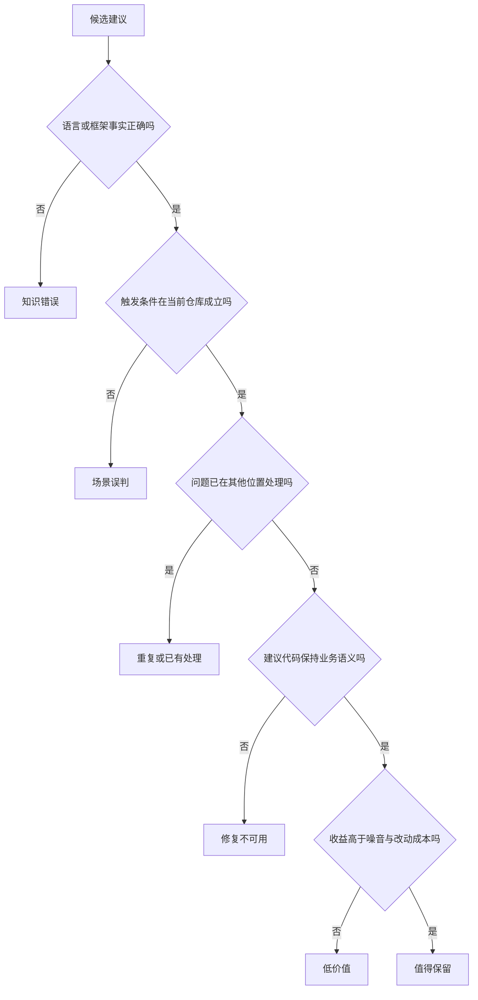

这棵树比“采纳/未采纳”多走了几步，却给出了可行动的结果。知识错误需要修规则或模型；场景误判需要上下文；已有处理需要调用链和历史过滤；修复不可用要把问题判断与建议代码分开验收；低价值则要校准严重度和报告门槛。

## 采纳率低不是一个根因

### 规则缺失：系统不知道团队认为什么重要

不同仓库对同一写法可能有相反判断。某个前端项目要求所有用户可见文案进入国际化函数；另一个项目的管理端脚本可能允许硬编码。某个后端团队禁止手写 SQL；另一个模块可能因为兼容旧查询层而暂时允许。若审查器只收到通用规则，它只能用训练数据里的常见偏好填空。

规则缺失会产生两种噪音。第一种是把团队允许的写法判错，例如强制把 callback 改成 Promise。第二种是把真正重要的项目约束降成普通建议，例如仓库明确禁止动态拼接国际化文案，模型却只给 2 分风格评论。

诊断规则缺失不能只问“有没有规则文件”。还要看三个证据：当前问题是否命中明确规则 ID；规则是否描述了适用条件；规则与正反例是否进入了这一批 Prompt。一个文件存在磁盘上，但加载失败、解析为空或没有被注入，运行效果仍等于没有规则。

课程案例的 `promptBuilder.ts` 会组合基础角色规则、规则库中的系统条目和仓库级 Cursor Rules。这个实现说明规则不是一段大 Prompt，而是多个来源在运行时装配。第 5 章会继续拆这三层怎样分工。

### 上下文不足：模型看见了 Diff，却没看见事实

Diff 能回答“这几行改了什么”，很难独立回答下面的问题：

- 这个字段由谁构造，是否真的可能为空？
- 被调用方法是否已经处理错误或设置了默认值？
- 当前组件是公共版本，还是团队二次封装？
- 这个配置允许为 0，是异常还是有意关闭？
- 同一需求的上一轮修改是否已经解决该问题？

Bad Case 中的“已有可选链”“方法内部已有空处理”“配置会在启动时校验”“只有当前协程更新该字段”，都需要 Diff 之外的证据。只把更多相邻行塞给模型并不够。需要的是与待验证假设有关的上下文：符号定义、一层调用方和被调用方、类型注解、项目规则、依赖版本、测试与需求约束。

可以把上下文不足分成检索失败和判断失败。检索失败是没有拿到正确文件；判断失败是拿到了文件，却没有把其中的保证用于结论。两者的修复完全不同。前者要改文件关联或工具调用，后者要让 Recheck 明确验证假设，并保存使用了什么证据。

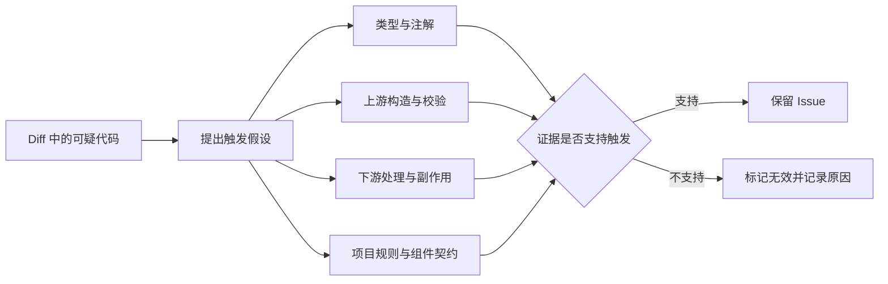

图里最重要的是“提出触发假设”。如果只让 Agent 漫无目的地搜索仓库，它会收集很多相关文本，却未必能推翻自己的第一判断。好的验证问题应该可以被证伪，例如：“`accountInfo` 是否存在任何返回成功但字段为空的构造路径？”而不是“请检查更多上下文”。

### 问题判断和修复建议绑得太紧

一条评论可能发现方向正确，建议代码却不适用。异步调用缺少错误处理是问题；是否加 `await` 取决于调用方是否应等待。配置缺少检查可能值得关注；是否提供默认值取决于配置错误时系统应该失败还是继续。共享对象的写入值得检查；是否加锁取决于是否真有多个并发写者。

如果评估只问“是否照着 improve_code 修改”，这类评论会被当成完全错误。更合理的内部判断至少拆成四项：

| 维度 | 判断问题 | 可能结果 |
| --- | --- | --- |
| 定位 | 文件和代码位置对吗 | 正确、偏移、与本次变更无关 |
| 风险 | 描述的失败机制成立吗 | 成立、不成立、证据不足 |
| 严重度 | 触发概率和影响是否配得上分数 | 合理、过高、过低 |
| 修复 | 建议保持当前业务与时序语义吗 | 可直接用、需改写、不可用 |

采纳反馈目前往往只有一个状态，因此诊断时要结合拒绝原因和最终代码。若大量样本是“方向对，修复不对”，继续增加规则可能没有帮助；应该让审查器先给出证据和最小修复约束，再生成代码建议，或者把修复建议交给独立步骤复核。

### 范围错位：评论没有属于当前变更

现代仓库常有大量历史问题。AI 读取整个文件后，可能发现一个真实缺陷，但它位于未修改的旧代码里，与当前 MR 没有直接关系。对代码质量而言它“是真的”；对本次审查而言它仍可能是噪音，因为开发者没有上下文、预算或授权在当前需求里处理。

课程案例用 `diff_scope` 保存问题位置与差异范围的关系：

- `changed_line`：定位在新增或修改行。
- `context_line`：位于 Diff 上下文行，需要证明本次改动直接触发它。
- `out_of_diff_scope`：不在当前 Diff hunk 中，Recheck 直接判为无效。
- `unknown`：无法确定范围时，必须用文件、原代码和建议代码证明关联，否则不保留。

范围判断不是“只允许评论绿色行”。跨文件依赖、接口变化和数据结构影响可能落在未修改文件中。区别在于是否有一条可解释的变更因果链。没有因果链的全仓扫描结果应该进入独立治理任务，而不是混进当前 MR 的阻断评论。

### 重复、冲突与已经修复的问题

同一需求可能多次运行审查。第一次建议从 A 改为 B，第二次又因上下文变化建议改回 A；或者两次都报告同一个位置的同一风险。即使每条单独看都有理由，连续展示会让使用者觉得工具没有记忆。

重复有三个层级。文本重复可以用哈希或相似度处理；根因重复需要理解两个描述是否指向同一失败；历史重复还要判断旧问题是否已被当前代码用另一种方式修复。简单把历史 Issue 全部拼进 Prompt，既浪费上下文，也可能让模型机械地重复旧结论。

当前案例的最终 `filter` 会在远端模式最后一批比较当前与同一需求的历史有效问题，支持 `duplicate_of_history`、`conflict_with_history`、`overlap_with_history`、`history_resolved` 和 `history_changed`。这是一层收尾过滤，不等于所有本地审查都自动拥有相同能力。

### 严重度和价值没有校准

如果每个“理论上可能”都标 4 分，开发者很快会忽略整个报告。风险分数至少需要回答触发可能性、影响范围、现有防护与恢复成本。一个只在不可能输入下触发的 panic，不应仅凭“panic 很严重”得到最高分。

课程案例中的已采纳样本也提供了对照。后端样本里，错误变量引用、`nil && len(x)` 的逻辑错误、分页字段误赋、循环层级错误等问题具有直接证据，修复范围也清楚。前端样本里，国际化规则、拼写错误、行键不稳定等建议同样可以由项目规则或可观察行为支撑。它们和拒绝样本的差异不是措辞更强，而是证据链更短、更可复核。

严重度校准可以从“同类已采纳与已拒绝对照”开始。不要先设一个普适阈值。对每个仓库分别观察：4–5 分问题中哪些有明确触发路径，哪些总被判为防御性建议；修正规则与评分后，再看分层采纳率和召回护栏。

## 从数据对象里找证据

诊断不能停在阅读评论。一次低采纳调查至少需要把 Issue、Session、代码版本和反馈连起来。课程案例的关键字段可以抽象成下面的证据链。

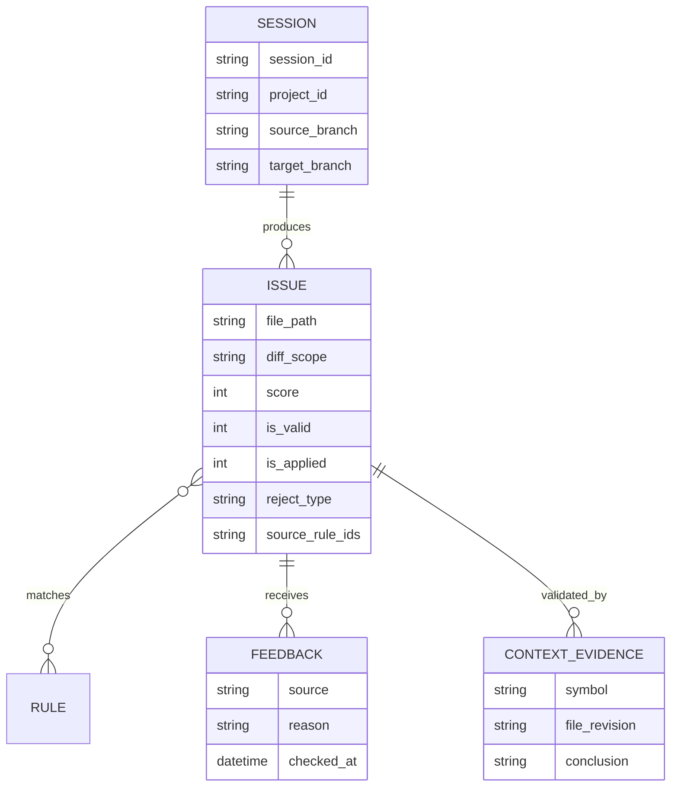

当前实现已经保存了 Issue 的规则命中、有效性、无效原因、采纳状态和拒绝类型等字段，但“本次 Recheck 具体读取了哪些符号与版本”仍主要存在 Agent 过程里。若团队经常争论上下文是否充分，可以增加结构化证据引用，例如 `evidence_files`、`evidence_symbols`、`assumption` 与 `verification_result`。这会增加存储和 Prompt 约束，收益是 Bad Case 可以复盘，而不是只剩一句“模型判断错误”。

`reject_type` 也不能完全依赖关键词。当前自动归因会把“误报、不是问题”映射为 `false_positive`，把“**建议不可用**、修复不对”映射为 `bad_fix`，把“不重要、忽略”映射为 `low_value`，还识别风格分歧与已经处理。它适合做粗分桶，不适合替代人工抽样。拒绝理由很短时，`unknown` 往往比武断分类更诚实。

## 五个根因工作台：怎样从评论走到证据

根因树只有在能指导取证时才有价值。下面选取五类高频拒绝，完整走一遍“现象、假设、证据、判断和改造归属”。案例均经过等价改写。

### 工作台一：理论上的空值，真实链路里的合法空状态

候选评论认为 `header` 可能为空，建议直接返回 `nil`。开发者的反证是：“空 header 也要继续。”这句话至少包含两种解释。第一种是 header 的字段有默认零值，转换函数应该继续生成参数；第二种是当前调用者会在更高层补齐 header，提前返回反而破坏流程。仅凭拒绝文本无法选择。

先画出对象生命周期：外部请求怎样反序列化；转换函数是否处于系统边界；空 header 由协议允许、兼容历史请求，还是只在测试替身里出现；转换结果的字段是否允许零值；下游在哪一步完成最终校验。然后构造两个最小测试：header 为空时当前实现输出什么；加入提前返回后调用方行为怎样变化。

若空 header 是协议允许状态，问题属于业务语义误判，修复建议有害。规则层应写清“此转换器允许缺少 header，并以零值继续”。若空 header 本应被入口拒绝，只是当前测试没有覆盖，那么开发者拒绝并不能推翻风险，问题应保留但修复位置可能从转换函数移到入口。

这个案例提醒我们，反馈不是天然真值。开发者最了解局部业务，也可能只描述了当前习惯。诊断需要把反馈转换成可验证假设。

### 工作台二：忽略解析错误，还是有意使用零值兜底

候选评论看到 `strconv.ParseInt` 的错误被忽略，建议显式检查 `err`。拒绝理由是：“ID 一定是整数，并且后续 `> 0` 已经安全兜底。”

这里有三层证据。类型层：ID 在上游是字符串还是数字，为什么需要解析。数据层：该字符串是否只来自数据库整数列，还是也来自用户输入、消息和旧数据。行为层：解析失败变成 0 后，`> 0` 分支跳过是否就是期望结果，还是会静默丢数据。

如果字符串完全由受控整数列生成，且 0 与“无有效 ID”语义一致，显式处理错误可能只增加日志噪音。若数据穿过外部边界，静默跳过会隐藏污染，建议方向成立。还有第三种情况：风险成立，但正确修复是在反序列化入口保证类型，而不是在每个使用点检查。

因此标注不能只写 `false_positive`。可以记录 `valid_risk_wrong_location`，让规则学习“报告系统边界缺失校验”，不要在所有消费点重复报告。

### 工作台三：公共框架知识和项目封装冲突

候选评论看到表单 validator 的 callback 风格，认为旧 API 会导致校验失败，建议返回 Promise。拒绝理由是“组件库推荐用法”。

验证顺序应从仓库向外，而不是先搜索公共文档。先确定导入路径，找到项目封装的类型声明和版本；再查看同仓库中由维护者编写的例子；必要时运行最小表单测试，观察 callback 是否被调用、错误是否显示。只有项目代码无法解释时，才用上游文档补充。

若项目封装确实支持 callback，这条评论属于框架契约误判。解决方案不是把“callback 永远允许”写进通用规则，而是在仓库规则中声明具体组件与版本。组件升级后，规则必须同步失效或迁移。没有版本字段的规则会把今天的正确经验变成明天的误报来源。

这种案例还暴露了检索优先级。Agent 如果先访问公共知识，容易形成锚定；后续即使读到项目封装，也可能把它当作落后实现。Recheck 应明确规定“实际依赖和仓库封装优先于无版本的通用最佳实践”。

### 工作台四：已经处理，但处理位置与形式不同

候选评论说“照片上传失败时没有提示”，开发者回答“调用方法已有统一错误提示”。要验证的不只是有没有 Toast 字符串，还要看失败是否沿调用链传播。

需要检查上传方法失败时返回什么；循环是否吞掉错误；调用者如何区分部分成功和全部失败；统一提示是否覆盖当前路径；重复提示会不会造成两个弹窗。若底层抛错且上层统一 catch，当前建议会重复处理。若底层只返回空结果而不上抛，开发者以为已有提示，实际路径可能仍静默失败。

“已有处理”根因最适合保存证据引用：callee 的错误分支、caller 的 catch、统一提示组件和对应测试。没有这些引用，下一轮模型无法区分真正已有处理和开发者口头声称。

还要注意修复层级。即使当前路径缺少提示，把 Toast 加在数据访问层也可能违反架构边界。AI 评论应该指出缺失的用户可见反馈，而不是强制某一层直接调用 UI API。

### 工作台五：并发风险存在于变量，还是存在于执行模型

候选评论发现共享 Map 的字段在 goroutine 中被写入，建议加互斥锁。开发者说：“只有这个协程更新该字段。”

看到共享对象不等于存在数据竞争。需要找出 goroutine 的创建位置、对象是否被多个任务复用、其他路径是否读写同一字段，以及当前容器是否线程安全。单一 goroutine 内部顺序写入普通 Map 不需要锁；多个 goroutine 写不同 key 仍可能不安全；单写多读也要看读写是否并发。

最小验证可以运行竞态检测或构造并发测试，但工具结果必须和覆盖路径一起解释。测试没有报 race 可能是分支未命中，不代表不存在；代码证明只有单写者时，加锁反而增加复杂度并可能引入锁顺序问题。

若此类误报反复出现，规则不应写成“不要报告 Map 并发问题”。应写成条件化判断：先定位并发创建点和所有写者；无法证明至少两个并发访问时，不给高分确定性结论，可以提示需要人工确认。

## 采纳失败和反馈失败要分开

有些低采纳不是建议质量问题，而是反馈系统没有正确观察到采用。开发者可能手工实现了语义等价修复，没有点击采纳；外部生码平台可能覆盖代码却未回传状态；建议只改了配置或测试，自动检测读取了错误分支；合并后文件重命名导致路径匹配失败。

可以把调查分成两个连续问题：

1. 建议在当时是否值得采用？
2. 现有反馈机制是否正确记录了采用结果？

第一个问题需要代码与业务评审，第二个问题需要状态来源、时间戳和最终版本。若两者混在一起，团队可能为了修检测器而改规则，也可能把检测漏报误认为开发者不信任系统。

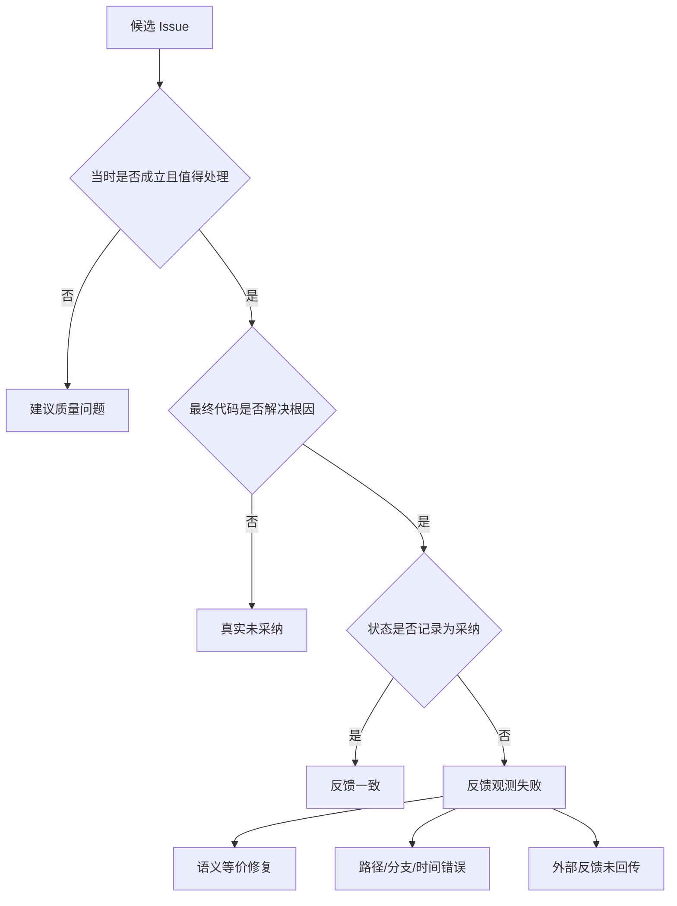

调查反馈失败时，要保存 Issue 创建 commit、检测所用 branch、最终 merge commit、文件重命名映射和状态更新时间。尤其不要用当前主干去判断几周前的建议，文件可能已经经历其他修改。

### 无反馈不是未采纳

`is_applied=null` 表示没有明确判断。它可能是开发者尚未处理、没有看到评论、审查任务中断，或反馈入口不可用。把 null 直接算未采纳，会惩罚反馈覆盖差的仓库；直接排除又可能只留下愿意互动的用户。

诊断报告应并列显示明确反馈率、反馈延迟和未反馈样本抽查。若优化后采纳率升高而反馈覆盖率下降，不能直接宣布系统变好。可能只是更少的人愿意点击。

### 自动未采纳也不是拒绝理由

行级检测发现建议代码没有出现在最终文件，只能说明文本没有按当前算法匹配。它不知道开发者为何没有采用，也不知道是否做了语义等价修复。自动状态适合触发补充核验，不应直接生成“开发者认为建议错误”的负向规则。

## 标签争议：谁有权决定一条评论是否正确

代码审查包含技术事实、业务语义和团队选择。单一评审者很难覆盖全部。可以按争议类型指定仲裁：

| 争议 | 首要评审者 | 必需证据 | 不能单独决定的人 |
| --- | --- | --- | --- |
| 语言/并发/类型事实 | 对应技术栈维护者 | 可运行测试、类型或规范 | 只凭业务习惯的使用者 |
| 业务允许状态 | 模块 Owner/TL | 需求、接口契约、测试 | 只看公共最佳实践的模型 |
| 组件封装行为 | 组件维护者 | 版本、源码、推荐用法 | 未确认版本的外部资料 |
| 严重度 | 模块 Owner + 质量角色 | 触发概率、影响与恢复 | 只依据错误名称的评审者 |
| 修复可用性 | 代码作者 + 维护者 | 行为差异、回归测试 | 只检查语法可编译的人 |

仲裁不需要每条 Issue 都开会。可以先抽样建立规则，再把明确案例自动化。对高风险、意见冲突或证据不足的样本保留 `uncertain`，不要为了报表完整强制二选一。

一致性也要测。让两位评审者独立标注同一批样本，观察分歧集中在哪些类别。若“业务语义误判”长期分歧大，说明标签说明不足或需要模块 Owner 参与；若“范围错位”分歧大，可能是 Diff 归因规则不清。

## 观察当前实现时，应该问哪些问题

阅读采纳率链路的实现代码，不必把几千行代码逐行抄进课程。沿控制点提出问题更有效。

在 `promptBuilder.ts` 检查：规则来自哪里；项目规则解压失败是否可见；规则与示例是否有 ID；Issue 是否回写命中规则。在 `extensionChecker.ts` 检查：Recheck 何时执行；`diff_scope` 怎样影响结论；无效原因是否保留；检查器是否可能被配置关闭。

在 `filterChecker.ts` 检查：历史任务怎样关联；本地与远端是否行为一致；重复、冲突和已修复分别怎样落状态。在 `memoryDistiller.ts` 与 `memoryChecker.ts` 检查：拒绝信号怎样去重；项目级与用户级怎样隔离；规则是否需要确认、是否过期、命中后如何审计。

最后在 `adoptionChecker.ts` 检查：检测读取哪个分支和文件；注释、空白、重命名和短代码怎样处理；部分采纳是否进入正式指标；拒绝类型是事实字段还是关键词推断。

这些问题能把“采纳率低”映射到具体代码对象。若调查只停在模型输出文本，后续团队很难判断应该改 Prompt、检索、状态机、数据模型还是反馈入口。

## 建立一张可复盘的根因仲裁卡

调查结束后，不要只在会议纪要里写“AI 误报”。可以为每个抽样 Issue 保存一张仲裁卡，让同类问题能够比较。

```text
issue_id: teaching-042
review_revision: commit-a
feedback_revision: commit-b
candidate: 建议为内部对象字段增加空值检查

scope_decision: caused_by_change
trigger_hypothesis: 成功构造对象的字段可能为空
evidence_for:
  - 字段类型允许空值
evidence_against:
  - 只有一个成功构造入口
  - 构造入口在返回前填充该字段
  - 测试覆盖空输入并在边界拒绝

issue_validity: invalid
fix_quality: harmful
root_cause: missing_repository_context
recommended_control: recheck_callee_and_constructor
reviewer_roles: module_owner, backend_reviewer
label_version: adoption-diagnosis-v1
```

这张卡把结论和证据分开。以后构造入口改变时，可以重新判断旧标签；Recheck 改造后，也可以检查它是否读取了相同证据。若只保存“误报”，规则提炼只能模仿一句结论，无法知道何时不适用。

仲裁卡还应记录反事实：什么变化会让当前结论翻转。上例中，只要发现另一个能绕过成功构造函数的反序列化入口，空值风险就需要重新评估。可翻转条件让规则保持开放，而不是把一次拒绝变成永久事实。

### 用证据强度决定自动化程度

不同证据的确定性不同。编译错误、类型不匹配、确定的数据流通常能自动验证；业务允许状态、用户体验和未来扩展需要人参与；“可能发生”但检索失败的情况只能标不确定。

| 证据等级 | 示例 | 适合的动作 |
| --- | --- | --- |
| 确定证据 | 编译失败、明确类型约束、可复现竞态 | 自动保留或过滤，并保存工具结果 |
| 强仓库证据 | 单一构造路径、项目规则、稳定测试 | Recheck 决定，定期抽样 |
| 业务证据 | 需求允许空值、模块 Owner 解释 | 人工确认后形成项目规则 |
| 弱推断 | 常见最佳实践、相似代码、模型常识 | 只能提出假设，不应给高分结论 |
| 证据缺失 | 文件无权限、符号检索失败 | 标记不确定，不能当作不存在 |

这张表也约束负向反馈。弱推断被拒绝可以帮助建立检索计划，不能直接生成绝对过滤规则。只有稳定、可复核、范围清楚的证据才适合自动化。

### 把修复位置也纳入仲裁

不少建议的问题方向成立，修复位置不对。例如入口缺少校验，却在每个消费点增加防御；统一错误处理缺失，却在底层库直接弹 Toast；异步任务需要观测，却在调用方强行 `await`。仲裁卡应记录 `recommended_layer`：boundary、domain、service、caller、callee、UI 或 infrastructure。

这样做能区分两种改造。若 `issue_validity=valid` 但 `fix_quality=harmful` 集中出现，优先改修复生成和架构约束；若 `issue_validity=invalid`，才去改规则、上下文与 Recheck。把两类都算成“未采纳”会浪费工程投入。

## 一套可复用的低采纳诊断流程

### 第一步：固定指标版本与样本窗口

先记录采纳率口径、反馈成熟窗口、仓库、语言、模型版本、规则版本和审查入口。不要把自动状态、人工状态和外部反馈随意混在一起。第 3 章已经说明，当前正式口径只纳入明确状态 0/1/4/5，并过滤低分和明确无效问题。

还要记录反馈覆盖率。假设 1,000 条高分候选中只有 120 条得到明确反馈，60% 采纳率只能描述这 120 条。若反馈者只在非常满意或非常不满时点击，样本仍然偏斜。

### 第二步：抽取“成对证据”

每个样本至少包含候选问题、当时 Diff、相关仓库上下文、开发者反馈和最终代码。缺少最终代码时，不能断言建议未实施；缺少当时版本时，也不能用今天的文件反推当时上下文。

抽样要同时包含已采纳与未采纳。只看 Bad Case 会把系统描绘得过度悲观，也无法找出同类问题何时值得报告。课程案例的三份定向数据正好说明这个边界：34 条已采纳与 44 条拒绝可以做对照教学，却不能拼成总体比例。

### 第三步：先判问题，再判修复

对每条建议依次回答：位置属于本次变更吗；触发条件能否由当前代码证明；是否已有处理；严重度是否合理；建议代码是否保持业务语义。评审者意见不一致时，记录分歧点并仲裁，不要强行压成一个模糊标签。

可以使用如下最小标注结构：

```text
issue_validity: valid | invalid | uncertain
scope: changed | caused_by_change | historical | unknown
root_cause: rule | context | duplicate | scoring | none
fix_quality: usable | needs_revision | harmful | absent
evidence: [type_or_annotation, caller, callee, test, requirement]
```

这段结构是教学建议，不是当前数据库字段。它的价值在于把“没采纳”拆成可修的原因。

### 第四步：按可控制层聚合

聚合维度应直接对应工程动作：

- `false_positive + scene_impossible`：检查类型、边界和 Recheck。
- `already_handled`：补调用链与重复检测。
- `bad_fix`：分离风险判断和修复生成。
- `style_disagree`：把团队偏好写入仓库规则，或降低严重度。
- `low_value`：调整报告门槛与分层展示。
- `duplicate/history`：改历史 Issue 过滤和问题身份键。

如果团队只能看到“健壮性问题采纳率 32%”，仍然不知道下一步做什么。根因桶应该稳定到足以观察趋势，又不能细到每个样本一个标签。

### 第五步：只改变一个控制点

规则、上下文、Recheck 和记忆同时上线，指标变化后无法归因。先选择最大的根因桶做最小实验。例如：

> 假设：`already_handled` 占比高，是因为首轮审查没有读取被调用方法。处理组在 Recheck 中强制读取 callee 与一层 caller；对照组保持不变。主要指标看该根因桶的明确反馈采纳率，护栏看高分 Recall、时延、工具调用次数和无法判断率。

若处理组减少了误报，却让审查时间翻倍，需要评估是否只对高分候选或特定子类触发。工程优化不是把所有证据都塞进每一次请求，而是让证据成本随风险变化。

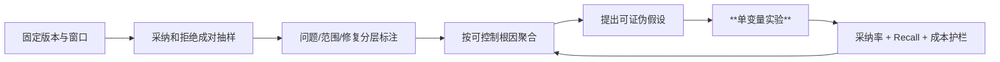

## 诊断练习：不要急着给解决方案

下面五条拒绝理由来自脱敏后的教学样本。先写出最可能的根因，再指定一项能推翻你判断的证据。

1. “这个字段不会为空，类型构造时已保证。”不要直接归为“模型不懂业务”。先查看构造函数是否覆盖全部入口，以及反序列化或测试替身能否绕过保证。
2. “方法内部已经做了空处理。”检查被调用方法的具体版本和返回语义。若内部只记录日志但仍解引用，开发者反证可能不完整。
3. “组件库就推荐 callback。”检查实际依赖版本、封装文档和仓库中的同类代码。公共文档不能代替项目契约。
4. “不需要 await，内部会捕获错误。”检查调用者是否依赖完成顺序、内部是否真的覆盖全部拒绝路径，以及未等待 Promise 是否会产生未处理拒绝。
5. “只有这个协程写该字段。”寻找所有闭包捕获、共享引用和异步入口。若确实只有单写者，加锁建议应判无效；若读取方与写入方并发，还要判断数据结构是否允许。

练习的完成标准不是猜中开发者答案，而是给出可判读的证据。证据显示假设不成立时，应允许改变结论。

完成练习后，再检查自己的取证顺序。若第一步总是搜索公共最佳实践，说明还没有把仓库事实放在优先位置；若只接受开发者一句“不会发生”，说明没有验证业务反证；若发现风险成立就默认建议代码正确，又把问题判断和修复质量合并了。成熟的诊断允许三种结论并存：问题成立且建议可用，问题成立但建议需重写，问题在当前范围不成立。

把五条练习的证据放进根因仲裁卡，然后尝试聚合。只有至少两条样本共享相同触发条件、排除条件和改造动作时，才考虑形成规则。表面都在讨论空值，不代表它们应进入同一条规则。


## 单变量实验设计

采纳率低时最容易犯的错误是一口气改 Prompt、加规则、调上下文，然后看到数字变了就说"优化有效"。**你不知道哪个动作真正起效，也不知道哪个动作在帮倒忙。**

正确的诊断顺序是：先用拒绝原因把问题分层，找到最粗的根因桶，然后**一次只改一个变量**，在固定样本上验证效果。

假设分层后发现 60% 的拒绝来自"已有处理"和"场景不存在"。这两类都与上下文不足有关——模型没看到被调用方法的内部实现，没看到入口的类型约束。那第一个实验应该是增加上下文（读取被调用方法的签名和文档），不改 Prompt、不改规则、不改模型。**如果采纳率提升，说明根因判断正确；如果没有，说明这两类拒绝另有原因。**

实验单位必须防止污染。对同一 MR 同时运行两版而把两版评论都展示给开发者，反馈会互相影响。可以离线双跑，或按仓库/用户分流；任何在线实验都需要说明风险与人工兜底。

结果也要区分**统计显著与工程意义**。即使样本足够让 1 个百分点差异稳定，如果它换来两倍成本，未必值得上线；样本较小但发现高危漏报，则可能先采取保守防护再继续收集。指标辅助决策，不替代风险责任。

## 发布门槛

门槛应由仓库基线决定，下面是一组结构，不是固定数字：

- 目标误报子类相对下降，并达到最小样本量。
- 固定 Benchmark 的高风险 Recall 不低于基线容忍区间。
- 被 Recheck 或负向规则过滤的高分问题完成人工抽查。
- 审查时延和 Token 成本没有超过服务预算。
- 规则命中、过滤原因和版本可以追溯。
- 无法判断率没有因"更谨慎"大幅上升。

采纳率上升只能算一个条件。**Recall、成本、反馈覆盖与可追溯性共同决定能否推广。**

## 迁移任务：为另一个仓库设计降噪闭环

选择一个你熟悉的仓库，找出一种经常被拒绝的评论。不要直接写新 Prompt，先提交一页设计：

1. 给出三条成对样本：候选问题、拒绝证据、最终代码。
2. 判断根因属于规则、上下文、范围、修复、历史还是价值。
3. 写一条带触发条件、排除条件和证据要求的规则。
4. 设计 Recheck 需要读取的最小上下文与停止条件。
5. 决定这条经验应是组织、项目还是个人范围，保存多久，谁能禁用。
6. 定义主要指标、Recall 护栏、成本预算与回退条件。

一个合格方案应该允许评审者指出"哪项证据会让这条规则不再成立"。**如果规则无法被证伪，它很可能只是偏好口号。**


## 本章收束

低采纳率不是“评论写得不像人”这么简单。课程案例的拒绝样本反复出现同一条因果链：模型掌握通用风险，缺少当前仓库的适用条件，于是把可能性写成事实，再给出改变业务语义或重复现有防护的修复。

诊断时先固定指标口径，收集候选问题、当时上下文、反馈与最终代码。然后把位置、触发条件、已有处理、严重度和修复质量分开判断。规则缺失、上下文不足、Recheck 失效、历史重复和低价值问题需要不同控制点，不能都靠扩写 Prompt。

第 5 章会把这些根因映射成一条分层改造链：先建立可版本化规则和最小上下文，再用 Recheck 过滤首轮候选，用负向记忆吸收反复拒绝，用历史过滤减少重复，最后用人工反馈与自动检测验证效果。每层都要保留开关、证据和 Recall 护栏。

## 参考文献

本章以课程案例当前代码、脱敏后的 44 条定向拒绝样本和已采纳对照样本为主要事实来源。样本用于诊断机制教学，不代表生产总体分布，也不用于计算总体采纳率。


---


---

# 第 5 章　提升采纳率：规则、上下文、复核与**负向记忆**

> 预计学习时间：90–110 分钟
> 一句话总结：提升采纳率要把规则、证据、过滤和反馈做成分层流水线，并用召回率与成本防止系统为了少报而变得沉默。

## 从一条被拒绝的空值建议开始改造

设想首轮审查给出下面的候选问题：

> `accountInfo` 的字段可能为空，调用下游服务前应再次检查，否则可能出现空指针或非法请求。

开发者拒绝：“`accountInfo` 由统一入口构造，成功返回时字段完整。”如果只在 Prompt 末尾追加一句“请结合上下文，减少误报”，下一轮模型仍可能报告同类问题。因为系统没有回答四个具体问题：

1. 当前仓库是否有“信任内部对象，只在系统边界校验”的规则？
2. 审查时是否拿到了 `accountInfo` 的类型、构造函数和入口校验？
3. 首轮候选生成后，是否有人验证“可能为空”这个触发假设？
4. 开发者拒绝后，这条经验如何只影响合适的项目和用户，而不误伤别的仓库？

第 4 章已经把低采纳根因拆开。本章把它们映射成一条实际流水线：规则层定义什么值得报；上下文层提供仓库证据；Recheck 过滤首轮误判；负向记忆处理反复出现的拒绝模式；**历史过滤**消除同一需求里的重复与冲突；采纳检测和明确反馈负责验证改变。

这条链的目标不是让问题数量越来越少。一个什么都不报的系统采纳率无法定义，也没有质量价值。每次降噪都要同时检查 Recall、反馈覆盖、时延和高风险漏报。

## 先建立六层控制面

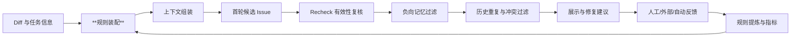

六层不是六个必须串行调用的模型。规则和上下文可以在首轮一次装配；Recheck 与负向记忆可以根据风险、成本和开关选择执行；历史过滤目前只适用于有历史任务身份的远端场景；自动采纳检测在合并后异步运行。架构价值来自职责分开，而不是调用次数多。

| 控制层 | 解决的主要根因 | 输入证据 | 错误使用的风险 |
| --- | --- | --- | --- |
| 规则 | 团队标准缺失、严重度混乱 | 通用规则、项目规则、正反例 | 规则冲突、过拟合、Prompt 膨胀 |
| 上下文 | 场景误判、已有处理 | Diff、符号、调用链、类型、文档 | 检索噪音、成本和隐私扩大 |
| Recheck | 首轮推测、范围错位、错误修复 | 候选 Issue 与仓库证据 | 两个模型共享盲点，误删真问题 |
| 负向记忆 | 同类拒绝反复出现 | 拒绝/无效反馈的稳定模式 | 把个人偏好推广成全局规则 |
| 历史过滤 | 重复、冲突、已修复旧问题 | 同一需求历史 Issue 与当前文件 | 身份关联错误，误关仍存在问题 |
| 反馈检测 | 无法判断优化是否有效 | 人工、外部流程、最终代码 | 标签偏差、语义等价误判 |

接下来按一个问题从进入到回流的顺序改造。

## 第一层：把审查标准变成可版本化规则

### 三类规则各自负责什么

课程案例的 `promptBuilder.ts` 在构建批次审查 Prompt 时，组合了三个来源。

第一类是角色基础规则。`configService.getCodeReviewRulesByRole(project_type)` 按前端或后端角色加载分类、严重度、输出结构和通用检查项。它回答“安全、规范、性能、健壮性等问题怎样描述和评分”。

第二类是规则库中的系统条目。`memoryDistiller.loadSystemPromptRules(project_type)` 按角色前缀加载已结构化的规则和 Good/Bad Case，并把规则 ID 写入 Prompt。它适合维护需要统一发布、可以统计命中的经典坑点。

第三类是仓库级 Cursor Rules。Session 在 Setup 阶段保存规则文件的压缩内容，Prompt 构建时解压并注入。它负责业务仓库自己的约定，例如组件封装、国际化方式、数据边界和禁止写法。

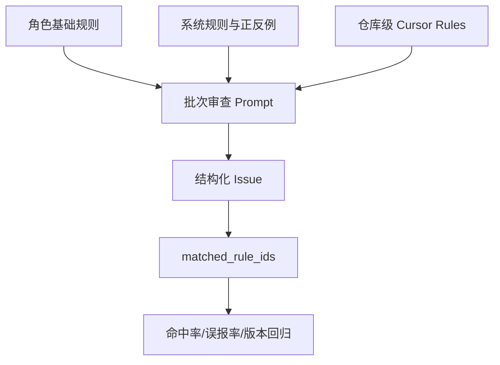

简化后的实现关系如下。代码省略了解压、日志与异常分支，只保留装配职责。

```typescript
// 教学化节选：promptBuilder.ts
const base = await configService.getCodeReviewRulesByRole(projectType);
const system = await memoryDistiller.loadSystemPromptRules(projectType);
const repositoryRules = decodeCursorRules(session.cursor_rules);

const reviewPrompt = compose({
  diff: files,
  baseRules: base.rules,
  examples: system.examples,
  systemRules: system.rules,
  repositoryRules,
});
```

这段代码证明当前实现支持三层装配，不证明每层内容都已经正确。规则仍需要版本、适用范围和回归样本。

### 一条可执行规则应该包含什么

“注意空值”“避免异步问题”“使用最佳实践”都太宽。它们没有触发条件，几乎能解释任何代码。可执行规则至少写清五项：

| 字段 | 问题 | 示例 |
| --- | --- | --- |
| 适用对象 | 检查什么代码 | 系统边界接收的外部请求字段 |
| 触发条件 | 什么证据出现才报告 | 字段无类型保证，且入口未校验 |
| 排除条件 | 什么情况下不要报告 | 内部对象由成功构造函数保证完整 |
| 风险与分数 | 为什么值得打断开发者 | 可触发崩溃且无恢复，4 分 |
| 证据要求 | 评论必须引用什么 | 构造路径或缺失校验的具体位置 |

例如可以把空值规则写成：

> 对来自 HTTP、RPC、消息或持久化反序列化边界的数据，若后续直接解引用且入口、类型与构造函数均未提供非空保证，报告空值风险。对只在内部成功构造路径中流转的对象，不因理论上的 `nil` 可能性重复添加校验；如果无法确认构造路径，先在 Recheck 中读取定义与调用方。

这条规则比“所有指针都检查”更长，但它减少了模型自由补全适用条件的空间。规则仍不能塞入所有项目例外。具体组件、配置和领域约束应留在仓库层。

### 正反例比口号更容易校准边界

规则库可以为同一子类保存 Good Case 和 Bad Case。Good Case 展示“什么情况下应报告”，Bad Case 展示“看起来相似但不要报告”。课程案例的分享材料将这类经典坑点按前后端和问题类别整理；当前代码也允许系统条目以规则 ID 和示例形式注入。

反例尤其适合处理防御性建议：已有可选链、框架保证、内部方法已处理、配置故意以失败启动保护系统、单写者对象不需要额外互斥锁。反例不能只贴代码，要说明排除条件，否则模型只会记住表面字符串。

### 规则冲突必须有优先级

假设基础规则说“外部错误必须捕获”，项目规则说“此 fire-and-forget 调用在内部统一上报，不阻塞调用方”。两者并不真正冲突：基础规则定义目标，项目规则定义当前实现方式。若两个来源都用绝对命令，模型可能随机选择。

建议把优先级写成：法律与安全底线高于组织通用规则；项目规则可以细化通用规则，但必须说明满足同一目标的替代机制；个人偏好只能影响非强制项。每条规则保存版本、生效时间和负责人，出现争议时可以回滚。

## 第二层：围绕假设构建最小上下文包

### 不是“给更多代码”，而是“给能判定的代码”

首轮审查通常从 Diff 开始。为了判断一个空值建议，需要的上下文可能是类型定义、构造函数和一层调用方；为了判断数据竞争，需要的是共享对象的所有写入点和并发边界；为了判断组件 API，需要的是依赖版本与封装实现。三种问题不能使用同一份固定上下文模板。

可以先按候选问题类型生成一个查询计划：

| 候选问题 | 最小上下文 | 不够时再扩展 |
| --- | --- | --- |
| 空值/越界 | 类型、注解、构造路径、直接调用方 | 反序列化入口、测试替身 |
| 异步/错误处理 | 调用方是否等待、被调用方法 catch/finally | 上层时序、重试和告警 |
| 组件/框架契约 | 实际版本、项目封装、同仓库用法 | 迁移计划、公共文档 |
| 业务条件 | 需求字段、测试、领域枚举 | 上下游接口与历史变更 |
| 并发/锁 | goroutine/Promise 创建点、共享读写 | 生命周期、锁顺序与压测 |

`Cursor CodeBase` 或其他代码检索能力只是取证工具。系统还需要记录“为什么检索这个符号”和“结果支持什么结论”。否则 Agent 读取十个文件后仍可能沿用最初推测。

### 上下文包应带版本和来源

代码审查针对某个 commit 或 MR。若 Recheck 读取的是工作区后来修改过的文件，证据会漂移。上下文项应至少携带路径、commit、符号、来源类型和截取范围。项目规则也应记录规则版本，而不是只把一段匿名文本放进 Prompt。

对大型仓库，建议限制自动扩展的层数。先读直接定义和一层调用；证据仍不够时，再按风险分数决定是否继续。低分建议如果需要十次检索才能成立，通常不适合打断当前 MR。

### 上下文质量需要独立观测

可以记录下面几项：候选问题触发了多少次代码读取；读取是否命中目标符号；是否存在文件缺失或权限失败；Recheck 最终引用了哪些证据；不同问题类型的平均上下文成本。若采纳率上升只是因为每条评论读取了几十个文件，系统可能无法规模化。

上下文增强还要设置 Recall 护栏。过于强调“只有证据完整才能报告”，会让模型把证据暂时检索不到误解成问题不存在。正确状态可能是 `uncertain`：不进入高置信评论，保留给人工抽检或异步补证。

## 第三层：用 Recheck 验证候选，不让首轮自己裁决

### Recheck 的输入是候选问题，不是空白 Diff

首轮审查负责发现。Recheck 负责逐条挑战首轮结论。当前案例对每个 Issue 提供文件、行号、`diff_scope`、分类、分数、描述、原代码、建议代码和命中规则，然后要求 Agent 读取更多上下文。

Recheck 的判断顺序很具体：

1. 问题描述、原代码和建议代码是否真的对应当前文件。
2. 问题落在变更行、上下文行还是 Diff 范围外。
3. 触发条件能否在当前仓库中成立。
4. 是否已有保护、组件保证或业务约束。
5. 修复是否出现范围蔓延、过度文档化或过度抽象。

处理结果写回 `is_valid` 和 `invalid_reason`。若无效判断使用了某条规则，还保存 `matched_rule_ids`，为后续分析规则质量提供线索。

```typescript
// 教学化节选：extensionChecker.ts
for (const result of recheckResults) {
  await Issue.update({
    is_valid: result.is_valid ? 1 : 0,
    invalid_reason: result.reason,
    source_rule_ids: result.matched_rule_ids?.join(','),
  }, { where: { id: result.issue_id } });
}
```

### Recheck 为什么不能直接当真值

Recheck 仍可能和首轮共享模型、规则与检索盲区。它能降低噪音，不等于替代人工标签。若把所有 `is_valid=0` 自动当作绝对误报并用于训练，系统会强化自身偏见。

至少做三项保护：对高风险被过滤问题抽样复核；记录 Recheck 的证据与模型版本；监控过滤前后 Recall。还可以让首轮和复核使用不同提示结构，必要时使用不同模型或静态证据，降低完全同源的错误。

### 按风险决定复核成本

每个批次执行 Recheck 会增加时延和 Token。可以采用风险路由：4–5 分候选逐条复核；3 分只对高误报子类复核；2 分默认不展示或聚合到非阻断建议。这个策略需要用仓库基线校准，不能把分数阈值当作所有项目的固定答案。

当前实现把 `recheck` 配置为每批执行，并在兜底扩展检查列表中启用。运行时配置仍可能覆盖。正文中的“默认”只指代码兜底值，不代表所有部署环境。

## 第四层：把反复拒绝转成有边界的负向记忆

### 负向记忆处理的是模式，不是单条意见

一次拒绝可能是误点、个人偏好或临时业务决定。直接把它写成永久黑名单，会迅速让系统失去召回。课程案例会先按项目和子类别聚合近期拒绝或无效信号，达到最小出现次数后，再让模型提炼为结构化规则。

负向规则包含类别、子类、规则文本、置信度、证据数、严格度和条件。`absolute` 表示在明确范围内直接过滤；`conditional` 表示必须读取上下文确认条件。例如：

```text
NEG-017
类别：健壮性 / 重复空值检查
规则：内部成功构造对象已由入口保证字段完整时，不重复报告字段空值。
严格度：conditional
条件：必须找到构造入口或非空类型保证；找不到证据时不得直接过滤。
证据数：6
```

这里的证据数不能自动证明规则正确。六次拒绝可能来自同一个人对同一需求的重复运行。提炼前需要按根因、任务和用户去重。

### 项目级与用户级不能混为一谈

当前数据模型允许 `user_id=null` 表示项目级规则，也允许保存用户级规则。加载时，如果存在当前用户，会同时读取项目规则和该用户的个人规则。这个边界很有用：

- 团队明确的组件契约、业务不变量适合项目级。
- 非强制的风格、建议展示偏好可以留在用户级。
- 安全、合规和已确认高风险规则不能被个人负向偏好覆盖。

用户级规则也可能造成回音室。某位开发者总拒绝测试建议，不代表系统应该永远不提醒他。应限制负向记忆能过滤的类别、分数和规则优先级，并保留抽样曝光。

### 规则要有确认、过期和命中统计

当前实现只加载活跃、状态为 `confirmed` 或 `auto_confirmed`、且尚未过期的规则。用户明确拒绝来源会自动确认；由 Recheck 无效信号提炼的规则默认进入待确认。规则还有过期时间、命中次数和最近命中时间。

这套生命周期比“无限追加黑名单”安全，但仍有两个实现边界需要看清：

1. 兜底提炼配置当前启用 `user_reject` 和 `bug`，没有默认启用 `recheck` 与 `user_adopt`。
2. 兜底扩展检查列表当前不含 `memory_neg`，代码只是具备这项能力；数据库热配置或调用参数可能另行启用。

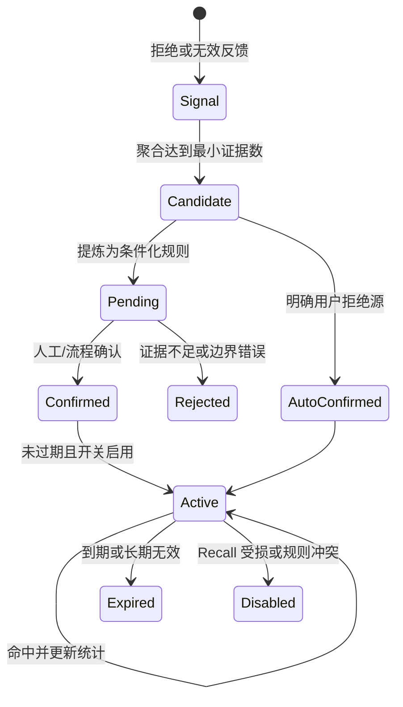

### 负向记忆过滤也要读上下文

`memoryChecker.ts` 会加载项目级和当前用户级负向规则，并只处理 Recheck 后仍有效的候选。对于 conditional 规则，Prompt 明确要求读取代码上下文确认条件。命中后，Issue 被标记为无效，规则的 `hit_count` 增加。

不要把“语义相似”当作充分条件。两条空值建议文字相似，一个发生在外部输入边界，一个发生在内部对象，结论可能相反。负向规则必须有排除条件和适用范围。

## 第五层：过滤同一需求里的历史噪音

远端审查会遇到重跑、补提交和同一分支多次触发。当前案例的 `filterChecker.ts` 会寻找同一仓库与源/目标分支，或同一 MR URL 的历史完成 Session，再比较当前与历史有效问题。

它处理三类当前问题：和历史完全重复、与历史建议冲突、与历史高度重叠。它还会判断历史问题是否已在当前代码中消失，并标记为已修复或代码已变化。

这个过滤器只在 remote Session 的最后一批执行。它不是通用的每批去重器，也不能处理没有可靠任务身份的本地对话。课程设计时要把“当前实现的适用范围”和“希望所有入口都有历史记忆”分开。

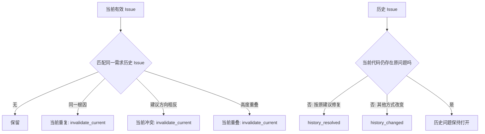

历史匹配最容易出错的是身份。相同行号可能因插入代码而变化；不同描述可能指向同一根因；同一描述也可能发生在两个独立对象。可以结合文件、符号、Diff hunk、规则 ID 和根因指纹，不要只用文本相似度。

## 第六层：用反馈验证，而不是用感觉宣布提升

### 人工和外部明确反馈仍是正式指标主线

当前正式采纳率只纳入人工 0/1 与外部流程 4/5。首轮候选经过 Recheck 或负向过滤后，`is_valid=0` 会被正式查询排除。这样过滤动作能直接影响分母，所以必须同步观察过滤前候选数、过滤率和固定 Benchmark Recall。

若只看过滤后的采纳率，很容易得到虚假提升。例如原来 100 条明确反馈中采纳 60 条；新规则过滤掉 30 条，其中 20 条其实是真问题，剩余 70 条采纳 55 条，采纳率升到 78.6%，但系统少保留了 5 个已采纳问题并可能漏掉更多未反馈真问题。没有 Recall，无法判断这次改造是否值得。

### LCS 自动检测提供辅助证据

`adoptionChecker.ts` 会在合并后读取最终文件，去掉空行和注释、压缩空白，再用行级 LCS 比较 `improve_code` 与文件内容。只有建议的全部有效行都匹配时才得到自动采纳；部分匹配进入 60–69；完全不匹配得到自动未采纳。

不超过三行的建议容易在文件其他位置偶然出现。当前实现增加“短代码冲撞”检查：即使建议片段匹配，只要原代码仍以连续块存在，就按未采纳处理。

```text
improve_lines = normalize(improve_code)
file_lines = normalize(final_file)
matched = LCS(improve_lines, file_lines)

if improve_lines <= 3 and original_code_still_exists:
    adopted_lines = 0
else:
    adopted_lines = matched.length
```

这不是语义等价检测。开发者用更好的方式修复，LCS 可能判未采纳；相同片段碰巧存在，也可能造成假阳性。自动 2/3 和部分 60–69 当前不进入正式采纳率分母，适合作为待复核、反馈补全和检测器评估数据。

### 分开评估“问题正确”和“建议可直接使用”

自动检测主要观察建议代码是否出现，不能单独判断风险是否成立。建议为抽样评审保留两列：`issue_validity` 与 `fix_adoption`。问题成立但修复改写的样本，不应和纯误报混为一谈；问题不成立但开发者顺手做了相似修改，也不能直接算模型判断正确。

## 规则与过滤器怎样避免互相打架

当系统同时有基础规则、项目规则、Recheck、负向记忆和历史过滤时，一个 Issue 可能经历多个判断。若每层只写最终布尔值，团队会看到问题“突然消失”，却不知道是哪一层做了决定。

建议把每次判断保存成事件，而不是只覆盖 Issue 当前字段：

```text
issue_created
  rule_ids: [SYS-BE-R012, PROJECT-07]
  model_version: ...

recheck_completed
  decision: invalid
  reason_type: existing_protection
  evidence: [service/foo.ts#parse, types/request.ts#Header]

negative_memory_checked
  decision: keep
  rule_id: null

feedback_received
  source: external
  adoption: adopted
```

当前案例主要在 Issue 上保存最终状态、无效原因和规则 ID，已经能支持基础追踪。事件模型是课程建议，适合检查器继续增加后的演进。它能回答“Recheck 判无效，但开发者后来采纳了，哪条规则需要复查”，也能重放旧逻辑。

### 决策优先级不能藏在 Prompt 里

可以定义一张显式优先级表：

| 冲突 | 建议处理 |
| --- | --- |
| 安全/合规底线与个人负向记忆冲突 | 保留问题并转人工，不允许个人规则过滤 |
| 项目契约与通用风格规则冲突 | 项目契约优先，记录替代机制 |
| Recheck 判无效但静态分析有确定证据 | 保留或升级人工复核，模型不能覆盖确定证据 |
| 历史建议与当前建议方向相反 | 读取当前代码与规则版本，不按时间简单选新或旧 |
| 自动检测未采纳但人工明确采纳 | 人工明确反馈优先，保留检测差异用于改进算法 |

优先级最好由后端代码执行，而不是要求模型记住。模型负责给出结构化判断，Harness 决定某类判断是否有权过滤高分问题。

### 过滤动作必须是可逆的

“过滤”不应等于删除。将 Issue 标成无效时保留原评论、规则版本、检查器、原因和证据；看板允许按检查器查看被过滤项。规则回滚后，可以重算状态或恢复展示。

若负向规则误杀了安全问题，团队需要定位它命中过哪些历史 Issue。`hit_count` 只能告诉命中次数，不能给出具体样本；更完整的实现可以增加规则命中关系或审计日志，并设置保留期。

## 为上下文设置预算和降级路径

上下文增强最容易从“缺证据”走向“把全仓库都交给模型”。应给每个候选问题设置预算：最大文件数、最大符号层数、最大 Token、最大耗时和工具失败后的状态。

一种风险分层方式是：5 分候选允许读取直接定义、两层调用和相关测试；4 分读取直接定义与一层调用；3 分只读取直接定义；低分没有明确项目规则时不自动扩展。具体数值需要用仓库规模和模型成本校准。

预算耗尽后的结果不能默认为“有效”或“无效”。可以返回 `evidence_insufficient`，并按风险选择：高风险交给人工，低风险进入折叠区，不参与自动负向规则生成。

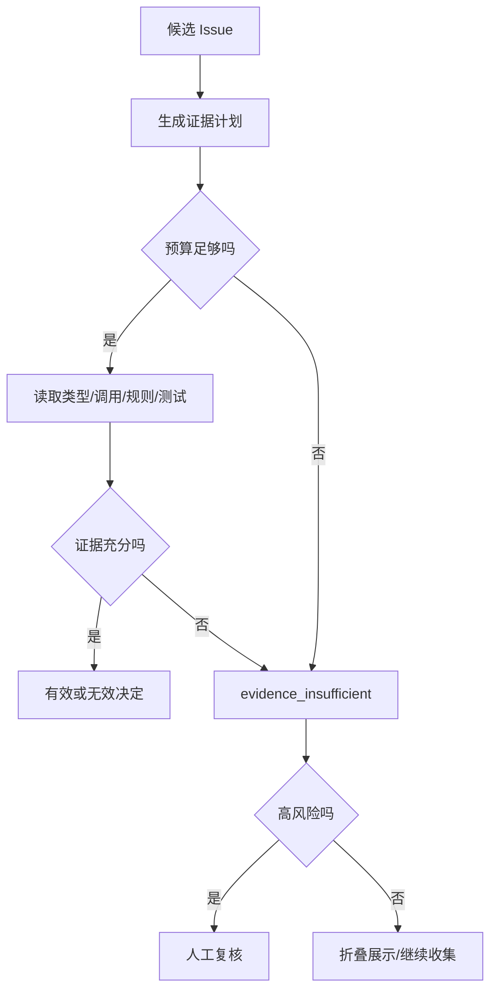

工具失败也要分类。文件不存在可能来自重命名；权限失败是运行环境问题；符号搜索无结果可能是语言索引未准备；超时是容量问题。把它们都写成“未发现上下文”会让 Recheck 做出错误否定。

## 负向规则的反误杀测试

每条负向规则至少要有三组测试样本：应该过滤、表面相似但应该保留、证据不足不能自动决定。

以“内部对象不要重复空值检查”为例：

| 样本 | 上下文 | 期望 |
| --- | --- | --- |
| A | 对象只来自成功构造函数，字段有非空保证 | 过滤重复空值建议 |
| B | 对象来自 RPC 反序列化，字段可缺失 | 保留空值风险 |
| C | Diff 只出现使用点，构造路径检索失败 | 不自动过滤，标证据不足 |

上线前在固定集上回放所有活跃负向规则。规则更新不仅测试自己的样本，还要运行安全、并发、鉴权等高风险回归集。否则一个宽泛的“不要做防御性检查”可能消掉真正的边界校验。

规则过期不代表直接删除。到期时可以进入观察状态：停止自动过滤，但继续记录“若启用会命中哪些 Issue”，重新积累证据后再确认。这样能发现组件升级或业务变化导致的规则漂移。

### 检查用户级规则是否污染项目级判断

同一个 Issue 可以分别用项目规则、用户规则运行影子判断。如果只有用户规则过滤，展示层可以对该用户折叠，但保留项目级结果用于指标和团队 Review。高风险问题则不允许个人规则改变可见性。

个人偏好也应有上限。若一个用户产生大量负向规则，可能是他对反馈入口的理解不同，或系统在该模块上有结构性误报。此时优先做根因调查，不是继续增加个性化过滤。

## 让看板能回答“哪一层有效”

总体采纳率只能告诉系统输出后的结果。为了评估分层流水线，可以增加漏斗：

```text
首轮候选 1,000
  -> Recheck 保留 780
  -> 负向记忆保留 735
  -> 历史过滤保留 710
  -> 高分且明确反馈 260
  -> 采纳 180
```

每一层同时显示过滤数量、过滤原因、被过滤高分数量、人工抽查真阳性率和额外成本。漏斗中的 69.2% 明确反馈采纳率不能单独证明前三层正确；还要看固定 Benchmark 中从 1,000 到 710 的过程中损失了多少真问题。

建议至少提供下面四个视图：

1. 规则视图：每条规则命中、采纳、拒绝、Recheck 无效和版本变化。
2. 检查器视图：Recheck、负向记忆、历史过滤分别过滤什么，抽查错误多少。
3. 根因视图：`false_positive`、`bad_fix`、`already_handled`、`low_value` 等趋势。
4. 成本视图：每层的 Token、工具调用、时延、失败和证据不足率。

还应把“问题判断正确但修复不可用”单独列出。如果只用 Issue 采纳状态衡量规则，修复生成的缺陷会错误归因给发现阶段。

## 异常与恢复：降噪链不能拖垮审查主流程

规则解压失败、代码检索超时、Recheck 返回结构错误、记忆服务不可用、历史任务关联失败，都可能发生。每层要定义失败时是 fail-open 还是 fail-closed。

| 失败 | 推荐降级 | 原因 |
| --- | --- | --- |
| 项目规则读取失败 | 使用基础规则，报告配置告警 | 不应阻断全部审查，但结果置信度下降 |
| Recheck 超时 | 保留首轮候选并标未复核，或高风险人工复核 | 不能把超时当无效 |
| 负向记忆不可用 | 跳过过滤 | 负向层是降噪增强，不应阻断发现 |
| 历史关联失败 | 保留当前问题，停止修改历史状态 | 错误关联比重复展示风险更高 |
| 自动采纳检测失败 | 保持未知，稍后重试 | 不能写成未采纳 |

安全与合规规则读取失败时可以采取更严格策略，例如阻断自动合入并请求人工检查。不同规则等级需要不同失败语义。

恢复后不要静默补写。保存检查器状态、重试次数和最终来源，避免同一 Issue 被重复过滤或反馈覆盖顺序错乱。第 2 章的外部状态机思想在这里仍然适用：模型输出不是完成证明，检查器的结构化结果成功持久化后才算该层完成。

## 从影子运行到正式过滤

降噪能力适合按四个阶段发布。

阶段一只记录。新规则、Recheck 或负向记忆产生判断，但不改变用户可见结果。团队比较“如果启用会过滤什么”。阶段二折叠低风险建议，用户仍可展开，高风险不自动过滤。阶段三在一个项目正式过滤已确认子类，同时抽样所有高分过滤项。阶段四才扩大仓库与问题类型。

每个阶段设置停止条件：高风险 Recall 下降；某条规则出现跨模块误杀；证据不足率显著升高；成本超过预算；用户反馈覆盖下降；规则冲突无法解释。触发后回退到上一阶段，而不是用更多例外覆盖错误规则。

影子运行也要防止评估污染。若同一开发者同时看到新旧两套评论，反馈会互相影响。可以只在后台比较，或按任务稳定分流。固定 Benchmark 用于可重复回归，新时间窗口样本用于检查泛化。

## 上线前核对实现、兜底配置和运行配置

采纳率链路常见的误会是“代码里有，所以线上正在运行”。上线评审应并排检查三层：实现是否存在；代码兜底是否启用；数据库、环境变量或任务参数最终给了什么值。

以当前案例为例，`recheck` 位于兜底扩展检查列表，`memory_neg` 只出现在推荐配置中；负向规则提炼的兜底来源包含用户拒绝，不包含 Recheck 无效信号；远端 `filter` 还要求 Session 的 `remote` 标志和最后一批条件。只看类名会错误推断整条链都在每次审查执行。

可以用下面的发布核对表：

| 检查 | 需要留下的证据 |
| --- | --- |
| 规则来源 | 本次加载的基础、系统和项目规则版本及数量 |
| 检查器开关 | Session 最终启用列表，而不是代码常量 |
| 条件满足 | project_id、remote、最后一批、历史任务身份等条件 |
| 结果持久化 | 每个检查器完成状态、过滤数量和失败原因 |
| 反馈来源 | 人工、外部和自动状态的写入时间与覆盖关系 |
| 回退能力 | 可以关闭的配置项、规则版本和恢复步骤 |

测试环境还应覆盖“规则为空、项目规则解压失败、负向规则过期、历史任务找不到、Recheck 返回少一条结果、自动检测文件重命名”等失败路径。正常路径通过只能证明演示可运行，不能证明降噪链在异常时不会误删问题。

完成核对后，把实际运行配置快照绑定到实验记录。采纳率变化若没有配置快照，团队无法判断是规则内容、检查器启用、模型版本还是反馈入口改变造成的。

## 用五个里程碑实施采纳率改造

### 里程碑一：建立可解释基线

固定一个仓库、模型、规则版本和成熟窗口。保存明确反馈采纳率、反馈覆盖率、每类拒绝原因、固定 Benchmark Recall、平均审查时延与成本。抽样复核至少包含已采纳、已拒绝和无反馈三组。

完成条件是能回答“主要噪音来自哪里”，而不是得到一个漂亮的总体比例。

### 里程碑二：规则最小化与命中追踪

先处理证据最充分的两三个根因桶。把宽泛规则改成触发条件、排除条件和证据要求；为每条规则分配 ID；在 Issue 中记录命中。离线回放固定样本，检查新规则是否减少目标误报，同时保留原有真问题。

失败时回退规则版本，不要在同一轮继续添加更多例外。

### 里程碑三：为高误报子类增加 Recheck

选择 `already_handled`、组件契约误判或范围错位等子类，要求 Recheck 读取最小上下文。记录每条候选的检索次数、有效/无效结论与理由。先离线或影子运行，再决定是否进入正式展示链。

完成条件包括目标根因桶下降、Recall 无明显损失，以及成本在可接受范围。

### 里程碑四：小范围启用负向记忆

先在一个项目启用，只接受达到最小证据数、置信度阈值、明确适用条件且有过期时间的规则。高分与安全问题默认不允许个人负向规则直接过滤。每周抽查命中样本和被过滤的真问题。

如果 Recall 下降或某条规则跨模块误杀，立即禁用该规则，而不是等整体指标恢复。

### 里程碑五：接入历史过滤与反馈补全

为远端任务建立稳定身份，处理重复、冲突和已修复历史 Issue。合并后运行自动检测补充证据，并推动外部流程提供明确 4/5 状态。看板同时显示正式采纳率、自动检测覆盖、无法判断和部分采纳分布。

```mermaid
flowchart LR
  B0[基线与标签] --> B1[规则版本化]
  B1 --> B2[高误报子类 Recheck]
  B2 --> B3[项目级负向记忆试点]
  B3 --> B4[历史过滤与反馈补全]
  B4 --> B5[分层推广]
  B2 -. Recall下降 .-> RB[回退规则/复核]
  B3 -. 误杀真问题 .-> RB
  B4 -. 身份关联错误 .-> RB
```

## 设计一场能判读的改造实验

以“重复空值检查”作为目标根因。实验可以这样设计：

| 项目 | 对照组 | 处理组 |
| --- | --- | --- |
| 首轮规则 | 当前版本 | 相同 |
| 首轮上下文 | 当前版本 | 相同 |
| Recheck | 当前逻辑 | 强制读取构造入口与直接 callee |
| 负向记忆 | 关闭 | 关闭，避免变量混杂 |
| 样本 | 同一固定 Benchmark 与影子 MR | 同一批样本 |
| 主要指标 | 该子类人工确认 Precision | 同左 |
| 护栏 | 高风险 Recall、时延、调用次数 | 同左 |

如果处理组减少了重复校验误报，却把真正来自外部输入的空值风险也过滤掉，说明 Recheck 规则缺少系统边界条件。若准确率不变但成本增加，说明问题不在检索，而在规则或首轮分类。

第二轮才加入负向记忆。仍使用同一 Benchmark，并增加新时间窗口的盲测样本，防止规则只记住开发集。每次只增加一个主要变量，保留回退开关。

### 推荐的发布门槛

门槛应由仓库基线决定，下面是一组结构，不是固定数字：

- 目标误报子类相对下降，并达到最小样本量。
- 固定 Benchmark 的高风险 Recall 不低于基线容忍区间。
- 被 Recheck 或负向规则过滤的高分问题完成人工抽查。
- 审查时延和 Token 成本没有超过服务预算。
- 规则命中、过滤原因和版本可以追溯。
- 无法判断率没有因“更谨慎”大幅上升。

采纳率上升只能算一个条件。Recall、成本、反馈覆盖与可追溯性共同决定能否推广。

## 迁移任务：为另一个仓库设计降噪闭环

选择一个你熟悉的仓库，找出一种经常被拒绝的评论。不要直接写新 Prompt，先提交一页设计：

1. 给出三条成对样本：候选问题、拒绝证据、最终代码。
2. 判断根因属于规则、上下文、范围、修复、历史还是价值。
3. 写一条带触发条件、排除条件和证据要求的规则。
4. 设计 Recheck 需要读取的最小上下文与停止条件。
5. 决定这条经验应是组织、项目还是个人范围，保存多久，谁能禁用。
6. 定义主要指标、Recall 护栏、成本预算与回退条件。

一个合格方案应该允许评审者指出“哪项证据会让这条规则不再成立”。如果规则无法被证伪，它很可能只是偏好口号。

评审这份设计时，还要追问过滤失败怎样恢复。规则加载失败时是否退回基础审查；Recheck 超时时候选是否保留；负向规则误杀后能否查到命中样本并回放；项目级规则是否会被个人偏好覆盖。没有这些答案，闭环只描述了成功路径。

最后用一条此前从未出现过、但根因相似的代码变更做盲测。开发样本通过只能说明系统记住了已有案例，盲测才能检查触发条件是否具备迁移性。


## LCS 自动采纳检测：为什么 100% 才判采纳

采纳反馈的收集是一个瓶颈。如果每个 Issue 都等待开发者手动点击"采纳"或"拒绝"，数据积累会很慢。自动采纳检测试图解决这个问题——它不依赖开发者反馈，而是直接比较 AI 建议的代码片段和最终合入的代码。

系统的自动检测逻辑是：清理建议代码和最终文件中的注释和空行，压缩空白字符，然后做行级 LCS 比较。LCS 匹配率达到 100% 才判定为明确采纳（状态 2），0% 判定为明确未采纳（状态 3），中间值映射到 60–69 的部分采纳区间。

为什么 100% 才判采纳？因为 LCS 只能判断"建议代码是否出现在最终文件中"，不能判断"出现的原因是什么"。一个建议说"在这里加 return null"，最终文件确实有 return null——但可能开发者本来就要加，不是因为看了 AI 的建议。短代码尤其容易产生这种冲撞。

因此系统专门处理了短代码冲撞：不超过 3 行的建议如果和最终文件发生匹配但原代码仍存在，会按未采纳处理。这是降低假阳性的启发式，仍可能漏掉等价改写——开发者用库函数替代了建议的原始代码，行为相同但 LCS 匹配不到。

自动检测适合做运营提示、抽样和后续标注。当前正式采纳率不把自动状态纳入，不是因为自动检测没用，而是**在未经校准前不应与人工确认等权混合。** 团队计划在积累足够的校准数据后，逐步将特定区间的自动状态纳入正式口径。

## 反误杀回归：任何过滤都必须检查 Recall

采纳率的提升很容易走向一个危险的捷径：减少报告数量。规则更严→少报问题；Recheck 更激进→多判无效；负向记忆更宽→多静默。每一项操作都让采纳率上升——但可能同时把真正的问题也过滤了。

因此系统有一条硬约束：**任何过滤机制上线时，都要在固定 Benchmark 样本上运行一遍，检查 Recall 是否下降。** 如果 Recall 下降，即使采纳率大幅上升，这个过滤机制也不合格。

具体操作是：冻结一批经过双人标注的样本（包含应报告和不应报告两类），在过滤机制上线前后分别运行审查，比较两版结果。被新过滤掉的问题逐条人工抽查——确认它们确实是误报，还是被误杀的真问题。

如果一条负向规则过滤了 10 条噪音但也误杀了一条安全建议，这条规则就应该被禁用。如果 Recheck 把某个子类的误报从 80% 降到 40%，但同时把这个子类的真问题也过滤了 20%，需要判断 trade-off——但默认态度是宁可保留更多噪音也不误杀高风险问题。

## 异常恢复与影子发布

规则变更不能"改完就上线"。团队建立了分阶段发布流程。

**影子模式**：新规则在后台运行，产出标记但不影响最终展示给开发者的 Issue 列表。收集 3–5 天的数据后，对比影子规则和正式规则的采纳率、覆盖和 Recall。如果影子规则确实减少了目标误报且未引入新问题，进入灰度。

**灰度发布**：先对一个项目或一个团队启用新规则。如果该项目的采纳率上升且 Recall 未下降，扩大范围。

**配置核对**：每次发布前确认当前生效的规则版本、Recheck 阈值、负向记忆范围和过滤策略。由于系统使用数据库热配置（60 秒自动刷新），配置变更不会立即反映到所有运行中的审查——**拉取模式让配置变更有观察窗口。**

## 五个里程碑的详细展开

**里程碑一：建立可解释基线。** 固定一个仓库、模型、规则版本和成熟窗口。保存明确反馈采纳率、反馈覆盖率、每类拒绝原因、固定 Benchmark Recall、平均审查时延与成本。抽样复核至少包含已采纳、已拒绝和无反馈三组。完成条件是能回答"主要噪音来自哪里"，而不是得到一个漂亮的总体比例。

**里程碑二：规则最小化与命中追踪。** 先处理证据最充分的两三个根因桶。把宽泛规则改成触发条件、排除条件和证据要求；为每条规则分配 ID；在 Issue 中记录命中。离线回放固定样本，检查新规则是否减少目标误报同时保留原有真问题。失败时回退规则版本，不要在同一轮继续添加更多例外。

**里程碑三：为高误报子类增加 Recheck。** 选择"已有处理"、组件契约误判或范围错位等子类，要求 Recheck 读取最小上下文。记录每条候选的检索次数、有效/无效结论与理由。先离线或影子运行，再决定是否进入正式展示链。完成条件包括目标根因桶下降、Recall 无明显损失，以及成本在可接受范围。

**里程碑四：小范围启用负向记忆。** 先在一个项目启用，只接受达到最小证据数、置信度阈值、明确适用条件且有过期时间的规则。高分与安全问题默认不允许个人负向规则直接过滤。每周抽查命中样本和被过滤的真问题。如果 Recall 下降或某条规则跨模块误杀，立即禁用该规则，而不是等整体指标恢复。

**里程碑五：接入历史过滤与反馈补全。** 为远端任务建立稳定身份，处理重复、冲突和已修复历史 Issue。合并后运行自动检测补充证据，并推动外部流程提供明确 4/5 状态。看板同时显示正式采纳率、自动检测覆盖、无法判断和部分采纳分布。


## 本章收束

采纳率工程是一条从标准到证据、再到反馈的链。规则层减少标准漂移；上下文层验证触发条件；Recheck 挑战首轮候选；负向记忆吸收稳定的拒绝模式；历史过滤解决重复和冲突；人工、外部与自动反馈共同提供验证信号。

课程案例已经具备这些能力的大部分代码对象，但能力存在不等于默认启用。`memory_neg` 不在当前兜底扩展检查列表，负向规则提炼的默认源也有限；数据库热配置可能改变运行行为。架构评审必须同时查看实现、兜底配置和实际运行配置。

最后保留一条硬约束：不能通过沉默提升采纳率。任何过滤器、规则或记忆上线时，都要在固定样本上检查 Recall，对高分被过滤问题做抽样，并保留版本和回退开关。第 6、7 章会把同样的工程思路转向另一个方向：模型没有报错，但它可能在大型任务中漏掉本应报告的问题。

## 参考文献

本章以课程案例当前实现、脱敏后的采纳与拒绝样本，以及规则、上下文、复核和反馈回流方案为主要事实来源。代码片段均为教学化节选；开关与默认值以当前代码兜底配置为准，实际运行值可能由外部配置覆盖。


---

# 第 6 章 召回率低：大型任务中 AI 为什么会"偷懒"

> 预计学习时间：80–100 分钟
> 一句话总结：把"AI 偷懒"还原为可观察的**输出衰减**、**步骤遗漏**和**流程控制失效**，然后从实验证据中找出真正需要解决的问题。

## 一场让人不安的审查

先讲一次真实经历。一个约 200 个文件、大约 16,000 diff 行的任务，交给 AI Code Review。开发者等了很久，最终拿到一批审查结果。翻看前面几个文件，问题定位准确，分析合理。翻到中间，描述开始变短。翻到最后几十个文件——AI 几乎没有报告任何问题。

不是这批代码写得特别好。人工抽查发现，后端有未关闭的资源、前端有遗漏的错误处理、工具函数缺少入参校验——都是审查规则明确要求检查的问题类型，但 AI 完全没有提到它们。

更让人不安的是，同样的模型、同样的 Prompt、同样的规则，在另一个只有 15 个文件、大约 2,000 行变更的 MR 上，这些类型的问题全部被正确识别。模型的能力没有变，规则没有变，代码类型也没有变。唯一不同的是任务规模。

这就是召回率问题的核心形态：模型不是不会做，而是在大任务里"不做了"。

## 先把"偷懒"翻译成工程语言

团队习惯用"AI 偷懒"描述这种现象。标签有助于传播，却不适合作为诊断依据。"偷懒"暗示主观动机——AI 累了、不想干了、敷衍了事——这些不是可观察、可验证的事实。

课程案例团队在复盘时，把"偷懒"拆成了几个具体可测量的行为模式。

输出衰减是指模型在任务前段给出详细分析，后段描述逐渐缩短，最终变成一两句话甚至空白。步骤遗漏是指 Prompt 明确要求审查后还要验证、去重、输出统计摘要，但模型直接跳到"下一批"或"结束"。上下文利用率下降是指早期审查引用了关联文件的具体行号，后期审查不再引用上下文，只用 diff 片段本身做判断。风险判断漂移是指同一类问题在任务前段被标为高风险，后段被标为低风险或完全不报告。

这些都是可观察的行为，不需要猜测模型"怎么想的"。你可以在审查记录中统计每个 Batch 的产出数量、描述长度、引用次数和评分分布，然后画出趋势线。如果后几批的趋势确实不同于前几批——而代码难度没有明显变化——你就在观察输出衰减。

```mermaid
flowchart LR
  B1["Batch 1: 8 问题, avg desc 180 字"] --> B2["Batch 3: 5 问题, avg desc 120 字"]
  B2 --> B3["Batch 6: 3 问题, avg desc 70 字"]
  B3 --> B4["Batch 9: 0 问题, avg desc -"]
  B4 --> FN["FN: 人工抽查发现遗漏的正确性问题"]
  style B1 fill:#c8e6c9
  style B4 fill:#ffcdd2
  style FN fill:#ffcdd2
```

图中每个 Batch 的问题数量下降可能有两种解释。一种是代码确实越来越好；另一种是审查在衰减。如果人工抽查在后期 Batch 发现了模型没有报告的问题，衰减就是真实存在的。

## 长上下文不等于长注意力

有一个公开研究经常被用来解释这种现象。Liu 等人在 2023 年发表了"Lost in the Middle"的观察：在需要从长文档中提取信息的任务中，模型对文档开头和结尾的信息利用较好，对中间部分的信息利用较差。这个效应不是模型"记不住"，而是注意力分布不均匀。

课程案例的上下文利用模式与这个观察部分一致，但有自己的特点。AICR 审查不是在一个长文档中找一条答案，而是在多个文件间反复判断、输出、再判断。模型在前几批审查中"活跃"地调用关联上下文，后面逐渐退化为只看 diff 本身。这不是中间信息被遗忘，而是模型不再主动检索。

更关键的是，审查任务有顺序。Batch 1 的审查结果会影响 Batch 2 的上下文窗口。如果前几批的审查消耗了大量输出 token，模型的后续输出质量可能下降——不是因为输入太长，而是因为输出太密集。

公开文献把长上下文的位置敏感性问题讲清楚了。但把"长上下文模型对信息位置敏感"直接翻译成"审查到第 N 批必然衰减"，跳过了太多具体机制。课程案例的观察是：衰减不是均匀发生的，它和单批任务量、批次间状态变化、模型需要维持的"任务记忆"有关。


## session 状态视角：衰减在哪个层面发生

审查衰减不只是"后面比前面差"。把每次审查的 Session 数据拆开，衰减发生在三个不同的层面。

第一个层面是 Batch 间的衰减。每个 Batch 独立审查一批文件，模型在前几个 Batch 中产出丰富，后面逐渐变少。这种衰减最容易观察——画一条 Batch 索引对问题数的曲线就能看到。

第二个层面是 Batch 内的衰减。同一个 Batch 中，模型审查前几个文件时给出详细分析，后几个文件逐渐简化。大文件中尤其明显：一个 500 行的文件，前 200 行的注释密度远高于后 300 行。

第三个层面是 Session 间的衰减。如果同一个开发者在短时间内发起多次审查——比如上午审了一个 50 文件的 MR，下午又审了一个 80 文件的 MR——第二次审查的质量可能低于第一次。这不是模型能力下降，而是模型的"任务疲劳"在跨 Session 传递。如果 Session 间共享了部分上下文窗口（如使用 resume 机制），前面的审查负担会影响后面的审查质量。

这三个层面需要不同的检测和应对策略。Batch 间衰减用质量门和批次大小控制。Batch 内衰减需要在文件排序上做文章——把复杂度高、风险大的文件放在 Batch 的前半部分，让它们在模型注意力最好的时候被审查。Session 间衰减需要监控 Session 创建频率和"审查负担"（一个窗口内的总 diff 行数），必要时提醒开发者间隔审查或拆分任务。

案例代码中的  有一个  检测——如果同一个 Session 被重复使用，系统返回已有的会话而不是创建新的。这个设计在节省 Token 的同时，也避免了不必要的跨 Session 累积。但它的副作用是：如果第一次审查就不够充分，重复使用时不会有机会重新审查，除非显式创建新 Session。

## 内容哈希与文件复用：哪些变化能真正帮到模型

衰减的一个反向思路是：不让模型审查不需要审查的代码。

 中的  机制实现了文件级别的变化检测。每个文件在首次审查时计算内容哈希，下次 Session 创建时比较哈希值。哈希相同的文件不会进入新的审查批次——它们直接归入"历史复用"批次，状态标记为 ，沿用上次审查的结果。

这个机制的价值不只在节省 Token。从召回率的角度看，它让模型的注意力集中在真正有变化的代码上。一个 200 文件的 MR，可能有一半是自动生成的类型定义、mock 数据或配置文件。如果这些文件没有实质变化却仍然进入审查，模型会在这批代码上消耗注意力，留给真实业务逻辑的注意力就少了。

文件复用需要配合合理的粒度。内容哈希的单位是文件，不是 diff 片段。如果一个文件的 500 行中只改了一行注释，整个文件的哈希都会变，整个文件都会被重新审查。这是必要的权衡——片段级别的复用需要更复杂的变化追踪，而文件级别在工程上更简单、更可靠。

从衰减诊断的角度，历史复用批次的数量也是一个信号。如果一个 Session 有大量文件被复用——比如 200 个文件中 150 个没有变化——那实际需要审查的只有 50 个文件。这个 Session 的"有效审查负荷"远比  小。用  做统计分析时，需要把复用文件的影响剥离，否则会低估单位文件的审查投入。

## 三次失败的尝试

在找到正确解法之前，案例团队做了三组实验。每组实验都有明确假设、控制条件和失败原因。把它们讲清楚，比直接跳到最终方案更有教学价值。

### 第一次尝试：加强 Prompt

假设是模型没有足够重视审查要求。团队在 Prompt 中增加了详细的审查清单、必须检查的项目、输出格式要求和"请认真完成每一步"的强调语。

结果：前几个 Batch 的问题数量确实上升了，但衰减模式没有改变。更糟的是，更长的 Prompt 压缩了可用上下文空间，模型在后期能看到的关联代码反而更少。

这组实验说明了一个重要原则：Prompt 可以告诉模型"做什么"，但不能告诉模型"怎样持续做到"。模型知道应该检查资源释放、空值处理、异常捕获——Prompt 写得足够清楚。问题不在"不知道"，而在"执行到后面时不再执行"。

### 第二次尝试：让 AI 自己管理流程

假设是任务拆分和状态管理应该由模型自己完成。团队给模型一段详细的流程指令，要求它自己阅读所有 diff，自己决定如何分步审查，自己检查是否遗漏，最后提交汇总。

结果：模型确实生成了计划，也执行了审查，但在大型任务中出现了三种新问题。第一种是幻觉计划——模型声称已经审查了某个文件，但日志显示它从未打开那个文件。第二种是计划退化——模型开始把越来越多的工作塞进同一个步骤，相当于绕过了自己的分步指令。第三种是收尾加速——最后几步明显变快，问题密度远低于前几步。

Anthropic 在讨论 Agent 设计时区分了两种模式：Workflow 由预定义代码路径编排模型与工具，Agent 由模型动态决定过程与工具使用。课程案例的这组实验恰好验证了这个区分：把流程控制交给模型本身，在简单任务中可行；任务复杂度一旦上升，模型对自身执行过程的感知就不够精确。

### 第三次尝试：人工对话拆分

假设是通过多次对话手动拆分任务，每次只审查少量文件。开发者把 200 个文件分给 10 次对话，每次 20 个文件。

结果：单次对话的衰减问题被缓解了。但新问题出现。首先，不同对话之间的审查标准不统一——同一类问题在第一次对话中被发现，在第三次对话中可能被忽略。其次，对话间缺少全局去重——同一个问题可能在不同对话中重复报告。第三，开发者负担大幅增加——拆分、发起、收集、汇总全部依赖人工。

这组实验说明：拆分任务方向正确，但人工拆分不可持续。真正需要的是一个外部系统，自动完成拆分、调度、状态追踪和质量验证。

```mermaid
flowchart TD
  E1["尝试 1: 加强 Prompt"] --> R1["衰减未改变, 上下文被压缩"]
  E2["尝试 2: AI 自管流程"] --> R2["幻觉/退化/收尾加速"]
  E3["尝试 3: 人工对话拆分"] --> R3["标准不统一, 缺全局去重, 人工负担大"]
  R1 --> INSIGHT["关键洞察: 流程控制必须由外部系统接管"]
  R2 --> INSIGHT
  R3 --> INSIGHT
```

每组实验的失败方向不同，但指向同一个结论：模型在大型任务中的衰减，不能靠模型自身的能力来纠正。需要外部系统负责三件事——把大任务切成小块、驱动每一步的执行与验证、在失败时恢复而不是跳过。

## 从代码中读取设计意图

案例代码的质量门配置提供了一个观察窗口。打开 `utils/config.ts`，你会看到四个关键阈值。

`minTimeCoefficient` 的默认值是 0。这意味着时间验证默认关闭——实际审查时间即使为 0，也会通过时间检查。`minDensityCoefficient` 的默认值也是 0，密度验证默认关闭。`highRiskScoreThreshold` 默认值是 999，意味着没有任何问题会被当作高风险要求提供代码建议。`minContentLength` 默认值是 0，意味着空描述也能通过质量检查。

这些值不是设计错误。它们是兜底默认值，确保数据库加载失败时服务仍能正常运行。但它们的含义很明确：质量门需要显式配置才能生效，不能假设"服务启动了就等于质量门在运行"。

代码中的 `verifier.ts` 实现了完整的三层验证逻辑。质量验证检查必填字段——file_path、line、score、category、content 缺一不可，同时检查高分数问题的内容长度是否达标。时间验证比较实际审查时间与期望时间乘以系数。密度验证比较实际发现问题数与期望问题数乘以系数。时间与密度需要同时通过——如果都失败，审查会被打回重做。

但 `verifier.ts` 的代码本身不决定阈值。阈值由 `configService` 从数据库读取，数据库没有配置时回退到 `config.ts` 的兜底值。这意味着同一套代码在不同环境可能表现出完全不同的验证行为。一个环境的 `minTimeCoefficient` 设为 0.3，另一个环境的同一参数仍为 0。前者会拦截过快审查，后者不会。

这个设计有工程合理性——配置热更新避免重启，兜底值避免崩溃——但它制造了一个认知陷阱：只看代码逻辑的人以为质量门在运行；只读过设计文档的人以为阈值已校准；实际效果由数据库中的配置决定，而数据库配置可能没有在文档中反映。

课程案例团队在实际运行中通过数据库热配置开启了质量门，并逐步调整了阈值。这个过程的经验是：先让门运行但不阻断（记录告警），收集一段时间数据后确定基线，再逐步收紧。直接从关闭切到严格阻断，可能导致大量正常审查被误杀。

## 批次大小如何影响衰减

案例的批次分配算法把 800–1200 diff 行作为理想范围，但这不是固定的魔法数字。它来自实验观察：在这个范围内，单批审查的完成度相对稳定；超过 1200 行，问题密度的下降开始加速。

这个数字的另一个来源是模型上下文窗口的工程约束。每批审查需要把 diff、关联上下文、规则、Prompt 指令和输出空间全部放进上下文窗口。如果 diff 太大，留给关联上下文和输出的空间就变小。模型可能被迫在"读取足够上下文"和"输出足够分析"之间做隐式取舍。

代码中的 Batch Allocator 使用三层算法。第一层按目录和文件类型做语义分组，保证相关文件在同一批。例如 `/pages/` 下的文件与 `/components/` 下的文件分到不同组，Hooks 与类型定义也分开。这背后的逻辑是：同组文件共享更多上下文关联，分开审查会丢失这些关联。

第二层合并相似度高的组，避免碎片化。同目录下不同文件类型的组，如果相似度超过 0.8，会被合并。跨目录的组如果相似度超过 0.6，也会考虑合并。目标是在"保持语义内聚"和"避免碎片化"之间平衡。

第三层验证完整性，确保每个文件都出现在某个批次中。如果验证失败，算法会抛出错误而不是静默丢失文件。

这个设计不只关心"把任务拆开"，更关心"怎么拆才让模型最容易处理"。语义分组的价值在于减少模型的认知跳跃。当一个批次里既有前端组件又有后端 SQL，模型需要在两种完全不同的审查模式之间切换。把同目录、同类型文件分在一起，模型的审查节奏更稳定，衰减也更可控。

```mermaid
flowchart TD
  F["变更文件列表"] --> P1["阶段 1: 语义分组<br/>目录 + 文件类型"]
  P1 --> P2["阶段 2: 相似度合并<br/>高相似度 > 0.8 合并<br/>中相似度 > 0.6 合并"]
  P2 --> P3["阶段 3: 工作量拆分<br/>超过 1200 行拆分<br/>不足 800 行合并"]
  P3 --> P4["完整性验证<br/>无遗漏文件, 无重复分配"]
  P4 --> B["输出批次列表"]
  P3 -. "拆分后仍过大" .-> FALLBACK["兜底拆分: 按 100 行切分"]
  FALLBACK --> P4
```

## 状态机如何防止"跳过"

审查流程的每一步由 `allowed_next_step` 字段控制。这不是一个建议值，而是硬约束。Agent 请求"下一个任务"时，服务端只返回当前步骤允许的任务。如果当前步骤是 2（等待提交审查结果），Agent 不会收到"开始扩展检查"的任务；必须先完成审查结果的提交并通过验证。

这个设计的核心思想是，把"模型应该做什么"变成"系统允许模型做什么"。模型不会被告知"请检查你是否完成了所有步骤"，因为经验已经证明这个提示在大任务中会被忽略。系统直接通过状态字段限制下一步。

完整的状态序列是 `0 → 1 → 2 → 2.x → 3`。Step 0 是环境检查，确认 CLI 版本和 MCP 连接。Step 1 是审查任务下发，返回当前批次的 diff、关联上下文和审查规则。Step 2 是提交审查结果，然后触发质量验证。验证通过后进入 Step 2.x（扩展检查），不通过则打回 Step 1。Step 3 是所有批次完成后汇总输出。

如果 Agent 在 Step 2 提交了不完整的结果，验证失败，`allowed_next_step` 会被重置为 1。Agent 必须重新审查同一批代码。重试次数有上限——当前代码中 `maxRetryCount` 默认为 3——超过后强制通过，避免死循环。

这里有一个值得讨论的设计选择：超过重试上限后强制通过。如果质量门持续失败，可能意味着阈值设置不合理，或者这批代码确实非常干净。强制通过保留了流程推进能力，但牺牲了质量保证。课程案例团队在实践中会监控重试次数异常升高的 Session，手动复查阈值和代码。

降级路径同样重要。如果 Agent 在 Step 2 提交时没有附带 `batch_results`，系统不会报错退出，而是回退到 Step 1 重新下发审查任务。如果扩展检查结果缺失，系统也会清空扩展状态并回退。降级保证流程不会因为一次通信失败而永久挂起。

```mermaid
stateDiagram-v2
  [*] --> Step0: Session 创建
  Step0 --> Step1: 环境检查通过
  Step1 --> Step2: Agent 领取审查任务
  Step2 --> Step2: 质量验证
  Step2 --> Step1: 验证失败, 重试 < maxRetryCount
  Step2 --> Step2x: 验证通过, 进入扩展检查
  Step2x --> Step2x: 逐个执行扩展检查器
  Step2x --> Step1: 还有未审查批次
  Step2x --> Step3: 所有批次完成
  Step3 --> [*]: 汇总输出
  Step2 --> Step3: 超过 maxRetryCount 强制通过
```

## 把衰减量化：建立审查完成度信号

光靠感觉说"后面审查质量不好"是不够的。需要几个可以持续计算的信号，它们不需要人工标注，可以直接从审查记录中提取。

每个 Batch 的问题数量是最直观的信号，但它受代码复杂度影响太大。更好的做法是比较问题数量与预期基准，或者用同仓库相似规模任务的历史分布作为参照。如果当前 Batch 有 500 行 diff，同仓库历史数据中相似 Batch 的中位问题数是 4，而当前只发现 1 个，这就是异常信号。

描述长度是另一个有效信号。它不是越长越好，但急剧缩短往往意味着分析深度下降。如果前几个 Batch 的平均描述是 180 字，最后一个 Batch 变成 30 字，即使代码确实更简单，这种幅度也值得抽查。

上下文引用次数可以直接从日志和 Issue 数据中提取。如果某条 Issue 的 `existing_code` 或 `improve_code` 字段为空，或者内容中没有提到任何非 diff 文件的符号，很可能模型只看了 diff 本身。连续多个 Batch 的引用率下降，是衰减的有力证据。

验证位掩码提供了结构化的信号。代码中用位掩码记录每条 Issue 的 category、intent、score 是否在预定义枚举内。十进制值 7（二进制 111）表示全部正常。如果某个 Batch 出现较多非 7 的位掩码值，可能意味着模型输出开始偏离规范——这是更早期的衰减信号。

这些信号可以组合。一个 Batch 同时出现低问题数、短描述、零引用和非全 7 位掩码，比单一指标的异常更有说服力。可以在看板中为每个 Batch 计算一个综合完成度分数，标记出需要人工抽查的低分 Batch。

## 从漏报到真值：召回率的分母建设

第 3 章讲过，召回率的分母需要从独立来源构造。现在把这个原则放到大型任务衰减的语境中。

假设一次 200 文件的审查产生了 10 个 Batch。AI 总共发现 30 个问题，全部被判定为有效。如果只看 AI 自己的输出，你会认为"系统发现了 30 个问题，没有漏掉任何东西"。但这是循环论证——你用来检查漏报的唯一数据，正是 AI 的输出。

真值必须来自外部。人工 CR 可能在这批代码中发现了 12 个 AI 没有提到的问题。后续测试可能发现了 5 个 Bug，其中 3 个属于代码审查范围。把这些外部发现按规则分类，才能算出真正的遗漏率。

课程案例的 `bugSync.ts` 实现了 Bug 归因的三层判定。第一层按 Bug 状态过滤——只有 Done 状态的 Bug 才考虑纳入。第二层按 Bug 原因分类——Code Logic、Security、Performance、Compatibility 直接进入候选召回列表；PRD Issue、Environment、Data Configuration、Advice/improvement 直接排除。第三层按 Bug 标签做白名单匹配——`slow_sql` 和 `joint-doc-api-inconsistent` 即使原因不在直接召回列表，也标记为应召回。

经过这三层，剩下的标记为 `should_recall` 或 `pending`。`pending` 是需要人工判断的灰色地带——它没有被自动排除，也没有明确证据要求召回。`pending` 的比例本身就是一个重要指标：如果大量 Bug 落在 `pending`，说明归因规则需要细化。

然后还要做角色归属。当前代码按 FE、BE、PM、unknown 分类。只有 FE 和 BE 的问题进入召回分母。PM 问题和 unknown 归属的问题被排除。这个选择有实际理由——PM 问题可能涉及需求理解而非代码审查能力——但它同时引入了归属偏差。一个真实的后端缺陷如果 Bug 描述中没有明确的技术角色标识词，可能被归为 unknown 而排除。

```mermaid
flowchart TD
  B["全部 Bug 记录"] --> S1{"status = Done?"}
  S1 -- "否" --> X1["排除"]
  S1 -- "是" --> S2{"bug_reason?"}
  S2 -- "Code Logic / Security / Performance / Compatibility" --> RECALL["should_recall"]
  S2 -- "PRD / Environment / Data Config / Advice" --> X2["not_recall"]
  S2 -- "其他" --> S3{"labels 白名单?"}
  S3 -- "slow_sql / joint-doc-api-inconsistent" --> RECALL
  S3 -- "否" --> PENDING["pending: 待人工判定"]
  RECALL --> S4{"owner_role?"}
  S4 -- "FE / BE" --> DENOM["进入召回分母"]
  S4 -- "PM / unknown" --> X3["角色排除"]
```

## 一个衰减诊断的完整案例

下面构造一个教学案例来展示完整的诊断过程。所有数据是教学构造，不代表任何真实仓库的运行数据。

一次任务有 12 个 Batch，每个 Batch 约 900–1100 diff 行。模型配置、规则版本、Prompt 模板在审查期间没有变化。

Batch 1–4 共发现 22 个问题，人工确认全部有效，平均描述 165 字。Batch 5–8 发现 11 个问题，人工确认有效，平均描述 102 字。Batch 9–12 发现 3 个问题，平均描述 45 字。

人工 CR 在 Batch 9–12 的代码中另外发现了 7 个问题，其中 4 个属于审查规则明确要求检查的类型（未释放资源、空值风险、异常处理缺失），另 3 个属于规则未覆盖的建议。

测试阶段发现了 2 个 Bug，其中 1 个（未释放数据库连接）被判定为 `should_recall` 且归属 BE，另 1 个被判定为环境配置问题，不纳入召回统计。

```mermaid
flowchart TD
  S["12 Batch 审查任务"] --> F["Batch 1-4: 22 问题, avg 165 字"]
  S --> M["Batch 5-8: 11 问题, avg 102 字"]
  S --> L["Batch 9-12: 3 问题, avg 45 字"]
  L --> FN["人工 CR 发现 4 个应召回问题<br/>测试发现 1 个应召回 Bug"]
  FN --> DIAG["诊断结论: 后段存在显著衰减<br/>5 个 FN 中 4 个属于规则覆盖范围"]
```

诊断结论：后段存在显著衰减。5 个 FN 中有 4 个属于当前审查规则明确覆盖的类型——系统有能力发现它们，但在后段没有发现。衰减不是模型能力不足，而是执行持续性不足。

从这个诊断出发的工程方向：检查 Batch 9–12 的质量门是否通过；检查后段 Batch 的实际审查时间是否异常短；检查是否需要更小的批次或更严格的验证阈值；评估是否需要为后段 Batch 启用更强的上下文注入。

如果只看总体平均，12 个 Batch 共发现 36 个问题，人工发现了 7 个遗漏，综合 Recall 是 `36 / (36 + 7) ≈ 83.7%`。这个数字看起来还不错，但它掩盖了后段 4 个 Batch 几乎全部遗漏的事实。分层诊断的价值正在于此。

## 为什么不是所有漏报都需要"修复"

发现了衰减，不等于所有衰减都需要立即处理。有些漏报的工程成本可能高于修复它带来的收益。

一个极端例子：某个低分维护建议在后段被遗漏了。它确实属于"应召回"范围，但采纳它只改了一行注释。为了捕获这类遗漏而去缩小批次、增加验证轮次、提高 Token 成本，整体收益为负。

课程案例团队在实践中建立了漏报的分层优先级。第一优先级是安全问题和可能导致线上故障的正确性问题——这类漏报即使只有一个也值得投入资源。第二优先级是健壮性问题——空值、异常、资源释放——这些在高频路径上的遗漏会产生累积风险。第三优先级是规范和可维护性建议——这些更适合通过静态工具和 lint 规则覆盖，而不是扩大 AI 审查的范围。

分层不只影响修复决策，也影响质量门的设计。可以为不同严重度设置不同的验证强度：高风险问题的密度阈值更严，低风险问题的阈值更宽。`verifier.ts` 当前对所有问题一视同仁——它只检查总问题数是否达到期望密度。未来可能的演进方向是按类别分别设置密度基线，但这需要更细粒度的标注数据。

```mermaid
flowchart LR
  P1["P1: 安全/正确性, 零容忍, 单个即触发复查"] --> A1["严格阈值, 小批次优先"]
  P2["P2: 健壮性, 高频路径累积风险"] --> A2["中等阈值, 监控趋势"]
  P3["P3: 规范/可维护性, 静态工具可覆盖"] --> A3["宽松阈值, 不单独扩大审查范围"]
```


## 文件过滤对衰减的影响

审查前的文件过滤看似只是减少工作量，实际上也改变了衰减的起点。

 中有一个  方法，用两套正则表达式过滤变更文件。白名单按扩展名匹配——默认包含 ts、js、vue、tsx、jsx、go、kt、java 等编程语言文件。黑名单排除测试文件、mock 数据、配置文件、文档和自动生成代码。

被排除的文件不会进入审查批次。这意味着一次 200 文件的变更，经过过滤后可能只剩 120 个文件需要审查。过滤不是因为那些文件不重要——测试文件当然重要，但让 AI 审查测试代码的 ROI 通常低于审查业务代码。测试代码的问题更多体现在"是否覆盖了关键路径"而不是"代码写得好不好"，前者更适合用覆盖率工具检查。

过滤也有代价。如果黑名单过宽，可能漏掉真正的风险——一个 CI/CD 配置文件的错误可能比一个前端组件的语法问题严重得多。如果白名单过窄，可能遗漏新语言或新框架的文件——例如项目引入了 Rust 或 Python 模块，但白名单中没有对应的扩展名。

课程案例团队的实践是先用保守的默认过滤运行，然后根据反馈调整。如果某种被排除的文件类型反复出现人工 CR 发现的问题，就把那种类型加入白名单。如果某种已包含的类型从未产生有价值的审查结果（例如自动生成的 protobuf 代码），就加入黑名单。过滤规则本身也需要迭代。

## 成本衰减：Token 消耗如何随批次变化

讨论衰减时，另一个重要的信号是 Token 消耗模式。单批审查的成本不是固定的——前几批通常消耗更多 Token，因为模型在建立对代码库的理解。后几批的 Token 消耗可能下降，既因为模型已经理解了项目结构，也因为模型开始在分析上"节省"。

如果后几批的 Token 消耗远低于前几批，而同批 diff 行数相近，这可能是衰减的信号。Token 消耗下降太快——比如从 25,000 降到 5,000——说明模型输出的分析文本在急剧缩短。如果同时伴随着问题数量下降，衰减的可能性很大。

课程案例团队在实践中同时监控输出 Token 趋势和问题密度趋势。一条典型的警戒线是：连续两个 Batch 的输出 Token 下降超过 50%，且问题密度同时低于基线 50%。这种情况下很可能需要触发质量门的重新审查。

Token 成本也制约了对抗衰减的手段。为每个后段 Batch 增加额外的"请仔细审查，不要遗漏"提示会增加 Token 消耗，而且效果有限（第 6 章第一次尝试已经验证）。为后段 Batch 注入更多上下文——比如整个项目的架构概览——也会增加 Token 消耗。召回率提升和成本控制之间存在竞争，需要在第 7 章的质量门设计中一并考虑。


## 衰减诊断速查表

把本章讨论的诊断信号汇总为一张速查表，用于实际审查质量监控。

| 信号 | 正常模式 | 衰减模式 | 数据来源 |
| --- | --- | --- | --- |
| Batch 问题密度 | 与代码复杂度相关，波动合理 | 后段密度持续低于前段 50% 以上，且代码复杂度未下降 | batch_results |
| 平均描述长度 | 各 Batch 相对稳定 | 后两个 Batch 平均长度下降超过 50% | Issue.content |
| 上下文引用率 | 多数 Issue 包含关联代码引用 | 连续两个 Batch 无关联文件引用 | existing_code / improve_code |
| 验证位掩码 | > 90% 为全 7 | 某 Batch 非全 7 比例超过 30% | validation_flags |
| 输出 Token 趋势 | 随 Batch 索引平缓下降 | 连续两个 Batch 下降超过 50% | 模型 API 日志 |
| 质量门重试次数 | 0-1 次 | 同一 Batch 重试达到 maxRetryCount | batch.retry_count |

单一信号触发时，先检查代码特征是否变化——后段文件确实更简单时，低密度是合理的。两个以上信号同时触发，衰减的可能性大幅增加，建议人工抽查对应 Batch 的代码和 Issue。

## 本章收束

"AI 在大型任务中偷懒"是一个有效的现象标签，但它不解释机制。真正发生的是三件事：输出衰减使后段描述和分析变浅，步骤遗漏使验证、去重等必要操作被跳过，流程控制失效使模型对自身执行状态的感知失准。

加强 Prompt、让 AI 自管流程和人工对话拆分分别解决了问题的一部分，但都在大规模任务中暴露出新的失效模式。核心矛盾是：模型的能力足够发现这些问题，但模型自身无法持续、可靠地驱动完整流程。

解决方案的方向已经清晰。需要一个外部系统负责把大任务切分成可管理的小块、用状态机限制每一步的行为、用质量门验证每一步的产出、并在失败时进入可控恢复而不是静默跳过。这就是从 Prompt-only 到 Harness 的核心过渡——也是第 7 章要展开的主题：如何用分批、状态机、质量门和数据回流把召回率从 40% 推向 50%。

## 本章源码观察点

以下代码路径与本章讨论直接对应：

- `utils/config.ts`：`batchAllocation.idealMinLines`（800）和 `idealMaxLines`（1200）定义了批次大小边界；`verification` 中的 `minTimeCoefficient=0`、`minDensityCoefficient=0`、`highRiskScoreThreshold=999`、`minContentLength=0` 展示默认关闭的质量门。
- `verifier.ts`：`verifyWorkload` 实现质量验证 → 时间或密度验证的双层检查；`verifyTime`、`verifyDensity` 和 `verifyQuality` 分别对应三种验证策略；`maxRetryCount=3` 控制重试上限。
- `batchAllocator.ts`：三阶段算法——语义分组、相似度合并、工作量拆分；兜底拆分按 100 行切分为最后的保底路径。
- `processor.ts`：`allowed_next_step` 状态机驱动 0→1→2→2.x→3；`fallbackToStep1` 实现降级恢复。
- `bugSync.ts`：`judgeRecallStatus` 的三层过滤（status → bugReason → labels）和 `judgeOwnerRoleByContent` 的角色归属判定。
- `verifier.ts` 中的 `VALIDATION_FLAGS` 位掩码（category、intent、score 各占一位）可作为结构化审查完成度信号。

## 参考文献

1. Nelson F. Liu 等. [Lost in the Middle: How Language Models Use Long Contexts](https://arxiv.org/abs/2307.03172). TACL, 2023.
2. Anthropic. [Building effective agents](https://www.anthropic.com/engineering/building-effective-agents). 2024-12-19.

本章以课程案例的实际实验数据、当前代码实现和脱敏审查记录为主要证据来源。"AI 偷懒"标签仅用于引入现象，机制解释以可观察的衰减行为为准。实验数据来自案例团队内部记录，经教学化脱敏处理；不构成对任意模型或任务规模的通用断言。


---


---

# 第 7 章 提升召回率：分批、**状态机**、质检与**数据回流**

> 预计学习时间：90–110 分钟
> 一句话总结：**用外部**完成证明**、**质量门**和**漏报回流**推动每一批审查真正结束**，让漏掉的问题有路径回到系统中。

## 召回率的提升不在模型，在控制

第 6 章结束的时候，我们得到了一个诊断：大型任务中模型出现输出衰减、步骤遗漏和流程控制失效，加强 Prompt 和让模型自管理都不能从根本上解决。这一章讲解法。

解法不是"找更强的模型"，也不是"写更详细的 Prompt"。解法是把流程控制从模型手中拿出来，交给外部系统。外部系统做四件事。把大任务切分成可管理的小块，让每一块都在模型的舒适区内。用状态机限制每一步的行为，不允许模型跳过步骤。用质量门验证每一步的产出，不达标的打回去重做。把漏掉的问题通过数据回流重新注入系统，让下一次审查更完整。

这四个机制分别对应代码中的四个模块：`batchAllocator.ts` 负责切分，`processor.ts` 负责状态机，`verifier.ts` 负责质量门，`memoryDistiller.ts` 和 `memoryChecker.ts` 负责数据回流。把它们串起来，就是一个从"模型自己审"到"系统驱动审"的完整方案。

## 语义分批：不只是"切小"

把大任务切小是最直观的思路，但"怎么切"比"切多小"重要得多。

案例的 Batch Allocator 使用三层算法。第一层语义分组：按文件路径的目录层级和文件类型把变更文件分到不同组。`/pages/user/Profile.tsx` 和 `/components/Button.tsx` 进入不同组，`/api/user.ts` 和 `/store/user.ts` 也进入不同组。分组依据不是文件数量，而是文件在工程中的语义角色。

第二层相似度合并：同目录下不同文件类型的组——比如 `/user/` 下有组件也有 Hooks——如果文件类型相似度高，合并为一个批次。合并阈值有两档：高相似度 0.8 和中等相似度 0.6。高相似度的组优先合并，确保关联紧密的文件在一起审查。中等相似度只在跨目录场景下触发，用来避免跨目录碎片。

第三层工作量拆分：合并后的批次如果 diff 行数超过理想最大值（1200 行），按文件拆分或按行数切分。如果不足理想最小值（800 行），标记为需要合并，在后续步骤中与相邻批次合并。兜底拆分按 100 行一组切，是最后的保底路径，通常不会触发。

每一层之后都有日志记录：分组后的批次数量、合并后的批次数量、拆分后的批次数量。这些日志不只是调试信息——它们是批次规划的审计轨迹，告诉你每个文件最终落在了哪个批次、为什么。

```mermaid
flowchart TD
  F["变更文件列表"] --> P1A["阶段 1.1: 按目录 + 文件类型分组<br/>同目录同类型一组"]
  P1A --> P1B["阶段 1.2: 相似度合并<br/>同目录高相似度 > 0.8 合并<br/>跨目录中相似度 > 0.6 合并"]
  P1B --> P2["阶段 2: 工作量拆分<br/>超过 1200 行 → 拆分<br/>不足 800 行 → 标记合并"]
  P2 --> P3["阶段 3: 完整性验证<br/>无遗漏/无重复"]
  P3 --> B["输出批次 + 文件映射"]
  P2 -. "拆分后仍超阈值" .-> FALLBACK["兜底: 按 100 行强制拆分"]
  FALLBACK --> P3
```

### 为什么不按文件数分

直觉可能会说"每批 3 个文件"。代码中也确实有 `idealMinFiles` 和 `idealMaxFiles` 都设为 3 的配置。但实际分配以 diff 行数为主要依据，文件数为辅助约束。

原因很简单：一个 5 行的配置文件和一个 300 行的业务组件，审查工作量差两个数量级。按文件数分会导致有的批次太轻（模型可能觉得不值得认真看），有的批次太重（模型可能在后期衰减）。按 diff 行数分，每批的工作量更均匀，衰减的可预测性更强。

另一个原因是上下文窗口。diff 行数直接对应输入 token 消耗。800–1200 diff 行的输入 token 消耗相对可控，留给关联上下文、规则和 Prompt 的空间也相对稳定。超过 1200 行，关联上下文可能被压缩，模型审查质量开始波动。

### 历史复用批次的特殊处理

如果一个 Session 中有文件在上次审查中没有变化（通过 content_hash 检测），这些文件会被归入"历史复用"批次。这个批次的状态直接标记为 `completed`，`actual_reviews` 使用上次审查的结果数量。

历史复用的价值不只是节省 Token——它也减少了模型的重复工作，让模型的注意力集中在真正有变化的代码上。第 5 章讲的历史过滤（filter checker）处理的是 Issue 级别的重复和冲突，这里的文件复用处理的是文件级别的重复。两套机制互补，共同减少噪音和遗漏。

## 状态机：外部流程控制

第 6 章展示了三次失败实验的结论：模型不能可靠地管理自己的审查流程。案例的解决方案是一个服务端状态机。

### 不是建议，是硬约束

`allowed_next_step` 是一个数据库字段，不是一段 Prompt 文本。Agent 调用"下一个任务"接口时，服务端读取这个字段，只返回当前步骤对应的工作内容。Agent 不能跳到前面的步骤，也不能跳到后面的步骤，甚至不能在当前步骤未完成时请求下一步。

这解决了"步骤遗漏"的根因。模型不需要记住"我接下来应该去重"，因为系统不会给它去重任务，直到它先完成审查和验证。模型不需要记住"我审查完这 10 个文件了吗"，因为系统只会在它提交完当前批次的结果后，才返回下一批文件。

完整的状态序列是 `0 → 1 → 2 → 2.x → 3`。

Step 0 是环境检查。系统确认 Agent 的 CLI 版本、MCP 配置和连接状态。这个步骤不涉及代码审查，但它的存在避免了"审查跑了一半发现连接断开"的问题。

Step 1 是审查任务下发。系统返回当前批次的文件列表、diff 内容、审查规则、关联上下文和下一步指令。Agent 拿到这些信息后执行审查，生成 Issue 列表。

Step 2 是结果提交与验证。Agent 提交 `batch_results`，系统运行质量门。通过后 `allowed_next_step` 变为 `2.x`，进入扩展检查；不通过则重置为 `1`，Agent 需要重新审查同一批代码。

Step 2.x 是扩展检查。根据配置逐个执行扩展检查器——recheck、memory_neg、yapi、td、memory_pos、filter、fix。每个检查器完成后，系统更新扩展检查状态，返回下一个检查器的 Prompt。

Step 3 是汇总。所有批次完成且扩展检查结束，系统生成最终报告。

```mermaid
stateDiagram-v2
  [*] --> Step0: Session 创建
  Step0 --> Step1: 环境检查通过
  Step1 --> Step2: 审查任务下发, Agent 执行
  Step2 --> Step2: 质量门验证
  Step2 --> Step1: 未通过, retry < maxRetryCount
  Step2 --> Step2x: 通过, 进入扩展检查
  Step2x --> Step2x: recheck → yapi → td → filter → fix
  Step2x --> Step1: 还有批次待审查
  Step2x --> Step3: 全部批次完成
  Step3 --> [*]: 汇总输出
  Step2 --> Step3: retry >= maxRetryCount 强制通过
```

### 重试与降级

重试上限 `maxRetryCount` 默认是 3。Agent 连续提交 3 次不合格结果后，系统强制通过当前批次。这不是理想行为，但避免了审查流程永久卡死。

降级路径覆盖了两种异常。如果 Agent 在 Step 2 提交时没有附带 `batch_results`——可能是通信丢失或 Agent 崩溃——系统回退到 Step 1 重新下发审查任务。如果 Agent 在 Step 2.x 提交时没有附带 `extension_results`，系统清空扩展检查状态，也回退到 Step 1。

降级的设计原则是"宁可重复工作，不要静默失败"。一次重复审查的成本可控（额外的模型调用和等待时间），但一次静默跳过导致的漏报，可能要到测试甚至线上才会暴露。

### 为什么状态机在服务端而不是 Agent 端

如果状态机实现在 Agent 端——比如 Agent 的 Prompt 中包含"你的状态应该是 reviewing，完成审查后改为 verifying"——模型仍然需要自己维护和遵守状态。第 6 章已经证明，模型在大型任务中无法可靠地做到这一点。

服务端状态机的优势是状态不依赖模型的"记忆"。状态存在数据库中，由代码逻辑驱动，不会因为模型"忘了"或"偷懒"而改变。Agent 只是一个无状态的执行器：它接收任务、执行任务、提交结果，然后接收下一个任务。它不需要知道自己在整个流程中的位置，不需要规划后续步骤，甚至不需要知道总共有多少个批次。

这种设计把 Agent 的职责从"管理审查流程"缩减为"执行单次审查"。模型只需要做好一件事：看代码，找问题。其他所有事情——分片、调度、验证、去重、汇总——由服务端完成。


## 批次间状态推进：从"审查完了"到"审查结束了"

状态机保证每步不会跳过，但批次之间的推进还有一个容易被忽略的问题：怎么判断一个批次"真正结束了"。

当前代码在  中处理批次完成：验证通过后， 变为 。如果当前批次不是最后一个， 完成后回到 ，下发下一个批次的审查任务。如果是最后一个批次，进入  做汇总。

但"下一个批次"的判断依赖于  的递增。如果系统错误地跳过了某个批次——比如 Batch 3 的状态被过早标记为 ——后续批次会照常推进，被跳过的文件的审查结果永远缺失。

代码中通过批次列表的完整性来防范这个问题。 在创建 Session 时构建了完整的批次列表和文件到批次的映射关系。 下发任务时按  从已存储的批次列表读取。如果某个批次索引的批次记录不存在，系统返回错误而不是跳到下一个。

但批次完成的状态标记时机也很关键。当前代码在  验证通过后调用  更新批次状态。这个更新与  的修改变不是一个原子操作——如果更新失败但  已经改变，系统会认为批次已完成但数据库中没有记录。

处理这类边界情况的工程实践是使用数据库事务包装批次状态更新和会话状态更新，或在读取时做防御性检查——"如果  说批次已完成但 Batch 状态仍是 ，以 Batch 实际状态为准"。

## 质量门：外部完成证明

状态机保证流程不会跳过，但流程走完不代表审查质量足够。质量门验证每一步的产出是否达到最低标准。

### 三层验证

`verifier.ts` 执行三层检查。第一层是质量验证——必填字段是否完整，内容长度是否达标，高风险问题是否提供了代码建议。这一层是硬约束，不通过直接拒绝，不会进入后续检查。

第二层是时间验证。系统根据文件数量和 diff 行数计算期望审查时间，然后比较实际耗时与期望耗时乘以 `minTimeCoefficient`。如果系数设为 0.3，实际时间不到期望的 30%，时间验证失败。

第三层是密度验证。系统根据 diff 行数和 `linesPerExpectedIssue`（默认每 100 行期望 1 个问题）计算期望问题数，然后比较实际发现问题数与期望数乘以 `minDensityCoefficient`。

时间与密度的策略是"或"——只要其中一项通过，整体通过。逻辑是：如果花了足够时间但问题少，可能是代码质量好；如果时间短但找到了预期数量的问题，说明效率高。两项都不通过，说明"又快又没发现问题"，大概率是敷衍。

```mermaid
flowchart TD
  IN["Agent 提交 batch_results"] --> Q["质量验证: 必填字段 + 内容长度"]
  Q -- "失败" --> REJECT["拒绝: 返回 Step 1"]
  Q -- "通过" --> T["时间验证: actual >= expected * coefficient"]
  Q -- "通过" --> D["密度验证: actual >= expected * coefficient"]
  T --> OR{"时间或密度任一通过?"}
  D --> OR
  OR -- "任一通过" --> PASS["通过: 进入 Step 2.x"]
  OR -- "两者都失败" --> REJECT
```


### 验证失败的完整处理链路

当质量门拒绝一次审查结果时，不只是回退到 Step 1 重新审查那么简单。代码中有一条完整的失败处理链路。

 返回 。reason 记录失败原因——"审查时间不足且问题密度不足"或"审查记录缺少必需字段"。details 记录具体数值——实际耗时、期望耗时、密度系数、失败的具体字段。

 收到失败结果后调用 。这个方法原子地增加当前 Batch 的重试计数器。如果重试次数未达到 ， 更新 Batch 状态为 ，然后调用  构建一条包含失败原因的重新审查 Prompt——"请重新审查，关注以下遗漏项"。

如果重试次数达到上限，熔断机制触发。系统记录 warn 日志："熔断机制触发，强制通过，不再重试"。Batch 状态更新为 ，但流程继续推进到 Step 2.x 或下一个 Batch。

熔断触发的 Session 需要后续人工复查。系统不会自动标记熔断 Batch 的 Issue 为"可能遗漏"——这意味着漏报可能悄无声息地进入最终结果。课程案例团队通过监控  的 Session 来发现这些情况，但当前代码中没有一个字段明确区分"正常通过"和"熔断通过"。

一个改进方向是为 Batch 增加  字段：、、。看板展示三种状态的比例，团队可以一眼看出哪些 Batch 是强行通过的，并据此决定是否需要人工抽查。

### 阈值配置的三个层级

质量门的阈值有三个来源：代码默认值（`utils/config.ts` 中的兜底值）、数据库热配置（`cr_shift_left_config` 表）、运行时调用参数。三者的优先级是运行时参数最高，数据库配置次之，代码默认值最低。

课程案例代码中，四个核心阈值的默认值都设为关闭状态——`minTimeCoefficient=0`、`minDensityCoefficient=0`、`highRiskScoreThreshold=999`、`minContentLength=0`。这意味着如果数据库没有配置，质量门不生效。

这个设计的工程含义是：部署代码不等于质量门在运行。需要显式的配置动作——在数据库中写入合适的阈值——质量门才会真正拦截不达标的审查结果。案例团队的实际做法是先在数据库中以"仅记录"模式运行质量门（阈值设为 0 但记录实际值），收集一段时间数据后确定基线，再逐步收紧阈值。

### 质量门的校准策略

质量门的校准不是一次性的。随着模型升级、规则变化和仓库特征改变，基线也会漂移。

时间系数可以从历史正常审查的耗时分布中取低分位数。例如取第 10 百分位作为 `minTimeCoefficient` 的乘数——如果正常审查的最低耗时是期望的 40%，系数可以设 0.35，留一点缓冲。

密度系数更复杂，因为它受代码类型和规则覆盖范围影响。一个全是 CSS 样式变更的 MR，期望问题数天然低于一个核心业务逻辑变更的 MR。当前代码用统一的 `linesPerExpectedIssue`（100 行）计算期望值，未来可能需要按文件类型或目录设置不同的密度基线。

课程案例团队的建议是：先不区分类型，用统一的保守阈值运行一个月。然后分层观察不同类型的实际密度，如果某些类型长期低于阈值，再决定是代码质量真的好，还是阈值需要调整。

### 强制通过的权衡

`maxRetryCount=3` 意味着 Agent 最多被要求重审 3 次。超过后强制通过。

这个设计在"质量保证"和"流程连续性"之间做了权衡。如果代码确实非常干净（例如一个只改文档的 MR），Agent 无法发现预期数量的问题，质量门持续失败，强制通过避免了无限重试。但强制通过也意味着放弃了这一批的质量验证——如果确实是 Agent 敷衍，这个批次的漏报就进入了最终结果。

缓解措施是监控。重试次数异常升高的 Session 应该触发告警。如果某个仓库的强制通过比例持续偏高，需要检查阈值是否合适，或者模型是否出现了退化。

## 扩展检查：在审查之外补召回

审查主流程结束后的 Step 2.x，不是可选的附加项。它是召回率提升的关键环节，在首轮审查之外从多个角度补充问题发现。

### 检查器编排

扩展检查器按优先级顺序编排，由 `CHECKER_CONFIG` 定义优先级和策略。当前启用的检查器列表是 `['recheck', 'filter', 'yapi', 'td', 'fix']`。

recheck 优先级最高（priority=1），每个批次都执行。它复核首轮审查的问题是否落在 diff 范围、是否符合真实上下文、修复建议是否必要。第 5 章已经详细讲过 recheck 在采纳率提升中的作用；在召回率语境中，它的价值是防止有效问题被错误过滤——recheck 可以把被误判为无效的问题恢复为有效。

filter 的优先级是 98，只在最后一个批次执行。它检查当前 Session 的 Issue 是否与同一需求的历史 Issue 重复、冲突或已被历史审查标记为已修复。这个检查直接减少漏报——如果一个问题在上次审查中已经被报告但未修复，filter 会再次标记它，而不是让它因为"已处理"而被排除。

yapi 和 td 是业务上下文注入。yapi 检查 API 定义与实现的一致性——接口参数类型、返回值结构、错误码约定是否匹配。td 检查需求文档中的功能点是否在代码中完整实现。这两项检查补充了纯 diff 审查无法覆盖的问题类型：diff 只告诉你代码改了什么，yapi 和 td 告诉你改动是否符合外部契约。

fix 优先级最低（priority=99），在最后一批执行，自动修复高分问题。它不在本章的讨论范围，但在完整流程中，修复后的代码需要重新通过质量门，形成新的审查循环。

```mermaid
flowchart TD
  MAIN["首轮审查完成<br/>batch_results 提交"] --> R["recheck: 复核有效性<br/>each batch"]
  R --> Y["yapi: 接口一致性<br/>last batch only"]
  Y --> TD["td: 需求完整性<br/>last batch only"]
  TD --> FILTER["filter: 历史冲突/重复<br/>last batch only"]
  FILTER --> FIX["fix: 自动修复<br/>last batch only"]
  FIX --> NEXT["汇总进入 Step 3"]
```

### memory_pos：基于经验的补充审查

在当前的兜底配置中，`memory_pos` 不在默认启用的检查器列表中。但它的实现已经完整，只需要在数据库配置中把 `memory_pos` 加入 `extensionCheckers.enabled` 即可激活。

memory_pos 的工作方式是加载两类规则——正面规则和遗漏规则——然后让模型基于这些规则重新审视所有变更文件。

正面规则来自用户频繁采纳的审查 Pattern。例如，过去三个月内，某个项目中"goroutine 未设置超时"类型的问题被采纳了 15 次。memoryDistiller 将这个 Pattern 提炼为一条正面规则："检查所有 goroutine 启动是否设置了合理的超时时间"。memory_pos 加载这条规则后，模型会在审查时额外关注超时设置。

遗漏规则来自线上 Bug 的复盘。例如，一个数据库连接泄漏的 Bug 被判定为 AICR 应该发现但漏掉了。memoryDistiller 将其提炼为一条遗漏规则："检查数据库连接、文件句柄和网络连接是否在 finally 或 defer 中正确关闭"。memory_pos 加载后，模型会对所有涉及资源操作的代码做额外检查。

```mermaid
flowchart LR
  ADOPT["用户高频采纳"] --> DISTILL["memoryDistiller<br/>提炼为正面规则"]
  BUG["线上 Bug: 应召回但遗漏"] --> DISTILL2["memoryDistiller<br/>提炼为遗漏规则"]
  DISTILL --> POS["正面规则库<br/>cr_memory_rules"]
  DISTILL2 --> MISS["遗漏规则库<br/>cr_memory_rules"]
  POS --> MP["memory_pos 检查器<br/>补充审查"]
  MISS --> MP
  MP --> NEW["新增 Issue<br/>进入正常采纳/召回统计"]
```

### 记忆提炼的工程约束

memoryDistiller 不是"见一个 Bug 就加一条规则"。它有多个质量控制机制。

最小出现次数：一条 Pattern 必须出现至少 `minOccurrence` 次（默认 2）才会被提炼为规则。单次偶发事件不形成规则。最小置信度：LLM 提炼出的规则必须达到 `minConfidence`（默认 0.5）才会被保存。规则类型上限：每种类型最多保存 `maxRulesPerType` 条规则（默认 30），避免规则膨胀导致 Prompt 超长。规则过期：每条规则有 `ruleExpireDays`（默认 90 天），到期自动失效，避免陈旧的规则干扰当前审查。

提炼源也有控制。默认的 `enabledSources` 只有 `user_reject` 和 `bug`。这意味着默认情况下，系统只从用户拒绝和线上 Bug 中提炼规则。`recheck` 源默认关闭——被 recheck 判定为无效的问题不会自动成为负向规则，因为 recheck 本身也是模型判断，可能出错。`user_adopt` 源也默认关闭——高频采纳可以提炼正面规则，但默认不开启，可能是为了避免过度拟合特定用户的偏好。

规则的生效范围分为项目级和用户级。项目级规则对项目内所有审查生效。用户级规则只对特定用户的审查生效。用户级规则的设计意图是处理个人偏好——一个开发者可能反复拒绝某类建议，但同一规则不应该影响整个团队。

```mermaid
flowchart TD
  R["原始信号"] --> F{"信号数量 >= minOccurrence?"}
  F -- "否" --> SKIP["跳过: 信号不足"]
  F -- "是" --> L["LLM 提炼: 提取 Pattern"]
  L --> C{"置信度 >= minConfidence?"}
  C -- "否" --> SKIP2["跳过: 低置信度"]
  C -- "是" --> SAVE["保存为记忆规则<br/>设置过期时间<br/>标记确认状态"]
  SAVE --> ACTIVE["活跃规则: 进入 memory_pos/memory_neg"]
```

### 正面规则与负向规则的分工

第 5 章重点讲了负向规则（memory_neg）——从拒绝中学习"不要再报什么"。这里讲正面和遗漏规则（memory_pos）——从采纳和遗漏中学习"应该多检查什么"。

两者的分工很明确。负向规则提升采纳率，通过减少噪音让每条建议更可信。正面和遗漏规则提升召回率，通过补充检查让更多真实问题被发现。

但分工不等于独立运行。一条负面规则可能过于激进，把真正的安全问题也过滤了。一条正面规则可能过于宽泛，导致模型在无关代码上浪费时间。因此需要监控两个方向的指标：开启 memory_pos 后，召回率是否上升；开启 memory_neg 后，采纳率是否上升，同时 Recall 是否下降。


### 记忆规则的完整生命周期

把一条记忆规则从创建到退役的生命周期理清，能避免很多"规则存在但不生效"的问题。

规则由  创建。首先从原始信号中提取 Pattern——如果是负面规则，信号来自 windowDays 天内的用户拒绝记录或 recheck 无效记录；如果是遗漏规则，信号来自  的测试 Bug。如果相同 Pattern 的出现次数达到 ，系统调用 LLM 将信号提炼为结构化规则，包含规则文本、适用条件、置信度和严重度。

提炼后的规则状态是  还是 ，取决于信号来源。来自用户拒绝的负面规则直接确认——用户的明确拒绝就是最强的确认信号。来自 recheck 无效的规则默认 pending——需要人工审核，因为 recheck 本身是模型判断。来自 Bug 的遗漏规则也默认 pending。

只有  状态且未过期的规则才会被  加载并进入 memory_pos 或 memory_neg 的检查。pending 规则不生效——它们存在数据库中，等待人工审核和确认。

规则生效后会累加 。每次 memory_pos 或 memory_neg 检查中规则被命中，hit_count 自增 1。这个计数有两个用途。一是判断规则是否活跃——长时间零命中的规则可能已经过时，即使未到过期日也值得检查。二是做动态权重——高命中规则可能被赋予更高优先级的提示位置。

规则的退役有三条路径。 到期自动退役——最温和的退出方式。人工手动禁用——发现规则有误或不再适用时立即停用。提炼时被新规则覆盖——如果新提炼的规则与旧规则相似但更精确，旧规则被标记为 。

退役不代表删除。已退役的规则保留在数据库中，用于事后分析——某段时间的召回率变化，是否与某条规则的启用或退役有关。

被规则过滤的问题也需要可追溯。如果一条 Issue 因为命中负向规则被标记为 ，它的  字段记录了 。如果一条 Issue 由 memory_pos 补充发现，它的  字段记录了 。这些追溯信息让"为什么这个没报"和"为什么这个报了"都有答案。

## 数据回流：让漏掉的问题有路径回来

召回率提升的最后一环不是模型也不是代码，而是反馈通路。如果漏掉的问题没有路径回到系统中，系统就无法从错误中学习。

### 三层反馈来源

第一层是人工 CR。开发者或 Reviewer 在 MR 中发现 AI 没有提到的问题。这些问题的采纳记录进入 `crAnalytics` 的统计口径，成为召回率分母的一部分。但更重要的是，它们可以作为 missed 规则的原材料——如果同一类问题被人工重复发现，应该进入 memoryDistiller 的提炼流程。

第二层是测试 Bug。Bug 通过 `bugSync.ts` 的三层过滤后，标记为 `should_recall` 的进入提炼。

第三层是用户反馈。当用户标记一条 Issue 为"有效但未被采纳"，系统记录这个信号。虽然当前采纳率统计不包括这类状态，但这个信号对理解"模型找对了方向但建议不够好"很有价值。它可以用来调整修复建议生成策略，而不是简单归入"拒绝"。

### 测试集建设

提炼出的规则需要验证。"规则存在"不等于"规则有效"。案例团队建设了两类测试集来验证规则。

Benchmark 测试集是冻结的评估样本，用于比较版本。它包含经过标注的代码变更、期望发现的问题和期望不报告的问题。每轮规则变更后，在 Benchmark 上运行一遍，检查 Precision 和 Recall 的变化。Benchmark 不会频繁修改——修改意味着基线漂移，无法做版本比较。

业务测试集是持续更新的样本，用于发现漂移。它从最新的 Bad Case 和漏报中不断补充新样本。新的模型版本或规则变更可能在 Benchmark 上表现不变，但在业务测试集上暴露新的问题类型。

两套测试集的分工类似软件工程中的回归测试和探索测试。Benchmark 保证不后退，业务测试集保证能前进。

```mermaid
flowchart TD
  A["人工 CR 发现遗漏"] --> ANNOTATE["标注: 应召回问题"]
  B["测试 Bug: should_recall"] --> ANNOTATE
  C["用户反馈: 有效未采纳"] --> ANALYZE["分析: 建议质量问题"]
  ANNOTATE --> BM["Benchmark 测试集<br/>冻结, 版本对比"]
  ANNOTATE --> BS["业务测试集<br/>持续更新, 漂移检测"]
  ANALYZE --> RULES["修复建议策略调整"]
  BM --> EVAL["版本评估: Precision/Recall"]
  BS --> EVAL
  EVAL --> DECIDE["规则/模型上线决策"]
```

### 回流不等于自动优化

数据回流建立了"错误 → 规则 → 验证 → 上线"的路径，但每个环节都有人工判断的介入点。

提炼出的规则需要人工审核。LLM 提炼可能产生过于具体或过于宽泛的规则——"检查第 42 行的变量名"太具体，"注意代码质量"太宽泛。人工审核检查规则的适用条件是否清晰、排除条件是否合理、是否会误杀正常代码。

规则上线前需要回放。在历史样本上运行新规则，检查它是否减少了目标漏报，同时没有引入新的误报。如果一条遗漏规则让 Recall 上升 2% 但 Precision 下降 5%，需要判断这个 trade-off 是否值得。

规则也需要退役机制。一条规则可能在某段时间有效，但随着代码规范变化或框架升级，变得不再适用。`ruleExpireDays` 提供了自动退役通道，但人工也可以提前手动禁用。

## 从 40% 到 50%：一个召回率提升路线图

把以上机制串联起来，可以规划一条从当前召回率基线（课程案例的约 40%）到目标（约 50%）的提升路线。

第一步是开启并校准质量门。将 `minTimeCoefficient` 和 `minDensityCoefficient` 从 0 调整为合理的正值，确保敷衍审查被拦截。这一步不改变模型或规则，纯粹是流程控制。预期提升来自减少"又快又没发现问题"的批次。

第二步是优化批次大小。如果当前使用 800–1200 行，可以在 600–1500 的范围做 A/B 实验，找到当前模型和任务特征下的最优区间。更小的批次通常带来更好的审查质量，但增加总 Token 消耗和端到端延迟。需要在 Recall 和成本之间找到平衡。

第三步是开启 memory_pos。在数据库配置中把 `memory_pos` 加入 `extensionCheckers.enabled`，同时确保 memoryDistiller 已经在运行并产出规则。开启后观察 Recall 变化和新增 Issue 的质量——memory_pos 新增的 Issue 需要单独统计采纳率，判断它们是真发现还是噪音。

第四步是建设测试集和规则验证流程。有了冻结的 Benchmark 和持续更新的业务测试集，才能可靠地判断每项变更是否真的提升了召回率。没有测试集，任何数字变化都可能是噪音。

第五步是接入更多反馈源。如果当前只有测试 Bug 进入提炼，可以增加人工 CR 遗漏的手动标注流程。更丰富的反馈源产生更多遗漏规则，覆盖更多问题类型。

```mermaid
flowchart TD
  S1["1. 校准质量门<br/>minTimeCoefficient, minDensityCoefficient"] --> S2["2. 优化批次大小<br/>A/B 实验找最优区间"]
  S2 --> S3["3. 开启 memory_pos<br/>正面 + 遗漏规则补充审查"]
  S3 --> S4["4. 建设测试集<br/>Benchmark + 业务测试集"]
  S4 --> S5["5. 接入更多反馈源<br/>人工 CR 遗漏标注"]
  S1 -. "预期: 减少敷衍审查" .-> R1
  S2 -. "预期: 衰减曲线更平缓" .-> R2
  S3 -. "预期: 新类型问题覆盖" .-> R3
  S4 -. "预期: 可验证的提升" .-> R4
  S5 -. "预期: 规则覆盖扩展" .-> R5
```


## 记忆规则的生命周期

把一条记忆规则从创建到退役的生命周期理清，能避免很多"规则存在但不生效"的问题。

规则由 `memoryDistiller.distill` 创建。首先从原始信号中提取 Pattern——如果是负面规则，信号来自 windowDays 天内的用户拒绝记录或 recheck 无效记录；如果是遗漏规则，信号来自 `should_recall` 的测试 Bug。如果相同 Pattern 的出现次数达到 `minOccurrence`（默认 2），系统调用 LLM 将信号提炼为结构化规则。

提炼后的规则状态：来自用户拒绝的负面规则直接确认——用户的明确拒绝就是最强的确认信号。来自 recheck 无效的规则默认 pending——需要人工审核。来自 Bug 的遗漏规则也默认 pending。只有 `confirmed` 状态且未过期的规则才会被加载并生效。

规则生效后会累加 `hit_count`。这个计数用于判断规则活跃度和做动态权重。规则的退役有三条路径：`ruleExpireDays` 到期自动退役、人工手动禁用、提炼时被新规则覆盖标记为 `superseded`。退役不删除——保留在数据库中用于事后分析。

被规则过滤的问题需要可追溯：Issue 的 `invalid_reason` 字段记录命中规则 ID，memory_pos 补充发现的 Issue 在 `sub_category` 记录标记。


## 参考文献
本章以课程案例的当前代码实现、批次分配算法日志、质量门配置策略和记忆提炼流程为主要证据来源。所有代码片段均为教学化节选；开关与默认值以当前代码兜底配置为准，实际运行值可能由外部配置覆盖。路线图中的阶段指标为教学构造，不构成对任意仓库的通用预估。
## 扩展检查器的完整编排

扩展检查器按优先级顺序编排，由 CHECKER_CONFIG 定义。当前启用的检查器列表默认是 recheck、filter、yapi、td、fix。recheck 优先级最高（priority=1），每个批次都执行。memory_neg 的优先级是 1.5，也在每个批次执行。memory_pos 优先级是 4，每个批次执行——它加载正面和遗漏规则，让模型基于历史经验审视代码。

yapi（priority=2）和 td（priority=3）只在最后一个批次执行——因为接口一致性和需求完整性判断需要全量代码视图。filter（priority=98）也只在最后一批执行——它需要当前和历史 Issue 的全局对比。fix（priority=99）在最后修复高分问题。

每个检查器完成后更新 extension_check_state，记录当前执行到哪个检查器、哪些已完成。`processExtensionResults` 统一分发——根据 checker_name 调用对应的处理方法：recheck 调用 processRecheckResults，memory_neg 调用 memoryChecker.processMemoryNegResults，memory_pos 调用 memoryChecker.processMemoryPosResults，filter 调用 filterChecker.processFilterResults，等等。

如果某个检查器执行失败，不会中断整个流程——失败记录日志，继续下一个检查器。但如果所有检查器都失败或超时，Session 可能永远无法到达 Step 3。因此每个子状态需要重试上限、超时和终态保证。


---

# 第 8 章 远端 AI Code Review 云服务

> 预计学习时间：90–110 分钟
> 一句话总结：为什么本地跑通了还需要远端服务，以及怎样把审查能力从个人工具变成可被任何系统调用的基础设施。

## 本地已经跑通了，为什么还需要远端

前七章构建的体系——分批审查、状态机、质量门、采纳率与召回率指标——全部可以在开发者本地环境运行。开发者提交一次审查命令，服务端接管流程，结果返回本地对话窗口。这套模式在个人使用场景中工作得很好。

但有两件事是本地模式做不到的。

**第一件事：把 AI CR 变成其他系统的可用能力。** 企业内的 AI 生码平台生成了一批代码，自动化研发工作台完成了一次需求落地，企业内生码平台端到端交付了一个功能模块——这些系统都产生了代码，都需要质量门禁，但它们不是开发者，没有本地 CLI。**它们只能通过 API 调用远端服务。**

**第二件事：为 AI 生码流程提供自动化质量门禁。** 当代码由 AI 生成后直接进入合入流程，中间没有人类开发者的审查环节。如果没有一个远端服务在代码进入主干前拦截问题，这些由多个 AI 协作产生的代码将以零人工审查的状态上线。

远端 AI CR 的核心价值不是"审查得更准"，而是****"让审查能力可以被任何系统调用"**。** 它的用户不只是人类开发者，还有生码平台、CI 流水线和自动化交付工具。

```mermaid
flowchart LR
  A["AI 生码平台 1"] --> API["远端 AICR API"]
  B["AI 生码平台 2"] --> API
  C["CI 流水线"] --> API
  API --> HARNESS["Harness Engine<br/>分批 + 状态机 + 质检"]
  HARNESS --> RESULT["P0/P1/P2 结构化结果<br/>质量报告 + 看板"]
  RESULT --> GATE["质量门禁<br/>决定是否允许合入"]
```

## 同步入口，异步执行

远端服务的第一层设计决策是：****入口同步，执行异步**。**

调用方发出请求后，远端接口在几秒内完成三件事——校验鉴权和白名单、创建或复用审查任务、返回一个任务标识。调用方不需要等待审查完成。它们可以轮询状态，也可以注册回调地址接收结果通知。

这个设计与本地模式的差异在于时间预期。本地开发者盯着终端，可以接受从发起到完成的全流程等待。但远端调用方通常是自动化流水线——它们发起的可能是一个发布流程中的一个步骤。如果 AICR 审查阻塞了 20 分钟，整个发布流水线就阻塞了 20 分钟。**异步执行让调用方可以在审查进行中继续其他步骤，结果到达后再做质量门禁判断。**

系统的 Controller 层实现了这个入口逻辑。它接收标准化的请求参数——仓库地址、分支、commit 范围或 MR URL——然后检查这些参数是否能匹配到一个现有的、状态可复用（`ready` 或 `reviewing`）的 Session。如果能匹配，直接返回已有 Session ID，避免重复审查。如果不能，创建一个新的 PendingTask 入队，等待 UnifiedExecutor 调度执行。

**入口的去重逻辑依赖 content_hash。** 代码在同一分支、同一 commit 范围内的内容哈希相同时，认为是同一次审查请求，不再重复创建任务。这个机制对远端场景尤其重要——同一段代码可能被多个平台分别触发审查（例如生码完成后触发一次，commit 后又触发一次），但审查结果应该只生成一次。

```mermaid
flowchart TD
  REQ["外部调用: 仓库 + 分支 + commit"] --> AUTH{"鉴权 + 白名单"}
  AUTH -- "拒绝" --> REJECT["返回未授权"]
  AUTH -- "通过" --> DEDUP{"content_hash 匹配<br/>已有活跃 Session?"}
  DEDUP -- "匹配" --> REUSE["返回已有 session_id<br/>任务复用"]
  DEDUP -- "不匹配" --> CREATE["创建 PendingTask<br/>状态 = pending"]
  CREATE --> QUEUE["入队, 返回 task_id<br/>调用方可轮询/回调"]
```

## Git 工作区：**Mirror + Worktree**

远端审查的第一个工程难题是 Git 工作区的管理。本地审查直接使用开发者本地的代码仓库，不需要额外的工作区准备。远端服务没有本地仓库，每次审查都需要从零开始。

最简单的做法是 `git clone`。每次来一个审查请求，就克隆一次仓库到临时目录，审查完成后删除。这个方案在并发为 1 时勉强可行，但当 5 个任务同时到达时，5 次全量克隆会把网络带宽和磁盘 I/O 同时打满。

系统采用了 **Mirror + Worktree** 的方案。

**Mirror** 是 `git clone --mirror` 创建的裸仓库镜像。它包含完整的对象数据库和引用，但没有工作目录——不占用工作区的磁盘空间。每个项目只需要一份 Mirror，存储在服务端的一个持久化路径下。

**Worktree** 是 `git worktree add` 创建的附加工作树。它从一个已有的本地仓库（这里是 Mirror）中检出一个分支到独立目录，不复制对象数据库，只创建必要的文件。创建时间通常在秒级，远快于全量克隆。

Mirror + Worktree 的组合把"每次审查都要做一次全量 Git 操作"变成了"每个项目做一次 Mirror，每个任务做一次 Worktree"。Mirror 的维护成本是定期的 `git fetch --prune` 更新（`--prune` 确保远程已删除的分支引用在 Mirror 中也清除）；Worktree 的创建和清理成本极低。

```mermaid
flowchart TD
  M["Mirror 仓库<br/>git clone --mirror<br/>每个项目一份"] --> W1["Worktree 1<br/>任务 A 专用<br/>分支 feature-a"]
  M --> W2["Worktree 2<br/>任务 B 专用<br/>分支 feature-b"]
  M --> W3["Worktree 3<br/>任务 C 专用<br/>分支 release"]
  W1 --> C1["执行审查"]
  W2 --> C2["执行审查"]
  W3 --> C3["执行审查"]
  C1 --> CL1["审查完成, 清理 Worktree"]
  C2 --> CL2["审查完成, 清理 Worktree"]
  C3 --> CL3["审查完成, 清理 Worktree"]
```

****Worktree 的并发隔离是天然属性**。** 每个 Worktree 是一个独立目录，互不干扰。任务 A 在 Worktree A 中修改文件、切换分支、执行审查，任务 B 在 Worktree B 中做同样的操作，互不影响。这种隔离方式不需要锁机制，不需要复杂的并发控制，Git 自身的 Worktree 语义就保证了隔离性。

### Mirror 维护：不是创建一次就完事

Mirror 仓库是远端服务的核心资产，但它是活的——远程仓库在持续更新。系统在每个任务执行前执行 `git fetch --prune`。但在高并发下，同一 Mirror 可能被多个任务同时 fetch——虽然 git fetch 是幂等的，但仍产生不必要的网络流量。

代码中通过 `cloningRepos` Map 来避免重复的初始克隆——如果同一 Mirror 正在被克隆，后续任务会等待同一个 Promise 完成。但 fetch 阶段没有类似去重机制。一个改进方向是**引入 Mirror 租约机制**：每个 Mirror 记录上次 fetch 时间，如果距离上次 fetch 不足一定间隔（如 60 秒），跳过本次 fetch。

Mirror 还需要考虑磁盘空间。定期检查磁盘空间的脚本监控阈值，如果低于阈值则拒绝新克隆请求并触发告警。一个容易被忽略的问题是：Mirror 的 fetch 操作本身也可能失败——网络波动、Git 服务端限流、认证 token 过期都可能导致 fetch 超时或报错。代码中实现了 fetch 失败的重试机制，重试 3 次后如果仍失败，该任务标记为系统错误（statusCode=5），等待后续恢复调度。

### Worktree 清理

正常路径下审查完成后 Worktree 被删除。但如果进程崩溃，Worktree 可能成为孤儿目录。`git worktree prune` 清理那些已从 Mirror 引用中删除但目录仍存在的 Worktree 记录，但 prune 只清理元数据不删物理目录。**完整清理需要额外步骤：定期扫描 worktree 目录，删除对应 Git 引用已移除的目录。**

## **UnifiedExecutor：统一流水线**

远端审查的执行调度经历了从双定时任务到统一流水线的演进。

旧架构中有两个独立的定时任务。第一个负责 Git 操作——克隆仓库、创建 Worktree、执行审查命令；第二个负责后续处理——等待 Session 完成、上报结果、清理 Worktree。两个任务通过数据库中的任务状态字段交接。

这种分离带来了几个问题。首先，第二个任务的轮询延迟意味着 Session 完成后不会立即上报——最长可能等待一个轮询周期。其次，两个任务的状态同步依赖数据库，如果其中一个任务在执行期间崩溃，另一个无法感知。第三，两个任务共享并发槽位，资源分配不透明。

当前设计：**单个定时任务完成 clone → worktree → 审查 → 轮询 session 状态 → 上报结果 → 清理 worktree 的全流程。** 审查命令内部已经集成了完整的 CLI 审查——它不再是"只做 Git 操作然后等待另一个任务接手"，而是"驱动整个审查完成"。

```mermaid
flowchart TD
  TICK["定时器每 15s 触发"] --> SCAN["扫描 pending_task<br/>status = 'pending'"]
  SCAN --> CLAIM["**CAS 软认领**<br/>UPDATE status = 'processing'<br/>WHERE status = 'pending'"]
  CLAIM --> CLONE["clone mirror（如不存在）"]
  CLONE --> WT["git worktree add"]
  WT --> ICR["执行审查命令<br/>内含完整审查流程"]
  ICR --> POLL["轮询 session 状态<br/>等待 completed"]
  POLL --> REPORT["externalCallback<br/>上报结果"]
  REPORT --> CLEAN["清理 worktree"]
  CLEAN --> DONE["标记任务完成"]
```

### 并发控制与同仓库串行

UnifiedExecutor 使用 `p-limit` 控制并发，默认同时最多执行 10 个任务，可通过环境变量 `CR_SHIFT_LEFT_EXECUTION_LIMIT` 覆盖。这个数字平衡了几个资源约束：Git 操作（10 个并发的 Worktree 创建和 fetch）、模型 API 调用、服务进程的内存和 CPU。

**同仓库同分支的串行限制**通过 `repoBranchKey` 实现——从任务数据中提取 `{repo}::{branch}` 作为唯一标识，在调度时检查是否有相同标识的任务正在执行。串行的理由是避免 Worktree 冲突：两个任务同时操作同一分支的不同 commit 时可能产生竞争条件。

### CAS 软认领与分布式并发

当多个服务实例（K8s Pod）同时扫描 `pending_task` 表时，如何保证一个任务只被一个实例获取是一个分布式并发问题。

系统使用数据库层面的 **CAS（Compare-And-Swap）实现软认领。** SQL 语句是 `UPDATE pending_task SET status='processing' WHERE status='pending' AND id IN (...)`。这不是一条简单的 UPDATE——它利用数据库的行锁和 WHERE 条件的原子性，确保一个任务只被一个实例认领。

CAS 操作之后，应用层再通过 `executing_count` 字段做二次确认。`executing_count` 是当前正在执行该任务的 Pod 计数。它有两个用途：一是在 Pod 崩溃后让其他 Pod 判断该任务是否真的死亡（如果 `executing_count > 0` 但对应 Pod 已不存在，说明是僵尸任务）；二是在优雅关闭时做批量扣减——Pod 收到 SIGTERM 后遍历自己认领的任务，把 `executing_count` 减 1。

**这个设计没有使用分布式锁（如 Redis 或 Zookeeper），而是依赖数据库自身的行级锁。** 优点是实现简单、无额外依赖；缺点是数据库成为单点。在每 15 秒扫描一次、单次扫描数十个任务的规模下，数据库压力在可控范围内。

### 恢复与容错

进程崩溃后，数据库中可能残留状态为 `processing` 但实际已经死亡的任务。UnifiedExecutor 有**启动恢复机制**：首次启动时批量扫描所有 `processing` 状态的任务，如果执行时间超过 `ZOMBIE_TASK_TIMEOUT_MINUTES`（默认 240 分钟），将其回退为 `pending`，等待重新调度。

滚动部署场景有额外的**延迟恢复**：新 Pod 启动后 3 分钟（可通过环境变量调整），会再跑一轮恢复，回收老 Pod 被杀后遗留的孤儿任务。这里排除了当前 Pod 自己正在执行的任务（通过 `executing_count` 判断）。

Session 轮询也有超时保护。每个任务轮询 Session 状态，轮询间隔 10 秒，总超时 5 分钟。还有**陈腐状态检测**——如果同一个 Session 状态（如 `reviewing`）连续未变化超过 6 次轮询（60 秒），系统判断审查可能卡住了，触发回退。回退最多重试 `MAX_SESSION_ROLLBACK_COUNT=2` 次。

## **外部回调**：结果如何通知调用方

远端审查产生的结果需要通过回调传递给外部系统。`externalCallback` 实现了这个机制。

**回调只在 `remote=1` 的 Session 中触发。** 系统从数据库中读取关联的 PendingTask，提取外部系统传入的回调信息——回调 URL、任务 ID、Flow ID、trace ID 等——然后构建结构化的回调请求。

回调内容分为两层。**`result_info` 是摘要层**——按照 Issue 的一级分类和二级分类统计问题数量，构成一个可快速浏览的质量概览。**`result_detail` 是明细层**——包含每条 Issue 的文件路径、行号、类别、严重度评分、问题描述和修复建议。

**回调状态码有五个值：** 1 表示成功完成（上传完整报告），2 表示失败，3 表示有审查结果但存在警告（如部分批次强制通过），4 表示仍在执行中（中间状态回调），5 表示系统错误（如 Git 操作失败或 LLM API 不可用）。

**中间状态回调（状态码 4）是一个重要的设计选择。** 它让调用方在审查进行中就能看到进度。例如自动化研发工作台在它的工作流 UI 中显示"AICR 审查中…已审查 3/8 批次"，这个信息来自中间状态回调。

```mermaid
flowchart LR
  S["Session 完成"] --> CB["externalCallback.reportResult"]
  CB --> S1{"statusCode"}
  S1 -- "1: success" --> P1["上传完整报告<br/>result_info + result_detail"]
  S1 -- "2: failed" --> P2["上传失败原因<br/>错误详情"]
  S1 -- "4: running" --> P3["上传中间进度<br/>完成批次 / 总批次"]
  S1 -- "5: error" --> P4["上传系统错误<br/>排查信息"]
  P1 --> FS["外部系统接收<br/>更新质量门禁状态"]
```

## 可观测性：**四维监控**

本地审查失败时，开发者能看到终端输出，可以立即重试或报修。****远端审查是异步的——调用方发出请求后离开，几个小时后来看结果**。** 如果服务在这几个小时内悄悄坏了，调用方只会看到一个超时或空结果，而运维团队可能完全不知情。

系统建设了四维监控。

**进程维**检查服务进程是否存活、健康检查接口是否响应、内存和 CPU 使用率是否正常——这是最基础的存活监控。

**队列维**检查 PendingTask 表中 `pending` 状态的任务数量。如果积压持续增长而消费速度不变，说明处理能力不足。如果积压突然归零但消费日志没有相应变化，可能是扫描逻辑出了问题。

**I/O 维**检查 Git 操作的耗时和失败率。Mirror 的 fetch 时间如果持续增长，可能是仓库变大需要增量更新优化。Worktree 创建失败如果突然增多，可能是磁盘空间不足或 Git 版本问题。LLM API 调用的耗时、失败率和 token 消耗也都属于 I/O 维。

**业务维**检查审查结果的质量。每个周期的完成率、平均问题数、质量门通过率、重试次数分布和回调成功率。这些指标直接反映"审查服务对调用方是否可用"。

四维数据汇总到 Grafana 看板，异常触发告警。**告警规则不是"任何指标异常都报警"**——那会产生告警疲劳。实践是分级告警：队列积压超过阈值且持续超过两个周期才报警；单次 Git 操作失败不报警，但同一仓库连续 3 次失败报警。

## 质量门禁集成：审查结果如何变成发布决策

远端审查的最终产物不是一份报告——报告是中间产物。****最终的产物是一个决策：代码是否可以合入主干**。**

系统的集成模式是外部回调驱动。审查完成后，ExternalCallback 向调用方回传结构化结果。调用方根据结果做自己的决策——可以是最严格的门禁（有任何 P0 问题则阻断发布），也可以是宽松的提醒（显示报告但不阻断）。

****AICR 服务不替调用方做决策**。它只负责提供审查结果和质量数据。** 决策权在调用方手中。这个分离很重要——不同业务线对质量的容忍度不同，同一业务线在不同阶段的要求也不同。

典型的门禁逻辑可能是：P0 安全问题 = 0 硬阻断；P0 非安全问题但位于核心路径上人工审批；P1 问题总数不超过每千行 3 个；Session 必须是正常完成而非熔断强制通过。这些条件中只有"P0 安全问题 = 0"是硬阻断，其余都是人工审批。

**门禁的配置需要随数据校准。** 如果 P1 阈值设置过低，频繁阻断会让调用方绕过审查（例如直接标记所有 P1 为"已知风险"）；如果设置过高，质量门就失去了拦截价值。团队的做法是：上线第一周只记录不阻断，收集基线数据；第二周设置一个宽松阈值，观察阻断率和误阻断率；第三周逐步收紧到目标水平。

## 远端成本模型

远端审查的成本结构不同于本地审查。本地审查的成本几乎全部是 LLM API 的 Token 费用——因为 Git 操作由开发者自己完成，不需要服务端资源。远端审查增加了 Git 操作、Worktree 磁盘占用和回调处理的开销。

但远端审查也创造了成本优化机会。最显著的是 **Session 复用。** 如果两个外部调用方请求审查相同的代码——生码平台在代码生成后触发审查，同时 CI 流水线在 commit 阶段也触发审查——远端服务的去重机制让它们共享同一个 Session。一次审查，两次消费。

成本优化的另一个方向是 **Token 消耗的集中管理。** 本地审查时，每个开发者独立消耗 Token，无法做全局优化。远端审查时，服务端可以集中管理所有任务的 Prompt 模板、规则和上下文大小，从全局视角压缩 Token 消耗。一个重要优化是废弃 resume Agent 模式——这个模式在每次恢复时重新发送完整上下文，导致大量重复 Token 消耗。服务端直接管理状态后，恢复不再需要重发上下文。

## 容器化与服务演进

远端服务运行在容器环境中。文件路径的可移植性通过配置化的 `baseDir` 而非硬编码实现。进程生命周期感知通过 SIGTERM 处理函数实现优雅关闭和 `executing_count` 扣减。并发数、恢复延迟、轮询间隔等都通过环境变量可配。

当前服务的下一步演进方向是 **Go 重写。** Node.js 的单线程模型在处理大量并发 I/O 时有一定优势，但在 CPU 密集型操作和内存管理上存在局限。Go 的 goroutine 模型天然适合这种并发任务调度场景。更重要的是，Go 服务可以编译为单个二进制文件，容器镜像更小、启动更快。

重写不只是语言切换——**当前服务承载了约 70% 非 CR 逻辑（业务路由、数据处理、监控上报等），重写是一次清理机会。** 将 CR 核心逻辑与业务逻辑剥离，CR 服务只做审查和调度，其他职责交给专门的网关和数据处理服务。

这个剥离过程本身也是一次架构优化。当审查逻辑与其他业务逻辑耦合时，每次业务需求变更都可能引入对审查行为的意外影响——一个路由修改可能改变请求格式，一个数据处理调整可能影响 Issue 保存结构。剥离后，CR 服务的接口和数据结构保持稳定，业务变更被隔离在上游。

## 服务的可演进性

远端服务与本地工具的一个根本区别是：本地工具升级需要每个开发者更新 CLI 版本，远端服务升级只需要更新服务端。

这个区别在前七章构建的采纳率和召回率优化中体现得尤为明显。当团队优化了批次分配算法、调整了质量门阈值、新增了 memory_pos 检查器时，本地模式需要开发者更新 CLI 才能生效。远端模式只需要更新服务端代码和数据库配置——调用方完全无感知。

**但可演进性也带来了责任。** 远端服务的一次错误更新可能同时影响所有调用方。团队建立了分阶段发布的流程：先在测试环境运行新配置，同时在影子模式下验证（回调写入但不阻断），观察 3-5 天数据后评估，然后逐步灰度到生产环境。


## CAS 认领的并发时序

当多个 Pod 同时扫描 pending_task 表时，竞争发生得像这样：Pod 1 和 Pod 2 都在同一秒扫描到任务 A、B、C。Pod 1 先执行 `UPDATE SET status='processing' WHERE status='pending' AND id IN (A,B,C)`，数据库返回 3 行 affected。Pod 2 紧跟着执行同一条 UPDATE——此时任务 A、B、C 已经被 Pod 1 改为 processing，WHERE 条件不再匹配，数据库返回 0 行 affected。Pod 2 重新扫描，获取下一批 pending 任务。

这个机制的可靠性依赖数据库行锁的语义——不是应用层的锁，而是数据库 UPDATE 语句的原子性。

## 容器化与服务演进细节

远端服务运行在容器环境中。三个设计直接反映了容器化的约束。

文件路径的可移植性：Mirror 和 Worktree 的存储路径使用配置化的 baseDir 而非硬编码。这允许服务在不同环境使用不同存储位置。

进程生命周期感知：UnifiedExecutor 注册了 SIGTERM 处理函数，在进程被 K8s 终止前完成执行中任务的 executing_count 扣减。如果不做这一步，新 Pod 启动后的恢复机制会误将正常关闭的任务当作僵尸。

环境变量驱动的配置：并发数、恢复延迟、轮询间隔、重试次数等都通过环境变量可配——不依赖代码修改。不同集群可能需要不同配置，而镜像应该是不可变的。

下一步演进方向是 Go 重写。Go 的 goroutine 模型天然适合并发任务调度，可以编译为单个二进制文件，容器镜像更小。但重写不只是语言切换——当前服务承载了约 70% 非 CR 逻辑，重写是一次清理机会，将 CR 核心逻辑与业务逻辑剥离。

## 质量门禁集成决策树

```
P0 安全问题 → 硬阻断，禁止合入
P0 其他问题 → 人工审批
P1 总数 > 每千行 3 个 → 人工审批
强制通过 / 熔断 Session → 人工审批
以上都未触发 → 自动通过
```


## 本地与远端的混合部署

团队在实践中并不是"全切到远端"。本地模式和远端模式并行运行，各有各的适用场景。

**个人开发者的日常审查**——提交前检查、分支合入前的预审——最适合本地模式。延迟低，开发者可以实时看到结果，审查中的交互式追问在本地 MCP 对话中更自然。

**自动化生码平台的质量门禁**——生码后的审查、产出后的检查——最适合远端模式。这些场景的触发方不是人类，不需要交互式对话，只需要结构化结果和阻断决策。

**CI 流水线的提交后审查**——每次 commit push 后的质量检查——两种模式都可以用。远端模式更适合高频触发的场景（去重和 Session 复用），本地模式更适合低频但需要即时反馈的场景。

**本地与远端共享同一套 Harness Engine。** 采纳率和召回率的每一点提升——规则与 Recheck、分批与质量门——都会同时惠及本地开发者和远端平台调用方。远端化不是能力的替代，而是能力的放大。

这一共享架构还有一个工程收益：**故障隔离。** 如果远端服务的网络或调度出现问题，本地模式不受影响，开发者仍然可以运行本地 AICR 审查。如果 Harness Engine 本身出现 Bug，修复一次就能在两端同时生效。这种共享核心、独立入口的架构，保证了能力的统一演进而不会因单点故障全线瘫痪。


## 服务架构与部署拓扑

远端服务的部署拓扑通常包含 API 网关、CR 服务集群、数据库和监控系统四层。API 网关负责鉴权、限流和路由——外部调用方不直接访问 CR 服务。CR 服务集群运行多个 Pod，每个 Pod 内运行 UnifiedExecutor 定时任务。数据库存储 Session、Issue、MemoryRule 和 PendingTask。Grafana + SeaTalk 组成监控和告警层。

所有 Pod 共享同一个 PendingTask 表，通过 CAS 认领竞争任务。Pod 的数量可以根据队列积压动态调整——高峰时段扩容，低谷时段缩容。CAS 的设计使水平扩展不需要额外协调。

健康检查接口对外暴露 `/health` 端点，返回服务状态和当前正在执行的任务数。K8s 的 liveness probe 定时调用这个接口——如果 Pod 无响应，K8s 自动重启。readiness probe 检查数据库连接和 Git 可用性——如果 Git 服务不可用，Pod 被标记为未就绪，新请求不会路由到它。

分布式追踪通过 Session 级别的 trace ID 实现。每次创建 Session 时生成唯一 trace ID，后续所有操作（Setup、Batch 分配、审查执行、验证、回调）都携带这个 ID。日志按 trace ID 聚合，可以追踪一次审查从入口到回调的完整路径。对于远端模式，trace ID 在回调时一并传给调用方，方便调用方在自己的系统中关联审查结果。


## 远端服务的安全边界

远端服务对外暴露 API，安全是最基础的要求。鉴权层使用 Token 验证调用方身份——每个接入的业务线有独立的 Token，可以按 Token 做限流和配额管理。白名单限制可调用的仓库范围——Token A 只能审查仓库 X 和 Y，不能审查仓库 Z。

Git 操作的安全性也需要特别注意。Mirror 仓库中可能包含敏感的业务代码和配置。Worktree 使用完成后必须清理——不仅删除目录，还要确保文件内容不可恢复。审查日志中不应记录完整代码内容，只保留哈希和统计信息。

回调 URL 需要白名单校验——防止恶意调用方将结果发送到外部地址。回调数据中不包含源代码片段，只包含 Issue 的摘要信息。


## 远端服务的关键指标与 SLO

远端服务的可靠性需要量化为 SLO（Service Level Objective）。课程案例团队为远端服务定义了以下目标：

回调成功率 ≥ 99.5%（30 天滑动窗口）。低于此阈值触发 P0 告警。这个指标直接反映审查结果是否送达调用方——如果回调失败，调用方永远不知道审查结果。

任务完成率 ≥ 98%（不含因外部因素导致失败的场景，如 Git 仓库不可达）。区分"系统自身故障"和"外部依赖故障"——前者是服务团队的改进目标，后者需要调用方配合解决。

端到端 P95 延迟 ≤ 15 分钟（从小型 MR 的 5 分钟到大型 MR 的 15 分钟）。延迟受代码规模影响，不能用一个固定数字服务所有场景。P95 排除了极端异常值，反映正常用户体验。

队列等待 P99 ≤ 30 秒。如果任务创建后 30 秒内仍未开始执行，说明并发处理能力不足或当前负载过高。这个指标直接对应调用方的等待体验。

这些 SLO 不是一成不变的。随着服务规模增长、调用方增加和审查任务复杂度变化，SLO 需要定期回顾和调整。关键是每个 SLO 都要有对应的监控数据和告警规则，不能只是文档中的一句承诺。


## 远端服务 SLO 的实现细节

定义 SLO 只是第一步，实现需要配套的监控和告警体系。回调成功率通过 ExternalCallback 的返回码统计——每次回调的 HTTP 响应码记录在日志中，聚合为 30 天滑动窗口的成功率。低于 99.5% 时触发 P0 告警。

任务完成率通过 PendingTask 表的终态统计——completed 状态的任务数除以总任务数。需要排除因外部依赖（Git 不可达、LLM API 不可用）导致的失败，否则 SLO 会被外部因素拖垮。排除规则需要明确记录。

延迟通过 Session 的 created_at 到 completed_at 的时间差统计。P95 排除了极端异常值，但需要监控 P99 和最大值来发现个别严重延迟的任务——可能是一个大型仓库的首次 Mirror 克隆耗时过长。

队列等待时间通过 PendingTask 的 created_at 到第一次被 UnifiedExecutor 扫描的时间差统计。如果这个数字持续增长，需要扩容或优化调度策略。当前设计使用 p-limit 控制并发，扩容可以通过增加 Pod 数量或提高并发上限来实现。


远端服务的运维工作除了监控和告警，还包括定期的容量评估和成本核算。每月统计总审查次数、平均 Token 消耗、平均审查延迟和回调成功率，形成运维月报。容量评估根据增长趋势预测下个季度的资源需求——需要增加 Pod 数量还是提高并发上限。成本核算将 LLM API 费用、服务器费用和运维人力成本按业务线分摊，为后续收费或预算申请提供依据。


## 远端服务接入 Checklist

接入层：标准化入口接口、鉴权与白名单、content_hash 去重、任务复用。

Git 层：Mirror 创建与更新、Worktree 创建/清理/孤儿回收、磁盘空间监控。

调度层：PendingTask 状态流转、CAS 软认领、p-limit 并发、同仓库同分支串行、僵尸恢复、优雅关闭。

审查层：共享 Harness Engine、Session 轮询与超时。

回传层：ExternalCallback 结构化结果、中间状态进度回调、回调失败重试。

监控层：四维监控、Grafana 看板、分级告警。


## 远端服务运维要点

远端服务上线后，日常运维关注几个核心指标。回调成功率是最直接的服务质量信号——如果持续低于 95%，说明审查结果没有送达调用方。队列积压深度反映处理能力——正常波动在个位数，如果持续增长需要扩容或排查。任务平均耗时帮助判断是否需要调整批次大小或并发数。Token 消耗趋势反映成本变化——异常飙升可能意味着 Prompt 或上下文策略退化。

告警规则需要分级以避免疲劳。P0：服务不可用、回调成功率低于 90%。P1：队列积压超过阈值且持续 2 个周期、同一仓库连续 3 次 Git 失败。P2：审查完成率下降、Token 消耗异常——记录到看板不触发即时通知。


## 本章收束

远端 AI CR 服务解决的不是"审查更准"，而是**"让审查能力成为可被任何系统调用的基础设施"。** 同步入口异步执行解决调用方的等待问题。Mirror + Worktree 用极低的磁盘和网络代价实现并发隔离。**UnifiedExecutor 用统一流水线替代多段交接**，**用 CAS 认领防止重复执行**，**用恢复逻辑处理故障**。外部回调把结构化结果回传给调用方。四维监控让运维团队在用户投诉前就能发现异常。

****本地与远端共享同一套 Harness Engine**。** 采纳率和召回率的每一点提升——规则与 Recheck、分批与质量门——都会同时惠及本地开发者和远端平台调用方。远端化不是能力的替代，而是能力的放大。

第 9 章回到原点，把这些技术组件重组成一条可迁移的落地路线。

## 参考文献

本章以团队超过一年的 AI Code Review 远端服务实践为主要来源。Git Worktree 的隔离语义参考 [Git 官方文档](https://git-scm.com/docs/git-worktree)。监控体系和并发策略为团队实际设计，经教学化脱敏处理。


---

# 第 9 章 总结：从单次审查到可持续质量系统

> 预计学习时间：55–70 分钟
> 一句话总结：九个章节的核心机制重组为一条可迁移的落地路线，以及从今天开始可以做的第一件事。

## 课程回望：我们到底建了什么

九章走完回头看：****这节课没有教你"怎样写一段更好的 Code Review Prompt"，它教你的是怎样把 AI 审查建成一套完整的工程系统**。**

第一章把 AI CR 放到它的历史坐标里——人工 CR 的覆盖率瓶颈、静态规则的表达力边界、远端 Diff 审查的上下文缺失。理解了这些，才能理解为什么"让模型看代码"和"让模型做好审查"之间隔着一整套工程体系。

第二章拆开了这套体系的骨架。****Harness 不是 Prompt 的包装，而是把流程控制从模型手中拿出来的外部引擎**。** 状态机、批次分配、MCP 工具链、扩展检查——各自有明确的职责边界。

第三章先停下来，建立了度量语言。采纳率、召回率、F1-Score 不是三个公式，而是一整套判断"改了什么、漏了什么、代价是什么"的分析框架。****没有这一章，后面所有的优化都不知道自己在优化什么**。**

第四、五章攻采纳率。从 44 条拒绝样本诊断出七种根因，然后依次用规则分层、上下文增强、Recheck 二次验证、负向记忆提炼和历史过滤把它们解决。**每加一层机制，都要检查 Recall 是否下降——不能通过沉默提升采纳率。**

第六、七章攻召回率。****把"AI 偷懒"还原为输出衰减、步骤遗漏和流程控制失效****，用三次失败实验证明了 Prompt 和 AI 自管理都不够。然后用语义分批控制衰减、状态机防止跳过、质量门验证产出、memory_pos 和 memory_distiller 把漏报变成下一次审查的知识。

第八章把本地能力扩展为远端服务。Mirror + Worktree 解决了 Git 工作区隔离，UnifiedExecutor 用 CAS 认领和 p-limit 管理分布式并发，ExternalCallback 把结构化结果回传给生码平台和 CI 流水线。****审查能力从个人工具变成了基础设施**。**

```mermaid
flowchart TD
  CH1["第 1 章: 为什么需要 AI CR"] --> CH2["第 2 章: Harness 架构"]
  CH2 --> CH3["第 3 章: 度量体系"]
  CH3 --> CH4["第 4 章: 采纳率诊断"]
  CH4 --> CH5["第 5 章: 采纳率提升"]
  CH3 --> CH6["第 6 章: 召回率诊断"]
  CH6 --> CH7["第 7 章: 召回率提升"]
  CH5 --> CH8["第 8 章: 远端云服务"]
  CH7 --> CH8
  CH8 --> CH9["第 9 章: 落地路线"]
```

## 四个可以带走的工程原则

不是每个团队都需要复刻这套系统的全部组件。但下面四条原则，建议在任何 AI 审查实践初期就建立。

**第一条：**Prompt 是必要条件，但不是充分条件**。** 模型的能力决定审查的上限，Harness 的工程质量决定审查的下限。Prompt 能告诉模型检查什么，但不能告诉模型怎样持续检查。课程中三次失败实验的同一个结论——加强 Prompt 不解决衰减，AI 自管流程会产生幻觉和退化，人工拆分不可持续——全部指向这个原则。

**第二条：**先建立度量，再优化**。** 不要在没有采纳率和召回率基线的情况下做任何"改进"。不知道当前 Precision 是多少，就不知道新规则是否减少了误报还是误杀了真问题。不知道 Recall 的分母构造，就不知道新增的审查覆盖是真实发现还是冗余报告。**指标不是事后报表，而是实验设计的前置条件。**

**第三条：**每个过滤动作都要检查 Recall**。** 规则过滤、Recheck 标记无效、负向记忆静默——每一次减少报告数量的操作，都要在固定样本上验证是否同时也减少了应报告的问题。采纳率可以靠少说话提升，那不是工程改进。

**第四条：**能力不等于默认启用**。** 课程代码中反复出现的模式：verifier 的阈值默认关闭、memory_pos 不在默认扩展检查列表、负向规则提炼源默认不含 recheck。****代码有这项能力，不代表部署后它就生效**。** 部署 = 代码部署 + 配置部署 + 验证部署。只看代码的人以为质量门在运行，只看文档的人以为阈值已校准，实际行为由数据库配置决定。

## 六层架构的可迁移版本

把课程的完整系统抽象掉具体实现，可以得到六层架构。它可以作为任何团队启动 AI CR 建设时的参考蓝图。

**规则层**定义审查的范围和标准。不一定要从零开始——可以从公开的安全规范、团队历史事故复盘和现有 lint 规则中提取。关键是每条规则必须有分类（安全/健壮性/规范/性能/可维护性）、有严重度分级（5-2 分）、有触发条件和排除条件、有版本号和变更记录。

**上下文层**决定模型能看到什么信息。最小集合是 diff 本身、diff 关联的同一文件中未改动代码、被调用函数的签名和文档。逐步扩展可以加上接口定义、需求描述、历史 Issue 和相关模块结构。**上下文的质量比数量重要——给一堆不相关的文件不如精确地给两三个关键符号。**

**流程层**用外部状态机驱动审查。最小实现可以是"查询任务 → 执行审查 → 提交结果 → 查询下一个任务"的四步循环，配合一个数据库字段记录当前步骤。不需要一开始就实现完整的 0→1→2→2.x→3 状态链。

**验证层**在流程步骤之间插入可配置的检查。必填字段完整性是最低要求。时间验证和密度验证需要基线数据——**没有基线时先记录不阻断**，收集足够数据后再设定阈值。

**反馈层**收集独立于 AI 输出的真值。人工 CR 记录、测试 Bug 归因、用户拒绝原因标注——这三条通路分别覆盖"人类发现了什么 AI 没发现""测试发现了什么""AI 报告了什么但不对"。****反馈的质量决定度量体系的质量，度量体系的质量决定优化决策的质量**。**

**服务层**决定审查能力的交付方式。本地 CLI 适合个人开发者，远端 API 适合平台集成。两者可以共享同一套核心逻辑，只在入口和 Git 工作区管理上有差异。**不要一开始就追求远端化——先让本地模式跑通全链路，再考虑服务化。**

```mermaid
flowchart TD
  R["规则层: 审查范围与标准"] --> C["上下文层: 模型能看到的信息"]
  C --> P["流程层: 外部状态机驱动"]
  P --> V["验证层: 可配置质量门"]
  V --> F["反馈层: 独立真值采集"]
  F --> S["服务层: 本地 CLI + 远端 API"]
  F -. "规则更新" .-> R
  F -. "上下文调整" .-> C
  V -. "阈值校准" .-> V
```

## 90 天落地路线

不要试图一次性实现六层。下面是按优先级排列的三阶段路线。

**第一个 30 天：跑通最小闭环。** 选择一个小型仓库（不超过 50 个文件），搭建最小 Harness——一个脚本或简单服务，能接收 diff、调用 LLM 审查、保存结构化结果。**目标是让系统跑起来，不是让系统完美。** 这个阶段不需要分批算法、不需要质量门、不需要记忆提炼——只要能生成 Issue 列表。

并行做一件关键的事：**开始记录反馈。** 为每条 Issue 增加一个采纳状态字段。开发者标记"采纳"或"拒绝"时记录原因。不需要自动检测，不需要 LCS 对比——人工点击就够了。

**第二个 30 天：建立度量和诊断。** 用第一个月积累的反馈数据，计算采纳率基线。人工抽查 AI 没有报告但开发者在 MR 评论中发现的问题，建立召回率的初步分母。用第 6 章的衰减诊断信号检查审查质量——问题密度、描述长度、上下文引用的趋势。如果发现明显的后段衰减，引入第 7 章的批次分配和简单的时间验证。

**这个阶段结束时的里程碑是能回答三个问题：** 当前采纳率多少、当前召回率大概多少、主要噪音和漏报类型是什么。

**第三个 30 天：建立反馈闭环。** 从重复出现的拒绝模式开始，提炼第一批负向规则。从高频漏报开始，提炼第一批遗漏规则。接入测试 Bug 数据，建立 should_recall 的判定逻辑。如果团队有多个仓库或平台需要审查能力，评估是否需要远端服务——但远端化是一个独立项目，不在这个 30 天的范围。

```mermaid
gantt
  title 90 天 AI CR 落地路线
  dateFormat  YYYY-MM-DD
  section 第一阶段
  最小闭环: 搭建审查流水线           :a1, 2026-07-15, 10d
  反馈记录: Issue 采纳状态 + 拒绝原因  :a2, 2026-07-20, 15d
  section 第二阶段
  采纳率基线: 统计 + 分层分析        :b1, 2026-08-14, 7d
  召回率摸底: 人工抽查 + 初步分母    :b2, 2026-08-14, 10d
  衰减诊断: 审查完成度信号检查      :b3, 2026-08-18, 12d
  section 第三阶段
  负向规则: 从拒绝模式提炼          :c1, 2026-09-14, 10d
  遗漏规则: 从漏报 + Bug 提炼       :c2, 2026-09-14, 10d
  反馈闭环: Bug 归因 + 回调通路     :c3, 2026-09-20, 10d
```

## 几个容易被跳过的关键决策

在课程案例的演进中，有几个决策当时看起来不那么关键，事后看却是正确方向的重要支撑。

**第一个决策：用 Issue 级而非 MR 级做采纳率单位。** 初期有人提议用"这个 MR 是否有 AI 发现的有效问题"做二分类统计。这个指标看起来更直观，但它把"一次审查发现 10 个问题但只采纳 3 个"和"一次审查发现 1 个问题并采纳"视为同等。Issue 级的粒度让采纳率成为 Precision 的有效代理，也为后续的拒绝原因分类和根因诊断提供了基础。

**第二个决策：把自动采纳检测和正式采纳率分开。** LCS 自动检测能快速判断建议代码是否出现在最终文件中，但它不是语义等价判断。自动检测的 2/3 状态和部分采纳的 60–69 状态当前都不进入正式指标分母。这个选择减少了数据量，但避免了"机械采纳"污染指标。团队计划在未来校准自动检测的准确率后，逐步将特定区间的自动状态纳入正式口径。

**第三个决策：不把提炼流程捆死在自动触发上。** memoryDistiller 可以按定时任务自动运行，但当前设计中保留了人工审核节点——pending 状态的规则不直接生效，需要人工确认为 confirmed。**这个节点在生产效率和规则质量之间做了平衡。** 全自动化可能让一条错误规则迅速扩散到所有审查；全人工审核可能让规则产出速度跟不上代码变化。pending + confirmed 的两阶段是当前团队的共识。

**第四个决策：Quality Gate 的默认关闭。** verifier 的阈值默认值为 0 和 999，这看起来像是"没做完"。但团队刻意选择了这个设计——**质量门应该根据实际数据校准后开启，而不是用一个静态阈值假设所有仓库和语言都适用。** 从关闭到开启的过程本身就是一个数据驱动的决策过程：先记录数据、再确定基线、再逐步收紧。

## 跨章节系统检查清单

**采纳率体系**：是否定义了分母口径（哪些状态纳入，哪些排除）？是否区分了人工反馈、自动检测和外部反馈？是否保留了 is_valid 的 null 处理策略？是否对 4 分和 5 分问题分别做了分层统计？是否监控无效率、无法判断率和未验证率？

**召回率体系**：是否建立了独立于 AI 输出的真值集合？人工 CR 遗漏和测试 Bug 是否进入了 should_recall 判定流程？Bug 的角色归属是否存在偏差？是否区分了含 Bug 和不含 Bug 两种召回率口径？

**审查质量**：是否按 Batch 位置分层统计了问题密度和描述长度？是否监控了上下文引用率的变化趋势？是否追踪了质量门的重试次数和熔断比例？是否对强制通过的 Batch 做了后续人工抽查？

**规则与记忆**：是否明确了每条规则的适用条件、排除条件和证据要求？是否记录了规则的创建时间、来源、确认状态和过期时间？规则上线前是否在固定 Benchmark 上做回放验证？规则变更是否可追溯、可回退？

**服务与监控**：远端服务是否实现了 content_hash 去重和 Session 复用？是否处理了 Mirror 维护、Worktree 清理和磁盘空间监控？是否实现了分布式 CAS 认领和僵尸任务恢复？回调是否覆盖了成功、失败、运行中和系统错误四种状态？四维监控是否全部覆盖？

## 从课程到你的仓库

课程讲的是一个系统的实现，但它的价值在于你能把什么带走。

**如果你只有一个下午**，带走第三章的度量框架。为你的仓库建立采纳率、召回率和 F1-Score 的口径——定义分母、明确排除项、区分自动和人工反馈、记录状态版本。**没有度量，后面的所有优化都缺少方向。**

**如果你有一周**，加上第四章和第五章的采纳率诊断和降噪闭环。从拒绝样本开始，找出最高频的拒绝类型，从规则和上下文入手做定向改进。**不要一次改五样东西——每次只改变一个变量，在固定样本上检查 Precision 和 Recall 的变化。**

**如果你有一个月**，加上第六章和第七章的召回率诊断和提升。检查大型任务的衰减模式，引入批次分配和基本的质量验证。建立人工 CR 遗漏和测试 Bug 到记忆提炼的通路。你会看到这两个数字之间的关系：采纳率提升可能降低 Recall（更严格的过滤），Recall 提升可能降低 Precision（更多的候选建议）。F1 是平衡点，但最终决策取决于你的业务风险偏好。

**如果你有一个季度**，加上第八章的远端服务化。让你的审查能力不再受限于个人开发者的 CLI。**但远端化之前，确认本地模式的采纳率和召回率已经稳定——服务化的基础是能力可靠，不是接口可用。**


## 四个关键决策复盘（详细版）

**决策一：用 Issue 级而非 MR 级做采纳率单位。** MR 级二分类太粗糙——一次审查发现 10 个问题但只采纳 3 个，和发现 1 个采纳 1 个，MR 级视为同等。Issue 级让每条建议有独立反馈，让拒绝原因分类和根因诊断成为可能。

**决策二：把自动采纳检测和正式采纳率分开。** LCS 能判断建议代码是否出现在最终文件，但不是语义等价判断。短代码冲撞、等价改写、变量重命名都可能产生假阳性。当前 2/3/60-69 不进入正式分母，避免了"机械采纳"污染指标。未来校准后逐步纳入特定区间。

**决策三：提炼流程保留 pending+confirmed 两阶段。** 全自动化可能让一条错误规则迅速扩散；全人工审核可能让规则产出跟不上代码变化。两阶段在生产效率和规则质量之间做了平衡。

**决策四：Quality Gate 默认关闭。** verifier 阈值默认 0 和 999 不是"没做完"——它确保数据库加载失败时服务仍能运行。质量门应该根据实际数据校准后开启，从关闭到开启的过程本身就是数据驱动的决策：先记录、再定基线、再逐步收紧。

## 从课程到你的仓库的行动路线

一个下午：建立度量口径——定义分母、明确排除项、区分反馈来源。没有度量，后面所有优化都缺少方向。

一周：加上采纳率诊断和降噪闭环。从拒绝样本找出最高频类型，一次只改一个变量，在固定样本上检查变化。

一个月：加上召回率诊断和提升。检查大型任务衰减，引入批次分配和基本验证。你会看到采纳率和召回率之间的张力——F1 是平衡点但最终决策取决于业务风险偏好。

一个季度：加上远端服务化。但远端化之前，确认本地模式的指标已稳定。服务化的基础是能力可靠，不是接口可用。


## 课程能给你什么，不能给你什么

这门课能给的是：一套经过验证的 AI Code Review 工程方法——从架构设计到指标口径、从采纳率诊断到召回率提升、从本地部署到远端服务化。每一步都有可追溯的代码事实和可复算的实验结果。它不是纸上谈兵，而是真实系统一年多的演进记录。

这门课不能给的是：一个可以直接部署到你仓库的完整系统。你的语言栈、你的业务约束、你的团队结构和你的质量要求都不一样。九章的知识需要你根据自己的情况裁剪和组合。但这门课给了你判断力——你知道什么时候需要状态机、什么时候需要质量门、什么时候需要远端化；你也知道哪些"优化"可能只是让数字变好看的陷阱。

最终，AI Code Review 不是一个技术问题。它是一组工程决策的总和：谁有建议权、谁有阻断权、谁来承担错误决策的后果、怎么验证"变好了"不是自欺欺人。课程教了你怎样做出这些决策，而不是替你做出它们。


## 给不同角色的阅读建议

如果你是研发工程师，重点读第 2-3 章（架构与度量）和第 5、7 章（采纳率与召回率提升）。这些章节告诉你，当审查系统出现问题时，从哪里开始诊断，以及每项工程决策如何影响最终的指标数字。

如果你是 TL 或架构师，重点读第 1 章的六阶段演进、第 2 章的 Harness 职责分层、第 8 章的远端服务部署拓扑。这些章节帮你判断团队的 AI CR 建设当前处于哪个阶段，下一步该投资什么能力。

如果你是研发效能或质量平台工程师，重点读第 3 章的指标体系、第 5 章的规则版本化与 Recheck 编排、第 7 章的质量门设计、第 8 章的远端服务运维。这些是你搭建平台级 AICR 服务时需要解决的核心工程问题。


## 最后的话

AI Code Review 正在从"让模型看代码"走向"让系统保证质量"。这个过渡不取决于模型能力有多强——今天的模型能力已经足够在大多数场景中发挥作用。****它取决于工程体系有多完整**：有没有可复算的度量、有没有可验证的流程控制、有没有持续学习的反馈闭环、有没有可以把能力交付给任何系统的服务层。**

课程分析的系统从采纳率约 10% 起步，经过规则建设、上下文增强、Recheck、负向记忆、分批审查、质量门和记忆提炼，达到了采纳率约 60%、召回率约 40% 的水平。这条路线不是"只有大团队才能做"的工程——它的每一步都是可独立验证、可逐步叠加的。

你的仓库不需要复刻这套系统的全部组件。但你的仓库值得有一套自己的度量、一条自己的反馈通路、一个自己的质量门。****从今天开始，从记录第一条 Issue 的采纳状态开始**。**

## 参考文献

1. Alberto Bacchelli, Christian Bird. [Expectations, outcomes, and challenges of modern code review](https://doi.org/10.1109/ICSE.2013.6606617). ICSE, 2013.
2. Google Engineering Practices. [The Standard of Code Review](https://google.github.io/eng-practices/review/reviewer/standard.html).
3. Zhiyu Li 等. [Automating Code Review Activities by Large-Scale Pre-training](https://arxiv.org/abs/2203.09095). ESEC/FSE, 2022.
4. Tao Sun 等. [BitsAI-CR: Automated Code Review via LLM in Practice](https://arxiv.org/abs/2501.15134). 2025.
5. Hong Yi Lin 等. [CodeReviewQA: The Code Review Comprehension Assessment for Large Language Models](https://arxiv.org/abs/2503.16167). Findings of ACL, 2025.
6. Imen Jaoua 等. [Combining Large Language Models with Static Analyzers for Code Review Generation](https://arxiv.org/abs/2502.06633). MSR, 2025.
7. Shweta Ramesh 等. [Automated Code Review Using Large Language Models at Ericsson: An Experience Report](https://arxiv.org/abs/2507.19115). ICSME, 2025.
8. GitHub Docs. [About GitHub Copilot code review](https://docs.github.com/en/copilot/concepts/agents/code-review).
9. GitLab Docs. [GitLab Duo in merge requests](https://docs.gitlab.com/user/project/merge_requests/duo_in_merge_requests/).
10. Anthropic. [Building effective agents](https://www.anthropic.com/engineering/building-effective-agents). 2024-12-19.
11. MCP Architecture. [Specification 2025-06-18](https://modelcontextprotocol.io/specification/2025-06-18/architecture).
12. scikit-learn. [Model evaluation](https://scikit-learn.org/stable/modules/model_evaluation.html).
13. Nelson F. Liu 等. [Lost in the Middle: How Language Models Use Long Contexts](https://arxiv.org/abs/2307.03172). TACL, 2023.
14. Git. [git-worktree](https://git-scm.com/docs/git-worktree).

本课程基于团队超过一年的 AI Code Review 工程实践。所有代码片段为教学化节选。课程中的阶段指标来自团队内部分享，经教学化脱敏处理后使用，不构成对任意团队或技术栈的通用预估。
