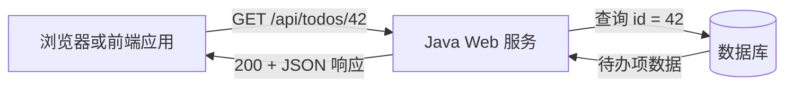

# 第 1 章　Java Web 后端学习地图与开发环境

> 学习提示：这一章先建立路线图，不要求安装工具，也不要求记住所有组件名称。
> 一句话总结：Java Web 后端负责接收请求、执行规则并组织数据；本课程会先搭好环境，再由 Java 语言基础逐步走到可运行的后端服务。

## 一、从前端页面到后端服务

前端工程师通常先接触页面、交互和浏览器请求。一个页面上的“查询商品”按钮被点击后，浏览器会向某个地址发送[[HTTP]]请求；后端服务收到请求，按业务规则读取或修改数据，再把结果作为 HTTP 响应交给浏览器。

先把这件事看成一次信息往返：

```text
浏览器准备请求 → Java 服务处理请求 → 数据库保存或读取事实 → Java 服务组织响应 → 浏览器显示结果
```

后端不是一个神秘的黑盒。它主要处理三类事情：

- 接收并校验客户端输入，例如路径、查询参数和 JSON 请求体。
- 执行业务规则，例如“库存不能为负数”“当前用户没有管理权限”。
- 读取、修改或异步传递数据，并把处理结果以稳定的接口格式返回。

这门课的目的不是让你一开始就把所有组件连起来，而是先把这条路径上每一段的责任分清。这样以后看到一个 Spring Boot 工程时，你能知道代码大致在处理请求、业务、数据还是运行环境。

## 二、Java 在这条路径中的位置

[[Java]]是一门编程语言。本课程会用它编写后端服务中的业务规则、数据对象和接口代码。Java 代码不会直接在浏览器中执行；它由 Java 运行环境执行，服务端进程持续等待并处理请求。

Java Web 开发常见的几个名字很容易混在一起。现在只需要知道它们各自的工作位置：

| 名称 | 现在先怎么理解 | 本课程何时系统学习 |
| --- | --- | --- |
| Java | 写程序的语言，以及配套标准库 | 第 3–16 章 |
| [[JDK]] | 编译、运行和开发 Java 程序所需的工具包 | 第 2 章 |
| [[JVM]] | 运行 Java class 文件的虚拟机 | 第 2 章先建立印象，第 35 章展开 |
| Spring Boot | 帮 Java 程序快速提供 Web 接口的框架 | 第 18 章 |
| 数据库 | 保存长期数据，例如用户、订单和商品 | 第 23–26 章 |
| Redis | 常用于缓存和短期数据访问的服务 | 第 32 章 |
| Kafka | 用于异步传递消息的系统 | 第 33 章 |
| Docker | 将应用及其运行环境打包为可复现容器的工具 | 第 29 章 |

其中，Java 与 Spring Boot 不是同一个东西。Java 是语言；Spring Boot 是建立在 Java 生态上的 Web 框架。数据库也不是 Java 的一部分，它是后端服务通过网络或驱动访问的独立系统。

## 三、一次请求怎样经过后端

先用一个很小的“查看待办项”场景建立直觉。浏览器请求 `/api/todos/42`，后端服务需要知道请求的是哪一条待办项，读取数据，并返回 JSON。



图中的 Java Web 服务并不是一段单独的代码。一个较常见的服务会分成几类职责：

- 接口层负责理解 HTTP 请求和组织 HTTP 响应。
- 业务层负责判断规则，例如待办项是否存在、当前用户能否查看。
- 数据访问层负责把查询交给数据库。

第 20 章会正式讲这种分层。现在不要急着记住 Controller、Service、Repository 这些名字；只要记住同一条请求里既有“和浏览器说话”的部分，也有“和数据说话”的部分。

## 四、以 JDK 17 作为课程主线

Java 会持续发布新版本。版本差异会影响语法、标准库和项目所能使用的运行环境。为了让整门课程的示例有一个稳定基线，本课程统一使用 JDK 17：所有主线代码都以它编译和运行，不使用 preview feature。

这不表示后续版本不重要。JDK 21 及之后的一些能力，例如虚拟线程和更多模式匹配语法，会在与它们有关的章节作为“版本旁路”说明，并明确最低版本。学习 Java 时，先看项目实际使用的 JDK，再判断某段语法能否使用，是一个很实用的习惯。

对于刚转向后端的前端工程师，可以先建立一个简单对应关系：浏览器端要关注浏览器兼容性；Java 服务端要关注 JDK 版本、构建工具和部署环境是否一致。第 2 章会让终端、IDE 与 Maven 都使用同一套 JDK 17。

## 五、课程学习路线

36 章被分成四个模块。它们不是四套互不相关的技术清单，而是一条从“能运行”到“能判断问题”的路线。

| 模块 | 章节 | 完成后应获得的能力 |
| --- | --- | --- |
| 环境介绍与准备 | 1–2 | 知道后端组件处在什么位置，并让电脑可以稳定运行 Java 17 项目 |
| Java 语言及标准库基础 | 3–16 | 能读写 Java 基础代码，理解对象、集合、异常和常用标准库 |
| 后端开发基础 | 17–29 | 能从 HTTP 契约实现一个带校验、数据访问、测试与 Docker 运行方式的 REST API |
| Java 进阶 | 30–36 | 能理解安全、缓存、消息、线程池、JVM，并按证据排查常见问题 |

学习时请按顺序推进。特别是第 4 章的方法、第 5 章的类型和第 6 章的引用关系，是后面阅读 Java 代码时会反复使用的基础。不要因为已经会 JavaScript 或 TypeScript 就跳过它们；两门语言在对象、类型、相等性和运行方式上都有需要重新建立的规则。

## 六、第 2 章结束时的环境结果

下一章不是“看完安装说明”就结束。完成第 2 章后，你应该能拿出下面四项证据：

1. 终端中 `java -version` 与 `javac -version` 的输出。
2. 一个自己创建并运行过的最小 Java 程序。
3. IDE 中同一个程序的运行结果。
4. Maven 的版本输出和一次成功构建结果。

如果四项结果都来自 Java 17，你就拥有了后续课程需要的最低环境。遇到问题时，不必靠重装软件碰运气；第 2 章会给出从 PATH、`JAVA_HOME`、IDE SDK 到 Maven Runner 的排查顺序。

## 七、常见误区

### 7.1 把 Java 当成 Spring Boot 的别名

Spring Boot 项目中会出现大量注解和配置，但它们建立在 Java 语言、类型、对象和异常等基础之上。第 3–16 章不是绕路，而是在为后面的框架代码补齐阅读能力。

### 7.2 以为后端开发只需要写接口

接口是后端的一部分。数据建模、输入校验、事务、日志、安全、缓存和运行环境同样会影响一个需求是否真正完成。课程会逐步进入这些部分，不会要求你在第一个接口里全部掌握。

### 7.3 先背组件名词再开始操作

现在不需要区分 Kafka 的每个角色，也不需要知道 Redis 的全部数据结构。先完成环境核验和 Java 基础，后面的名词会在实际需要时出现。

## 八、本章小结

Java Web 后端处在浏览器与数据系统之间：接收请求、执行规则、组织响应。Java 是写服务端代码的语言，Spring Boot、数据库、Redis、Kafka 和 Docker 则在不同阶段提供框架、数据、异步或运行能力。

你现在只需要带着这张地图进入第 2 章。下一步的目标很具体：让终端、IDE 和 Maven 使用同一套 JDK 17，并运行同一个最小程序。

## 九、快速自测

1. Java、Spring Boot 和数据库分别负责什么？
2. 浏览器查询一条数据时，Java 服务至少要完成哪两类工作？
3. 第 2 章结束时，为什么要同时核验终端、IDE 和 Maven？

参考答案：Java 用于编写程序；Spring Boot 帮 Java 程序提供 Web 能力；数据库保存数据。服务需要处理请求规则并组织数据访问与响应。三处都核验，是为了避免“本地能运行、构建时却使用了另一套 JDK”的环境错配。

## 参考文献

- OpenJDK. [Learn Java](https://dev.java/learn/).
- Oracle. [Java SE 17 Documentation](https://docs.oracle.com/en/java/javase/17/).
- Apache Maven. [Getting Started Guide](https://maven.apache.org/guides/getting-started/).
