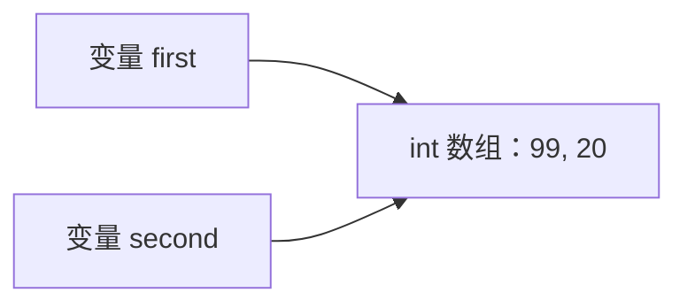

# 第 7 章　数组、字符串与控制流

> 学习提示：先分别运行数组、String 和循环的小例子，再把它们组合成一个文本处理程序。
> 一句话总结：数组用固定位置保存同类型数据，String 表示不可变文本；配合已经学过的分支、循环和方法，可以完成清晰的小型处理规则。

## 一、数组把一组同类型值放在固定位置

### 1.1 一个变量不够时需要数组

第 4 章的变量一次保存一个值：

```java
int firstScore = 60;
int secondScore = 75;
int thirdScore = 90;
```

当分数从 3 个变成 30 个时，继续增加 `first`、`second` 一类变量既难写，也不能用循环统一处理。[[数组]]把多个**同类型**值放进一组有顺序的位置。

```java
int[] scores = {60, 75, 90};
```

`int[]` 是“整数数组”这个类型；`scores` 是变量名；花括号里的三个整数是数组元素。数组的元素个数由 `length` 给出：

```java
int[] scores = {60, 75, 90};

System.out.println(scores.length); // 控制台输出：3
```

数组本身是对象，因此 `scores` 保存的是引用值。这一点和第 6 章的 String、StringBuilder 一样；不同的是，数组对象内部按位置保存了多个元素。

### 1.2 下标从 0 开始

数组中的每个位置都有[[下标]]。第一个元素的下标是 `0`，第二个是 `1`：

```java
int[] scores = {60, 75, 90};

System.out.println(scores[0]); // 控制台输出：60
System.out.println(scores[1]); // 控制台输出：75
System.out.println(scores[2]); // 控制台输出：90
```

可以把三个元素的位置画成：

```text
下标：     0     1     2
元素：    60    75    90
```

长度是 3，不代表可以访问 `scores[3]`。最后一个有效下标始终是 `length - 1`。下标小于 0，或不小于 `length`，运行时会抛出 `ArrayIndexOutOfBoundsException`：

```java
int[] scores = {60, 75, 90};

// System.out.println(scores[3]);
// 取消注释后，运行时抛出 ArrayIndexOutOfBoundsException
```

这里不是 Java “从 1 数错了”，而是数组的位置定义就是从 0 开始。循环条件为什么常写成 `index < array.length`，本章稍后会用这个规则解释。

### 1.3 创建数组与给元素赋值

花括号适合已经知道全部初始值的情况。也可以先创建指定长度的数组，再按下标填入：

```java
int[] quantities = new int[3];

quantities[0] = 2;
quantities[1] = 5;

System.out.println(quantities[0]); // 控制台输出：2
System.out.println(quantities[2]); // 控制台输出：0
```

`new int[3]` 创建了 3 个整数位置。整数数组的元素初始值为 `0`；`boolean` 数组的元素初始值为 `false`；引用类型数组的元素初始值为 `null`。这不违背“局部变量必须先初始化”：变量 `quantities` 已经被初始化为一个真实数组，只是数组内部位置由 JVM 给了对应类型的默认值。

数组创建后长度不能改变。要保存可增可减的数据，第 13 章会学习 `List`；现在先分清“固定长度数组”和“可变长度集合”是两种不同需求。

## 二、读取、修改与遍历数组

### 2.1 按下标读写元素

数组元素可以读取，也可以替换：

```java
String[] statuses = {"OPEN", "DONE", "CANCELLED"};

statuses[1] = "PROCESSING";

System.out.println(statuses[1]); // 控制台输出：PROCESSING
```

替换的是数组第 1 个位置保存的值，并没有改变数组长度。数组元素类型仍受类型系统约束，下面不能编译：

```java
int[] quantities = {2, 5};

// quantities[0] = "two"; // 编译错误：String 不能赋给 int 元素
```

### 2.2 普通 `for` 循环把下标变成变量

当要依次访问每个位置时，不能手写 `scores[0]`、`scores[1]`。第 4 章的 `for` 循环可以让 `index` 从 0 增加到最后一个有效下标：

```java
int[] scores = {60, 75, 90};

for (int index = 0; index < scores.length; index++) {
    System.out.println(scores[index]);
}
// 控制台依次输出：60、75、90
```

逐项看循环头：

| 片段 | 当前含义 |
| --- | --- |
| `int index = 0` | 从第一个下标开始 |
| `index < scores.length` | 只要下标仍在有效范围内就继续 |
| `index++` | 本轮结束后下标加 1 |
| `scores[index]` | 读取当前下标对应的元素 |

若写成 `index <= scores.length`，最后一轮 `index` 会等于 3，代码会访问不存在的 `scores[3]`。这就是数组越界最常见的来源。

### 2.3 增强 `for` 适合只读取每个元素

如果只关心元素本身、不关心位置，可以使用增强 `for`：

```java
String[] names = {"Ada", "Lin", "Mo"};

for (String name : names) {
    System.out.println(name);
}
// 控制台依次输出：Ada、Lin、Mo
```

它读作“从 `names` 中依次取出一个 String，命名为 `name`”。增强 `for` 不提供当前下标，因此不适合下面这些任务：修改指定位置、比较相邻元素、按位置插入分隔符。遇到这些任务，继续使用普通 `for`。

给增强 `for` 中的变量重新赋值，也不会替换数组位置：

```java
String[] names = {"Ada", "Lin"};

for (String name : names) {
    name = "已修改";
}

System.out.println(names[0]); // 控制台输出：Ada
```

`name` 是每轮循环得到的局部变量。它保存的是当前元素的值；把它改为另一个 String，不等于执行 `names[index] = ...`。

## 三、数组变量、引用与复制

### 3.1 赋值不会复制整组元素

数组是引用类型，所以数组变量赋值遵守第 6 章的引用复制规则：复制的是引用值，不是数组对象本身。

```java
int[] first = {10, 20};
int[] second = first;

second[0] = 99;

System.out.println(first[0]);  // 控制台输出：99
System.out.println(second[0]); // 控制台输出：99
```

`first` 和 `second` 指向同一个数组。通过 `second` 改动第 0 个位置后，`first` 当然会读到同一位置的新值。



### 3.2 需要独立副本时明确复制

如果两个变量后续要各自修改，就创建新数组。最直接的写法是 `clone()`；也可以在第 3 章学过 `import` 后使用 `Arrays.copyOf`：

```java
import java.util.Arrays;

int[] first = {10, 20};
int[] copy = Arrays.copyOf(first, first.length);

copy[0] = 99;

System.out.println(first[0]); // 控制台输出：10
System.out.println(copy[0]);  // 控制台输出：99
```

这份复制只复制数组这一层的元素。二维数组或元素本身也是可变对象时，是否需要更深层复制取决于数据结构；第 8 章学习对象后会再次看到这个边界。

## 四、String 表示不可变文本

### 4.1 String 也是引用类型

[[String]]用来表示文本。双引号产生 String 值：

```java
String title = " Java Web ";

System.out.println(title.length()); // 控制台输出：10，首尾空格也算字符
System.out.println(title.charAt(0)); // 控制台输出：空格
System.out.println(title.charAt(1)); // 控制台输出：J
```

`length()` 返回字符序列的长度；`charAt(index)` 按位置读取一个 `char`。它们同样使用从 0 开始的索引，因此 `charAt` 也可能越界。第 5 章解释过 `char` 是 UTF-16 代码单元；本章把它用于普通文本位置读取，不把它误当成任意 Unicode 字符的完整模型。

### 4.2 String 方法通常返回新文本

String 的重要规则是[[不可变]]：创建后，字符串对象的字符内容不能被原地改写。`strip()`、`toUpperCase()`、`substring()` 等方法会返回新的 String。

```java
String raw = "  paid  ";

raw.strip();
System.out.println(raw); // 控制台输出：两个首尾空格仍在

String cleaned = raw.strip();
System.out.println(cleaned); // 控制台输出：paid
```

想保留处理结果，必须把返回值赋给变量：

```java
String raw = "  paid  ";
String status = raw.strip().toUpperCase();

System.out.println(status); // 控制台输出：PAID
```

`strip()` 是 JDK 11 起提供的 Unicode 空白处理方法，JDK 17 可以直接使用。`trim()` 也常见，但它基于较旧的空白判断；本课程处理新文本时优先使用 `strip()`。

### 4.3 读取文本前先问“需要什么结果”

常见 String 操作回答不同问题：

| 需求 | 方法 | 结果 |
| --- | --- | --- |
| 是否包含某段文本 | `contains` | `boolean` |
| 是否以某段文本开始 | `startsWith` | `boolean` |
| 某段文本第一次出现的位置 | `indexOf` | 下标，找不到时为 `-1` |
| 截取一段文本 | `substring(begin, end)` | 新 String，包含 begin、不包含 end |
| 判断文本是否为空 | `isEmpty` | 长度是否为 0 |
| 判断去掉空白后是否为空 | `isBlank` | 是否没有非空白字符 |

```java
String text = "java-backend";

System.out.println(text.contains("back"));       // 控制台输出：true
System.out.println(text.indexOf('-'));            // 控制台输出：4
System.out.println(text.substring(0, 4));         // 控制台输出：java
System.out.println("   ".isEmpty());             // 控制台输出：false
System.out.println("   ".isBlank());             // 控制台输出：true
```

`substring(0, 4)` 的结束位置 4 不包含在结果中。这种“左闭右开”规则与数组循环的 `index < length` 是同一类边界思路。

### 4.4 文本内容继续用 equals 比较

第 6 章已经建立了相等性规则。本章处理状态文本时仍比较内容，不比较是否为同一个对象：

```java
String status = new String("PAID");

System.out.println(status.equals("PAID")); // 控制台输出：true
System.out.println(status == "PAID");      // 控制台输出：false
```

变量可能为 `null` 时，把已知非空的常量放在左边：

```java
String status = null;

System.out.println("PAID".equals(status)); // 控制台输出：false，不抛出异常
```

这不是让 `null` “变成空字符串”；它只是避免在 `null` 上调用方法。第 11 章会系统讨论异常边界，第 15 章再讨论“没有结果”怎样表达。

## 五、循环拼接文本时使用 StringBuilder

### 5.1 少量固定拼接可以使用 +

```java
String greeting = "你好，" + "Java";
System.out.println(greeting); // 控制台输出：你好，Java
```

这种少量、固定的拼接可读性很好。问题出现在循环中逐项累积文本：String 不可变，每次把新内容赋回 String 都是在得到一个新的文本结果。

### 5.2 StringBuilder 保存可追加的文本

[[StringBuilder]]专门用于逐步构造文本。第 6 章已经用它观察过“可变对象”，现在只学习三个必要操作：创建、`append`、`toString`。

```java
String[] names = {"Ada", "Lin", "Mo"};
StringBuilder builder = new StringBuilder();

for (int index = 0; index < names.length; index++) {
    if (index > 0) {
        builder.append(", "); // 从第二项开始加入分隔符
    }
    builder.append(names[index]);
}

String result = builder.toString();
System.out.println(result); // 控制台输出：Ada, Lin, Mo
```

`builder` 在循环中持续指向同一个可变对象；最后 `toString()` 得到普通 String。不要把“所有 `+` 都慢”当作规则：少量固定拼接继续用 `+`，需要循环累积或大量片段拼接时再选择 StringBuilder。

## 六、把数组、字符串与控制流组合起来

### 6.1 先把处理规则拆成小判断

现在处理一组原始状态文本：去掉首尾空白，跳过空输入，将已知状态映射为中文，再把结果拼成一行。它只使用第 4–6 章和本章已经解释过的语法。

```java
static String labelOf(String status) {
    return switch (status) {
        case "OPEN" -> "待处理";
        case "DONE" -> "已完成";
        case "CANCELLED" -> "已取消";
        default -> "未知状态";
    };
}
```

这段方法只负责映射一个已处理的状态。JDK 17 的箭头 `switch` 已在第 4 章出现：每个 `case` 直接产生一个结果，`default` 处理没有列出的值。第 9 章会用 `enum` 表示有限状态；当前仍用 String，避免提前引入新类型。

### 6.2 完整但仍然很小的程序

```java
public class StatusReportDemo {
    public static void main(String[] args) {
        String[] rawStatuses = {" open ", "done", "   ", "cancelled", "other"};
        StringBuilder report = new StringBuilder();

        for (String rawStatus : rawStatuses) {
            String status = rawStatus.strip().toUpperCase();

            if (status.isEmpty()) {
                continue; // 当前文本为空，结束本轮循环
            }

            if (report.length() > 0) {
                report.append("，"); // 不是第一项时补分隔符
            }
            report.append(labelOf(status));
        }

        System.out.println(report.toString());
        // 控制台输出：待处理，已完成，已取消，未知状态
    }

    static String labelOf(String status) {
        return switch (status) {
            case "OPEN" -> "待处理";
            case "DONE" -> "已完成";
            case "CANCELLED" -> "已取消";
            default -> "未知状态";
        };
    }
}
```

程序的处理顺序是：数组提供每一项输入；循环依次读取；`strip` 和 `toUpperCase` 返回规范化后的新文本；`if` 跳过空项；`switch` 把有限状态映射为显示文本；StringBuilder 在最后形成报告。这里没有集合、Stream、异常处理或业务对象，它们会在后续章节各自展开。

## 七、本章练习

### 7.1 预测数组与 String 的输出

不要先运行，写出下面四行输出并说明原因：

```java
int[] first = {1, 2};
int[] second = first;
second[1] = 9;

String raw = " Java ";
raw.strip();

System.out.println(first[1]);  // 1
System.out.println(second[1]); // 2
System.out.println(raw);       // 3
System.out.println(raw.strip()); // 4
```

答案：`9`、`9`、` Java `、`Java`。前两行来自数组引用别名；后两行来自 String 不可变，`strip()` 的返回值没有自动替换 `raw`。

### 7.2 修复循环边界

下面程序为何失败？只修改循环条件：

```java
int[] quantities = {2, 5, 1};

for (int index = 0; index <= quantities.length; index++) {
    System.out.println(quantities[index]);
}
```

应改为 `index < quantities.length`。最后一个有效下标是 2，而不是长度 3。

### 7.3 独立完成标签清洗

给定：

```java
String[] tags = {" java ", "", "Web", "java"};
```

要求：遍历数组，去掉首尾空白；跳过空文本；转成大写；以 ` | ` 连接。暂时不去重，第 13 章会处理唯一性。

完成标准：不越界；能够解释为何接住 String 方法返回值；分隔符只出现在两个有效标签之间；最后只调用一次 `toString()`。

## 八、常见误区

### 8.1 把长度当成最后一个下标

数组长度为 3 时，最后一个下标为 2。`length` 是元素个数，不是可访问的位置编号。

### 8.2 把 `array.length` 与 `text.length()` 混用

数组的 `length` 是字段，没有括号；String 的 `length()` 是方法，有括号。写错会在编译期暴露。

### 8.3 以为数组赋值会复制元素

`second = first` 复制的是引用值。需要独立数组时，显式复制；需要判断是否指向同一数组时，才使用 `==`。

### 8.4 以为 String 方法会原地修改变量

String 不可变。`strip()`、`toUpperCase()`、`substring()` 都返回新文本，必须接住结果。

### 8.5 在循环中错误地处理分隔符

每轮先追加分隔符会得到开头或结尾多余符号。使用 `index > 0`，或像完整示例那样检查 `builder.length() > 0`，只在已有内容后添加分隔符。

## 九、本章小结

数组让程序能够按固定位置保存同类型数据。下标从 0 开始，长度固定；普通 `for` 适合需要下标的遍历，增强 `for` 适合只读取元素。数组变量保存引用，赋值后可能形成别名。

String 是不可变文本，文本处理方法通常返回新 String。循环累积文本时，StringBuilder 能把追加动作集中起来。把数组、String、分支、循环和方法组合后，已经可以写出明确的文本规范化规则。下一章会学习如何把数据和操作组织进自定义类。

## 十、快速自测

1. 长度为 4 的数组有哪些有效下标？
2. 何时选普通 `for`，何时选增强 `for`？
3. 为什么 `String cleaned = raw.strip();` 需要新变量或重新赋值？
4. `int[] copy = original;` 是独立副本吗？
5. 循环中为什么常在最后调用一次 `StringBuilder.toString()`？

参考答案：0、1、2、3；需要下标或修改指定位置时选普通 `for`，只读取元素时选增强 `for`；String 不可变，方法返回新对象；不是，两个变量指向同一数组；因为 builder 在循环中累计内容，结束后再转换为 String。

## 参考文献

- Oracle. [Java SE 17 Language Specification: Arrays](https://docs.oracle.com/javase/specs/jls/se17/html/jls-10.html).
- Oracle. [String API, Java SE 17](https://docs.oracle.com/en/java/javase/17/docs/api/java.base/java/lang/String.html).
- Oracle. [StringBuilder API, Java SE 17](https://docs.oracle.com/en/java/javase/17/docs/api/java.base/java/lang/StringBuilder.html).
- Oracle. [Arrays API, Java SE 17](https://docs.oracle.com/en/java/javase/17/docs/api/java.base/java/util/Arrays.html).
