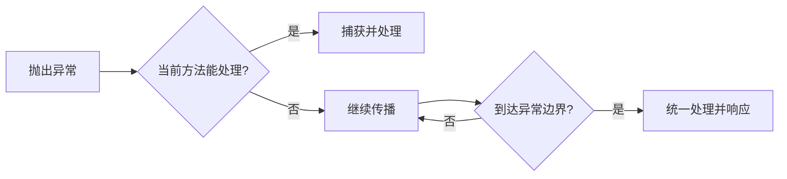

# 第 11 章　Java 异常与异常边界

> 学习提示：先读异常类型、消息和第一条指向自己代码的行号；不要把运行时错误当成编译问题，也不要从堆栈最后一行开始猜。
> 一句话总结：异常携带失败类型和位置信息；通过抛出、捕获和链式传递，程序在合适的边界处理失败而不丢失原因。

## 一、编译错误与运行时异常

第 3 章提到，Java 程序必须通过编译才能运行。编译阶段检查语法、类型和基本的名称解析，通过后生成 class 文件。但程序通过编译不意味着运行一定成功。

```java
int number = Integer.parseInt("abc");
```

这一行能通过编译——`Integer.parseInt` 接收 `String`、返回 `int`，类型完全匹配。但运行时会抛出 `NumberFormatException`，因为 `"abc"` 不是有效的整数表示。

[[编译错误]]发生在程序运行之前，报错信息会指出文件名、行号和原因，例如漏分号、类型不匹配或变量未声明。[[运行时异常]]（也叫运行期异常）发生在程序运行时，代码本身语法和类型正确，但执行到某一步时条件不允许操作继续。

| 对比维度 | 编译错误 | 运行时异常 |
| --- | --- | --- |
| 发生时间 | `javac` 阶段 | `java` 运行阶段 |
| 典型原因 | 语法错误、类型错误、未声明 | 非法参数、空值、下标越界 |
| 修复方式 | 修正源码后重新编译 | 修正逻辑、增加校验或捕获处理 |
| 能否被捕获 | 无"捕获"概念，必须修复 | 可用 try-catch 处理 |

零基础阶段最容易犯的混淆是：看到红字报错就认为"代码写错了需要重写语法"。先把编译错误修掉，再运行程序。如果运行后出现异常堆栈，则说明语法和类型已经通过编译检查，问题是出在运行逻辑上。

## 二、异常层次结构

Java 的异常对象有类型层次。理解这个层次有助于用正确的类型捕获和抛出异常。

```text
java.lang.Throwable
├── java.lang.Error（严重系统问题，通常不捕获）
│   └── OutOfMemoryError、StackOverflowError、NoClassDefFoundError
└── java.lang.Exception（程序可处理的失败）
    ├── RuntimeException（运行时异常，不强制声明）
    │   ├── NullPointerException
    │   ├── IllegalArgumentException
    │   ├── IndexOutOfBoundsException
    │   └── NumberFormatException
    └── 其他 Exception（受检异常，必须处理）
        ├── IOException
        ├── SQLException
        └── InterruptedException
```

[[Throwable]]是所有异常和错误的根类。[[Error]]表示 JVM 级别的严重问题，例如内存耗尽（`OutOfMemoryError`）、栈溢出（`StackOverflowError`）。业务代码通常不捕获 Error，因为捕获后也无法恢复。初学阶段只需认识它们的名字，看到堆栈中出现 `Error` 类型的报错先拿到完整信息再求助。

[[Exception]]是程序可以处理的失败。其中 [[RuntimeException]] 及其子类是运行时异常，编译器不要求声明或捕获；其他 Exception 的子类是[[受检异常]]，编译器要求方法要么捕获要么在签名中 `throws`。

## 三、读懂异常堆栈

异常发生时，Java 会输出[[堆栈]]（stack trace），包含异常类型、描述消息和调用路径。以下面这段代码为例：

```java
public class StackTraceDemo {
    static int parseInt(String input) {
        return Integer.parseInt(input); // 第 3 行
    }

    public static void main(String[] args) {
        String text = getInput();
        int number = parseInt(text); // 第 8 行
        System.out.println(number);
    }

    static String getInput() {
        return "abc"; // 第 12 行
    }
}
```

运行后输出：

```text
Exception in thread "main" java.lang.NumberFormatException: For input string: "abc"
    at java.base/java.lang.NumberFormatException.forInputString(NumberFormatException.java:67)
    at java.base/java.lang.Integer.parseInt(Integer.java:658)
    at StackTraceDemo.parseInt(StackTraceDemo.java:3)
    at StackTraceDemo.main(StackTraceDemo.java:8)
    at StackTraceDemo.getInput(StackTraceDemo.java:12)
```

阅读顺序是：

1. **第一行**：异常类型（`NumberFormatException`）和消息（`For input string: "abc"`），告诉你出了什么错以及导致错误的值。
2. **后续每一行**：`at 类名.方法名(文件.java:行号)`，表示从异常发生位置到 main 方法的完整调用路径。最上面的行是异常实际抛出的位置，通常是 JDK 内部代码。
3. **找自己代码的行号**：忽略 `java.base/` 开头的 JDK 内部行，找到第一行属于自己写的类。上例中 `StackTraceDemo.parseInt(StackTraceDemo.java:3)` 告诉我们 `parseInt` 方法的第 3 行——即 `Integer.parseInt(input)` 这行——收到了非法输入。

不要从堆栈底部开始猜测。底部是 `main`，它只是整个调用的起点。异常的实际根因在堆栈顶部附近，但需要跳过 JDK 内部方法，找到第一个自己代码的位置。

## 四、捕获能在当前位置处理的失败

### 4.1 try-catch 基础

`try` 包住可能抛出异常的语句，`catch` 接收特定类型的异常并给出处理：

```java
String input = "abc";

try {
    int number = Integer.parseInt(input);
    System.out.println("解析结果：" + number);
} catch (NumberFormatException exception) {
    System.out.println("输入不是有效整数：" + input);
}
```

控制台输出：

```text
输入不是有效整数：abc
```

`try` 块中，`Integer.parseInt` 抛出异常后，块内后续语句（`System.out.println`）不会执行，流程直接跳到对应的 `catch`。

捕获不等于忽略。catch 块中应该给出当前边界能做的合理处理，例如：

- 提示用户重新输入
- 使用默认值继续
- 记录日志后继续抛出一个更合适的异常
- 将失败转换为用户能理解的消息

空的 `catch` 块会让程序看似继续运行，但异常信息被完全丢弃：

```java
try {
    int number = Integer.parseInt(input);
} catch (NumberFormatException e) {
    // 什么都不做——异常被吞掉了
}
```

这是最常见也最危险的异常误用之一。保留一条日志记录都比完全空 catch 好。

### 4.2 多 catch 块

一个 `try` 块后面可以跟多个 `catch` 块，分别处理不同异常类型：

```java
try {
    String text = Files.readString(Path.of("config.txt"));
    int timeout = Integer.parseInt(text.trim());
    System.out.println("超时时间：" + timeout);
} catch (IOException exception) {
    System.out.println("读取配置文件失败：" + exception.getMessage());
} catch (NumberFormatException exception) {
    System.out.println("配置内容不是有效数字：" + exception.getMessage());
}
```

### 4.3 catch 顺序

多个 catch 块按书写顺序匹配。一旦某个 catch 匹配，后续 catch 不再检查。因此子类异常应该写在父类异常前面：

```java
try {
    // 可能抛出多种异常的操作
} catch (FileNotFoundException e) {     // IOException 的子类
    System.out.println("文件未找到");
} catch (IOException e) {               // IOException 和其他子类
    System.out.println("IO 错误");
}
```

如果把 `catch (IOException e)` 写在前面，`FileNotFoundException` 会被父类 catch 提前捕获，子类 catch 永远不会执行。编译器会检测到这种"不可达的 catch 块"并报错。

### 4.4 finally

`finally` 块中的代码无论 `try` 是否抛出异常、`catch` 是否捕获到，都会执行：

```java
try {
    System.out.println("尝试打开资源");
    throw new RuntimeException("模拟失败");
} catch (RuntimeException e) {
    System.out.println("捕获到：" + e.getMessage());
} finally {
    System.out.println("finally 始终执行");
}
```

控制台输出：

```text
尝试打开资源
捕获到：模拟失败
finally 始终执行
```

即使 `catch` 中包含 `return` 或再次 `throw`，`finally` 仍然会在控制转移之前执行。`finally` 传统上用于释放资源（关闭文件、网络连接等），但 Java 7 引入了更好的 try-with-resources。

### 4.5 try-with-resources 与异常屏蔽

对于实现 `AutoCloseable` 接口的资源（文件、网络流、数据库连接等），try-with-resources 会在代码块结束时自动关闭资源：

```java
Path path = Path.of("data.txt");
try (BufferedReader reader = Files.newBufferedReader(path)) {
    String firstLine = reader.readLine();
    System.out.println("第一行：" + firstLine);
}
```

`reader` 的作用域在 `try` 括号内。无论块内是否抛出异常，`reader.close()` 都会被自动调用。不需要手动写 `finally`。

当 try 块抛出异常，同时 `close()` 也抛出异常时，try 块中原始的异常会被保留，`close()` 抛出的异常被添加为[[被抑制异常]]（suppressed exceptions）。原始异常可通过 `getSuppressed()` 获取被抑制的异常列表。这种机制保证了主要失败原因不会被资源关闭时产生的次要异常覆盖。

## 五、throw 与 throws

### 5.1 throw：主动创建并抛出异常

方法发现调用方传入非法值时，可以主动 `throw` 一个异常对象：

```java
static double divide(double left, double right) {
    if (Math.abs(right) < 1e-10) {
        throw new IllegalArgumentException("除数不能为 0");
    }
    return left / right;
}
```

```java
System.out.println(divide(10, 0)); // 抛出 IllegalArgumentException
```

`throw` 语句后面必须是一个 Throwable 实例。程序执行到 `throw` 时会立即终止当前方法的正常流程，异常沿调用链向上传播。

### 5.2 throws：声明方法可能抛出的异常

`throws` 写在方法声明中，表示该方法可能抛出某种受检异常，调用方必须处理：

```java
static String readConfig() throws IOException {
    return Files.readString(Path.of("config.properties"));
}
```

调用方可以选择继续抛出：

```java
static void startApp() throws IOException {
    String config = readConfig();
}
```

或者捕获处理：

```java
static void startApp() {
    try {
        String config = readConfig();
    } catch (IOException e) {
        System.out.println("启动失败，使用默认配置");
    }
}
```

运行时异常不要求 `throws` 声明，但可以选择性声明以提醒调用方。受检异常的 `throws` 是方法签名的一部分，覆盖的方法不能 throws 比父类更宽的受检异常。

## 六、受检异常与运行时异常的选择

### 6.1 编译器行为的差异

```java
// 受检异常：必须处理
void writeFile() {
    // Files.writeString(path, content); // 编译错误：Unhandled IOException
}

// 运行时异常：可选处理
void parseIntExample() {
    Integer.parseInt("abc"); // 编译通过，运行时抛 NumberFormatException
}
```

受检异常的设计意图是：调用方有能力并且应该处理这类失败。例如文件操作可能因磁盘满、权限不足或路径不存在而失败，调用方通常需要知道并做出反应。

运行时异常的设计意图是：这类失败通常由编程错误引起（空值、越界、非法参数），或者在当前边界无法合理恢复。调用方不需要在每个方法调用处都处理空指针异常。

### 6.2 实际判断方法

初学阶段不必死记哪些是受检异常。遇到新 API 时观察：

- 如果 IDE 提示"Unhandled exception"并要求加 `try` 或 `throws`，这个 API 抛出的就是受检异常。
- 如果编译能通过但运行时报错，就是运行时异常。

一个实用的判断：调用方是否能给出合理的恢复动作？如果有（比如重试、默认值、提示用户），适合受检异常。如果调用方不管怎么处理都只能让程序继续崩溃或把错误往上传，适合运行时异常。

## 七、保留原始原因

底层失败有时需要转换成当前层能理解的异常类型，但不能丢失原始原因：

```java
try {
    return Files.readString(path);
} catch (IOException exception) {
    throw new IllegalStateException("读取配置失败：" + path, exception);
}
```

第二个参数 `exception` 是[[cause]]（原因）。之后查看堆栈时，顶部是 `IllegalStateException`，下面会跟着 `cause` 指向的 `IOException`，再下面是 `IOException` 的原始堆栈。这样既能知道"读取配置失败"，也能追踪到具体的 I/O 错误。

如果只写 `throw new IllegalStateException("读取配置失败")` 而不传 cause，原始异常被丢弃，排查时需要重新猜测底层原因。

异常链可以有多层，但层数通常不会超过两到三层。每增加一层都会让堆栈更长，建议只在跨层转换时使用。

## 八、自定义异常

当标准库异常不足以表达业务语义时，可以自定义异常类：

```java
public class InsufficientStockException extends RuntimeException {
    public InsufficientStockException(String productId, int requested, int available) {
        super("商品 " + productId + " 库存不足，需求 " + requested + "，可用 " + available);
    }
}
```

自定义异常通常包含：

- 一个有意义的类名，一看就知道发生了什么业务失败
- 一个带详细消息的构造器，最好包含导致失败的具体数据
- 选择继承 `RuntimeException`（调用方不强制处理）还是 `Exception`（调用方必须处理），取决于调用方是否能合理恢复

通常无状态的业务校验、参数非法、前置条件不满足适合继承 `RuntimeException`；文件操作、网络调用等外部依赖失败适合继承 `Exception`（受检异常）。同一项目中保持一致即可。

## 九、异常边界设计

[[异常边界]]是异常在代码层次间传播时"到此为止"的位置。基本原则是：在能决定怎样恢复或怎样呈现失败的边界上处理它。

- 底层工具方法：校验参数后抛出运行时异常，或把受检异常转换后再抛出。
- 中层业务方法：可以补充业务上下文后继续抛出，或捕获后执行补偿逻辑。
- 顶层入口（例如 main、Web API 控制器）：捕获已知异常类型，转换成用户可见的消息或 HTTP 响应。

```java
// 底层：抛出具体异常
static Order findOrder(String id) {
    if (id == null || id.isBlank()) {
        throw new IllegalArgumentException("订单 ID 不能为空");
    }
    // ...查找逻辑
}

// 中层：捕获并转换
OrderDTO getOrderDTO(String id) {
    try {
        Order order = findOrder(id);
        return toDTO(order);
    } catch (IllegalArgumentException e) {
        throw new BusinessException("查询订单失败", e);
    }
}

// 顶层：呈现给用户
public static void main(String[] args) {
    try {
        OrderDTO dto = getOrderDTO(userInput);
        System.out.println("订单：" + dto);
    } catch (BusinessException e) {
        System.out.println("业务错误：" + e.getMessage());
    } catch (Exception e) {
        System.out.println("系统错误，请联系管理员");
    }
}
```

第 21 章会学习 Spring Boot 中如何使用全局异常处理器统一管理 Web API 层的异常边界。

流程如下：



## 十、练习

### 练习 1：读懂堆栈

运行以下代码，写出完整的堆栈输出，并圈出第一行属于自己代码的行号：

```java
public class StackReader {
    static int step1(String input) {
        return step2(input);
    }
    static int step2(String input) {
        return Integer.parseInt(input);
    }
    public static void main(String[] args) {
        System.out.println(step1("xyz"));
    }
}
```

完成标准：能指出异常类型、消息和实际抛出位置。

### 练习 2：安全的数值解析

实现 `static int safeParseInt(String input, int defaultValue)`，解析输入字符串为整数。如果输入为 `null`、空字符串或非数字格式，不抛出异常，返回 `defaultValue`。

完成标准：对 `"42"`、`""`、`"abc"`、`null` 四种输入都能在不抛出异常的情况下返回正确结果。

### 练习 3：文件处理中的异常边界

写一个方法 `static long countNonBlankLines(String filePath)`，使用 `Files.lines` 逐行读取文件，返回非空行数。处理以下异常：

- 文件不存在：输出"文件未找到，返回 0"并返回 0
- 其他 I/O 错误：输出完整堆栈后抛出 `IllegalStateException`，保留原始原因
- 无论如何都确保文件资源关闭

完成标准：能解释为什么使用 try-with-resources；`IllegalStateException` 的 cause 必须是原始 IOException。

## 常见误区

### 捕获 Exception 后什么也不做

空 catch 块是排第一的异常误用。它会吞掉所有失败信息，让调用方和运维人员完全不知道发生了什么。即使只是临时调试，也应该至少输出堆栈：`catch (Exception e) { e.printStackTrace(); }`。

### 用异常代替普通分支

输入是否为空、范围是否合法、状态是否允许，这些可预测的判断先用 `if` 语句。异常适合表示运行时无法按正常规则继续的情况，不适合作为控制流。异常处理的开销远高于普通分支。

### 捕获太宽的类型

`catch (Exception e)` 会捕获所有 Exception 子类，包括 `NullPointerException`、`ArrayIndexOutOfBoundsException` 等本应由编程错误导致的异常。这会掩盖代码的逻辑问题。优先捕获一个或多个具体异常类型。

### 重新抛出却不传 cause

```java
catch (IOException e) {
    throw new RuntimeException("失败"); // 丢失 cause
}
```

这样转换异常时，调用方只知道"失败"，无法追溯到底是文件不存在、磁盘满还是权限不足。始终传入原始异常做 cause。

## 本章小结

Java 的异常机制让程序在运行时保存失败类型和上下文。编译错误和运行时异常的区别在于发生阶段不同，堆栈的阅读方法是从上往下找到第一行自己代码的位置。try-catch 处理可恢复的失败，try-with-resources 自动关闭资源并保留原始异常。受检异常要求调用方处理，运行时异常则适合编程错误或无法合理恢复的场景。throw 创建并抛出异常对象，throws 声明可能传播的受检异常类型，cause 保留异常链的原始根因。自定义异常让业务语义更清晰，异常边界决定了在代码的哪个层次处理或呈现失败。掌握这些基础之后，第 21 章会在 Spring Boot 的全局异常处理器中看到它们的实际应用。

## 快速自测

1. 编译错误和运行时异常各自发生在什么阶段？
2. 阅读堆栈时，应该从第一行还是最后一行开始？为什么？
3. `throw` 和 `throws` 在语法和作用上有什么区别？
4. 空 catch 块为什么是危险的？
5. 为什么转换异常时需要传入原始异常作为 cause？

参考答案：编译错误在 `javac` 阶段，运行时异常在 `java` 阶段；从堆栈顶部附近开始，找到第一条属于自己代码的行号，因为那里保存了实际产生异常的调用位置；throw 是语句，创建并抛出异常对象，throws 是方法声明，指明可能抛出的受检异常类型；空 catch 块丢失所有异常信息，导致调用方不知道失败原因；不传 cause 会丢失原始失败根因，排查时需要重新猜测原因。

## 参考文献

- Oracle. [Java SE 17 API: Throwable](https://docs.oracle.com/en/java/javase/17/docs/api/java.base/java/lang/Throwable.html).
- Oracle. [Java SE 17 API: AutoCloseable](https://docs.oracle.com/en/java/javase/17/docs/api/java.base/java/lang/AutoCloseable.html).
- Oracle. [Java SE 17 Language Specification: Exceptions](https://docs.oracle.com/javase/specs/jls/se17/html/jls-11.html).
