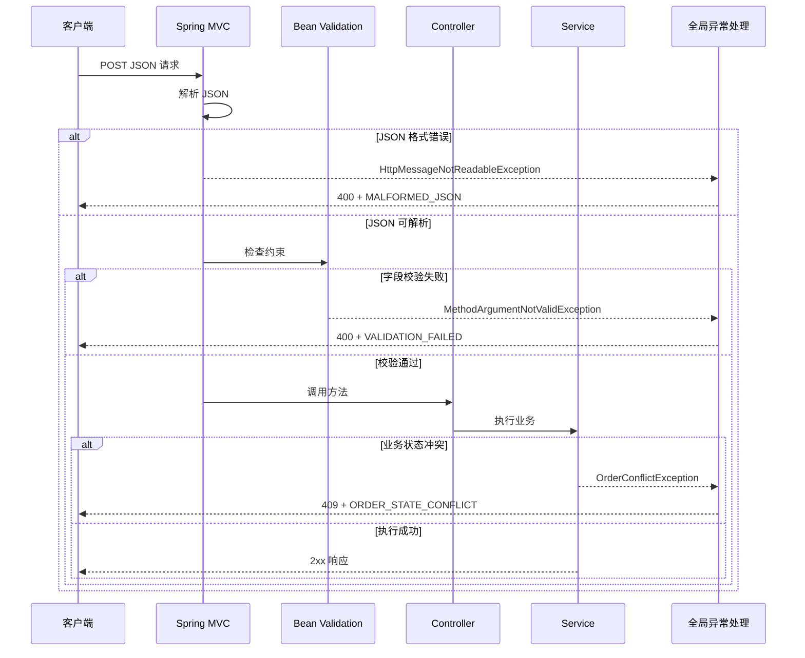

# 第 21 章　参数校验、全局异常与错误响应

> 学习提示：先用一个字段完成最小校验，再逐步增加嵌套对象、异常分类和错误契约；本章不限制完成时间  
> 一句话总结：参数校验负责判断输入是否符合约定，全局异常处理负责把失败转换成含义清楚、结构稳定且不泄露内部信息的 HTTP 响应。

## 一、参数校验的基本概念

### 1.1 后端接收的输入

Web 后端的工作通常从接收请求开始。请求中的数据可能来自不同位置：

| 输入位置 | 示例 | Spring MVC 中的常见写法 |
| --- | --- | --- |
| 路径 | `/users/42` 中的 `42` | `@PathVariable` |
| 查询参数 | `/users?page=2` 中的 `page` | `@RequestParam` |
| 请求头 | `Authorization` | `@RequestHeader` |
| 请求体 | POST 请求中的 JSON | `@RequestBody` |

这些数据都来自服务边界之外。浏览器表单可以限制输入，但调用者也可能是手机应用、脚本、第三方系统，甚至是手工发送请求的人。后端需要自己检查输入。

[[参数校验]]是按照预先声明的规则检查输入，并在输入不符合规则时停止当前操作。例如：

- 用户名不能是空白字符串。
- 数量必须大于 0。
- 邮箱要符合基本格式。
- 订单列表至少有一项。

这些规则描述的是接口允许接收什么数据，也叫[[约束]]。

### 1.2 校验失败与程序异常

校验失败表示“请求没有满足接口约定”。它通常不是服务器程序崩溃，也不应该返回成功结果。

Spring MVC 在处理请求时，会把不同失败表示成不同异常。[[异常]]是 Java 描述非正常执行情况的对象，第 11 章已经讲过它的基础语法。当前只需要回忆这条路径：

```text
发现失败 → 创建或抛出异常 → 调用栈向外传播 → 某个边界捕获并处理
```

Controller 是 HTTP 边界的一部分。如果每个 Controller 都重复写 `try/catch` 和错误响应，代码会迅速变乱。Spring 提供全局异常处理机制，让多个 Controller 共用一组转换规则。

[[全局异常处理]]在这里指：集中接收 Controller 处理过程中出现的异常，再把它们转换为 HTTP 状态码和响应体。

### 1.3 三类失败先分开

学习注解之前，先区分失败的性质：

| 失败类型 | 判断内容 | 示例 | 常见 HTTP 状态 |
| --- | --- | --- | --- |
| 输入校验失败 | 数据的结构、格式或范围不符合接口约定 | 用户名空白、数量为 0 | 400 Bad Request |
| 业务规则失败 | 输入格式正确，但当前业务状态不允许操作 | 用户名已存在、订单已取消 | 409 Conflict 或团队约定状态 |
| 系统执行失败 | 服务本身或依赖没有正常完成工作 | 数据库不可用、程序缺陷 | 500 或 503 |

这三类失败不能只靠一组字段注解解决。字段约束适合输入结构；业务规则通常放在 Service；系统故障要保留日志和调用链证据。

## 二、Bean Validation 与约束注解

### 2.1 Bean Validation 的作用

[[Bean Validation]]是 Java 生态中用于声明和执行对象约束的规范。开发者在字段、方法参数或类型使用位置添加注解，验证器读取这些注解并检查实际值。

注解是一种附加在代码元素上的元数据。它本身不是 `if` 语句。Spring 在合适的请求处理阶段调用验证器，验证器才会执行约束检查。

Spring Boot 3.x 项目通常通过下面的 starter 引入实现：

```xml
<dependency>
    <groupId>org.springframework.boot</groupId>
    <artifactId>spring-boot-starter-validation</artifactId>
</dependency>
```

课程示例使用 Spring Boot 3.x，因此导入路径以 `jakarta.validation` 开头：

```java
import jakarta.validation.Valid;
import jakarta.validation.constraints.NotBlank;
```

旧教程中的 `javax.validation.*` 属于 Spring Boot 2.x 常见写法，不能直接复制到 Boot 3.x 项目。

### 2.2 第一个约束

下面的请求对象只有一个字段：

```java
public record RegisterUserRequest(
        @NotBlank(message = "用户名不能为空")
        String username
) {
}
```

这段代码使用了第 9 章学过的 record。`@NotBlank` 作用在 String 上，要求值满足两个条件：

1. 不能是 `null`。
2. 去掉首尾空白后，至少还有一个字符。

`message` 是约束失败时提供的默认提示。它适合给人阅读，前端程序不应把这段中文当作稳定判断条件。

### 2.3 常用约束的区别

几个名字相近的注解检查内容不同：

| 约束 | 适用数据 | 允许 `null` | 主要检查 |
| --- | --- | --- | --- |
| `@NotNull` | 任意引用类型 | 不允许 | 值不能为 `null` |
| `@NotEmpty` | String、集合、数组、Map | 不允许 | 值存在且长度或元素数大于 0 |
| `@NotBlank` | 字符串 | 不允许 | 去掉空白后仍有字符 |
| `@Positive` | 数值 | 默认允许 | 值必须大于 0 |
| `@Min(1)` | 整数类数值 | 默认允许 | 值不能小于 1 |
| `@Size(min = 1, max = 20)` | String、集合、数组、Map | 默认允许 | 长度或元素数在范围内 |
| `@Email` | 字符串 | 默认允许 | 符合实现支持的邮箱格式检查 |

许多约束把 `null` 交给 `@NotNull` 处理。例如，一个邮箱既不能空，又要检查格式，通常组合使用：

```java
@NotBlank(message = "邮箱不能为空")
@Email(message = "邮箱格式不正确")
String email
```

约束的完整语义要以 Jakarta Validation 规范和 API 文档为准，不能只根据注解名称猜测。

### 2.4 基本类型与包装类型

请求字段如果使用基本类型 `int`，它不可能为 `null`。当 JSON 缺少字段时，反序列化结果可能落到基本类型默认值 `0`，程序无法区分“调用者没传”和“调用者明确传了 0”。

需要区分这两种输入时，使用包装类型 `Integer`：

```java
@NotNull(message = "年龄不能为空")
@Positive(message = "年龄必须大于 0")
Integer age
```

`@NotNull` 负责缺失值，`@Positive` 负责数值范围。两条规则的职责不同。

## 三、在 Controller 中触发校验

### 3.1 `@RequestBody` 与 `@Valid`

第 18 章已经使用过 `@RestController`、`@PostMapping` 和 `@RequestBody`。这里再明确两个与校验有关的步骤：

1. `@RequestBody` 让 Spring MVC 把 JSON 请求体转换成 Java 对象。
2. `@Valid` 要求 Spring 在调用 Controller 方法之前验证这个对象。

最小 Controller 如下：

```java
@RestController
@RequestMapping("/users")
public class UserController {

    @PostMapping
    public String create(
            @Valid @RequestBody RegisterUserRequest request) {
        return "created: " + request.username();
    }
}
```

如果请求是：

```json
{
  "username": "alice"
}
```

对象通过校验，Controller 方法继续执行。如果 `username` 是 `null`、空字符串或只有空格，校验失败，Controller 方法不会被调用。

### 3.2 `@Valid` 不等于非空

`@Valid` 的职责是触发对目标对象及其级联对象的验证。它本身不是“不能为空”的约束。

如果某个嵌套对象既要存在，又要继续验证内部字段，要把两个意图分别写出来：

```java
@NotNull(message = "地址不能为空")
@Valid
AddressRequest address
```

`@NotNull` 检查 `address` 是否存在，`@Valid` 继续检查 `AddressRequest` 内部的约束。

## 四、第一次观察校验结果

### 4.1 使用 curl 发送请求

测试框架将在第 27 章系统讲解。本章先使用第 17 章接触过的 curl 观察真实 HTTP 响应。

启动应用后，发送一个合法请求：

```bash
curl -i \
  -H "Content-Type: application/json" \
  -d '{"username":"alice"}' \
  http://localhost:8080/users
```

再发送一个空白用户名：

```bash
curl -i \
  -H "Content-Type: application/json" \
  -d '{"username":"   "}' \
  http://localhost:8080/users
```

第二个请求应该得到 `400 Bad Request`。先确认状态码即可。Spring Boot 的默认错误响应适合开发阶段观察，但它不是团队已经设计好的稳定接口契约。

### 4.2 请求体格式错误不等于字段校验失败

下面的内容不是合法 JSON：

```json
{
  "username": "alice",
}
```

此时 Spring 连 `RegisterUserRequest` 对象都无法创建，Bean Validation 还没有机会执行。Spring MVC 通常以 `HttpMessageNotReadableException` 表示请求体无法读取。

所以，两个请求都可能返回 400，但原因不同：

- JSON 可以解析，对象字段违反约束。
- JSON 本身无法解析。

错误响应应保留这种差异，至少使用不同错误码。

## 五、校验异常与最小全局处理器

### 5.1 请求对象校验失败的异常

对 `@Valid @RequestBody` 这种常见写法，字段校验失败通常产生 `MethodArgumentNotValidException`。异常对象中包含绑定与校验结果，包括字段名、被拒绝的值和提示消息。

Controller 不必自己捕获它。异常会沿 Spring MVC 请求处理链向外传播，交给异常解析机制。

### 5.2 `@RestControllerAdvice` 的作用

[[Controller Advice]]可以为多个 Controller 提供共用的异常处理方法。`@RestControllerAdvice` 表示这些方法的返回值直接写入 HTTP 响应体。

先做一个最小错误对象：

```java
public record SimpleError(
        String code,
        String message
) {
}
```

再处理校验异常：

```java
@RestControllerAdvice
public class GlobalApiExceptionHandler {

    @ExceptionHandler(MethodArgumentNotValidException.class)
    @ResponseStatus(HttpStatus.BAD_REQUEST)
    SimpleError handleValidation(
            MethodArgumentNotValidException exception) {
        return new SimpleError(
                "VALIDATION_FAILED",
                "请求参数不符合接口约定"
        );
    }
}
```

三个注解各有职责：

| 注解 | 作用 |
| --- | --- |
| `@RestControllerAdvice` | 把类注册为多个 Controller 共用的响应式异常处理组件 |
| `@ExceptionHandler(...)` | 指定这个方法处理哪类异常 |
| `@ResponseStatus(...)` | 指定返回的 HTTP 状态 |

现在校验失败时，客户端会收到稳定的程序错误码，而不是依赖 Java 异常类名：

```json
{
  "code": "VALIDATION_FAILED",
  "message": "请求参数不符合接口约定"
}
```

这已经形成最小闭环：声明约束、触发校验、捕获异常、返回错误响应。

## 六、返回字段级错误

### 6.1 字段级错误的用途

只有通用消息时，前端仍不知道哪个输入框需要提示。可以为每条字段错误增加路径与消息：

```java
public record FieldViolation(
        String field,
        String message
) {
}
```

错误响应增加列表：

```java
public record ApiError(
        String code,
        String message,
        List<FieldViolation> violations
) {
}
```

这里的 List 是第 13 章学过的集合，record 是第 9 章学过的类型。

### 6.2 从异常中读取字段错误

`MethodArgumentNotValidException` 的 `getBindingResult()` 可以读取字段错误。第 14 章学过 Stream 后，下面的转换应该已经可以阅读：

```java
@ExceptionHandler(MethodArgumentNotValidException.class)
@ResponseStatus(HttpStatus.BAD_REQUEST)
ApiError handleValidation(
        MethodArgumentNotValidException exception) {

    List<FieldViolation> violations = exception
            .getBindingResult()
            .getFieldErrors()
            .stream()
            .map(error -> new FieldViolation(
                    error.getField(),
                    error.getDefaultMessage()))
            .toList();

    return new ApiError(
            "VALIDATION_FAILED",
            "请求参数不符合接口约定",
            violations
    );
}
```

响应可能变为：

```json
{
  "code": "VALIDATION_FAILED",
  "message": "请求参数不符合接口约定",
  "violations": [
    {
      "field": "username",
      "message": "用户名不能为空"
    }
  ]
}
```

`code` 给程序判断，`message` 给人阅读，`violations` 帮助界面定位字段。三者不要混用。

## 七、嵌套对象校验

### 7.1 从单层对象扩展到列表

基础闭环完成后，再进入订单请求。一个订单包含客户编号和多条商品记录：

```java
public record OrderLineRequest(
        @NotBlank(message = "商品编号不能为空")
        String productId,

        @NotNull(message = "数量不能为空")
        @Positive(message = "数量必须大于 0")
        Integer quantity
) {
}
```

外层请求如下：

```java
public record CreateOrderRequest(
        @NotBlank(message = "客户编号不能为空")
        String customerId,

        @NotEmpty(message = "订单至少包含一个商品")
        @Valid
        List<OrderLineRequest> lines
) {
}
```

这次有两类检查：

- `@NotEmpty` 检查 `lines` 不是 `null`，并且至少有一个元素。
- `@Valid` 要求验证器继续检查列表元素中的 `productId` 和 `quantity`。

缺少 `@Valid` 时，列表本身可能通过 `@NotEmpty`，但元素内部的约束不会按预期级联执行。

### 7.2 字段路径

如果第一条商品记录的数量是 0，字段路径通常类似：

```text
lines[0].quantity
```

这个路径可以直接帮助前端找到列表中的具体输入项。错误处理器应保留这种定位信息，而不是把所有消息拼成一个无法解析的长字符串。

## 八、业务校验与业务异常

### 8.1 注解适合结构规则

约束注解适合检查局部、可重复的输入规则，例如非空、长度、数值范围和格式。它们不适合承担所有业务判断。

下面这些问题通常需要 Service、领域对象或数据库参与：

- 用户名是否已经存在。
- 当前用户是否有权限修改订单。
- 库存是否足够。
- 订单当前状态是否允许取消。

如果自定义 Validator 每次都查询数据库，校验过程会隐藏 I/O，难以测试，也难以控制事务和超时。

### 8.2 用有含义的异常表示业务冲突

假设 Service 发现订单已经取消，可以抛出业务异常：

```java
public class OrderConflictException
        extends RuntimeException {

    public OrderConflictException(String message) {
        super(message);
    }
}
```

全局处理器把它映射为 409：

```java
@ExceptionHandler(OrderConflictException.class)
@ResponseStatus(HttpStatus.CONFLICT)
ApiError handleOrderConflict(
        OrderConflictException exception) {

    return new ApiError(
            "ORDER_STATE_CONFLICT",
            exception.getMessage(),
            List.of()
    );
}
```

校验错误与业务冲突都属于“已知失败”，但它们含义不同。前者通常是 400，后者可以使用 409 或团队明确约定的其他状态。

## 九、系统异常与信息边界

### 9.1 未知异常不能直接返回内部消息

数据库驱动、HTTP Client 和第三方 SDK 的异常消息可能包含表名、SQL 片段、服务器地址或其他内部信息。下面的写法不安全：

```java
return new SimpleError(
        "INTERNAL_ERROR",
        exception.getMessage()
);
```

未知异常要分两路处理。服务端日志记录完整异常、堆栈和关联标识；客户端只收到 `INTERNAL_ERROR` 一类稳定错误码和“服务暂时无法完成请求”这样的通用消息。

实际处理器需要使用第 19 章配置过的日志组件记录 `exception`，再返回不含内部细节的 `SimpleError`。这里不提前引入一套新的日志 API。兜底处理器只能防止信息泄露，不能代替具体异常分类；已知的校验、JSON 解析和业务冲突仍要分别处理。

### 9.2 错误响应可以逐步扩展

实际项目通常还会加入：

| 字段 | 用途 | 注意点 |
| --- | --- | --- |
| `timestamp` | 记录响应产生时间 | 使用统一格式和时区 |
| `path` | 标明失败的请求路径 | 不包含敏感查询参数 |
| `traceId` | 关联客户端报告与服务端日志 | 需要链路组件真正生成并传递 |
| `violations` | 返回字段路径与提示 | 只在相关错误中出现或返回空列表 |

这些字段共同形成[[错误契约]]。契约一旦被前端和其他调用者依赖，字段名、类型和错误码就不应随异常类重命名而改变。

## 十、方法参数校验

### 10.1 直接写在方法参数上的约束

请求对象校验之外，约束也可以直接写在 Controller 方法参数上：

```java
@GetMapping("/{id}")
public String findById(
        @PathVariable
        @Positive(message = "用户编号必须大于 0")
        Long id) {
    return "user-" + id;
}
```

Spring Framework 6.1+ 为 Spring MVC 提供内置的方法级校验。根据方法签名，直接参数约束失败可能以 `HandlerMethodValidationException` 表示，而 `@Valid @RequestBody` 对象校验常见的是 `MethodArgumentNotValidException`。

如果错误契约要求两类校验返回相同结构，全局处理器需要覆盖两条路径。不要在刚学会 `@Valid` 时一次塞入所有异常类型；先完成对象校验闭环，再补方法级校验。

### 10.2 `@Validated` 的版本边界

旧教程常在 Controller 类上添加 Spring 的 `@Validated`，通过 AOP 触发方法校验。Spring MVC 6.1+ 已有内置方法校验，类级 `@Validated` 可能使请求走另一套代理校验路径。

课程以 Spring Boot 3.5.x、Spring Framework 6.2 为当前预览基线。迁移旧项目时，应依据公司锁定版本查看官方文档并运行契约测试，不能机械添加或删除 `@Validated`。

## 十一、完整错误处理流程

基础概念和各类异常都认识后，可以把一次请求串起来：



图中每一步都对应前面已经讲过的概念。全局异常处理不是把所有失败变成同一个响应，而是在一个位置维护分类与转换规则。

## 十二、本章练习

### 12.1 为注册请求增加约束

已有请求对象：

```java
public record RegisterUserRequest(
        String username,
        String email,
        Integer age
) {
}
```

请增加约束：

1. 用户名不能为 `null`、空字符串或纯空格。
2. 邮箱不能为空，并通过邮箱格式检查。
3. 年龄不能为空，且必须大于 0。

完成后，用 curl 分别发送合法请求、空用户名、错误邮箱和缺失年龄。记录 HTTP 状态及响应体。

### 12.2 参考答案

```java
public record RegisterUserRequest(
        @NotBlank(message = "用户名不能为空")
        String username,

        @NotBlank(message = "邮箱不能为空")
        @Email(message = "邮箱格式不正确")
        String email,

        @NotNull(message = "年龄不能为空")
        @Positive(message = "年龄必须大于 0")
        Integer age
) {
}
```

合法请求应进入 Controller。其他三类请求应返回 400，并在 `violations` 中出现对应字段。邮箱为空时应由 `@NotBlank` 报错；邮箱非空但格式不正确时由 `@Email` 报错。同一字段存在多条失败消息时，是否全部保留要由团队错误契约决定并用测试固定。

### 12.3 失败分类

为下面四种失败指定 HTTP 状态和稳定错误码：

1. `username` 为空。
2. 用户名格式正确，但数据库中已经存在。
3. 请求体不是合法 JSON。
4. 数据库连接超时。

参考分类：

| 场景 | 状态 | 错误码示例 | 字段错误列表 |
| --- | --- | --- | --- |
| 用户名为空 | 400 | `VALIDATION_FAILED` | 有，指向 `username` |
| 用户名已存在 | 409 | `USERNAME_CONFLICT` | 无 |
| JSON 不合法 | 400 | `MALFORMED_JSON` | 通常无 |
| 数据库连接超时 | 503 或团队约定的 500 | `SERVICE_UNAVAILABLE` | 无 |

状态码可以根据团队契约调整，但四类失败不能全部返回 `200 {"success": false}`，也不能把数据库异常消息发给客户端。

### 12.4 完成标准

- 能解释每个约束为什么存在，以及 `@Valid` 在哪里触发验证。
- 能用 curl 复现成功、字段校验失败和 JSON 格式错误。
- 能说明字段校验、业务冲突与系统故障的区别。
- 错误响应至少包含稳定 `code`、人类可读 `message` 和可定位字段的 `violations`。

## 十三、常见误区

### 13.1 “前端已经校验，后端可以不校验”

前端校验用于更快反馈，后端校验用于保护服务边界。调用者可以绕过页面，前后端版本也可能暂时不一致。

### 13.2 “写了 `@Valid` 就不会出现 `null`”

`@Valid` 负责触发级联验证，不是非空约束。是否允许 `null` 要用 `@NotNull`、`@NotBlank` 或 `@NotEmpty` 明确表达。

### 13.3 “所有业务规则都应该做成约束注解”

注解适合结构和局部格式规则。库存、权限、唯一性和状态转换通常需要 Service 或数据库参与，放进 Validator 会隐藏 I/O 和事务边界。

### 13.4 “全局异常处理就是捕获所有 Exception”

兜底处理器只负责未预期异常。已知的校验、解析和业务失败仍要分类，否则调用者只能得到模糊的 500。

### 13.5 “异常消息可以直接作为前端错误码”

异常消息会修改，也可能包含内部细节。前端逻辑依赖稳定 `code`，人类阅读使用 `message`，诊断信息留在服务端。

### 13.6 “Boot 2 示例改个版本号就能运行”

Spring Boot 3 使用 `jakarta.validation.*`。从 Boot 2 迁移时还要检查 Servlet、JPA、Security 和第三方 starter 的包名与兼容性。

## 十四、本章小结

参数校验从输入和约束开始。Bean Validation 用注解声明非空、长度、格式和范围规则，`@Valid` 让 Spring MVC 在调用 Controller 之前执行验证。请求对象、嵌套对象和方法参数有不同触发方式，理解基础闭环后再补异常类型差异。

全局异常处理集中维护“异常到 HTTP 响应”的转换。字段校验返回可定位的违规信息，业务冲突返回稳定业务错误码，未知异常在服务端记录完整证据，客户端只看到克制的通用响应。

错误契约的目标是稳定和可区分。相同结构不等于相同状态；400、409、500 或 503 表达的失败性质不同，前端据此决定修改输入、提示业务状态还是稍后重试。

## 十五、快速自测

1. `@NotNull`、`@NotEmpty` 和 `@NotBlank` 的检查范围有什么差别？
2. `@Valid` 为什么不能代替 `@NotNull`？
3. JSON 无法解析时，Bean Validation 是否已经执行？
4. `MethodArgumentNotValidException` 常见于哪类校验？
5. 业务状态冲突为什么通常不返回 500？
6. 未知异常的完整堆栈应该放在哪里？

参考答案：分别检查非空、非空且有元素、非空且有非空白字符；`@Valid` 负责触发级联；没有；`@Valid @RequestBody` 的对象字段校验；它是已知业务状态，不是服务器未知故障；服务端日志或可观测系统。

## 参考文献

- Jakarta EE. [Jakarta Validation Specification](https://jakarta.ee/specifications/bean-validation/).
- Spring Framework. [Validation in Spring MVC](https://docs.spring.io/spring-framework/reference/6.2/web/webmvc/mvc-controller/ann-validation.html).
- Spring Framework. [Controller Advice](https://docs.spring.io/spring-framework/reference/web/webmvc/mvc-controller/ann-advice.html).
- Spring Framework. [Error Responses](https://docs.spring.io/spring-framework/reference/web/webmvc/mvc-ann-rest-exceptions.html).
- Spring Boot. [Validation](https://docs.spring.io/spring-boot/reference/io/validation.html).
