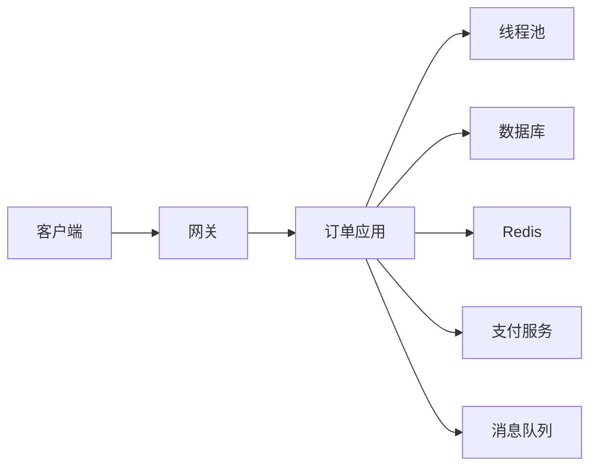

# 第 36 章　Java Web 后端综合故障诊断

> 学习提示：排障的目标不是尽快猜中一个原因，而是用可复查的证据不断排除错误假设。
> 一句话总结：先描述症状并保留证据，再沿依赖链验证假设；日志、线程转储、堆信息和 JFR 各自回答不同的问题。

前面的章节分别讲过 Web 接口、数据库、缓存、消息队列、线程池与部署。真实故障不会按章节分类出现：一个“接口超时”可能来自线程池耗尽、数据库锁等待、Redis 连接异常、下游服务变慢，也可能是代码本身的阻塞。本章不提供一份可以照抄的“万能排障命令”，而是建立一条可解释、可重复的诊断路径。

## 一、先区分症状、证据、假设和原因

故障刚发生时，人很容易把“我认为的原因”当作事实。例如“接口慢，一定是数据库慢”。这句话实际上混合了两层信息：接口慢可能是观察到的症状，数据库慢只是尚未验证的假设。

| 名称 | 含义 | 例子 |
| --- | --- | --- |
| 症状 | 可以被观察到的异常现象 | 10:03 至 10:08，`POST /api/orders` 的 p95 延迟从 120ms 升至 8s |
| 证据 | 能支持或反驳判断的原始记录 | 访问日志、错误率图表、线程栈、连接池指标 |
| 假设 | 对原因的可检验解释 | “订单线程在等待数据库连接” |
| 根因 | 经验证后确实触发问题的条件 | 数据库连接未释放，连接池被耗尽 |

把这四个词分开，排障才不会变成“谁声音大就信谁”。症状要带上时间、范围和量化数据；证据要保留来源；假设必须能被验证或推翻；根因需要能解释为什么该症状会在那个时间、那个范围出现。

例如“用户说系统很卡”不是足够的症状描述。可以把它改写为：

```text
2026-07-14 10:03 起，生产环境 order-service 的创建订单接口超时比例为 18%。
查询订单接口仍正常；两个应用实例均出现相同现象；CPU 使用率约为 35%。
```

它没有断言原因，却已经给出了诊断方向：是写入路径受影响，不是所有接口都慢；CPU 没有满载，因此不能仅凭“慢”推断为 CPU 不足。

### 1.1 先判断影响，再决定诊断节奏

同一个异常在测试环境和生产支付链路中的处理顺序不同。排障开始时应明确：哪些用户受影响，核心功能是否不可用，数据是否可能错误，问题是否仍在扩大，有没有已经验证过的降级或回滚方案。

影响严重且仍在扩大时，恢复业务优先于完整取证。可以先限流、切换健康实例或回滚刚发布版本，同时保留时间点、版本、日志片段和最小运行时信息。影响较小且现场稳定时，可以花更多时间比较实例、重复采样和验证假设。这里没有“所有故障必须先诊断完才能重启”的死规则，也不能把“先恢复”变成每次都不留证据的理由。

还要区分故障严重度与排障难度。一个影响大量用户、但回滚就能恢复的问题，严重度高而处理路径清楚；一个每天只出现一次的短暂卡顿，影响可能较小，却很难捕获。严重度决定响应和协调方式，难度决定需要什么证据，两者不要混为一谈。

## 二、在改变现场前保留第一批证据

重启服务、扩容实例、清空缓存有时能恢复业务，但也会清除现场。恢复和诊断都重要，顺序要根据影响程度决定：如果业务损失正在扩大，先执行经过批准的止损措施；同时尽可能在变更前保留最小、低风险的证据。

第一批记录通常包括：

| 要记录什么 | 为什么需要它 |
| --- | --- |
| 发现时间、恢复时间、时区 | 与日志、监控曲线和发布记录对齐 |
| 受影响接口、状态码、延迟分位数、错误比例 | 明确范围，而不是只记录“很慢” |
| 服务版本、实例、部署批次、配置变更 | 排除刚发布的代码或配置差异 |
| 请求标识、链路标识、脱敏后的关键参数 | 把网关、应用、数据库和下游日志串起来 |
| CPU、内存、GC、线程池、连接池、队列长度 | 判断资源是否已耗尽或正在积压 |
| 依赖服务的延迟和错误率 | 判断问题是否来自数据库、缓存、MQ 或外部服务 |

日志中不应记录密码、令牌、完整身份证号等敏感信息。排障需要可关联性，不等于把所有请求原文无差别写入日志。对需要保留的数据执行脱敏，并遵守团队的访问权限和保留期限要求。

### 2.1 用同一时间轴对齐不同系统

网关、Java 应用、数据库和第三方服务可能使用不同机器。若日志时区不一致，`10:05` 可能指向不同瞬间。诊断记录应保留带时区的时间，例如 `2026-07-14T10:05:13+08:00`，并确认各系统时钟是否同步。

一条结构化应用日志可以长成这样：

```text
2026-07-14T10:05:13.482+08:00 level=ERROR service=order-service
instance=order-7d9f traceId=7a12f9 path=/api/orders method=POST
elapsedMs=6012 errorCode=PAYMENT_TIMEOUT downstream=payment-service
```

它提供了服务、实例、请求路径、方法、耗时、错误类别和链路标识。排障人员可以用 `traceId` 在网关和下游中寻找同一次调用。真实日志格式由团队平台决定，但字段含义要稳定。若所有异常都只写成 `调用失败`，日志数量再多也难以缩小范围。

### 2.2 平均值会掩盖慢请求

接口平均耗时为 200ms，不代表每个请求都接近 200ms。大部分请求很快、少量请求超时时，平均值可能仍然看起来正常。诊断延迟时常看 p50、p95、p99 等分位数：p95 为 2 秒，表示约 95% 的观测值不高于 2 秒，剩余一小部分更慢。

分位数也需要样本范围。一天的 p95 无法告诉你 10:03 的五分钟窗口发生了什么；每个实例各自计算的分位数也不能简单相加得到全局分位数。记录指标时同时写明时间窗口、环境、接口、实例范围和请求量。

### 2.3 先做低风险观察，再做高成本采集

下面的顺序适合大多数“偶发超时”场景：

1. 查看告警、监控和访问日志，确认故障是否仍在发生；
2. 确认受影响的实例、版本和依赖链；
3. 在受影响进程仍存活时采集线程信息和轻量运行记录；
4. 只有在内存问题证据充分、磁盘空间和权限都允许时，才考虑堆转储；
5. 执行修复、恢复和复盘。

堆转储可能很大，也可能增加磁盘和 I/O 压力；它不是每次超时都应该执行的第一条命令。同样，频繁连续采集几十份线程转储而不记录采集时刻，通常只会制造更多难以阅读的文件。

## 三、把“可能原因”写成可证伪的假设

假设不是列出所有技术名词，而是说明“如果它为真，接下来应该看到什么”。以创建订单接口间歇性超时为例：

| 假设 | 若假设成立，可能看到的证据 | 下一步验证 |
| --- | --- | --- |
| 下游支付服务变慢 | 出站调用耗时集中升高，多个请求卡在同一客户端调用 | 查看链路耗时、客户端超时和下游错误率 |
| 数据库连接池耗尽 | 活跃连接到上限，等待连接的线程增加 | 查看连接池指标、慢 SQL、线程栈 |
| 线程池队列积压 | 活跃线程满、队列长度增长、拒绝数增加 | 查看线程池指标及任务耗时分布 |
| 数据库锁竞争 | SQL 执行等待锁，慢查询集中在写入语句 | 查看数据库锁等待和事务信息 |
| 堆压力或频繁 GC | GC 暂停、已用堆和分配速率在故障窗口异常 | 查看 GC 指标、JFR 或堆信息 |

“数据库、Redis、MQ 都查一下”不是验证顺序。优先检查能以最低成本排除最多可能性的证据。例如所有实例同时出现出站调用超时，就应先查共同依赖；只有一台实例异常，就应优先比较该实例的版本、配置、线程和资源。

### 3.1 事实、推断和动作分栏记录

一份排障记录可以明确分为三列：

```text
事实：10:05 两个实例的数据库连接等待均为 0。
推断：当前证据不支持“数据库连接池耗尽”，但尚未排除慢 SQL。
动作：抽取超时请求对应的 SQL 耗时，并检查数据库锁等待。
```

“连接等待为 0”是指标事实；“不支持连接池耗尽”是有限推断；“检查 SQL 和锁”是下一步动作。这样写可以保留推理边界。如果后来发现指标采集有误，团队能知道哪条结论需要撤回，而不是推翻整份记录。

可证伪假设还应写出反证。例如假设“只有新版本实例慢”，就比较新旧版本同一时间、同一流量类型的延迟。如果旧版本也同样变慢，这个假设的解释力下降，应该转向共同依赖或共同基础设施。没有反证条件的“可能是网络抖动”几乎无法推进调查。

## 四、沿着一次请求的依赖链定位

一次创建订单请求可能经过网关、Controller、业务服务、线程池、数据库、Redis、消息队列和外部支付服务。排障时，把它画成一条依赖链，比在不同系统里随机搜索关键词更可靠：



每一段都问同样的问题：请求有没有到达？在这里等待了多久？失败时返回了什么？容量是否耗尽？用同一个请求 ID 或链路 ID 连接日志，可以避免把两个不同请求的记录误认为同一次调用。

### 4.1 指标、日志和转储各自擅长回答什么

| 工具或证据 | 擅长回答的问题 | 不能单独证明什么 |
| --- | --- | --- |
| 指标 | 什么时候开始、影响多大、是否集中在某实例或依赖 | 某一行代码为什么阻塞 |
| 应用日志与链路 | 哪个请求、哪个业务分支、哪个下游调用失败 | JVM 中所有线程的实际状态 |
| 线程转储 | 某一瞬间线程正在执行、等待或争用什么锁 | 问题是否只出现过一次、是否已恢复 |
| 堆信息或堆转储 | 内存主要被什么对象占用、是否接近耗尽 | 所有超时都由内存造成 |
| JFR | 一段时间内的 CPU、分配、锁、GC、线程等事件 | 业务字段是否符合规则 |

一张线程转储只能代表采集的那个瞬间。对间歇性问题，间隔数秒采集两到三次并标记时间，常常比只采一份更能看出“同一批线程持续卡住”还是“线程状态正在变化”。采集频率和保留数量必须符合生产环境操作规范。

## 五、用 JDK 17 的 jcmd 观察 Java 进程

[[jcmd]] 是 JDK 自带的诊断命令。它向本机上的 Java 进程发送诊断请求；一般需要由与目标进程相同的有效用户和组执行。先在**经过授权的环境**中确认目标进程，避免把命令指向错误服务。

```bash
jcmd -l
# 控制台会列出当前机器可见的 Java 进程，通常包含进程号（PID）和主类或启动信息。

jcmd <pid> VM.version
# 控制台会输出目标 JVM 的版本信息，用来确认采集对象确实是预期的 JDK 进程。

jcmd <pid> VM.command_line
# 控制台会输出目标进程的启动命令和 JVM 参数；其中可能含敏感配置，保存和分享时应脱敏。
```

将 `<pid>` 替换为实际进程号，例如 `12345`。在 Docker 容器中，宿主机看到的进程命名空间可能与容器不同；应按团队运维流程进入正确的运行环境，并使用对目标进程有权限的账号。

不同 JVM 支持的诊断命令可能不同。对目标进程先查询帮助，比根据别处文章猜参数可靠：

```bash
jcmd <pid> help
# 控制台会列出该 JVM 当前支持的诊断命令。

jcmd <pid> help Thread.print
# 控制台会输出 Thread.print 的用途、影响等级和参数说明。
```

不要使用 `jcmd 0 <command>` 对所有可见 JVM 批量执行高成本命令。教程中的 `<pid>` 是一道安全边界：先确认服务名、启动命令和版本，再对单个目标进程采集。

### 5.1 采集线程转储

```bash
jcmd <pid> Thread.print -l > thread-20260714-1005.txt
# 控制台输出会被保存到 thread-20260714-1005.txt，而不是直接滚动显示在屏幕上。
# -l 会请求输出 java.util.concurrent 锁等附加锁信息。
```

`Thread.print` 的结果包含线程名称、状态和调用栈。下面是经过截短的示意，不是每个线程都一定长这样：

```text
"http-nio-8080-exec-12" #81
   java.lang.Thread.State: WAITING (parking)
        at jdk.internal.misc.Unsafe.park(Native Method)
        at java.util.concurrent.locks.LockSupport.park(LockSupport.java:211)
        at java.util.concurrent.FutureTask.get(FutureTask.java:205)
        at com.example.order.PaymentClient.charge(PaymentClient.java:84)
```

这段栈说明该线程当时在等待一个 `FutureTask` 的结果，并且调用链经过 `PaymentClient.charge`。它**不能单独证明**支付服务就是根因：还要结合出站调用耗时、同类线程数量、超时配置和支付服务侧记录。线程状态也不是好坏标签，`WAITING`、`TIMED_WAITING`、`BLOCKED` 都需要放回调用栈和业务场景解释。

### 5.2 线程状态要结合栈顶和多次采样阅读

线程转储中常见的几种状态表达不同的即时情况：

| 状态 | 说明 | 阅读重点 |
| --- | --- | --- |
| `RUNNABLE` | JVM 认为线程可运行；它可能在执行 Java，也可能处于某些本地 I/O 调用 | 多次采样是否停在相同计算栈；进程 CPU 是否同时升高 |
| `BLOCKED` | 线程等待进入 `synchronized` 保护的监视器 | 等待哪个对象锁、锁由哪个线程持有、持有者在做什么 |
| `WAITING` | 没有超时时间地等待另一个动作 | 是正常的线程池空闲等待，还是业务线程等待永不完成的结果 |
| `TIMED_WAITING` | 带超时时间地等待、睡眠或停车 | 超时时间是否符合设计，同类请求是否大量聚集 |

Web 容器的工作线程空闲时处于 `WAITING`，通常是正常现象。相反，几十个处理请求的线程都在同一个数据库驱动调用中显示 `RUNNABLE`，也不代表它们正在消耗 CPU；某些网络 I/O 在栈中仍可能呈现为 `RUNNABLE`。先看线程名称、完整调用链和数量，再结合 CPU 与下游耗时解释。

为间歇性卡顿采集三份线程转储时，文件名应包含时间并保持固定间隔：

```bash
jcmd <pid> Thread.print -l > thread-100500.txt
# 等待团队允许的采样间隔后再次执行，而不是用无上限循环持续采集。
jcmd <pid> Thread.print -l > thread-100505.txt
jcmd <pid> Thread.print -l > thread-100510.txt
```

如果同一批请求线程在三份文件中都停在相同业务调用，说明等待具有持续性；如果线程不断变化但请求吞吐仍低，可能是每个请求都在短暂等待，或瓶颈位于线程转储看不到的其他层。Oracle 的故障排查指南也建议在循环或挂起问题中比较一系列线程转储。

### 5.3 死锁会给出更直接的证据

两个线程各自持有一把锁，又等待对方持有的锁，就可能形成死锁。HotSpot 的线程转储能够检测 Java 层死锁，并在输出末尾给出 `Found one Java-level deadlock` 及参与线程、等待锁和持有者。

看到这一段可以确认存在被检测到的 Java 层死锁，但仍要定位锁的业务来源和触发顺序。没有出现死锁提示，也不能说明所有线程等待都正常：线程可能等待一个永远不会完成的外部结果、条件通知或连接。死锁检测是强证据，不是对所有“卡死”的总开关。

JDK 17 还保留了 `jstack`，它也能打印 Java 线程栈并通过 `-l` 输出锁信息；但 Oracle 的 JDK 17 文档将 `jstack` 标为实验性且不受支持。新排障流程优先使用 `jcmd <pid> Thread.print`，需要兼容旧脚本时再明确评估 `jstack`。

## 六、用堆信息和 JFR 观察内存与运行过程

当指标显示内存持续增长、频繁 GC 或进程接近内存限制时，才进入这一层。先从相对轻量的信息开始：

```bash
jcmd <pid> GC.heap_info
# 控制台会输出堆代、已用空间等概要信息，帮助判断是否存在明显的堆压力。

jcmd <pid> GC.class_histogram > class-histogram-20260714-1005.txt
# 输出会保存为对象类型及实例数量的统计表，可用于寻找异常增长的对象类别。
```

对象直方图只能告诉你“哪些类型很多”，不能直接告诉你“为什么没有被回收”。要确认引用链、对象内容或具体泄漏路径，才可能需要堆转储。堆转储包含大量内存内容，可能有敏感数据，并且文件体积接近堆大小；采集前需要确认磁盘空间、数据处理方式与生产变更规范。

确认需要堆转储后，先查询目标 JVM 的命令帮助，再把文件写到空间充足、访问受控的目录：

```bash
jcmd <pid> help GC.heap_dump
# 控制台会给出当前 JVM 对 GC.heap_dump 的参数说明和影响等级。

jcmd <pid> GC.heap_dump filename=heap-20260714-1005.hprof
# 成功后会生成 HPROF 堆转储文件；文件可能很大，并可能包含敏感业务对象。
```

不要因为直方图中 `String` 或 `byte[]` 排名靠前就判断内存泄漏。它们本来就是许多应用中数量很大的通用类型。更有价值的问题是：同一负载下实例数是否持续增长，增长是否伴随老年代占用上升，哪些对象通过什么引用链长期存活，停止流量后能否回落。

[[JFR]]（Java Flight Recorder）用于记录一段时间内的 JVM 事件。它特别适合“发生在几分钟内、单份线程转储抓不住”的问题：

```bash
jcmd <pid> JFR.start name=diagnosis settings=profile duration=60s filename=diagnosis.jfr
# 启动一个持续 60 秒的 JFR 记录。profile 记录更丰富，但开销通常高于默认设置。

jcmd <pid> JFR.check
# 控制台会列出正在运行的 JFR 记录及其状态。
```

记录结束后得到 `diagnosis.jfr` 文件，可以用 Java Mission Control 等工具分析。JDK 文档说明 JFR 的默认设置面向低开销；`profile` 会记录更多事件。不要因为它“看起来专业”就长期以高开销配置运行，应该用明确的故障窗口、持续时间和采集目的约束它。

### 6.1 JFR 不是一张“自动根因报告”

JFR 保存的是一段时间内发生的事件。分析时仍要从症状选择证据：

| 症状 | 可关注的 JFR 信息 | 可以支持的判断 |
| --- | --- | --- |
| JVM CPU 高 | CPU load、线程 CPU、方法采样 | 哪些线程和调用路径消耗了较多执行时间 |
| 线程长时间停顿 | Socket/File I/O、Thread Park、Monitor Wait | 时间花在网络、文件、停车等待还是锁等待 |
| GC 暂停怀疑 | GC pause、堆使用和对象分配事件 | 暂停总量、单次暂停以及高分配位置 |
| 锁竞争 | Java Monitor Enter/Wait | 哪些监视器和调用栈出现较长等待 |

Oracle 的 JFR 排障文档指出，文件读写、Socket 读写、线程停车和监视器等待等事件可以用于观察线程停顿。事件没有出现也需要检查记录配置和阈值；它可能表示事件未启用、持续时间低于阈值，不能直接解释为“这种等待不存在”。

JDK 17 还提供 `jfr` 命令查看记录文件。下面只列出观察入口，不要求本章记住所有事件名：

```bash
jfr summary diagnosis.jfr
# 控制台会汇总记录中的事件类型、数量和大小。

jfr print --events jdk.GCPhasePause diagnosis.jfr
# 控制台会打印 GC 暂停事件；没有输出时先检查记录设置和事件名称。
```

JFR 的时间窗口必须覆盖故障。如果接口在 10:03 已恢复，而记录从 10:10 才开始，分析结果只能描述恢复后的运行状态。对难以预测的偶发问题，可以在评估开销与存储后使用持续滚动记录，在告警发生时导出最近窗口；具体配置应由团队性能与运维规范决定。

## 七、先根据 CPU 和资源信号选择分支

“接口慢”至少可以分成两类初始信号：进程 CPU 很高，或 CPU 不高但请求仍然等待。它们不是根因，只是帮助选择第一批证据。

### 7.1 CPU 高时先找持续运行的线程

若 JVM CPU 与主机 CPU 同时升高，先确认是否只有一个实例、是否与流量增长或发布同时发生。连续线程转储中反复处于同一计算栈的 `RUNNABLE` 线程，以及 JFR 中高 CPU 的线程和热点方法，是进一步定位的证据。可能原因包括意外循环、序列化大量数据、正则表达式回溯或过高对象分配引发的 GC 压力。

此时“增加线程池”通常不是合适的第一步。CPU 已经接近容量上限时，更多并发线程会增加调度和竞争。也不要只凭一次热点采样改代码；先确认热点与故障时间一致，并用相同输入复现或回归。

### 7.2 CPU 不高时重点检查等待

CPU 低而接口慢，常见方向是外部 I/O、锁、连接池、队列或限流等待。线程转储可能显示大量请求线程停在 Socket 读取、连接获取、`Future.get`、锁进入或队列操作；指标则帮助判断等待是否集中在某个依赖。

CPU 低不表示机器空闲。进程可能在等待磁盘、网络或容器 CPU 配额，也可能只有少数关键线程被阻塞，其他线程没有工作。把操作系统、容器、JVM 和应用指标放到同一时间轴上，才知道“低”是正常空闲还是无法推进。

## 八、不同组件异常会留下不同的痕迹

同样是“接口超时”，等待发生的位置不同，诊断材料也不同。下面的对照不是故障字典，而是帮助你把第 24 至 34 章的组件知识重新放回一次请求中：

| 可疑位置 | 先看什么 | 线程或日志中可能出现什么 | 不要过早得出的结论 |
| --- | --- | --- | --- |
| 应用线程池 | 活跃线程、队列长度、拒绝数、任务耗时 | 大量任务在队列中等待，或处理线程都在同一耗时方法 | 线程数小不必然是根因；盲目增大线程池可能压垮下游 |
| 数据库连接池 / SQL | 活跃连接、等待数、连接获取耗时、慢 SQL、锁等待 | 多个请求在获取连接或 JDBC 调用附近等待 | SQL 慢、连接不足和锁等待是不同问题，修复方式不同 |
| Redis | 命令延迟、连接错误、超时数、缓存命中率 | 缓存客户端调用超时或连接借还等待 | 命中率下降可能是容量、过期策略或业务流量变化，不等于 Redis 宕机 |
| 消息队列 | 生产失败率、消费滞后、重试数、死信数量 | 发送确认等待、消费者处理积压或重复消费日志 | 队列积压不一定导致同步 HTTP 接口慢，先确认两者是否在同一关键路径 |
| 外部 HTTP 服务 | 出站调用延迟、连接/读取超时、对端状态码 | 客户端调用栈重复出现在多个业务线程中 | “网络问题”过于宽泛，要区分 DNS、连接、读取和对端处理时间 |

线程池满时，先问“线程都在做什么”，而不是把核心线程数从 10 改成 100。若 10 个线程都在等待同一个慢的支付调用，增加线程只能让更多请求同时压向支付服务。数据库连接池耗尽也类似：连接数只是容量参数；连接没有释放、事务过长或慢 SQL 才可能是上游原因。

消息队列的积压需要特别区分异步与同步路径。若“下单”接口只是把消息投递到队列后立即返回，消费者积压主要影响后续履约，不一定直接造成 HTTP 超时；若接口同步等待消费者结果，积压才可能直接出现在接口延迟中。先画出实际调用链，再解释指标。

### 8.1 超时配置必须成组阅读

一次出站 HTTP 调用可能包含连接超时、读取超时、整体调用超时和重试策略。只把读取超时调大，可能让更多应用线程更久地占着资源；把重试次数调大，又可能让故障期间的下游压力成倍增加。排查时记录这些配置的实际值、是否在本次发布中改变，以及它们与网关超时、客户端等待时间的关系。

一个基本原则是：调用方的等待时间要有上限，重试要有条件，系统要能在依赖不可用时尽快给出可识别的失败或降级结果。具体数值不能从教程中照抄，应由业务时限、依赖能力和压测结果共同决定。

### 8.2 重试会改变故障规模

调用超时后立即重试，单个用户请求可能变成多次下游请求。下游已经过载时，无退避、无上限的同步重试会继续增加压力，也会延长上游线程占用时间。排查时要记录“用户请求数”和“实际下游尝试数”，否则会误判流量来源。

重试只适用于有机会短暂恢复、操作可以安全重复或已经设计幂等保护的失败。参数校验失败、权限不足等确定性 `4xx` 通常没有重试价值。写操作是否能重试，要结合幂等键、事务边界和下游实际处理结果判断；连接在返回前断开，并不代表下游一定没有执行。

## 九、把一次间歇性超时排成可执行的诊断记录

假设告警显示：10:03 至 10:08 创建订单接口的超时比例升高，查询接口正常。下面是一份简化但可执行的记录：

| 时间 / 步骤 | 观察或操作 | 得到的事实 | 下一步 |
| --- | --- | --- | --- |
| 10:04 | 查看网关指标 | 仅 `POST /api/orders` 的 p95 增长，两个实例都有 | 排除单实例偶发问题，检查写入依赖 |
| 10:05 | 查看应用日志与链路 | 请求在支付客户端调用前后停留较久 | 对照支付服务延迟与超时配置 |
| 10:05 | 查看线程池与连接池指标 | 线程池未满，数据库连接等待为 0 | 降低“线程池/数据库连接耗尽”优先级 |
| 10:06 | 采集 `Thread.print` | 多个订单线程停在 `PaymentClient.charge` | 验证支付服务与网络链路 |
| 10:07 | 查看下游监控 | 支付服务同一时间错误率上升 | 支持“共同下游故障”假设 |
| 10:08 | 触发降级或熔断策略 | 新请求快速返回可识别的降级结果 | 记录恢复动作和影响范围 |

这份记录没有把“支付服务异常”写成第一行结论，而是保留每一步证据。若 10:06 的线程栈显示的是数据库驱动调用，后续路径就应转向慢 SQL、连接池和锁等待；过程相同，结论不同。

### 9.1 同一症状可能走向另一条证据链

假设线程转储没有显示支付调用，反而有 40 个请求线程在等待数据库连接，连接池活跃连接达到上限。此时只能确认“应用正在等待连接”，仍不能立刻把连接池上限调大。下一步要检查：连接是否被正常归还，事务是否覆盖了外部 HTTP 调用，慢 SQL 是否长期占用连接，数据库当前承载能力是否允许更多并发连接。

如果发现某段代码开启事务后调用支付服务，支付超时让数据库连接一直被占用，那么“连接池耗尽”是直接故障表现，“事务内包含慢外部调用”才是更深层原因。扩大连接池可能暂时推迟耗尽，却会让更多长事务进入数据库。修复应缩短事务边界，并分别验证数据库连接等待、接口延迟和业务一致性。

## 十、修复、恢复、验证与复盘是四件事

找到可疑点后，仍要区分四类动作：

| 动作 | 要回答的问题 | 例子 |
| --- | --- | --- |
| 缓解 | 怎样先降低当前用户影响 | 启用降级、限流、切换健康实例 |
| 修复 | 怎样消除已确认的根因 | 修复未释放连接、调整错误的超时或重试逻辑 |
| 验证 | 怎样证明修复真的有效 | 同一压测或真实指标恢复，错误率和延迟持续稳定 |
| 复盘 | 怎样避免再次发生或更快发现 | 补充指标、告警、回归测试和操作手册 |

“重启后好了”只能说明进程状态被改变，不能自动证明根因已经消失。若问题与连接泄漏、积压任务或流量模式有关，重启后的短暂恢复可能掩盖问题。复盘应至少留下：时间线、影响范围、已证实证据、根因、缓解措施、永久修复、验证方法和后续负责人。

验证需要复用故障条件，而不是只刷新一次页面。例如问题在并发 50、下游延迟 2 秒时出现，修复后要在隔离环境重放相近条件，并观察线程池队列、连接等待、错误率和业务结果。只验证平均延迟恢复，可能遗漏少量请求仍超时；只验证性能，又可能漏掉重复订单或数据部分提交。

复盘中的“根因”也不应只写成某个人改错了一行配置。继续追问：为什么测试没有覆盖，为什么发布后没有及时告警，为什么回滚需要手工查找版本，为什么日志无法关联请求。改进项应对应这些缺口，并有可验收结果，例如新增一个超时回归测试、一个连接等待告警或一份带回滚命令的操作手册。

## 十一、练习：为一个超时告警写诊断方案

场景：发布后 15 分钟，`POST /api/orders` 的 p95 从 180ms 上升到 6s；`GET /api/orders/{id}` 保持正常；CPU 约 30%，但支付服务监控暂时不可用。

请写出：

1. 一句不包含原因猜测的症状描述；
2. 至少三项先收集的证据；
3. 两个可证伪假设，以及各自的验证方式；
4. 为什么此时不应立即执行堆转储；
5. 若支付服务确实故障，缓解、修复和验证分别是什么。

一种参考思路：先记录发布版本、两个接口的延迟/错误率、订单服务线程与出站调用日志；假设一是发布改变了订单写入路径，比较发布差异和异常实例配置；假设二是支付依赖变慢，采集线程栈并比对出站耗时。当前症状没有直接的内存证据，堆转储成本高且可能包含敏感数据，所以不应抢在低风险观察之前。若下游故障被证实，先按设计启用降级或快速失败，再由下游团队修复，最后观察错误率、p95 和订单补偿结果是否持续恢复。

再做一个证据判断练习。下面四条事实中，哪些支持“数据库连接池耗尽”，哪些只能作为旁证？

```text
A. 连接池 active 等于最大值，pending 持续大于 0。
B. 线程转储中大量请求线程停在获取数据库连接的方法。
C. 数据库主机 CPU 为 80%。
D. 重启应用后接口短暂恢复。
```

参考判断：A 与 B 直接支持“应用正在等待连接”；C 说明数据库负载较高，但不能单独证明连接池耗尽；D 表明重启改变了进程状态，可能清空连接与队列，也可能只是流量暂时下降。下一步仍要检查连接持有时间、未关闭连接、事务范围、慢 SQL 和数据库容量，才能定位原因。

## 十二、常见误区

### 12.1 先下结论，再找支持它的日志

这会让排障变成确认偏误。把每个判断写成可被推翻的假设，并主动寻找反例。例如“数据库慢”若是真的，应能在连接等待、慢 SQL 或锁等待中留下相应证据。

### 12.2 只看应用日志，不看依赖范围

应用日志能显示一个调用失败，却未必说明问题在应用内。网关、数据库、缓存、消息队列和下游服务的时间线需要对齐；同一时间多个服务是否异常，常常比一条异常堆栈更有定位价值。

### 12.3 把线程状态当成结论

看到 `BLOCKED` 不等于一定死锁，看到 `WAITING` 不等于一定卡死。必须看调用栈、锁信息、同类线程数量和多次采样的变化。

### 12.4 未评估成本就采集堆转储

堆转储可能占用大量磁盘并包含敏感内容。没有内存异常迹象时，它往往不能解决接口超时问题，反而会增加现场压力。

### 12.5 修复后没有验证和复盘

没有验证，就无法区分“自然恢复”和“修复有效”；没有复盘，同类问题仍会用同样的方式再次出现。

### 12.6 一次采集所有高成本材料

线程转储、堆转储、JFR、数据库全量日志各有成本。没有假设地全部采集，会增加现场压力并带来大量敏感数据。先用低成本证据缩小范围，再选择能区分假设的材料。

### 12.7 只修直接表现，不处理触发链

连接池耗尽、队列积压和频繁 GC 都可能是表现。继续追踪谁长期占用连接、为什么生产速度超过消费速度、哪些对象持续存活，才能决定是修代码、调容量、限制流量还是改变依赖策略。

## 十三、本章小结

后端故障诊断从清晰的症状开始，用时间线、指标、日志和运行时证据形成假设，再沿请求依赖链逐步验证。`jcmd` 可以在 JDK 17 中帮助采集进程、线程、堆和 JFR 信息，但每种工具都有成本和边界。真正可靠的结果不只是“服务恢复了”，还包括可复查的根因、验证证据和防止复发的改进。

## 十四、快速自测

1. “接口很慢”为什么不够作为排障结论？
2. 线程转储最适合回答什么问题？为什么不能只看一份？
3. `jcmd <pid> Thread.print -l` 的 `<pid>` 从哪里获得？
4. 在什么情况下才应认真考虑堆转储？
5. 为什么“重启后恢复”不等于已经找到根因？
6. 为什么 CPU 低时仍可能出现严重的接口超时？
7. `RUNNABLE` 线程为什么不一定正在消耗大量 CPU？
8. 对象直方图中 `String` 数量最多，为什么不能直接判定 String 泄漏？
9. JFR 记录没有某类事件时，需要先检查哪些条件？

参考答案：它缺少时间、范围和量化信息；线程转储展示采集时刻线程的调用栈、状态和锁，多次采样可判断状态是否持续；先用 `jcmd -l` 确认进程；出现内存增长、频繁 GC 等证据且评估过空间、权限和敏感数据后；重启可能只清除了暂态，根因仍可能再次触发。CPU 低时线程可能在等待 I/O、锁、连接或队列；某些本地 I/O 调用在线程转储中也可能显示 `RUNNABLE`；常见类型数量大不等于存在无法回收的引用链；需要检查 JFR 记录窗口、事件是否启用以及事件阈值。

## 参考文献

- Oracle. [jcmd 命令（JDK 17）](https://docs.oracle.com/en/java/javase/17/docs/specs/man/jcmd.html)。
- Oracle. [jstack 命令（JDK 17）](https://docs.oracle.com/en/java/javase/17/docs/specs/man/jstack.html)。
- Oracle. [使用 JFR 排查性能问题](https://docs.oracle.com/en/java/javase/17/troubleshoot/troubleshoot-performance-issues-using-jfr.html)。
- Oracle. [排查进程挂起与循环](https://docs.oracle.com/en/java/javase/17/troubleshoot/troubleshoot-process-hangs-and-loops.html)。
- Oracle. [Java SE 17 文档](https://docs.oracle.com/en/java/javase/17/)。
