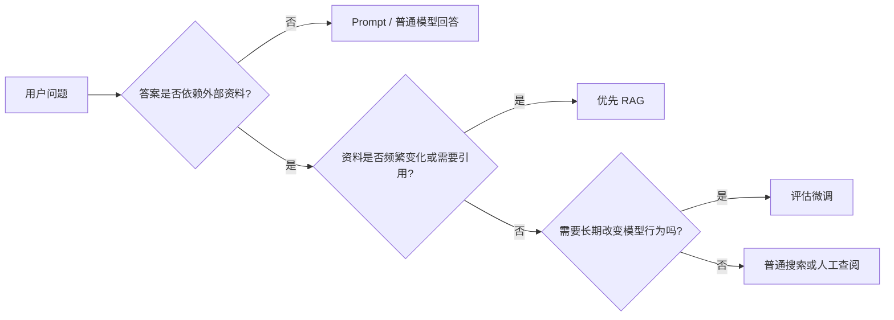
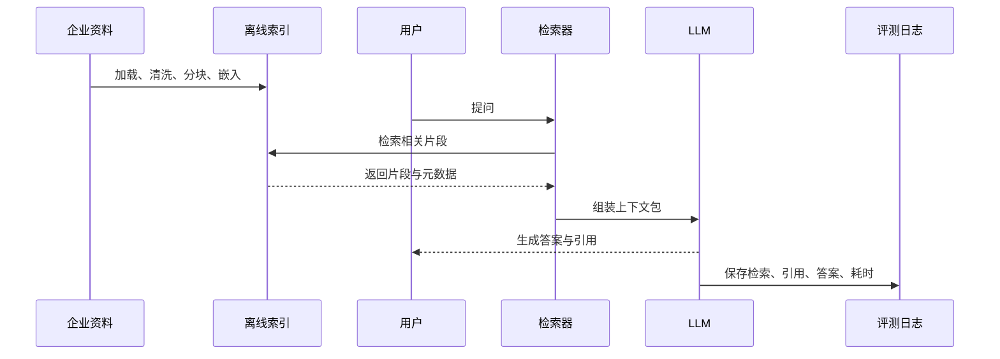

# 1. RAG 的第一性问题：让模型从闭卷回答走向有据可查

> 模块：基础与全局视角  
> 建议学习时间：60 分钟

我们先别急着谈向量数据库，也别急着装工具。真正要回答的问题是：模型凭什么知道你公司的退款规则、登录限制、组件用法和历史缺陷？如果答案只来自模型训练时形成的参数化知识，它很容易说得像真的，却无法证明依据。RAG 的出场，就是为了把“查资料”这件事接进模型回答过程，让企业 AI 从闭卷考试变成开卷考试。

## 本章目标
- 能用一句话解释 RAG 解决的核心问题。
- 能区分 Prompt、搜索、RAG、微调四种方案。
- 能画出企业 RAG 的最小可行架构。
- 能判断哪些业务问题值得优先用 RAG。

## 本章图解


## 核心知识点
### 1. RAG 不是让模型更玄学，而是让答案多一层证据

RAG 的完整名字是 Retrieval-Augmented Generation，中文常翻译为检索增强生成。拆开看就很直白：先检索，再生成。检索负责找资料，生成负责组织答案。

大模型很擅长把语言组织得顺滑，但它不天然知道企业内部资料。比如 2026Q1 的退款规则、某个登录模块的异常流程、你们代码库里的组件约定，这些都不一定存在于模型参数里。RAG 把这些资料放在外部知识库中，用户提问时先找相关片段，再把片段交给模型。

一次最小 RAG 请求通常会经过四步：把用户问题转成检索请求；从知识库召回相关片段；把片段、引用、回答规则组装成上下文包；让 LLM 基于上下文回答。这里的重点是“基于上下文”，不是让模型自由发挥。

**放到真实场景里：**客服同学问“会员退款多久到账”，系统应该先找到最新退款政策，再回答并给出处；测试同学问“登录模块要覆盖哪些异常场景”，系统应该先找 PRD、历史缺陷和用例模板。

**容易踩的坑：**不要把 RAG 理解成“把所有文档塞给模型”。真正的 RAG 是只拿当前问题需要的资料，而且要保留来源，方便核对。

### 2. Prompt、搜索、RAG、微调解决的是四类不同问题

很多初学者会把这些词放在同一条升级路线上：Prompt 不行就 RAG，RAG 不行就微调。这个想法很自然，但不太准确。

Prompt 更像答题规范，解决“怎么答”的问题；搜索负责找资料，但不一定会组织答案；RAG 把找资料和生成答案连成流程；微调则是长期改变模型在某类任务上的稳定行为。它们可以组合，但不是互相替代。

一个简单判断是：缺外部事实，先看 RAG；缺输出格式，先调 Prompt；缺网页或公开信息，搜索可能够用；想让模型长期学会某种标注、风格或固定任务习惯，才认真考虑微调。

**放到真实场景里：**企业制度每周更新，用微调追版本会很痛苦；客服话术只是不够统一，先写清 Prompt 可能就够；代码库助手需要知道内部组件和示例，RAG 通常是更稳的起点。

**容易踩的坑：**不要因为 RAG 听起来更工程化，就把所有问题都做成 RAG。方案越复杂，排错和维护成本也越高。

### 3. 企业 RAG 的最小系统要能被检查

演示一个 RAG 原型不难，难的是它答错时你知道去哪里修。企业系统需要的不是“看起来会聊天”，而是每个环节都有证据。

最小系统至少包含资料源、清洗分块、索引、检索器、上下文组装、生成模型、日志和评测。少了资料源，答案没有根；少了日志，错误无法复盘；少了评测，优化只是凭感觉。

后面每学一个组件，都可以问同一个问题：它在这条链路里解决什么风险？分块减少检索不准，embedding 帮助语义匹配，rerank 改善排序，评测集让优化可比较。

**放到真实场景里：**如果测试用例生成漏掉“验证码错误不计入密码错误次数”，你需要追查：资料有没有入库，分块有没有切断，检索有没有召回，重排有没有排上来，模型有没有忽略。

**容易踩的坑：**不要只保存最终答案。只看答案，永远分不清是资料错、检索错，还是模型生成错。

## Prompt、搜索、RAG、微调：别拿一把锤子敲所有钉子

做方案选型时，先把问题拆成“事实从哪里来”和“答案怎么表达”。如果事实来自企业动态资料，RAG 更合适；如果事实早就在人类输入里，只是模型回答格式不稳定，Prompt 就能解决不少问题。微调不是万能升级，它更适合长期稳定的行为迁移。

| 方案 | 主要解决什么 | 更适合什么 | 不适合什么 |
| --- | --- | --- | --- |
| Prompt | 约束回答方式 | 固定格式、语气、拒答规则 | 补充模型不知道的企业事实 |
| 搜索 | 找到资料 | 人工查阅、公开资料定位 | 自动引用、权限控制、稳定生成 |
| RAG | 基于资料回答 | 企业知识库、测试用例生成、代码库助手 | 资料未整理、无评测闭环 |
| 微调 | 改变稳定行为 | 固定标注、风格迁移、重复任务习惯 | 频繁变化的政策和 PRD |

### 可以先用“三问法”粗判

第一问：答案是否依赖外部资料？第二问：资料是否经常变化或需要引用？第三问：问题是否只是格式、语气、结构不稳定？前两个问题都回答“是”，RAG 通常值得优先；第三个问题回答“是”，先从 Prompt 开始更省力。

### 技术选型本质上是在控制维护成本

如果你用微调追每周更新的制度，后续维护会很重；如果只是给模型补一点回答格式，却搭整套 RAG，也是在制造复杂度。好的选型不是“炫”，而是让未来的更新、排错和审核更轻。


**Takeaway：**第一章先记住一个判断：RAG 的价值不是让模型更会说，而是让模型回答前先看到可更新、可引用、可检查的资料。

## RAG 最小可行架构：从一次回答拆成可复盘流水线

一个企业 RAG 请求有两条线：资料线负责把知识准备好，问题线负责把当前提问变成可记录的回答。资料线通常离线运行，问题线在线运行。把两条线分清楚，后面学每个组件都会更顺。



### 一次错误答案，通常能追到某个环节

资料缺失、分块错误、检索漏召回、重排排序错、上下文过长、模型忽略引用，都会造成错误答案。架构图不是装饰，它给每类错误留下了定位点。

### 伪代码先看输入输出，不急着学编程

下面这段代码只想表达一件事：问题进来后，系统先检索候选片段，再构造上下文，最后生成答案并写日志。后续所有优化，都会落在这些节点上。

#### RAG 请求的最小闭环

```js
async function answer(question, user) {
  const candidates = await retriever.search(question, {
    permissions: user.permissions,
    topK: 8
  });
  const context = buildContext(question, candidates);
  const result = await llm.generate(context);
  await auditLog.save({ question, candidates, result });
  return result;
}
```

**Takeaway：**把 RAG 看成流水线，学习会轻松很多。每个组件都不是孤立术语，而是在帮这条流水线更准、更稳、更容易被检查。

## 常见误区
- RAG 不是把所有资料塞进 Prompt，而是检索当前问题最需要的资料。
- RAG 不是微调的低配版，它们解决的问题不同。
- RAG 不是搜索框加聊天框，企业级系统还需要权限、引用、评测和日志。
- RAG 不能自动保证正确，资料质量和检索质量仍然决定上限。

## 这一章先收束成一句话

RAG 不是让模型突然拥有企业知识，而是把“先查资料、再带证据回答、最后能复盘”做成一条稳定流程。理解这一点，后面的分块、向量、检索、重排、评测都不会显得散。

- 缺格式，先看 Prompt；缺外部事实，再看 RAG；想长期改变模型行为，才考虑微调。
- RAG 至少要拆成资料准备、检索、上下文组装、生成、记录这几段。
- 企业场景里，能回答只是起点，能引用、能拒答、能复盘才是上线门槛。

下一章我们把镜头往前推一步：既然答案要依赖资料，那资料进入系统之前，究竟要被整理成什么样？

## 快速自测
1. RAG 最核心的顺序是什么？
   - A. 先检索再生成
   - B. 先训练再上线
   - C. 先美化再发布
   - 答案：先检索再生成

2. 企业政策每周更新，更适合优先使用什么？
   - A. RAG
   - B. 长期微调
   - C. 只靠语气
   - 答案：RAG

3. 只想统一答案格式，通常先优化什么？
   - A. Prompt
   - B. 权限系统
   - C. 向量维度
   - 答案：Prompt

4. RAG 上线前必须能复盘什么？
   - A. 检索和引用
   - B. 按钮颜色
   - C. 头像尺寸
   - 答案：检索和引用

## 练一下

选择一个业务问题，按“是否依赖外部资料、资料是否变化、是否需要引用、是否涉及权限、错误后果是什么”五个维度判断它适合 Prompt、搜索、RAG 还是微调。

## 主要参考
- [Datawhale RAG 简介](https://github.com/datawhalechina/all-in-rag/blob/main/docs/chapter1/01_RAG_intro.md)
- [RAG 经典论文](https://arxiv.org/abs/2005.11401)
- [LlamaIndex RAG 入门](https://developers.llamaindex.ai/python/framework/understanding/rag/)
