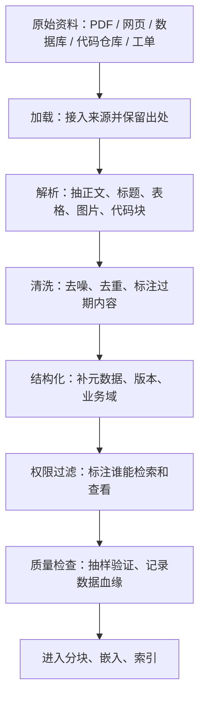
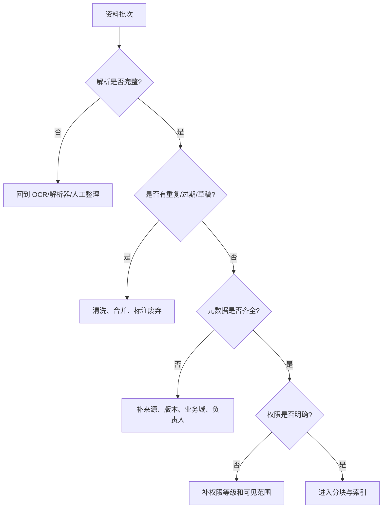

# 2. 数据进入系统之前：从原始资料到可检索知识物料

> 模块：数据处理全流程  
> 建议学习时间：60 分钟

上一章我们说，RAG 的关键是让模型先查可信资料。问题是：企业资料天然并不可信。它们可能重复、过期、格式混乱、权限不清。直接上传一堆 PDF 或 PRD，往往只是把混乱搬进知识库。第二章要解决的是：资料进入 RAG 前，怎样变成可管理、可检索、可引用、可控权的知识物料。

## 本章目标
- 能列出 RAG 常见数据源，并说明每类数据的解析风险。
- 能解释加载、解析、清洗、结构化、权限标注的顺序。
- 能设计一条企业知识物料的最小元数据。
- 能判断数据质量问题会怎样影响检索和生成。

## 本章图解


## 核心知识点
### 1. 数据加载要保留来路，不只是把文字读出来

加载是 RAG 数据管道的第一步，负责把 PDF、Word、Markdown、HTML、数据库、API、代码仓库、客服工单等来源接入系统。

不同来源的资料结构差异很大。PDF 有页眉页脚、多栏排版和表格；网页有导航、广告和脚本；代码仓库有 README、类型定义、示例、测试和提交记录。加载阶段如果丢了来源、页码、标题和文件版本，后面就很难引用和排错。

加载时先判断资料类型，再选择解析器或连接器。文字型 PDF 抽正文和标题；扫描件先 OCR；表格保留行列关系；网页提取正文；代码仓库优先读取 README、示例、接口定义和测试。

**放到真实场景里：**做代码库助手时，直接吞全部源码并不聪明。更稳的是先加载 README、组件示例、类型定义、测试用例和常见错误修复记录，因为这些资料更接近用户会问的问题。

**容易踩的坑：**不要把“文件已经读出来”当作“资料已经准备好”。抽取顺序错、表格丢列、代码块被拆散，都会在后续检索里变成错误上下文。

### 2. 清洗不是美化文本，而是减少未来的错误召回

清洗处理重复、过期、乱码、页眉页脚、广告、草稿、格式错乱等问题；标准化把标题、列表、表格、代码块、时间格式整理成一致结构。

RAG 遵循 GIGO：低质量输入会直接污染输出。重复资料会让某些片段过度召回，旧政策会和新政策竞争，页眉页脚会污染每个 chunk，草稿和正式稿混在一起会让模型引用错误版本。

常见做法包括删除重复页眉页脚、合并重复文档、标注废弃版本、保留表格和代码块结构、统一标题层级、抽样检查清洗结果。清洗规则也要记录下来，否则下次更新资料时无法复现。

**放到真实场景里：**客诉答疑知识库里，如果 2025 版赔付规则和 2026Q1 版赔付规则同时存在，但没有版本字段，用户问最新政策时系统可能召回旧规则。

**容易踩的坑：**清洗过度也会出问题。把章节编号、页码、标题全部删掉，引用会失去锚点；把表格压成一段自然语言，字段关系会变模糊。

### 3. 元数据和权限是企业知识库的控制面板

元数据 是描述资料的数据，例如来源、标题、版本、更新时间、业务域、负责人、权限、文档类型、状态。权限过滤 决定某个用户是否可以检索和查看这条资料。

只靠语义相似度，系统很难区分新版政策和旧版政策、公开帮助文档和内部客服手册、移动端登录规则和后台登录规则。元数据让系统先缩小范围再检索，权限过滤则避免越权召回。

最小字段可以从这些开始：id、source、title、version、domain、doc_type、owner、permission、updated_at、effective_from、status。在线检索时，先根据用户身份、业务域、版本等字段过滤，再做向量或关键词检索。

**放到真实场景里：**生成登录模块测试用例时，系统可以先过滤 domain=login、doc_type in [prd,business_rule,test_case]、version=2026Q1，再检索“密码错误锁定”。

**容易踩的坑：**权限不能只靠前端隐藏。真正可靠的做法是在检索阶段就过滤不可见资料，否则模型可能基于用户无权查看的片段生成答案。

### 4. 数据血缘让错误有地方可追

数据血缘 记录资料从哪里来、经过哪些处理、进入了哪个索引。质量检查则通过抽样、对账和小型评测确认资料是否真的可用。

RAG 系统出错时，最怕只看到一个错误答案，却不知道问题来自原文、解析、清洗、分块、索引还是权限。数据血缘和质量检查可以把错误定位到具体环节。

每批资料入库后至少检查四件事：来源能否打开，正文是否完整，元数据是否齐全，权限是否正确。再用 5-10 个真实问题试检索，看正确资料是否能进入候选结果。

**放到真实场景里：**如果测试同学发现“验证码错误不计入密码错误次数”没有被召回，你需要能回到原始 PRD，确认它是否被加载、是否被清洗掉、是否被切分到错误位置、是否被权限过滤挡住。

**容易踩的坑：**不要等到用户投诉才开始做质量检查。资料入库当天就应该抽样验证，否则后续错误会被索引和缓存放大。

## 把 PRD 变成测试用例生成所需的知识物料

如果目标是让 RAG 帮测试同学生成登录模块测试用例，直接上传一份 PRD 通常不够。模型不仅要知道功能目标，还要知道业务规则、边界条件、异常流程、接口字段、历史缺陷、历史用例格式。更好的做法是把一份大 PRD 拆成多类知识物料，每类物料服务一种检索目的。

| 物料类型 | 应该保留什么 | 为什么重要 |
| --- | --- | --- |
| 业务规则 | 规则描述、适用范围、例外条件、版本 | 生成用例时决定覆盖哪些正常和异常路径 |
| 接口字段 | 字段含义、必填、枚举、错误码、版本 | 避免模型编造字段或漏掉错误码场景 |
| 异常流程 | 触发条件、提示文案、恢复路径、升级规则 | 测试用例最容易遗漏的部分通常在异常流程 |
| 历史缺陷 | 缺陷原因、复现步骤、修复说明、关联版本 | 把过去踩过的坑转成未来用例的检查点 |
| 用例模板 | 前置条件、步骤、预期结果、优先级格式 | 让生成结果能直接被测试同学接收和修改 |

### 知识物料不是原文切片，而是面向问题整理出的单元

比如“一条密码错误锁定规则”通常比“PRD 第 6 页的一半内容”更适合被检索和引用。前者天然带着问题、边界和用途，后者只是文档位置。

### 整理资料时，先从用户会问什么倒推

用户会问规则，就整理规则物料；会问字段，就整理接口物料；会问测试覆盖，就整理历史用例和缺陷物料。这个顺序比“先上传再说”更稳。


**Takeaway：**知识物料设计的核心观点：不是资料越完整越好，而是资料越适合被检索、引用和评测越好。

## 企业数据入库流水线：加载之后还要过四道关

很多 RAG 原型失败，是因为把“上传文件”当成了“数据治理”。企业里更稳的做法，是把资料入库做成流水线：每一批资料都要经过解析检查、清洗检查、元数据检查、权限检查，最后才允许进入分块和索引。



### 前两关看结构和噪声

解析检查确认正文、表格、代码和图片说明没有丢；清洗检查确认重复、过期、草稿、页眉页脚这些噪声已经被处理。很多检索问题，其实第一步解析就已经埋雷。

### 后两关看定位和安全

元数据检查确认资料能被过滤、引用和追溯；权限检查确认用户不会检索到不该看的内容。旧规则一旦进入索引，后续还会污染缓存、引用和评测记录。

#### 统一文档对象示例

```js
const document = {
  id: "login-lock-rule-2026q1",
  content: "连续 5 次密码错误后，账号锁定 15 分钟。",
  metadata: {
    source: "登录模块 PRD",
    version: "2026Q1",
    domain: "login",
    docType: "business_rule",
    owner: "QA Team",
    permission: "internal",
    status: "active"
  }
};
```

#### 统一文档对象示例

```java
record RagDocument(
  String id,
  String content,
  Map<String, String> metadata
) {}

RagDocument document = new RagDocument(
  "login-lock-rule-2026q1",
  "连续 5 次密码错误后，账号锁定 15 分钟。",
  Map.of(
    "source", "登录模块 PRD",
    "version", "2026Q1",
    "domain", "login",
    "docType", "business_rule",
    "permission", "internal",
    "status", "active"
  )
);
```

**Takeaway：**企业数据入库的核心观点：先把资料治理成稳定输入，再讨论分块、向量和检索。否则后面的优化都像是在脏水里调参。

## 常见误区
- 资料越多不等于系统越好，未治理资料越多，噪声越大。
- 只上传 PDF 不等于完成数据准备，解析、清洗、元数据和权限同样关键。
- 元数据不是备注，而是检索、引用、权限和评测的基础设施。
- 权限不能等到答案生成后再处理，检索阶段就要过滤。

## 到这里，先把“数据”这件事落稳

第二章其实只讲一个判断：原始资料不能直接等同于知识库。RAG 需要的不是一堆文件，而是一批带来源、版本、权限、业务域和用途的知识物料。资料进系统前整理得越清楚，后面检索和生成越少靠运气。

- 加载时保留来源，否则后面无法引用和排错。
- 清洗不是美化文本，而是减少旧资料、重复内容和格式噪声。
- 元数据和权限决定系统能否过滤、追溯和控权。
- 知识物料要从用户问题倒推，而不是从文件页码随机切。

下一章开始讲文本分块。到那时我们切的就不是一堆乱文档，而是一批已经有来源、版本、权限和用途的知识物料。

## 快速自测
1. PDF 扫描件进入 RAG 前通常先做什么？
   - A. OCR 或整理
   - B. 直接微调
   - C. 删除来源
   - 答案：OCR 或整理

2. 旧版政策和新版政策最适合靠什么区分？
   - A. 版本元数据
   - B. 字体大小
   - C. 随机排序
   - 答案：版本元数据

3. 权限控制应该尽早发生在哪里？
   - A. 检索阶段
   - B. 截图阶段
   - C. 配色阶段
   - 答案：检索阶段

4. 知识物料设计应优先反推什么？
   - A. 用户问题类型
   - B. 文件名长度
   - C. 页面颜色
   - 答案：用户问题类型

## 练一下

为“登录模块测试用例生成”设计 6 条知识物料：至少包含业务规则、接口字段、异常流程、历史缺陷、历史用例模板。每条写出 content 摘要和 6 个元数据字段。

## 主要参考
- [Datawhale RAG 数据加载](https://github.com/datawhalechina/all-in-rag/blob/main/docs/chapter2/04_data_load.md)
- [内部 PDF：RAG 方案对比](../../../assets/RAG%20方案对比.pdf)
- [RAG 从入门到实战完整教程](https://rag.deeptoai.com/docs)
