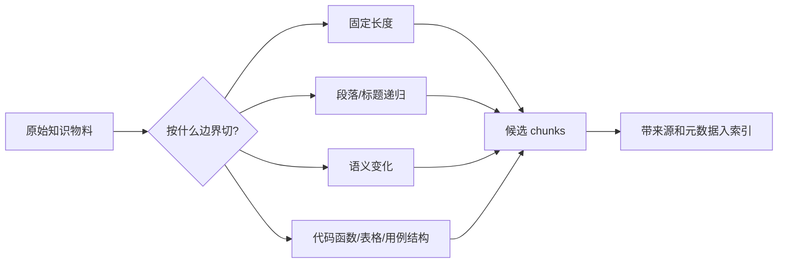

# 3. 文本分块：别让好资料输在切法上

> 模块：数据处理全流程  
> 建议学习时间：60 分钟

上一章我们把资料整理成知识物料，这一章要决定它们怎么被切开。分块看起来像预处理小事，实际很像给一本书做书签：书签太少，翻半天找不到句子；书签太碎，又看不懂上下文。RAG 的检索质量，很多时候从这里就已经被决定了。

## 本章目标
- 能解释为什么长文档必须切成 chunk。
- 能比较固定、递归、语义、结构化分块。
- 能理解 chunk_size 与 overlap 的取舍。
- 能为制度、代码、测试用例设计分块策略。

## 本章图解


## 核心知识点
### 1. 分块的目标不是切小，而是切得可被找回

长文档不能原样进入 RAG。输入太长会被截断，语义太杂会让向量表示变得模糊，引用范围太大也会让用户难以核对。

一个 chunk 应该尽量围绕一个相对完整的问题。比如“密码错误锁定规则”可以独立回答一个问题，而“登录 PRD 第 4-7 页”包含页面、接口、异常和埋点，主题太散。

先按资料类型决定边界。制度按条款，FAQ 按问答，代码按函数或组件，测试用例按前置条件、步骤、预期结果。切完后，每个 chunk 仍然要带来源、标题、版本和权限。

**放到真实场景里：**如果用户问“连续输错密码会怎样”，一个专门讲锁定规则的小 chunk 比一整节登录说明更容易被召回，也更容易被引用。

**容易踩的坑：**不要只盯着字数。两个 500 字 chunk 的质量可能完全不同，关键看它是否围绕一个可回答的问题。

### 2. chunk_size 和 overlap 是取舍，不是神奇参数

chunk 的目标大小决定每个检索单元容纳多少信息；overlap 让相邻块共享一部分内容，减少边界信息被切断。

块太大，主题混杂，embedding 会被稀释；块太小，规则和条件可能分离。overlap 可以救边界，但过多会增加重复内容，导致索引体积变大、召回结果互相挤占。

可以从经验值开始，而不是追求一次调准：短 FAQ 用较小块和少重叠；长制度按条款切，必要时保留上一条标题；代码示例按函数和注释切；测试用例按用例单元切。

**放到真实场景里：**退款政策里“7 天无理由”和“特殊商品除外”如果被切到两个完全不相邻的块，模型可能只看到前半句，给出不完整答案。

**容易踩的坑：**overlap 不是越大越安全。重叠过大时，检索结果里会出现一堆相似块，看似召回很多，实际信息密度下降。

### 3. 结构化资料要尊重原来的结构

Markdown 标题、HTML 节点、表格行列、代码函数、测试用例字段，本身就是作者留下的结构线索。

如果把表格压成一段普通文本，字段关系会变模糊；如果把代码函数从注释和示例中切开，用户问法和答案依据可能分离。结构化分块的优势，是尽量不破坏资料原有语义边界。

处理 Markdown 时保留标题路径；处理表格时保留表头和行上下文；处理代码时保留函数签名、注释和相邻示例；处理测试用例时保留前置条件、步骤、预期结果。

**放到真实场景里：**代码库助手回答“Button 组件 disabled 怎么用”时，需要组件说明、类型定义和示例代码一起出现，而不是只召回某一行 prop。

**容易踩的坑：**固定长度分块很容易做，但对企业文档未必够。越是高价值资料，越值得花时间做结构感知。

## 为什么大块明明包含答案，却还是检索失败

假设一个大 chunk 同时包含登录规则、退款规则和库存扣减。用户问“密码错误几次会锁定”，答案确实在这个块里，但这个块的向量表示会同时受三个主题影响，整体语义变得发散。检索时，它可能输给一个标题更接近但内容不完整的片段。

| 问题位置 | 大块带来的影响 | 更好的处理 |
| --- | --- | --- |
| 检索端 | 向量表示笼统，相关性得分下降 | 让每个 chunk 聚焦单一主题 |
| 生成端 | 无关内容进入上下文，模型分心 | 只提供回答所需资料 |
| 引用端 | 引用范围过大，用户难核对 | 引用到条款或用例级别 |
| 评测端 | 难定位是切分错还是检索错 | 记录 chunk id 和来源路径 |

### 分块失败会同时拖累检索和生成

检索找不到正确块，生成自然没法答；即使找到了，过大的上下文也会把答案埋在中间。很多所谓模型幻觉，根因其实是资料切得不好。

### 先让 chunk 可以回答一个小问题

检验分块质量的简单办法：拿一个 chunk 问自己，它能独立支撑一个明确问题吗？如果不能，可能太碎；如果能支撑十几个问题，可能太大。

#### 递归分块的核心思想

```js
function splitByStructure(text, maxSize) {
  const separators = ["\n## ", "\n### ", "\n\n", "。"];
  return recursiveSplit(text, separators, maxSize, { overlap: 80 });
}
```

#### 递归分块的核心思想

```java
List<String> splitByStructure(String text, int maxSize) {
  List<String> separators = List.of("\n## ", "\n### ", "\n\n", "。");
  return recursiveSplit(text, separators, maxSize, 80);
}
```

**Takeaway：**分块不是清洗后的机械切割，而是把资料整理成最适合被检索、引用、评测的小知识单元。

## 常见误区
- chunk_size 越大不等于越完整，可能只是更吵。
- overlap 不是保险丝，太多会制造重复噪声。
- 固定长度分块适合原型，不一定适合企业资料。
- 分块策略要跟资料类型绑定，不要一套参数打天下。

## 这一章可以先记住两个判断

好的分块让知识物料既保持语义完整，又足够聚焦。它不追求把文本切得平均，而是让系统在用户提问时更容易找到、引用和核对。

- 制度按条款，FAQ 按问答，代码按函数和示例，测试用例按用例结构。
- chunk_size 控制信息密度，overlap 控制边界连续性。
- 每个 chunk 都应该保留来源、标题路径、版本和权限。

有了 chunk，下一章就要把它们变成向量。也就是让机器能计算“这段资料和这个问题有多像”。

## 快速自测
1. chunk 太大的主要风险是什么？
   - A. 主题被稀释
   - B. 引用更精确
   - C. 成本归零
   - 答案：主题被稀释

2. overlap 的主要作用是什么？
   - A. 减少边界断裂
   - B. 替代权限
   - C. 训练模型
   - 答案：减少边界断裂

3. 代码资料更适合按什么切？
   - A. 函数和示例
   - B. 随机字数
   - C. 文件颜色
   - 答案：函数和示例

4. 分块后必须保留什么？
   - A. 来源元数据
   - B. 浏览器缓存
   - C. 按钮样式
   - 答案：来源元数据

## 练一下

为三类资料分别设计分块策略：客服制度、代码组件示例、测试用例文档。写出 chunk 边界、目标大小、overlap 和必须保留的元数据。

## 主要参考
- [Datawhale RAG 文本分块](https://github.com/datawhalechina/all-in-rag/blob/main/docs/chapter2/05_text_chunking.md)
- [RAG Best Practices](https://github.com/ali-bahrainian/RAG_best_practices)
- [内部 PDF：关于 RAG 优化的思考记录](../../../assets/关于%20RAG%20优化的思考记录.pdf)
