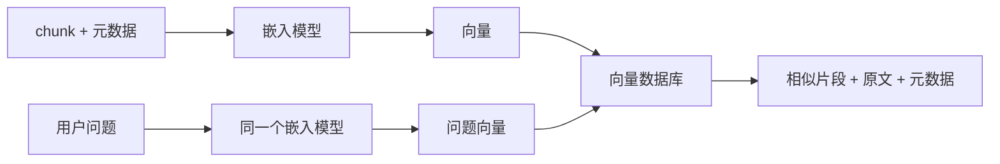

# 4. 向量嵌入与向量数据库：让资料可以被语义找到

> 模块：索引构建与优化  
> 建议学习时间：60 分钟

分块之后，我们得到很多知识小片段。但用户不会按片段标题提问，他们会用自然语言问：“退款多久到账？”“这个组件怎么禁用？”embedding 的作用，就是把问题和资料都转成可比较的数字表示，让系统能找到语义接近的内容。

## 本章目标
- 能解释 embedding 在 RAG 里的作用。
- 能说明向量数据库保存的不只是向量。
- 能理解相似度、索引、过滤、更新的基本关系。
- 能判断语义相似为什么不等于业务正确。

## 本章图解


## 核心知识点
### 1. embedding 像语义坐标，但不是业务判断

embedding 会把文本映射成向量。语义相近的句子，向量距离通常更近，比如“退款多久到账”和“退钱几天到”关键词不同，但意思接近。

这个能力让 RAG 不必完全依赖关键词。用户问法可以变化，系统仍然有机会找到相关资料。它解决的是“自然语言表达不一致”的问题。

入库时，每个 chunk 生成一个向量；查询时，用户问题也生成一个向量；系统计算问题向量与资料向量的距离，返回最相似的候选片段。

**放到真实场景里：**客服知识库里，用户说“退钱什么时候到”，制度写的是“退款到账时效”，embedding 能把两者联系起来。

**容易踩的坑：**语义相似不等于业务适用。旧版政策和新版政策也很像，内部手册和公开文档也很像，这些必须靠元数据过滤。

### 2. 向量数据库保存向量，也保存可追溯的上下文

很多人听到向量数据库，以为里面只有一串数字。实际 RAG 需要保存向量、原文、来源、页码、标题、版本、权限、业务域等信息。

向量负责找相似，原文负责生成答案，元数据负责过滤、引用、权限和评测。只保存向量，系统无法回答“这个答案来自哪里”。

常见记录结构是 id、vector、content、metadata。metadata 里至少包含 source、title、version、domain、permission、updated_at、chunk_path。

**放到真实场景里：**生成测试用例时，系统可以先过滤 domain=login 和 doc_type=test_case，再做向量检索，避免召回无关客服政策。

**容易踩的坑：**不要把向量库当成普通文件夹。没有更新、删除、版本替换策略，知识库很快就会堆满旧资料。

### 3. 索引优化是在召回、延迟、成本、更新之间做平衡

索引让向量搜索更快，但不同索引策略会影响速度、召回率和资源成本。数据量小的时候简单方案够用，数据量大时才需要复杂优化。

企业 RAG 通常同时关心四件事：正确资料能不能找到，用户等多久，存储和计算花多少钱，资料更新后能不能快速生效。

可以从小规模精确搜索开始，再根据数据量引入近似索引；用元数据过滤减少候选范围；用批量入库降低成本；用增量更新替代全量重建。

**放到真实场景里：**一个 500 篇 FAQ 的知识库不需要复杂索引；一个跨产品、跨权限、上百万片段的企业库，就要认真设计索引和过滤策略。

**容易踩的坑：**不要只追求速度。检索很快但找不对资料，业务上等于没用。

## 语义相似为什么会骗过你

向量检索擅长找意思像的内容，但企业问答关心的是“这个内容对当前用户、当前版本、当前场景是否可用”。相似度只是候选依据，不是最终答案。

| 看起来相似的资料 | 潜在问题 | 应该加的控制 |
| --- | --- | --- |
| 2025 退款规则 vs 2026 退款规则 | 旧规则污染答案 | version / effective_from |
| 客服内部手册 vs 用户公开帮助 | 权限越界 | permission / audience |
| 移动端登录 vs 管理后台登录 | 场景错配 | domain / product |
| 历史缺陷 vs 当前修复说明 | 状态不明 | status / fixed_version |

### 先过滤，再相似度检索

更稳的顺序通常是：先用权限、版本、业务域缩小范围，再在范围内做向量或关键词检索。这样系统不是在整个知识海里捞针，而是在正确的池子里找鱼。

### 相似度分数不是质量分数

分数高只说明文本表达相近，不说明资料新、权威、可见、完整。上线前要用评测集观察命中率和引用质量，不能只看单次分数。

#### 带过滤条件的向量检索

```js
const results = await vectorDb.search({
  vector: await embed(question),
  topK: 12,
  filter: {
    domain: "login",
    version: "2026Q1",
    permission: { in: user.permissions }
  }
});
```

#### 带过滤条件的向量检索

```java
SearchRequest request = SearchRequest.builder()
  .vector(embed(question))
  .topK(12)
  .filter(Map.of(
    "domain", "login",
    "version", "2026Q1",
    "permission", user.permissions()
  ))
  .build();
```

**Takeaway：**embedding 帮你找到“像”的资料，元数据帮你判断“该不该用”。企业 RAG 两者缺一不可。

## 常见误区
- embedding 不是理解万物，它只是语义表示。
- 向量数据库不只存向量，还要存原文和元数据。
- 相似度高不代表资料适用于当前用户。
- 索引优化不只是提速，也要关注召回和更新。

## 把向量想成一张语义地图

第四章解决的是“机器怎么按意思找资料”。chunk 被转成向量后，系统可以用相似度找到候选片段；但企业场景还必须叠加版本、权限、业务域这些硬条件。

- embedding 让自然语言问法可以和资料语义对齐。
- 向量数据库要同时保存 vector、content、metadata。
- 语义检索必须和元数据过滤配合使用。

下一章会把这张地图扩展到图片、表格、截图和多模态资料，因为企业知识从来不只躺在纯文本里。

## 快速自测
1. embedding 主要解决什么？
   - A. 语义匹配
   - B. 页面配色
   - C. 用户登录
   - 答案：语义匹配

2. 向量库中 content 用来做什么？
   - A. 生成上下文
   - B. 压缩图片
   - C. 重启服务
   - 答案：生成上下文

3. 旧版和新版政策应靠什么区分？
   - A. 版本元数据
   - B. 字体大小
   - C. 随机排序
   - 答案：版本元数据

4. 检索很快但找错资料说明什么？
   - A. 质量仍不够
   - B. 系统已完美
   - C. 无需评测
   - 答案：质量仍不够

## 练一下

设计一条向量库记录结构，包含 id、content、vector、metadata。metadata 至少写出 8 个字段，并说明哪个字段用于权限、哪个用于版本、哪个用于引用。

## 主要参考
- [Datawhale RAG 向量嵌入](https://github.com/datawhalechina/all-in-rag/blob/main/docs/chapter3/06_vector_embedding.md)
- [Datawhale RAG 向量数据库](https://github.com/datawhalechina/all-in-rag/blob/main/docs/chapter3/08_vector_db.md)
- [Datawhale RAG 索引优化](https://github.com/datawhalechina/all-in-rag/blob/main/docs/chapter3/10_index_optimization.md)
- [OpenAI Embeddings 文档](https://developers.openai.com/api/docs/guides/embeddings)
