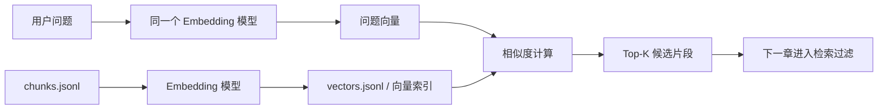

# 第 5 章：Embedding 和向量索引：把文字放进可搜索的语义空间

上一章，我们已经把文档切成了 chunk。现在问题来了：用户不会总按资料原文提问。资料里写的是“优惠券抵扣部分需要扣减”，用户问的可能是“用了券还能退全款吗”。只靠关键词，系统有时能碰上，有时就错过。第 5 章要做的事，就是把 chunk 和问题都变成向量，再用相似度把它们找回来。

## 这一章要把“能切”推进到“能搜”

- 解释向量相似度
- 理解同一模型空间
- 搭建本地向量索引
- 设计可替换接口

## 先看关键词检索的尴尬时刻

假设 chunk 里写着：“已经使用优惠券的订单，需要按优惠券规则扣减。”用户问：“用了券还能退全款吗？”这两个句子明明在问同一件事，但关键词重合并不多。

#### 先看一个 chunk 进入向量索引后的样子

```javascript
const vectorRecord = {
  id: "refund-policy#2026-01#chunk-001",
  document_id: "refund-policy#2026-01",
  source: "data/raw/refund-policy.md",
  title: "会员退款制度",
  section_path: ["年度会员退款"],
  permission: "support",
  version: "2026-01",
  text: "年度会员购买后 7 天内可申请退款。已经使用优惠券的订单，需要按优惠券规则扣减。",
  embedding_model: "mock-hash-embedding-v1",
  embedding: [0.12, -0.04, 0.31, 0.08]
};

// 真实项目里的 embedding 维度通常会高得多，可能是几百到几千维。
// 课程里先用短向量示意，重点是看懂它和原始 chunk 的关系。
```

## 理解向量，有一个小技巧

可以把每个 chunk 想成地图上的一个点。问“优惠券退款”，它会落在退款制度附近；问“发票抬头填错”，它会落在发票 FAQ 附近。



## 技巧一：先做教学版 embedding，别一上来接 API

mock embedding 不是拿来证明检索效果的，它是拿来证明链路形状的。

#### src/embedding/text-features.js：先把文字切成稳定的小特征

```javascript
export function normalizeForEmbedding(text) {
  return text
    .toLowerCase()
    .replace(/[\r\n]+/g, " ")
    .replace(/[，。！？、,.!?;；:：()（）"“”]/g, " ")
    .replace(/\s+/g, " ")
    .trim();
}

export function charWindows(text, size = 2) {
  const normalized = normalizeForEmbedding(text);
  const compact = normalized.replace(/\s+/g, "");
  const windows = [];

  for (let index = 0; index <= compact.length - size; index += 1) {
    windows.push(compact.slice(index, index + size));
  }

  // 文本太短时，至少保留原文。否则空向量会让相似度计算失去意义。
  return windows.length ? windows : [compact || "__empty__"];
}
```

#### src/embedding/mock-embedding.js：教学用 embedding，不假装它很聪明

```javascript
import { createHash } from "node:crypto";
import { charWindows } from "./text-features.js";

const DIMENSIONS = 64;
const MODEL_NAME = "mock-hash-embedding-v1";

function bucketForToken(token) {
  const hash = createHash("sha256").update(token).digest();
  return hash.readUInt32BE(0) % DIMENSIONS;
}

function normalizeVector(vector) {
  const length = Math.sqrt(vector.reduce((sum, value) => sum + value * value, 0));
  if (!length) return vector;
  return vector.map((value) => Number((value / length).toFixed(6)));
}

export function embedTextMock(text) {
  const vector = Array.from({ length: DIMENSIONS }, () => 0);

  for (const token of charWindows(text, 2)) {
    vector[bucketForToken(token)] += 1;
  }

  return {
    model: MODEL_NAME,
    dimensions: DIMENSIONS,
    embedding: normalizeVector(vector)
  };
}

export function embedManyMock(texts) {
  return texts.map((text) => embedTextMock(text));
}
```

## 技巧二：相似度不是“包含关系”，而是方向关系

关键词搜索像是在问：“你有没有这个词？”向量搜索更像是在问：“你们的方向像不像？”

#### src/vector/math.js：余弦相似度其实就是看两个方向像不像

```javascript
export function cosineSimilarity(left, right) {
  if (left.length !== right.length) {
    throw new Error("向量维度不一致，不能计算相似度。");
  }

  let dot = 0;
  let leftLength = 0;
  let rightLength = 0;

  for (let index = 0; index < left.length; index += 1) {
    dot += left[index] * right[index];
    leftLength += left[index] * left[index];
    rightLength += right[index] * right[index];
  }

  const denominator = Math.sqrt(leftLength) * Math.sqrt(rightLength);
  return denominator === 0 ? 0 : dot / denominator;
}
```

## 技巧三：向量索引不是只存一串数字

每条记录除了 embedding，还要保留 title、source、section_path、permission、version 和 text。

#### src/vector/build-vector-index.js：把 chunks.jsonl 转成 vectors.jsonl

```javascript
import { mkdir, readFile, writeFile } from "node:fs/promises";
import { join } from "node:path";
import { embedTextMock } from "../embedding/mock-embedding.js";

const inputFile = "data/processed/chunks.jsonl";
const outputDir = "data/index";
const vectorFile = join(outputDir, "vectors.jsonl");
const manifestFile = join(outputDir, "vector-index-manifest.json");

function toVectorRecord(chunk) {
  const result = embedTextMock([
    chunk.title,
    chunk.section_path.join(" / "),
    chunk.text
  ].join("\n"));

  return {
    id: chunk.id,
    document_id: chunk.document_id,
    source: chunk.source,
    title: chunk.title,
    section_path: chunk.section_path,
    permission: chunk.permission,
    version: chunk.version,
    text: chunk.text,
    embedding_model: result.model,
    embedding: result.embedding
  };
}

export async function buildVectorIndex() {
  const lines = (await readFile(inputFile, "utf8")).trim().split("\n").filter(Boolean);
  const chunks = lines.map((line) => JSON.parse(line));
  const records = chunks.map(toVectorRecord);

  await mkdir(outputDir, { recursive: true });
  await writeFile(vectorFile, records.map((record) => JSON.stringify(record)).join("\n") + "\n", "utf8");
  await writeFile(
    manifestFile,
    JSON.stringify({
      input: inputFile,
      output: vectorFile,
      count: records.length,
      model: records[0]?.embedding_model || "unknown",
      dimensions: records[0]?.embedding.length || 0
    }, null, 2),
    "utf8"
  );

  return { count: records.length, vectorFile, manifestFile };
}

if (import.meta.url === "file://" + process.argv[1]) {
  const result = await buildVectorIndex();
  console.log("已生成 " + result.count + " 条向量记录：" + result.vectorFile);
}
```

## 技巧四：先全量扫描，确认排序真的发生了

如果只有几十个 chunk，没必要一开始就搬出向量数据库。全量扫描能把问题向量生成、权限过滤、相似度计算、按分数排序摊开。

#### src/vector/search-vector-index.js：先做最朴素的全量扫描

```javascript
import { readFile } from "node:fs/promises";
import { embedTextMock } from "../embedding/mock-embedding.js";
import { cosineSimilarity } from "./math.js";

const vectorFile = "data/index/vectors.jsonl";

function canRead(record, role) {
  const visible = {
    public: ["public"],
    support: ["public", "support"],
    "support-lead": ["public", "support", "support-lead"],
    internal: ["public", "support", "support-lead", "internal"]
  };

  return (visible[role] || visible.public).includes(record.permission);
}

export async function searchVectorIndex(query, { topK = 5, role = "support" } = {}) {
  const queryEmbedding = embedTextMock(query).embedding;
  const records = (await readFile(vectorFile, "utf8"))
    .trim()
    .split("\n")
    .filter(Boolean)
    .map((line) => JSON.parse(line));

  return records
    .filter((record) => canRead(record, role))
    .map((record) => ({
      ...record,
      score: cosineSimilarity(queryEmbedding, record.embedding)
    }))
    .sort((left, right) => right.score - left.score)
    .slice(0, topK)
    .map((record) => ({
      id: record.id,
      title: record.title,
      section_path: record.section_path,
      permission: record.permission,
      score: Number(record.score.toFixed(4)),
      text: record.text
    }));
}

if (import.meta.url === "file://" + process.argv[1]) {
  const query = process.argv.slice(2).join(" ") || "用了优惠券还能退全款吗";
  console.log(JSON.stringify(await searchVectorIndex(query), null, 2));
}
```

## 真实 embedding 怎么接？只替换 adapter

#### src/embedding/openai-compatible.js：真实 embedding adapter 只替换边界

```javascript
const endpoint = process.env.EMBEDDING_API_URL || "https://api.openai.com/v1/embeddings";
const model = process.env.EMBEDDING_MODEL || "text-embedding-3-small";

export async function embedTextOpenAICompatible(text) {
  if (!process.env.EMBEDDING_API_KEY) {
    throw new Error("缺少 EMBEDDING_API_KEY。教学项目默认走 mock embedding。");
  }

  const response = await fetch(endpoint, {
    method: "POST",
    headers: {
      "content-type": "application/json",
      authorization: "Bearer " + process.env.EMBEDDING_API_KEY
    },
    body: JSON.stringify({
      model,
      input: text
    })
  });

  if (!response.ok) {
    const detail = await response.text();
    throw new Error("Embedding API 调用失败：" + response.status + " " + detail);
  }

  const payload = await response.json();
  const embedding = payload.data?.[0]?.embedding;

  if (!Array.isArray(embedding)) {
    throw new Error("Embedding API 返回格式不符合预期。");
  }

  return {
    model,
    dimensions: embedding.length,
    embedding
  };
}
```

#### package.json：补上 index 和 search 命令

```json
{
  "scripts": {
    "ingest": "node src/ingest/build-corpus.js",
    "chunk": "node src/chunk/build-chunks.js",
    "index": "node src/vector/build-vector-index.js",
    "search": "node src/vector/search-vector-index.js",
    "check:index": "npm run ingest && npm run chunk && npm run index && npm run search -- 用了优惠券还能退全款吗"
  }
}
```

## 练一下

运行 `npm run check:index`。然后分别搜索 `年度会员退款`、`用了券还能退全款吗`、`发票抬头错了怎么办`。观察分数和命中片段：mock embedding 能让链路跑通，但它并不理解真正语义，这个差距要记住。

## 快速自测

- 为什么查询和 chunk 要用同一个 embedding 模型？ 答案：向量空间一致。不同模型生成的向量不在同一个语义空间里，拿来直接比较没有意义。
- mock embedding 在本课程里主要用来做什么？ 答案：验证链路形状。mock 版本不追求真实效果，它帮助我们先把索引、搜索、过滤和验收跑通。
- 向量索引里为什么还要保留 text 和 metadata？ 答案：方便引用过滤。搜索命中的是向量记录，但回答和权限判断仍然要依赖原文、来源和权限字段。

## 本章参考资料

- [OpenAI Docs: Vector embeddings](https://developers.openai.com/api/docs/guides/embeddings)：用于解释 embedding、语义相似度和向量检索。
- [Datawhale All-in-RAG: 向量嵌入](https://github.com/datawhalechina/all-in-rag/blob/main/docs/chapter3/06_vector_embedding.md)：社区教程，用于 embedding 和检索基础。
- [Datawhale All-in-RAG: 向量数据库](https://github.com/datawhalechina/all-in-rag/blob/main/docs/chapter3/08_vector_db.md)：社区教程，用于索引和向量库选型。
