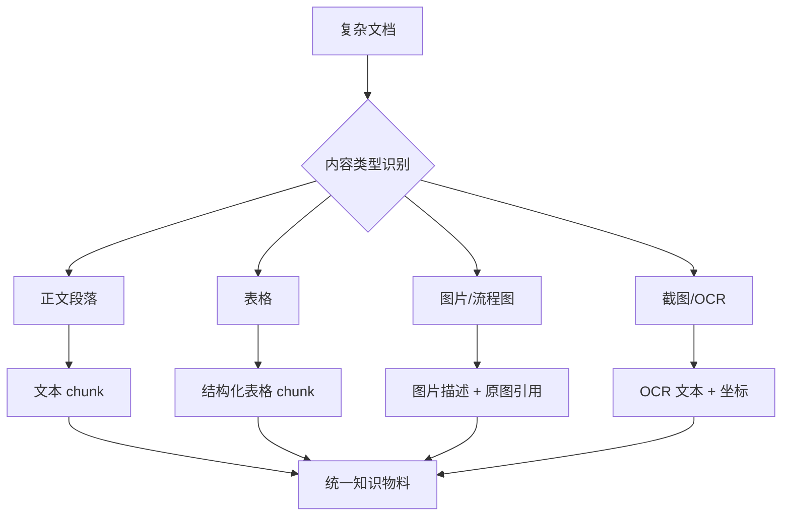

# 5. 多模态文档理解：PDF、表格、图片和截图如何进入 RAG

> 模块：索引构建与优化  
> 建议学习时间：60 分钟

真实企业资料很少是干净 Markdown。它可能是一份扫描 PDF、一张流程图、一个产品截图、一张接口表格，甚至是一段带注释的代码截图。如果系统只会读纯文本，就会漏掉很多关键知识。

## 本章目标
- 能解释多模态 RAG为什么重要。
- 能区分文本、表格、图片、截图的处理方式。
- 能理解 OCR、版面解析、图片描述和表格结构保留。
- 能设计一个文档理解入库流程。

## 本章图解

## 核心知识点
### 1. 多模态不是炫技，而是避免资料缺页

很多关键规则藏在表格、截图和流程图里。只抽正文会让知识库看起来很大，实际缺少最重要的部分。

比如接口错误码表、审批流程图、登录异常截图、测试用例 Excel，这些资料如果被简单转成散乱文本，字段关系和视觉含义都会丢失。

入库时先识别内容类型：正文用文本解析，表格保留行列和表头，图片生成可引用的说明，扫描件先 OCR，复杂版面保留页码和坐标。

**放到真实场景里：**生成测试用例时，错误码表决定异常场景；如果表格列关系丢了，模型可能把错误码、提示文案和处理动作拼错。

**容易踩的坑：**不要只看解析后有没有文字。要检查文字是否保留了原来的结构关系。

### 2. 表格要保留关系，不要压成一坨话

表格的价值在行列关系。字段名、枚举值、错误码、适用条件，往往靠列头才能解释清楚。

如果把表格直接按行拼成自然语言，检索时可能还能召回，但生成时容易把不同列的含义混在一起。更好的做法是让每个表格 chunk 保留表头、行号、标题和来源。

可以把表格转成 Markdown 表格、JSON 行对象，或者“表头 + 当前行 + 说明”的结构。关键是让模型能看懂每个单元格属于哪一列。

**放到真实场景里：**接口文档里的 required、type、default、description 如果丢了列名，模型很容易编造字段约束。

**容易踩的坑：**不要为了追求纯文本统一，把表格结构洗掉。RAG 不是只能吃自然语言。

### 3. 图片和截图要同时保留描述与原始位置

图片可以生成文字说明，但说明不应替代原图。复杂流程图、界面截图、架构图，都需要保留原始文件位置以便核验。

图片描述解决检索问题：用户问“审批流程怎么走”，系统能召回流程图说明。原图位置解决核验问题：用户可以点回来源确认节点和箭头。

常见做法是：给图片生成 caption 或 summary；记录 page、bbox、image_id；必要时把图中 OCR 文本、视觉描述和上下文标题合并成知识物料。

**放到真实场景里：**产品截图中“账号锁定提示文案”可能没有出现在正文里，但 OCR 能抽出提示文案，图片描述能说明它出现在哪个页面状态。

**容易踩的坑：**不要让视觉模型的描述变成唯一事实。图片描述也可能漏看或误读，必须保留原始引用。

## 一份 PDF 进入知识库前，最好先过一次“体检”

PDF 是 RAG 里最容易制造假象的资料：文件看起来完整，解析后却可能少表格、乱顺序、漏页眉、把两栏文字串错。一个可靠流程会先做版面识别，再按内容类型分别处理。

| 检查项 | 常见问题 | 处理方式 |
| --- | --- | --- |
| 文字层 | 扫描件没有可选中文本 | OCR 并记录置信度 |
| 阅读顺序 | 多栏排版串行错误 | 版面解析后按区块排序 |
| 表格 | 行列被打散 | 保留表头和行对象 |
| 图片 | 流程图被忽略 | 生成描述并保留原图引用 |
| 页码 | 引用无法定位 | 记录 page 和 bbox |

### 复杂资料要分类型处理

正文、表格、图片、代码块的最佳处理方式不同。统一入口可以有，但处理策略不能只有一种。

### 质量抽检比工具选择更重要

工具再好也会解析错。每批复杂文档入库后，都应该抽几页核对：正文顺序、表格结构、图片说明、引用位置是否可信。

**Takeaway：**多模态 RAG 的目标不是“什么都能读”，而是让复杂资料变成可检索、可引用、可核验的知识物料。

## 常见误区
- OCR 出文字不代表理解正确。
- 图片描述不能替代原始图片引用。
- 表格不要无脑转成普通段落。
- 多模态不是第一天就必须上，但复杂企业文档迟早会遇到。

## 把文档当成一个小系统来读

第五章补齐了纯文本之外的世界。企业资料里，正文、表格、图片、截图和代码块各自承载不同信息，入库时要尊重它们的结构。

- 表格保留行列关系。
- 图片生成描述，也保留原图引用。
- 扫描件需要 OCR 和置信度检查。
- 复杂 PDF 要抽检阅读顺序和页码定位。

资料终于能较完整地进入索引了。下一章，我们开始讨论用户提问时怎么把正确资料找回来。

## 快速自测
1. 表格入库最该保留什么？
   - A. 行列关系
   - B. 背景颜色
   - C. 文件图标
   - 答案：行列关系

2. 图片描述之外还要保留什么？
   - A. 原图引用
   - B. 随机摘要
   - C. 按钮颜色
   - 答案：原图引用

3. 扫描 PDF 通常先需要什么？
   - A. OCR 处理
   - B. 直接删除
   - C. 微调模型
   - 答案：OCR 处理

4. PDF 多栏排版容易出什么问题？
   - A. 阅读顺序错
   - B. 引用更准
   - C. 成本归零
   - 答案：阅读顺序错

## 练一下

找一份包含正文、表格、截图的产品文档，设计入库字段：每类内容怎样解析、怎样生成 chunk、怎样保留引用位置。

## 主要参考
- [Datawhale RAG 多模态嵌入](https://github.com/datawhalechina/all-in-rag/blob/main/docs/chapter3/07_multimodal_embedding.md)
- [内部 PDF：大模型生码的原理与 RAG 工程实践](../../../assets/大模型生码的原理与%20RAG%20工程实践.pdf)
- [RAG 从入门到实战完整教程](https://rag.deeptoai.com/docs)
